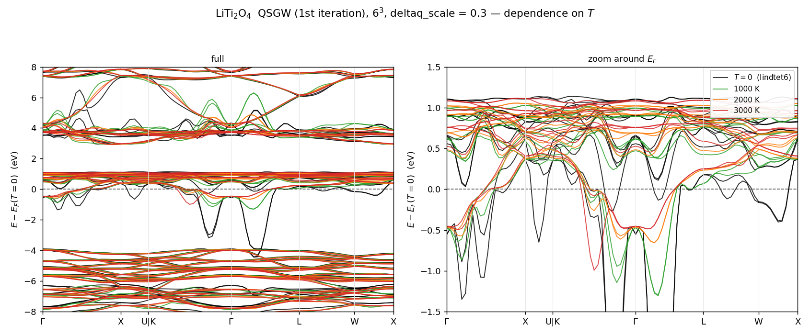
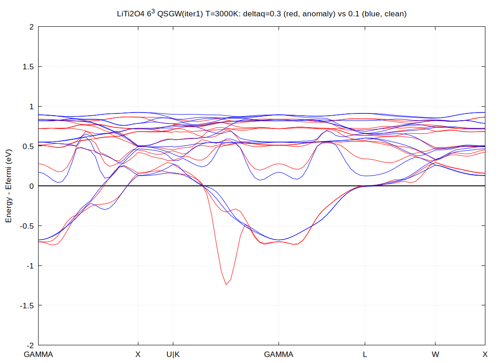
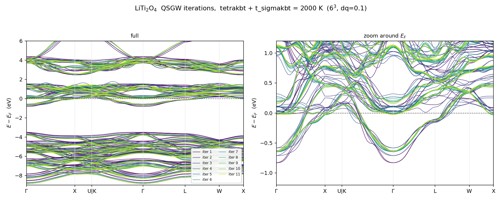
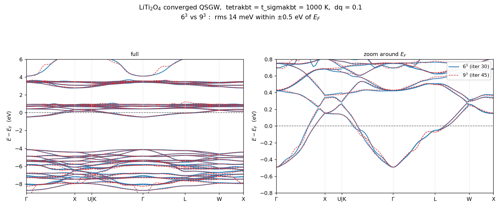
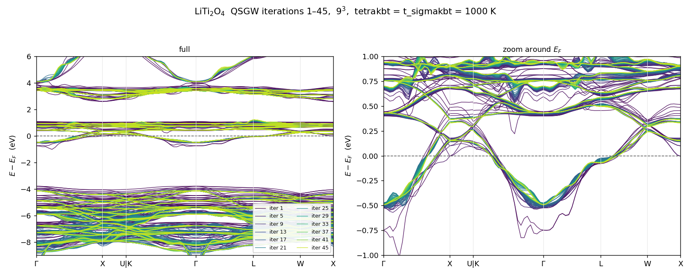
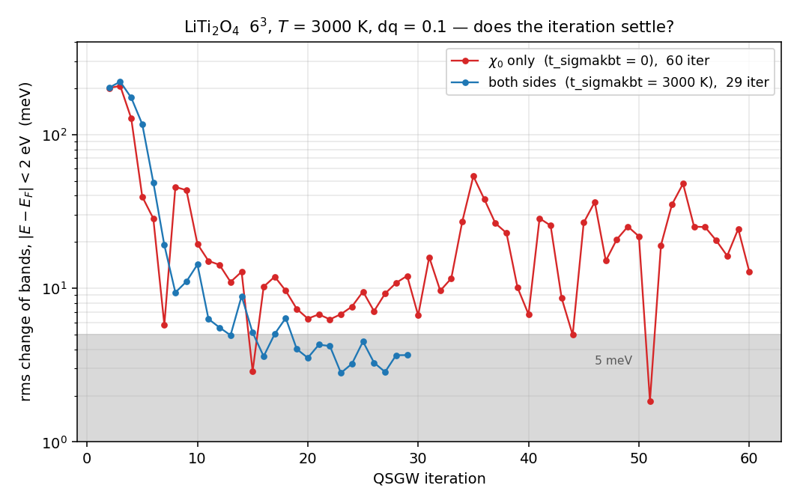
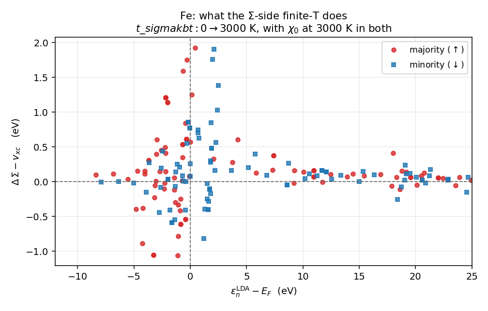

# kBT の記録 — 2026-06〜09 の経緯と当時の計算

[kBT](../ecaljdoc/manual/kBT) はいまの仕様を書いた頁で、ここはその前の説明と、直した誤りの記録である。**キーの名前と解釈は当時のもの**で、
いまは使えないもの(`tetrakbt = true`、`t_sigmakbt`、`esmr`、`SmearX0`)、後で否定された説明(ネスティング、`deltaq_scale`)を含む。
それぞれの節の冒頭の注に、いまの理解を書いてある。キーの変遷は kBT §2.5 の表 2、時刻入りの研究ログは ecalj の [`MD/research_log.md`](research_log.md)。
式の番号は kBT の頁のもの(2026-09-30 の番号)。

| 節 | 中身 | もとの場所(2026-09-29 までの kBT の頁) |
|---|---|---|
| 1 | 2026-06 の理解「なぜ要るか」 | §1 |
| 2 | 温度を上げると何が直るか、`deltaq_scale` | §4 の後半 |
| 3 | 2026-06 の計算(LiTi₂O₄、Fe)の説明 | §5 |
| 4 | $\Sigma$ 側の状態の窓が `esmr` のままだった件 | §7.3 |
| 5 | core の交換 (CoreEx) の 2 つの誤り | §7.5 |
| 6 | 2026-09-17 の課題の一覧と、その後 | §9 |
| 7 | 頁の冒頭にあった変更の記録 | 冒頭 |

---

## 1. 2026-06 の理解「なぜ要るか」

> **2026-09-28 の注**: この節は 2026-06 の理解で書いてある。荒れの正体は §3.5(第一殻 $q$ の $W$ のプラズモン極を $\Sigma_c$ の
> 実軸極項が踏む)で、ネスティングの兆候は無かった(研究ログ 2026-09-22 01:40)。`t_tetrakbt > 0` は物理の温度であって荒れの特効薬ではなく、
> 荒れには `wcsmear`(既定)、$W$ 側の平滑化には `t_tetrakbt < 0`(以前の `SmearX0`)を使う(冒頭の「実用の設定」)。

金属の QSGW は、k メッシュが Fermi 面の鋭い応答(ネスティング)を解像すると
反復ごとに振動しうる。テトラヘドロン法は Fermi 面を「厳密に」標本化するので
$W$ に鋭い小 $q$ 構造が立ち、$\Sigma$ が毎反復の Fermi 面のずれに強く反応する。

**電子温度で Fermi 面を広げるのが根本的な正則化**である。
$\mathrm{Im}\,\chi_0$ を $\omega$ 方向に平滑化する `t_tetrakbt < 0`(以前の `SmearX0`)は症状だけを扱う
対症療法で、こちらとは別物である(通常は不要。2026-09-19 に実体が判明した
「極踏み」には §3.5 の `wcsmear` を使う)。

実測では LiTi₂O₄(金属スピネル)で、**$6^3$ と $9^3$ のメッシュ依存が小さくなり**、
QSGW が安定した(1000 K で $E_F$ の $\pm0.5$ eV 以内 rms 13.8 meV。消えたと
言い切るには不満が残る点は §5.3 の末尾に挙げた。
§5.3 に図と数値、
§5.2 に反復ごとの PDF)。

---

## 2. 温度を上げると何が直るか、`deltaq_scale`(2026-06)

LiTi₂O₄ の QSGW 第 1 反復を $T$ だけ変えて重ねたもの
(いずれも $6^3$、`deltaq_scale = 0.3`。共通の静電ゼロで揃え、$T=0$ の
$E_F$ を原点に取った)。



*図をクリックすると拡大する。*


> **2026-09-28 の注**: この小節の「$q\to0$ head の破綻」と、下の「`deltaq_scale` が大きすぎる」という説明は 2026-06 のもので、後で否定された。
> $T=0$ の落ち込みも 3000 K の K–Γ のスパイクも、第一殻 $q$ の $W$ のプラズモン極を $\Sigma_c$ の実軸極項が踏むことによるもので、
> `deltaq_scale` で変わったのは極踏みの当たり外れ(研究ログ 2026-09-18 23:05、2026-09-19 09:55。§3.5)。いまは `wcsmear`(既定)で均す。

$T=0$($T=0$ テトラヘドロン `lindtet6`、黒)では Ti-3d $t_{2g}$ 帯が
Γ–L 上で **−3.9 eV まで落ち込む**。これは分散ではなく $q\to0$ head の破綻で、
温度を上げると単調に消える:

| $T$ | Γ–L 上 ($x\approx2.7$) の $t_{2g}$ 帯の底 |
|---|---|
| 0 (`lindtet6`) | −3.91 eV |
| 1000 K | −1.31 eV |
| 2000 K | −0.66 eV |
| 3000 K | −0.50 eV |

**これが有限温度を入れる理由である。** ただし $T\to0$ で method B′ が
`lindtet6` に厳密に戻ること自体は変わらない($T=0$ が壊れているのは
テトラヘドロン法ではなく、その上での金属の $q\to0$ の扱いのほうである)。

### 高温では `deltaq_scale` を小さく取ること

上の図の 3000 K(赤)は Γ–L では収まっているのに、**K–Γ の中央に
別のスパイクが残る**。これは `deltaq_scale`(offset-Gamma の $q_0$ head の
シフト量)が大きすぎるためで、**温度の問題ではない**。同じ 3000 K で
`deltaq_scale` を 0.3 から 0.1 に下げると消える:



赤 = `deltaq_scale = 0.3`(K–Γ 中央に −1.24 eV のスパイク)、
青 = `deltaq_scale = 0.1`(消える)。$6^3$、$T$ = 3000 K、QSGW 第 1 反復。


つまり **`tetrakbt` / method B′ 本体の問題ではなく、offset-Gamma の
$q\to0$ head が高温 × 大きい `deltaq` で破綻する**。
高い $T$ を使うときは `deltaq_scale` も併せて小さくすること。

---

## 3. 2026-06 の計算の説明

[`ecalj/Samples/kBT/`](../Samples/kBT/README.md) に**収束した計算一式**(入力と結果)がある。物質ごとに
`LiTi2O4/`(66 MB)と `Fe/`(0.8 MB)に分かれている。GW を何十回も反復するので
計算が重く、`testecalj` のターゲットにはしていない。
**手法が何を変えるかを、収束した結果そのもので見るためのもの。**

`LiTi2O4/` の 3 つの run:

| ディレクトリ | k メッシュ | $T$ | 反復 | `t_sigmakbt`(当時のキー。今は `t_sigmaw`) | 何のため |
|---|---|---|---|---|---|
| `n666_T2000/` | $6^3$ | 2000 K | 11 | 2000 K | 標準。反復が収束していく様子 |
| `n666_T1000/` | $6^3$ | 1000 K | 30 | 1000 K | ↓ とペアでメッシュ依存を見る |
| `n999_T1000/` | $9^3$ | 1000 K | 45 | 1000 K | ↑ とペア。**これが重い計算** |
| `n666_T3000/` | $6^3$ | 3000 K | 29 | 3000 K | ↓ とペアで $\Sigma$ 側の有無を見る |
| `n666_T3000_chi0only/` | $6^3$ | 3000 K | 60 | **0** | ↑ とペア。**収束しない** |

いずれも `deltaq_scale = 0.1`。最後の 1 つだけ $\Sigma$ 側を $T=0$ に置き去りにしてある。

### (旧 §5.1) 反復の収束 ($6^3$, 2000 K)



QSGW 反復 1(紫)から 11(黄)まで。反復 3–4 以降は $E_F$ 近傍でも線が重なり、
金属にもかかわらず振動せずに収束している。

---

### (旧 §5.2) パラパラマンガ — $6^3$ と $9^3$ が反復で近づいていく

**[bands_iterations_T1000.pdf](../ecaljdoc/public/kBT/bands_iterations_T1000.pdf)**(45 ページ、4 MB)

1 ページ = 1 反復。青が $6^3$、赤破線が $9^3$。ページを送ると

- 反復 1 では $6^3$ と $9^3$ が**大きく食い違っている**(メッシュ依存が出ている)
- 反復が進むにつれて両者が近づき、最後には重なる
- $6^3$ は反復 30 で止めたので、それ以降は収束値を薄い青で参照として残してある

PDF ビューアでページを送れば動画として見える。

---

### (旧 §5.3) メッシュ依存が消えていること (1000 K)



収束した $6^3$(反復 30)と $9^3$(反復 45)の重ね描き。差は

| 範囲 | rms | 最大 |
|---|---|---|
| $\lvert E-E_F\rvert < 0.5$ eV | 13.8 meV | 54 meV |
| $\lvert E-E_F\rvert < 2$ eV | 23.3 meV | 265 meV |
| $\lvert E-E_F\rvert < 10$ eV | 75.4 meV | 940 meV |

静電ゼロから測った Fermi 準位 $E_F-V_\mathrm{esav}$ は $6^3$ が 6.76420 eV、
$9^3$ が 6.76424 eV で、**0.05 meV しか違わない**。

反復ごとの残差($6^3$ の 29→30 で $E_F$ 近傍 rms 1.4 meV、$9^3$ の 44→45 で
0.70 meV)より上の差のほうが大きいので、13.8 meV は反復ノイズではなく本当の
メッシュ差である。それでも d バンドの議論には十分小さい。

#### ただし「消えた」と言い切るには不満が残る

この対で言えているのは「**1000 K で $6^3$ と $9^3$ が $E_F$ 近傍 10 meV 台まで
近づいた**」であって、それ以上ではない。

- **0 ではない。** $\pm2$ eV で 23 meV、$\pm10$ eV では rms 75 meV・最大 940 meV。
  深い O-2p 帯は数百 meV 違う。しかも上に書いたとおり反復残差の 10–20 倍あるので、
  **分解できてしまっている**差である。
- **メッシュが 2 つしかない。** $9^3$ 自身が収束しているのか、残り 13.8 meV が
  どちらの誤差なのかは分からない。$12^3$ が無いので外挿もできない。
- **反復数が 30 と 45 で違い、収束判定ではなく手で止めている。** $6^3$ のほうが
  残差が大きい(1.4 対 0.70 meV)ので、13.8 meV のいくらかはそれ由来かもしれない。
- **$E_F$ の 0.05 meV 一致は見かけほど強くない。** 両 run とも lmf は
  `nkabc` = $16^3$ で、band ステップの $E_F$ も $16^3$ で決めている
  (`efermi.lmf` の `Used k point to determine Ef: 16 16 16`)。GW メッシュが入るのは
  `sigm` 経由だけなので、これは BZ サンプリングの独立な検証にはなっていない。
- **温度は 1000 K の 1 点だけ。** 「$T$ を上げるほどメッシュ依存が減る」という
  主張そのものは、この対では確かめていない($9^3$ の 3000 K が無い。
  §5.6)。
- **`deltaq_scale` は両方 0.1 固定。** offset-Gamma head は別系統の $q$ 依存で、
  そこは振っていない。

$9^3$ 単独の反復の重ね描きは以下。45 反復かかっているが、$E_F$ 近傍は
10 反復あたりでほぼ決まっている。



---

置いてあるもの:

| | |
|---|---|
| `LiTi2O4/input/` | 3 run 共通の `PB` / `syml` と LDA 収束済みの `rst` |
| `LiTi2O4/<run>/ctrlg.liti2o4.toml` | run ごとの入力 |
| `LiTi2O4/<run>/results/EFERMI`, `EFERMI_kbt` | $T=0$ と有限温度の Fermi 準位 |
| `LiTi2O4/<run>/results/finiteT_evidence.txt` | 実行ログからの抜粋(下記) |
| `LiTi2O4/<run>/results/QPU.<N>run` | QP エネルギー |
| `LiTi2O4/n666_T2000/results/sigm.liti2o4` | 収束した自己エネルギー(13 MB)。GW をやり直さずバンドが描ける |
| `LiTi2O4/n999_T1000/results/sigm.liti2o4` | 同 $9^3$(30 MB)。**45 反復かかっていて一番作り直しにくい** |
| `LiTi2O4/n666_T2000/results/bnd_iterations.tar.gz` | 全反復のバンド生データ |
| `LiTi2O4/plots/` | 上の PDF・メッシュ比較図・$T$ 依存図・`deltaq` 比較図 |
| `Fe/` | §5.5 の対照実験(入力 2 つと `QPU`/`QPD` だけ) |

1000 K の 2 run は全反復の生データを置いていない($6^3$ で 17 MB、$9^3$ で
26 MB になるため)。反復ごとの中身は 5.2 の PDF で見られる。

両側が実際に有効になっていることは、このログで確認できる:

```
 tetrakbt_init: T[K], kbt[Ry], kbt[eV] 2000  0.12667E-01  0.17234E+00
 sigmakbt_setup: t_sigmakbt[K]= 2000.0 kbt[Ry]= 0.12667E-01 ef<-EFERMI_kbt= 0.267452
  0.277063046836211D+00 ... ! efermi           (T=0)
  0.267452126929387D+00 ... ! efermi_kbt       (有限温度)
```

2 行目の `ef<-EFERMI_kbt` が、$\Sigma$ 側が $T=0$ の `EFERMI`(0.2771 Ry)ではなく
**有限温度の `EFERMI_kbt`(0.2675 Ry)を使っている**ことを示す。
ここが食い違ったままだと $\chi_0$ と $\Sigma$ が別の Fermi 準位を見ることになる。

---

### (旧 §5.4) $\Sigma$ 側を切ると収束しない (3000 K)

`n666_T3000/` と `n666_T3000_chi0only/` は、**入力上は `t_sigmakbt` の行が
あるかないかだけが違う**。$\chi_0$ はどちらも 3000 K なので、差は $\Sigma$ 側
だけから来る。



縦軸は 1 反復あたりのバンドの変化($E_F$ の $\pm2$ eV 以内の rms)。

- **両側 3000 K(青)**: 反復 15 あたりから 3–5 meV の帯に落ち着き、そのまま動かない
- **$\chi_0$ だけ 3000 K(赤)**: 反復 20 で 6 meV まで下がったあと**また上がり**、
  残り 40 反復を 10–50 meV でさまよい続ける(最後の 10 反復で平均 22.8 meV)

さまよっているだけでなく、**行き着く先も違う**。両側(反復 29)と $\chi_0$ のみ
(反復 60)の差は $E_F$ の $\pm0.5$ eV 以内で rms 198 meV、$\pm2$ eV 以内で
rms 552 meV(最大 1.73 eV)。

理由ははっきりしている。**$\chi_0$ だけ温めると $\Sigma$ が $\chi_0$ と違う
Fermi 準位を見る。**

| | $\Sigma$ が使う $E_F$ | $\chi_0$ が使う $E_F$ |
|---|---|---|
| `n666_T3000_chi0only/` | `EFERMI` = 0.29428 Ry | `EFERMI_kbt` = 0.25672 Ry |
| `n666_T3000/` | `EFERMI_kbt` = 0.25315 Ry | 同じ |

3000 K では両者が **0.51 eV** 離れる。それで自己無撞着ループが閉じない。
これが §3 で(当時は)`t_sigmakbt == t_tetrakbt` にせよと書いていた理由である。
(2026-09-20 から $\Sigma$ 側も `t_tetrakbt > 0` なら必ず `EFERMI_kbt` を使うので、この食い違いはもう起きない。§0)

パラパラマンガ:
**[bands_iterations_T3000.pdf](../ecaljdoc/public/kBT/bands_iterations_T3000.pdf)**(60 ページ、5 MB)。
青が両側、赤破線が $\chi_0$ のみ。青は途中で止まり、赤は最後まで動き続ける。

---

::: warning この 2 つの run について
実行日が 2 日離れている(2026-06-13 22:46 開始と 06-15 23:48 開始)。どちらも
06-13 09:09 の 2 件の修正(§5.6)より後だが、当時
`~/bin` にあったバイナリを今から特定はできない。入力側の差は `t_sigmakbt` の
行だけで、mixing(`--ctrlg:iter.b=0.1`)と `PB` は同一である。
:::

### (旧 §5.5) Fe — $\Sigma$ 側が効くことの対照実験

[`Samples/kBT/Fe/`](../Samples/kBT/Fe/README.md) は **`t_sigmakbt` の値以外まったく同じ入力**の 2 つの run である。

| | `t_sigmakbt0/` | `t_sigmakbt3000/` |
|---|---|---|
| `tetrakbt` / `t_tetrakbt` | `true` / 3000 K | `true` / 3000 K |
| **`t_sigmakbt`** | **0.0** | **3000.0** |

$\chi_0$(したがって $W$)は**両方とも 3000 K で同一**なので、差は $\Sigma$ 側
だけから来る。bcc Fe、`nspin=2`、GW メッシュ $5^3$、QSGW 1 反復。
(実用の設定ではない。実用では `t_sigmakbt == t_tetrakbt` にすること。)

まず、変わってはいけないものは変わっていない — `vxc`・`SExcore`・$Z$・LDA
固有値は**ビット単位で同一**である。対照実験として成立している。



QSGW が使う $\Sigma-v_{xc}$ の変化:

| $\lvert\varepsilon-E_F\rvert$ | rms $\Delta(\Sigma-v_{xc})$ | rms $\Delta\Sigma_x$ | rms $\Delta\Sigma_c$ |
|---|---|---|---|
| 0–1 eV | 0.788 eV | 0.680 eV | 1.180 eV |
| 1–3 eV | 0.648 eV | 0.199 eV | 0.784 eV |
| 3–10 eV | 0.428 eV | 0.123 eV | 0.442 eV |
| 10 eV 以上 | 0.094 eV | 0.025 eV | 0.093 eV |

---

**$\Sigma$ 側の有限温度は小さな補正ではない。** $E_F$ 近傍で rms 0.7 eV、
最大 1.93 eV 動く。(**2026-09-28 の注**: この数字は当時の実装の不整合 — 極項だけ Fermi-Dirac、虚軸積分は Gaussian — を含む。
整合したコードでは 262 K と 3000 K の差は `dSEnoZ` 最大 0.15 eV・平均 0.06 eV(研究ログ 2026-09-20 12:58)、
2026-09-27 の結果の作り直しで最大 0.144・平均 0.054 eV。ecalj [`Samples/kBT/Fe/README.md`](../Samples/kBT/Fe/README.md))$\chi_0$ だけ温めて $\Sigma$ を $T=0$ に置き去りにするのは、
つじつまが合わないだけでなく数値的にも大きい。これが `t_sigmakbt` を
作った理由である。

$\Sigma_x$ と $\Sigma_c$ は個別にはもっと大きく動く(最大 2.40 eV と 3.66 eV)が、
符号が逆で和は 1.93 eV に収まる。交換分裂はほぼ不変(−0.213 → −0.212 eV)で、
効果はほぼスピン共通のシフトである。Fermi 準位自体は
`EFERMI` 0.01496 Ry → `EFERMI_kbt` 0.03373 Ry と **0.26 eV** 動く。

### (旧 §5.6) 結果を読むときの注意

**ここの結果はすべて 2026-06-15〜06-20 の実行である。**

#### 有限温度に固有の注意 — `tetrakbt` のペア選別

**`6b83b86e7`(2026-06-09、method B′ の導入)から `37e6fbc23`(2026-06-13)
までのコミットで `tetrakbt = true` を使った run は、高温で $\chi_0$ を
なめらかに過小評価している。**

`tetwt5` の上流のペア選別が sharp $\theta$ のままだったためで、落ちる殻の重みの
1000 K で ~1%、3000 K で ~18% にあたる。現在は `wocc = 12*kbt` で窓を広げ、
`fbound`/`tolpair` の厳密上界で刈っている(§7.1)。
これは `usetetrakbt` の分岐の中の話で、$T=0$ の経路では sharp $\theta$ が正しいので
影響しない。

#### 有限温度とは関係ない注意 — 実軸極項の OOB ガード

`m_sxcf_sc.f90` の実軸極項のビン詰めには、2026-06-13 の `2298e75e9` まで
**範囲外ガードが無かった**。`findloc` が 0 を返す(`we` が `freq_r(nw)` を超える)と
`nttp(-1)` / `wgtiw(:,-1)` へ書き込む。温度によらず全ての `gwsc` が通る経路である。

この修正を作る途中で `ixs < 2` という**きつすぎる**版が一時的に存在し、
それは正当な $\omega_\epsilon\approx0$ の実軸極項(静的 $W$ のビン)を全部捨てて
si_gwsc の QPU を 3.54 eV ずらした。**ただしこの版はコミットされていない** —
リポジトリの歴史は「ガード無し → 正しいガード」であって、`ixs < 2` は kt1 の
作業ツリーにだけ 2026-06-11〜06-13 の間存在した。したがってこれは
**kt1 の `runs/` にある当時の run についての注意**であって、ecalj の利用者には
関係しない。ここに置いた run はどちらの窓にも入っていない。

$T$ 依存図(§4)と `deltaq` 比較図(§4)は QSGW 第 1 反復の別 run 群からのもので、
`deltaq_scale` が 0.3 である。§5 の 3 つの run(`deltaq_scale = 0.1`)とは
直接比較できない。

---

---

## 4. $\Sigma$ 側の状態の窓が `esmr` のままだった件(2026-09-20 に解消)

`sig_fd` を on にすると重みの核は幅 `sig_kbt` の Fermi–Dirac になるが、
**状態範囲を決める窓は `ddw*esmr`(ddw=10)のまま**である
(m_sxcf_sc.f90:457-458、m_sxcf_sc_count.f90:158, 262-263)。
しかも `sxcf_scz_count` は `sigmakbt_setup` **より前**に呼ばれるので
(main_hsfp0.sc.f90:143 vs :164)、窓の中心は $T=0$ の `EFERMI`、
重みの中心は `EFERMI_kbt` になる(本サンプルで 0.0096 Ry ずれる)。

切り捨てられる占有は $f(10\,\texttt{esmr}/k_BT)$:

| | 窓の幅 | 切り捨て |
|---|---|---|
| 本サンプル (2000 K, `esmr`=0.01) | $\pm7.9\,k_BT$ | 3.7e-4 ✓ |
| 5000 K, `esmr`=0.01 | $\pm3.2\,k_BT$ | 4% |
| 2000 K, `esmr`=0.002 | $\pm1.6\,k_BT$ | 17% |

---

いまの既定値では無害だが、**警告なしに静かに悪化する**。
本頁が「有限温度は `t_sigmakbt` が担う」と書いている以上 `esmr` を下げる人は出るので、
**当面 `esmr` は既定(0.01 Ry)のままにし、`t_sigmakbt` を 3000 K より大きく
取らないこと。** 直すなら `sig_fd` のとき窓を `max(ddw*esmr, 12*sig_kbt)` にし、
`sigmakbt_setup` を count の前に移す(または count に `ef_kbt` を渡す)。**2026-09-20 に直した**(窓は `sig_window` = 15 $k_BT$、
`sigmakbt_setup` は `sxcf_scz_count` より先に走る。`899ce008d`、`4a35a99ad`)。

---

## 5. core の交換 (CoreEx) の 2 つの誤り(2026-09-27 に修正)

2 つが打ち消し合っていたので、まとめて書く。

- **CoreEx の $E_F$ の上書き**(main_hsfp0.sc.f90)。CoreEx(`ixc=3`)は `ef = LOWESTEVAL-1d-3`(価電子の底の下)にして、
  交換の和に入る状態 `nt0p`(`ef` から数える)を core だけにする。2026-06-26 の `f703cb50a` で入った
  `if(sig_fd) ef = ef_kbt`(09-20 から `t_tetrakbt > 0` が条件)が `ixc=3` にも効き、占有された価電子の状態が
  SExcore の和に入っていた。**2026-09-27 23:45 に修正**(ecalj `8545a6938`、`if(t_tetrakbt > 0d0 .and. ixc/=3) ef = ef_kbt`)。
- **`sxs_ekc(is1+nctot)`**(m_sxcf_sc.f90)。`sxs_ekc` は `[ecore(1:nctot), eval]` の並びなので状態 `is1` の値は `is1` にある。
  2024-07-25 の `245ef9f3f`(nvfortran 24.1 回避の書き換え)で入った誤りで、元コードは `ekc(it)` だった。
  **2026-09-27 23:25 に修正**(ecalj `260dbd12a`)。
- **打ち消し合い**: 上書きで和に入った価電子の状態 $j$ の占有の重みは、添字のずれで $j+n_\mathrm{ctot}$ 番目のバンドの
  エネルギーで計算されていた。そのバンドは $n_\mathrm{ctot}$ が占有バンドの数より小さくない限り空なので、重みは 0 になり
  SExcore は正しかった。Fe 3000 K($n_\mathrm{ctot}=9$)の 09-20 の結果は $T=0$ の SExcore と表示の桁(0.001 eV)まで一致する。
  添字だけを直した 23:25〜23:45 のコードでは価電子が全部入り、Fe 3000 K $5^3$ で SExcore が $E_F$ ±3 eV の中で平均 3.0 eV、最大 5.0 eV ずれた
  (この版は push していない)。両方を直した今は $T$ によらず $T=0$ の値と、TestInstall の `fe_gwsc` の参照と一致する。
- **これまでの有限温度の結果への影響**: 2026-06-26 以降の `t_sigmakbt > 0`(09-20 からは `t_tetrakbt > 0`)の計算のうち、
  core の状態の数 $n_\mathrm{ctot}$ が占有バンドの数より少ない系(1s だけが core の軽元素の化合物など)では、
  SExcore に価電子の状態の一部が入っていた。ログで確かめたのは Fe($n_\mathrm{ctot}=9$、占有は 1 スピンあたり 6 本以下)と
  LiTi₂O₄($n_\mathrm{ctot}=46$、占有 33 本)で、どちらも影響はない。ほかの系は `lsxC` の `CoreEx mode: ef nspin nctot=` と
  `valn=`(価電子数)を比べれば判定できる(semicore を価電子に入れた系は core が減るので注意)。
- 価電子の実行(mode 1/2)は `nctot=0` なので、どちらのバグにも当たらない。

---

## 6. 2026-09-17 の課題の一覧と、その後

アップロード直前テストで出てきたことも含め、未解決のものを並べる。
§7 の 7.2–7.5 は個別の修正点、ここは「何を確かめないと使い物にならないか」。

1. **$\Sigma$ 側の温度は 300 K でも金属で 0.1 eV 動く。** Fe (TestInstall/fe_gwsc,
   GW メッシュ $5^3$) を T=0 と 300 K で 1 反復比べると、`tetrakbt` (χ₀) だけなら
   $\Sigma - v_{xc}$ の変化は ≤1 meV だが、`t_sigmakbt = 300` も入れると
   max 0.12 eV、平均 0.04 eV (up)。$E_F$ から $\pm k_BT$ 以内の少数の状態が分数占有に
   なり、その状態自身の SEx / SEc が eV 級で動いて打ち消した残り。粗いメッシュで
   「どの状態が $E_F$ を跨ぐか」に敏感なので、**メッシュ収束 ($5^3 \to 9^3$) と
   `esmr` の Gauss 拡がりとの関係**を数値で押さえないと、300 K の既定として勧められない。
   (だから gwinit のテンプレは 2026-09-17 に見え消しに戻した。)
   **2026-09-20 追記**: この数字は当時の `t_sigmakbt` 実装の不整合(極項だけ FD、虚軸積分は Gaussian
   `esmr`)を含む。整合した現在のコードで [`Samples/kBT/Fe`](../Samples/kBT/Fe/README.md) を回し直すと 262 K と 3000 K の差は
   dSEnoZ max 0.15 / 平均 0.06 eV(旧 3000 K 結果との差は max 1.6 eV)。要再評価。
2. **$\Sigma$ 側の状態窓 `ddw*esmr` (§7.3)** — **2026-09-20 に解消**: 窓は `sig_window`
   = 15 $k_BT$(`t_sigmaw`)、`sigmakbt_setup` は `sxcf_scz_count` より先に走る。
3. **$E$ 積分の GL20 が $E_F$ 近傍を刻まない (§7.2)** — **2026-09-27 に 4 パネル × GL5 にした**(最悪誤差 1.7e-1 → 2.9e-2、
   Fe 3000 K の `EFERMI_kbt` の誤差 9.4 → 1.2 meV)。$6^3$ の反復収束に効くかは未確認。
4. **絶縁体の `EFERMI_kbt`。** heftet は絶縁体で `EFERMI_kbt` を書いていなかった
   (2026-09-17 修正、`57edde869`)。いまはギャップ内で解が区間になれば区間の中央を返すが、
   物理的には DOS の非対称で決まる真性 $E_F$ を返すべきで、
   `fermi_kbt_tetra` の窓 ($E_F \pm 60 k_BT$) と GL カーネルの届く幅 ($\pm 12 k_BT$) の
   関係で結果が変わる。GaAs 300 K で 0.15345 Ry (T=0 中央 0.15221) — 妥当だが根拠は薄い。
5. **`EFERMI` と `EFERMI_kbt` の使い分け。** **2026-09-20 に決着**: $\Sigma$ 側は
   `t_tetrakbt > 0` なら必ず `EFERMI_kbt`(無ければ abort)、そうでなければ `EFERMI`。
   χ₀ と $\Sigma$ が別の $E_F$ を見る組合せは無くなった(3000 K の LiTi2O4 で両者は 0.51 eV 離れていた、§5.4)。
6. **$O((k_BT)^2)$ の Bose 項 (§7.4, §8.7)。** $f_2(1-f_3) = (f_3-f_2)\,n_B$ の落とし。
   3000 K で効くかを LiTi2O4 で見積もる。
7. **回帰テストが無い。** `testecalj` に有限温度のターゲットが一つも無く、上の 1 の
   数字も手作業。Fe $5^3$ の 1 反復 (T=0 / 300 K χ₀のみ / 300 K χ₀+Σ) を
   [`Samples/TestInstall`](../Samples/TestInstall) の軽いターゲットにして、少なくとも落ちないこと・数字が
   変わらないことを固定する。
   **2026-09-28 に `fe_kbt` を足した**(Fe 3000 K、`t_tetrakbt = t_sigmaw = 3000`、`gwsc 0`、QPU・QPD・`log.fe` を照合、
   `-np 8` で 40 秒。`--all` と `--gwall` に入っている)。§7.5 の CoreEx のバグは SExcore を eV 動かすので、これで捕まる。
8. **$9^3$ 3000 K の LiTi2O4 (kt1)** — 反復を追える run は無い。`n999_dq0.1_T3000K_sigmakbt3000` は一度も走っておらず、
   `n999_dq0.1_T3000K_scf10` が 2 反復、`n999_dq0.1_T3000K_baseline` は反復 1 の途中で止まっている(ecalj [`Samples/kBT/README.md`](../Samples/kBT/README.md) の
   「9³ の 3000 K は無い」の表。2026-09-28 に直した。それまでここは「2 反復で止めてある、`ITER0=3` で再開」と書いていた)。走らせる前に `ctrlg_absorb.py liti2o4` で
   旧 `PB.liti2o4.toml` を取り込むこと。§5.3 の「メッシュ依存が消えている」は
   1000 K の話で、3000 K では未確認。
9. **CoreEx の 2 つのバグ (§7.5)** — `sxs_ekc(is1+nctot)`、`ixc==3` での `ef` 上書き。**どちらも 2026-09-27 に修正済み**。
   打ち消し合っていたので、影響は core の状態が占有バンドより少ない系の有限温度の計算だけ。
10. **$9^3$ の O 2p 帯の底が荒れる (1000 K)。** バンド線上の 2 階差分 rms が band 9 で
    $6^3$ 6.8 → $9^3$ 82 meV。Γ のメッシュ点で state 9 の SEc が 5.96 → 4.50 eV、$6^3$ で
    三重縮退の state 10–12 が 0.45 eV 割れる (立方対称の破れ)。O 2s (−21 eV) は一致するので
    エネルギー範囲依存。ただし 1 反復目 (一発 GW) は $9^3$ も滑らか (band 9: 9 meV) で、
    **反復で育つ** (3 反復 14、10 反復 20、20 反復 112、45 反復 82 meV; $6^3$ は 30 反復まで
    7〜9 meV): 一発の $\Sigma$ の精度ではなく $9^3$ × 有限温度の QSGW 反復の不安定性で、
    $E_F$ 近傍の収束判定には掛からず居座る。有限温度が絡むかは $9^3$ の T=0 反復が無いので
    不明 (候補: $9^3$ T=0 を 10 反復、`scaledsigma=0.8`)。§5.3 の
    「メッシュ依存が消えている」は $E_F \pm 0.5$ eV の話で、O 2p の底には当てはまらない
    ([`MD/kBT/LiTi2O4_finiteT_202606.md`](kBT/LiTi2O4_finiteT_202606.md) §3.3b)。
    **2026-09-19 に原因が分かった**: 小さな $q$ の $W_c$ のプラズモン極を $\Sigma_c$ の実軸極項が踏んでいた(§3.5)。
    `wcsmear = true`(2026-09-20 から既定)で均す。2 準位の間に極が挟まる対の非対角は残る(§3.5 の限界)。

---

## 7. 頁の冒頭にあった変更の記録

ecalj `main` / 2026-06 実装、2026-09 検証。**2026-09-19**: 論理キー `tetrakbt` は廃止
(`t_tetrakbt > 0` で有効)。金属の荒れの正体（$W$ のプラズモン極を $\Sigma_c$ の
実軸極項が踏む）と対策 `wcsmear` は §3.5 に。**2026-09-20 (plan t_sigmaw)**: $\Sigma$ 側の幅は
`t_sigmaw` (K) の一本に統合(旧 `esmr` [Ry, Gaussian] と `t_sigmakbt` は互換読みのみ)、核は常に
Fermi-Dirac、`wcsmear` は既定 true。**準位 smearing の核は
$\Sigma_c$ の虚軸積分と実軸極項の両方に同じ形で入れる**(§3.6、核を変えるときの契約)。
**2026-09-28**: `t_tetrakbt` は必須になり、符号で $\chi_0$ の均し方を選ぶ(0 = 均さない、$T>0$ = 有限温度の
テトラヘドロン、$-T$ = $\mathrm{Im}\chi_0$ を温度 $T$ の Fermi-Dirac と同じ幅の Gaussian で均す)。$-T$ が以前の `SmearX0` で、
`SmearX0` はもう読まない(書いてあれば止まる。`ctrlg_update.py` が同じ幅の $-T$ に書き換える)。

金属の QSGW が反復ごとに振動して収束しないことがある。**原因は第一殻の $q$ の $W_c(\omega)$ にある鋭いプラズモン極を
$\Sigma_c$ の実軸極項が踏むこと**で(§3.5、2026-09-19 に特定)、対処は `wcsmear`(既定)と $\Sigma$ 側の幅 `t_sigmaw`、
必要なら $\chi_0$ 側の `t_tetrakbt < 0`(Gaussian、以前の `SmearX0`)である(下の「実用の設定」)。2026-06 には Fermi 面の鋭い応答(ネスティング)が原因と考え、
電子温度で Fermi 面を広げることを主な方法としていたが、ネスティングの兆候は無かった(研究ログ 2026-09-22 01:40)。
§1・§4 には当時の説明が残っている(それぞれの注を参照)。
