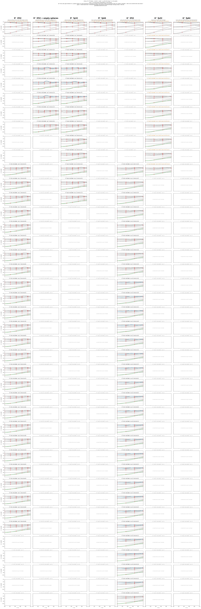
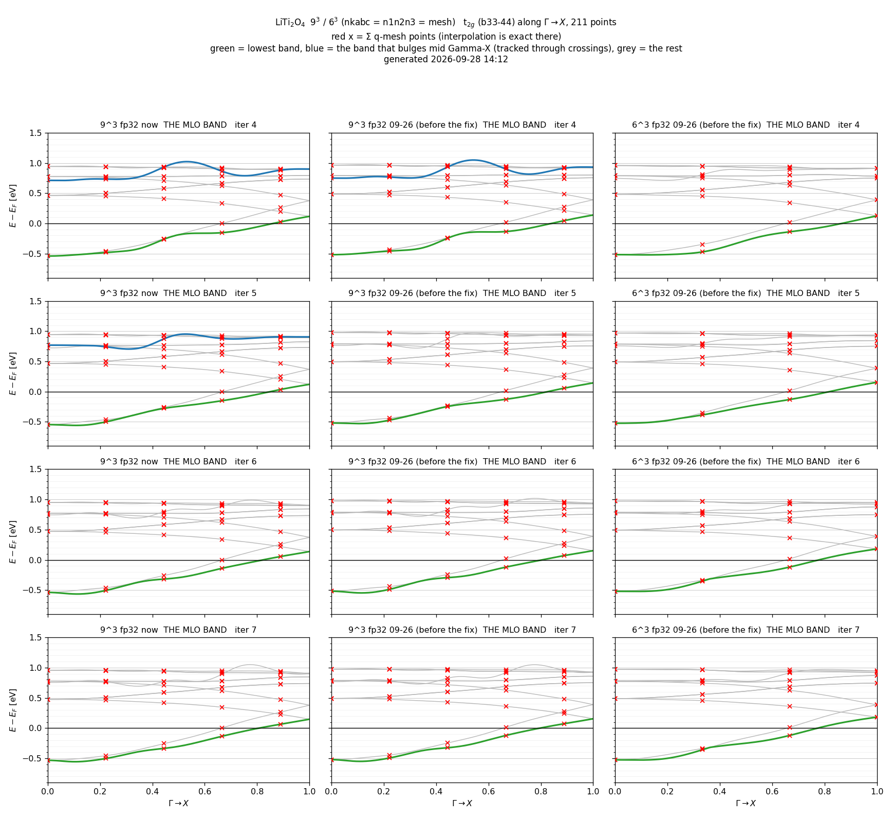
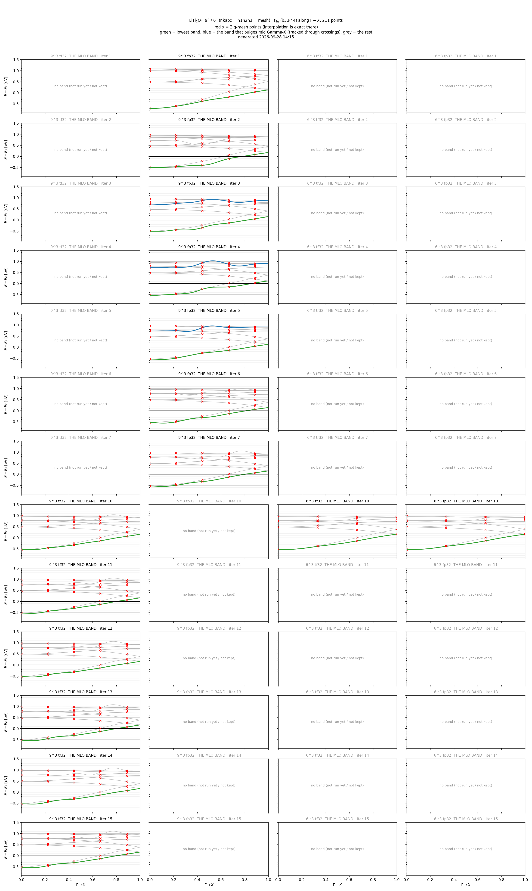
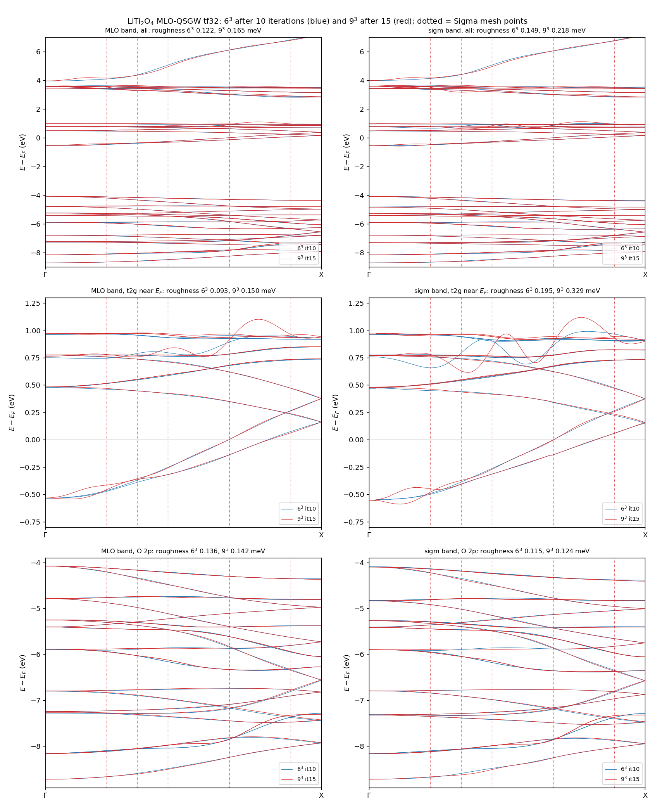
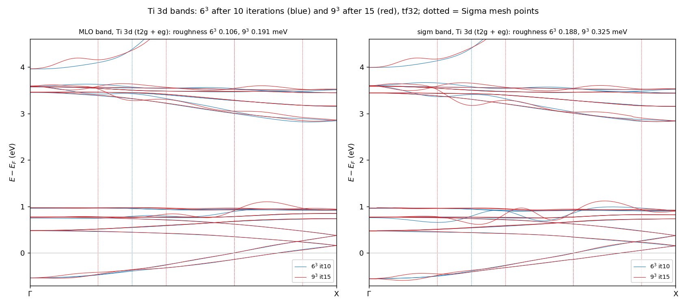
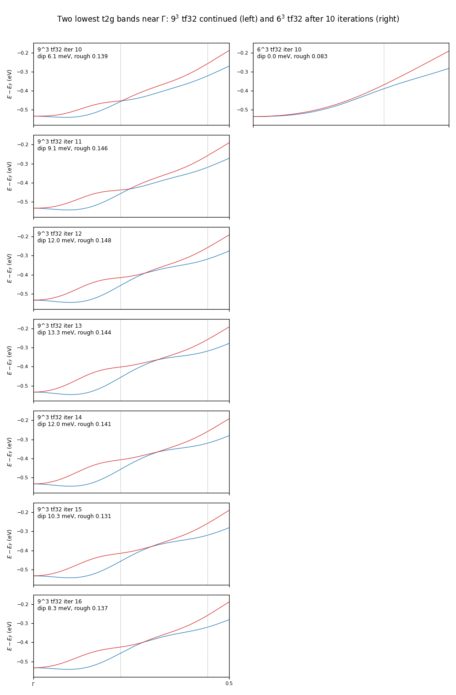
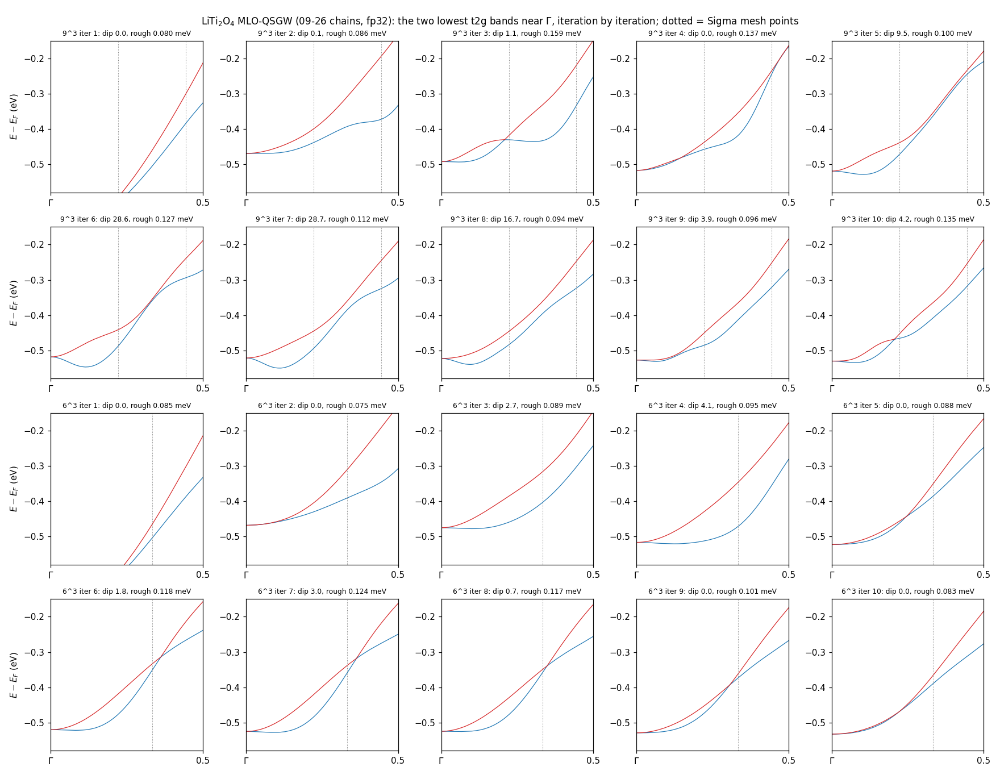
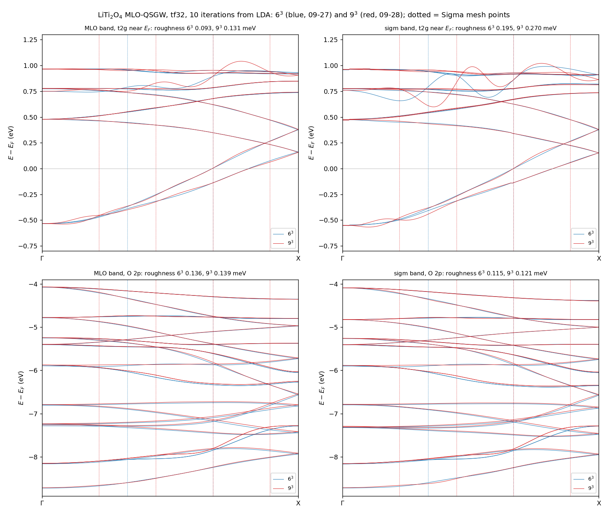
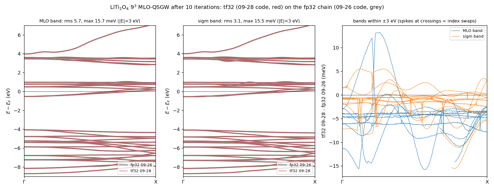
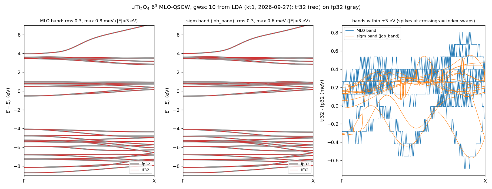

# research_kotani_log.md — ecalj の研究・開発ログ（有限温度 QSGW、MLO-QSGW、GW の GPU 高速化、GW1500、片付け）

> 2026-10-02 20:29 にこのディレクトリを `ecalj/MD/` から `ecalj/ecaljdoc/MD/` に移し、同じ日の 21:17 に `ecalj/MD/` に戻した
> （user「公開リポジトリに MD は送らないなら ecaljdoc の下にする必要はない」）。下の記述の `MD/...` はそのまま読める。

2026-10-01 に `Samples/kBT/kBT_research.md` から `MD/research_kotani_log.md` へ移した（user の指示。中身は同じで、相対リンクだけ直した）。
下の古い日付の記述にある `kBT_research.md` はこのファイルのこと。

2026-09-16 から。上から新しい順に書き足す。日付の節（`## 2026-09-27 夜 — …`）の下に `### HH:MM **見出し**` で、投入・完了・判断の時刻を書く。
表と図には番号（*表 23:35-1* など）を付け、本文から番号で参照する。書き方の正本は [ecaljclaude.md](ecaljclaude.md)「記録の方針」。

- **テーマ別の要約と日付の索引**: ecaljdoc の [ForDevelopers](https://github.com/tkotani/ecalj/blob/main/MD/ForDevelopers.md) §13（このログを引く入口）
- **結論が固まったもの**は ecaljdoc の [kBT](https://ecalj.github.io/ecaljdoc/manual/kBT)、[mlo_gwsc](https://ecalj.github.io/ecaljdoc/manual/mlo_gwsc)、
  [ecaljgpu](https://ecalj.github.io/ecaljdoc/manual/ecaljgpu) と各 README に移す。残る課題の一覧は kBT.md §9 と ForDevelopers §11.8
- **投入の手順**は ForDevelopers §12、LiTi₂O₄ の入力と 9³ の正常値の表は `Samples/kBT/LiTi2O4/input/qmlo/README.md`

**図の貼り方**: `mlo_rows.png` / `mlo_conv.png` のように反復が進むたび**上書き**される図は、日付のエントリに貼らない。
エントリには、その時点の状態に作り直した**凍結版**（`mlo_rows_<HHMM>.png` など）を貼る。上書きされる図を日付エントリに貼ると、本文の説明と中身が
食い違う（2026-09-25 に 15:06 と 22:27 のエントリで実際に起きた）。

---

## 2026-09-26 18:30 の図（9³ の 10 反復の完了時。以後は更新していない）

**最終更新 2026-09-26 18:30**（9³ 10 反復完了）／ 追っていたのは **`liti_mlo_k9`**（**9³**、nmlo 126、$\Sigma^{\rm MLO}$ を β=0.5 で混合、03:07 開始、**18:24 に 10 反復完了**）。最終図は 18:30 のエントリに凍結。
6³ の v9 は 10 反復で完了し、最終図は 03:15 のエントリに凍結した。

| 列 | 何を描いたか | 描き方 |
|---|---|---|
| 1 | **従来 QSGW**（MTO、6³、`n666_nk6_from_lda`、`pwmode=1`、β=0.5）| 従来 `sigm` の内挿。LDA 行だけ `pwmode=11`（02:45 のエントリ）|
| 2 | 6³ の `liti_mlo_v9`（MLO-QSGW、10 反復で完了）| 従来 `sigm` の内挿（`job_band`、`mloON=0`）|
| 3 | 6³ の `liti_mlo_v9` の **MLO バンド** | SCF が解いた $H$ の MLO 模型（`draw_mloband.sh`）|
| 4 | **9³ の `liti_mlo_k9`**（MLO-QSGW、走行中）| 従来 `sigm` の内挿。SCF が使った $\Sigma^{\rm MLO}$ ではない |
| 5 | **9³ の `liti_mlo_k9` の MLO バンド** | SCF が解いた $H$ の MLO 模型 |

9³ には反復を揃えて比べられる従来チェーンが無いので、従来列は 6³ だけ。
**赤い ×** は列ごとの Γ→X 上の Σ メッシュ点 $x = 2n/N$ での各バンドの値（6³: 0, 1/3, 2/3, 1、9³: 0, 2/9, 4/9, 6/9, 8/9。X 点は奇数メッシュに乗らない。9³ の点は 211 点の格子に乗らないので前後から内挿）。図の題に MLO 模型の内容（126 軌道 = 14 原子 × (s+p+d)）を書いてある。

*図 L-1* t2g（b33–44）、Γ→X 211 点

`Samples/kBT/LiTi2O4/mlo_rows_k9.png`（生成: `MESH=6,9 MESHCOLS=6,6,6,9,9 mlo_rows.py <root> <out> v9,v9mlo,k9,k9mlo '…' '…'`、root の `ref/` が従来列）

*図 L-2* 反復ごとの変化（左 max、右 rms）。**9³ は実線、6³ は破線**

`Samples/kBT/LiTi2O4/mlo_conv_k9.png`

*図 L-3* **従来 QSGW（6³）、6³ と 9³ の MLO-QSGW を並べたもの**。列は L-1 と同じ 5 列（従来 / 6³ `sigm` 描画 / 6³ MLO バンド / 9³ `sigm` 描画 / 9³ MLO バンド）。
**緑 = 一番下のバンド、青 = Γ→X の中央で膨れるバンド**（交差をまたいで追跡、膨らみが 50 meV 未満の段では青を付けない）、灰 = その他、**赤い × = メッシュ点**。（18:15 まで一番下は赤で描いていた。赤をメッシュ点の × に使うため緑に変えた）

`Samples/kBT/LiTi2O4/mlo_rows_6vs9_hilite.png`（生成: `HILITE=1 MESH=6,9 MESHCOLS=6,6,6,9,9 mlo_rows.py <root> <out> v9,v9mlo,k9,k9mlo '…' '…'`）。従来列では iteration 9–10 で青（中央の膨れ）が出るが、同じ 6³ の MLO-QSGW の 2 列には出ない。
9³ だけの色分け版は `mlo_rows_k9_hilite.png`

*表 L-1* 9³ の各反復

| $N$ | 時刻 | 秒 | SCF 回数 | `sigm` 描画 max / rms | MLO バンド max / rms | 備考 |
|---|---|---|---|---|---|---|
| 1 | 04:39 | 5314 | 19 | 387 / 231（LDA から）| — | 混合 543.85 → 271.92（半分）、MISS 0 |
| 2 | 06:10 | 5326 | 11 | 184 / 89 | 263 / 99 | $x_0$ を `.prev` から、MISS 0 |
| 3 | 07:41 | 5336 | 11 | 183 / 41 | 177 / 44 | 9³ 用期待値で ANOMALY 0 |
| 4 | 09:14 | 5427 | 10 | 103 / 19 | 111 / 22 | ANOMALY 0 |
| 5 | 10:47 | 5435 | 6 | 96 / 16 | 107 / 19 | ANOMALY 0 |
| 6 | 12:18 | 5307 | 4 | 117 / 15 | 75 / 14 | ANOMALY 0 |
| 7 | 13:49 | 5313 | 6 | 43 / 5.9 | 43 / 7.4 | ANOMALY 0 |
| 8 | 15:20 | 5310 | 4 | 21 / 2.9 | 17 / 3.2 | ANOMALY 0 |
| 9 | 16:51 | 5305 | 4 | 31 / 4.6 | 19 / 5.2 | ANOMALY 0 |
| 10 | 18:22 | 5313 | 4 | 23 / 3.8 | 21 / 3.2 | ANOMALY 0。**完了** |

**9³ での正常値**（6³ と違うので注意。`check_iter.sh` は `CHECK_MLOON=35 CHECK_GWDRV=50 CHECK_MAXSECS=12000` で使う）

どちらの印も `sigmlo_init` が**プロセスごとに最初の 1 回**出す行で、`getsenex` を呼ぶのは担当する k 点を持つプロセスだけ。
`lmf` は k 点を大きさ ⌈nk/np⌉ のかたまりで配るので、印の数 = ⌈nk / ⌈nk/np⌉⌉ になる。

| 印 | `lmf` の np | k 点数 6³ → 9³ | かたまり | 印の数 6³ → 9³ |
|---|---|---|---|---|
| `mloON`（SCF）| 60 | 既約 16 → 35（`BZMESH: ngrp nq 48 ...`）| 1 → 1 | **16 → 35** |
| `gwdrv`（GW ドライバ）| 60 | `QPLIST.jobgw1` 72 → 200（`ZmloSig` のレコード数と同じ）| 2 → 4 | **36 → 50** |
| MLO バンドの `writeham` | 8 | 16 → 35 | 2 → 5 | **8 → 7**（9³ は 5×7=35 で 8 番目が空）|

意味のある異常はこの数より**少ない**場合（一部のプロセスが MLO 経路に入らず従来の `sigm` に落ちた）。
ほか: 1 反復 ≈ 5300 秒（6³ は ≈ 950）、スナップショット 2.4 GB（6³ は 0.9）。

## 2026-10-02 夜 — GW1500 のデータベース

### 23:42 **GW1500: 全 1546 物質を新しいコードで回し切る（user 判断）、kr7 へ 6 原子を回す**

- 23:38 の時点で済み 665、残り 888（kt1 709: 2 原子 30・6 原子 227・7 原子 87・8 原子 365、kr7 179: 3〜5 原子）。1 物質の平均（1 本あたり）: kt1 4 原子 491 s・6 原子 984 s・7〜8 原子 約 1550 s、kr7 4 原子 584 s・5 原子 813 s。全部で 10-06 の朝ごろの見込み
- user「それならそれでいい」: 5 月の値（旧 `--mp`、χ0 まで TF32）は全部置き換える。今の tf32 は fp32 と 0.00 eV で一致しており信頼できる（user「たぶん今の tf32 は信頼性が高い」）
- 23:41 t14 で `~/work/gw1500db/rebalance6.sh` を開始（ローカル）: kr7 の列が 6 以下になったら kt1 の列の後ろから 6 原子を 10 ずつ移す。試しに Ca2Br4（mp-571166）・Cs4Se2（mp-569272）を kr7 の列の先頭へ（kr7 は 30 GB）。kr7 で落ちたら kt1 に戻して移すのをやめる。7〜8 原子は kt1 に残す

### 10-04 11:11 **GW1500: MLO の標準処方を確立し、全物質に回し始めた（user「処方箋をまず確立する。みなが再現できるように」「1500 個でトラブルを出し切るのも目標」）**

- 図を 3 枚に: LDA | QSGW80（+ DOS）| MLO（QSGW80 を灰色で敷いて MLO を赤、窓の外に影、条件と判定を見出しに）。user が選んだ並び
- 処方: `ecalj_auto/gw1500_mlo.sh`（3c6d849d1）。[mlo] を今の gwinit で書き直し（`gw1500_mlo_regen.py`）→ `job_mlo`（Löwdin、method 4、Δ = w = 2 eV、ssig 0.8 で QSGW80 の模型）→ `mlo_bandcheck.py`。版を `mlo_version.txt` に。`gw1500_rerun.sh` が既定でバンドの後に回す（`MLO=1`）。ecaljdoc mlo.md「GW1500 の標準処方」（bc247f23c）
- `job_mlo` には `efermi.lmf` が要る（無いと CBM が分からず窓が決まらない。PlotBand/ には無いので QSGW の作業場所から写す）
- 手元のビルドが 10-02 21:32 のままで adb18bced（22:43）が入っていなかった → 11:01 に作り直した。MLO はこのビルド（a4d08b7b8 のソース）
- 試した 5 物質: CdGa2S4・Na2H2S2・MgBe2As2 は PASS、K2Te2Pt は窓の上端（+3.9 eV）で 0.2 eV、Y2Zn2P2O2 は CBM が 0.23 eV 上（FAIL）
- 11:06 t14 で 4 本（`~/work/gw1500mlo`、feed.sh が kt1・kr7 の収束した物質を 20 分ごとに列へ、worker.sh が PlotBand/ と efermi.lmf を写して回し、模型の行列は消す）。1 物質 5〜180 s
- 11:11 作り直しの処理を `sync_loop3.sh` に替えた（MLO を npz `db_mlo` に、リポジトリの builder を使う）。builder の 3 枚組・MLO の列・README の MLO 節・MLO-FAIL の表は b2214b31e

### 10-04 09:46 **GW1500: kr7 で 6 原子は kt1 の約 1/4 の速さ、上限 3 h で回し直す（user「それでいいです」）**

- 試しの 2 つ: Ca2Br4（mp-571166）は kr7 で 3197 s で収束、Cs4Se2（mp-569272）は上限 5400 s で TIMEOUT → kt1 に戻した（01:26、監視が移すのを止めた）
- kr7 で hgw が黙って止まる FAIL がもう一つ: Bi2Te2Se（mp-29666、05:06、iter=1）。mp-27869（Ba2PCl）と同じ形で、kr7 のメモリ（30 GB）不足と見る。二つとも kt1 の列の最後へ（09:45）
- Cs4I4（mp-1079694）は前の作業場所（kt1 で 7200 s の TIMEOUT）が残っていて SKIP された。最後に上限を延ばして回し直す
- 09:43 の時点で済み 851、残り 674（kt1 587・約 10.5/h、kr7 87・約 8/h で今夜 21 時ごろ空く）。kr7 が空いたら 6 原子を上限 10800 s で回す監視（t14 の `~/work/gw1500db/rebalance6b.sh`、09:46 開始）。全部で 10-06 の昼ごろの見込み

### 14:06 **ecaljdoc の esbuild を 0.25 に（Dependabot GHSA-67mh-4wv8-2f99、開発用サーバーだけの弱点）**

- 手元で 0.21.5 と 0.25.12 のビルドを比べた: HTML 38 頁はハッシュを伏せて同一、画像 66 個同一、CSS は空白の詰め方だけ、JS は縮め方が違う
- user「公開のサブサイトで相手のエンジンで試す」→ `tkotani/ecaljdoc-sub`（base `/ecaljdoc-sub/`）を同じ GitHub Actions でビルド・公開し、本家と Chrome で比べた:
  kBT の頁（数式 522、表 12、図 1、本文の長さ）、theory/qsgw（mermaid ノード 11、数式 22）、検索 4 語（magnon 16、QSGW80 14、t_tetrakbt 16、spglib 11）、
  トップのボタン、JS のエラー無し — すべて同じ
- 本家へ（`603257e64`、ecaljdoc `698af9f`、05:03 GMT のデプロイ）→ 同じ点を本家で確かめ直して同じ。サブの Pages は止めた。リポジトリの削除は
  gh の `delete_repo` の権限が要るので未（TODO）。Dependabot の通知は再走査待ち

### 13:26 **push と公開（user「1、2、3 をやってください」）**

- 試験: `1414c5886` を mic（ifx 2026）と ucgw（ifx 2024.2）で Samples の bench 以外の全部。22 組 PASS、heavy は `nio_gwsc444` の QPU だけ FAIL
  （spglib の操作の並びによる 15 meV。両機は 0.001 eV で一致）→ 参照を作り直した（`8f8fa3fac`）。t14（gfortran）は 10-02 に同じコードで 19 組 PASS
- `TOOLS/publish_all.sh --push --rel`: ① ecalj dev・rel とも `eb964c1d1`（09-25 の `1e38c1c58` から約 940 コミット）、② ecaljdoc `2cd1f99`
  （サイトのビルド成功）、③ DOSnpSupplement `725e9d5`（`QSGW80_2026/`、13:01 のデータベース: N 465、R 277、M 803）

### 07:29 構造の不正・疑わしい 10 物質もキューの最後に（user「構造が不正・疑わしい 10 物質も最後まで回して」）

- 5 月の値しか無い 10: TiS₂ mp-1062030、Pb₂S₂ mp-20526・mp-561320・mp-726184・mp-727323、Pb₂Se₂ mp-22009、Sn₂S₂ mp-727322・mp-8781、
  Sn₂Se₂ mp-8936（以上 kr7）、C₈ mp-569416（kt1）。Rb₈ mp-1179832 は回さない（user 了承）

### 07:24 **続きを投入（user「じゃあ回して。計算もスタートして」）: 5 月の値しか無い 908 物質**

- 同じ設定（tf32、`t_tetrakbt = -300`、`t_sigmaw = 300`、kt1 `~/bin_frozen_b81da2342m`、kr7 `~/bin_frozen_74ba72dadm`）。STOP を消して再起動
- キューの順: 5 月の値しか無い物質（`m_only.txt`、918、うち構造の不正・疑わしい 10 は回さない）を先頭、回し直しの値（R）のある物質は後ろ。
  kt1 は 6〜8 原子（先頭 629）、kr7 は 3〜5 原子（先頭 279。5 原子 170 を kt1 から移した）
- 見積もり（今夜の中央値: 4 原子 6〜8 分、5 原子 7 分、6 原子 13 分、7 原子 20 分、8 原子 17 分）: kt1 で約 46 時間、kr7 で約 15 時間
- 手元 t14 の `~/work/gw1500db/sync_loop2.sh` が 30 分ごとに抜き出し・転送・データベースの組み立て（図も）をする。止めるのは `~/work/gw1500db/SYNC_STOP`

### 07:15 **まとめ: GW1500 のデータベースを作った（23:03 投入、06:38 STOP、07:14 に組み立て）**

- 置き場 t14 `/media/takao/TAKAOMINI/gw1500db`（302 MB）: `README.md`（条件 M・R・N、読み方、5 月の値の信頼性、自動の検査、限界、ファイル）、
  `table.md`（1546 行）、`gw1500db.tsv`、`bands_<n>atoms.md`（図 1545 枚）、`npz/`、`logs/`。作り方 `ecalj_auto/gw1500db_build.py`（2 分、8 並列）
- 今夜の計算（N）: 351 物質（収束 342、金属 8、時間切れ 1 = Cs₄I₄）、失敗 0。kt1 4 本で 123、kr7 2 本で 228（00:51〜01:16 は空）
- 採用: N 350、回し直し R 277、5 月 M 918、結果なし 1（Rb₈、構造が不正）
- *表 07:15-1*. |N − M|（eV）の分布。疑いから先に回したもの（126）: 0.02 未満 23、〜0.05 19、〜0.1 24、〜0.2 17、〜0.5 27、0.5 超 16。
  無作為の GOOD と 2 原子の GOOD（165）: 96、26、23、18、2、0。N − R（77）: 中央値 0.000、最大 0.11（LiCoO₂、収束の判定の幅の中）
- 5 月の値の誤り（N で確かめた）: CsClO₄ 0.26 → 8.95、RbSrCO₃F 5.33 → 7.26、NaN₃ 5.83 → 7.31、LiGaO₂ 4.75 → 6.18、SrHgO₂ 3.47 → 4.52 eV など。
  0.2 eV 超は、どれも N が 2025 年の値（QSGW100 の 2shot から作った QSGW80 の目安）に近づく向き
- 自動の検査で直したもの・注記したもの: 古いバンドの図 3（Cs₄I₄、Na₂Co₂O₄、SrS）、半金属なのにメッシュでギャップ 5（黒鉛型の炭素など）、
  メッシュが極値を取り逃がす 51（`path<mesh(mesh)`、経路の値を併記）、QSGW80 < LDA 3（Mo₂O₆ は層間の状態、CdSnAs₂、SrSn₂As₂）。
  2025 年の H₂・H₄・LiH は QSGW が回っていなかった（値が LDA と同じ）

### 02:37 途中経過

- 今夜の値 178（kt1 74、kr7 105）、失敗 0、時間切れ 1（Cs₄I₄、2 時間で 3 反復 5.43 eV、5 月 5.41 と合う。図は 3 反復目の sigm から描き直した）
- 今夜 − 回し直し: 24 物質すべて 0.00 eV（`t_tetrakbt` ±300、fp32/tf32 は効かない）
- 今夜 − 5 月: 疑いから先に回したもの（5 月の分類が GOOD 以外、または 2025 年の目安から 0.3 eV 以上）で 0.2 eV 超 36/78、無作為の GOOD と 2 原子の GOOD で 2/84
  （0.05 eV 以内が 61/84）。0.2 eV 超はどれも今夜の値が 2025 年の値に近づく向き
- kr7 は 00:51 に 2 原子を終えて止まっていた → 01:16 に kt1 のキューの 3 原子 106 を移して再開

### 00:43 **5 月の値のずれは旧 `--mp`（全部 TF32）の Σ の段階で入っている（user「旧 mp の誤差はあり得る、簡単な複数例で確認」）**

- 05-10 のコード（`28172fcd6`）の GPU 版を kt1 の nvfortran 26.1 でビルドした（`main_huumat.f90` が device attribute mismatch、
  `hmlo_ovlppair.f90` が toml-f の依存の書き漏れで通らないので写しから外した。`/mnt/data1/oldmp`）。旧 `--mp` あり・なしとも
  `hvccfp0` が `vcoulq_4` の igig のループでメッセージ無しに落ちて動かなかった。今のコードには全部 TF32 にする切り替えは無い
- 代わりに、5 月の本計算の反復ごとの sigm（kt1 `~/DATA/gw1500/<mpid>/QSGW.<n>run/sigm.<mpid>`）を、05-10 のコードの lmf（t14、CPU、倍精度）に読ませた
  （`~/work/oldmp_qpu/eval.sh`）。LDA は 5 月と今夜で同じ
- *表 00:43-1*. QSGW80 のギャップ（eV）、5 月 / 今夜: MgO 1 反復 7.577 / 7.659、2 反復 7.779 / 8.065。BeO 10.889 / 10.720、10.818 / 11.014。
  LiF 12.736 / 12.999、13.784 / 13.555。NaCl 6.399 / 6.444、6.675 / 6.844。CdS（対照）1.935 / 1.944、2.226 / 2.250
- 1 反復目から 0.05〜0.26 eV ずれ、符号は物質と反復でばらばら（LiF −0.26 → +0.23）。CdS は 0.01。05-10 のコードを倍精度で最初から回すと
  今夜と 1 反復目から同じ（MgO 7.659）なので、ずれは 5 月の本計算の Σ の作り方（旧 `--mp`）から。精度のノイズで説明できる
- 残る交絡: 5 月の本計算は 4 月のコード（`~/bin2`）。4 月のコードを倍精度で回せば完全に切り分けられるが、旧形式の GWinput が残っていない

### 00:22 **MgO の 5 月と今夜の 0.14 eV はコードの版ではない（user「最近の変更かも、git の bisection で」）**

- MgO（mp-1265）: 5 月 8.326、今夜 8.183 eV。入力（基底・k・積基底の表・`QpGcut`・`emax_sigm`・ssig 0.8）は同じ。今夜と同じバイナリで均し方を 5 月に寄せても
  （`t_tetrakbt = 0`、`t_sigmaw = 262`）8.1829、O の `pb_lcutmx` を 2 → 4 にしても 8.219（5 月も 4 2）。精度は §5.1 で 1 meV 未満
- bisect の両端を t14 の gfortran（CPU）で: 5 月の入力のまま 05-10 の `28172fcd6` で LDA から `gwsc 8` → 1 反復目 7.659、8 反復目 **8.182 eV**。
  今夜の `989a18637`（7.659 → 8.183）と反復ごとに同じ。**コードの版の違いではない**ので、二分探索はしなかった
- 5 月の値は、4 月の本計算（当時の `~/bin2`、GPU の積を全部 TF32 にした旧 `--mp`）5 反復の上に 5 月の続きを回した経過から来ている。旧 `--mp` の精度が有力な候補（未確認）
- 今夜の 73 物質で今夜 − 5 月: 中央値 0.035 eV、0.05 eV 超 27、0.2 eV 超 12（BeO −0.27、MgO −0.24、LiF +0.19、NaCl +0.16、Mg₂F₄ −0.57、
  LiGaO₂ +1.43、RbSrCO₃F +1.92）。5 月の GOOD の値には ±0.2〜0.5 eV の不確かさがありうる → データベースは今夜の値を優先
- `wcsmear = false` と tf32 の組み合わせで hgw が Σc の途中で exit 127（MgO、kt1 `test_mgo/mp-1265.wcsmearfalse_crash`）。TODO

### 23:22 **データベースの組み立てと自動の検査（user「異常に見えるものをしっかりチェック」）**

- 置き場: `/media/takao/TAKAOMINI/gw1500db`（user「ローカルには TAKAOMINI のディスクがある」）。kt1 の既存の結果を npz に（5 月 1480・LDA 1442・回し直し 354、
  `gw1500db_extract.py`）、`gw1500db_build.py` で表・図 1545 枚・README（2 分 20 秒、8 並列）。今夜の結果は手元の `sync_loop.sh` が 20 分ごとに運ぶ
- 見つけた異常と理由:
  - **Cs₄I₄（mp-1079694）の 5 月のバンドの図は古い**: `PlotBand` は 04-28（本計算 5 反復、ギャップ 3.30 eV）のまま、追加の計算で sigm が 05-15 に更新
    （最後 5.41 eV）。5 月の GOOD 1210 で図が古いのはこの 1 つだけ（`PlotBand/llmf_ef` と `llmf` のギャップの比較）。今夜のキューの先頭に入れた
  - **Na₂Co₂O₄（mp-867515）の図は延長前（10 反復目、1.82 eV）のまま**だった → 収束した sigm から描き直した（3.67 eV）。mp-1087 は `atmpnu` 無しで
    job_band が落ちていた → 描き直した（4.17 eV）
  - **黒鉛型の炭素（mp-169 C₂、mp-2516584 C₄、mp-569304、mp-569416）と Ba₂Pd₂（mp-1008505）**: 経路の上ではバンドが E_F を横切るのに、8³ の k メッシュの
    ギャップは 0.3〜5 eV。メッシュが K 点などを取り逃がしている。本当は半金属で、表のギャップは誤り（検査 `path-metal`）
  - 経路の上のギャップがメッシュより 0.1 eV 以上小さい 55 物質のうち 51 は LDA でも同じ（`path<mesh(mesh)`、層状・六方晶など、極値が 8³ に乗らない）
  - SUSPECT_GOOD など 11 物質は回し直しと 5 月が 0.2 eV 以上違う（5 月の振動。今夜の 1 段目で確かめ直す）
- 自分の誤り（直した）: 経路のギャップの判定で、価電子帯の頂上が E_F（メッシュで決まる）より上に出るのを許す幅が狭く、h-BN などを金属と判定した。
  `kmismatch`（同じ k の名前の点の比較）は `U|K` のような区切りの点の扱いを誤って 1047 物質を拾った

### 23:03 **GW1500 のデータベースの計算を投入（user「新コードで」「一晩で」「9 時間でデータベースに」）**

- 設定: tf32、`t_tetrakbt = -300`、`t_sigmaw = 300`（user）、ほかは回し直しと同じ（`ctrlgenToml.py --ssig=0.8`、8³・4³、`gwscconv` 0.1 eV を 2 回、最大 10 反復）。
  条件の違いは物質ごとに書く（user「少しずつ条件が違うのはしかたない。書いとくことで対応する」）
- kt1: `~/bin_frozen_b81da2342m`（今の履歴で `989a18637` の Fortran ＋ 新しい gwscconv）、ワーカー 4 本 × 16 コア、1 物質 2 時間まで、
  `/mnt/data1/gw1500_rerun/run_db`、スクリプト `gw1500_rerun_v4.sh`（v3 ＋ `T_TETRAKBT`、`PlotBand_LDA`）、23:02 開始
- kr7: `~/bin_frozen_74ba72dadm`（`b695fa65c` の Fortran ＋ kt1 と同じ gwscconv）、2 本 × 8 コア、1 物質 1.5 時間まで、`~/gw1500db/run_db`
- 順番: kt1 は 1 段目（5 月に問題のあった SUSPECT_GOOD 17・MAY_WRONG 1・DRIFT_GOOD 61・UNKNOWN 10、原子数の順）→ 2 段目（FAILED_MAY・NOTCONV_MAY 321、
  回し直しの時間の短い順）→ 5 月の GOOD の 3 原子以上。kr7 は 5 月の GOOD の 2 原子（79）。構造の不正な 16 は回さない
- 締め: 06:30 ごろに STOP。回らなかった物質は今の値（5 月か回し直し）をデータベースに入れ、条件を書く

## 2026-10-02 — MLO を実空間で規格化、実験用の MLO オプションを廃止（Wannier を外す作業の続き）

### 16:13 判断（user）: Löwdin の模型の内挿のずれは許容範囲

user「メッシュ外ってエラーチェックの外領域？」→ メッシュの外は模型の k メッシュから外れた k（対称線の上）のこと。user「VBM − 3 から CBM + 2 の外なら問題ない」
→ その窓で数え直した（*表 16:13-1*、`~/work/lowdin_20261002/win3_2.tsv`）。user「許容範囲というべき。Löwdin でいい」。

| [VBM − 3, CBM + 2] eV | 生 (H, O) | Löwdin |
| --- | --- | --- |
| 最大のずれの中央値 / rms の中央値 | 0.035 / 0.0067 | 0.027 / 0.0051 |
| 最大 > 0.1 eV | 10 | 8（AlN、AlSb、InSb、MgS、MgSe、MgTe、SiO₂、Sn。生でも超える） |

- 悪くなった: 2H-SiC 0.055 → 0.072、GaAs 0.044 → 0.056（E_F ± 1 では 0.032 → 0.010）、GaSb 0.078 → 0.091、MnO 0.010 → 0.030、NiO 0.011 → 0.025。
  良くなった 11（Cu 0.107 → 0.018、Ni 0.093 → 0.027、C 0.078 → 0.043、Bi₂Te₃ 0.113 → 0.076 など）
- この 63 物質は基準 1 だけ。0.1 eV を超える 8 物質は、生の模型では基準 2（AlN、Mg の化合物、AlSb、InSb、Sn）・基準 3（SiO₂）で通っていた（ecaljdoc mlo §9）。
  Löwdin の模型での基準 2・3 は確かめのため回している（`~/work/lowdin_crit23_20261002`）

### 12:55 Löwdin の模型の参照を作り直した、試験

- t14（gfortran、`d10a63716` の版）: install 66 PASS（cRPA の参照は読み込み時の Löwdin の版のままで通る。メッシュ上は同じ基底）。mlo は `band_MLO_spin*.dat` の
  比較で 31 FAIL（メッシュの外のバンドが変わる。予想どおり）、mloqsgw は GaAs・NiO の log と NiO の QPU・QPD（0.017 eV）、magnon は Fe のピーク
  → 参照を作り直して（FeSoc・FeMgOSoc・GaAsSoc の非 SOC の参照は job_mlo を別に回して取った。試験は同じ場所で job_mlo の後に job_mlo_soc を回すため）
  mlo 45、mloqsgw 5、magnon 2 が PASS
- MLOsamples の検査（mlo_bandcheck）: 生の模型 PASS 15 → Löwdin 19（同じ順の 28 回）。大きく外れる 4.25・6.23・2.58 eV などは生の模型でも同じ値
- *表 12:55-1*. bcc Fe のマグノン（eV、Im R の極大）。模型そのものを Löwdin にすると q = 0.4・0.6 が Wannier 版に近づく（K は k + q のメッシュの外の模型の固有ベクトル）

| q | Wannier | 模型を Löwdin（今） | 読み込み時に Löwdin（11:12） | 生 |
| --- | --- | --- | --- | --- |
| 0.1 | 0.068 | 0.085 | 0.087 | 0.075 |
| 0.4 | 0.197 | 0.159 | 0.349 | 0.431 |
| 0.6 | 0.319 | 0.339 | 0.371 | 0.810 |
| 0.7 | 0.532 | 0.599 | 0.599 | 0.913 |

  η = 1.239（前と同じ）。他の q は前と同じ
- kr7・kt1 の全部の組（`2ffb0331f`）: inputs 172、install 66、eps 18 が両方で PASS（途中の記録）。MLO の 3 組は古い参照と比べるので、参照を送り直して回し直す

### 12:16 判断（user）: MLO の標準は Löwdin で直交化した関数、模型は H̃(R) だけ（O(R) = δ）。`d10a63716`

user の依頼「Löwdin 直交化は使う、のをスタンダードに。振動は許して局在化させる、というのを MLO の標準とする（バンドは変わらない）」。
途中で「FFT 内挿の意味では重なり行列を残した方がスムーズかもしれない（振動するから）」との迷いがあり、「全体的に調べて、O なしで OK ならそっちをメインに」
→ 63 物質で比べて O なしに決めた（user「やれた範囲での決断として、O なし」）。

- 実装（`d10a63716`）: m_HamPMT の LowdinModel で、対称化した既約 k の生の H, O から、生の MLO の実空間ノルム rnorm_i = O_ii(R=0)（全 BZ の平均）を出し、
  X = D (D O D)^(−1/2)（D = diag rnorm^(−1/2)）で H ← X⁺HX、O ← 1、V_SO ← X⁺VX としてから R へ。Hreduction も同じ X を掛ける（__cmlo、sugw の a'、
  m_sigmlo。HamRsMLO の新しいレコードで直交化の有無を読む）。`--mlo_raw`（lmf、job_mlo に付ける）で前の非直交の模型。読み込み時の `--mlo_lowdin`（`d46c4014d`）は消した
- Löwdin は入力の軌道の尺度で結果が変わる（対称直交化は入力に最も近い正規直交系なので、先に各軌道のノルムをそろえる）。前のマグノン・cRPA の Löwdin
  （11:12 のエントリ）も、規格化した __cmlo に掛けていたので同じ定義
- 63 物質（`~/work/lowdin_20261002`、DFT は `~/work/ovlp_20261002` と同じ、MLO の段だけ。11:56 投入、12:15 完了）。`compare.py`・`efcompare.py` と
  `compare.tsv`・`efcompare.tsv`

*表 12:16-1*. 生の (H, O) の模型と Löwdin の H̃ だけの模型のバンドの誤差（eV、メッシュ外の経路、mlo_bandcheck の窓。E_F 近くは [VBM − 1, CBM + 1]、金属は E_F ± 1）

| | 生の (H, O) | Löwdin の H̃ |
| --- | --- | --- |
| PASS（mlo_bandcheck） | 53 / 63 | 55 / 63 |
| 窓全体: rms の中央値 / 最大の中央値 | 0.0050 / 0.035 | 0.0040 / 0.030 |
| E_F 近く: rms の中央値 / 最大の中央値 | 0.0048 / 0.019 | 0.0032 / 0.011 |
| E_F 近くで最大 > 0.05 の物質 | 12 | 10 |

- E_F 近くで良くなった（0.01 eV 以上）: Cu 0.107 → 0.008、Ni 0.054 → 0.010、C 0.078 → 0.031（ギャップの誤差 −0.038 → −0.013）、GaAs・GaAs_so 0.03 → 0.01、
  InP、InAs、PbTe、SrTiO3、4H-SiC、Bi2Te3、AlN。悪くなった: 2H-SiC 0.035 → 0.051、MnO 0.007 → 0.030
- 窓全体で悪くなったのは Fe だけ（最大 0.033 → 0.096）。4s 帯の底（−8〜−3 eV: ↑ 0.030 → 0.096、↓ 0.026 → 0.093）。E_F ± 1 eV では
  ↑ 0.033 → 0.016、↓ 0.029 → 0.024 と良くなる
- 両方で FAIL のまま（値もほぼ同じ）: AlN、AlSb、InSb、MgS、MgSe、MgTe、SiO2c、Sn。InAsGaSb_n4・LaGaO3 は mlo がメモリ不足（signal 9）で両方とも落ちる

*表 12:16-2*. bcc Fe（↑）の R の殻ごとの最大の行列要素（`~/work/decay_fe/decay_fe.png`・`decay_fe.npz`、lowtree だけの一時的な書き出し）

| \|R\| (alat) | 生 max\|H\| (Ry) | 生 max\|O\| | Löwdin max\|H̃\| (Ry) |
| --- | --- | --- | --- |
| 0.87 | 1.35e-1 | 1.95e-1 | 1.08e-1 |
| 1.66 | 7.7e-3 | 2.3e-2 | 1.6e-2 |
| 4.0 | 5.1e-3 | 1.4e-3 | 1.7e-3 |
| 5.0 | 2.9e-3 | 2.8e-3 | 4.3e-4 |
| 6.0 | 1.8e-3 | 5.6e-4 | 2.4e-4 |

- 私（Claude）は「O^(−1/2) の冪が遠くをつなぐので H̃(R) の裾が延びる」と推したが、**外れ**。遠方では H̃ の方が 3〜7 倍小さい。
  生の模型は H と O の両方が遠方に裾を持ち、内挿の誤差は二つの行列から入る
- 関数の広がりも Löwdin で縮む（Ω: Fe t2g 1.72 → 1.46、Ni d 9.88 → 9.42 bohr²。表 06:20-1）。直交のための振動はあるが、中心に寄る
- 直交化すると mlo の MLO_ovlpmin（判定 (3)）は 1 になって意味を失う。代わりに m_HamPMT が直交化の前の重なりの最小固有値（メッシュ上）を出す
  （"Smallest eigenvalue of the normalized raw overlap"）。63 物質で 0.22〜0.31
- t14 の試験（11:44〜、`c2cf33ccb`）の install の crpa と magnon の FAIL は、走っている最中に `SRC/exec/job_mloW`・`job_mlo_magnon`（~/bin から symlink）を
  書き換えたため（後半が生の MLO で走った）。別ツリーの kr7 は全部 PASS。新しい版の試験は t14 で投入済み（`~/work/tests_lowdin2`）

### 11:35 判断（user）: マグノン・U の基底は Löwdin（射影 Wannier）をメインに、MV は残すがメインにしない

- Löwdin: 対称性と軌道の名前（t2g・eg など）を保つ。O(gk) = D O(k) D⁺ なので O^(−1/2) も同じ表現で回る。同じサイトでは同じ既約表現の軌道しか混ざらない。
  Fe で t2g・eg の縮退が保たれ（Ω 1.467 ×3、1.544 ×2）、M̃(gk,gb) = D M̃(k,b) D⁺ が 8.5×10⁻⁷ で成り立つ。どの k でも厳密に作れる（内挿が要らない）
- MV（Sakuma の拘束つき）は `mlo_maxloc.py --sym`・`mlo_cmlo_transform.py` の試作として残す（拘束なしは混成軌道になり軌道の名前を失う）
- 友人に見せるページ: https://claude.ai/artifact/A9r4CEPHgD1UkYsVA5XQKH（`~/work/magnon_nifeco/magnon_window.md` と同じ内容、窓の比較は付録 A。
  Fe の q ≈ 0.4 は Stoner 励起の連続体に入る所でピークの位置は定義しにくい、という注も（user））

### 11:12 マグノンを Löwdin の基底（射影 Wannier、`--mlo_lowdin`）で: 窓によらなくなり、Wannier 版に合う

user の議論（10 時台）: スピン波は低エネルギーの現象。問題は窓より、KWKW… の間に挟む ⟨w1 w2|W|w3 w4⟩ の基底がどれだけ局在し、オフサイトを小さくできているか。
Wannier 化すると中央に集まってオンサイトが大きくなり、裾で減る。Löwdin は射影 Wannier で対称性を保つ。MV は中心がずれ、Sakuma の拘束では局在の上積みが減る。
→ まず Löwdin を標準にして試す（user）。

- Fe（既定の窓、hwmatK、ω = 0、d、`~/work/magnon_w/w_{raw,low,mv}`、10:17〜10:20）: オンサイトの W の U は 1.564（生）→ 1.704（Löwdin）→ 1.801（Löwdin + MV 拘束つき）eV。
  最近接のサイト間の V（(ii|jj)、R = (½,½,½)）は 0.037 eV のまま（U の 2 %）。裸の v の最近接は 6.0 eV で点電荷のクーロンどおり
- 実装（`d46c4014d`）: `--mlo_lowdin` で `read_cmlo`（W の側）が C·(C⁺C)^(−1/2)、`calc_ham_eigen`（K の側）が O^(1/2)·z を返す。`job_mlo_magnon` が全部のプログラムに渡す

**表 11:12-1**. η と Wannier 版からのずれ（平均 / 最大、eV、q > 0.05）。Fe は t14、Ni・FeCo は kr7（10:41〜11:12）

| 物質 | 窓 | 生の MLO | Löwdin |
| --- | --- | --- | --- |
| Fe | (2, 2) | 0.78、0.222 / 0.491 | 1.24、0.038 / 0.152 |
| Fe | (4, 2) | 1.05、0.107 / 0.186 | 1.23、0.022 / 0.068 |
| FeCo | (2, 2) | 0.87、0.112 / 0.207 | 1.28、0.003 / 0.012 |
| FeCo | (4, 2) | 1.13、0.034 / 0.068 | 1.26、0.002 / 0.011 |
| Ni | (2, 2) | 1.10、0.007 / 0.015 | 1.75、0.004 / 0.015 |
| Ni | (4, 2) | 1.51、0.008 / 0.022 | 1.77、0.006 / 0.022 |

- Löwdin で η もマグノンも窓によらなくなる。窓への依存は MLO が直交していないことから来ていた。窓を物質ごとに選ぶ必要がない
- マグノンは Wannier 版に合う（FeCo 0.003、Ni 0.004、Fe 0.02〜0.04 eV。Fe は q = 0.4 の折れだけ違う）
- η は 1 ではない（Fe・FeCo 1.2〜1.3、Ni 1.75）。原因は未確認。表と図は t14 `~/work/magnon_nifeco/magnon_window.md` の追記

### 09:42 マグノンの窓 (4, 2): η ≈ 1 で Fe・FeCo が合う（user「η ≈ 1 はオフサイトを入れない範囲で唯一の指標」「(4,2) ぐらいで Fe・Co は合わせられる」）

kr7、09:16〜09:25、`job_mlo_magnon -np 2`。表と図は t14 `~/work/magnon_nifeco/magnon_window.md`（Fe の窓 5 通り、FeCo・Ni 3 通り）。

**表 09:42-1**. η と Wannier 版からのずれ（平均 / 最大、eV、q > 0.05）

| 物質 | (2, 2) 既定 | (4, 2) | (6, 2) |
| --- | --- | --- | --- |
| Fe | 0.78、0.222 / 0.491 | 1.05、0.107 / 0.186 | 1.18、0.042 / 0.124 |
| FeCo | 0.87、0.112 / 0.207 | 1.13、0.034 / 0.068 | 1.24、0.009 / 0.025 |
| Ni | 1.10、0.007 / 0.015 | 1.51、0.008 / 0.022 | 1.70、0.010 / 0.022 |

- η ≈ 1 を物質ごとの基準にすると Fe・FeCo は (4, 2)、Ni は (2, 2)。Wannier 版に一番近いのは Fe・FeCo とも (6, 2)（η は 1 から離れる）。
  Wannier 版も基底の選び方に依存するので、模型の中で閉じた指標 η を採る方が筋（user）
- Fe の (4, 2) は η が同じ (2, 11) とほぼ同じ分散（q = 0.6〜0.8 で Wannier より高い）。オンサイトの W だけの近似の側の残り
- `magnon_peaks.py` は Γ の近くで音響の枝を追うように直した（`1e8849b26`。FeCo の Wannier 版の Tr R で光学の枝を拾っていた）
- 63 物質（例のページ https://claude.ai/artifact/VCWpe5W8Fei6umatXGeZGH と同じ DFT・基準 1）を (4, 2) で回し直し中（`~/work/ovlp_d4w2`、09:37 から）

### 07:10 MLO のマグノンの窓: Ni・FeCo でも比べた（TODO の順番 7）

kr7（`95be8b8b5`、CPU）、入力はタグ `last-wannier` の `Samples/Magnon/Ni_magnon`・`FeCo_magnon` の ctrlg に `mlo_nkabc = [8,8,8]` を足したもの、
Wannier のマグノン（同じタグの `TrRpm.syml001`）と比べた。06:59〜07:08。図と数値は t14 の `~/work/magnon_nifeco/{Ni,FeCo}/magnon_peaks.{png,npz}`・`peaks.txt`。

**表 07:10-1**. η（Goldstone の条件で W に掛ける倍率）と、マグノンのピークの Wannier からのずれ（q > 0.05、eV）。Fe は 04:17 の表から

| 物質 | 窓 (Δ, w) | η | 最大のずれ | 平均のずれ |
| --- | --- | --- | --- | --- |
| Ni | 既定 (2, 2) | 1.10 | 0.015 | 0.007 |
| Ni | (6, 2) | 1.70 | 0.022 | 0.010 |
| FeCo | 既定 (2, 2) | 0.87 | 0.207 | 0.112 |
| FeCo | (6, 2) | 1.24 | 0.025 | 0.010 |
| Fe | 既定 (2, 2) | 0.78 | q = 0.6 で 0.49 | — |
| Fe | (6, 2) | 1.18 | q = 0.6 で 0.01 | — |

- Δ = 6 eV（w = 2）は 3 物質とも Wannier から 0.02 eV 程度。既定の窓は Ni では良いが、bcc の Fe・FeCo では高い q で 2 倍近く高い
  → **09:03 に訂正**: Fe の (6, 2) は平均 0.042 eV、最大 0.124 eV（q = 0.7）のずれで、「0.02 eV 程度」は FeCo・Ni だけ。Fe は既定（平均 0.222、最大 0.491）より
  大きく良くなるが合い切らない。表と図: t14 `~/work/magnon_nifeco/magnon_window.md`
- η が 1 に近いことは目安にならない（Fe の (2, 11) は η 1.05 でも q = 0.4 で 0.37、Wannier 0.20）
- 勧め: `job_mlo_magnon` の既定（またはマグノンの試料の入力）を Δ = 6 eV に。参照（`Samples/Magnon/Fe_mlo_magnon`）の作り直しを伴うので、判断は TODO §2 へ

### 06:43 試験の結果（対称性 S1〜S4b）、Si8 の MLO、tf32 の 36 物質

**表 06:43-1**. 試験の組（`TOOLS/samples_tests.sh`）

| 計算機 | 版 | 対称性の口 | 結果 |
| --- | --- | --- | --- |
| t14（gfortran） | `65a5c903f`（S1 と小さい直し） | gensym（既定） | 22 組すべて PASS（05:27〜07:03、07:10 追記） |
| kr7（GPU） | `9767afd5b`（S4b） | gensym（既定） | 22 組すべて PASS（inputs 172、afsym 4、affix 12、install 66、mlo 45、mloqsgw 5、procar 5、eps 18、samples の 13 組、magnon 2）。06:41 終了 |
| kt1（CPU） | `9767afd5b`（S4b） | json（lmf などの前に `symfind.py`、引数ごと） | BoltzTraP の TEST 2（`si.struct.boltztrap` の操作の並びだけ）のほかすべて PASS。AtomDimer は上書きの直し（`953f7bb05`）で通った。06:40 終了 |
| kr7（GPU） | `95be8b8b5`（S5 まで） | json | inputs 172、afsym 4、affix 12、install 66、mlo 45、mloqsgw 5 すべて PASS（06:57 終了、06:57 追記）。AF の組は json の磁気対称性（結晶の群 12 + AF の操作 12）で回った（NiO・NiSe・NiO_gwsc の lmf 6 回・AFfixMMOM） |

- Si8 の MLO（S5 の版）: 192 操作と 24 操作で MLO の帯の差は印字の桁（1.4×10⁻⁴ eV）、DFT の帯は 7×10⁻⁵ eV 以下（`MD/symmetry_spglib.md` §4.7e）
- tf32（kt1 `run_tf32`、06:32 に全部終わった）: 5 月に旧 `--mp` で壊れた 36 物質で NaN 0、3 反復目のギャップは 35 物質が fp32 と 0.8 meV 以内、
  mp-27419 は揺れの途中で −25 meV。反復あたり中央値 95 s（fp32 158 s、条件が違うので目安）。`ecalj_auto/GW1500_status.md` §5.2
- Si8 の GW（192 操作と 24 操作、kt1 GPU 0・1）は 06:32 から。06:54 に終わり、QSGW 後のギャップ 1.198018 / 1.198020 eV、QPU は印字の桁まで一致（06:55 追記）

### 06:31 MLO の最大局在化に Sakuma 型の対称性の拘束を入れた（`mlo_maxloc.py --sym`）

- Löwdin の MLO は点群で軌道と同じに回る: M̃(gk, gb) = X(g) M̃(k, b) X(g)⁺、X = rotdlmm（`libecaljF.so` を ctypes で呼ぶ）の D^l のブロック対角。
  Fe（bcc、48 操作）で最大のずれ 8.5×10⁻⁷（D と Dᵀ のどちらかもここで決まる）
- ゲージを U(gk) = X U(k) X⁺ の形に保つため、勾配を群で平均: G_s(k) = (1/N_g) Σ_g X⁺ G(gk) X。U = 1 から始めれば反復の間ずっと保たれる
- 結果（Ω、bohr²）: Fe d2w11 は拘束なしで 22.89（対称性が破れる）→ 拘束つきで 28.33（中心はすべて原子の上）。t2g 1.467 → 1.366、eg 1.544 → 1.525、
  s 5.23 → 4.77、p 5.61 → 5.47。d6w11 も 28.31 で同じ。Ni d は 9.415 のまま（Ω_I が 97 %）
- まとめ: 対称性を保つ最大局在化で MLO の d が縮むのは 7 % 程度。Wannier との差（Ni t2g 1.93 と 1.47）は部分空間で決まり、ゲージでは埋まらない
- 制限（試作）: 1 原子・原点・symmorphic だけ。多原子（原子の置換と並進の位相）、非 symmorphic は未対応

### 06:20 MLO の部分空間の中での最大局在化の試作（`SRC/exec/mlo_maxloc.py`、対称性の拘束なし）

user の問い（MLO を作った後に Marzari で最大局在化、バンドは変えない、Sakuma のように対称性を守る）を受けて、`mlo_spread.py` の M(k,b) から
(a) 生の MLO、(b) Löwdin、(c) Löwdin のあと MV の最急降下、の Ω を比べた（GW の 4³ の k）。

**表 06:20-1**. Ω の和（bohr²）。Ω_I はユニタリ変換で変わらない部分（MV 式 34）

| 作業場所 | 模型 | 生 | Löwdin | Löwdin + MV | Ω_I | 備考 |
| --- | --- | --- | --- | --- | --- | --- |
| `~/work/crpa_mlo/ni_v2` | Ni d 5 本（spin 1） | 9.881 | 9.416 | 9.415 | 9.127 | MV は効かない（t2g 1.93、eg 1.81） |
| `~/work/magnon_w/d2w11` | Fe spd 9 本（spin 1） | 31.86 | 29.56 | 22.89 | 17.51 | MV が対称性を破る: s・p と eg 2 本が原子から 1.1 bohr ずれた混成軌道に |
| `~/work/magnon_w/d6w11` | Fe spd 9 本（spin 1） | 32.31 | 29.48 | 28.31 | 17.51 | 対称なまま収束。t2g 1.457 → 1.365、eg 1.535 → 1.520 |

- Ni の d だけの模型では Ω の 97 % が Ω_I（部分空間が決める）。Wannier の t2g 1.47（`MD/wannier_vs_mlo.md`）との差は、ゲージではなく部分空間（窓の選び方）。
  cRPA の U（Ni で MLO が 25 % 低い）・マグノンのずれも、追うなら部分空間の側
- 拘束なしの MV は原子の lm の性格を壊しうる（Fe d2w11）。user の言うとおり Sakuma の拘束（U(gk) = D(g) U(k) d(g)⁻¹）が要る。D(g) は MLO の基底での
  表現（実球面調和の回転 `dlmm`、原子の置換 `miat`、並進の位相）。勾配を群で平均する形で入れるのが次の段
- 対称なまま縮む場合（Fe d6w11）の利得は t2g で 6 %。Löwdin だけで t2g 1.72 → 1.46（15 %）の方が大きい
- 06:21 追記: Fe の d 5 本だけの部分空間（`--orb 5,6,7,8,9`、Löwdin も d の中で）では、窓 d2w11・d2w2・d6w11・d6w2 で Ω_I = 8.27・8.83・8.33・8.38 bohr²、
  Ω − Ω_I は 0.09〜0.15（MV でほぼ減らない）。マグノンが Wannier 版に近づいた Δ = 6 eV（d6w11）と d2w11 で d の広がりはほぼ同じなので、
  その改善は d の局在の度合いとは別の所から来ている（d の部分空間の向き、p_kn の d の重みなど。未確認）
  → **06:58 に訂正**: 04:17 の表では d2w11 もマグノンが改善している（q = 0.6 で 0.360、d6w11 0.339、既定の d2w2 0.810）。d の部分空間の Ω_I も
  既定の d2w2 だけが大きい（8.83、ほかは 8.27〜8.38）。改善は d の局在と対応している（窓を広げて部分空間の d が締まる）。上の「別の所から」は誤り

### 05:45 対称性 S1〜S4a をコミット、試験を 3 台で並走。TODO の順序を決めた（user「TODO の手順はよく考えて順序立てて」「まかせる」）

- 05:24 TODO の進める順序を `MD/TODOandQuestion.md` §1 の頭に書いた（対称性 → MLO の最大局在化 → マグノンの窓・Wannier とのずれ、の依存の向き）
- S1（`1472f3ad7`）: `m_mksym_util` を `m_symop_util`・`m_symderive`・`m_symfind` に分け、`mksym` を `m_mksym` に。172 入力の lmchk が S0 と同じ（05:26）
- 小さい直し: `m_tetrakbt` の使われない約 410 行を外す（`4e2ea8957`）、SOC の MLO が空の spin2 を書く件（`65a5c903f`）
- GPU の build の module の循環を切った（`dad040932`、`m_gemmul8` が `m_mpi` を使わない）。CMake の回避策も外した（`8d8f7b880`）。
  kr7（GEMMul8 なし）・kt1（GEMMul8 あり）でまっさらからビルドが通り、MODULE の誤り 0。kr7 の GPU で install 66・afsym 4・mlo 45 PASS（05:40 終了）
- S2（`7f725713b`）: `m_hamindex0` の `mptauof` の呼び直しを `m_mksym` の写しに。GW 側の二つは残す（操作の一部で呼ぶ。設計 §4.7c）
- S3（`7902490e4`）: `symmetry.<sname>.json` を toml-f の JSON の読み手で読む口。構造は数値で照らす（設計 §4.7d）。Fe・NiO で gensym と同じ集合（並びは違う）、
  AF の NiO は不変、古い JSON は止まる、Si8 は gensym に戻る
- S4 の要点を見つけた（設計 §4.6）: `mptauof` は渡された並進を使わず自分で探し、逆操作も回転だけで探していた。同じ回転の操作が潰れる。
  S4a（`6ff09964e`）で `ag` を渡して使うようにした
- 走っている試験（05:45 の時点）: t14 は S1 の版（`65a5c903f`、gfortran、05:27 から、inputs〜magnon）、kt1 は S3 の json の口（`7902490e4`、
  CPU、包みで `symfind.py` を先に走らせる、05:40 から）、kr7 は S4a（`6ff09964e`、GPU、05:45 から）

### 05:19 対称性: 超格子の暫定の直しの試験が全部通った。S0（spglib との照合）は食い違い 0

- 暫定の直し（`m_mksym_util.f90` の gensym に `faithful`、`m_mksym.f90` の最初の呼び出しだけ `faithful=.true.`）: 純粋な並進を持つ超格子で、
  回転が重ならない閉じた群を選ぶ。手元の試験 17 組（inputs 172、afsym 4、affix 12、install 66、FermiSurface〜kBT_scanT）が全部通った（05:19 終了、
  `~/work/tests_sym/summary.txt`）。Si8（Si の 2×2×2 の単純立方）は 24 操作で、対称性無しと ehf が −62923.038966 と −62923.038969
- S0（05:15 終了）: `SRC/exec/symfind.py` で Samples の ctrlg 172 個を spglib（symprec 1e-5 Å）にかけ、lmchk の操作と集合で比べた
  （`TOOLS/symcheck_samples.sh`、結果は `~/work/symcheck_s0/summary.txt`）。166 で同じ、6 で ecalj が部分群、食い違い 0。部分群の 6 つは
  入力の SYMGRP で対称性を下げている例（ReN の cgdn・cprn、GdION、SmP、eras、felz）。spglib 版にも対称性を下げる口が要る（`MD/symmetry_spglib.md` §4.7a）
- user の話（この夜の問い）: MLO を作った後に Marzari の最大局在化、対称性は Sakuma の方法で。TODO に入れた

### 04:32 GW1500: NOTCONV の 177 物質が全部収束。`--prec=tf32` の確かめを kt1 で始めた（user「--prec=tf32 と --prec=fp32 の違いを調べないといけない」「30 物質とも正常、のところのチェックはいるのか」）

- kt1 の `run3`（fp32、最大 10 反復）は 2026-10-01 16:43 に終わり、197 物質のうち 196 が収束。残った mp-867515 Na₂Co₂O₄ は `run3x` で延長し、
  19 反復目に 3.678 eV で収束（2〜6 反復目に金属、10 反復目の 1.82 eV は戻る途中）。`ecalj_auto/GW1500_status.md` §5・§6、`gw1500_notes_20261001.tsv` を更新
- 5 月に旧 `--mp`（全部の行列積が TF32）で壊れた 36 物質（`NaN_lqpe` 22、`NaN_lsc` 8、`bmix_min` 6）を、今の `--prec=tf32`（Σ_c の最後の積だけ TF32）で
  LDA から 3 反復（kt1 `/mnt/data1/gw1500_rerun/run_tf32`、`tf32_launch.sh`、ワーカー 2 本、コア 48〜63 と 0〜15、`bin_frozen_b81da2342m`）。
  比べる相手は 2026-09-30 の fp32 の回し直し（`run1`、同じバイナリと設定）。見ること: NaN が出ないか、各反復のギャップの差、1 反復の時間

### 04:17 MLO の窓を広げると、Fe のマグノンが Wannier 版に近づく（user「オンサイトの W だけの近似が問題になりうる。a でやってみる」）

- `~/work/magnon_w`: `Fe_mlo_magnon` の入力で、MLO の窓 (`mlo_delta`, `mlo_w`) を 4 通り。SCF・バンドは共通、`job_mlo_magnon fe -np 8`、`mlo_spread.py`。
  最初の回は 04:00 にディスクが満杯になって止まり、04:03 に回し直した

*表 04:17-1*. bcc Fe。η は Goldstone の条件で W に掛ける倍率、Ω_d は d の 5 本の広がりの平均（↑スピン）、v・W は d のオンサイトの平均（スピンをまたぐ DNUP、ω = 0）、
マグノンは Γ→H の Im R の極大（eV）

| Δ, w (eV) | η | Ω_d (bohr²) | v | W | q=0.4 | 0.6 | 0.8 | 1.0 |
| --- | --- | --- | --- | --- | --- | --- | --- | --- |
| Wannier（`wannier_TrRpm.syml001`） | — | — | — | — | 0.197 | 0.319 | 0.740 | 0.637 |
| 2, 2（既定） | 0.78 | 1.91 | 21.89 | 1.466 | 0.431 | 0.810 | 0.999 | 0.969 |
| 2, 11 | 1.05 | 1.74 | 23.07 | 1.577 | 0.371 | 0.360 | 0.913 | 0.834 |
| 6, 2 | 1.18 | 1.74 | 22.84 | 1.557 | 0.159 | 0.329 | 0.810 | 0.697 |
| 6, 11 | 1.09 | 1.74 | 22.98 | 1.571 | 0.360 | 0.339 | 0.886 | 0.786 |

- 窓を広げる（Δ か w を大きくする）と、d の MLO が局在し（Ω 1.91 → 1.74）、v と W が 5〜7 % 上がり、η が 0.78 から 1 付近へ（W をほとんど直さずに
  Goldstone の条件を満たす）。高い q のマグノンは大きく下がって Wannier 版に近づく（Δ = 6 で q = 0.6 が 0.81 → 0.33、Wannier 0.32）。
  低い q（0.1〜0.3）はわずかに上がる（q = 0.2 で 0.133 → 0.159、Wannier 0.133）
- 解釈: 計算式はオンサイトの W だけを使う。既定の窓（Δ = w = 2 eV）では MLO の d が広く、オンサイトに切る近似が悪い（η = 0.78 は、その W のまま
  では Goldstone の条件を満たさないことの表れ）。窓を広げて局在させると近似がよくなる。マグノンには既定より広い窓（Δ = 6 eV）を勧める候補

### 02:17 lmfa・lmchk の整理の 2 段目（`d72ecb7eb`）。`lmchk --getwsr` が磁性体で止まる不具合を見つけて直した

- `atomsc`・`newrho`（`freeat.f90`）: 呼び出しは 1 つで、`job='gue'`、`lgdd=.false.`、`nlr=1`、`dv=0` だった。使われない枝（`job='pot'`・`'rho'`、
  Methfessel の `lgdd=.true.`、l ごとの密度 `nlr=nl`）と引数を外した。`decay` は 1+z/10 を 5 で頭打ちにしてから 5 を代入し直していた。
  123 入力で lmfa の出力 720 ファイルがビット単位で同じ（`llmfa` は処理時間の表示だけ違う。`~/work/lmfa_base/{before2,after2}`）
- `lmaux`（lmchk の本体）: 使われない変数 30 個ほど、いつも 0 の `lpbc` の枝、デバッグの表示 `zzzz nclspp=`、呼ばれていない `nsitsh` を外した。
  スピンなしの 9 入力で `lmchk` と `--getwsr` の出力が前後で同じ（`~/work/lmchk_cmp`）
- **見つけた不具合**: `lmchk --getwsr` がスピン分極の入力（NiO、Fe、Bi₂Te₃、nio_gwsc、eras）で必ず止まった（rc=11、`RSEQ: bad nodes`）。
  10/1 の整理より前の版（`a049a7574^`）でも同じ。`makrm0` の配列は種ごとに 1 スピン（`v(nrmx, nspec+1)`）なのに、`freats` が入力の nsp = 2 で 2 本目を
  隣の種の列に書き、さらに `nsp == 2` の枝が `rx('need check this branch')` だった。半径はスピンによらないので、`makrm0` は nsp = 1 で自由原子を作る
  （`freats` に省略可能な `nspin`）。NiO で Ni 2.188・O 1.752、Fe 2.346 bohr。ctrlgenToml は磁性体でもスピンなしの最初の入力で `--getwsr` を回すので、
  これまで表に出なかったと考える

### 02:06 Wannier・AHC・lmfham2 を外した（`5e7244eff`〜`a9c9a91b5`）。3 台で全部の試験の組が PASS

- 外したものと置き換えは `Changes.txt` 2026-10-02 (1)、`MD/past_log.md` 表 1、`MD/wannier_vs_mlo.md`。タグ `last-wannier` = `dbcd6e51d`
- 試験（`a9c9a91b5`）: kt1（nvfortran GPU、01:01〜01:28）と kr7（nvfortran GPU、01:01〜01:28）は inputs・install 66・eps 18・procar 5・mlo 45・mloqsgw 5・
  afsym 4・affix 12・samples の 13 組・magnon 2 がすべて PASS。t14（gfortran、`5e7244eff`、00:49〜02:03）も同じ。ただし t14 の install は 57 件の所で止まった:
  00:57:30 に私が手元で `libecaljF.so` を作り直し（`m_pkm4crpa` のコメント）、走っていた `fe_kbt` の `heftet` が空の出力で終わった。残りの 3 つ
  （fe_kbt、ni_crpa、srvo3_crpa）を 02:03〜02:06 に回し直して PASS（計 66）。試験中に手元でライブラリを作り直さない（`MD/handover.md` §3）
- nvfortran 26.1 の fort1 が `m_pkm4crpa.f90` で signal 11 を 4 回（kt1 の `ecaljF`・`_mp`・`_mp_gpu`、kr7 の `_gpu`）。単独のコンパイルでは通る。
  `implicit none` の行の後ろに付けた 132 桁ちょうどのコメントを別の行に分けたら（`a9c9a91b5`）両方で通った。原因かどうかは決めていない
- kt1・kr7 には、外した 30 本の `.f90` が残って CMake の GLOB が拾っていた → 手で `trash/` に移し、`sync_ecalj_src.sh` が送り先の HEAD に無い
  ソースを `trash/` に移すようにした（`934370083`）。送り先の `bin` に残った `hmaxloc` などは `~/bin_stale_20261002/` へ

### 00:32 MLO と Wannier の比較を記録（cRPA、広がり、マグノン）。user「朝までにパッケージを仕上げる。MLO ですべて、広がりも。Wannier 比較は残す（最後のコミットに戻れば再現できるように）。マグノンもチェック」

- 広がり: `SRC/exec/mlo_spread.py`（新）。`BBVEC`（b ベクトルを近い殻から足し Σ w_b b b^T = 1、b = 0 は重み 0）を書き、`huumat --dwnb=mlo --job=2` で
  M_ij(k,b) = ⟨u_ik|u_j,k+b⟩、⟨r⟩ = −(1/N_k) Σ w_b b Im M_ii、⟨r²⟩ = (2/N_k) Σ w_b [O_ii(k) − Re M_ii(k,b)]（k ごとの長さ 1 を仮定しない形）。
  Wannier 側は `huumat --dwnb=wan` が `readgeig_mlw: ngpmx<ngp(iq)` で止まった（使われていない経路）ので、`genMLWFx` の `UUU` と `MLWU`（dnk）から
  M^W = dnk† UU dnk を組んだ（`~/work/crpa_mlo/wan_spread.py`）。MV の形で hmaxloc の値（Ni 1.4357・1.5396）を再現したので読み方は正しい
- マグノン: `Fe_mlo_magnon` は PASSED。Γ→H の山の位置は規格化の前後で表示の桁まで同じ（整合した定数倍）

*表 00:32-1*. MLO と Wannier（ω = 0、eV。Ω は単純な式 (2)、括弧は Marzari–Vanderbilt の形、bohr²）。MLO は実空間で規格化

| 系（GW メッシュ） | 方法 | Ω | v の U | RPA の U | cRPA の U | cRPA の J |
| --- | --- | --- | --- | --- | --- | --- |
| SrVO₃ t₂g（4³、`mlo_nkabc` 6³） | MLO | 7.51 | 15.77 | 0.715 | 3.125 | 0.437 |
| SrVO₃ t₂g（4³） | Wannier | 6.37（6.13） | 15.99 | 0.730 | 3.149 | 0.444 |
| SrVO₃ t₂g（2³） | MLO | 5.92 | 17.75 | 1.026 | 3.512 | 0.495 |
| SrVO₃ t₂g（2³） | Wannier | 4.51（4.09） | 16.66 | 0.983 | 3.204 | 0.473 |
| Ni d（4³、`mlo_nkabc` 8³） | MLO | t₂g 2.02、e_g 1.90 | 23.80 | 1.405 | 2.838 | 0.645 |
| Ni d（4³） | Wannier | t₂g 1.47、e_g 1.58（1.44、1.54） | 26.00 | 1.575 | 3.779 | 0.768 |

- SrVO₃（t₂g が孤立）は 4³ で cRPA の U が 0.8 % 以内で一致。2³ は粗すぎる（GW メッシュでの 2 乗積分 1.06、広がりも小さく出る）
- Ni（d が s と絡む）は MLO の d が広く（Ω で t₂g +38 %、e_g +21 %）、v で −8 %、cRPA で取り除く遮蔽が Wannier の 7 割（(cRPA − RPA)/v: 0.060 対 0.085）。
  Wannier の d の部分空間は −10〜+10 eV の窓から作り s・p 的なバンドにも乗る（各 k で大きい 5 本以外の重み 0.28、MLO は 0.12）ので d ↔ s,p の遷移も一部除かれる。
  どちらが正しいかは部分空間の取り方の違いで、決めていない

### 00:04 MLO の規格化を作り直した（user「直交化はしない。対角成分をスケールするだけ」「k 依存の規格化はまずい」「実空間軌道で 2 乗積分して 1 になっていないといけない」「混乱のもとになるオプションは消して」）

- 経緯（23:21 の続き）: 生の MLO は長さが 1 でない（実空間の 2 乗積分 N_i: Ni d 0.375〜0.381、SrVO₃ t₂g 0.184）。最初に
  `--mlo_diagnorm`（k ごとに 1/√O_ii(k)）を既定にしてみたが、k ごとの因子は実空間の軌道の形を変え、メッシュから外れた k の
  内挿バンドが動いた（mlo の試験で C 0.74 eV、Al 0.10 eV、Cu・CdTe は 1 meV 未満。23:41 に始めた試験）。Löwdin の直交化は隣を混ぜて軌道が
  振動し到達距離が伸びる（user）。W の側（`m_mlo_wfs`）だけで割る形も試したが、`mlo_magnon` は生の `HamRsMLO` と一緒に使うので不整合
- 採った形: 模型を定義する `mlo`（凍結なし）で `HamRsMLO` を書くとき、N_i = O_ii(R=0)（`mlo_nkabc` のメッシュの平均、
  = 実空間の 2 乗積分）を取り、H(R)・O(R)・V_SO(R) を D = diag(1/√N_i) で挟む。N_i を `HamRsMLO` の末尾の記録に足し、
  以後の `Hreduction`（`job_mloW` の `__cmlo`、sugw step a'、`m_sigmlo`、凍結の実行）は `rnorm=` で同じ定数で割る。
  定数なのでバンドは変わらない（Ni・SrVO₃ の MLO バンドが生のときと 10⁻⁵ eV まで一致）
- 確かめ: GW のメッシュで測り直した 2 乗積分（`m_mlo_wfs` が表示）は Ni（4³）で 0.9992〜0.9996、SrVO₃（2³）で 1.060
  （2³ の BvK の箱で隣の像と 6 % 重なる。メッシュが粗いため）
- ついでに見つけた誤り: `__cmlo.info` の nqbz に、まだ値の入っていない局所変数（0）を書いていた（`m_HamPMT`。誰も読んでいなかった）
- 廃止: `--mlo_diagnorm`・`--mlo_feb4`・`--mlo_ortho`・`--mlo_orthonorm`・`--gs`（与えると「廃止」と言って止まる。`check_retired`）

*表 00:04-1*. cRPA（ω = 0、eV）。MLO は実空間で規格化（N_i は `mlo_nkabc` のメッシュ）

| 系 | 方法 | v の U | RPA の U | cRPA の U | cRPA の J |
| --- | --- | --- | --- | --- | --- |
| SrVO₃ t₂g（GW 2³、`mlo_nkabc` 6³） | MLO | 17.75 | 1.026 | 3.512 | 0.495 |
| SrVO₃ t₂g（2³） | Wannier | 16.66 | 0.983 | 3.204 | 0.473 |
| Ni d（GW 4³、`mlo_nkabc` 8³） | MLO | 23.80 | 1.405 | 2.838 | 0.645 |
| Ni d（4³） | Wannier | 26.00 | 1.575 | 3.779 | 0.768 |

- SrVO₃ の +10 % は、2³ で 2 乗積分が 1.06 になる分（U に 1.06² ≈ 1.12 倍）がほぼ全部。GW のメッシュで規格化すれば 3.12（−2.5 %）だった

## 2026-10-01 朝 — MATERIALS の MLO の試験（LDA、自動の模型）、AFTEST の検証、片付けの続き（user は就寝中、方針は 05:5x の指示）

user の指示（05:5x）: 「この方針で進めて。TODO も判断がつくところは推し進めて。無駄は trash、有用かもしれないのは過去ログ。claude にとってよく分かるパッケージ。
MATERIALS 以下を MLO で（spd ベース、f があるときに入れる）すべてモデル化。DFT レベルでよい。目視で確認できる図、バンドギャップの違い。
AFsymmetry のモード（AFTEST）が動くのか、そもそも正しいのかも調べて」。push はしない。

### 23:21 cRPA を MLO で（Wannier を外す一歩目。user「Wannier はなくして MLO だけを残したい」「まずは cRPA 置き換え」「AHC は消して良い」「wanplot・dipoleTEST も消してよい」）

- Wannier 版の cRPA（PRB 83, 121101 の重みの方式）: `hwmatK_MPI` 10011 が `pkm4crpa`（バンドの重み p_kn = Σ_m |⟨ψ_kn|w_m⟩|²）を書き、`hx0fp0` 10011 が χ₀ の遷移に 1 − p_kn p_k+q,n′ を掛け、
  `hwmatK_MPI` 100 が `Screening_W-v_crpa.UP` を書く。MLO の側（`--mlo`）は 10011 で何も書いていなかった
- MLO 版: MLO は固有状態の展開 |φ_j⟩ = Σ_n |ψ_kn⟩ C_nj（C = `__cmlo`）なので p_kn = [C (C†C)⁻¹ C†]_nn（`m_mlo_wfs` の `write_pkm4crpa_mlo`、ファイルの形は同じ）。
  `job_mloW --crpa` が 10011 → `hx0fp0` 10011 → 100 を足す。Σ_n p_kn はどの k でも nmlo（Ni 5.000000、SrVO₃ 3.000000）
- **MLO は既定で長さが 1 でない**: 規格化なしの Ni d の v の U は 3.4 eV（正しくは 20 eV 台）、SrVO₃ t₂g は 0.5 eV。`--mlo_diagnorm` か `--mlo_orthonorm` が要る
  （`MLOsamples/Fe` の試験は `--mlo_diagnorm` を付けている）。p_kn は射影なので規格化によらない
- 比較（`TestInstall/{ni,srvo3}_crpa` の入力、Ni は `mlo_nkabc` 8³、SrVO₃ は 6³ を足した。作業場所 `~/work/crpa_mlo`、`ujk.py` で ω = 0、R = 0 の U・U′・J）:

*表 23:21-1*. U = (ii|ii) の平均、J = (ij|ji) の平均（eV）。MLO は `--mlo_orthonorm`（`--mlo_diagnorm` との差は Ni で 0.02 eV、SrVO₃ で 0）

| 系 | 方法 | v の U | RPA の U | cRPA の U | cRPA の U′ | cRPA の J |
| --- | --- | --- | --- | --- | --- | --- |
| SrVO₃ t₂g（2³） | Wannier | 16.66 | 0.983 | 3.204 | 2.201 | 0.473 |
| SrVO₃ t₂g（2³） | MLO | 16.71 | 0.988 | 3.349 | 2.341 | 0.475 |
| Ni d（4³） | Wannier | 26.00 | 1.575 | 3.779 | 2.239 | 0.768 |
| Ni d（4³） | MLO（`mlo_w` 2） | 24.19 | 1.434 | 2.898 | 1.571 | 0.661 |
| Ni d（4³） | MLO（`mlo_w` 11） | 25.36 | 1.524 | 3.279 | 1.834 | 0.720 |

- SrVO₃（t₂g が孤立）は cRPA の U で +4.5 %。Ni（d が s と絡む）は −23 %、`mlo_w` = 11 eV で −13 %。p_kn の集まり方は MLO のほうが d のバンドに集中する
  （大きい 5 本の和の平均: MLO 4.88、Wannier 4.72）ので、差は重みの集中ではなく、MLO の d の広がり（v で −7 %）と除く遷移の違い。どちらが正しいかは決めていない
- d だけ・t₂g だけの模型は `mlo_bandcheck` の CHECK が FAIL（窓 [VBM − 8, E_F + Δ] に 4s や O 2p が入るため。検査は全体の模型のためのもの）

### 22:41 lmfa（`freeat.f90`）の整理、一歩目は等価変換（user「まずは lmfa」「シングルトンの方向で。まずは等価変換、使われていないものはコメントアウト」「後方互換は捨ててよい」）

- lmfa は対称性と無関係（`m_lmfinit_init` は SYMGRP の文字列を読むだけ、`freeat` は種類のデータだけ使う）
- `freats` の呼び手は二つ: `freeat`（lmfa、入力の種類）と `lmaux.f90` の `makrm0`（`lmchk --getwsr`、原子番号から作る既定の種類で MT 半径を見積もる。
  ctrlgenToml が使う）。入力の出どころが違うので `freats` は引数で受ける計算の部品のまま。lmfa の処理中の種類の結果（密度・内殻の密度・ポテンシャル・
  メッシュ・裾の当てはめ・エネルギー）を `m_freeat` の module 変数に。一度も使われない引数 `lwf`・`rs3`・`eh3`・`vmtz`・`rtab`・`etab` を外した（両方の呼び手）。
  使われない変数・開かない枝（価電子の密度の図）・二度目の同じ `rhot`・デバッグの表示はコメントアウト。PZ/P の入れ替えに説明のコメント
- 確かめ: 123 の入力（TestInstall・MATERIALS・MLOsamples、`~/work/lmfa_base/{before,after}`）で `__atm`・`atmpnu` 356 本と `llmfa` のエネルギーが
  ビット単位で一致。ctrlgenToml で 5 物質を作り直し MT 半径が同じ（`makrm0`）。install 64 PASSED
- 残り: `atomsc`・`newrho` の整理（lmfa では始め方が一つ）、前からあるコメントアウトの古いコード、`freats` の引数をさらに減らすか

### 21:41 模型の検査、窓の E_F の直し、MATERIALS の `[mlo]` の書き直し（user「(b) のチェックを入れて。最大誤差と誤差のジャンプ、0.1 eV を不合格」「(c) は efermi_soc でやるのでよかったのでは」「(d) は新しいもので、差分も確かめて」）

- (b) 調べ方: 対称線に沿った誤差を DFT の帯（`bnd*` の番号）ごとに追い、隣の k との跳びを測った（窓の中の点の最大で見ると帯が窓の端を出入りして段が出る）。
  基準 1 の 65 物質: 1 点の最大が 0.1 eV を超えるのは 10（SiO₂・AlN・MgS・MgSe・MgTe と、rms は小さい Sn 0.156・AlSb 0.147・Bi₂Te₃ 0.113・InSb 0.110・Cu 0.107）。
  帯ごとの跳びは中央値 0.015、9 割 0.055 eV、壊れた基準 2 の Cu 7.3・Ni 5.8 eV。跳びの点を拡大して描き（user「たぶんモデルが壊れてる。プロットしてみ」
  「線形独立性が壊れてる」）、`mlo` に MLO の重なり行列の最小固有値を対称線に沿って書かせた（`MLO_ovlpmin.dat`）: 基準 1 は 3e-3〜1e-2 でなめらか、
  基準 2 は 1e-6〜1e-5、Cu・Ni の基準 2 は崩れる k（x ≈ 0.5）で負（−4.9e-7、−2.5e-8）。基準 2 の崩れは線形独立性の崩れと確かめた。基準 1 の Sn などは
  最小固有値が小さくなく、別の原因（帯の交差の付近の形）。検査: 1 点の最大 > 0.1 eV、帯ごとの跳び > 0.1 eV、最小固有値 ≤ 0 か中央値の 1/100 未満で FAIL。
  65 物質（古い計算は最小固有値なし）: 基準 1 PASS 55 FAIL 10、基準 2 PASS 59 FAIL 5（Cu・Ni・SiO₂・Bi₂Te₃・C）。
- (c) `m_readqplist`: E_F は `qplist.dat` の 1 行目（最後のバンドの計算）、CBM は `--efermi=` のファイルの CBM − E_F をそれに足していた。SOC の MLO は
  非 SOC の E_F（GaAsSoc で SOC より 0.0082 Ry 低い）を使っていた。E_F も CBM も `--efermi=` のファイルから取り、`qplist.dat` の値は図の 0 点（`eplot`）だけに。
  mlo・MLO-QSGW・install の参照は動かなかった（非 SOC では `job_band` と SCF の E_F がほぼ同じ）
- (d) `mlocheck/regen_mlo.py`: 写しで `[gw]` 以降を消して `ctrlgenToml.py --addgw`、できた `[mlo]` だけを元の ctrlg に入れ替え。63 本（La₂CuO₄・InAs/GaSb は
  `[mlo]` が無い）。差分を全部確かめた: キーの値は全部同じ、f は Ce・Eu の化合物・HfO₂ の Hf・LaGaO₃ の La、`!` 付きの `mlo_lm2` は陽イオンだけ
  （遷移金属だけの Cu・Fe・Ni・MnO・NiO・YMn2・ZrO2 は行なし。SiC の C は陰イオンの表に無いので行あり、基準 2 の試験と同じ扱い）、BaTiO₃ は全行 `!` だった
  `[mlo]` に既定のキー。EuS・EuSe・EuTe の種の名前 `Niup`・`Nidn`・`O` は README に書いてある雛形の名残でそのまま
- 試験（21:41 前）: mlo 45、MLO-QSGW 5、install 64、inputs 176 がすべて PASSED

### 20:40 SOC の MLO の比べ相手を `job_mlo_soc` が描くようにした、パッケージの確かめ（user「2 と 3 で」「おすすめで」「ecaljdoc も含めてパッケージとしてどうか、TODO も」）

- `job_mlo_soc`（`ab9570ead`）: 段 1b で段 1 と同じフラグの `lmf --band`（so=1）を回し、スピン軌道ありの DFT のバンドを `bnd*.spin1` に書く。始めに前の run の
  `bnd*.spin*`・`band_MLO_spin2.dat` を消す（user は案 A「job_mlo_soc に書かせる」を選んだ。案 B「ctrlg に so=1」は採らず）。
  副作用: MLO の窓の基準のバンド端は `qplist.dat`（バンドの計算だけが書く。`lmf --writeham` は書かない）から取るので、これまでの SOC の MLO は前に回した
  非 SOC の `job_band` の値を使っていた。段 1b のあとは SOC の値で、GaAsSoc・FeSoc の SOC の参照が最大 0.00077 Ry 動いた（作り直した。FeMgOSoc は通った）。
  逆向きの罠（`job_mlo_soc` の後の非 SOC の `job_mlo`）は TODO (c) と文書に書いた
- `mlo_bandcheck.py`: SOC の MLO（`band_MLO_spin1.dat` の 1 つの k の帯の数 = 2 N、N は `lmlo`）と SOC なしの DFT（`llmf_band` の `HAM_SO`、無ければ ctrlg の `so`）
  を比べると WARNING。SOC のときは spin1 だけを見る（試料から写した非 SOC の `bnd*.spin2`・`band_MLO_spin2.dat` が混ざって FeSoc・FeMgOSoc の数字が
  一度おかしかった: FeSoc 0.019 → 正しくは 0.017、FeMgOSoc 0.006 → 0.003）
- 結果（SOC の DFT と、式 (9)〜(11)）: GaAsSoc ギャップの誤差 +0.010・rms 0.010 / 0.010（Δ_SO 0.337 / 0.335）、FeSoc 0.017 / 0.017、FeMgOSoc 0.003 / 0.003。
  非 SOC の GaAs 0.007、Fe 0.016、FeMgO 0.001 と同じ程度。ecaljdoc mlo §4 に warning の枠と表 M2、図 3 枚を描き直し（`83d8343`、数値は `mlo/*Soc.npz`）
- パッケージの確かめ: 調べのエージェント（読むだけ）が 41 項目を挙げ、うち 3 項目は直後の私の変更で済んでいた。残りを今のファイルで確かめて直した
  （ecalj `93c4f30c4`: README_SOC・MLOsamples README・SOC の test.py の表示・plots の SOC の図・MLOQSGW README（GaAs 23 本、ギャップ 0.725 / 1.034）・
  MATERIALS README（古い ctrlg の `[mlo]`、式の番号）・`m_HamPMT` の注記と表示・handover・TODO。ecaljdoc `a00ec88`: mlo.md の §2・§3・§7 の数値は
  2026-09-16 のもの、危険の枠は「原則 1 本、例外は基準 2」、深い半芯だけ nskip、MP の窓に日付、105.9 meV の注記の取り下げ、esmsmves のリンク、
  mlo_gwsc.md、samples.md（MATERIALS、Si666gwsc は SOC でない）、README_tutorial の jobmaterials の節を Samples/MATERIALS に）。
  手を付けていない: `Samples/MATERIALS/*/ctrlg` の `[mlo]` を今の gwinit で書き直すこと（TODO (d)）、`optical.md` の HTML コメントの中の古い `MATERIALS/` の道
- 20:40 から t14 で mlo の組を最後の build（`6fe2d15f6`）で回し直し → 20:50 に PASSED（25 試料、45 件）

### 20:01 GaAsSoc の「ギャップの誤差 −0.1 eV」は比べ方の誤り: DFT の側がスピン軌道なしだった（user「どうやって治すのか」）

`Samples/MLOsamples/GaAsSoc` の ctrlg は `so = 0` で、試料の `bnd*` はスピン軌道なしの DFT（Γ の頂上が 3 重、CBM 1.804）。MLO は `job_mlo_soc`
（頂上 4 重、スプリットオフ −0.335、CBM 1.703）。頂上が Δ_SO/3 ≈ 0.11 eV 上がるぶん CBM が下に見えていた。scratchpad の写しで
`job_band gaas -np 8 --ctrlg:ham.so=1 --ctrlg:ham.nspin=2 --ctrlg:ham.phispinsym=true`（`job_mlo_soc` の段 1 と同じく非 SOC の密度の上で SOC のバンド）と
比べると、Δ_SO 0.337 / 0.335、ギャップ 1.693 / 1.702（+0.010 eV）、rms 0.010 / 0.010 eV で good。MATERIALS の GaAs_so（ctrlg が `so = 1`、0.004 eV）と同じ。
ecaljdoc mlo §4 の GaAsSoc の図も灰の線が非 SOC（CBM で × が 0.1 eV 下）。直し方は TODO に 3 つ並べた（user の判断待ち）

### 19:42 試験の残り: mlo 45 件 PASSED（GaAs・GaAsSoc は参照を作り直し）、MLO-QSGW は凍結の処理を直して PASSED、Fe_mlo_magnon PASSED

- 19:23〜19:32 `samples_tests.sh -np 8 mlo`（三つに分けた規則の build）: 42 件 PASSED、違いは GaAs・GaAsSoc の 3 件だけ（Ga 3d −14.8 eV が加わり
  MLO 18 → 23 本）。窓の中の誤差は参照と同じ（GaAs rms 0.006 → 0.007、GaAsSoc はどちらもギャップの誤差 −0.101・rms 0.119/0.086。
  GaAsSoc の 0.1 eV は前からで TODO に書いた）。参照を作り直して 2 つとも PASSED。NiO666lda は `IN THE WINDOW: LO replaces the EH function` で PASSED
- 19:35 MLO-QSGW（`Samples/MLOQSGW`）: GaAs が `mlo --mlofreeze` で `HamRsMLO has a different ndimMTO` で止まった。凍結の run は局所軌道の判定を
  しないで本数を数え直し、`HamRsMLO` と比べていた。入れ替えだけの規則では本数が同じだったが、加える LO があると 18 と 23 で食い違う。
  直し: 凍結のときは `HamRsMLO` の本数を使い、食い違いは注意として出す（`lso = 1` と本数が MTO の数を超えるときだけ止める）。
  回し直すと GaAs は QPU が参照と違う: −10〜5 eV の状態は最大 0.008 eV、Ga 3d（−20〜−10 eV）は 0.023 eV、Γ の VBM・CBM は ±0.361 → ±0.363、
  lmf の egap 1.034 は同じ。5 eV より上（窓の外）は最大 0.94 eV（縮退した状態の成分の入れ替わりもある）。Ga 3d が Σ の内挿に入った変化として
  参照を作り直して PASSED。NiO は PASSED。`Samples/Magnon/Fe_mlo_magnon` PASSED（Fe の LO は 3p で深い）

### 19:25 局所軌道の規則を三つに分けた: 窓の中（E_F − 8 eV より上）は EH と入れ替え、−17〜−8 eV は加える（NiO666lda が止まったため）

- 19:09〜19:18 の `samples_tests.sh -np 8 mlo inputs`（局所軌道を「加える」build）: inputs 176 件 PASSED。mlo は 25 件 PASSED・3 件 FAILED
  （GaAs・GaAsSoc: Ga 3d（−14.8 eV）が加わって模型が変わった。`mlo_bandcheck.py` で参照 0.006/0.007、新 0.007/0.007、ギャップの誤差 +0.006 で同じ）、
  **NiO666lda で停止**: `m_HamPMT: the bands dropped from the MLO projector (1..nskip) overlap the kept ones in energy (gap -0.942262 eV)`。
  Ni の `pz = 3.9`（3d を LO で持ち、d の pnu は 4.x）の帯の上端は E_F + 0.66 eV で、価電子の 3d そのもの。「加える」と Ni 1 つに d のシードが
  LO 5 ＋ EH 5 の 10 本になり、Ni d ＋ O p だけの模型（O 2p と Ni 3d の帯の試験、user「違うタイプのモデル化」）で nskip の切れ目が O 2s の中を通った
- 直し（user 了承 19:2x）: 帯の上端が E_F − 8 eV（評価の窓の下端）より上なら EH と入れ替え（9/18〜10/01 の扱い）、−17〜−8 eV は加える、
  下は外す。`lmlo` に `IN THE WINDOW: LO replaces the EH function` と出る。65 物質で −8 eV より上は Zn の化合物 5 つだけ（ZnO −2.7、ZnS −5.6、
  ZnSe −6.0、ZnTe −6.5、wZnS −5.6 eV）。新しい規則で `job_mlo` だけ回し直し（`~/work/mlocheck_rule3`）: 誤差は同じ（ZnO 0.001、ZnS 0.012、
  ZnSe 0.017、ZnTe 0.038、wZnS 0.015）、本数は ZnTe 23 → 18、ZnO 26。ZnTe の基準 2 は 22 本・0.004（加える規則では 27 本・0.003）
- 書いた所: `m_HamPMT` の注記、gwinit が書くコメント、ecaljdoc mlo §1（規則の表と表 M1 の変遷）・§9（式 (8) の数え方、ZnTe）、
  `Changes.txt` 2026-10-01 (3)、`MD/handover.md` §5。19:2x から mlo の組を回し直し中

### 19:14 gwinit の `mlo_lm2` は陽イオンの s,p を `!` 付きで書く、半内殻の局所軌道は自動のまま（user と決めた 19:0x〜19:1x）

- `main_gwinit.f90`: `mlo_lm2` の行は陽イオン（N O F P S Cl As Se Br Sb Te I 以外）から遷移金属 Sc–Cu・Y–Ag・La–Au と Ac 以降を除いた原子。
  Zn・Cd・Hg は残す（ZnTe・CdTe が基準 2 で直るため）。行は `!` 付き: **何もしなければ基準 1、`!` を外せば基準 2**（user「だまってやれば基準 1、
  びっくりを抜けば基準 2 となっていれば OK」）。SiO₂ には意味が無いがコメントなので OK（user）
- 確認（t14、scratchpad の写し）: gwinit の出力 GaAs `! 1 Ga 1 2 3 4`、ZnTe `! 1 Zn 1 2 3 4`、Cu と EuO は空、EuO の Eu に f（10–16）。
  ZnTe をそのまま回すと 23 本・ギャップの誤差 +0.038（基準 1）、`!` を外して `job_mlo` だけ回すと 27 本・+0.001、誤差の最大値 0.003（基準 2）
- 半内殻の局所軌道を `mlo_lm3` で入力に書くか自動かを user が質問 → 自動のまま（判定に SCF のバンドの位置が要り、gwinit では書けない。
  65 物質で困った例が無い）。`[mlo]` のコメントで `mlo_lm3` での上書きを案内する。`!` 付きの `mlo_lm3` を gwinit に書かせるのは、
  「使われない」と読めて実際は自動で使われることがあるので採らない。user「それでいい」「しっかり書いといて。後で困らないように」
  → `m_HamPMT` の注記、ecaljdoc mlo §1、`Changes.txt` 2026-10-01 (3)、`MD/handover.md` §5 に書いた
- 19:09 から t14 で `TOOLS/samples_tests.sh -np 8 mlo inputs`（この build）

### 18:49 MLO の模型の選び方を user が言い直した（18:4x の「両方で作って良い方」は取り消し）

- まず基準 1。**基準 1 で不満足なら基準 2 を試す**（EH2 を入れる陽イオンから遷移金属と 4f・5f の原子を除く）
- **基準 1 で不満足で、幾何学的に空隙がある場合は基準 3（空格子球）を試す**。基準 2 と基準 3 を一緒に使うこともありうる
- あえて言えば `mlo_delta` と `mlo_w` を動かすこともありうるが、細かく調整しても仕方がない
ページ version 20 の「現在のベストチョイス」をこの形に書き直した。

### 18:44 **MLO の模型の選び方（user の判断、18:4x）: 「基準 1 で不満足なら基準 2、もしくは基準 3 を試す」**

ページ（version 19）の「模型の作り方」の最後に「現在のベストチョイス」として書いた。呼び方も user の指示で 基準 1（自動の半内殻入り）・
基準 2（基準 1 + 陽イオンの s,p に EH2 をシードとして加える）・基準 3（基準 1 + 空格子球の s,p）にそろえた（図のパネル名も）。
- 基準 1 と基準 2 の両方で作って良い方を取る。基準 2 の「陽イオン」からは遷移金属と 4f・5f の原子を除く（入れると Cu・Ni は壊れ、EuO は作れない）。
  あるいは、基準 1 がなんらかの目安を満たさないときだけ基準 2 を取る
- 層状物質や SiO₂ のように空隙の大きい構造では基準 3 も要る。基準 3 が要るかは構造から幾何学的におおよそ予測がつくので、自動判定ができるはず
  （空隙の半径で判定する案。`SRC/exec/ctrlg_addes.py` は未コミット・未検証。Bi₂Te₃ の空隙の半径は 2.61 a.u. と 3.56 a.u. の二つの見積もりが食い違ったまま）
- 同じ時間帯のページの変更: 表 1 の上段の見出しのずれ（`.grp` の flex が th に当たっていた）を直した、図 2 に基準 1（灰）と基準 2（青）の折れ線、
  問題のあるケース（図 5: Cu・Ni・EuO）をページの最後に。Bi₂Te₃ は問題ではない（user）

### 17:58 誤差を見る窓を [VBM − 8, CBM + mlo_delta] の一つにした（user「窓は delta に対応して 2 eV がいいのでは」、17:5x）

`mlo_delta` は「バンド端（絶縁体は CBM、金属は E_F）からどこまで上を合わせたいか」（`m_GWinput.f90` のコメント: 評価も同じ窓で）。それまでの
`mlo_bandcheck.py` は上端が MLO → DFT で CBM + 3、DFT → MLO で CBM + 1 と、この定義と合っていなかった。17:54 に両方 [VBM − 8, CBM + mlo_delta]
（ctrlg から読む、無ければ 2 eV）にした（760d22467）。ページ version 10・11、図の斜線は 1 種類に。
- 判定の数（good/fair/marginal/poor）: 1. 基準 50/10/1/4 → **53/7/1/4**（GaSb 0.023 → 0.012、HfO₂ 0.028 → 0.003、InSb 0.034 → 0.018 が good に）。
  2. 陽イオン EH2 58/3/0/3 → 59/2/0/3（**Li 0.031 → 0.008**: EH2 で悪くなったのは CBM + 2〜3 eV の所だった）。一番良いもの 63/2/0/0 は同じ。
  旧既定 41/10/4/10 → 44/7/5/9。ほかの物質の変化は中央値 −0.001 eV
- `Samples/MATERIALS/MLOcheck_20261001*.tsv` と ecaljdoc mlo.md の表 M1 は前の窓のまま（それぞれに注記した）
- 時刻を 16:4x と推測で書いてしまい、17:54 に直した（`date` で確かめずに書いた）
- 同じ時間に user と確認したこと: `mlo_lm2` は EH2 を模型の**シード**として足すだけ（DFT の基底は変わらない、MLO が 1 原子 4 本増える）。
  決めた既定（遷移金属・4f・5f 以外に s,p）では Cu・Ni に EH2 は入らない。陽イオン EH2 で Cu・Ni が壊れるのは Γ–X の 2〜3 点の k だけ
  （その k で MLO の帯が E_F + 0.3 eV に集まり、DFT の帯が抜ける。原因は未確認、EH と EH2 の一次従属を疑う）

### 16:14 結果のページを v3 に（user の指示 15:5x〜16:0x）

https://claude.ai/artifact/VCWpe5W8Fei6umatXGeZGH（version 8、生成は `Samples/MATERIALS/mlocheck/gallery.py` v3、コミット cc4c75670）。user の指示: 旧既定は見え消し、
冒頭の成功数のタイルは消す（模型の作り方の表にある）、図 1〜3 は物質ごとに一番良い模型、図 3 のバンドは大きく評価の窓をハッチング、表 1 は
「小さい方のギャップ・ギャップの誤差・誤差の最大値」だけ（窓も書く。SiO₂ は ES の有無を 2 段）、図 4 は模型 1・2・3 の比較で SiO₂ の ES の役割が見えるように。
- 番号は 1. 基準（自動セミコア）、2. 陽イオンに EH2 s,p、3. 空格子球（SiO₂ だけ）。「誤差の最大値」は判定に使う最悪値 = max(rms 2 つの向き, |Δgap|)
  と定義した（1 点ごとの最大のずれは rms の 10 倍ほどになり（GaAs で rms 0.013、点 0.14）判定と食い違うので表に出していない）
- 図には「模型に無い DFT の点」（0.1 eV 以内に MLO が無い、橙）と「DFT に無い MLO の点」（黒丸）を付けた。SiO₂ は 1・2 で伝導帯の底が橙、
  2 は MLO の伝導帯が約 0.7 eV 上に浮く、3 で全部重なる
- 図の数値は `~/work/mlocheck_20261001/page_data/*.npz`。`mlo_bandcheck.py` の JSON に VBM・CBM（窓の端）を足した（f6ae20601）

### 15:38 **`Samples/MATERIALS/Database/` の中身を `Samples/MATERIALS/` に上げて 1 段にした（user「2 段になっているが、その必要はない」）**

62 物質のディレクトリ、`MLOcheck_20261001*.tsv`、`mlocheck/` を `git mv`。README は 1 つにまとめた（1 節 62 物質と表 1、2 節 MLO の試験、3 節 大きめの系と表 2）。
文書（TODO、past_log、`mlo_bandcheck.py`、ecaljdoc の README_tutorial・mlo）の `Samples/MATERIALS/Database` も直した。このログの前の項の `Database/` は、その時点の場所

### 15:25 **基準を「自動の半内殻入り」にして 65 物質をやり直し、陽イオンに EH2 の s,p も全物質で回した。good・fair・marginal・poor = 基準 50・10・1・4 → 物質ごとに一番良いもの 63・2・0・0（ページの version 7）**

user（15:0x）「物質ごとに、ベースラインを自動セミコア入りに。EH2 を陽イオン、エンプティ（SiO₂ だけ？）も含めて表 1 に。評価の条件もちゃんと書いて。足す前と後の表の桁がずれている」。

- 基準（`m_HamPMT` の局所軌道の自動化、コミット前の build、`~/work/mlocheck_auto_20261001`、15:09〜15:17）: 旧既定から変わったのは (a) の型だけ —
  GaN 0.334 → 0.008、GaN（zb）0.353 → 0.002、InN 0.255 → 0.003、InN（zb）0.294 → 0.002、La₂CuO₄ 0.103 → 0.001、LaGaO₃ 0.101 → 0.005、SrVO₃ 0.074 → 0.003、
  SrTiO₃ 0.069 → 0.003、EuO 0.055 → 0.004 eV。ほかは 0.005 eV 以内で同じ
- 陽イオンに EH2 の s,p（`~/work/mlocheck_eh2cat`、陽イオン = N・O・F・P・S・Cl・As・Se・Br・Sb・Te・I 以外）: 型 (b) は直る（MgS・MgSe・MgTe・CdTe・ZnTe・AlN）。
  悪くなるのは単体の金属で全原子が対象になるもの: Cu 0.012 → 0.802、Ni 0.010 → 0.317、Li 0.011 → 0.031 eV。EuO は `completeness loss` で止まる。SiO₂ は 0.729 eV（空格子球で 0.001）
- 物質ごとに一番良いもの（基準・陽イオン EH2・空格子球）で fair に残るのは Bi₂Te₃ 0.027 と C 0.026 eV だけ
- ページ: 冒頭に「評価のしかた」（金属・絶縁体の判定はメッシュと対称線の両方、ギャップは両方を出し線の上どうしで比べる、rms の 2 つの向きと窓、最悪値は rms で最大のずれは入れない、限界）と
  「模型の作り方（4 つ）」。表 1 は 旧既定・基準・陽イオン EH2・空格子球 の列。判定の数の表は数字を右寄せに。生成は `Samples/MATERIALS/Database/mlocheck/gallery.py`（v2）

### 14:53 **型 (b) の EH2 は陽イオンだけで足りる（MgX・CdTe・ZnTe・AlN、user の見立て）。SiO₂ クリストバライトは空格子球が自然（user）で、2 つの空隙に s,p を置くと 0.001 eV**

基準はいまの build の既定（14:4x に変えた局所軌道の自動、コミット前）。EH2 の s,p を陽イオンだけ・陰イオンだけ・全原子に入れた（`~/work/mlocheck_eh2/eh2var.py`）。

*表 14:53-1*. 最悪値（eV）/ MLO の本数
| 物質 | 既定 | 陽イオンだけ | 陰イオンだけ | 全原子 |
|---|---|---|---|---|
| MgS | 0.115 / 18 | 0.003 / 22 | 0.003 / 22 | 0.003 / 26 |
| MgSe | 0.152 / 18 | 0.005 / 22 | 0.005 / 22 | 0.003 / 26 |
| MgTe | 0.287 / 18 | 0.008 / 22 | 0.013 / 22 | 0.004 / 26 |
| CdTe | 0.037 / 18 | 0.006 / 22 | 0.013 / 22 | 0.003 / 26 |
| ZnTe | 0.038 / 23 | 0.004 / 27 | 0.005 / 27 | 0.003 / 31 |
| AlN | 0.061 / 26 | 0.009 / 34 | 0.011 / 34 | 0.011 / 42 |
| SiO₂ | 4.055 / 34 | 0.729 / 42 | 0.266 / 50 | 0.047 / 58 |

- 閃亜鉛鉱・wurtzite の化合物は陽イオンの EH2 で足りる（ギャップの差はどれも 0.002 eV 以内）。SiO₂ は陽イオンだけでは足りない
- SiO₂ に空格子球（`~/work/mlocheck_es/SiO2c_ES`）: β クリストバライトの Si のダイヤモンド網の空隙、立方体の単位で ½(111) と ¾(111) に z = 0 の球を 2 つ
  （r = 2.6 a.u.、最も近い O まで 5.61 a.u.、球どうし 5.86 a.u.、`lmx = lmxa = 2`、`rsmh = 1.3`、`eh = −0.3`、FeMgO の形）。LDA から回し直し（全エネルギー −13 meV、
  メッシュのギャップ 5.437 → 5.438 eV）。模型に空格子球の s,p を入れて **ギャップの差 0.000、rms 0.001 / 0.001 eV、MLO 42 本**（EH2 を全原子は 58 本で 0.047 eV）

### 14:41 **La 5p の帯が判定で見つからない理由（user の問い）: 同等な La が 2 つ（LaGaO₃ は 4 つ）あり、5p の状態が各 La に半分ずつ広がるので、1 原子あたりの重みが 1/2 に届かない**

`m_HamPMT` の `ShallowLO` は、(原子, l) ごとに局所軌道の関数の張る部分空間への射影の重み w = v†S_GG⁻¹v/⟨ψ|ψ⟩ を求め、w > 1/2 の占有状態の最高エネルギーを帯の上端にする。
La₂CuO₄ の Γ の状態の重み（PROCAR、`~/work/mlocheck_variants/La2CuO4_lm3semi/PROCAR.UP`、原子・lm ごと、動径関数の区別なし）:

*表 14:41-1*. La₂CuO₄ の Γ、−20〜−12 eV
| 状態 | E (eV) | La p（La 1 + La 2） | O s（4 つの O） |
|---|---|---|---|
| 1〜4 | −19.6〜−17.2 | 0.06〜0.08 ずつ | 0.28〜0.40 ずつ（O 2s） |
| 5〜8 | −15.3〜−15.2 | 0.45 + 0.45 | 0 |
| 9、10 | −14.8、−13.9 | 0.39 + 0.39、0.30 + 0.30 | 0.05〜0.10 |

- La 5p の状態は 2 つの La の 5p の和と差になり、重みが等分される（全体で約 0.9、1 原子あたり 0.45 以下）。1 原子ずつ w > 1/2 を探すので見つからず、上端が −10⁹⁹ のまま（表示 `********`）
- 同じく 2 原子でも EuS の Eu（スピンが逆で同等でない）、GaN の Ga 3d（k によって片方に寄る）は見つかっている
- 案: 重みを同じ種類の原子（同等なサイト）の局所軌道をまとめた部分空間で測る。La 5p は約 0.9 になり、上端は約 −13.9 eV

### 14:38 **局所軌道は「浅いものは入れる」でよさそう（user の問い）。境を E_F − 17 eV にし、EH の関数に「加える」形（`mlo_lm3`）で入れると、外れていた物質は直り、合っていた物質は悪くならない**

Sr 4p について（user「Sr 4p の局所軌道は入れるべきか」）: 入れるべき。SrTiO₃ は Sr 4p だけで 0.069 → 0.003 eV（MLO 30 → 33）、EH2 の s,p だけだと悪化
（ギャップが 1 eV ずれ、最大 4.5 eV）。両方を足した模型が良かったのは Sr 4p のため。SrVO₃ も Sr 4p だけで 0.074 → 0.003 eV、V 3p（−39 eV）は効かない。

局所軌道の帯の上端（`lmlo` の `local orbital atom ... top of its band`、E_F 基準）と、足したときの結果（*表 14:38-1*）。いまの判定は −10 eV より上を「浅い」として
EH の関数と入れ替え、下は外している。

*表 14:38-1*. 局所軌道の上端と、`mlo_lm3` で加えた結果（最悪値 eV、既定 → 加えた模型）
| 上端 (eV) | 物質と局所軌道 | 結果 |
|---|---|---|
| −3.8〜−6.5 | ZnO・ZnS・ZnSe の Zn 3d（今も「浅い」で入れ替え） | 0.002 → 0.001、0.012 → 0.012、0.017 → 0.017（加える形でも同じ） |
| −9.3 | BaTiO₃ の Ba 5p（今も「浅い」） | 0.009 → 0.009 |
| −11.8〜−13.9 | GaN・InN の Ga 3d・In 4d、LaGaO₃ の Ga 3d、EuO の Eu 5p、SrTiO₃ の Sr 4p | **外れていた。加えると 0.001〜0.008** |
| −13.9〜−15.0 | InP・InAs・InSb の In 4d、GaP・GaAs・GaSb の Ga 3d | 変わらない（差 0.002 以内） |
| −15.1〜−16.6 | EuS・EuSe・EuTe の Eu 5p、Ce 5p、PbS・PbTe の Pb 5d | 変わらない（Ce は 0.003 → 0.002） |
| −15.7 | SrVO₃ の Sr 4p | **外れていた。加えると 0.003** |
| −21 より下 | Sn 4d、Ge 3d、Bi 5d、Sb 4d、Hf 5p、Sr 4s、Ti・V 3p、Mn・Fe 3p など | 試した V 3p（−39）・Hf 5p（−29）は効かない |
| 判定できず | La₂CuO₄・LaGaO₃ の La 5p（`********`、局所軌道が主の状態が見つからない） | 加えると 0.103 → 0.001、0.101 → 0.005 |

- 規則の案: 「半芯の局所軌道で、その帯の上端が E_F − 17 eV より上のものは、EH の関数に加えて模型の関数にする」。浅いもの（−10 eV より上）も入れ替えでなく加える形で同じ結果。
  境は −16.6（PbTe）と −21（Sn）の間ならどこでもこの試験では同じ。MLO は d で 5 本、p で 3 本ずつ増える
- 要る直し: La 5p のように判定で帯が見つからない場合（重み 1/2 を超える状態が無い）の扱い。原子の局所軌道のエネルギーで判定するなど
- 変種は `~/work/mlocheck_variants/*_lo17`・`*_Sr4p`・`SrVO3_V3p`、道具は `lo17.py`・`addblock.py`（`Samples/MATERIALS/Database/mlocheck/` にも写した）。数値は `MLOcheck_20261001_variants.tsv`（48 の変種）

### 14:27 **判定を 4 段階に（user「good fair soso poor みたいに」「soso はもうちょっといい英語に」）: good ≤ 0.02、fair ≤ 0.05、marginal ≤ 0.1、poor > 0.1 eV。
既定の模型 41・10・4・10 → 動径関数を足した模型 56・9・0・0（ページの version 6）**

- marginal（0.05〜0.1 eV）の 4: SrVO₃ 0.074、SrTiO₃ 0.069、AlN 0.061、EuO 0.055（どれも足すと good）
- ページの冒頭のまとめ・図 1 と図 2 の色・表の判定・絞り込みのボタンを 4 段階に。図 2 の破線は 0.02・0.05・0.1 eV

### 14:24 **判定の境を変えた（user「fair は < 0.1 でいい、poor は 0.1 <」）: good ≤ 0.02、fair ≤ 0.1、poor > 0.1 eV。既定の模型 41・14・10 → 足した後 56・9・0（ページの version 5）**

- 既定の模型の poor（> 0.1 eV）は 10: SiO₂、GaN（zb・wz）、InN（zb・wz）、MgTe・MgSe・MgS、La₂CuO₄（0.103）、LaGaO₃（0.101）。
  0.05〜0.1 eV の SrVO₃ 0.074、SrTiO₃ 0.069、AlN 0.061、EuO 0.055 は fair になった
- ページの冒頭のまとめの数字を「既定の模型 → 動径関数を足した模型」の形にした（user「最初のところに足した場合も」）。図 2 の破線も 0.02 と 0.1 eV に
- 14:21 の項（41・10・14）は 0.05 eV を境にした数

### 14:21 **動径関数を足した模型で置き換えると、判定は good 41・fair 10・poor 14 → good 56・fair 9・poor 0（ページの version 4）**

- poor の 14 のうち 13 が good、SiO₂ クリストバライトは 4.055 → 0.047 eV で fair（ギャップの差 +0.045 eV、上の伝導帯に 0.5 eV ほど外れる点が残る）。
  fair だった CdTe・ZnTe も EH2 の s,p で good（0.003 eV）
- 足した後も fair で残るもの（最悪値 eV）: SiO₂ 0.047、C 0.038、AlSb 0.036、InSb 0.032、Sn 0.030、Bi₂Te₃ 0.029、HfO₂ 0.028、GaSb 0.022、2H-SiC 0.021。
  SiO₂ のほかは何も足して試していない（s,p の半導体は (b) の型が軽く出ている可能性がある）
- 何を足すかは型を見て物質ごとに選んだもので、自動ではない（*表 07:16-1*）。ページの「動径関数を足すとは」の節（図 1 の上）に、物質ごとの足したもの・MLO の数・前と後の最悪値の一覧を置いた

### 12:48 **InAs/GaSb n10（40 原子）の MLO は回さない（user「40 原子の MLO はしなくてもいい」）。kr7 の計算を止めた。MATERIALS の MLO の試験は 65 物質で終わり**

入力: `Samples/MATERIALS/InAsGaSb/n10/ctrlg.inas10gasb10.toml`（`f46d623c0`、Legacy から移したもの）を写し、`[mlo]` だけ `prep.py` で書き直した
（`mlo_lm` は In・As・Ga・Sb とも s,p,d、`mlo_nkabc = [8, 8, 2]`）。作業場所は kr7 の `~/mlocheck_20261001/InAsGaSb_n10`、バイナリは `~/bin_frozen_b695fa65c`。
- 構造: InAs 10 層と GaSb 10 層の超格子、40 原子（In 10、As 10、Ga 10、Sb 10）、alat = 11.4923 a.u.、c = 9.945 alat
- 計算: LDA（VWN）、nspin 1、`pwmode = 1`・`pwemax = 3` Ry、k 点 8×8×2（既約 50 点）、基底の次元 1777（MTO 1150 + APW 627）、混合 A5・b = 0.1、
  収束の判定 conv = convc = 1e-5

かかった時間とどこまでできたか（*表 12:48-1*）。どちらも LDA の SCF の途中で、バンドと MLO の段には進んでいない。最後の `rst.inas10gasb10`（12:41）は kr7 に残してあり、そこから再開できる

*表 12:48-1*. n10 の LDA の SCF
| 回 | 期間 | 並列 | 反復 | 1 反復 | ehk の最後（Ry） | RMS DQ | 終わり方 |
|---|---|---|---|---|---|---|---|
| 1 | 06:39 → 11:03（4 時間 25 分） | np 8 | 36 | 約 7.4 分（`hambl` 約 470 秒） | −331039.600919（35 反復目） | 2.45e-2 → 6.88e-4 | OOM killer（kr7 30 GB） |
| 2（rst から、conv = convc = 1e-4） | 11:06 → 12:48（1 時間 42 分） | np 4 | 11 | 約 9.3 分（`hambl` 約 300 秒） | −331039.600980 | 6.19e-4 → 2.16e-4 | user の判断で停止 |

- 1 回目は ehf が 20 反復目あたりから一定（−331039.6008 Ry）で、ehk が 1 反復に 1e-5 Ry ずつ動き続け、conv = 1e-5 を満たさなかった。
  k 点の割り当てが偏っていた（np 8 で 1 ランクだけ 1 点、ほかは 7 点。`hambl` は 55 秒と 470 秒）
- メモリ: 2 回目（np 4）は 4 ランクの合計が 15〜19 GB を上下し、11 反復の間に増え続けはしなかった（1 分ごとの記録 `mem_n10.log`）。
  漏れではなく、np 8 では山で 30 GB を超えたと見られる
- ページ（https://claude.ai/artifact/VCWpe5W8Fei6umatXGeZGH）は 65 物質で確定（version 2）。n4（16 原子）は 06:55 に終わっていて rms 0.014 eV

### 09:38 **user「AFTEST と AFsymmetry はマージできるよね」→ `aftest-fix` を main にマージ（`aa4c24129`）。user「良い方を壊さないように」「別ディレクトリに、名前は AFfixMMOM」→ `Samples/AFfixMMOM`（`aaa944368`）**

- マージ後の main（09:20 に build し直し）: AF の対称性ありの NiO（目標 1.6）は ehf −86708.005449、sev −151.644190 eV がマージ前と同じで、ehk だけが
  −86705.995033 → −86703.984949 eV。対称性なしも −86703.984948 eV で一致。試験の組 afsym 4・install 64 が PASS（09:28）
- 変更は `vorbmodifyaftest_experimental` の中だけで、`mmtarget.aftest` が無ければ呼ばれない。AFTEST を使わない計算は変わらない
- `Samples/AFfixMMOM/NiO_afsym`・`NiO_noafsym`（k 4³、pwmode 11、Ni に idu = 1・U = 0）: 試験は最後の `mmaftest:` の行（uhx、m₁、m₂）と収束した行の
  ehf・ehk を参照と比べ、m₁ + m₂ = 0 も見る。場の帰還で下の桁が動きやすいので許容は m・uhx 2e-3、エネルギー 1e-3 eV。12 件 PASS（09:35）、
  inputs の組も 176 件 PASS。`TOOLS/samples_tests.sh` に組 `affix`

### 07:44 **`TOOLS/samples_tests.sh -np 8 inputs mlo afsym eps procar`（t14、`de11a87d8`、07:30〜07:43）: すべて PASSED**

inputs 174、mlo 45、afsym 4、eps 18、procar 5（失敗 0）。今夜の Python の道具の変更（`job_mlo` の so = 1 の停止、`mlo_bandplot.py`、`ctrlgenToml.py`、
`SRC/exec` の相対のリンク）と `--cls` の修正の後で、install（07:25）と合わせて試験は通っている。他の機械（kt1・kr7・mic）では回していない

### 07:29 **main（`--cls` の修正 `f2e298ac3` を含む）を t14 で build し直し、InstallAll の試験は ALL PASSED（07:19〜07:25）。`SRC/exec` の行き先の無いリンク 12 本を片付けた**

- `python3 InstallAll.py --fc gfortran --bindir ~/bin -np 8`: `OK! ALL PASSED`（testecalj 325 秒）
- そのとき、build の前に置いた `remove_dangling_links`（`b7c20cbb1`）が `~/bin` の 67 本を消し、その中に `mlo`・`libecaljF.so` など 9 本の build の産物があった。
  原因は `SRC/exec` にあった行き先の無いリンク 12 本（消した `SRC/exec/build/` を指す。10 本と `.#genMLWF` は `6e2903731` 以来追跡されていた）で、
  InstallAll が `SRC/exec` の中身を全部 bindir に張るため、正しい `~/bin/mlo` をいったん死んだリンクで上書きし、CMake の `deliver` が build の後に戻していた（前からの動き）。
  直した: 掃除は build の後、`SRC/exec` の行き先の無いリンクは張らない（`f64301f2f`）、12 本は trash（`ed2d014fb`）、`ctrl2vasp`・`getsyml`・`vasp2ctrl`・`viewvesta` は相対のリンクに（`850f080ed`）。
  直した後の InstallAll では消すものが無く、`~/bin` の行き先の無いリンクは 0

### 07:16 **MATERIALS の全物質で MLO の自動の模型（LDA）: 65 物質のうち 41 が 0.02 eV 以内。外れる 14 は 2 つの型で、どちらも動径関数を足すと直る。一覧のページ https://claude.ai/artifact/VCWpe5W8Fei6umatXGeZGH**

投入 06:00（t14、worker 3 本 × np 4、`~/work/mlocheck_20261001`）、重い 5 つは 06:33 から kr7（`~/mlocheck_20261001`、`~/bin_frozen_b695fa65c`。Fortran は t14 の HEAD と
コメントしか違わない）。06:00〜07:13 に 65 物質が終わり、InAs/GaSb の n10（40 原子）は kr7 で走行中（1 反復 10 分ほど）。
- 対象: `Samples/MATERIALS/Database` の 62 と La₂CuO₄・InAs/GaSb n4・n10・BaTiO₃（計 66）。入力は各 ctrlg を写し、`[mlo]` だけ書き直した（`prep.py`）:
  `mlo_method = 4`、Δ = w = 2 eV、`mlo_nkabc` = `[bz] nkabc`、`mlo_lm` は Z ≤ 10 が s,p、Z ≥ 11 が s,p,d、ランタノイドと Hf（4f が価電子の基底にある、P_f = 4.5）は s,p,d,f。
  HfO₂ は最初 s,p,d で回し（VBM −0.057 eV）、07:15 に f を入れて回し直した。BaTiO₃ は `rdsig = 0`。Eu の化合物は `idu = 12`（sigm が無いので FLL の LDA+U、U = 0.69 Ry）
- 手順: `lmfa` → `lmf` → `getsyml --nobzview` → `job_band` → `job_mlo`（so = 1 の GaAs_so・Bi2Te3 は `job_mlo_soc`）→ `mlo_bandplot.py`。評価は書き直した
  `SRC/exec/mlo_bandcheck.py`（`939d563c4`、ギャップの区切りを直したのは `55cc71ec5`）: 金属か絶縁体かは efermi.lmf（メッシュ）で、ギャップの区切りはメッシュのギャップの中央、
  rms は [VBM − 8, CBM + 3] eV の MLO → DFT と [VBM − 8, CBM + 1] eV の DFT → MLO（最寄りの帯との差）。最悪値 = max(両 rms, |ギャップの差|)
- 数値: `Samples/MATERIALS/Database/MLOcheck_20261001.tsv`（65 物質）と `_variants.tsv`（26 の変種）。図と帯の数値は `~/work/mlocheck_20261001/<物質>/`（mlo_<物質>.png、bnd*、band_MLO*）、
  変種は `~/work/mlocheck_variants/`
- 途中で見つけて直した入力: Database の Ce（nspin = 1 で idu = 12、LDA+U が止まる。`66d3edbee`）、EuS・EuSe・EuTe（AF II の Eu の初期モーメントが +6/+6、`b42bc892f`）、
  `Samples/AFsymmetry` の NiO は k 4³ では pwmode = 11 が要る（TODO）。`job_mlo` は so = 1 で NaN の模型を作っていた（`84408f565` で止めて `job_mlo_soc` を案内）

結果（最悪値）: good（≤ 0.02 eV）41、fair（≤ 0.05）10、poor（> 0.05）14。s,p の半導体、Zn・Cd・Hg・Pb の化合物、MgO・ZrO₂・BaTiO₃、MnO・NiO、Fe・Ni・Cu・Li・YMn₂、
Ce、EuS・EuSe・EuTe、GaAs_so・Bi2Te3（SOC）はほぼ 0.01 eV 前後。poor の 14 は全部、次の 2 つの型のどちらかで、追加の動径関数で直る（*表 07:16-1*）:
- (a) 陽イオンの半内殻（Ga 3d、In 4d、Eu 5p、La 5p、Sr 4s・4p、V 3p）と O・N の 2p の混成。`m_HamPMT` の「浅い局所軌道」の判定（局所軌道が主の状態の上端が E_F − 10 eV より上）で
  「深い」とされて模型から落ちる。Ga 3d −11.8、In 4d −12.5、Eu 5p −13.5 eV。La₂CuO₄ では判定の表示が `********`（局所軌道が主の状態が見つからない）。`mlo_lm3` で足すと 0.001〜0.008 eV。
  同じ Eu 5p でも S・Se・Te の化合物では外れない（0.001〜0.003 eV）。合っている GaAs・InP・InAs の半内殻 d は −13.9〜−14.8 eV
- (b) 空隙の大きい構造の伝導帯の底（閃亜鉛鉱の MgS・MgSe・MgTe・CdTe・ZnTe、wurtzite の AlN、β クリストバライトの SiO₂）。Γ の CBM が高すぎ、SiO₂ は伝導帯の下の方が丸ごと無い。
  `mlo_lm2` で全原子に EH2 の s,p を足すと 0.00〜0.05 eV
- 足すのを既定にはできない: s,p の EH2 と半内殻の両方を足すと、Si・NiO・ZnO は少し悪くなり（最悪値 0.013 以下）、Cu は**止まらずに**壊れ（0.012 → 0.802 eV、最大 8 eV）、
  EuO は `Hreduction: PMT completeness loss too large` で止まる。足す条件は TODO（「MLO の自動の模型の既定」）

*表 07:16-1*. poor・fair の主な物質と、動径関数を足した模型（ギャップの差 = MLO − DFT、rms は MLO → DFT / DFT → MLO、eV）
| 物質 | ギャップの差 | rms | 足したもの | ギャップの差 | rms |
|---|---|---|---|---|---|
| SiO₂ クリストバライト | +4.055 | 0.028 / 0.695 | `lm2sp` | +0.045 | 0.047 / 0.015 |
| GaN（zb） | +0.353 | 0.196 / 0.205 | `lm3d` | +0.000 | 0.002 / 0.001 |
| GaN（wz） | +0.334 | 0.164 / 0.175 | `lm3d` | +0.000 | 0.008 / 0.002 |
| InN（zb） | 金属 | 0.269 / 0.294 | `lm3d` | 金属 | 0.002 / 0.001 |
| InN（wz） | 金属 | 0.234 / 0.255 | `lm3d` | 金属 | 0.003 / 0.002 |
| MgTe | +0.287 | 0.091 / 0.069 | `lm2sp` | +0.000 | 0.004 / 0.001 |
| MgSe | +0.152 | 0.061 / 0.041 | `lm2sp` | −0.000 | 0.003 / 0.002 |
| MgS | +0.115 | 0.042 / 0.030 | `lm2sp` | −0.000 | 0.003 / 0.001 |
| La₂CuO₄ | 金属 | 0.094 / 0.103 | `lm3semi` | 金属 | 0.001 / 0.000 |
| LaGaO₃ | +0.079 | 0.073 / 0.101 | `lm3semi` | −0.005 | 0.003 / 0.003 |
| SrVO₃ | 金属 | 0.060 / 0.074 | `lm3semi` | 金属 | 0.003 / 0.001 |
| SrTiO₃ | +0.000 | 0.045 / 0.069 | `both` | +0.000 | 0.003 / 0.002 |
| AlN（wz） | +0.011 | 0.061 / 0.038 | `lm2sp` | −0.000 | 0.011 / 0.008 |
| EuO | +0.020 | 0.049 / 0.055 | `lm3semi` | −0.000 | 0.004 / 0.001 |
| ZnTe | +0.038 | 0.030 / 0.007 | `lm2sp` | +0.000 | 0.003 / 0.002 |
| CdTe | +0.037 | 0.033 / 0.008 | `lm2sp` | −0.000 | 0.003 / 0.001 |

足した名前: `lm2sp` = 全原子の EH2 の s,p（`mlo_lm2`）、`lm3d` = 陽イオンの d の局所軌道（`mlo_lm3`）、`lm3semi` = 半内殻の局所軌道すべて、`both` = `lm2sp` と `lm3semi`。
両方を足した場合の最悪値: Si 0.007 → 0.013、GaAs 0.013 → 0.009、Fe 0.005 → 0.005、NiO 0.007 → 0.003、ZnO 0.002 → 0.006、**Cu 0.012 → 0.802**。

### 06:46 **AFTEST（`mmtarget.aftest`）: afsym ではモーメントを目標に保てるが、表示の全エネルギーに場の項が残る。afsym なしでは誤り。直した（ブランチ `aftest-fix`、`b744396d3`、未マージ）**

仕組み（`m_ldau.f90` の `vorbmodifyaftest_experimental`、`mkrout.f90`）:
- `mmtarget.aftest` に目標のモーメント m_t（1 行）。`mkrout` が各反復の出力密度の球内のモーメント（−`sums1`）を `mmagfield.aftest` の 2 行目に書き、
  `m_ldau_vorbset`（と lmf の起動時の `m_ldau_init`）がそれを読んで、サイト 1 と 2 のモーメントの差の半分 m = (m₁ − m₂)/2 から場を更新する:
  uhx ← uhx + 0.1(m − m_t)² − 2(m − m_t)、それを `mixmag`（`mixmag.aftest`、β = 0.3 の Anderson）で混ぜる
- 場は LDA+U のブロックの `vorb` の対角に入る: ブロック 1 のスピン 1 に −uhx、ブロック 2 のスピン 1 に +uhx（`nlibu = 6` のときは NiSe 用に 1〜3 と 4〜6）。
  したがって LDA+U のブロック（`idu`、U = 0 でよい）が要る。U = 0 のブロックだけなら LDA と完全に一致する（NiO: ehk −86704.286438 eV で同じ）。
  sigm があると idu ≥ 10 は UH = JH = 0 にされるが、ブロックは残るので QSGW でも効く
- `SYMGRPAF`（afsym）ではスピン 2 のバンドをスピン 1 から AF の操作で作る（`m_bandcal` の `afsymblock`）。そのため実効の場はサイト 1 で −uhx·σ_z、サイト 2 で +uhx·σ_z
  になり、場のエネルギーは −2·uhx·m_d（m_d は `dmats` の d のモーメント）。制約の下の最小では dE/dm_d = 2·uhx

試験（`~/work/aftest_20261001`、`Samples/AFsymmetry/NiO` の入力、k 点 4³、Ni の d に idu = 1・U = J = 0、np 4、t14）。k 点を 4³ にすると
`pwmode = 1` のままでは `rotwave: q+G rotation error (We have to set PWmode=11 for symgrpAF)` で止まるので `pwmode = 11` にした（サンプルは 3³ で通っているだけ。TODO）。

*表 06:46-1*. NiO の AFTEST。m は `mkrout` の球内のモーメント（目標の対象）、m_d・n_d は `dmats` の d のモーメントと電子数、E は制約の下の全エネルギー
E = ehk + uhx·m_d（下の検算）を u0 から測ったもの。修正版は 1 行ずつ下に
| 回 | afsym | 目標 | 反復 | m₁ / m₂ | uhx (Ry) | m_d | n_d（サイト 1 / 2） | ehf − ehk (eV) | E (eV) |
|---|---|---|---|---|---|---|---|---|---|
| u0（場なし） | あり | — | 14 | — | 0 | 1.2817 | 7.9449 / 7.9449 | −0.0002 | 0 |
| t10 | あり | 1.0 | 70 | 1.0098 / −1.0098 | −0.0223 | 1.0207 | 7.9726 / 7.9726 | +0.3101 | +0.101 |
| t14 | あり | 1.4 | 20 | 1.3998 / −1.3998 | 0.0234 | 1.4095 | 7.9213 / 7.9213 | −0.4492 | +0.031 |
| t16 | あり | 1.6 | 24 | 1.6000 / −1.6000 | 0.0919 | 1.6076 | 7.8633 / 7.8633 | −2.0104 | +0.301 |
| noaf16 | なし | 1.6 | 71 | 1.5348 / −1.6652 | 0.1871 | 1.5408 / −1.6731 | **7.9446 / 7.7810** | −4.2982 | — |
| fix_t16（修正版） | あり | 1.6 | 24 | 1.6000 / −1.6000 | 0.0919 | 1.6076 | 7.8633 / 7.8633 | −4.0205 | ehk がそのまま E |
| fix_noaf16（修正版） | なし | 1.6 | 24 | 1.6000 / −1.6000 | 0.0919 | 1.6076 | 7.8633 / 7.8633 | −4.0205 | fix_t16 と 10⁻⁶ eV で一致 |
| fix_t14（修正版） | あり | 1.4 | 20 | 1.3998 / −1.3998 | 0.0234 | 1.4095 | 7.9213 / 7.9213 | −0.8982 | ehk = −86704.2556（予想 −86704.2558） |

分かったこと:
1. **afsym では目標どおりに動く**。モーメントを上げる向き（1.28 → 1.4、1.6）は 20〜24 反復で収束。下げる向き（→ 1.0）は最初の一歩が大きすぎる:
   m − m_t = 0.22 から uhx = −0.13 Ry（−1.8 eV）を入れ、次の出力のモーメントが −1.35 に反転した。その後も反転を 3 回くり返し、70 反復で収束。
   応答（dm/duhx）が下げる向きで約 15 μB/Ry、上げる向きで約 3.5 μB/Ry と違うのに、更新の利得が 2 に固定なので、下げる向きでは行き過ぎる（0.1(m − m_t)² の項も下げる向きに逆らう）
2. **表示の全エネルギーは制約の下の全エネルギーではなかった**: ehf − ehk = −uhx·m_d が 4 桁で成り立ち（表の 2 列）、E = ehk + uhx·m_d = ehf + 2·uhx·m_d が
   dE/dm_d = 2·uhx を満たす（4 点を 3 次式で結ぶと、傾き −0.49 / 0.60 / 2.25 eV に対し 2·uhx は −0.61 / 0.64 / 2.50 eV。
   積分でも E(1.608) = 0.301 eV に対し ∫2·uhx dm = 0.327 eV）。表示の ehk そのままだと E(1.6) = −1.71 eV で、制約をかけたほうが低くなる（あり得ない）。
   原因: afsym ではスピン 2 の固有値（と sev）に場が入るが、ehk の二重計上の差し引きは場の入っていないスピン 2 の `vorb` で計算される
3. **afsym なしでは誤り**: スピン 1 だけのずらしは、サイトごとのスカラーのポテンシャル（±uhx/2）を含む。NiO では d の電子数が 7.94 と 7.78 に分かれ、
   モーメントは 1.53 と −1.67、全体で −0.030 μB（フェリ）で「収束」した
4. 決め打ち: 対はサイト 1・2（モーメント）とブロック 1・2（場）、NiSe だけ 6 ブロック。目標は 1 つの数。`m_ldau_init` は lmf の起動のたびに場を一歩更新して
   `mmagfield.aftest` を書き直す（`--quit=band` の `job_band` でも）

修正（`aftest-fix`、`b744396d3`、作業ツリー `~/work/ecalj_aftest`、ビルド `~/work/bin_aftest`）: 場をスピン 2 にも逆符号で入れる（スピン 1 に −uhx·fac、スピン 2 に +uhx·fac）。
afsym では SCF の中身（反復の数、モーメント、場、ehf、sev）は変わらず、ehk だけがちょうど uhx·m_d（+2.0101 eV）動いて E になる。afsym なしの NiO も afsym の結果と
10⁻⁶ eV で一致する（表 06:46-1）。マージは user の判断（TODO の質問）。残る TODO: 下げる向きの更新の利得、対の決め打ち、ecaljdoc の `UsageDetailed.md` の「直す必要がある」

## 2026-10-01 — GW1500 の問題のある物質から fp32 で回し直し、精度の比較

### 05:05 **user「README も MD へ。Claude に読ませて、人間は Claude から情報を取る構造にする。README を人間に読ませるのは好ましくない。
クイックスタートももう人間の読むものではない（ecaljdoc にある程度は書く）」→ `README.md` を `MD/README.md` へ、最上位は数行の案内だけ**

- 最上位の `README.md` は、GitHub の公開の表紙が空にならないための 5 行（ecaljdoc と `CLAUDE.md`・`MD/` への案内）。要らなければ消す
- `ecaljclaude.md` の方針の「使い方が変わるときは Changes.txt と README.md も直す」を「Changes.txt と ecaljdoc」に。
  ecaljdoc にクイックスタートをある程度書くことは TODO に

### 04:58 **user「*.md は MD を作ってそこへ。ecalj の最上位は CLAUDE.md と README.md ぐらいに」「研究ログも（案 1）」→ `MD/` に 4 つを移した**

- `ecaljclaude.md`、`TODOandQuestion.md`、`past_log.md` と、このログ（`Samples/kBT/kBT_research.md` → `MD/research_kotani_log.md`）を `git mv`。
  `CLAUDE.md` は `@MD/ecaljclaude.md`。最上位に残る文書は `README.md`、`CLAUDE.md`、`Changes.txt`
- 相対リンクは、元の場所から解いた位置を新しい場所から見た形に直した（このログの中 187、ほかの md 13）。本文の `kBT_research.md` という書き方も
  `MD/research_kotani_log.md` に（コードの注記 3 か所を含む）。このログの古い日付の記述と `Changes.txt` の古い項は、その時点の記録なので直していない
- サブディレクトリの md（各サンプルの README、`ecalj_auto/*.md`）は、説明する物の隣に置いたまま

### 04:45 **user「5 月にやったものはやり直さなくていい」「失敗例、怪しい例、NOTCONV などにコメントをつける形で整理。特徴と条件の違いも」→ 注記の表 `gw1500_notes_20261001.tsv`（`b0fdfda19`）**

- `run3` のキューから 5 月の GOOD（ドリフト 63、残り 1128）を外し、NOTCONV だけにした（04:3x、ワーカーの `flock` の中で。外した行は `run3_queue_removed_good.txt`）
- MP の API で 1546 物質の凸包からの距離・密度・体積・ICSD の備考を読んだ（新しい ID は古い番号の 26 進、`mp-1179832` = `mp-aaacpdie`）。
  高圧相の備考は 159 件あるが、ほとんどは圧力ゼロでも形を保つ準安定相。問題は「別の化合物から副格子を抜き出した構造」:
  Sr（Sr–Co–O の Sr part、1 原子 462 ų）、H2（NH4D2PO4 の H）、非整合層状化合物の SnS・PbS・TiS2 の層（1 原子の体積 2〜4 倍、c = 11〜22 Å）、
  Ca–Co 水酸化物の Ca(OH) 層から H を除いた Ca4O4、硝酸を挿入した黒鉛から N・O を除いた C。孤立した副格子の分子的な HOMO–LUMO のギャップで GW1500 の選定（PBE のギャップ > 0）を通った
- 分類: `INVALID_STRUCTURE` 12、`SUSPECT_STRUCTURE` 4、`MAY_WRONG` 1、`FAILED_MAY` 144（全部収束）、`UNKNOWN_MAY` 10（全部収束）、`SUSPECT_GOOD` 17（全部収束）、
  `NOTCONV_MAY` 177（45 収束、132 実行中）、`DRIFT_GOOD` 61、`GOOD` 1120。`GW1500_status.md` §5 の表 5（条件の違い）・表 6（分類）

### 04:17 **Rb8（mp-1179832）は構造が不正と分かり、user の指示で止めた。MP の API キーが公開リポジトリに入っていたのを外した（`cb9b2d7b7`）**

- 構造: 各 Rb の隣は 2 個（4.63・4.67 Å）、次は 8.59 Å。結合をたどると 8 本で閉じ、結合角はすべて 135° → 一辺 19.9 Å の胞に Rb₈ の正八角形の環が 1 個
- MP（API、新しい ID `mp-aaacpdie`）: ICSD 109016、備考「High pressure experimental phase」「Rubidium - IV, HP」（McMahon ら PRL 2001）。
  圧力ゼロで緩和した構造で、体積 4410.6 ų、密度 0.257 g/cm³、凸包から 0.453 eV/原子、今の MP のギャップ 0.588 eV（選定時は 0.110 eV）
- メモリ: `sugw` の `GEIGpart` が IPW の重なり行列 `ppovl(ngp,ngp)` とその LU 用の写し `ppovlLU` を持つ。ngp ≈ V·Q³/6π² = 32,000
  （Q = `QpGcut_psi` 4.0）で 16.6 GB × 2 → 1 ランク 35 GB。1 ランクの量は並列数で減らず、全体は並列数に比例。12 並列（5 月、前回）で 420 GB
- 時間: LDA 1 時間 38 分、`lmf --jobgw=1` は 3 時間 18 分で 192 k 点のうち 30 点（この段だけで約 21 時間）。1 物質 8 時間の制限で 07:19 に切れる見込みだった。
  04:17 に止めた（`kt1_stop_rb8.sh`）。つなぎのスクリプトがコア 52〜63 で `run3` の R5 を起こした
- 減らし方の候補（未着手）: 投入前に 32·ngp² バイトで並列数を決める／O は正定値なので Cholesky の因子だけ持つ（半分）／O·x を FFT で作って反復で解く（ngp に比例）
- MP の API キー: 確かめる途中で、`ecalj_auto/config.ini`（追跡中）に本物のキーがあり、`rel/main`（公開）にも入っていると分かった。
  `auto_jobsubmit.py`・`auto/Job.py` が `OUTPUT/<run>/config.ini` に写し、`auto/job_mp.py` がログに出していた。user「リポジトリから外して。個人キーは
  ecalj/ に MaterialProject.key として置く。中身は自分用と公開用で変える」→ `MaterialProject.key`（.gitignore）＋ 見本 `.example`、読むのは `pylib/mpkey.py`。
  user にキーの作り直しを頼んだ

### 02:01 **3 台の試験は全部 PASS。GW1500 の失敗・判定できないもの 12 件は Rb8 を除いて収束。あやしい GOOD のうち 7 件は 5 月（TF32）とギャップが 0.25〜1.5 eV 違う → kr7 で同じバイナリ・同じ入力の fp32 と TF32 を比べる**

- 試験（HEAD `b695fa65c`、新しいツリー `ecalj_test0930d`）: kt1（nvfortran GPU、01:53）・kr7（nvfortran GPU、23:27）・mic（ifx、23:34）とも
  inputs 112、mlo 45、afsym 4、install 64、samples の 13 組がすべて PASS。kt1 の install は GW1500 と GPU を分け合って 2.3 時間
- `run2m`（金属の判定、fp32）: 表 02:01-1。判定できなかった 10 件は、8 件が金属として 5〜8 反復で収束、TlSbTe2 と SrSn2As2 は小さいギャップ（0.29、0.04 eV）で収束。
  Sr（mp-1056418）は 11 Å × 11 Å × 4.4 Å の胞に 1 原子の疎な構造で、3 反復目に固有値が 7.9 eV 動くほど荒れてから 1.67 eV に収束。NaCoO2 は 14 反復で 3.375 eV に収束
- `gw1500_rerun.sh` のログで金属の `dqp` が none になっていた（収束の行にも同じ語がある）。手元は直した（`4c1ebb349`）。kt1 で走っている v3 は触らず、集計のとき `osgw.conv.out` から読む
- Rb8（mp-1179832）: `lmf --jobgw=1` が 1 ランク 35 GB、6 ランクで 212 GB（kt1 は 251 GB）。1 ランクの量が並列数で減らないので、5 月・前回の 12 並列ではメモリが足りなかった。いま 6 並列で実行中
- `run3`（あやしい GOOD から）: 表 02:01-2。振動していたものは fp32 では 5〜6 反復で素直に収束した。ギャップは 7 件が 5 月と 0.25 eV 以上違う。
  ただし 5 月とは入力（途中から TOML、K などの MT 半径 3.0/2.8）とコードも違うので、精度だけの差は分からない
- 01:59 kr7 で比較を投入（`~/gw1500ab/kr7_ab_1001.sh`）: 差の大きい 7 件と一致した KAuC2 を、同じバイナリ（`~/bin_frozen_b695fa65c`）・同じ入力で fp32 → TF32 の順に。
  最初は凍結の `cp -rL` が壊れたリンク `.#genMLWF` で止まり、写した `vasp2ctrl` が `convctrl` を読めずに全部 FAIL(input)。直して流し直した

*表 02:01-1* 失敗と判定できないものの回し直し（kt1、fp32、`989a18637`＋金属の判定）

| mpid | 組成 | 5 月 | 今回 | 反復 | LDA のギャップ (eV) | ギャップ (eV) |
| --- | --- | --- | --- | --- | --- | --- |
| mp-18921 | NaCoO2 | FAILED（MAXITER） | CONVERGED（10 から続けて） | 14 | 0.792 | 3.375 |
| mp-1056418 | Sr | FAILED（NOGAP） | CONVERGED | 10 | 0.436 | 1.672 |
| mp-4573 | TlSbTe2 | UNKNOWN | CONVERGED | 4 | 0.104 | 0.294 |
| mp-9379 | SrSn2As2 | UNKNOWN | CONVERGED | 4 | 0.139 | 0.041 |
| mp-569360, mp-9339, mp-27710, mp-1072660, mp-12561, mp-1969, mp-634 | Hg3, NbP, CrB4, VAs2, TaAs2, NbSb2, HgS | UNKNOWN | CONVERGED_METAL | 5 | — | — |
| mp-1182867 | AlWO4 | UNKNOWN | CONVERGED_METAL | 8 | — | — |
| mp-1179832 | Rb8 | FAILED | 実行中（6 並列） | | | |

*表 02:01-2* あやしい GOOD の回し直し（kt1、fp32）。5 月は TF32

| mpid | 組成 | 目印 | 5 月 (eV) | 今回 (eV) | 差 |
| --- | --- | --- | --- | --- | --- |
| mp-22003 | NaN3 | 振動 | 5.832 | 7.309 | +1.48 |
| mp-1006888 | KYS2 | 振動 | 3.424 | 4.020 | +0.60 |
| mp-3056 | NaTlO2 | 振動 | 1.465 | 1.981 | +0.52 |
| mp-29585 | K4CdAs2 | 振動 | 1.107 | 1.618 | +0.51 |
| mp-1001786 | LiScS2 | 振動 | 2.753 | 3.044 | +0.29 |
| mp-8753 | K4HgP2 | 振動 | 1.641 | 1.932 | +0.29 |
| mp-1066131 | YTlS2 | 振動 | 2.578 | 2.286 | −0.29 |
| mp-4636 | ScCuO2 | 振動 | 4.115 | 4.015 | −0.10 |
| mp-10423 | KAuC2 | 振動 | 3.950 | 3.932 | −0.02 |
| mp-10474 | NaPF6 | 振動 | 12.748 | 12.780 | +0.03 |
| mp-1079088 | NaAsF6 | 振動 | 11.107 | 11.074 | −0.03 |
| mp-2894 | ScSnAu | ギャップ < LDA | 0.146 | 0.139（LDA 0.151） | −0.01 |

## 2026-09-30 — パッケージと文書の整理、温度のスキャン、反強磁性の QSGW の修理、GW1500 の回し直し（user 00:10「明日の朝まで自律的に」）

### 23:15 **user「GW1500 で問題あるやつを先に。失敗、判定できないもの、あやしいもの。そういう失敗例こそが貴重」→ 回し直しの順番を問題の順にした（kt1、`run3`）**

- あやしい GOOD の目印（5 月の最新の実行のギャップの履歴から）: QSGW80 のギャップが LDA より小さい 4 件（CsClO4、MoO3 1.14 → 1.07、ScSnAu、CdSnAs2）、
  2 反復目以降に 0.5 eV を超えて動いた 15 件（KAuC2 3.5 → 2.5 → 4.5 → 3.9、Ca4O4 9.97 → 3.31 → 4.78、LiScS2、NaTlO2、K4CdAs2、MoO3 など）。
  1 反復目の大きな変化（RbF 9.69 → 10.33 など）は自然なので数えない。`sigma_m` はギャップの大きい分子性の結晶ほど大きく、目印にならない
- 順番: 0 失敗と判定できないもの（実行中）→ 1 Rb8 → 2 あやしい GOOD 18（CsClO4 は済み）→ 3 NOTCONV 179 → 4 最後の 3 反復が同じ向きに 0.08 eV 以上動いた GOOD 63 →
  5 残りの GOOD 1128。各段は原子数の少ない順。キュー `run3_queue.txt` の 5 列目に 5 月のギャップ、6 列目に段と理由
- kt1 はコア 0〜63 だけ（SMT は切ってある）。23:14 に `taskset -c 64-` で起動しようとして失敗した。空いたコアから順に `run3` のワーカーを起こす
  `kt1_chain_0930.sh` を 23:15 に置いた（試験が終わったら 0〜11、`run2m` のワーカーが終わるたびにそのコア、NaCoO2 のあとは Rb8 を 6 並列で単独に、そのあと 52〜63）

### 23:10 **user「失敗と、判定できない、を見ないといけない」→ 13 物質を調べ、金属の判定を `gwscconv` に入れて（`1730f7e7e`）kt1 で回し直しを投入。user「以前の tf32 は怪しいかも。新しいやつでチェックを」→ GOOD・NOTCONV の 1389 物質の回し直しは、これが終わってから**

- 5 月の `QPU.<n>run` の `eQP`（E_F 基準）から、E_F ±5 eV の状態の反復ごとの変化の最大を数えた（`qpu_change.py`）。表 23:10-1
- 5 月の TF32 の結果は、判定できない 10 件もすべて `gwscconv` が「ギャップが読めない」で止まっていた

*表 23:10-1* 失敗と判定できないものの中身（5 月は TF32、回し直しは fp32）

| mpid | 組成 | 状態 | 見たこと |
| --- | --- | --- | --- |
| mp-9339, mp-9379, mp-1072660, mp-12561, mp-1969 | NbP, SrSn2As2, VAs2, TaAs2, NbSb2 | UNKNOWN | 5 月に金属として収束していた（最後の変化 0.002〜0.014 eV） |
| mp-1182867 | AlWO4 | UNKNOWN | 変化 0.35 → 0.22 → 0.09 → 0.049 eV と減る途中 |
| mp-4573 | TlSbTe2 | UNKNOWN | 7〜9 反復目で 0.6〜1.0 eV 動く（振動） |
| mp-569360, mp-27710, mp-634 | Hg3, CrB4, Hg3S3 | UNKNOWN | `QPU.1run`〜`5run` が空で判定できない |
| mp-1056418 | Sr | FAILED（NOGAP） | fcc Sr は半金属。ギャップが消えるのは物理として自然 |
| mp-18921 | NaCoO2 | FAILED（MAXITER） | 振動ではなく、ギャップが 2.49 → 2.98 → 3.06 → 3.15 → 3.35 → 3.36 eV とゆっくり上がり続けていた |
| mp-1179832 | Rb8 | FAILED | 疎な構造（平面波 3 万）で `lmf --jobgw=1` がメモリ不足。単独で少ない並列で回す（未投入） |

- `gwscconv` の金属の判定（`1730f7e7e`）: ギャップの無い反復は、E_F ±5 eV の固有値の変化の最大が `--conv-qp`（0.03 eV）未満の反復が 2 回続いたら収束。
  偽の `gwsc` に 5 月の NbP の `QPU` を流すと 5 反復目で収束と出る。ギャップのある場合の判定は変わらない（同じ偽物で確認）。`gw1500_rerun.sh` は判定 `CONVERGED_METAL` とログの `dqp=`
- 23:09 kt1 で投入（`kt1_metal_0930.sh`、コア 16〜63、`~/bin_frozen_b81da2342m` = 147 件と同じ Fortran ＋ 新しい `gwscconv`）:
  - 判定できない 10 件と Sr: `run2m/`、ワーカー 3 本、最大 15 反復
  - NaCoO2: `run1/mp-18921` で 11 反復目から 20 反復まで
- 同じ時刻に 3 台で試験（HEAD `b695fa65c`、新しいツリー `ecalj_test0930d`）: kt1 はコア 0〜15、kr7、mic（ifx）

### 22:26 **GW1500 の回し直しが 22:23 に全部終わった。FAILED の 147 物質のうち 144 が収束（`70f79b23b`、`ecalj_auto/GW1500_status.md` 表 4）**

- 収束しなかったのは 3 物質で、どれも 09:04 の時点と同じ: MAXITER mp-18921、NOGAP mp-1056418（Sr）、FAIL mp-1179832（Rb 8 原子）
- mp-1087 は本番のキューに無かったが、00:55 の試運転（`try/`、同じバイナリと設定）で CONVERGED だったので、その行を tsv に入れた
- mp-546711（CsClO₄、5 月は GOOD でギャップ 0.26 eV）は 8.95 eV（LDA 5.41 eV）。5 月の値は誤り
- 1 物質の中央値 12.5 分、最長 4.5 時間（原子数の多いものを最後に回した）

### 22:09 **SmP・GdCo5 の LDA+U を直したコードで作り直した（`6e5817ffe`、`23429f0a3`）。どちらも `mlo` まで通り、試験は 4 並列・8 並列で PASS**

*表 22:09-1* 直したコードで `lmfa` から回した SCF（手元、gfortran）。旧は保存してあった状態（二重計数なし）

| 系 | 計算 | 反復 | mmom (μB) | ehk (eV) | 4f の位置 |
| --- | --- | --- | --- | --- | --- |
| SmP | 旧 | 30（`x`） | 3.628 | −292805.901 | 多数スピンの空の 4f が 1.5〜4.5 eV、少数スピンが 6〜9 eV |
| SmP | 新 | 47（`c`） | 4.977 | −292844.162 | 多数スピン 5 本が −4.8〜−7.7 eV、空の 2 本が +0.3・+1.3 eV |
| GdCo5 | 旧 | `c` | 5.378 | −495691.732 | 多数スピンの 4f の一部が +3.4〜4.1 eV |
| GdCo5 | 新 (a) Co の初期モーメント 0 | 80（`x`） | 7.161 | −495787.695 | Co が Gd と平行（+0.07）へ流れる |
| GdCo5 | 新 (b) Co の `mmom = [0,0,-1.5]` | 77（`c`） | 0.120 | −495788.409 | 多数スピン 7 本が −8.4 eV、少数スピンが +4.2 eV |

- GdCo5 は (b) を採った（フェリ磁性、Co −1.35/−1.33 μB、Gd 6.94 μB。(a) より 0.71 eV 低い）。入力に Co の `mmom` を書き、`nit` を 80 → 120。
  SmP は `nit` を 30 → 60
- SmP の `mlo`: 捨てる半内殻の上端 −17.8 eV、残すバンドの下端 −10.0 eV（7.8 eV 離れる）。GdCo5 は −19.7 eV と −8.4 eV
- LDA+U で ehf と ehk が合わない（SmP 9.3 eV、PrN 1.3 eV）のは仕様: `m_lmfp` のコメントのとおり ehf は U の寄与を含まない。全エネルギーは ehk + eorb
- 二つのディレクトリは、試験に要るもの（入力、`rst`・`dmats`・`atmpnu`、`qplist.dat`・`efermi.lmf`、`bnd*`、参照、`save`）と構造の出所だけにした。
  古い作業の残り（`aaa`、`bbb`、空の `0.62`・`level:`、クラスタの投入スクリプト、旧 MLO のパラメータの控えなど）は消した
- 22:08 手元で試験の組を投入、22:29 に全部 PASS（`23429f0a3`、gfortran、8 並列）: inputs 112、mlo 45、afsym 4、install 64

### 21:33 **user「fix-idu10 をマージして、おすすめのとおりで」→ マージした（`f14270e83`）。NiSe の `zhev_tk4` 停止も同じ原因。SmP・GdCo5 の SCF を作り直し中**

- 21:16 `fix-idu10` を main にマージし、手元の gfortran を作り直した（`libecaljF.so` に `For IDU>10 with sigm` があることを確認）
- 03:15 の「SmP は `mlo` の段が途中で終わる」は、`m_HamPMT` の意図した停止だった: 射影から外す半内殻（Sm 5p、3 本、上端 −24.25 eV）と
  残すバンド 4 の下端（−24.39 eV）が重なる。旧コードで作った `rst`・`dmats` に新しい U ポテンシャルを一回掛けただけの状態だったため
- 保存してあった状態: GdCo5 は旧コードで収束（`c`、ehk −495691.73 eV、mmom 5.38）、SmP は 30 反復で未収束（`x`、ehk −292805.90 eV、mmom 3.63）
- 21:17 直したビルドで、保存した状態から再開（SmP 4 並列、GdCo5 8 並列）と、SmP を `lmfa` から（4 並列）。SmP は 2 本とも 30 反復で
  mmom 4.977、ehk −292844.15 eV に寄った（旧より 38 eV 低い。二重計数の分）。電荷の残差は 2×10⁻⁶ まで下がるが、LDA+U の密度行列の混合
  （umix 0.2）の分だけ ehk が 1 反復 2 meV ずつ下がり続けるので、`lmfa` からの方を 21:31 から 60 反復続けている
- GdCo5 を保存した状態から再開すると、Co のモーメントが +0.5 μB で Gd と平行になり、全体の mmom が 10.6 へ増え続けた（残差 5×10⁻³ で停滞）。
  GdCo5 は Co が Gd と反平行のフェリ磁性。21:32 に止め、`lmfa` から (a) 入力のまま（Co の初期モーメント 0）、(b) Co の `mmom = [0, 0, -1.5]`
  の 2 本を 4 並列で投入。エネルギーで選ぶ
- NiSe（`Samples/AFsymmetry`）: 2026-08-19 に「`idu = 12`・U = 0 と `symgrpaf` で `zhev_tk4` が止まる」として `idu` を外していた。
  21:28 手元で確認: 直す前のビルド（2026-09-27 の gfortran）は `lmfa` からの 1 反復目で `zhev_tk4: zheevx for hh cause error` で止まり、直したビルドでは
  保存した `rst.nise` からの 3 反復が `idu` なしの入力と全桁一致（ehf −214718.300317 eV、2 反復で収束）。入力のコメントを直した

### 19:05 **user の指示で ecalj と ecaljdoc を `*_2026sep30` に退避して clone し直した。Legacy を全部消し、TestHomoDimerAtom は `AtomDimer/N2` として作り直した**

- 17:35 `~/ecalj` → `~/ecalj_2026sep30`（worktree 3 つは外してから）、`git clone ecalj_2026sep30 ecalj`、remote（dev、rel、kt1host、ucgwhost、obata）を元どおりに。
  ecaljdoc も同じ（origin、dev）。git の外にあったのは 8.6 万ファイル・58 GB で、ほぼ作業ファイルとビルドの生成物。欠落と言えそうなのは `ecalj_auto/INPUT`
  （GW1500 の POSCAR 1546 個、6 MB。文書が参照している）だけで、user の判断待ち。一覧は旧ツリーの `~/ecalj/temp_only_in_old_ecalj.txt`（新 clone の最上位、git 外）
- 新 clone を `~/bin` にビルドし、試験の組（inputs、install、eps、procar、mlo、mloqsgw、afsym、samples、magnon）を回している（17:41〜）
- Legacy: `superlattice` → `StructureTool/superlattice`（`932c59a6d`）、AHC は user「消して（別の所から持ってくる）」で削除、
  La2CuO4・InAsGaSb・BaTiO3 → `Samples/MATERIALS`（`f46d623c0`）、残り 19 ディレクトリを削除（`db6c592a9`）、`TestHomoDimerAtom` を最後に削除（`fbd2fb2a9`）
- `Samples/AtomDimer/N2`: 旧 TestHomoDimerAtom の設定（15 Å の箱、PBE、スピン分極、固定磁気モーメント、Γ 点）で N₂ を結合長 3 点と N 原子。kr7 で 1 回目（18:00〜18:08、7 分）、
  2 回目（kr7 442 秒、手元 gfortran 3331 秒 ← 別の試験と同時）とも参照と差 0.0。r_e = 1.104 Å、D_e = 10.08 eV（実験 1.098 Å、9.9 eV）。
  当時の 36 元素の設定は `AtomDimer/elements_2012.txt` に表として残した

### 17:08 **user「AHC は消して（別の所から持ってくる）。La2CuO4・InAsGaSb・BaTiO3 は Samples/MATERIALS に移す」→ 実行した**

- `git rm -r Samples/Legacy/AHC`（`Fe`、`Fe_rebuilt`、README。82 ファイル）。git の外の `Legacy/AHC/Fe` の作業ファイルと `Legacy/AHC/BK` は手元のディスクに残っている
- `git mv` で `Samples/MATERIALS/La2CuO4`・`InAsGaSb`（n4、n10）・`BaTiO3`。BaTiO3 の `QSGW5run` に `Legacy2toml.py` で `ctrlg.batio3.toml` を作った（`lmchk` が読む）。
  `Samples/MATERIALS/README.md` に表。`inputs` の組は 136 件 PASSED（BaTiO3 の TOML を含む）
- Legacy に残るのは、組み直し済みの元と重複・使えないもの（`Samples/README.md` 表 2）。全部消してよい候補

### 15:23 **user「MLO 版マグノンを作って」→ `job_mlo_magnon` を単独で動くようにし、`Samples/Magnon/Fe_mlo_magnon` を作った。小さい q は Wannier 版と一致、大きい q は 1.5 倍高い**

- 止まっていた理由: `mlo` が読む `HamiltonianPMTInfo`・`__HamiltonianPMT`・`HamRsMLO` は `lmf --writeham --mlo`（`job_mlo`）が書くもので、`job_mlo_magnon` は
  それを呼んでいなかった（`job_mloW` も同じで、`MLOsamples/Fe` の試験は先に `job_mlo` を回している）。`job_mlo` の段を `job_mlo_magnon` の最初に組み込んだ（`a9fc71012`）
- 出力は Wannier 版と名前が違う: `MagSuscep.symlXXX`（K と R の実部・虚部）、`MagSpec`、`DynMagSuscep`、`InvMagSuscep`、サイトごとの `*SiteNNN`
- Wannier 版（`Fe_magnon`）との比較（`Fe_mlo_magnon/README.md` の表 2 と図 1、`magnon_peaks.py`）: `mlo_nkabc` = 8³ で q ≤ 0.3 は 20 meV 以内で一致、
  q ≥ 0.4 は MLO 版が 1.5 倍高い。`mlo_nkabc` = 4³ では小さい q も 1.5 倍。`mlo_w` = 11 eV で高い側が下がる。模型の違いで、どちらが正しいかは決めていない
- nvfortran（kt1）で `mlo_magnon` が `FIO-F-207`（`__MLOFormFactorQ` を二重に開いた）で止まった。`get_formfactor_q`・`get_ovlppair_q` の「開いたか」の判定が
  `ifile < 0` で、`newunit` は負の番号を返すので毎回開き直していた（gfortran は読み取り専用の二重の open を黙って許す）。論理変数で判定するようにした（`f446b06af`）
- 試験は `MagSuscep.syml001` の値（10%）と Im R の山の位置（5%）。手元（gfortran）で 2 回通過（2 分）。kt1 は 15:23 に作り直して確認中

### 14:58 **user「magnon を MLO ベースにできないか」→ `job_mlo_magnon` は今の MLO の流れに追随しておらず動かない。「UUmatSOC を残す理由は」→ 無い**

- `Samples/Magnon/Fe_magnon` の入力（写し）で `lmfa`、`lmf`、`job_band` のあと `job_mlo_magnon fe -np 8`（`bin_check3`、14:56）。
  `lmf --jobgw=1 --mlo` のあとの `mlo fe --mlo` が `m_HamPMT.f90` の 42 行目（`__HamiltonianPMT` の読み込み）で End of file。今の流れでは `lmf --writeham --mlo` が書く。
  入力に `mlo_nkabc`（今の MLO では必須）も無い。`job_mlo_magnon` の最後の更新は 2026-05-31
- MLO 版にするには: `job_mlo_magnon` を `job_mloW` の前半に合わせる、`mlo_magnon.f90` が読むファイルの形式を確かめる、bcc Fe で Wannier 版の `TrKpm.syml001` と比べる。未着手
- `Legacy/UUmatSOC`: git に入っているのは 2024-09 の作業ファイル 26 個（`norm.procid.*.chk` = SOC ありの UU 行列の規格化の確認）だけ。入力と手順は git の外、`uutest` は無い。
  消す候補のまま

### 14:52 **user「AHC は Legacy へ戻して」→ `Samples/AHC/Fe` を `Samples/Legacy/AHC/Fe_rebuilt` に移した。試験の組からも外した**

- 組み直した版（入力、`test.py`、参照、README）はそのまま Legacy の下に置く。`Legacy/AHC` で `testecalj Fe_rebuilt -np 4` は動く。元の `Legacy/AHC/Fe` はそのまま
- `job_AHC`・`hx0ahc.py`・`run_arg` の修正は残す（スクリプトの誤りの修正）
- bench の新しい参照との照合は kr7 で通った（09:43、差 0.0）

### 06:05 **最終版の確認が 4 つの機械で済んだ。AHC は粗いメッシュではビルドによって 18% 違う（8×8×8 で 1.5%）**

*表 06:05-1* 最終版の試験（PASSED の件数）。Fortran は `273e48764` 以降変えていない（そのあとの commit はスクリプト、サンプル、文書）

| 組 | 手元 t14（gfortran） | kt1（nvfortran、GPU） | kr7（nvfortran、GPU） | mic（ifx 2026） |
| --- | --- | --- | --- | --- |
| 試験したツリー | `d4150d2a6` | `d4150d2a6` | `273e48764`、samples は `596b61af7` | `d4150d2a6` |
| inputs | 136 | 136 | 142 | 142 |
| install、mloqsgw、afsym | 64、5、4（`1c188a480`） | 64、5、4 | 64、5、4 | 64、5、4 |
| samples（13 組） | 43 | 41 と AHC 2（`0fd05ca5a`） | 41（AHC は未確認） | 41 と AHC 2（`4a5eb3b7b`） |
| gwall fp32／fp64 | — | 35／— | 35／35 | — |

- eps・procar・mlo・heavy・magnon と gwall tf32 は、一つ前の表（04:55 のエントリ）の版で 4 つの機械とも PASSED。そのあとの Fortran の変更は
  `m_writeband`（質量モード）、`main_hhomogas`、`wfacx`（`pole_weights` の `findloc`）、`m_nvfortran`
- AHC/Fe: kt1（nvfortran）の値が gfortran・ifx（この二つは 4 桁まで同じ）と違った。メッシュを変えて比べた（表 06:05-2。06:03、手元と kt1 で同じ SCF から `job_AHC`）。
  差はメッシュとともに縮む。原因は確かめていない（`x0kf_ahc.f90` が隣の k 点のバンドを重なりの大きさで対応付けるので、固有ベクトルの取り方が効くと見ている）。
  試験の許容を 60 Ω⁻¹cm⁻¹ にした（`3211a8ab2`）

*表 06:05-2* bcc Fe の σ_xy（四面体法、ΔE_F = 0、Ω⁻¹cm⁻¹）

| AHC のメッシュ | スピン 1: gfortran | スピン 1: nvfortran | スピン 2: gfortran | スピン 2: nvfortran |
| --- | --- | --- | --- | --- |
| 4×4×4 | 22.79 | 19.63 | 243.32 | 287.87 |
| 6×6×6 | 125.69 | 137.15 | 236.59 | 246.62 |
| 8×8×8 | 885.36 | 884.84 | 1131.06 | 1148.30 |

- kt1・kr7（NVIDIA HPC SDK の OpenMPI）では、MPI のプログラムを `mpirun` なしで起動すると `MPI_Init` で止まる。`run_arg`（bash）の 1 プロセス実行と
  `hx0ahc.py` の `hahc` の起動を `mpirun -np 1` にした（`596b61af7`、`97c969644`）

### 05:53 **`wcsmear = false` は nvfortran で止まっていた（直した）。bench の参照との差 0.03 eV は `wcsmear` ではなく、バンド端の占有の均し方の違い。Legacy の残り 6 本を組み直し、最終版を 4 つの機械で確認中**

- kr7 の bench（03:50 終了、`0f389489d`）は 2026-05-31 の参照と inas2gasb2 で 0.030、inas4gasb4 で 0.028 eV ずれて FAILED。原因の候補だった `wcsmear` を確かめるため、
  `--run-args=--ctrlg:gw.wcsmear=false` で回したら `hgw_gpu` が `FINDLOC: unimplemented for data type` で止まった（04:56）
- 原因: `pole_weights`（`wfacx.f90`）だけが組み込みの `findloc` を呼んでいた（ほかは `m_nvfortran` の置き換え）。通るのは `wcsmear = false` と幅 0 の経路だけ。
  直した（`273e48764`）。`m_nvfortran` の `findlocl`・`findloci` は `back=.false.` を与えたときに探索の向きを設定していなかったので、それも直した
- 直したあとの kr7（05:03 のビルド）: install 64、mloqsgw 5、afsym 4、gwall fp32 35・fp64 35 が PASSED。`wcsmear = false` の gwall は最後まで走り、
  参照（`wcsmear = true`）との差は表 05:53-1。mic（ifx）でも同じ 9 件が不一致
- **bench は `wcsmear = false` でも同じ 0.030 eV の差**（05:48）。列ごとに見ると、状態 47（inas2gasb2）・93（inas4gasb4）の SEx が 0.029・0.027、SEc が 0.028・0.026 動いて打ち消し合い、
  `dSEnoZ` の差は 0.001・0.012 eV。LDA のギャップは 0.142 eV。バンド端の占有の均し方（2026-09-20 に Gaussian から Fermi-Dirac に）が効いている形で、
  参照が古い。kr7 で最終版の bench を入力の設定のまま回し直している（05:53〜）。終わったら `QPU.1run` を作り直す

*表 05:53-1* `wcsmear = false` にしたときの、参照（`wcsmear = true`）との差の最大（eV、kr7、fp64）

| 試験 | SEx | `dSEnoZ` |
| --- | --- | --- |
| si_gwsc | 0.000 | 0.076 |
| gas_gwsc | 0.000 | 0.195 |
| nio_gwsc | 0.000 | 0.417 |
| fe_gwsc（スピン 1／2） | 0.000 | 0.021／0.030 |
| fe_kbt（スピン 1／2） | 0.000 | 0.020／0.049 |
| si_gw_lmfh、gas_pw_gw_lmfh | 0.005、0.000 | 0.005、0.001 |

- Legacy の残り（別のエージェント、03:58〜05:03）: AHC/Fe、IIR/C、DOS/ZnS・Fe、EffectiveMass/CdS・GaN を `Samples/` 直下に（`d4150d2a6`）。報告の指摘はコードで確かめた
  （`huumat_MPI --ahc` のファイル名は 7 桁、`hx0ahc.py` のオプション 1 個の場合）。残した問題は `Changes.txt` 2026-09-30 (4) の「既知の問題」
- 最終版で出た環境の違い 2 件を直した: mic に `mpi4py` が無く `hx0ahc.py` が止まる → 無ければ 1 プロセスで回る（`4a5eb3b7b`）。kt1 で `job_AHC` の最初の `lmfa` が
  `MPI_Init` で落ちる（`mpirun` なしの起動）→ `run_arg` の 1 プロセス実行を `mpirun -np 1` に（`596b61af7`）
- 最終版（`d4150d2a6`）の試験: 手元は inputs 136 と samples の 13 組が PASSED（05:32）。mic は inputs 142、samples（AHC は直したあと）、install 64、mloqsgw 5、afsym 4 が PASSED（05:33）。
  kt1 は inputs 136、samples（AHC 以外）、install 64 まで PASSED、続きを実行中
- GW1500（05:34）: 88 物質まで。収束 86、MAXITER 1（mp-18921）、NOGAP 1（mp-1056418）。87 物質にバンドの図。残り 55

### 04:54 **試験: 4 つの機械・3 つのコンパイラで全部の組が PASSED。温度のスキャンに GaAs と Cu を足した**

*表 04:54-1* `TOOLS/samples_tests.sh` の結果（PASSED の件数）。kt1 と kr7 は `--gpu -np2 1`。版は試験したツリーのコミット

| 組 | 手元 t14（gfortran） | kt1（nvfortran、GPU） | kr7（nvfortran、GPU） | mic（ifx 2026） |
| --- | --- | --- | --- | --- |
| 版 | `cbbfa6ffb`（samples・magnon は `6a7a36be9`） | `1ad0931a7`（samples は `1c188a480`） | `1c188a480` | `1ad0931a7`（samples は `68a341013`） |
| inputs | 127 | 122 | 134 | 134 |
| install | 64 | 64 | 64（CPU でも 64） | 64 |
| eps、procar | 18、5 | 18、5 | 18、5 | 18、5 |
| mlo、mloqsgw | 45、5 | 45、5 | 45、5 | 45、5 |
| afsym | 4 | 4 | 4 | 4 |
| samples（10 組） | 33 | 33 | 33 | 33 |
| gwall tf32／fp32／fp64 | — | 28／35／35 | 28／35／35 | — |
| heavy | — | 8 | 8 | 8 |
| magnon | 10 | 10 | 10 | 10 |

- inputs の件数の違いは、その時点のツリーにある `ctrlg.<sname>.toml` の数（サンプルを足したので増えた）
- `1ad0931a7` と `1c188a480` の Fortran の違いは、`m_writeband`（質量モード）と `main_hhomogas` の 2 か所。どちらも samples の組（EffectiveMass、HomoGas）で確かめた
- 手元は最終版のビルド（`temp/bin_check2`）で install〜afsym を回し直している（04:55 から）
- kr7 の bench（前の版、03:50 終了）は 2026-05-31 の参照と 0.030・0.028 eV ずれて FAILED（許容 0.011）。`wcsmear = false` での確認を 04:53 から kr7 で実行中
- 温度のスキャン（手元、gfortran、4 コア）: GaAs（03:03〜04:13）と Cu（04:13〜04:36）。結果は `Samples/kBT/scanT/README.md` の表 3・表 4、ecaljdoc kBT.md §5.1・§5.2。
  GaAs のギャップは 3000 K で −95 meV、5000 K で −267 meV。Cu の Γ の d バンドは 3000 K で +61 meV、5000 K で +128 meV（E_F に近づく）

### 04:01 **新しいサンプルを 3 つのコンパイラで回して出た 3 件を直した（`1c188a480`）。user 03:47「Legacy も確認して。任せる」→ 残りの組み直しを始め、削除は user の判断待ち**

- 03:45 の時点の試験: 手元（gfortran）は全部 PASSED。kt1（nvfortran、GPU）で EffectiveMass/GaAs が止まり、Relax/LaGaO3 が 1 件不一致。mic（ifx）で HomoGas/es が止まった
- 表 04:01-1 に原因と直し方。直したあと、手元（gfortran）で EffectiveMass と HomoGas が通り、kt1（03:56 に作り直したビルド）で EffectiveMass が通った

*表 04:01-1* 3 つのコンパイラで回して出た不一致

| サンプル | 機械 | 起きたこと | 原因 | 直し方 |
| --- | --- | --- | --- | --- |
| EffectiveMass/GaAs | kt1（nvfortran 26.1） | `lmf --band` が segmentation fault（`m_writeband` の `ichangesign` の入口） | 質量モードで、バンドが基準のエネルギーを横切る点 `idat` に値を入れていなかった。配列の式をそのまま `ichangesign` に渡していた | `idat = ichangesign(ebase,ne)`。`ebase` は確保した配列 |
| HomoGas/es | mic（ifx 2026） | `hhomogas` が segmentation fault | `nout`・`nlatout` を `m_shortn3_qlat` から取らず、ローカル変数として宣言していた（値が入らない）。ログに `rrrr:` の行が 64048 行 | module の `nout`・`nlatout` を使う |
| Relax/LaGaO3 | kt1 | `relax_force.txt` の「力が最大の原子」が 11（参照は 12） | 対称性で力が等しい原子のどれを指すかが、下の桁で変わる | 原子の番号は注釈の行に書く（比較しない） |

- kt1 の試験は 02:58 に `-np2 2`（GPU 2 枚）で始めたが、GW1500 のワーカーが 1 枚ずつ使い続けるので「2 枚同時に空く」のを待って 30 分進まなかった。
  03:31 に `-np2 1` で取り直した。04:01 までに install 64、eps 18、procar 5、mlo 45、mloqsgw 5、afsym 4、gwall（tf32）28 が PASSED
- Legacy: 残っていた AHC/Fe、IIR、CMDsample（DOS・PDOS）、mass_fit_test の CdS・GaN の組み直しを 03:58 に別のエージェントで始めた。
  ReNcub の 15 種の窒化物の構造と占有の初期値は `Samples/LDAU/ReN/INIT` に、ISSP の投入スクリプトは今のオプションに直して `Samples/BenchmarkTest/ISSP` に写した（`a69abfee6`）
- **Legacy の元のディレクトリの削除（`git rm`）は、自動の安全確認に止められたので行っていない。** 消す候補: 組み直し済みの元（FermiSurface、Si_doping_sample、
  TETRAHEDRON_HomoGas、TETRAHEDRON_HomoGas_test、BOLZTRAP、SLAB、SOCAXIS、AFsymmetry、LaGaO3_relax、ReNcub）、TestInstall と重なるもの（GdNldau、MATERIALS の erasldau・
  pdo_gwsc443・yh3fcc_gwsc666、SOC、InAsGaSb/n4、Samples_ISSP）、使えないもの（AHCSOCtest、UUmatSOC、TestHomoDimerAtom）。`superlattice` は StructureTool へ移す候補

### 03:14 **`idu = 12`（「`sigm` があれば U を切る」指定）は、`sigm` が無いとき二重計数の補正なしの LDA+U になっている（2023-09-29 から）。修正はブランチ `fix-idu10` に置き、main には入れていない（メンテナの判断待ち）**

- きっかけ: Legacy の ReNcub の入力は `idu = 12`。組み直しのエージェントが「PrN が別の解になる」と報告。コードと履歴で確かめた
- 原因: `m_lmfinit` の `idu = mod(idu,10)` が、2023-09-29 の整理（`59bb6dc44`）で `if(sexist)` の中に入った。`sigm` が無いと `idu = 12` のまま
  `ldau`・`vldau` に渡り、二重計数の項は `lvrs == 1`（AMF）と `lvrs == 2`（FLL）のときしか足されない。2023-02 の版では `mod` は `sigm` の有無によらず掛かっていた
- 確認（手元、gfortran、4 並列、PrN 4×4×4、so=2、`pwmode = 1`）を表 03:14-1 に

*表 03:14-1* PrN の LDA+U。`idu` だけを変えた

| ビルド | `idu`（4f） | 反復 | mmom | ehk (eV) | Pr の軌道モーメント（f、スピン 1）(μ_B) |
| --- | --- | --- | --- | --- | --- |
| main（`a24d7e06d`） | 2 | 29（収束） | 2.0566 | −252676.315530 | −4.878 |
| main | 12 | 80（収束せず） | 1.6612 | −252667.823373 | −2.847 |
| `fix-idu10`（`587707974`） | 2 | 29（収束） | 2.0566 | −252676.315530 | −4.878 |
| `fix-idu10` | 12 | 29（収束） | 2.0566 | −252676.315530 | −4.878 |

- main に入れなかった理由: `idu` が 10 以上の LDA の結果が変わる。`Samples/MLOsamples` で `idu = 12` の 5 本を `fix-idu10` のビルドで回した
  （03:15 から、手元、4 並列、`Samples` の写しで）結果を表 03:14-2 に。変わるのは GdCo5 と SmP の 2 本で、直すならこの 2 本の SCF と参照を作り直すことになる
- 新しいサンプル `Samples/LDAU/ReN` は `idu = 2` と書いてあるので、どちらの版でも同じ結果
- ecaljdoc の記述（lmf.md「+10 disables when sigm.* exists」、UsageDetailed.md「idu > 10 の LDA+U は QSGW の初期条件にだけ使う」）は、修正後の動作と合う

*表 03:14-2* `idu = 12` の MLOsamples を `fix-idu10` のビルドで回したときの、参照（`band_MLO_spin1.dat`、`band_MLO_spin2.dat`）との差の最大（eV。許容 7.4×10⁻⁵）

| サンプル | スピン 1 | スピン 2 | 備考 |
| --- | --- | --- | --- |
| Al2O3_Cr | 0.0 | 0.0 | `sigm` があり U は切られる（ログに `For IDU>10 with sigm.*, we set UH=JH=0`） |
| GdION | 0.0 | 1×10⁻⁵ | |
| RuO2 | 0.0 | 0.0 | |
| GdCo5 | 2.054 | 2.403 | 変わる |
| SmP | — | — | `job_mlo` の `mlo` の段が途中で終わる（main のビルドでは 4 並列で通り、差は 0.0） |

### 02:49 **kt1 が 02:28〜02:45 の 17 分止まった: 私の CPU のスキャンのランク 0 が、コア 0 で NVIDIA ドライバのロックを待って回り続けた。OpenMPI はワーカーの `taskset` を見ずにランクをコア 0, 1, … に固定する**

- 02:28 kt1 で GaAs と Cu の温度スキャンを投入（`/mnt/data1/scanT_0930`、CPU、`taskset -c 0-7` と `8-15`、`CUDA_VISIBLE_DEVICES=`）。
  02:42 に GW1500 のログが 02:25 から増えていないのに気づいた
- 見えたもの: スキャンの `lmf gaas --jobgw=0` のランク 0 がコア 0 で 99%（状態 R）、残りのランクと Cu のランクは状態 D で
  `os_acquire_rwlock_read`（NVIDIA のカーネルドライバ）待ち。GW1500 の GPU のプログラム（`hvccfp0_mp_gpu`、`hgw_mp_gpu`、1 ランク）と
  各ジョブのランク 0 は**コア 0 に固定**されていて CPU が 0%。user の `gpu_thermal_guard.sh` のログも 02:32:08 で止まっていた
- 02:45 スキャンを止めた（自分のセッションのプロセスだけ）。直後に GPU のジョブが動き出し、サーマルガードのログも 02:45:51 から再開
- 分かったこと: HPC-X の OpenMPI は、ランク i を**機械の**コア i に固定し、起動した側の `taskset` を見ない（`lmf` の 12 ランクの割り当てが 0〜11。
  固定なしで起動する補助の実行 `hgw --tetwt_write` だけが `taskset` の 16〜27 の中にいた）。01:12 に入れた「ワーカーごとの `taskset`」は、
  固定される実行には効いていなかった。4 本のワーカーの `lmf` と試験・スキャンが同じコア 0〜11 に重なっていた
- 推定（確かめてはいない）: ロックを持つプロセスがコア 0 に固定されていて、同じコア 0 でロック待ちのプロセスがカーネルの中を回り続けると、
  持っている側が走れずロックが解けない
- 対処: `OMPI_MCA_hwloc_base_binding_policy=none`（ランクを固定しない）を付けてワーカーを起動し直す。固定しなければランクはワーカーの `taskset` の中にとどまる。
  02:47 に `run1/STOP` を置いた（各ワーカーは今の物質を終えて止まる）。止まったら `start_run1c.sh`（`gw1500_rerun_v2.sh` = リポジトリの版）で起動。
  バンドを描くループも同じ設定の `kt1_bandplot_loop3.sh`（コア 8〜15）に替えた
- スキャンはワーカーの入れ替えのあとで、固定なし・コア 0〜7 で入れ直す

### 02:41 **`pwmode = 11` での LDA+U の密度行列と軌道モーメントが 2026-03-30 から壊れていた。直した（`a24d7e06d`）。ほかに `--ctrlg:` の無いキー、`egap(eV)` の単位**

- きっかけ: Legacy の ReNcub（GdN、PrN の LDA+U）と SOCAXIS（FePt）を組み直していたエージェントが、`pwmode = 11` だと
  1 反復目の ehk が 10⁸ eV 台になり並列数で値が変わる、軌道モーメントの表が NaN になる、と報告した。コードで確かめた
- 原因: `makusq`・`mkorbm`・`mkdmtu`・`m_clsmode_set1` が `m_igv2x` の module 状態の `ndimh`（「今の k」）を使っていた。
  SCF の 2 回目のループ（`m_bandcal_2nd`）は 2026-03-30 の addrbl の改修（`913fb36af`）から `m_Igv2x_getiq`（状態を変えない）で回るので、
  `ndimh` はそのランクが最後に `setiq` した k の値のまま。`pwmode = 11` では k ごとに `ndimh` が違い、固有ベクトルを別の次元で読む。
  `pwmode = 0, 1` は `ndimh` が k によらないので影響なし（`TestInstall/gdn` は `pwmode = 0`、`eras` も通っていた）
- 直し方: `ndimh` を引数で渡す（`ecaljclaude.md` の「k 点ごとのデータは引数で明示的に渡す」のとおり）
- 確認（手元、gfortran、02:35〜02:40）を表 02:41-1 に。FePt（so=1、`pwmode = 11`）の軌道モーメントは 001 軸で Fe 0.070、Pt 0.048 μ_B になった

*表 02:41-1* GdN（LDA+U、so=2）を `--ctrlg:ham.pwmode=11 --ctrlg:bz.nkabc=[4,4,4] --ctrlg:iter.nit=2` で。`save.cgdn` の 2 反復目

| ビルド | 並列数 | mmom | ehk (eV) |
| --- | --- | --- | --- |
| 修正後（`a24d7e06d`） | 1 | 7.0000 | −307996.548249 |
| 修正後 | 4 | 7.0000 | −307996.548249 |
| 修正前（`cbbfa6ffb`） | 1 | 0.4702 | （数値にならない） |
| 修正前 | 4 | 2.3339 | −267308717483.68 |

- 残り: `m_bndfp` が `m_clsmode_finalize` に渡す `ndimh`（`vcdmel` のバンドの数）は module 状態のまま。`--cls` を `pwmode = 11` で使うときは要確認
- 残り: `MLOsamples/GdCo5`・`RuO2`（`idu = 12`、`pwmode = 11`）の `rst`・`dmats` は 2026-05 に保存したもの。試験は保存した状態からバンドを描くだけなので通るが、
  保存した状態そのものを作り直すかは未判断（GdCo5 の `save` は ehf と ehk が 93 eV 違う）
- `--ctrlg:` でファイルに無いキーを指定すると注記だけで読み飛ばしていた → 書き足すようにした（`1cac2ca0e`）。`t_sigmaw` の行の無い Si の入力に
  `--ctrlg:gw.t_sigmaw=777` を付けて `gwsc 1`、`sigmaw_setup: ... t_sigmaw[K]= 777.0` を確認
- `log.<sname>` の `egap(eV)` は Ry の値だった → eV に（`16a217a71`）。`fermiup.data` の見出しの単位も Ry に（`41462328a`）

### 02:10 **テンプレートの温度（`t_tetrakbt = t_sigmaw = 300`）に替えると、ギャップの狭い系と金属では試験の QPU が許容を超えて動く。試験の入力の値（262、0）は変えない**

- kt1（CPU 8 ランク、`~/bin_frozen_989a18637`）で `testecalj --gwall --run-args="--ctrlg:gw.t_tetrakbt=300 --ctrlg:gw.t_sigmaw=300"`（01:55〜）。
  参照（`t_sigmaw = 262`、`t_tetrakbt = 0`）との QPU の差の最大（許容 0.011 eV）を表 02:10-1 に

*表 02:10-1* 参照（入力のまま）との QPU の差の最大（eV）。「いつもの値」は同じ夜の fp64 の試験（入力のまま）での差の最大。
300 K の 3 列は、テンプレートの温度で回したときの SEx、SEc、`dSEnoZ`（QP エネルギーのずれ）の差の最大（02:20 に列を足した。kt1 の `/tmp/qpudiff_0930.py`）

| 試験 | いつもの値 | 300 K: SEx | 300 K: SEc | 300 K: `dSEnoZ` | 何が動いたか |
| --- | --- | --- | --- | --- | --- |
| si_gw_lmfh | 0.0106 | 0.005 | 0.005 | 0.005 | —（差はいつもの値と同じ所） |
| gas_pw_gw_lmfh | 0.001 | 0.001 以下 | 0.001 以下 | 0.001 以下 | — |
| si_gwsc | 0.001 | 0.001 | 0.003 | 0.003 | — |
| gas_gwsc（2×2×2、LDA のギャップ 0.176 eV） | 0.001 | 0.483 | 0.460 | 0.034 | Γ の価電子帯の頂上（状態 9）の占有。SEx と SEc が打ち消し合う |
| nio_gwsc（LDA のギャップ 1.0 eV） | 0.001 | 0.000 | 0.031 | 0.031 | 占有は変わらない。状態 22 の SEc |
| fe_gwsc スピン 1 | 0.001 | 2.230 | 2.127 | 0.103 | E_F の近くの状態 5 の占有 |
| fe_gwsc スピン 2 | 0.001 | 1.783 | 1.727 | 0.071 | 同じく状態 4 |

- gas_gwsc の `dSEnoZ`/SEx = 0.034/0.483 = 0.07 ≈ 1/ε。占有が δf 変わると SEx は −δf·v、SEc は −δf·(W−v) 動き、和は −δf·W だけ動く
- gas_gwsc: `EFERMI_kbt` = 0.15252 Ry はテトラヘドロンの `EFERMI` = 0.15473 Ry より 30 meV 低く、価電子帯の頂上が 2.3 k_BT 下になって占有が 0.91 になる。
  その状態の交換の自己項が減り、SEc が打ち消す
- `log.<sname>` の `egap(eV)` の数値は Ry のままだった（gas の `0.013` は 0.176 eV）。元の lm7K は `egap*13.6` を書いていた。eV に直した
  （02:20、`m_bzintegration2.f90`。試験は `log` の `fp evl` の行しか比べないので参照は変えない）
- 変換の注記（`(from esmr = 0.003 Ry)`、`(the former default; ctrlg_update.py, 2026-09-28)`）は 51 本の入力で素直な説明に置き換えた（`8ff5e2bba`。値は同じ）

### 01:45 **反強磁性の対称性（`symgrpaf`）の QSGW は動いていなかった。直した（`4eb16a741`、`c99c83a4c`）。NiO 2×2×2 の 2 反復で、対称性を使わない計算とギャップが 1.7 meV で一致**

- 確かめ方: `TestInstall/nio_gwsc` の入力に `symgrpaf = "i:( 1 1 1 )"` と `af = ±1` を足して `gwsc 2`（kt1 の CPU、01:17〜）。1 反復目の `hqpe_sc` で止まった
- 原因 1（`m_qplist`）: GW のドライバ（`lmf --jobgw=1`）で両方のスピンを解く条件が、素の `--jobgw` の有無だった。オプションの照合が完全一致になった
  2026-03-21（`406586ef2`）から `--jobgw=1` では偽で、スピン 1 だけを書いていた。`c2_jobgw >= 0` に直した
- 原因 2（`hqpe_sc`）: `laf` のとき、スピン 2 のファイル（SEX2D、QPD など）を開かないまま `do is=1,nspin` で読み書きしていた。
  また `lmf` は 2 スピン分の `sigm` を読む（`m_rdsigm2_init` の `if(laf) nspsigm=2`）。スピン 1 からスピン 2 を対称操作で作る段は今のコードに無い
- 直し方: `sugw` が `__MTOindex` に `laf = .false.` を書き、GW のプログラムは両方のスピンを計算する（SCF の `lmf` は対称性でスピン 1 だけを解く）
- 結果（手元、gfortran、4 ランク）: ギャップ LDA 1.0253 / 1 反復後 2.0018 / 2 反復後 2.9862 eV。`symgrpaf` なしは 1.0253 / 2.0016 / 2.9845 eV。
  2 反復後の QPU は SEx・SEc で最大 0.003 eV、`dSEnoZ` で 0.001 eV の差
- 試験 `Samples/AFsymmetry/NiO_gwsc` を足し、`Legacy/AFsymmetry` を `Samples/AFsymmetry` に移した

### 01:30 **温度のスキャン（`Samples/kBT/scanT`）: Si のギャップは 300 K では T = 0 と同じ、3000 K で −157 meV（主に χ0 側）。bcc Fe は 3000 K から交換分裂が減る（主に Σ 側）**

- `scan_T.sh` が同じ入力の `t_tetrakbt`・`t_sigmaw` だけを変えて LDA から `gwsc` を回し、`collect_T.py` が表・npz・図にする。手元（gfortran、8 ランク）
- Si（4×4×4、5 反復、00:40〜00:56、対照は 〜01:08）: ギャップ 1.223（0 K、300 K）、1.222（1000）、1.188（2000）、1.066（3000）、0.913 eV（5000）。
  3000 K で χ0 だけ −133 meV、Σ だけ −46 meV、χ0 を Gaussian（−3000）にすると −50 meV
- Fe（5×5×5、3 反復、01:08〜01:46）: モーメント 2.429（0 K）、2.426（300）、2.443（1000）、2.420（3000）、2.252 μ_B（5000）。Γ の d の交換分裂 2.619 / 2.604 / 2.688 / 2.492 / 1.842 eV。
  3000 K で Σ だけ −0.17 eV、χ0 だけ +0.06 eV。1000 K までの動き（最大 63 meV）は単調でない
- `t_tetrakbt` ≤ 0 のときの Σ の Fermi 準位は `EFERMI` ではなく、`efsimplef2ax` が k メッシュの上で数えた値（Gaussian、幅 k_B·`t_sigmaw`）。
  出力の表示 `ef<-EFERMI` とマニュアルの記述が違っていたので直した（`27860c1bb`、ecaljdoc `f2d9656`）

### 01:10 **GW1500: 状態を集計し（収束 1210、未収束 179、失敗 147、ギャップ無し 10）、失敗したものを今のコードで最初から回し直し始めた（kt1、`/mnt/data1/gw1500_rerun/run1`）**

- 集計と原因は `ecalj_auto/GW1500_status.md` と `gw1500_status_20260930.tsv`（件数、`File mismatch: rmt`、05-11 の GPU 1 の空きは kt1 で確かめた）
- 回し直し: `ecalj_auto/gw1500_rerun.sh`（POSCAR → `vasp2ctrl` → `ctrlgenToml.py --ssig=0.8` → `gwscconv --prec=fp32`）。原子数の少ない順、ワーカー 4 本
- 00:57 に 5 本で始めたときは進まなかった: OpenMPI がどのジョブのランクもコア 0〜11 に固定し、60 本余りが 12 コアに重なった。
  01:08 にワーカーごとに `taskset -c` で 12 コアずつ割り当てて始め直した
- バンドの図の段で `lmf` が segmentation fault: `ham.readp = true` の入力で `atmpnu.*` が無いと、`lmf` が空のファイルを作って未初期化の値を使っていた。
  メッセージを出して止まるように直し（`m_lmfinit`）、図は `gw1500_bandplot.sh` で後から描く
- 01:28: mp-8196（AgNO₃、5 月は Σ が壊れて落ちた）が 6 反復で収束、ギャップ 5.056 eV（CPU の参照 5.05 eV）。02:07 までに 27 物質が収束、1 物質（Sr）はギャップ無し

### 00:45 **文書と既定の整理**

- LiTi₂O₄ のまとめ: `LiTi2O4/README.md`（設定の表、精度の比較、6³・9³ の 40 反復）。2026-06 の README は `README_202606_finiteT.md` に
- `gwsc --mlo` の MLO の Σ の混合を既定にした（`ECALJ_MLO_MIX=0` で切る。`6d04f8116`）。MLOQSGW の試験は環境変数なしで同じ結果
- ecaljdoc: kBT.md をいまの仕様だけにし、2026-06〜09 の説明は kBT_history.md へ。15 頁の古い記述を直した（`f2d9656`、`b9c5e99`）
- 試験（`0f389489d`、00:19〜）: kt1・kr7 とも inputs 114、install 64、eps 18、procar 5、mlo 45、mloqsgw 5、afsym 2、gwall（tf32 28、fp32 35、fp64 35）、heavy 8 が合格。
  magnon は `Fe_bcc_in_sc_magnon` だけ不合格（kt1 と kr7 の結果は互いに一致、参照と K で 0.4 %、山の位置は 2.5 meV で一致）→ 山の位置で比べる試験にした（`caf5ea50c`）

## 2026-09-29 — fp64 の GPU の Σc がずれる件、tf32 を 40 まで、Samples の試験の続き

### 20:55 **6³ fp64（`989a18637`、kt1）の LDA からの 1 反復目の MLO バンドは、09-26 の fp32（`liti_mlo_v9` の 1 反復目）と t2g で最大 1 meV、2.6〜8 eV で 2 meV の差**

- 図: `LiTi2O4/liti2o4_k6fp64_iter1.png`（数値は `liti2o4_k6fp64_iter1_data.npz`）。fp64 は `fp64mix_989a18637`
- chain47 のワンショットは `ECALJ_MLO_MIX=1` を付けずに回していた（Σ^MLO が混ざらず β = 1）。混合は最後の hqpe_sc だけなので（user）、
  GW の結果はそのまま使い、hqpe_sc（`ECALJ_MLO_MIX=1`）→ `mlo --mlofreeze` → lmf の SCF だけを回し直した（20:49〜20:51）。sigm は前とバイト一致
- ワンショットを手で回すときは `ECALJ_MLO_MIX=1` を忘れないこと（run_gwsc10.sh・cont_gwsc.sh は export している）

### 17:30 **9³ tf32 は 40 まで終わった（chain48、11:36）。6³ tf32 の t2g の中ほどの膨らみは 22 の 131 meV から減り続けて 40 で 49 meV。9³ には膨らみが無い。図を描き直した**

- chain48（kt1、`~/bin_frozen_9e881g`）: 40 が 11:36 に終わった。36〜40 の前の反復からの差の最大は t2g 4.7〜5.1 meV（rms は 0.5〜0.7 meV で、動くのは一部の k だけ）、
  占有の 2 本 0.2 meV、b45〜52 3.7〜4.8 meV、バンド 53（x = 4/9）5.581〜5.582 eV（six_patterns.md 表 5）
- 中ほどの膨らみ（t2g のバンドを交差を越えて連続性で追い、各バンドの「0.40 < x < 0.70 での最大 − x = 0.30 と 0.80 の値の大きい方」の最大）:
  6³ は 16 から現れ、22 で 131 meV、30 で 84、40 で 49 meV。いまも 1 反復 2〜3 meV ずつ減っている。9³ は 10 の 9 meV から減り、15 以後は −4〜−1 meV（膨らまない）。
  six_patterns.md 表 6 に列を足した。図の青線は膨らみが 50 meV を超えるときだけ描くので、6³ の 40 の枠で消えた（凡例にも 50 meV と書いた）
- 6³ の図（six_patterns.md 図 6）の列の見出しが「9³ tf32 / qmlo_k9_tf32n」になっていた。`update_six_rows.sh` が 7 計算の見出し（`HEADS`）を export したまま
  run ごとの図を描き、2 枚とも 1 つ目を取っていた。17:24 に直した
- 11:36 以後、LiTi₂O₄ の計算は回していない（kt1・kr7 は空き）。mic の Samples の試験は bench（inas2gasb2・inas4gasb4、CPU、`-np 8`）がまだ走っている（09-28 23:4x から）

### 08:30 **修正した版の fp64 が fp32 と一致（kt1 chain47、kr7）。6³ tf32 は 40 まででほぼ収束。9³ tf32 を 31〜40 に続けている（chain48）**

- chain47（kt1、`989a18637` を `~/bin_dev` に `--gemmul8` でビルド、既定＝使い回しなし）: fp64 の 1 反復目の SEc は fp32 と最大 0.001 eV、tf32 と 0.002 eV。1 反復 20 分。
  GEMMul8 の包みは別の `libgemmul8wrap.so` に入る（`strings libecaljF_gpu.so` では見えず、取り違えかけた）
- kr7（`66793571d`、GEMMul8 なし＝cuBLAS の FP64、GPU 1 枚）: fp64 の 1 反復目の SEc は kt1 の fp32 と最大 0.001 eV（dSEnoZ は 0.003 eV、LDA を別の機械で解いた差）。1 反復 3 時間半
- 6³ tf32（chain44、31〜40）: 前の反復からの差は t2g 1.6〜4.7 meV、占有の 2 本 0.8〜2.4 meV（37 以降 1 meV 以下）。反復 14〜18 に上がり続けた t2g の 9 本目（x = 0.53）は
  29 の 0.942 eV で折り返し 40 で 0.908 eV（1 反復 3〜4 meV で下がる）。six_patterns.md の図 6・表 6
- 9³ tf32（user 08:0x「31 以後がみたい」、chain48 を 08:03 に開始、`~/bin_frozen_9e881g`）: 31 は 08:24（1257 秒）。30 → 31 の差は t2g 5.7 meV、占有の 2 本 0.3 meV、
  b45〜52 5.1 meV、バンド 53（x = 4/9）5.577 → 5.579 eV
- `mlo_rows.py` は反復を 30 までしか描かなかった（`range(1, 31)` の決め打ち、`004eb72ff` で 100 まで）

### 07:40 **誤りは GEMMul8 の「A の分解の使い回し」: 使い回しを切るだけで fp64 が fp32 と 1 meV で一致（chain46）。既定で切った（`989a18637`）**

- chain46（07:16〜07:34、kt1）: fp64、表のまま GEMMul8（14 法）だが、A の分解を残さない（`ECALJ_LA_CACHE_GB=0`）。

  **表 07:40-1**. LDA からの 1 反復目の SEc の差（kt1、凍結した 9e881 のバイナリ）

  | fp64 の積の方法 | fp32 との最大の差 | 1 反復目の時間 |
  | --- | --- | --- |
  | GEMMul8、A の分解を key で使い回す（表のまま、`qmlo_k6_fp64n`） | 2.791 eV | 1076 秒 |
  | GEMMul8、使い回しなし（chain46） | 0.001 eV | 1109 秒 |
  | cuBLAS（chain45） | 0.001 eV | 6408 秒 |

- 使い回すのは m_sxcf_sc の虚軸 `key = 1000 + iw`（A = W(iω)）、実軸 `key = 100000 + iw`（A = W(ω)）、m_zmel の `key = 1`（基底）。key は `set_m2e_prod_basis` の
  `la_cache_reset` で捨てる。fp32・tf32 は同じ key を realsgemm・realhgemm の置き場で使い回して正しい。GEMMul8 の説明の skip_scalA の条件
  （A・op・大きさ・法の数・fastmode・INT8 が同じ）は満たしているように読め、A のスケール `sftA` も workA の中にある。根本の原因は未解決
- 対処: `gemmul8_wrapper.cu` で使い回しを既定で切った（`ECALJ_GEMMUL8_KEEP=1` で戻せる）。使い回しで得ていた時間はわずか
- 07:41 単体の試験（`/mnt/data1/tf32test/test_g8keep.cu`、kt1 の GPU 1）: Σc の虚軸と同じ並び（A = W_iw を key 1000+iw で残す、B と n を 3 通り、
  iw ごとに beta = 1 で足し込む、2 巡目は残した A を使い回す）を cuBLAS の zgemm と比べると、使い回しありでも相対 1.3e-14。**再現しない**。
  本物の計算にしかない条件（キュー 1 の非同期のストリーム、key の無い GEMMul8 の積との混在、作業領域の伸び、大きさ）で壊れる。
  key の範囲ごとに使い回しを許して回せば、どの積かまで絞れる（未実施）
- 07:39 chain47: kt1 の `~/ecalj_dev` を `989a18637` にして `~/bin_dev` を `--gemmul8` でビルドし、既定のままの fp64 の 1 反復で確かめる
  （`~/ecalj_dev` は HEAD で上書きしたので、09-27 の計測パッチも戻った）

### 07:20 **fp64 のずれの原因は GEMMul8: 同じ凍結したバイナリで積を cuBLAS に替えると、1 反復目の SEc が fp32 と 1 meV で一致（chain45）。`nttp` ではなかった**

- chain44（04:48〜05:26）: 6³ tf32 の 31〜40 を終えた
- chain45（05:27〜07:13、kt1、GPU 2 枚）: LiTi₂O₄ 6³ を LDA から fp64 で 1 反復、`--linalg=fp64.zgemm.*=cublas,fp64.dgemm.*=cublas`（gwsc は知らない引数を各プログラムへ渡す）。
  **表 07:20-1**. 1 反復目の SEc の差

  | 比べたもの | 最大 | rms |
  | --- | --- | --- |
  | fp64（cuBLAS）− fp32（09-27） | 0.001 eV | 0.000 eV |
  | fp64（cuBLAS）− tf32 | 0.002 eV | 0.001 eV |
  | fp64（cuBLAS）− fp64（GEMMul8、`qmlo_k6_fp64n`） | 2.791 eV | 1.496 eV |

  cuBLAS の FP64 は RTX 5090 で遅く、この 1 反復に 1 時間 47 分（GEMMul8 では 930 秒）
- kt1 の表（`~/bin_frozen_9e881g/ecalj_linalg_policy.toml`）は fp64 の zgemm・dgemm が `gemmul8:14`。fp32・tf32 の Σc の積は単精度（realsgemm・realhgemm）で
  GEMMul8 を通らないので、fp64 だけが壊れる。W(iω) の積は `key = 1000 + iw` で A（W）の分解を残して使い回す（`gemmul8_wrapper.cu` の g_kept）。
  この使い回しと Σc の key は 09-27 03:50 の `6f5b39ba2` で入り、LiTi₂O₄ で fp64 を基準に使った性能比較はそれより前だった → LiTi₂O₄ で GEMMul8 の fp64 は確かめられていなかった
- `nttp` の件（`66793571d`）は外れ（`nttp(0:nw)` は 2024-07 からある形）。変更は害が無いので残す。kr7 の前後比較は「修正前」を取りやめ、
  kr7 の cuBLAS の fp64（「修正後」）だけ最後まで回す
- 07:16 chain46: 同じく fp64 だが GEMMul8 のまま、A の使い回しだけを切る（`ECALJ_LA_CACHE_GB=0`）。これで fp32 と合えば使い回しの誤り、合わなければ GEMMul8 の積そのもの

### 05:05 **6³ fp64（LDA から 10 反復）は全エネルギーが tf32 より 50〜100 eV 低く、1 反復目の SEc が fp32・tf32 と最大 2.8 eV（rms 1.5 eV）ずれていた。
user の指示で fp64 を止め（04:4x）、6³ tf32 を 31〜40 まで続け、fp64 は kr7 で調べる**（user「fp64 とめて」「tf32 の 666 を 30 の後追加で 10 回回して、
その後 fp64 の調査。そんなに fp32 からずれない」「調査には kr7 がいいかも」）

- chain43（09-28 23:03〜）: 6³ tf32 の 11〜30 は 00:20 に終わった（1 反復 223〜227 秒）。6³ fp64（`qmlo_k6_fp64n`）は LDA から 10 反復を 02:59 に終えたが、
  ehf が -109801（1）→ -109830 → -109863 → -109841 …… → -109866（10）eV。tf32 は -109763 前後（LDA は -109750 前後）。9³ fp64 は 1 時間 40 分たっても
  反復 1 が終わらず、04:4x に止めた（chain43 のセッションごと。GPU・/dev/shm は空いた）。1 反復は 6³ で fp64 930 秒、tf32 225 秒
- **表 05:05-1**. LDA からの 1 反復目の QPU の差（kt1、凍結した 9e881 のバイナリ）

  | 比べたもの | SEx | SEc | dSEnoZ |
  | --- | --- | --- | --- |
  | tf32 − fp32（09-27 の qmlo_k6_gwsc10） | — | 最大 0.002、rms 0.001 eV | 同左 |
  | fp64 − fp32 | 最大 0.001 eV | **最大 2.792、rms 1.496、平均 +0.789 eV** | 同左 |

  SEx・SExcore・vxc は fp64 でも 1 meV で合う。ずれは SEc だけで、一番大きいのは −20 eV の深い準位（state 1: fp64 8.111、tf32 10.902 eV）
- **見立て**: Σc の実軸の極の項の配列 `nttp(0:nw)` が、m_HamPMT と同じ形（BLOCK の中の、下限 0 の自動配列）。`nttp = 0`・`maxval(nttp)` は配列全体の操作。
  MP の版はこのブロックの宣言が多く配置が違う → fp64（MP でない hgw_gpu）でだけ出る、と考えた。allocatable にした（`66793571d`、手元 gfortran の `--gwall` 35 件合格）
- **kr7 で確かめる**（05:0x〜）: 修正前のビルドを `~/bin_before_35a04d6f8` に凍結し、`66793571d` をビルド。LiTi₂O₄ 6³ を LDA から 1 反復、fp64 で「修正後」→「修正前」
  （`~/liti_fp64test`、入力は kt1 の liti_src_full9 を ctrlg_update.py で `t_tetrakbt = -992.4` に）。kt1 の fp32・tf32・fp64 の QPU.1run と比べる
- chain44（04:48〜）: 6³ tf32 の 31〜40
- kr7 の B（09-28 23:24〜09-29 02:28）の残り: BenchmarkTest は fp64 で QPU が最大 0.030・0.028 eV ずれ（許容 0.011）→ fp64 の件の小さな現れかもしれない。
  重い GW 4 件は 1 枚の GPU に GW 8 ランクでメモリ不足（試験の設定の誤り。`samples_tests.sh` は `--gpu` なら見えている GPU の数を `-np2` に、`cfb4849aa`）。
  Magnon の Fe_bcc_in_sc は TrKpm が相対 20%、TrRpm が相対 195%（共鳴の近く、README の注意の箇所）で不合格。GPU の TestInstall は fp64（`--all`）64、tf32 28、fp32 35 がすべて合格
- mic（ifx、CPU）: inputs 114、TestInstall 64、EPS 18、PROCAR 5、MLOsamples 45、MLOQSGW 5、AFsymmetry 2 が合格。BenchmarkTest 以降を実行中

## 2026-09-28 — 検証、ファイルの片付け、文書の整理（user「明日の昼 12 時ぐらいまでは任せる」）

（夜の TODO: 6³・9³ の tf32 の収束、FP16 の確かめ (a)〜(c)、検証、kBT の残り、ファイルの統一、速さの残り、文書の整理）

### 23:55 **kr7 で Samples をすべて回す（user「kr7 でとにかくパッケージの Samples などをフルテスト」）。ここまで全部合格。gwinit の新しい既定（300 K）は GaAs で 1 meV 以下**

- kr7（nvfortran 26.1、`35a04d6f8` に道具の修正を足したもの）: inputs 114、TestInstall `--all`（CPU）64、EPS 6、PROCAR 5、MLOsamples 45（NiO666lda も）、
  MLOQSGW 5、AFsymmetry 2 がすべて合格。いま GPU で BenchmarkTest → 重い GW 4 → Magnon、その後に GPU の TestInstall を
  fp64（`--all`）、tf32（`--gwall --mp`）、fp32（`--gwall --run-args=--prec=fp32`）で回す（D、予約済み）
- getsyml（と ctrlgenToml.py・ctrlgenM1.py）が lmchk・lmfa を PATH から呼んでいた。kr7 では PATH に無くて PROCAR/Ni2MnGa が止まり、
  mic では PATH にあった普段の `~/bin/lmchk`（古い版）を使っていた。自分の bindir のものを呼ぶように直した（`0c462010c`）
- **gwinit の新しい既定の確かめ**: GetStarted/GaAs の ctrls から ctrlgenToml.py で作ると `t_tetrakbt = 300`・`t_sigmaw = 300` が入り、`gwsc 0` が通る。
  EFERMI_kbt は 0.15332 Ry（EFERMI 0.15220 Ry、ギャップ 0.0216 Ry の中）。同じ入力の `t_tetrakbt = 0` と比べ、dSEnoZ の差は全 430 準位で最大 1.0 meV、平均 0
- git の中に、`/home/takao/ecalj/...` を指す絶対パスの symlink が約 30 本ある（`SRC/exec/getsyml`、`SRC/exec/build/*`、`SRC/exec_gfortran/*`、
  Emacs のロックの `.#*`）。インストールは使っていないが、ほかの場所に置くと行き先が無い。片付けは user の判断待ち

### 23:25 **kr7・mic で Samples の試験。nvfortran で MLOsamples/NiO666lda の MLO バンドが 3.8 meV ずれていた: m_HamPMT の「浅い局所軌道」の判定が飛ばされていた（`35a04d6f8` で直した）**

- `TOOLS/samples_tests.sh`（組ごとに testecalj を回して最後の要約だけを数える）で kr7（nvfortran 26.1、GPU）と mic（ifx 2026、CPU）を回し始めた。
  kr7 の最初の回（23:01、`792514133`）: EPS 6、MLOQSGW 5、AFsymmetry 2 が合格、MLOsamples は NiO666lda だけ不合格
  （band_MLO_spin1/2 の最大差 3.8 meV、許容 0.074 meV）。PROCAR と TestInstall は gnuplot が無くて止まる（user に `sudo apt install -y gnuplot-nox` を依頼中）。
  mic（23:11、`903f2ef3d`）: TestInstall `--all` 64 件、EPS 6、PROCAR が合格
- **切り分け**: 手元の gfortran では NiO666lda は通る。job_mlo は CPU 版の lmf・mlo を呼ぶので GPU ではない。mlo のログを比べると、
  gfortran には `m_HamPMT: local orbital atom 1  l= 2 ... -> SHALLOW: LO is the model function`（Ni 3d の局所軌道をモデル関数にする、
  09-18 の `67089d67d`）の 2 行があり、nvfortran には無い。nskip の行より前の対角化も 8 回少なく、判定のブロックに入っていなかった
- **原因**: kr7 に診断の 1 行を入れたビルドで、`has_lo` の (1,2) と (2,2) が立っているのに `any(has_lo)` が F。しかも配列全体を書き出すと
  T が 1 要素ずれた位置に出た。BLOCK の中の自動配列 `has_lo(nbas,0:3)` を nvfortran 26.1 が正しく扱っていない
  （小さな再現プログラムでは -O0〜-fast -O3 のどれでも起きなかった）。入れ子の BLOCK をやめるだけでは直らず、
  `use_lo`・`has_lo`・`etop`・`etop_all` を allocatable にし、入口の判定を明示的なループにして直った（kr7 で SHALLOW の 2 行が gfortran と同じ値、NiO666lda 合格）。
  手元の gfortran でも NiO666lda・ZnO・RuO2・Cu・GaAs が合格。この BLOCK は gfortran 13.3/14.2 の誤コンパイル（lmindex）の前歴もある
- 同じ形（BLOCK の中の、下限が 1 でない自動配列）は他に 6 か所: basnfp の `fac2l(0:lxx)`、locpot の `lxa(0:kmax)`、m_bandcal の
  `nk_all(0:numprocs-1)`（2 か所、mpi_allgather に渡す）、m_sxcf_sc の `nttp(0:nw)`、x0kf_ahc の `inbb(-1:1,nbb,nband_k)`（23:58 に機械的に洗った）。
  どれも配列全体の操作を含むが TestInstall の経路にあり、nvfortran（kr7 の CPU、kt1 の GPU）で試験は通っている。予防の書き換えはしていない
- mic（ifx 2026、修正前の `903f2ef3d`）でも NiO666lda は合格し SHALLOW の 2 行が出ていた: nvfortran だけの問題（23:30 に確認）
- 試験の仕組みの穴を 3 つ直した（`00b53815a`、`f47180125`、`cc032b52e`）:
  1. getsyml は `seekpath` を使う。mic・kr7 の venv に無く、PROCAR/Ni2MnGa の `job_band --fatband` が syml 無しで止まった → 入れた
  2. testecalj は runprogs が失敗すると `Error exit!` でその場で終わり、前のターゲットの「OK! ALL PASSED」が最後の状態行に残る
     → `samples_tests.sh` は START と END の数が合わなければ STOPPED とする
  3. gnuplot の無い機械で job_dos などが例外で止まり、`--all` が fe で終わった → gnuplot が無ければ一行の注記を出して図を飛ばす
     （`pylib.utils.run_gnuplot`、comp.runprogs）。.glt は書く
- Samples の ctrlg を全部 lmchk で読み、ctrlg_update.py の規則に照らす組 `inputs` を足した（手元 114 本合格）。
  古い仕様の残りを片付けた（`80188dbb1`）: MLOsamples/FeCo の読まれない GWinput（09-17 の片付けの漏れ）、LiTi₂O₄ の入力の `delta`・`GaussSmear`。
  Al2O3_Cr の CASE*ok・test*、Si666gwsc/temp（開発のときの結果の控え）の GWinput と、TOML 化した組に残る旧 `ctrl.<sname>` 53 本は判断待ちで残した
- 23:33 mic で `f47180125` の全部の組（inputs〜magnon、CPU）を開始。23:35 kr7 で CPU の組 C（inputs、TestInstall、PROCAR）を開始（B は GPU で bench 以降を実行中）

### 22:58 **SmearX0 をやめて `t_tetrakbt < 0` に（ecalj `b4b64be66`、ecaljdoc `497ce14`）。空球入りの 9³ tf32 は反復 7 で止め、残りを chain43 に組み替えた。kr7 を整えた**

- **smearing のキー**（user の判断、今晩）: 「t_tetrakbt だけにしよう。マイナスの温度で入れると SmearX0 として働く。必ず入れるので覚えやすい」。
  必須（0 も可）、gwinit のテンプレートは `t_tetrakbt = 300`・`t_sigmaw = 300`。`SmearX0 = s` と `t_tetrakbt = -T` は
  $s = \pi k_BT/\sqrt3$ で同じ計算（0.0057 Ha ↔ −992.4 K）。`ctrlg_update.py`（`ctrlg_drop_counts.py` を改名）が変換し、
  Samples の ctrlg 62 本を変換した。手元の gfortran で `testecalj --all` の照合 64 件がすべて PASSED（22:38）。
  以前から書いていた件数（08-18 の 766、今晩の 832）は、testecalj がターゲットごとにそれまでの要約を出し直すログの
  PASSED 行の延べ数だった。`TOOLS/samples_tests.sh` は最後の要約だけを数える
  ecaljdoc kBT.md §2 に 3 通りの式 (1)〜(9) とキーの変遷の表を書き、式番号の重複（(5)〜(10) が二度）を直した
  （user「理論式はちゃんと書けてるか」「サボらず正確に」「ecaljdoc を軸に、ecalj には最低限」）
- **LiTi₂O₄ の図**: 空球入りの列に LDA の枠が無かった（user）。LDA の rst から job_band で描く `draw_lda_band.sh` を足した
  （空球入りの基底で 325 本）。上に 7 つの計算の見出しと、7 本に共通の設定の 1 行を入れた
- **22:41 user「空球入りはあまり面白くない。次のところで止めよう」**。22:47「ES は止めて良い」で `stop_after` = 7。
  chain42 は親の bash だけ止め、22:50 に chain43 を入れた。user の順（22:45）:
  1. 6³ tf32（`qmlo_k6_tf32n`）を 11 から、おおむね収束するまで（30 まで、20 で止めてもよい）
  2. 6³ fp64 を LDA から 10 回（tf32 の確かめ）→ `qmlo_k6_fp64n`
  3. 9³ fp64 を LDA から 3 回（主な問いは効率よく回るか）→ `qmlo_k9_fp64n`

  6³ fp32 の LDA からのやり直しはやめた（user「必要以上にうめるのにこだわらなくていい」）。どれも `~/bin_frozen_9e881g` と
  SmearX0 = 0.0057 の入力で、新しいコードの `t_tetrakbt = -992.4` と同じ計算（user「完全に等価だから新しいスイッチでもよい」）
- **kr7**（RTX 5090 32 GB、Zen 5 の 16 スレッド、Ubuntu 24.04）: sudo なしで kr5 と同じ構成にした。
  - HPC SDK 26.1 を `~/opt/nvhpc` に入れ、cmake 3.31.6、MKL 2025.3 と libiomp5 は kr5 から写した。`~/nvenv.sh` を置いた
  - uv で `~/venv` を作り、numpy・pandas・matplotlib・pymatgen を入れた
  - `sync_ecalj_src.sh --samples kr7` で Samples ごと送る（22:55、`792514133`）
  - テストは gnuplot が要る（job_dos・job_tdos が呼ぶ）。`sudo apt install -y gnuplot-nox` を user に頼んだ
  - user「パッケージの更新とテストをちゃんと。kr7 を使ってよい、計算の一部を kr7 でもよい」「mic でも空いたときに。Samples のテストをしっかり」

### 21:42 **user の仮結論: 「tf32 ≈ fp32。666 はスムーズなバンドを示して収束。999 はいくらか振動を持つ収束（とくにバンドの底で交差をもつ形に見える）。収束はする。バンドは概ね一致している」。空球入りの 9³ tf32 は反復 3 まで。図に列を足した**

- 空球入り（`qmlo_k9_tf32_es_i15`）: 反復 1〜3 が 20:36、21:01、21:25 に終わった（1 反復 1425〜1559 秒）。MLO バンドは 150 本。
  バンドの並びは空球なしと同じ（t2g が b33〜44、eg が b45〜52、b53 が 3.9〜7.0 eV）。
  空球なしの 9³ fp32 の同じ反復との t2g の差は rms 7.9 / 13.7 / 16.3 meV（反復 1 / 2 / 3）。バンド 53 の 4/9 の値は 4.690 / 4.715 / 4.705 eV で、
  空球なし（4.725 / 4.739 / 4.739）より 20〜35 meV 低い。GPU のメモリは反復 3 で 29.4 GB と 27.7 GB（始めは 21 GB。32 GB に近いので見ている）
- 図: 空球入りを 9³ tf32 の隣の列にした（`liti2o4_six_rows.png` は 7 列、`liti2o4_six_rows12.png` は 14 列、`liti2o4_six_occ.png` は 7 列、
  `liti2o4_six_conv.png` は線を 1 本足した）。LDA の行は空球入りの LDA のバンドが無いので空けた。切り出し `liti2o4_es_it1_3.png`（反復 1〜3、左 3 列）。
  `mlo_rows.py` は図の上に題のための 1.5 インチを取るようにした（31 行で題が 1 行目の枠の題に重なっていた）

### 20:28 **9³ tf32 は反復 30 でほぼ収束した。バンド 53（メッシュ点 4/9）は反復 25 の 5.596 eV で折り返し、26〜30 は 5.56〜5.58 eV で 1 反復 10 meV 以下。減衰する振動だった（user の見立て）。空球入りの 9³ tf32 を 20:10 に始めた**（user「だいたい収束したのかな」「更新して」「どこまでできたか」）

*表 20:28-1* 9³ tf32 の反復 22〜30（`qmlo_k9_tf32n`、反復 23〜30 は chain42 の続き、1 反復 21 分）

| 反復 | バンド 53 @ 4/9（eV） | 前から（meV） | 1 eV のこぶ（eV） | t2g の動きの最大（meV） | 占有の 2 本（meV） | 2.5〜4.8 eV（meV） |
| --- | --- | --- | --- | --- | --- | --- |
| 22 | 5.395 | +148 | 1.084 | 20.4 | 0.7 | 102 |
| 23 | 5.505 | +110 | 1.074 | 22.3 | 0.6 | 69 |
| 24 | 5.558 | +53 | 1.063 | 24.8 | 0.6 | 29 |
| 25 | 5.596 | +38 | 1.051 | 26.5 | 0.6 | 22 |
| 26 | 5.572 | −24 | 1.039 | 28.7 | 0.6 | 33 |
| 27 | 5.560 | −11 | 1.032 | 18.4 | 0.8 | 16 |
| 28 | 5.563 | +3 | 1.028 | 15.8 | 0.8 | 6 |
| 29 | 5.570 | +7 | 1.029 | 6.6 | 0.8 | 5 |
| 30 | 5.577 | +7 | 1.031 | 5.1 | 0.5 | 4.5 |

- バンド 53 は反復 3〜25 で 4.73 → 5.60 eV まで上がり続けたあと、26〜27 で戻って 28〜30 は +3〜7 meV。暴走ではなく、周期の長い（20 反復以上）減衰振動だった
- 1 eV のこぶ（t2g の一番上、x ≈ 0.76）も 1.107（反復 16）から 1.028（28）まで下がって折り返した。6³ の同じバンドは 0.95 eV
- 反復 30 の動きは t2g 全体で最大 5.1 meV、占有の 2 本で 0.5 meV、2.5〜4.8 eV で 4.5 meV。E_F ± 0.3 eV は反復 24 ですでに 0.8 meV
- 図は `LiTi2O4/six_patterns.md`（反復 30 まで、`update_six_rows.sh` は反復 30 まで取るようにした）
- 空球入りの 9³ tf32（`qmlo_k9_tf32_es_i15`）は 20:10 に始まった。lmf は 20 原子、MLO は 150（`ndimMTO= 150`）、LDA の ehf は試しと一致。
  反復 1 の hgw は 20:14 から、GPU のメモリは 21 GB

### 17:49 **ctrlg の `[struc]` に `nbas`・`nspec` を書かない。書いてあれば lmf が止まる（a00b856e0）。数は `[[site]]`・`[[spec]]` の表の数。サイトを外すときはブロックごとコメントにする**（user「nbas/nspec は読み込まれないのではないか」「書かないほうがいいですよね」「書いてたらエラーにしましょう」「もし必要ならブロックごとコメントアウトすることで原子数は調整することとします。そうしとかないと事故が起こる」「ecaljdoc にも書く」）

- 経緯: TOML の読み手（`m_ctrl_toml_loader`）は表の数を数えるが、`[struc]` に数が書いてあればそちらが勝つ作り（表の一部だけを使う選び方のため。
  TestInstall/te が 12 サイトを `nbas = 3` で絞っていた）。古い ctrl から変換した入力には数が書かれていて、表だけを足した 2026-09-23 の空球の試しは 14 原子のまま回っていた
- 変えたこと: 読み手は `[struc]` に `nbas`・`nspec` があればメッセージを出して止まる。直す道具 `ctrlg_drop_counts.py`（数が表と同じなら消す、
  少なければ余りのブロックをコメントにする）。`ctrl2ctrltoml.py`（`Legacy2toml.py`）は書かない（古い ctrl が一部だけを使っていたときは余りをコメントで書く）。
  Samples の 106 本を直した（te の 4 本は空球 9 個と種 E をコメントに）。kt1 の LiTi₂O₄ の入力 3 つ（`liti_src_full9`・`_k9`・`_k9_es`）も直した
  （走っている chain42 の凍結バイナリには関係しない。数は表から同じに数える）
- 確かめ: 古い入力で lmfa が止まり（rc=11）、直すと通る。TestInstall の te・zrt・si_gw_lmfh と MLOQSGW の GaAs が合格。
  手元の `testecalj --all -np 4`（gfortran）は 832 件すべて合格（17:57、7 分）
  文書: README.md、Changes.txt、ecaljdoc `manual/lmf.md`（119fc82）

### 17:20 **9³ fp32 を反復 12 で止めた（再開できる形）。9³ tf32 の反復 23〜30 を 17:19 に始めた（chain42）。その後に空球入りの 9³ tf32（LDA から 15）を入れる**（user「fp32 は tf32 をかなり忠実にトレースする」「いったん iter 12 で停止しようか（再起動可能な状態で）」「9³ tf32 Empty sphere 入り（LDA から 15）を入れようかな」「2 を先にやろうか」）

*表 17:20-1* 回す順（chain42、GPU 2 枚、1 本ずつ）

| 順 | run | 見込み |
| --- | --- | --- |
| 1 | 9³ tf32 `qmlo_k9_tf32n` 反復 23〜30（`stop_after` = 30） | 17:19 開始、20:30 ごろ |
| 2 | 9³ tf32 空球入り `qmlo_k9_tf32_es_i15`（LDA から 15、入力 `$S/liti_src_full9_k9_es`）。失敗しても 3 以降は進む | 7 時間前後 |
| 3 | 6³ tf32 `qmlo_k6_tf32_i15` | 約 1 時間 |
| 4 | 6³ fp32 `qmlo_k6_fp32_i15` | 約 2 時間 |
| 5 | 6³ fp64 `qmlo_k6_fp64_i15` | 約 5 時間 |
| 6 | 9³ fp64 `qmlo_k9_fp64_i15` | 1 反復 2 時間近い見込み |
| 保留 | 9³ fp32 `qmlo_k9_fp32n` 反復 13〜15 | 反復 12（17:17、rc=0）の後で `stop_after` = 12 で止めた。バンドとスナップショットあり。`cont_gwsc.sh qmlo_k9_fp32n 13 <N>` で再開 |

- 9³ の tf32 と fp32 の差は反復 10 で t2g rms 0.29・最大 1.16 meV、反復 11 で 0.28・1.01 meV。b45〜58 は rms 0.42・0.56 meV。
  バンド 53 の 4/9 の値も 4.872 / 4.876（10）、4.889 / 4.893 eV（11）で、fp32 は tf32 をほぼそのままなぞる
- 空球入りの入力（`input/qmlo/add_es_qmlo.py`）: 前の試し（2026-09-23 の `mlo_es_lda`）と同じ位置に空球 6 個
  （E1 × 4 を 16c に半径 1.30、E2 × 2 を 8b に半径 1.45。Li 8a、Ti 16d、O 32e の spinel の空いたサイト）。
  s と p の MTO と MLO を置く（MLO は 126 → 150）。`[struc]` の `nbas`・`nspec` も書き換える（lmf は表の数でなくこの 2 つを読む。
  書き換えを忘れると空球が無視される）。積基底は写しを `lmfa` → `lmf --jobgw=0` → `gwinit` に通し、空球の行
  （l ≤ 2、コアなし、`pb_lcutmx` 2）だけを 14 原子の表の後ろに足した。14 原子の表と `[gw]` はいまの入力のまま。
  LDA の SCF を kt1 の CPU で試した（`$S/es_setup_k9/lda_test`）: 46 回で収束（ehf − ehk 0.7 meV、1110 秒、E_F 0.2003 Ry、Γ の基底 343 = MTO 254 + APW 89）
- 空球の位置・半径・種の設定は 2026-09-23 の試し（`mlo_es_lda`）と同じ。ただしその試しは `nbas`・`nspec` が 14・3 のままで空球が入っていなかった
  （user「空球入りは以前のものと同じ空球か」への答え）。MLO もその試しは古い模型（Ti の d と空球の s・p）で、今回は 150
- chain40 は 17:17 に待っているだけの状態で止めた（chain35 が 17:17 に終わった直後）

### 16:52 **9³ tf32 の LDA からのやり直しをやめた（chain40 が chain39 を置き換えた）。9³ tf32 の列は `qmlo_k9_tf32n` の反復 10〜30 で埋める**（user「9³ tf32 のやり直し（LDA から 15）は必要ないかな。だとするとプランを書き換えて」）

*表 16:52-1* 回す順（chain35 → chain40）

| 順 | run | 見込み |
| --- | --- | --- |
| 1 | 9³ fp32 `qmlo_k9_fp32n` 反復 12〜15（chain35） | 19:45 ごろ |
| 2 | 9³ tf32 `qmlo_k9_tf32n` 反復 23〜30 | 22:40 ごろ |
| 3 | 6³ tf32 `qmlo_k6_tf32_i15`（LDA から 15） | 23:40 ごろ |
| 4 | 6³ fp32 `qmlo_k6_fp32_i15` | 翌 1:40 ごろ |
| 5 | 6³ fp64 `qmlo_k6_fp64_i15` | 翌 6:40 ごろ |
| 6 | 9³ fp64 `qmlo_k9_fp64_i15` | 翌 6:40〜（1 反復 2 時間近い見込み。メモリは未確認） |

- `$S/chain40.sh` の先頭の説明の行は「chain38 を置き換え」のまま（走っている脚本は書き換えない）。正しくは chain39 を置き換えた

### 16:44 **方針を変えた: 9³ fp32 を反復 15 まで回したら、9³ tf32（`qmlo_k9_tf32n`）の反復 23〜30 を続ける（chain39）。バンド 53 が折り返すか上がり続けるかを見る。12 列の図の右の枠を 8 eV まで広げた**（user「もう少し高いエネルギーまで見せて」「いまやってる 9³ fp32 を 15 までやった後、9³ tf32 の iter 23 以後を継続できないか」）

*表 16:44-1* 回す順（chain35 → chain39。chain39 が chain38 を置き換えた）

| 順 | run | 見込み |
| --- | --- | --- |
| 1 | 9³ fp32 `qmlo_k9_fp32n` 反復 12〜15（chain35） | 19:45 ごろ |
| 2 | 9³ tf32 `qmlo_k9_tf32n` 反復 23〜30（`cont_gwsc.sh`、`stop_after` = 30、`~/bin_frozen_9e881g`: 前と同じ Fortran） | 約 3 時間（22:40 ごろ） |
| 3 | 6³ tf32、6³ fp32（LDA から 15） | 翌 1:40 ごろまで |
| 4 | 9³ tf32 のやり直し（LDA から 15）、6³ fp64、9³ fp64 | その後 |

- 12 列の図（`liti2o4_six_rows12.png`）の右の枠は 2.6〜8.0 eV にして、バンド 45〜58 を描く（eg の 8 本は灰、53 は赤紫、54〜58 は薄い灰）。
  バンド 53 は Γ の 3.9 eV から X 近くの 7.2 eV まで入る。上限は `mlo_rows.py` の `EGMAX`

### 16:41 **9³ の MLO バンドの反復ごとの動き: 占有の 2 本は収束（tf32 反復 22 で 0.7 meV）。eg の上のバンド 53（4〜7 eV で分散）はメッシュ点 4/9 で反復 3 から上がり続け、反復 17 から速まる（tf32 反復 22 で +148 meV）。fp32 も 09-26 のコードも同じ、6³ にはない**（user「tf32 は 22 まであるが収束しているのか。いくらか振動しているようにも思える」「MLO バンドの反復ごとの動きで見て」「振動のフィッティングで振動が見られる。暴走というほどではないかもしれない」）

*図 16:41-1* `LiTi2O4/liti2o4_six_conv.png`（`plot_mlo_conv_six.py`）: 前の反復からの MLO バンドの動きの最大（meV、対数）。t2g 全体、占有の 2 本（x < 0.5）、eg（2.5〜4.8 eV）

*図 16:41-2* `LiTi2O4/liti2o4_six_rows12.png`: 12 列（6 通りそれぞれに t2g と eg+b53）。eg の枠は eg の 8 本（b45〜52、灰）とバンド 53（赤紫）を 2.6〜5.4 eV で

*表 16:41-1* バンド 53 のメッシュ点の上の値（eV。9³ は x = 4/9、6³ は x = 2/3。9³ の x = 2/9 では 4.15 eV で動かない）

| run | 推移 |
| --- | --- |
| 9³ fp32（いま） | 4.725（1）→ 4.777（4）→ 4.841（7）→ 4.876（10）→ 4.893（11） |
| 9³ tf32（いま） | 4.872（10）→ 4.946（15）→ 4.988（17）→ 5.127（20）→ 5.247（21）→ 5.395（22） |
| 9³ fp32（09-26） | 4.727（1）→ 4.905（10） |
| 6³ fp32（09-26）、6³ tf32 | 6.083（2）→ 6.112（10）、6.107（10） |

- ehf（tf32）は反復 22 まで単調に下がり、1 反復 −31〜−45 meV（反復 20〜22）。fp32 は同じ反復の tf32 より 12〜32 meV 高く、同じ形
- 占有の 2 本は、2 本目が反復 10〜13 で 2/9 で +51 meV 上がって 14〜20 で戻り、反復 21〜22 の動きは 0.8、0.7 meV。収束した
- 1 eV のこぶ（x ≈ 0.78）は反復 10〜16 で +66 meV、17 から下がり始め 21〜22 は −6.5、−8.6 meV。ゆっくり揺れている途中
- バンド 53 は Σ を計算しているメッシュ点（4/9）で動いているので、内挿のせいではなく自己無撞着の繰り返しの動き。
  反復 3〜17 は 1 反復 +15〜20 meV、17 からは +41、+47、+51、+120、+148 meV。20 反復のあいだ符号は一度も変わっていない。
  x を固定して見た値（x = 0.381、+90 meV）は急な分散（傾き 9 eV / Γ–X）で大きく見えるが、メッシュ点の値そのものも上がっている
- 振動（折り返し）か、止まらない増大かは、22 の先を回さないと決められない。E_F から 4〜5 eV 上のバンドで、占有の 2 本には今のところ効いていない

### 15:48 **9³ の反復 10 で tf32 と fp32（どちらもいまのコード、同じ `gwsc 10` の手順）の MLO バンドは t2g で rms 0.29 meV・最大 1.16 meV。Γ の底のひずみも同じ（曲率 −1.05 と −1.07、沈み込み 6.1 と 6.3 meV）。9³ のひずみは tf32 のせいではない**

- 9³ fp32 の `gwsc 10` は 15:43 に終わった（rc=0、27307 秒 = 7.6 時間、1 反復 45 分）。バンドは 15:45。chain35 はそのまま反復 11〜15 へ
- 反復 10 の比較（`liti2o4_six_rows_data.npz` から）:

*表 15:48-1* 反復 10 の一番下の t2g のバンド（表 12:09-1 と同じ量）

| run | 曲率 x < 0.06 | 沈み込み（meV） | 2/9 での 2 本の差（meV） | ガタつき（meV） |
| --- | --- | --- | --- | --- |
| 9³ tf32（いまのコード） | −1.05 | 6.1 | 3.4 | 0.139 |
| 9³ fp32（いまのコード） | −1.07 | 6.3 | 4.3 | 0.135 |
| 6³ fp32（09-27 のコード） | +0.82 | 0 | 7.3 | 0.084 |

- 占有の 2 本（x < 0.5）の tf32 − fp32 は rms 0.57 meV、最大 1.16 meV。6³ での tf32 − fp32（0.3 / 0.6 meV、2026-09-27 23:35）と同じ桁
- 9³ fp32 の沈み込みは反復 6〜10 で 26.9 → 23.8 → 11.7 → 1.2 → 6.3 meV と揺れている。tf32 の反復 10〜13 の育ち（6.1 → 13.3）が fp32 でも出るかは、反復 11〜13（17〜18 時台）で見る
- 図 15:01-1（`liti2o4_six_occ.png`）と図 14:38-1（`liti2o4_six_rows.png`）を反復 10 まで入れて作り直した

### 15:01 **占有の t2g の 2 本（MLO バンド）を 6 通りの並びで見た（図 15:01-1）。9³ は tf32 も fp32 も Γ〜2/9 で沈み込みと交差があり、6³ にはない。9³ fp32 の沈み込みは反復 6 の 27 meV から反復 8 で 12 meV に縮みつつある**（user「9³ tf32 はガタつく印象があるが」「占有バンドに対応する 2 本を見て。MLO バンドで」）

*図 15:01-1* `LiTi2O4/liti2o4_six_occ.png`（`update_six_rows.sh`、`mlo_rows.py` の `OCC=1`）: 一番下の 2 本の t2g（緑が一番下、濃い灰色が 2 本目、k ごとに並べ替え）を Γ から x = 0.5 まで。
各枠に沈み込み（x < 0.3）とガタつき（x < 0.5 の 2 階差分の平均）

*表 15:01-1* 占有の 2 本: 沈み込み / ガタつき（meV）。* は代わりのもの（前のコード、または tf32 の gwsc 10 の run）

| 反復 | 9³ tf32 | 9³ fp32 | 6³ fp32 |
| --- | --- | --- | --- |
| 5 | — | 13.1 / 0.106 | 0.0 / 0.088 * |
| 6 | — | 26.9 / 0.113 | 1.8 / 0.118 * |
| 7 | — | 23.8 / 0.102 | 3.0 / 0.124 * |
| 8 | — | 11.7 / 0.094 | 0.7 / 0.117 * |
| 10 | 6.1 / 0.139 * | 4.2 / 0.135 *（09-26） | 0.0 / 0.084 * |
| 13 | 13.3 / 0.144 * | — | — |
| 15 | 10.3 / 0.131 * | — | — |
| 20 | 3.5 / 0.136 * | — | — |
| 22 | 2.9 / 0.122 * | — | — |

- ガタつきの数は 0.1 meV 級で、MLO バンドの出力の刻み（1e-5 Ry = 0.136 meV）と同じ大きさ。刻みの効きが混ざるので、形は図で見る
- 反復 10 では tf32 の 9³（0.139）と 09-26 の fp32 の 9³（0.135）が同じくらい。6³ は 0.08
- tf32 の 9³ は反復 10 の 6.1 meV から 13 で 13.3 meV に育ってから縮んだ。fp32 の 9³ は反復 5〜7 で育ち、8 で縮みつつある。
  fp32 も反復 11〜15 で 2 度目の育ちがあるかは 17〜20 時に分かる
- `mlo_rows.py` の空の枠の目盛りを、描いた枠と同じにした（縦軸を共有しているため、空の枠の設定が効いていた）

### 14:49 **9³ fp32 は反復 15 まで止めずに回す（stop_after = 15）。chain37 を chain38 に置き換えた。6 通りの図の各枠に計算の日時を入れ、図の数値を npz で残す**（user「1 は 15 までやって」「日時もいれてもらったほうがいい」「プロットの数値データは取っておかないといけないな」）

*表 14:49-1* 回す順（chain35 → chain38、表 14:38-1 を置き換える）

| 順 | run | 見込み |
| --- | --- | --- |
| 1 | 9³ fp32 `qmlo_k9_fp32n` 反復 1〜15（chain35: `gwsc 10` と `cont_gwsc.sh` 11〜15） | 反復 10 が 15:45、15 が 19:45 ごろ |
| 2 | 6³ tf32 `qmlo_k6_tf32_i15`（chain38 から、LDA から 15） | 〜20:50 |
| 3 | 6³ fp32 `qmlo_k6_fp32_i15` | 〜22:50 |
| 4 | 9³ tf32 `qmlo_k9_tf32_i15` | 〜翌 4:20 |
| 5 | 6³ fp64 `qmlo_k6_fp64_i15` | 〜翌 9:20 |
| 6 | 9³ fp64 `qmlo_k9_fp64_i15` | 翌 9:20〜（1 反復 2 時間近い見込み、09-30 の昼過ぎまで） |

- 6 通りの図の各枠の題に、その反復が終わった日時（run の `llmf.<N>run` の時刻）を入れた。LDA の行はバンドのファイルの時刻
- 図の数値: `liti2o4_six_rows_data.npz`（`mlo_rows.py` の `DATAOUT`）。枠ごとに x、t2g の 12 本、元のファイルの kt1 での場所、印、日時。
  126 本すべてのバンドは kt1 の run のディレクトリにある
- 前のコードの run（`liti_mlo_v2`〜`v8` など）には MLO バンドのファイルが無い。`gwsc1_new` の 2 つは `qmlo_k6_gwsc10` の写し。図に入れたものが残っているデータのすべて

### 14:38 **6 通り（{9³, 6³} × {tf32, fp32, fp64}）を LDA から反復 15 まで回し、MLO バンドを横 6 枚・縦に反復で並べる。順番を組み直した（chain37）。テンプレの図を作った（図 14:38-1）**（user「666 or 999、tf32・fp32・fp64 で 6 通りのパターンで LDA から iter 15 まで MLO バンドを書いてほしい」「fp64 は最後で良い。早くできるものを早く」「もうあるものは以前のコードの結果を仮でもいいので入れて」「22 とかしかないならそれでもいい。長くなってもいい」「テンプレ作ってみ」）

*表 14:38-1* 回す順（chain37 が chain36 を置き換えた。すべて `~/bin_frozen_9e881g`、GPU 2 枚、1 本ずつ）

| 順 | run | 見込み |
| --- | --- | --- |
| 1 | 9³ fp32 `qmlo_k9_fp32n` 反復 1〜10（chain35、`gwsc 10`）。`stop_after` を 10 にして、ここで一度止める | 15:45 ごろ |
| 2 | 6³ tf32 `qmlo_k6_tf32_i15`（LDA から 15） | 約 1 時間 |
| 3 | 6³ fp32 `qmlo_k6_fp32_i15` | 約 2 時間（19 時ごろ） |
| 4 | 9³ fp32 `qmlo_k9_fp32n` 反復 11〜15（`cont_gwsc.sh`、`stop_after` を 15 に戻してから） | 約 4 時間（23 時ごろ） |
| 5 | 9³ tf32 `qmlo_k9_tf32_i15`（LDA から 15） | 約 5.5 時間（翌 4 時半ごろ） |
| 6 | 6³ fp64 `qmlo_k6_fp64_i15` | hgw 1110 秒（2026-09-27 の 6³ fp64）から約 5 時間 |
| 7 | 9³ fp64 `qmlo_k9_fp64_i15` | 1 反復 2 時間近い見込み（9³ の fp64 は未計測。GPU のメモリが足りるかも未確認） |

- 999 fp32 の反復 10 までは `gwsc 10`、11〜15 は `cont_gwsc.sh`。止め方は `stop_after` だけで、走っている chain35 の脚本には触れない
- 図 14:38-1: `LiTi2O4/liti2o4_six_rows.png`（`update_six_rows.sh`、反復が進むたびに作り直す）。列は 9³ tf32・fp32・fp64、6³ tf32・fp32・fp64、行は LDA と反復 1〜22。
  その列の run（いまのコード）のバンドは黒い題、無いところは代わりのもので埋めて題を橙にする: `[09-26 code, provisional]`（窓の修正前の鎖）、
  `[09-27 code, provisional]`（`qmlo_k6_gwsc10`）、`[the tf32 gwsc 10 run]`（いまのコードの前の run `qmlo_k9_tf32n`・`qmlo_k6_tf32n`）。
  LDA の行は job_band の LDA のバンド（9³ は `bench_hgw999`、6³ は `liti_mlo_v9`。LDA は精度によらない）。何も無い枠は灰色の「no band」
- `mlo_rows.py` に、枠ごとの印（`<band file>.label`）、空の枠（`EMPTY=frame`）、`DPI` を足した

### 14:12 **9³ fp32（いまのコード）も反復 5〜7 で Γ の底がひずむ（沈み込み 13 → 27 → 24 meV、曲率 −1.7 → −3.5）。09-26 の fp32 の鎖（9.5 → 28.6 → 28.7 meV）と同じ動き。底のひずみは tf32 のせいではない**（user「999 tf32、999 fp32、666 tf32、666 fp32 の MLO バンドの横並びの図をみせて」）

*図 14:12-1* `LiTi2O4/liti2o4_cmp15_rows.png`（`update_cmp15.sh`、反復ごとに上書き）: 列は 999 tf32・999 fp32・666 tf32・666 fp32、行は反復。
この時点では 999 fp32 が反復 1〜7、999 tf32 が 10〜15（`qmlo_k9_tf32n`）、666 は反復 10 だけ（tf32 は `qmlo_k6_tf32n`、fp32 は 09-27 のコードの `qmlo_k6_gwsc10`）

*図 14:12-2* `LiTi2O4/liti2o4_k9fp32_it4_7.png`（`mlo_rows.py`）: 反復 4〜7。左からいまの 9³ fp32、09-26 の 9³ fp32（修正前）、09-26 の 6³。
緑（一番下のバンド）が反復 5〜7 で Γ のすぐ先（x ≈ 0.1）でいったん下がる

*表 14:12-1* 9³ の一番下の t2g のバンド（曲率は x < 0.06 の 2 次式の係数、表 12:09-1 と同じ）

| 反復 | いまの fp32: 曲率 / 沈み込み / 2/9 の差（meV） | 09-26 の fp32（修正前）: 同 |
| --- | --- | --- |
| 1 | 2.31 / 0.0 / 16.6 | 2.26 / 0.0 / 16.6 |
| 2 | 0.02 / 0.1 / 39.6 | −0.02 / 0.1 / 38.8 |
| 3 | −0.19 / 1.1 / 11.0 | −0.19 / 1.1 / 11.7 |
| 4 | 1.92 / 0.0 / 21.9 | 1.73 / 0.0 / 19.8 |
| 5 | −1.73 / 13.1 / 35.0 | −1.33 / 9.5 / 33.2 |
| 6 | −3.48 / 26.9 / 45.6 | −3.60 / 28.6 / 46.1 |
| 7 | −3.26 / 23.8 / 46.8 | −3.81 / 28.7 / 49.2 |

- いまのコードの fp32 は、窓の修正があっても 09-26 の fp32 とほぼ同じ道筋をたどる。tf32 の反復 10〜13 で見た底のひずみの育ち（表 12:09-1）は、fp32 でも反復 5〜7 に出ている
- 09-26 の fp32 では反復 9〜10 で沈み込みが 4 meV まで縮んだ。いまの fp32 の反復 8〜10 と、反復 10 からの tf32 との直接の比較で、ひずみの消え方を見る

### 12:09 **9³ tf32 の t2g の底（Γ）のひずみ: 一番下のバンドの Γ での曲率が負（Γ のすぐ先でいったん下がる）。反復 13 の −1.98 から戻りつつあるが反復 22 でも −0.49（6³ は +0.84）。09-26 の fp32 の 9³ も反復 10 で −0.69**（user「やはり bottom にひずみあるな」、図 12:06 の反復 20 を見て）

*表 12:09-1* 一番下の t2g のバンド（MLO バンド、k ごとに並べ替え）。曲率は x < 0.06 に 2 次式を当てた係数（eV、x は Γ–X を 1 とする）

| run | 曲率 x < 0.06 | 曲率 x < 0.12 | 沈み込み（meV） | 2/9 での 2 本の差（meV） | 占有の 2 本の 6³ とのずれ rms / 最大（meV） |
| --- | --- | --- | --- | --- | --- |
| 6³ tf32 反復 10 | +0.84 | 1.13 | 0 | 7.6 | — |
| 6³ fp32 反復 10 | +0.82 | 1.14 | 0 | 7.3 | 0.3 / 0.6 |
| 9³ tf32 反復 10 | −1.05 | 1.24 | 6.1 | 3.4 | 11.7 / 29.4 |
| 9³ tf32 反復 13 | −1.98 | 0.96 | 13.3 | 54.7 | 31.0 / 75.5 |
| 9³ tf32 反復 15 | −1.60 | 1.01 | 10.3 | 42.0 | 26.0 / 63.2 |
| 9³ tf32 反復 18 | −0.85 | 1.17 | 5.0 | 16.6 | 15.8 / 40.6 |
| 9³ tf32 反復 20 | −0.54 | 1.21 | 3.5 | 10.4 | 13.4 / 35.0 |
| 9³ tf32 反復 22 | −0.49 | 1.22 | 2.9 | 10.7 | 13.2 / 33.9 |
| 9³ fp32 09-26 反復 10 | −0.69 | 1.31 | 4.2 | 12.2 | 10.6 / 20.7 |

- 負の曲率は Γ のごく近く（x < 0.06）だけ。x < 0.12 で当てると 6³ と同じくらい（1.2 対 1.1）
- 反復 20〜22 で曲率は 1 反復 +0.02〜0.03 しか戻らない。メッシュ点 2/9 での一番下のバンドの値は反復 11 から −0.457 eV で動かない（6³ の内挿は −0.472）。
  動いているのは Γ と 2/9 の間の形（内挿）
- Γ では占有の 2 本が縮退している（どちらも −0.533 eV）。縮退点から出る 2 本の片方が下に曲がること自体は物理でもありうるので、内挿のひずみか物理かは
  メッシュ点の間の k で Σ を直接計算しないと決められない。精度（tf32・fp32）の影響は、16 時の fp32 の反復 10 の曲率で分かる

### 09:21 **精度の比べ方を決めた: いまのコードで 999・666 × tf32・fp32 を LDA から 15 反復、MLO バンドを反復ごとに。fp64 は後。順に回す（chain35 → chain36）**（user「MLO バンドで 15 iter まで比較したい。tf32、fp32、fp64 を 999 と 666 で。いまのコードで。じゅんにやって。fp64 は後回し」）

*表 09:21-1* 回す順（すべて `~/bin_frozen_9e881g`、GPU 2 枚、1 本ずつ）

| 順 | run | 手順 | 見込み |
| --- | --- | --- | --- |
| 1 | `qmlo_k9_fp32n`（9³ fp32、08:08 開始） | chain35: `run_gwsc10.sh`（1〜10）→ `cont_gwsc.sh`（11〜）。`stop_after` = 15 で止める | 反復 10 が 16 時、15 が 20 時ごろ |
| 2 | `qmlo_k6_tf32_i15`（6³ tf32） | chain36: `cont_gwsc.sh <tag> 1 15`（LDA から gwsc 1 を 15 回、反復ごとに MLO バンド） | 約 1 時間 |
| 3 | `qmlo_k6_fp32_i15`（6³ fp32） | 同 | 約 2 時間（23 時ごろ） |
| 4 | `qmlo_k9_tf32_i15`（9³ tf32） | 同。前の `qmlo_k9_tf32n` は反復 1〜9 のバンドが無いのでやり直す | 約 5.5 時間（翌 4 時半ごろ） |

- 1 を途中で止めないのは、肝心の「9³ の反復 10 で fp32 と tf32 は違うか」が 16 時に分かるため（前の tf32 の反復 10〜22 がある）。666 の 2 本は 6³ の反復 10 で tf32 と fp32 が 0.3 meV だったので、差はほぼ出ない見込み
- `cont_gwsc.sh` に `<run dir>/stop_after`（N の後で止める）を足した。走っている chain の脚本を書き換えずに短くできる（bash は走っている脚本を読みながら進む）
- 図: `liti2o4_cmp15_rows.png`（`mlo_rows.py`、行 = 反復 1〜15、列 = 9³ tf32・9³ fp32・6³ tf32・6³ fp32）。更新は scratchpad の `update_cmp15.sh`

### 09:00 **9³ fp32（いまのコード）の反復 1 が終わった（08:56）。hgw が 43.5 分で tf32 の 2.2 倍、1 反復 約 47 分。修正前の fp32 の反復 1 とは t2g で rms 1.6 meV**

*図 09:00-1* `LiTi2O4/liti2o4_k9fp32_rows.png`（`mlo_rows.py`、反復ごとに行を足して上書きする図）: 左からいまの 9³ fp32、09-26 の 9³ fp32（修正前）、09-26 の 6³ fp32（修正前）の MLO バンド

- 印: mloON=35（9³ の正常値）、QSGW.1run に QMLO_SigRs・QMLO_z・efermi.lmf が入った。MLO バンドは 08:58 に描けた（`draw_iter_bands.sh`、MLO バンドだけ）
- 時間: hgw 2607 秒（tf32 は 1164 秒）。2026-09-27 午前の比 1.5 より開いたのは、その後の tf32 側の高速化（Σc の非同期化など）が効いているため。
  **見込みを直す: 反復 10 が 16 時ごろ、15 が 20 時ごろ、20 が 24 時ごろ**（08:11 の 1 反復 31 分は外れ）
- 反復 1 は LDA からの 1 回目で、窓の修正（各反復の SCF の E_F）はまだ効かない。修正前の fp32 と MLO バンドが t2g で rms 1.6 meV・最大 1.9 meV

### 08:24 **mlo_gwsc.md の図と同じ描き方（`mlo_rows.py`）で反復 10 の MLO バンドを 3 本並べた（図 08:24-1）。mlo_gwsc.md の 9³ の iter 10 と同じデータ（09-26 fp32）にも、いまの tf32 と同じ Γ 近くのうねりがある**（user「意図が通じにくいような。もしくはプロット用ファイルを失ってるのかな」）

*図 08:24-1* `LiTi2O4/liti2o4_it10_mlorows_3.png`（`HILITE=1 MESH=9,6 MESHCOLS=9,9,6 ROWS=10 ROWH=5 mlo_rows.py <root> <out> k9old,k9tf32,k6fp32 … noref`）:
左から 09-26 の 9³ fp32（ecaljdoc mlo_gwsc.md の図 liti2o4_5col_all.png の右下の枠と同じ `liti_mlo_k9/mloband/bnd_iter10.dat`）、いまの 9³ tf32、いまの 6³ fp32

- 左と中はほとんど同じ形。緑（一番下のバンド）が Γ〜0.2 で少し沈み、2/9 で灰のバンドと交差する。6³ の緑はなめらか
- mlo_gwsc.md の図は 5 列 × 11 行で枠が小さく、このうねり（10 meV 級）が見えなかった
- 作図のデータは失っていない。無いのは tf32 の 9³・6³ の反復 1〜9 の MLO バンドだけ（gwsc 10 を一度に回したため）。`mlo_rows.py` に行の高さ `ROWH` を足した

### 08:22 **反復ごとの図は MLO バンドだけを描く（1 反復 約 1 分）。qplist.dat は job_band を回さず efermi.lmf の E_F と経路から作る**（user「MLO バンドの比較だけでいい」「先にプロットだけ出せないのか」）

- `draw_iter_bands.sh`・`cont_gwsc.sh` は既定で MLO バンドだけ（`SIGM_BAND=1` で sigm バンドも）。draw_mloband.sh が要る qplist.dat は、
  1 行目を efermi.lmf の E_F にし、2 行目から経路（`$S/qplist_path_GX211.dat` = job_band が書いた Γ–X 211 点、6³・9³ で同じ）を続けて作る
- mlo は qplist.dat の 1 行目の E_F で窓を決める（gwsc の中では qplist.dat が無く efermi.lmf を読む）。job_band の E_F との差は 9³ 反復 10 で 0.46 meV、6³ で 1.9 meV。
  6³ の反復 10 で描き比べて、MLO バンドの差は最大 0.136 meV（出力の刻み 1e-5 Ry の 1 つ分）
- kt1 の `$S` の 2 本を 08:21 に差し替えた（mv で置き換え。走っている run_gwsc10.sh には触れていない）。fp32 の反復 1 から効く

### 08:16 **反復 10 を重ねずに横に並べた（図 08:16-1）: 修正前の 9³ fp32 といまの 9³ tf32 はほとんど同じ形（占有の 2 本の Γ〜2/9 の S 字と 2/9 での交差、x ≈ 0.78 の 1 eV のこぶ）。6³ fp32 はなめらか。fp32 の 20 反復がいまのコードの基準になる**（user「修正前ということも気になるから、今の fp32 で 15 回ぐらいは回して基準をつくっておくべき」「iter10 を修正前の 999 fp32、999 tf32、666 fp32 で横並びに。見にくいので重ねない」）

*図 08:16-1* `LiTi2O4/liti2o4_it10_k9fp32old_k9tf32_k6fp32.png`（`plot_bands_side.py`）: 反復 10 の MLO バンド。左から 09-26 の 9³ fp32（`liti_mlo_k9`、窓の基準を LDA に固定した修正前）、
いまの 9³ tf32（`qmlo_k9_tf32n`）、いまの 6³ fp32（`qmlo_k6_gwsc10`）。上の段は E_F 近くの t2g、下の段は占有の 2 本（x < 0.5）

| | 修正前 9³ fp32 | いまの 9³ tf32 | いまの 6³ fp32 |
| --- | --- | --- | --- |
| 沈み込み（meV） | 4.2 | 6.1 | 0 |
| 2/9 での 2 本の差（meV） | 12.2 | 3.4 | 7.3 |

- 08:11 に始めた 9³ fp32 の 20 反復（`qmlo_k9_fp32n`）が、いまのコードの fp32 の基準になる。バイナリの 9e881 と HEAD の Fortran の違い
  （260dbd12a の sxs_ekc の添字、8545a6938 の CoreEx の E_F と熱の核の積分点）は、LiTi₂O₄ の設定（t_tetrakbt = 0、core の表がすべて 0 で価電子の交換の nctot = 0、
  CoreEx の E_F は価電子より下の −1.357 Ry）では効かない。9e881 の結果は HEAD と同じ

### 08:13 **反復 10 の占有の 2 本の 6³ とのずれは、09-26 の fp32 の 9³ でもいまの tf32 の 9³ でも同じ大きさ（rms 11.6 と 11.7 meV）。6³ では tf32 と fp32 の差は 0.3 meV。tf32 が原因とは考えにくい**（user「mlo_gwsc.md の 9³ では iteration 10 で 6³ と占有バンドが一致していたように見えた。この不一致は tf32 のせいかなと」）

*図 08:13-1* `LiTi2O4/liti2o4_occpair_it10_6vs9_prec.png`（`plot_occ_pair_overlay.py`）: 反復 10 の MLO バンドの占有 t2g の 2 本（Γ から X への中点まで、k ごとに並べ替え）。
上から、09-26 の fp32 の 6³ と 9³（mlo_gwsc.md の図 liti2o4_5col_all.png の run）、いまの tf32 の 6³ と 9³、いまの 6³ の fp32 と tf32、9³ の 09-26 fp32 といまの tf32

*表 08:13-1* 反復 10 の占有の 2 本（x < 0.5、meV）

| 比べた組 | rms | 最大 |
| --- | --- | --- |
| 09-26 fp32: 9³ − 6³ | 11.6 | 21.1 |
| いまの tf32: 9³ − 6³ | 11.7 | 29.4 |
| いまの 6³: tf32 − fp32（コードは同じ、精度だけ違う） | 0.3 | 0.6 |
| 9³: いまの tf32 − 09-26 fp32（精度と窓の基準が違う） | 5.7 | 13.2 |
| 6³: いまの tf32 − 09-26 fp32（同） | 3.9 | 8.8 |

- 09-26 の fp32 の 9³ も、Γ から 2/9 に S 字のうねりがあって 2/9 で交差する（沈み込み 4.2 meV、2/9 での 2 本の差 12.2 meV。6³ は 0 と 0.2）。
  mlo_gwsc.md の図は t2g 全体（2 eV 幅）の縮尺なので、そろって見えていた
- いまの tf32 の 9³ は沈み込み 6.1 meV、2/9 での差 3.4 meV で、形は少し違うが 6³ とのずれの大きさは同じ
- 同じコードで精度だけを替えた比較（9³ fp32 の 20 反復、08:11）で確かめる。反復 10 は 13 時半ごろ

### 08:11 **9³ を fp32 で LDA から 20 反復（`qmlo_k9_fp32n`、chain35、08:08 開始）。tf32 の続きは反復 22 で止めた**（user「一旦停止」「fp32 で 20 回回して。fp32 なら振動しないかも」）

- 止めた: tf32 の続き（`cont_gwsc.sh qmlo_k9_tf32n 21 25`）は反復 22 が 08:05 に終わった（rc=0、1273 秒、ehf −109763.428 eV、21 から −0.035 eV）。
  08:07 にループだけ止めた。22 のバンドは後始末で描く。続けるなら `cont_gwsc.sh qmlo_k9_tf32n 23 <N>`
- 始めた: `qmlo_k9_fp32n`。バイナリは tf32 と同じ 9e881（`~/bin_frozen_9e881g` = `~/bin_frozen_9e881` に e1cf8e50f の gwsc を入れたもの）。
  手順も同じで、反復 1〜10 は `run_gwsc10.sh`（gwsc 10）、11〜20 は `cont_gwsc.sh`。違うのは `--prec=fp32` だけ。GPU 2 枚
- 投入前の確認: FROZEN_REV、.so の `__QMLO_zNew` 2、ctrlg は tf32 の run と md5 一致、GPU 2 枚とも空き、/dev/shm に OMPIO の残骸なし。ログの各段に `--use_fp32`
- 見込み: hgw の fp32/tf32 の比 1.5（2026-09-27 11:40）から 1 反復 約 31 分。反復 10 が 13 時半ごろ、20 が 19 時ごろ。
  反復 1〜9 のバンドは gwsc が走っている間に `run_gwsc10.sh` が描く（`bnd_mlo_iter<N>.dat`、`bndPMT_iter<N>.dat`）

### 08:07 **反復ごとのバンドを後から描けるようにした: gwsc が QSGW.<N>run に efermi.lmf・QMLO_SigRs・QMLO_z も残す（`e1cf8e50f`）**（user「それは残すように改良しておく、プロットデータ残してないのか」）

- いまの tf32 の 6³・9³ は gwsc 10 を一度に回したので、描いたのは反復 10 の後のバンドだけだった（9³ の 11〜22 は `cont_gwsc.sh` が反復ごとに描いた）。
  QSGW.<N>run には rst・sigm・QPU・ログしかなく、MLO バンドに要る QMLO_SigRs（9³ で 469 MB）と QMLO_z（131 MB）が無いので、反復 1〜9 の MLO バンドは描き直せない。
  sigm バンドは描き直せる。09-26 の鎖は `gwsc 1` を反復ごとに回してスナップショットを取っていたので残っている
- gwsc の flist に efermi.lmf・QMLO_SigRs・QMLO_z を足した（9³ で 1 反復 600 MB、6³ で 185 MB）。HamRsMLO（9³ で 926 MB）は `--mlofreeze` で一続きの計算に一つなので写さない
- `draw_iter_bands.sh <tag> <from> <to> <bindir>`: QSGW.<N>run から sigm バンドと MLO バンドを描く（QMLO が無い古い run では sigm バンドだけ）。
  6³ tf32 の反復 10 の状態を QSGW.1run に置いて描き、`bnd*_final.dat` と完全に一致（最大差 0.0 meV）。GaAs の MLOQSGW の試料は合格し、3 つが QSGW.<N>run に入る
- `run_gwsc10.sh` は gwsc 10 が走っている間に、QSGW.<N>run ができるたびに描く

### 08:05 **3 本を反復 1〜10 で並べた（図 08:05-1）: 09-26 の fp32 の 9³（修正前）にも反復 6 から 1 eV のこぶ（x ≈ 0.75）があり、占有の 2 本の沈み込みは反復 6〜7 で 29 meV まで育って 10 で 4 meV。6³ は反復を通じて滑らか**（user「しばらく前の fp32 の 999 の結果（修正前）と 666 の結果と 3 つを 10 まででならべて」。tf32 の 9³ の反復 1〜9 は残っていないので「無視していい」）

*図 08:05-1* `LiTi2O4/liti2o4_iter1_10_3runs_t2g.png`（E_F 近くの t2g）、`liti2o4_iter1_10_3runs_d.png`（d 全体）（`plot_runs_iter_grid.py`）。
MLO バンド、1 行に 1 反復。左から 09-26 の fp32 の 9³（`liti_mlo_k9`、窓の基準を LDA に固定した修正前）、09-26 の fp32 の 6³（`liti_mlo_v9`）、
いまの tf32 の 9³（赤）を tf32 の 6³（青）に重ねたもの（反復 10 だけ）。各枠に占有の t2g の下のバンドの沈み込みと、上の行からの変化

- 09-26 の fp32 の 9³ も、反復 4 で x ≈ 0.45、反復 6 からは x ≈ 0.75（メッシュ点 6/9 と 8/9 の中点の近く）に 1 eV のこぶが出て、反復 10 まで残る。
  いまの tf32 の 9³ の反復 10 と同じ形。占有の 2 本の沈み込みは 0 / 0.1 / 1.1 / 0 / 9.5 / 28.6 / 28.7 / 16.7 / 3.9 / 4.2 meV（反復 1〜10）
- 09-26 の 6³ は沈み込みが 4 meV 以下で、こぶも無い
- こぶは精度（fp32・tf32）でなく 9³ の Σ の内挿に付いているように見える。ただ、09-26 の鎖はコード（窓の基準）も違う。同じコードで精度だけを替えた比較は 08:11 の fp32 の 20 反復で見る

### 07:42 **d 全体を反復ごとに縦に並べた（図 07:42-1）。占有の 2 本は落ち着いた。eg（2.5〜4.6 eV）はメッシュ点の間で 1 反復 20〜25 meV ずつまだ動き、小さくなっていない**

*図 07:42-1* `LiTi2O4/liti2o4_d_iter_k9_cont.png`（`plot_d_iter_grid.py`、user「縦にならべて」）: Ti 3d 全体（−0.7〜4.6 eV）。
9³ の反復 10〜20（赤）を 6³ の反復 10（青）に重ね、1 行に 1 反復。左が MLO バンド、右が sigm バンド。点線は 9³ の Σ のメッシュ点

*表 07:42-1* 前の反復からの変化（MLO バンド、エネルギー順の番号どうし、rms / 最大、meV）

| 反復 | 占有（−0.7〜0 eV） | t2g の空の側（0〜1.5 eV） | eg（2.5〜4.6 eV） | 一番動いた点 |
| --- | --- | --- | --- | --- |
| 11 | 6.8 / 16.2 | 2.0 / 9.0 | 4.2 / 17.2 | eg、x = 0.31 |
| 12 | 8.8 / 23.5 | 2.6 / 14.4 | 2.8 / 12.0 | 占有、x = 0.24 |
| 13 | 4.9 / 13.7 | 2.4 / 15.0 | 1.6 / 8.3 | 1 eV のこぶ、x = 0.76 |
| 14 | 1.7 / 4.9 | 2.4 / 14.6 | 1.9 / 9.8 | 1 eV のこぶ、x = 0.77 |
| 15 | 3.0 / 8.2 | 2.1 / 11.4 | 2.0 / 10.0 | 1 eV のこぶ、x = 0.78 |
| 16 | 3.5 / 9.6 | 1.6 / 5.3 | 2.5 / 11.3 | eg、x = 0.57 |
| 17 | 3.6 / 9.5 | 1.5 / 5.6 | 2.7 / 13.9 | eg、x = 0.57 |
| 18 | 2.6 / 6.7 | 1.9 / 12.4 | 4.1 / 19.5 | eg、x = 0.76 |
| 19 | 1.8 / 4.6 | 1.5 / 10.5 | 3.3 / 21.5 | eg の一番上、x = 0.38 |
| 20 | 0.9 / 2.1 | 1.3 / 9.6 | 2.8 / 25.2 | eg の一番上、x = 0.38 |

- d 全体の形は、この縮尺では反復 10〜20 でほとんど変わらない。6³ との差（窓の中の rms）は MLO バンド 21〜26 meV、sigm バンド 29〜31 meV でほぼ一定。
  目に見える 6³ との違いは 3 つ: Γ 近くの占有の 2 本（反復で直った）、1 eV のこぶ（x ≈ 0.76、表 07:23-1）、
  eg のうねり（sigm バンドの 3.3 eV・x ≈ 0.4 のくぼみなど）
- 一番動く点は x ≈ 0.31〜0.38・0.57・0.76。どれも 9³ のメッシュ点（2/9, 4/9, 6/9, 8/9）の間で、中点（1/3, 5/9, 7/9）に近い。
  内挿の効きやすい所で、メッシュ点の上の値が少し動くと中点が大きく動く
- eg は E_F から 3 eV 上で、フェルミ面の近くには効かない。E_F の近くの t2g は 1 反復 rms 1.3 meV まで落ち着いた。
  sigm バンドも同じ傾向（占有 rms 0.9 meV、eg rms 3.2・最大 20 meV）

### 07:23 **1 eV の空のバンドのこぶは内挿のはみ出し: 9³ のメッシュ点 2/3・8/9 ではどちらも 0.98 eV なのに、その間の中点 7/9 で 1.10 eV。反復では消えない見込み**

*表 07:23-1* 一番上の t2g のバンド（エネルギー順、MLO バンド）

| x | 9³ 反復 20 | 6³ 反復 10 |
| --- | --- | --- |
| 2/3（6³・9³ とも メッシュ点） | 0.977 eV | 0.953 |
| 0.72 | 1.039 | 0.950 |
| 7/9（9³ のメッシュ点 6/9 と 8/9 の中点） | 1.099 | 0.949 |
| 8/9（9³ のメッシュ点） | 0.978 | 0.944 |

- 9³ のこぶは両側のメッシュ点の値（0.98 eV）より 0.12 eV 高く、中点に立つ。Σ^MLO(R) による内挿のはみ出しで、メッシュ点の上の値の問題ではない
  （2026-09-23 14:00 に従来の QSGW で見た「大振動はメッシュ点の中点」と同じ形）。占有の 2 本はメッシュ点 2/9 の上の値が反復で動いて直ったが、こちらは反復では消えない見込み
- 共通のメッシュ点 x = 2/3 の t2g 12 本は、下の 8 本が 6³ と 0〜7 meV でそろい、上の 4 本（0.9〜1.0 eV）は 9³ が 18〜28 meV 高い
- 直すなら内挿の側（Σ^MLO(R) の遠い成分、この帯の MLO の局在）を調べる。21〜25 で本当に動かないかを確かめる

### 07:22 **9³ の続き、反復 20: 占有の 2 本は落ち着いた（反復ごとの変化 最大 2.1・rms 0.9 meV）。交差はほどけて 6³ に近い形。1 eV の空のバンドのこぶ（1.099 eV）は残る**

*表 07:22-1* 9³ tf32 の反復 10〜20（MLO バンド）: 占有の t2g の 2 本

| 反復 | 沈み込み（meV） | 荒れ（meV） | 2 本の差 x = 2/9 / 1/3 / 4/9（meV） | 前の反復からの変化 最大（meV） | ehf（eV） |
| --- | --- | --- | --- | --- | --- |
| 10 | 6.1 | 0.139 | — | — | −109762.263 |
| 14 | 12.0 | 0.141 | 49.0 / 4.8 / 60.1 | 4.9 | −109762.934 |
| 15 | 10.3 | 0.131 | 40.7 / 7.5 / 60.4 | 8.2 | −109763.045 |
| 16 | 8.3 | 0.137 | 31.2 / 10.5 / 60.7 | 9.6 | −109763.128 |
| 17 | 6.7 | 0.129 | 21.8 / 13.6 / 60.5 | 9.5 | −109763.197 |
| 18 | 5.0 | 0.130 | 15.5 / 15.1 / 60.5 | 6.7 | −109763.274 |
| 19 | 4.1 | 0.135 | 11.3 / 16.1 / 60.5 | 4.6 | −109763.316 |
| 20 | 3.5 | 0.136 | 9.4 / 16.2 / 60.7 | 2.1 | −109763.348 |
| 6³ 反復 10 | 0 | 0.083 | 7.6 / 20.4 / 64.5 | — | — |

- 反復 20（07:19 に終わり、1256 秒）。反復 11〜13 で交差が右へ動いて沈み込みが 13 meV まで育ち、14 から縮んで 20 でほぼ 6³ の形になった
- 1 eV 付近の空の t2g のこぶ（x ≈ 0.72）は反復 15〜20 で 1.10 eV のまま動かない。eg 側のうねりも残る（図 05:37-2 の形、d 全体の図を更新）
- 21〜25 は 07:21 に自動で始まった

### 06:59 **9³ を反復 25 まで続けるよう、21〜25 を 20 の後に待機させた**

- 占有の 2 本はまだ一定の割合で動き、ehf も 1 反復 0.04〜0.08 eV 下がっているため（user「15 でも振動が収まらないなら継続する」「999 は継続がいる」）。
  `cont_gwsc.sh qmlo_k9_tf32n 21 25` が `qmlo_k9_tf32n.cont20.done` の後に始まる（`qmlo_k9_tf32n.queue21.log`・`cont3.log`）。終わりは 09:15 ごろの見込み。
  GPU を使う残りの確かめはその後

### 06:59 **9³ の続き、反復 19: 沈み込み 4.1 meV、2/9 の差 11.3 meV、1/3 の差 16.1 meV（6³ は 7.6、20.4）。反復ごとの変化は最大 4.6 meV**

- 反復 19（06:55 に終わり、1257 秒）: ehf −109763.316397 eV（18 から −0.043 eV）。1 eV のこぶは 1.101 eV

### 06:35 **9³ の続き、反復 18: 沈み込み 5.0 meV、2/9 の差 15.5 meV、1/3 の差 15.1 meV。交差はほぼほどけた**

- 反復 18（06:32 に終わり、1262 秒）: ehf −109763.273661 eV（17 から −0.077 eV）。17→18 の占有の 2 本の変化 最大 6.7・rms 3.0 meV。1 eV のこぶは 1.104 eV

### 06:12 **9³ の続き、反復 17: 占有の 2 本はほぼ一定の速さで 6³ の形へ（沈み込み 6.7 meV、2/9 の差 22 meV、1/3 の差 13.6 meV）**

- 反復 17（06:09 に終わり、1261 秒）: ehf −109763.197003 eV（16 から −0.069 eV）。16→17 の占有の 2 本の変化 最大 9.5・rms 4.2 meV
- 2 本の差（反復 14 / 15 / 16 / 17）: x = 2/9 で 49.0 / 40.7 / 31.2 / 21.8 meV、1/3 で 4.8 / 7.5 / 10.5 / 13.6（6³ は 7.6、20.4）。1 eV のこぶは 1.107 eV のまま

### 05:49 **9³ の続き、反復 16: 占有の 2 本は 6³ の形に近づく（沈み込み 8.3 meV、2/9 の差 31 meV、1/3 の差 10.5 meV で交差がほどけつつある）。1 eV の空のバンドのこぶ（1.107 eV）は変わらない**

- 反復 16（05:46 に終わり、1262 秒）: ehf −109763.128154 eV（15 から −0.083 eV）。15→16 の占有の 2 本の変化 最大 9.6・rms 4.2 meV、t2g 全体 rms 1.9 meV
- 2 本の差（反復 14 / 15 / 16）: x = 2/9 で 49.0 / 40.7 / 31.2 meV、1/3 で 4.8 / 7.5 / 10.5、4/9 で 60.1 / 60.4 / 60.7。6³ は 2/9 で 7.6、1/3 で 20.4
- 図 03:53-1 と d 全体の図（`liti2o4_d_k6_it10_vs_k9_latest.png`、反復ごとに上書き）を更新した

### 05:37 **全体と d 全体の図（9³ 反復 15 と 6³ 反復 10）: 9³ のうねりは t2g だけでなく eg 側にもある**（user「全体見せて」「d 全体見せて」）

*図 05:37-1* 9³ の反復 15（赤）と 6³ の反復 10（青）、全範囲・E_F 近くの t2g・O 2p（`plot_k6_vs_k9.py`）

*図 05:37-2* Ti 3d 全体（−0.7〜4.6 eV、`ROWS='-0.7:4.6:Ti 3d (t2g + eg)' plot_k6_vs_k9.py`）

- O 2p と E_F 近くの主な分散はよく重なる。違いは (1) 占有の t2g の 2 本の Γ 近くのうねり、(2) 1 eV 付近の空の t2g の x ≈ 0.72 のこぶ（頂上 1.04 → 1.10 eV、反復 10 → 15）、
  (3) eg 側のうねり（3.3 eV の x ≈ 0.3、3.05 eV の x ≈ 0.65、Γ 近くの 4 eV のバンドのこぶ）
- 荒れ（2 階差分の平均）: d 全体で MLO バンド 6³ 0.106・9³ 0.191 meV、sigm の描き方 0.188・0.325 meV

### 05:26 **9³ の続き、反復 15: 縮み始めた（沈み込み 12.0 → 10.3 meV、荒れ 0.141 → 0.131 meV、2/9 の上の差 49 → 41 meV）。ehf はまだ 1 反復 0.1 eV ずつ下がる。16〜20 が自動で始まった**

- 反復 15（05:23 に終わり、1263 秒）: ehf −109763.044751 eV。反復 10〜15 の ehf は −109762.263、−.524、−.691、−.797、−.934、−109763.045 で、
  1 反復あたり 0.1〜0.26 eV 下がり続けている（自己無撞着はまだ収束していない。6³ の反復 8〜10 も 0.2〜0.3 eV ずつ下がっていた）
- 14→15 の占有の 2 本の変化は最大 8.2・rms 3.6 meV。2 本の差は x = 2/9 で 40.7 meV（反復 14 は 49.0）、1/3 で 7.5、4/9 で 60.4
- 05:25 に `cont_gwsc.sh qmlo_k9_tf32n 16 20` が始まった（待機させていた後続）

### 05:04 **9³ の続き、反復 14: 占有の 2 本の変化が最大 4.9 meV まで縮み、うねりは消えずにこの形に落ち着きつつある。違いは 9³ のメッシュ点 2/9 の上で既に出ている**

*表 05:04-1* 反復ごとの変化（MLO バンド、占有の t2g の 2 本、x < 0.5）と形

| 反復 | 変化の最大 / rms（meV） | 沈み込み（meV） | 荒れ（meV） | 交差の位置 |
| --- | --- | --- | --- | --- |
| 10→11 | 16.2 / 8.3 | 9.1 | 0.146 | 0.24 |
| 11→12 | 23.5 / 10.6 | 12.0 | 0.148 | 0.28 |
| 12→13 | 13.7 / 5.9 | 13.3 | 0.144 | 0.33 |
| 13→14 | 4.9 / 1.9 | 12.0 | 0.141 | 0.33 |

*表 05:04-2* 2 本の差（E₃₄ − E₃₃、エネルギー順に並べた 2 本）

| x | 9³ 反復 14 | 6³ 反復 10 |
| --- | --- | --- |
| 2/9（9³ のメッシュ点） | 49.0 meV | 7.6（内挿） |
| 1/3（9³ では 2/9 と 4/9 の中点、6³ のメッシュ点） | 4.8 | 20.4 |
| 4/9（9³ のメッシュ点） | 60.1 | 64.5 |

- 反復 14（04:59 に終わり、1262 秒）: ehf −109762.934035 eV
- 6³ との違いは 9³ のメッシュ点 x = 2/9 の上ですでに出ている（Σ をその点で計算した 9³ では 49 meV、6³ の内挿では 8 meV）。
  交差 x ≈ 0.33 は 2/9 と 4/9 の中点で、その間の内挿で 2 本が寄って交わる形。Γ 近くの沈み込みも Γ（縮退）から 2/9 へつなぐ内挿の中で出ている。
  2/9 の上の差が反復 15〜20 で動くかを見る

### 04:39 **9³ の続き、反復 13: 沈み込み 13.3 meV（増え方が鈍った）、荒れ 0.144 meV（少し下がった）、交差は x ≈ 0.33 へ**

- 反復 13（04:36 に終わり、1263 秒）: ehf −109762.796817 eV。沈み込み 6.1 → 9.1 → 12.0 → 13.3 meV、占有の 2 本の荒れ 0.139 → 0.146 → 0.148 → 0.144 meV。
  上のバンドの肩は −0.40 eV、交差は反復ごとに右へ（2/9 → 0.24 → 0.28 → 0.33）。図 03:53-1 を更新した

### 04:16 **9³ の続き、反復 12: 沈み込み 12.0 meV（6.1 → 9.1 → 12.0）、交差は x ≈ 0.28 へ右に動いた。09-26 の鎖の反復 5〜7 と似た動き**

- 反復 12（04:13 に終わり、1264 秒）: ehf −109762.690960 eV。占有の 2 本の荒れ 0.148 meV。上のバンドは x ≈ 0.2〜0.28 で −0.42 eV の肩を作り、
  下のバンドは Γ から 12 meV 沈む。09-26 の鎖では沈み込みが反復 5〜7 で 9.5 → 28.7 meV と育ち、9〜10 で 4 meV に縮んだ（図 03:34-1）。図 03:53-1 を更新した

### 03:59 **9³ は継続（user「999 は継続がいる」）。反復 15 の後に 16〜20 が続くよう kt1 に仕込んだ**

- `cont_gwsc.sh qmlo_k9_tf32n 16 20`（tf32、`~/bin_frozen_9e881`、GPU 2 枚）が、`qmlo_k9_tf32n.cont15.done` ができしだい始まる（kt1 で待機中の bash、
  ログは `qmlo_k9_tf32n.queue16.log`・`qmlo_k9_tf32n.cont2.log`）。反復 20 の終わりは 07:30 ごろの見込み。GPU を使う残りの確かめ（FP16 の (b)(c)、
  `--prec-final`、NiO の tf32 の差）はその後

### 03:54 **記憶の無いエージェントの 2 本目の試験（ジョブの投入）で見つかったことを直した。一番危なかったのは `sync_ecalj_src.sh kt1` が本番の `~/ecalj` に送る作りだったこと**

- `TOOLS/sync_ecalj_src.sh`: 送り先の既定を計算機ごとにし、kt1 は開発の `~/ecalj_dev` にした（`e36b1545b`）。`--check-all` も送り先を表示する
- ForDevelopers §12: 待ちのループの `pgrep` が ssh の先の bash 自身に当たる（`[h]` で避ける）、`steps.log` の反復ごとの行は `gwsc 10` の最後に書かれる、
  GPU 0 だけの約束と例の `-np2 2`、`InstallAll.py` の最後の計測も GPU を使う、同じ機械の 2 本目（ロックは段ごと、`hgw` は 1 ノード 1 本）、
  GPU 1 枚の時間は今のコードでは測っていない、精度だけを比べるときのバイナリ、Samples の送り方とチェックサムでの確かめ方、既にある worktree の使い方
- `draw_mloband.sh` の既定のビルドを本番から開発へ、README_testecalj の古い記述、本番の入力の混合の注（Anderson）、README・gwsc.md・報告 §1 の tf32 の数字、
  `gwsc N` と `gwsc 1` を N 回の違い、ucgw の pack の送り方
- kt1 にしか無かったベンチの道具（`bench3.sh`、`cmpef.py`、`cmpse.py`）を `Samples/kBT/bench_hgw/` に写した（`bench3.sh` の既定は GPU 0）
- 残し: MLOQSGW の NiO の tf32 の差 0.0154 は `log.nio` の `fp evl`（Ry、SCF の各反復の固有値）の最大で、0.21 eV に当たる。どの準位・どの反復かを
  作業ディレクトリを残して調べる（GPU が空いてから）

### 03:53 **9³ の続き、反復 11: 沈み込み 6.1 → 9.1 meV、占有の 2 本の荒れ 0.139 → 0.146 meV。まだ縮まない**

*図 03:53-1* 9³ tf32 の続き（左、反復 10 から下へ）と 6³ tf32 の反復 10（右）。Γ 近くの占有の t2g の 2 本（反復ごとに足していく）

- 反復 11（03:50 に終わり、1261 秒）: ehf −109762.524052 eV（反復 10 は −109762.263452）。MLO バンドの t2g の変化は反復 10 から rms 3.1・最大 16.2 meV で、
  最大は Γ 近くの占有の 2 本。交差の位置はメッシュ点 2/9 から x ≈ 0.24 に動いた

### 03:34 **反復ごとの変化: 6³ も途中の反復ではメッシュ点 1/3 のあたりで交差し、反復 10 で交差が消えた。9³ は交差の位置が反復ごとに動き、反復 10 でまだ落ち着いていない**（user「イテレーションでどうかわって行くか」）

*図 03:34-1* 09-26 の鎖（fp32）の MLO バンドの、Γ 近くの占有の t2g の 2 本（青が下、赤が上、k ごとに並べ替え）。上の 2 段が 9³、下の 2 段が 6³、点線は Σ のメッシュ点（`plot_occ_pair_grid.py`）

- 6³: 反復 5〜9 で 2 本がメッシュ点 1/3 のあたりで交差（5 は 0.27、6〜8 は 0.35、9 は 0.33）。反復 10 で交差が消え、Γ から寄り添って上がる形になった
- 9³: 反復 3 は 2/9 で交差、4 は 0.44 で接近、5〜8 は下のバンドが Γ から 10〜29 meV 沈む形、9・10 は 2/9 で接する・交差する。今回の 9³（tf32）の反復 10 も 2/9 で交差
- 交差はメッシュ点のあたりに立ちやすく、反復とともに動く。6³ は 10 反復で収まり、9³ は収まり方が遅いと見える。反復 11〜15 で、6³ のように交差が消えるかを追う

### 03:32 **問題は E_F の下の占有 t2g の 2 本（user）: 6³ は Γ から単調に上がり交差もない。9³ は Γ〜メッシュ点 2/9 で S 字にうねり、2/9 で交差する。09-26 の鎖ではこのうねりが反復 7→10 で縮んでいた**（user「15 でも振動が収まらないなら継続する。問題なのはフェルミエネルギー以下に来るバンド。666 はスムーズだった。ガンマ点近傍でも交差もなかった」「そこです」）

*表 03:32-1* MLO バンドの t2g の下の 2 本（占有）: 最低のバンドが Γ の値よりどれだけ沈むか（x < 0.3）と、2 本の荒れ（x < 0.5 の 2 階差分）。`plot_iter_bands.py`

| 計算 | 反復 | 沈み込み（meV） | 荒れ（meV） |
| --- | --- | --- | --- |
| 9³ 09-26 の鎖 | 5 / 6 / 7 / 8 / 9 / 10 | 9.5 / 28.6 / 28.7 / 16.7 / 3.9 / 4.2 | 0.100 / 0.127 / 0.112 / 0.094 / 0.096 / 0.135 |
| 6³ 09-26 の鎖 | 5 / 6 / 7 / 8 / 9 / 10 | 0 / 1.8 / 3.0 / 0.7 / 0 / 0 | 0.088 / 0.118 / 0.124 / 0.117 / 0.101 / 0.083 |
| 9³ 今回（tf32） | 10 | 6.1 | 0.139 |
| 6³ 今回（tf32） | 10 | 0 | 0.083 |

- 9³ の最低のバンドは Γ から少し沈んでから上がり、上のバンドは −0.46 eV で平らになって、メッシュ点 x = 2/9 で 2 本が交差する。6³ は 2 本とも単調で交差しない
- 09-26 の鎖の 9³ では沈み込みが反復 7 の 29 meV から反復 10 の 4 meV まで縮んでいた。反復 11〜15（`cont_gwsc.sh`）で続けて見る。15 でも収まらなければさらに続ける（user）
- 出始め（03:40）: 09-26 の 9³ の鎖では反復 1〜4 の沈み込みは 0 / 0.1 / 1.1 / 0 meV で、反復 5 に現れ（9.5）、6〜7 で 29 meV、10 で 4 meV。
  9³ の一発（従来 QSGW の反復 1）も 0。6³ の MLO の鎖も反復 3〜4 に 2.7・4.1 meV 出て 9〜10 で 0 に戻った。6³ の従来 QSGW の反復 10 は 0。
  自己無撞着の反復の途中で出て、ゆっくり消えるうねりに見える（9³ は消え方が遅い）

### 03:29 **kt1 の検証（chain34、`24e3b6068` の SRC）は全部合格。9³ の続き（反復 11〜15）を開始**

- kt1 の `~/ecalj_dev` の計測パッチを戻し、夜の変更（有限温度の 2 つの修正、GL の区間分け、`fe_kbt`、gwsc の反復ごとのログ）を送ってビルド。
  SRC の全ファイル（3633 本）のチェックサムが手元と一致、4 本の `.so` に計測パッチの文字列が無いことを確かめた
- TestInstall `--gwall`（`fe_kbt` を含む）: GPU fp64・tf32・fp32 と CPU の 4 通りとも合格（03:19〜03:27）。
  MLOQSGW（GaAs、NiO）: tf32 で NiO の差 0.0154、fp32 で 0.0008（許容 0.02）、合格（03:28）
- 03:29 から `cont_gwsc.sh qmlo_k9_tf32n 11 15`（tf32、`~/bin_frozen_9e881`、GPU 2 枚）。kt1 の `$S` の LiTi₂O₄ のスクリプトはリポジトリの版にした（前の版は `old_scripts_20260928/`）

### 03:26 **6³ と 9³ の比較: 9³ は 1 eV 付近の t2g のバンドにメッシュ点の中点のこぶ（0.1〜0.15 eV）が残る。09-26 の鎖では 9³ の荒れは反復 6 以降横ばいで、育ちも減りもしない。9³ を反復 11〜15 まで続けて確かめる**（user「999 のバンドに振動が乗ってるように見える。666 はどうだったか、イテレーションを続けると改善するか」「666 と 999 の比較が先」）

*図 03:26-1* tf32 で LDA から 10 反復した 6³（青、`qmlo_k6_tf32n`）と 9³（赤、`qmlo_k9_tf32n`）。点線は Σ のメッシュ点（`plot_k6_vs_k9.py`）

- O 2p は 6³ と 9³ でほぼ重なり、どちらもなめらか
- t2g の 1 eV 付近のバンド: 9³ は x ≈ 0.78（9³ のメッシュ点 6/9 と 8/9 の中点）に 0.1〜0.15 eV のこぶがあり、MLO バンドでも sigm の描き方でも同じくらい出る。
  6³ の MLO バンドは x ≈ 0.4 に 0.05 eV の小さなふくらみだけ。9³ は Γ 近くの −0.5 eV にも小さなうねり
- 線に沿った荒れ（2 階差分の平均、t2g）: MLO バンド 6³ 0.093・9³ 0.131 meV、sigm の描き方 0.195・0.270 meV。O 2p は 6³・9³ とも 0.12〜0.14

*表 03:26-1* 09-26 の鎖（fp32、`liti_mlo_v9`・`liti_mlo_k9`）の MLO バンド: t2g の荒れ（2 階差分、meV）と上の 4 本の弦ずれの最大（meV）

| 反復 | 9³ 荒れ | 9³ 弦ずれ | 6³ 荒れ | 6³ 弦ずれ |
| --- | --- | --- | --- | --- |
| 3 | 0.103 | 53 | 0.093 | 44 |
| 4 | 0.141 | 95 | 0.096 | 61 |
| 5 | 0.112 | 68 | 0.093 | 35 |
| 6 | 0.131 | 54 | 0.092 | 49 |
| 7 | 0.136 | 87 | 0.095 | 87 |
| 8 | 0.130 | 83 | 0.096 | 91 |
| 9 | 0.129 | 86 | 0.094 | 89 |
| 10 | 0.128 | 89 | 0.091 | 81 |

- 9³ の荒れは反復 6 以降 0.13 前後、6³ は 0.094 前後で横ばい。従来の QSGW の 9³ のように反復で育つ（2026-09-23 17:10）ことはないが、減りもしない。
  反復を続けても改善しない見込みだが、いまのコードで確かめる: `cont_gwsc.sh qmlo_k9_tf32n 11 15`（tf32、`~/bin_frozen_9e881`、GPU 2 枚、各反復の後に MLO バンドと
  sigm バンド）。検証の連鎖（chain34）が終わりしだい始まるようにした

### 03:18 **9³ のなめらかさは前回（09-26）と同じ。弦ずれ（メッシュ点の間のこぶ）は MLO バンドで 14.7 meV のまま**（user「以前よりスムーズかな」「線が太すぎて重なりの比較がしにくい」）

*表 03:18-1* t2g の 12 本（バンド 33〜44、k ごとに並べ替えて交差の付け替えを除く）の弦ずれ: メッシュ点の区間ごとに、両端を結ぶ弦からの最大のはみ出しの平均（Γ–X 211 点）

| 計算 | 弦ずれ | 帯幅（1 本あたり） | 弦／帯幅 |
| --- | --- | --- | --- |
| 9³ 今回（tf32、09-28）MLO バンド | 14.7 meV | 242 meV | 6.1% |
| 9³ 前回（fp32、09-26）MLO バンド | 14.7 | 243 | 6.1% |
| 9³ 今回 sigm バンド | 22.0 | 250 | 8.8% |
| 9³ 前回 sigm バンド | 22.5 | 252 | 8.9% |
| 9³ 従来 QSGW の反復 1（一発、参考） | 12.2 | 288 | 4.2% |
| 6³ 新コード MLO バンド（tf32・fp32 とも、09-27） | 24.7 | 234 | 10.6% |
| 6³ 新コード sigm バンド | 33.8 | 246 | 13.8% |
| 6³ 旧 v9 MLO バンド（09-26） | 24.9 | 235 | 10.6% |
| 6³ 従来 QSGW の反復 10（`n666_nk6_from_lda`、pwmode=1） | 25.5 | 225 | 11.3% |

- 9³ は tf32 にしても窓の基準を変えても、なめらかさは前回と同じ。どちらのメッシュでも MLO バンドは sigm の描き方よりなめらか
- 12 本の平均では、6³ の MLO バンドと従来 QSGW の差は小さい（24.7 対 25.5）。こぶは 1 eV 付近の 1〜2 本に出るので、
  平均では薄まる（下の図の拡大の段で、sigm の描き方の 1 eV 付近のうねりが MLO バンドでは小さい）
- 図は `plot_band_pair.py` で描き直した（線を細く、E_F 近くの拡大の段を足した）。6³ の 23:35 の図も同じ描き方にした

### 03:11 **9³ tf32 の `gwsc 10` が終わった（03:09、全体 12691 秒 = 3.5 時間）。10 反復後のバンドは 09-26 の fp32 の鎖と rms 5.7 meV（MLO バンド）。`hgw` の 6 割は Σc の実軸の極項**

*表 03:11-1* `qmlo_k9_tf32n`（tf32、09-28 のコード）− `liti_mlo_k9`（fp32、09-26 のコード、`gwsc 1` を 10 回）。`cmp_gwsc10.py`、QPU の $\vert e-E_F\vert<3$ eV の最大

| 反復 | ehf の差 | 出発の固有値の差 | QP シフトの差 |
| --- | --- | --- | --- |
| 1 | −26.2 meV | 1.0 | 1.0 |
| 2 | −107.8 | 1.0 | 2.0 |
| 3 | −13.2 | 22.0 | 124.0 |
| 4 | −103.5 | 25.0 | 527.0 |
| 5 | −20.5 | 35.0 | 497.0 |
| 6 | 172.1 | 30.0 | 530.0 |
| 7 | 227.3 | 20.0 | 508.0 |
| 8 | 176.4 | 55.0 | 523.0 |
| 9 | 140.8 | 56.0 | 525.0 |
| 10 | 206.5 | 27.0 | 49.0 |

- 反復 1・2 は精度の差だけ（QP 1〜2 meV）。反復 3 から差が開くのは、09-26 の鎖が窓の基準を LDA に固定していたのに対し、いまのコードは各反復の SCF の
  $E_F$ を使うため（6³ でも同じ形で 2 反復目から分かれた、2026-09-27 01:57・02:45）。QP シフトの最大の差 0.5 eV は少数の状態のもの（反復 10 では 49 meV）
- 10 反復後のバンド（Γ–X、±3 eV）: MLO バンド rms 5.7・最大 15.7 meV、sigm バンド rms 3.1・最大 15.5 meV。差の多くは 4〜6 meV のほぼ一様な下がりで、
  6³ で窓の基準を変えたとき（2026-09-27 02:45、7〜10 meV の一様な下がり）と同じ形。こぶや振動は無い。tf32 と fp32 だけの差は 6³ で rms 0.3 meV（23:35）
- 精度だけを比べるには、いまのコードの 9³ fp32 が要る（約 5〜7 時間、未実施）

*表 03:11-2* `hgw` 1 回（反復 10、1164 秒）の中身。ランク 0 のタイマーの合計（18 q）

| 部分 | 秒 | 中身 |
| --- | --- | --- |
| Σc | 885（76%） | 積とカーネル 747（うち実軸の極項 706、虚軸 9）、zmel の構築 134 |
| W の構築 | 190（16%） | zmel の積 73、χ0 の積 62、逆行列 25、Hilbert 変換 12、基底の変換 6、gather 3 |
| Σx（交換） | 71（6%） | zmel 65、積 6 |

- 実軸の極の重み（CPU、93 秒）は GPU の積の裏で計算されるので合計に入らない
- **9³ の `hgw` の 6 割は Σc の実軸の極項**（6³ でも 98 秒のうち 92 秒）。次に縮めるならここ（報告 §10.1 に足した。2026-09-22 13:45 の「極項の W 平面のバッチ GEMM」が未着手の案）

### 03:05 **9³ tf32 の 1 反復は 1253 秒（20.9 分）、うち `hgw` が 1164 秒（93%）。09-26 のコード（fp32、5300 秒）の 4.2 倍**（user「999 は一回 20 分ぐらいか」「1 反復での内訳書いて」）

*表 03:05-1* `qmlo_k9_tf32n` の 1 反復（反復 3〜9 の平均、`gwsc10.log` の段ごとの経過時間。kt1、GPU 2 枚、CPU 60 本、`~/bin_frozen_9e881`）

| 段 | プロセス数 | 秒 | 割合 |
| --- | --- | --- | --- |
| `hgw`（W の構築 + Σ、GPU） | 2 | 1164.3 | 92.9% |
| `hsfp0_sc --job=3`（core との交換、GPU） | 2 | 24.5 | 2.0% |
| `lmf`（SCF、CPU） | 60 | 22.7 | 1.8% |
| `lmf --jobgw=1`（CPU） | 60 | 17.9 | 1.4% |
| `hvccfp0` ×2（GPU） | 2 | 12.1 | 1.0% |
| `mlo --mlofreeze` | 60 | 6.4 | 0.5% |
| `hqpe_sc` | 1 | 3.5 | 0.3% |
| `heftet`・`hbasfp0` ×2 | 1 | 1.1 | 0.1% |

- 反復ごとの時間は 1247〜1263 秒で揃っている（反復 1 は LDA を含めて 23 分）。反復の終わり: 23:59、00:21、00:42、01:03、01:24、01:45、02:05、02:26、02:47
- 6³（212 秒）では `hgw` が 80% だったが 9³ では 93%。6³ から目立って伸びたのは core との交換（4.4 → 24.5 秒）と lmf の SCF（13 → 23 秒）

### 00:50 **記憶の無いエージェントに「研究の現在地」を答えさせ、見つかった食い違い 30 か所ほどを直した。9³ の 1 反復の GPU の使われ方**

- 試験: 記憶を使わず ecalj と ecaljdoc だけで、有限温度の現状、MLO-QSGW の到達点、FP16 の縮み、09-25 の「失敗」の真偽、結果の書き方を答えさせた。
  答えはおおむね正しく、次の食い違いを挙げた（確かめてから直した）:
  - 荒れの原因を「ネスティング」とする古い記述（ecaljdoc kBT の冒頭と §1、README の 06-13 の項、`FiniteT_and_QPE_HOWTO.md`）と、
    「q→0 head の破綻」「deltaq が大きすぎる」（kBT §4、`Samples/kBT/README.md`）→ 注を付け、kBT の冒頭に原因と実用の設定 P を書いた
  - 一発 GW の wcsmear は「未対応」、`chi0_skip_window` は「未コミット」と書いてあったが、どちらも `4a35a99ad`（09-20）に入っている（コードで確かめた）
  - 本番の入力に「SmearX0 = retired」という誤った注（実際は 0.0057 Ha を使っている）→ 直した
  - mlo_gwsc: 窓の基準を「索引の一部で連鎖を通じて固定」と読める文、古い hgw の時間、tf32 の 10 反復は「確かめている途中」→ 直した
  - ecaljgpu の 06 月の `--mp`（すべて TF32）の節、`--prec-final` の「最後の fp32 で消える」は走らせて確かめていない → 注を付けた
  - 付録の「Σ^MLO(R) の局在は従来より良い（09-25 09:45）」は同日 10:30 に無効とされた数字 → 外した。`--gemmul8` の不具合は `20a9aa329` で直っている
  - ecaljclaude.md の「非同期は同期実行に戻したまま」、kBT §7.3 の「未修正」、§9-8 の 9³ 3000 K の説明、ecaljdoc へのリンクの `/ecaljdoc/` 抜け
  - `gwsc N` では各反復の `lqpe`・`lmlo_sigr`・`llmfgw01` が上書きされて後から確かめられない → gwsc が `QSGW.<N>run/` に `lgw` などを写すようにした（`daf41c19d`）
- 9³ の比較の注意（試験の指摘）: 比べる相手の `liti_mlo_k9` は 09-26 の旧コード・fp32・窓の基準が LDA に固定。`qmlo_k9_tf32n` との差には精度・窓・コードの
  違いが混ざる（6³ では窓の違いだけで 9 反復後の MLO バンドが rms 8.4 meV 動いた、2026-09-27 02:45）。新コードの 9³ fp32 は無い
- 9³ の `hgw` は凍結したバイナリの表で Σc の積を `realhgemm`（FP16 経路）で回している（`lgw` の `linalg policy` の行で確かめた）。GPU 2 枚を使っているのは、
  23:25 に user が「これでよい」とした TODO（9³ tf32 を GPU 2 枚で）による
- 9³ の反復 2 の終わり〜反復 3（00:16〜00:42、1 秒ごとの `nvidia-smi`）:

  *表 00:50-1* 段ごとの平均（GPU 0 / GPU 1）

  | 段 | 時間 | 使用率 | 電力 |
  | --- | --- | --- | --- |
  | `hgw` | 1367 秒（88%） | 88.3% / 87.8% | 466 / 464 W |
  | GPU のほかの段（hvccfp0、hsfp0_sc） | 39 秒 | 35% / 36% | 160 / 153 W |
  | CPU の段（lmf、mlo、hqpe_sc など） | 154 秒（10%） | 13% / 0% | 101 / 39 W |
  | 全体 | 1560 秒 | 79.6% / 77.8% | 422 / 414 W |

  `hgw` の間は 2 枚とも電力の上限（500 W）の 93% で回っていて、左右差は無い

### 00:20 **有限温度の回帰テスト `fe_kbt` を足した（`e13118138`）。GPU 0・1 の使用率は 1 分平均でそろっている**

- `Samples/TestInstall/fe_kbt`: `fe_gwsc` の入力に `t_tetrakbt = t_sigmaw = 3000`。`gwsc 0`、QPU・QPD・`log.fe` を照合、`-np 8` で 40 秒。
  参照は `e13118138` のコード（SExcore は T=0 と同じ値）。23:45 の CoreEx のバグは SExcore を eV 動かすのでこれで捕まる。手元で合格
- 9³ の反復 2 の `hgw`（23:59〜00:19、19.5 分）の終わりの 4 分間を 1 秒ごとに見た（`nvidia-smi`）: 1 分平均で GPU 0・1 とも 90〜95%、478〜500 W
  （電力の上限 500 W）。user が見た非対称（GPU 0 72%・413 W、GPU 1 96%・499 W）は瞬間値で、2 つのランクが別の q を別の順に処理しているため。
  `hgw` の最後の約 1 分は先に終わったランクの GPU が空く（00:19 に 49% と 31%）。lmf・mlo の段（1 反復 23 分のうち 3〜4 分）は両方空く
- user の指示で TFLOPS の数え上げはやめた（「数えにくい」「TFLOPS はいいわ」）。kt1 でのビルドも 9³ が終わるまでしない（「999 は回しきって」）。
  kt1 の `~/ecalj_dev` には計測用のパッチ（FP16 の統計と積の演算数、`ECALJ_FP16_STATS=1` のときだけ動く）が入ったままで、`~/bin_fp16stats` に
  同じものを実体でコピーしてある。9³ の後、検証の前に元のソースに戻してビルドする

### 00:05 **手元の検証は全部合格。gwsc の MLO の初回が書いていた `PROCAR.UP.<rank>` を止めた。ファイルの統一は調べて見送り。文書を記憶の無いセッション向けに**

- `testecalj -np 12 --all`（`05ad933c7`、有限温度の 2 つの修正と GL の区間分けの入った版）: 766 件合格（23:59 に終了）
- `gwsc --mlo` の MLO の初回の `lmf --writeham --mkprocar` から `--mkprocar` を外した（`f7e52b6c4`）。ランクごとの `PROCAR.UP.<rank>` を書くだけで
  誰も読んでいなかった（MLO-QSGW の実行ディレクトリに 16〜60 本残っていた）。`Samples/MLOQSGW` の GaAs・NiO（CPU、fp64）は合格し、PROCAR は 0 本
- ファイルの統一: `__Vcoud.<iq>`、`__TETWT.<iq>.<isp>`、`__PPBRD_V2_<ic>`、`__BASFP<ic>` の書き手と読み手を調べて見送り（報告 §10.1 の箇条）
- 文書: ForDevelopers に §12「ジョブの投入」（投入前の確認、kt1 の長い計算と凍結したバイナリ、ucgw の SGE の雛形、結果の残し方）、
  冒頭に読む順。`Samples/kBT/LiTi2O4/input/qmlo` に本番の入力（6³、9³ はメッシュの 3 行）、`run_gwsc10.sh` は `RUNS_DIR`・`GPUS`（既定は GPU 0 の 1 枚）。
  ecaljclaude.md の kt1 の節を今の形に（存在しない `~/ecaljdeveloper`・`~/bin2` を消した）

## 2026-09-27 夜 — hgw 以外の段（lmf --jobgw=1、mlo、hqpe_sc、hsfp0_sc、起動）

（user「lmf --jobgw=1 がなんとか高速化できないかな」「大きな系でも対応できるかな。とくに無駄なメモリ消費とかないかな」
「全処理のポテンシャル２回もやって」「hsfp0_sc、hqpe_sc, mlo を見てほしい」「じゃあまずそれらをやってみて。コードクリーンアップも兼ねて」）

### 23:45 **有限温度の E 積分を 4 区間 × GL5 に（`8545a6938`）。その試験で CoreEx の E_F の上書きが見つかった。23:25 の sxs_ekc の修正で、隠れていた誤りが全部出ていた**

- GL: Fe 3000 K 5³（`Samples/kBT/Fe`、`gwsc 1`、手元の gfortran 8 rank、1 回 40 秒）。`EFERMI_kbt` の誤差（幅 0.1 の 120 区間 × GL5 = 600 点に対して）は
  GL20 −9.4 meV → 4 区間 −1.2 meV。QP（dSEnoZ）は SEx と SEc がそれぞれ最大 70 meV 動くが、和は 6 meV 以内
- CoreEx: 修正前のバイナリ（`260dbd12a`）で SExcore が T=0 から平均 3.0 eV（E_F ±3 eV、最大 5.0 eV）ずれていた。`main_hsfp0.sc` の
  `if(t_tetrakbt > 0) ef = ef_kbt` が ixc=3 の ef（価電子の底の下）を上書きし、ef から数える `nt0p` に占有された価電子の状態が入る。
  以前は sxs_ekc の添字のずれで、その重みが nctot 本上の（空の）バンドのエネルギーで計算されて 0 になっていたので、09-20 の結果は T=0 と一致していた。
  23:25 に添字だけを直したことで全部出た。push していないので外には出ていない
- 両方を直した後は、3000 K の SExcore が T=0 と TestInstall の `fe_gwsc` の参照に一致
- 以前の影響: core の状態の数が占有バンドの数より少ない系の有限温度（06-26 から `t_sigmakbt > 0`、09-20 から `t_tetrakbt > 0`）。
  Fe（9 対 6 以下）と LiTi2O4（46 対 33）は影響なし（ecaljdoc kBT.md §7.5）
- `Samples/kBT/Fe` の results を作り直した（dSEnoZ の変化は 6 meV 以内、262 K と 3000 K の差は max 0.144 / 平均 0.054 eV）

### 23:40 **FP16 の縮みの切り分け（報告 §2.1 の (a)）: 同じ入力で CUDA コアの和は縮まず、テンソルコアの和が k に比例して縮む**

- `fp16acc.cu`（m = 1037、n = 8191、k = 1037・2074、正の値と符号がランダムな値）。表は報告 §2.1。k = 1037 の正の値で FP16 −3.6e-6、TF32 −7.5e-6、
  CUDA コアの SGEMM は +4.6e-9
- 重みのカーネルの FP16 への変換は最近接丸め（PTX が `cvt.rn.f16.f32`）
- 実際の Σc で FP16 経路が TF32 の 2 倍縮む分（表 10）は和の長さでは説明がつかない。(b) 非正規化数と 0 の割合、(c) $f_B$ の上限と実際の最大の比を、
  GPU が空いたら（9³ の後）実際のデータで見る

### 23:36 **9³ の tf32 を LDA から `gwsc 10`（`qmlo_k9_tf32n`）で開始。バイナリは `~/bin_dev` を実体でコピーした `~/bin_frozen_9e881`**

- `~/bin_dev` はビルドディレクトリへのシンボリックリンクで、実行中に kt1 でビルドすると途中の段が新しいバイナリで走る。コピーした実行ファイルは RUNPATH の
  `$ORIGIN` で同じディレクトリの `libecaljF_mp_gpu.so` を読む（LD_DEBUG で確認）。`t_tetrakbt = 0` なので GL20 の修正（4-3）は結果に関係しない
- 比べる相手は 9³ の fp32 の鎖（`liti_mlo_k9`、`gwsc 1` を 10 回、古いファイル名）。見込み 6〜7 時間

### 23:35 **LDA から tf32 で `gwsc 10` が終わった（39 分）。10 反復目の MLO バンドと sigm バンドは fp32 と rms 0.3 meV、最大 0.8 meV（±3 eV）**（user「tf32 のバンドできたら見たい」）

*表 23:35-1* `qmlo_k6_tf32n`（tf32、`b4bcb7adf`）− `qmlo_k6_gwsc10`（fp32、09-26 のコード）。`cmp_gwsc10.py`、QPU の $\vert e-E_F\vert<3$ eV の最大

| 反復 | ehf の差 | 出発の固有値の差 | QP シフトの差 | 反復の終わり |
| --- | --- | --- | --- | --- |
| 1 | −21.6 meV | 0.0 | 1.0 | 22:56（LDA 込み） |
| 2 | −34.0 | 1.0 | 5.0 | 23:00 |
| 3 | −31.0 | 1.0 | 3.0 | 23:04 |
| 4 | −22.7 | 2.0 | 2.0 | 23:08 |
| 5 | −23.5 | 3.0 | 2.0 | 23:11 |
| 6 | −39.9 | 2.0 | 2.0 | 23:15 |
| 7 | −41.5 | 1.0 | 2.0 | 23:18 |
| 8 | −91.1 | 1.0 | 2.0 | 23:22 |
| 9 | −48.6 | 3.0 | 3.0 | 23:26 |
| 10 | −32.4 | 2.0 | 3.0 | 23:29 |

- 10 反復目の後のバンド（Γ–X）: MLO バンド rms 0.3・最大 0.8 meV、sigm バンド（`job_band`）rms 0.3・最大 0.6 meV。差は反復で膨らまない。
  MLO バンドのファイルは 1e-5 Ry（0.136 meV）刻みなので差の図は階段になる
- 時間: 全体 2351 秒（LDA 2 分、1 反復 3.6〜3.8 分、`hgw` は毎回 2 分 50〜52 秒）。fp32 の 09-26 のコードは 1 反復 12.6 分
- ehf の差は −22〜−49 meV で、8 反復目だけ −91 meV。Σc の一様な縮み（報告 §9.2）が占有状態の和に効く分で、バンドには出ていない
- 5 反復で止めた tf32 の `qmlo_k6_tf32h`（15:50 のコード）とは ehf 1.0〜3.3 meV、QP 1 meV 以内。午後から夜のコードの変更で結果は動いていない
- 図: `plot_tf32_fp32.py`（左 MLO バンド、中 sigm バンド、右 tf32 − fp32）。**（→ 2026-09-28 の注: 線が太くて重なりが見えないと user に言われ、`plot_band_pair.py`（細い線と E_F 近くの拡大）で描き直した。`plot_tf32_fp32.py` は消した）**

### 23:05 **文書を夜の版に（ecaljdoc `d029751`、ecalj の README・報告 §2.1）**（user「もれなく書いといて。ecalj, ecaljdoc に（あまり重複はないように）」）

- 役割分け: 今の仕組みと使い方は ecaljdoc（`ForDevelopers` §11、`ecaljgpu`、`cmdopts`、`gwsc`、`mlo_gwsc`）、結果と経過は ecalj（報告書、このログ、`Changes.txt`）、
  書き方の方針と GPU の教訓は `ecaljclaude.md`（`ForDevelopers` §2・§6 はそこを指すだけにした）
- 報告書 §2.1: tf32 の FP16 経路（Σc の積、実数形、スケール、key、精度、範囲）を式番号付きで。§9.3・§9.5 の古い記述（B は走査して変換）を直した

### 22:50 **LDA から tf32 で `gwsc 10`（`qmlo_k6_tf32n`、`b4bcb7adf`）を開始**（user「LDA スタートで 10 反復で収束まで持っていって。ログにある結果と比較する」）

- `run_gwsc10.sh`（`PREC=tf32`、入力 `liti_src_full9`、`~/bin_dev`、GPU 2 枚）。比べる相手は fp32 の `qmlo_k6_gwsc10`（09-26 のコード、10 反復）と、
  5 反復で止めた tf32 の `qmlo_k6_tf32h`（15:50 のコード）。表 16:25-1 の形で比べる

### 22:47 **画面出力を変えた版（`b4bcb7adf`）の 1 反復: 212.8 秒、QPU はバイト一致。この反復で STDOUT にできたファイルは 0 本（旧版は 68 本）**

- `lgw` にランク 0 の出力（32068 行、3.2 MB）: (q, k) ごとの進み具合と `Memused` 10464 行。旧版の `STDOUT/stdout.0000.hgw` と同じ中身
- ランク 0 のタイマーの合計（8 q）: Σc 115 秒（うち積とカーネル 97、zmel 17）、W の構築 40 秒（逆行列 11、χ0 の積 9、zmel 7、Hilbert 5、基底の変換 2）

### 22:25 **画面出力と rx を整理（`b4bcb7adf`）**（user「ファイルが多くて面倒」「途中経過やメモリは見たい」「rx はうまくできてないかも、直して」）

- `MPI__consoleout`: ランク 0 はそのままログへ、ほかのランクは /dev/null。`--fullstdo` で従来のランクごとのファイル
- `rx.f90`: エラー終了を `rx_stop` にまとめ、stdout と stderr（ランク番号付き）に出して MPI_Abort（MPI が動いていなければ exit）。
  バグ: `rx` は stdout にしか書かず（ランク 0 以外のエラーは見えなくなるところだった）、`rxs` は 120 文字で切り、`rx0s` は MPI_Finalize せずに終わり、
  `rx0` は MPI__Initialize を通らないプログラムで m_mpi の comm を使っていた。`hwmatK` の ixc=10011 ではランク 0 以外が mpi_finalize の後も先へ進んでいた
- 手元: si_gwsc・gas_gwsc（-np 4）合格、stdout.* は 0 本。`lmf nosuchmaterial` は rc=11 で stderr に `rank 0:`・`rank 1:`、`lmf --help` は 0.74 秒で正常終了

### 22:20 **kt1 の GPU 検証（chain33、`d409f1958`）は全部合格**

- TestInstall の `--gwall`: GPU fp64・tf32・fp32、CPU とも ALL PASSED。`Samples/MLOQSGW`: tf32（NiO 0.0154、許容 0.02）、fp32（0.0008）
- 手元の gfortran `--all`（`-np 12`）: 766 件合格

### 22:13 **表 5 へのコメント（Ozaki と FP32）に答えた（報告 §6.1）**（user「そこまで神経質にならなくてもいいのでは」で 3 行に）

- x0 型で Ozaki 7 が 1.5 倍速いのに選ばれないのは、誤差 1.2e-6 が上限 1.0e-6（cuBLAS の 4 倍）をわずかに超えたため（`linalgtune` の `choose` は 1 つの形でも
  上限を超えた候補を組ごと外す）。表は形ごとではなく組ごとに決まる。効いても hgw 全体で 1〜2%
- RTX 5090 は INT8/FP32 のピーク比が約 8 倍で、7 分解の Ozaki と SGEMM が並ぶ。比の大きい GPU では違いうる（未確認）

### 22:10 **記録の方針を `ecaljclaude.md` に（`39edbffa6`、`9f877c9cd`）、`CLAUDE.md` から毎回読み込む（`3a70f702f`）**（user「メモリの方針も ecalj/ 下に配布できるように」「おいて」）

- コメント: 変更・判断・計測・バグ修正の注記に日付時刻。経緯・計測は設計の理由になるものだけ、将来混乱を招くものは書かない、バグ修正は書く
  （user「コメントには日付時刻は書いて。経緯や計測値は必要なものは書いて。ただ整合性を保ち続けるのはしんどいでしょうから将来的に混乱を招くものは書かない」
  「バグフィックスならかいてもいいかも」）。整合性のメモ（近くのコメントを読み直す、名前を変えたら grep、行番号を書かない、エージェントの指摘は確かめる）
- 適用ガイドラインに「k 点ごとのデータは引数で明示的に渡す」（addrbl）、OpenACC の今日の教訓 4 つ

### 21:59 **コード点検（今日の 87 コミット、41 ファイル、約 4000 行）: `d409f1958`（コメント・死んだコード）、`7c03c8409`（日付時刻付きに）**（user「コードはクリーンになっているか？」）

- 4 つのエージェントに読ませ、指摘は全部コードで確かめてから反映。誤報が 1 つ: 「x0kf の k まとめが npm=2 で壊れる」は `x0kf_zxq` の冒頭で止まっていた。
  ただし将来 npm=2（時間反転が破れた場合、user「jpm は将来のために残している」）を許したときの罠なので、k まとめを npm=1 のときだけにした
- 消したもの: `m_mkpot_novxc` と mkpot/locpot の novxc の経路、vcoulq_4 の未使用引数、各所の未使用の変数、`KeepWronkj`、gwsc の死んだ `--removeFermiWindowLiTi2O4` など。
  旧 cmlo の段（m_HamPMT）は job_mloW・job_mlo_magnon で現役なので残した（コメントの「LEGACY」は誤りだった）
- バグ（潜在）: GEMMul8 の取り置いた A を key・型・op だけで照合していた（分解数の違う行で使い回しうる）→ m・k・分解数・fast も照合
- kt1 で LiTi2O4 の 1 反復: 点検の前後で QPU・sigm・全エネルギーが一致

### 21:34 **QSGW 1 反復（LiTi2O4 6³、tf32、MLO）: 237 → 212 秒。hgw 以外が 66 → 42 秒**

18:34 と同じ出発点（`qmlo_k6_tf32h` の 5 反復目のコピー `/mnt/data1/LiTi2O4_kbt_runs/iter1_0927b`）で同じ `run1.sh`
（`gwsc 1 -np 60 -np2 2 --gpu --prec=tf32 --ntqxx --mlo`、GPU 2 枚、`ECALJ_MLO_MIX=1`）。コードは `e2cb402ef`（kt1 の SRC は手元の HEAD と全ファイル一致）。単位は秒。

| 段 | 18:34（`a74c9d118`） | 今回（`e2cb402ef`） |
|---|---|---|
| lmf --jobgw=1（CPU 60） | 20.8 | 9.8 |
| heftet・hbasfp0 ×2 | 1.8 | 1.1 |
| hvccfp0 --job=3（core、GPU 2） | 3.2 | 3.3 |
| hsfp0_sc --job=3（GPU 2） | 6.6 | 4.4 |
| hvccfp0 --job=0（GPU 2） | 4.8 | 4.8 |
| hgw（GPU 2） | 171 | 170 |
| hqpe_sc（1 本） | 4.1 | 1.5 |
| mlo --mlofreeze（CPU 60） | 10.1 | 3.5 |
| lmf の SCF（CPU 60） | 14.6 | 13.3 |
| 計 | 237 | 212 |

- 結果: `QPU.6run` の 2544 状態で SEx・SEc などの差は表示の桁（1 meV）で最大 1、Σ の列（0.01 meV の桁）は最大 0.2 meV。
  SCF の全エネルギーは 6e-5 Ry（0.8 meV）違う（tf32 の Σ の揺らぎと SCF の収束の進み具合）
- いまの内訳は hgw 80%、lmf（`--jobgw=1` と SCF）11%、その他 9%
- 残り: hsfp0_sc の `build_zmel` のカーネル起動と同期（GPU 1 枚で約 2 秒）、hqpe_sc の matmul と混合履歴の読み書き（約 0.7 秒）、
  mlo の初期化（約 0.6 秒）。どれも 1 秒前後なので追わない

### 21:26 **hsfp0_sc --job=3（コアとの交換）: GPU 1 枚で 11.9 → 7.4 秒、CPU 60 本で 153 → 57 秒**（`e2cb402ef`）

- nsys: GPU の時間の大半は **M 基底から E 基底への変換**（`build_zmel` の最後の積、1 回 36 GFlop、全 ngb = 788 行）と、交換の積
  （158 × 158、k = 46 状態 × 788）。後者は出力のタイルが数個しかなく、170 SM のうち数 SM しか使っていなかった
- コア状態の `zmelt` は、その原子（回転後の `iap`）の積基底ブロックの行にしか値が無い（IPW の行も 0）。コアだけの組は原子ごとに
  そのブロックの行だけで E 基底へ送る（k = 788 → 50〜80）。0 の項を省くだけなので式としては同じ
- 交換の積は `cmm_d(splitk=)`: k を状態ごとに切った strided-batched の積と足し合わせのカーネル
- linalg の表を全部 cuBLAS にすると交換は速くなるが zmel が遅くなり全体は 13.5 秒（採らない）
- 精度: CPU（倍精度）と GPU の fp64 は旧 CPU の結果と 2e-17 / 6e-15 Hartree で一致。mp（fp32）の GPU は 1.2e-5 Hartree（0.3 meV）で、
  旧コードの np=1 と np=2 の差（0.37 meV、FP32 で 3456 回足し込む揺らぎ）と同じ大きさ
- 残りは 1 回（q, k）あたり約 130 回のカーネル起動と約 100 回の同期（原子ごとの小さな OpenACC 領域）

### 21:10 **hqpe_sc: 3.9 → 1.5 秒。Σ^MLO(R) の Bloch 和の位相を原子対ごとに**（`2e77ad6b6`）

- `ECALJ_MLO_MIX=1` の $x_0$（QMLO_SigRs の 16 q での Bloch 和）が 2.5 秒: `sigmlo_sigq` が (i, j, R) ごとに exp を計算していた（1 q あたり 860 万回）。
  位相は原子対と R だけで決まるので原子対ごとに 1 回
- 同じ関数を lmf の `getsenex` が k 点ごとに呼ぶので、lmf の SCF と `--jobgw=1` も 1 k 点あたり約 0.16 秒短くなる
- `sigm` はビット一致、`__QMLO_Sig` は相対 5.7e-16（R の和の順序）
- 残りの 1.5 秒: 起動 0.3、q ごとの 320 次元の matmul 0.5、混合履歴（`__mixsig` 325 MB、`__QMLO_mixsig` 98 MB）の読み書き 0.3

### 21:06 **mlo --mlofreeze: Σ^MLO だけに（単体 5.4 → 3.9 秒）。旧 cmlo の段が sugw の `__cmlo.data` を上書きしていた**（`cc8c7101d`）

- 凍結の回は HamRsMLO を書き直さないので、要るのは Σ^MLO(q) → QMLO_SigRs だけ。PMT の H の既約点での簡約（Hreduction、nskip の下見、
  誰も読まない `__amlo.data`）と、H・O の回転と Fourier 変換をやめた。MLO の添字は HamRsMLO の末尾から読む（ShallowLO を解き直さない）ので、
  凍結の回は `__HamiltonianPMT` を読まない。gwsc の再開の判定も `HamiltonianPMTInfo` だけにした
- 実空間の配列は主ランクだけが書くので、allreduce（LiTi2O4 で 137 MB × 3、0.8 秒）を主ランクへの MPI_Reduce に
- **見つけたこと**: `__HamiltonianGW.info` があると旧 cmlo の段（`cmlo4GWinput`）が走る。gwsc の流れでは `lmf --jobgw=1` が毎回それを書くので、
  凍結の mlo は毎反復この段を走らせ、sugw（step a'）が今の反復の窓で書いた `__cmlo.data`/`.info` を**チェーン開始時の窓**で作り直して上書きしていた。
  gwsc の中では次の反復の頭で消えるので結果には効いていなかったが、チェーンの最後に残る `__cmlo` は食い違っていた。凍結の回はこの段を通らない
- QMLO_SigRs は旧版と最大 6.9e-18（|Σ| の最大 2.8e-2、ランク間の和の順序）
- 60 ランクの起動が残りの大半。ランク数を 8〜16 にすると 2.0〜2.2 秒だが、gwsc の設定は変えない（user「もうそれはいいわ」）

### 21:06 **起動: 1 ランクの CPU プログラムだけ GPU を隠す（0.53 → 0.26 秒）**（`9a47a50f5`、`2e77ad6b6`）

- HPC-X の MPI_Init は CPU のプログラムでも全 GPU を調べる。heftet・hbasfp0 ×2・hqpe_sc は `CUDA_VISIBLE_DEVICES=""` で半分になる
- 60 ランクでは効かない（8 回の中央値: そのまま 1.85 秒、隠すと 2.25 秒、さらに `UCX_TLS=self,sm` で 2.16 秒）。env.sh を読まない
  mpihello では 2.4 → 1.1 秒に見えたが、実際の環境では再現しなかったので入れない
- GPU を隠すと UCX が HPC-X の `UCX_CUDA_*` 設定を「未使用」と警告するので `UCX_WARN_UNUSED_ENV_VARS=n` も付ける

### 20:11 **lmf --jobgw=1: 21.1 → 10.2 秒（CPU 60）。xc 抜きの H を別に解かない、ポテンシャルも 1 回で**（`b2e631714`〜`e15b1a993`）

| 手 | commit |
|---|---|
| cphi・geig の Gram-Schmidt をホストでは Cholesky QR（$S = z^\dagger O z$、zpotrf、ztrsm）に。Hreduction の fac を積 2 回に | `b2e631714` |
| H と xc 抜きの H を 1 回で（`hambl2`: augmbl・smhsbl・hsibl がもう一方のポテンシャルの分も同じ所で足す） | `6171a7d12`、`1fa85e8f9` |
| hsibl: 全サイトの基底関数の PW 係数を 1 回作り、同じ打ち切りのサイトの並びごとに積 1 回（2 つのポテンシャルを同じ積で） | `f2e26cf63` |
| pwmat: IPW との重なりの積は MTO の列だけ、APW の列は表引き。ホストでは MTO の列を FFT の相関で | `e2ce2e880`、`5a8d2c0e5` |
| mkpot: xc 抜きのポテンシャル（spotx、oppix）を全体と同じ 1 回の mkpot で（smves の後の smpot を写し、oppix は v1es・v2es で potpus〜gaugm を 1 回足す） | `e15b1a993` |

- SCF の hsibl も 1 回 0.48 → 0.34 秒
- 大きな系のメモリ: hvccfp0 の原子群ごとの sigx（ngc 4500 で 3.6 GB）をやめて群ごとに vcoul_termb（約 0.3 GB）、hambl2 の ndimh² の一時配列をやめた、
  strxq_all の q 空間の位相表を対のかたまりごとに、pwmat の FFT は ngp × 4096 のかたまりを持たない
- mkpot を 1 回にした版は旧版とビット一致しない。旧版は xc 抜きの mkpot を先に呼んでいて、全体のポテンシャルがその呼び出しの後の状態に
  依存していた（デバッグ出力で確認）。新版は 1 回目の呼び出しの結果と同じ。追わない（user「ちゃんと回る、というのなら突き詰めなくていいだろう」）
- 手元の gfortran で `--all` は `f2e26cf63` と `e15b1a993` で合格

## 2026-09-27 夕方 — hvccfp0（クーロン行列）の GPU 化

（user「クーロン行列、やるべきやね」「先に hvccfp0 をなんとかしよう。GPU でやれるほうがいいかな」「先に CPU 時間を詰めて」
「基本的にはできるだけ GPU 内部で計算を済ませるようにする」）

### 18:34 **QSGW 1 反復（LiTi2O4 6³、tf32、MLO）: 342 → 237 秒。hvccfp0 は 2 本で 40.7 → 8.0 秒、hgw は 237 → 171 秒**

`qmlo_k6_tf32h`（15:50 のコードで 5 反復）の状態をコピーした `/mnt/data1/LiTi2O4_kbt_runs/iter1_0927` で `gwsc 1`
（`-np 60 -np2 2 --gpu --prec=tf32 --ntqxx --mlo`、GPU 2 枚、`a74c9d118`）。比較は同じ流れの反復 5（15:50 のコード）。単位は秒。

| 段 | 前回（反復 5） | 今回（反復 6） |
|---|---|---|
| lmf --jobgw=1（CPU 60） | 20.7 | 20.8 |
| heftet・hbasfp0 ×2 | 1.8 | 1.8 |
| hvccfp0 --job=3（core、GPU 2） | 19.8 | 3.2 |
| hsfp0_sc --job=3（GPU 2） | 7.6 | 6.6 |
| hvccfp0 --job=0（GPU 2、CPU では補助の hgw 60 本が並走） | 20.9 | 4.8 |
| hgw（GPU 2） | 237 | 171 |
| hqpe_sc（1 本） | 4.1 | 4.1 |
| mlo --mlofreeze（CPU 60） | 10.4 | 10.1 |
| lmf の SCF（CPU 60） | 19.7 | 14.6 |
| 計 | 342 | 237 |

lmf の SCF の差は収束の進み具合によるもので、コードの違いではない。hvccfp0 の 2 本の時間には 1 本あたり約 1 秒の起動が入る。
いまの内訳は hgw 72%、lmf 15%、mlo 4%、hvccfp0 3%、hsfp0_sc 3%、hqpe 2%。

手元の gfortran ビルドで、午後の `33c7b01b7`（χ0 の k まとめ）に `igb` の二重宣言があり CPU 版がビルドできないことが分かった
（nvfortran は通す）。`f50457250` で直し、`--all` をやり直している。

### 18:30 **hvccfp0 は 1 ランク 17 q で 34 → 4.1 秒。`__Vcoud` の固有値は旧コードと最大固有値比 2.6e-13**

LiTi2O4 6³、`hvccfp0 --job=0`、1 ランク（RTX 5090 1 枚）、17 q。ngc ≈ 460、ngb ≈ 1041、14 原子、lxx = 8、
動径メッシュは最大 4687 点。時間は実行全体の壁時計。

| 手 | commit | 秒 |
|---|---|---|
| 開始時点（午後の hgw 改修まで） | `9bfea3432` | 34 |
| fjj（Wronskian）を q+G ごとの Bessel 値・傾きの表から作る（対ごとの radkj 2 回をやめた） | `ec82badef` | 21.0 |
| vcoulq_4 が Bessel 表を mkjp_4 から受け取る | `4dd2c8028` | 15.3 |
| m_bessl の作業配列を固定長に（`acc routine` 内の自動配列は呼ぶたびにデバイスのヒープ確保。Bessel 表 1 回 101 ms → 15 ms） | `795cee1fd` | 10.8 |
| a1r（`r_<^l / r_>^(l+1)` の核を掛けた表）と sigx を原子群ごとに 1 回、(l, G) 並列で作る。全群の Bessel 表（480 MB）は持たない | `87ae1626b` | 6.4 |
| strx のエルミート性と p=0 ブロックの再利用（strxq 196 → 92 回） | `2aaeabe75` | 5.4 |
| rojp・sgpb・fouvb を GPU に置いたまま vcoulq_4 へ（1 q あたり約 170 MB の往復をやめた） | `2560b8175` | 5.0 |
| `strxq_all`: 全原子対の Ewald 和（q 空間は ZGEMM 1 回、実空間は (T, 対) ごとのスレッド＋DGEMM）と CG 和を GPU で | `a74c9d118` | 4.1 |

精度:
- `__Vcoud` の固有値の差は最大固有値の 2.6e-13。個々の固有値で見た相対差 1.5e-6 は最小付近（0.02〜0.2、最大は 3e5）だけで、
  絶対値では 7e-8。条件数 1e7 の行列に 1e-13 の揺らぎが入れば出る大きさ
- 差の原因は Simpson 重み: 旧 mkjp_4 は exp(a) の累積積（相対誤差が最大 5e-13）、vcoulq_4 は dexp で、2 種類が混在していた。
  dexp に統一した。旧の混在を再現すると差は 9.5e-15 に戻る（sigkernel と群ごとの sigx は結果を変えていない）
- `strxq_all` の strx は対ごとの strxq と最大要素比 2.7e-15（17 q すべて）

残り（1 q あたり 0.19 秒）: zhgv（cuSOLVER zhegvdx）0.078、mkjp_4 0.075（うち Bessel 表の GPU カーネル 0.046）、vcoulq_4 0.016、
strxq 0.011、書き出し 0.006。ほかに起動と終了で約 0.8 秒。

未: CPU ビルド（`strxq_all` はホストでも同じループで走る）の確認は手元の gfortran `--all` で行う。

## 2026-09-27 午後 — 報告書 §8「残したこと」の片付け

user の TODO（14:40）: ①残したことをやる ②`mlo_gwsc.md` を読み直して直す ③さらなる最適化（値がおかしくならない範囲、やるなら実装とテスト）
④その上で 6³ の収束テスト、終われば 9³。14:21 に始めた 6³ tf32 の `gwsc 10`（`qmlo_k6_tf32`）は user の指示で 14:24 に止めた（hvccfp0 の途中）。

### 17:36 **hgw（6³ tf32）237 → 173 秒: 午後の 5 手**（23:05 に記録。数値は各コミットのメッセージから）

| 手 | commit | tf32 | fp32 |
| --- | --- | --- | --- |
| Σc の重み付けカーネルを平たい並列ループに（虚軸の重みがメモリ帯域の約 15% しか出ていなかった） | `ed946023e` | 237.2 → 233.3 | — |
| `build_zmel` の平面波の積を全状態で実数 SGEMM 1 回に（状態ごとの gather と積が build_zmel 58 秒のうち 34 秒） | `d49bc8d78` | → 217.6 | 411.7 → 388.1 |
| FP16 経路の B を重み付けのカーネルが直接 FP16 で書く（B の走査と変換が 1 回の hgw で GPU 17.7 秒） | `cc9113900` | → 197.2 | 変わらず |
| readeigen: 回転した固有関数を k 点ごとにデバイスに取り置く（1 ランクで 5200 回の呼び出しに 432 の k 点） | `9bfea3432` | → 186.9 | 388.7 → 380.5 |
| χ0 を最大 8 k 点まとめてビンごとに積 1 回（k・ビンごとの小さな積が 1 ランク 1 q ループで 48 万回） | `33c7b01b7` | → 172.6 | 380.5 → 367.4 |

- どれも Σ は前の版と表示の桁で一致（FP16 の B は Re Σc の倍精度との差 1.282 → 1.283 meV）

### 16:25 **6³ tf32 の収束テストを 5 反復で止めた（user「そっちをやってみて、まだ 3 割縮むかも」）。5 反復まで fp32 との差は 1〜4 meV で膨らまない**

*表 16:25-1* `qmlo_k6_tf32h`（tf32、Σc は FP16）− `qmlo_k6_gwsc10`（fp32、09-26 のコード）。QPU の $\vert e-E_F\vert<3$ eV の最大

| 反復 | ehf の差 | 出発の固有値の差 | QP シフトの差 | 反復の終わり |
| --- | --- | --- | --- | --- |
| 1 | −20.6 meV | 0.0 | 1.0 | 15:58（LDA 込み） |
| 2 | −32.9 | 1.0 | 4.0 | 16:04 |
| 3 | −30.1 | 1.0 | 3.0 | 16:10 |
| 4 | −21.1 | 2.0 | 2.0 | 16:16 |
| 5 | −20.3 | 3.0 | 2.0 | 16:21 |

- 1 反復 5.9 分（fp32 の 09-26 のコードは 12.6 分）、hgw 3 分 57 秒。MLO の Σ 内挿は毎反復 16/16
- ehf の −20〜−33 meV は Σc の一様な縮み（tf32 の誤差の性質）が占有状態の和に効くもの
- user の指示で 16:22 に止めた（反復 6 の hvccfp0 の途中）。9³ は始めていない。次は Σc 以外の時間（W の構築、zmel の構築）を nsys で調べて削る

### 16:25 **部分 DOS のプロセス数依存を直した（`3fa93489d`）。`co` は -np 5・6・8 で合格**

- `pdosalla` の未初期化（`slinz` は足し込み）を先に疑って 0 初期化を入れたが、ずれは同じ 0.14019 → 本筋ではない（初期化は残した）
- 原因: `bandcal` は (k, スピン) の組をランクに配る。-np 6 では 512×2 = 1024 組が割り切れず、1 つの k の 2 スピンが別ランクに分かれる。
  `m_procar_add` は呼び出しのたびに `__DWGT` の k のレコード（両スピン）を丸ごと書き、相手のスピンを古い値（ゼロか前の k）で上書きしていた。
  境目の数個の k の片スピンが壊れ、s・p・d の全チャネルで約 2% ずれていた
- 修正: レコードを (k, スピン) ごと（`rec = isp + nsp*(iq-1)`、長さ 1 スピン分）にして、その呼び出しで計算したスピンだけ書く。
  バイトの並びは前と同じなので `writepdos` は 1 k ずつ読むまま。読む前にバッファを 0 に（書かれないスピンのレコードは 0）
- 修正を入れた手元の gfortran ビルドで `testecalj -np 6 --all` は全部合格（791 件）

### 16:10 **手元（t14）の gfortran で `5c35edb55` を確認: `--all` は 747 件合格。`co` の部分 DOS だけ `-np 6` で失敗（午前のコードでも同じ、`-np 8` は合格）**

- user「gfortran 確認はローカルでいい」。別の worktree（`temp/ecalj_check`）と別の bindir（`temp/bin_check`、`--no-bashrc`）でビルド
  （手元の `~/bin` は作業ツリーの `SRC/build_gfortran` を指すので触らない）。メモリの空きが 5 GB なので worktree の `InstallAll.py` だけ並列 3。ビルド約 7 分
- `testecalj -np 6 --all`: 747 件 PASSED、`co` の TEST 2（`job_pdos` の `dos.isp2.site002.co`）だけ最大 0.14019 のずれ（許容 0.001）。
  午前のコードの `~/bin` でも `-np 6` で同じ 0.14019、今回のビルドの `-np 8` は合格 → 今日の変更とは無関係の、部分 DOS のプロセス数依存。未調査
- kt1 の 6³ tf32 収束テストは反復 2 以降を実行中

### 15:50 **検証は 6 本とも合格。q の割り振りの修正で 6³ tf32 は 237.2 秒。6³ の tf32 収束テスト `qmlo_k6_tf32h` を開始**

- 検証（`69c0da53f`＋`a64c28cab`、新しい表 = tf32 は realhgemm）: TestInstall `--gwall` を GPU の fp64・tf32（`--mp`）・fp32 と CPU で、
  全部 ALL PASSED。`Samples/MLOQSGW`（GaAs、NiO）は tf32・fp32 とも合格。NiO の `log.nio` の差は tf32 0.0148、fp32 0.0009（許容 0.02）
- LPT の重みに W の構築分（`c01c36837`）: 6³ tf32 は 242 → **237.2 秒**、2 ランクの終わりの差は 14 → 5 秒（見積もりどおり）。
  Σ は修正前と最大 0.002 meV（ランク間の和の順序）、倍精度との差は変わらず（E_F ±1 eV で最大 1.29 meV）
- 15:50 `qmlo_k6_tf32h`（`run_gwsc10.sh`、`PREC=tf32`、LDA から `gwsc 10`、`~/bin_dev`）開始。終われば 9³ の `qmlo_k9_tf32h` が続く（chain25）。 **（→ 2026-09-28 の注: 16:25 に 6³ を 5 反復で止め、9³ は始めなかった。9³ は 23:36 に `qmlo_k9_tf32n` として開始）**
  比べる相手は 6³ fp32 の `qmlo_k6_gwsc10`（新コード、窓は各反復の SCF の $E_F$、`--use_gemmul8`）。`cmp_gwsc10.py` は gwsc 10 同士も比べられるようにした

### 15:30 **ホストが止まっていた原因は `m_stopwatch` の `cudaDeviceSynchronize`。直して 6³ tf32 273.5 秒（−6.5%）、fp32 411.7 秒。Σc の積を FP16（FP32 で積算）にする backend `realhgemm` を追加**

- nsys（rank 0、最初の 150 秒）: `cudaDeviceSynchronize` 35,359 回・61 秒、`cuStreamSynchronize` 118 万回・31 秒。
  前者の出どころは `m_stopwatch` の `measure_time`（GPU 版は start/pause のたびにデバイス全体を待つ）。Σc のバッチの中のタイマー
  （虚軸・実軸・極の重み）がこれで GPU を待ち、極の重みが虚軸の積と重なっていなかった。
  小さな試験（`asyncblk.f90`: キュー 1 の非同期カーネル＋同じストリームの cuBLAS を 11 回）ではホストは 0.05〜0.1 ms で戻る
- `stopwatch_init(..., hostonly=.true.)` を足し、バッチの中の 3 つだけホスト時間にした（`ec` はバッチの `wait` の後で止まるので GPU 込み）

*表 15:30-1* 6³ の `hgw`（重みはファイルから、rank 0）

| 版 | tf32 秒 | fp32 秒 | tf32 の ec | 虚軸（ホスト）| 実軸（ホスト）|
| --- | --- | --- | --- | --- | --- |
| 前回の最終版 r6 | 292.5 | 423.5 | 168.4 | 92.6 | 73.7 |
| キュー 1（n6） | 284.4 / 285.6 | 419.1 | 160.3 | 90.6 | 67.5 |
| ＋ タイマー（h6） | **273.5** | **411.7** | 149.3 | 0.17 | 103.0 |

Σ は 3 版とも表示の桁（0.001 meV）で一致。

**FP16**（`/mnt/data1/tf32test/hgemmbench.cu`、実数の積 2106 × n × 2106、値は 3 桁の幅、誤差は FP64 に対する最大の相対差）:

*表 15:30-2* RTX 5090

| n | FP32 | TF32 | FP16 入力・FP32 積算 | BF16 入力・FP32 積算 | 誤差 TF32 / FP16 / BF16 |
| --- | --- | --- | --- | --- | --- |
| 16000 | 2.71 ms | 1.44 | **0.77** | 0.77 | 3.1e-4 / 3.1e-4 / 2.5e-3 |
| 8000 | 1.39 | 0.75 | **0.43** | 0.43 | 3.0e-4 / 3.0e-4 / 2.3e-3 |
| 1000 | 0.17 | 0.10 | **0.057** | 0.057 | 3.3e-4 / 3.3e-4 / 2.6e-3 |

- FP16 は仮数が TF32 と同じ 10 ビットなので誤差は同じ、速さは 1.75〜1.9 倍（偏りは −2e-6 で TF32 の半分）。BF16 は誤差 8 倍
- `realhgemm`（m_la_realsgemm）: realsgemm の組み替えを FP16 で。A'（W、キーで保持）と B を 2 のべきで最大要素 < 2^14 にスケール。
  B の最大は `cublasIsamax`、スケールと積の係数はデバイス上で決めて cuBLAS をデバイスポインタモードで呼ぶ（ホストは待たない）
- 計測ツールに候補として追加。tf32 の行は Σc の積にしか使わない（`--sigma_tf32`）ので、tf32 の行は Σc の形（虚軸・実軸・zsec）だけで重み付け。
  結果 tf32 = realhgemm / realhgemm（Σc 虚軸の形 0.71 → 0.51 ms）、fp32・fp64 の行は前と同じ

### 14:55 **Σc のバッチを OpenACC キュー 1 に載せた（積も同じストリーム）: 6³ tf32 は 292.5 → 284.4 秒、Σ は前回と表示の桁で一致。tf32 の誤差の正体は Σc の一様な縮み**

**tf32 の誤差**（`res_t6_tf32` と倍精度 `res_fp64_oz` の Re Σc の差を Re Σc に回帰）:

*表 14:55-1* 差 = a·Re Σc + b の当てはめ（6³、全 2544 状態 / $\vert E-E_F\vert<1$ eV の 192 状態）

| 構成 | 最大 [meV] | rms | a | 相関 | 当てはめの残りの rms |
| --- | --- | --- | --- | --- | --- |
| fp32 | 0.042 | 0.006 | +4e-7 | +0.34 | 0.005 |
| tf32（Σc の積だけ TF32）全体 | 0.92 | 0.32 | **−4.6e-5** | **−0.90** | **0.12** |
| tf32 $\vert E-E_F\vert<1$ eV | 0.82 | 0.41 | −4.8e-5 | −0.53 | 0.13 |
| すべて TF32（旧 `--mp`）| 24.2 | 6.1 | −3.7e-4 | −0.43 | 4.1 |

- tf32 の誤差の 9 割近くは Σc が一様に縮む成分。GPU 上の小さな試験（`/mnt/data1/tf32test/tf32bias.f90`、C = A^H B、1053×2000×1053）で、
  cuBLAS の TF32 は**入力を最近接に丸めている**（先に最近接へ丸めた入力と結果がビット一致、切り捨てなら偏り −7e-4）。
  それでも偏りが −4〜−7e-6 残るので、テンソルコアの**和の途中の切り捨て**が原因。Σc では打ち消し合う和の途中の値が大きいので −4.6e-5 に拡大する
- 入力を丸め直しても直らない。K を分割して FP32 で足し直すと、打ち消しの多い和では偏りが √(分割数) でしか減らず、時間が 1〜3 割増える → やらない。
  tf32 は E_F ±1 eV で 0.8 meV が実力。最後を fp32 にしたいときは `--prec-final=fp32:N`
- すべて TF32 は Σc だけ TF32 より 1 割速いだけで誤差 6 倍 → `gwsc --mp`（`--fp32` 無し）を `--prec=tf32` と同じ意味にした（NiO の不合格はこれで無くなるはず、要確認）

**ストリーム**（`/mnt/data1/tf32test/streams*.f90`、ecalj と同じコンパイルオプション）:

| もの | CUDA ストリーム |
| --- | --- |
| OpenACC の同期キュー | 2 = per-thread 既定ストリーム（blocking） |
| OpenACC のキュー 1 | OpenACC が作ったストリーム、**non-blocking**（既定ストリームを待たない） |
| cuBLAS のハンドル、CUF カーネル（realsgemm） | 0 = レガシー既定ストリーム |
| GEMMul8 | ハンドルのストリーム（`cublasGetStream`） |

- 09:57 の非同期化（`73f50ebdd`、NaN）は、キュー 1 のカーネルが既定ストリームの cuBLAS の積を待たなかったため。275 秒は誤った重なりを含む値
- 今回: バッチごとに `cudaDeviceSynchronize` → cuBLAS・GEMMul8・realsgemm をキュー 1 のストリームへ（`cublas_set_stream`、realsgemm は
  ハンドルのストリームを取る、GEMMul8 は呼ぶ前にハンドルへ設定）→ カーネルは全部 `async(1)` → 最後に `!$acc wait(1)` で戻す。
  バッファの確保・解放はバッチの外（確保・解放はデバイスを待たせる）。虚軸の重みは GPU のカーネル、実軸の極の重みは虚軸の積を投げた後に CPU で
- 6³ tf32（重みはファイルから）: **284.4 秒**（前回 292.5）。Σ は前回と表示の桁（0.001 meV）で一致、NaN なし。
  ただし「ec imagaxis」のホスト時間が 90.6 秒のまま（非同期ならほぼ 0 のはず）で、ホストがどこかで GPU を待っている → nsys で調べる

## 2026-09-27 未明〜朝 — GW の GPU の精度と行列積の方法（hgw 6³ 833 → 293 秒、`--prec`、方法の表）

（2026-09-28 に節を分けた。それまではこの節のエントリが「## 2026-09-26」の下に入っていた。）

### 2026-09-27 11:40 **最終版（`b55ae2c7b`）: hgw は 6³ で fp32 424 秒 / tf32 293 秒、9³ で fp32 2990 秒（50 分）/ tf32 1975 秒（33 分）。MLOQSGW は fp32・tf32 で合格。報告書を仕上げた**

*表 11:40-1* `hgw` 1 回（kt1、`-np2 2`、重みの補助あり）

| | 旧コード（09-26） | fp32 | tf32 |
| --- | --- | --- | --- |
| 6³ | 833 秒 | 424 秒 | 293 秒 |
| 9³ | 5004〜5128 秒 | 2990 秒 | 1975 秒 |

- 9³ の最終版 fp32 と `d830378a7` の fp32 の差は Re Σc 0.001 meV（回転の和の順序）。tf32 と fp32 の差は 0.85 meV、SEx は一致。
  rank 0: fp32 Σc 虚軸 1425・実軸 833・zmel 202 秒、tf32 718・565・202 秒（zmel は回転を 1 カーネルにして 267 → 202 秒）
- `Samples/MLOQSGW`: `--prec=fp32` NiO MaxDiff 0.0009 Ry・ギャップ 1.586 / 2.071 eV、`--prec=tf32` 0.0146 Ry・1.585 / 2.088 eV（参照 1.587 / 2.066）、GaAs は両方 1e-4
- 報告書 `Samples/kBT/gpu_fp32_report.md`（`3b77826d0`）

### 2026-09-27 10:15 **9³ の tf32 は 2121 秒（35 分）。nsys で見た残りの無駄: readeigen の極小の倍精度 GEMM 115 万回をカーネル 1 つにして 6³ で 5〜7% 短縮。1 GPU 2 ランクは 38% 遅く、Σc ループの非同期化は NaN で取り消し**

- 9³ の `--prec=tf32`（`6f8f1d838`、重みの補助あり）: **2121 秒**（fp32 3180、旧 5004〜5128）。fp32 との差は Re Σc 最大 0.85 meV、SEx は一致。
  rank 0 の Σc 虚軸 716 秒（fp32 1375）、実軸 565 秒（879）
- 1 GPU 2 ランク（6³、tf32、`-np2 4`）: 433 秒（`-np2 2` は 314 秒）。GPU の使用率は 75〜79% → 92〜96% に上がるが、2 プロセスの時分割とメモリ上限（31 GB）で遅い。
  計画どおり GPU 1 枚に 1 プロセス
- Σc の CPU の部分（タイマーを追加、`43d5fae62`）: 6³ tf32 の rank 0 で虚軸の重み 5.6 秒、実軸の極の重み 12.2 秒（Σc の 1 割強）
- nsys（6³、tf32、rank 0）: GPU のカーネル時間の合計 223 秒（wall の約 7 割）。上位は Σc 虚軸の TF32 積 79 秒、実軸の積 32 秒、
  **倍精度の極小の積（`readeigen` の MT 係数の回転、(2l+1)×nband×(2l+1)）17 秒・115 万回**。API は同期が 560 万回（OpenACC の kernels 1 つごと）
- → 回転を全軌道まとめて 1 つの OpenACC ループにした（`5d5875553`）: 6³ の hgw は tf32 313.6 → **292.5 秒**、fp32 441.5 → **423.5 秒**。
  Σ は表示の桁で前回と同じ、TestInstall の GW（GPU の fp64・tf32）は全部合格
- Σc の周波数ループの小さなカーネルを `async(1)` にし、`acc_set_cuda_stream(1, 0)` で既定ストリームに結んだ版（`73f50ebdd`）は 6³ tf32 で 275 秒と速かったが、
  **Σc が NaN**。キュー 1 が cuBLAS のストリームに乗らず、次の周波数のカーネルが積の最中の wc / czwc_iw を書き換えた。取り消した（`b55ae2c7b`）。
  正しくやるには cuBLAS のハンドル（と GEMMul8 のハンドル、realsgemm の CUF カーネル）をキュー 1 のストリームに揃える必要がある。6% 程度の見込み、未着手 **（→ 2026-09-28 の注: 14:55 に実装した）**
- 最終版（`b55ae2c7b`）で MLOQSGW と 9³ の tf32・fp32 を取り直し中（chain19）

### 2026-09-27 08:20 **9³ をさらに速く: TF32 は Σc の積だけなら E_F まわりで 1 meV 未満。Ozaki の分解数で精度は連続に選べるが、この GPU では同じ精度で TF32 か FP32 より速くならない。`--prec=tf32` を「Σc の積だけ TF32」にした**（user「999 の高速化を考えて。tf32 では精度でないか？ozaki で tf32 だと遅いか」「0.1 eV のギャップ差で EF まわりが良好なら用途により問題ない」「正定値行列の積算はエラーが乗りにくい」「Ozaki で精度制御して高速化する」）

*表 08:20-1* 6³ の `hgw`（重みはファイルから）。倍精度 E3 との差（meV）

| 構成 | 秒 | Re Σc（\|E−E_F\|<1 eV）最大 / rms | Re Σc（全体）最大 | SEx（\|E−E_F\|<1 eV）最大 |
| --- | --- | --- | --- | --- |
| fp32（自動の表） | 441.5 | 0.019 / 0.006 | 0.042 | 0.060 |
| Σc の積だけ TF32（`ECALJ_SIGMA_TF32=1` の試験） | 318.3 | 0.82 / 0.41 | 0.92 | 0.060 |
| 全部 TF32（従来の `--mp`） | 284.0 | 5.1 / 2.2 | 24.2 | 3.2 |

NiO（`Samples/MLOQSGW`、2×2×2、LDA から 2 反復）のギャップ: 参照 1.587 / 2.066 eV、fp32 1.587 / 2.069、Σc だけ TF32 1.585 / 2.089（+20 meV）、全部 TF32 1.494 / 2.035（−93 / −32 meV）。

- 大きいのは W の側の誤差: χ0 の足し合わせ自体は正定値の和で誤差が乗りにくい（user の指摘）が、そこでできた W の小さな誤差が (1−vχ0)^{-1} で拡大される。
  Σc の最後の積では誤差がそのまま入るだけ
- → **`gwsc --prec=tf32` を「Σc の積だけ TF32（表の tf32 の行）、ほかは FP32」にした**（`6f8f1d838`、Fortran は `--sigma_tf32`）。従来の `--mp` だけの指定（全部 TF32）は残す

*表 08:20-2* Ozaki（GEMMul8、INT8、fast）の分解数と速さ・誤差（`ozscan`、1053 の寸法、行・列の値の幅 2 桁、誤差は倍精度との最大の相対差）

| 方法 | Σc 虚軸型 1053×8000×1053 | Σc 実軸型 1053×400×1053 | x0 型 1053×1053×4000 | 誤差 |
| --- | --- | --- | --- | --- |
| cuBLAS TF32 | 0.73 ms | 0.055 | 0.38 | 3e-4 |
| Ozaki 4 | 0.88 | 0.112 | 0.35 | 2e-3 |
| Ozaki 5 | 1.07 | 0.123 | 0.42 | 1e-4〜2e-4 |
| Ozaki 6 | 1.30 | 0.145 | 0.50 | 1e-5 |
| Ozaki 7 | 1.49 | 0.157 | 0.57 | 7e-7〜1e-6 |
| 実数 SGEMM FP32 | 1.51 | 0.162 | 0.86 | 3e-7〜1e-6 |
| cuBLAS FP32 | 2.20 | 0.114 | 1.15 | 3e-7〜9e-7 |

- 分解数 1 つで精度は約 1 桁動く（5 → 1e-4、6 → 1e-5、7 → 1e-6）。ただし同じ精度なら TF32（3e-4 で 0.73 ms）か FP32 の実数 SGEMM が同等以上に速く、
  Ozaki がはっきり勝つのは倍精度だけ（この GPU の INT8 でも分解数ぶんの積と変換の固定費が効く）
- 精度の口としては使える: Σc の積の行を `--linalg=tf32.cgemm.large=gemmul8:6` にすれば、Σc だけ 1e-5 の精度で FP32 より 14% 速い
- 検証（chain16）: 新しい tf32 で 6³・MLOQSGW・TestInstall GW・9³

### 2026-09-27 07:25 **9³ の hgw は 3180 秒（09-26 の本番は 5004〜5128 秒、1.6 倍）。残りの 81% は Σc**

`bench_hgw999`（`liti_mlo_k9` の 10 反復後の状態）、`~/bin_dev` = `d830378a7` の表、重みの書き出しを hgw と同時に開始（`-np 32`、GPU なし）。
06:26 開始、07:19 終了。rank 0 は 18 個の q すべてで重みをファイルから読んだ。

*表 07:25-1* rank 0 の内訳（秒）。旧 = `liti_mlo_k9/STDOUT/stdout.0000.hgw`（10 反復目、旧コード）

| | wall | Σc 虚軸 | Σc 実軸 | zmel（Σc 側） | tetwt5 | matinv | x0_gemm | zmel_gemm |
| --- | --- | --- | --- | --- | --- | --- | --- | --- |
| 旧 | 5004〜5128 | 2275 | 1130 | 251 | 386 | 187 | 182 | 129 |
| 新 | 3180 | 1375 | 879 | 267 | 0 | 26 | 161 | 153 |

- Σc 虚軸 1.65 倍、実軸 1.29 倍、tetwt5 と matinv はほぼ消えた。`build_zmel` の平面波の積（zmel・zmel_gemm）は組み替えで 6〜19% 遅いが、FP32 の誤差の主因を除いている
- 9³ の 1 反復（`gwsc 1`）は 88 分だったので、hgw の短縮（31 分）で 1 反復 約 57 分の見込み
- 9³ で次に効くのは Σc そのもの（虚軸 11 周波数 × KXloop の積、実軸の極項）。積の方法はもう RTX 5090 の単精度の上限（~50 TFLOPS）近く

### 2026-09-27 07:20 **TestInstall の GW テストは GPU（fp64・tf32）でも CPU でも全部合格。MLOQSGW の NiO は tf32 だけ不合格で、原因は昨夜 GPU に移した Hilbert 変換が TF32 で回っていたこと。fp32 では参照と 0.5 mRy**

- kt1（`~/bin_dev` = `d830378a7`、表を `~/bin_dev` に置き、重みの補助あり）: `testecalj -np 8 -np2 2 --gwall --gpu`（fp64）と `--gpu --mp`（tf32）とも **OK! ALL PASSED**。
  作業ディレクトリで、hgw が表を `~/bin_dev/ecalj_linalg_policy.toml` から読み（`linalg policy (tf32, from …)`）、重みを `__TETWT` から読み、
  終わった後にファイルが残っていないことを確認
- 手元（CPU、gfortran）: `testecalj -np 8 --gwall` も **OK! ALL PASSED**（x0kf の読み込み口と gwsc の変更で CPU の経路が壊れていない）
- `Samples/MLOQSGW` の `--gpu --mp`（tf32）: GaAs は合格、**NiO は `fp evl` が参照（CPU、FP64）から 0.039〜0.049 Ry ずれて不合格**（許容 0.02。09-26 は 0.0135）。
  切り分け（GPU 1、`-np2 1`）: 表なし・補助なし / 表だけ / 補助だけの 3 通りとも MaxDiff 0.0391 で同じ → **今日の表と補助は無関係**
- 同じ NiO を **fp32（`--mp --fp32`）で回すと参照との差は 0.0005 Ry**（GaAs 0.0001）。表（組み替え・GEMMul8 14・mixed1）と補助ありで、`--mp` でない厳しい許容 3e-3 にも入る
- 原因: 昨夜（`1fd5b4a70`）MP 版の Hilbert 変換を GPU に移したとき `cmm_d` を使ったので、tf32 では TF32（仮数 10 bit）で回っていた（以前はホストの FP32）。
  ~300 ビンにわたる桁落ちのある和で、1 q あたり 0.7 秒しかかからない → どの精度でも FP32 で計算するようにした（`15182e25f`、`policy=BACKEND_BLAS_FP32`）。
  fp32・fp64 ではビット単位で変わらない。tf32 での NiO の確認は chain13（chain12 の後）

### 2026-09-27 06:20 **自動の表で 6³ の hgw は 438〜443 秒（基準 833 秒の 1.9 倍）、倍精度との差は Re Σc 4.2e-5 eV。重みの書き出しを並走させても時間は変わらない（段 3・5）**

`~/bin_dev` = `d830378a7`（GEMMul8 の下限、組み替えのキー無し閾値 n=16）。計測ツールは 3 回目も同じ表（05:45 の表 05:45-1）。

*表 06:20-1* 6³ の `hgw` 1 回。差は倍精度 E3 に対する最大（eV）

| 実行 | 重み | 秒 | Re Σc | Im Σc | SEx |
| --- | --- | --- | --- | --- | --- |
| s3b_auto | 先に書いた `__TETWT`（止めた chain9 の残り、判定を通って使われた） | 437.5 | 4.23e-5 | 9.7e-7 | 1.68e-4 |
| s5_file | 先に書いた `__TETWT`（CPU 32 ランクで 9.4 秒、17 ファイル 1.6 GB） | 441.7 | 同上（ビット一致） | | |
| s5_conc | 書き出しを hgw と同時に開始（`gwsc` と同じ） | 442.6 | 同上（ビット一致） | | |

- 3 本とも rank 0 は 8 個の q すべてをファイルから読み、tetwt5 は 0 回。並走でも書き出し（約 10 秒）が hgw の最初の q より先に終わる
- 時間の内訳（rank 0、s3b_auto）: W 構築 64.4 秒（S1d 141.7: tetwt5 が 0、matinv 33.5 → 11.2）、Σc 327.0 秒（虚軸 177.3、実軸 107.7）、zmel 33.3、zmel_gemm 18.9
- 重み無し（自前で計算）の時間と、ファイルあり・なしのビット一致は chain11 で測る。TestInstall（GW、`--gpu` と `--gpu --mp`、表と重みの補助あり）が走行中

### 2026-09-27 06:00 **表どおりでも hgw は 667 秒: 倍精度の積の行（GEMMul8 14）が readeigen の 7×7 の回転まで取っていた。GPU ロックの試験は合格（段 4）**

- 05:45 の表（手で選んだ最良と同じ）で hgw を回すと 667.5 秒（S1d は 532 秒）。内訳は zmel 94.3 秒（S1d 42.3）、zmel_gemm 79.9 秒（20.9）で、
  最初の表（S3、741 秒）と同じ形の遅れ。共通していたのは **zgemm/dgemm の行が GEMMul8 14** だったこと。MP 版でも `readeigen` は固有ベクトルの MT 係数を
  軌道ごとに (2l+1)×nband×(2l+1) の倍精度の積で回す（k 点ごとに数千回）。これに 14 分解の分割がかかって 110 秒。
  **S3 の遅れも GEMMul8 7 のせいではなかった**（ただし GEMMul8 7 の誤差の問題は残る）
- 段 1 で `--use_gemmul8` の大きさの下限（64×64×64 かつ m·n·k ≥ 1e8）を表の閾値に移したので、表から GEMMul8 を選ぶと下限が無くなっていた。
  → 下限は GEMMul8 自身の性質なので backend に戻した（`gemmul8_pays`、`d830378a7`）。表が何を言っても、それより小さい積は cuBLAS
- 精度も元に戻っていた（Re Σc 2.39e-4）: キー無しで n < 256 の積を cuBLAS に回す規則が、`build_zmel` の平面波の積（n ≈ 50〜300）を cgemm に戻していた。
  A'' の写しは連続なので n が数十でも元が取れる。閾値を n < 16 に下げた（同じコミット）
- **段 4（GPU ロック）の試験は合格**（05:52、`locktest_kt1.sh`、GaAs `gwsc 0 --gpu --mp -np2 1` を `CUDA_VISIBLE_DEVICES=0` で 2 本同時）:
  2 本とも rc=0 で QPU は一致。片方は「GPU lock: waiting for 1 free GPU(s) among [0]; in use: GPU 0: pid … runcmd:hvccfp0_mp_gpu in …/B」と出して待った。
  ロックを持ったままの別プロセスがあると、`ECALJ_GPU_WAIT=0` のジョブはその場で止まる（traceback だったので、`run_cmd` で 1 行のメッセージにした）
- 6³ の重みの書き出し（CPU 32 ランク）は 10.4 秒で 17 ファイル、1.6 GB

### 2026-09-27 05:45 **計測ツールが手で選んだ最良と同じ表を 2 回続けて出した（段 3）。決め手は「FP32 の精度」の約束を cuBLAS との比で課したこと**

計測ツールの直し（`6e66f30c7`、`6d572bf5a`、`bb8cf8f6d`）:
寸法を 64 の倍数から外す（1037 など）、形ごとに hgw での時間の割合で重みを付ける（大きい区分: Σc 虚軸 0.8・x0 0.15・正方 0.05、
小さい区分: Σc 実軸 0.8・x0 0.15・zsec 0.05）、単精度の複素積の誤差の上限を「同じ形での cuBLAS の誤差の 4 倍」にする。
3 つ目が効いた: 寸法と重みを直しても GEMMul8 7 は大きい区分で速く見えた（1037×8191×1037 で 1.547 対 1.576 ms、1037×1037×4099 で 0.619 対 0.958 ms）が、
長い和（k=4099）での誤差が cuBLAS の 4.8 倍（行ごとに最大の要素に合わせて量子化するため）で、約束から外れる。hgw でも Im Σc を 1e-4 eV 動かしていた（表 05:40-1 の S3）。

*表 05:45-1* 選ばれた表（`policy3.toml`、`policy4.toml` も同じ）。small / large

| 精度 | 単精度の複素積 | 倍精度の複素積・実数積 | 逆行列 |
| --- | --- | --- | --- |
| tf32 | cublas / cublas | gemmul8:14 / gemmul8:14 | mixed1 / mixed1 |
| fp32 | **realsgemm / realsgemm** | gemmul8:14 / gemmul8:14 | **mixed1 / mixed1** |
| fp64 | （realsgemm / realsgemm、倍精度版では使わない） | **gemmul8:14 / gemmul8:14** | **mixed2 / mixed2** |

計測 1 回は約 30 秒。fp32 の単精度積（ms、誤差）: Σc 虚軸型 cuBLAS 2.232（5.8e-7）・組み替え 1.576（4.1e-7）、Σc 実軸型 0.111・0.096、x0 型 1.392・0.958、
倍精度の積は Σc 虚軸型で cuBLAS 33.9 ms・GEMMul8 14 3.16 ms（1.8e-14）、逆行列 n=1037 は lu64 31.8 ms・mixed1 4.24 ms（3.1e-13）・mixed2 5.35 ms（1.8e-14）。

### 2026-09-27 05:40 **hgw での比較（段 2）: 組み替えを全部 ＋ mixed1 で 532 秒。最初の計測表（GEMMul8 7）では 741 秒と遅く、Im Σc も 1e-4 ずれる。FP32 の誤差の主因は build_zmel の平面波の積で、実数 SGEMM にすると倍精度との差が 1/5 になる**

*表 05:40-1* 6³ の `hgw` 1 回（kt1、`~/bin_dev2` = `86a79980b`）。差は倍精度 E3 に対する最大（eV）

| 実行 | 表の中身 | 秒 | Re Σc | Im Σc | SEx |
| --- | --- | --- | --- | --- | --- |
| E4（参考、`ef0603458`） | opA=C だけ組み替え | 570.0 | 2.39e-4 | 1.0e-6 | 5.69e-4 |
| S1c | 組み替えは大きい積だけ | 599.0 | 2.38e-4 | 8.3e-7 | 5.69e-4 |
| S1c2 | 組み替えを全部（opA=N も、転置で） | 581.4 | **4.23e-5** | 1.0e-6 | **1.68e-4** |
| S1d | S1c2 ＋ 逆行列 mixed1 | **532.1** | 4.23e-5 | 1.0e-6 | 1.68e-4 |
| S3 | 最初の計測表（大きい積 GEMMul8 7、小さい積 cuBLAS、zgemm GEMMul8 14、mixed1） | 740.8 | 2.33e-4 | **1.18e-4** | 5.82e-4 |

*表 05:40-2* 時間の内訳（rank 0、秒）

| 実行 | Σc 虚軸 | Σc 実軸 | zmel（Σc 側） | zmel_gemm（x0 側） | x0_gemm | matinv |
| --- | --- | --- | --- | --- | --- | --- |
| E4 | 178.7 | 110.5 | 31.7 | 17.0 | 25.7 | 83.2 |
| S1c | 175.6 | 136.5 | 32.5 | 17.1 | 27.5 | 83.2 |
| S1c2 | 173.1 | 107.1 | 41.8 | 20.7 | 22.6 | 83.2 |

- 小さい積（Σc 実軸の W(ω)、キー付き）も組み替えた方が速い: cuBLAS のままだと実軸が 26 秒遅い（S1c）
- S1c2 で zmel が 10 秒・zmel_gemm が 4 秒遅くなったのは、`build_zmel` の平面波の積（opA=N、キー無し）の A' を転置で作ったため（跳び跳びの読み）
- **その opA=N の積が FP32 の誤差の主因だった**: 組み替え（実数 SGEMM）で計算すると、倍精度との差が Re Σc で 2.4e-4 → 4.2e-5、SEx で 5.7e-4 → 1.7e-4。
  03:50 の「誤差は FP32 のデータで決まり積の方法に依らない」は、opA=C の積と大きい積だけを変えて比べた結論だった。
  cuBLAS の cgemm と実数 SGEMM では和の取り方が違い、ここでは後者が正確（桁落ちのある長い和）
- → opA=N も転置せずに組み替える形にした（`e6a8f6880`: 列 2l−1 に A の列 l を実数として、列 2l に i 倍を置いた A''（2m×2k）で N-N の SGEMM。読み書きとも連続）
- mixed1 の逆行列は 49 秒短縮、Σc の差 8e-7 eV、FP64 LU への退避は 0 回
- 最初の計測表（S3）は、奇数の寸法の中くらいの積に GEMMul8 7 を使って遅く（741 秒）、どこかの積の誤差が Im Σc に 1e-4 で出た。
  計測の寸法と重みを直した（05:00、`6e66f30c7`、`6d572bf5a`）。直した計測ツールで作り直した表で chain9 が測っている

### 2026-09-27 05:00 **倍精度（段 6）: 表を通した GEMMul8 は E3 とビット一致、逆行列を mixed2 にすると 6.5% 速く差は 9e-14 eV。計測ツールは同じ選択を 2 回返したが、揃った寸法（1024）で測ると GEMMul8 に偏る**

*表 05:00-1* 6³ の `hgw_gpu`（倍精度）1 回、`zmel_batch_gb=1`（kt1、`~/bin_dev` = `6f5b39ba2`）

| 実行 | 秒 | E3 との差 |
| --- | --- | --- |
| E3（`--use_gemmul8`、表の前のコード） | 1196 | — |
| S1e（`--use_gemmul8`、表を通し A をキーで使い回し） | 1186.6 | **ビット一致** |
| S1f（S1e ＋ `--linalg=fp64.epsinv…=mixed2`） | 1109.8 | Re Σc 最大 9.2e-14 eV、SEx はビット一致 |

*表 05:00-2* 計測ツール `linalgtune_gpu` の 1 回目（`6e66f30c7` より前の寸法、1024 など、単位 ms、空いた GPU 0）。2 回目も同じ選択

| 形 $m\times n\times k$ | fp32 cuBLAS | fp32 realsgemm | fp32 GEMMul8 7 | tf32 cuBLAS | fp64 cuBLAS（zgemm3m） | fp64 GEMMul8 14（誤差） |
| --- | --- | --- | --- | --- | --- | --- |
| 1024×8192×1024（キー） | 1.961 | 1.368 | **1.221** | 0.698 | 32.72 | 2.455（1.8e-14） |
| 1024×1024×4096 | 1.157 | 0.690 | **0.468** | 0.386 | 18.64 | 0.919（3.7e-14） |
| 1024×1024×1024 | 0.269 | **0.174** | 0.205 | 0.101 | 4.650 | 0.416（1.8e-14） |
| 1024×256×1024（キー） | **0.064** | 0.084 | 0.109 | 0.033 | 1.337 | 0.177（1.8e-14） |
| 1024×1024×256 | 0.072 | **0.057** | 0.164 | 0.031 | 1.182 | 0.306（8.7e-15） |
| 128×128×65536 | **0.281** | 0.456 | 1.063 | 0.292 | 4.773 | 1.934（1.5e-13） |

逆行列（n=1024）: lu64 26.0 ms、mixed1 3.6 ms（誤差 3.7e-13）、mixed2 4.5 ms（1.7e-14）。Newton の積は GEMMul8 14。

- 選ばれた表: fp32 は小さい積 cuBLAS・大きい積 GEMMul8 7、tf32 は全部 cuBLAS、zgemm/dgemm は全部 GEMMul8 14、逆行列は全部 mixed1
- **問題 1**: 1024 の寸法では GEMMul8 7 が組み替えより速いが、LiTi2O4 の 1053 では逆（hgw で E4 571 秒 ＜ E2 629 秒、マイクロベンチで 53 対 43 TFLOPS）。
  揃った寸法は INT8 GEMM に有利に出る。→ 計測の寸法を 1037・8191・389・263・131 に変えた（`6e66f30c7`）
- **問題 2**: fp64 の逆行列の上限 1e-12 に mixed1（3.7e-13）が入ってしまった。fp64 は 1e-13 にした（mixed2 か lu64 になる）
- **問題 3**: キー無しの組み替えは積のたびに A' を作る。n が小さい（zsec 128×128×65536）と cuBLAS より 1.6 倍遅く、小さい積の区分全体の拒否につながった。
  キー無しで n < 256 の積は組み替えずに cuBLAS に回す（損益分岐は n ≈ 160）
- chain8（hgw で S1c・S1c2・S1d・自動選択）はこの修正の前の `~/bin_dev2` で走っている。修正版は `~/bin_dev`

### 2026-09-27 04:30 **段 1 は合格（既定の表で E1 と、`--use_gemmul8` で E2 とビット一致）。段 3〜5 の実装を入れた**（計画書 `gpu_fp32_plan.md` の段 1〜5）

*表 04:30-1* 段 1 の確認（kt1、6³ の `hgw` 1 回、`~/bin_dev` = `6f5b39ba2`）

| 実行 | 秒 | 比べる相手 | 結果 |
| --- | --- | --- | --- |
| S1a 既定の表（cuBLAS、lu64） | 722.4 | E1（721.8 秒） | SECU・SEXU・SEC2U・SEX2U・XCU とも**ビット一致** |
| S1b `--use_gemmul8`（表の上で GEMMul8、キーで A を使い回し） | 630.6 | E2（629.2 秒） | **ビット一致**（使い回しは同じ分解を再利用するだけなので値は変わらず、速さもほぼ同じ） |
| S1c・S1d（`--linalg=fp32.cgemm.large=…`） | — | — | 起動直後に停止。下の不具合 |

- **不具合**: `m_linalg_policy` の行の読み取りで `findloc(opname, trim(opn))` が nvfortran では長さの違う文字列を空白で埋めずに比べ、
  `cgemm`（5 文字）が表の `cgemm `（6 文字）と一致しなかった。`epsinv`（6 文字）だけ通っていた。ループの比較に直した（`86a79980b`）。
  方針ファイルと計測ツールも同じ関数を通るので、段 3 の前に見つかった
- 段 3（`b18230480`）: `linalgtune_gpu`（hgw と同じ `m_blas` の経路で各 backend を測り、`<bindir>/ecalj_linalg_policy.toml` を書く）、
  `gwsc --prec=tf32|fp32|fp64`、`InstallAll.py` が GPU が空いていれば最後に計測する（`--notune` で省く）。`cmm_d` の TF32/FP32 は
  表の level から取る（動きは今までと同じ）。混合精度の逆行列は $\lVert I-AX_0\rVert_F$ を見て、Newton 後の上限が 1e-6（1 回）/ 1e-13（2 回）を
  超える行列は FP64 の LU に回す
- 段 4（同じコミット）: `pylib/gpu_lock.py`。`run_cmd` が `*_gpu` の実行で GPU ごとのロック `/tmp/ecalj_res/gpu<N>.lock` を
  min(nprocs, GPU 数) 枚取る（全部取れるまで 1 枚も持たずに待つ）。手元で 4 プロセスを競わせて、待つ・諦める（`ECALJ_GPU_WAIT`）・解放後に取れる、を確認
- 段 5（`e1eb918ae`）: `hgw --tetwt_write` が四面体の重みを `x0kf_zxq` が使う形（`x0kf_v4hz_init` の後の配列、全 k）で
  `__TETWT.<iq>.<isp>` に書く。`gwsc --gpu` は価電子の `hbasfp0` の直後にこれを `-np` の CPU コアで（同じ実行ファイル、GPU なし）並走させ、
  hgw は一致するファイルがあれば読む。判定: 大きさ、q、k と k+q のバンドエネルギーのチェックサム、frhis、E_F、t_tetrakbt、ebmx、nbmx、mtet、E_F のずらし。
  MPMD（`mpirun … : …`）にしなかったのは、`m_sharedmem` などが `MPI_COMM_WORLD` を直接使っていて、補助ランクを同じ WORLD に入れると集団通信を書き換える必要があるため。
  別の `mpirun` にすれば通信は無関係で、並走で重ねる効果は同じ
- 段 5 の確認（手元、CPU 版、TestInstall `fe_gwsc` の状態、nsp=2 の金属 Fe）: 4 ランクの書き出しは 0.95 秒で 22 ファイル。
  hgw の SEC/SEX/XC が、ファイルあり・なしで **-np 1、-np 2 ともビット一致**

### 2026-09-27 03:50 **段 0 の計測: FP32 の誤差は行列積の方法でなく FP32 のデータで決まる（どの方法も倍精度と 0.24 meV）。空いた GPU では組み替えが 1.5〜1.8 倍で最速**（user「計画書を確認の上、実装、ベンチマークをして報告書を書いて仕上げて」「999 を 10 回回すは取り下げる。ベンチマークには使えばよい」、計画書 `Samples/kBT/gpu_fp32_plan.md`）
> **2026-09-28 の注**: 見出しの「FP32 の誤差は行列積の方法でなくデータで決まる」は 05:40 に訂正（opA=C の大きな積だけを比べた結論。主因は build_zmel の平面波の積）

*表 03:50-1* 6³ の `hgw` 1 回（kt1）。差は倍精度 ＋ GEMMul8 14 分解（E3）に対する最大

| 実行 | 秒 | Re Σc の差 | SEx の差 |
| --- | --- | --- | --- |
| 基準（cuBLAS FP32） | 833 | 2.39e-4 eV | 5.76e-4 eV |
| E1（Hilbert 変換を GPU へ） | 722 | 2.39e-4 | 5.76e-4 |
| E2（＋ GEMMul8 単精度 7） | 629 | 2.40e-4 | 5.76e-4 |
| E4（＋ 実数 SGEMM への組み替え、GEMMul8 なし） | 571 | 2.39e-4 | 5.69e-4 |
| E3（倍精度、`hgw_gpu` ＋ GEMMul8 14、`zmel_batch_gb=1`） | 1196 | 基準 | 基準 |

- FP32 の 4 通りは倍精度との差がそろって 0.24 meV（Σc）・0.58 meV（SEx）。**誤差を決めているのは FP32 で持つデータ（W、zmel）で、
  行列積の方法ではない**。fp32 モードでは FP32 と同等の方法の中で最速を選べばよい
- 倍精度の `hgw` は最良の FP32 の 2.1 倍

*表 03:50-2* 行列積 1 回、空いた GPU（`micro_idle.log`、`ozreuse`）。単位 TFLOPS（誤差は FP64 の積に対する）

| 形 $m\times n\times k$ | cuBLAS cgemm | 組み替え | Ozaki 7 | Ozaki 7（A を使い回し） | 使われる場所 |
| --- | --- | --- | --- | --- | --- |
| 1053×49928×1053 | 31.4 | **53.2** | 42.2 | 43.0 | Σc 虚軸、zmel の M2E |
| 1053×4000×1053 | 34.8 | **53.4** | | | |
| 1053×1000×1053 | 27.3 | **52.6** | 37.6 | 39.9 | Σc 実軸（大きい周波数） |
| 1053×400×1053 | 31.1 | **37.4**（A' を保持） | 22.6 | 24.5 | Σc 実軸 |
| 1053×1053×300 | 28.0 | **38.6** | | | x0 |
| 虚軸型: zmel 固定、11 個の W | 31.6 | **53.9** | 42.8 | 46.6（B を使い回し） | Σc 虚軸を組み替えた場合 |

- 先の 2.7 倍（00:55）は本番と GPU を分け合った状態の値で、空いた GPU では 1.5〜1.8 倍
- Ozaki の使い回しは効く（n=400 で 1.4 倍、B の使い回しで 8%）が、この GPU の fp32 では組み替えに届かない。
  使い回しは組み替えにも効く（n=400 で A' を作り直さないぶん速い）ので、キーの仕組みは両方の backend で使う
- 倍精度の積: Ozaki 14 は 21 TFLOPS（大きな積）〜 11 TFLOPS（n=400）、ネイティブ FP64 は 1.7。逆行列は FP32 の LU ＋ Newton 1 回で 7.0 ms（誤差 3e-12）、
  2 回で 14.7 ms（7e-15）、FP64 の LU 21.6 ms（表 01:20-1 と同じ）

### 2026-09-27 02:45 **6³ `gwsc 10` は正常。9 反復後の MLO バンドは旧 v9 と rms 8 meV**（user「現在、666 のテストは正常か。バンド見せて」）

*図 02:45-1* 9 反復後の MLO バンド（Γ–X）。灰の太線 = 旧 v9（`gwsc 1` × 10、窓は LDA の $E_F$）、赤 = 新（`gwsc 10`、QMLO_*、窓は各反復の SCF の $E_F$）。
右は新 − 旧（$\vert E-E_F\vert<3$ eV のバンド）: **rms 8.4 meV、最大 23 meV**。ほぼ一様に 7〜10 meV 下がっているだけで、こぶ・振動は無い。
新の 9 反復目と旧の 10 反復目では rms 7.5 meV、最大 34 meV。

- 1〜9 反復とも、lmf の MLO Σ 内挿は 16/16 本で有効、χ̃ の MISS 0、エラー 0。ehf と ehk の差は 0.1 meV 以下
- ehf は −109751.00 → −109762.48 eV と滑らかに下がる（旧 v9 の 9 反復目 −109762.66）
- 描き方: 10 反復目の `hgw` の最中に 9 反復目の終わりの状態（rst、sigm、`QMLO_SigRs`、`QMLO_z`）を `snap/iter9` に写し、`draw_mloband.sh`
- 反復 3〜6 の QP シフトの差（最大 0.5 eV、表 01:57-1）は、$E_F$ ±3 eV のバンドにはほとんど出ていない

### 2026-09-27 01:57 **6³ の `gwsc 10`（新コード）は 1 反復目で旧 v9 と一致、2 反復目から分かれる。窓の基準が 0.55 eV 違うため**（user「LiTi2O4 の 666 と 999 を新しいコードで gwsc 10 でランして再現する」）

`qmlo_k6_gwsc10`（`run_gwsc10.sh`、`e5b46df5d`、`--use_gemmul8`、00:37 開始、1 反復 14〜16 分）と `liti_mlo_v9`（`gwsc 1` × 10、旧コード）を
`cmp_gwsc10.py` で比べる。

*表 01:57-1* 反復ごとの差（新 − 旧）。固有値と QP シフトは `QPU.<N>run` の $\vert e-E_F\vert<3$ eV の状態の最大

| 反復 | ehf | 出発の固有値 | QP シフト（dSEnoZ） |
|---|---|---|---|
| 1 | −2.1 meV | ≤ 1 meV | ≤ 1 meV |
| 2 | −63.7 | ≤ 1 | 13 |
| 3 | +223 | 21 | 300 |
| 4 | +697 | 27 | 414 |
| 5 | +554 | 50 | 488 |
| 6 | +287 | 19 | 521 |

- 1 反復目は表示の分解能（1 meV）で一致: GEMMul8・Hilbert 変換の GPU 化・`gwsc 10` のどれも結果を動かしていない
- 2 反復目からの差は窓の基準: 段 a' の窓を旧 v9 は `HamRsMLO` の LDA の値（$E_F$ = 0.2497 Ry）に固定、新コードは各反復の SCF の値
  （7 反復目で 0.2903 Ry）。差 0.041 Ry = **0.55 eV**（窓の幅 $w=\Delta=2$ eV）。MLO の部分空間が変わるので軌道が分かれる。
  修正（21:42、23:22 段階 C）で意図した変更
- QP シフトの差が出発の固有値の差より 1 桁大きいのは、窓の縁（$E_F$＋2 eV 付近）の状態とみられる。$E_F$ 付近のバンドの一致は 10 反復後に見る

### 2026-09-27 01:20 **誘電行列の逆行列（matinv、1 q あたり 10 秒）: 単精度の LU ＋ Newton 1 回で 4 倍速く、誤差 3e-12**（未検証の選択肢として `d992caefc`）

W-build は q ごとに約 320 本の $\tilde\epsilon$（$n\approx1050$）を `zminv_d`（FP64 の LU、三角の逆 2 回、積、列の入れ替え）で逆にする。
RTX 5090 の FP64 は FP32 の 1/64 なので 1 本 31 ms。

*表 01:20-1* $n=1053$ の 1 本（`TOOLS/ozbench/matinvbench.cu`、GPU 0。条件数 1〜1e4 で同じ）

| 方式 | 時間 | 相対誤差 | $\max\vert I-AX\vert$ |
|---|---|---|---|
| 今の `zminv_d` | 約 31 ms | FP64 | |
| zgetrf ＋ zgetrs（FP64） | 21.6 ms | 基準 | 1e-14 |
| cgetrf ＋ cgetrs（FP32 のみ） | 3.1 ms | 1.8e-6 | 2e-6 |
| FP32 ＋ Newton 1 回（FP64 エミュレーションの積） | **7.0 ms** | **3.5e-12** | 4e-12 |
| FP32 ＋ Newton 2 回（同上） | 14.6 ms | 7e-15 | 8e-15 |

- Newton–Schulz $X\leftarrow X(2I-AX)$ は 1 回ごとに残差を 2 乗する。単精度の LU が効くのは条件数が 1e7 よりずっと小さいとき。
  $\tilde\epsilon = 1 - v^{1/2}\chi_0 v^{1/2}$ はこれに当たるが、MLO の重なり行列（条件数 7e4 の例あり）などは別なので、
  `zminv` の他の呼び出しは変えず、`m_llw` だけが `zminv_eps_d` を通す
- `ECALJ_MATINV_MIXED=1` のときだけ有効（混合精度の版は 1 回、倍精度の版は 2 回）。1 q あたり 10 → 約 2.3 秒の見込み。
  `hgw` での確認は GPU が空いてから（6³ なら `hgw` の約 1 割、9³ なら約 4%）

### 2026-09-27 00:55 **RTX 5090 の cuBLAS は複素 cgemm が遅い。$A^\dagger B$ を実数 SGEMM 1 回に組み替えると 2.7 倍**（精度は FP32 のまま）
> **2026-09-28 の注**: 「2.7 倍」は GPU を本番の計算と分け合っていたときの値。空いた GPU では 1.5〜1.8 倍（03:50）

Σc の積はどれも $C = A^\dagger B$（$A$ は小さな $W$、$B$ は大きな zmel）。$B$（$k\times n$ 複素）をそのまま実数 $2k\times n$、
$C$ を実数 $2m\times n$ とみなし、$A$ だけを実数 $A'$（$2k\times 2m$。列 $2j-1$ に $A$ の列の (Re, Im)、列 $2j$ に (−Im, Re)）に
写すと、$A'^{T}B$ が Re と Im の並んだ $C$ そのものになる。演算数は複素と同じ $8mnk$。

*表 00:55-1* 本番（6³）と GPU を分け合った状態での 1 回（`TOOLS/ozbench/realtrick.cu`、GPU 0）

| 形 $m\times n\times k$ | cuBLAS cgemm | 実数 SGEMM 1 回 | 比 | 差（相対） |
|---|---|---|---|---|
| 1053 × 49928 × 1053（Σc 虚軸） | 16.1 TFLOPS | 43.6 | 2.7 | 2.3e-6 |
| 1053 × 1000 × 1053 | 22.5 | 39.9 | 1.8 | 5.6e-7 |
| 1053 × 400 × 1053（実軸） | 27.3 | 28.5 | 1.0 | 1.1e-6 |

- 空いた GPU での cgemm は 31 TFLOPS（表 00:35-2）なので、SGEMM 側は 80 TFLOPS 前後が見込める。GEMMul8（42.6）より速く、精度も FP32 のまま
- `m_blas` の `cmm_d` に入れた（`ef0603458`）: opA=C・opB=N・alpha=1・実数 beta で $n\ge512$、$m,k\ge256$ のとき。`ECALJ_CGEMM_REAL=0` で切れる
- `hgw` での確認（E4）は 6³ の本番の後。E2（GEMMul8）より 1 割以上速く、Re Σc が E1 と 2e-5 eV 以内で合えば、
  9³ の本番をこの版で回す（`chain4.sh` が自動で判定）。合わなければ予定どおり `--use_gemmul8`

### 2026-09-27 00:35 **`hgw` の高速化: Hilbert 変換を GPU へ、Σc の大きな行列積を GEMMul8（Ozaki）へ。6³ の `hgw` は 833 → 629 秒（1.32 倍）、Σc の差は µeV**（user「hgw では q の切れ目ごとに GPU が約 35 秒止まり、の問題」「Ozaki での高速化高精度化（まずは高速化可能化検討）」「GPU と CPU を可能な限り効率よく使う方法の検討。RTX5090×2 と CPU 64 個ある」）

ベンチ: `liti_mlo_v9`（6³）の 10 反復後の状態をコピーし、`hgw` だけを同じ入力で回す（kt1、`-np2 2`、`--use_fp32`）。

*表 00:35-1* 6³ の `hgw` 1 回

| 実行 | 変更 | 秒 | W-build / q | Σc 虚軸 / KXloop | SECU（Re Σc）の基準との差 |
|---|---|---|---|---|---|
| 基準 | `4fb6df3ba` | 833 | 36.1 | 0.168 | — |
| 1 枚に 4 ランク（`-np2 8`） | 設定のみ | GPU メモリ不足で停止 | | | |
| MKL 16 スレッド | 環境変数 | dpsion が 12 → 35 秒に悪化、打ち切り | | | |
| E1 | tetwt5 の修正 ＋ Hilbert 変換を GPU | 722 | 23.9 | 0.169 | 5.3e-6 eV |
| E2 | E1 ＋ `--use_gemmul8`（単精度複素 7 分解、fast） | **629** | 23.9 | **0.120** | 6.5e-6 eV |

（SEXU はどれも完全一致。E1 と E2 の差も 4.9e-6 eV。）

- **q の切れ目の停止**の中身（9³、1 q あたり約 35 秒）: Hilbert 変換 `dpsion` 12 秒（CPU 1 コアの MKL）＋四面体の重み `tetwt5` 21.6 秒（CPU 1 コア）。
  - `dpsion`: GPU の実行でランクが q グループに 1 つなら、$\chi_0$ は累積したまま GPU 上の `rcxq` に丸ごとある。
    そこで `dpsion_chiq_d` をかけてから SHM に写すようにした（`1fd5b4a70`）。12 秒が **0.7 秒**
  - `tetwt5`: 組ごとに 326 ビン × 4 頂点を 0 にしていたのを、届くビンだけにした（和は同じ。GaAs・NiO でビット一致、`7ec65704a`）。
    効果は 5.7 → 5.3 秒（6³）止まりで、主因は四面体 × バンド対の判定ループと `lindtet6` 本体。
    9³ では 1 q あたり約 20 秒の CPU 待ちが残る。k 点をスレッドに割り振る OpenMP なら whw のコピー無しで決定的に並列化できるが、
    OpenMP は 09-22 に意図して外したので、戻すかは user 判断
- **matinv**（1 q あたり 10 秒）は FP64 の LU（epstilde は MP 版でも complex(8)）。RTX 5090 の FP64 は FP32 の 1/64。
  cuSOLVER の数値モードは FP32 の BF16x9 だけで、FP64 のエミュレーションは無い。周波数ごとに CPU 64 コアで並列に解けば
  1〜2 秒の見込みだが、WVRllwR の組み替えが要るので未着手（9³ では `hgw` の約 4%）
- 1 枚の GPU に複数ランク: 各ランクが GPU を丸ごと使う前提でメモリを見積もる（AutoSetup）ので不足する。1 ランクで 29 GB を見た
- MKL のスレッド: nvfortran の OpenMP 実行時とかみ合わず、CPU 使用率 100% のまま遅くなった

*表 00:35-2* 行列積 1 回（RTX 5090、`TOOLS/ozbench`、`3058a5e55`）。誤差は FP64 zgemm に対する最大相対誤差

| 方式 | Σc 虚軸（1053×49928×1053） | 実軸（1053×400×1053） | 最後の縮約（158×158×332748） | 誤差 |
|---|---|---|---|---|
| cuBLAS FP32 | 31.3 TFLOPS | 31.4 | 29.7 | 1.3e-6 |
| cuBLAS TF32 | 104.9 | 65.4 | 56.0 | 3e-4 |
| GEMMul8 単精度 7 分解 fast | **42.6** | 22.6 | 14.9 | 3.9e-7 |
| GEMMul8 単精度 8 分解 fast | 37.5 | 19.6 | 13.4 | 4e-8 |
| cuBLAS FP64 | 1.7 | 1.9 | 1.3 | — |
| cuBLAS 組み込みの FP64 エミュレーション | 10.8 | 5.7（eager）| 2.0（eager）| 4e-15 |
| GEMMul8 倍精度 14 分解 fast | **21.3** | 11.5 | 7.9 | 4e-15 |

- **Σc の主役（虚軸の行列積）は cuBLAS の FP32 で頭打ち**（31 TFLOPS、FP32 ピーク 105 の 3 割）。`hgw` 内でも実効 32〜37 TFLOPS で、行列積そのものが律速
- **Ozaki の結論**: 大きな積（3 辺とも 1000 以上）では単精度の模擬が cuBLAS FP32 より 1.36 倍速く、しかも 3 倍正確。
  小さな積は遅いので、`--use_gemmul8` は大きな積だけに効かせた。**倍精度の模擬は 21 TFLOPS（誤差 4e-15）で、FP32 の 0.7 倍の速さで倍精度**。
  ネイティブ FP64 の 12 倍、cuBLAS 組み込みのエミュレーションの 2 倍。倍精度では全部の形でネイティブより速いので閾値を下げた（`20a1aaf26`）
- GEMMul8 は上流の構成が変わってビルドできていなかった（kt1 の `~/bin/libgemmul8.so` は自分を指すリンク）。ビルドと、
  毎回の cudaMalloc/cudaFree をやめる修正（`20a9aa329`）
- 9³ の見込み: Σc が約 2 割、dpsion の分と合わせて `hgw` は 5000 → 約 4000 秒
- 本番の 666・999（`gwsc 10`）は E2 の構成（`--use_gemmul8`）で回す **（→ 2026-09-28 の注: 方法の表による自動選択に置き換えた（2026-09-27 05:45）。fp32 では GEMMul8 は選ばれない）**

## 2026-09-26

（図表の番号は `図 HH:MM-n` / `表 HH:MM-n`。HH:MM はそのエントリの時刻、n はエントリ内の通し番号。エントリの時刻は変わらないので番号は安定する。）

### 2026-09-26 23:45 **`Samples/MLOQSGW`（GaAs、NiO）を追加。MLOsamples 25 件も新しいコードで全部合格。kt1 でも CPU・GPU で合格**（user「Samples/MLOQSGW/ も作っておいてください。まずは GaAs, NiO などでいいです」「終わったら連続して kt1 でもテストする」）

- `Samples/MLOQSGW/{GaAs,NiO}`: TestInstall の `gas_gwsc`・`nio_gwsc` の ctrlg に `[mlo]` を足したもの（2×2×2、`mlo_nkabc=[2,2,2]`、
  `mixbeta=0.5`）。`ECALJ_MLO_MIX=1 gwsc 2 --mlo` で LDA から 2 反復。`QPU`（NiO は `QPD` も）と `log` の `fp evl` を参照と比べる。
  参照は gfortran-14・`-np 4`。ギャップは GaAs 0.723 → 1.030 eV、NiO 1.587 → 2.066 eV（各反復の終わりの lmf）。`134003355`
- ローカル: `testecalj -np 4 GaAs NiO` 差 0.0。`Samples/MLOsamples` 25 件（通常の MLO、`--all` と同じ集合）も全部合格（12 分）
- kt1（nvfortran、`4fb6df3ba` を再ビルド。InstallAll の `--all` も合格）: CPU・GPU（`-np2 2 --gpu`）とも合格（QPU の差 1e-3 eV）
- kt1 `--gpu --mp` は **NiO の `fp evl` が 0.0135 Ry ずれて不合格**（許容 0.005）。GaAs は合格。原因は精度の設定:
  testecalj の `--mp` は `--fp32` を付けないので、行列積は `CUBLAS_COMPUTE_32F_FAST_TF32`（仮数 10 bit）で回る
  （[m_blas.f90:345](../SRC/subroutines/m_blas.f90#L345)）。1 反復目の `QPU` で既に SEx が最大 0.03 eV（相対 1e-3、TF32 の丸めの桁）ずれ、
  lmf のギャップは 0.09 eV 小さい。LiTi2O4 の本番は `--fp32` を付けているのでこの影響はない。TestInstall の `nio_gwsc` が
  `--mp` で許容を 5e-3 に緩めているのも同じ理由とみられる

### 2026-09-26 23:22 **MLO-QSGW のファイルを `QMLO_*`（残す）と `__QMLO_*`（作業）に改名。$z^{\rm MLO}$ は MPI-IO で 1 ファイル、`__SigmMLO.q.prev` は廃止**（user「QMLO を冒頭につける。テンポラリは __ から」「`ZmloSig.<rank>` は mpiio を使って一つのファイルにしてほしい」「じゃあ、最後までやって」「通常の mlo のサンプルも壊してはいけない」）

*表 23:22-1* 改名

| 旧 | 新 | 中身 |
|---|---|---|
| `SigRsMLO` | `QMLO_SigRs` | 実空間の $\Sigma^{\rm MLO}$。次の反復・再開はこれを読む |
| `ZmloSig.<rank>` | `QMLO_z` | $\Sigma^{\rm MLO}$ を書いたときの $z^{\rm MLO}$。全 k・スピンを 1 ファイル（MPI-IO、固定長レコード、先頭に索引） |
| `ZmloNew.<rank>` | `__QMLO_zNew` | この反復の lmf が作った $z^{\rm MLO}$。`m_HamPMT` が `QMLO_SigRs` を書くときに `QMLO_z` へ昇格 |
| `__SigmMLO.q` | `__QMLO_Sig` | `hqpe_sc` が書く k 点の $\Sigma^{\rm MLO}$ |
| `__SigmMLO.q.prev` | （廃止） | 混合の $x_0$ は `QMLO_SigRs` のブロッホ和で作る |
| `__mixsigMLO` | `__QMLO_mixsig` | $\Sigma^{\rm MLO}$ の Anderson 履歴（消すと線形混合から） |

- 段階 A（`9a159e9cd`、改名＋MPI-IO）・B（`539ed7b4e`、$x_0$ を `QMLO_SigRs` から）は GaAs 2³ の 3 反復で改名前と一致
  （ギャップ 0.053118 / 0.081210 / 0.094643 Ry、ehf も一致、`-np 4` と `-np 1`）。B の往復 $\vert$ブロッホ和 − `__QMLO_Sig`$\vert$ ≤ 0.001 meV
- 段階 C（`65600899b`）: **21:42 の窓の修正は 2 反復目以降効いていなかった**。`sigmlo_init` が `HamRsMLO` の LDA の値で
  窓の基準を上書きしていた。`efermi.lmf`（最後の SCF）を読むように直した。GaAs のギャップは 2・3 反復目で変わる（1.030 / 1.274 eV）
- `__` の作業ファイルを混合履歴以外すべて消して再開 → 一致。履歴も消す → 線形混合で走る（ギャップ 1.340 vs 1.320 eV）
- `gwsc`: 反復の頭で前の反復の作業ファイル（`__cmlo.*`、`__HamiltonianGW*`、`__QMLO_zNew`、`__QMLO_Sig`）を消す。
  `HamRsMLO` があって `__HamiltonianPMT` が無いときは `lmf --writeham` を回し直す。LiTi2O4 のチェーン用スクリプトも新しい名前に（`4fb6df3ba`）
- 古い名前のファイルは読まない（互換は不要、user「５はいらない」）。旧コードのチェーンは新コードで継続できない

### 2026-09-26 22:27 **`job_band` などが `efermi.lmf` を書き換えないようにした**（user「job_band の efermi.lmf は efermi.lmf.job_band として扱った方がいい。efermi.lmf は更新せずに」「job_band, job_fermisurface, job_pdos は直した方がいい。job_mlo_soc は efermi_soc のみいじればいいのでは」「新形式に直して動くようにして」）

`efermi.lmf` は最後の SCF の値で、次の QSGW 反復の段 a'（MLO の窓）と `mlo` が読む。`lmf --quit=band` や `lmf --tdos` の
1 回だけのバンド計算（別のメッシュ・設定）がこれを上書きしていた。

- `lmf`/`mlo` に `--efermi=<file>`（`m_cmdopt_registry` の `efermi_file()`）。`m_bndfp` の書き込みとバンド描画モードの読み込み、
  `m_readqplist`（`readqplistsy`、`readbandedge`）がこの名前を使う
- `job_band` → `efermi.lmf.job_band`、`job_dos` → `efermi.lmf.job_tdos` / `.job_pdos`、`job_fermisurface` → `efermi.lmf.job_fermisurface`
- `job_mlo_soc`: 1 段目が SOC の $E_F$ を `efermi_soc` に直接書き、3 段目の `mlo` も `--efermi=efermi_soc` で読む（窓の基準は以前と同じ SOC の値）
- `job_fermisurface` は廃止形式の `-vnk1=`・`-pr45` を `lmf` に渡しており、今の `lmf` は引数検査で弾くので動いていなかった。
  `--ctrlg:bz.nkabc=[..]`・`--ctrlg:verbose=45` に直した

**確認**: Si で `job_band`・`job_tdos`・`job_pdos`・`job_fermisurface` を順に回し、毎回 `efermi.lmf` の md5 が不変、専用ファイルができ、
出力（バンド、DOS、PDOS、`fermiup.bxsf`）もそろう。バンドの図の $E_F$ は `efermi.lmf.job_band` の値（0.2336502 Ry、SCF は 0.2336276）。
`Samples/MLOsamples/GaAsSoc`（`job_mlo`・`job_mlo_soc`）は参照との差 0.0 で合格、作業ディレクトリの `efermi.lmf` は元と同一。
TestInstall の `co`（`job_pdos`）・`fe`（`job_tdos`）も合格。ecalj `928662f43`、ecaljdoc `1ac6097`（どちらも未 push）。

### 2026-09-26 22:04 **1 反復目の混合を Si で確認: β=0.5 ならちょうど半歩、既定の β=1.0 なら全量**（user「si_gwsc で通常の gwsc を 1 回回して確かめて。mix の値次第でバンドが違うはず」）

`Samples/TestInstall/si_gwsc` の入力を 2 組コピーし、`[gw] mixbeta` だけ変えて LDA から `gwsc 1 -np 8`（MLO なし）。各 26 秒。

*表 22:04-1* Si、1 反復目

| | `sigm` 混合前 → 後（`lqpe` の sum check） | ギャップ | LDA からの増え |
|---|---|---|---|
| LDA | — | 0.571 eV | — |
| β = 1.0（既定、`m_GWinput.f90:213`）| 6.0488 → 6.0488 | 1.293 eV | +0.721 eV |
| β = 0.5 | 6.0488 → 3.0244 | 0.934 eV | +0.362 eV（β=1 の 0.502 倍）|

- どちらも `... No mixing file __mixsig`、`AMIX: nmix=0`（履歴なしの線形混合）。`QPU` は 2 本で同一で、違うのは β だけ
- **既定は β = 1.0 なので、普通の QSGW は 1 反復目から全量が入る**。「1 反復目でほぼ最終結果」はこの場合。
  LiTi₂O₄ の連鎖は `mixbeta = 0.5` を明示していたので 1 反復目は半分（`sigm` 812.37 → 406.18、2026-09-25 23:58）

### 2026-09-26 21:46 **`gwsc N` でも $\Sigma^{\rm MLO}$ の混合が正しくなるように直した**（user「コードの方を直してくれ」）

`gwsc` は `__SigmMLO.q` → `__SigmMLO.q.prev`（混合の $x_0$）の改名を反復ループの前で 1 回しかしていなかったので、
`gwsc N`（N ≥ 2）の 2 反復目以降は 1 つ前の $\Sigma^{\rm MLO}$ を $x_0$ にしていた（`ECALJ_MLO_MIX=1` のときだけ効く）。
LiTi₂O₄ の 6³・9³ は `run_snap.sh` が `gwsc 1` を 10 回呼んだので影響なし。

修正: 後片付けを `mlo_iteration_start()` にまとめ、段 0c/0d の前（`mlo --mlo` に古い `__SigmMLO.q` を読ませない）と毎反復の頭で呼ぶ。
改名は `__SigmMLO.q` があるときだけなので、2 回続けて呼んでも何も変わらない。関数だけを取り出して一時ディレクトリで 3 反復を模擬し、
各反復の $x_0$ がその反復の $\Sigma^{\rm MLO}$ になること、`ZmloSig.*`・`SigRsMLO` に触らないことを確認した（実計算では未確認）。

### 2026-09-26 21:42 **窓の基準を各反復の SCF に直した**（user「一体どこから fermi energy を取ってきてるのか。lmf の収束計算から取ってきてたなら問題ないはず」「まずコードを直して」）

**何が起きていたか**: 段 a'（`sugw`）は式 (3) の窓の基準 `eferm`/`ecbot` を `HamRsMLO` の末尾から読んでいた。
これは連鎖の最初（段 0d `mlo --mlo`）に LDA の SCF が書いた `efermi.lmf` の値で、その後更新されない。
$\tilde\chi$ を連鎖を通じて凍結していた旧設計の名残（`m_HamPMT` の `FrozenModel`）。各反復の SCF は `efermi.lmf` を書き直し、
段 a' にも今の $E_F$ が渡っていたが、ログに並べて表示するだけだった。

*表 21:42-1* 段 a' のログ（`sugw a' window`）の $E_F$ [Ry]。`HamRsMLO` 側は 6³ で 0.249697、9³ で 0.249596 のまま

| iter | 1 | 2 | 3 | 5 | 7 | 10 |
|---|---|---|---|---|---|---|
| 6³ SCF | 0.249690 | 0.271957 | 0.281398 | 0.289638 | 0.291458 | 0.291168 |
| 9³ SCF | 0.249606 | 0.271955 | 0.281258 | 0.289834 | 0.291121 | 0.290915 |

iteration 10 で +0.0415 Ry（+0.56 eV）。LiTi₂O₄ は金属で `ecbot` ≈ $E_F$ なので、窓の床は意図した $E_F$+2.0 eV でなく約 $E_F$+1.5 eV にあった。

**修正**（`sugw.f90` の `PrepCmlo`）: `set_bandedge(eferm, eferm)` の後に `readbandedge()`。$E_F$ は呼び出し元（その反復の密度）、
`ecbot` は同じ SCF が書いた `efermi.lmf` の `ecbot − eferm` を足したもの。ログは `sugw a' window: SCF eferm ecbot= … | HamRsMLO(chain start) eferm ecbot= …`。
`getsenex`（`ZmloSig` を読むだけ）と④の `mlo --mlofreeze` の窓は $\Sigma$ の値に効かないので触っていない。
手元の `build_gfortran` でコンパイルのみ確認。**実行での確認と kt1 への反映はまだ**。§3 の LiTi₂O₄ の結果はすべて修正前。

### 2026-09-26 21:24 方式の名前は **MLO Sigma インターポレーション**（user「イテレーティブ Σ インターポレーションはやめる。MLO Sigma インターポレーションでいい」）

- ecaljdoc `mlo_gwsc.md` の §1.1・§1.4 を改名（`44c1c78`）。20:58 の「イテレーティブ Σ インターポレーション」、設計書の「2 スロット」と同じもの
- その前に `556b0c9` で、user の指摘（「式 6 の行列 S の定義がない」「行列はインターポレーションできる。そもそも k 空間でのインターポレーションと書く」「読む側は z を作れない、は蛇足」）を反映:
  $S^{\rm PMT}$ と係数行列 $\psi$ を定義して $c=\psi^\dagger S^{\rm PMT}z^{\rm MLO}$ を明記、式 (7) の射影子を $\hat P_{\rm MLO}$ に（式 (1) の $\hat P(k)$ と記号が重なっていた）、
  内挿はすべて「k 空間での内挿」、§1.4 の事実は「MLO 表現の行列は内挿できる／PMT の行を持つ $z^{\rm MLO}(k)$ はできない」の 2 つに
- VSCode のプレビューで ecaljdoc の図が出ない件: md の相対パスは 3 本とも解決し、同じ Markdown Preview Enhanced（MPE）で書き出した PDF には図が入っている。
  **原因は MPE 0.8.38 の `g1()`**: md の属するワークスペースを `fsPath.startsWith(folder)` の文字列前方一致で探すので、
  `/home/takao/ecaljdoc/...` を `/home/takao/ecalj` の中と誤認し、webview の `localResourceRoots` が ecalj だけになる。
  ecaljdoc の画像はパスが正しくても読み込みを拒否される。ecaljdoc を別ウィンドウで開くか、ワークスペースに追加すれば出る

### 2026-09-26 20:58 ecaljdoc `mlo_gwsc.md` を user の直しに合わせて整理（user「苦労話はいらない。必要な話はいる」「2 スロットは適切でない。イテレーティブ Sigma インターポレーションかな」「バンドのイテレーションの図は埋め込むべき」）

- 方式の名前を **イテレーティブ Σ インターポレーション**（iterative Σ interpolation）にした: MLO は反復ごとに作り直し、$\Sigma$ はその MLO で書いて同じ MLO で読み戻す。
  この研究ログと設計書の「2 スロット」は同じものを指す（置き場 `ZmloSig`/`ZmloNew` が 2 つあることに由来）
- 経緯の表（旧 §1.8）と失敗談の行（旧 §4 の凍結・400 倍・未修正バイナリ・`zMLO`）を削除。経緯はこのログにある
- 表示数式すべてに番号 (1)–(7)。user が足した別行の式も VitePress と同じ経路で数式として描画されることを確認
- バンドの図は全反復の版（`liti2o4_5col_all.png`）を本文に直接貼り、縮小版 `liti2o4_5col.png` は削除（20:06 の表の 1 行目はもう使っていない）
- ecaljdoc `04eca60`（未 push）

### 2026-09-26 20:06 **ecaljdoc の `manual/mlo_gwsc.md` を書き直した**（user「mlo-gwsc のノートを書いてくれる？ 理論、セッティング、実例という感じ。理論も右往左往したのでまとめて」）

旧版は `ZmloRef` の凍結方式と、撤回済みの LiTi₂O₄ の判定のままだった。構成は §1 理論（最終形、§1.8 に迷った経緯の表）、
§2 設定と実行、§3 LiTi₂O₄（6³・9³）、§4 落とし穴、§5 未解決。ecaljdoc `937efa2`（未 push）。
数値・キー名・ログの文言・環境変数の意味は、この研究ログ・設計書・ソースと突き合わせてから書いた。

*表 20:06-1* ecaljdoc `manual/mlo_gwsc/` の図の出どころ

| 図 | 元 |
|---|---|
| `liti2o4_5col.png`（本文に貼った縮小版）| 新規。`ROWS=0,1,3,5,10 HILITE=1 MESH=6,9 MESHCOLS=6,6,6,9,9 mlo_rows.py <root> <out> v9,v9mlo,k9,k9mlo '…' '…'`（`ROWS` はこのために足した）|
| `liti2o4_5col_all.png`（折りたたみ）| `LiTi2O4/mlo_rows_6vs9_hilite_final.png` と同一 |
| `liti2o4_conv.png` | `LiTi2O4/mlo_conv_k9final.png` と同一 |
| `liti2o4_fatband.png` | `LiTi2O4/fatchar_k9_iter4.png` と同一 |

**突き合わせで分かったこと・直したこと**

- 設計書 §10.5 の「`mlo_w`・`mlo_delta` は `ctrlg` の `[gw]` 節」は誤りで、実際は `[mlo]` 節（kt1 の `liti_src_full9_k9/ctrlg.liti2o4.toml` で確認）。設計書の状況欄と A5 も「9³ 走行中」から完了に更新
- ecaljdoc `cmdopts.md` の `--mlofreeze` が「凍結した $\tilde\chi$ と窓」のままだったので、「MLO 索引を使う、$\tilde\chi$ の係数は毎反復作り直す」に直した
- `run_snap.sh` のスナップショットに `__SigmMLO.q` は入っていないが、そこから再開しても混合の $x_0$ は正しい。
  `mixsigma` は `amix` の後の $x$（= 次の反復が使う混合結果）を `a(:,0,2)` として履歴に書き、`__SigmMLO.q.prev` が無いときはそれが $x_0$ になる。
  $x_0=0$（$\Sigma^{\rm MLO}$ が一度 β 倍）になるのは `.prev` も `__mixsigMLO` も無いときだけ
- 「MLO バンドはメッシュ点の間でも滑らか」は言い過ぎだった。こぶが消えるのは膨れるバンド（青）で、一番下のバンド（緑）の階段状の肩は
  序盤の反復では MLO バンドにも出る（11:10 のエントリ）。ノートにはそのとおり書いた
- 76 軌道と 126 軌道の優劣は、$\Sigma^{\rm MLO}$ を混合する前（どちらも iter 3 で行き過ぎ）までしか比べていない。ノートには未決着と書いた

### 2026-09-26 18:30 **9³ の MLO-QSGW が 10 反復で完了**。MLO バンドは 6³ と同じ床まで収束し、メッシュを変えたときの動きも `sigm` 描画の半分

`liti_mlo_k9`（nmlo 126、β=0.5、`nkabc = n1n2n3 = mlo_nkabc = 9³`）、03:07 投入 → 18:24 完了。**10 反復すべて健全性チェック合格**
（9³ の期待値 `mloON=35`、`gwdrv=50`）。1 反復 5305–5435 秒（約 89 分）。

*図 18:30-1〜3* 完了時点で凍結（左から 従来 6³ / 6³ `sigm` / 6³ MLO バンド / 9³ `sigm` / 9³ MLO バンド、赤い × はメッシュ点）

`Samples/kBT/LiTi2O4/mlo_rows_k9final.png`, `mlo_rows_6vs9_hilite_final.png`, `mlo_conv_k9final.png`

*表 18:30-1* 反復ごとの変化 rms [meV]（最後の 4 反復）

| $N$ | 7 | 8 | 9 | 10 |
|---|---|---|---|---|
| **9³ MLO バンド** | 7.4 | 3.2 | 5.2 | **3.2** |
| 6³ MLO バンド（v9）| 6.9 | 2.9 | 6.2 | 3.9 |
| 従来 6³（`pwmode=1`）| 6.7 | 6.6 | 4.7 | 6.5 |

9³ も 6³ と同じ床（rms 3–7 meV）に落ちた。

*表 18:30-2* iteration 10 のバンドの差 [meV]、バンド 33–44

| 比較 | max | rms | 平均 |
|---|---|---|---|
| **MLO バンド: 9³ − 6³** | 95 | **13.0** | +3.6 |
| `sigm` 描画: 9³ − 6³ | 168 | **27.4** | +3.3 |
| 9³ MLO バンド − 従来 6³ | 175 | 48.6 | +33.7 |

- **メッシュを 6³ → 9³ にしたときの動きは、MLO バンドが `sigm` 描画の半分**（rms 13 対 27 meV）。
  MLO 表現の内挿の方がメッシュに鈍い
- 従来 6³ との差（rms 49、平均 +34 meV）は 6³ の MLO バンドのとき（rms 46、+30）とほぼ同じで、9³ にしても縮まらない。
  `pwmode` の差か $\Sigma$ の表現の差かは、`pwmode=11` の従来チェーンが無いと分けられない（設計書 §13 C1）
- 色分けの図: 9³ の `sigm` 描画では中央で膨れるバンド（青）が iteration 3〜6 で大きく揺れ、7 以降は収まる。
  9³ の MLO バンドでは iteration 5 以降、青（膨らみ 50 meV 超）が出ない。従来 6³ の列では iteration 9〜10 に青が出る

### 2026-09-26 11:10 **振動が乗るのは 2 本のバンド。青は O $p$ を最も多く含む**（user「振動が乗るのは一番下のバンドと Γ→X の中央あたりで膨れるバンド」「これらのバンドのキャラクターはわかるか」）

**色分け**（図 L-3）: 各 k でエネルギー順に引いた線では、平らなバンドを突き抜けて膨らむ 1 本がいくつもの線に分かれるので、
交差をまたいで連続性で追跡した（前 2 点からの線形予測 ＋ ハンガリアン法、`mlo_rows.py` の `HILITE=1`）。

- 9³ の `sigm` 描画では青が iteration 3〜5 で 0.6 → 1.1 → 0.55 eV と大きく波打つ（周期はメッシュ間隔 2/9 の約 2 倍）。
  **9³ の MLO バンドでは振幅が大きく減り、iteration 5 では膨らみが 50 meV 未満**になった
- 6³ では青が出るのは `sigm` 描画の iteration 3 だけ。**9³ の方が振動が大きい**のは 9 月 23 日の従来チェーンの観察
  （メッシュを密にすると占有 t2g のさざ波が大きくなる）と同じ向き。MTO 表現の $\Sigma(R)$ が遠方で減衰しないので、
  周期セルが大きいほど減衰しない成分を多く拾って内挿する、と見ている
- 赤（一番下）は両方の描き方に階段状の肩が出る（段の間隔はメッシュ間隔に近い）

*図 11:10-1* 9³ iteration 4 の fat band（`job_band --fatband`、`sigm` 描画の PMT バンド）。上: t2g、中: 赤の軌道成分、下: 青の軌道成分。
1 との差は射影されない部分（MT 球の外）。青の x ≈ 0.43, 0.46 のとげは交差点で縮退した 2 本の重みが混ざったもの

`Samples/kBT/LiTi2O4/fatchar_k9_iter4.png`（生成: `LiTi2O4/fatchar.py`）

*表 11:10-1* 2 本の性格（経路は $(0,-x,0)$ で $y$ 方向）

| | Γ | 中央（x ≈ 0.55）| X |
|---|---|---|---|
| **赤** | Ti $d_{yz}$ 0.41 ＋ $d_{zx}$ 0.21（Γ の縮退）、O $p$ 0.03 | Ti $d_{zx}$ 0.46、O $p$ 0.07 | Ti $d_{zx}$ 0.58、O $p$ 0.09 |
| **青** | **Ti $d_{xy}$ = $d_{yz}$ = $d_{zx}$ = 0.17、O $p$ 0.18** | $d_{xy}$, $d_{yz}$ 0.24、$d_{zx}$ 0.14、O $p$ 0.15 | $d_{xy}$ 0.33、$d_{yz}$ 0.34、$d_{zx}$ 0.05、O $p$ 0.13 |

- 赤は $d_{zx}$（経路の $y$ を含まない軌道）が主で、性格は経路に沿って滑らかに変わるだけ。**肩の所で性格が変わらない**ので、
  別のバンドとの混成ではなく $\Sigma$ 側の揺れと見られる
- 青は Γ で 3 つの t2g が等量の対称な組み合わせ（三方歪みの $a_{1g}$ 型）で、**O $p$ が t2g の中で最も多い**（赤の約 6 倍）。
  従来の `sigm` は $\Sigma$ を MTO の部分空間に擬似逆で射影するので、O $p$ や MT 球の外に広がった成分の表し方が最も粗い。
  そこで内挿の振動が最大になる、という見方と整合する
- 射影されない部分（MT 球の外）は赤も青も Γ で 22–25% とほぼ同じ。青を特徴づけるのは隙間の重みではなく O $p$ の多さ

**user の見立て（記録）**: この振動が占有帯などに反映されると収束不安定を引き起こす。戻り道は (1) SCF のメッシュが GW と違うとき
（以前の 9³ 従来チェーンは `nkabc = 16³`）、(2) メッシュを揃えても GW ドライバのオフセット Γ 点では $\Sigma$ を内挿する、
(3) $E_F$ 近傍の占有数。空球（empty sphere）を入れると安定するか、は未検証（kt1 の `mlo_es_lda` は空球 6 個の LDA 段階の設定のみ）。
**（→ 2026-09-28 の注: `mlo_es_lda` の ctrlg は `[struc]` の `nbas = 14`・`nspec = 3` のままで、lmf は空球を読んでいなかった（ログに `STRUC_NBAS 14`）。
空球入りの計算は 2026-09-28 17:20 の `qmlo_k9_tf32_es_i15` が初めて）**

### 2026-09-26 07:50 **GPU 2 枚の使われ方（9³ の `hgw`）**: 分担は対称。損失は q の切れ目ごとの停止が最大（約 11%）（user「2 枚の GPU の使い方は効率がいいか」「そもそもシンメトリックでない使い方なのか」）

*表 07:50-1* 9³ iteration 2 の 1 反復（5326 秒）の内訳（`g2.log` のタイムスタンプ）

| 段 | 秒 | 割合 |
|---|---|---|
| **`hgw`（GPU 2 枚、W と Σc）** | **5004** | **94%** |
| `hsfp0_sc` + `hvccfp0` ×2（GPU）| 154 | 3% |
| `lmf` 類（CPU 60 プロセス）、`mlo`、`hqpe_sc` など | 約 170 | 3% |

**分担は対称**: GW の q は 36 個で 2 プロセス（= 2 枚）に 18 個ずつ。1 つの q の W 構築は約 63 秒で一定、
Σc は約 60 / 80 / 120 / 240 / 480 秒のとびとびの値（倍々なので q 点の星の大きさに比例しているとみられる）。
Σc の合計は GPU 0 が 3688 秒、GPU 1 が 3513 秒（差 5%）。480 秒級・240 秒級の q も同じ数ずつ持っている。

*表 07:50-2* iteration 3 の `hgw` 終盤 23 分を 2 秒ごとに測った稼働率

| | 平均 | アイドル（< 30%）| 内訳 |
|---|---|---|---|
| GPU 0 | 77% | 16% | q の切れ目の停止のみ |
| GPU 1 | 66% | 27% | q の切れ目 ＋ **最後に 178 秒待ち** |

- **q の切れ目**: 約 5 分ごとに「22–24 秒停止 → 40 秒後に 12 秒停止」を 2 枚とも繰り返す。
  q ごとに約 35 秒、GPU を止めて CPU 側で次の準備をしている。**`hgw` の約 11%**
- **最後の待ち**: GPU 1 が 178 秒先に終わって待つ。Σc 合計の差 175 秒と一致。`hgw` の約 3.5%
- 2 分だけ測ったとき GPU 1 のメモリが 29 → 3.9 GB と上下して非対称に見えたのは、たまたま切れ目に当たったため

**取り返しどころ**: 次の q の準備を前の q の GPU 計算と重ねる（先読み）と約 1 割。割り振りの詰めで約 3%。

**数値精度と速さの関連メモ**（RTX 5090、NVIDIA 白書 Appendix A Table 3）: FP32 104.8、**TF32 テンソル 104.8（密）**、
BF16/FP16（FP32 累積）209.5、INT8 838 TOPS、**FP64 は FP32 の 1/64**。混合精度 GPU 版の行列積は既定で
`CUBLAS_COMPUTE_32F_FAST_TF32`、`--use_fp32`（`gwsc --fp32` が渡す）で本当の FP32（[m_blas.f90:345](../SRC/subroutines/m_blas.f90#L345)）。
GEMMul8（Ozaki）の差し込み口は `m_blas` にあり、分解数は単精度複素 7、倍精度 15。単精度では上限 1.1–1.5 倍どまり、
倍精度ならネイティブ FP64 の約 35 倍（＝いまの FP32 の 0.5–0.7 倍の速さで倍精度）。Σc では同じ `zmel` に周波数ごとの
$W(\omega)$ を掛けるので、`enable_skip_A/B` で分解を使い回せる（今は常に 0）。**試すのは後日**（user）。 **（→ 2026-09-28 の注: `--prec` に整理し、GEMMul8 は 2026-09-27 08:20 に試した（得なのは倍精度だけ））**

### 2026-09-26 03:15 **v9（6³、MLO 126、β=0.5）10 反復完走 → 判定して 9³ を投入**（user「10 回回す。およその収束を確認。そのあと 9×9×9 で投入」）

*図 03:15-1, 03:15-2* v9 最終（凍結）。左 = 従来（`pwmode=1`）、中 = v9 を `sigm` で描画、右 = **v9 の MLO バンド**

`Samples/kBT/LiTi2O4/mlo_rows_v9final.png`, `mlo_conv_v9final.png`

**1. 異常**: 10 反復すべてで `check_iter.sh` 合格（rc、時間 951–996 s、MLO の印、$x_0$ を `.prev` から、履歴 2 本、χ̃ 昇格、SCF 収束、MLO バンド描画の MISS 0）。

**2. 収束** — 反復ごとのバンド変化 rms / max [meV]

| $N$ | 7 | 8 | 9 | 10 |
|---|---|---|---|---|
| **MLO バンド** | 6.9 / 45 | 2.9 / 12 | 6.2 / 26 | **3.9 / 16** |
| 従来（`pwmode=1`、β=0.5）| 6.7 / 51 | 6.6 / 45 | 4.7 / 33 | 6.5 / 45 |

従来と同じか小さい床にいる。**およそ収束**と判定。

**3. 従来との一致**（iteration 10、バンド 33–44）

| | 全体 | メッシュ点 | メッシュ点の間 |
|---|---|---|---|
| MLO バンド − 従来 | rms 46 / max 111 / 平均 +30 | rms 43 / max 72 / 平均 +34 | rms 46 / max 111 |

- 一様なずれではない。占有 2 本は 7–13 meV **低く**、非占有 t2g は 22–61 meV **高い**。t2g 全体の幅は 1505 対 1516 meV でほぼ同じ
- **メッシュ点でも 43 meV** 違う → 内挿の差ではなく**状態の差**（$\Sigma$ の表現か `pwmode` 1 対 11）
- メッシュ点の間で max が 72 → 111 に増えるぶんは従来側のこぶ（リンギング）
- LDA での `pwmode` の差は rms 5.6 meV（02:45）。切り分けには `pwmode=11` の従来 10 反復が要る（未実施）

**判断**: 大筋一致（形と幅は同じ、差は数十 meV で状態の差）。異常なし、収束よし → **予定どおり 9³ へ**。

**9³ 投入前に直したもの**

- チェーン本体のバイナリにも `zMLO` 修正を入れた（02:56 再ビルド、4 系統とも `m_HamPMT` 再コンパイル）。
  9³ では q 点が増え、ランク数を超えると段 ④ ではみ出しが起こりうるため
- `run_snap.sh` のバンド段: `job_mlo --mlofreeze --mlo` を**やめて** `draw_mloband.sh` に。修正後は落ちずに
  基底が混ざった誤ったバンドを「MLO バンド」として保存してしまうため（`e83eb1dc4`）
- `check_iter.sh` の閾値を外から与える形に（`CHECK_MAXSECS` など）。6³ の 2000 秒のままだと 9³ の全反復を
  「ハング」と誤判定する

**9³ の設定**（`liti_mlo_k9`、`LITI_SRC=liti_src_full9_k9`）: v9 と同じ（nmlo 126、`ECALJ_MLO_MIX=1`、`pwmode=11`、`mixbeta=0.5`）で
**`nkabc = n1n2n3 = mlo_nkabc = [9,9,9]`** のみ変更。03:07 投入、LDA `ehf = −109750.181860 eV`、
`gwsc` の事前チェック `MLO k-mesh check OK`、LDA 後の混合ファイル 0。

### 2026-09-26 02:45 **比較の基準（左列）の素性**: iteration は `pwmode=1`、LDA 行だけ `pwmode=11` の混成だった／v9 は MLO バンドでも従来とほぼ同じ床

**v9 iter 9**（全チェック合格）: MLO バンドの rms 変化は 6.9 → 2.9 → **6.2** meV。iter 8 の 2.9 は一点の谷で、床を抜けたのではない。
従来チェーンも 6.7 → 6.6 → 4.7 で、**両者とも 3–7 meV の同じ帯**にいる。

**左列（従来）の出どころ**を洗い直した:

| 行 | ファイル | 出どころ | `pwmode` |
|---|---|---|---|
| iteration 1–10 | `refbands211/bnd_iterN.dat` | `n666_nk6_from_lda`（`refbands.sh` で 211 点に描き直し）| **1** |
| LDA | ローカル `ref/bnd_lda.dat` | **`liti_ref` / v9 の LDA と md5 一致**（`refbands211/bnd_lda.dat` は 22 点しかなく、差し替えられていた）| **11** |

したがって図の注意書き「従来は `pwmode=1`」は iteration については正しい。LDA 行だけ `pwmode=11`。
表 L-1 の「従来 N=1」（= iter 1 − LDA）の 1 点だけ `pwmode` をまたいでいる。N≥2 は両方 `pwmode=1` で正しい。
（`liti_ref` は `pwmode=11` の従来チェーンだが 1 反復しか回していない別物。）

*表 02:45-1* 「従来との一致」を読むための基準 [meV]、バンド 33–44

| 比較 | max | rms | 平均 |
|---|---|---|---|
| LDA: `pwmode=11` − `pwmode=1`（共通の 22 点）| 25 | **5.6** | −0.4 |
| iter 8: v9 MLO バンド − 従来 | 105 | 50 | **+40** |
| iter 9: v9 MLO バンド − 従来 | 111 | 47 | **+34** |
| iter 9: v9 `sigm` 描画 − 従来 | 125 | 39 | +19 |

MLO バンドは従来より**系統的に 35–40 meV 高く**、rms 50 meV 違う。LDA での `pwmode` の差（rms 5.6）より一桁大きいので
`pwmode` だけでは説明できないが、QSGW で `pwmode` の差が増幅された可能性は残る。**切り分けには `pwmode=11` の従来チェーンを 10 反復**回す必要がある（未実施）。

### 2026-09-26 01:15 **MLO バンドが描けた。メッシュ点間のこぶが消えている**（user「MLO のバンド書けないと行けないな」）

**1. クラッシュの原因**（commit `c0e17f444`）: `m_HamPMT.f90` の `iqiloop` で `zMLO` を**最初の q の `ndimPMT` で確保したまま**使い回していた。
`Hreduction` の仮引数は明示形状 `zMLO(ndimPMT,ndimMTO)` で丸ごと書き込むので、`pwmode=11` で `ndimPMT` が大きい q
（LiTi2O4 は Γ 319、次の点 313）に来ると**はみ出して書く** → `munmap_chunk(): invalid pointer`。
以前の仮説（`--noinv` で q 集合がずれる）は誤り — ずれていれば直後の `k-points mismatch` で綺麗に止まる。

**チェーンは無事**: 段 ④ の `mlo` は 60 ランクで q は 16 点、各ランクは高々 1 点しか扱わないので使い回しが起きない。
落ちていたのはバンド描画（`-np 8`、1 ランク 2 点）と、以前の `np=1` の再現。GaAs で通ったのは q が少なかったため。

**2. 既存の 2 経路はどちらも無効だった**

| 経路 | 何が起きるか | 結果 |
|---|---|---|
| `job_mlo --mlofreeze`（MLO 空間）| 凍結 `HamRsMLO`（**段 0d の LDA の $H$、段 0d の χ̃**）＋ `SigRsMLO`（**iteration N の χ̃**）| 基底が 2 つ混ざり 0.3–0.5 eV ずれる |
| `lmf --band --mlo`（PMT、Σ だけ MLO）| 経路の k `(0,-x,0)` は保存済みの既約代表点 `(0,0,x)` と対称等価でも**文字どおり一致しない** → χ̃ を **Σ 抜きの $H$** から作り直し | **Γ 以外は無効**（Γ では下の MLO 模型と 1 meV 以内で一致）|

**3. 正しい MLO バンド = SCF が解いた $H$ の MLO 模型**（`draw_mloband.sh`）。
保存済みの χ̃ で 16 点すべて（MISS 0）の $H$ を書き出し、`SigRsMLO` を退けて凍結なしで MLO 模型を作る。
修正版は v9 のバイナリを触らないよう **kt1 の別ツリー**（`src_mlofix/`）でビルドした。

*表 01:15-1* v9 iter 3、バンド 33–44、`sigm` 描画との差 [meV]

| | メッシュ点 | メッシュ点の間 |
|---|---|---|
| `sigm` 描画 vs **MLO バンド** | max 78 / rms 31 | max 165 / rms 35 |

メッシュ点でも 31 meV 違う — **いままでの図（`sigm` 描画）は MLO チェーンの状態そのものではなかった**。

**4. 「収束後ならあとから描いても z は一致する」（設計書 §11.2.2）について**（user「セルフコンシステントなら正しいのではないか」）:
**段 a' と同じ Σ 入りの $H$ から作り直すなら正しい**。ただし今の作り直し（`getsenex` の MISS 時）は **Σ 抜きの $H$** を使う
（`getsenex` → `hamm = hamm + senex` の順、[m_bandcal.f90:210-211](../SRC/subroutines/m_bandcal.f90#L210-L211)）。
収束しても $\Sigma\neq0$ なので一致しない。収束後に限れば、k ごとに z → senex → Σ 入り $H$ → z と数回回せば揃うはず。
右列の MLO 模型は途中の k で z を作り直さないので、この問題の影響を受けない。

### 2026-09-26 01:05 「本当に MLO での計算か」— **SCF は MLO、図のバンドは従来 `sigm` の内挿**（user「それならそれでいい」）

- `getsenex` は MLO が ON なら $\Sigma^{\rm MLO}$ から `senex` を作って **return** し、従来の `bloch2` には到達しない（排他、[rdsigm2.f90:47-79](../SRC/subroutines/rdsigm2.f90#L47-L79)）
- v9 iter 3: SCF の `lmf` に `MLO Sigma interpolation ON. ndimMTO nskip= 126 0 |Sigma(R)|= 67.69` × 16、GW ドライバに × 36（`loaded ZmloSig` × 36）
- 傍証: iter 1 は `sigm` が v7 と v9 で bit 一致なのに、$\Sigma^{\rm MLO}$（1 倍と 0.5 倍）の違いだけでバンドが rms 29 meV 違った。SCF が `sigm` を読んでいたら bit 一致になるはず
- 図のバンド（`llmf_band`）は `m_sigmlo` の行が 0 で `rdsigm2` 経由。MLO 空間で描く段は `mlo --mlofreeze --mlo` が `munmap_chunk(): invalid pointer` で落ちる（A2'）

したがって MLO 列が従来と似て見えるのは、半分は**描き方が同じ**だから。MLO の本来の狙い（内挿のリンギングを消す）は
この図ではまだ検証できていない。A2' が直れば描ける。

### 2026-09-26 00:57 **v9 iter 3: overshoot が消えた。混合を揃えると MLO は従来と同じ落ち方をする**

*表 00:57-1* 反復ごとのバンド変化 max / rms [meV]

| $N$ | 1 | 2 | 3 |
|---|---|---|---|
| 従来 MTO（β=0.5）| 398 / 241 | 190 / 97 | 89 / **35** |
| MLO 126 無混合（v7）| 436 / 260 | 423 / 100 | 434 / **123** |
| **MLO 126 β=0.5（v9）** | 389 / 233 | 192 / 91 | 106 / **31** |

v6/v7 が iter 3 で跳ね上がった（rms 154 / 123）のに対し、**v9 は 91 → 31 と素直に落ち、従来（97 → 35）とほぼ重なる**。
iter 3 の overshoot は、$\Sigma^{\rm MLO}$ だけ混合していなかったことが原因だったと見てよい。

健全性チェックは全項目合格（`rc=0`、971 s、`gwdrv=36`、$x_0$ は `.prev` から、履歴 2 本とも読込、昇格 1、SCF 11 回で `RMS DQ` 3.9e-6）。
iter 3 から Anderson の履歴が 2 本になり外挿が効き始める: `sigm` は入力 597.32 / 出力 806.11 → 714.03、
$\Sigma^{\rm MLO}$ は 180.26 / 239.65 → 210.63（線形なら 698 / 210。`sigm` 側で外挿が効いている）。

### 2026-09-26 00:22 **混合ファイル無しを検証してスクラッチから（v9）→ iteration 1 は v8 と bit 一致**（user「今のランは止めて mix* __mix* とかなしで、スクラッチから」）

`run_snap.sh` を強化: 開始時に `*mix*` / `*MIX*` が 1 つでもあれば中止、LDA 後に残る混合ファイルを記録して消す、
各反復の終わりに `No mixing file` の回数とその時点の混合ファイルを記録。

*表 00:22-1* v9 の記録

| 時点 | 混合ファイル |
|---|---|
| 開始時 | 0 |
| LDA の後 | **0**（`lmf` の密度混合の履歴はディレクトリに残らない）|
| iteration 1 の後 | `__mixm.liti2o4`（最後の `lmf` の密度混合）、`__mixsig`、`__mixsigMLO` |

*表 00:22-2* iteration 1 の比較

| | v8 | **v9（クリーン）** |
|---|---|---|
| `No mixing file` | 2 本とも | **2 本とも** |
| `sigm` 混合前 → 後 | 812.3689202231178 → 406.1844601115589 | **全桁同一** |
| $\Sigma^{\rm MLO}$ 前 → 後 | 246.856780 → 123.428390 | **同一** |
| `ehf` | −109750.997734 | **同一** |
| `bnd_lda.dat` / `bnd001.spin1`（iter 1）| | **v8 と bit 一致** |

**結論**: v8 に残りファイルの問題は無かった。iteration 1 が半分になるのは、`mixsigma` が
「ファイル無し」を認識したうえで $x_0=0$ と β を `amix` に渡す**コードの経路**による
（「無ければ混合しない」ブロックは 2009 年の最初の版 `15b6b028b` で既にコメントアウト、23:58 のエントリ参照）。

**user の見立て「β=1 でも 0.5 でもほぼ同じ答え（多分完全に同じバンド）」について**: 収束後の答えなら
固定点は β によらないので正しいはず。iteration 1 は β で変わる（β=1 なら `sigm` は 812.37 のまま）。
直接確かめるなら、同じ GW 出力で `hqpe_sc` だけを β=1 で走らせればよい（**未実施**）。

## 2026-09-25

（図表の番号は `図 HH:MM-n` / `表 HH:MM-n`。HH:MM はそのエントリの時刻、n はエントリ内の通し番号。エントリの時刻は変わらないので番号は安定する。）

### 2026-09-25 23:58 **iteration 1 も混合されている**（`sigm` も $\Sigma^{\rm MLO}$ も半分）— 混合ファイルの残りではない。このまま行く

user「LDA からだと mix ファイルが無いのを認識し mix しないはず」「mix ファイルが残ってたのか」。

**残っていない**: v6/v7/v8 とも開始時の検査は `stale: sigm=0 mix=0 mlo=0`。v8 の `__mixsig` / `__mixsigMLO` は
23:45:35/36 に iteration 1 の `hqpe_sc` が新規に作ったもの。

**コードは初回も混合する**。ファイルが無いことは認識しており（`... No mixing file __mixsig`、`nitr=0` で
履歴を使わない線形混合）、そのうえで $x_{\rm new}=x_0+\beta(f-x_0)$ を $x_0=0$（LDA では $\Sigma=0$）で
計算するので $\beta f$ になる。「混合しない」になるのは $x_0=f$ の場合だけ。

*表 23:58-1* v8 iteration 1 の `lqpe`

| | 混合前 | 混合後 | 比 |
|---|---|---|---|
| `sigm`（従来、`__mixsig`）| 812.3689202 | 406.1844601 | **0.5000000** |
| $\Sigma^{\rm MLO}$（`__mixsigMLO`）| 246.856780 | 123.428390 | **0.5000000** |

`sigm` 側の経路は従来チェーン `liti_ref` と同じなので、**従来も iteration 1 は半分**だったはず。
したがって v8 と `liti_ref` は減衰条件が揃っている。

*表 23:58-2* iteration 1 の LDA からのずれ [meV]（描画はすべて `sigm` 経由）

| | max | rms | iter 1 の SCF に効いた $\Sigma$ |
|---|---|---|---|
| 従来 `liti_ref` | 398 | 241 | $0.5\,\Sigma^{\rm out}$（`sigm`）|
| MLO 76 無混合（v6）| 430 | 258 | $\Sigma^{\rm MLO}$ そのもの |
| MLO 126 無混合（v7）| 436 | 260 | $\Sigma^{\rm MLO}$ そのもの |
| **MLO 126 β=0.5（v8）**| **389** | **233** | $0.5\,\Sigma^{\rm MLO}$ |

半分の $\Sigma$ で SCF した v8 は従来に近く、全量で SCF した v6/v7 は大きくずれる。整合している。

**判断（user）**: このまま行く。初回を混合しない設計にするなら `mixsigma` に初回スキップを入れることになり、
従来チェーンも取り直しになる。未決の論点として設計書 §13 に置く。

### 2026-09-25 23:50 v8 iter 1: **混合は厳密に効いている**。ただし図の MLO 列は $\Sigma^{\rm MLO}$ で描いたものではない

*表 23:50-1* iter 1 の検算（`lqpe` と `steps.log`）

| 項目 | 期待 | 実測 |
|---|---|---|
| `ECALJ_MLO_MIX` / 混合セクションの回数 | 1 / 1 | 1 / 1 |
| $x_0$ を `__SigmMLO.q.prev` から | F（初回は無い）| F |
| **$\vert\Sigma^{\rm MLO}_{\rm mixed}\vert / \vert\Sigma^{\rm MLO}_{\rm out}\vert$** | **0.5 ちょうど**（履歴なし → $x_0=0$）| 123.428390 / 246.856780 = **0.5000000** |
| nda（MLO）/ nda（`sigm`）| $126^2\times16$ / $230^2\times16$ | 254016 / 846400 |
| `gwdrv` | 0（iter 1 の GW ドライバにはまだ `SigRsMLO` が無い）| 0 |
| 時間 | 930–1030 s | 982 s |

**一見おかしい数字と、その解決**。$\Sigma^{\rm MLO}$ はちょうど半分なのに、LDA からのバンドのずれは
v7 の **0.897 倍**（rms 233 vs 260 meV）で、0.5 に近くない。

原因は描き方。バンドは `mloON=0`、すなわち**従来 `sigm`** で描いており、`sigm` は **v7 でも v8 でも
β=0.5 で混合される**（`[gw] mixbeta`、MLO の混合スイッチとは無関係）。iter 1 の GW は両者で同一なので、

- `snap/iter1/sigm` は v7 と v8 で **bit 一致**（`cmp` で確認。`--fp32` の GPU でも iter 1 は bit 再現する）
- バンドの差 v8 − v7 は max 47 / rms 29 meV で、これは **SCF の密度の差だけ**から来る
  （v8 の最後の `lmf` は $0.5\,\Sigma^{\rm MLO}$、v7 は $\Sigma^{\rm MLO}$ そのもので回った）

**図を読むときの注意（重要）**: MLO 列のバンドは「**MLO チェーンの密度** ＋ **従来 `sigm`（β=0.5 混合）**」で描いたもので、
**SCF を駆動した $\Sigma^{\rm MLO}$ のバンドではない**（`job_band --mlo` の MLO 段は A2' で落ちる）。
収束すれば `sigm` と $\Sigma^{\rm MLO}$ は同じ $\Sigma$ を表すので問題は消えるが、途中の反復では別物。
v6/v7 の「iter 3 の overshoot」も、無混合の $\Sigma^{\rm MLO}$ が動かした**密度**の応答として見えていたことになる。

### 2026-09-25 23:26 **v7（無混合）を iter 3 で停止 → β=0.5 で混合した v8 を iter 1 から**（user「iter 1 からスタートして mix 0.5 でやれるか」）

v7 は iter 3 まで。**混合ありの従来連鎖と減衰条件が違うまま**では、表現の差と減衰の差が混ざって
判定できない。`ECALJ_MLO_MIX=1`（21:35 で実装し既定 OFF にしたもの）を立てて、
**同じ nmlo 126 を β=0.5 の混合つきで iter 1 から**回し直す。

*表 23:26-1* v7 の到達点（無混合）

| $N$ | 1 | 2 | 3 |
|---|---|---|---|
| max | 436 | 423 | 434 |
| rms | 260 | 100 | 123 |

v6（nmlo 76）と同じく iter 3 で盛り上がる overshoot の形だが、v6 ほど鋭くない（v6 は rms 59→154、v7 は 100→123）。

*図 23:26-1, 23:26-2* この時点に凍結した図（左 = 従来、中 = MLO 76、右 = MLO 126 無混合）

`Samples/kBT/LiTi2O4/mlo_rows_2326.png`, `mlo_conv_2326.png`

**環境変数の伝播を先に確認した**。`run_cmd.py` は `env = os.environ.copy()` で `mpirun` に渡すが、
ランクまで届くかは MPI 実装次第なので、17 分待って空振りしないよう
`mpirun -np 2 printenv ECALJ_MLO_MIX` で先に確かめた（両ランクで `1`）。
`run_snap.sh` は `ECALJ_MLO_MIX` の値と、各反復の `Sigma^MLO mixing section` の出現回数を
`steps.log` に記録するようにした（`mlomix=`）。混合の有無が違うチェーンは比較できないため。

**user の懸念（記録）**: `mixbeta = 0.5` だと**別の解**に落ちるのではないか。
従来連鎖は 5 反復 rms が平坦（6.5 meV）で、単一の固定点に落ちている証拠が無い。
β を変えて別の点に落ち着くなら、まさにその兆候になる。
切り分けは**従来連鎖を β=1 で回し直して 10 反復目を比べる**こと。**未実施**。

### 2026-09-25 22:53 **図を 3 列に拡張（従来 / MLO 76 / MLO 126）。リンギングが $E_F$ の上から下へ移っている**（user「うねってるバンドがある」）

v7 の iter 1 が 22:48 に出た（`secs=1030`、`cmlo_init: nmlo nbandmx nband = 126 322 322` で **nmlo=126 を確認**）。
`mlo_rows.py` / `mlo_conv.py` を複数チェーン対応にし、1 列 1 チェーンで並べた。

図は**冒頭の「最新の図」節**（図 L-1, L-2）に一本化した。走行中のチェーンを映すので上書きされる。
下の形状の読みが指しているのは *図 22:27-2*（2 列 9 行、この時点に凍結したもの）である。

**比較の前提（図のキャプションにも入れた）**

| | 従来 MTO | MLO 76 / MLO 126 |
|---|---|---|
| APW 打ち切り | `pwmode=1`（$\vert G\vert$）| `pwmode=11`（$\vert q+G\vert$）|
| $\Sigma$ の減衰 | `sigm` を Anderson 混合（`[gw] mixbeta = 0.5`）| **$\Sigma^{\rm MLO}$ は無混合**（実効 $\beta=1$）|
| 描画 | 両方とも `mloON=0`、従来 `sigm` 内挿 | 同左 |

MLO 経路で `lmf` が読むのは `SigRsMLO` であって `sigm` ではないので、混合が効くのは従来列だけ。
これは §21:35 の判断（混合は入れない）による意図的な差で、**バグではない**。
ただし序盤の反復を比べるときは「減衰あり vs 減衰なし」を見ていることを忘れないこと。

**形状の読み — 荒れが $E_F$ をまたいで反対側へ移った**

| | 上側バンド（$E\simeq0.8$–1.0 eV）| 最下バンド（占有、$E\simeq-0.7\to0$）|
|---|---|---|
| 従来 MTO、iter 4–8 | $x\simeq0.45$ と $x\simeq0.8$ に**こぶ** | 滑らか |
| MLO 76、iter 3–8 | **平坦。こぶが消えている** | $x\simeq0.3$–0.5 に**肩／踊り場**（iter 6–8 で S 字）|

こぶの位置は点線（Σ メッシュ点 $0, 1/3, 2/3, 1$）の**ちょうど中間**で、内挿リンギングの位置そのもの。
MLO はそれを上側で消したが、占有側に別の構造を作っている。

**仮説**: 占有側は O 2p の混成が効くところで、v6 は **O を s+p に切っている**（`mlo_lm` で O は lm 1–4）。
v7 は O にも d を入れた（nmlo 126）ので、**iter 3 以降でこの肩が減るかどうか**が判定になる。
iter 2 は 23:05 頃。

### 2026-09-25 22:45 `temp.md` を解体 — 設計は設計書へ、ログはここへ（user「ごっちゃになってきた」）

`temp.md`（798 行）は**設計仕様**と**ログ・図・TODO**が混ざっていて、
[sigma_mlo_design.md](mlo_notes/sigma_mlo_design.md) とも主題が重複していた。種類で分けて解消し、`temp.md` は削除した。

| `temp.md` の節 | 行き先 |
|---|---|
| §1–3 基底のセットアップと $\Sigma$ の保持形 | [設計書 §9](mlo_notes/sigma_mlo_design.md) |
| §4 いつ MLO を作るのか（1 反復のタイムライン）| 設計書 §10 |
| §8 新方式 — 実装仕様 | 設計書 §11 |
| §9 Q&A | 設計書 §12 |
| §10 TODO | 設計書 §13 |
| §5 過去の失敗との違い、§6 残っている論点、§7.2–7.3 図 | **このエントリ（下記）** |
| §7.1 反復比較、§7.4 混合 | 既に 22:27 / 21:35 のエントリにある |

設計書の冒頭に「現行の方式は §9〜§13」と明記し、§9 の冒頭に **§3/§4 のどこが置き換わったかの対応表**を置いた。
§3「設計」と §4「実装手順」は 2026-09-24 版として残してある（節番号を動かすと相互参照が全部壊れるため）。

---

**$\tilde\chi$ の扱いは 4 段階あった**

| | 挙動 | 結果 |
|---|---|---|
| (a) 当初 | `getsenex` の**呼び出しごと**に作り直し。SCF ステップごとに基底が揺れる。読み書きの一致という概念すら無い | iter 2 で破綻 |
| (b) 凍結 `cd56d6ecf` | 永久固定。しかも `getsenex` だけが追記するので iter 1（SCF メッシュ）と iter 2（GW の q）の**継ぎ接ぎ** | iter 1・2 は正常化、iter 3 で破綻 |
| (c) `580d93f55` | `lmf` 1 回の中で固定、次の `lmf` で作り直し。churn と継ぎ接ぎは消えた | **読み基底が 1 反復ずれたまま** |
| (d) **`a21250a2c`（現行）** | 上記 2 スロット。$\tilde\chi$ は毎反復更新、$\Sigma$ は書かれた基底でのみ読む | **未検証** |

**残っている論点**

**MLO 索引の窓（`eferm`, `ecbot`, `nskip`）は 0d で固定されたまま**です。 **（→ 2026-09-28 の注: (d) は v9・k9 で検証済み（2026-09-26 03:15、18:30）。窓は各反復の SCF に直した（2026-09-26 21:42、23:22）。ファイル名は 2026-09-26 23:22 に QMLO_* に変わった）**
$z$ を今の $H$ で作り直しても、窓が初回のバンド位置を指していれば部分空間は古いままです。
ただし `ix` と `ndimMTO` は `SigRsMLO` との整合のため**変えられません**。
窓だけ現在の計算に追随させるかどうかは未決です。

---

---

*図 22:45-1, 22:45-2* `temp.md` §7.2–7.3 から移した図

**$\tilde\chi$ 凍結の有無（iter 1）**

（$\tilde\chi$ 凍結の有無。凍結なしだと帯幅が 292 → 202 meV に潰れる）

**$\Sigma(R)$ の減衰（オンサイト規格化）**

（絶対値は正規化が違うので比較不可。規格化すると**従来 $\Sigma^{\rm MTO}(R)$ の方が減衰しない**）

### 2026-09-25 22:35 **フル MLO（全原子 s+p+d、nmlo 126）で v7 を投入**（user「フルの MLO でやろう。原子あたり 9 MLO」）

v6 は Li と O が s+p だけだった。占有側のうねりがそこから来ている疑いがあるので、
**14 原子すべてを s+p+d** にして LDA から引き直す。基底側は 3 種とも第 1 envelope に
d を持っている（Li `rsmh=[1.04,1.04,1.04]`、O `[0.79,0.79,0.79]`、Ti は f まで）ので lm 1–9 は取れる。

*表 22:35-1* v6 と v7 の差（これ以外はすべて同一）

| | `liti_mlo_v6` | `liti_mlo_v7` |
|---|---|---|
| `mlo_lm` | Li 1–4 / Ti 1–9 / O 1–4 | **全 14 原子 1–9** |
| nmlo | 76 | **126** |
| 反復数 | 8 で停止 | 10 |

*表 22:35-2* 両チェーン共通の設定

| 項目 | 値 |
|---|---|
| `[mlo] mlo_method` / `mlo_delta` / `mlo_w` | 4 / 2.0 / 2.0 |
| `[mlo] mlo_nkabc` | `[6,6,6]`（`n1n2n3` と一致。ずれると `gwsc` が事前チェックで止める）|
| `[bz] nkabc` = `[gw] n1n2n3` | `[6,6,6]` |
| `[ham] pwmode` | 11（`\vert q+G\vert` 打ち切り）|
| `[gw] mixbeta` | 0.5 — **`sigm` のみ**。$\Sigma^{\rm MLO}$ は混合なし（`ECALJ_MLO_MIX` 未設定）|
| 実行 | `gwsc 1 -np 60 -np2 2 --gpu --mp --fp32 --ntqxx --mlo`、kt1、GPU 2 枚 |
| 1 反復 | 約 16 分（934–1006 s）+ バンド 1 分 |

投入 22:28、LDA 22:30（`ehf = -109750.177649 eV`、v6 と完全一致 — `mlo_lm` は LDA に効かない）。
`LITI_SRC` を `run_snap.sh` に足して、共有の `liti_src` を触らずに別 `ctrlg` から回せるようにした（commit `3cef05e79`）。
10 本で 01:40 頃の見込み。

### 2026-09-25 22:27 **収束判定は rms で。どちらのチェーンも収束していない**（user「収束していると見るか」）

`max` は rms の約 7 倍あり、$E_F$ 近傍の少数の k/バンドの交差に支配されるので指標にならない。
rms で見る。

*表 22:27-1* 反復ごとのバンド変化（t2g b33–44、Γ→X 211 点、[meV]）

| $N$ | 1 | 2 | 3 | 4 | 5 | 6 | 7 | 8 | 9 | 10 |
|---|---|---|---|---|---|---|---|---|---|---|
| 従来 MTO max | 398 | 190 | 89 | 68 | 74 | 37 | 51 | 45 | 33 | 45 |
| 従来 MTO **rms** | 241 | 97 | 35 | 23 | 13 | **6.7** | **6.7** | **6.6** | **4.7** | **6.5** |
| MLO 76 max | 430 | 187 | 347 | 246 | 132 | 52 | 18 | 45 | | |
| MLO 76 **rms** | 258 | 59 | 154 | 90 | 45 | 18 | 5.2 | 18 | | |

*図 22:27-1* 左 = max（一点の交差に支配される）、右 = rms（バンド全体が動いているか）

`Samples/kBT/LiTi2O4/mlo_conv_2227.png`（このエントリ時点に凍結。生きている図は最新エントリ）

*図 22:27-2* 同じ描き方で LDA〜iter 8 を縦に並べたもの（2 列 9 行）

`Samples/kBT/LiTi2O4/mlo_rows_2227.png`（このエントリ時点に凍結）

**読み**

1. 従来チェーンは $N=6$ 以降 **5 反復 rms が平坦**（6.7 / 6.7 / 6.6 / 4.7 / 6.5）。減っていないので
   収束ではなく**床**。さらに lag-2 の差（111, 73, 94, 70, 77 meV）が lag-1 より**大きい**ので、
   固定点まわりの 2 サイクルですらなく、ふらついている。
2. MLO は overshoot 後まだ 3 点（18 → 5.2 → 18）。rms では iter 8 が従来の iter 5 相当で、
   **まだ床に届いていない**。overshoot のぶん 3 反復ほど遅れている。
   iter 7 の 18 meV（max）は一点の谷で、床を突き抜けたのではない — 22:05 の見立ては撤回。
3. **床の正体の候補**: このチェーンは `--fp32` 付き。5 反復下がらない 6.5 meV rms は
   marginal QSGW モードというより**数値精度の床**に見える。`--fp32` なしで 1 反復回せば切り分く。**未実施**。

**重要な注意**: `job_band --mlo` は 2 段目の `mlo --mlofreeze --mlo` が LiTi2O4 で落ちるため、
`snap/iter<N>/llmf_band` を確認すると **8 本すべて `mloON=0`**、すなわち両列とも
**従来 `sigm` 内挿で描かれている**。この図が見せているのは内挿法の差ではなく**自己無撞着状態の差**。
（両列は `pwmode` も違う: 従来 1 = $\vert G\vert$、MLO 11 = $\vert q+G\vert$。）

user 判断でここで停止（22:27）。`snap/iter1`–`iter8` は保存済みで再開できる。

### 2026-09-25 21:35 **混合の非対称を見つけた。が、入れない**（user「mixing はなし（あるいは 1）でやろう。不要に見える」）
> **2026-09-28 の注**: 23:26 に Σ^MLO も混合する版を回し、2026-09-26 00:57 に混合が必要と分かった

`main_hqpe.sc.f90` は非対称だった:

- `sigm`: `rwsigma('read')` → **`mixsigma`** → `rwsigma('write')`
- `sigmlo`: 計算 → そのまま `WriteSigmMLO`（**混合なし**）

MLO 経路で `lmf` が読むのは `SigRsMLO`（= `__SigmMLO.q` 由来）で `sigm` ではない。つまり
**MLO チェーンだけ実効 $\beta=1$ で回っていた**（`[gw] mixbeta = 0.5`）。
iter 5 までの比較は「減衰あり vs 減衰なし」を比べていたことになる。

**結論: 入れない。** 無混合でも 430 → 187 → **347** → 246 → 132 → **52** meV（max）と自力で落ち、
iter 6 で混合ありの従来チェーン（37）に並ぶ。収束に効くのは減衰ではなく反復数。
commit `18c28dd6f` で **既定 OFF**、`ECALJ_MLO_MIX=1` で ON。既定 OFF なので走行中のチェーンは
そのまま継続できる（v6 は iter 7 から継続した）。

実装は残してあり、ON にすればそのまま効く:

- `mixsigma` が履歴ファイル名を任意引数で受ける。`sigm` 側 `__mixsig` / MLO 側 `__mixsigMLO`。
  既定名を `'__mixsig'` のままにしたのは、`fff` が `character(8)` で `'__mixsigma'` をずっと
  切り詰めていたため。正しい綴りに直すと走行中のチェーンが履歴を失う。
- `gwsc` は `__SigmMLO.q` を**消さずに `__SigmMLO.q.prev` へ退避**し、`hqpe_sc` がそれを $x_0$ として読む。
  無いと、履歴ファイルが無い初回（新規・スナップショット再開・混合導入前の続き）で
  `amix` が $x_0=0$ を取り、$\Sigma$ 全体が一度 $\beta$ 倍される。
- `mixsigma` の作業配列は `source=0d0` で確保。`amix` は $d_0 = f - x_0$ を無条件に使う。
- `run_snap.sh` / `cont_snap.sh` はスナップショットに `__mixsig` と `__mixsigMLO` を入れる。

*付随* `InstallAll.py --gemmul8` は上流 GEMMul8 のレイアウト変更（内側の `GEMMul8/` が消えた）で
`FileNotFoundError` を投げ、**Fortran ビルド前にインストーラごと落ちる**。
`args.gemmul8` は `cmake_options` を変えないので、外しても `libecaljF*.so` は同一。
また `nvfortran` の ICE（`fort1 TERMINATED by signal 11`）は非決定的で、同じコマンドの再試行で通る。

### 2026-09-25 15:06 **修正版で LDA から 3 反復。破綻。user 判断で停止**
> **2026-09-28 の注**: 「破綻」は iter 3 の行き過ぎで、無混合の v6 も自力で戻った（21:35、22:27）。Σ^MLO も混合すると出ない（2026-09-26 00:57）

`liti_mlo_v5`（76 軌道、`pwmode=11`、2 スロット、段 a' は Σ 入り $H$）。
**temp.md (d) の全段が実際に発火したことをログで確認済み**:

| 段 | 確認 | 実測 |
|---|---|---|
| ① `getsenex` が $z_{n-1}$ で読む | `llmfgw01` の `loaded ZmloSig` | 36 |
| ① 段 a' が今の $H$ から $z_n$ | `sugw.f90` の `hamm_qsgw` | 5 箇所 |
| ⑤ 昇格 | `gwsc: promoted 36 ZmloNew.* -> ZmloSig.*` | g1, g2 とも 1 |
| ⑥ 最後の `lmf` | `llmf` の `loaded ZmloSig` | 16 |
| ⑦ バンドが `--mlo` | `llmf_band` の `loaded ZmloSig` | 8 |

*図 15:06-1* 従来 vs MLO、LDA〜iter 3（2 列 4 行）

`Samples/kBT/LiTi2O4/mlo_rows_1506.png`（生成: `LiTi2O4/mlo_rows.py frz mlo_rows_1506.png v6`。
このエントリ時点の状態に凍結したもの — `mlo_rows.png` は反復が進むたび上書きされるため）

*表 15:06-1* t2g b33–44、Γ→X 211 点

| | 帯幅/本 | 弦ずれ | 弦/帯幅 | 前段からの変化 |
|---|---|---|---|---|
| LDA | 391.6 meV | 30.8 | 7.9 % | — |
| 従来 MTO iter 1 | 290.7 | 28.7 | 9.9 % | 194.4 |
| 従来 MTO iter 2 | 223.0 | 25.4 | 11.4 % | 86.1 |
| 従来 MTO iter 3 | 221.3 | 27.4 | 12.4 % | **31.8** |
| MLO iter 1 | 234.7 | 43.3 | 18.4 % | 414.7 |
| MLO iter 2 | 370.8 | 86.9 | 23.4 % | 157.8 |
| MLO iter 3 | 356.0 | 100.4 | **28.2 %** | **192.5** |

$E_{\rm HF}$: LDA −109750.178 → MLO iter1 −109751.813 → iter2 −109760.542 → iter3 −109762.472。
従来は −109751.44 → −109754.29。

**従来は収束に向かう**（変化 194 → 86 → 32 meV と半減しつづけ、帯幅 223 → 221 で安定）。
**MLO は収束しない**（変化 415 → 158 → 193 meV で下げ止まり、荒れは 18 → 23 → 28 % と単調増加）。
図では iter 3 の最下バンドがメッシュ点の間で急峻に立ち上がり、LDA にも従来にも似ない形になる。

**user 判断で停止**（15:06）。kt1・kr5 とも計算なし。

#### 未実施のまま残した切り分け

弦/帯幅 には §4.2 ⑦ の**基底混在**（メッシュ点は `ZmloSig` の $z$、その間はその場の $H$ から作った $z$）
が混ざっており、**手法の限界と図の作り方が分離できていない**。
`LiTi2O4/band3.sh` が混在／全 k 作り直し（`ECALJ_MLO_NOSIG=1`）／GW ドライバ状態の 3 通りを
スナップショットから描く。CPU のみ、数分。再開するならここから。

#### 併せて未実施

- **窓の追随**（`eferm`/`ecbot`）。正しい形は判明している: `sugw` 側だけで
  `call set_bandedge(eferm, eferm + (ecbot_a - eferm_a))`。一度誤った実装で iter 1 を壊して revert 済み。
- **154 軌道**での再測定。76 軌道では $\Sigma$ の k 依存性が足りない疑いがあるが、
  `--mlo` 付きで測り直していない。kr5 に入力一式を用意済み（`-np 8` に修正済み）。

### 2026-09-25 14:45 kr5 を計算機として立ち上げた（一旦停止、再開できる状態）

user が kr5 で GPU を使っているので、そこでも回せるようにした。**2026-09-25 14:45 時点で停止**。

#### 導入したもの（すべて root 不要、`$HOME` 配下）

| | 場所 | 備考 |
|---|---|---|
| NVIDIA HPC SDK 26.1 (CUDA 13.1) | `~/opt/nvhpc` | 6.4 GB の tarball を `NVHPC_SILENT=true NVHPC_INSTALL_TYPE=single ./install` |
| cmake 3.31.6 | `~/opt/cmake-3.31.6-linux-x86_64` | 公式バイナリ（`python3-venv` が無く pip が使えない）|
| MKL 2025.3 | `~/opt/intel/oneapi/mkl/2025.3` | **kt1 から rsync**（2.8 GB）。`SRC/CMakeLists.txt` が `-lmkl_rt` 固定のため |
| libiomp5 | `~/opt/intel/lib` | kt1 の `compiler/2025.3/lib` から |
| 環境 | `~/nvenv.sh` | PATH / LD_LIBRARY_PATH / LIBRARY_PATH / MKLROOT |
| ecalj | `~/ecalj`（`SRC` と `InstallAll.py` のみ）| `sync_ecalj_src.sh` で配布。`.ecalj_rev` で刻印 |
| LiTi₂O₄ 入力 | `~/liti/src`（76 軌道）、`~/liti/src154`（全 EH lm）| kt1 の `liti_src` から |
| bin | `~/liti/bin` | 17 本すべて symlink |
| ランナー | `~/liti/run_kr5.sh` | `-np 14 -np2 1`、GPU 1 枚、`SRCDIR` で入力切替 |

素性: Ubuntu 24.04、16 コア / 30 GB、RTX 5090 32 GB、driver 595.84、`sudo` 不可。
ビルドは `source ~/nvenv.sh; cd ~/ecalj; python3 InstallAll.py --fc nvfortran --gpu --bindir ~/bin`。
最後に `Samples/TestInstall` が無くて `rc=1` になるが、**`.so` 4 本と実行ファイルは出来ている**
（`Samples` は同期対象外）。

#### 止まっている理由

LDA は通った（$E_{\rm HF} = -109750.177649$ で kt1 と完全一致）が、`gwsc` 内の最初の
`lmf`（`mpirun -np 14 ...`）が 1 秒で落ちた。**原因は `-np 14`**: kr5 は
**AMD Ryzen 7 9700X = 8 物理コア / 16 スレッド**で、`nproc` の 16 を鵜呑みにした私の設定ミス。
OpenMPI がスロット不足で即座に拒否していた（`-np 2` で直接叩くと正常収束したのが傍証）。
`run_kr5.sh` を **`-np 8`** に修正済み。再開時はこれで通るはず。

（`env.sh` が kt1 のパスを持っていて `mpirun` を見失う件は、kr5 用に書き換えて解決済み。）

### 2026-09-25 13:50 修正版で iter 1 を取り直し。窓の変更は私のバグ、そして**初めて MLO 内挿を通したバンド**

#### 窓の変更（`ddecbd43e`）は撤回した

修正版の最初の iter 1 で帯幅が 292 → **134 meV**、従来から **532 meV**、$E_{\rm HF}$ が LDA より
**上がる**という壊れ方をした。iter 1 で発火する変更は窓だけ（2 スロットは `ZmloSig` が無いので、
Σ 入り $H$ は `sigmamode` が偽なので発火しない）。revert したら
$E_{\rm HF} = -109751.812526$ と**以前の凍結版 iter 1 とビット単位で一致**。窓が唯一の原因と確定。

**ゼロ点の仮説は外れだった。** 診断 print を入れて測った:

    sugw a' window: HamRsMLO eferm ecbot= 0.249697 0.252999 | SCF eferm= 0.249690 diff(Ry)= -0.000007

2 つの $E_F$ は **7 µRy** しか違わない。**真因は `m_sigmlo` 側**で、そこで `set_bandedge` を消して
`readbandedge()` だけにしたこと。SCF 経路では `Readqplistsy` が呼ばれず
`m_readqplist::eferm` が設定されないので、$E_F \approx 0$ のまま
`nocc = count(evl < eferm)` が評価され**占有状態がゼロ**になる。帯幅 134 meV の説明がつく。

正しい形は `sugw` 側だけで、オフセットは模型の性質として凍結したまま $E_F$ だけ追随させる:

    call set_bandedge(eferm, eferm + (ecbot_a - eferm_a))

（未実装。`Hreduction` が QSGW 固有値を LDA の $E_F$ と比べる問題自体は残っている。） **（→ 2026-09-28 の注: 2026-09-26 21:42 に別の形で実装した（窓の基準を各反復の SCF に））**

#### 初めて `--mlo` を通したバンド（`liti_mlo_v4` iter 1）

*表 13:50-1* t2g b33–44、Γ→X 211 点

| | 帯幅/本 | 弦ずれ | 弦/帯幅 |
|---|---|---|---|
| LDA（内挿なし＝下限）| 391.6 meV | 30.8 | 7.9 % |
| 従来 MTO iter 1 | 292.0 | 29.2 | 10.0 % |
| **MLO 修正版 `--mlo` iter 1** | **201.1** | 23.4 | **11.6 %** |

**同じ自己無撞着状態**を `--mlo` の有無で描いた差が **163.7 meV**（メッシュ点）。
これは内挿方式そのものの差である。

- MLO 内挿は t2g 帯幅を **292 → 201 meV と 31 % 削る**。
- メッシュ点間の荒れも **10.0 % → 11.6 %** と**従来より大きい**。

76 個の MLO では $\Sigma$ の k 依存性を表しきれていない、という読みになる。
以前 154 軌道が 233.6 meV だったのも同じ傾向（ただしあれは `--mlo` 無しの測定なので要再測）。

iter 2→3 を `cont_snap.sh` で継続中（13:52 投入）。

### 2026-09-25 12:35 **今日のバンド図は MLO 内挿を通っていなかった** — `job_band` に `--mlo` を渡していない

user「`job_band` による書き換えが心配。ディレクトリを掘ってその中で `job_band` したほうがいい」から判明。

`job_band` は `parse_known_args()` で残りの引数を `lmf` に渡す（`SRC/exec/job_band`:91,93）。
`--mlo` が無ければ `c0_mlo` は偽で、`sigmlo_init` は先頭の
`if(.not.c0_mlo) return` で即座に戻る。**MLO 経路は完全に無効**になり、
`getsenex` は従来の `sigm` を使う。

今日のラン（`clean_liti.sh`、`frozen_run.sh`、`continue_frozen.sh`、`v2run.sh`）はすべて

    job_band $T -np 8 NoGnuplot

と呼んでいた。`--mlo` が無い。**したがって今日のバンド図はすべて、
MLO 連鎖が作った密度と `sigm` を、従来経路で内挿して描いたもの**である。
`hqpe_sc` は `sigm`（MTO）と `__SigmMLO.q`（MLO）を並行して書くので `sigm` は常に存在し、
黙ってそちらが使われていた。

#### 何が保留になるか

- SCF 側（`gwsc` 内の `lmf`）は `--mlo` を受け取っており `mloON=16` も出ているので、
  **自己無撞着解そのものは MLO 経路で作られている**。密度・$\Sigma$ は MLO 版で正しい。
- しかし**バンド図に現れる内挿の滑らかさは MLO のものではない**。
  10:45 の「弦/帯幅が 7.9 % で LDA 並み」は、
  **MLO 連鎖の $\Sigma$ を従来内挿で描いた**ときの値であって、
  「MLO 内挿が滑らか」の証拠にはなっていない。表 10:45-1 の読みは取り下げる。
- 逆に、iter 1 で従来と 16.2 meV しか違わなかった（表 10:30-1）のは、
  両者とも従来内挿で描いたうえでの差なので、**連鎖の状態が近い**ことは言える。

#### 対処

`job_band` は**掘ったディレクトリの中で `--mlo` 付きで**走らせる。理由は 2 つ:

1. `--mlo` が無いと MLO 内挿を通らない（上記）。
2. `job_band` の第 1 段 `lmf --quit=band` は **`efermi.lmf` を書き換える**
   （`m_bndfp.f90`:274）。今日 `ddecbd43e` で MLO の窓が `efermi.lmf` を読むように
   したので、連鎖ディレクトリでバンドを描くと窓の基準が動く。

`run_snap.sh` を、反復ごとに `snap/iter<N>/` を掘って状態一式を置き、
その中で `job_band ... --mlo` を走らせる形に改めた。スナップショットとバンドが同じ場所になる。

### 2026-09-25 11:10 $\tilde\chi$ 凍結の作りの確認（user 質問）と、iter 1 に残る非対称

**「MLO は更新されていくのか、最初に固定か」→ 最初に固定。ただし k 点ごとに初回使用時。**

`zmlo_frozen(q, isp, ndimh)`（`m_sigmlo.f90:90`）はキャッシュに一致があればそれを返し、
無ければ `ok=.false.` を返して呼び出し側がその時点の $H$ から `Hreduction` で作る。
作られたものは `cache_put` + `zmlo_ref_append`（`m_sigmlo.f90:270-271`）で `ZmloRef` に
追記され、**以後ずっと再利用される**。SCF の k メッシュと GW の q リストは毎反復同じなので、
iter 1 で埋まったあとは二度と変わらない。

`ZmloRef` が iter 1 後 6 189 004 B → iter 2 後 27 823 116 B と増えたのは、
バンドプロットの 211 点など**新しい k** が加わったため。既存レコードは書き換わらない。

#### 正確には何が固定されるのか（user 質問）: **変換行列 $z^{\rm MLO}(q)$**

`ZmloRef` の 1 レコードは キー (q, isp, ndimh) と `z0(ndimh, ndimMTO)` の複素行列。
これは式 (9) の $\tilde\chi_\alpha(q)=\sum_m \chi^{\rm PMT}_m(q) z^{\rm MLO}_{m\alpha}(q)$ の
$z^{\rm MLO}$、すなわち **PMT → MLO の展開係数行列**。`Hreduction` の戻り値 `zMLO` をそのまま保存。

| | |
|---|---|
| $z^{\rm MLO}(q)$ | **固定** |
| $\chi^{\rm PMT}_m$ 自体（MT 内の $\phi,\dot\phi$）| 密度とともに変わる |
| $S^{\rm PMT}(q)$ | 毎回その時点のもの（`amat = matmul(ovlm, zm)`）|
| $O^{\rm MLO}=z^\dagger S z$ | 毎回作り直し |
| $c^{\rm MLO}=\langle\psi\vert \tilde\chi\rangle$ | 毎回作り直し（意図どおり。χ̃ 固定、$\psi$ が動く）|

**したがって厳密には「係数が固定」であって「関数 $\tilde\chi$ が固定」ではない。**
基底関数 $\chi^{\rm PMT}$ が自己無撞着な密度に追随するぶん、$\tilde\chi$ は関数としてわずかに動く。
関数として完全に固定するには MT 内の $\phi,\dot\phi$ も凍結する必要があるが、そこまではしていない。
ただしこのドリフトは、バグ時（$H$ が変わるたびに $z$ を作り直す）とは桁が違う。

#### 残っている非対称（iter 1 限定）

追記しているのは **`getsenex` 側だけ**である。`sugw.f90:527` は `zmlo_frozen` を
**読むだけ**で、外れたときに作ったものをキャッシュに入れない。したがって iter 1 では

1. GW ドライバ（`sugw` a'）: キャッシュが空 → LDA の $H$ から χ̃ を作る（**保存しない**）→
   その χ̃ で $c^{\rm MLO}$、`hqpe_sc` が $\Sigma^{\rm MLO}$ を作る
2. iter 1 最後の `lmf`: `getsenex` が別に χ̃ を作り、**それ**を `ZmloRef` に入れる

となり、**$\Sigma^{\rm MLO}$ を書いた χ̃ と `ZmloRef` に入る χ̃ が iter 1 だけ一致しない**。
iter 2 以降は両者ともキャッシュを引くので一致する（`llmfgw01` に
`loaded ZmloRef ... records= 16` が 36 ランク分出ることで確認済み）。
**`sugw` 側でも `cache_put`/`zmlo_ref_append` を呼ぶべき**（未修正、要検討）。

#### pwmode の違い（図の但し書き）

長い従来連鎖 `n666_nk6_from_lda`（10 反復、`nkabc = n1n2n3 = 6³`）は **`pwmode = 1`（|G| カット）**、
今回の MLO 連鎖は **`pwmode = 11`（|q+G| カット）**。
QSGW には 11、バンドプロットには 1 が要るという既知の二律背反（`project_pwmode_qgcut`）のため
揃っていない。並べる図には注意書きを入れた。
`pwmode = 11` の従来版は `liti_ref`（iter 1）/`liti_ref2`（iter 2）にあり、そこまでは直接比較できる。

#### 進行

| 反復 | 時刻 | 秒 | $E_{\rm HF}$ (eV) |
|---|---|---|---|
| LDA | 10:10 | — | −109750.1776 |
| 1 | 10:27 | 1011 | −109751.8125 |
| 2 | 10:44 | 952 | −109760.8833 |
| 3 | 11:04 | 946 | −109762.6560 |

（参考: 従来 pwmode=11 は iter 1 −109751.4388、iter 2 −109754.2880）

### 2026-09-25 10:45 **iter 2 も通過。内挿由来の荒れが LDA 並み（7.9 %）まで落ちた — 設計の目的は達成されている**
> **2026-09-28 の注**: 取り下げ（2026-09-25 12:35。バンドを `--mlo` 無しで描いていて、MLO の内挿を通っていなかった）

`liti_mlo_frozen` iter 2 完了（10:44、952 秒）。`frozen=16`、`gwdrv=36`、
`llmfgw01` に `loaded ZmloRef (frozen chi~), records= 16` が 36 ランク全部で出ている。
**「1→2 で壊れる」原因だった箇所が設計どおり動いている。**

*図 10:45-1* 3 通り × iter 1/2

`Samples/kBT/LiTi2O4/three_routes.png`（生成: `LiTi2O4/three_routes.py`）

*表 10:45-1* t2g b33–44、Γ→X 211 点

| | 帯幅/本 | 弦ずれ | **弦/帯幅** | 前段からの変化（メッシュ/中点）|
|---|---|---|---|---|
| LDA（内挿なし＝下限）| 391.6 meV | 30.8 | **7.9 %** | — |
| 従来 MTO iter 1 | 292.0 | 29.2 | 10.0 % | 195.7 / 195.0 |
| 従来 MTO iter 2 | 227.4 | 25.5 | **11.2 %** | 85.3 / 81.8 |
| MLO 凍結なし iter 1 | 202.1 | 23.5 | 11.7 % | 366.8 / 363.4 |
| MLO 凍結なし iter 2 | 263.3 | 34.5 | 13.1 % | 163.4 / 164.0 |
| **MLO 凍結あり iter 1** | 291.5 | 28.8 | 9.9 % | 210.0 / 209.3 |
| **MLO 凍結あり iter 2** | 284.2 | **22.4** | **7.9 %** | **48.1 / 45.2** |

**弦/帯幅が 7.9 % で LDA と同値。** LDA は Σ の内挿を含まないので 7.9 % は純粋なバンド曲率＝
到達しうる下限であり、**内挿由来の荒れが実質ゼロになった**ということ。従来の 11.2 % に対して
明確な改善で、これが §1 の狙いそのものである。反復あたりの変化も 48 meV（従来 85 meV）と小さい。

#### ただし従来解から離れつつある

| | MLO 凍結あり − 従来 |
|---|---|
| iter 1 | メッシュ点 16.2 / 中点 15.7 meV |
| iter 2 | メッシュ点 **77.5** / 中点 75.4 meV |

帯幅も従来は 292 → 227 と狭まり続けるのに対し MLO は 291 → 284 とほぼ動かない。
$E_{\rm HF}$ は従来 −109754.288 対 MLO −109760.883。
どちらが正しいかは自明でない（従来はリンギング込み、MLO は滑らか）。
**反復を続けて落ち着くかを見る必要がある。**

#### まとめ（今日の結論の入れ替え）

| 朝の結論 | 今の結論 |
|---|---|
| $\Sigma^{\rm MLO}(R)$ が局在しない → 前提が崩れた | 正規化の違う量を比べていた。撤回（09:45）|
| iter 1 で Σ が従来の 1.9 倍強い | 基底不整合バグ。凍結すると 16 meV 差。撤回（10:30）|
| 反復で弦ずれが 146 meV まで育つ | 凍結なしバイナリの産物。凍結ありでは **LDA 並みに滑らか**（10:45）|

### 2026-09-25 10:30 **確認**: $\tilde\chi$ を凍結したら iter 1 が従来と一致した。「Σ が 1.9 倍強い」は基底不整合バグだった

kt1 を同期・再ビルド（`libecaljF.so` に `ZmloRef` 7 個、`libecaljF_mp_gpu.so` に 4 個）して
`liti_mlo_frozen` を LDA から回した。10:27 に iter 1 完了（1011 秒、2 GPU）。
**`ZmloRef` が 6 189 004 B 生成された**（従来のランでは 1 つも作られていなかった）。

*図 10:30-1* iter 1 の 4 本並べ

`Samples/kBT/LiTi2O4/frozen_vs_not.png`（生成: `LiTi2O4/frozen_vs_not.py`）

*表 10:30-1* iter 1（t2g b33–44、Γ→X 211 点）

| | 1本あたり帯幅 | 弦ずれ | 弦/帯幅 | LDA からのずれ（メッシュ点）|
|---|---|---|---|---|
| LDA | 391.6 meV | 30.8 | 7.9 % | — |
| 従来 QSGW (MTO) iter 1 | **292.0** | 29.2 | 10.0 % | 195.7 |
| MLO 凍結**なし** iter 1 | 202.1 | 23.5 | 11.7 % | 366.8 |
| **MLO 凍結あり iter 1** | **291.5** | 28.8 | **9.9 %** | 210.0 |

**MLO 凍結あり iter 1 と従来 iter 1 の差は、メッシュ点で 16.2 meV / 中点で 15.7 meV**
（凍結なしでは 175.5 / 171.6 だった）。**11 分の 1。**

- 帯幅 291.5 対 292.0 — ほぼ一致。凍結なしの 202.1 は行き過ぎだった。
- 弦/帯幅 9.9 % 対 10.0 % — 同等。
- $E_{\rm HF}$: LDA −109750.1776、従来 iter1 −109751.4388、
  **MLO 凍結あり −109751.8125**、MLO 凍結なし −109752.1227。
- LDA バンドは両ランで完全一致（再ビルドは LDA を変えていない）。

#### 撤回

**09:15 の「iter 1 の時点で MLO の Σ が従来の 1.9 倍強い」（表 09:15-2）は撤回する。**
あれは基底不整合バグそのものだった。残る 16 meV は MLO 部分空間の切り詰め
（230 → 76 チャネル）による本来の差で、妥当な大きさ。

05:05 / 08:50 / 09:05 / 09:45 の LiTi₂O₄ の数字も、すべて凍結なしで取ったものなので無効。

#### 次

iter 2 を待つ（10:45 頃）。**本題はここから**で、MLO の狙いは
「反復しても弦ずれが従来ほど増えない」ことだった。従来は 10.0 % → 11.2 %（iter 2）。
凍結ありの MLO がこれを下回れば、設計の目的が達成されていることになる。

### 2026-09-25 09:50 **原因判明（運用ミス）**: kt1 のバイナリに $\tilde\chi$ 凍結が入っていなかった。LiTi₂O₄ の MLO 結果は全部それ以前のもの

user「まずはイテレーションの不整合を疑ってる」「バンドを見る限り MLO バンドが変になるのは iter 1 から 2」。

#### 証拠

| | 時刻 |
|---|---|
| `cd56d6ecf` $\tilde\chi$ 凍結（`ZmloRef`）| 09-25 **05:25** |
| `40308cb02` ndimh 完全一致（NaN 修正）| 09-25 **05:31** |
| kt1 の `lmf` バイナリ | 09-25 **05:13** |
| kt1 の `SRC/subroutines/m_sigmlo.f90` | 09-25 **05:13**、`ZmloRef` の出現数 **0** |

決定的なのは最後の行で、**kt1 のソースに凍結のコードが 1 行も入っていなかった**。
実際 `liti_mlo` にも `liti_mlo1` にも `ZmloRef` ファイルが存在しない。

したがって LiTi₂O₄ の MLO ランは全部、凍結なしで走っていた:

| run | 時刻 | 凍結 |
|---|---|---|
| `liti_mlo`（10 反復）| 01:20–04:10 | なし |
| `liti_mlo154`（1 反復）| 04:34–04:53 | なし |
| `liti_mlo1`（1 反復）| 09:02–09:36 | なし |

（NiO の 3 反復検証はローカルで凍結ありで通していた。kt1 だけが古かった。）

#### なぜ iter 1→2 で急に壊れるかの説明になる

凍結が無いと `getsenex` は**呼ばれるたびに現在の $H$ から $z^{\rm MLO}$ を作り直す**。
一方 $\Sigma^{\rm MLO}(R)$ は**前の反復の $\tilde\chi$** で書かれている。
式 (14) の $\mathrm{senex} = A\,(O^{\rm MLO})^{-1}\Sigma^{\rm MLO}(O^{\rm MLO})^{-1}A^\dagger$ で、
$A$ と $\Sigma^{\rm MLO}$ が別の基底のものになる。**書いた基底と読む基底が違う。**

- iter 1: $\Sigma^{\rm MLO}$ を作る時点では両方 LDA 由来なのでズレが小さい（SCF 内の再構築だけ）。
- iter 2: GW ドライバの $\psi$ が $H+\mathrm{senex}$ 由来になり、そこから作り直した $\tilde\chi$ で
  前反復の $\Sigma^{\rm MLO}(R)$ を読む。**初めての本格的な不整合。**

`steps.log` の `gwdrv` も一致する: iter 1 は `gwdrv=0`（ドライバに Σ 無し）、iter 2 以降 `gwdrv=36`。

#### 影響を受ける今日の記述

以下はすべて**凍結なしのバイナリで測った値**なので、再測定するまで保留:

- 05:05「MLO-QSGW は失敗」、弦ずれ 23.5 → 146.5 meV の増大（表 05:05-1）
- 08:50 / 09:05 の弦ずれ・帯幅の表
- 09:15 の「iter 1 で Σ が従来の 1.9 倍」（表 09:15-2）
- 09:45 の局在（iter 10 側。iter 1 側は不整合がまだ小さい段階なので相対的にまし）

#### 対応（09:48）

`m_sigmlo.f90` / `sugw.f90` / `rdsigm2.f90` を kt1 に同期（kt1 固有の変更が消えないことを
差分で確認済み。`ECALJ_SIG_DROPL` は local にもある）。`ref_iter2` の完了を待って
`lmf lmf_mp_gpu mlo hqpe_sc` を再ビルドし、**LDA から 2 反復**で `liti_mlo_frozen` を回す
（`rebuild_run.sh`）。user の判断どおり **iter 2 まで見れば確認できる**。

#### 教訓

kt1 と local はリポジトリが別で、kt1 には local に無いコミット（`b0a88ce7d`）もある。
**ソースを同期したつもりでも実際には入っていないことがある。**
今後 kt1 でランを投げる前に、狙った修正がバイナリに入っているかを
`strings <bin> | grep -c <新しい文字列>` で確認する。

### 2026-09-25 09:45 **撤回**: 「$\Sigma^{\rm MLO}(R)$ は $\Sigma^{\rm MTO}(R)$ より局在が悪い」は誤り。正規化の違う量を比べていた

user「LDA から作った場合の局在性は」。08:39 に測った $\Sigma^{\rm MLO}(R)$ は **iter 10** のもので、
しかも比較相手の MTO 側は 09-24 に Ti3d–Ti3d ブロックだけを見た値だった。両方やり直した。

#### 絶対値は比較できない

`sigm` が保持しているのは両側に $O^{-1}$ を畳み込んだ量（`hqpe_sc` の `evec_inv`、式 (6)(7)）で、
**オンサイトが 73.8 eV** ある。一方 $\Sigma^{\rm MLO}_{\alpha\beta} = c^\dagger \Sigma^\psi c$ は
$O^{-1}$ を `getsenex`（式 (14)）に回しているので **オンサイトは 187 meV**。
桁が 400 倍違う。**08:39 の「MLO 5–9 meV 対 MTO 0.3–0.6 meV」は意味のない比較だった。**

測定は `rdsigm2.f90` に足した `ECALJ_SIGMTO_RS=1`（`fftz3` 直後の `sfz` を殻ごとに書き出す）と、
`SigRsMLO` を読む `LiTi2O4/sigrs_decay.py`。

*図 09:45-1* オンサイトで規格化した減衰

`Samples/kBT/LiTi2O4/sigr_decay.png`（生成: `LiTi2O4/sigr_decay.py`）

*表 09:45-1* $|\Sigma(R)|/|\Sigma(0)|$（ブロックごとの平均）

| \|R\| (alat) | 従来 MTO iter 1 | **MLO 76 iter 1 (LDA 由来)** | MLO 76 iter 10 |
|---|---|---|---|
| 0.71 | 2.2×10⁻¹ | 1.5×10⁻¹ | 1.5×10⁻¹ |
| 1.00 | 9.7×10⁻² | **4.6×10⁻²** | 5.4×10⁻² |
| 1.41 | 4.8×10⁻² | **1.8×10⁻²** | 2.3×10⁻² |
| 1.87 | 2.9×10⁻² | **8.3×10⁻³** | 1.3×10⁻² |
| 2.45 | 2.3×10⁻² | **6.3×10⁻³** | 1.0×10⁻² |
| 2.74 | 2.5×10⁻² | **8.8×10⁻³** | 1.1×10⁻² |
| 3.53 | 2.7×10⁻² | **3.6×10⁻³** | 3.0×10⁻³ |
| 4.64 | 2.4×10⁻² | （対リスト外） | （対リスト外） |
| 5.20 | 2.3×10⁻² | （対リスト外） | （対リスト外） |

- **従来の $\Sigma^{\rm MTO}(R)$ こそ減衰しない。** $|R| = 1.4$ から BvK セル端の 5.2 alat まで
  オンサイトの 2.1〜3.0 % で**完全に平ら**。LiTi₂O₄ の内挿リンギングの出どころはこれで、
  本プロジェクトの当初の動機そのものである。
- **LDA から作った MLO はちゃんと落ちる。** 中距離で従来の 1/2〜1/3、3.5 alat では 1/7。
- 反復すると中距離の尾が約 1.5 倍に育つ（iter 1 → iter 10）。悪化はするが、
  それでも従来より良い。

**注意**: MLO の対リストは $|R| \lesssim 3.7$ alat で打ち切られており、遠方の殻は対の数が
少ない（3.67 alat で 288 対、中距離は数千）。頑健なのは **1.0〜2.7 alat** の比較で、
そこで MLO は従来の 2〜3 倍よく落ちている。

#### 何が変わるか

- **設計書 §5 の検証 1 を「不合格」としたのは誤り。** $\Sigma^{\rm MLO}(R)$ の局在は
  従来より**良い**。設計の前提は崩れていない。
- 08:39 の §6 リスク 3「$\Sigma^{\rm MLO}(R)$ が局在しない」も撤回。
- **残る本当の問題は 09:15 の方**: iter 1 の時点で MLO の Σ が従来の 1.9 倍強い
  （メッシュ点上で 175 meV のずれ、帯幅の圧縮が 1.9 倍、軌道を 154 に増やしても変わらない）。
  局在は良いのに結果が悪いのだから、内挿ではなく **Σ の大きさそのもの**を疑うべきである。

### 2026-09-25 09:15 user「1 から 2 で急におかしくなる」→ 反復間の変化は**内挿誤差ではない**。iter 1 の時点で MLO の Σ は従来の 1.9 倍
> **2026-09-28 の注**: 撤回（2026-09-25 10:30、基底が合っていなかったバグ）。09:45 の「残る本当の問題は 09:15 の方」も同じ

*図 09:15-1* 反復ごとの t2g バンド（LDA と iter 1〜10、76 軌道）

`Samples/kBT/LiTi2O4/mlo_iter_grid.png`（生成: `LiTi2O4/mlo_iter_grid.py`）

*図 09:15-2* 反復間の差 $\Delta E(k)$ がどこに集中するか

`Samples/kBT/LiTi2O4/mlo_iter_diff.png`（生成: `LiTi2O4/mlo_iter_diff.py`）

*表 09:15-1* $\Delta E$ の大きさ（t2g b33–44、絶対値平均）

| 差 | メッシュ点上 | 中点 | 比 |
|---|---|---|---|
| iter 1 − LDA | 367 meV | 363 | 0.99 |
| **iter 2 − 1** | **163** | **164** | **1.00** |
| iter 3 − 2 | 154 | 156 | 1.01 |
| iter 4 − 3 | 154 | 147 | 0.95 |
| iter 5 − 4 | 177 | 156 | 0.88 |
| iter 10 − 9 | 338 | 324 | 0.96 |

メッシュ点では内挿は厳密（往復テストで 1.9〜4.5 meV）。にもかかわらず
**変化量はメッシュ点上でも中点でも同じ**（比 0.88〜1.01）。つまり反復ごとの変化は
内挿の荒れではなく、**Σ そのものがメッシュ点上で 150〜340 meV 動き続けている**。
iter 9→10 で 338 meV というのは、10 反復しても**収束していない**ということ。

#### 決定的: iter 1 のメッシュ点で、MLO と従来が 175 meV 違う

iter 1 は従来も MLO も**同じ LDA 波動関数から作った同じ $\Sigma^\psi_{ij}$** が出発点で、
メッシュ点では内挿は厳密。それでも:

*表 09:15-2* Γ→X の 4 メッシュ点上での比較（t2g b33–44）

| | LDA からのずれ | 1本あたり t2g 帯幅 |
|---|---|---|
| LDA | — | 391.6 meV |
| 従来 QSGW (MTO) iter 1 | **195.7 meV** | 292.0 |
| **MLO 76 orb iter 1** | **366.8** | **202.1** |
| MLO 154 orb iter 1 | (MTO との差 165.8) | 233.6 |
| MLO 76 orb iter 2 | (iter 1 との差 163.4) | 263.3 |

- **MLO の Σ はシフトが従来の 1.87 倍**（366.8 / 195.7）、
  **帯幅の圧縮が 1.9 倍**（LDA から −189.5 対 −99.6 meV）。
- MLO 76 と従来の差は**メッシュ点上で 175.5 meV**（中点 171.6、全点 172.6）。
  場所によらず一様なので、q 依存の内挿誤差ではなく**一様に強すぎる Σ**。
- **軌道を 76→154 に増やしても差は 175→166 meV とほとんど変わらない**。
  部分空間の不足なら MTO に近づくはずで、そうなっていない。

これは 05:05 以来の「内挿が荒れる」という見立てとは別の、より手前の問題である。
$\Sigma^{\rm MLO}(R)$ の局在（表 08:39-2）も、そもそも Σ が強すぎれば当然悪くなる。

#### 棄却した仮説: `hqpe_sc` の係数 2 の二重計上

`main_hqpe.sc.f90:288` の `sigmlo = 2d0*c^dag se c` の 2 は Hartree→Ry の変換で、
従来枝の `sigmv = 2d0*ev_se_ev`（:275）にも同じ 2 がある。**二重計上ではない。**

#### 交差テストを投入（09:17）

同じ出発点から 1 ステップだけ分岐させ、MLO が 1 反復で何を変えるかを単離する。

| | 出発点 | 2 反復目 | ディレクトリ |
|---|---|---|---|
| A | 従来 iter 1 | 従来 | `liti_ref2` |
| B | 従来 iter 1 | **MLO** | `liti_B_ref1_mlo2` |
| C | MLO iter 1 | MLO | `liti_mlo`（既存） |
| D | MLO iter 1 | **従来** | `liti_D_mlo1_ref2` |

B の $\tilde\chi$ は C と同一にするため `liti_mlo1` の `HamRsMLO`/`ZmloRef`（LDA 凍結）を持ち込む。
`liti_mlo1` は 76 軌道 1 反復を LDA から取り直すラン（09:02 開始、`SigRsMLO` の局在測定用）。

### 2026-09-25 09:05 訂正: 弦ずれは「荒れ」の指標になっていない（本物の曲率と帯幅が混ざる）

user「LDA から作ったものは正常か」。**LDA 側は正常**: `stale: sigm=0 mix=0 mlo=0` のクリーン開始、
SCF は `c` 収束（01:23、ehf = −109750.1776 eV）、バンドも滑らか（下表 折り返し点 1.42 本/バンド）。

問題は**指標のほう**。LDA には Σ の内挿が無いのに弦ずれが 30.8 meV ある。
これは内挿の荒れではなく **t2g バンドの本物の曲率**で、弦ずれの「床」が 30 meV もあるということ。
しかも QSGW は帯幅を潰すので、**平らになっただけで弦ずれは下がる**。
実際 MLO 76 iter 1 の 1 本あたり帯幅は LDA の半分（0.202 vs 0.392 eV）。

*表 09:05-1* 帯幅で規格化すると順序が変わる（t2g b33–44、Γ→X 211 点）

| | 弦ずれ mean [meV] | 1本あたり帯幅 [eV] | **弦ずれ/帯幅** | 折り返し点 /本 | 3次からの残差 [meV] |
|---|---|---|---|---|---|
| LDA（内挿なし＝床） | 30.8 | 0.392 | **7.9 %** | 1.42 | 32.1 |
| 従来 QSGW (MTO) iter 1 | 29.2 | 0.292 | **10.0 %** | 1.75 | 29.6 |
| MLO 76 orb iter 1 | 23.5 | 0.202 | **11.6 %** | 2.25 | 25.2 |
| MLO 154 orb iter 1 | 43.1 | 0.234 | **18.4 %** | 2.75 | 50.1 |
| MLO 76 orb iter 4 | 60.2 | 0.330 | **18.2 %** | 3.42 | 89.6 |
| MLO 76 orb iter 10 | 146.5 | 0.548 | **26.7 %** | 5.33 | 185.6 |

**訂正の中身**: 08:50 に「一発目は MLO のほうが滑らか（23.5 < 29.2）」と書いたのは誤り。
帯幅で割ると **MLO 76 iter 1 は既に従来 MTO より荒い**（11.6 % vs 10.0 %）。
折り返し点の数でも同じ（2.25 vs 1.75 本/バンド）。MLO が有利な区間は最初から無い。

**変わらない結論**: どの指標でも反復とともに単調に悪化し（7.9 → 26.7 %、折り返し 1.42 → 5.33 本）、
*表 08:39-2* の「$\Sigma^{\rm MLO}(R)$ がセル端まで 5–9 meV の台地を作る」と整合する。
測定スクリプトは `LiTi2O4/wiggle.py`。

### 2026-09-25 08:50 バンド 1 枚まとめ（従来 MTO / MLO 76 / MLO 154 と反復推移）

既存の *図 05:05-1*（MLO 10 反復の縦並び）に、**従来 QSGW (MTO, pwmode=11) の iter 1** と
**MLO 154 軌道の iter 1** を並べ、弦ずれの反復依存を 1 枚にした。

*図 08:50-1* 上段 = 一発目の比較、中段 = MLO 76 軌道の反復 2/4/7/10、下段 = 弦ずれ vs 反復。

`Samples/kBT/LiTi2O4/mlo_vs_mto_666.png`（生成: `LiTi2O4/mlo_vs_mto_grid.py`）

*表 08:50-1* 弦からのずれ（t2g b33–44、Γ→X 211 点、mean / max [meV]）

| | mean | max |
|---|---|---|
| LDA（Σ の内挿なし＝下限） | 30.8 | 197.7 |
| 従来 QSGW (MTO) iter 1 | 29.2 | 185.2 |
| **MLO 76 orb iter 1** | **23.5** | **150.3** |
| MLO 154 orb iter 1 | 43.1 | 167.9 |
| MLO 76 orb iter 2 | 34.5 | 106.3 |
| MLO 76 orb iter 4 | 60.2 | 187.9 |
| MLO 76 orb iter 7 | 127.4 | 354.1 |
| MLO 76 orb iter 10 | 146.5 | 475.5 |

**読み（08:50 版）**: 一発目（iter 1）だけ見れば MLO 76 は従来 MTO より弦ずれが小さい（23.5 vs 29.2）…
→ **09:05 に訂正。下記参照。**

### 2026-09-25 05:05 LiTi₂O₄ 6³ の MLO-QSGW は**失敗**。原因は「$\tilde\chi$ が動く物差しになっている」
> **2026-09-28 の注**: この見出しの判定は後で覆った。【訂正 08:39】の後の「Σ^MLO(R) が減衰しない」も 09:45 に撤回。05:05〜09:45 の LiTi₂O₄ の数字は、kt1 のバイナリに χ̃ の凍結が入っていなかったので無効（09:50、10:30）

`pwmode = 11`、`nkabc = n1n2n3 = mlo_nkabc = 6³`、`nit = 300`、LDA からクリーンに 10 反復。
**MLO 76 軌道**（`gwinit` の新既定: Li/O は s,p、Ti は s,p,d）。

*図 05:05-1* t2g バンド（b33–44）Γ–X 211 点。上から LDA / iter 1 / iter 4 / iter 7 / iter 10。
点線が 6³ の Σ メッシュ点。

`Samples/kBT/LiTi2O4/liti_mlo_chain.png`（生成: `LiTi2O4/mlo_chain_rows.py`）

*表 05:05-1* メッシュ点間の**弦からのずれ**（t2g b33–44、Γ–X 211 点）

| 行 | 全区間 | 中央区間 | 最悪 |
|---|---|---|---|
| LDA | 30.8 meV | 9.0 | 197.7 |
| iter 1 | **23.5** | 15.0 | 150.3 |
| iter 4 | 60.2 | 77.2 | 187.9 |
| iter 7 | 127.4 | 124.0 | 354.1 |
| **iter 10** | **146.5** | **153.4** | **475.5** |

**反復とともに悪化し続ける。** 従来法の過去値（全区間 28.4 meV）より大きい。
$E_{\rm HF}$ は iter 4 以降 −109762〜−109763 eV で落ち着いているので発散ではなく、
**リンギングを含んだまま自己無撞着になっている**。
図では iter 4 あたりからメッシュ点の中点に山が立ち、iter 7〜10 で多様体全体が波打つ。

#### 模型サイズではない

154 軌道（全 EH lm、以前 Γ–X の荒れ 9.8 → 6.3 meV を得た模型）でも iter 1 で
全区間 43.1 / 中央 43.8 meV と、**76 軌道（23.5 / 15.0）より悪い**。
$O^{\rm MLO}$ の条件数も健全（76 軌道で 36、154 軌道で 111。NiO で破綻したときは 7.4×10⁴）。

#### 実装の健全性は 3 点とも確認した

| 検証 | 方法 | 結果 |
|---|---|---|
| `sugw` の a' と `getsenex` の $z^{\rm MLO}$ が同一か | `ECALJ_ZMLO_DUMP=1` で両側を書き出して比較 | **32 q 点すべてビット単位で一致** |
| $\Sigma^{\rm MLO}(q)\to R\to q$ の往復 | `ECALJ_SIGMLO_RT=1` | メッシュ点で **1.9〜4.5 meV**（最大要素の 0.3 %） |
| q ごとの MLO/MTO の `senex` 差 | `ECALJ_SIGMLO_CHECK=1` | 全 q で一様に 13〜23 %。offset-Γ が最悪（23 %）だがそこだけ壊れてはいない |

#### 【訂正 08:39】$\tilde\chi$ は収束している。原因はそれではない

下の「$\tilde\chi$ が動く」という診断は**誤りだった**。LiTi₂O₄ の連鎖で反復ごとの $z^{\rm MLO}$ を
比べると、後半ではほとんど止まっている。

*表 08:39-1* LiTi₂O₄ 6³ の連鎖での $\tilde\chi$ の動き（72 q 点、`ECALJ_ZMLO_DUMP`）

| 反復の組 | $z^{\rm MLO}$ の相対変化 | 重なりの最小 |
|---|---|---|
| iter 1 → 5 | 6.8×10⁻³ | 0.999816 |
| iter 5 → 9 | 1.5×10⁻³ | **0.999992** |
| iter 9 → 10 | 5.4×10⁻³ | 0.999983 |

後半で 0.15〜0.5 %、重なり 0.99998 以上。**$\tilde\chi$ が止まっているのに荒れは増え続ける**ので、
基底の漂流は説明にならない。

（$\tilde\chi$ の凍結自体は設計 §4.1 どおりなので実装は残した。`ZmloRef` に永続化、
commit `cd56d6ecf`。NiO で 3 反復通ることを確認済み。`ECALJ_MLO_NOCACHE=1` で従来動作。）

#### 真因: $\Sigma^{\rm MLO}(R)$ が減衰しない

*表 08:39-2* `SigRsMLO` から直接測った $\Sigma^{\rm MLO}(R)$ の距離依存（LiTi₂O₄ 6³、76 軌道）

| \|R\| (alat) | max \|Σ(R)\| [meV] | mean |
|---|---|---|
| 0（オンサイト） | 155.5 | 3.70 |
| 0.71（最近接） | 43.3 | 0.568 |
| 1.00 | 3.96 | 0.200 |
| 1.22 | **9.21** | 0.129 |
| 1.41 | **9.21** | 0.086 |
| 1.58 | 4.82 | 0.064 |
| 1.87 | **9.21** | 0.047 |
| 2.00 | 4.82 | 0.051 |
| 2.12 | 4.82 | 0.048 |

オンサイト 155 → 最近接 43 → 1.0 で 4.0 と落ちたあと、**1.2 以上で 5〜9 meV の台地に張り付き、
BvK セル端まで減らない**。

これは 09-24 に従来の $\Sigma^{\rm MTO}(R)$ で測った症状と**同じ**であり
（Ti3d–Ti3d がオンサイト 98.5 → 最近接 6.67 → 以後 0.3〜0.6 meV で減らない）、
しかも **MLO の方が台地が高い**（5〜9 meV 対 0.3〜0.6 meV）。

**つまり MLO 表現に移しても $\Sigma(R)$ の局在は改善せず、むしろ悪化している。**
フーリエ内挿の荒れは $\Sigma(R)$ がセル端で切れないことから来るので、これでは滑らかにならない。
設計書 §1 の前提（MLO なら自由度を減らせて内挿が滑らかになる）の、肝心の部分が成立していなかった。

#### 現状の結論

実装は健全である（診断 4 点とも合格、$\tilde\chi$ も収束）。しかし
**$\Sigma^{\rm MLO}(R)$ が局在しない**という一点で、この筋では目的を達しない。
検証 1（設計書 §5）が「$\Sigma^{\rm MLO}(R)$ は BvK セル端で頭打ちしないこと」を
合格条件にしていたが、**不合格**である。

#### 参考: 当初の（誤った）診断

#### 原因: $\tilde\chi$ が密度とともに動く

`getsenex` は $z^{\rm MLO}(k)$ を**その時点の $H^{\rm LDA}(k)$** から作り直す。$H^{\rm LDA}$ は密度とともに変わるので、
$\tilde\chi$ も変わる。ところが $\Sigma^{\rm MLO}_{\alpha\beta}(R)$ は**前の反復の基底で作られた行列**である。

*表 05:05-2* NiO で測った $\tilde\chi$ の動き（LDA 密度 → QSGW 1 反復後の密度）

| 量 | 値 |
|---|---|
| $z^{\rm MLO}$ の相対変化 | **1.4〜1.9 %** |
| 軌道ごとの重なり $\langle\tilde\chi^{\rm LDA}\mid\tilde\chi^{\rm QSGW}\rangle$ 最小 | **0.977〜0.992** |

つまり **$\Sigma$ が「動く物差し」で測り直され続けている**:

- 反復 $n$: $\Sigma^{\rm MLO}(R)$ を基底 $\tilde\chi^{(n)}$ で作って保存
- 反復 $n{+}1$: `getsenex` が $\tilde\chi^{(n+1)}$ を導き、**同じ数値をその基底の行列として解釈**
- さらに SCF の各ステップで密度が動くたびに $\tilde\chi$ が変わる

`--mlofreeze` は窓（`ix`, `nskip`, `eferm`, `ecbot`）しか凍結しておらず、これを防げていない。
設計書 §4.1 の「$\tilde\chi$ はチェーンを通じて同じ関数」という前提が**実装では守られていない**。
反復とともに荒れが育つこと、模型サイズを変えても直らないこと、の両方を説明する。

#### 直し方（未実装）

$\tilde\chi$ を本当に固定するには、`getsenex`（と a'）が $z^{\rm MLO}$ を
**チェーンの最初に決めた密度の $H^{\rm LDA}$** から作る必要がある。

1. 初回に `rst.<sname>` を `rst.<sname>.mlo0` として保存
2. `getsenex` はその密度から組んだ $H^{\rm LDA}(k)$ で `Hreduction` を呼ぶ

`getsenex` の中で別の密度のハミルトニアンを組むのは `lmf` の構造上それなりの改修になる。
代案として、$\tilde\chi$ の回転を毎回補正する（前の基底との重なり行列で $\Sigma^{\rm MLO}$ を回す）道もあるが、
$\tilde\chi$ は非直交なので素直ではない。**次の一手はここ。**

### 2026-09-25 00:06 NiO 2³/3³ を**収束させて**取り直し — ギャップ差 223 meV（3³）、k 点を増やすと改善

前夜の NiO の数値はすべて **SCF が収束していない**状態での比較だった。
サンプルの `nit = 5` で打ち切られ、lmf の最終行が `c` ではなく **`x`**（反復上限）で終わっていた。
`nit = 40` にして全段 `c` で終わらせ、従来版と MLO 版を**逐次・空ディレクトリ**で取り直した。

*図 00:06-1* NiO 2³、*図 00:06-2* NiO 3³。行＝LDA / QSGW iter 1 / iter 2、列＝全域 / $-4\sim+3$ eV ズーム。
青実線＝従来（$\Sigma^{\rm MTO}$ 内挿）、赤破線＝MLO 50 軌道。両者をその行の従来の $E_F$ で揃えてある。

`Samples/kBT/NiO/mloqsgw_nio222_rows.png`, `mloqsgw_nio333_rows.png`（生成: `NiO/mloqsgw_rows.py`）

*表 00:06-1* NiO、`nit = 40`（全段 `c` で収束）。バンド差は b1–b24、Γ–X 101 点、共通 $E_F$

| メッシュ | 行 | ギャップ 従来 | MLO | 差 | バンド差 平均 | 最大 |
|---|---|---|---|---|---|---|
| 2³ | LDA | 0.497 eV | 0.497 | 0 | 0.0 meV | 0.0 |
| | iter 1 | −0.165 | −0.164 | 0 | 70 | 674 |
| | iter 2 | 2.569 | 2.296 | **−273 meV** | 127 | 1306 |
| 3³ | LDA | 0.513 | 0.513 | 0 | 0.0 | 0.0 |
| | iter 1 | 0.002 | 0.004 | +2 | 49 | 324 |
| | **iter 2** | **3.217** | **2.994** | **−223 meV** | **59** | **308** |

**k 点を増やすと改善する** — バンド差は 2³ の 127 / 1306 meV から 3³ の 59 / 308 meV へ（平均で半分、最大で 1/4）。
図の 3³ iter 2 では左パネルで実線と破線がほぼ全域で重なり、ずれは右パネルの −1〜−3.5 eV
（Ni 3d / O 2p の占有多様体）に集中する。伝導帯（+4 eV 付近）は一致。
MLO 50 軌道（MTO 全体 `ldim` = 76 の部分空間）への**射影誤差**として、現状はこの水準。

#### 前夜の数値を撤回する

| 前夜の報告 | 実際 | 理由 |
|---|---|---|
| 3³ でギャップ差 45 meV、バンド差 25 meV | **223 meV / 59 meV** | `gwsc` のクリーンアップが `SigRsMLO` を毎回消しており、`lmf --jobgw=1` が従来 $\Sigma$ に落ちていた**混成**だった |
| 「2 本を同時実行したから汚染した」 | **同時実行は無関係** | `gwsc 2` 一発と同時実行版は小数点以下まで一致した |
| 「2³ で EH2 を足すと 135 → 284 meV に悪化」 | 悪化の事実は変わらないが数値は未収束 | $O^{\rm MLO}$ の条件数 $1.3\times10^2\to7.4\times10^4$ という機構の結論は有効 |

#### 直したこと

| # | 症状 | 原因 | 対処 |
|---|---|---|---|
| 1 | `gwsc 1` を繰り返す連鎖で GW 入力が従来 $\Sigma$ に戻る | 起動時クリーンアップが `SigRsMLO` まで消していた | 消すのは `__cmlo.*` / `__SigmMLO.q` / `__HamiltonianGW*` だけに限定（commit `094b8cc1f`） |
| 2 | `__mloindex` という名前 | `__` 始まりは `cleargw` が消す対象。連鎖を通じて凍結すべきものに付けてはいけない | **`HamRsMLO` の末尾レコードに畳み込む**。既存の読み手は前方のレコードで止まるので後方互換（commit `30cd68cc0`） |
| 3 | `SigmMLO.q` という名前 | 反復内の一時受け渡し（`hqpe_sc`→`mlo`）なので `__` を付けるべき | **`__SigmMLO.q`** に改名（commit `dc2e328b9`） |
| 4 | 反復ごとに $\tilde\chi$ が作り直される | `mlo` が毎回 `HamRsMLO` を書き直していた | **`--mlofreeze`** を新設。`gwsc` が反復内の `mlo` に渡し、既存の `HamRsMLO` と凍結した窓を使う（commit `f79e1c160`） |

#### 運用の教訓

- **SCF が `c` で終わっているか毎回確認する。** `x`（`nit` 打ち切り）だと、`gwsc` が呼び出しごとに入れる
  「初期バンド構造」の `lmf` が 1 回余分に入るだけで最終密度が変わり、比較にならない。
  収束させれば `gwsc 1`×2 と `gwsc 2` は $E_{\rm HF}$ で **0.1〜0.2 meV** まで一致する。
- `gwsc 1`×N と `gwsc N` は**厳密には等価でない**（前者は呼び出しごとに `llmf_start` が入る）。
  これは `gwsc` の正常動作。収束していれば実害は無い。
- **LDA 行が両者で完全一致すること**を健全性チェックに使う。

## 2026-09-24

### 2026-09-24 23:02 NiO で MLO-QSGW を検証（クリーン再実行） — 反復するほど一致し、ギャップ差 45 meV
> **2026-09-28 の注**: 「ギャップ差 45 meV」と「同時実行で汚染」はどちらも撤回（2026-09-25 00:06。正しくは 223 meV、同時実行は無関係）

LiTi₂O₄ は 1 反復 17 分で試行が重いので、**NiO 3³（AF、`nspin=2`）を軽い検証台**にした。
kt1 GPU で 1 反復 ≈ 25 秒、`nkabc = n1n2n3 = mlo_nkabc = [3,3,3]`、MLO は**全 EH lm の 50 軌道**
（Niup/Nidn 各 16 + O 各 9）、MTO 全体は `ldim` = 76。

**クリーン実行の手順**（`/mnt/data1/LiTi2O4_kbt_runs/clean_nio.sh`）。
従来版と MLO 版を**逐次**、それぞれ空ディレクトリから `lmfa` → LDA → `gwsc 1` ×2 で回し、
各段で残骸ゼロを確認し、**毎反復バンドを取る**。
（最初の測定では 2 本を**同時に**走らせて汚染し、平均 135 meV・ギャップ 0.87 eV 過小という
誤った値を得た。逐次・クリーンで消えたので、以下が正しい値である。）

*図 23:02-1* 行＝LDA / QSGW iter 1 / iter 2、列＝全域 / $-4\sim+3$ eV ズーム。
青実線＝従来（$\Sigma^{\rm MTO}$ 内挿）、赤破線＝MLO 50。両者を**その行の従来の $E_F$** で揃えてある。

`Samples/kBT/NiO/mloqsgw_nio_rows.png`（生成: `NiO/mloqsgw_rows.py`）

*表 23:02-1* NiO 3³。バンド差は b1–b24、Γ–X 101 点、共通 $E_F$

| 行 | ギャップ 従来 | ギャップ MLO | 差 | バンド差 平均 | 最大 | $E_{\rm HF}$ 従来 / MLO [eV] |
|---|---|---|---|---|---|---|
| LDA | 0.481 eV | 0.481 | **0** | **0.0 meV** | 0.0 | −86704.3038 / 同一 |
| iter 1 | 0.002 | −0.010 | −12 meV | 44 | 320 | −86675.891 / −86677.001 |
| **iter 2** | **3.217** | **3.172** | **−45 meV** | **25** | 286 | −86698.142 / −86698.518 |

**反復が進むほど一致が良くなる**（44 → 25 meV）。Si 2³ の 33 meV と同程度で、
MLO 50 軌道（MTO 76 の部分空間）への**射影誤差**として妥当な水準。
iter 1 でまだギャップが開いていない（被占有 15 本）段階が一番ずれ、
iter 2 でギャップが 3.22 eV に開くと 25 meV まで縮む。

サイト磁気モーメント（iter 2）: 従来 ±1.4475、MLO ±1.4466。AF は両者で保たれている。

#### EH2 を MLO に足してはいけない — 理屈

2³ の段階で、Ni の d に EH2 を足した模型（`mlo_lm2`、50 → 60 軌道）も試した。**悪化する。**

*表 23:02-2* $O^{\rm MLO}=c^\dagger c$ の固有値（`__cmlo.data` から直接計算、NiO 2³）

| 模型 | 最小固有値 | 最大 | 条件数 | 小さい方から |
|---|---|---|---|---|
| MLO 50（EH のみ） | 5.1×10⁻³ | 0.66 | **1.3×10²** | 8e-3, 8e-3, 1.0e-2, 1.2e-2, … なだらか |
| MLO 60（+Ni d EH2） | **1.2×10⁻⁵** | 0.91 | **7.4×10⁴** | 1.4e-5 が 4 個、6.5e-5 が 3 個、… |

**理屈**: MLO は固定した MTO 種を**バンド多様体へ射影**したもの（式 (10)）。
窓の中に Ni 3d 的なバンドは **(サイト, lm) あたり本質的に 1 本**しかない。
EH の d と EH2 の d は MTO としては（球外の裾が違うので）独立だが、
**同じバンド多様体へ射影すると、その違いが落ちてほぼ同じ関数に潰れる**。

> **一般則**: (サイト, lm) ごとの MLO の本数は、**窓の中にあるその性格のバンドの本数を超えられない**。
> 超えた分は射影でほぼ零空間に落ち、$O^{\rm MLO}$ が特異に近づく。

式 (14) は $\left(O^{\rm MLO}\right)^{-1}$ を **2 回**挟むので、条件数の悪化は 2 乗で効く。

LiTi₂O₄ で全 230 チャネルの MLO が `Hreduction: normalization error` で破綻した件、
設計書 §7 の「生の MTO 表現では EH2 の自由度を触ると値が大きく動く／破綻する」も同じ機構。
**帰結: EH 1 枚／(サイト, lm) が正しい設計**（設計書 §6 リスク 5 の鉄則）。

#### 運用の教訓

**比較用の実行は必ず逐次・クリーンなディレクトリで。** 2 本を同時に走らせると汚染し、
平均 135 meV・ギャップ 0.87 eV 過小という**もっともらしいが誤った**結果が出た。
LDA 行が両者で完全一致することを毎回の健全性チェックに使う。

### 2026-09-24 20:43 段 4 実装 — **MLO-QSGW が自己無撞着に回るようになった**（Si で検証）

設計書 [sigma_mlo_design.md](mlo_notes/sigma_mlo_design.md) の段 4（`getsenex` の差し替え）を実装し、
`gwsc` で MLO 内挿の QSGW が最後まで回ることを Si 2³ で確認した。

**実装**（commit `408436715`）

- **`m_sigmlo.f90`（新規）** — `SigRsMLO` と `__mloindex` を読み、任意 $k$ で
  (1) $\Sigma^{\rm MLO}(k)=\sum_R\Sigma^{\rm MLO}(R)e^{-ikR}$（式 (12)）、
  (2) $z^{\rm MLO}(k)$ を `Hreduction($H^{\rm LDA}(k),S^{\rm PMT}(k)$)` で**その場で作り直す**（内挿しない、式 (17)）、
  (3) $A=S^{\rm PMT}z^{\rm MLO}$、$O^{\rm MLO}=z^\dagger A$（式 (15)）、
  (4) `senex`$=A(O^{\rm MLO})^{-1}\Sigma^{\rm MLO}(k)(O^{\rm MLO})^{-1}A^\dagger$（式 (14)）。
- **`getsenex(qp,isp,ndimh,ovlm,hamm)`** — `hamm` を追加（呼び出し 4 箇所も更新）。
  `SigRsMLO` と `__mloindex` があれば MLO 経路、無ければ従来どおり。既定は変わらない。
- **`SigRsMLO` を自己完結化** — 対リスト（`plat`, `npair`, `nlat`, `nqwgt`, `ib_tableM`, `ix`）を同梱。
  `getsenex` は `m_HamPMT` の状態に依存しない。

*図 20:43-1* Si 2³、2 反復後の自己無撞着バンド。左＝両者の重ね書き、右＝差。点線が Σ メッシュ点（Γ, X）。

`Samples/kBT/Si/mloqsgw_si.png`（生成: `Si/mloqsgw_si.py`）

*表 20:43-1* Si 2³、2 反復後

| | 従来 QSGW | **MLO-QSGW**（18 軌道） |
|---|---|---|
| $E_F$ | 3.288 eV | 3.259 |
| $E_{\rm HF}$ | −15729.0750 eV | −15729.1195 |
| バンド差（b1–8、Γ–X 101 点） | — | 平均 **32.7** meV、最大 **103.8** |

**読み**: 左図では両者はほぼ重なる。差は Σ メッシュ点（Γ, X）でも 0 にならない（b1 で +24 meV）が、
これは**別の自己無撞着解に収束した**ためで、内挿誤差ではない。
Si の MLO は 18 軌道（2 Si × spd）で MTO 50 チャネルの部分空間なので、
この差は MLO 部分空間への射影誤差と見るべき大きさである。

**`gwsc` の構成**（できるだけ反復の外へ出した）

| 反復の外（1 回） | 依存するもの |
|---|---|
| `lmf --jobgw=0` | 構造と基底のみ（`m_hamindex0_init()` → `HAMindex0`） |
| `qg4gw --job=1` | 同上（`QGpsi`/`QGcou`） |
| `lmf --writeham --mlo` | `HamiltonianPMTInfo` |
| `mlo --mlo` | `__mloindex`（凍結した `ix`, `mlomethod`, `nskip`, `eferm`, `ecbot`）＋ `HamRsMLO` |

| 反復ごと | |
|---|---|
| `lmf --jobgw=1` | a3 ＋ **a'**（`sugw` の中で `__cmlo.data`） |
| GW 本体 | $\Sigma^{\psi}$ |
| `hqpe_sc` | `sigm`（MTO）と **`SigmMLO.q`**（MLO）を**並列に**出す |
| `mlo --mlo` | `SigRsMLO` |
| `lmf` | SCF。`getsenex` が MLO 経路で `senex` を作る |

**投入**: LiTi₂O₄ 6³（全 EH lm 154 軌道）を LDA から 10 反復（`n666_mloqsgw`、20:40 開始、1 反復 ≈ 17 分）。
従来の `n666_nk6_from_lda` と荒れ・収束値を突き合わせる。

### 2026-09-24 20:10 MLO 内挿の実装（段 1'〜3 + a'）と LiTi₂O₄ 6³ での最初の比較

設計書 [sigma_mlo_design.md](mlo_notes/sigma_mlo_design.md) の実装を進め、LiTi₂O₄ 6³ で従来法と比べた。
**出発点は `n666_nk6_from_lda` の iter 10（6³ 収束済み）**で、そこから `gwsc 1 --mlo` を 1 反復。

*図 20:10-1* t2g バンド（b33–44）Γ–X 211 点。左＝バンド、右＝差。点線が 6³ の Σ メッシュ点。

`Samples/kBT/LiTi2O4/mlosig_666.png`（生成: `LiTi2O4/mlosig_rows.py`）

*表 20:10-1* **メッシュ点間の弦からのずれ**（= 内挿のオーバーシュート）、t2g b33–44 [meV]

| 区間 | 従来（$\Sigma^{\rm MTO}$ 内挿、完全 PMT 313 バンド） | MLO 154 | |
|---|---|---|---|
| 中央（x = 1/3 〜 2/3） | 37.4 | **27.3** | **−27 %** |
| 全区間平均 | 28.4 | 24.8 | −13 % |
| **b44 の中央区間**（図の 1.03 eV の山） | **133.4** | **42.3** | **−68 %** |
| b41 の中央区間 | 95.9 | 88.3 | −8 % |

**一番派手に振動していた b44 が 3 分の 1 になった。** メッシュ点での一致は 1.23 meV 平均（max 15.7）。

**測り方の訂正**: 最初は局所 2 次フィットからの残差で測って「MLO の方が粗い」と判定しかけたが、
この量は**バンド交差で必ず尖る**ので t2g 多様体では交差だけを拾う。
正しくは上の「隣接メッシュ点を結ぶ弦からのずれ」（設計書 §8.3）。

**Si では判定できない**ことも確かめた（`si_gwsc` 2³）。従来法の粗さが既に 0.02〜0.11 meV しかなく、
取り除くべきリンギングが存在しない。Si の Σ は滑らかで、Ti 3d の EH2 のような準線形従属も無い。

**実装**（commit `6e2903731` 〜 `a83e9e583`）。踏んだバグ 10 件は設計書 §8 に記録した。主なもの:
`sigmloi` の MPI 集約漏れ（一部の k で Σ が消える）、`hqpe_sc` からの `rotmatMTO` segfault、
そして**基底の不整合**（$\tilde\chi$ を LDA で作り $\Sigma^{\psi}$ を QSGW 基底のまま縮約 → メッシュ点で 44〜218 meV、
逆向きなら 312 meV）。最後のものは **a' を `sugw` に実装**して解決した（設計書 §4.2）:
`__VxcEvec` に書かれるのと同一の `evec` を使って $c' = (z^\psi)^\dagger S^{\rm PMT} z^{\rm MLO}_0$ を作るので、
基底の一致が構造的に保証される。

**手順の罠**: テストスクリプトが `sigm.<sname>` を消したまま復元せず、バンドが黙って LDA になっていた
（`bndfp (warning): no sigm file found ... LDA calculation only` は出るが計算は止まらない）。

**次**: a' 入りの `gwsc` で LiTi₂O₄ を回し直し（20:06 投入）、メッシュ点の厳密性が 300 meV → 数 meV になるか確認。
その後、段 4（`getsenex` 差し替え）で 6³ の反復を回す。

### 2026-09-24 17:40 設計書の実装（段 1'〜3）— Si 2³ でスモークテスト通過、メッシュ点で 1.4〜21.5 meV

[sigma_mlo_design.md](mlo_notes/sigma_mlo_design.md) の段 1'〜3 を実装し、Si（`nkabc = n1n2n3 = mlo_nkabc = [2,2,2]`、`pwmode=11`、
MLO 18 軌道 = 2 Si × spd）で端から端まで通した。

**実装（commit `6e2903731`, `7fee41587`, `ea3ba4215`, `ffff894b6`）**

| 段 | 変更 |
|---|---|
| 1' | `__cmlo.data` の書き出しは**既にあった**（`m_HamPMT.f90` の `cmlo4GWinput`、`--mlo` で有効）。設計の要求に合わせ、`sugw.f90` が `--mlo` のとき `__HamiltonianGW` に **$\Sigma$ 込みでなく $H^{\rm LDA}$** を書くよう変更（`hamm_lda`）。MLO を LDA 由来にするため |
| 2 | `hqpe_sc`: 式 (11) の $\Sigma^{\rm MLO}(q)=c^\dagger(\Sigma^\psi-V_{xc})c$ を作り（`eseavrmean` の窓外外挿項も同じ形で足す）`SigmMLO.q` に書く。$\Sigma^\psi$ は既存の `se(1:nx,1:nx,ip)` そのもの。`m_HamPMT`: それを `hammr`/`ovlmr` と**同じ対称化→全 BZ 回転→FFT の経路**に相乗りさせ `SigRsMLO` を書く |
| 3 | `m_mlo_ham::calc_ham_eigen`: `SigRsMLO` があれば `hammr` と同じ位相で `hamm` に加算 |
| — | `gwsc`: `--mlo` のとき `lmf --jobgw=1` と `hqpe_sc` の**間**に `mlo --mlo` を挟む（この順序でないと `__cmlo.data` が 1 反復ずれる） |

**スモークテスト**: LDA → `gwsc 1 si --mlo`（12 秒）→ `SigmMLO.q`（nmlo=18, nqibz=3）→
`lmf --writeham --mlo`（**sigm を外して LDA**）→ `mlo --mlo` → `SigRsMLO` → バンド。
`HamRsMLO` は `getsenex` の後に書かれる `__HamiltonianPMT` 由来なので既に $\Sigma$ を含む。
**二重計上を避けるため、比較は「LDA の `HamRsMLO` + `SigRsMLO`」対「通常の QSGW バンド」で行う。**

*表 17:40-1* Γ 点（= Σ メッシュ点）での $\Sigma$ 補正 $E^{\rm QSGW}-E^{\rm LDA}$

| band | 従来（MTO 表現） | **MLO 表現** | 差 |
|---|---|---|---|
| 1（Si 3s） | 205.4 meV | 219.5 | 14.1 |
| 2–4（Γ25′ VBM） | 229.1 | 207.6 | 21.5 |
| 5–7（Γ15） | 967.7 | 969.1 | **1.4** |
| 8 | 834.1 | 821.4 | 12.7 |
| 9 以上（窓の外） | — | — | 1 eV 級（想定内） |

**判定**: 経路は通った。メッシュ点で窓内のバンドは 1.4〜21.5 meV で一致しており、
これは MLO 部分空間（18 軌道）への射影誤差と見てよい大きさ。

**未解決・注意**:
- 対称線上の平均/最大差（バンド 2 で 281 meV 等）は、61 バンドの PMT と 18 バンドの MLO 模型で
  **バンド番号の対応が崩れている**寄与が入っている。分離していない。
- このテストでは `qplist.dat` の $E_F$ が QSGW のもののまま LDA の $H$ で MLO を作っており、窓がわずかに不整合。
- `gwsc` の `mlo --mlo` 段は `HamiltonianPMTInfo` と `qplist.dat` が既にあることを前提にしている（要 `job_band` 先行）。

次は Si で検証 2（メッシュ点での厳密性、バンド対応を揃えて）と検証 3（補間の滑らかさ）。

### 2026-09-24 16:33 tiNoD2（Ti 3d の EH2 を基底から外す、MTO 230→210）10 反復完走 — **荒れは減らない。この筋は否定された**

`n666_tiNoD2` は 16:33 に iter 10 まで完走（1 反復 ≈ 15.5 分）。Eb9 は iter 6 以降 −8.87 で安定し、収束はしている。
同条件・同メッシュの 230 基底（`n666_nk6_from_lda`）と iter 10 で比較:

*表 16:33-1* **MTO 230 vs 210（Ti 3d の EH2 を落とす）、6³、iter 10**

| 量 [meV] | 230（EH2 あり） | **210（Ti 3d EH2 なし）** | 判定 |
|---|---|---|---|
| O 2p 荒れ mean / max | 7.4 / 11.4 | 7.0 / 11.0 | ほぼ同じ |
| t2g（非占有）mean / max | 3.1 / 5.9 | 3.3 / 7.1 | **悪化** |
| t2gocc (b33 / b34) | 2.92 / 7.65 | **5.99 / 8.44** | **悪化** |
| Eb9 [eV] | −8.762 | −8.866 | 基底が違うので差は当然 |

**結論**: 「Ti 3d に動径関数を 2 枚入れるのが入れ過ぎ」という仮説では説明できない。
基底から外しても内挿の荒れは減らず、占有 t2g のさざ波はむしろ増えた。
09-23〜24 の後処理（`ECALJ_SIG_1RAD` / `ECALJ_SIG_EHONLY` / `ECALJ_SIG_DROPL`）が全滅したのと同じ結論に、
**基底そのものを縮めた場合でも**到達した。

→ 原因は「特定の動径関数が余分」ではなく、**MTO 表現全体の自由度の持たせ方**である。
設計書 [sigma_mlo_design.md](mlo_notes/sigma_mlo_design.md) の前提（§1 の表）を実験的に裏付ける結果。
以後は MLO 表現の実装（段 1' → 段 2 → 段 3）に進む。

### 2026-09-24 13:53 **Ti の d を EH2 から外して LDA から 6³ を回す**（user「ctrlg で 3d に 2 枚入れるのが入れ過ぎ」）

**進行中のチェーン（反復ごとに更新）** **（→ 2026-09-28 の注: チェーンは 16:33 に完走し、結果は 2026-09-24 16:33 のエントリにある。下の表は空のまま）**

*表 13:53-3*  QSGW 反復（`tinod2_rows.png` に行を足していく）

| iter | 開始→終了 | 秒 | o2p | t2g（非占有） | **t2gocc (b33/b34)** | 底 |
|---|---|---|---|---|---|---|

*図 13:53-3*  行 = LDA, iter 1, …（反復ごとに伸ばす）

**判定の見方**: (1) 補間の荒れが従来の 9.2 meV から落ちれば「near-null 方向のふらつきが原因」が確定、
(2) 収束解が従来と何 meV 違うか（LDA で 6 meV なので QSGW でも数十 meV 以内の見込み）、
(3) 占有 t2g のさざ波（`t2gocc`）。

---

user「たぶん線形独立性の低い自由度がふらついている」。今日の一連の試験はすべて **Σ を作ったあとで
3d EH2 を取り除く後処理**で、どれも失敗した（**表 13:53-1**）。Σ は既にその自由度を使って組み上がっているので
後から抜けない。**最初から張らない**のが筋、という判断。

*表 13:53-1*  Σ から Ti 3d EH2 を後処理で取り除く試み（すべて収束済み 6³ の同じ `sigm`、Γ–X）

| やり方 | 実装 | 電子数 / E_F | メッシュ点での値のずれ | 補間の荒れ（基準 9.2 meV） |
|---|---|---|---|---|
| オフサイトだけゼロ | `ECALJ_SIG_1RAD=2` | **638 / Inf** | — | — |
| Σ ブロックを丸ごとゼロ（不整合、$O^{-1}$ は 230 のまま） | `ECALJ_SIG_EHONLY=2` | 66 / 0.2385 | **平均 292、max 635 meV** | 5.24（改善するが値が壊れる） |
| 同上、EH2 全部 | `ECALJ_SIG_EHONLY=-1` | **638 / Inf** | — | — |
| **部分空間から除外**（整合、$\Sigma_{\rm sub}, O_{\rm sub}, \langle{\rm sub}\vert {\rm PMT}\rangle$ すべて 210） | `ECALJ_SIG_DROPL=2` | 66 / 0.2927 | 平均 113、max 211 meV | **9.48（改善せず）** |

*図 13:53-1*  左 = 従来（230）/ 中 = `DROPL=2`（整合した部分空間縮小、210）/ 右 = `EHONLY=2`（不整合）

整合させても**荒れは減らず値だけ 100〜200 meV 動く** → **Ti 3d の EH2 は Σ が実際に使っている自由度**であり、
かつ**リンギングの原因でもない**（除いても残る）。

`getsenex` が既に
$\hat\Sigma = |{\rm PMT}\rangle\langle{\rm PMT}|{\rm MTO}\rangle O_{\rm MTO}^{-1}\Sigma^{\rm MTO}O_{\rm MTO}^{-1}\langle{\rm MTO}|{\rm PMT}\rangle\langle{\rm PMT}|$
の形（非直交の双対基底）で展開しており、APW ブロックも埋まっている（[rdsigm2.f90:18](../SRC/subroutines/rdsigm2.f90)）。
**変えられるのは「どの部分空間で Σ を保持・内挿するか」だけ**である。

**基底そのものを縮める試験（09-24 13:30 LDA、13:53 QSGW 投入）**
`ctrlg` の Ti の `rsmh2`/`eh2` から d を外す（`[1.04,1.04,1.04]` → `[1.04,1.04]`）。
MTO は **230 → 210**（`ndimh = nmto+napw = 299 = 210+89`）。
run: `/mnt/data1/LiTi2O4_kbt_runs/n666_tiNoD2`、`nkabc = n1n2n3 = 6³`、P 設定、LDA から 10 反復。

*図 13:53-2*  LDA。左 = Ti d を EH2 に入れた従来（230）/ 右 = 外した版（210）。上段 O 2p、下段 E_F 近傍（緑 t2g、青 eg）

*表 13:53-2*  LDA バンドの差（210 − 230）

| 帯 | 平均 | rms | max |
|---|---|---|---|
| O 2p 底 | −2.8 | 2.1 | 5.9 meV |
| O 2p 全体 | −2.8 | 1.2 | 6.1 |
| t2g | +0.5 | 2.0 | 5.9 |
| eg | +1.9 | 1.2 | 6.6 |
| 格子間 | +4.0 | 2.1 | 10.8 |

帯端は t2g −0.829〜1.390 eV（幅 2.219）で**完全一致**、eg も 2.582→2.585。
→ **LDA では Ti d の 2 枚目はほぼ不要**。user の見立てどおり。

### 2026-09-24 00:05 **全 MTO 自由度の MLO（154 軌道）で eg 問題が解決** — user の提案どおり
user「基本的には MTO の自由度全てでの MLO を考えてモデル化して、自己エネルギーインターポレーションするように
してもいいかもしれない」。`mlo_lm` を **全 14 原子 × lm 1–16** にして 9³ の QSGW（iter 15）から作った。
`ndimMTO = 154`（MTO ブロック全体は 230 なので完全ではない — `mlo_lm` は lm チャネルの選択で、
EH/EH2 の 2 組の動径関数をすべて拾えているわけではない）。run: `/mnt/data1/LiTi2O4_kbt_runs/mlo_fullMTO_nk9`、09-24 00:02。

*図 00:05-1*  線 = 154 軌道 MLO の補間、○ = Σ メッシュ点上の厳密な QSGW 値。O 2p / t2g / eg / 格子間バンド

**全体像**（user 05:00「上のほうのバンドもあるんですね、全体像みたい」）:

*図 00:05-2*  154 準位すべて（細い赤）を QSGW バンド（太い灰）に重ねたもの。左 −24〜+26 eV / 中 −10〜+12 / 右 −1〜+6 eV

*表 00:05-3*  各 QSGW バンドに最も近い MLO 準位までの距離（211 k 平均）[meV]

| band | E 範囲 [eV] | 距離 |
|---|---|---|
| 1–8（O 2s） | −22.6 〜 −21.4 | **0.1–0.2** |
| 9–32（O 2p） | −8.8 〜 −4.2 | **1.2–2.4** |
| 33–44（t2g） | −0.50 〜 1.05 | **4.1–14.7** |
| 45–52（eg） | 2.83 〜 3.62 | **0.7–8.3** |
| 53–56（格子間） | 4.10 〜 7.81 | 33–46 |
| 58–70 | 7.6 〜 15.5 | 67–119 |
| 80–100 | 18.4 〜 24.3 | 258–306 |

**MLO は 154 準位を持つので +25 eV まで「線はある」が、合っているのは E_F + 4 eV まで。**
左パネルで、−22 eV の O 2s から +3.6 eV の eg までは赤が灰に完全に乗り、
**4 eV 以上では赤と灰が別々の線になる**（中パネルの 5〜12 eV でずれが目立つ）。
MTO ブロック（230 次元）のうち 154 しか取れていないことと、そもそも高エネルギー側は APW が担うことの両方による。
→ **Σ の補間を MLO 基底で行う分には問題ない**（`sigm` が効くのは `emax_sigm = 3 Ry` 以下、実質この窓の中）。

*表 00:05-1*  Σ メッシュ点で、各第一原理バンドに**最も近い MLO 準位までの距離** [meV]

| 帯 | mean | rms | max |
|---|---|---|---|
| O 2s (1–8) | **0.2** | 0.1 | 0.5 |
| O 2p (9–32) | **0.4** | 0.5 | 2.5 |
| t2g (33–44) | **0.5** | 0.5 | 2.5 |
| **eg (45–52)** | **0.3** | 0.5 | **2.6** |
| band 53–56（格子間） | 47.2 | 23.9 | 92.0 |

**eg が 16.3 meV → 0.3 meV になった。** 20 軌道（Ti d のみ）で eg が合わなかったのは、eg が
**同じ MTO ブロック内の他のチャネル**（Ti s, O p, O s など）と混成していたためで、
「格子間バンドとの混成」や「`mlo_delta` の床」ではなかった（後者 2 つは既に否定済み: **表 23:18-1**、`mlo_delta` 走査）。
一方、格子間バンド（53 以降）は MTO ブロックの外なので依然 47 meV — ここだけは空格子球が要る。

*表 00:05-2*  Γ–X の滑らかさ（残差 rms 平均）と MLO − QSGW

| | QSGW | MLO-full (154) |
|---|---|---|
| t2g の滑らかさ | 9.8 | **6.3** meV |
| eg の滑らかさ | 9.4 | **7.4** meV |
| MLO − QSGW（全 211 k）t2g | — | rms 11.6 / max 123.7 |
| 同 eg | — | rms 6.5 / max 30.3 |

**含意**: `sigm` は MTO 部分空間に射影された量（`ndimsig = ldim`）なので、**全 MTO を張る MLO への変換は
情報を失わない**。その基底で Σ(R) を持てば、メッシュ点の値を厳密に保ったまま補間だけを改善できる。
ただし滑らかさの改善は 9.8 → 6.3 meV と、t2g だけの 12 軌道 MLO（3.4 meV、**表 22:45-1**）ほどではない。
軌道数が増えるほど実空間の裾も伸びるため。**Σ 補間の実装に進むなら、どの部分空間を MLO 化するかが設計判断になる。**

## 2026-09-23 — 従来 QSGW の Σ(k) 内挿（E_F 直上の凸凹）と MLO 模型

（2026-09-28 に節を分けた。それまではこの節のエントリが「## 2026-09-24」の下に入っていた。）

### 2026-09-23 23:18 O 2p を加えた模型（Ti 3d + O 2p、44 軌道）→ **eg のずれは O 2p 混成のせいではなかった**
user「酸素 2p を加えたモデルにして」。`mlo_lm` の O 8 サイトに **2 3 4**（py, pz, px）を追加。`ndimMTO = 44`
（24 = O 2p + 12 = t2g + 8 = eg）、`mlo_nkabc = 9³`、`mlo_delta` は既定の 2.0 のまま。48 秒。
run: `/mnt/data1/LiTi2O4_kbt_runs/mlo_3d_Op_nk9`。

*図 23:18-1*  線 = 44 軌道 MLO、○ = Σ メッシュ点上の厳密な QSGW 値。左から O 2p / t2g / eg ブロック

*表 23:18-1*  **メッシュ点での** MLO − exact [meV]（模型の誤差そのもの。MLO は射影なので Wannier 補間と違い
メッシュ点でも厳密値を通らない）

| 模型 | O 2p | t2g | eg | 全体 rms |
|---|---|---|---|---|
| t2g 12 軌道 | — | rms 10.6 / max 41.9 | — | 10.6 |
| 3d 20 軌道 | — | rms **1.0** / max 4.5 | rms 16.3 / max 72.8 | 11.1 |
| **3d + O 2p 44 軌道** | rms **1.5** / max 10.6 | rms **1.0** / max 4.5 | rms **31.9** / max 163.0 | 15.1 |

- **O 2p と t2g は 1–1.5 meV で厳密値に乗る**。44 軌道模型は O 2p 帯（24 本）まで含めて完璧。
- **eg はむしろ悪化**（16.3 → 31.9 meV）。→ **eg のずれは O 2p との混成が原因ではない**。
  44 次元の部分空間が O 2p 24 本にも重みを配るぶん、既に重みの落ちている eg がさらに割を食っている。
- 滑らかさ（Γ–X 残差 rms 平均）: t2g は QSGW 9.8 → MLO **3.3 meV** と改善。eg は QSGW 9.4 → MLO 14.2 と悪い。
- t2g だけを取る 12 軌道模型が t2g で 10.6 meV とかえって悪いのは、**t2g–eg 混成**（t2g 帯に eg 成分 1–10 %、
  **表 22:20-1**）を落としているため。**d 殻は全部入れるべき**。

→ 残る容疑は `mlo_delta = 2.0`（床 = E_F + 2.0 eV、eg は 2.83–3.67 eV でその上、`mlo_w = 2.0` で θ が落ちる）。
これは未検証（実行が 2 回とも見送られた）。

### 2026-09-23 22:50 3d フル（t2g + eg、20 軌道）の MLO、`mlo_nkabc = 9³`
`mlo_lm` の Ti を **5 6 7 8 9**（d 殻全部）にしただけ。`ndimMTO = 20`、実空間の原子対 1823（t2g 版と同じ）、31 秒。
run: `/mnt/data1/LiTi2O4_kbt_runs/mlo_3d_nk9`。

*図 22:50-1*  線 = 3d MLO（20 軌道）の補間、○ = **Σ メッシュ点上の厳密な QSGW 値**（x = 2m/9）。左 = t2g ブロック、右 = eg ブロック

*表 22:50-1*  MLO − QSGW（Γ–X 211 点、準位をエネルギー順に対応づけ）

| | rms | max |
|---|---|---|
| 全 20 準位 | 19.3 | 148.8 meV |
| t2g ブロック（1–12） | 16.1 | 133.4 |
| eg ブロック（13–20） | 22.6 | 148.8 |

**滑らかさ**（Γ–X の残差 rms、20 準位平均）: QSGW 9.6 → **MLO 5.8 meV**。

- t2g ブロックは○をきれいに通り、**1 eV 付近のリンギングは消えている**（t2g 専用 MLO と同じ）。
- **eg ブロックには MLO 自身の波が残る**（3.4–3.55 eV でうねる）。eg は上端が他のバンドと 0.43 eV しか
  離れておらず（**表 22:20-1**）、20 軌道では eg の上側の混成を拾いきれていないため。
- t2g だけの 12 軌道（**表 22:45-1**、平均 3.5 meV）のほうが t2g 帯については滑らか。
  **Σ の補間を改善する目的なら t2g 12 軌道版で十分**、eg まで要るなら O 2p を含めた模型に広げる必要がある。

### 2026-09-23 22:45 **図 22:00-1 と同じ体裁で MLO 9³ を描いた — リンギングが消えている**
user「MLO 9³ のプロットだが、メッシュ点で図 22:00-1 と対応するものを作って」。
`mlo_t2g_nk9` の `syml` を Γ–X 211 点にして `job_band` → `job_mlo` を回し直した（09-23 22:42、約 40 秒）。

*図 22:45-1*  上 = QSGW（MTO の `sigm` 補間、図 22:00-1 の 1 行目と同じ）、下 = **同じ 9³ メッシュから作った t2g MLO の補間**。
○ = Σ q メッシュ点（x = 2m/9）、点線 = ○ を結んだ線。

- **○ の位置は上下でほぼ一致**（MLO は 12 軌道の射影なので数 meV のずれは残る）。
- **○ と○の間の振る舞いが決定的に違う**: 上（MTO `sigm`）は x ≈ 0.55 で 1.05 eV まで跳ね、0.75 eV の平坦帯も波打つ。
  下（MLO）は**すべての枝が○を滑らかに結ぶだけ**で、山も谷も無い。

*表 22:45-1*  Γ–X の残差 rms（滑らかな 5 次フィットからのずれ、meV）

| 準位 | QSGW (MTO sigm) | **MLO 9³** |
|---|---|---|
| 1 | 7.4 | 6.1 |
| 2 | 22.7 | 9.6 |
| 7 | 6.6 | **1.2** |
| 9 | 24.6 | **3.2** |
| 11 | 7.0 | **1.4** |
| 12 | 28.9 | **2.6** |
| **12 準位の平均** | **9.8** | **3.5** |

同じ 9³ の Σ を入力にしているのに、**補間の作り方だけで平均 9.8 → 3.5 meV**。
E_F 上 1 eV の凸凹（準位 9, 12 = 旧 band 41, 44）は 25–29 meV → 3 meV 以下になり、**事実上消える**。

### 2026-09-23 22:35 **MLO のメッシュを上げた → `mlo_nkabc = 9³`（Σ メッシュと一致）で補間が 3 倍滑らかになる**
user「MLO のメッシュをもう少し大きくしてみるか」。`mlo_nkabc` を 6³ / 9³ / 12³ で作り直した
（09-23 22:26–22:28、各 15–60 秒。`mlo` の段には `qplist.dat` が要るので `job_band` 済みのディレクトリから
コピーすること。無いと "qplist.dat do not exist!" で落ちる）。

*図 22:35-1*  灰 = QSGW（9³ iter 15）、赤破線 = t2g MLO 12 軌道。左から `mlo_nkabc` = 6³ / 9³ / 12³

*表 22:35-1*  MLO − QSGW（全 97 k 点、準位をエネルギー順に対応づけ）

| `mlo_nkabc` | 実空間の原子対 | rms | max |
|---|---|---|---|
| 6³ | 540 | 18.0 | 135.7 meV |
| 9³ | 1823 | 16.8 | 111.4 |
| 12³ | 4320 | **12.8** | **49.4** |

**ただしこの指標は誤解を招く。** メッシュを上げるほど MLO は QSGW の曲線を忠実になぞる＝
**QSGW 側のリンギングまで再現してしまう**（図の右パネルで赤破線が灰のスパイクに乗っているのが見える）。
12³ の k 点は 9³ の Σ メッシュ上に無いので、MLO の入力そのものが補間された Σ になるため。

*表 22:35-2*  **滑らかさ**の指標: Γ–X で滑らかな 5 次フィットを引いた残差 rms [meV]（小さいほど滑らか）

| band | QSGW | MLO 6³ | **MLO 9³** | MLO 12³ |
|---|---|---|---|---|
| 33 | 7.2 | 5.6 | 6.0 | 7.5 |
| 34 | 21.9 | 6.0 | 9.4 | 23.1 |
| 39 | 7.3 | 6.7 | **1.0** | 8.8 |
| 41 | 25.8 | 8.8 | **3.0** | 23.0 |
| 43 | 7.0 | 2.3 | **1.7** | 8.1 |
| 44 | 29.5 | 1.8 | **2.7** | 24.8 |
| **12 本の平均** | **9.8** | 3.9 | **3.4** | 9.8 |

**結論**: `mlo_nkabc = 9³`（= Σ の q メッシュと一致）で作った MLO は、**補間なしの Σ の値だけを入力**として
バンドを張り、その補間は MTO ベースの `sigm` 補間より **3 倍滑らか**（平均 9.8 → 3.4 meV）。
リンギングが最悪だった band 41（25.8 → 3.0）と band 44（29.5 → 2.7）で劇的。
一方 12³ は平均 9.8 meV と QSGW と同じ荒れ方に戻る（入力が補間された Σ だから）。

→ **user の見立て（MLO ベースで自己エネルギーを表現する）は、この系では実際に効く**。
Σ を MLO 基底で持ち、MLO の実空間表現で補間すれば、E_F 上 1 eV の凸凹はほぼ消える見込み。
ただし MLO を作る k メッシュは **必ず Σ の q メッシュに一致させる**こと（12³ の例が示すとおり、
細かくすれば良いというものではない）。

### 2026-09-23 22:20 t2g だけの MLO を作った（12 軌道、Ti lm 5,6,8）
user「フェルミ面近傍の 3d バンドの MLO を作ってみよう。3d バンドはどこからどこまで？」

*表 22:20-1*  9³ P iter 15 のバンド構成（全対称線）

| | バンド | E − E_F [eV] | 幅 | 上下のギャップ |
|---|---|---|---|---|
| O 2s | 1–8 | −22.605 〜 −21.415 | 1.19 | |
| O 2p | 9–32 | −8.764 〜 −4.183 | 4.58 | |
| **Ti t2g** | **33–44**（4 Ti × 3） | **−0.501 〜 +1.045** | **1.55** | 下 **3.68**、上 **1.79** |
| Ti eg | 45–52（4 × 2） | +2.831 〜 +3.665 | 0.83 | 上 0.43 |
| それ以上 | 53– | +4.099 〜 | | |

電子数 66 = O 2s(16) + O 2p(48) + **t2g に 2**（Ti 平均価数 3.5、t2g 12 本の 1/12 充填）。
PROCAR（Γ–X 平均）のキャラクター: t2g 帯は **Ti t2g 80–89 %**、O 2p 6–11 %、eg 1–10 %。eg 帯は Ti eg 71–76 %。
→ **t2g は上下 1.8 / 3.7 eV で完全に孤立**しており、MLO の窓として理想的。

**実行**（09-23 22:18–22:19、`/mnt/data1/LiTi2O4_kbt_runs/mlo_t2g_999iter15`、9³ iter 15 の `sigm` をそのまま使用）:
`ctrlg` に `[mlo]` を追加（`mlo_method=4`, `mlo_delta=mlo_w=2.0`, `mlo_nkabc=[6,6,6]`、
`mlo_lm` は Ti の 4 サイト（3–6）に **5 6 8**（dxy, dyz, dxz）、Li と O は空）→ `job_mlo liti2o4 -np 8`。
所要 15 秒（lmf --writeham --mlo 12 s + mlo 3 s）。`ndimMTO = 12`、実空間の原子対 540。

*図 22:20-1*  灰 = QSGW（9³ iter 15、バンド 33–44）、赤破線 = t2g MLO 12 軌道

*表 22:20-2*  MLO − QSGW（同じ 97 k 点、準位をエネルギー順に対応づけ）

| | rms | max |
|---|---|---|
| 多重項全体 | **18.0 meV** | 135.7 meV |
| 下 2 本（E_F を横切る） | 14–19 | 62–66 |
| 中間（3–8 本目） | 6–10 | 20–44 |
| 上 4 本 | 12–28 | 49–136 |

**初回としては良好**。下 2 本（E_F を横切る金属バンド）は Γ–X、Γ–L とも赤破線が灰にほぼ重なる。
ずれが大きいのは上端の 0.9 eV 付近で、**そこは QSGW 側が補間リンギングで暴れている場所**（**図 22:00-1**）。
つまり MLO のほうが滑らかで、QSGW の細かい山谷を追っていない — 目的（Σ の滑らかな表現）から見れば良い兆候。

次: (a) `mlo_nkabc` を 9³ に上げて MLO 自身のメッシュ依存を見る、(b) MLO 基底で Σ を表現して補間し直す、
(c) `mlo_delta` / `mlo_w` の感度（既定 2.0 eV）。

### 2026-09-23 22:00 メッシュ点だけを見ると滑らか（user「interpolation してない点がスムーズか見たい」）
**図 22:00-1**: 補間した曲線（実線、211 k 点）と **Σ の q メッシュ点**（○、x = 2m/N、点線はその間を結んだ線）を
4 ケース（9³ iter 15 / 6³ iter 8 × Γ–X / Γ–L）で重ねた。`Samples/kBT/LiTi2O4/mesh_smooth.py`。
Γ–X も Γ–L も、Γ→端点を q = t·(端点) と書くと 9³/6³ のメッシュ点は **t = 2m/N**（9³ は 0, 2/9, 4/9, 6/9, 8/9 で
X も L もメッシュ上に無い。6³ は 0, 1/3, 2/3, 1 で X・L はメッシュ上）。Γ–L 用の 211 点バンドは
`/mnt/data1/LiTi2O4_kbt_runs/gl_fine_{999,666}`（09-23 21:40 前後、`job_band -np 6`、lmf のみ）。

*図 22:00-1*

- **○ を結んだ点線はどのケースでも滑らか**。実線の山・谷はすべて○と○の間にある。
  典型は 9³ Γ–X の band 44（○: 0.916, 0.913, 0.921, 0.916, 0.903 = 18 meV 以内で平坦 → 曲線は 1.05 eV まで跳ねる）と
  band 41（○: 0.748 → 0.881 の単調増加 → 曲線は急上昇と振動）。
- Γ–L も同じ。9³ の band 44 は○では 0.92 付近で平坦だが、曲線は L 端で 1.03 まで上がる。

*表 22:00-1*  メッシュ点だけを 3 次で近似したときの残差 max と、曲線全体の残差 rms [meV]

| ケース | band | ○ の残差 max | 曲線の残差 rms |
|---|---|---|---|
| 9³ Γ–X | 44 | **2.7** | 28.9 |
| 9³ Γ–X | 41 | 10.3 | 24.6 |
| 9³ Γ–X | 34 | 10.2 | 22.7 |
| 9³ Γ–L | 44 | **1.2** | 7.9 |
| 9³ Γ–L | 41 | 10.5 | 7.9 |
| 6³ Γ–X | 44 | **1.8** | 17.4 |
| 6³ Γ–X | 41 | 24.2 | 21.1 |

（注意: 9³ の Γ–X 上のメッシュ点は 5 点しかなく、3 次近似では自由度が 1 しか残らない。6³ は 4 点で自由度 0 なので
「○ の残差」は意味を持たない（6³ Γ–X band 34 の 61 meV などは見かけ）。**判断は図の○の並びそのもの**で行うべき。）

**結論**: 補間していない点（Σ メッシュ点）では、占有 t2g も非占有多重項も**滑らか**。E_F 上 1 eV の凸凹も、
占有 t2g のさざ波も、すべてメッシュ点の**間**の補間に由来する。物理として議論できるのは○の値だけ。

### 2026-09-23 21:30 **原因は掃除漏れ（古い `sigm` の引き継ぎ）**。`nkabc` も wcut 15→8 kBT も無実。クリーン再投入
user「**図 20:49-1** の 6³ iter 1 は **図 11:15-1** の 6³ iter 1 とかなり違う。因子は？…方向性としてはイテレーションを
先取りしているようにも見える」→ **文字どおり 1 反復分の先取りだった。**

*表 22:43-1*  rms |E(nk6 iter N) − E(旧 nk16 iter M)|、バンド 9–52 [meV]

| | 旧 iter1 | 旧 iter2 | 旧 iter3 | 旧 iter4 | 旧 iter5 |
|---|---|---|---|---|---|
| nk6 iter 1 | 73.1 | **0.4** | 59.2 | 109.0 | 117.3 |
| nk6 iter 2 | 123.0 | 56.8 | **2.8** | 55.8 | 65.6 |
| nk6 iter 3 | 170.6 | 107.8 | 51.9 | **2.4** | 16.2 |

**nk6 の iter N は旧 6³ チェーンの iter N+1 と 0.4〜2.8 meV で一致**。

**原因**: 20:30 のクリーンアップで `sigm.liti2o4` を消したが、これは**シンボリックリンク**で、実体の `sigm` と
混合履歴 `__mixsig`（325 MB）が残っていた。gwsc が再びリンクを張り直して既存 Σ から始めた
（`gwsc_iter1.log` の "--> We use existing sigm file"）。私の掃除漏れ。

**副産物として重要な null 結果**: 1 反復ずらして比べると、
- `nkabc` 16³ → 6³（密度メッシュを GW に一致させる）
- バイナリ（tetwt5 MPI 化 + **wcsmear 極項の核範囲 15 → 8 kBT**）

この 2 つを同時に変えても軌跡は **0.4〜2.8 meV** しか変わらない。気にしていた wcut 15→8 kBT は無実。
16:50 の「nkabc を GW に合わせてもバンドは変わらない」とも整合する。

**クリーン再投入（09-23 21:28–21:30）**: チェーン停止 → ディレクトリごと削除して作り直し
（`ctrlg` / `syml` / `env.sh` だけコピーし `nkabc=[6,6,6]` に置換 → `lmfa` → `lmf` scf → `job_band`）。
`sigm` / `__mixsig` / `QPU*` / `SE*U` が 1 つも無いことを確認してから `run.sh 10` を投入。
不正な iter 1–3 のデータ（kt1 の run ディレクトリ、ローカルの band、**表 20:49-3** の行、**図 20:49-1** の行）は削除した。

### 2026-09-23 20:49 kt1 再ビルド + `-np2 2` で **1 反復 47 分 → 17 分（2.8 倍）**、nk6 チェーン投入
**再ビルド（09-23 20:18–20:25、`~/ecalj/SRC/build_nvfortran`、`FC=nvfortran make -j1`）**
kt1 の repo は `ac7dbecdb` 止まりで、**`hgw_mp_gpu` のバイナリは 09-20 23:34 のまま**だった
（= tetwt5 の MPI k 並列も wcut 8 kBT も未反映）。`093d5f08e` の差分（`wfacx.f90` のみ）をパッチで当てて
kt1 側に commit（`183ac817f`）してから再ビルド。

ビルド上の落とし穴 2 つ:
- `SRC/CMakeLists.txt` は**環境変数 `FC` の文字列**でコンパイラ flags を選ぶ。`FC` にフルパスの `mpifort` を渡すと
  nvfortran 判定に外れて Intel 用 `-init:snan -assume` が付き失敗する。**`FC=nvfortran` で渡すこと**（内部で mpifort を探す）。
  `FC` 未設定だと configure が FATAL_ERROR で止まる（既存の build ディレクトリでも `make` が configure を再実行するため）。
- `m_mlo_wfs.f90` が `-O2` で nvfortran ICE（`fort1 TERMINATED by signal 11`）。`ecaljF_mp` では再試行で通ったが
  `ecaljF_mp_gpu` では決定的に落ちる。そのオブジェクトだけ **`-O1` で手動コンパイル**して回避（MLO 用、GW に無関係）。

**高速化の実測**（6³、同じ系・同じ設定）

*表 20:49-1*
| | 旧: `-np 30 -np2 1`、09-20 バイナリ | 新: `-np 60 -np2 2`、09-23 20:25 バイナリ |
|---|---|---|
| hgw | 40:43 | **13:49** |
| 1 反復 | 47:42（iter 1 は 78:46） | **16:55** |

→ **2.8 倍**。内訳は GPU 2 枚化 + tetwt5 の MPI k 並列 + wcsmear 極項の 15→8 kBT。
従来の 6³ チェーンが `-np2 1`（GPU 1 枚）で回っていたのは単なる設定ミス。9³ は元から `-np2 2`。

**2 GPU は本当に使えているか（09-23 20:37–20:41、10 秒間隔 20 サンプル）**

*表 20:49-2*
| | GPU 0 | GPU 1 |
|---|---|---|
| 平均利用率 | 80 % | 72 % |
| ≥90 % のサンプル | 15/20 | 10/20 |
| 0 % のサンプル | 3/20 | 5/20 |
| メモリ | 22.0 GB | 24.0 GB |

→ 両方 22〜24 GB 確保して 90〜100 % で回っている。0 % は MPI 同期待ち／CPU 区間。**`-np2 2` は効いている**。

**nk6 チェーン投入**（`/mnt/data1/LiTi2O4_kbt_runs/n666_nk6_from_lda/run.sh 10`、09-23 20:32 開始）
- 20:27 の初回投入は**私のミスで 2 重起動**になり、同一ディレクトリで壊し合ったため 20:30 に両方停止。
  `QPU.*run` / `band/iter*` / `sigm` を消して LDA scf からやり直し（20:32、ehf = −109750.1701 eV）、1 本だけで再投入。
- chain.log には毎反復 `t2gocc`（Γ–X の band 33/34 の残差 rms、9³ で見つかった成長モードの監視用）も記録する。

*表 20:49-3*
（20:32〜21:22 の iter 1–3 は古い `sigm` を引き継いでいた不正データなので削除。以下は **21:32 のクリーン再投入**の結果。）

| iter | 開始→終了 | 秒 | o2p | t2g（非占有） | **t2gocc (b33/b34)** | 底 |
|---|---|---|---|---|---|---|
| 1 | 21:32→21:51 | 1154 | 7.2 / 10.1 | 4.9 / 6.9 | **4.96 / 9.07** | −8.400 |
| 2 | 21:51→22:09 | 1068 | 6.9 / 9.1 | 5.0 / 9.9 | **10.84 / 5.08** | −8.495 |
| 3 | 22:09→22:25 | 998 | 7.4 / 10.5 | 5.1 / 9.7 | **8.32 / 6.76** | −8.612 |
| 4 | 22:25→22:45 | 1195 | 7.3 / 11.0 | 4.2 / 7.5 | **12.43 / 9.15** | −8.706 |
| 5 | 22:45→23:02 | 991 | 7.0 / 10.5 | 3.6 / 5.9 | **3.57 / 12.24** | −8.736 |
| 6 | 23:02→23:19 | 1033 | 6.9 / 10.6 | 3.3 / 5.6 | **3.20 / 9.86** | −8.741 |
| 7 | 23:19→23:36 | 1017 | 7.0 / 10.9 | 3.2 / 5.4 | **2.56 / 7.02** | −8.751 |
| 8 | 23:36→23:58 | 1350 | 7.1 / 11.1 | 3.0 / 5.2 | **1.93 / 6.20** | −8.753 |
| 9 | 23:58→00:14 | 959 | 7.1 / 11.1 | 3.0 / 5.3 | **2.02 / 6.39** | −8.757 |
| 10 | 00:14→00:30 | 960 | 7.4 / 11.4 | 3.1 / 5.9 | **2.92 / 7.65** | −8.762 |

*図 20:49-2*  収束した t2g（バンド 33–44、緑）。左 LDA / 中 nk6 iter 10 / 右 旧 6³（nkabc 16³）iter 8

**同じ反復回数での比較**（user 04:20）:

*図 20:49-3*  反復 8 どうしの t2g（バンド 33–44）。左 旧（nkabc 16³）/ 右 新（nkabc = 6³）、
上段 = 全体（−0.62〜1.12 eV）、下段 = **上部ブロックの拡大（0.60〜1.05 eV）**

*表 20:49-7*  t2g の荒れ（2 階差分 平均 / max、全対称線）

| | 占有 (33–34) | 上部 (35–44) | 全体 (33–44) |
|---|---|---|---|
| 旧 iter 8 | 4.25 / 56.6 | 3.61 / 87.1 | 3.72 / 87.1 meV |
| 新 iter 8 | 4.33 / 55.3 | 3.56 / 87.2 | 3.69 / 87.2 |

**区別がつかない。** 拡大図で見ると、Γ–X の 0.97 eV のスパイク、U|K の 0.98 eV、L–W の 0.94 eV など
**凸凹の位置も高さも新旧で同一**。

**ただし 1 か所だけ差がある**（user 04:45「new より old のほうが −0.5 あたりの縮退がよい」）:

*図 20:49-5*  Γ–X の下 2 本（33, 34）を Γ 近傍で拡大。左 旧 / 中 新 / 右 分裂 |E34−E33|（灰線 = Σ メッシュ点 x = m/3）

*表 20:49-8*  t2g 下 2 本の分裂 |E34 − E33| [meV]

| x | 0 | 0.095 | 0.190 | 0.286 | **0.333（メッシュ点）** | 0.381 | 0.476 | 0.571 |
|---|---|---|---|---|---|---|---|---|
| 旧 | 0.013 | 10.5 | 24.1 | 20.5 | **19.2** | 24.5 | 56.0 | 91.7 |
| 新 | 0.019 | 16.2 | **35.0** | 26.7 | **21.6** | 24.5 | 54.8 | 91.8 |

- **Γ では両方とも 0.01–0.02 meV** で完全縮退。他の対称点（X, K, L, W）でも新旧の差は 0.2 meV 以内。
- 差が出るのは **x = 0.095–0.286、つまりメッシュ点 x = 0 と 1/3 の間だけ**（最大 11 meV、x = 0.19）。
  x ≥ 0.38 では 1 meV 以内で一致する。
- どちらも x = 0.286 で分裂が一度凹む（旧 24.1 → 20.5、新 35.0 → 26.7）**非単調な振る舞い＝補間のリンギング**。
  振幅が新のほうが大きいが、**メッシュ点上の値（0 と 1/3）は 2 meV 差**なので、これも物理ではなく補間の差。
- 6³ の Γ–X はメッシュ点が x = 0, 1/3, 2/3, 1 の 4 点しかないので、Γ–1/3 の区間は補間がいちばん苦しい場所。

user「old のほうがバンドの底でスムーズに見える」→ O 2p を並べて確認（04:30）:

*図 20:49-4*  iter 8 どうしの O 2p（上段 = 帯全体、下段 = 底 b9–12）。左 旧 / 中 新 / 右 重ね描き

*表 20:49-6*  O 2p の荒れ（2 階差分 平均 / max、全対称線）

| | 底 (b9–12) | 全体 (b9–32) |
|---|---|---|
| 旧 iter 8 | 7.10 / 97.1 | 8.00 / 126.3 meV |
| 新 iter 8 | 7.11 / 102.2 | 7.99 / 125.1 |

**差は無い**（平均は小数第 2 位まで一致、max のみ 97 vs 102 meV）。重ね描きでも底の 4 本は完全に重なる。
「旧のほうが滑らか」に見えたのは、**図 20:49-2 が旧 iter 8 と新 iter 10 を並べていた**ため
（底が 2 反復ぶん −9 meV 深く、X–W の折れ方が少し違う）。同じ反復で見ると区別がつかない。

*表 20:49-5*  iter 8 どうしの差（新 − 旧、全対称線）

| 帯 | mean | rms | max |
|---|---|---|---|
| O 2p 底 | +1.26 | 1.32 | 4.54 meV |
| O 2p 全体 | +0.48 | 1.49 | 6.41 |
| 占有 t2g | −1.92 | 1.54 | 6.91 |
| 非占有 t2g | −1.27 | 0.86 | 7.02 |
| eg | −0.93 | 0.73 | 6.21 |

**全帯で rms 1.5 meV 以下、max 7 meV**。重ね描きではどこも線が分離しない。
→ `nkabc` を GW メッシュに合わせても、新バイナリ（tetwt5 MPI + wcut 15→8 kBT）に替えても、
**収束経路も収束解も変わらない**。1 反復ずつ対応もつく（nk6 iter N ≡ 旧 iter N、rms 1.5–3.2 meV）。
*表 20:49-4*  t2g の帯端と荒れ（全対称線、2 階差分 平均/max）

| | t2g 範囲 [eV] | 幅 | 荒れ [meV] |
|---|---|---|---|
| LDA | −0.829 〜 1.390 | 2.219 | 3.51 / 75.8 |
| **nk6 iter 10** | −0.503 〜 1.009 | **1.512** | **3.52 / 73.4** |
| 旧 6³ nk16 iter 8 | −0.505 〜 0.983 | 1.488 | 3.72 / 87.1 |

**10 反復完了（09-24 00:30）。** 非占有 t2g の荒れは 4.9 → **3.0–3.1** meV、底は −8.400 → **−8.762**（旧 nk16 の収束値 −8.80 に近い）。
**占有 t2g のさざ波は成長しない**: b33 は iter 4 の 12.4 → iter 8 の 1.9、b34 は 12.2 → 6.2 で、以降 iter 10 まで 2–3 / 6–8 に留まる。
9³（nkabc=16³）で見えた単調成長（b34 が iter 6 の 3.1 → iter 15 の 21.9、**表 17:10-1**）は起きていない。
ただし旧 6³（nkabc=16³）も iter 8 で 1.74 / 6.16 と同様に収束していたので、**これは 6³ か 9³ かの違いであって
`nkabc` の違いではない**。成長モードは 9³ 固有。

旧 6³ チェーン（nkabc=16³、09-22）の iter 1 は o2p 7.2/10.1、t2g 4.9/6.9、底 −8.40 で**完全に一致**。
掃除漏れが解消され、`nkabc` と wcut 15→8 kBT の無実（**表 22:43-1**）が改めて裏づけられた。

**バンドプロット（このシリーズ、反復ごとに下へ伸ばす）**: 行 = LDA, iter 1, …、列 = O 2p / E_F 近傍。
各パネルのタイトルに**バンドファイルの生成時刻**、右端（X 点）に**バンド番号**（X で縮退しているものは `33-34` のように
まとめ、重なる場合は縦にずらす）を入れてある。議論はこの番号で行う。
`Samples/kBT/LiTi2O4/plots/nk6_rows.png`（`nk6_rows.py`、引数 OUT TITLE DIR "0,1,2,…"、0 = LDA）。
9³ を後から加えるときは列を 2 ラン分（6³ | 9³）に拡張する。

*図 20:49-1*

### 2026-09-23 19:51 新シリーズ: 6³ を `nkabc = n1n2n3 = 6³` で LDA から（まず LDA のみ）
user「6³ でやってみろ。LDA からスタートする。新たにバンドプロットを開始する。まず LDA ができたらプロット」。
run: `/mnt/data1/LiTi2O4_kbt_runs/n666_nk6_from_lda`。設定は P のまま
（χ₀ T=0 + `SmearX0` 0.0057 Ha + `t_sigmaw` 1000 K + `wcsmear`、`mixbeta` 0.5）、変更点は **`nkabc` を 16³ → 6³**
（= `n1n2n3`）だけ。これで密度・E_F を作る k 点が全て Σ メッシュ上に載り、**自己無撞着ループから Σ の補間が消える**。

**09-23 19:49–19:51 に kt1 で実行**: `ctrlg_absorb.py`（何もせず）→ `mpirun -np 1 lmfa` → `mpirun -np 16 lmf`（LDA scf）
→ `job_band -np 8`。所要 2 分。ehf = −109750.1692 eV。
（注: `lmfa` は MPI バイナリなので `mpirun` 経由で起動する必要がある。素で叩くと MPI_Init で abort する。）

*図 19:51-1*

（このシリーズの行並びバンドプロットは最新エントリ 20:49 にまとめた。）

従来の `nkabc = 16³` の LDA（左）と一致:

*表 19:51-1*
| 帯 | 平均差 | rms | max |
|---|---|---|---|
| O 2p 底 (b9–12) | 1.6 | 0.0 | 1.6 meV |
| O 2p 全体 (b9–32) | 1.5 | 0.1 | 1.7 meV |
| 占有 t2g (b33–34) | 1.0 | 0.1 | 1.2 meV |
| 非占有 (b35–52) | 1.1 | 0.1 | 1.9 meV |

平均の ~1.5 meV は E_F の差そのもので、形は rms 0.1 meV で同一。**LDA の段階では 6³ の密度メッシュで十分**。
→ この後の QSGW 反復で出る差は、すべて Σ の補間が消えたことによるものと解釈できる。

### 2026-09-23 17:10 **警告: 9³ では占有 t2g のさざ波が反復とともに単調に増えている**（user「最新の計算で 9³ は振動が増えたのか」）
Γ–X の band 33/34 について、滑らかな 5 次フィットを引いた残差 rms [meV]:

計算日時つき（9³ は 09-22 09:19 開始、1 反復 98〜100 分、09-23 10:20 の iter 15 まで連続。
09-22 が iter 1–8、09-23 が iter 9–15。6³ は 09-22 に iter 1–8 で収束）:

*表 17:10-1*
| iter | 9³ の終了時刻 | 6³ b33 / b34 | 9³ b33 / b34 |
|---|---|---|---|
| 5 | 09-22 17:55 | 2.8 / 12.6 | 5.8 / 5.7 |
| 6 | 09-22 19:34 | 3.3 / 10.0 | 7.1 / **3.1** |
| 8 | 09-22 22:51 | 1.7 / 6.2 | 5.2 / 8.3 |
| 10 | 09-23 02:08 | — | 8.7 / 11.7 |
| 12 | 09-23 05:24 | — | 7.8 / 15.2 |
| 14 | 09-23 08:41 | — | 3.3 / 19.3 |
| 15 | 09-23 10:20 | — | 7.2 / **21.9** |

*図 17:10-1*

**9³ の band 34 は iter 6 の 3.1 meV から iter 15 の 21.9 meV へ、ほぼ直線的に（~2 meV/反復）増え続けている。**
独立な指標（全対称線の |2 階差分| 平均）でも同じ傾向:

*表 17:10-2*
| | iter 6 → 15（9³） | iter 5 → 8（6³） |
|---|---|---|
| 占有 t2g b33–34 | 5.22 → **7.59** meV（増） | 5.04 → 4.25（減） |
| O 2p b9–32 | 8.18 → **8.47**、max 123 → 148（増） | 7.96 → 8.00（ほぼ一定） |
| 非占有 t2g b35–40 | 4.33 → 3.00（**減**） | 3.17 → 2.64（減） |

→ **9³ では非占有側は収束しているのに、占有 t2g と O 2p のさざ波だけがゆっくり成長している**。6³ には無い。
これまで「9³ も実質収束」と書いたのは `t2g_rough.py`（非占有 b33–40 の粗い指標）と O 2p 底しか見ていなかったため。
成長率が小さい（~2 meV/反復）ので 15 反復でようやく目に見えた。

**解釈**: 16:50 の「占有 t2g のリンギングはメッシュを密にすると増える（小 q の非解析性が疑わしい）」と合わせると、
9³ の Σ(q) の小 q 構造 → 補間 → 密度・E_F（16³ メッシュ上、Σ メッシュ点はほぼ皆無）→ 次の Σ、という経路で
**ゆっくり成長するモード**になっている可能性が高い。lmf 単独の試験（16:50）では nkabc を 9³ に合わせても
バンドは変わらなかったが、あれは 1 回だけの比較で、反復を通した増幅は別問題。

**次にやるべきこと**: (a) 9³ を nkabc=9³ で数反復回して成長が止まるか見る（13:43 に投げたが 13:44 で中断）、
(b) Σ(R) への窓掛けを実装して成長が消えるか見る、(c) offset-Γ の扱い（`alpha_OffG`）の感度を見る。

### 2026-09-23 16:50 占有 t2g の振動は「メッシュを密にすると大きくなる」（user 指摘）— 方向が br5 と逆
`nkabc` を GW と合わせる試験（lmf のみ、同じ iter 15 の sigm。**09-23 13:44〜13:47 に kt1 で実行**、
lmf scf 各 1 分弱、続いて `job_band` 通常 syml + Γ–X 211 点を 13:47〜13:55）: **バンドは全く変わらない**。
`lmfonly_nk16` vs `lmfonly_nk9` で全対称線・全バンドの差は平均 +1.6 meV（= E_F の差 0.284145→0.284266 Ry）、
平均を引けば rms 0.03 meV、荒れ（2 階差分）も O 2p 8.02/147.5、t2g 4.15/70.7 meV で**小数点以下まで同一**。
→ 密度側の k 点を Σ メッシュに載せても、バンドプロットの振動は減らない（プロットの k 点は常に補間）。
E_F が 1.6 meV しか動かないので、self-consistency への効きも小さい。

**補間は局所性を尊重している（コード確認）**: `m_shortn3.f90:gennlat` が原子対ごとに R+(τ₁−τ₂) を BvK 超格子の
最短等価ベクトルへ畳み込み（縮退像に 1/nout の重み）、`rdsigm2.f90:bloch2` がその位相を平均する。
= Wannier90 の minimal-distance (Wigner–Seitz) 補間。粗い補間が原因ではない。

**占有 t2g（band 33/34）の振動**: `Samples/kBT/LiTi2O4/plots/GX_t2g_occupied.png`（`t2g_occ.py`、09-23 16:45 作成）

*図 16:50-1*

滑らかな 5 次フィットを引いた残差:

*表 16:50-1*
| | band 33 rms | band 34 rms | 残差の主波長 | 2/N |
|---|---|---|---|---|
| LDA | **0.1 meV** | （フィット由来、振動なし） | — | — |
| 6³ iter 8 | 1.8 | 6.4 | 0.319 / 0.319 | 0.333 |
| 9³ iter 15 | **7.4** | **22.7** | 0.239 / 0.319 | 0.222 |

- 残差の**波長はメッシュ間隔 2/N と一致**（LDA には皆無）→ 補間リンギングであることは確か。
- ただし**振幅はメッシュを密にすると 4 倍近く増える**。br5（非占有側）では逆に補間誤差が 6³ 135 meV → 9³ 16 meV と
  減っていた（x=0.444 の厳密値 0.798 に対し 6³ 補間 0.956、厳密同士の差は 23–24 meV）ので、**占有 t2g は別要因**。
- 候補: 金属の遮蔽交換がもつ **q→0 の非解析性**（offset-Γ で扱う 1/q² 発散）。密にすると Γ に近い q を拾うので
  Σ(q) の小 q での急変が強く効き、リンギングが増える。E_F を横切る t2g が最も敏感で LDA に対応物が無いこととも合う。

**全対称線のバンド図**（LDA / 6³ iter 8 = 09-22 22:51 / 9³ iter 15 = 09-23 10:20）: `Samples/kBT/LiTi2O4/plots/bands_lda_666_999.png`（`full_bands.py`）

*図 16:50-2*

### 2026-09-23 14:00 br5 の大振動の起源が確定: **Σ の q メッシュ点の「間」だけで起きる補間のオーバーシュート**
user「Γ–X で br5 が急にブランチをスイッチしようとするように見える」→ 2 つの検証。

**(1) 枝は入れ替わっていない（PROCAR で確認）**
`job_band --fatband`（`--mkprocar`）で 211 点の PROCAR を取り、軌道キャラクター（14 原子 × 25 軌道の重みベクトル）の
重なりで枝を追跡した（エネルギー外挿ではなく**キャラクター**で対応付け）。結果は energy 追跡とほぼ同じで、
大振動枝の残差 rms は 61.5（energy 追跡）vs **60.9 meV**（character 追跡）。山の区間でも隣接 k のキャラクター重なりは
0.99 以上、Ti t2g 重みは 0.545 → 0.716 へ**滑らかに**増える。→ 入れ替わりではなく、その枝自身が上下している。
（LDA も両追跡が一致、残差 0.1–2.8 meV。）

**(2) Σ の q メッシュ点だけを拾うと br5 は完全に滑らか**
Qlat = (−1,1,1),(1,−1,1),(1,1,−1)（2π/a）なので、Γ→X = (0,−t,0) 上の n³ メッシュ点は **t = 2m/n**:
6³ は x = 0, 1/3, 2/3, 1、9³ は x = 0, 2/9, 4/9, 6/9, 8/9（**9³ では X 点自体がメッシュ上にない**）。

*表 14:00-1*
| | メッシュ点での br5 [eV] | 中点でのオーバーシュート |
|---|---|---|
| 6³ iter 8 | 0.725, 0.757, 0.847, 0.870（単調増加） | x=0.17 −43、**x=0.50 +155**、x=0.83 +74 meV |
| 9³ iter 15 | 0.748, 0.763, 0.798, 0.871, 0.900（単調増加） | x=0.11 −23、x=0.33 −64、**x=0.56 +220**、x=0.78 +6 meV |

*図 14:00-1*

（○ = Σ メッシュ点、点線 = その間を直線で結んだもの、灰 = LDA の同じ枝を −0.53 eV ずらして重ねたもの。）

- **メッシュ点を通る線は LDA の br5（0.53 → 0.94 eV を滑らかに上がる枝）と同じ形**で、山も谷もない。
- 大振動は**必ず隣り合うメッシュ点の中点**に立つ（6³ は 1/3–2/3 の中点 0.50、9³ は 4/9–6/9 の中点 0.556）。
- → **Σ(k) の Fourier 補間（`m_gennlat_init_sig` の実空間格子での逆変換）のオーバーシュート**。物理ではない。
  13:20 に「波長が 1/N_q と対応しない」と書いたのは FFT を混合信号にかけたためで、**位置で見ればメッシュに固定**されている。
- br11/br9（2 本目、残差 6–9 meV）も同じ性格。平坦な doublet 群が滑らかなのは、そこでは Σ の k 依存が小さいから。

**含意（スムーズ化の方向）**: 「Σ を平均化して滑らかにできないか」という問いには **yes** で、正攻法は
実空間の Σ(R) に窓（Gaussian など）を掛けて高 |R| 成分を落とすこと。メッシュ点上の値は（窓の幅だけ）わずかに変わるが、
中点のリンギングは消える。ecalj では sigm の逆変換は `m_gennlat_sig` / `m_rdsigm2` にあるので、そこに窓を入れるのが
最小の改造。代案は (i) より密な q メッシュ（振幅は落ちないが波長が縮む）、(ii) 補間前に Σ を対称化・平滑化。

### 2026-09-23 13:45 user: 「ctrl と GW の k 点を合わせよう。self-consistency の問題とバンドプロットの問題の 2 点がある」
**確認**: この run は `[bz] nkabc = [16,16,16]`、`[gw] n1n2n3 = [9,9,9]`。どちらも Γ 中心なので、16³ の k 点のうち
Σ メッシュ上に載るのは **Γ だけ**（i·9 ≡ 0 mod 16 は i=0 のみ → 4096 点中 1 点、0.02 %。6³ の run でも 8 点、0.2 %）。
→ **密度・E_F・次反復の入力は、ほぼ全部が補間された（リンギング込みの）Σ から作られている**。
一発目（iter 1–2）に山が無く iter 4 で立ち上がって飽和したのは、この経路での self-consistent な増幅と整合する。

**対処 (1) self-consistency**: `nkabc = [9,9,9]`（GW メッシュと一致）にすれば密度側の k 点が全て Σ メッシュ上になり、
補間が自己無撞着ループから完全に消える。9³ iter 15 の sigm/rst から枝分かれして 4 反復:
`/mnt/data1/LiTi2O4_kbt_runs/n999_P_nk9_from_iter15`（13:43 開始、pid 3234858）。
代償は密度側の BZ 積分が 9³ と粗くなること（元は 16³）。18³ は 9³ の倍数だが一致するのは 12.5 % にすぎず不十分。

**対処 (2) バンドプロット**: プロットの k 点は任意なので、そこは常に補間が入る。信用できるのは Σ メッシュ上の点だけ
（14:00 の図）。根治は実空間 Σ(R) への窓掛け。

### 2026-09-23 13:20 枝を交差越しに追跡（user「0.8〜1 eV で振動するバンドが 2 本、index が移り変わっている」）
`trace_branches.py`: 211 点の細かい k 上で各枝を**線形外挿 + Hungarian で対応付け**て交差を越えて追跡（色 = 枝）。
`Samples/kBT/LiTi2O4/plots/GX_traced_lda_666_999.png`。

**枝の番号は「x = 0.10（Γ のすぐ外、Γ の多重縮退が解けた位置）でのエネルギー順」**に付けてあり、3 枚のパネルで
同じ番号が同じ枝を指す（9³ の大振動枝も 6³ と同じ **br5**）。レンジは LDA の多重項 1.0〜1.45 eV が入る 0.30〜1.55 eV。

*図 13:20-1*

LDA では Γ 0.53 → X 0.94 eV に上がる枝（br5）、1.39 → 0.96 に下がる枝、1.39 → 0.68 に急降下する枝がいずれも滑らか。
QSGW ではこの多重項全体が 0.7〜1.0 eV に圧縮され、そのうち **br5 の 1 本だけ**が Γ 0.72/0.75 eV から出て
0.97（6³）/ 1.05（9³）eV まで跳ね上がる大振動を示す。急降下枝は QSGW でも滑らかなまま。

追跡後に、滑らかな分散（4 次多項式）を引いた残差で測ると（番号は上の共通ラベル）:

*表 13:20-1*
| | 枝 | 平均 E | peak-to-peak | 残差 rms |
|---|---|---|---|---|
| 6³ iter 8 | **br5**（大振動） | 0.834 | **295 meV** | **46.7 meV** |
| | **br11**（2 本目） | 0.888 | 54 | **6.0** |
| | br6（急降下） | 0.645 | 328 | 1.2 |
| | br7/br8（平坦 doublet） | 0.755 | 64–65 | 1.9 |
| | br9/br10（平坦 doublet） | 0.878 | 42 | 0.85 |
| 9³ iter 15 | **br5**（大振動） | 0.840 | **353 meV** | **61.5 meV** |
| | **br9**（2 本目） | 0.910 | 65 | **8.8** |
| | br7（急降下） | 0.646 | 331 | 0.9 |
| | br6/br8（平坦 doublet） | 0.755 | 55 | 1.6 |
| | br10/br11（平坦 doublet） | 0.897 | 35–36 | 2.0 |
| LDA | br6 / br9（大きく分散する 2 本） | 1.169 / 1.221 | 649 / 408 | **2.3 / 2.8** |
| | その他すべて | — | — | 0.1–0.6 |

- **振動しているのはちょうど 2 本**（user の見立てどおり）。他の枝（平坦 doublet 群）は残差 2 meV 以下で滑らか。
- その 2 本は LDA では**大きく分散する singlet**（br6: 1.39 → 0.68 eV を下る枝、br9: 1.39 → 0.96）で、LDA では
  残差 2.3–2.8 meV と滑らか。QSGW でその分散が Σ に圧縮され、同時に 47–62 meV の振動が乗る。
- 急降下枝（6³ br6 / 9³ br7、pp 330 meV）は QSGW でも残差 1 meV 級で滑らか。**分散が大きいことが条件ではない**。
- **11:10 の「波長 = q メッシュ間隔」は撤回**。index 追跡のカーブは交差で汚れており、枝を正しく追って FFT すると
  主波長は 6³ 0.31、9³ 0.31–0.47 k_X で **1/N_q（0.167, 0.111）とは対応しない**。波長はメッシュを変えてもほぼ同じ。
- つまり Σ の k 依存が「メッシュ間隔の刻み」ではなく **0.3 k_X 程度のスケールで実際に構造を持ち**、それが
  分散の大きい 2 本にだけ乗っている。振幅は 6³ → 9³ で 47 → 62 meV と減らない。

### 2026-09-23 13:00 エネルギー範囲を下に広げた Γ–X（LDA も 211 点で追加）: 「37 と 38 が突然縮退」も index の付け替え
`gx_fine_lda`（LDA、211 点、**09-23 12:54 に kt1 で実行**）を追加し、−0.6〜1.15 eV で 3 枚並べた。**隣と 5 meV 以内の枝は太い灰色で重ね描き**して
2 重縮退枝を交差を越えて追えるようにした（`zoom_gx_fine2.py`）。

*図 13:00-1*

- 灰色の帯を追うと、Γ の 0.46 eV（3 重縮退の一部）から X の 0.70 eV まで **2 重縮退枝が Γ–X 全域で連続**している
  （LDA も同じ枝が 0.47 → 0.83 eV で連続）。分裂は 0〜4 meV で、対称性で守られた doublet。
- user の言う「37 と 38 が突然縮退する」は、この doublet を横切る **singlet 1 本（X で 0.39 eV に落ちる枝）**が
  x ≈ 0.62（LDA では 0.87）で下を通るため、doublet の番号が (36,37) → (37,38) に**付け替わる**だけだった。
  実測の gap: 36–37 が 0.0 → 3.9 → 2.4 meV（x = 0 → 0.3 → 0.62）で、x > 0.65 では 37–38 が 2.2 → 0.2 meV、
  代わりに 36–37 が 21 → 309 meV に開く。エネルギーは連続、縮退も連続。
- したがって「突然の縮退」は物理でもアーティファクトでもなく**表示の問題**。前項 11:10 の「跳び」と同じ罠。
  本物の異常は 11:10 で特定した **周期 = 1/N_q の振動**（b44 の山、b41 の急上昇）のみ。

### 2026-09-23 11:10 Γ–X を 10 倍密（211 点）で引き直し → **跳びは不連続ではなく、波長 = q メッシュ間隔の振動**
チェーンを 10:22 に停止（iter 15 まで完了）、GPU 解放。`band/iter15`（9³）と `band/iter8`（6³）の sigm をそのまま使い、
`syml` を Γ–X だけ **211 点**（通常 22 点の 10 倍）にして `job_band` を再実行（lmf のみ、各 1 分。
**09-23 11:00 に 9³、11:01 に 6³**）。PROCAR（`--fatband`）は **09-23 13:17/13:18**。
run: `/mnt/data1/LiTi2O4_kbt_runs/gx_fine_999_iter15`, `gx_fine_666_iter8`。
図: `Samples/kBT/LiTi2O4/plots/GX_fine_666_999.png`、スクリプト `zoom_gx_fine.py`。

*図 11:10-1*

**分かったこと（22 点では見えなかった）**
1. b41 の「跳び」は**不連続ではなく、幅 0.06 k_X の非常に急な連続上昇**（6³: 107 meV、9³: 109 meV を 0.06 k_X で、
   最急勾配 2.1 / 3.2 eV per k_X）。22 点のバンドプロットでは 1 点で跳んだように見えていただけ。
2. 多重項全体が**短波長の振動**を乗せている。b44 の極値間隔（= 半周期）から周期を測ると

   | | 極値の平均間隔 | 周期 | 1/N_q |
   |---|---|---|---|
   | 6³ iter 8 (b44) | 0.093 | **0.185** | 1/6 = 0.167 |
   | 9³ iter 15 (b44) | 0.080 | **0.160** | 1/9 = 0.111 |
   | 9³ iter 15 (b41) | 0.058 | **0.116** | 1/9 = 0.111 |

   → ~~振動の波長が q メッシュ間隔とほぼ一致~~ **【13:20 撤回】** この周期評価は index 追跡のカーブ（交差で **（→ 2026-09-28 の注: 13:20 の撤回自体を 14:00 に訂正した（大振動の位置はメッシュ点の中点に固定）。16:50 に残差の波長 = 2/N と確定）**
   汚染されている）から取ったもので誤り。枝を交差越しに追跡して測り直すと主波長は 6³ / 9³ でほぼ同じ 0.3 k_X
   で、1/N_q には対応しない（13:20 の項）。
3. したがって振動の振幅（b44 で ±50〜110 meV、b41 で ±30 meV）は **q メッシュを細かくすると波長は縮むが
   振幅はすぐには落ちない**（6³ → 9³ で b44 の山は 70 → 110 meV とむしろ増えた）。準縮退した平坦束の中で
   枝が入れ替わるので、振幅は Σ の k 依存の大きさそのもので決まる。

**含意**: E_F 直上 1 eV の「気持ち悪い振動」の本体は Σ の**動的な事故ではなく静的 Σ の k 補間**。
対策の方向は (i) sigm の実空間表現の打ち切り半径 / 補間の見直し、(ii) より密な q メッシュ、
(iii) 準縮退束を作らない（＝ Σ による多重項圧縮そのものは物理なので難しい）。
09-22 03:40 の「非対角 2 点差 ∝ Δ」の話とは別の要因。

**b41 の跳びが一番派手（user 11:00）— 枝の本数で見ると「下の束から上の束へ 1 本が 1 k 点で移る」**

b37–b44 を 0.82 eV で二分して本数を数えると（9³ iter 15）:

*表 11:10-1*
| x | 下の束 | 上の束 | エネルギー（昇順） |
|---|---|---|---|
| 0.429 | 5 | 3 | 0.559 0.695 0.738 0.740 **0.763** \| 0.898 0.898 0.925 |
| 0.476 | 4 | 4 | 0.579 0.682 0.739 0.740 \| **0.896** 0.897 0.899 0.914 |

1 本が **0.763 → 0.896 = +133 meV を 1 k 点（Δx = 0.048）で**移動する。6³ iter 8 では同じ移動が x = 0.333 → 0.381
（0.757 → 0.853、+96 meV）で起き、やはりメッシュ依存の位置。

LDA では同じ役割の枝が **連続的に下りながら** 境界を横切る（1.141 → 1.098 → 1.052、1 点あたり最大 46 meV）。
QSGW は多重項を 2.6 倍に圧縮しているので、同じ枝なら 1 点あたり ~18 meV のはず → **実測の 133 meV は 7 倍**。
つまり b41 の跳びは分散ではなく、**その k 近傍で Σ が枝を 130 meV 持ち上げている**（上下の副多重項の間隔がちょうど
130 meV しかないので、1 本が丸ごと上の束へ移ってしまう）。E_F 近傍の「フラットな束」が Σ の圧縮で作られ、
その間隔が Σ の誤差と同じ大きさになっていることが、この現象の前提条件。

**訂正（10:45、user 指摘「バンドインデックスだけで見ると連続性が分からない」）**
上の表の「LDA では b44 が 1.377〜1.386 で平坦」は**インデックス基準の誤読**だった。LDA では Γ で b42/b43/b44 が
1.386 eV に 3 重縮退しており、その枝は X へ向かって平ら、**下りてくるのは b39〜b41**（1.386 → 0.90）で、
枝を目で追えば LDA の Γ–X は全枝が滑らか。QSGW の凸凹に対応する LDA 枝は「平らな b44」ではない。

**ズーム図（縦 −0.6〜1.65 eV、枝ごとに色とインデックス、点 = バンドプロットの k 点）**

*図 11:10-2*

スクリプト: `Samples/kBT/LiTi2O4/zoom_gx.py`（引数 OUT TITLE DIR LABEL [DIR LABEL ...]）。

枝を追って読める事実:

*表 11:10-2*
| | Γ–X の t2g–eg 多重項 | 凸凹 |
|---|---|---|
| LDA | 0.46〜1.39 eV に広がり、全枝が滑らか。Γ で 3 重縮退 (1.386)、X へ向けて 2 本が下り 2 本が上る | なし |
| 6³ iter 8 | **0.65〜1.0 eV に圧縮**され、0.75 と 0.89 に長い準縮退の平坦部 | 上端の枝が x ≈ 0.43–0.52 で **+70 meV** の山 |
| 9³ iter 15 | 同じく圧縮、平坦部も同じ位置 | 上端の枝が x ≈ 0.48–0.62 で **+110 meV** の山 |

- Γ 点の 3 重縮退（QSGW で 0.915 eV）は 6³/9³ とも保たれており、対称性は壊れていない。
- 山の**幅**は x で 0.10〜0.12 = **その q メッシュ間隔（6³: 1/6 = 0.167、9³: 1/9 = 0.111）と同程度**、位置も
  6³ が x ≈ 0.5 = 3/6、9³ が x ≈ 0.55 = 5/9 とメッシュ点の上。→ 「1 個の q の Σ がずれ、その応答が補間で
  メッシュ間隔幅の山として現れる」という読みと整合する。
- Σ は多重項を 0.93 eV 幅 → 0.35 eV 幅へ**強く圧縮**しており（相関による narrowing）、その結果できた準縮退の
  密集帯の中で上端の枝だけが跳ねる。準縮退 → ⟨i|Σ(ε_i)|j⟩ のエルミート化という筋は変わらない。

反復依存は上の表（iter 1–2 で山なし → iter 4 で立ち上がり飽和）のまま。

次の検証（GPU は 10:22 に解放済み）: 山の k に最も近いメッシュ q（9³ なら (5/9,0,0)）で `hsfp0 --job=4` の `SEComg` を取り、
b41〜b44 の Σc(ω) がプラズモン共鳴の肩に乗っているかと、その q の ⟨i|Σ|j⟩ 非対角の大きさを見る。

### 2026-09-23 10:30 user 指摘「Γ–X の +1 eV に bumpy なバンド、それに対応して E_F 近傍でフラットになるバンド」→ 数値で同定
`bnd001.spin1`（第 1 区間 = Γ–X、22 点）の t2g/eg 枝を並べると:

**9³ iter 14（E − E_F, eV）**

*表 10:30-1*
| x | b38 | b39 | b40 | b41 | b42 | b43 | b44 |
|---|---|---|---|---|---|---|---|
| 0.33 | 0.705 | 0.717 | 0.742 | 0.744 | 0.901 | 0.902 | **0.931** |
| 0.43 | 0.695 | 0.739 | 0.741 | 0.758 | 0.897 | 0.897 | 0.923 |
| 0.48 | 0.682 | 0.739 | 0.741 | **0.894** | 0.895 | 0.901 | 0.915 |
| 0.52 | 0.669 | 0.740 | 0.742 | 0.890 | 0.891 | 0.914 | **1.024** |
| 0.57 | 0.653 | 0.743 | 0.744 | 0.886 | 0.887 | 0.920 | **1.030** |
| 0.62 | 0.634 | 0.746 | 0.747 | 0.885 | 0.885 | 0.924 | 0.942 |

- user の言う**フラットなバンド** = b39/b40 の 0.74 eV と b42/b43 の 0.89 eV（Γ–X 全域でほぼ平ら、分散 55 / 36 meV）。
- **bumpy なバンド** = b41（x = 0.43 → 0.48 で 0.758 → 0.894、**1 k 点で +136 meV**）と b44（x = 0.52–0.57 で
  +110 meV のスパイク）。どちらも近傍の枝が数 meV 内に密集している k で起きている。

### 2026-09-23 10:05 9³ iter 10〜14（`chain999.sh 12` → `chain999_cont.sh 40` に 05:25 で自動接続、無停止）
底 −8.766 が iter 9〜12 で 4 反復同値、13〜14 で −8.765。t2g 荒れは 4.3 → 4.0 meV と微減、max も 7.4〜8.4 で頭打ち。
O 2p 荒れ（平均）が 7.5 → 8.0 meV とごく僅かに増えているが max 12.5 meV で、6³ の収束値（7.2/10.5 相当）と同程度。
→ **9³ も実質収束**。以降は収束判定の安定性を見るための継続。 **（→ 2026-09-28 の注: 撤回（2026-09-23 17:10。占有 t2g のさざ波が反復で単調に増える））**

### 2026-09-23 00:35 9³ iter 9〜（当面継続、user 00:30）
iter 9: o2p 7.5 / 11.4、t2g **4.3 / 8.0**、底 −8.766（2 反復続けて同じ値 = 底は止まった）。
行並び図 `P_666_999_rows.png` はそのまま下に伸ばす（6³ の列は iter 8 で終わりなので 9 以降は空白、9³ だけが続く）。

## 2026-09-22

### 2026-09-22 23:00 9³ iter 8: t2g 4.2 / 8.9 meV、底が初めて戻る（−8.767 → −8.766）
6³ iter 8 と 9³ iter 8 の同一 k 経路での差（6³ − 9³、meV）:

*表 23:00-1*
| 窓 | iter 6 rms / max | iter 8 rms / max |
|---|---|---|
| E_F ±0.5 eV | 8.7 / 49 | 8.5 / 45 |
| E_F ±2 eV | 13.6 / 124 | 13.3 / 133 |
| E_F ±10 eV | 23.5 / 202 | 21.8 / 388 |
| O 2p 底 (b9–12) | 35 (mean +32) | 24 (mean +21) |
| t2g (b33–40) | 12 | 10 |

E_F 近傍と O 2p は改善。±10 eV の max 388 meV は **band 53、E−E_F = +5.2 eV、Γ–X の x=0.48**（高非占有帯）1 点だけで、
E_F ±2 eV の中ではなく、収束判定には無関係（次点は band 57 の +9.2 eV で 145 meV）。E_F ±2 eV の max 133 meV は
band 41（+0.88 eV）＝ t2g/eg の交差点で、これが user の言う「小さな振動」の本体。
9³ の底の刻みは −0.030 → −0.010 → −0.007 → **+0.001** と符号が反転し、実質収束（6³ は iter 8 で −8.80）。

### 2026-09-22 22:25 方針（user）: 9³ は収束判定性の確認も含めイテレーションを継続（上限なし）
現行 `chain999.sh 12`（pid 1750316）の後に `~/trash/chain999_cont.sh 40` を自動接続（pid 2458751 が待機、
kill -0 で現行の終了を検知してから exec）。継続スクリプトは **setup をやり直さない**（ctrlg の再生成・chain.log の
上書きをしない、`rst`/`sigm` を引き継いで gwsc を回すだけ）。反復番号は `QPU.*run` の数で連番。
→ 12 + 40 = 最大 52 反復（1 反復 ~100 min なので 6 月の 45 反復と同等以上まで見られる）。
毎反復ごとに band を取得して `P_666_999_rows.png` と 9³ の表を更新する（図の行は iter 8 までなので、
以降は別図 `P_999_rows_9on.png` に積む）。

### 2026-09-22 19:50 判断（user）: 9³ はまずまず安定、6³ との一致もまずまず良好（小さな振動は乗っている）
6³ iter 6 と 9³ iter 6 をバンドプロットの同じ k 経路で直接比較（6³ − 9³、meV）:

*表 19:50-1*
| 範囲 | mean | rms | max |
|---|---|---|---|
| E_F ±0.5 eV | | 8.7 | 49 |
| E_F ±2 eV | | 13.6 | 124 |
| E_F ±10 eV | | 23.5 | 202 |
| O 2p 底 (b9–12) | +32 | 35 | 87 |
| t2g (b33–40) | 0 | 12 | 124 |

6 月の収束後（±2 eV max 265、±10 eV max 940）に比べ max で 2〜4 倍縮小。O 2p 帯は 6³ が系統的に 30 meV 浅い（q メッシュの
収束差、荒れではない）。max 100 meV 級は t2g 交差点（縮退の割れ方の差）に限られる。予定どおり iter 8 まで回す。

### 2026-09-22 18:05 判断（user）: 9³ iter 5 は良好、この調子で QSGW 収束が得られるならまずまずの出発点
9³ P の t2g 荒れ 4.8 → 7.0 → 7.6 → 6.1 → **4.8** meV（iter 1 の水準に戻る）、O 2p 底 −8.40 → −8.75（刻みは縮小中、6³ は
iter 8 で −8.8 付近）。6³ iter 8 も 1 eV 付近の振動は減っていく傾向。予定どおり iter 8 まで回して安定性を見る（〜23:00）。

### 2026-09-22 15:40 過去計算の再掲（2026-06、1000 K、wcsmear なし）を今回と同じ行並びで

user: 「過去の 1000 K では 6³ と 9³ の振る舞いがかなり違っていたと記憶」→ 6 月の `n666_dq0.1_T1000K_sigmakbt1000`（30 反復）と
`n999_dq0.1_T1000K_sigmakbt1000`（45 反復、30 まで）を LDA + iter 1〜30 の行並びで。設定: χ₀ 1000 K（`t_tetrakbt`）+ `t_sigmakbt` 1000、
**wcsmear なし**、mixbeta 0.5（6³ は iter 11 まで 1.0）。

*図 15:40-1*

*図 15:40-2*

*図 15:40-3*

- iter 1: 6³ は Γ–L の針（−2 eV）、9³ は Γ 近傍で −1 eV の針（別の場所）。**一発の時点で 6³ と 9³ が違う**（極踏みの事故がメッシュで別の対に出る）。
- iter 3〜10: O 2p の底（−8〜−9 eV）に 6³/9³ とも波打ち、9³ は Γ 付近で −1 eV 級の落ち込みが反復ごとに現れては消える。
- iter 11〜30: 6³ は徐々に滑らかになるが、9³ は O 2p に **Γ の下向きの針（−1 eV 級）が iter 17〜30 まで残り続ける**
  （09-18 に「壊れた反復」= SEc ±50 eV と同定したもの）。収束後の差が ±2 eV で max 265 meV、±10 eV で max 940 meV だった理由。
- 今回（P 設定、上の表）は iter 1 から 6³/9³ が同じ形で、O 2p 底の差 11 meV、針なし。

### 2026-09-22 13:45 高速化 (2): wcsmear の極項の核積分範囲を 15 → 8 kBT（`093d5f08e`）

`m_wfac::wcut` = 8 kBT（極項が $W_c$ を積分する範囲。`sig_window` = 15 kBT は候補窓・メッシュ余裕のまま）。範囲外の裾の重み
（≤ 2f(8) = 6.7e-4）は範囲内の cell に再配分して sum(wts) = wfac を厳密に保つ — 再配分なしだと Si/Fe/NiO で SEc が平均 4 meV
ずれた（裾の重み × $W_c(0)$ ≈ 10 eV）。再配分ありで参照と ≤ 1 meV、4 ターゲット PASSED。
見込み: 極項が触る W 平面が半減 → Σc 実軸部 35 → ~19 min/反復（9³）。実測は local では小さすぎて不可（NiO 2³ で 0.2 s）、
kt1 の 6³ 一発で 9³ チェーン後に。9³ 走行中は `~/bin` を触らない。
高速化の状態: (1) tetwt5 MPI k 並列 ✓、(2) 極項 wcut 8 kBT ✓、(3) 極項の W 平面バッチ GEMM（−20 %、半日）は未着手。

### 2026-09-22 13:05 tetwt5: OpenMP を撤去し MPI k 並列に（user 判断）

`2a5401798`: x0kf_v4h の既定経路で `gettetwt` / `x0kf_v4hz_init` を自ランクの k 範囲（`k_lo:k_hi`、comm_k）だけで呼ぶ。
tetwt5 は範囲外の四面体を先頭で skip するので、コストは (k_hi−k_lo+1)/nqbz。従来は全ランクが全 k を冗長に計算していた。
入力は固有値だけ（2 MB）、出力 whw は自分の k 分だけ → メモリも減る。GaAs eps 8 ランクで旧コードと bitwise 一致。
OpenMP（`omp_tetwt`、`whw_t`、CMake `OMP_FLAG`、`!$omp`）は全削除。ecaljdoc gwinput.md 更新（`a5b8…`）。
使い方: hgw を `-np2` で GPU 数より多く（`gpu_init(share_gpu=.true.)` で round-robin 共有）→ `MPI__AutoSetup` が
comm_k を広げ tetwt5 が分散。GPU メモリは rcxq/n_bpara + zmel の分だけ増える（AutoSetup が見る）。kt1 での計測は 9³ の後。

### 2026-09-22 12:40 tetwt5 の並列について（user との整理）

- `omp_tetwt` の既定を **1 スレッド**に変更（`75ad8be6e`）: 旧既定の「OMP_NUM_THREADS に従う」は、スレッド私有 `whw_t`（9³ で 140 MB/スレッド）を
  CPU 多ランク実行でコア数倍に膨らませる危険。gwinit テンプレに `# SmearX0 = 0.0057` / `# omp_tetwt = 30` の見え消し行と用途メモ（`b285d9e2a`）、
  ecaljdoc gwinput.md に `omp_tetwt` の項（`a2346a8`）。
- user: 「MPI で 60 コア取れるなら十分使えるのでは」→ そのとおり。CPU 版 hx0fp0 を `-np 60` で回せば q 並列（既約 35）で tetwt5 も分散し、
  有限温度 χ₀ の 150 s/q × 35 q ≈ 88 min が ~3 min。GPU 版 hgw は W-build と Σc を GPU 数（2）のランクで回すのが制約。
  本命案: **W-build を CPU 版 hx0fp0（-np 60）で先に回し、hgw は Σc だけ**（W は /dev/shm か /mnt/data1、9³ で 100 GB）。
  gwsc の段取り変更 + W 読みで実装 1 日。P 設定（T=0 χ₀）では tetwt5 が軽いので急がず、有限温度 χ₀ を本気で使うときに。

### 2026-09-22 12:20 方針（user）: 9³ を 1000 K 相当（P 設定）のまま収束まで回す

6³ P が 8 反復で収束し、6³/9³ の一発が 10 meV 級で一致したので、9³ `n999_P_smearx0_nofilter_mix05` をそのまま 12 反復（~20 h、明朝）。
2000 K 相当（P2/R2）は 9³ の後に必要なら 6³ で短く。極項の高速化（核の裾 15 → 8 kBT）も今のチェーンには入れない。

### 2026-09-22 11:45 user: 「6³ と 9³ の一発が従来より近すぎないか」→ 数字で確認

共通 q（632 状態、|E|<3 eV）の QPU.1run 比較（P 設定）: SEx max 33 / mean 3 meV、SEc max 32 / mean 8、dSEnoZ max 13 / mean 5 meV。
9³ の hgw は nqbz=729・nqibz=35 で回っている（確認）。「eQP 差 0」は iter 1 の eQP が LDA 固有値のままなので無意味（6 月も同じ）。
疑い: SmearX0（Im χ₀ の 0.156 eV Gaussian）が W の q 依存の細かい構造を先に均すので、メッシュ依存が小さく見えているのでは。
SmearX0 → 0 では差が開くはず。検証 = SmearX0 なし（χ₀ T=0、wcsmear のみ）の 6³/9³ 一発の比較（GPU が空いたら）。
計算自体の確認（11:50）: 9³ の lqg4gw「irreducible k = 35 from 729」、hgw の `nqbz=729 nqibz=35`、両 run の hx0fp0/hgw に
`SmearX0 (Ha) = 5.7E-03`、sigm のサイズ 13.5 MB（6³）vs 29.6 MB（9³）で q 数に比例。比較は共通の既約 q・同じバンド番号で行った。
→ 計算はきちんと 9³ で走っており、10 meV は本物の 6³ vs 9³ の Σ の差。

**以前との比較**（同じ方法、一発 iter 1、共通 q、|E|<3 eV の dSEnoZ; 旧 run は Γ 点のみ n=50）:

*表 11:45-1*
| 設定 | max | mean |
|---|---|---|
| 6 月型（χ₀ 1000 K + t_sigmakbt 1000、wcsmear なし） | **0.30 eV** | 12 meV |
| wcsmear（χ₀ 1000 K、09-19） | **0.19 eV** | 10 meV |
| **P（χ₀ T=0 + SmearX0 + wcsmear）** | **0.013 eV** | 5 meV |

平均は元々 10 meV 級。以前のずれの本体は**少数の外れ値**（プラズモン極を踏む対が 6³ と 9³ で別の場所に出る）。P でそれが消え、
本来のメッシュ依存（~10 meV）だけが見えている、という読み。「SmearX0 が均している」より「極踏みの事故が無くなった」が主因。

user: 「以前は目視で大きくずれていた所が多かった」→ q 点の Σ だけでなく**バンド（k パス上の補間）の差**を直接見る（12:05）:

*図 11:45-1*

$E(9^3)-E(6^3)$ をパス上で: O 2p（9–12）max 11 / rms 6 meV、t2g（33–40）max **34** / rms 6 meV。t2g の 30 meV 級の差は Γ 近傍と
Γ–X 中程の 2 か所（バンド交差点、E_F 直上 +0.5〜+1.0 eV — 収束解で凸凹が残る場所と同じ）。それ以外は 10 meV 以下で系統的に
9³ が 5 meV 高い（O 2p）。6 月の目視のずれ（O 2p の底で 0.3〜0.5 eV、E_F 近傍の針）とは別次元。反復後の比較は 9³ 収束後に。

### 2026-09-22 11:30 メモ: 単純な金属の χ₀・W_c・Σc の模型（LiTi₂O₄ の状況に合わせて）

LiTi₂O₄ の低エネルギーは「幅 ~2 eV の t2g 帯が 1/6 だけ占有された金属」。Lindhard（電子ガス）＋帯間の背景誘電率 $\varepsilon_\infty$ で特徴が出る。

**1. 帯内 χ₀（Lindhard、T=0、小 q）**

$$
\mathrm{Im}\,\chi_0(q,\omega) = -\frac{\pi N(0)}{2}\,\frac{\omega}{q v_F}\quad (0<\omega<qv_F),\qquad
\mathrm{Re}\,\chi_0(q,\omega\gg qv_F) \simeq \frac{N(0)}{2}\,\frac{q^2v_F^2/3}{\omega^2}
$$

Im χ₀ は ω に線形に立ち上がり $\omega = qv_F$ で切れる。今朝の dump: 第一殻（$|q|$=0.29）で $-\mathrm{Im}W_c/\omega \approx$ 一定、0.4 eV で落ちる = $qv_F \approx 0.4$ eV。
offset-Γ（$|q|$=0.008）では $qv_F \approx 0.03$ eV なので Drude 重みが 30 meV に押し込まれる（10:35 の図）。

**2. RPA の W とプラズモン**

$\varepsilon(q,\omega) = 1 - v(q)\,\chi_0(q,\omega)$、$\chi_0 = \chi_0^{\rm intra} + \chi_0^{\rm inter}$。帯間部分は低エネルギーでは実数の背景
$1 - v\,\mathrm{Re}\chi_0^{\rm inter}(0) \equiv \varepsilon_\infty \approx 5$〜7（O 2p → Ti、3 eV 以上に Im）。帯内は Lindhard で、実部・虚部を分けて書くと

$$
\mathrm{Re}\,\varepsilon(q,\omega) = \varepsilon_\infty - \frac{\omega_p^{2}}{\omega^2}\Bigl(1+\tfrac35\tfrac{q^2v_F^2}{\omega^2}\Bigr)\quad(\omega \gg qv_F),
\qquad
\mathrm{Im}\,\varepsilon(q,\omega) = -v(q)\,\mathrm{Im}\chi_0^{\rm intra}(q,\omega) = \frac{\pi}{2}\,v(q)N(0)\,\frac{\omega}{qv_F}\ \theta(qv_F-\omega)
$$

（$\omega_p^2 = v(q)\,N(0)\,q^2v_F^2/3$、3 次元では $v(q)=4\pi e^2/q^2$ で $\omega_p$ は $q$ に依らない）。T=0 の Lindhard では
$\mathrm{Im}\,\varepsilon$ は $\omega > qv_F$（正確には $\omega > qv_F + q^2/2m$）で**厳密にゼロ**。有限温度 / SmearX0 では裾が
$\Delta\omega \sim k_BT$ / Gaussian 幅だけ外に伸びる。

$$
W_c(q,\omega) = \frac{v(q)}{\varepsilon(q,\omega)} - v(q),\qquad
\mathrm{Im}\,W_c = -\,v(q)\,\frac{\mathrm{Im}\,\varepsilon}{(\mathrm{Re}\,\varepsilon)^2+(\mathrm{Im}\,\varepsilon)^2}
$$

プラズモン: $\mathrm{Re}\,\varepsilon(\omega_p^{\rm scr}) = 0$、$\omega_p^{\rm scr} = \omega_p/\sqrt{\varepsilon_\infty}\approx 1.8$ eV。そこで $\mathrm{Im}\,\varepsilon = 0$ なら
$\mathrm{Im}\,W_c$ はデルタ関数（**幅ゼロの真の極**）、重みは $\pi v(q)/|\partial\mathrm{Re}\varepsilon/\partial\omega| = \pi v(q)\,\omega_p^{\rm scr}/(2\varepsilon_\infty)$。
$\mathrm{Im}\,\varepsilon(\omega_p^{\rm scr}) \ne 0$ なら Lorentz 型で半値幅 $\gamma = \mathrm{Im}\,\varepsilon/|\partial\mathrm{Re}\varepsilon/\partial\omega|$。
幅が付く経路: (i) $qv_F$ が $\omega_p^{\rm scr}$ に近づく $q$（Landau 減衰、上の $\theta$ が 1 になる。第二殻で 1.8 と 2.2 eV に割れる）、
(ii) 帯間遷移の Im（3 eV 以上の裾が 1.8 eV に少し掛かる）、(iii) 温度／SmearX0 による $\mathrm{Im}\,\chi_0^{\rm intra}$ の裾。
第一殻（$qv_F \approx 0.4$ eV $\ll 1.8$）の幅 0.1 eV は (iii)（1000 K、kBT 0.086 eV）だけの寄与 — だから SmearX0 0.156 eV で目に見えて鈍る。

$\omega\to0$（user の確認）: 帯内の $\mathrm{Re}\,\chi_0 \to -N(0)$（静的 Lindhard）で
$\mathrm{Re}\,\varepsilon(q,0) = \varepsilon_\infty + k_{TF}^2/q^2$（$k_{TF}^2 = 4\pi e^2N(0)$）が有限かつ大きいので、

$$
\mathrm{Im}\,W_c(q,\omega\to0) \simeq -v(q)\,\frac{\tfrac{\pi}{2}v(q)N(0)\,\omega/(qv_F)}{(\varepsilon_\infty+k_{TF}^2/q^2)^2} \propto -\omega
$$

と線形にゼロへ、発散はない（第一殻の $-\mathrm{Im}W_c/\omega\approx$ 一定）。$\mathrm{Re}\,\chi_0\simeq N(0)q^2v_F^2/3\omega^2$ は $\omega\gg qv_F$ 側の展開。
offset-Γ は $k_{TF}^2/q^2$ が巨大で $W_c(0)\to -v(q)(1-1/\varepsilon(q,0))$ は有限（−382）、Im は $\omega<qv_F=0.03$ eV の中だけ。

**3. Σc のプラズモン極模型**（`contour_test` の $W_c$ と同じ）

$$
W_c(z) = -\frac{v\,\omega_p^2}{\omega_p^2 - z^2 - i\gamma z},\qquad
\Sigma_c(\omega) \simeq \sum_{k'}|M_{k'}|^2\left[\theta(\varepsilon'-E_F)\,\frac{-v\omega_p/2}{\omega-\varepsilon'-\omega_p+i\eta}
+ \theta(E_F-\varepsilon')\,\frac{-v\omega_p/2}{\omega-\varepsilon'+\omega_p-i\eta}\right]
$$

（$\gamma\to0$ のプラズモン極近似）。非占有状態 $\omega$ には**占有**中間状態 $\varepsilon'$ が $\omega-\varepsilon' = \omega_p$ を満たすところに共鳴。
$\varepsilon'$ = t2g 占有底 −0.6 eV なら $\omega = +1.2$ eV — 03:40 の $\Sigma_c(\omega)$ で非占有 t2g（+0.4〜+1.3）が座っている肩。
傾き $\partial\Sigma/\partial\omega \sim -|M|^2 v\omega_p/(2\Delta^2)$、$\Delta = \omega-\varepsilon'-\omega_p$。実測 −1.3。

**4. 各手段の模型上の意味**

*表 11:30-1*
| 手段 | 模型で何が変わるか | 観測 |
|---|---|---|
| 温度 / `SmearX0` | $\gamma$ を増やす → 共鳴の肩を幅 $\gamma$ で鈍らせる | P（1000 K 相当）で収束。2000 K 相当でさらに滑らかなはず |
| `chi0_filterw`（帯間を抜く） | $\varepsilon_\infty \to 1$ 側 → $\omega_p$ が上がり遮蔽が弱まる。肩は消えず位置が動く | R: バンドが HF 側に開き O 2p 底が沈み続ける |
| Drude 抜き | $\omega_p \to 0$、静的遮蔽も消える | 帯幅 3.5 eV、さらに HF 的 |
| `t_sigmaw` | $\varepsilon'$ を均すだけ。$\Sigma(\omega)$ の $\omega$ 依存は不変 | 効かない（01:48） |
| `wcsmear` | $W_c$ を $\varepsilon'$ の分布で平均 = 極を踏む事故を防ぐ。肩の傾きは変えない | 針は消えるが凸凹は残る |

この模型で `contour_test` を占有側の極も含む 2 極版にすれば、E_F 直上の凸凹の $\gamma$ 依存（1000 K vs 2000 K 相当）を計算前に見積もれる。

### 2026-09-22 11:15 9³ iter 1: O 2p 7.1 / 9.9、t2g 4.8 / 6.9 meV（6³ の iter 1 と同水準）、112 分

`n999_P_smearx0_nofilter_mix05` iter 1（09:19→11:11、6709 s）: O 2p 荒れ 7.1 / 9.9、t2g 4.8 / 6.9、底 −8.40。
6³ P iter 1（7.2 / 10.1、4.9 / 6.9、−8.40）とほぼ同じ → メッシュ依存の小ささを示唆（6 月の 9³ 1000 K は iter 1 で 8 / 11.5、針あり）。

*表 11:15-1*
| 9³ P | iter | 開始→終了 | O 2p | t2g | 底 |
|---|---|---|---|---|---|
| | 1 | 09:19→11:11 | 7.1 / 9.9 | 4.8 / 6.9 | −8.40 |
| | 2 | 11:11→12:51 | 7.3 / 9.3 | 7.0 / 15.1 | −8.50 |
| | 3 | 12:51→14:35 | 7.6 / 10.8 | 7.6 / 16.6 | −8.62 |
| | 4 | 14:35→16:16 | 7.3 / 10.2 | **6.1 / 10.6** | −8.72 |
| | 5 | 16:16→17:55 | 7.3 / 10.5 | **4.8 / 11.0** | −8.75 |
| | 6 | 17:55→19:34 | 7.2 / 10.7 | **4.6 / 11.1** | −8.76 |
| | 7 | 19:34→21:13 | 7.4 / 11.1 | **4.4 / 9.8** | −8.77 |
| | 8 | 21:13→22:51 | 7.5 / 11.3 | **4.2 / 8.9** | −8.766 |
| | 9 | 22:51→00:29 | 7.5 / 11.4 | **4.3 / 8.0** | −8.766 |
| | 10 | 00:29→02:08 | 7.5 / 11.6 | **4.3 / 7.4** | −8.766 |
| | 11 | 02:08→03:46 | 7.7 / 11.8 | **4.2 / 7.4** | −8.766 |
| | 12 | 03:46→05:24 | 7.9 / 12.2 | **4.1 / 7.5** | −8.766 |
| | 13 | 05:25→07:03 | 7.9 / 12.3 | **4.1 / 8.0** | −8.765 |
| | 14 | 07:03→08:41 | 8.0 / 12.5 | **4.0 / 8.4** | −8.765 |
| | 15 | 08:41→10:20 | 8.0 / 12.7 | **4.1 / 8.9** | −8.764 |（09-23 10:22 に user 指示で停止）

*図 11:15-1*

（行 = LDA, iter 1, 2, …; 列 = 6³ O 2p | 9³ O 2p | 6³ E_F 近傍 | 9³ E_F 近傍。9³ の行は反復が出るごとに埋まる。
`LiTi2O4/plot_band_rows_666_999.py Pchain P999 NITER`。）
9³ iter 2 は 6³ iter 2 とほぼ同じ形。t2g の max 15 meV は Γ–X 中程 +0.5〜+0.7 eV の交差点（6³ でも同じ場所に小さな凸凹）。

*図 11:15-2*

6³ iter 1 と 9³ iter 1 は目で区別できない（一発ではメッシュ収束している）。

### 2026-09-22 10:35 offset-Γ の Im $W_c$ の ω → 0（user の問い）

*図 10:35-1*

- offset-Γ（\|q\| = 0.008）: Im $W_c(1,1)$ は ω ≈ 0.03 eV までに −0.2 へ急峻に立ち上がりその後平ら。$-\mathrm{Im}W_c/\omega$ は 0.03 eV に
  鋭いピーク（5）で Drude 定数ではない = 微小 q の帯内連続体（$\omega\lesssim v_Fq\approx0.03$ eV、kBT で少し広がる）。bin 幅 1〜5 meV で解像はされている。
- 第一殻（\|q\| = 0.29）: $-\mathrm{Im}W_c/\omega\approx1$ で ω → 0 まで平ら（Drude 的）、$v_Fq\approx0.4$ eV で落ちる。
- Re $W_c(\omega)-W_c(0)$ は 0.3 eV 以下で ±0.1 以内（offset-Γ の $W_c(0)=-382$ に対して）: 静的な頭は良く定義されている。
offset-Γ の Drude 重みが 30 meV に押し込まれているのは、準位 smearing（kBT 86 meV）より鋭い構造。ただし虚軸側は $W_c(0)$ の解析項で
ν → 0 を扱うので（01:35 の単体試験）、これが段差にはならない。

### 2026-09-22 10:20 訂正: P 設定（χ₀ T=0）の 9³ では tetwt5 は 20 s/q で軽い。主コストは wcsmear の実軸極項

09:40 の内訳は 09-18 の run（χ₀ 1000 K = `lindtet6_kbt`、GL20 畳み込み）のもの。P（χ₀ T=0、`lindtet6`）の走行中 9³ の実測（rank 0）:
W-build **66 s/q**（tetwt5 job=1 20 s、dpsion 12 s、χ₀ zmel+GEMM ~30 s）、**Σc 258 s/q**。Σc の中（6 q、6144 icount）: 虚軸 GEMM 1074 s、
**実軸極項 922 s**（0.15 s/icount。wcsmear 前は 0.027 s → ×5.5、09-19 の ×6.7 と整合）、zmel 149 s。
1 反復 130 min ≈ Σc 虚軸 40 + **極項 35** + zmel 6 + W-build 20 + lmf 等 12。

- tetwt5 の OpenMP（`39fdcfc2d`、gfortran で 1 vs 8 スレッド差 1e-16）は χ₀ 有限温度のときの資産。P では 3 %。
  kt1 の別ビルド `build_omp_test` で 6³ T=0 の tetwt5 = 7.1 s/q（1 スレッド）を確認、30 スレッドの計測は不要と判断。
- **単純な高速化の本命 = wcsmear の極項**: 核の裾 ±15 kBT（±1.3 eV）に W 平面 ~100 本、plane ごとに小 GEMM。
  (1) 裾を 8 kBT に（重み 3e-4 を切る）→ plane 半分、極項 −45 %、1 反復 −15 min。`m_wfac::wcut` の 1 行。
  (2) plane をまとめて 1 GEMM（ngb² × nplane、9³ で 100 plane 1.7 GB）→ さらに −20 %。半日。
  走行中の 9³ には入れない（次のチェーンから）。

### 2026-09-22 09:40 高速化: 9³ 1 反復のコスト内訳と tetwt5 の OpenMP 作り直し
> **2026-09-28 の注**: コストの内訳は 10:20 に訂正（P の設定では tetwt5 は 20 秒/q、主なコストは wcsmear の極項）。tetwt5 の OpenMP は 13:05 に撤去して MPI の k 並列に

**内訳**（両 GPU、`-np 60 -np2 2`、09-18 の repro run と今朝の iter 1 から）: lmf 4〜6 min、jobgw 1 min、hvccfp0 ×2 1.3 min、
core 交換 1.5 min、**hgw 115 min（89 %）**、hqpe/lmf 6 min、計 ~130 min。hgw の中（rank 0、18 q）: W-build 217 s/q = 65 min
（うち **tetwt5 ~178 s/q、1 スレッド直列 = 全体の ~50 %**、χ₀ zmel+GEMM 24 s、dpsion 6 s）、Σc 178 s/q = 53 min
（icount 840: 虚軸 GEMM 0.15 s、極項 0.027 s、zmel 0.019 s）。CPU 60 コア中 58 コアが遊んでいる。

**対処**（`39fdcfc2d`）: tetwt5 の job=1 の重み積算を atomic からスレッド私有 `whw_t(:,ithr)` + ループ後の和に変更
（09-19 の atomic 版は競合で効かなかった）。メモリ nhwtot × nthr × 8 B（9³: 4.2 GB/rank、許容）。gfortran で Fe chipm /
GaAs eps は 1 vs 8 スレッドで差 1e-16（和の順序）。kt1 では走行中の 9³ に触らないよう別ビルド木 `build_omp_test`
（`~/bin_omp_test` に配送）で hx0fp0 だけ作り、6³ の 1 q で 1 vs 30 スレッドの tetwt5 wall を測る。
見込み: 178 s/q → ~6 s/q、9³ 1 反復 130 → ~80 min。9³ 本番への適用は今のチェーンが終わってから。

### 2026-09-22 09:20 9³ 投入（user「999 をやる」）— P と同設定、GPU 2 枚

`n999_P_smearx0_nofilter_mix05`（`~/trash/chain999.sh`、`-np 60 -np2 2`、12 反復、1 反復 ~2.5 h）: χ₀ T=0 + `SmearX0 0.0057` Ha +
`t_sigmaw 1000` + wcsmear、フィルタなし、mixbeta 0.5、LDA から。09:19 開始。
P2（2000 K 相当）は iter 1 途中で停止（結果なし、9³ の後に再開可）、R は iter 7（t2g 7.3 / 16.5、底 −9.65）で停止。
段階 2（フルスペクトル一発）は user 判断で見送り。

### 2026-09-22 08:40 **P（フィルタなし + SmearX0 1000 K 相当）は 8 反復で収束** — 6³ のスムーズ収束を達成

`n666_P_smearx0_nofilter_mix05`（01:12〜08:34、8 反復、1 反復 45〜80 分）。χ₀ T=0 + `SmearX0 = 0.0057` Ha + `t_sigmaw = 1000` + wcsmear、mixbeta 0.5、LDA から。
- iter 7 → 8: eQP（|E|<3 eV、2544 状態）の変化 **max 10 meV、平均 2 meV**。dSEnoZ 平均 11 meV。O 2p 底 −8.751 → −8.754。
- t2g 荒れ 3.0 / 5.1 meV（LDA 4.8 より滑らか）、O 2p 荒れ 7.1 / 11.0（6 月の 1000 K 収束値 13.8、9³ の 25〜100 と比べ良好）。
- SEc ジャンプ（>1 eV）は iter 8 で 2/832（st40、q=(−⅙,⅙,⅙)、2.08 eV）— 個別の状態にはまだ揺れがあるが固有値には 10 meV 以下。
R（フィルタ + Drude 残す）は 6 反復で t2g 7.3 / 16.4、底 −9.63 と沈み続け、P より悪い → 段階 2 路線は当面保留。
P2（2000 K 相当）は 08:34 に GPU 0 で自動開始（`SmearX0 = 0.0114`, `t_sigmaw = 2000` 確認）。R2 は R の後（~10:00）。

*図 08:40-1*

全反復（LDA + iter 1〜8）:

*図 08:40-2*

LDA → iter 1 → 4 → 8（右端は iter 7 と 8 の重ね描き: 青と赤が完全に重なる）。収束解: t2g 幅は LDA 2.2 eV（−0.85〜+1.35）→ 1.4 eV
（−0.5〜+0.9）と**狭まり**、O 2p は 0.5〜0.7 eV 下がる。E_F 直上 +0.8〜+1.0 eV に 30〜50 meV の小さな凸凹が残る（反復で不変）。

### 2026-09-22 05:45 作戦（user「作戦を考える」への提案、承認待ち）

1. **P（フィルタなし + SmearX0 1000 K 相当）を第一候補**として 8 反復。判定: O 2p / t2g 荒れ < 8 meV を維持し、O 2p 底・t2g 幅の
   反復間変化 < 30 meV で「6³ スムーズ収束」達成。R（フィルタ + Drude 残す）は対照。
2. **P2/R2（2000 K 相当）**で滑らかさとバンドの系統シフト（1000 K 相当との差）を測り、副作用を数値で押さえる。同等なら小さい方を標準に。
3. 標準が決まったら **9³**（GPU 2 枚、1 反復 ~2.5 h、10 反復 ~1 日）、6³ との一致で締める。
4. 整理: SmearX0 を「金属で W の極を鈍らせる標準手段」として ecaljdoc に位置づけ直す（温度は占有だけ、SmearX0 は χ₀ の全構造を均す）。
   `chi0_filterw` は段階 2 とセットの実験機能。`t_sigmaw` は 1000 K 固定でよい。
5. やらない: (a) 非対角 $\bar\omega$ 評価、niw 増、9³ の一発診断。
判断点: P が iter 5〜6 で荒れ出したら P2 に切替。P2 でも駄目なら静的 QSGW の限界として段階 2 路線（R）。

### 2026-09-22 03:40 T0 の $\Sigma_c(\omega)$（実系、27 meV 刻み）: 段差なし。E_F 直上の状態は $\omega=\varepsilon_{\rm occ}+\omega_p$ の共鳴の肩に座っている

`t0_secomg_filt3_drude/SEComg.UP`（hsfp0 --job=4、`ECALJ_DWPLOT=0.002 ECALJ_OMEGAMAX=0.3`、EMIN/EMAX −2/+2 → 12 状態、3 q、00:49〜03:29 CPU 30 rank）。
データ `LiTi2O4/secomg_20260922/SEComg.UP`。

*図 03:40-1*

1. $\Sigma_c(\omega)$ は 27 meV 刻みで滑らか、LDA 準位（灰線）の位置に段差なし → **contour 実装は実系でも正しい**（01:35 の単体試験と整合）。
2. 自身のエネルギーでの傾き $\partial\mathrm{Re}\Sigma_c/\partial\omega = -1.2\sim-1.35$（$Z\approx0.43$）。2 点平均の非対称 0.24 eV / Δ 0.8 eV（01:48）はこの傾きの
   直接の帰結。E_F ± 1.5 eV での 2 階差分 max 0.2（33/34）、0.06（35–38）— 曲率もある。
3. 構造: 非占有 t2g（+0.4〜+1.3 eV）は ω ≈ 2.3〜3.3 eV で Re −15 eV 級の落ち込み（Im −0.9）、占有 t2g（−0.6）は ω ≈ −2.7 で +17 の山。
   位置は $\omega=\varepsilon'\pm\omega_p$（1.8 eV）= **Drude 由来のプラズモン極**（フィルタは帯間だけ抜くので残る、意図どおり）。
   占有 t2g の底 −0.6 eV + 1.8 = **+1.2 eV に非占有 t2g 自身が乗る**: E_F 直上 +1 eV 付近の状態は $\Sigma(\omega)$ の共鳴の肩で
   $\partial\Sigma/\partial\omega$ が大きく $k$ 依存 → **凸凹の出所**。
4. `t_sigmaw`（kBT 0.086 eV）や wcsmear（±1.3 eV の核平均）では幅 ~0.5 eV の共鳴の肩は消えない。効くのはプラズモン自体の幅を広げる
   温度（Landau 減衰）／SmearX0 → **2000 K 相当（P2/R2、キュー済み）が本命**。6 月に 2000 K 以上で滑らかだったことと整合。

P（フィルタなし、SmearX0 1000 K 相当）iter 1（01:12〜02:30）: O 2p 7.2 / 10.1、t2g 荒れ 4.9 / 6.9 meV（LDA 4.8 と同じ！）、底 −8.40。
一発では SmearX0 版が今までで最も滑らか。

*表 03:40-1*
| chain | iter | 開始→終了 | O 2p 荒れ | t2g 荒れ (33–40) | 底 E(b9) |
|---|---|---|---|---|---|
| P（フィルタなし） | 1 | 01:12→02:30 | 7.2 / 10.1 | 4.9 / 6.9 | −8.40 |
| P | 2 | 02:30→03:33 | 6.9 / 9.1 | 5.1 / 9.9 | −8.50 |
| P | 3 | 03:33→04:23 | 7.4 / 10.6 | 5.2 / 10.0 | −8.62 |
| P | 4 | 04:23→05:08 | 7.3 / 10.9 | **4.2 / 7.3** | −8.71 |
| P | 5 | 05:08→05:55 | 7.0 / 10.6 | **3.6 / 6.0** | −8.74 |
| P | 6 | 05:55→06:43 | 6.9 / 10.8 | **3.3 / 5.7** | −8.74 |
| P | 7 | 06:43→07:46 | 7.0 / 11.0 | 3.1 / 5.4 | −8.751 |
| P | 8 | 07:46→08:34 | 7.1 / 11.0 | **3.0 / 5.1** | −8.754 |
| R（filterw [3,0.2] Drude 残す） | 1 | 01:51→03:33 | 6.6 / 8.6 | 5.4 / 8.3 | −8.70 |
| R | 2 | 03:33→04:33 | 6.1 / 8.3 | 6.0 / 11.1 | −9.02 |
| R | 3 | 04:33→05:39 | 6.6 / 8.6 | 7.0 / 17.5 | −9.39 |
| R | 4 | 05:39→06:39 | 6.7 / 8.8 | 7.8 / 18.9 | −9.61 |
| R | 5 | 06:39→07:22 | 7.0 / 10.2 | 7.4 / 17.5 | −9.61 |
| R | 6 | 07:22→08:15 | 6.9 / 9.8 | 7.3 / 16.4 | −9.63 |

P は反復ごとに t2g が滑らかになり（4.9 → 3.3、LDA 4.8 を下回る）、O 2p 底は iter 5→6 で 0.006 eV と**収束**。

*図 03:40-2*

iter 4 以降、E_F 直上 +0.8〜+1.0 eV の非占有 t2g に小さな凸凹（0.05 eV 級、Γ–X 中程・W–X）はまだ見えるが反復で育たない。
R は t2g の max が 8 → 19 meV と育ち、底は 0.2〜0.4 eV/反復で沈み続ける（帯間遮蔽を抜いた分の HF 化が反復で強まる）。

（参考: これまでの iter 2 は MAIN 12.1 / t2g 7.8、Drude 残し T=0 チェーン 6.5 / —。）

### 2026-09-22 01:52 user: 「フィルタなし」と「プラズモンのみ抜き（Drude 残す）」が本命 → Q（Drude 抜き）を停止し R に差し替え

- P `n666_P_smearx0_nofilter_mix05`（GPU 0）: 継続（iter 1 の hgw 中）。
- Q `n666_Q_smearx0_filt3_nodrude_mix05`: 01:50 停止（iter 1 途中）。
- **R** `n666_R_smearx0_filt3_drude_mix05`（GPU 1、01:51〜）: χ₀ T=0 + SmearX0 0.0057 Ha + `chi0_filterw=[3,0.2]` **Drude 残す** + t_sigmaw 1000 + wcsmear、mixbeta 0.5、8 反復。
(a)（非対角を $\bar\omega$ で評価）は「$\Sigma_{ij}$ が線形なら mode A と同じ」なので保留（user 同意）。
user 01:55: 終わったら **2000 K 相当**も → P/R の `chain done` 後に同じ GPU で P2 `n666_P2_smearx0_nofilter_2000K_mix05`、
R2 `n666_R2_smearx0_filt3_drude_2000K_mix05`（`SmearX0 = 0.0114` Ha、`t_sigmaw = 2000`）を自動起動（`~/trash/queue_2000.sh`）。

### 2026-09-22 01:48 近接 t2g 対の $\Sigma^c_{ij}$ の 2 点評価の差は Δ に比例（傾き 0.25〜0.4）— 振動でなく傾き。`t_sigmaw` では平均化できず、(a) も線形なら無効

`se_pairs.py`（SEC2U の行 $i$ と行 $j$ の比較、フィルタあり一発）: X 点の (33,39)（0.14/0.95 eV、Δ 0.81）で
$\Sigma_{ij}(\varepsilon_i)=-0.52$、$\Sigma_{ji}(\varepsilon_j)^*=-0.76$、差 0.24（/Δ = 0.29）; (34,40) Δ 0.66 差 0.18 (0.28); (35,40) Δ 0.78 差 0.20 (0.26);
Δ 0.09 の対でも /Δ = 0.25〜0.39。→ $\partial\Sigma_{ij}/\partial\omega\approx-0.3$ の**滑らかな傾き**（Z 因子相当）で、kBT 以下の ω 構造ではない。
非対角の大きさ 0.4〜0.65 eV、Δ 0.8 eV の対の準位反発 ≈ 0.5 eV。
含意: (1) `t_sigmaw` は中間準位を均すだけで傾きは変えない → 効かない。(2) $\Sigma_{ij}$ が Δ の範囲で線形なら
$\tfrac12[\Sigma(\varepsilon_i)+\Sigma(\varepsilon_j)]=\Sigma(\bar\omega)$ なので (a) も mode A と同じ → 効かない。
決め手は T0 v5（対角 $\Sigma_c(\omega)$、27 meV 刻み、12 状態、走行中、〜04:30）の ω 依存の形。線形なら凸凹は静的化の欠陥でなく
「この W・6³ での収束解の性質」に傾く。(a) の実装はその後。02:15 の「固有ベクトル入れ替え」説明は不正確だった（$V$ は $k$ で連続、
問題はエネルギー依存）と訂正。

### 2026-09-22 01:40 Fermi 面ネスティングの検討（user）: $W_c(q,0)$ の頭は \|q\| に単調、兆候なし

user: 「この系はネスティング不安定を内在しているかも。プラズモンとは別」。フィルタなし dump（16 既約 q）で
$W_c(1,1)(q,\omega=0)$ と $-\mathrm{Im\,tr}W_c$（0.05 eV）を並べると、Γ セル −382、\|q\| = 0.29 / 0.33 / 0.47 / 0.58 / 0.67 で
−36 / −28 / −15 / −11 / −9、\|q\| ≥ 0.8 で −6.5〜−8.2 と**単調**（iq=9 (−⅔,⅔,1) は折り返すと (⅓,⅓,0)、\|q\|=0.47 で列に収まる）。
低 ω の重みも Drude 型で \|q\| に単調。特定 q の突出（$\chi_0(q,0)$ の発散的ピーク）は 6³ の q 解像度では見えない。
→ 反復の凸凹は「W の静的 q 構造」でも説明できず、Σ 側の非対角エルミート化が残る。

### 2026-09-22 01:40 今のコード（`3ec2a281f`）で 6³ チェーン 2 本を並走（user 指示）

共通: χ₀ T=0 + `SmearX0 = 0.0057` Ha（Gaussian、std = FD 1000 K の 0.156 eV）+ `t_sigmaw = 1000` + wcsmear、mixbeta 0.5、LDA から 8 反復、
`-np 30 -np2 1`、`~/trash/chain_v2.sh`、ログは反復ごとに開始/終了時刻・O 2p 荒れ・t2g 荒れ（bands 33–40）・O 2p 底。
- **P** `n666_P_smearx0_nofilter_mix05`（GPU 0）: フィルタなし（Drude・帯間とも χ₀ に入る）。
- **Q** `n666_Q_smearx0_filt3_nodrude_mix05`（GPU 1）: `chi0_filterw=[3,0.2]`、**Drude 抜き**。
01:12 開始、1 反復 ~70 分。T0 v5（$\Sigma_c(\omega)$、CPU）は並走中。

### 2026-09-22 01:35 単体試験 `Samples/kBT/contour_test/`: contour 分解 + FD smearing の実装は正しい（縮退跨ぎで連続、厳密求積と 0.35 % 以内）。01:00 の niw 仮説は撤回

user の指摘（「チェックが乱暴」「メッシュの問題でない」「簡単なテスト、行列要素は無視」）を受け、1 中間準位 × モデル
$W_c(z)=-v\omega_p^2/(\omega_p^2-z^2-i\gamma z)$（金属型: $W_c(i\omega')$ に $\omega'$ の 1 次項）で、実コードの経路
（`m_wfac::pole_weights` と m_sxcf_sc の虚軸重みをそのまま）による $\Sigma_c(\omega)=I+P$ を厳密求積と比較。
一瞬で終わる。表と手順は `contour_test/README.md`（コミット `6be55104e`）。

- **ω = ε′ の跨ぎ**: I と P が $\pm\tfrac12W_c(0)$ を kBT 幅で入れ替え、和は連続。コード − 厳密 ≤ 0.0035（$W_c(0)$ 単位）。
  ω = E_F の跨ぎも滑らか。300/1000/3000 K、γ 0.02/0.1/0.5 eV で同じ。**niw = 10 で十分**（01:00 の「虚軸の解像度不足」仮説は
  この試験で否定。niw=30 の一発は不要 → kt1 の `oneshot_niw30_filt3_drude` は中止）。
- **極を踏む場所**（ω − ε′ ≈ ω_p）: wcsmear なしはコードが厳密から最大 6.8（針の機構）、wcsmear ありで 0.05（γ 0.1）、
  γ 0.02 で 1.2、300 K で 0.5。残差は「極の幅 vs bin 幅・核幅」で決まる。
- 結論: 反復で残る E_F 直上の凸凹は 1 準位・1 行の contour 実装では説明できない。残る候補は**非対角のエルミート化**
  $\tfrac12[\Sigma(\varepsilon_i)+\Sigma(\varepsilon_j)]$（近接 t2g 対で $\Sigma_{ij}$ が ω のどちらで評価されるかで 0.2 eV 違う、23:45 の $A_{ij}$）と、
  多準位・$k$ 和での極踏みの残差（wcsmear 後も 0.05〜0.5 $W_c(0)$ が対ごとに残る）。

### 2026-09-22 01:00 仮説: 残る凸凹は虚軸積分の $\omega'\to0$ の解像度不足（金属の Drude 非解析性）— niw 試験へ

user: 「ua は固定か、残差が気になる」。`ua_` = `gauss_img` = 1 Ha⁻¹ 固定。引き算 $W_c(0)e^{-u_a^2\omega'^2}$ は解析的に戻すので
ua は近似でない。残差の出所は残りの数値積分: `niw = 10` の GL 節点（$\omega'=(1-x)/x$）の**最小 $\omega'$ ≈ 0.013 Ha = 0.35 eV**。
$|w_e|=|\omega-\varepsilon'|/2 \lesssim 0.35$ eV の対では Lorentz 核（幅 $|w_e|$）が解像されない。絶縁体は残り $\propto\omega'^2$ で無害だが、
金属は $W_c(i\omega')-W_c(0)\propto|\omega'|$（Drude）なので取りこぼし $\sim c\,w_e\ln(0.35/|w_e|)$、$w_e\sim k_BT$ で $c\times0.1$
（$c$ = $W_c$ が 0.35 eV で変わる量、数 eV）× $|M|^2$ → 近接対ごとに 0.1 eV 級 = 凸凹のスケール。contour の段差ではなく
「$\varepsilon'\approx\varepsilon_i$ の対の虚軸積分の精度」で、user の懸念と同じ場所。

試験: **`niw` 10 → 30 の一発**（6³、標準 W: χ₀ 1000 K + filterw [3,0.2] Drude 残す、t_sigmaw 1000、wcsmear、LDA から）。
t2g 荒れ（`t2g_rough.py`）と反エルミート部 $A_{ij}$（`se_asym.py`）が減れば確定。T0（Σ(ω)、走行中 00:49〜）の後に GPU 0 で。
（T0 の 2 回の失敗: (1) 旧 mode 4 の ω 範囲 ±7 Ry が W メッシュ外 → `ECALJ_OMEGAMAX`、(2) wcsmear の裾が W メッシュ外で rx →
`3ec2a281f` で clip、(3) 状態・q は QPNT でなく `[gw] QforGW` と `EMINforGW/EMAXforGW` で決まる → QforGW 3 q を追加。ntq=313 のまま。）

### 2026-09-22 00:10 user 方針: contour 連続性の実装を数値で決着させてから 6³ 収束へ

user: 「contour 連続性の実装がちゃんとできているか心配。ほぼ縮退した状態が多く、正のフィードバックがあれば振動は大きくなり得る。
数値的なトラブルではないか。」→ **順序**: (1) $\Sigma_c(\omega)$ の ω 依存で中間準位跨ぎの段差の有無を数値で確定（T0 + 細メッシュ）、
(2) それから 6³ 収束チェック: `t_sigmaw = 1000`、`SmearX0` ≈ 1000 K 相当（Gaussian で FD の std 0.156 eV → 0.0057 Ha）、
フィルタなし（できればフィルタ + Drude 残し版も）。

準備: `hsfp0 --job=4` の ω メッシュを環境変数で上書き（`ECALJ_DWPLOT`, `ECALJ_OMEGAMAX`、Ry、`3c8f4ab43`）。
T0 の粗いメッシュ（0.136 eV）で第一判定 → dwplot 0.002 Ry（27 meV、kBT の 1/3）で確定。段差の判定は
中間準位 $\varepsilon'(k-q)$ の集合（QPU から）を ω 軸に重ねて、その位置でのキンク／段差の有無。

## 2026-09-21 — chi0_filterw の試験

### 2026-09-21 23:45 W_c の頭（フィルタなし、χ₀ 1000 K）をようやく取得 — 09-19 の極を再現。プラズモンピークは成分によらず同じ位置

`dumpw_nofilter_v3`（22:47〜23:35、GPU 0）。抽出 `LiTi2O4/wc_head.py`（record = nblochpmx² × complex(4)、**nblochpmx = 1053**、
`freq_r` の D 指数対応）。iq=2 の頭は 09-19 と一致: 1.69 eV Re −54.3 / Im −27、1.75 −49 / −52、1.80 −4.7 / −54、1.85 +3.9 / −21。

*図 00:10-1*

- 第一殻（iq=2, 5）: $\omega_p$ = 1.78 eV、幅 0.1 eV の鋭い極。第二殻（iq=3）は 1.8 と 2.2 eV に 2 本、Γ セル（iq=1）は 3.6 と 4.7 eV。
- $-\mathrm{Im\,tr}\,W_c$（対角 30 成分の和）のピークは (1,1) 成分と同じ ω → **プラズモンの位置は成分によらない**（user の予想どおり）。
- データ: `LiTi2O4/wc_nofilter_20260921/wc_head_iq{1,2,3,5}.dat`。フィルタあり（Drude 残す／落とす）の頭は T0 の後に dump。

同時に、既存の一発の SEBK から **反エルミート部** $A_{ij}=\tfrac12[\Sigma_{ij}(\varepsilon_i)-\Sigma_{ji}(\varepsilon_j)^*]$（t2g ブロック 25–52、`se_asym.py`）:
フィルタなし max 2.07 eV（(33,48) プラズモン跨ぎ）→ フィルタ Drude 残す **max 0.12 eV**、残るのは (33/34, 39/40) の対
（ε = 0.14 / 0.95 eV、$|\Sigma_{ij}(\varepsilon_i)|$ 0.52 vs $|\Sigma_{ji}(\varepsilon_j)|$ 0.76 eV）。E_F 直上の t2g 対で「どちらの ω で評価するか」が
0.2 eV 違う = 凸凹（0.1〜0.3 eV）のスケール。t2g 荒れ指標（bands 33–40 の 2 階差分、`t2g_rough.py`）: LDA 4.8、REF 84、
wcsmear 12.3、フィルタ Drude 残す 9.1、Drude 落とす 11.0、(F) 収束 9.9 meV。

**T0（走行中、GPU 1、23:36〜）**: user の問い「$\Sigma(\varepsilon_i)$ は中間状態 $\varepsilon'$ が $\varepsilon_i$ を跨ぐとき（$\varepsilon_i-\varepsilon'$ の符号）で
跳ばないか — contour 分割の問題」を直接見る。一発 GW（`gw_lmfh`、sxcf_fal2 経路、標準 W）の後 `hsfp0 --job=4` で
$\Sigma_c(\omega)$ を ω メッシュ（dwplot 0.01 Ry）で出力（SEComg.UP、states 33–40、q = Γ, (−⅙,⅙,⅙), (0,0,⅓)）。
ω が中間準位を跨ぐところに段差があれば contour の不整合。`t0_secomg_filt3_drude/`。

### 2026-09-21 22:48 夜間プラン（user 22:45）: W_c dump 1 本 → S（SmearX0）と M2（filterw Drude 残す）を並走、mixbeta 0.5、8 反復ずつ
> **2026-09-28 の注**: この夜間プランの S・M2 の結果は記録が無い。P・Q に置き換わった（2026-09-22 00:10、01:40）

22:38 に全停止（user）。22:31 の dump 再投入は `__WVR` が出る前に止めたので **W_c の dump は今日 0 本**（3 回とも私の抽出・運用ミス）。
夜間は 1 本のスクリプト `~/trash/night_20260921.sh` で順に（私の発火に依存しない）:
1. `dumpw_nofilter_v3`（GPU 0、フィルタなし、χ₀ 1000 K、t_sigmaw 1000、mixbeta 1）: dump は残す、抽出は nblochpmx=1053、
   `night_20260921.log` に 09-19 の極（1.69 eV Re −54 → 1.85 eV +4）との照合行を出す。〜23:40。
2. 並走 8 反復、mixbeta 0.5、LDA から:
   - **S** `n666_S_smearx0_mix05`（GPU 0）: χ₀ T=0 + `SmearX0 = 0.011` Ha（0.3 eV）+ `t_sigmaw = 1000` + wcsmear。
   - **M2** `n666_M2_filt3_drude_mix05`（GPU 1）: χ₀ 1000 K + `chi0_filterw=[3,0.2]` Drude 残す + `t_sigmaw = 1000` + wcsmear（= MAIN と同条件の再走）。
   1 反復 ~70 分（並走）→ 朝までに 5〜6 反復。ログ: `/mnt/data1/LiTi2O4_kbt_runs/night_20260921.log`（開始・終了時刻付き）。

監視ルール（user 22:55）: 反復ごとに watcher を掛け直し、(a) O 2p 荒れ > 25 meV、(b) E_F ± 2 eV に −1 eV 級の針、
(c) SEc ジャンプ > 3 eV が複数、(d) rc ≠ 0 のいずれかで「とんでもない」と判定 → そのチェーンを止めて設定変更で再投入。
差し替え候補の順: **2000 K**（χ₀・Σ とも、フィルタ無し。09-19 の一発で針も非対角も消えた実績）→ SmearX0 0.02 Ha → mixbeta 0.3。

### 2026-09-21 22:35 dumpW 3 本は完了していたが抽出が再び失敗（record 長の取り違え）→ 22:31 に 3 本目の投げ直し

17:36〜19:47 に 3 本とも完走（フィルタなし 7.2 / 10.9 meV、Drude 残す 6.0 / 7.7、Drude 落とす 7.0 / 9.0 — 10:57・11:25 の
再現）。しかし `wc_head.py` に渡した `nblochpmx = 582` が誤り: `__WVR.<iq>` は 2 891 773 872 B = **1053² × 8 B × 326 record**
（nblochpmx = nbloch 582 + ngcmx 471 = 1053、complex(4)、record 326 本）。iw=0 の頭（−36.24）だけ合って以降がゴミ。
スクリプトが dump を消す設計だったので再抽出できず。完了通知もまた届かず 22:30 まで気づかなかった（3 時間の損失）。
対処: record 長を 1053 に、**dump は消さない**（/mnt/data1 に 1.6 TB）。22:31 にフィルタなし（GPU 0）・Drude 残す（GPU 1）、
続けて Drude 落とす、を再投入。完了 ~23:20 / ~00:10。

### 2026-09-21 17:40 user: 「本当に W からプラズモンは抜けているのか」→ 両チェーンを止めて dumpW 一発 3 本

順序の確認: x0kf_v4h の `accumulate_chi0` で対ごとのテトラヘドロン重み（= Im χ₀ のヒストグラム）に $f_c(\omega)$ を掛けてから積み、
dpsion5 で Hilbert 変換 → Re χ₀(ω)、χ₀(iω)。3 eV 以下の Im χ₀ は無く Re も整合。ただし $W_c(\omega)$ の頭は直接見ていない
（抽出バグで取り損ね）。注意点: Drude を残す MAIN では Drude 重みからプラズモン極が再構成される（帯間遮蔽が無い分だけ高い ω、
幅は Landau 減衰分）ので「プラズモンなし」は帯間の話。(F)（Drude も落とす）は本当に 3 eV 以下が無い。

17:37 に MAIN（iter 4 途中、QPU.3run から再開可）と (F)（収束済み）を停止し、`--dumpW` 一発を投入
（`/mnt/data1/LiTi2O4_kbt_runs/`、各 GPU 1 枚、mixbeta 1、LDA から、χ₀ 1000 K、t_sigmaw 1000）:
`dumpw_nofilter`（GPU 0）、`dumpw_filt3_drude`（GPU 1）、続けて `dumpw_filt3_nodrude`。抽出は `wc_head.py`（修正版）で
$W_c(1,1)$ の Re/Im、対角 30 成分の Im（成分ごとのプラズモンスペクトル）、$-\mathrm{Im\,tr}\,W_c$ を iq=1,2,3,5 で。

### 2026-09-21 17:35 (F) は iter 3〜5 で収束（mixbeta 1）— 凸凹は振動ではなく収束解の性質

(F)（Drude 落とす、[3,0.2]、χ₀ 1000 K、mixbeta 1、GPU 1）iter 5（16:16〜17:12）: 7.7 / 9.8 meV、底 −10.647。
iter 3 → 4 → 5 で O 2p 荒れ 7.7 / 9.6 → 7.7 / 9.8 → 7.7 / 9.8、底 −10.59 → −10.64 → −10.65（反復間差 < 0.01 eV）。
**mixbeta 1 でも収束する**。E_F 直上 +1.3〜+1.8 eV の非占有 t2g の凸凹は iter 2 以降そのまま固定 → 反復の振動ではなく
この設定の**収束解が持つ構造**（Σ 由来）。ただし帯幅 3.5 eV・O 2p 底 −10.6 と、静的遮蔽を抜いた分だけ物理からは遠い。
MAIN（Drude 残す、mixbeta 0.5）は iter 4 待ち（〜18:10）。

### 2026-09-21 17:00 MAIN 3 反復・(F) 4 反復の途中経過: どちらも「プラズモンを抜いても E_F 直上の凸凹は残る」

**MAIN**（Drude 残す、[3,0.2]、χ₀ 1000 K、mixbeta 0.5、GPU 0）

*表 00:10-1*
| iter | 開始 | 終了 | O 2p 荒れ mean / max [meV] | 底 E(b9) | SEc ジャンプ >1.5 eV |
|---|---|---|---|---|---|
| 1 | 13:14 | 14:32 | 6.4 / 8.1 | −8.69 | — |
| 2 | 14:32 | 15:46 | 12.1 / 13.8 | −8.88 | 5（max 2.85 eV Γ st50） |
| 3 | 15:46 | 16:57 | 9.7 / 13.4 | −9.37 | 9（max 1.93 eV） |

*図 00:10-2*

**(F)**（Drude 落とす、同条件、mixbeta 1、GPU 1）

*表 00:10-2*
| iter | 開始 | 終了 | O 2p 荒れ | 底 E(b9) |
|---|---|---|---|---|
| 1 | 12:35 | 13:02 | 7.0 / 9.0 | −9.86 |
| 2 | 13:14 | 14:20 | 8.7 / 9.9 | −10.52 |
| 3 | 14:20 | 15:20 | 7.7 / 9.6 | −10.59 |
| 4 | 15:20 | 16:16 | 7.7 / 9.8 | −10.64 |

*図 00:10-3*

- MAIN: iter 2 から E_F 直上（+0.8〜+1.5 eV）の非占有 t2g に 0.1〜0.3 eV の凸凹（Γ–X 中程、Γ 近傍、W–X）。iter 3 では O 2p にも
  波打ち（底で 13 meV）。09:45 の Drude 残し・χ₀ T=0・wc=2 チェーンと同型で、χ₀ を 1000 K にしても wc を 3 eV にしても出る。
- (F): O 2p は 7〜9 meV で反復間安定（mixbeta 1 でも）。しかし E_F 直上 +1.3〜+1.8 eV の非占有 t2g に iter 2 から**同型の凸凹**
  （Γ 両側、X 近傍で −1 eV 級の針も iter 2 に一つ）。帯幅は 3.5 eV に広がったまま、O 2p 底は −10.6 で沈み続ける（静的遮蔽なし）。
- **結論（暫定）**: 反復で育つ E_F 直上の凸凹は W の低エネルギー極（Drude・帯間プラズモン）を抜いても残る。震源は非占有 t2g の
  非対角 Σ（反復ごとに固有ベクトルが入れ替わる交差点）か、Σ 側の何か。一発 3 枚（12:35）に既に同じ位置の小さな凸凹があるのと整合。
- 続行中: MAIN iter 4〜（〜18:10）、(F) iter 5〜6（〜18:10）。

### 2026-09-21 13:15 方針（user）: メイン = Drude あり・プラズモン（3 eV 以下の帯間）なし、mixbeta 0.5 で収束まで。GPU 2 枚で 2 本並走

- **MAIN** `n666_MAIN_drude_mix05`（GPU 0、`-np 30 -np2 1`）: χ₀ 1000 K、`chi0_filterw=[3,0.2]`、**Drude 残す**、`t_sigmaw=1000`、
  wcsmear、**mixbeta 0.5**、LDA から 15 反復。13:14 開始。
- **(F) 続行** `n666_filterw3_nodrude_mix1`（GPU 1）: Drude なし、mixbeta 1、iter 1 の状態から iter 2〜6。13:14 再開。
- 1 GPU あたり 1 反復は実測 66 分（(F) iter 2、2 本並走で CPU 30 ランクずつ）。/dev/shm は 2 本で 1.2 GB（問題なし）。`chain.log` は反復ごとに開始・終了時刻付き（`~/trash/chain2gpu.sh`）。
  hgw 2 本同居は /dev/shm（126 GB、6³ なら余裕）を最初の W-build 後に確認する。
- 予定: プラズモンスペクトル（`--dumpW`、$W_c(q,\omega)$ の対角成分と $-\mathrm{Im\,tr}\,W_c$、成分によらずピーク位置が同じか）は
  フィルタなし 1000 K の一発を別途 1 本（GPU が空いてから）。
- 監視: cron/ScheduleWakeup は不発なので、条件待ち ssh の完了通知で反復ごとに起きる。
  （15:05 追記: MAIN iter 1 の完了待ち（14:32 終了）の通知も届かなかった。完了通知も取りこぼすことがある。
  user が声をかけたときに必ず両 chain.log を読む、を基本にする。）

MAIN の進行（Drude 残す、mixbeta 0.5、GPU 0、hgw 出力 `drude kept = T`）:

*表 00:10-3*
| iter | 開始 | 終了 | O 2p 荒れ mean / max [meV] | 底 E(b9) |
|---|---|---|---|---|
| 1 | 13:14 | 14:32 | 6.4 / 8.1 | −8.69 |
| 2 | 14:32 | 15:46 | 12.1 / 13.8 | −8.88 |（SEc ジャンプ >1.5 eV: 5/832、max 2.85 eV Γ st50）

### 2026-09-21 12:35 一発図の再読（user）と次のチェーン (F): Drude 落とす、[3,0.2]、mixbeta 1

user の読み: (0) E_F 直上 +0.5〜+1.3 eV の非占有 t2g の凸凹（Γ–X 中程、K–Γ–L の Γ 両側）は LDA 以外の**一発 3 枚すべて**にあり、
Drude とプラズモンを 3 eV で抜いても残る → W の低エネルギー極とは別の原因（Σ 由来）。(1) Drude は帯幅を狭める。
(2) バンピーの主因はプラズモンで、帯幅を狭める効果も持つ。9³ での確認はしない（user）。

次: **(F)** `n666_filterw3_nodrude_mix1`（χ₀ 1000 K、`chi0_filterw=[3,0.2]`、**Drude 落とす**、`t_sigmaw=1000`、wcsmear、
**mixbeta 1.0**、LDA から 6 反復）。12:35 開始、pid 692716。(E) は iter 2 で停止。
続けて **(G)** `n666_filterw3_drude_mix1`（同条件で Drude 残す）6 反復を (F) の後に自動起動（13:00 キュー、pid 711990、user 不在 〜17:00）。

(F) の進行（`chi0_filterw_drude = false` = **Drude なし**、hgw 出力 `drude kept = F` で確認）:

*表 00:10-4*
| iter | 開始 | 終了 | O 2p 荒れ mean / max [meV] | 底 E(b9) |
|---|---|---|---|---|
| 1 | 12:35 | 13:02 | 7.0 / 9.0 | −9.86 |
| 2 | 13:14 | 14:20 | 8.7 / 9.9 | −10.52 |
| 3 | 14:20 | 15:20 | 7.7 / 9.6 | −10.59 |

### 2026-09-21 12:10 dumpW 一発 2 本（χ₀ 1000 K、wc=3/dw=0.2）: Drude 残す方が NEW に近い。W_c の頭は抽出スクリプトの D 指数バグで取れず → 再 dump をキュー

`/mnt/data1/LiTi2O4_kbt_runs/dumpw_T1000_filt3_{nodrude,drude}`（10:29〜11:25、各 28 分、`--dumpW`、mixbeta=1）。

*表 00:10-5*
| 6³ 一発 from LDA | NEW（1000 K, wcsmear, フィルタ無し） | **filt3 Drude 残す** | filt3 Drude 落とす |
|---|---|---|---|
| O 2p 荒れ mean / max [meV] | 7.2 / 10.9 | **6.0 / 7.7** | 7.0 / 9.0 |
| O 2p 底 E(b9) [eV] | −8.48 | −9.17 | −9.86 |
| ⟨48\|Σ\|33⟩ at q=(−⅙,⅙,⅙) | 2.18 | < 1.04（消失） | < 1.03（消失） |
| dSEnoZ shift vs NEW、t2g（\|ε_LDA\|<1.5） | — | 平均 **+0.76**（+0.43〜+1.10） | 平均 +1.40（−0.32〜+2.02） |
| 同 O 2p（ε_LDA ∈ [−9, −4.5]） | — | 平均 **−0.21**（−0.52〜+0.08） | 平均 −0.70（−0.87〜−0.45） |

- どちらも針の震源は消え、O 2p は wcsmear 単独より滑らか（6.0 meV は今までの最小）。
- Drude を残す方が NEW からのずれが半分（t2g +0.76 vs +1.40、O 2p −0.21 vs −0.70）。段階 2 で戻す量が小さい → 10:50 の判断どおり標準は Drude 残す。
- **W_c の頭は未取得**: `wc_head.py` が `freq_r` の Fortran `D+00` 指数を読めず落ち、スクリプトが dump を削除してしまった（修正済み）。
  チェーン (E) の後に Drude 残しで再 dump（`dumpw_T1000_filt3_drude_v2`、キュー済み）。
- チェーン (E)（標準案、6 反復）: 11:26 開始、iter 1 = 6.4 / 8.1 meV（11:53）。

*図 00:10-4*

一発（LDA から、mixbeta 1）4 枚: Drude を落とすと t2g の帯幅が 3.5 eV（−1.5〜+2.0）まで広がり O 2p が −9.8 eV まで沈む。
Drude 残す（標準）は t2g −0.5〜+1.25、O 2p 底 −9.2。フィルタなし（NEW20260920、右端）は t2g −1.05〜+0.9、O 2p 底 −8.5 で、
フィルタで抜いた帯間遮蔽の分だけ標準は t2g が上（+0.5 eV 級）・O 2p が下（−0.7 eV）。どの一発も滑らか。
(E) は iter 2 まで（6.4 → 10.3 meV）で user 指示により 12:20 停止。次のチェーンは mixbeta 1.0（混合なし、user 指示）。

### 2026-09-21 10:50 user 判断: Drude（帯内）は W に残す。標準案 = Drude 残す + `chi0_filterw=[3,0.2]` + χ₀ 1000 K + `t_sigmaw=1000` + wcsmear
> **2026-09-28 の注**: この標準案は P（フィルタなし + SmearX0）に置き換わった（2026-09-22 05:45、08:40）

Drude を落とすと静的金属遮蔽が消えて t2g が +0.66 eV、O 2p が −0.45 eV 余計に動く（05:50 の NODRUDE）。段階 2 で戻すにしても
遠すぎる。以後の標準は **`chi0_filterw_drude = true`（既定）** で、カットは 3 eV（t2g–t2g 帯間を確実に外す）。
走行中の dumpW 2 本目 `dumpw_T1000_filt3_drude` がこの設定なので、その $W_c$ の頭と一発を見てから 6 反復チェーン（E）を投入。

### 2026-09-21 10:30 (D) 全部入りチェーンは iter 1 で一旦停止、W_c の頭を見る一発を投入

(D) `n666_filterw3_dw02_T1000_nodrude`（χ₀ 1000 K + `chi0_filterw=[3,0.2]` + Drude も落とす + `t_sigmaw=1000` + wcsmear）:
iter 1（10:00〜10:27、27 分）O 2p 荒れ 7.4 / 9.9 meV、底 −9.03 eV、針なし。**user 指示（10:10）でここで止め**、
同じ設定で `--dumpW` 付きの一発を `/mnt/data1/LiTi2O4_kbt_runs/dumpw_T1000_filt3_nodrude`（10:29〜）に投入、
続けて Drude 残し版 `dumpw_T1000_filt3_drude`。目的: **第一殻 q の $W_c(\omega)$ の頭からプラズモン極（09-19: 1.78 eV、幅 0.1 eV、
Re −54 → +4）が消えているかの直接確認**。dump（46 GB）は頭の抽出後に削除する（`~/trash/wc_head.py`、
`__WVR.<iq>` は direct access・record = nblochpmx² complex(4)、nblochpmx = 582）。

*図 00:10-5*

LDA（`rst.liti2o4.lda`、sigm 無しで job_band）と (D) の iter 1。全部入りの一発は滑らか。LDA に対して t2g 帯幅が
1.4 → 1.65 eV 上端、占有底 −0.85 → −1.15 eV と広がり（帯間遮蔽を抜いた分 Σx 的に広がる方向）、O 2p は 1 eV 下がる
（−7.5 → −8.4 底、−9.0 まで）。図: `LiTi2O4/plot_chainD_lda_vs_iter1.py`。

運用メモ: セッション内 cron（10 分）と ScheduleWakeup はこの環境では発火しなかった（05:50〜09:43 無音）ので削除。
以後の自律監視は「条件待ちの ssh をバックグラウンドに置き、完了通知で起きる」方式のみ。

### 2026-09-21 09:45 6³ QSGW 6 反復（chi0_filterw、Drude 残す）: 3 反復まで滑らか、4 反復目から E_F 近傍に凸凹（新型の荒れ）

kt1 `/mnt/data1/LiTi2O4_kbt_runs/n666_filterw2_drude_20260921`（06:02〜07:55、1 反復 18〜22 分）。LDA から、
`chi0_filterw=[2,0.1]`、`chi0_filterw_drude=true`、`t_tetrakbt=0`、`t_sigmaw=1000`、wcsmear 既定、mixbeta 既定（0.5）。
（cron は 05:50 以降発火せず、09:43 に手動で回収。）

*表 00:10-6*
| iter | O 2p 荒れ mean / max [meV] | O 2p 底 E(b9) [eV] | SEc ジャンプ > 1.5 eV（states 9–60, 832） | max \|dSEc\| |
|---|---|---|---|---|
| 1 | 6.9 / 8.6 | −8.73 | — | — |
| 2 | 6.5 / 8.6 | −9.00 | 2 | 2.77（Γ st50） |
| 3 | 6.5 / 7.4 | −9.35 | 0 | 1.17 |
| 4 | **17.9 / 20.4** | −9.94 | 3 | 2.18（Γ st10） |
| 5 | 14.6 / 17.4 | −9.64 | 8 | 2.48（Γ st11） |
| 6 | 12.9 / 17.1 | −9.51 | 0 | 1.17 |

*図 00:10-6*

（左 5 枚: Drude 残しチェーン iter 1–5。右端: (D) 全部入り（χ₀ 1000 K、filterw [3,0.2]、Drude 落とす）の iter 1、10:40 差し替え。元の 6 枚版は `chain_666_filterw_iter1-6.png`。）

- 1〜3 反復は針も荒れも無く滑らか（wcsmear 単独の 7 meV 級）。O 2p の底は反復ごとに 0.3 eV ずつ下がり続ける（−8.7 → −9.9 → −9.5）。
- **4 反復目から E_F 直上（+0.5〜+1.3 eV）の t2g に小さな凸凹**（Γ 近傍、W–X）が現れ、O 2p の荒れも 18 meV に跳ねる。
  5〜6 で少し戻るが残る。プラズモン極の針（−3 eV）とは別物で、振幅 0.1〜0.2 eV、E_F の**上**の非占有 t2g。
- 解釈の候補: (a) 2 eV フィルタの縁。t2g の帯幅（占有底 −0.75 → 非占有上端 +1.3 eV、計 2 eV）が反復で広がり、
  t2g–t2g 帯間遷移が $w_c=2$ eV を跨ぎ始めると、その遷移が「入る／入らない」で W が反復ごとに変わる（フィルタの縁 0.1 eV は鋭い）。
  (b) Drude を残しているので $W_c$ にはプラズモンが（帯間遮蔽の無い分だけ高い ω に）残っており、それを踏む対がある。
  （6³ 固有の粗さは候補から外す — user 判断 09:50。1〜3 反復が滑らかなので説明にならない。）
- 対照 FILT2_NODRUDE（06:02 完了、一発）: 荒れ 7.0 / 9.1 meV、⟨48|Σ|33⟩ < 1.03、Drude を落とすと DRUDE 比で t2g +0.66、O 2p −0.45 eV
  さらに動く（静的金属遮蔽が消えた分）。

次（10:00〜、user 指示: 「いちばんスムーズになる可能性の高いもの」を先に）:
(D) `n666_filterw3_dw02_T1000_nodrude`: **χ₀ 1000 K（`t_tetrakbt=1000`）+ `chi0_filterw=[3,0.2]` + Drude も落とす +
`t_sigmaw=1000` + wcsmear**、6 反復、mixbeta 0.5。（A: wc=3/dw=0.3 Drude 残す、B: wc=2 NODRUDE、C: χ₀ 1000 K + wc=2 Drude 残す は
09:45〜09:59 に投入したが順序変更で中止・削除。）

### 2026-09-21 05:55 6³ 実験の状況（まとめ）

*表 00:10-7*
| run | 条件 | 状態 | 結果 |
|---|---|---|---|
| NEW20260920 | 1000 K（χ₀ も Σ も）+ wcsmear、今日の整合コード | 完了 22:48 | 昨日の wcsmear と一致（針なし、O 2p 7.2 meV） |
| FILT2_DRUDE | χ₀ T=0、`chi0_filterw=[2,0.1]`、Drude 残す、`t_sigmaw=1000`、wcsmear | 完了 23:57 | **針の震源消失**（⟨48\|Σ\|33⟩ < 1 eV）、O 2p 7.5 meV、t2g +0.7 / O 2p −0.25 eV の系統シフト |
| FILT2_NODRUDE | 同上、Drude も落とす | 05:39 再投入、走行中（~06:02） | 夜間の 1 回目は `--dumpW` の 46 GB で `/` 満杯 → hgw 落ち |

次の段: NODRUDE を見てから、6³ の QSGW を `chi0_filterw` 付きで数反復（`/mnt/data1/LiTi2O4_kbt_runs/`、dump 無し）→ 9³。

### 2026-09-21 05:50 FILT2_DRUDE（`chi0_filterw=[2,0.1]`、Drude 残す）: 針の震源が消え、O 2p は 0.76 eV 下がる

kt1 `oneshot1_666_skipq0_20260918/FILT2_DRUDE`（23:34〜23:57、21.9 分）。6³ 一発 LDA から、`t_tetrakbt = 0`（χ₀ は T=0）、
`t_sigmaw = 1000`、wcsmear 既定、`chi0_filterw = [2.0, 0.1]`、`chi0_filterw_drude = true`、`--gpu --mp --fp32`、mixbeta=1。
コード `cc9c914e2`。**事故**: `--dumpW` を付けたため `__WVR.*`（2.9 GB × 16 = 46 GB）で kt1 の `/` が 100 % になり
2 本目（FILT2_NODRUDE）が hgw で落ちた（00:05）。05:39 に dump を削除して `--dumpW` 無しで再投入。
教訓（メモにあったのに踏んだ）: kt1 の W dump は `/mnt/data1` に。ScheduleWakeup も夜間は発火しなかった。

*表 00:10-8*
| 6³ 一発 | REF（wcsmear なし） | NEW（1000 K + wcsmear） | **FILT2_DRUDE** |
|---|---|---|---|
| O 2p 荒れ mean / max [meV] | 12.2 / 13.6 | 7.2 / 10.9 | **7.5 / 8.9** |
| O 2p 底 E(b9) min [eV] | −8.18 | −8.48 | **−9.25** |
| ⟨48\|Σ\|33⟩ at q=(−⅙,⅙,⅙) [eV] | 6.69 | 2.18 | **< 1.05**（上位 5 に無い） |
| ⟨48\|Σ\|48⟩ [eV] | −19.41 | −22.09 | −22.77 |
| dSEnoZ の shift vs NEW: t2g（\|ε_LDA\|<1.5 eV, 192 状態） | | | 平均 **+0.70**（+0.31〜+1.03） |
| 同 O 2p（ε_LDA ∈ [−9, −4.5], 294 状態） | | | 平均 **−0.25**（−0.54〜+0.05） |
| 同 高い状態（ε_LDA > 3 eV, 1830） | | | 平均 +0.12（−0.68〜+1.18） |

*図 00:10-7*

- **針の震源は消えた**: ⟨48|Σ|33⟩ が 6.69（REF）→ 2.18（wcsmear）→ 1 eV 未満。E_F 近傍のバンドは滑らか、O 2p の荒れは
  wcsmear と同程度（7.5 meV）。χ₀ は T=0 のままなので「温度で鈍らせる」必要が無くなった。
- **系統的なシフト**は予想どおり大きい: 2 eV 以下の帯間遮蔽が無い分、t2g は E_F に対して +0.7 eV（占有側の底が −1.05 → −0.75 eV、
  幅が縮む）、O 2p は −0.25〜−0.5 eV（底で −0.76 eV）。これが段階 2（フルスペクトル一発）で戻すべき量。
- Drude（帯内）を残しているので静的金属遮蔽はある。プラズモンは Drude 重みから残るはずだが、低エネルギー帯間が無い分だけ
  振動数が上がる／幅が変わる — W の頭は dump が消えたので未確認（次は `/mnt/data1` に dump）。

次: FILT2_NODRUDE（Drude も落とす）の対照（05:40〜）→ 6³ で QSGW 数反復（chi0_filterw 付き、mixbeta 既定）→ 収束傾向が良ければ 9³。

## 2026-09-20 — plan t_sigmaw の実装と chi0_filterw の準備

書き方: **新しいものが上**、時刻は JST。

### 2026-09-20 23:26 プラン chi0_filterw — 低エネルギー帯間遷移を抜いた W で QSGW、Drude（帯内）は残す、抜けた分はフルスペクトル一発で

（22:45 の「ω フィルタ＋静的置換」と 23:10 の「低エネルギー重み保存平滑化」は取り下げ。前者は
$W(\infty)\ne v$ で GW の高周波極限を壊す。後者は user 判断で不採用 — 誘電関数の計算と同様に
Drude（帯内）とそれ以外を**バンドで**分けるほうが明快。）

**キー**（隠し、実験用。2026-09-20 user 決定）

*表 00:10-9*
| キー | 既定 | 意味 |
|---|---|---|
| `chi0_filterw = [wc, dw]`（eV） | off | dpsion5 の Hilbert 変換の前に $\mathrm{Im}\chi_0(\omega)\to f_c(\omega)\,\mathrm{Im}\chi_0(\omega)$、$f_c=1/(1+e^{(w_c-\vert \omega\vert )/d_w})$。$w_c$ 以下の遷移を落とす。実軸の Re χ₀ と χ₀(iω) は同じ Im から作られるので W は整合したまま |
| `chi0_filterw_drude` | true | `chi0_filterw` の付属。true: 帯内（E_F を横切る同じバンドの占有部→非占有部）の遷移は**フィルタから外して残す**（Drude 重み・静的金属遮蔽を保持）。false: 帯内にもフィルタを掛ける（2 eV 以下は Drude ごと落ちる）。フィルタ無しでは無意味 |

帯内の判定は誘電関数の `--intrabandonly` / `--interbandonly` と同じ（tetwt5.f90: 四面体の 4 頂点で
$\varepsilon_{ib}=\varepsilon_{jb}$）。t2g 3 本が交差する四面体では帯内の一部が $ib\ne jb$ に漏れるが、それは
帯間としてフィルタに掛かる（小さい）。

**実装**（2 ヒストグラム）
1. tetwt5: 対ごとの帯内タグ `intra(ibib,k,jpm)` を m_tetwt から公開（判定式は既存の interbandonly と同一）。
2. x0kf_v4h: bin ごとの GEMM で、タグ付き対を第 2 ヒストグラム `rcxq_drude` に積む（メモリ ×2、GEMM 2 本。9³ でも +20 s 程度）。host / device（`x0kf_v4hz`）両経路。
3. dpsion5: `chi0_filterw` を `rcxq`（帯間）にだけ掛け、`rcxq_drude` を足し戻してから Hilbert 変換。`chi0_filterw_drude=false` なら足してから掛ける。host / device 両経路。
4. 検証: 既定で不変（Si 一発 PASSED）、`--intrabandonly` の χ₀ = `rcxq_drude`、6³ 一発。

**段階 1 の $W^{\rm hi}$ が持つもの**: Drude 重み（静的金属遮蔽、q→0 のプラズモン重みも）、2 eV 以上の帯間。
持たないもの: 2 eV 以下の t2g–t2g 帯間。プラズモンは Drude 重みから残るが、低エネルギー帯間が無い分だけ
振動数と幅が変わる — 針が消えるかはこれで決まる（消えなければ `chi0_filterw_drude=false` で Drude も落とし、
静的遮蔽は段階 2 に任せる）。

**2 段階の筋書き**
1. QSGW は $W^{\rm hi}$ で回す（Σ(ω) が準位間で滑らか → 静的化が安定）。
2. 収束した QSGW の固有系（rst + sigm）の上で、フィルタ無しの $W^{\rm full}$ で ω 依存の Σ を一発（`gw_lmfh`、Z 因子付き）。
   $E_{QP}=\varepsilon+Z[\Sigma^{\rm full}(\varepsilon)-V_{xc}^{\rm QSGW}]$ で、差が抜いた分の動的補正（サテライト・寿命込みで 1 次）。
   同じ E_F・同じ基底で。$w_c$ は「プラズモンより上・高い帯間より下」（LiTi₂O₄ は 2 eV、`--dumpW` で確認）。

**試験**（6³ 一発、LDA から、`t_tetrakbt = 0`、`t_sigmaw = 1000`、wcsmear 既定）: `chi0_filterw = [2, 0.1]`、
`chi0_filterw_drude` = true / false の 2 本。見るもの: 針（Γ–L band 33）、O 2p 荒れ、⟨48|Σc|33⟩、E_F 近傍対角のシフト、
`--dumpW` で第一殻 q の $W_c(\omega)$ の頭（極の位置・幅、$W_c(0)$）。対照: REF、NEW20260920（1000 K, wcsmear）。

**状態**: 23:26 実装開始。

### 2026-09-20 23:00 NEW20260920 — 今日の整合コードで昨日の 6³ 一発を再現（kt1、22:21〜22:48、26.7 分）

設定は昨日の OMP01/WCSMEAR と同じ（`t_tetrakbt = t_sigmaw = 1000`、wcsmear 既定 true、`--gpu --mp --fp32`、mixbeta=1、LDA から）。
`kt1 ~/LiTi2O4/kbt/runs/oneshot1_666_skipq0_20260918/NEW20260920`。

*表 00:10-10*
| 6³ 一発 from LDA, 1000 K | REF（wcsmear なし） | OMP01/WCSMEAR（昨日） | NEW（今日） |
|---|---|---|---|
| O 2p 荒れ mean / max [meV] | 12.2 / 13.6 | 7.2 / 10.5 | 7.2 / 10.9 |
| ⟨48\|Σ\|33⟩ at q=(−⅙,⅙,⅙) [eV] | 6.69 | 2.18 | 2.18 |
| ⟨48\|Σ\|48⟩ [eV] | −19.41 | −22.05 | −22.09 |
| eQP 差 vs OMP01（2544 状態） | | | max 0.113（Γ の低い状態）、平均 0.012 |
| eQP 差 vs OMP01（\|eQP\|<1 eV、112 状態） | | | max 0.086、平均 0.034 |
| eQP 差 vs REF | | | max 2.68（state 48）、平均 0.047 |

- SEx は完全一致。SEc の差（平均 12 meV、E_F 近傍 34 meV）が「虚軸側 Gaussian σ=0.01 Ry vs FD kBT=0.0063 Ry」の
  不整合の実測値。予想どおり $W_c(0)$ が乗る対角の近傍項にだけ現れ、非対角と針の消失は不変。
- 昨日の結論（第一殻 q のプラズモン極が震源、wcsmear で針が消え O 2p 荒れ 12 → 7 meV、残る限界は極を挟む対の非対角）は
  今日のコードでも成立。

*図 00:10-8*

上段 O 2p の底（bands 9–12 赤）、下段 E_F 近傍 t2g（bands 25–52 緑）、右列は重ね描き（灰 REF、青 昨日、赤 今日）。
青と赤は線の太さの中で重なる。REF の Γ–L・Γ–X の針（−2 eV 超）は両方に無い。
図: `LiTi2O4/plot_oneshot_666_compare.py`（band ファイルは kt1 の各 run の `band/bnd0*.spin1`）。

### 2026-09-20 13:10 修正点の数式メモ — Σc の contour 分解と準位 smearing の整合

**鋭い準位の式**(PRB 76, 165106 Eq. 57–58 の骨格)。中間準位 $\varepsilon'$、$w_e \equiv (\omega-\varepsilon')/2$(Hartree)、
$W_c(i\omega')$ を虚軸上で持つとき、

$$
\Sigma_c^{(\varepsilon')}(\omega) = \underbrace{-\frac{1}{\pi}\int_0^\infty d\omega'\,
\frac{w_e\,W_c(i\omega')}{w_e^2+\omega'^2}}_{\text{虚軸積分 } I(w_e)}
\;+\;\underbrace{\theta\bigl[(\varepsilon'-\omega)(\varepsilon'-E_F)<0\bigr]\,s\,W_c(|w_e|)}_{\text{実軸極項 } P(w_e)}
$$

($s=\pm1$ は $\omega\gtrless E_F$、$W_c(\omega)$ は実軸)。$w_e\to0$ で $I \to -\tfrac12\,\mathrm{sign}(w_e)\,W_c(0)$ の**段差**があり、
極項の窓の縁($\varepsilon'=\omega$)の段差 $0\to W_c(0)$ と打ち消して和は連続。コードは $W_c(i\omega')\simeq W_c(0)e^{-(u_a\omega')^2}$
で分けて、この段差を解析的に $-\tfrac12\mathrm{sign}(w_e)\,e^{a^2}\mathrm{erfc}(a)$、$a=u_a|w_e|$ と書く(`wintz_npm`、m_sxcf_sc の core 分岐)。

**旧コード(esmr 時代)の価電子準位の式**は、この被積分関数から 2 次元 Gaussian の一片を落としたもの:

$$
\frac{w_e}{w_e^2+\omega'^2}\;\to\;\frac{w_e\,\bigl(1-e^{-(w_e^2+\omega'^2)/2\sigma^2}\bigr)}{w_e^2+\omega'^2},\qquad \sigma=\texttt{esmr}/2\ [\mathrm{Ha}]
$$

落とした分の解析積分が $+\tfrac12\mathrm{sign}(w_e)e^{a^2}\mathrm{erfc}\!\bigl(\sqrt{a^2+w_e^2/2\sigma^2}\bigr)$ で、
$u_a\to0$ なら $-\tfrac12\mathrm{sign}(w_e) + \tfrac12\mathrm{sign}(w_e)\mathrm{erfc}(|w_e|/\sqrt2\sigma) = -\tfrac12\,\mathrm{erf}(w_e/\sqrt2\sigma)$。
つまり**虚軸側の段差を Gaussian(std $\sigma$)で均した**ものになっている。極項側は重み
$\Phi_G(\varepsilon'-\omega)$(Gaussian の累積、同じ $\sigma$)で均していたから、両側が同じ核で整合し
「Gaussian で均した準位の $\Sigma_c$」を計算していた(§3 の Eq. (1))。**`sig` は数値正則化ではなく準位 smearing そのもの。**

**今回やったこと**(極項の核を FD にしたら虚軸側が Gaussian のまま → 段差の不一致 $[\Phi_{FD}-\Phi_G](../../Samples/kBT/\varepsilon'-\omega)\times|M|^2W_c(0)$)。
準位を FD 核 $g(x)=-\partial f/\partial x$(幅 $k_BT$ = `t_sigmaw`)で均した $\Sigma_c$ を、**両側とも**

$$
\bar\Sigma_c(\omega)=\int dx\,g(x)\,\Sigma_c^{(\varepsilon'+x)}(\omega)
= \int dx\,g(x)\,I\!\Bigl(\tfrac{\omega-\varepsilon'-x}{2}\Bigr) + \int dx\,g(x)\,P\!\Bigl(\tfrac{\omega-\varepsilon'-x}{2}\Bigr)
$$

と平均する。第 2 項が `wcsmear`(極項の窓重み $\Phi_{FD}$ と $W_c$ の核積分)。第 1 項は鋭い式 $I$ を使い、
不連続な $-\tfrac12\mathrm{sign}(w_e)$ だけ解析的に

$$
\int dx\,g(x)\,\Bigl[-\tfrac12\mathrm{sign}(\omega-\varepsilon'-x)\Bigr] = -\tfrac12\bigl[2\Phi_{FD}(\omega-\varepsilon')-1\bigr],
\qquad \Phi_{FD}(y)=\frac{1}{1+e^{-y/k_BT}}
$$

残り(連続: $-\tfrac12\mathrm{sign}(w_e)(e^{a^2}\mathrm{erfc}(a)-1)$ と数値部 $-\tfrac1\pi\sum_i \dots$)は
$x_j = k_BT\ln\frac{u_j}{1-u_j}$、$u_j=(j-\tfrac12)/40$ の中点則(FD 累積が測度)で平均。
$|\omega-\varepsilon'|>30\,k_BT$ の準位は被積分関数が滑らかなので鋭い式を 1 点で使う。
これで `sig` は消え、虚軸+極項 = 「FD で均した準位の $\Sigma_c$」。一発 GW の `wintzsg_npm` も同じ。

**検証** (NiO 2³、L 点 O 2s 対、SEc [eV]): 参照(Gaussian 0.003 Ry) 10.523/10.541 → FD 262 K, wcsmear=false で
10.523/10.541(3 桁一致、QSGW 固有値も一致)、wcsmear=true で 30/262/473 K が 10.495/10.503/10.510(幅にほぼ依らない)。
修正前は 9.909/10.992(262 K)、9.724/11.423(473 K)。

**注意点**: (1) 極項の $W_c$ を 1 点で拾う `wcsmear=false` では第 2 項の平均が「重みだけ平均、位置は平均エネルギー」に
なるので厳密な核平均ではない(差は $O(k_BT^2 W_c'')$)。(2) $W_c(i\omega')\simeq W_c(0)e^{-(u_a\omega')^2}$ の分離と
niw 点の Gauss–Legendre の精度は従来どおり。(3) コスト: 対あたり 40×niw の scalar 演算(CPU 側、GPU 転送前)。

### 2026-09-20 12:58 kBT/Fe サンプル再生成 — 旧 t_sigmakbt=3000 K の「2 eV」は不整合込みだった

`dd46030cb` (gfortran, 16 rank) で `Samples/kBT/Fe` の 2 run を回し直し `results/` を更新。
旧結果との dSEnoZ 差: 262 K 側 (旧 t_sigmakbt=0) max 0.22 / 平均 0.09 eV (E_F が EFERMI → EFERMI_kbt、wcsmear)、
3000 K 側 max 1.6 / 平均 0.25 eV。3000 K 側の大差は 12:17 の不整合 (極項 FD、虚軸 Gaussian esmr=0.003 Ry ≪ kBT=0.019 Ry)
そのもの。整合した現在のコードでは 262 K vs 3000 K が max 0.15 / 平均 0.06 eV で、Σ 側の温度の効果は
6 月の「2 eV」より一桁小さい。README に注記 (本文の数字は旧のまま、図も旧)。kBT.md §9 の 1 (300 K で
0.12 eV 動く) も同じ不整合を含んでいた可能性が高い → 要再評価。

### 2026-09-20 12:17 プラン t_sigmaw 実装中に見つかった不整合: Σc 虚軸積分の準位 smearing は Gaussian のままだった

**症状** (11:45〜12:10、gfortran、TestInstall nio_gwsc 2³): 極項の核を FD (`t_sigmaw = 262 K` = 旧 esmr 0.003 Ry
と同じ std) にしただけで、L 点の O 2s 対 (LDA で 70 meV 差) の SEc が 10.52/10.54 → 9.91/10.99 eV
(±0.6 eV、反相関)、QSGW 固有値で 0.47 eV。幅依存が強い: 30/100/150/262/473 K で state 1 の SEc =
10.54/10.48/10.31/9.91/9.72 eV。一方、核を Gaussian に戻した対照 run (σ = 0.003 Ry) は参照と 3 桁一致
→ 新コードの経路自体は正しく、核の**形**だけの問題。Si は 0.08 eV、Fe は 0.23 eV (max) の差。

**原因**: m_sxcf_sc の虚軸積分 (PRB 76, 165106 Eq. 57) の価電子準位の式は、鋭い準位の式から
2 次元 Gaussian の一片 `exp(-(ω'²+we²)/sig²)/(ω'²+we²)` を落としたもので (sig = esmr/2 [Ha])、その一片は
we = (ω−ε')/2 = 0 の半留数の段差 sign(we)/2 を Gaussian(σ = esmr) で均す = **esmr 時代の準位 smearing
そのもの**。極項の段差 (窓の重み 0 → 1) を Gaussian で均していたから両者が打ち消していた。
極項だけ FD にすると、ω の数 kBT 以内の準位 (O 2s の相方) で
(Φ_FD − Φ_Gauss)(ω−ε') × |M|² W_c(k, 0) が残り、|M|² W_c(0) は O 2s 同士で 10〜20 eV 級 (q→0 頭)。

**修正** (12:10、m_sxcf_sc CorrelationSelfEnergyImagAxis): 鋭い準位の式 (従来 core 準位用の分岐
`cons = 1/(we²x²+(1−x)²)`、解析部 −sign(we)/2·e^{aw²}erfc(aw)) を全準位に使い、ω の 30 kBT 以内の
価電子準位は FD 核で平均: e = ε' + kBT ln(u/(1−u))、u = (j−½)/40。不連続な sign(we)/2 は解析的に
−(2Φ_FD(ω−ε')−1)/2、滑らかな残り (−sign(we)/2·(e^{aw²}erfc(aw)−1) と数値部) は求積。
`sig` は消滅。これで 虚軸 + 極項 = 「FD で均した準位の Σc」(wcsmear の極項側と同じ核) になる。
中間案 (Gaussian 正則化のまま FD 平均) は FD⊛Gaussian の段差になり ±0.2 eV が残った。

*表 00:10-11*
| NiO 2³, L 点 O 2s state 1 / 2 の SEc [eV] | 参照 (Gaussian 0.003 Ry) | 修正前 FD 262 K | 修正後 262 K, wcsmear=false | 修正後 wcsmear=true 30 / 262 / 473 K |
|---|---|---|---|---|
| | 10.523 / 10.541 | 9.909 / 10.992 | **10.523 / 10.541** (固有値も一致) | 10.495 / 10.503 / 10.510 ; 10.524 / 10.528 / 10.533 |

wcsmear=true で Ni d (E_F 上) の QSGW 固有値が 0.15〜0.2 eV 動く (−0.2684 → −0.2572 Ry) のは
2³ の W_c が Landau 減衰の無い離散極の集まりで、1 点内挿と核平均が本質的に違うため (粗いメッシュの性質)。
コスト: 求積は (itp, it) 対あたり 40×niw の scalar 演算、CPU 側、9³ LiTi2O4 でも rank あたり数秒。
残: 一発 GW (sxcf_fal2 / hsfp0) の虚軸積分も同じ構造 → 同じ修正が要る (プラン step 3)。

### 2026-09-20 12:00 プラン t_sigmaw 完了後の `[gw]` の温度・smearing キー（オプション表）

*表 00:10-12*
| キー | 単位 | 既定 | 効く場所 | 意味 |
|---|---|---|---|---|
| `t_tetrakbt` | K | **0**（T=0、鋭い θ） | χ₀（hx0fp0 / hgw の W-build） | >0 で χ₀ の占有を Fermi–Dirac にし（`lindtet6_kbt`、GL20）、`heftet` が μ(T) を `EFERMI_kbt` に書く。**物理の温度**。金属で W の鋭い極を鈍らせたいときに使う。コスト: tetwt5 が数倍。 |
| `t_sigmaw` | K | **1000**（従来 esmr = 0.01 Ry ≈ 900 K 相当） | Σ（hsfp0_sc / hgw の Σc、hsfp0 の Σx、一発 GW） | 中間準位の占有核 Fermi–Dirac の幅（数値的な幅。フルの有限温度 Σ ではない）。E_F は `t_tetrakbt>0` なら `EFERMI_kbt`、0 なら `EFERMI`。 |
| `wcsmear` | 論理 | **true** | Σc の実軸極項 | 極の位置にも同じ核を使い W_c を積分（false: 従来の平均エネルギー 1 点 + 3 点内挿）。 |
| `SmearX0` | Ha | 0（off） | χ₀ の ω 方向 | Im χ₀ の Gaussian 平滑化。通常不要。 |
| `chi0_skip_window` | eV [emin, emax] | 未設定（off） | χ₀ | 両端が窓内の遷移を χ₀ から除く（cRPA 風）。実装済み・未コミット・未テスト。 |
| （廃止）`esmr` | Ry | — | — | Gaussian 幅。`t_sigmaw` に置換。残っていれば警告して無視。 |
| （廃止）`t_sigmakbt` | K | — | — | `t_sigmaw` に改名。残っていれば警告して写す。 |
| （廃止済）`tetrakbt`, `GaussSmear`, `delta`, `dw`, `omg_c`, `WgtQ0P`, `SmearX0q0` | | | | 2026-09-19 に削除。 |

追記（12:15、user）: `t_sigmaw` は物質で変える物理的なキー（金属は k メッシュと合わせて 300〜1000 K、
絶縁体は既定で可）。W 側の `t_tetrakbt > 0` と `SmearX0 > 0` は**排他**（同時指定はエラー）:
極を鈍らせるのは温度（物理）か ω 平滑化（現象論）のどちらか一つ。`chi0_skip_window` は「極の源を除く」
別軸なので当面は併用可。

χ₀ を有限温度既定にしない理由: Σ 側の「T=0」は元々 esmr の幅を持っていたので FD 核への置換は
幅の形の変更に過ぎないが、χ₀ 側の T=0 は本当に鋭い θ で、温度を入れると物理（帯内遷移の重み、
μ(T)、ギャップ端）が変わり、絶縁体の参照も動き、tetwt5 のコストも数倍になる。χ₀ の温度は
「その温度の物理」を計算する意図のパラメタで、数値安定化の道具とは性格が違う。

### 2026-09-20 11:45 プラン t_sigmaw: Σ 側の smearing を `t_sigmaw`（K）一本に、`wcsmear` を標準に、esmr 廃止（user 合意）

方針
- Σ 側の準位の幅は常に Fermi–Dirac 核。キーは **`t_sigmaw`**（K; 「フルの有限温度 Σ ではない」ので
  `t_sigmakbt` を改名）。既定 **1000 K**（従来 esmr = 0.01 Ry ≈ 900 K 相当）。`esmr` と Gaussian 経路
  （`wcdf` の erfc、`weavx2` の Gaussian 式、`sig_window` の 10 esmr、`wfacx` 系）は削除。
- Fermi 準位: `t_tetrakbt > 0`（χ₀ も有限温度）なら `EFERMI_kbt`（両側同じ μ(T)）、
  `t_tetrakbt = 0` なら `EFERMI`（T=0 の値）のまま核だけ FD。今の「EFERMI_kbt が無ければ警告して
  T=0 に落ちる」は廃止。
- 極の位置は `wcsmear = true` を既定（従来の 1 点内挿は `wcsmear = false` で残す）。
- 一発 GW 経路（hsfp0 / sxcf_fal2、`gw_lmfh`）も同じ核・同じ wcsmear に揃える。
- コスト: 実軸極項が増える（6³ +7 %、9³ +26 %; T=0 相当の 1000 K 核なら裾 15 kBT = 1.3 eV）。
  必要なら裾を 10 kBT に。

手順（コミット単位）
1. `t_sigmaw` キー（既定 1000）、`t_sigmakbt` は読めば警告して `t_sigmaw` に写す。E_F の分岐。
   `t_tetrakbt > 0` と `SmearX0 > 0` の同時指定は m_GWinput で rx（排他）。
   `esmr` 経路の削除（読めば「廃止」警告）。`wcsmear` 既定 true。gwinit テンプレ・toml_comments・
   gwinput2toml・Samples の ctrlg（esmr 行削除、t_sigmakbt → t_sigmaw）。
2. TestInstall 全 GW 系（si_gwsc, gas_gwsc, gas_gwsc666, fe_gwsc, nio_gwsc, nio_gwsc444, pdo_gwsc443,
   si_gw_lmfh, gas_pw_gw_lmfh, gas_epsPP_lmfh, gas_eps_lmfh, fe_epsPP_lmfh_chipm, cugase2, yh3fcc,
   srvo3_crpa, ni_crpa …）で旧参照との差を数値化 → 表にして参照更新（絶縁体はほぼ不変、金属は
   数十 meV の見込み）。kBT/Fe, kBT/LiTi2O4 の参照も。
3. 一発 GW 経路（sxcf_fal2）に FD 核 + wcsmear。si_gw_lmfh, gas_pw_gw_lmfh で確認。
4. 文書: ecaljdoc gwinput.md（esmr 削除、t_sigmaw, wcsmear）、kBT.md §0/§3/§3.5、lmf.md、
   Changes.txt、HIGHLIGHTS。
5. kt1 nvfortran で TestInstall --all（GPU）。

### 2026-09-20 11:20 メモ: 極項で $W_c$ を拾う位置 — 従来（1 点）と `wcsmear`（核で積分）

*図 00:10-9*

**記号の定義**

- 外部状態: $\Sigma_{nn''}(\mathbf q,\omega)$ の行列要素を作る 2 状態 $|\mathbf q n\rangle$, $|\mathbf q n''\rangle$。
  QSGW では行 $n$ を $\omega=\varepsilon_{\mathbf q n}$（その状態の固有値）で評価する（下の式の $\omega$）。
- 中間状態: 極項の和に入る $|\mathbf q-\mathbf k, n'\rangle$。その固有値を
  $\varepsilon' \equiv \varepsilon_{\mathbf q-\mathbf k,n'}$ と書く（コードの `sxs_ekc(it)`）。
- 占有核 $g(x)$: 中間準位を「鋭い 1 本」ではなく幅を持つ分布として扱うための規格化された釣鐘型関数
  （$\int g\,dx=1$）。コードの `wfacx2` / `wcdf` が使う核で、
  - T=0（`t_sigmakbt = 0`）: Gaussian $g(x)=\dfrac{e^{-x^2/2\sigma^2}}{\sqrt{2\pi}\,\sigma}$、$\sigma$ = `esmr`（0.01 Ry = 0.136 eV）。
  - `t_sigmakbt > 0`: Fermi–Dirac 分布 $f(x)=1/(e^{x/k_BT}+1)$ の微分 $g(x)=-\dfrac{\partial f}{\partial x}=\dfrac{f(1-f)}{k_BT}$、幅 ≈ $k_BT$。
  その累積 $\Phi(x)=\int_{-\infty}^{x}g$（Gaussian なら $\tfrac12\mathrm{erfc}(-x/\sqrt2\sigma)$、FD なら $1-f(x)$… 符号の向きはコードの `wcdf` に合わせる）。
- 準位の分布 $A(e)=g(e-\varepsilon')$: 中間準位 $\varepsilon'$ を中心に幅 $\sigma$ または $k_BT$ で広げたスペクトル関数。
- 窓: contour 変形で極項に入るのは、中間準位が $E_F$ と $\omega$ の**間**にあるときだけ。
  $e_l=\min(E_F,\omega)$, $e_h=\max(E_F,\omega)$ とし、窓 $[e_l,e_h]$ に入った $A$ の面積が
  $$w_{n'}=\int_{e_l}^{e_h}A(e)\,de=\Phi(e_h-\varepsilon')-\Phi(e_l-\varepsilon')\in[0,1]\quad(\texttt{wfacx2})$$
  で、これが「その中間準位が極項にどれだけ入るか」の重み（窓の内側深くなら 1、外なら 0、縁で分数）。
- 平均位置 $\bar\varepsilon'$: 窓に入った部分の重心
  $$\bar\varepsilon'=\frac{1}{w_{n'}}\int_{e_l}^{e_h}e\,A(e)\,de\quad(\texttt{weavx2})$$
  窓の内側深くなら $\bar\varepsilon'\simeq\varepsilon'$、縁に近いと窓の内側へ寄る。
- 極の位置 $\omega_{\rm pole}=\omega-e$: 中間準位が $e$ にあるとき極項が $W_c$ を拾う振動数
  （コードでは Ry → Hartree の換算で $\tfrac12|\omega-e|$）。

上図の網掛けは $A(e)$ のうち窓 $[E_F,\omega]$ に入った部分（面積 $w_{n'}$）、赤い一点鎖線が $\bar\varepsilon'$。

**従来（Eq. 58）**: 重み $w_{n'}$ と平均 $\bar\varepsilon'$ だけを使い、$W_c$ は
$\omega_{\rm pole}=\omega-\bar\varepsilon'$ の **1 点**で評価（下図の赤い一点鎖線）:
$$\Sigma^{\rm pole}_{nn''}\ni s\,M^*_{n'n}\; w\; W_c(\mathbf k,\ \omega-\bar\varepsilon')\; M_{n'n''}.$$

**`wcsmear`**: 同じ分布で $W_c$ 側を積分（下図の網掛け範囲を $g$ で重み付け）:
$$\Sigma^{\rm pole}_{nn''}\ni s\,M^*_{n'n}\left[\int_{E_F}^{\omega}de\; g(e-\varepsilon')\,W_c(\mathbf k,\ \omega-e)\right] M_{n'n''}.$$

$W_c$ が分布の幅で滑らかなら両者は一致。プラズモン極（下図 $\omega_p$、幅 0.1 eV）が
$\omega-\bar\varepsilon'$ の近くにあると、従来は極のどちら側に落ちるかで ±数十 a.u. 振れ、`wcsmear` は
極を幅 $\sigma$（≈0.14 eV）〜 kBT で均した値になる。ただし極が分布の**外**（窓の中だが $A$ が小さい
所）にあれば両者とも極を拾わず、極が 2 準位 $\varepsilon_i,\varepsilon_j$ の**間**にある非対角
$\tfrac12[\Sigma(\varepsilon_i)+\Sigma(\varepsilon_j)]_{ij}$ はどちらの方法でも救えない（10:30 の結論）。
実装は `pole_weights`（m_sxcf_sc）: 従来は 3 点内挿の重み、`wcsmear` は $W_c$ メッシュのセルごとに
$\Phi(b-\varepsilon')-\Phi(a-\varepsilon')$ を重みとして配る（`wgtiw`）。

### 2026-09-20 11:00 T=0 / 有限温度の整理表を kBT.md §0 に（ecaljdoc `35b04fe`）

χ₀ 側（占有 θ / FD-GL20、E_F、SmearX0、chi0_skip_window）と Σ 側（E_F、占有核 Gaussian esmr / FD kBT、
極の位置の評価 ω̄ / wcsmear、候補窓 10 esmr / 15 kBT、共通部）の表。要点: 温度は 2 キー独立で実用は
同じ T、esmr は T=0 専用（有限温度では読まれない）、wcsmear は温度スイッチではない。
`chi0_skip_window = [emin, emax]`（両端が窓内の対を χ₀ から除く、cRPA 風）は実装・ビルド済みだが
未コミット・未テスト（user の「まず整理」指示で保留）。

### 2026-09-20 10:30 結論（user と合意）: 残る針は静的 QSGW の適用限界

- `t_sigmakbt` の Σ 側有限温度は「Fermi 準位 μ(T)、占有核 FD（幅 kBT）、候補窓・ω 余裕」の 3 点だけが
  T=0 と違い、極の位置の評価法や W_c は同じ。
- 反復 2 で残った E_F 近傍の針は、E_F 直下の準位（33）と +3 eV の準位（45）の**間にプラズモン極が
  挟まる**対の非対角。QSGW は Σ_ij を ½[Σ(ε_i)+Σ(ε_j)] で作るので、Σ(ω) が急変する区間を
  跨ぐ対では Σ(ε_i) と Σ(ε_j) が別物になり、非対角が評価点の差の産物になる。wcsmear は極を
  「跨いで拾う」状態（O 2p）の荒れは均せるが、離れた 2 準位の間に極が挟まる非対角は消せない。
  RPA の W_c に減衰の無い鋭い極がある以上、**静的 QSGW の枠内では避けられない**。
- 選択肢は全部「近似の追加」: (B) 遠い対の非対角に減衰係数（hqpe_sc、ad hoc）、T を上げる
  （1500 K 以上で極が Landau 減衰）、W に寿命を入れる。`iSigMode` は現行では読まれるだけで
  mode B（平均エネルギー評価）は消えている。
- 整理: wcsmear は正当な改良として残す（O 2p、一発目の針）。1000 K 以下の LiTi2O4 は静的 QSGW の
  適用限界にあり、E_F 近傍の針は方法の限界として記録。対照ラン NOWCS_iter2 は user 指示で停止
  （10:05）。kt1 は空き。

### 2026-09-20 09:40 対照ランはディスク満杯で落ちた → 投げ直し; 大きな一時ファイルは /mnt/data1 へ

`NOWCS_iter2 --dumpW` が `__WVR.33` 書き込み中に "No space left"（kt1 の / は 94 %、6³ DUMPW の
49 GB + 9³ の 2.9 GB/q）。ダンプを削除して 60 GB 空け、`--dumpW` 無しで 09:21 に投げ直し（11:40 ごろ）。
以後、W のダンプ等の大物は **/mnt/data1（3.5 TB、1.6 TB 空き、user 許可）** の
`/mnt/data1/LiTi2O4_kbt_runs/` に置く。
band 図 `LiTi2O4/plots/wcsmear_iter2_999.png`: 従来 iter 2 / wcsmear iter 1 / wcsmear iter 2
（混合 0.5）/ 同 混合なし（WIN9）。wcsmear は iter 1 の針を消すが iter 2 で E_F 近傍に針を作り、
混合なしでは −2.6 eV まで育つ。O 2p は滑らかなまま。

### 2026-09-20 08:05 窓修正は Σ を変えず（9³ iter 2）; +7 eV は wcsmear 側で生じている → 対照ランを投入

- WIN9_iter2（窓修正版、wcs iter 1 の状態から mixbeta=1）: QPU の SEc は修正前チェーンの iter 2 と
  **全状態で 0.000 eV 差**（違うのは --ntqxx の詰め物だけ）。1000 K・9³ では E_F±0.14 eV と ±1.3 eV
  の間に落ちる中間状態の寄与が無視できる大きさだった（Fe 3000 K では効いた）。窓の不整合は
  直したが、**今回の針の原因ではない**。
- WIN9_iter2 の band は mixbeta=1 なので針が −0.90 → **−2.63 eV** と深まる（Σ₂ を混ぜずに全量当てる）。
  O 2p 荒れ 12.3 / 16.8。
- 同じ q=(−1/3,1/3,1) の ⟨45|Σc(ε₄₅)|33⟩: wcsmear 有りの Σ₂ = **+7.01**、wcsmear 無しの repro
  チェーン Σ₃（別状態だが近い）= **−0.28**。→ この要素は wcsmear の枝で生じている。
  row 45（ω = ε₄₅ = +3 eV）は中間状態 it = 33〜44（e′ = 0.1〜1.0 eV）で W_c(ω = 2〜2.9 eV) を拾い、
  反復後の W_c はそこに構造（一発の ε(ω) で 2.1〜2.3 eV に Re ε 零点）を持つ。wcsmear の核で
  均しても正の値が残るなら物理（RPA+QSGW の限界）、無しで −0.28 なら scheme の欠陥。
- 08:05 対照ラン `NOWCS_iter2`（同じ iter 1 状態、wcsmear=false、`--dumpW` で反復後の W_c も保存、
  2.3 h）。判定: (a) ⟨45|Σc|33⟩ が −0.3 級なら wcsmear の枝を疑う（実装再点検 or scheme 見直し）、
  (b) 同程度に大きければ W_c 自体の問題（W_c(q, 2〜3 eV) を dumpW で見る）。

### 2026-09-20 05:30 真犯人候補: Σ 側の状態窓が `10·esmr` のまま（FD の裾より狭い）→ 修正・投入
> **2026-09-28 の注**: 「真犯人候補」は針の原因ではなかった（08:05）。状態窓の修正（`899ce008d`）は残した

（user との議論）核の幅は問題ではない。`t_sigmakbt > 0` でも中間状態の候補窓 `sxs_nt0m..nt0p`
= E_F ± 10·esmr（0.14 eV）が esmr のままで、FD の裾（±15 kBT = 1.3 eV）にある部分占有状態が
候補から**丸ごと落ちる**（kBT.md §7.3 の既知の未修正項）。準位が 0.14 eV の境界をまたぐたびに
寄与が不連続に出入りする = wcsmear の有無によらないシーソー。同じ窓は `sxcf_scz_count` の
バッチ設計と `getwemax` の ω 範囲にも使われていた。
修正 `899ce008d`: `sig_window(esmr)` = 10 esmr（T=0）/ 15 kBT（FD）を 3 箇所で使う。
`sigmakbt_setup` を count と周波数メッシュより前に（hsfp0_sc, hgw, hx0fp0）。T=0 は不変
（si_gwsc, fe_gwsc, gas_epsPP PASSED）。kBT/Fe 3000 K は E_F+0.14 eV より上の部分占有状態が
交換項に入るようになり Σ−v_xc 最大 1.5 eV、SEc 最大 0.2 eV 変化 → 参照更新。
05:29 9³: wcsmear チェーンの iter 1 状態から窓修正版で 1 反復（`oneshot3_999_T1000_20260919/WIN9_iter2`、
mixbeta=1）。比較: 修正前の同じ 1 反復は band 33 が −0.90（針、荒れ 47 meV）。

### 2026-09-20 05:10 wcsmear チェーン iter 1・2: O 2p は良いが **E_F 近傍に針が戻った**（iter 2）

*表 00:10-13*
| | 従来 iter 1 / 2 / 3 | wcsmear iter 1 / 2 |
|---|---|---|
| O 2p 荒れ（平均 / 最大 meV） | 8.1/11.5, 8.9/10.8, 25.4/32.4 | 7.4/10.4, **8.8/12.4** |
| band 33 の荒れ（E_F 近傍） | 10.6（iter 2）, 7.9（iter 3） | **47.4**（iter 2） |
| band 33 の底 | −0.55 | **−0.90**（Γ–X, K–Γ, W 付近に針） |

*図 00:10-10*

iter 2 の SEBK を見ると、band 33（E_F 直下の t2g）と **+3 eV の st 45/46** の非対角が
⟨45|Σc(ε₄₅)|33⟩ = +7.0 eV（逆向きは 0.03）など、6³ 一発で見た「33–48」型が別の状態対で再発。
（05:30 訂正、user 指摘）幅 0.3 eV の核で幅 0.1 eV の極を畳めば寄与は滑らかになり、数十 meV の
固有値移動でシーソーにはならないはず。だから iter 2 の +7 eV は「核が足りない」ではなく、
**反復後の W_c に一発目とは別の（もっと広いか、3〜4 eV 域の）構造**があって st 45/46 の窓
（3 eV）がそれを踏んでいる、と考えるべき（一発の ε(ω) では 2.1〜2.3 と 3.8 eV にも Re ε 零点）。
確認: iter 2 の状態から `--dumpW` 付きで 1 反復し、W_c(q, ω=2〜4 eV) を見る。
チェーンは 05:20 に停止（user 指示、iter 3 途中）。

## 2026-09-18 〜 09-19 — 9³ 1000 K の O 2p の荒れの原因調査

### 2026-09-19 23:15 高速化は一区切り（atomic 版は効かず）、9³ 1000 K wcsmear チェーン投入

6³ の壁時計（`e0f1b61c7` のタイマー、rank 0、q ごと）:

*表 00:10-14*
| | 1 スレッド | 30 スレッド |
|---|---|---|
| tetwt5 四面体ループ（job=1） | 38 s | 42〜57 s |
| 同（job=0） | 0.75 s | 3〜12 s |
| gwsc 全体 | 1588 s | 1838 s |

→ tetwt5 の時間はほぼ全部この四面体ループだが、`!$omp atomic` の競合（whw への要素加算が
q あたり数千万回、30 スレッドが同じキャッシュラインを取り合う）で**並列化しても速くならない**。
直すならスレッド私的な whw/iwgt/demin/demax に蓄積して最後に集約（6³ で 130 MB/スレッド、
9³ で 450 MB/スレッド → 8〜16 スレッドが上限）。効果は 9³ で反復 −30 分程度の見込み。
**user 判断で高速化はここで一区切り**（既定 `omp_tetwt=0` なら従来と同一）。他の候補は 21:30 の表。

23:15 **9³ 1000 K `wcsmear=true` チェーン投入**: kt1 `n999_dq0.1_T1000K_wcsmear_20260919/`
（LDA から 8 反復、mixbeta=0.5、dq=0.1、GPU 2 枚、2.6 h/反復 → 20 日夕方完了）。判定: 6 月の
iter 6 / 17 型の事故反復が出ず、O 2p の荒れが 10 meV 台に留まるか。その後 T=0 の比較を GPU で 1 本ずつ。

### 2026-09-19 21:15 高速化 step 1（tetwt5 の OpenMP）実装・検証、9³ で実測中

- `3a0a563d0`: tetwt5x_dtet4 の四面体ループを `!$omp parallel do`（loop 変数は private、共有への
  書き込み iwgt/demin/demax（job=0）と whw（job=1）は atomic）に。intttvc6 の暗黙 SAVE な
  `www(1:4)=.25d0` を明示初期化。フラグ無しなら従来と bitwise 同一（回帰 PASSED）。
- `5107c0f44`: CMake で tetwt5.f90 だけ OpenMP（-fopenmp / -qopenmp / -mp）、`[gw] omp_tetwt`
  （0 = OMP_NUM_THREADS のまま）を `num_threads` 節でこのループだけに適用。
  最初 `omp_set_num_threads` でプロセス全体に効かせたら MKL も 8 スレッドになり CPU hgw が
  32 → 43 s に遅くなったので節に変更（30.6 s、1 スレッドの 32.4 s と同等以上）。
- 数値: GaAs ε（1 vs 8 スレッド）差 1e-13、Fe 5³ SEc 差 0.00 eV。TestInstall gas_epsPP_lmfh,
  si_gwsc, fe_epsPP_lmfh_chipm, fe_gwsc PASSED。
- kt1 で 9³ iter 2→3（wcsmear、`omp_tetwt=30`、GPU 2 枚、GPU 稼働率 10 s ごと記録）を 21:13 投入
  （`oneshot3_999_T1000_20260919/WCS9_OMP30/`）。比較対象 WCS9（同条件、OpenMP 無し）: 9209 s。
  期待: tetwt5 128 → 5〜10 s/q で 1 反復 −25 %。

**T=0 チェーン（CPU）の状況**: T0_ref は 17:30 から iter 1 の hgw 中（30 CPU ランク、q 1/16 …
CPU hgw は 9³ GPU の 10 倍遅い）。**T0_wcs は 18:42 に hgw が SIGBUS（`__c_mcopy16_avx`）で落ちた**。
/dev/shm（126 GB）に CPU hgw 2 本 × 30 ランクの W 共有窓 + GPU 9³ の分が同居して枯渇したもの
（MPI_Win_allocate_shared は tmpfs 上、書き込み時に不足で SIGBUS）。昨夜の 2 本同居 segfault
（`__c_mcopy8`）も同じ原因の可能性が高い → **hgw は 1 ノード 1 本**（または shm 使用量の事前チェック）
が運用ルール。T0 の比較は GPU で 1 本ずつやり直す。

### 2026-09-19 18:30 WCS9_LDA（9³ LDA からの一発、`--wcsmear`、1000 K）

10831 s（CPU チェーン 2 本と同居のため遅い）。再現チェーンの iter 1（従来）との比較:

*表 00:10-15*
| | 従来 iter 1 | `--wcsmear` |
|---|---|---|
| O 2p 荒れ（平均 / 最大 meV） | 8.1 / 11.5 | **7.5 / 10.7** |
| Γ–L band 33 の底 | −0.75（K–Γ で −1.02） | −0.68 |
| E_F 近傍の最大差（band 30〜44） | — | 0.2〜0.4 eV（針の解消と、band 44 の 1.03 → 0.75 など） |

*図 00:10-11*

→ 9³ の一発では針は元々小さく（6³ の −1.9〜−3.4 eV に対し −1.0）、`wcsmear` で消える。
O 2p の 7.5〜8 meV は 9³ の地の粗さ（極とは無関係）。9³ の効果は一発より反復（48 → 13 meV）で大きい。

### 2026-09-19 17:20 hgw の並列効率の計測（9³ 1000 K, -np2 2, GPU 2 枚）

WCS9_LDA の rank 0 のログを q ごとに分解（壁時計、秒）:

*表 00:10-16*
| 段 | 何をしているか | 時間/q | どこで |
|---|---|---|---|
| **tetwt5**（四面体重み、有限温度 GL20 込み） | `tetwt5_dtet3` → `tetwt5x_dtet4` | **≈ 128 s** | **CPU 1 コア逐次** |
| χ₀（zmel + x0 gemm） | `x0kf_v4hz` | ≈ 21 s | GPU |
| dpsion → W → llw（matinv 10 s 込み） | | ≈ 18 s | GPU/CPU |
| Σc（`wcsmear=true`） | `sxcf_correlation_step_kx` | 75〜630 s（平均 ≈ 320） | GPU |

- W-build 167 s のうち **77 % が tetwt5**。18 q × 167 s ≈ 50 分/反復が W-build、そのうち 38 分が
  四面体の逐次計算。Σc は 18 q × 320 s ≈ 96 分。合計 ≈ 2.4 h/反復（GPU 2 枚交互のため実効は
  各 GPU 50 % 程度）。
- 2 ランクなので同時に走る tetwt5 は 2 本 = 64 コアのうち 2 コア。**tetwt5 を OpenMP 化して
  1 ランクあたり 30 コア使えば W-build は ≈ 45 s/q → 反復あたり 35 分短縮（−25 %）**。
  さらに W-build と Σc を別ランクで重ねれば GPU の稼働率も上がる。
- 6³ では tetwt5 は 216 四面体 × 6 なので 9³ の 1/3.4、Σc も軽く、同じ比率。
- 9³ チェーン（2）はこの改修（tetwt5 の OpenMP）を入れてから投げる（user 指示）。

### 2026-09-19 17:00 `wcsmear` の概念整理と注意点（user と合意）

概念: contour の縁（E_F と ω）は鋭いまま。esmr で均すのは G の極の位置で、準位を
スペクトル関数 $A(e)=g(e-\varepsilon')$ を持つものとして扱う。スペクトル関数を持つ G の極項は

$$\Sigma^{\rm pole}(\omega)=\sum_{n'}\int de\,A_{n'}(e)\,[\theta(e-E_F)\theta(\omega-e)-\theta(E_F-e)\theta(e-\omega)]\,W_c(\omega-e)$$

で、これが `wcsmear` の式そのもの（重み $w_{n'}=\int_{窓}A$ は自動的に出る）。従来は同じ A を
θ の重みには使いながら $W_c$ には $\delta(e-\bar\varepsilon')$ を当てていた = 1 つの G に 2 つの
スペクトル関数。$W_c$ が A の幅で線形なら一致、プラズモン極で破綻。

注意点:
1. **T=0**: 一貫している。ただし虚軸積分側は sharp な極のままで、A の適用は極項だけ（従来と同じ、
   被積分関数が e について滑らかなので実害は小）。
2. **有限温度**: 厳密な contour 変形は準位を鋭いまま θ → f にするだけで、極の位置は温度で広がらない。
   FD の −f′ を位置の分布に使うのは**発見的な正則化**（導出ではない）。厳密版が極踏みで壊れる
   以上、実用上はこれで良く、正しい幅は本来 k 積分（四面体版）から出る。文書にそう書く。
3. **実装範囲**: 直したのは QSGW 経路（hsfp0_sc / hgw、m_sxcf_sc）だけ。一発 GW の hsfp0
   （sxcf_fal2.f90、gw_lmfh の QPE）の極項は未修正 → 金属で gw_lmfh を使うなら同じ差し替えが要る（TODO）。

SmearX0 について: 6 月に 2000〜3000 K の K–Γ キンク安定化で系列を試した形跡はあるが結論は未記録
（`smear_conv_result.txt` は空）。Im χ₀ を均すので W_c の極を W 側から鈍らせる = `wcsmear` と同じ極を
別経路で扱う。要否は 6³ 1000 K 一発 (a) SmearX0=0.005 Ha のみ (b) + wcsmear で判定できる（CPU で可）。

### 2026-09-19 16:10 整理を実装・テスト・文書化（ecalj `db6845639`, ecaljdoc `3bd0c43`）

- `[gw] wcsmear = true/false`（既定 false）が `--wcsmear` を置換。核の裾は FD 15 kBT / Gaussian 5σ。 **（→ 2026-09-28 の注: 既定は true に変えた（2026-09-20 11:45））**
- `tetrakbt` 廃止 → `t_tetrakbt > 0`（既定 0）。`GaussSmear, delta, dw, omg_c, WgtQ0P, SmearX0q0`
  と `GaussianFilterX0` の abort を削除。`SmearX0` は明示キーとして残す。Samples の ctrlg 89 本を掃除。
- 診断 `--skipq0Sc / --skipRaxisSc / ECALJ_SKIPKXSC` は `!diag` で見え消し。
- 回帰（ローカル gfortran, wcsmear=false）: si_gwsc, gas_epsPP_lmfh, fe_gwsc, si_gw_lmfh, nio_gwsc, na
  全 PASSED。kBT/Fe 3000 K 一発は `t_tetrakbt` だけで参照 QPU と完全一致。
- ecaljdoc: kBT.md に §3.5（正体と wcsmear）、gwinput.md の SmearX0/esmr/wcsmear、lmf.md、samples.md。
- kt1 を同じ main に更新・nvfortran 再ビルド（16:04）。次: WCS9_LDA の結果 → 9³ 1000 K
  `wcsmear=true` チェーン。

### 2026-09-19 15:20 WCS9（9³ iter 2→3、`--wcsmear`）: 荒れ 47.8 → 12.7 meV、シーソー停止

*表 00:10-17*
| | iter 2（出発） | REF9（iter 3, 混合なし） | **WCS9（iter 3, --wcsmear）** |
|---|---|---|---|
| O 2p 荒れ（平均 / 最大 meV） | 8.9 / 10.8 | 47.8 / 56.1 | **12.7 / 16.0** |
| 所要時間 | — | 7313 s | 9209 s（+26 %） |

*図 00:10-12*

（左 REF9、右 WCS9。上 O 2p、下 E_F 近傍。右は O 2p の波が消え、E_F 近傍の小さなこぶ
（X, L の +1 eV）も弱まる。）
→ 9³ でも 1 反復で荒れが iter 2 並みに戻る。残るのは (1) 多反復チェーンで事故反復が出ないこと、
(2) 実装の整理（パラメタを ctrlg [gw] へ、死んだキーの掃除、コスト削減、hgw の GPU 効率）。
9³ の +26 % は実軸極項の gemm 列数が核幅ぶん増えるため。裾の打ち切り（30 kBT → 15 kBT）で半減見込み。

### 2026-09-19 13:10 REF9（9³ iter 2→3、混合なし）: 荒れ 47.8 / 56.1 meV

`oneshot3_999_T1000_20260919/REF9`（7313 s）。チェーンの iter 3（25.4 meV）は mixbeta=0.5 で
半分に薄まっていただけで、生の Σ(3) は QPU が完全一致（差 0.000）。WCS9 は 12:38 開始。

### 2026-09-19 12:50 `--wcsmear` の数式

外部状態 $|\mathbf{q}n\rangle$（エネルギー $\varepsilon_{\mathbf{q}n}$）、中間状態
$|\mathbf{q}-\mathbf{k},n'\rangle$（$\varepsilon' \equiv \varepsilon_{\mathbf{q}-\mathbf{k},n'}$）、
$W_c = W - v$、$M_{n'n}(\mathbf{k}) = \langle \mathbf{q}-\mathbf{k}\,n'|\,M_\mu(\mathbf{k})\,|\mathbf{q}n\rangle$
（積基底 $\mu$ は以下で縮約）。contour 変形（PRB 76, 165106 Eq. 55）で

$$
\Sigma^c_{nn''}(\mathbf{q},\omega)=\Sigma^{\rm imag}_{nn''}(\mathbf{q},\omega)
+\Sigma^{\rm pole}_{nn''}(\mathbf{q},\omega),\qquad
\Sigma^{\rm pole}_{nn''}(\mathbf{q},\omega)=
\sum_{\mathbf{k}n'} s(\omega)\, M^{*}_{n'n}(\mathbf{k})\,
\bigl[\theta(\varepsilon'-E_F)\theta(\omega-\varepsilon')-\theta(E_F-\varepsilon')\theta(\varepsilon'-\omega)\bigr]\,
W_c(\mathbf{k},\,\omega-\varepsilon')\,M_{n'n''}(\mathbf{k}),
$$

すなわち $\varepsilon'$ が $E_F$ と $\omega$ の間にある中間状態だけが、極の位置
$\omega-\varepsilon'$ で $W_c$ を拾う（$s=\pm1$ は $\omega \gtrless E_F$ の符号、$\omega=\varepsilon_{\mathbf{q}n}$ で評価）。

**中間準位の smearing（従来）**: 核 $g(x)$ とその累積 $\Phi(x)=\int_{-\infty}^{x}g$ を

$$
g_{\rm Gauss}(x)=\frac{e^{-x^2/2\sigma^2}}{\sqrt{2\pi}\,\sigma}\ (\sigma=\texttt{esmr},\ T=0),\qquad
g_{\rm FD}(x)=-\frac{\partial f}{\partial x}=\frac{1}{k_BT}\,f(x)\,[1-f(x)]\ (\texttt{t\_sigmakbt})
$$

として、窓 $[e_l,e_h]=[\min(\omega,E_F),\max(\omega,E_F)]$ に対し重みと平均エネルギーを

$$
w_{n'}=\int_{e_l}^{e_h}\! de\; g(e-\varepsilon')=\Phi(e_h-\varepsilon')-\Phi(e_l-\varepsilon')\quad(\texttt{wfacx2}),\qquad
\bar\varepsilon'=\frac{1}{w_{n'}}\int_{e_l}^{e_h}\! de\; e\, g(e-\varepsilon')\quad(\texttt{weavx2})
$$

で作り、$W_c$ は 1 点で評価していた（Eq. 58）:

$$
\Sigma^{\rm pole,\,old}_{nn''}=\sum_{\mathbf{k}n'} s\,M^{*}_{n'n}\; w_{n'}\; W_c(\mathbf{k},\,\omega-\bar\varepsilon')\;M_{n'n''}.
$$

**`--wcsmear`**: 同じ核で $W_c$ 側を積分する。

$$
\Sigma^{\rm pole,\,new}_{nn''}=\sum_{\mathbf{k}n'} s\,M^{*}_{n'n}
\left[\int_{e_l}^{e_h}\! de\; g(e-\varepsilon')\,W_c(\mathbf{k},\,\omega-e)\right] M_{n'n''}.
$$

$W_c$ が核の幅の中で線形なら old と一致し（重み $\int g = w_{n'}$ は同じ）、幅 0.1 eV の
プラズモン極のように核より細い構造は核の幅（$\sigma$ または $\sim k_BT$）で均される。
実装（`wcsmear_weights`）は $W_c$ の実軸メッシュ点 $\omega_i$（セル $[\omega_i^-,\omega_i^+]$）ごとに
$e=\omega\mp2\omega_i$（Hartree 換算）で対応する $e$ 区間 $[a_i,b_i]$ を窓に切り詰め、

$$
w_{n'i}=\Phi(b_i-\varepsilon')-\Phi(a_i-\varepsilon'),\qquad \sum_i w_{n'i}=w_{n'}
$$

を `wgtiw` に配る（従来の 3 点 Lagrange 重みの代わり）。核の裾は $|e-\varepsilon'|\le 6\sigma$
または $30\,k_BT$ で打ち切り（`wcut`）。芯準位（esmr=0）は従来経路。

**k 積分としての意味**: 本来 $\sum_{\mathbf{k}}\to\int d^3k$ で、重み $\theta(\cdot)$ も極の位置
$\omega-\varepsilon'(\mathbf{k})$ も同じ $\varepsilon'(\mathbf{k})$ の関数。メッシュ化で $\varepsilon'$ を
分布 $g$ に置き換えるなら、重みと位置の両方に同じ $g$ を使うのが一貫した離散化（old は重みだけ）。

### 2026-09-19 12:20 反復のシーソー機構（user との合意事項）

1. 極項は各 (k, n′) の項で W_c(k, ε)、ε = ε_{qn} − ε_{q−k,n′} を 1 点評価。第一殻 k の W_c は
   ω_p ≈ 1.78 eV に幅 0.1 eV の極（Re が 0.05 eV で −54 → +4）。
2. 反復ごとに固有値が数十〜百 meV 動くので、ε が極の近くにある対は反復のたびに極の反対側へ
   渡り、寄与が ±50 a.u. で符号反転。窓が広い状態（O 2p、+3.7 eV の st 46〜51）の Σc が eV 単位で
   跳ぶ → 固有値が動く → 別の対が渡る、のシーソー。
3. 多くの対が同時に渡る反復が「壊れた反復」（SEc ±50 eV）、次で大半が戻る。9³ では mixsigma の
   履歴に半分残って荒れが居座った。一発目の針は同じ機構の非対角版。T ≥ 1500 K で極が減衰。
4. `--wcsmear` では各対の寄与が ε の滑らかな関数（幅 ≈ kBT で均した W_c）になり、シーソーが
   止まるはず → 9³ の iter 2→3（REF9 / WCS9）で確認中。

### 2026-09-19 12:00 `--wcsmear` の根拠の整理（議論）、コスト、四面体版の見積もり

- **根拠**: 極項は本来 k 積分 Σ_{n′}∫d³k f-window(ε_a(k)) ⟨…⟩ W_c(k, ε_{qn} − ε_a(k)) ⟨…⟩ で、
  重み f(ε_a(k)) と極の位置 ε_{qn} − ε_a(k) は同じ変数の関数。離散化で重みだけを核
  （esmr の Gaussian、有限温度なら FD）で均し、位置を点のままにするのは一貫しない。同じ核で
  両方を扱うのが k 積分の離散化として自然（user 合意）。「θ → f に変えるだけ」の有限温度化も
  同じ意味で不十分だった。
- **コスト**（6³, GPU 2 枚, rank 0）: 実軸極項 44 → 293 s（×6.7）、Σc 合計 358 → 616 s、
  gwsc 全体 1571 → 1674 s（**+7 %**）。核の裾（`wcut` = 30 kBT / 6 esmr）を絞れば半減可。許容範囲（user）。
- **正攻法（四面体版）**: 極項の重みを χ₀ と同じ `lindtet6`（ea = ε_{q−k,n′} の 4 隅、eb ≡ ε_{qn}、
  efermia = ε_{qn} と E_F の差）で作る。lindtet6 呼び出し ≈ 1e8/ip、全体 2e9（hx0fp0 の χ₀ 並み）、
  ip ごとに全 kr の重みを事前計算して ~1 GB/ip。実装 1〜2 週間。smearing 版で足りるなら将来課題。

### 2026-09-19 10:45 `--wcsmear` の対角への影響の内訳と、9³ 反復テスト投入

対角 SEc（REF vs `--wcsmear`、6³ 全 16 q）:

*表 00:10-18*
| 状態群 | n | 平均 \|ΔSEc\| | >0.2 eV | >0.5 eV | 最大 |
|---|---|---|---|---|---|
| O 2s / Ti 3p（st<9） | 128 | 0.003 eV | 0 | 0 | 0.01 |
| O 2p（9〜24） | 256 | 0.029 | 0 | 0 | 0.19 |
| t2g/eg（25〜52） | 448 | 0.063 | 35 | **15** | **2.64** |
| 上の非占有（53〜100） | 768 | 0.033 | 9 | 0 | 0.46 |

>0.5 eV の 15 件は全部 e0 ≈ +3.5〜3.8 eV（st 46〜51）= 極項の窓が t2g プラズモンを跨ぐ状態
そのもの。例 (−1/6,1/6,1/6) st48: −3.22 → −5.86（Γ の正常値 −6.0 に揃う）。変化は「病的な値が
周囲の正常値に戻る」方向で、占有帯・高い状態は 0.03 eV 以下。

10:34 9³ 反復テスト投入: kt1 `runs/oneshot3_999_T1000_20260919/{REF9,WCS9}`、`repro/band/iter2/` の
状態から mixbeta=1 で 1 反復（= iter 3）、なし → あり を逐次（各 ≈2 h）。指標は O 2p 荒れ
（チェーンの iter 3 は 25.4 meV、混合込み）。

### 2026-09-19 10:35 `--wcsmear` の結果: 針が消え、O 2p も REF より滑らか

6³ 1000 K 一発（`oneshot1_666_skipq0_20260918/WCSMEAR/`, 1674 s）:

*表 00:10-19*
| | REF | `--wcsmear` | 参考 2000 K |
|---|---|---|---|
| ⟨48\|Σc(ε₄₈)\|33⟩ | −13.19 | **−4.31** | −1.92 |
| エルミート化後 33–48 | 6.81 | **2.31** | 1.09 |
| Σc₄₈,₄₈ | −3.22 | **−5.86** | −6.21（正常値） |
| Γ–L の band 33 | −3.40 の針 | **滑らか**（−1.03 → −0.05 単調） | 滑らか |
| O 2p 荒れ（平均 / 最大 meV） | 12.2 / 13.6 | **7.2 / 10.5** | 11.3 / 14.0 |
| 対角 SEc の変化（state 9〜52） | — | 平均 0.05 eV、最大 2.6（病的だった state 48 系） | |

*図 00:10-13*

（左 REF、右 `--wcsmear`。下段: E_F 近傍の針（Γ–L, K–Γ, X, W）が全部消え、t2g が素直な分散に。
上段: O 2p も滑らか。）
→ 一発目については解決。残る確認: (1) 9³ の反復で荒れ（iter 3 で 25 meV、事故反復）が
消えるか（`band/iter2/` からの 1 反復、または LDA から 3〜4 反復のチェーン）、(2) T=0 の
通常の QSGW（Si, GaAs, Fe など TestInstall）で参照値がどれだけ動くか（Si は最大 77 meV、
高い状態のみ）、(3) 既定にするかどうか。

### 2026-09-19 09:55 解決策 (D) を `--wcsmear` として実装、6³ 一発を投入

`6d4cee007`: 極項で、中間状態の smearing（Gaussian esmr / FD kBT）を ω̄_ε 1 点の 3 点 Lagrange
ではなく **W_c(ω) のメッシュ点に核を積分した重み**として配る（`wcsmear_weights`、和は wfacx2 と
一致、極が無ければ実質不変）。新パラメタ無し。
- ローカル Si 一発 GW（極なし）: あり／なしで SEc 差 平均 14 meV、最大 77 meV（+10〜15 eV の
  高い状態、Si のプラズモン 17 eV 付近）。低い状態はそれ以下。
- kt1 `oneshot1_666_skipq0_20260918/WCSMEAR/`（6³, 1000 K）投入 09:55。針・非対角・荒れを REF と比較。
- 07:30 dq について: Γ セルの W には 1.8 eV の極が無く、外しても不変だったので、dq 依存
  （6 月の「3000 K で dq 0.3 → 0.1 でスパイク消失」）は本質ではなく極踏みの当たり外れ。既定
  `Q0Pchoice=1` → dq=0.1。

### 2026-09-19 07:10 補足: 「実軸積分が問題か」への答え

「実軸積分」ではなく **実軸の極項**。ecalj の Σc（PRB 76, 165106 Eq. 55–58）は

Σc(ε) = [虚軸積分: W_c(iω) を積分、滑らか] + [極項: E_F と ε の間の中間状態 ε′ ごとに
W_c(ω_ε = ε − ε′) を**実軸で拾う**]

で、壊れているのは後者だけ（`--skipRaxisSc` で −13 → −0.35 eV、虚軸積分は無傷）。問題は 2 段:

1. **数値ではなく入力の問題**: 極項は W_c(ω) をヒストグラムのビンから拾うが、そのビン値自体が
   第一殻 q で ω_p = 1.78 eV の鋭い RPA プラズモン極（幅 0.1 eV、Re が隣のビンで −54 → +4）を
   持つ。ビン幅 0.05 eV は極を解像しており、極項はそれを「正しく」拾っている（2 点線形でも
   不変）。ω_ε が極の ±0.1 eV に落ちる (it, itp) 対が ±50 a.u. を受け取り、どの対が落ちるかは
   固有値の微妙な位置次第 → T・dq・反復で符号まで変わる。
2. **物理側**: 減衰のない RPA プラズモン（1000 K 以下では Landau 減衰が足りない）と、それを
   ω = ε₄₈（E_F+3.7 eV、プラズモンより上のサテライト領域）で off-shell に評価して ½(Σ+Σ†) にする
   QSGW の静的近似の組合せ。O 2p では窓 8 eV が 6.2 eV の帯間プラズモンも跨ぐ。

→ 直すべきは積分アルゴリズムではなく、極項に食わせる W_c(ω) の極の扱い（寿命 η (A)、
極近傍の解析処理 (D)）か、QSGW の非対角の作り方 (B)。

### 2026-09-19 06:45 朝の要約 — 特定完了、解決策の案

**特定されたこと**（すべて 6³ LDA からの一発、χ₀+Σ 同温度、mixbeta=1、kt1 `runs/oneshot1_666_skipq0_20260918/`）:

*表 00:10-20*
| 温度 | ⟨48\|Σc(ε₄₈)\|33⟩ (eV) | エルミート化後 | Σc₄₈,₄₈ | Γ–L の針（band 33 の底） | O 2p 荒れ |
|---|---|---|---|---|---|
| 500 K | **−27.1** | 13.9 | +0.9 | −2.48（O 2p の底も −11.5 まで壊れる） | 119 / 197 |
| 1000 K | −13.2 | 6.8 | −3.2 | −3.40 | 12.2 / 13.6 |
| 1500 K | −3.2 | 1.8 | −6.0 | −0.96 | 10.2 / 12.7 |
| 2000 K | −1.9 | 1.1 | −6.2（正常） | −0.73（針なし） | 11.3 / 14.0 |

1. 犯人は **Σc の実軸極項**（切ると −13 → −0.35）。虚軸積分・混合・offset-Γ の頭・ω 内挿法は無関係。
2. 極項が拾うのは **第一殻 q の W_c(q, ω) にある t2g プラズモン極（ω_p ≈ 1.78 eV、幅 ≈ 0.1 eV、
   Re が 1 ビンで −54 → +4）**。単一 q ではなく全 q の (it, itp) 対に散って同符号で積み上がる。
3. T で単調に消える（1500 K で概ね、2000 K で完全）: 極が熱的（Landau）に減衰するため。
4. 一発目の針は、この極項を ω = ε₄₈（E_F + 3.7 eV、プラズモンより上）で評価した Σc の非対角
   ⟨48|Σc(ε₄₈)|33⟩ が ½(Σ+Σ†) で 33–48 に入り準位反発を起こしたもの。対角は正常。
5. 9³ の反復での荒れ・壊れた反復も同じ極項が O 2p（窓 8 eV）で極を踏む現象（6.2 eV の
   帯間プラズモンも含む）。反復で固有値が動くたびに踏み方が変わる。

**解決策の案**（実装コスト順）:

- (A) **実軸 W_c にプラズモン寿命を入れる**: 極項で使う W_c(ω) を幅 η（0.2〜0.3 eV）の Lorentzian
  で畳む（hx0fp0 の出力段か hsfp0 の読込段、隠しオプション `wc_eta`）。RPA が持たない
  電子相関によるプラズモン減衰の現象論。±50 の振れが数分の一になり、符号反転の刃先が消える。
  一発 6³ で針、9³ チェーンで荒れを確認。**最初に試す価値が高い。** **（→ 2026-09-28 の注: (A) は試していない。(D) 相当を wcsmear として採用した（09:55））**
- (B) **QSGW のエルミート化に窓**: |ε_i − ε_j| > ω_p の非対角 Σ_ij を滑らかに減衰させる
  （hqpe_sc の `se` 構築で係数 f(|ε_i−ε_j|)）。針は消えるが O 2p の対角の荒れは残る。ad hoc。
- (C) **χ₀ 側の温度だけ上げる**（t_tetrakbt=2000, t_sigmakbt=1000）: 極の減衰を温度で買う。
  6 月の 6³ run の見出し「t_sigmakbt=2000」はこれを試した痕跡かもしれない。物理を変える。
- (D) 極項の積分を解析的に（極の近傍で W_c を Lorentzian で当てはめて積分）: 正攻法だが工数大。
- 併せて: hgw が 2 本同居で `__c_mcopy8` segfault する潜在バグ（4 本同居時 1/4、2 本で 1/2 発生）。

**kt1 の状態**: GPU 空き。`oneshot1_666_skipq0_20260918/DUMPW/__WVR.*` が 2.9 GB × 17 = 49 GB
（要らなくなれば削除）。`~/LiTi2O4/kbt/runs/{o2p_rough,sec_jump,read_se2}.py` は Samples/kBT/LiTi2O4 にコピー済み。

### 2026-09-19 06:40 T1500: 1500 K で概ね消える

⟨48|Σc(ε₄₈)|33⟩ = −3.24、エルミート化後 1.76、Σc₄₈,₄₈ −6.00、針 −0.96 eV、荒れ 10.2 / 12.7。
（夜間キュー完了 06:36。）

### 2026-09-19 06:10 WVR2PT: ω 内挿を 2 点線形にしても変わらない

`--WVR2ptRaxis`: ⟨48|Σc(ε₄₈)|33⟩ = **−14.03**（3 点 Lagrange −13.19）、針 −3.53 eV、荒れ 11.8 / 13.1。
→ 内挿法の問題ではない。極（幅 0.1 eV、ビン幅 0.05 eV）はビンで解像されており、極項は
それを「正しく」積分している。**離散化の事故ではなく、減衰の無い鋭い RPA プラズモン
（1000 K 以下）と、それを ω = ε₄₈ で off-shell に評価して ½(Σ+Σ†) にする QSGW の組合せ**が
本体。

### 2026-09-19 05:45 T0500: 500 K で倍に悪化、O 2p の底まで壊れる

⟨48|Σc(ε₄₈)|33⟩ = **−27.14**（500 K）/ −13.19（1000 K）/ −1.92（2000 K）— T で単調。
エルミート化後 13.9、Σc₄₈,₄₈ = +0.86（符号まで狂う）。O 2p 荒れ **118.9 / 197.4 meV**、band 9 の底
−11.5 eV（1000 K: 12 meV、−8.2 eV）。一発目から O 2p も壊れている = 6 月の 9³ 反復で見た
「壊れた反復」の状態が 500 K では最初から出る。

### 2026-09-19 05:25 T2000: 2000 K では針も非対角も消える

同じ一発（χ₀+Σ とも 2000 K）: ⟨48|Σc(ε₄₈)|33⟩ = **−1.92**（1000 K: −13.19、Γ 点並み）、
エルミート化後 1.09（6.81）、Σc₄₈,₄₈ −6.21（−3.22; Γ の −6.7 と同水準 = 正常）。
Γ–L の band 33: −0.73 → −0.14 と滑らか（1000 K は −3.40 の針）。O 2p 荒れ 11.3 / 14.0。
→ 1000 K → 2000 K でプラズモン極が熱的に減衰し、実軸極項が極を踏まなくなる。6 月の
「2000 K 以上の run に事故なし」と一致。T0500 で逆方向（悪化）を確認中。

### 2026-09-19 05:10 DUMPW: 正体はプラズモン極 — 第一殻 q の W_c(ω) に幅 0.1 eV の t2g プラズモン極（直接証拠）。offset-Γ ではない

`--dumpW` の `__WVR.<iq>`（direct access、record = nblochpmx² complex(4)）から頭 (1,1) 成分を抜いた
（`LiTi2O4/wc_head_iq{1,2,3,5}.dat`）:

*図 00:10-14*

*表 00:10-21*
| ω (eV) | iq=2 (−1/6,1/6,1/6) Re / Im | iq=5 (0,0,1/3) Re / Im | iq=3 第二殻 | iq=1 Γ セル |
|---|---|---|---|---|
| 1.69 | −54 / −27 | −40 / −17 | −13 / −2 | −395 / −0.3 |
| 1.75 | −49 / **−52** | −39 / −33 | −14 / −3 | −396 |
| 1.80 | **−5 / −54** | −10 / −41 | −13 / −7 | −397 |
| 1.85 | **+4 / −21** | +1 / −17 | −5 / −6 | −398 |
| 2.03 | −17 / −1 | −14 / −1 | −9 | −403 |

- 第一殻 q で **ω_p ≈ 1.78 eV、幅 ≈ 0.1 eV の鋭い極**: Re が 1 ビン（0.05 eV）で −54 → +4、
  Im のピーク −54。第二殻では −14 → −5 に弱まる。
- Γ セル（offset-Γ の頭）は巨大（−400）だが 1.8 eV に極が無く滑らか（3.5 eV に幅の広い山）
  → `--skipq0Sc` で変わらなかった理由。
- 実軸極項は W_c(we) を ω² の 3 点 Lagrange で拾うので、we = |ε₄₈ − ε_it| が極の ±0.1 eV に
  落ちる (it, itp) 対が ±50 a.u. を受け取る。どの対が当たるかは固有値の微妙な位置次第
  → T・dq・反復で符号まで変わる。skip 1 q で 0.2 eV しか動かないのは、当たる対が
  全 q（各 q の中間状態 it の ε が異なる）に散らばっているから。

### 2026-09-19 04:35 SKIPKX5: (0,0,1/3) を外しても変わらない → 全 q に分散

⟨48|Σc(ε₄₈)|33⟩: REF −13.19 / SKIPQ0 −13.16 / SKIPKX2 −12.98 / **SKIPKX5 −13.04**。針 −3.65 eV。
1 つの q を外して動くのは 0.03〜0.2 eV。→ 単一の q の鋭い極ではなく、**全 q の W_c(q, ω≈2〜3.7 eV)
（t2g プラズモン〜その上）が state 48 の実軸極項の窓に入り、t2g 帯内の大きな行列要素を通じて
同符号で積み上がる**。対角 Σc₄₈,₄₈ (−3.2) の 4 倍の非対角になるのは、中間状態 it が t2g で
⟨it|M|33⟩ ≫ ⟨it|M|48⟩ だから。
この見方だと「バグ」ではなく、**プラズモン (≈2 eV) より離れた 2 状態 (33: −0.6, 48: +3.7 eV) の間の
Σ_ij を ½[Σ(ε_i)+Σ(ε_j)] でエルミート化する QSGW の静的近似の限界**（Σ(ω) がプラズモン
サテライト領域で急変）の可能性が高い。T 依存は t2g プラズモンの熱的減衰で説明できる。
T2000/T0500 と DUMPW で確認。

### 2026-09-19 04:10 SKIPKX2: 第一殻 q=(−1/6,1/6,1/6) の W を外しても変わらない

`ECALJ_SKIPKXSC="2"`（kx=2 の W を Σc から外す）: ⟨48|Σc(ε₄₈)|33⟩ = −13.19 → **−12.98**、
エルミート化後 6.81 → 6.70、Γ–L の針 −3.40 → −3.82（対角の一様シフト分）。O 2p 荒れ 12.0 / 13.6。
（Σc₃₃ が −1.55 → −1.92 と動いているので skip 自体は効いている。skip のメッセージは ipr の
関係で stdout に出ない。）
→ Γ セルでも第一殻 1 つでもない。**多数の q に分散した寄与**が同じ符号で積み上がっている
（t2g プラズモン 1.8〜2.3 eV は帯内集団モードで q 分散が弱く、全 q の W_c(q, ω≈2 eV) が
state 48 の窓に入る、という絵と整合）。単一の鋭い極というより「ω ≈ 1.8〜3.7 eV の W_c を
実軸極項がどう拾うか」の問題。SKIPKX5（(0,0,1/3)）と T スキャンで裏取り。

### 2026-09-19 03:50 `--skipRaxisSc`: 異常な非対角は実軸極項が作っている（確定）

SKIPRAXIS（実軸極項を切り虚軸積分だけ）の SEC2U at (−1/6,1/6,1/6):

*表 00:10-22*
| | REF | --skipRaxisSc |
|---|---|---|
| ⟨48\|Σc(ε₄₈)\|33⟩ | −13.19 | **−0.35** |
| エルミート化後の最大非対角（row 33） | 6.81 (j=48) | 0.53 (j=28) |
| Σc₃₃,₃₃ / Σc₄₈,₄₈ | −1.55 / −3.22 | −5.58 / +2.36（虚軸だけなので非物理） |

→ 非対角の暴れは **Σc の実軸極項**（W_c(q, ω) を ω_ε で拾う項）だけから来る。虚軸積分は無関係。
注意: このケースは Σ が非物理なので lmf が収束せず（sev −380 → −920 eV）、gwsc の
b=0.1 → 0.05 再試行で 4 時間止まっていた（03:45 に kill、キューは SKIPKX2 へ）。band は無し。
→ 23:40 の統一像のうち「実軸極項」の部分は確定。残るは「どの q の W か」（SKIPKX2/5）と
「極の鋭さの T 依存」（T2000/T0500/T1500）。

### 23:40 夜間キュー投入（トレース無し）

TRACE ランは**壊れていた**: ループ内の `!$acc update host(zsecall(i:i,j:j,ip,isp))` が GPU 側の
Σc を壊し（REF と全 k で Σc が違う、ehf 8 eV ずれ）、値も全部 ≈0。トレース機構は削除
（`1bcbdcc07`）、q 分解は代わりに **kx を Σc から外す**環境変数 `ECALJ_SKIPKXSC="2"` で行う。
kt1 `runs/oneshot1_666_skipq0_20260918/` に逐次投入（各 25〜30 分、同居 segfault を避けて 1 本ずつ）:
SKIPRAXIS（`--skipRaxisSc`、`35a2ea4b9`: 実軸極項を切る）→ SKIPKX2（第一殻 (−1/6,1/6,1/6) の W を外す）
→ SKIPKX5（(0,0,1/3) を外す）→ DUMPW（`--dumpW`）→ T2000 → T0500 → WVR2PT（`--WVR2ptRaxis`）→ T1500。
判定は各ケースの ⟨48|Σc(ε₄₈)|33⟩、Γ–L の針、O 2p 荒れ。

### 23:10 q 分解トレースを投入（→ 23:40: 壊れていたので破棄）

`m_sxcf_sc` に環境変数 `ECALJ_TRACESC="ip i j"` で ⟨i|Σc|j⟩, ⟨j|Σc|i⟩ の途中値を
(kx, irot, icount) バッチごとに出す診断を追加（`2eeb2508a`）。6³ LDA からの一発、
ip=2 = (−1/6,1/6,1/6)、(i,j)=(48,33)。kt1 `runs/oneshot1_666_skipq0_20260918/TRACE/`。
目的: −13 eV がどの q（W の kx）から来るか。

### 23:05 `--skipq0Sc`: offset-Γ の頭は犯人ではない

（`6ad2d1240`; Γ セル kx=1 の W を Σc から外す診断。6³ LDA からの一発、χ₀+Σ 1000 K、
mixbeta=1、kt1 `runs/oneshot1_666_skipq0_20260918/{REF,SKIPQ0}`。REF 22:21 完了、
SKIPQ0 は 2 本同居時に hgw が W-build で segfault（`__c_mcopy8`、夕方の case B と同じ）→
単独で投げ直して 22:45 完了。）

*表 00:10-23*
| | REF | --skipq0Sc |
|---|---|---|
| ⟨48\|Σc(ε₄₈)\|33⟩ at (−1/6,1/6,1/6) | −13.19 eV | **−13.16 eV** |
| エルミート化後の 33–48 非対角 | 6.81 | 6.80 |
| Γ–L の針（state 33 の底） | −3.40 eV | −3.94 eV（全体シフト分） |
| Σc₄₈,₄₈ / Σc₃₃,₃₃ | −3.22 / −1.55 | −2.56 / −2.19 |
| O 2p 荒れ | 12.2 / 13.6 | 12.1 / 13.4 |

*図 00:10-15*

（左 REF、右 `--skipq0Sc`。上 O 2p、下 E_F 近傍。右でも Γ–L / K–Γ / X / W の針は全部残り、
Γ セルの W を外した効果は全帯の一様なシフトだけ。）

→ **offset-Γ の頭は犯人ではない**。異常な非対角は有限 q（メッシュ第一殻）の W から来る。
窓 [0, 3.7 eV] に入る極は 1.84 eV（t2g プラズモン）と 2.1〜2.3 eV。
なお今日の一発（χ₀+Σ 1000 K、mixbeta=1）は 6 月 `sigmakbt1000` の iter 1（針 −1.9 eV）より
針が深く多い（X, W にも）。6 月の run は途中で設定を触った形跡があるので、一発目の基準は
今日の REF とする。
副産物: hgw の W-build が 2 本同居時に segfault、単独では通る。潜在バグ、要追跡。

### 22:20 統一像: 小 q の W(ω) のプラズモン極を Σc の実軸極項が踏んでいる

小 q（offset-Γ）の ε(ω)（`runs/eps_r1015.dat`, 2000 K）の Re ε 零点: 1.84 eV（t2g プラズモン、
Im ε 1.4）、2.1, 2.34, 3.79, 4.8〜5.0 eV、**6.13〜6.22 eV（Im ε 0.66、−Im 1/ε = 1.47 の鋭い帯間プラズモン）**。

Σc の実軸極項は状態 ε に対し W(q, ω) を ω ∈ [0, |ε−E_F|] で使う（ヒストグラムビン + ω² の
3 点 Lagrange）。小 q の W の頭に鋭いプラズモン極が並ぶ金属では
- 窓が極を跨ぐ状態（state 48: 窓 3.7 eV、O 2p: 窓 8 eV）の Σc がビンの落ち方で ±数 eV〜数十 eV
  振れ、固有値のわずかな移動で符号が変わる → 9³ の反復ごとの波、極に乗った反復の SEc ±50 eV。
- 窓が短い E_F 近傍（t2g）は無傷。
- 温度は極を減衰させる（2000 K 以上で消える、T=0 で最悪）。dq は極の位置を動かす。
- 6 月の ω メッシュ試験（`mesh_conv_result.txt`）で最大変化が st48 の 0.5 eV だったのも同じ指紋。
- 一発目の針は、非対角経由で E_F 近傍に現れる同じ現象。反復で固有状態が組み替わると消える。
（23:05 の試験で「offset-Γ の頭」は外れ、「有限 q の W の極」に絞られた。）

### 22:10 一発目の針の正体 = 固有状態基底の Σc の非対角 ⟨48|Σc(ε₄₈)|33⟩

6 月 6³ 1 反復 run の SEBK/SEX2U・SEC2U を `LiTi2O4/read_se2.py` で読む。同じ k で
state 33（t2g, −0.6 eV）と非占有 state 48（+3.7 eV）の間:

*表 00:10-24*
| 条件（χ₀ 側のみ有限温度） | ⟨33\|Σc(ε₃₃)\|48⟩ | ⟨48\|Σc(ε₄₈)\|33⟩ | Σc₄₈,₄₈ |
|---|---|---|---|
| T=0, dq=0.3 | −0.23 | **+9.24** | −9.93 |
| 1000 K, dq=0.3 | −0.23 | **−5.45** | −5.50 |
| 1000 K, dq=0.1 | −0.23 | **−11.31** | −3.82 |
| Γ | −0.32 | −1.7〜−2.0 | −6.7 |

ε₃₃ で評価した側は正常、**ε₄₈ で評価した側が ±10 eV で符号反転**。QSGW のエルミート化
½(Σ+Σ†) がこれを 33–48 の非対角 4.6〜5.9 eV にし、準位反発で 33 を 2 eV 押し下げる。
他の大きい非対角（j=65, 71: 4.6, 5.5 eV）は三条件で不変 → Vxc と相殺される正常成分。

### 21:55 針はメッシュ点にある、対角 Σ は滑らか

針の底は Γ–L 線上の**メッシュ点 (−1/6,1/6,1/6) そのもの**。そこで band（lmf が Σ 行列を対角化）は
state 33 を −1.87 eV に置くが、QPU の対角 eQP は +0.62 eV（e0 −0.63 + dSE 1.25）で滑らか
（Γ–L 4 点: 0.50, 0.62, 0.86, 1.02）。iter 2 の e0 欄がこの −1.85 を示し、Σ₂ は dSE=+2.86 で戻す
（反復で「比較的安定していく」のはこの自己修復）。

### 21:35 iter 2→3 の一発比較: T=0 は 8 倍荒れる、Anderson 混合は犯人ではない

6³、6 月の `band/iter2/` から 1 反復、`mixbeta=1.0` で混合なし、GPU 2 枚、
kt1 `runs/oneshot3_666_T1000_20260918/`（20:25 投入、A′ 21:15・C 21:33 完了）:

*表 00:10-25*
| case | 条件 | 荒れ（band 9〜12、平均 / 最大 meV） |
|---|---|---|
| 6 月 iter 3（参考、Anderson 混合込み） | χ₀ 1000 K + Σ 1000 K | 10.7 / 15.3 |
| A′ | 同上、混合なし | **17.4 / 23.4** |
| C | 両側 T=0（tetrakbt=false, t_sigmakbt 無し） | **132 / 153** |
| B（Σ 側 T=0）, E（dq=0.3） | 途中で停止（B は 4 本同居中に hgw が segfault、投げ直し後に停止） | — |

- 計算された Σ(3) はそれ自体が荒く（A′）、6 月の mixsigma はむしろ薄めていた → Anderson 混合は犯人ではない。
- **T=0 にすると 8 倍荒れる**（C）。有限温度は荒れを抑える側。金属固有の問題。

### 21:30 band 履歴図に E_F 近傍を追加（9³・6³）

各反復で上段 O 2p（−10〜−4 eV、赤 = band 9〜12、青 = 13〜19）、下段 E_F±2.5 eV（緑 = t2g、
band 25〜52）。`plot_band_history.py` / `plot_band_history_666.py`。

*図 00:10-16*

*図 00:10-17*

- 9³: iter 1, 2 は滑らか、**iter 3 で全 k 路に細かい波が乗り**（Γ だけではない）、iter 17〜18 で
  band 9 の Γ に鋭い落ち込み（−8.4 → −9.8 eV の針）が出て iter 45 まで残る。
- 6³: 30 反復を通して O 2p は滑らかなまま（荒れ指標 7〜16 meV、iter 8 と 13〜15 に軽い山）。
  SEc が 40 eV 飛んだ iter 7 でも band に針は立たない。→ 事故（SEc の飛び）は 6³ でも起きるが、
  band を壊すほど残るのは 9³ だけ。(a) 9³ では飛びが広く乗る、(b) 6³ iter 7 は mixbeta=1.0 で
  次の反復が完全上書き、9³ は mixbeta=0.5 の Anderson 履歴に半分残った、のどちらか。
- E_F 近傍: iter 2 以降は概ね滑らか（X, L の +1 eV に小さなこぶが iter 16 以降固定的に居座る）。
  **iter 1（LDA からの一発）だけ t2g に深い針**（6³ −1.9 eV、9³ −0.8 eV）が出て iter 2 で消える。
  E_F 近傍は震源であって被害者ではない（合意）。

### 20:40 9³ 再現チェーン停止（user 判断、iter 4 の途中）

iter 1〜3 の状態（rst, sigm, QPU, EFERMI*, hgw の stdout）は kt1
`n999_dq0.1_T1000K_repro20260918/band/iter1〜3/` に保存。iter 3 の荒れは `band/iter2/` から
1 反復（2 h, GPU 2 枚）で再現できる。6 月 iter 6 型の SEc 数十 eV の事故は現行コードでは未再現
（そこまで回していない）— 必要なら `band/iter3/` から ITER0=4 で再開（`run_repro2.sh`）。

### 20:15 9³ iter 3 で荒れが再現

荒れ指標 25.4 / 32.4 meV（6 月 28.7 / 37.5）、band 10〜12 に 6 月と同じ細かい波。ここから
6 月とのずれが出始める（SEc 最大差 0.19 eV、ehf −109760.160 対 −109760.773 eV）が定性的には
同じ軌道。**iter 3 の荒れは SEc の飛びではない**（iter 2→3 の |ΔSEc| 最大 0.98 eV、>1.5 eV は
0 件）— 6 月の iter 6 型の事故（数十 eV）とは別の、もっと穏やかな機構。

### 19:00 6 月の run ごとの最終反復の band

`plot_band_final_june.py`、−10.5〜+3.5 eV、赤 = band 9〜12、青 = 13〜24、灰 = Ti t2g/eg:

*図 00:10-18*

- χ₀+Σ（t_sigmakbt あり）の 6³ 1000/2000/3000 K と 9³ 3000 K は O 2p も t2g も素直。
  9³ 1000 K iter 45 だけ Γ の針と細かい波。
- **χ₀ だけ**（t_sigmakbt 無し）の run は別物: 一発（iter 1）の時点で t2g に −1〜−3 eV の
  深い針が多数（6³ 1000 K, 9³ 3000 K）、収束後（6³ 3000 K iter 60, esmr=0.019, 5000 K）は
  t2g が E_F に張り付いた平坦帯に潰れ、O 2p の底も −9.5 eV へ沈む。χ₀ が EFERMI_kbt、
  Σ が EFERMI という E_F の二重管理（kBT.md §9）の帰結で、Σ 側も温めるのが必須という
  6 月の結論の根拠。16:40 に 6³ χ₀-only チェーンを止めたのは結果的に正しい。

### 18:00 9³ iter 2 完了、6 月と一致

8880 s（前半は 6³ と GPU 共有）。荒れ 8.9 / 10.8 meV（6 月 8.9 / 10.8）、SEc 最大差 9 meV・
平均 0.2 meV、ehf −109754.052 eV（6 月 −109754.052）。iter 1→2 の SEc ジャンプ無し（max 0.83 eV）。

### 16:40 6³ χ₀-only チェーン停止

`n666_dq0.1_T1000K_chi0only_20260918/`（χ₀ 側だけ 1000 K、`t_sigmakbt` を外す）。CPU 版は
1 反復 2〜3 h と遅すぎ、GPU 共有版に切り替えたが 9³ が 2 h → 3 h 超に伸びるので 2 反復で停止
（user 判断）。

### 15:15 9³ iter 1（一発 GW）完了、6 月と完全一致

荒れ指標 8.1 / 11.5 meV（band 9〜12 平均 / 最大）とも同値、QPU の SEc は state 9〜52 × 35 k で
最大差 8 meV・平均 0。→ 現行 main（f5c49f435）は 6 月のバイナリと同じ軌道を辿っている。

### 13:05 再現ラン投入（kt1, 現行 main f5c49f435, GPU 2 枚）

6 月のランは当時のバイナリ（`PB.liti2o4.toml` 時代）。現行コードで同じことが起きるかを、
同じ入力（dq=0.1、tetrakbt = t_sigmakbt = 1000 K、mixbeta=0.5、from LDA）で確かめる。
kt1 `~/LiTi2O4/kbt/runs/n999_dq0.1_T1000K_repro20260918/`（`run_repro2.sh`, `-np 60 -np2 2`、
1 反復 ≈ 2 h）。入力は 6 月のディレクトリから `ctrlg` + `PB` を取り `ctrlg_absorb.py` で一本化。
混合履歴（`__mixm`, `mixsigma`）は無し。反復ごとに `band/iterN/` に rst / sigm / QPU / EFERMI /
EFERMI_kbt / `stdout.0000.hgw.gz` を残し、`job_band` → `o2p_rough.py`（bnd 上の |2 階差分| の
平均、meV）を `rough.txt` に。

### 12:30 6 月の QPU を反復間で比較: 「壊れた反復」がある

荒れは滑らかな帰還ではなく、**特定の反復で SEc が数十 eV 飛ぶ「壊れた反復」**が原因。
`sec_jump.py`（反復 n と n−1 の SEc の差、valence 帯 state 9〜24、全 k）:

*表 00:10-26*
| run | 壊れた反復（|ΔSEc|>1.5 eV の (k,state) 数 / 全数、最大 |ΔSEc|） |
|---|---|
| 9³ 1000 K (tetrakbt + t_sigmakbt) | **iter 6**: 204/560, 50 eV → iter 7 で同じ量だけ戻る; **iter 17–19**: 182–261/560, 15 eV |
| 6³ 1000 K (同上; mixbeta は iter 11 まで 1.0) | **iter 7**: 121/256, 40 eV → iter 8 で戻る; **iter 17–18**: 95/256, 14 eV; iter 20–21: 30, 6 eV |
| 6³ 2000 K (11 反復), 3000 K (29〜60 反復), 5000 K (10 反復) | 無し |

- 壊れた反復では **全 k** で、O 2p 帯（state 9〜23, −8〜−5 eV）と +23〜26 eV の非占有帯の
  SEc が異常（例: 9³ iter 6 の q=(−7/9,7/9,1) state 12 で SEc 5.9 → 55 eV; 9³ iter 17 の Γ state 12 で
  SEc −8.4 eV）。SEx は正常。E_F 近傍の t2g/eg（state 24〜52）は無傷。→ 虚軸積分ではなく
  **実軸の極項**（|ε−E_F| が大きい状態ほど広い ω 窓の W(ω) を使う）。
- 壊れた Σ が `mixsigma`（mixbeta=0.5、Anderson nmix=3）で半分混ざり履歴に残るので、
  次の反復で戻っても帯の荒れ（30 meV 台）が居座る。9³ iter 17〜19 の後に O 2p の底が 1.4 eV
  沈んだのはこの二度目の事故の跡。
- 1000 K だけで起きる（2000 K 以上は無し; T=0 の多反復 run は無い）。

### 12:00 6 月のランを同じ指標（`o2p_rough.py`）で見直す

`band/iter*/`, band 9〜12 の平均 / 最大 meV:

*表 00:10-27*
| 反復 | 1 | 2 | 3 | 4〜16 | 17 | 18 | 19 | 20 | 21〜45 |
|---|---|---|---|---|---|---|---|---|---|
| 平均 | 8.1 | 8.9 | **28.7** | 20〜32 | 50.6 | **75.4** | 50.2 | 44.3 | 28〜35 |
| 最大 | 11.5 | 10.8 | 37.5 | 30〜46 | 75 | 104 | 58 | 51 | 36〜42 |
| band 9 の底 (eV) | −8.40 | −8.50 | −8.63 | −8.7〜−8.8 | −8.90 | −9.27 | −9.46 | −9.85 | −9.5〜−9.9 |

→ **荒れは反復 3 で既に出る**（8 → 29 meV）。17〜20 反復目で O 2p の底が 1.4 eV 沈む第二段が
あり、その後 30 meV 台に居座る。再現には 3 反復（≈6 h）で足りる。

### 午前 — 発端と当初の仮説（後に修正）

**発端**: `plots/mesh_666_vs_999_T1000.png` の −8 eV 付近で 9³（赤破線）が大きく振動している
（それまで E_F ±0.5 eV しか見ていなかった。そこは rms 14 meV で「収束」）。

**事実**（`LiTi2O4/n999_T1000`, `n666_T1000`、dq=0.1、tetrakbt = t_sigmakbt = 1000 K）

- バンド線上の 2 階差分 rms（meV）、O 2p の底 band 9〜12:

  | 反復 | band 9 | 10 | 11 | 12 |
  |---|---|---|---|---|
  | 9³: 1 | 9 | 14 | 15 | 18 |
  | 9³: 3 | 14 | 41 | 45 | 55 |
  | 9³: 10 | 20 | 35 | 52 | 55 |
  | 9³: 20 | 112 | 96 | 56 | 56 |
  | 9³: 45 | 82 | 78 | 42 | 57 |
  | 6³: 1〜30 | 7〜9 | 12〜19 | 16〜21 | 16〜29 |

  → 一発 GW は 9³ も滑らか。反復で育ち、20 反復で 100 meV 級、以後居座る。
  −7 eV より上（band 16〜）は 6³ と同程度。図: `LiTi2O4/plots/o2p_666_vs_999_T1000.png`。

- メッシュ点の Σ（QPU.45run vs QPU.30run、Γ 点）:

  | state | 6³ Σ−vxc / SEc / eQP | 9³ 同 |
  |---|---|---|
  | 9（O 2p 底） | +0.23 / 5.96 / −8.72 eV | **−1.39 / 4.50 / −9.65** |
  | 10 | +0.06 / 5.99 / −8.01 | +0.19 / 5.93 / −8.71 |
  | 11, 12 | ≈0 / 5.9 / −8.00, −8.00 | −0.10 / 5.8 / −8.26, −8.25 |
  | 7, 8（O 2s −21 eV） | −1.42 / 9.82 | −1.42 / 9.82（一致） |

  → 9³ は Γ で state 9 の SEc が 1.5 eV 小さく、6³ で三重縮退の 10–12 が 0.45 eV 割れる。

**当初の解釈**（その後の判定を括弧で）:
1. q→0（offset-Γ）の W の頭が有限温度の金属で不安定で、反復で帰還する（**23:05 に否定**:
   Γ セルの W を外しても変わらない。「帰還」でもなく散発的な事故 + 極跨ぎ）。
2. Σ の反復の減衰が弱い / Anderson 外挿（`mixsigma`, mixbeta=0.5, nmix=3）が増幅（**21:35 に否定**:
   混合なしの方が荒い。ただし壊れた反復の Σ を履歴に残す役はある）。
3. E_F の二重管理（χ₀ は `EFERMI_kbt`、Σ は `EFERMI`）— t_sigmakbt を入れれば同じ E_F（19:00 の
   χ₀-only の図がその帰結）。
4. GL20 の E_F 近傍の粗さ（kBT.md §7.2）— 未検証、主因ではない。

**次にやること**: (1) 23:10 のトレースで −13 eV の q 分解。(2) 実軸極項の極の扱い（ビン幅、
2 点線形 `--WVR2ptRaxis`、W_c の虚部で極を鈍らせる、頭の解析処理）の比較。(3) 1000 K の小 q
ε(ω) を出して極の鋭さを確認。(4) hgw 2 本同居での segfault の追跡。

---

## 2026-09-17 — 300 K でも Σ 側は金属で 0.1 eV 動く（TestInstall/fe_gwsc, 5³, 1 反復）
> **2026-09-28 の注**: この数字は当時の不整合（極項だけ FD、虚軸積分は Gaussian）を含む。要再評価（2026-09-20 12:58）

*表 00:10-28*
| | χ₀ のみ（tetrakbt 300 K） | χ₀ + Σ（t_sigmakbt = 300 も） |
|---|---|---|
| GaAs | max 1 meV | — |
| Fe up | max 1 meV | **max 0.12 eV、平均 0.04 eV** |
| Fe dn | max 1 meV | max 0.08 eV、平均 0.05 eV |

E_F ±kBT の少数の状態が分数占有になり、その状態自身の SEx / SEc が eV 級で動いて打ち消した
残り。粗いメッシュで「どの状態が E_F を跨ぐか」に敏感。→ gwinit のテンプレは有限温度キーを
見え消しに戻した（`6aaf2040b`）。メッシュ収束と `esmr` 窓（`ddw*esmr` が温度でスケール
しない、kBT.md §7.3）の整理が要る。比較は QPU の `dSEnoZ` 列で（`eQP(starting by lmf)` は
lmf の出発固有値）。

## 2026-09-17 — heftet が絶縁体で EFERMI_kbt を書かなかった

GetStarted/GaAs の一気通貫で発覚（当時のテンプレが tetrakbt=true 既定だった）。
金属/絶縁体の分岐の後で書くよう修正（`57edde869`）。ギャップ内で解が区間になれば中央。
GaAs 300 K: EFERMI_kbt = 0.15345 Ry（T=0 中央 0.15221、離散 k 和 0.15326）。

## 2026-09-16 — 実装レビュー（kBT.md §7 に反映済み）

- 恒等式 ∫dE(−f′)θθ = f_a − f_b は厳密。
- GL20 on [−6, 6] は内側の節点が |t|=0.459 → E_F ±0.9 kBT を刻まない。4 区間 × GL5 で
  誤差 1.7e-1 → 2.9e-2（未実装）。 **（→ 2026-09-28 の注: 2026-09-27 23:45 に実装した）**
- Σ 側の状態窓 `ddw*esmr`（ddw=10）が `sig_kbt` でスケールしない、`sxcf_scz_count` が
  `sigmakbt_setup` より先に走る。
- 落としている項: f₂(1−f₃) = (f₃−f₂) n_B の O((kBT)²)。定義の選択であって欠陥ではない。
- 潜在: `sxs_ekc(is1+nctot)`（m_sxcf_sc.f90:237）、`ixc==3` での `ef` 上書き。 **（→ 2026-09-28 の注: 2 つとも 2026-09-27 に直した。打ち消し合っていた（2026-09-27 23:45、kBT.md §7.5））**
