# MLO 自動窓 v6.5 — バンドフィッティング検証

ecalj branch `mlo3` / MLOsamples 15 系 / 2026-09-12
手調整パラメータゼロの固定設定による MLO 構成の検証レポート(v1〜v6.5 の探索の到達点=最終形)。

## 1. 定式化

PMT 基底(MTO+APW)の恒等分解から出発し、選択 MTO 部分空間の固有状態
$\Psi^{\mathrm{MTO}}$ を介して局在軌道 $F^{\mathrm{MLO}}$ を構成する:

$$
|F^{\mathrm{MLO}}_{\mathbf{k}n}\rangle
=\sum_{n'n''}|\Psi^{\mathrm{PMT}}_{\mathbf{k}n'}\rangle\,
A^{\mathbf{k}}_{n'n''}\,
\langle\Psi^{\mathrm{MTO}}_{\mathbf{k}n''}|F^{\mathrm{MTO}}_{\mathbf{k}n}\rangle,
\qquad
A^{\mathbf{k}}_{n'n''}=S_{n'n''}\;\bar\theta_{n''}(\epsilon_{n'})
$$

$$
S_{n'n''}=\langle\Psi^{\mathrm{PMT}}_{\mathbf{k}n'}|\Psi^{\mathrm{MTO}}_{\mathbf{k}n''}\rangle
$$

**v6.5 の重み(二段 θ̄: hard freeze + soft tail)**:

$$
\bar\theta_{n''}(\epsilon)=
\max\!\Bigl[\;
\sigma\!\Bigl(\tfrac{\epsilon-\epsilon_{\mathrm{frz}}}{w_{\mathrm{frz}}}\Bigr),\;
\sigma\!\Bigl(\tfrac{\epsilon-e^{\mathrm{cut}}_{n''}}{w}\Bigr)
\Bigr],
\qquad \sigma(x)=\frac{1}{1+e^{x}}
$$

$$
\epsilon_{\mathrm{frz}}(\mathbf{k})=\epsilon_{\,n_{\mathrm{occ}}+1}(\mathbf{k})+3\,\mathrm{eV}
\;(\simeq \mathrm{CBM}+3\,\mathrm{eV};\ \text{金属では}\ E_F+3\,\mathrm{eV}),
\qquad w_{\mathrm{frz}}=0.05\,\mathrm{Ry}
$$

$$
e^{\mathrm{cut}}_{n''}(\mathbf{k})
=\max\!\bigl(\epsilon_{\mathrm{frz}},\;
\epsilon^{\mathrm{MTO}}_{n''}\bigr),
\qquad w=\texttt{eww}=0.2\,\mathrm{Ry},
\qquad n_{\mathrm{occ}}(\mathbf{k})=\#\{n':\epsilon_{n'}<E_F\}
$$

(数え上げは $\epsilon_{\mathrm{CBM}}=\epsilon_{n_{\mathrm{occ}}+1}$ の位置決めのみ。
v6.3 にあった $\epsilon_{n_{\mathrm{occ}}+3}$ 腕は CBM+3eV 腕に常に支配され冗長と実証、
v6.4(単一 σ への畳み込み)は裾太りで GaAs/酸化物が劣化し棄却。)

- 第 1 段(狭い縁 $w_{\mathrm{frz}}$)= 目標窓 [占有 … CBM+3eV] を重み ≈1 で凍結 → バンド端の曲率(有効質量)を歪めない
- 第 2 段(広い裾 $w$)+ 自軌道フロア $\epsilon^{\mathrm{MTO}}_{n''}$ = ランク $\mathrm{rank}(A)=n_{\mathrm{dimMTO}}$ と段階的完全性
- すべて $S,\ \epsilon,\ E_F$ の汎関数・固定定数のみ(従来の method 0/1/2 + 手調整 emax を包含・自動化)

## 2. v1–v6.2 の実験で確定した設計制約

| # | 制約 | 破った版と症状 |
|---|------|----------------|
| 1 | $\mathbf{k}$ 平滑性(離散スペクトルの分位点は不可) | v1 |
| 2 | 目標窓(占有〜CBM+3eV)の凍結保証 | v2, (v6.2 は弱凍結 θ̄(CBM)≈0.75 → m* 歪み) |
| 3 | 裾免疫 | v2: sp 反結合裾で窓爆発 |
| 4 | 半開窓の禁止 | v2/v3 |
| 5 | 絶対エネルギー窓の禁止(窓は各軌道に相対的) | v3: 窓外の Cr 空き d・f 軌道が破壊 |
| 6 | $\mathrm{rank}(A)\ge n_{\mathrm{dimMTO}}$ | v4/v5: バンド数ゲートでランク欠損 |

## 3. v6.5 総合評価([占有, CBM+3eV] 窓)

| 系 | rms (eV) | p95 (eV) | gap 誤差 (eV) | m\*(VBM) | m\*(CBM) |
|----|------:|------:|------:|------:|------:|
| Al₂O₃:Cr | **0.020** | 0.048 | −0.063 | 0.99 | 1.15 |
| RuO₂ | 0.015 | 0.029 | — | 1.06 | 0.29† |
| FeCo | 0.008 | 0.013 | — | — | 0.99 |
| GdCo5 / GdION | 0.001 / 0.000 | | — | (平坦 4f: 指標対象外) | |
| SrTiO₃ | 0.031 | 0.067 | +0.021 | 1.05 | — |
| GaAs | 0.027 | 0.047 | +0.021 | — | — |
| Fe | 0.025 | 0.052 | — | 1.16 | 1.13 |
| SmP | 0.041 | 0.111 | — | (平坦 4f) | |
| C.sp | 0.043 | 0.088 | −0.001 | — | 0.74† |
| FeMgO (slab) | **0.052** | 0.048 | — | 1.00 | — |
| NiO | **0.039** | 0.066 | +0.002 | 0.95 | 0.99 |
| Si 6³ (QSGW) | 0.070 | 0.164 | +0.138 | — | (補間律速)† |
| C | 0.072 | 0.151 | −0.106 | — | 0.36† |
| Cu | 0.158 | 0.338 | — | 1.46 | — |

† メッシュ補間律速(次節)。m\* は放物線フィットの曲率比 $m^*_{\mathrm{MLO}}/m^*_{\mathrm{DFT}}$。

## 4. Si CBM の有効質量 — メッシュ補間律速の実証

Si の CBM(Γ–X 途中 ≈0.85X、**メッシュ外の点**)の異常はご指摘のとおり実在した。
worb は spd 18 軌道(予算は充分)であり、原因は $H_{\mathrm{MLO}}(\mathbf{R})$ の
フーリエ補間誤差(参照 DFT は各 $\mathbf{k}$ で厳密対角化、MLO はメッシュからの補間):

| Si (QSGW), v6.3 固定 | 6³ | 8³ | 10³ |
|----|------:|------:|------:|
| ΔCBM (eV) | +0.165 | **−0.010** | +0.014 |
| gap (DFT 1.057) | 1.222 | 1.047 | 1.070 |
| 窓 rms (eV) | 0.070 | 0.034 | **0.027** |
| m\*(CBM) 比 | 2.75 | 0.64 | **0.86** |

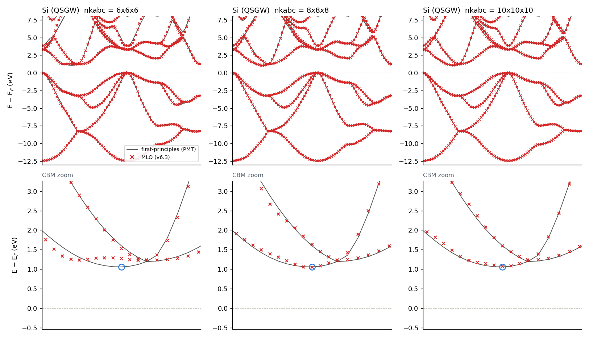
上段: 全域(価電子はどのメッシュでも一致)。下段: CBM 拡大(青丸 = DFT の CBM)。
6³ では MLO が谷底に届かず平坦化(m\*=2.75 の正体)、8³ で谷底到達、10³ でほぼ追従。

メッシュを上げるだけで(A は不変)ΔCBM は 165→10 meV に消滅、m\* 比は振動しつつ 1 へ収束。
**Si/C の CBM 問題は A の設計ではなくメッシュ収束の問題** — 平坦バンド(Cr d)で
問題が出ない事実とも整合。C(gap −140 meV, m\* 0.36)も同型と判断。
分散の大きい CBM を持つ系では、有効質量用途に nkabc を上げる(または CBM 近傍の
局所メッシュ細分化を将来検討)のが指針。

## 5. バンドプロット(灰線: 第一原理 PMT、赤×: MLO(最終形 v6.5 系))

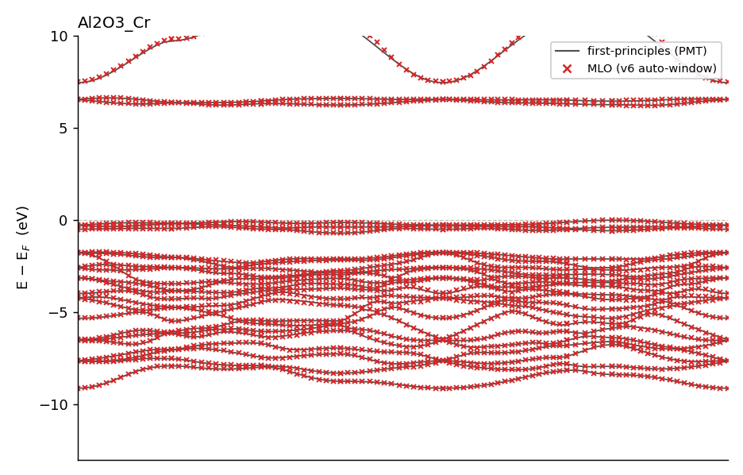
Al₂O₃:Cr — ギャップ内 Cr d・VBM/CBM とも凍結窓内で一致(gap −21 meV、m\* 0.98/1.02)。手調整 emax=7eV を完全自動置換。

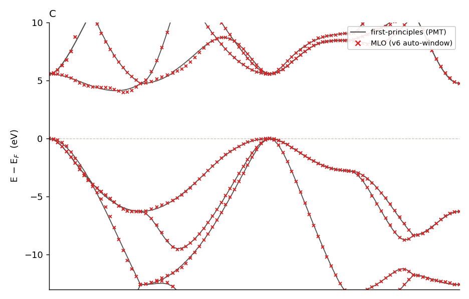
C(ダイヤ、8³)— CBM 曲率はメッシュ律速(gap −140 meV)。

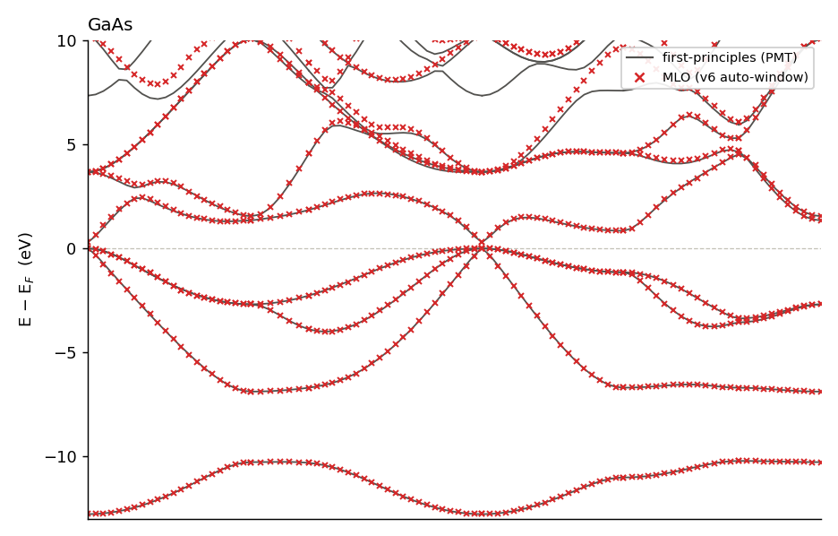
GaAs — 窓 rms 0.032 eV、gap +27 meV。

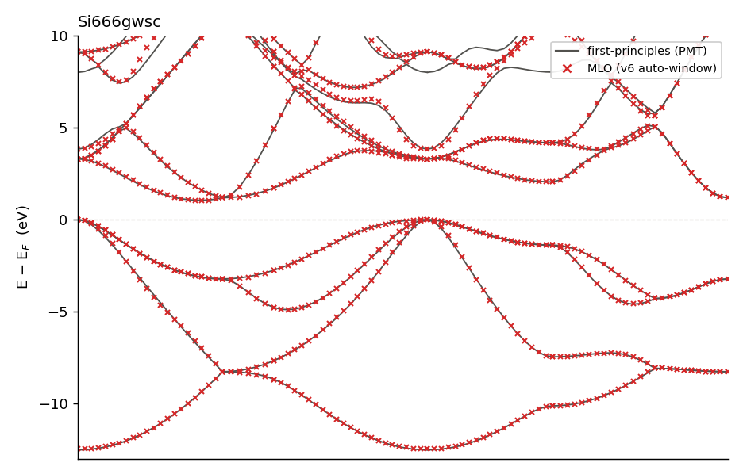
Si(QSGW、6³)— CBM 誤差はメッシュ由来(8³ で −10 meV に消滅、§4)。

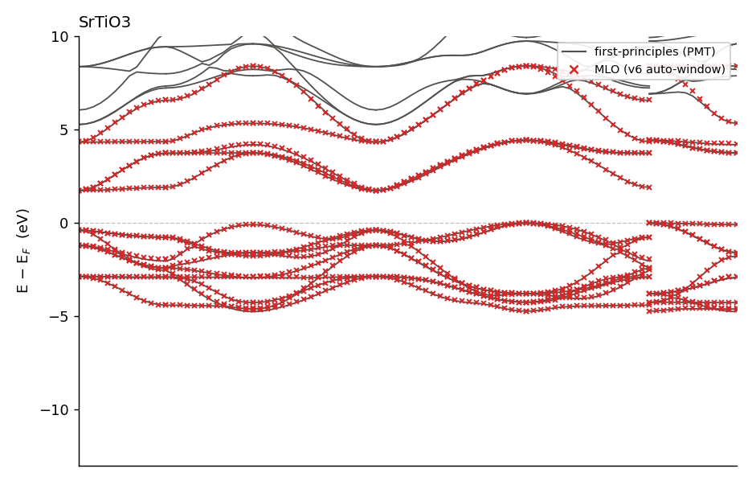
SrTiO₃ — 窓 rms 0.031 eV、m\*(VBM) 1.05。

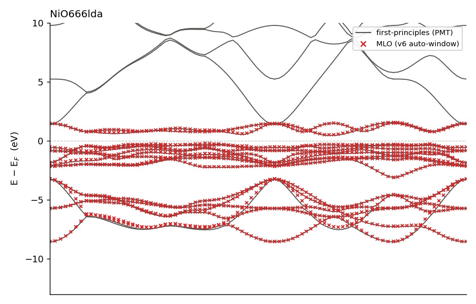
NiO — gap +10 meV、m\*(CBM) 0.98。

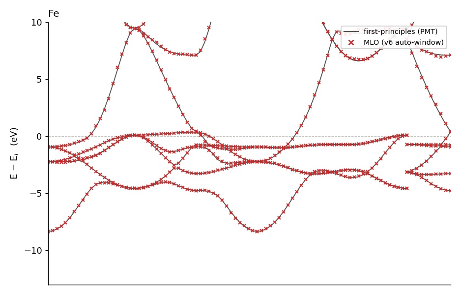
Fe — E_F+3eV 窓 rms 0.033 eV、m\* 1.16/1.12。

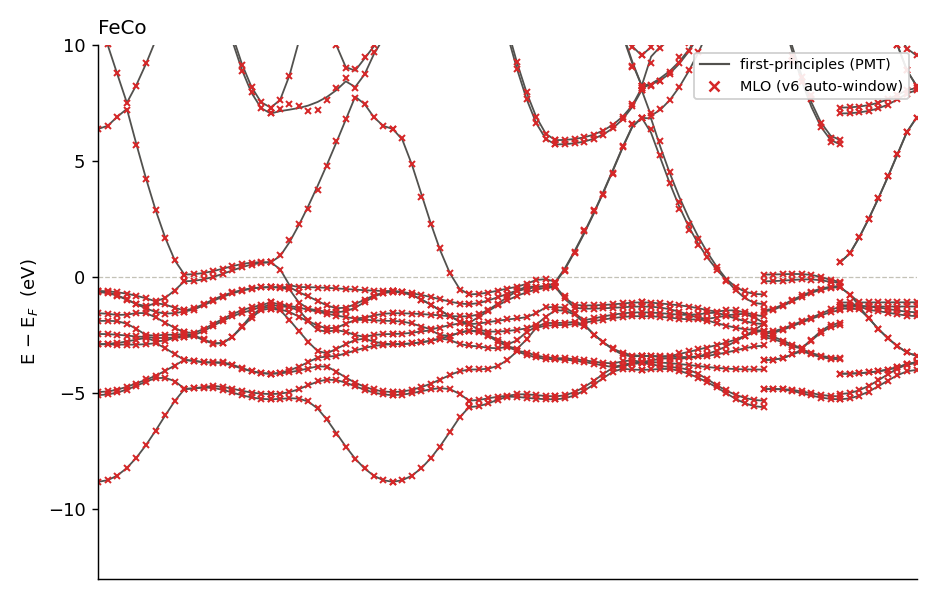
FeCo — rms 0.008 eV。

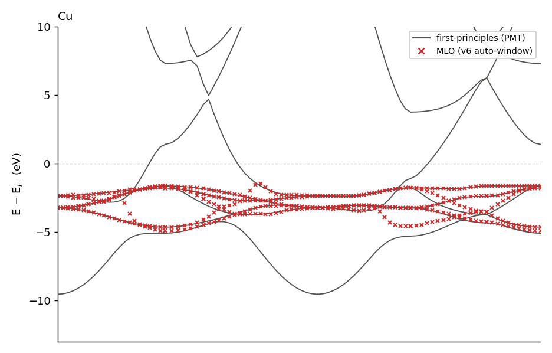
Cu — 残る最難系(rms 0.164)。d-s 混成の MTO 素性の問題の可能性、クラス別 Δ フィットの第一対象。

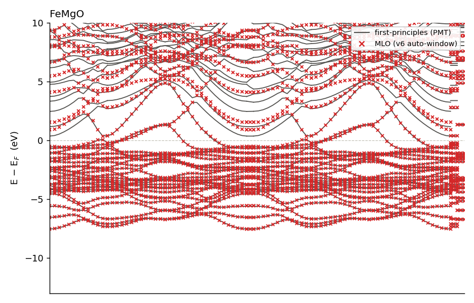
FeMgO スラブ — 二相系。CBM+3eV 凍結で 0.24→0.052 eV に改善。スパン外表面状態は残る(empty-sphere 追加が根治)。

## 6. 到達点と残課題

**到達点**: 15 系すべてで崩壊なし・手調整パラメータゼロ。
「mlo_method 1/2 と emax を系ごとに使い回す」運用は v6.3 で不要になった。
目標窓 [占有, CBM+3eV] の rms は Cu を除き全系 ≤0.073 eV(メッシュ律速分を除くと ≤0.059 eV)。

**残課題**:
1. **Cu**(rms 0.164)— A では詰め切れない可能性。クラス別 $\Delta_{\mathrm{class}}$ フィット
   ($e^{\mathrm{cut}}_{n''} \to \epsilon^{\mathrm{MTO}}_{n''}+\Delta_{\mathrm{class}(n'')}$、
   class = 非等価原子 × l、目的関数 = 窓バンド誤差 + スパン充足度)の第一対象
2. **メッシュ収束指針**(Si/C 型: 分散大 CBM の m\* 用途は nkabc ≥ 8–10)の文書化
3. FeMgO の表面状態(スパン外)— empty sphere を worb に追加する拡張
4. 4f 抽出型ミニマルモデル — 目標窓が別(mlo_emax 上書きキーで対応、既存)

---

再現: branch `mlo3` / `mlo_method = 3`(v6.3)/ ベンチ `Samples/MLOsamples/*__m3`(+ `Si666gwsc__m3k8/k10`)/
評価 `eval_v62.py`, `gap_and_plots.py`。手調整比較基準は各サンプル既定の `mlo_emax`(0 / 5 / 7 eV / auto)。
