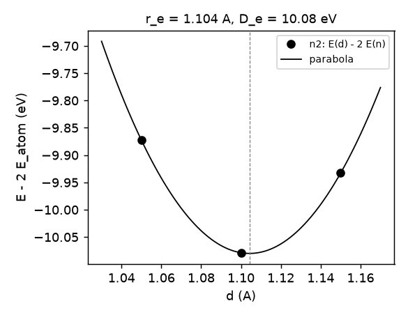

# AtomDimer/N2: 箱の中の N₂ 分子と N 原子 — 結合長と結合エネルギー

孤立した分子と原子を大きな立方体の箱に入れて計算する例。N₂ の全エネルギーを結合長 d の 3 点で計算し、放物線で最小を求めて
平衡結合長 $r_e$ と、同じ箱の N 原子の全エネルギーから結合エネルギー

$$ D_e = 2E(\mathrm{N}) - E_{\min}(\mathrm{N}_2) \tag{1}$$

を出す。2011〜2012 年の `Samples/Legacy/TestHomoDimerAtom`（周期表の同核二原子分子と原子を同じ箱で計算した一式）を、今の入力と命令で 1 例に絞ったもの。
当時の元素ごとの設定は [`../elements_2012.txt`](../elements_2012.txt) に残してある。

## 入力の要点

`ctrlg.n2.toml`（N₂）と `ctrlg.n.toml`（N 原子）。`POSCAR.n2` から `vasp2ctrl` と `ctrlgenToml.py n2 --skipgw` で作り、次を変えた。

| キー | 値 | 意味 |
| --- | --- | --- |
| `[struc] alat`、`plat` | 1 Å、15 Å の立方体 | 箱。`pos` の単位が Å になる |
| `[bz] nkabc` | [1, 1, 1] | Γ 点だけ |
| `[bz] metal`、`tetra`、`n`、`w` | 3、false、−1、0.001 | 四面体法を使わず、幅 0.001 Ry（157 K）の Fermi-Dirac で占有を決める（原子の縮退した p 準位のため） |
| `[bz] fsmom`、`fsmommethod` | N₂: 0、N 原子: 3。方法 1 | 全スピンモーメントを固定する。原子は S = 3/2（Hund 則）、分子は一重項 |
| `[ham] nspin`、`xcfun` | 2、103 | スピン分極、PBE |
| `[ham] pwemax` | 2.0 Ry | この箱で平面波が約 1050 個（MTO 26 個） |
| `[[spec]] r` | 1.01 bohr | MT 半径。d = 1.05 Å でも球は重ならない |
| `[[spec]] mmom`（原子） | [0, 3, 0, 0] | p 殻に 3 μ_B の初期モーメント |

結合長は `[[site]]` の `pos` の z 座標で与える。試験では `--ctrlg:site.1.pos=[0,0,-z] --ctrlg:site.2.pos=[0,0,z]`（z = d/2、Å）で入力を書き換えずに変える。

## 実行

```bash
# 原子
mkdir atom && cp ctrlg.n.toml atom/ && cd atom && lmfa n > llmfa && mpirun -np 8 lmf n > llmf && cd ..
# 分子、結合長 3 点（前の点の密度 rst.n2 から始める）
for d in 1.05 1.10 1.15; do
  z=$(python3 -c "print($d/2)"); mkdir d_$d; cp ctrlg.n2.toml d_$d/; cd d_$d; lmfa n2 > llmfa
  mpirun -np 8 lmf n2 --ctrlg:site.1.pos=[0,0,-$z] --ctrlg:site.2.pos=[0,0,$z] > llmf; cd ..
done
python3 dimer_curve.py n2 n 1.05 1.10 1.15      # dimer.txt、dimer.png、dimer.npz
```

試験は `Samples/AtomDimer` で `testecalj N2 -np 8`（8 ランクで 7 分。原子 1 分、分子は 1 点 2 分）。

## 結果

**表 1**. 得られた値（kr7、nvfortran、8 ランク、2026-09-30）。全エネルギーは `ehk`

| | d (Å) | E (eV) |
| --- | --- | --- |
| N₂ | 1.05 | −2979.470013 |
| N₂ | 1.10 | −2979.676172 |
| N₂ | 1.15 | −2979.530418 |
| N 原子 | — | −1484.798740 |

**表 2**. 放物線の最小と結合エネルギー

| | この計算 | 参考値 |
| --- | --- | --- |
| $r_e$ (Å) | 1.104 | 実験 1.098、PBE 1.10 |
| $D_e$ (eV) | 10.08 | 実験 9.9（零点振動を除く）、PBE の文献値 10.5 前後 |

PBE が結合エネルギーを過大に見積もる傾向はよく知られている。ここでは基底（`pwemax` 2 Ry、MT 半径 1.01 bohr）と箱を当時の設定のままにしてあるので、
文献値との差にはその分も含まれる。



**図 1**. N₂ の全エネルギー（原子 2 個からの差）と結合長。線は 3 点を通る放物線。数値は `dimer.npz`

- 3 点の放物線なので $r_e$ は 0.01 Å 程度の精度。点を増やす（`test.py` の `DS`）か、点の間隔を狭めれば上がる
- 箱の大きさ（15 Å）と `pwemax` は当時の設定のまま。収束は確かめていない
- ほかの元素は、`POSCAR.n2` の元素と `[[spec]]`、`fsmom`（分子の多重度と原子の Hund 則の値）、`mmom` を変える。当時の設定の表が `../elements_2012.txt`

## 試験の内容（`test.py`）

`dimer.txt`（3 点の全エネルギー、原子の全エネルギー、$r_e$・$E_{\min}$・$D_e$）を参照と比べる（許容 2×10⁻³ eV）。

## 由来

`Samples/Legacy/TestHomoDimerAtom`（2011〜2012、Python 2 と `%const` のテンプレート）。箱 15 Å、PBE、スピン分極、固定磁気モーメント、Γ 点、
という設定はそのまま。当時は 36 元素の同核二原子分子と原子を回し、結合曲線を描いた。
