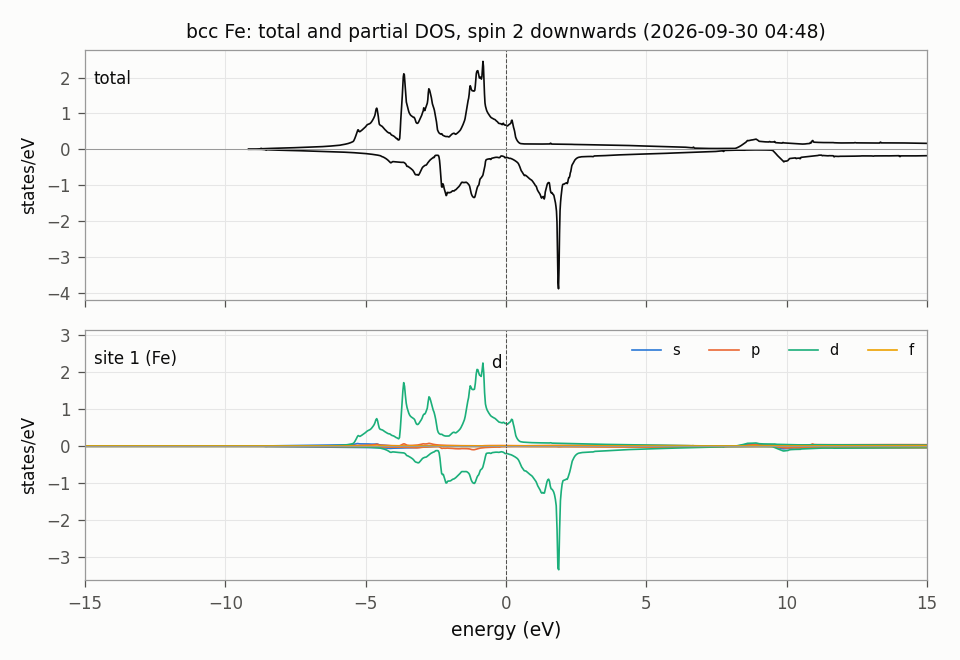

# DOS/Fe: 全状態密度と部分状態密度（強磁性の金属）

bcc Fe（GGA、強磁性）の全状態密度と、原子球の中の角運動量ごとの部分状態密度を、スピンごとに求める。
計算する量の式、出力ファイルの列、コマンドの説明は `../ZnS/README.md`（式 (1), (2)、表 2）にある。ここには Fe で違うところだけを書く。

## 1. 入力の要点（`ctrlg.fe.toml`）

| 表 1 | キー | 値 | 意味 |
|---|---|---|---|
| | `[ham] nspin` | 2 | スピン分極 |
| | `[[spec]] mmom` | [0, 0, 2, 0] | 磁気モーメントの初期値（d に 2 $\mu_B$） |
| | `[bz] nkabc` | [12, 12, 12] | k 点メッシュ。SCF と状態密度で同じものを使う |
| | `[bz] npts` | 6001 | 全状態密度のエネルギー点の数 |

## 2. 実行

```bash
lmfa fe > llmfa
mpirun -np 4 lmf fe > llmf
job_tdos fe -np 4 --NoGnuplot                                      # dos.tot.fe, dosi.tot.fe
job_pdos fe -np 4 --emin=-15 --emax=15 --ndos=1000 --NoGnuplot     # dos.isp1.site001.fe, dos.isp2.site001.fe
python3 dos_table.py fe --emin -15 --emax 15 --title "bcc Fe" --sites Fe   # tdos.txt, pdos_l.txt, dos.png（図 1）
```

## 3. 結果の見方

`nspin = 2` では、`dos.tot.fe` と `dosi.tot.fe` の 2 列目がスピン 1（多数スピン）、3 列目がスピン 2（少数スピン）。
部分状態密度はスピンごとに `dos.isp1.site001.fe`, `dos.isp2.site001.fe` に分かれる。
`tdos.txt` の列は、エネルギー、状態密度（スピン 1, 2）、状態の数（スピン 1, 2）。`pdos_l.txt` の列は、エネルギー、スピン 1 の s, p, d, f, g、
スピン 2 の s, p, d, f, g。エネルギーの原点はフェルミエネルギー $E_F$。

表 2: 得られた値（gfortran、2026-09-30）。

| 量 | スピン 1 | スピン 2 |
|---|---:|---:|
| $E_F$ での全状態密度（状態/eV） | 0.676 | 0.226 |
| $E_F$ までの状態の数 | 5.008 | 2.972 |
| 全状態密度の最大のピークの位置（eV） | -0.82 | 1.87 |
| 原子球の中の d の占有数（`pdos_l.txt` の $E_F$ までの積分） | 4.02 | 1.91 |

- 磁気モーメントは 2.04 $\mu_B$（`save.fe` の `mmom`。表 2 の状態の数の差 5.008 − 2.972 と同じ）。



図 1: bcc Fe の全状態密度（上）と原子球の中の部分状態密度（下）。スピン 2 は下向きに描いてある。破線は $E_F$。
描いた数値は `tdos.txt` と `pdos_l.txt`。

## 4. 実行時間とテスト

4 コアで約 30 秒（SCF 11 秒、`job_tdos` 2 秒、`job_pdos` 18 秒）。

```bash
cd Samples/DOS
testecalj Fe -np 4
```

テストは `tdos.txt` と `pdos_l.txt` の全部の数を比べる（許容差 5e-3）。

## 5. 元のサンプル

`Samples/Legacy/CMDsample`（`ctrlg.fe.toml`）。k 点メッシュを 8 から 12 に、`npts` を 2001 から 6001 にした。
