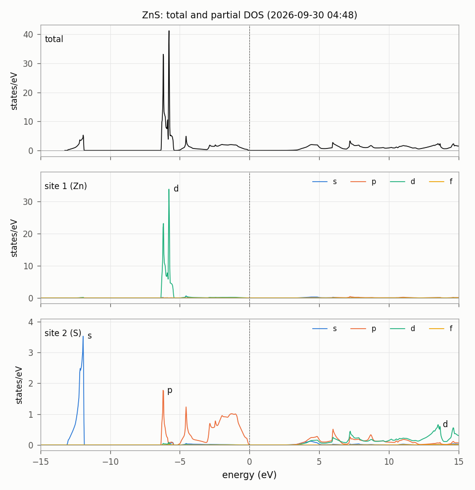

# DOS/ZnS: 全状態密度と部分状態密度（非磁性の半導体）

閃亜鉛鉱構造の ZnS（GGA）の全状態密度（total DOS）と、原子球の中の角運動量ごとの部分状態密度（partial DOS）を求める。
磁性のある例は `../Fe`。

## 1. 計算する量

全状態密度は四面体法で求める。

$$ D(E) = \sum_{n}\int_{\rm BZ}\frac{d^3k}{\Omega_{\rm BZ}}\;\delta\bigl(E-\varepsilon_{n\mathbf{k}}\bigr) \tag{1}$$

部分状態密度は、式 (1) の各項に、サイト $a$ の原子球の中の $lm$ 成分の重み $w^{a,lm}_{n\mathbf{k}}$ を掛けたものである。

$$ D_{a,lm}(E) = \sum_{n}\int_{\rm BZ}\frac{d^3k}{\Omega_{\rm BZ}}\; w^{a,lm}_{n\mathbf{k}}\;\delta\bigl(E-\varepsilon_{n\mathbf{k}}\bigr) \tag{2}$$

`nspin = 1` のときは、式 (1), (2) の値にスピンの 2 倍が入っている。原子球の外（格子間領域）の分は式 (2) には入らないので、
部分状態密度を全部足しても全状態密度にはならない。

## 2. 入力の要点（`ctrlg.zns.toml`）

| 表 1 | キー | 値 | 意味 |
|---|---|---|---|
| | `[bz] nkabc` | [8, 8, 8] | k 点メッシュ。SCF と状態密度で同じものを使う |
| | `[bz] npts` | 6001 | 全状態密度のエネルギー点の数。範囲はバンドの底から $E_F$ + 100 eV（または最も高い固有値）まで |
| | `[ham] xcfun` | 103 | GGA (PBE) |

- `job_tdos` と `job_pdos` は四面体法（`bz.metal = 3`, `bz.tetra = true`）で計算する。
- 部分状態密度のエネルギーの範囲と点の数は `job_pdos` のオプション `--emin`, `--emax`（eV）, `--ndos` で決める。
- 状態密度のときだけメッシュを細かくするには、`job_tdos`, `job_pdos` に `--ctrlg:bz.nkabc=[12,12,12]` のように与える。

## 3. 実行

```bash
lmfa zns > llmfa
mpirun -np 4 lmf zns > llmf
job_tdos zns -np 4 --NoGnuplot                                        # dos.tot.zns, dosi.tot.zns
job_pdos zns -np 4 --emin=-15 --emax=15 --ndos=1000 --NoGnuplot       # dos.isp1.site001.zns, dos.isp1.site002.zns
python3 dos_table.py zns --emin -15 --emax 15 --title "ZnS" --sites Zn,S   # tdos.txt, pdos_l.txt, dos.png（図 1）
```

`--NoGnuplot` を付けなければ gnuplot の図（`tdos.zns.glt`, `pdos.site001.zns.glt` など）が描かれる。
`job_pdos` は全状態密度も計算するので、部分状態密度が要るときは `job_pdos` だけでもよい。

## 4. 結果の見方

表 2: 出力ファイル。エネルギーの原点は、絶縁体では価電子帯の上端、金属ではフェルミエネルギー。

| ファイル | 単位 | 列 |
|---|---|---|
| `dos.tot.zns` | Ry, 状態/Ry/単位胞 | 1: エネルギー、2: 全状態密度 |
| `dosi.tot.zns` | Ry, 状態の数 | 1: エネルギー、2: そのエネルギーまでの状態の数 |
| `dos.isp1.site<iii>.zns` | Ry, 状態/Ry | 1: エネルギー、2〜26: サイト iii の $lm$ = 1〜25 の部分状態密度（実球面調和関数。1: s、2〜4: p、5〜9: d、10〜16: f、17〜25: g） |
| `tdos.txt` | eV, 状態/eV | 1: エネルギー、2: 全状態密度、3: 状態の数（-15〜15 eV） |
| `pdos_l.txt` | eV, 状態/eV | 1: エネルギー、そのあとサイトごとに s, p, d, f, g（$m$ について和をとったもの） |

サイトの番号は `[[site]]` の順（1: Zn、2: S）。

表 3: 得られた値（gfortran、2026-09-30）。占有数は `pdos_l.txt` を価電子帯の上端まで積分したもの（スピンの 2 倍を含む）。

| 量 | 値 |
|---|---|
| ギャップ（`llmf` の `gap`） | 2.098 eV |
| 価電子帯の上端までの状態の数（`tdos.txt`） | 18.00 |
| Zn 3d のピーク | -5.78 eV |
| S 3s のバンド | -13.1 〜 -11.9 eV |
| 原子球の中の占有数 Zn s, p, d | 0.37, 0.29, 9.61 |
| 原子球の中の占有数 S s, p | 1.49, 2.91 |



図 1: ZnS の全状態密度（上）と、Zn（中）、S（下）の原子球の中の部分状態密度。破線は価電子帯の上端。
描いた数値は `tdos.txt` と `pdos_l.txt`。

## 5. 実行時間とテスト

4 コアで約 20 秒（SCF 6 秒、`job_tdos` 2 秒、`job_pdos` 11 秒）。

```bash
cd Samples/DOS
testecalj ZnS -np 4
```

テストは `tdos.txt` と `pdos_l.txt` の全部の数を比べる（許容差 5e-3）。

## 6. 元のサンプル

`Samples/Legacy/CMDsample`（`ctrlg.zns.toml`）。k 点メッシュを 4 から 8 にした。
