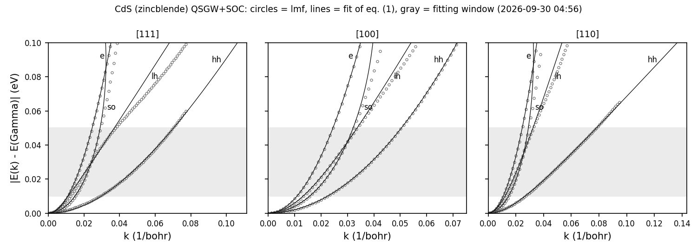

# EffectiveMass/CdS: 閃亜鉛鉱型 CdS の有効質量（QSGW + スピン軌道相互作用）

閃亜鉛鉱型 CdS の Γ 点のまわりの有効質量を求める。方法、`syml` の質量モードの書き方、出力ファイルの列、`massfit.py` の式は
`../GaAs/README.md`（式 (1)）と同じで、スクリプト `massfit.py`, `massplot.py` も同じものである。ここには CdS で違うところだけを書く。

## 1. 入力の要点

- `sigm.cds`: 元のサンプルの QSGW の自己エネルギー。`ctrlg.cds.toml` の `[ham] rdsig = 12` で読む。
- `syml.cds`: `etolv` を 0.3 Ry にしてある（GaAs では 0.1）。スピン軌道相互作用を入れた閃亜鉛鉱構造では、価電子帯の上端が
  Γ 点からわずかにずれる（CdS の [111] で Γ より 0.16 meV 上）。このとき lmf は、書き出すバンドの範囲を
  価電子帯の上端 ± `etolv` と数えるので、`etolv` がギャップより小さいと伝導帯が書き出されず、`massfit.py` が
  `Band007Syml001Spin1.dat not found` で止まる。0.3 Ry = 4.08 eV はギャップ 2.84 eV より大きく、Γ 点でこの範囲に入るのは
  価電子帯の 6 本と伝導帯の 2 本だけである。

## 2. 実行

```bash
lmfa cds > llmfa
mpirun -np 4 lmf cds > llmf                       # sigm.cds を使った自己無撞着計算
job_band cds -np 4 --ctrlg:ham.nspin=2 --ctrlg:ham.so=1 --NoGnuplot
python3 massfit.py                                 # mass.txt, mass_detail.txt, massfit.npz
python3 massplot.py "CdS (zincblende) QSGW+SOC"    # massfit.png（図 1）
```

## 3. 結果

表 1: 有効質量 $m^*/m$（`mass.txt`。gfortran、MPI 4 並列、2026-09-30）。二つの値は対になった 2 本のバンドの値。

| バンド | [111] | [100] | [110] |
|---|---|---|---|
| e | 0.1604 | 0.1604 | 0.1605, 0.1603 |
| lh | 0.1165 | 0.2185 | 0.1831, 0.1488 |
| hh | 1.1578, 1.8326 | 0.6873 | 0.7979, 1.6361 |
| so | 0.3185 | 0.3487 | 0.3126, 0.3413 |

- Γ 点のギャップは 2.8425 eV、スピン軌道分裂は 0.0683 eV。
- 元のサンプルの値（`Samples/Legacy/mass_fit_test/out`: e 0.160、lh[100] 0.218、hh[100] 0.687、so[111] 0.319、
  hh[111] 1.157 と 1.829）と 0.004 以内で一致する。
- スピン軌道分裂 0.068 eV が合わせの範囲（0.01〜0.05 eV）に近いので、so と lh は放物線からのずれが大きい
  （`mass_detail.txt` の $E_0$ が -0.18〜0.12 eV）。これらの質量は、この範囲で合わせたときの値として読む。



図 1: Γ からの三方向のバンド（丸）と `../GaAs/README.md` の式 (1) の合わせ（線）。灰色は合わせに使うエネルギーの範囲。
描いた数値は `massfit.npz`。

## 4. 実行時間とテスト

MPI 4 並列で 45 秒〜1 分（自己無撞着計算 12 反復、バンドが約 25 秒）。

```bash
cd Samples/EffectiveMass
testecalj CdS -np 4
```

テストは `mass.txt`（24 本のバンドの質量、Γ 点のギャップとスピン軌道分裂）を比べる（許容差は絶対値 1e-3 または相対値 2e-3）。

## 5. 元のサンプル

`Samples/Legacy/mass_fit_test/CdS_so.qsgw.mass`。元のサンプルの `rst.cds` は使わず、自己無撞着計算をやり直す。
