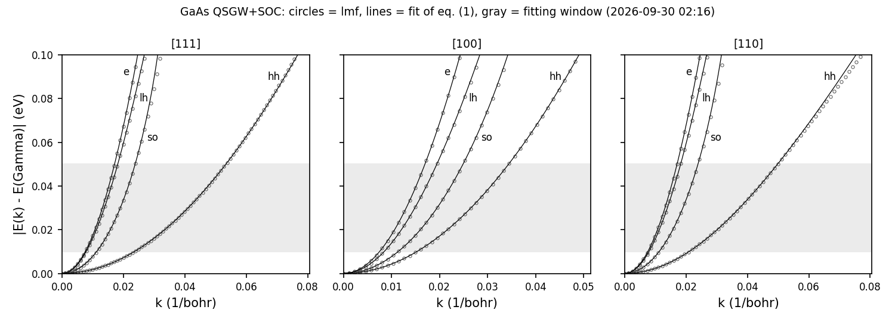

# EffectiveMass/GaAs: バンドの有効質量（QSGW + スピン軌道相互作用）

> 説明の本体: ecaljdoc の [manual/UsageDetailed.md](../../../ecaljdoc/manual/UsageDetailed.md)「ecalj/Samples/」（サイト https://ecalj.github.io/ecaljdoc/manual/UsageDetailed）。サンプルの一覧は [manual/samples.md](../../../ecaljdoc/manual/samples.md)。

GaAs の Γ 点のまわりの有効質量を、Γ から [111], [100], [110] の三方向へ伸びる短い線の上の細かい k 点の
バンドから求める。バンドは、保存してある QSGW の自己エネルギー `sigm.gaas` を使い、スピン軌道相互作用（SOC）を
入れて計算する。`syml.gaas` を「質量モード」で書くと、lmf がギャップの近くのバンドを 1 本ずつファイルに書き出すので、
それを `massfit.py`（numpy の最小二乗）で次の式に合わせる。

$$ \frac{\hbar^2 k^2}{2 m^*} = |E| \left( 1 + \frac{|E|}{E_0} \right) \tag{1}$$

$E$ は Γ 点のバンド端から測ったエネルギー、$m^*$ が有効質量、$E_0$ は放物線からのずれを表す。

## 入力の要点

- `ctrlg.gaas.toml`: `[ham] rdsig = 12` により `sigm.gaas` を読む。自己無撞着計算は `nspin = 1`, `so = 0` で行い、
  バンドの計算のときだけコマンド行で `--ctrlg:ham.nspin=2 --ctrlg:ham.so=1` を与える。
- `sigm.gaas`: 旧サンプルの QSGW の自己エネルギー（6×6×6）。旧サンプルの `rst.gaas` は今の lmf では読めないので、
  自己無撞着計算で作り直す。
- `syml.gaas`: 質量モードの線は、ラベルのあとに `ndiv2 ninit2 nend2 etolv etolc` を書く。線を `ndiv2` 点に分けた
  細かい網のうち `ninit2` 番から `nend2` 番の点（ここでは線の長さの 80/512 まで）が質量用に加わる。
  書き出されるのは、Γ でのエネルギーが価電子帯の上端から `etolv`（Ry）下までと、伝導帯の下端から `etolv`（Ry）上までの
  バンドである（`etolc` は読まれるが、2026-09-30 の版では使われていない）。

## 実行

```bash
lmfa gaas > llmfa
mpirun -np 4 lmf gaas > llmf                      # sigm.gaas を使った自己無撞着計算
job_band gaas -np 4 --ctrlg:ham.nspin=2 --ctrlg:ham.so=1 --NoGnuplot
python3 massfit.py                                 # mass.txt, mass_detail.txt, massfit.npz
python3 massplot.py "GaAs QSGW+SOC"                # massfit.png（図 1）
```

試験は `Samples/EffectiveMass` で `testecalj GaAs -np 4`。手で実行するときは、このディレクトリを別の場所に写してその中で行う
（`testecalj` はこのディレクトリをまるごと写して使うので、`rst.*` などをここに残さない）。

## 結果の見方

`job_band` は `Band<ib>Syml<is>Spin1.dat` を書く（`is` = 1, 2, 3 が [111], [100], [110]）。5 列目が Γ から測った
$|k|$（1/bohr。ファイルの見出しには `|k|/(2pi*alat)` とあるが値は 1/bohr）、6 列目が価電子帯の上端から測ったエネルギー（eV）、
7 列目が Γ での値から測ったエネルギー（eV）。
SOC があると 1 本の線につき 8 本で、下から 1,2 がスピン軌道分裂バンド（so）、3,4 が軽い正孔（lh）、
5,6 が重い正孔（hh）、7,8 が伝導帯（e）である。`massfit.py` は $0.01 \le |E| \le 0.05$ eV の点を式 (1) に合わせる。

表 1: 得られた有効質量 $m^*/m$（`mass.txt`。gfortran、MPI 4 並列、2026-09-30）。
二つの値は対になった 2 本のバンドの値である。閃亜鉛鉱構造には反転対称性がないので、方向によって対のバンドが分かれる
（[110] の各バンドと [111] の hh）。

| バンド | [111] | [100] | [110] |
|---|---|---|---|
| e | 0.0759 | 0.0760 | 0.0760, 0.0759 |
| lh | 0.0811 | 0.0959 | 0.0836, 0.0843 |
| hh | 0.7480, 0.7824 | 0.3158 | 0.5776, 0.5760 |
| so | 0.1757 | 0.1776 | 0.1746, 0.1777 |

- Γ 点のギャップは 1.7757 eV、スピン軌道分裂は 0.3374 eV（`mass.txt` の終わりの 2 行）。
- 表 1 は旧サンプルの gnuplot による値（`Samples/Legacy/mass_fit_test/out`: 例えば e 0.076、lh[100] 0.096、
  hh[100] 0.316、so[100] 0.178）と 0.001 以内で一致する。
- $E_0$ と合わせに使った点の数は `mass_detail.txt` にある。放物線に近いバンドでは $E_0$ は決まりにくい
  （hh [111] の 2 本で 1.40 eV と 4.67 eV）。$E_0$ と質量が一意に決まるのは [100] で、ほかの方向ではバンドの分裂が混じる
  （A. N. Chantis, M. van Schilfgaarde, T. Kotani, Phys. Rev. Lett. 96, 086405 (2006)）。



図 1: Γ からの三方向のバンド（丸）と式 (1) の合わせ（線）。灰色は合わせに使うエネルギーの範囲。
描いた数値は `massfit.npz`（`k_<方向>_<ib>`, `e_<方向>_<ib>`, 係数 `ab_<方向>_<ib>`）にある。

## 計算時間

MPI 4 並列（16 コアの計算機）で、自己無撞着計算（28 反復）が約 1 分、バンドが約 30〜45 秒、全体で 1.6〜2.2 分。

## 試験の内容（`test.py`）

`mass.txt`（24 本のバンドの質量、Γ 点のギャップとスピン軌道分裂）を参照と比べる（許容 1e-3）。

## 由来

`Samples/Legacy/mass_fit_test` の GaAs（`GaAs_so.qsgw.mass`）。旧サンプルの `job_mass.py`（Python 2 と gnuplot）を
`massfit.py` に置き換えた。旧サンプルには CdS と閃亜鉛鉱型 GaN もある。
