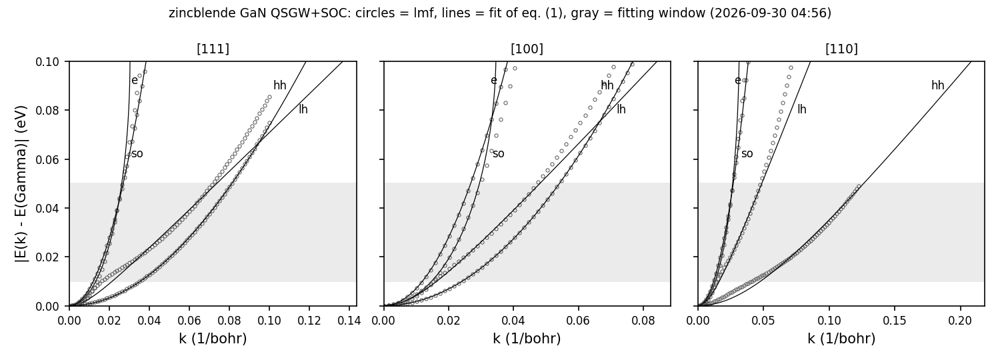

# EffectiveMass/GaN: 閃亜鉛鉱型 GaN の有効質量（QSGW + スピン軌道相互作用）

閃亜鉛鉱型 GaN（物質名 `ganzb`）の Γ 点のまわりの有効質量を求める。方法、`syml` の質量モードの書き方、出力ファイルの列、
`massfit.py` の式は `../GaAs/README.md`（式 (1)）と同じで、スクリプト `massfit.py`, `massplot.py` も同じものである。
ここには GaN で違うところだけを書く。

## 1. 入力の要点

- `sigm.ganzb`: 元のサンプルの QSGW の自己エネルギー。`ctrlg.ganzb.toml` の `[ham] rdsig = 12` で読む。
- `syml.ganzb`: `etolv` を 0.3 Ry にしてある（GaAs では 0.1）。理由は `../CdS/README.md` の §1 と同じで、0.3 Ry = 4.08 eV は
  ギャップ 3.68 eV より大きい。

## 2. 実行

```bash
lmfa ganzb > llmfa
mpirun -np 4 lmf ganzb > llmf                     # sigm.ganzb を使った自己無撞着計算
job_band ganzb -np 4 --ctrlg:ham.nspin=2 --ctrlg:ham.so=1 --NoGnuplot
python3 massfit.py                                 # mass.txt, mass_detail.txt, massfit.npz
python3 massplot.py "zincblende GaN QSGW+SOC"      # massfit.png（図 1）
```

## 3. 結果

表 1: 有効質量 $m^*/m$（`mass.txt`。gfortran、MPI 4 並列、2026-09-30）。二つの値は対になった 2 本のバンドの値。

| バンド | [111] | [100] | [110] |
|---|---|---|---|
| e | 0.1925 | 0.1925 | 0.1925, 0.1924 |
| lh | 0.4057 | 0.2940 | 0.2837, 0.4847 |
| hh | 1.6852, 1.9961 | 0.7925 | 2.7649, 3.7188 |
| so | 0.2469 | 0.3108 | 0.2451, 0.2798 |

- Γ 点のギャップは 3.6838 eV、スピン軌道分裂は 0.0178 eV。
- 元のサンプルの値（`Samples/Legacy/mass_fit_test/out`: e 0.192、lh[100] 0.294、hh[100] 0.793、so[111] 0.247、
  hh[110] 2.766 と 3.720）と 0.002 以内で一致する。
- スピン軌道分裂 0.018 eV は合わせの範囲（0.01〜0.05 eV）の中にある。価電子帯の 3 組のバンドはこの範囲で互いに混じり、
  式 (1) の形から外れる（図 1 の so と lh、`mass_detail.txt` の $E_0$ が -0.2〜0.08 eV）。表 1 の so, lh, hh は
  この範囲で合わせたときの値であって、バンド端の質量ではない。伝導帯の質量 0.192 は方向によらず決まっている。



図 1: Γ からの三方向のバンド（丸）と `../GaAs/README.md` の式 (1) の合わせ（線）。灰色は合わせに使うエネルギーの範囲。
描いた数値は `massfit.npz`。

## 4. 実行時間とテスト

MPI 4 並列で 30〜45 秒（自己無撞着計算 12 反復、バンドが約 15〜30 秒）。

```bash
cd Samples/EffectiveMass
testecalj GaN -np 4
```

テストは `mass.txt`（24 本のバンドの質量、Γ 点のギャップとスピン軌道分裂）を比べる（許容差は絶対値 1e-3 または相対値 2e-3）。

## 5. 元のサンプル

`Samples/Legacy/mass_fit_test/GaNzb_so.qsgw.mass`。元のサンプルの `rst.ganzb` は使わず、自己無撞着計算をやり直す。
