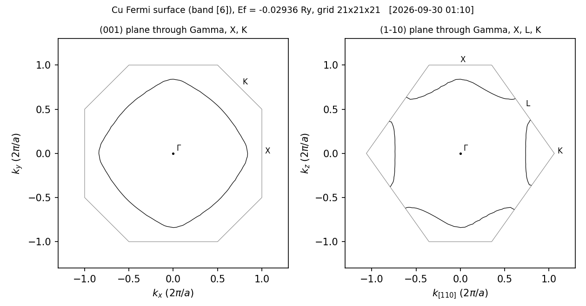

# Cu のフェルミ面（xcrysden 用の bxsf ファイル）

fcc Cu を LDA で自己無撞着に解いたあと、`job_fermisurface` でブリルアンゾーン全体の格子点の固有値を求め、
xcrysden が読む `fermiup.bxsf` を作ります。Cu のフェルミ面は 6 番目のバンド（sp バンド）一枚で、
L 点のまわりでゾーン境界に届いて「ネック」を作ります（図 1）。

## 実行

```bash
lmfa cu > llmfa
mpirun -np 4 lmf cu > llmf
job_fermisurface cu -np 4 -vnk1=10 -vnk2=10 -vnk3=10
xcrysden --bxsf fermiup.bxsf            # 表示（スピン分極のときは fermidn.bxsf も）
python3 plot_fs.py fermiup.bxsf         # 断面図 fs_section.png と数値 fs_section.npz
```

`job_fermisurface` は `lmf` を二度走らせます。

1. `lmf cu --quit=band --ctrlg:bz.nkabc=[10,10,10]`: 10×10×10 メッシュでフェルミエネルギーを決める。
   値は `efermi.lmf.job_fermisurface` に入り、自己無撞着計算の `efermi.lmf` は変わりません。
2. `lmf cu --fermisurface --ctrlg:bz.nkabc=[11,11,11]`: 式 (1) の格子点（分割数 $N = 10$、両端を含む 11×11×11 点）で
   固有値を求めて書き出す。対称性は使わないので、時間は点の数に比例します。

$$ \mathbf{k} = \frac{i_1}{N}\mathbf{b}_1 + \frac{i_2}{N}\mathbf{b}_2 + \frac{i_3}{N}\mathbf{b}_3, \qquad i_1, i_2, i_3 = 0, \dots, N \tag{1}$$

$\mathbf{b}_1, \mathbf{b}_2, \mathbf{b}_3$ は逆格子の基本ベクトルです。`fermiup.bxsf` には、バンドごとに、式 (1) の点の固有値が
$i_3$ を最も速く回す順に並びます。書き出すバンドは、$E_{\rm F}$ から `--emin`〜`--emax`（eV、既定は −10〜10）の窓にかかるものです。

## 見るところ

表 1 が得られた値です（2026-09-30、gfortran、4 並列）。

表 1: Cu の結果

| 量 | 値 |
| --- | --- |
| 全エネルギー（`save.cu` の `c` 行、ehf） | −44965.744179 eV |
| $E_{\rm F}$（自己無撞着、12×12×12、`efermi.lmf`） | −0.027163 Ry |
| $E_{\rm F}$（10×10×10、`fermiup.bxsf` の `Fermi Energy:`） | −0.02595 Ry |
| `fermiup.bxsf` のバンド | 1〜9 番の 9 本。$E_{\rm F}$ を横切るのは 6 番だけ |
| 6 番のバンドの範囲 | −0.20051 〜 0.33085 Ry |
| $k_{\rm F}$ [100] 方向 / [110] 方向 / L 点のネックの半径（10 分割） | 0.838 / 0.734 / 0.139 （$2\pi/a$） |
| 同（20 分割、$E_{\rm F}$ = −0.02936 Ry） | 0.840 / 0.737 / 0.149 （$2\pi/a$） |



図 1: フェルミ面の断面。左は (001) 面、右は (1−10) 面（ともに Γ を通る）。灰色の線は第一ブリルアンゾーンの境界。
`-vnk1=20 -vnk2=20 -vnk3=20` の `fermiup.bxsf` から `plot_fs.py` で描いたもの（線の数値は `fs_section.npz`）。
右の図で、フェルミ面が L 点のまわりでゾーン境界に届いている。

## 注意

- `fermiup.bxsf` と、いっしょに書かれる `fermiup.data`（第一ブリルアンゾーンに戻した k と固有値の表）のエネルギーの単位は Ry です。
- 分割数を増やすと滑らかになります。20 分割（21×21×21 点）で `fermiup.bxsf` は 0.84 MB です。

## 時間

`testecalj Cu -np 4` は 10〜16 秒（16 コアの計算機、4 並列）。20 分割の `job_fermisurface` は 1 分ほど。

## テスト

`testecalj Cu -np 4`（一つ上のディレクトリで）。`save.cu` の全エネルギーと、`fermiup.bxsf` の全部の数値（許容 2×10⁻⁴ Ry）を比べます。

もとは `Samples/Legacy/FermiSurface` です。
