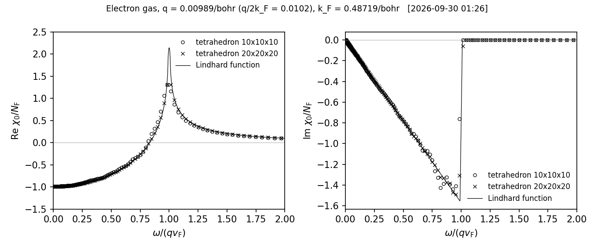

# 一様電子ガスの Lindhard 関数（四面体法の確認）

> 説明の本体: ecaljdoc の [manual/samples.md](../../../ecaljdoc/manual/samples.md)（サイト https://ecalj.github.io/ecaljdoc/manual/samples）。サンプルの一覧は [manual/samples.md](../../../ecaljdoc/manual/samples.md)。

GW や誘電関数で使う四面体法（分極関数の虚部を四面体の重みで積み、実部を Hilbert 変換で求める）を、
答えが解析的に分かっている一様電子ガスで確かめる例です。プログラム `hhomogas` は、格子、k メッシュ、振動数のメッシュを入力から取り、
バンドは自由電子 $\varepsilon_{\mathbf k} = |\mathbf{k}|^2$（Ry）として、相互作用の無い分極関数 $\chi_0(\mathbf{q}, \omega)$ を計算します。
格子は bcc（Li の格子定数 6.35 bohr）で、原子の位置には空球を置きます。

## 実行

```bash
lmfa es > llmfa
lmf es --jobgw=0 > llmfgw00                         # 格子と対称性（__HAMindex0）
qg4gw es --job=1 > lqg4gw                           # k メッシュ [gw] n1n2n3 と四面体（__BZDATA）
mpirun -np 4 lmf es --jobgw=1 --skipCPHI > llmfgw01 # hhomogas が読む格子などの情報
hhomogas es > lhhomogas                             # x0homo.dat
python3 plot_lindhard.py                            # 解析解との比較 lindhard.png, lindhard.npz
```

自己無撞着計算（`lmf es`）は要りません。k メッシュを変えるときは、`qg4gw` から後の三つに同じ
`--ctrlg:gw.n1n2n3=[20,20,20]` を付けます。

フェルミエネルギーと q 点は `SRC/subroutines/main_hhomogas.f90` の中で決めてあります。
電子数は単位胞（体積 $\Omega$ = 128.024 bohr³）に 0.5 個で、$E_{\rm F}$ = 0.237356 Ry、$k_{\rm F}$ = 0.48719 bohr⁻¹、$r_s$ = 3.939。
q 点は $\mathbf{q} = (0.001\, i_q, 0, 0)\, 2\pi/a$（$i_q = 1, \dots, 10$）です。

## 出力 x0homo.dat

q 点ごとのブロック（空行二つで区切る）に、振動数ごとの行が並びます。列は

`iq  iw  qx qy qz（2π/a）  |q|（bohr⁻¹）  ω（Ry）  Re  Im`

で、最後の二つは $\chi_0(\mathbf{q},\omega)\,\Omega$（単位は Hartree⁻¹、スピンの和を含む）です。

## 解析解

フェルミ準位の状態密度（単位体積、両スピン、Hartree 原子単位）を式 (1)、無次元の変数を式 (2) とすると、
Lindhard 関数は式 (3)、(4) です。

$$ N_{\rm F} = \frac{k_{\rm F}}{\pi^2} \tag{1}$$

$$ u = \frac{\omega}{q v_{\rm F}}, \qquad z = \frac{q}{2 k_{\rm F}}, \qquad v_{\rm F} = k_{\rm F} \tag{2}$$

$$ \frac{{\rm Re}\,\chi_0}{N_{\rm F}} = -\left[ \frac{1}{2} + \frac{1-(z-u)^2}{8z} \ln\left|\frac{z-u+1}{z-u-1}\right|
 + \frac{1-(z+u)^2}{8z} \ln\left|\frac{z+u+1}{z+u-1}\right| \right] \tag{3}$$

$$ \frac{{\rm Im}\,\chi_0}{N_{\rm F}} = \begin{cases} -\dfrac{\pi}{2} u & (u < 1 - z) \\[2mm]
 -\dfrac{\pi}{8z}\left[1-(z-u)^2\right] & (1-z < u < 1+z) \\[2mm] 0 & (u > 1+z) \end{cases} \tag{4}$$

式 (4) は $z < 1$ の場合です。`x0homo.dat` の値を $N_{\rm F}\Omega$ = 6.3196 Hartree⁻¹ で割ると、式 (3)、(4) と比べられます。

## 見るところ

表 1: $\omega = 0$ の $\chi_0/N_{\rm F}$（$i_q$ = 10、$q$ = 0.00989 bohr⁻¹、$z$ = 0.0102）と時間（2026-09-30、gfortran、`lmf --jobgw=1` だけ 4 並列）

| k メッシュ `n1n2n3` | $\chi_0/N_{\rm F}$ | 式 (3) | `qg4gw` | `lmf --jobgw=1` | `hhomogas` |
| --- | --- | --- | --- | --- | --- |
| 10×10×10 | −0.9864 | −1.0000 | 1 秒 | 3 秒 | 2 秒 |
| 20×20×20 | −0.9940 | −1.0000 | 35〜51 秒 | 56〜62 秒 | 2〜3 秒 |

`x0homo.dat` の最初の行（$i_q$ = 1、$\omega$ = 0）の実部は、10×10×10 で −6.2193、20×20×20 で −6.2746 です（$-N_{\rm F}\Omega$ = −6.3196）。



図 1: $i_q$ = 10 の $\chi_0/N_{\rm F}$ の実部（左）と虚部（右）。○ は 10×10×10、× は 20×20×20 の四面体法、線は式 (3)、(4)。
横軸は $u = \omega/(q v_{\rm F})$。描いた数値は `lindhard.npz`。
20×20×20 の点を重ねるには `python3 plot_lindhard.py 10x10x10=x0homo.dat 20x20x20=<20×20×20 の x0homo.dat>`。

## 注意

- `ctrlg.es.toml` の空球の核電荷は `z = 0.0001` です。`z = 0` でも上の手順は動きますが、自己無撞着計算 `lmf es` は
  電子が無いために止まります（`zhev_tk4: the Hamiltonian contains NaN`）。空格子のバンドを `lmf es`、`job_band es` で
  見るときのために 0.0001 にしてあります。
- 密度や q 点を変えるには `main_hhomogas.f90` を書き換えます（`ntot`、`iqloop` の中の `q`）。

## 時間

`testecalj es -np 4`（10×10×10）は 5〜8 秒（16 コアの計算機）。20×20×20 は表 1 のとおり 2 分ほど。

## テスト

`testecalj es -np 4`（一つ上のディレクトリで）。`x0homo.dat` の全部の数値を比べます（許容は絶対値 10⁻³ または相対 10⁻³）。

もとは `Samples/Legacy/TETRAHEDRON_HomoGas` です。
