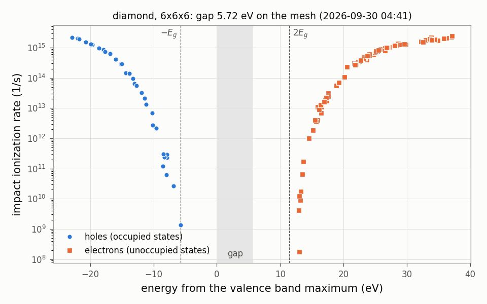

# IIR/C: ダイヤモンドの衝突イオン化率（自己エネルギーの虚部）

ダイヤモンドの電子と正孔の衝突イオン化率（impact ionization rate）を、one-shot GW の自己エネルギーの虚部から求める。
k 点メッシュを粗くした動作確認用のサンプルで、**値は収束していない**（§4 の表 2）。

## 1. 計算する量

状態 $(\mathbf{q}, n)$ の準粒子の幅と、その逆数の寿命 $\tau$ は

$$ \Gamma_{\mathbf{q}n} = 2 Z_{\mathbf{q}n}\,\bigl|{\rm Im}\,\Sigma_{\mathbf{q}n}(\varepsilon_{\mathbf{q}n})\bigr|,\qquad
\frac{1}{\tau_{\mathbf{q}n}} = \frac{\Gamma_{\mathbf{q}n}}{\hbar} \tag{1}$$

$\Sigma_{\mathbf{q}n}$ は自己エネルギーの対角成分、$Z$ は繰り込み因子、$\hbar = 0.6582$ eV fs。電子と正孔の対を作ることによる幅なので、
エネルギーの保存から、価電子帯の上端から測って $-E_g$ より上の正孔と、$2E_g$ より下の電子では 0 になる（$E_g$ はギャップ）。

## 2. 入力の要点

| 表 1 | ファイル・キー | 値 | 意味 |
|---|---|---|---|
| | `sigm.c` | | QSGW80 の自己エネルギー（6×6×6 で作ったもの）。ギャップの正しい基底状態を与える |
| | `[ham] scaledsigma` | 0.8 | QSGW80（LDA を 20 % 混ぜる）。`sigm.c` を作ったときと同じ値にする |
| | `[gw] n1n2n3` | [6, 6, 6] | 式 (1) の自己エネルギーのメッシュ。その既約な点（16 点）の全部で計算する |
| | `[gw] EMAXforGW` | 30 (eV) | フェルミエネルギーからこの値までのバンドを計算する（ここでは 12 本） |
| | `[product_basis] pb_lcutmx` | [2, 2] | 積基底の角運動量の上限。軽い原子なので 2 に下げてある |

- 計算する状態は `EMAXforGW`（と `EMINforGW`）で決める。`[blocks] QPNT` に書くバンドの表は `gw_lmfh` では使われない。
- 計算する q 点を選びたいときは `[gw]` に `QforGW = """ ... """`（1 行に q の 3 成分、$2\pi/a$ 単位）を書く。無ければ既約な点の全部。

## 3. 実行

```bash
lmfa c > llmfa
mpirun -np 4 lmf c > llmf            # sigm.c を使った自己無撞着計算
gw_lmfh c -np 4 > lgw_lmfh           # QPU, QPU_life
python3 iir_rate.py --title "diamond, 6x6x6"   # iir.txt, iir.png（図 1）
```

`gw_lmfh` は、交換部分（`hsfp0 --job=11`）、$W$（`hx0fp0 --job=11`）、相関部分（`hsfp0 --job=12`）、まとめ（`hqpe`）の順に走る。
メッシュを変えるには `gw_lmfh c -np 4 '--ctrlg:gw.n1n2n3=[8,8,8]'` のようにする。

## 4. 結果

- `QPU`: 状態ごとの自己エネルギーと準粒子エネルギー（eV）。`FWHM=2Z*Simg` の列が式 (1) の $\Gamma$（符号つき）。
- `QPU_life`: 1〜3 列が q（$2\pi/a$ 単位）、4 列がバンドの番号、5 列が状態のエネルギー（eV、フェルミエネルギーから）、
  6 列が $2Z\,{\rm Im}\Sigma$（eV）。占有状態（正孔）で正、非占有状態（電子）で負。
- `iir.txt`: `iir_rate.py` が作る。エネルギーを価電子帯の上端から測り直し、式 (1) の $1/\tau$（1/s）を加えたもの。

表 2: Γ 点の状態の幅 $\Gamma$（eV）のメッシュによる違い。エネルギーは価電子帯の上端から。
4×4×4 と 6×6×6 は 2026-09-30 の計算（gfortran）、12×12×12 は元のサンプルの `QPU_life`（2025 年）。

| バンド | エネルギー (eV) | 4×4×4 | 6×6×6（このサンプル） | 12×12×12 | $1/\tau$ (1/s)、6×6×6 |
|---|---:|---:|---:|---:|---:|
| 1 | -22.83 | 1.4065 | 1.4499 | 1.4442 | 2.20e15 |
| 8 | 15.16 | 0.0014 | 0.0012 | 0.0019 | 1.82e12 |
| 9 | 20.52 | 0.1637 | 0.1536 | 0.1435 | 2.33e14 |
| 10〜12 | 28.65 | 0.8961 | 0.8884 | 0.8850 | 1.35e15 |

- 6×6×6 のメッシュの上でのギャップは 5.72 eV（価電子帯の上端は Γ、伝導帯の下端はメッシュの点 (0, 0, 0.667)）。
  lmf の 8×8×8 のメッシュでは 5.64 eV。
- 幅の大きい状態は 6×6×6 で数 % まで合うが、しきい値の近くの小さい幅（バンド 8）はメッシュで大きく変わる。
  しきい値の近くの率を論じるには 12×12×12 以上が要る（元のサンプルでは 16 コアで約 200 分）。



図 1: 衝突イオン化率（式 (1)）。横軸は価電子帯の上端から測った状態のエネルギー。灰色はギャップ、破線はしきい値 $-E_g$ と $2E_g$。
幅が 1e-7 eV より小さい状態は描いていない。描いた数値は `iir.txt`。

## 5. 実行時間とテスト

4 コアで約 45 秒（lmf 4 秒、`gw_lmfh` 40 秒）。

```bash
cd Samples/IIR
testecalj C -np 4
```

テストは `QPU`（`dqpu`、許容差 1.1e-2 eV）と `QPU_life`（全部の数、許容差 2e-3 eV）を比べる。

## 6. 元のサンプル

`Samples/Legacy/IIR`（`C/` が QSGW80、`C121212GW/` が 12×12×12 の one-shot GW）。`sigm.c` は `C/sigm` をそのまま使い、
メッシュを 12 から 6 に減らした。元のサンプルの `rst.c` は使わず、自己無撞着計算をやり直す。
