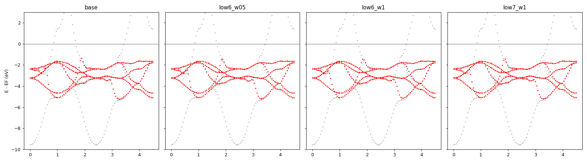
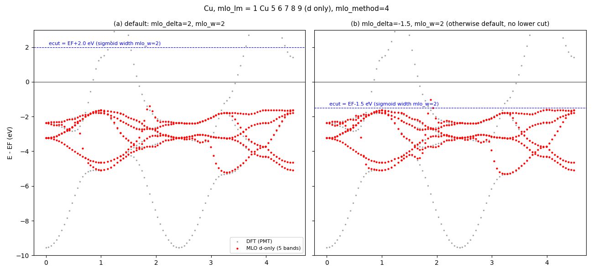

# 隠しオプション `mlo_low` — Cu の d 模型で試した記録 (2026-09-17)

`[mlo]` に `mlo_low = <eV, E_F 基準>`（任意で `mlo_wlow = <eV>`、既定は `mlo_w`）を書くと、
重み θ_j に下側のカットが掛かる:

$$\theta_j(\varepsilon) \;\to\; \theta_j(\varepsilon)\;
\sigma\!\left(\frac{E_F + \texttt{mlo\_low} - \varepsilon}{\texttt{mlo\_wlow}}\right)$$

E_F + mlo_low より下の PMT 状態がフィット（$A = S\theta$）から外れる。未指定なら無効、
`mlo_method` によらず効く。コード: `m_GWinput` (読み込み), `m_hreduction` (`Amat`)。
テンプレ・マニュアルには出していない（commit `43e3d6c87`）。

## Cu, `mlo_lm = 1 Cu 5 6 7 8 9`（d だけ、`mlo_method=4`, `mlo_delta=mlo_w=2.0`）

`Samples/MLOsamples/Cu` を `job_mlo cu -np 8` で。DFT バンドとの差（MLO の各点から最近接の
DFT バンドまで、meV）:

| | d 帯 [−6, −1] rms / max | [−2, +1] rms / max |
|---|---|---|
| base（カット無し） | 98 / 1099 | 43 / 251 |
| `mlo_low = -6, mlo_wlow = 0.5` | 97 / 1005 | 34 / 184 |
| `mlo_low = -6, mlo_wlow = 1.0` | 107 / 1024 | 76 / 682 |
| `mlo_low = -7, mlo_wlow = 1.0` | 102 / 1199 | 34 / 186 |

灰: DFT (PMT)、赤: MLO の 5 本。左から base / −6, 0.5 / −6, 1.0 / −7, 1.0。

## 見えること

- s 帯の底（Γ, −9.5 eV）を切っても、**折れは残る**。折れがあるのは s 帯が d 帯の中を横切る
  k ≈ 1.8 と 3.3 で、そこでは 5 本の模型で 6 本のバンドを追うしかなく、どのバンドに
  乗り換えるかがエネルギー窓では決まらない。
- 下側カットで変わるのは d 帯下端の形が少しと、E_F 近くの残差（43 → 34 meV）。
  `mlo_wlow = 1.0` で `mlo_low = -6` は d 帯下端（−5.2 eV）に幅が食い込んで悪化する。

## 窓を両側で切る: [−6, −1] eV

上側は `mlo_delta` を負にすれば下がる（`ecut_j = max(ecbot + mlo_delta, ε^MTO_j)`、金属では
ecbot ≈ E_F）。`mlo_delta = -1, mlo_low = -6` で d 帯だけを窓にした:

| | d 帯 [−6, −1] rms / max | [−2, +1] rms / max |
|---|---|---|
| base | 98 / 1099 | 43 / 251 |
| `mlo_low=-6, wlow=0.5`（上は既定 +2） | 97 / 1005 | 34 / 184 |
| `mlo_delta=-1, mlo_w=0.5, mlo_low=-6, wlow=0.5` | **82 / 957** | 42 / 266 |
| `mlo_delta=-1, mlo_w=1.0, mlo_low=-6, wlow=1.0` | 83 / 1001 | 37 / 232 |
| `mlo_delta=-0.5, mlo_w=0.5, mlo_low=-6, wlow=0.5` | 85 / 906 | 31 / 198 |

![Cu d-only MLO: (a) default, (b) two-sided window [-6,-1] eV](mlo_window_cu_20260917.png)

(a) 既定（`mlo_delta=2, mlo_w=2`、上側のカットだけ、E_F+2 eV）、
(b) 両側窓 `mlo_delta=-1, mlo_w=0.5, mlo_low=-6, mlo_wlow=0.5`（青破線が窓の上下端）。
窓を d 帯に絞ると d 帯の rms は 98 → 82 meV に下がり、
d 帯の底（k ≈ 1, 3.3 の −5.3 eV）が DFT に乗る。s–d 交差の折れはやはり残る。

## 既定のまま `mlo_delta = -1.5` だけ

`mlo_w = 2`（既定）のまま上側のカット位置だけ E_F−1.5 eV に下げる（下側カットなし）:

| | d 帯 [−6, −1] rms / max | [−2, +1] rms / max |
|---|---|---|
| (a) 既定 `mlo_delta=2, mlo_w=2` | 98 / 1099 | 43 / 251 |
| (b) `mlo_delta=-1.5, mlo_w=2` | 103 / 1282 | 89 / 615 |
| 参考: 両側窓 `mlo_delta=-1, mlo_w=0.5, mlo_low=-6, wlow=0.5` | 82 / 957 | 42 / 266 |

幅 2 eV のままだとカットを −1.5 eV に置いても σ の裾が E_F+2 eV まで残り、d 帯の上端
（−1.5 eV 付近）がちょうどカットの中心に来て重みが 1/2 になる。結果は既定より悪い
（d 帯 rms 103 meV、E_F 近く 89 meV）。カットを下げるなら幅も狭める必要がある。

## 次に試すなら

エネルギーではなく**状態の性格で切る**: PMT 状態 i の模型への射影重み
$p_i = \sum_j |\langle\psi_i|\mathrm{MTO}_j\rangle|^2$ を θ に掛ける（s 的な状態は d 模型の
フィットから自然に外れる）。これなら d 帯の内側にある s 状態も落ちる。
