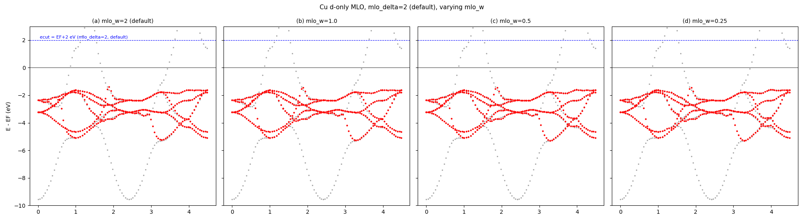
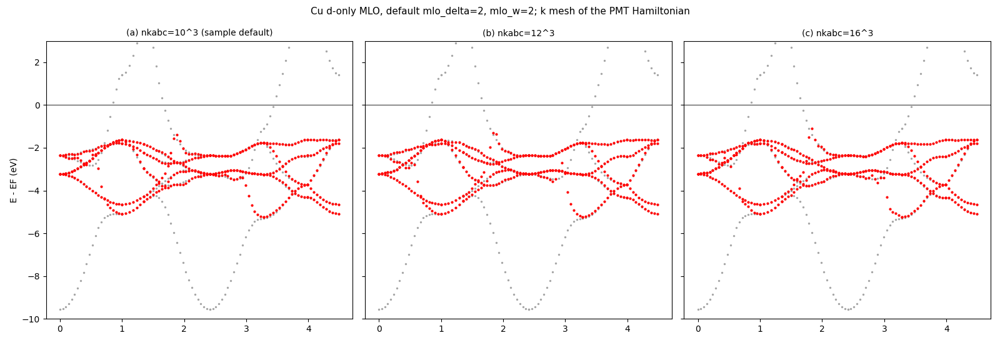
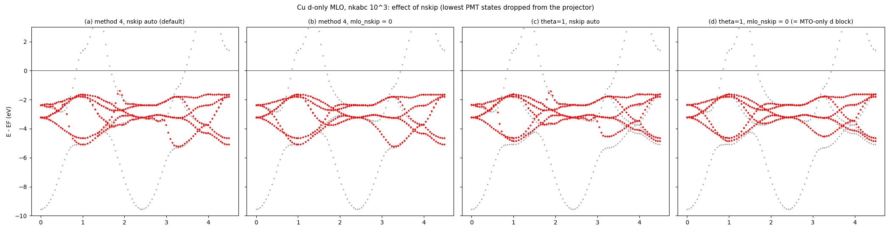
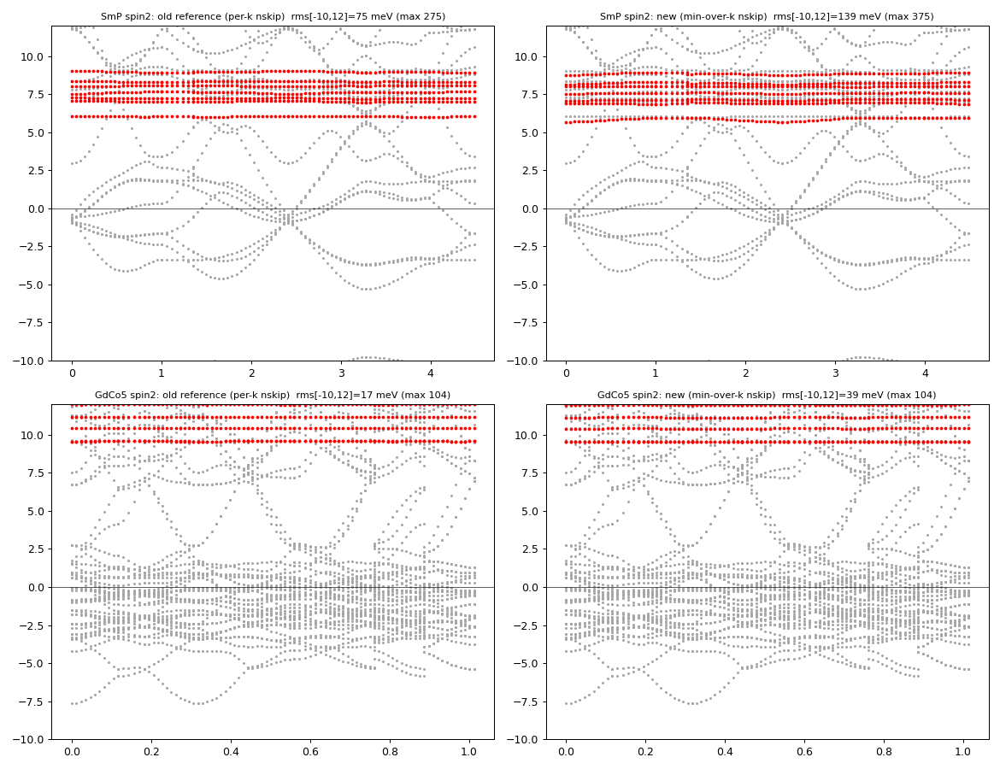
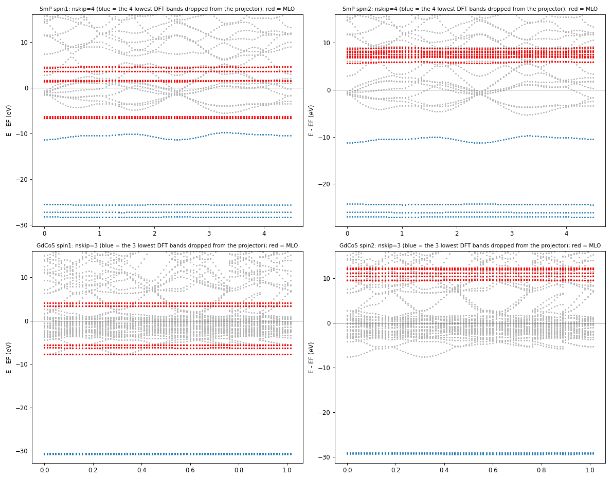

# 隠しオプション `mlo_low` — Cu の d 模型で試した記録 (2026-09-17)

`[mlo]` に `mlo_low = <eV, E_F 基準>`（任意で `mlo_wlow = <eV>`、既定は `mlo_w`）を書くと、
重み θ_j に下側のカットが掛かる:

$$\theta_j(\varepsilon) \;\to\; \theta_j(\varepsilon)\;
\sigma\!\left(\frac{E_F + \texttt{mlo\_low} - \varepsilon}{\texttt{mlo\_wlow}}\right)$$

E_F + mlo_low より下の PMT 状態がフィット（$A = S\theta$）から外れる。未指定なら無効、
`mlo_method` によらず効く。コード: `m_GWinput` (読み込み), `m_hreduction` (`Amat`)。
テンプレ・マニュアルには出していない（commit `43e3d6c87`）。

## Cu, `mlo_lm = 1 Cu 5 6 7 8 9`（d だけ、`mlo_method=4`, `mlo_delta=mlo_w=2.0`）

`Samples/MLOsamples/Cu` を `job_mlo cu -np 8` で。DFT バンドとの差（MLO の各点から最近接の
DFT バンドまで、meV）:

| | d 帯 [−6, −1] rms / max | [−2, +1] rms / max |
|---|---|---|
| base（カット無し） | 98 / 1099 | 43 / 251 |
| `mlo_low = -6, mlo_wlow = 0.5` | 97 / 1005 | 34 / 184 |
| `mlo_low = -6, mlo_wlow = 1.0` | 107 / 1024 | 76 / 682 |
| `mlo_low = -7, mlo_wlow = 1.0` | 102 / 1199 | 34 / 186 |

灰: DFT (PMT)、赤: MLO の 5 本。左から base / −6, 0.5 / −6, 1.0 / −7, 1.0。

## 見えること

- s 帯の底（Γ, −9.5 eV）を切っても、**折れは残る**。折れがあるのは s 帯が d 帯の中を横切る
  k ≈ 1.8 と 3.3 で、そこでは 5 本の模型で 6 本のバンドを追うしかなく、どのバンドに
  乗り換えるかがエネルギー窓では決まらない。
- 下側カットで変わるのは d 帯下端の形が少しと、E_F 近くの残差（43 → 34 meV）。
  `mlo_wlow = 1.0` で `mlo_low = -6` は d 帯下端（−5.2 eV）に幅が食い込んで悪化する。

## 窓を両側で切る: [−6, −1] eV

上側は `mlo_delta` を負にすれば下がる（`ecut_j = max(ecbot + mlo_delta, ε^MTO_j)`、金属では
ecbot ≈ E_F）。`mlo_delta = -1, mlo_low = -6` で d 帯だけを窓にした:

| | d 帯 [−6, −1] rms / max | [−2, +1] rms / max |
|---|---|---|
| base | 98 / 1099 | 43 / 251 |
| `mlo_low=-6, wlow=0.5`（上は既定 +2） | 97 / 1005 | 34 / 184 |
| `mlo_delta=-1, mlo_w=0.5, mlo_low=-6, wlow=0.5` | **82 / 957** | 42 / 266 |
| `mlo_delta=-1, mlo_w=1.0, mlo_low=-6, wlow=1.0` | 83 / 1001 | 37 / 232 |
| `mlo_delta=-0.5, mlo_w=0.5, mlo_low=-6, wlow=0.5` | 85 / 906 | 31 / 198 |

![Cu d-only MLO: (a) default, (b) two-sided window [-6,-1] eV](mlo_window_cu_20260917.png)

(a) 既定（`mlo_delta=2, mlo_w=2`、上側のカットだけ、E_F+2 eV）、
(b) 両側窓 `mlo_delta=-1, mlo_w=0.5, mlo_low=-6, mlo_wlow=0.5`（青破線が窓の上下端）。
窓を d 帯に絞ると d 帯の rms は 98 → 82 meV に下がり、
d 帯の底（k ≈ 1, 3.3 の −5.3 eV）が DFT に乗る。s–d 交差の折れはやはり残る。

## 既定のまま `mlo_delta = -1.5` だけ

`mlo_w = 2`（既定）のまま上側のカット位置だけ E_F−1.5 eV に下げる（下側カットなし）:

| | d 帯 [−6, −1] rms / max | [−2, +1] rms / max |
|---|---|---|
| (a) 既定 `mlo_delta=2, mlo_w=2` | 98 / 1099 | 43 / 251 |
| (b) `mlo_delta=-1.5, mlo_w=2` | 103 / 1282 | 89 / 615 |
| 参考: 両側窓 `mlo_delta=-1, mlo_w=0.5, mlo_low=-6, wlow=0.5` | 82 / 957 | 42 / 266 |

幅 2 eV のままだとカットを −1.5 eV に置いても σ の裾が E_F+2 eV まで残り、d 帯の上端
（−1.5 eV 付近）がちょうどカットの中心に来て重みが 1/2 になる。結果は既定より悪い
（d 帯 rms 103 meV、E_F 近く 89 meV）。カットを下げるなら幅も狭める必要がある。

## 既定のまま `mlo_w` だけ狭める

`mlo_delta = 2`（既定、カット E_F+2 eV）のまま幅を 2 → 1 → 0.5 → 0.25 eV:

| `mlo_w` | d 帯 [−6, −1] rms / max | [−2, +1] rms / max |
|---|---|---|
| 2.0（既定） | 98 / 1099 | 43 / 251 |
| 1.0 | 100 / 1021 | **34 / 197** |
| 0.5 | 102 / 1021 | 67 / 558 |
| 0.25 | 104 / 1022 | 66 / 528 |

d 帯全体の rms はほぼ不変（98〜104 meV）。E_F 近くは `mlo_w=1.0` が一番よく（34 meV）、
0.5 以下では s 帯（E_F+2 eV より上で切られる側）の扱いが急になって E_F 近傍の残差が
倍になる。折れの位置と大きさは幅では変わらない。Cu の d 模型では既定の 2.0 か 1.0 が妥当。

## k メッシュを増やす（既定パラメタ）

サンプルは `nkabc = [10,10,10]`（`--noinv` で既約 47 点）。PMT ハミルトニアンを書く
メッシュを 12³（72 点）、16³（145 点）に:

| `nkabc` | d 帯 [−6, −1] rms / max | [−2, +1] rms / max |
|---|---|---|
| 10³（サンプル既定） | 98 / 1099 | 43 / 251 |
| 12³ | 96 / 973 | 69 / 554 |
| 16³ | 90 / 1147 | 57 / 408 |

d 帯の rms は 98 → 90 meV とわずかに改善、折れの位置・大きさは不変。E_F 近くの数字が
メッシュで揺れる（43 / 69 / 57）のは、折れの乗り換えがどの k で起きるかがメッシュで変わる
ため。**k 点を増やしても折れは消えない** — 5 本の模型で 6 本を追う場所の問題。

## 折れの正体 — `nskip` の自動決定（2026-09-18）

θ をすべて 1 にする診断 `mlo_method = 9`（|F_MLO⟩ = |F_MTO⟩、MTO のみの d ブロック）でも
折れが残った。原因は `nskip`: 射影子から外す最下位 PMT 状態の数を
`nskipin = findloc(Σ_j |fac(i,j)|² > 0.5) − 1` で **k ごとに**決めているため、
Cu では band 1 が s 帯（d 重み < 0.5）か d 帯かが k で入れ替わる境目（10³ の 47 点中
17 点で nskip=1、30 点で 0）で射影子が不連続になる。`[mlo] mlo_nskip = 0` を明示すると消える:

| | d 帯 [−6, −1] rms / max | [−2, +1] rms / max |
|---|---|---|
| (a) method 4, nskip 自動（既定） | 98 / 1099 | 43 / 251 |
| (b) method 4, `mlo_nskip = 0` | 126 / 1294 | **18 / 157** |
| (c) θ=1（method 9）, nskip 自動 | 174 / 1070 | 70 / 551 |
| (d) θ=1, `mlo_nskip = 0` = MTO のみの d ブロック | 188 / 1136 | 28 / 187 |

(b) が「MTO のみに近い滑らかな」形。d 帯 [−6, −1] の rms が上がるのは、DFT の d 帯の底
（k ≈ 1, 3.3 の −5.2 eV）が s–d 混成した枝で、s を含まない 5 本では追えないため。

**実装（2026-09-18, `mlo` 側）:** `nskip` = **全 k（と全スピン）での per-k count の最小値**。
per-k count はこれまでどおり「模型部分空間への重み < 1/2 の最下位状態の数」
（`Hreduction_nskip`）で、`m_HamPMT` が本番ループの前に全 k を一巡して min を取り
（MPI で allreduce）、`Hreduction` に渡す。原理は「全 k で非模型である状態だけ外す」:
max や per-k だと、ある k で模型的な状態を落としてしまう。
手動の `mlo_nskip` は廃止（コードは見え消し）。

最初に試した「半芯 LO の数（`pz` から）」だけの規則は、O 2s のような低い非模型帯を外せず
Al2O3_Cr / FeMgO / NiO / RuO2 / SrTiO3 で大幅に悪化した（RuO2 8 → 150 meV）ので不採用。

18 サンプルへの影響: 参照が変わったのは Cu（折れが消え、E_F 近く 43 → 18 meV）、
SmP と GdCo5 の**スピン 2（非占有 4f 模型）**の 3 ファイルだけ。SmP spin2 は per-k count が
4 と 5 を行き来していたのが 4 に固定され、rms は 75 → 139 meV とやや悪化、
GdCo5 spin2 は 17 → 39 meV（max は不変）。「模型的かもしれない状態は落とさない」側に
倒した代償。他 15 系は per-k count が元々 k に依らず、bit 一致。

何を切っているか（広いレンジ、青 = 射影子から外した最下位 nskip 本の DFT 帯、赤 = MLO）:
SmP は Sm 5p（3 本、−25〜−28 eV）と P 3s（1 本、−10〜−11 eV）の 4 本、GdCo5 は Gd 5p
（3 本、−30 eV）の 3 本。per-k で揺れていたのは、その次の帯（価電子帯の底）が k によって
模型重み 1/2 を跨ぐため。

## 次に試すなら

エネルギーではなく**状態の性格で切る**: PMT 状態 i の模型への射影重み
$p_i = \sum_j |\langle\psi_i|\mathrm{MTO}_j\rangle|^2$ を θ に掛ける（s 的な状態は d 模型の
フィットから自然に外れる）。これなら d 帯の内側にある s 状態も落ちる。
