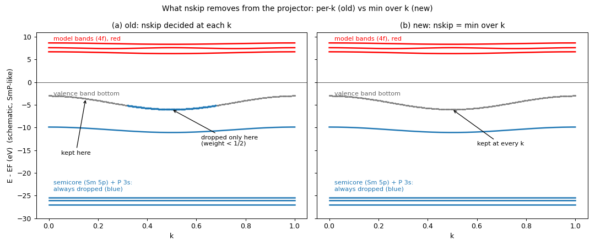

# Cu の d 模型に出ていた折れの正体 — `nskip` の k 依存（2026-09-17/18）

Cu の d だけの MLO（`mlo_lm = 1 Cu 5 6 7 8 9`）のバンドに、s 帯が d 帯を横切る k≈1.8, 3.3
で折れが出ていた。エネルギー窓（下側カット `mlo_low`、両側窓）、幅 `mlo_w`、k メッシュ
（10³ → 16³）をいくら変えても消えず、θ をすべて 1 にする診断（`mlo_method = 9`、
|F_MLO⟩ = |F_MTO⟩ = MTO のみの d ブロック）でも残った。

## 原因

射影子 P = Σ_i |ψ_i⟩⟨ψ_i| から外す最下位 PMT 状態の数 `nskip` を
`findloc(Σ_j |⟨ψ_i|ψ^MTO_j⟩|² > 1/2) − 1`（模型部分空間への重みが 1/2 未満の最下位状態の数）
で **k ごとに**決めていた。Cu では band 1 が s 帯（d 重み < 1/2）か d 帯かが k で入れ替わる
（10³ の 47 点中 17 点で nskip=1、30 点で 0）ので、その境目で射影子が不連続になる。
`mlo_nskip = 0` を明示すると消える:

| | d 帯 [−6, −1] rms / max (meV) | [−2, +1] rms / max |
|---|---|---|
| (a) method 4, nskip 自動（旧） | 98 / 1099 | 43 / 251 |
| (b) method 4, nskip = 0 | 126 / 1294 | **18 / 157** |
| (c) θ=1（method 9）, nskip 自動 | 174 / 1070 | 70 / 551 |
| (d) θ=1, nskip = 0 = MTO のみの d ブロック | 188 / 1136 | 28 / 187 |

(b) が「MTO のみに近い滑らかな」形。d 帯 [−6, −1] の rms が上がるのは、DFT の d 帯の底
（k≈1, 3.3 の −5.2 eV）が s–d 混成した枝で、s を含まない 5 本では追えないため。

## 直し方 — 全 k での最小値（2026-09-18, `f49c6640b`）

per-k count はそのままに、**全 k・全スピンでの最小値**を全 k に使う（`Hreduction_nskip` を
`m_HamPMT` が本番ループの前に全 k で呼び、MPI で min）。原理は「全 k で非模型である状態だけ
外す」— max や per-k だと、ある k で模型的な状態を落としてしまう。手動 `mlo_nskip` は廃止。

半芯 LO の数（`pz` から）だけで決める案は、O 2s のような低い非模型帯を外せず
Al2O3_Cr / FeMgO / NiO / RuO2 / SrTiO3 で大幅に悪化（RuO2 8 → 150 meV）したので不採用。

18 サンプルへの影響: 参照が変わったのは Cu と、SmP / GdCo5 の**スピン 2（非占有 4f 模型）**
だけ。そこでは per-k count が 4/5（3/4）を行き来していたのが 4（3）に固定され、
rms は SmP 75 → 139 meV、GdCo5 17 → 39 meV と少し悪化する — 「模型的かもしれない状態は
落とさない」側に倒した代償。他 15 系は bit 一致。

## 何を切っているか

青 = 射影子から外した最下位 nskip 本の DFT 帯、赤 = MLO。SmP は Sm 5p（3 本、−25〜−28 eV）
と P 3s（1 本、−10〜−11 eV）の 4 本、GdCo5 は Gd 5p（3 本、−30 eV）の 3 本。価電子帯には
触っていない。per-k で揺れていたのは、その次の帯（価電子帯の底）が k によって模型重み 1/2 を
跨ぐため。

模式図（SmP 風）。旧 (a) は価電子帯の底の 1 本が「重み < 1/2 になる k だけ」外され、
新 (b) は全 k で残す。

## ギャップの確認（`33dc156c5`）

半芯を抜く設計なので、外した帯（1..nskip）の上端（全 k の max）と残した帯（nskip+1）の
下端（全 k の min）の間にギャップが無ければ **abort** する（1 eV 未満は NOTE）。
18 サンプルでは 2.0 eV（GaAs: Ga 3d −14.8 vs As 4s −12.8）〜 42 eV（Fe 3p）。
