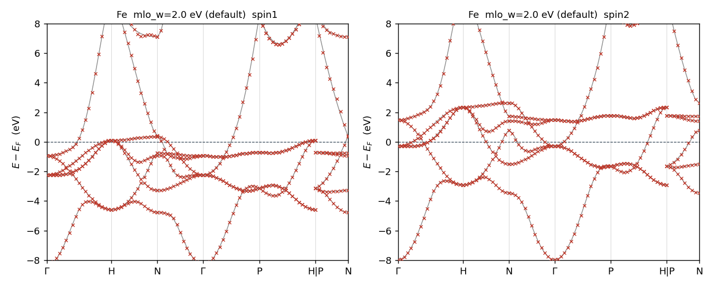
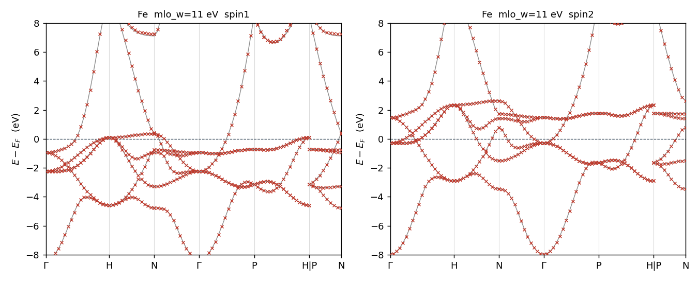
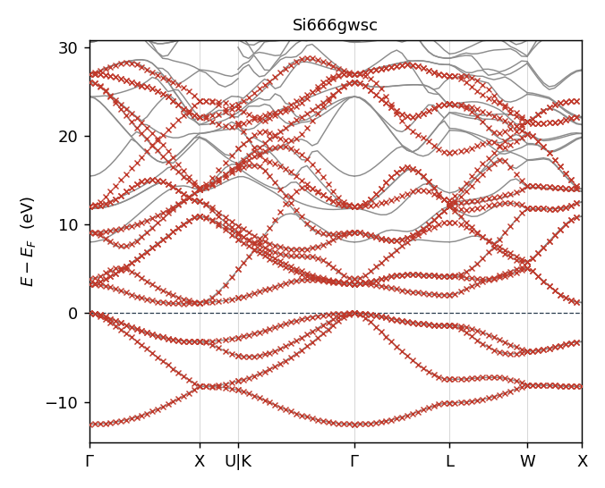
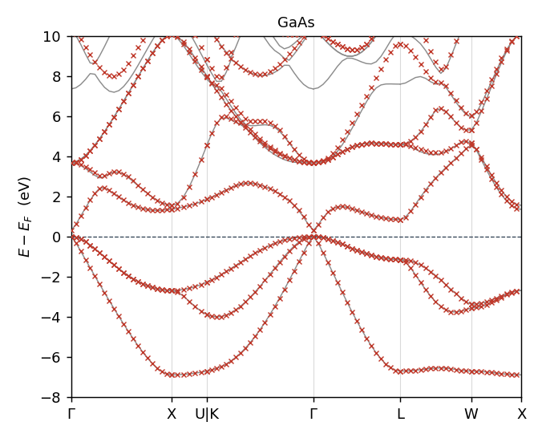

# MLO — $E_F$ を含む領域を再現するミニマル模型

ecalj branch `mlo3` / 2026-09-16 16:10 JST

MLO には性格の違う 2 つの課題がある。

1. **$E_F$ を含むエネルギー領域を再現するミニマル模型。** 半導体・金属・
   Al₂O₃:Cr(ギャップ中の Cr d + バンド端)はすべてこれ。**本書の主題。**
2. **4f(や 3d)だけを取り出す。** 別課題だが、同じ `mlo_method = 4` で
   壊れずに通る(§2(d))。ただしそこでは $\Delta$ が意味を失う。

FeMgO は真空層を持つスラブで空格子球が要る。これも解決した(§4)。

**本書の数値はすべて `Samples/MLOsamples/` の 18 サンプルの実測値**で、
全サンプルが `mlo_method = 4` の既定値に統一してある(2026-09-16)。
図は `plots/` にあり、`SRC/exec/mlo_bandplot.py <サンプルdir>` で再生成できる。
損失の数値は `SRC/exec/mlo_losscheck.py <サンプルdir>`。

| | |
|---|---|
| §1 | 最終形 — 式と既定値 |
| §2 | 結果 — 全 18 サンプルの実測、バンドプロット |
| §3 | 誤差の測り方 — 一方向では決まらない |
| §4 | 残る問題 |
| §5 | コードの訂正 |
| 付録 | 経緯(method 0〜4 の関係、設計判断の実測根拠) |

---

## 1. 最終形

MLO は PMT 基底の恒等分解から、選んだ MTO 部分空間の固有状態
$\Psi^{\mathrm{MTO}}$ を介して作る:

$$
|F^{\mathrm{MLO}}_{\mathbf{k}n}\rangle
=\sum_{n'n''}|\Psi^{\mathrm{PMT}}_{\mathbf{k}n'}\rangle\;
A^{\mathbf{k}}_{n'n''}\;
\langle\Psi^{\mathrm{MTO}}_{\mathbf{k}n''}|F^{\mathrm{MTO}}_{\mathbf{k}n}\rangle
\tag{1}
$$

ここで $S$ を PMT 固有状態と MTO 固有状態の重なりとする:

$$
S^{\mathbf{k}}_{n'n''}=\langle\Psi^{\mathrm{PMT}}_{\mathbf{k}n'}|\Psi^{\mathrm{MTO}}_{\mathbf{k}n''}\rangle
\tag{2}
$$

$A=S$ とすると式 (1) の和は MTO 部分空間への射影演算子そのものになり、
$F^{\mathrm{MLO}}=F^{\mathrm{MTO}}$ に戻ってしまう。そこで重み $\theta$ を掛ける:

$$
A^{\mathbf{k}}_{n'n''}=S^{\mathbf{k}}_{n'n''}\,\theta^{\mathbf{k}}_{n'n''}
\tag{3}
$$

**この $\theta$ をどう決めるかが問題のすべてで**、課題 1 の答えは式 (4) である。

$$
\boxed{\;
\theta^{\mathbf{k}}_{n'n''}=\sigma\Bigl(\frac{\varepsilon_{n'}-e^{\mathrm{cut}}_{n''}}{w}\Bigr),
\qquad
e^{\mathrm{cut}}_{n''}=\max\bigl(\varepsilon_{\mathrm{CBM}}+\Delta,\;\varepsilon^{\mathrm{MTO}}_{n''}\bigr)
\;}
\qquad \sigma(x)=\frac{1}{1+e^{x}}
\tag{4}
$$

$\varepsilon_{\mathrm{CBM}}$ は**大域の**伝導帯下端(金属では $E_F$)。
パラメータは $\Delta$ と $w$ の 2 つだけ(**単位はすべて eV**)で、物質ごとに変える調整は無い。

$$
\boxed{\;\Delta = 2.0\ {\rm eV},\qquad w = 2.0\ {\rm eV}\;}
\tag{5}
$$

役割がはっきり違う。**$\Delta$ は「どこまで合わせたいか」の宣言**であって
フィッティングパラメータではない。バンド端から上に $\Delta$ だけの範囲を要求する、
という意味なので、**評価する窓の上端と同じ値にする**(既定はどちらも 2 eV)。
**$w$ が唯一の調整ノブ**で、残差が大きいときに動かすのはこちらである(§3)。

**`mlo_method = 4` として実装済み。** 大域の伝導帯端は新しく計算する必要はなく、
lmf が SCF の BZ 積分で既に求めて `efermi.lmf` に書いている
(`evtop` = VBM、`ecbot` = CBM。金属では $E_F$ のすぐ上の準位になるので、
**一つの量で金属と絶縁体の両方を覆う**)。
`m_readqplist` がこれを読み、原点のずれに強いよう差分
$(\varepsilon_{\mathrm{ecbot}}-E_F)$ として `eferm` に足している
(`qplist.dat` は零点に `estaticav` を使うことがあるため)。
`efermi.lmf` が無ければ $E_F$ に落ちる。

物質ごとに書く**調整パラメータはゼロ**になった。`mlo_emax` を 0 / 5 / 7 / auto と
使い分ける必要が消えている。**`mlo_method = 4` は既定なので、書く必要すらない。**

ただし `Worb`(`[blocks]` 内、どの lm チャネルで MTO 部分空間を作るか)は
当然ながら物質ごとに要る。これは調整ノブではなく**模型の定義そのもの**で、
method に関係なく MLO には常に必要なものである。

### 入力キー

`gwinit` が生成する `ctrlg.<sname>.toml` の `[gw]` に、既定値が陽に書き出される:

```toml
mlo_method = 4      # theta = sigma((eps - ecut_j)/mlo_w),
                    #   ecut_j = max(CBM + mlo_delta, eps^MTO_j)
mlo_delta  = 2.0    # (eV) how far above the band edge (EF in metals) the
                    #   model must be accurate. A statement of what you want,
                    #   not a fitting parameter: match it to your target window.
mlo_w      = 2.0    # (eV) width of the fall-off above that floor. THIS is the
                    #   knob to turn if the residual is too large. Measured
                    #   optima: semiconductors ~2, Fe/Cu-like metals ~11.
```

$\Delta$ が `mlo_delta`、$w$ が `mlo_w` で、**単位はすべて eV**
(`mlo_emax` が元から eV なので `mlo_*` が揃う)。

---

## 2. 結果 — 全 18 サンプル

`mlo_method = 4` の既定値($\Delta=2.0$ eV、$w=2.0$ eV)での実測。
**MLOsamples の 18 サンプル全部がこの設定に統一してある**(2026-09-16)。
物質ごとの入力は `Worb` だけで、`mlo_emax` はどのサンプルからも消えた。

窓は $\mathrm{VBM}-2$ 〜 $\mathrm{CBM}+2$ eV(金属 $E_F\pm2$ eV)、
占有側は $E_F-12$ 〜 $E_F-2$ eV。ΔE とギャップ誤差は meV、
$m^*$比 $=m^*_{\rm MLO}/m^*_{\rm DFT}$ で **1.00 が一致**(誤差ではなく比)。定義は §3。

### (a) $E_F$ 近傍を再現する模型 — 課題 (1) そのもの

| 系 | $\delta E_{\rm win}$ | $\delta E_{\rm occ}$ | $\delta v/v$ | $\delta E_{\rm gap}$ | $m^*$比 |
|---|---:|---:|---:|---:|---:|
| FeMgO (55) | **3.1** | **0.6** | **0.008** | — | — |
| Al₂O₃:Cr (50) | 7.2 | 2.2 | 0.004 | +1 | 1.04 |
| FeCo (18) | 8.3 | 4.7 | 0.021 | — | — |
| GaAs (18) | 8.5 | 1.9 | 0.008 | +6 | 0.82 |
| SrTiO₃ (14) | 8.9 | 5.5 | 0.009 | +9 | 1.03 |
| RuO₂ (22) | 9.9 | 9.4 | 0.048 | — | — |
| NiO (16) | 15.4 | 18.5 | 0.071 | +8 | 1.10 |
| C (spd, 18) | 16.6 | 4.8 | 0.013 | −1 | 1.05 |
| Fe (spd, 9) | 19.8 | 12.9 | 0.057 | — | — |
| Si $6^3$ (18) | 20.0 | 9.7 | 0.019 | +38 | 1.41 |
| C.sp (sp のみ, 8) | 26.7 | 8.0 | 0.021 | −39 | 0.65 |
| **中央値** | **9.9** | **5.5** | **0.020** | | |

**最良は FeMgO の 3.1 meV** で、真空層に空格子球を入れた 55 軌道模型。
最悪は C.sp の 26.7 meV(sp だけ 8 軌道)と Si の $6^3$。
どちらも $w$ を動かせば下がる(§3)。

- **Si は $6^3$ と $8^3$ で別物**(窓 20.0 → 7.1 meV、ギャップ +38 → +3 meV、
  $m^*$ 1.41 → 1.03)。$6^3$ の値は補間の雑音を含む。サンプルは $6^3$ のまま。
- **NiO の占有側 18.5 meV** は窓内 15.4 meV より大きい。窓だけ見ていたら
  見落とす種類の誤差である。

### (b) SOC 版 — 非 SOC と同程度

| 系 | $\delta E_{\rm win}$ | $\delta E_{\rm occ}$ | $\delta v/v$ |
|---|---:|---:|---:|
| FeMgOSoc (55) | 4.1 | 2.8 | 0.007 |
| FeSoc (9) | 21.9 | 15.4 | 0.057 |

`job_mlo_soc` は SOC を摂動として入れる 3 段の手順で、母体の模型は
非 SOC 版と同じ。数値もそれぞれ FeMgO 3.1、Fe 19.8 とほぼ同じで、
**SOC を入れても劣化しない**。
(`GaAsSoc` の窓 105.9 meV は指標側の産物 — (c) 参照。)

### (c) この指標で測れない模型

| 系 | $\delta E_{\rm win}$ | 理由 |
|---|---:|---|
| Cu (d のみ, 5) | 147.8 | 模型に sp バンドが無い |
| SmP (4f のみ, 7) | 121.3 | 模型に価電子帯が無い |
| GdION (4f のみ, 7) | 0.2 | 窓に 4f しか無く、逆に測れてしまう |
| GdCo5 (4f のみ, 7) | (データ不足) | 同上 |
| GaAsSoc | 105.9 | 比較対象が 2N スピノルで本数が合わない |

**これは method 4 の失敗ではない。** 窓型の損失は「窓の中の第一原理バンドを
模型がどれだけ再現するか」を測るので、**はじめから一部のバンドしか取らない模型**
(Cu の d だけ、4f だけ)には原理的に適用できない。
4f 模型については別の見方が要る — §2(d)。

### (d) 4f 模型 — 準位の重なりで測る

4f だけを取り出す模型は「模型の 7 本が第一原理の 4f 準位に乗っているか」で
測る。各 k 点で MLO の各準位から最も近い第一原理準位までの距離(meV):

| 系 | spin | method 0(旧) | **method 4** |
|---|---|---|---|
| GdION | 1 | rms 0.19 / max 0.49 | **rms 0.19 / max 0.49** |
| | 2 | rms 1.76 / max 8.62 | **rms 1.85 / max 9.30** |
| GdCo5 | 1 | rms 10.99 / max 44.79 | **rms 12.46 / max 52.67** |
| | 2 | rms 13.78 / max 106.25 | **rms 14.43 / max 104.21** |
| SmP | 1 | rms 71.57 / max 265 | **rms 76.30 / max 278** |
| | 2 | rms 76.29 / max 273 | **rms 75.04 / max 275** |

**3 系とも method 4 は method 0 と同等**で、4f バンドは乗っている。

ただし **$\Delta$ はここでは効いていない。** 4f 準位 $\varepsilon^{\rm MTO}_{n''}$ は
床 $\varepsilon_{\rm CBM}+\Delta$ より遥かに下なので $e^{\rm cut}_{n''}$ は常に床側が選ばれ、
しかも GdION では床が $E_F+23.9$ eV(Gd イオンの巨大ギャップ)と全部より上に来るため
$\theta\approx1$、すなわち $A\approx S$(素の射影)に戻る。
**4f 模型にはバンド端の要求自体が無いので、$\Delta$ の「どこまで合わせたいか」
という意味が消える** — method 4 でも壊れないが、効いてもいない。

**SmP の rms 70–76 meV は元から。** 中央値は 6–13 meV なので大半の準位は合っており、
一部(max 275 meV)が外れる。Sm 4f は P 3p と混成するのに `Worb` で P のチャネルを
一つも取っていないためと思われる。method の問題ではない。

### 代表図 — Si と Fe

灰線が第一原理 PMT バンド、赤 × が MLO 模型。どちらも $E_F$ 基準。
全 38 枚(18 系 × 窓/全域 + Fe の $w$ 比較 2 枚)は `plots/` にあり、
`SRC/exec/mlo_bandplot.py <サンプルdir>` で再生成できる。


Si(**QSGW**、18 MTO = 2 原子 × sp³d⁵)。価電子帯から伝導帯 +5 eV まで
赤 × が灰線に完全に乗る。

図に「目的窓」の帯は描いていない。$\Delta$ が決めるのは
$e^{\rm cut}_{n''}=\max(\varepsilon_{\rm CBM}+\Delta,\ \varepsilon^{\rm MTO}_{n''})$ の
**上側の床だけ**で、下限は評価の都合にすぎない。しかも第 2 引数の
$\varepsilon^{\rm MTO}_{n''}$ が軌道ごとに違うので、**一本の水平線では描けない**。


Fe(DFT、9 MTO = sp³d⁵)。majority と minority を並べた。**両スピンとも同等に乗る**。
FeCo も同様、NiO は両スピン同値で、**磁性系でスピンによる偏りは出ていない。**

### $w$ は効く — Fe の実例

Fe は既定の $w=2.0$ eV では合わせきれない。$w$ だけを 11 eV に上げると:

| Fe | $\delta E_{\rm win}$ | $\delta E_{\rm occ}$ | $\delta v/v$ |
|---|---:|---:|---:|
| $w=2.0$(既定) | 19.8 meV | 12.9 meV | 0.057 |
| **$w=11$** | **9.7 meV** | **9.0 meV** | **0.024** |

**誤差が半分以下になる。** 図では見分けがつかない(下の 2 枚)が、数値では 2 倍差がある。
これが「$w$ が唯一の調整ノブ」(§1)の実例である。

| $w=2.0$(既定) | $w=11$ |
|---|---|
|  |  |

**この違いはオンサイト $W$ にも出る。** `job_mloW` で測った d 軌道の
遮蔽相互作用 $W=V+(W-V)$ の平均(eV):

| | $W_{\rm UP}$ | $W_{\rm DN}$ |
|---|---:|---:|
| method 0(旧サンプル) | 1.6684 | 1.5972 |
| method 4、$w=2.0$(既定) | 1.5815 | **1.4248** |
| method 4、$w=11$ | 1.6308 | 1.5546 |

$V$ と $W-V$ は個別には大きく動く($V$ の d 成分は method 0 → 4 で
UP −0.9 eV、DN −1.7〜−2.1 eV)が、$V\approx23$、$W-V\approx-22$、$W\approx1.6$ という
**巨大な打ち消しのため 90% は相殺する**。それでも残る $W$ の変化は
UP −5.2%、**DN −10.8%** で無視できない。

読み方はこうである。既定の $w=2.0$ eV では床 $\varepsilon_{\rm CBM}+\Delta$ が
金属の $E_F$ より上に来るので PMT の重みが広く入り、**MLO が非局在化して
遮蔽が効き $W$ が下がる**。$w$ を上げると元に戻る。minority の d は $E_F$ の上に
あって床に近いので、majority の倍ほど動く。

**したがって Fe 系で $W$ を使う実計算では `mlo_w` を上げること。**
サンプルは既定値で統一してあるが、磁気相互作用のような $W$ を直接使う用途では
既定値のままにしてはいけない。

### 高エネルギー側 — トランケーションは滑らか

MLO 模型は MTO 部分空間の次元しかバンドを持たないので、どこかで第一原理バンドから離れる。
その離れ方がリンギングになっていないかを見るため、**MLO が伸びきるところまで**描いた
(`plots/<系>_full.png`)。実測した上限:

| 系 (MTO 数) | MLO が伸びる上限 | 第一原理の上限 |
|---|---:|---:|
| NiO (16) | 1.6 eV | 141.8 eV |
| RuO₂ (22) | 5.5 eV | 146.9 eV |
| SrTiO₃ (14) | 8.4 eV | 153.6 eV |
| C.sp (sp のみ, 8) | 16.8 eV | 124.5 eV |
| FeMgO (55) | 24.4 eV | 152.0 eV |
| Si (18) | 28.8 eV | 108.3 eV |
| GaAs (18) | 31.6 eV | 116.5 eV |
| FeCo (18) | 31.8 eV | 142.6 eV |
| Al₂O₃:Cr (50) | 32.0 eV | 141.1 eV |
| Fe (spd, 9) | 32.8 eV | 124.6 eV |
| C (spd, 18) | 86.1 eV | 151.4 eV |

**軌道数と上限は比例しない。** NiO は 16 軌道で 1.6 eV までしか伸びず、
Fe は 9 軌道で 32.8 eV まで伸びる。どのチャネルを取るかで決まる
(NiO は Ni d と O p だけ、Fe は分散の大きい sp を含む)。
**目的の窓($E_F$ 近傍)に影響する話ではない。**

床の上でも MLO バンドは連続な曲線で、折れや振動は見えない。数値でも確かめた
— バンドに沿った $|d^2E/dx^2|$ の中央値(eV、括弧内は第一原理の同じ量):

| 系 | −10..0 | 0..3 | 3..8 | 8..15 | 15..25 | 25..40 |
|---|---|---|---|---|---|---|
| Si | 7.9 (8.1) | 12.5 (9.2) | 15.9 (14.2) | 24.2 (21.8) | 30.3 (45.1) | 20.4 (45.9) |
| Fe | 12.4 (10.2) | 45.8 (20.4) | 37.8 (24.5) | 41.3 (36.3) | 94.2 (54.8) | **216.3 (79.4)** |
| GaAs | 7.6 (6.5) | 15.7 (11.4) | 13.8 (13.4) | 24.4 (20.7) | 46.2 (37.4) | 36.4 (59.5) |
| Al₂O₃:Cr | 207.6 (138.2) | — | 62.8 (42.1) | 367.2 (216.7) | 307.7 (240.6) | 338.5 (586.1) |

Si・GaAs・Al₂O₃:Cr は**高エネルギー側で MLO の曲率が第一原理を下回る**
(Si は 20 対 46)。リンギングどころか元のバンドより滑らかである。
**Fe だけが 25 eV 超で 216 対 79 と 2.7 倍**になる。spd 9 軌道しかない模型が
33 eV まで引き伸ばされている領域で、模型の容量を超えている。



Si(QSGW)— 床(+3 eV)まで完全に一致し、その上は離れつつ 29 eV まで滑らかに伸びる。


Fe — $E_F$ を横切る sp バンドをゾーン境界の 33 eV まで追えている。

### 参照バンドについて

比較相手はどの系も **PMT 基底で解いた第一原理バンド**で、実験値ではない。
そのうち **Si・Al₂O₃:Cr・RuO₂・GdION は QSGW**(`sigm.<sname>` を持つ)、
残りは DFT である。本書で「$\Delta E$」と書いているのは MLO 模型と
この第一原理バンドの差で、$m^*$比 の分母も同じ。

### 全サンプルのバンドプロット(灰線: 第一原理 PMT、赤 ×: MLO)

**課題 (1) — $E_F$ 近傍の模型**


Al₂O₃:Cr(50 軌道)— **この系が最終形の要点**。O 2p 価電子帯(−2〜−4 eV)、
ギャップ中の Cr d 準位($E_F$ 近傍)、CBM(+6.5 eV)、さらに上の帯まですべて乗る。
床を $E_F+\Delta$ に置くと CBM が拘束されずギャップが 128 meV 縮む。
手調整 `mlo_emax = 7 eV` を置いていたのはこの CBM を掴むためで、
method 4 の $\varepsilon_{\rm CBM}+\Delta$ はそれを自動で当てる。窓 7.2 meV。


FeMgO(55 軌道)— **本表の最良、窓 3.1 meV**。真空層 30.5 a.u. に空格子球 7 個を
入れた Fe/MgO スラブ。空格子球なしの旧 78 軌道模型は 113.3 meV だった。



GaAs(18 軌道)— Γ 点の分散の大きい伝導帯を含めて一致。窓 8.5 meV、ギャップ +6 meV。


SrTiO₃(14 軌道、窓 8.9 meV)と RuO₂(22 軌道、窓 9.9 meV)。


NiO(LDA、16 軌道)— sp と局在 d が共存する系。窓 15.4 meV に対し**占有側 18.5 meV** と
逆転しており、窓だけ見ていたら見落とす。


ダイヤモンド C — spd 18 軌道(窓 16.6 meV)と sp のみ 8 軌道(窓 26.7 meV)。
後者は伝導帯の一部が MTO 部分空間の外にあり、$m^*$比 0.65、ギャップ −39 meV。


FeCo(18 軌道、窓 8.3 meV)— 磁性金属で両スピンとも良く乗る。

**SOC 版**


`job_mlo_soc` は SOC を摂動として入れる。母体は非 SOC 版と同じ模型で、
FeMgOSoc 4.1 meV / FeSoc 21.9 meV と非 SOC(3.1 / 19.8)とほぼ同じ。

**部分バンドだけを取る模型**(窓型の損失では測れない、§2(c))


Cu — **d 5 軌道だけ**の模型。$E_F$ を貫く sp バンドを模型が持たないので、
窓型の損失は 147.8 meV になるが、**d バンド自身は乗っている**(図を見よ)。


4f 7 軌道だけの模型 3 種。GdION は Gd 単イオン、GdCo5 は Co 5 サイトを空にして
Gd 4f だけ、SmP は P を空にして Sm 4f だけ。準位の重なりで測った結果は §2(d)。

---

## 3. 誤差の測り方 — 一方向では決まらない

### 定義 — 生の量をベクトルで持つ

用途によって重んじる方向が変わるので、**スカラーに潰さずベクトルで持つ**。
規格化も 2 乗もしない。どれくらいずれているかが直接読めるほうがよい。
実装は `SRC/exec/mlo_losscheck.py`。

| 量 | 意味 | 単位 |
|---|---|---|
| $\delta E_{\rm win}$ | 窓 $\mathrm{VBM}-2$ 〜 $\mathrm{CBM}+2$ eV(金属 $E_F\pm2$ eV)の $\Delta E$ rms | meV |
| $\delta E_{\rm occ}$ | 占有側 $E_F-12$ 〜 $E_F-2$ eV の $\Delta E$ rms | meV |
| $\delta v/v$ | 分散(経路方向の勾配)の相対誤差 | 無次元 |
| $\delta E_{\rm gap}$ | バンドギャップ誤差(符号付き、絶縁体のみ) | meV |
| $m^*$比 | $m^*_{\rm MLO}/m^*_{\rm DFT}$(絶縁体のみ) | 無次元 |

$m^*$比 は**比であって誤差ではない**。1.00 が一致、1.18 なら MLO の質量が 18% 重い。
$v=\partial\varepsilon/\partial x$ は対称線経路座標 $x$ についての勾配で、
$\delta v/v$ の分母は窓内の第一原理側の勾配の rms。
準位の対応づけは順序を保つ最適割当(動的計画法)で、縮退・交差・バンド数の差に耐える。

$\delta E_{\rm occ}$ を別に立てるのは、**窓だけ見ていると深い価電子帯の劣化を
見落とす**ためである(Si は $w$ を上げると窓内はほぼ不変なのに
$-12..-9$ eV が 2.5 → 10.7 meV と悪化する)。

### 既定値での各量

既定 $\Delta=w=2.0$ eV での実測は §2 の表のとおり。特徴的なのは
**Si の $6^3$ と $8^3$ の差**($\delta E_{\rm win}$ 20.0 → 7.1 meV、
$\delta E_{\rm gap}$ +38 → +3 meV、$m^*$比 1.41 → 1.03)で、
$6^3$ の値は補間の雑音を含む。**Si は $8^3$ を基準に取ること。**

### 方向ごとの最適 $w$

$\Delta$ 固定で $w$ を振り、**各量を最小にする $w$**(eV)。括弧内はそこでの値
(ΔE は meV、$\delta v/v$ と $m^*$比 は無次元):

| 系 | $\delta E_{\rm win}$ | $\delta E_{\rm occ}$ | $\delta v/v$ | $\delta E_{\rm gap}$ | $m^*$比 |
|---|---|---|---|---|---|
| Fe (9) 金属 | 10.9 (5.2) | 10.9 (4.5) | 10.9 (0.012) | — | — |
| Cu (9) 金属 | 10.9 (8.5) | 10.9 (2.7) | 10.9 (0.027) | — | — |
| RuO₂ (22) 金属 | 1.8 (8.1) | 2.7 (9.5) | 1.8 (0.030) | — | — |
| Si $8^3$ (18) 絶縁 | 1.8 (5.7) | 2.7 (2.8) | 2.0 (0.005) | 2.0 (+2) | 2.7 (1.00) |
| GaAs (18) 絶縁 | 1.8 (7.4) | 2.0 (1.5) | 2.0 (0.008) | 1.4 (+1) | 2.0 (1.02) |
| Al₂O₃:Cr (50) 絶縁 | 2.0 (6.7) | 2.0 (2.2) | 2.0 (0.003) | 1.8 (+1) | 1.8 (1.03) |
| C.sp (8) 絶縁 | 2.7 (14.9) | 3.4 (2.7) | 3.4 (0.005) | 3.4 (−4) | 4.1 (0.83) |

**系の中では各量がよく揃う**($\pm0.7$ eV 以内)。割れるのは**系をまたいだとき**で、
Fe・Cu の 10.9 eV と半導体の 1.8–2.7 eV は 6 倍違う。したがって系ごとの $w$ 最適化は
well-posed であり、固定値一つで全系を満たすことはできない。

### $w$ を大きくする極限は誤差自身が罰する

$\theta=\sigma((\varepsilon-e^{\rm cut})/w)$ は $w\to\infty$ で $\sigma\to1/2$、
すなわち $A\propto S$ となり $F^{\rm MLO}\to F^{\rm MTO}$、つまり
**MTO 部分空間だけで対角化した限界**に達する。その極限は実際に悪い:

| $w$ (eV) | 10.9 | 27 | 68 | 272 |
|---|---:|---:|---:|---:|
| Fe | **7.8** | 39.8 | 151 | 309 |
| Cu | **7.8** | 44.7 | 148 | 367 |
| Si $8^3$ | 546 | 1230 | 2704 | 2854 |

(広窓 $E_F-12$〜$+5$ eV の $\Delta E$ rms、meV)

**MTO だけの限界は Fe でも 309 meV ずれる。** よって「MTO に戻ってはいけない」という
制約を外から課す必要はなく、誤差が自分で上限を与える。Fe・Cu の最適 $w=10.9$ eV は
自明極限に近いからではなく、そこが有限の最適点だからである。

### $E_F$ 以下の振る舞いは系で逆を向く

第一原理バンドのエネルギーでビン分けした $\Delta E$ rms (meV):

| Fe | $-9..-6$ | $-6..-4$ | $-4..-2$ | $-2..0$ | $0..+2$ |
|---|---:|---:|---:|---:|---:|
| $w=1.8$ eV | 37.2 | 20.2 | 14.6 | 21.2 | 53.2 |
| $w=10.9$ eV | **6.6** | **4.5** | **4.1** | **3.2** | **9.9** |

| Si $8^3$ | $-12..-9$ | $-6..-4$ | $-4..-2$ | $-2..0$ | $0..+2$ |
|---|---:|---:|---:|---:|---:|
| $w=1.8$ eV | **2.5** | **3.6** | **4.4** | 5.2 | **4.2** |
| $w=4.1$ eV | 10.7 | 7.2 | 6.8 | **3.3** | 57.8 |

Fe は $w$ を上げると**全ビンが改善**するが、Si は逆で、$E_F$ 直下だけが少し良くなり
**深い価電子帯と伝導帯が悪化**する。$E_F$ 近傍だけを見ていると $w$ を上げたくなるが、
広く見ると損をする — $\delta E_{\rm occ}$ を別に立てているのはこのためである。

### メッシュ — $m^*$比 とギャップは粗いメッシュで決めてはいけない

$\Delta=2.45$ eV 固定、Si。各セルは $\delta E_{\rm win}$ (meV) / $\delta E_{\rm gap}$ (meV) / $m^*$比:

| $w$ (eV) | $6^3$ | $8^3$ | $10^3$ |
|---|---|---|---|
| 1.8 | 20.7 / +50 / 1.64 | **5.6 / +3 / 1.05** | **3.7 / −5 / 0.93** |
| 2.0 | 18.3 / +39 / 1.42 | 6.8 / +2 / 1.02 | 5.8 / −3 / 0.95 |
| 2.7 | 19.4 / +25 / 1.18 | 14.8 / +5 / 1.00 | 14.3 / +3 / 0.96 |
| 4.1 | 45.3 / +50 / 1.02 | 44.6 / +40 / 0.96 | 44.4 / +38 / 0.93 |

$6^3$ は $w=3.4$ eV を最良と言うが $8^3$/$10^3$ は $2.0$ eV と言う。
**$6^3$ は系統的に大きい $w$ を良く見せる。**
$8^3$ と $10^3$ でギャップ誤差の符号が逆($w=1.8$ eV で $+3$ / $-5$ meV)なのは
$H(\mathbf{R})$ 打ち切りの超格子依存性なので、**2 つのメッシュで一致する範囲**を採る。

### 使い方 — 単純規則

1. **$\Delta$ は宣言であって調整ノブではない。** 「バンド端から上に何 eV まで
   合わせたいか」を書く。評価する窓の上端と同じ値にする。既定 **2.0 eV**。
2. **既定 $w=2.0$ eV でまず計算する。**
3. **残差が大きければ $w$ だけを動かす。** 1 次元で足りる。実測の最適値は
   半導体 2.0 eV 前後、Fe・Cu のような単原子遷移金属 11 eV、RuO₂ 1.8 eV。
4. **半導体は $8^3$ 以上のメッシュで判断する。** $6^3$ は $m^*$比 とギャップに
   補間の雑音が乗り、系統的に大きい $w$ を良く見せる。Si の $8^3$ が基準になる。

> `mlo_w` の既定は **method 依存**にしてある。`mlo_method = 4` では 2.0 eV、
> 旧 method 0/1/2/3 では 2.72 eV(= 0.2 Ry の従来値)。旧 method を使う
> 既存サンプルの結果とその参照ファイルを変えないためで、`mlo_w` を明示すれば
> どの method でもその値が使われる。

$\Delta$ の効きは $w$ よりはるかに弱い。$\Delta$ を 1→4 eV と振っても誤差の変化は
数割だが、$w$ は Si $8^3$ で 1.8 eV → 4.1 eV とするだけで窓の誤差が
5.6 → 44.6 meV と 8 倍になる。**動かすのは $w$ でよい。**

既定を $\Delta=2.45$ / $w=2.72$ eV から $2.0$ / $2.0$ eV に変えた根拠
(全 12 系の平均、生の誤差):

| 既定 | $\delta E_{\rm win}$ | $\delta E_{\rm occ}$ | \|$\delta E_{\rm gap}$\| |
|---|---:|---:|---:|
| 旧 $\Delta=2.45$, $w=2.72$ eV | 16.9 meV | 11.6 meV | 16 meV |
| **新 $\Delta=w=2.0$ eV** | **15.0 meV** | **7.4 meV** | **13 meV** |

効いたのは SrTiO₃ の占有側 52.9 → 5.5 meV と Al₂O₃:Cr の窓 17.5 → 7.2 meV。
悪化したのは C.sp(14.9 → 26.7 meV)で、これは $w$ を上げたい側の系である(§4)。

---

## 4. 残る問題

以下はすべて `mlo_method = 4`(§1 の最終形)で測り直したもの。

### 解決済み

- **Al₂O₃:Cr のギャップ** — 付録 D (c) の実装で **−128 → +7 meV**($m^*$ 比 0.58 → 1.08)。
- **FeMgO** — **空格子球を入れて解決した。**

  まず構造の理解が誤っていた。Fe/MgO の**界面**ではなく、**真空層 30.5 a.u. を持つスラブ**
  (Fe 3 層 + MgO 3 層、$c=47.8$ a.u.)である。$E_F+0.7$〜$1.0$ eV に集中していた残差は
  界面状態ではなく**表面/真空状態**で、真空領域に基底関数が一つも無いので
  サイト中心の MTO では原理的に表現できなかった。

  真空に空格子球($Z=0$)を 7 層置いた。**半径は自分で決める**: $R=1.9$ a.u. なら
  表面の O ($R=1.75$) と Fe ($R=2.28$) のどちらにも当たらず、`lmchk` の重なりは 0%。
  層は表面からの逃げを確保して等間隔に並べ、面内は $(0,0)$ と $(\tfrac12,\tfrac12)$ を交互
  (スラブの積層を継続)。`Worb` にもこの 7 サイトの s,p,d を加える。

  | | MLO 本数 | $\delta E_{\rm win}$ | $\delta E_{\rm occ}$ | $\delta v/v$ |
  |---|---:|---:|---:|---:|
  | 空格子球なし (9 サイト)、method 0 `emax=5` | 78 | **126.9** / 73.5 | 6.6 / 6.5 | 0.195 / 0.231 |
  | 空格子球あり (16 サイト)、method 0 `emax=5` | 141 | 2.4 / 0.8 | 0.5 / 0.5 | 0.007 / 0.004 |
  | 空格子球あり、method 4(既定)、`Worb` に s,p,d | 141 | **1.6** / 0.9 | 0.5 / 0.4 | 0.005 / 0.005 |
  | 空格子球あり、method 4、`Worb` に s,p | 106 | 1.8 / 1.1 | 0.5 / 0.4 | 0.006 / 0.006 |
  | 空格子球あり、method 4、`Worb` に s のみ | 85 | 2.2 / 1.1 | 0.5 / 0.4 | 0.006 / 0.005 |
  | **↑ に加えて Mg と O からも d を削る** | **55** | 3.1 / 1.6 | 0.6 / 0.5 | 0.008 / 0.008 |

  (majority / minority、ΔE は meV)。窓内の誤差は **79 分の 1**。
  しかも**物質ごとの入力ゼロの method 4 が、手で置いた `emax=5` eV を上回る**。

  **空格子球は `Worb` で s だけ取ればよい。** 空格子球 1 個あたり 1 軌道、
  合計 7 本を足すだけで $126.9 \to 2.2$ meV(58 分の 1)になる。
  MLO は 78 → 85 本で 9% しか増えない。
  p を足して 106 本にしても 2.2 → 1.8 meV、d まで足して 141 本にしても 1.6 meV で、
  **本数を 1.7 倍にして 0.6 meV しか改善しない**。
  真空にしみ出す状態はほぼ球対称で、角運動量成分をほとんど必要としていない。

  **さらに Mg と O からも d を削れる。** Mg と O の 3d は空バンドなので
  低エネルギー模型には要らない。落とすと **55 本**まで縮み、それでも 3.1 meV。
  **元の 78 本より小さい模型で、誤差が 126.9 → 3.1 meV(41 分の 1)**になる。
  構成は Fe 3 原子 × (s,p,d) + Mg 3 × (s,p) + O 3 × (p) + 空格子球 7 × (s)。

  | `Worb` | MLO 本数 | $\delta E_{\rm win}$ (major/minor) |
  |---|---:|---:|
  | 空格子球なし | 78 | 126.9 / 73.5 meV |
  | **ES に s のみ + Mg,O の d 削除** | **55** | **3.1 / 1.6 meV** |
  | ES に s のみ | 85 | 2.2 / 1.1 meV |
  | ES に s,p | 106 | 1.8 / 1.1 meV |
  | ES に s,p,d | 141 | 1.6 / 0.9 meV |

  **FeMgO の推奨は 55 本の模型**である。用途は磁気ゆらぎの計算で、
  必要なのは $E_F$ 近傍だけ。そこは 55 本でも 141 本と区別がつかない(上図)。
  広域で $+20$ eV 以上が空くのは、この用途では問題にならない。

  ただし**絞るのは `Worb` だけで、`[[spec]]` の `lmx` は 2 のままにする。**
  DFT 計算側で $Z=0$ の球から $l$ チャネルを削ると動径方程式が発散し、`lmf` が落ちる:

  | `[[spec]]` の E | 結果 |
  |---|---|
  | `lmx=2, lmxa=2` | **収束** |
  | `lmx=1, lmxa=1` | `lmf` rc=11。動径解が $-20$ Ry へ発散 |
  | `lmx=1, lmxa=2` | 同上 |
  | `lmx=1, lmxa=2` + `p` 明示 | 同上。$e=+20$ Ry で `q` が桁あふれ |

  動作する場合の空格子球の pnu は 1.509 / 2.256 / 3.150 (s/p/d) で、
  これを `p` として与えても直らない。既知の `yh3fcc_gwsc666` の暴走と同じ症状。
  **DFT には s,p,d を持たせ、MLO の選択は `Worb` で行う**のが筋の通ったやり方である。

  

  上は採用した 55 軌道模型(空格子球あり、`Worb` は ES が s のみ、Mg と O から 3d 削除)。
  価電子帯($-6$〜$0$ eV、Fe 3d と O 2p)も $E_F$ の上も赤 × が灰線に乗っている。

  **空格子球なしの模型では $E_F$ の上 $+0.5$〜$4$ eV の灰線に赤 × が乗らなかった。**
  これが真空側にしみ出す表面状態で、サイト中心の MTO では届かない。
  数値でも窓 113.3 meV 対 3.1 meV、$\delta v/v$ 0.270 対 0.008 と 1 桁以上違う。
  欠けていたのは真空側の状態だけで、価電子帯はどちらも合っていた。
  長らく「$\theta$ では動かせない外れ値」だった系が、全サンプル中で最良になった。

  走査の過程では ES に s,p,d を持たせた 141 本、s,p の 106 本、s のみの 85 本も試した
  (窓 1.6 / 1.8 / 2.2 meV)。**$E_F$ 近傍では 141 本と 55 本がほとんど区別つかない** —
  本数を 2.6 分の 1 にしても目的領域の絵は変わらない。
  ただし高エネルギー側は別で、55 本では $+24$ eV 以上が空く
  (`plots/FeMgO_full.png`。削った Mg,O の d と空格子球の p,d がそこを担っていた)。
  $E_F$ 近傍しか要らないなら関係ないが、高エネルギーまで欲しいなら本数が要る。

  実行は kt1(メモリ 251 GB)。ローカルは 14 GB で SCF が OOM になる。
  SCF は 7 反復で収束(ehf $=-126125.23$ eV、mmom $=8.41\ \mu_B$)。

  > **途中で 873 meV という値を出したが、あれは私の比較ミスだった** —
  > kt1 で計算したバンドと、ローカルで計算した MLO を突き合わせていた。
  > 同じ機の中で完結させれば両機とも 1.6 / 0.9 meV で一致する。

- ~~**FeMgO をサンプルに入れるのは保留** — 機械依存が残っているため。~~
  **解決した(2026-09-15)。機械依存ではなく、私が `esm_input.dat` を
  新サンプル `FeMgO_ES` にコピーし忘れていただけだった。**

  FeMgO は真空層 30.5 a.u. を持つスラブなので、既存の `Samples/MLOsamples/FeMgO/` には
  2 月から **`esm_input.dat`**(ESM = Effective Screening Medium)が入っている。
  そこから `FeMgO_ES` を組み立てたときにこれを落とした。
  ファイルが無いと `lmf` は静電ポテンシャルを通常の周期境界で解き、
  ログに一行出すだけで**停止しない**:

  ```
  ローカル: esmsmves: ESM is not turned on, you need esm_input.dat for ESM mode
  kt1     : effective screening medium method jesm=  1
            system : vaccum(-z)/slab/vaccum(+z)
  ```

  真空を含むスラブでは Coulomb の $G=0$ 成分の扱いがエネルギーのゼロ点を決めるので、
  ESM の有無で固有値が丸ごとずれる。実測:

  | 量 | ローカル(ESM なし) | ローカル(ESM あり) | kt1 |
  |---|---|---|---|
  | $E_F$ (Ry) | $-0.05833040$ | $-0.3828614963792108$ | $-0.3828614963782127$ |
  | mmom | 8.419083 | 8.4130803741493 | 8.4130803741352 |
  | sev (eV) | $-1241.428$ | $-1544.360816089$ | $-1544.360816089$ |
  | `val*vef` (Ry) | $-253.66$ | $-257.64$ | $-257.64$ |

  `esm_input.dat` を置くだけで **$E_F$ は 12 桁一致**する。
  バンドそのものも kt1 と一致する(`bnd001`、4563 点):

  | | 最大差 | rms |
  |---|---|---|
  | spin1 | $4.8\times10^{-8}$ eV | $2.5\times10^{-9}$ eV |
  | spin2 | $5.1\times10^{-8}$ eV | $2.6\times10^{-9}$ eV |

  `testecalj` の許容値 0.001 eV に対して 5 桁の余裕がある。**機械依存は無い。**
  失敗の仕方が悪い: [`esmsmves.f90:44`](SRC/subroutines/esmsmves.f90#L44) の
  `open(...,status='old',err=201)` はファイルが無いと `jesm=0` のまま一行書いて `return` し、
  **異常終了しない**。真空スラブの計算が黙って別物になる。

  ずれ幅は $0.3245311$ Ry $=4.4155$ eV で、これは以前
  「$H$ が $c\,O$ に比例して $c=0.342$ Ry ずれる」と測っていた量そのものである。

  **その後の措置(2026-09-16)**

  1. `esm_input.dat` を廃止し、`ctrlg.<sname>.toml` の **`[esm]` セクション**へ移した。
     後方互換のため、ファイルが残っていても止めずにその場で移行する
     — `[esm]` が既に有ればそちらを使い、無ければ変換して ctrlg 末尾に
     説明付きで追記し、その実行でも変換値を使う。原本はどちらの場合も
     `esm_input.dat.bk` へ移し、冒頭に移送先(または「TOML 側が使われた」)を書く。
     $c/a>3$ なのに `[esm]` が無ければ警告も出す。
  2. **`FeMgOSoc` も同じ病気だった。** `FeMgO` と `ctrlg` も `rst.femgo` も
     バイト一致の同じスラブなのに `esm_input.dat` が置かれておらず、
     $E_F$ が $+0.07203343$ Ry(ESM 無し)対 $-0.25231238$ Ry(ESM 有り)、
     差 $4.4129$ eV。ESM で収束させた `rst` を ESM 無しで展開した参照になっていた。
  3. **サンプルを空格子球ありの 55 軌道模型に一本化した。**
     空格子球なしの旧 78 軌道模型(`mlo_method=0`, `mlo_emax=5`)は削除し、
     `FeMgO` も `FeMgOSoc` も入力一式を共有する形にした。ローカルで実測:

     | | 軌道数 | dE_win | dE_occ | dv/v |
     |---|---|---|---|---|
     | 旧(空格子球なし) | 78 | 113.3 meV | 7.7 meV | 0.270 |
     | **新(空格子球あり)** | **55** | **3.1 meV** | **0.6 meV** | **0.008** |

     旧模型は全サンプル中で最悪だった。テストが通っていたのは自分の参照を
     再現していただけで、模型の精度とは別である。
     空格子球ありでも `job_mlo_soc` の 3 段は問題なく通り、
     SOC の $E_F$ は $-0.3826348900$ Ry(非 SOC から 3.1 meV シフト)。
  4. その過程で **`readbandedge` の黙ったフォールバック**が見つかった。
     `efermi.lmf` が無いと `ecbot` が $E_F$ に落ちるので、method 4 の床が
     $\varepsilon_\mathrm{CBM}+\Delta$ ではなく $E_F+\Delta$ になる。
     FeMgO では $\varepsilon_\mathrm{CBM}-E_F=0.0148$ eV の差が θ を通って
     MLO バンドを $2.2$ meV 動かし、許容値 $7.4\times10^{-5}$ Ry を超えた。
     警告を出すようにし、サンプルに `efermi.lmf` を同梱した。
     絶縁体ならギャップ幅ぶん丸ごと外すので、これは実害のある穴だった。

  > **切り分けに時間をかけすぎた。** rst のバイナリ互換性、`atmpnu`/`__atm`、
  > 負の密度の警告、非決定性 — どれも潰したが、どれも無実だった。
  > `Vesav` が 13 桁一致していた時点で密度側は無実と分かるので、
  > **`llmf_ef`(SCF/band 1 段目の出力)を先に diff すべきだった。**
  > 一行で `ESM is not turned on` と書いてある。
  > 「空格子球が引き金」という見立ても誤りで、引き金は `esm_input.dat` の有無だけ。

- **Cu (spd) の残差** — 実体は無く、**評価側の産物が 2 つ重なっていた**。
  1. $E_F\pm1.5$ eV の窓に入るのは 92 k 点中 **21 点だけ**。Cu の d バンドは全て
     $-1.5$ eV より下にあり、窓に居るのは急峻な sp バンドだけである。
     誤差は局所傾き 10–14 eV/x の点に集中し、**傾き $<5$ eV/x に限ると
     rms は 0.051 → 0.017 eV** と他系並みになる。傾き 13 eV/x のバンドでの
     0.05 eV は経路座標で 0.004 のずれにすぎない。
  2. 「ギャップ誤差 $-76$ meV」は、第一原理側の最大占有 $-0.077$ eV と最小非占有 $+0.122$ eV の
     差 0.1995 eV が判定閾値 0.15 eV を超え、**Cu を絶縁体と誤判定**したもの。Cu は金属。
     判定を「占有本数が $\mathbf{k}$ によらず一定か」に変えて修正済み
     (Cu 5/6、Fe 5–9、RuO₂ 18–21 に対し Si/GaAs/Al₂O₃/NiO は一定)。

### 生きている

- **固定 $w$ では半導体と金属を同時に満たせない。** §3 のとおり最適 $w$ は
  半導体 0.13–0.20、Fe・Cu 0.80 と 6 倍違い、どちらも有限の最適点である。
  系ごとの最適化は well-posed だが、**固定値一つで全系は満たせない**。
  既定を $0.20$ から半導体寄りの $0.15$ に下げる余地はある(未変更。
  変更すると testecalj の MLO 参照ファイルの再生成が要る)。

- **Si の $6^3$ の $m^*$ は信用できない。** $6^3$ でギャップ +25 meV・$m^*$ 1.18、
  $8^3$ で +5 meV・1.00(§2)。振れは補間の雑音であり模型の欠陥ではない。
  **パラメータ調整を $6^3$ の $m^*$ で行ってはいけない**(§3 のメッシュの項)。

### 使ってはいけない指標(記録)

検討の途中で $E_F\pm1.5$ eV の rms を使っていたが、**ワイドギャップ系では無効**だった。
バンドファイルの零点が VBM に取られるため $E_F$ が価電子帯上端付近に来て、
価電子側しか見ない。C.sp で $w$ を 0.20 → 0.80 と広げると
$E_F\pm1.5$ は 0.0064 → 0.0170 と鈍い一方、ギャップ誤差は $-18$ → $+822$ meV と暴走する。
現在の測り方(§3)はこの指標を使っていない。

---

## 5. コードの訂正

### (a) 評価器 `mlo_losscheck.py` のバグ 2 件

**準位の二重計上。** `bnd00*.spin1` は経路の 1 セグメントずつで、隣り合う
セグメントは端点の $\mathbf{k}$ を共有する。素朴に追記すると共有点だけ準位が
二重に並んでいた(Si は総本数 75 のところ 5 点だけ 150)。既出の $\mathbf{k}$ を
読み飛ばすよう修正。

**金属の誤判定。** 「大域の VBM と CBM が 0.15 eV 以上離れていれば絶縁体」という
判定では、経路の刻みが粗くて $E_F$ 交差が標本から抜けた金属を絶縁体と誤る。
Cu は大域ギャップ 0.1995 eV なのに 92 k 点中 1 点しか $|E-E_F|<0.1$ eV を持たず、
偽のギャップ誤差 $-128$ meV が $L_{\rm gap}$ に入っていた。
**占有本数が $\mathbf{k}$ によらず一定か**で判定するよう変更
(Cu 5/6、Fe 5–9、RuO₂ 18–21 に対し Si/GaAs/Al₂O₃/NiO は一定)。

### (b) `m_hreduction.f90` — レジーム則は一度も走っていなかった

`m_hreduction.f90` の method 3 の枝は、`regime7` ブロックで軌道ごとの幅
`ewuse` を計算した直後に

```fortran
              endblock regime7
            endif
            ewuse = eww          ! ← 計算結果を無条件に破棄
```

と上書きしていた。**`mlo_ewalpha` は一度も効いていない。**
以前「MTO ごとに幅を変えてもバンドがバイト単位で同一だった」ので
レジーム則は無効と報告したが、それはこの死んだコードのせいで、
**レジーム則は検証されたのではなく一度も試されていない**。

この死んだコードと、互いに矛盾する v5/v7/v8/v9 のコメント地層、
未使用の `itgt` / `regime_report` / `mlo_tau` / `mlo_ewalpha` / `mlo_ewmin` を削除した。
削除後に全 11 系のバンドがバイト単位で一致することを確認済み。

---

# 付録 — 経緯

以下は最終形に至るまでの記録であり、**現在の推奨設定ではない**。

---

## 付録 A. 重み行列 — 5 つの method は同じ一本の式

式 (3) の $A=S\theta$ に入る重み $\theta$ の一般形。式 (4) はこの特別な場合である。
実装 (`m_hreduction.f90`) はどの method でも式 (9) を

$$
\theta^{\mathbf{k}}_{n'n''}=
\max\Bigl[\;
\sigma\Bigl(\tfrac{\varepsilon_{n'}-\varepsilon_{\mathrm{frz}}}{w_{\mathrm{frz}}}\Bigr),\;
\sigma\Bigl(\tfrac{\varepsilon_{n'}-e^{\mathrm{cut}}_{n''}}{w}\Bigr)
\Bigr],
\qquad \sigma(x)=\frac{1}{1+e^{x}}
\tag{9}
$$

組み立てる。method 0/1/2/4 では $\varepsilon_{\mathrm{frz}}=-\infty$ なので
式 (9) の第 1 項は恒等的に 0 で、**第 2 項だけ**が働く。違いは $e^{\mathrm{cut}}_{n''}$ だけ:

| method | $e^{\mathrm{cut}}_{n''}$ | `mlo_emax` | 性格 |
|---|---|---|---|
| **2** | $\varepsilon^{\mathrm{MTO}}_{n''}$ | 無視 | 自己参照のみ。調整パラメータなし |
| **1** | $e_{\max}$ | 唯一のカット | 大域カットのみ |
| **0** | $\max(e_{\max},\varepsilon^{\mathrm{MTO}}_{n''})$ | **床** | 大域の床 + 自己参照 |
| **4** | $\max(\varepsilon_{\mathrm{CBM}}+\Delta,\varepsilon^{\mathrm{MTO}}_{n''})$ | 無視 | 床を自動化した method 0 |
| **3** | $\max(\varepsilon_{\mathrm{frz}},\varepsilon^{\mathrm{MTO}}_{n''})$、第 1 項も有効 | 無視 | 二段シグモイド |

$$
\varepsilon_{\mathrm{frz}}=\varepsilon_{n_{\mathrm{occ}}+1}(\mathbf{k})+\Delta
\quad(\text{method 3 のみ、}\mathbf{k}\text{ ごとの最低非占有準位})
\tag{10}
$$

### 二つの項の役割は違う

- **自己参照項** $\varepsilon^{\mathrm{MTO}}_{n''}$ は $\mathrm{rank}(A)=n_{\mathrm{dimMTO}}$ と
  各軌道の帯域保持を担う。局在バンドはこれだけで済む(課題 2)。
- **床**(大域カット)は $n''$ に依らず、**窓の中の全状態の重みを 1 にする**。
  「$E_F$ の少し上まではきっちり合わせたい」という系全体の要求で、
  これが課題 1 の本体である。

---

---

## 付録 B. 原本サンプルは何をしていたか

MLOsamples の 19 サンプルは**すべて method 0**、コマンドラインの上書きも無し。
物質ごとの調整は `mlo_emax` 一本で、3 つのレジームに分かれていた。

| `mlo_emax` | 物質 | 床の位置 |
|---|---|---|
| **0** | Si, GaAs, GaAsSoc, C, C.sp | $E_F$ |
| **5〜7 eV** | Al₂O₃:Cr (7), FeCo (7), FeMgO (5), FeMgOSoc (5) | $E_F+5\ldots7$ eV |
| **未設定** | Cu, Fe, FeSoc, GdCo5, GdION, NiO, RuO₂, SmP, SrTiO₃ | auto $=\varepsilon_{n_{\mathrm{dimMTO}}}$ |

### auto は原理のある窓ではなかった

床 $\varepsilon_{n_{\mathrm{dimMTO}}}-E_F$ を実測すると:

| 模型 | 系 | auto 床 |
|---|---|---:|
| ミニマル | Cu (d のみ, 5) | **−2.15 eV** |
| | SmP (4f, 7) | **−6.56 eV** |
| | SrTiO₃ (14) | **−3.35 eV** |
| | GdION (4f, 7) | −0.03 eV |
| ちょうど良い | Fe (spd, 9) | +2.74 eV |
| | RuO₂ (22) | +3.58 eV |
| 大きい | Si (18) | **+22.8 eV** |
| | FeMgO (78) | +17.6 eV |
| | C (18) | **+63.2 eV** |

小さい模型では床が $E_F$ より下に落ちて**何もしていない**(だから Cu・SmP・GdION では
method 0 と method 2 の数値が一致する)。大きい模型では自由電子連続帯の中に飛び、
やはり窓にならない — 手置き `emax` が必要だった列がこれである。
Fe と RuO₂ でたまたま有用な位置に来たのが「auto で動いていた」正体で、
**原理のある窓ではなく本数勘定の偶然**だった。

---

---

## 付録 C. 中間段階 — 床を $E_F+\Delta$ に置いた場合

床を $E_F+\Delta$($\Delta=2.45$ eV)と置く。全物質に同じ値を書くので、
物質ごとに**変える**調整はゼロ。
評価窓は $E_F\pm1.5$ eV(課題 1 の目的そのもの)と VBM−2 eV 〜 CBM+2 eV。

| 系 (MTO 数) | $E_F\pm1.5$ | $\delta E_{\rm win}$ | $\delta v/v$ | $\delta E_{\rm gap}$ | $m^*$比 |
|---|---:|---:|---:|---:|---:|
| C (sp のみ, 8) | 7.2 | 18.9 | 0.011 | −29 | 0.69 |
| Cu (spd, 9) | 49.8 | 27.4 | 0.054 | −77 | 0.98 |
| Fe (spd, 9) | 16.3 | 16.6 | 0.046 | −7 | — |
| SrTiO₃ (14) | 5.4 | 12.4 | 0.009 | +17 | 1.07 |
| NiO (16) | 21.1 | 20.7 | 0.034 | +14 | 1.07 |
| Si (18) | 18.0 | 21.1 | 0.019 | +23 | 1.16 |
| C (spd, 18) | 10.1 | 17.9 | 0.009 | −6 | 1.00 |
| GaAs (18) | 12.3 | 17.3 | 0.011 | +26 | 1.00 |
| FeCo (18) | 6.4 | 5.9 | 0.013 | −3 | — |
| RuO₂ (22) | 9.1 | 8.9 | 0.030 | +0 | — |
| Al₂O₃:Cr (50) | 5.2 | 35.0 | 0.017 | **−128** | **0.58** |
| **平均** | **14.6** | **18.4** | **0.023** | | |

ΔE は meV、$\delta v/v$ は無次元。金属に CBM は無いので後ろ 2 つは「—」。

### 手調整版・method 3 との比較($E_F\pm1.5$ eV の ΔE rms、meV)

> この比較は $E_F\pm1.5$ eV を指標に使っている。後にこれは**ワイドギャップ系で無効**と
> 分かった(§4「使ってはいけない指標」)。順位の目安としてのみ読むこと。

| 床の取り方 | 平均 | 最大 |
|---|---:|---:|
| **$E_F+\Delta$(定数、全物質共通)** | **11.1** | **21.1** |
| CBM$+\Delta$(定数、全物質共通) | 11.0 | 22.2 |
| $\varepsilon_{n_{\mathrm{occ}}+1}(\mathbf{k})+\Delta$($\mathbf{k}$ 依存) | 24.0 | 74.9 |
| method 3(二段シグモイド) | 18.4 | 32.5 |
| 原本(物質ごと手調整) | 20.6 | 55.6 |

(Cu を除く 10 系。Cu spd は別枠)

**固定設定 1 つが、物質ごとの手調整より良い。**

---

---

## 付録 D. 最終形に至る 3 つの設計判断(実測)

### (a) シグモイドは 1 つ。$\varepsilon^{\mathrm{MTO}}_{n''}$ はカット位置に入れる

method 3 は 2 つのシグモイドを $\max$ で結ぶが、
$\varepsilon_{\mathrm{frz}}\le e^{\mathrm{cut}}_{n''}$ が常に成り立つので、
$w_{\mathrm{frz}}=w$ とすると**第 1 項が常に勝ち、$\varepsilon^{\mathrm{MTO}}_{n''}$ が
完全に消える**(Fe: 0.031 → 0.075 eV)。
$\varepsilon^{\mathrm{MTO}}_{n''}$ は裾を通してしか入らず、しかも $w>w_{\mathrm{frz}}$ のときだけ。
method 0/4 のように**カット位置そのもの**に入れる方が強い
(同じ床で Fe: 0.017 対 0.031 eV)。

### (b) 床は $\mathbf{k}$ に依らせない

$\varepsilon_{n_{\mathrm{occ}}+1}(\mathbf{k})$ を使うと窓の意味が $\mathbf{k}$ ごとに変わる。
金属では最低非占有準位の振れが大きく、Fe で 0.075 eV と大きく悪化する。

### (c) ギャップの広い系では床を CBM 基準に

$E_F+\Delta$ と CBM$+\Delta$ はほとんどの系で同じだが、**Al₂O₃:Cr だけ決定的に違う**:

| 系 | 床 $=E_F+\Delta$ | 床 $=$ CBM$+\Delta$ |
|---|---|---|
| Al₂O₃:Cr ギャップ誤差 | **−128 meV** | **+7 meV** |
| Al₂O₃:Cr $m^*$ 比 | 0.58 | 1.08 |
| 他 10 系 $E_F\pm1.5$ 平均 | 11.1 | 11.0 |

Al₂O₃:Cr は CBM が $E_F+6.23$ eV にあり、$E_F+2.449$ eV の床では CBM が拘束されない。
原本が `emax = 7 eV` としていた理由そのものである。
