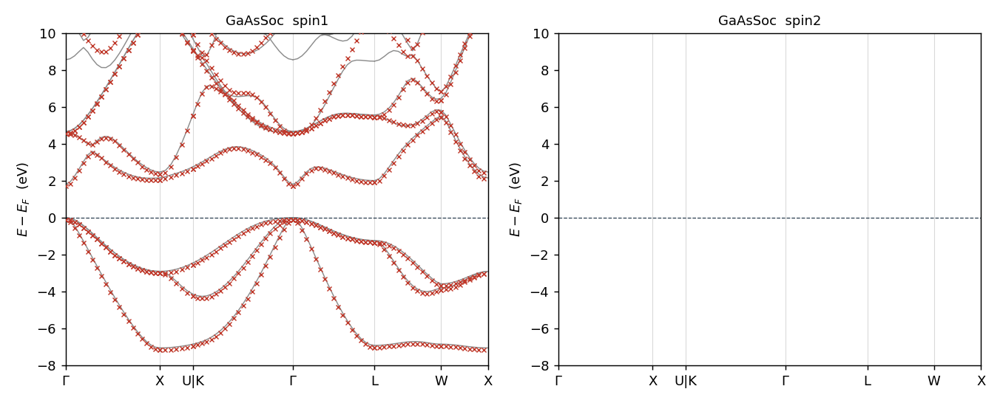
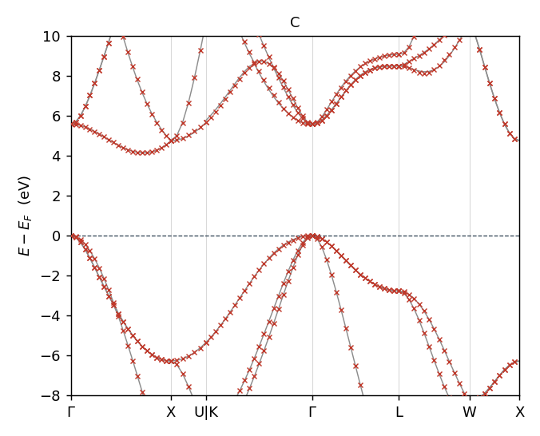
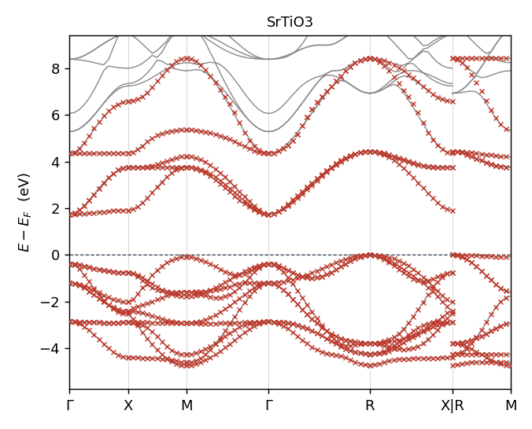
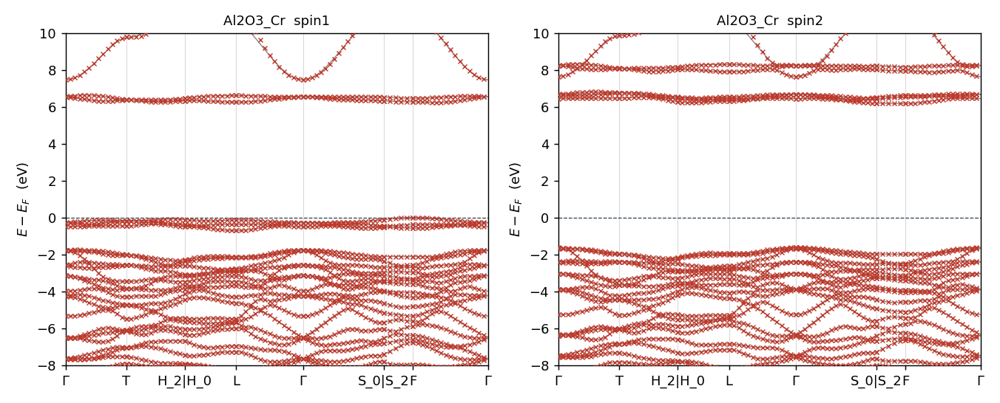
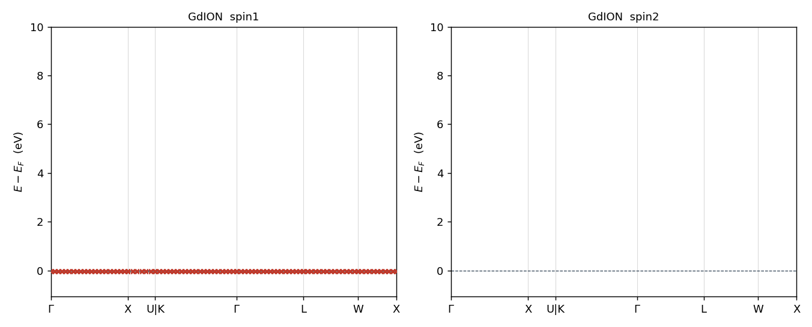
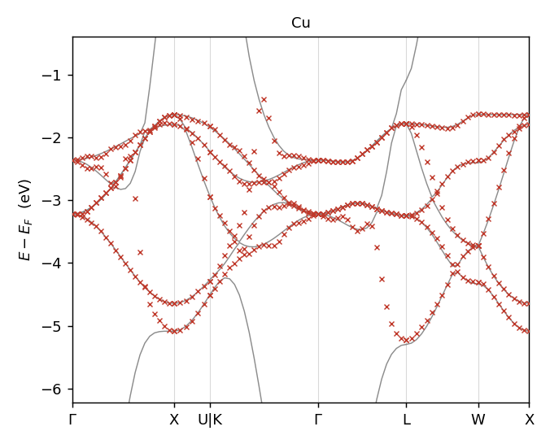
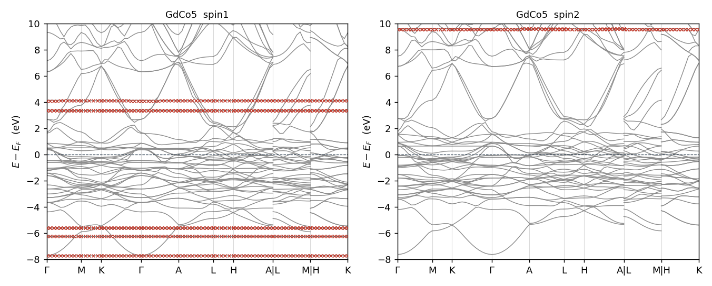
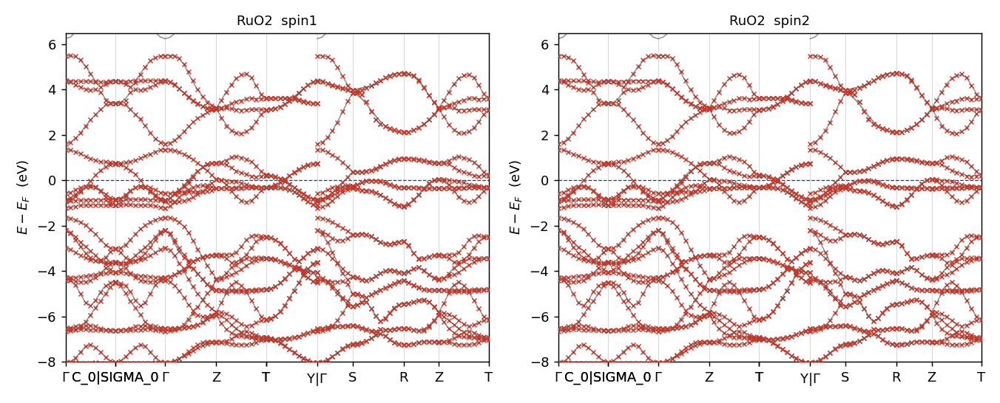
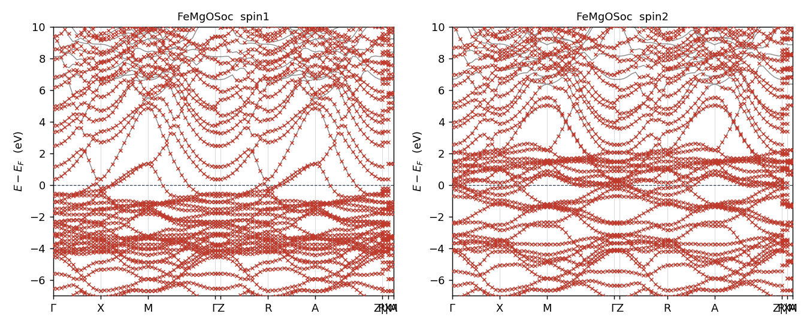

# MTO-based Localized Orbital (MLO) — sample tests and how to run

`mlo` builds a localized real-space tight-binding-style Hamiltonian on top of
ecalj's PMT (MTO + APW) basis. This directory covers semiconductors,
magnetic metals, multilayers, and 4f systems — see the table below for
the full list. The SOC-as-perturbation variant (`job_mlo_soc`) is
documented separately in [README_SOC.md](README_SOC.md).

## Quick start

```bash
cd ~/ecalj/Samples/MLOsamples
# SOC test set (job_mlo + job_mlo_soc)
testecalj -np 8 GaAsSoc       # semiconductor, with SOC
testecalj -np 8 FeSoc         # ferromagnetic Fe (nspin=2), with SOC
testecalj -np 8 FeMgOSoc      # FeMgO multilayer (nspin=2), with SOC

# Plain MLO non-SOC
testecalj -np 8 Si666gwsc     # Si QSGW, non-magnetic, MLO + DFT band check
testecalj -np 8 Al2O3_Cr      # Cr-doped Al2O3 QSGW80, mlo_emax=7 example
testecalj -np 8 C             # diamond C
testecalj -np 8 C.sp          # graphite-like C (sp-only)
testecalj -np 8 Cu            # fcc Cu
testecalj -np 8 SrTiO3        # perovskite, non-magnetic
testecalj -np 8 Fe            # bcc Fe (nspin=2, no SOC)
testecalj -np 8 FeCo          # FeCo alloy (nspin=2)
testecalj -np 8 FeMgO         # FeMgO multilayer (nspin=2, no SOC)
testecalj -np 8 GdCo5         # GdCo5 (Gd 4f, nspin=2)
testecalj -np 8 GdION         # Gd ion QSGW
testecalj -np 8 NiO666lda     # NiO LDA AFM
testecalj -np 8 RuO2          # RuO2 QSGW
testecalj -np 8 SmP           # SmP (Sm 4f + so=2)
```

Each test runs the full pipeline (lmf → mlo, plus the 4-step
`job_mlo_soc` flow on `*Soc` samples), then numerically diffs the produced
`band_MLO_spin{1,2}*.dat` against committed references with tolerance
`7.4e-5 Ry ≈ 0.001 eV`. PASS line:

    max deviation = 0.0  tolerance = 7.4e-05

## Sample summary

| dir | system | nspin | SOC test | reference |
|---|---|---|---|---|
| `Si666gwsc`  | Si QSGW (6×6×6)        | 1 | – | `bnd00{1..6}.spin1`, `band_MLO_spin1.dat` |
| `GaAsSoc`    | GaAs QSGW              | 1 | ✓ | `band_MLO_spin1.dat`, `band_MLO_spin1.soc.dat` |
| `FeSoc`      | bcc Fe DFT             | 2 | ✓ | `band_MLO_spin{1,2}.dat`, `band_MLO_spin1.soc.dat` |
| `FeMgOSoc`   | FeMgO multilayer DFT   | 2 | ✓ | `band_MLO_spin{1,2}.dat`, `band_MLO_spin1.soc.dat` |
| `Al2O3_Cr`   | Cr-doped Al2O3 QSGW80  | 2 | – | `band_MLO_spin{1,2}.dat` (mlo_emax=7) |
| `C`          | diamond C              | 1 | – | `band_MLO_spin1.dat` |
| `C.sp`       | C graphite-like (sp)   | 1 | – | `band_MLO_spin1.dat` |
| `Cu`         | fcc Cu                 | 1 | – | `band_MLO_spin1.dat` |
| `SrTiO3`     | SrTiO3 perovskite      | 1 | – | `band_MLO_spin1.dat` |
| `Fe`         | bcc Fe DFT (no SOC)    | 2 | – | `job_mloW` + on-site diagonal V, W−V check (inline in `Fe/test.py`, no file) |
| `FeCo`       | FeCo alloy             | 2 | – | `band_MLO_spin{1,2}.dat` |
| `FeMgO`      | FeMgO multilayer       | 2 | – | `band_MLO_spin{1,2}.dat` |
| `GdCo5`      | GdCo5 (4f magnetic)    | 2 | – | `band_MLO_spin{1,2}.dat` |
| `GdION`      | Gd ion QSGW            | 2 | – | `band_MLO_spin{1,2}.dat` |
| `NiO666lda`  | NiO LDA AFM            | 2 | – | `band_MLO_spin{1,2}.dat` |
| `RuO2`       | RuO2 QSGW              | 2 | – | `band_MLO_spin{1,2}.dat` |
| `SmP`        | SmP (4f, so=2 Lz·Sz)   | 2 | – | `band_MLO_spin{1,2}.dat` |

For `Si666gwsc` the MLO test was added on top of an existing `job_band`
DFT-band check, so testecalj runs both. `Al2O3_Cr` is the canonical
example for `mlo_emax > 0` (Cr 3d states sit ~7 eV above E_F).

## Plots

All plots are `bandplot_MLO.isp1.glt` rendered after `testecalj`
finishes. Red dots = MLO bands, lines = full DFT bands. SOC samples
show the 2N-spinor MLO overlay (post-`job_mlo_soc`).

### Semiconductors / insulators

| GaAsSoc (SOC) | Si666gwsc | C (diamond) | C.sp | SrTiO3 |
|---|---|---|---|---|
|  |  |  |  |  |

| Al2O3_Cr (mlo_emax=7) | GdION | SmP |
|---|---|---|
|  |  |  |

### Magnetic metals

| Fe | FeCo | FeSoc (SOC) | Cu |
|---|---|---|---|
|  |  |  |  |

| GdCo5 | NiO666lda | RuO2 |
|---|---|---|
|  |  |  |

### Multilayers

| FeMgO | FeMgOSoc (SOC) |
|---|---|
|  |  |

## Manual run

```bash
cd <target>_work          # produced by testecalj
gnuplot -p bandplot_MLO.isp1.glt        # red = MLO bands, line = DFT bands
gnuplot -p bandplot_MLO.isp2.glt        # spin-down (FeSoc / FeMgOSoc only)
```

For SOC samples, the same `bandplot_MLO.isp1.glt` shows the 2N-spinor MLO
overlay after `job_mlo_soc` finishes (Fermi level reset to `efermi_soc`).
See `README_SOC.md` for what to expect.

To run only the MLO step manually:

```bash
job_mlo gaas -np 8                       # non-SOC
job_mlo_soc gaas -np 8                   # SOC as perturbation
```

## What gets shown in the plot

Both DFT and MLO bands plotted on the same panel (`Energy − E_F`, eV).

- `Si666gwsc`: dispersive sp bands. MLO traces the lower 4 valence + a few
  conduction bands faithfully along Γ–X–U–Γ–L–W–X.
- `GaAsSoc`: VBM around Γ shows the As-p triplet. With `job_mlo_soc`,
  the Δ_SO ≈ 0.34 eV split-off band is reproduced.
- `FeSoc`: Fe 3d manifold ±2 eV around E_F, both spins.
- `FeMgOSoc`: dense band structure of the Fe-MgO interface region.

## Settings to know (in `ctrlG.<sname>.toml`)

As of 2026-05 the Fortran binaries read structured TOML only. Legacy
`GWinput` is converted on first use by `Legacy2toml.py`; what follows
shows the converted form actually consumed by `lmf` / `mlo`.

```toml
mlo_method = 0       # 0 = standard, 1 = emax-cut, 2 = MTO-energy cut
mlo_emax   = 0       # eV relative to E_F (semiconductor: 0 ≈ at E_F).
                     # User-set 0 is honoured literally; sentinel default for
                     # "key absent" applies emax*Ry at runtime.
                     # Al2O3_Cr-style insulators: try 7 eV.
Worb = """           # which lm orbitals per atom enter the MLO basis
  1 Ga   1 2 3 4 5 6 7 8 9
  2 As   1 2 3 4 5 6 7 8 9
"""
```

The `Worb` indices map to `(l, m)`: `1 → s; 2..4 → p; 5..9 → d; 10..16 → f`
(see `bandplot.isp1.glt` header for the full table).

## Screened W on the MLO basis (separate flow)

```bash
job_mloW fe -np 8
```

Computes the on-site interaction strength on the MLO basis. The two
output blocks are written separately so users can post-process them:

- `Coulomb_v.{UP,DN}` — bare V on MLO basis
- `Screening_W-v.{UP,DN}` — RPA-screened W − V on MLO basis
- The full screened W is then **the sum** of the two.

What actually matters for downstream analysis:

- **On-site (one-atom) blocks** of V and W − V — the U/J parameters in
  Hubbard-style models live here.
- **W at ω = 0** (static screened interaction).

The full ω-dependence is stored on disk (frequency mesh from
`HistBin_dw` / `HistBin_ratio`), but for typical use cases only the
ω = 0 slice and the on-site sub-block need post-processing.

### ⚠️ Important flag: `--mlo_feb4` (controls V/W definition)

`job_mloW` passes `--mlo_feb4` to `mlo` and `hwmatK_MPI`. **Keep this
flag on** for the Hubbard-U-like interpretation that matches the
original 2026-02 implementation (commit `6e4d7500a`, reference value
~1.5 eV). Two things change with the flag:

| Step | with `--mlo_feb4` (Feb 2026 behavior) | without (Today default) |
|---|---|---|
| `mlo` (m_hreduction) | per-orbital diagonal normalization `\|F_i⟩ → \|F_i⟩/√⟨F_i\|F_i⟩` so `⟨F_i\|F_i⟩ = 1` | no normalization |
| `hwmatK_MPI` (readcmlo) | `ovlm_inv = I` ⇒ V = `⟨F F \| V \| F F⟩` non-dual | `ovlm_inv = ⟨F\|F⟩⁻¹` ⇒ V uses dual basis `⟨F̃ F \| V \| F̃ F⟩` |

The dual-basis (off-flag) variant was introduced in commit `415b6e625`
(2026-03-12) for the magnon path; it changes per-orbital `V_iiii` by
~5–17 % (largest in the p block) without affecting MLO bands. For
Hubbard-style on-site U/J interpretation the historical `--mlo_feb4`
form is the natural choice.

Note: MLO bands themselves are **bit-identical** with or without
`--mlo_feb4` — the flag only affects the V/W tensor extraction.

### Reference value: bcc Fe, Fe-3d on-site W (with `--mlo_feb4`)

Original 2026-02-04 follow-up (commit `6e4d7500a`): on-site screened
W on the Fe 3d block comes out around **~1.5 eV**.

#### Reproduction runs (2026-05-08, gfortran-14, ROMIO, `--mlo_feb4` on)

`job_mloW fe -np <N>` in `Samples/MLOsamples/Fe/`, `mlo_method = 0`,
on-site Fe-1 d-block diagonal `⟨i i | W | i i⟩` at R=0, ω=0:

| BZ mesh | parallelism | W (t2g, UP) | W (eg, UP) | W (t2g, DN) | W (eg, DN) |
|---|---|---|---|---|---|
| 2×2×2 | -np 8 | 2.20 eV | 2.34 eV | 2.09 eV | 2.21 eV |
| **4×4×4** | **-np 8** | **1.60 eV** | **1.76 eV** | **1.54 eV** | **1.68 eV** |

Trend: denser BZ mesh → smaller W (more screening channels). 4×4×4
already lands within ~10 % of Takao's 1.5 eV ballpark. The 2×2×2
values agree bit-by-bit with a fresh build of `464a2d510` (Feb 4),
verifying the `--mlo_feb4` mode reproduces the original calculation.

Full 4×4×4 / `-np 8` table (UP / DN spins, all nine MLO indices on
atom 1; printed automatically at the end of `job_mloW`):

```text
=== On-site diagonal <i i | V/W | i i> at R=0, omega=0 (spin UP) ===
  i      V (eV)    W-V (eV)     W (eV)
  1      10.70     -9.77         0.92    (s)
  2-4    10.70     -9.38         1.32    (p)
  5,6,8  23.95    -22.34         1.60    (d t2g)
  7,9    23.92    -22.16         1.76    (d eg)

=== On-site diagonal <i i | V/W | i i> at R=0, omega=0 (spin DN) ===
  i      V (eV)    W-V (eV)     W (eV)
  1      10.69     -9.76         0.93    (s)
  2-4    10.72     -9.38         1.33    (p)
  5,6,8  23.19    -21.66         1.54    (d t2g)
  7,9    23.10    -21.42         1.68    (d eg)
```

The job script ends with an awk block that parses `Coulomb_v.{UP,DN}` and
`Screening_W-v.{UP,DN}` (filter: R=0, all four orbital indices equal,
ω=0 record) and prints V / W−V / W per Wannier index — no separate
post-processing step is needed.

### Regression test: `testecalj Fe`

`Fe/test.py` drives `job_mloW fe` (which subsumes `job_mlo` —
`--writeham --mlo` + `mlo` are part of `job_mloW`'s pipeline) and
verifies the on-site diagonal **V** and **W − V** for both spin
channels against hard-coded reference values (one (V, W−V) tuple per
orbital, indices 1..9 = s + 3p + 5d).  Reference values live inline in
`test.py` (generated 2026-05-08 from this directory's `ctrlG.fe.toml`
+ `GWinput`); **no `Coulomb_v.*` / `Screening_W-v.*` are committed** as
test fixtures, so the test is self-contained.  Tolerance: 0.05 eV.

```
testecalj Fe -np 4         # ~1 min wall on 4 cores
```

Output streams continuously to the terminal: each `OK! --> Start ...`
line of `job_mloW`, the script's own `=== On-site diagonal ===` table,
then `test.py`'s comparison table (`V_exp / V_act / dV / WmV_exp /
WmV_act / dWmV / status`).  Final `PASSED!` summaries are appended to
`Fe_work/summary.txt`.

This is plain RPA, not cRPA: the cRPA block in `job_mloW` is
commented out (a minor follow-up is needed to enable it cleanly).
Running `testecalj Fe` (or `job_mloW fe -np <N>` directly inside
`Fe/`) produces `Coulomb_v.{UP,DN}` and `Screening_W-v.{UP,DN}` on
the Fe-3d MLO basis as the live reference state for the regression
test.

### MPI-IO note: force ROMIO, not OMPIO

`job_mloW` sets `export OMPI_MCA_io=romio321` near the top.

OpenMPI 4.x ships two MPI-IO implementations. The default OMPIO uses a
POSIX semaphore in `/dev/shm/sem.OMPIO_<filename>` for file locking.
If a previous `hx0fp0` was killed (SIGKILL or out-of-memory), that
semaphore is **not** cleaned up; the next `mpi_file_open(__WVI.<iq>)`
on the same file name then waits on it forever and the pipeline hangs
in `futex_do_wait`. ROMIO uses kernel `fcntl` advisory locks, which
are auto-released on process death, so stale state cannot accumulate.
The switch is local to `job_mloW`'s environment, so concurrent users
or other GW jobs on the same machine are not affected.

Symptom (if you see it elsewhere): `hx0fp0` running with 0 % CPU and
`/proc/<pid>/maps` shows a mapped `/dev/shm/sem.OMPIO_<file>`. Recovery
is `rm -f /dev/shm/sem.OMPIO_*` **only when no other MPI-IO job is
running on the box** — on a shared machine it is safer to leave the
job to ROMIO via the env var rather than rely on global cleanup.

## Recent fixes (2026-05)

The MLO + TOML migration introduced two regressions, fixed in commits
`10e642915` / `c11663856` / `86e58d0c4` / `802878e82`:

- **`mlo_emax 0`**: TOML reader treated 0 as "use default", overriding
  user intent. Now sentinel-based — explicit 0 is honoured.
- **`<Worb>` duplicate blocks**: `gwinput2toml.py` last-write-wins silently
  dropped real data when GWinput had a real block plus a commented
  example. Now keeps the first.
- **`job_mlo_soc` -v overrides**: `-vnspin=2 -vso=0` form is silently
  ignored under TOML-only mode; replaced with `--toml.ham.nspin=2`,
  `--toml.ham.so=0/1`.
- **gfortran 13.3 / 14.2 codegen bug** in `m_HamPMT.f90`
  (`ReadInfoFromGWinput` block): a "naked" `else: call rx` on the
  `<Worb>` if/else miscompiles the live (TOML) path, corrupting
  `lmindex` and surfacing as `zhev_tk2: nev /=nevx ...` at runtime.
  Bisect (2026-05-07) found the empirically minimum bait that prevents
  the miscompile is one line — `aaa = trim(aaa) // ' '` — both
  `trim()` and `//` are required (either alone fails). The first if
  (`mlomethod` scalar) is unaffected and needs no bait. The trigger
  is *not* partial-array assignment as initially suspected. All 17
  MLO samples verified with gfortran 14.2.0.

See `README_SOC.md` for SOC-specific implementation notes.
