# MTO-based Localized Orbital (MLO) — sample tests and how to run

> **The method itself** -- what `theta` is, why `mlo_method = 4`, and the
> measured accuracy of the samples with band plots:
> **[ecaljdoc manual/mlo](https://ecalj.github.io/ecaljdoc/manual/mlo)**.
> Past working records (old settings, superseded numbers) are kept under
> [MD/mlo_notes/](../../MD/mlo_notes/README.md). Figures live in [plots/](plots/) and
> are regenerated by `SRC/exec/mlo_bandplot.py <sampledir>`.

`mlo` builds a localized real-space tight-binding-style Hamiltonian on top of
ecalj's PMT (MTO + APW) basis. This directory covers semiconductors,
magnetic metals, multilayers, and 4f systems — see the table below for
the full list. The SOC-as-perturbation variant (`job_mlo_soc`) is
documented separately in [MD/mlo_notes/mlo_soc_memo.md](../../MD/mlo_notes/mlo_soc_memo.md).

## Quick start

```bash
cd ~/ecalj/Samples/MLOsamples
# SOC test set (job_mlo + job_mlo_soc)
testecalj -np 8 GaAsSoc       # semiconductor, with SOC
testecalj -np 8 FeSoc         # ferromagnetic Fe (nspin=2), with SOC
testecalj -np 8 FeMgOSoc      # FeMgO slab + empty spheres, 76 MLO, with SOC

# Plain MLO non-SOC
testecalj -np 8 Si666gwsc     # Si QSGW, non-magnetic, MLO + DFT band check
testecalj -np 8 Al2O3_Cr      # Cr-doped Al2O3 QSGW80 (CBM ~7 eV above E_F)
testecalj -np 8 C             # diamond C
testecalj -np 8 C.sp          # graphite-like C (sp-only)
testecalj -np 8 Cu            # fcc Cu
testecalj -np 8 GaAs          # GaAs LDA, from the SCF
testecalj -np 8 SrTiO3        # perovskite, non-magnetic
testecalj -np 8 Fe            # bcc Fe (nspin=2, no SOC)
testecalj -np 8 FeCo          # FeCo alloy (nspin=2)
testecalj -np 8 FeMgO         # FeMgO slab + empty spheres, 76 MLO (nspin=2, no SOC)
testecalj -np 8 GdCo5         # GdCo5 (Gd 4f, nspin=2)
testecalj -np 8 GdION         # Gd ion QSGW
testecalj -np 8 NiO666lda     # NiO LDA AFM
testecalj -np 8 RuO2          # RuO2 QSGW
testecalj -np 8 SmP           # SmP (Sm 4f + so=2)
```

Each test runs the full pipeline (lmf → mlo, plus the `job_mlo_soc` flow on
`*Soc` samples: steps 1, 1b (the DFT bands with SOC), 2, 3, 4; see `MD/mlo_notes/mlo_soc_memo.md`), then numerically diffs the produced
`band_MLO_spin{1,2}*.dat` against committed references with tolerance
`7.4e-5 Ry ≈ 0.001 eV`. PASS line:

    max deviation = 0.0  tolerance = 7.4e-05

## Sample summary

| dir | system | nspin | SOC test | reference |
|---|---|---|---|---|
| `Si666gwsc`  | Si QSGW (6×6×6)        | 1 | – | `bnd00{1..6}.spin1`, `band_MLO_spin1.dat` |
| `GaAsSoc`    | GaAs QSGW              | 1 | ✓ | `band_MLO_spin1.dat`, `band_MLO_spin1.soc.dat` |
| `FeSoc`      | bcc Fe DFT             | 2 | ✓ | `band_MLO_spin{1,2}.dat`, `band_MLO_spin1.soc.dat` |
| `FeMgOSoc`   | FeMgO slab + empty spheres (76 MLO) | 2 | ✓ | `band_MLO_spin{1,2}.dat`, `band_MLO_spin1.soc.dat` |
| `Al2O3_Cr`   | Cr-doped Al2O3 QSGW80  | 2 | – | `band_MLO_spin{1,2}.dat` |
| `C`          | diamond C              | 1 | – | `band_MLO_spin1.dat` |
| `C.sp`       | C graphite-like (sp)   | 1 | – | `band_MLO_spin1.dat` |
| `Cu`         | fcc Cu                 | 1 | – | `band_MLO_spin1.dat` |
| `GaAs`       | GaAs LDA (SCF, then bands and MLO) | 1 | – | `band_MLO_spin1.dat` |
| `SrTiO3`     | SrTiO3 perovskite      | 1 | – | `band_MLO_spin1.dat` |
| `Fe`         | bcc Fe DFT (no SOC)    | 2 | – | `job_mloW` + on-site diagonal V, W−V check (inline in `Fe/test.py`, no file) |
| `FeCo`       | FeCo alloy             | 2 | – | `band_MLO_spin{1,2}.dat` |
| `FeMgO`      | FeMgO slab + empty spheres (76 MLO) | 2 | – | `band_MLO_spin{1,2}.dat` |
| `GdCo5`      | GdCo5 (4f magnetic)    | 2 | – | `band_MLO_spin{1,2}.dat` |
| `GdION`      | Gd ion QSGW            | 2 | – | `band_MLO_spin{1,2}.dat` |
| `NiO666lda`  | NiO LDA AFM            | 2 | – | `band_MLO_spin{1,2}.dat` |
| `RuO2`       | RuO2 QSGW              | 2 | – | `band_MLO_spin{1,2}.dat` |
| `SmP`        | SmP (4f, so=2 Lz·Sz)   | 2 | – | `band_MLO_spin{1,2}.dat` |
| `Ag`, `Al`, `NaCl`, `SiC`, `CdTe`, `ZnO`, `TiO2` | Materials Project structures, DFT, all s,p,d channels, defaults; self-contained (lmfa → lmf → job_band → job_mlo, no rst) | 1 | – | `band_MLO_spin1.dat` (see [MD/mlo_notes/mp_20260918](../../MD/mlo_notes/mp_20260918/README.md)) |

For `Si666gwsc` the MLO test was added on top of an existing `job_band`
DFT-band check, so testecalj runs both. `Al2O3_Cr` is the system that used
to need a hand-set `mlo_emax = 7` (its CBM sits ~7 eV above E_F); with
`mlo_method = 4` the floor at `ecbot + mlo_delta` finds that automatically,
which is the whole point of the method.

## Plots

All plots are `bandplot_MLO.isp1.glt` rendered after `testecalj`
finishes. Red dots = MLO bands, lines = full DFT bands. SOC samples
show the 2N-spinor MLO overlay (post-`job_mlo_soc`) on the DFT bands with SOC
(step 1b; `plots/*Soc.png` redrawn 2026-10-01, numbers in `plots/*Soc.npz`).

### Semiconductors / insulators

| GaAsSoc (SOC) | Si666gwsc | C (diamond) | C.sp | SrTiO3 |
|---|---|---|---|---|
| 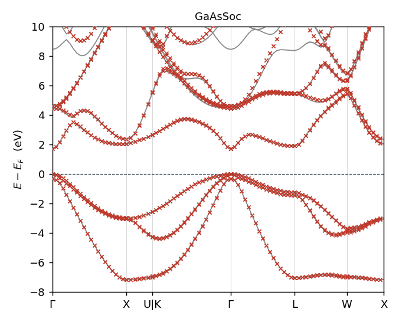 |  |  | 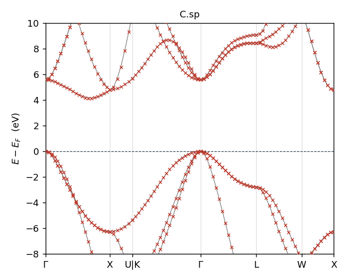 |  |

| Al2O3_Cr | GdION | SmP |
|---|---|---|
| 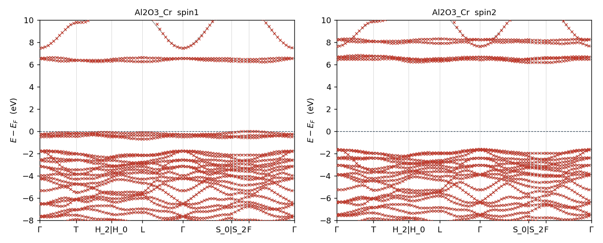 | 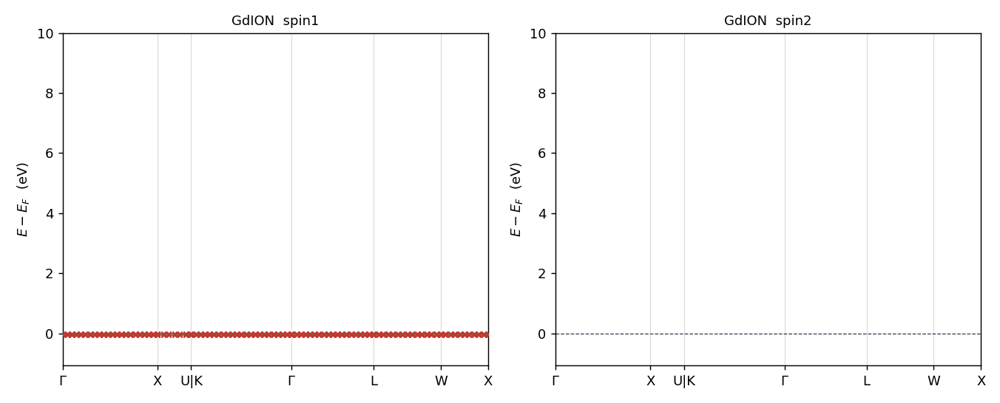 | 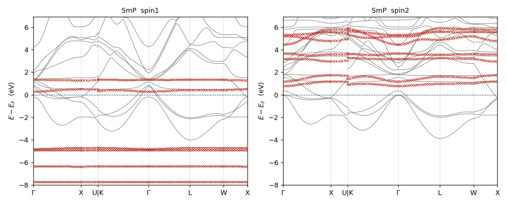 |

### Magnetic metals

| Fe | FeCo | FeSoc (SOC) | Cu |
|---|---|---|---|
|  | 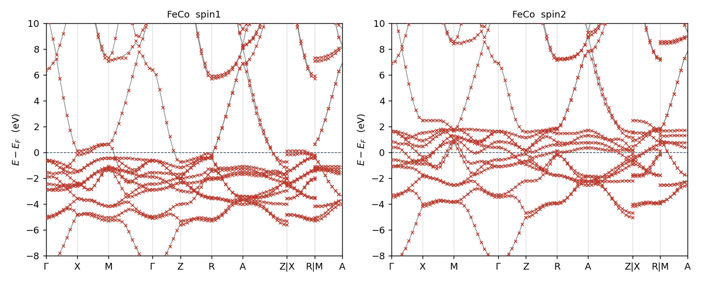 |  | 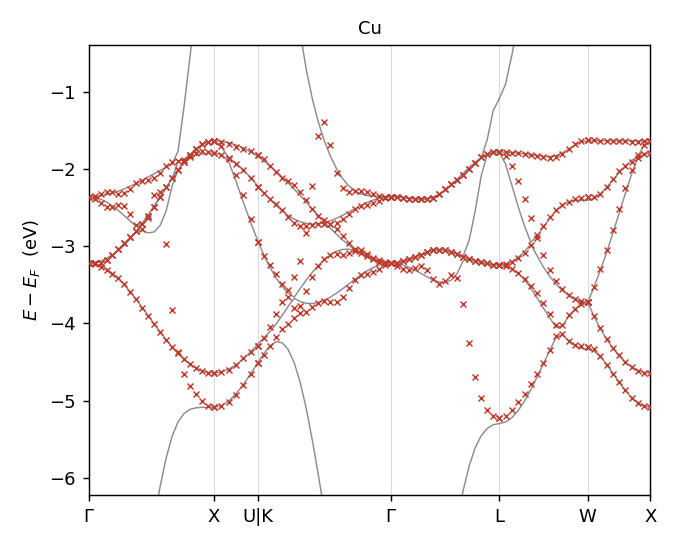 |

| GdCo5 | NiO666lda | RuO2 |
|---|---|---|
| 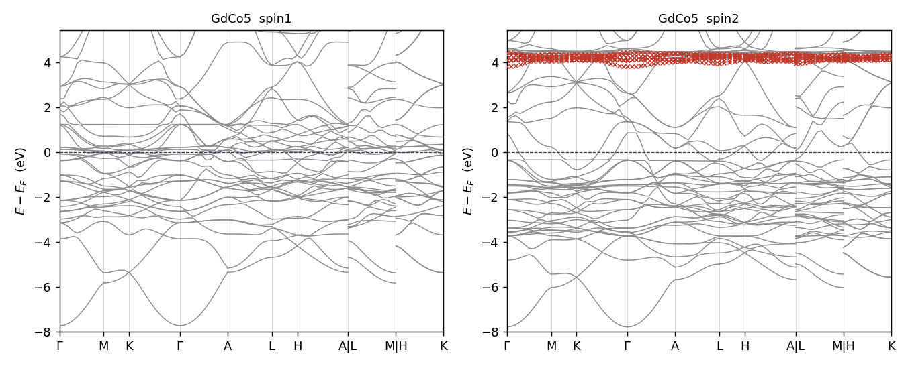 | 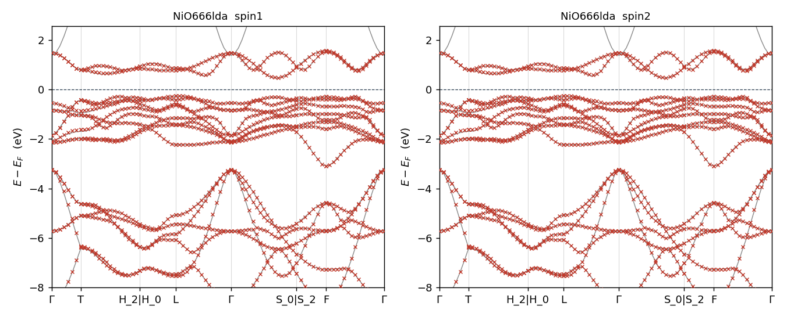 | 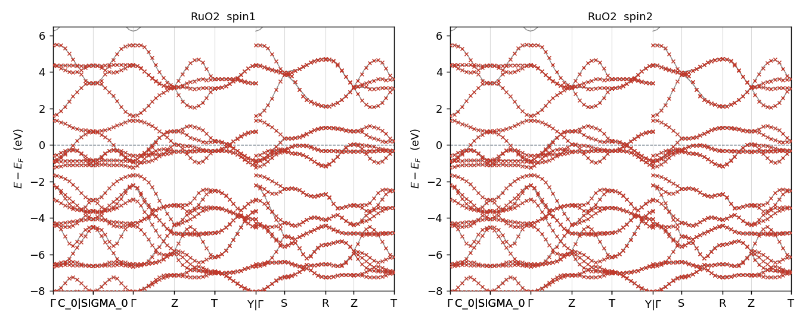 |

### Multilayers

| FeMgO | FeMgOSoc (SOC) |
|---|---|
| 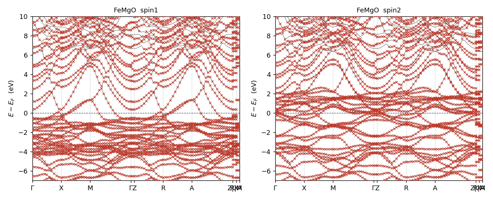 |  |

### Materials Project structures, defaults untouched (DFT)

| Ag | Al | NaCl | SiC |
|---|---|---|---|
| 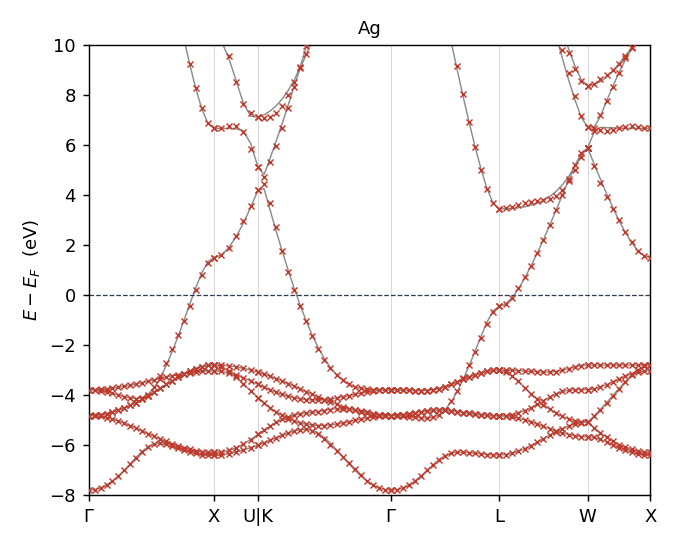 | 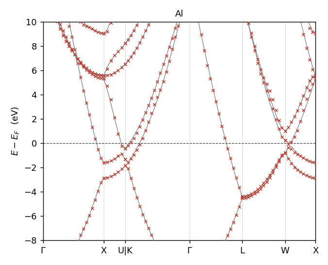 |  | 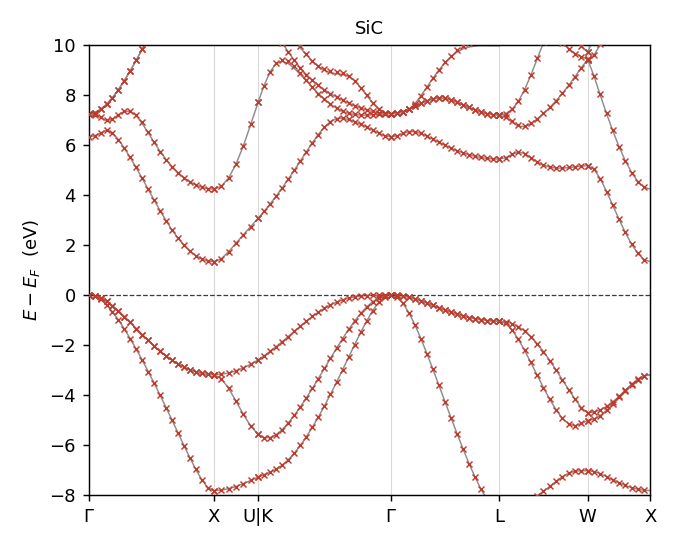 |

| CdTe | ZnO | TiO2 |
|---|---|---|
|  | 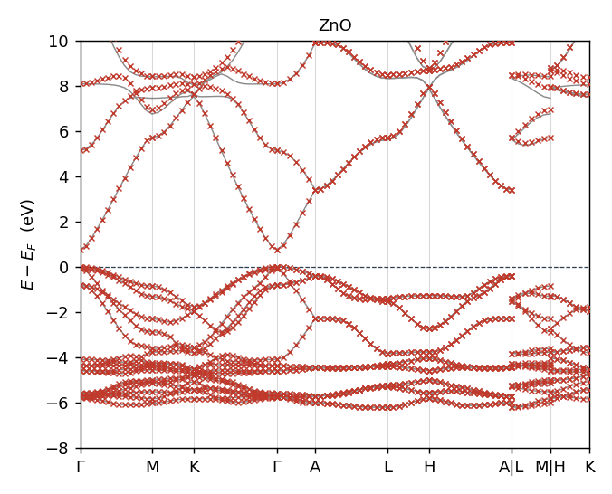 | 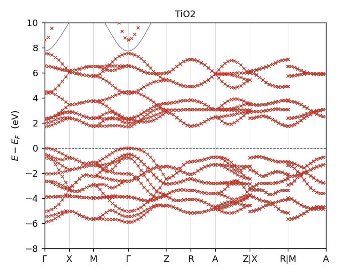 |

## Manual run

```bash
cd <target>_work          # produced by testecalj
gnuplot -p bandplot_MLO.isp1.glt        # red = MLO bands, line = DFT bands
gnuplot -p bandplot_MLO.isp2.glt        # spin-down (FeSoc / FeMgOSoc only)
```

For SOC samples, the same `bandplot_MLO.isp1.glt` shows the 2N-spinor MLO
overlay after `job_mlo_soc` finishes (Fermi level reset to `efermi_soc`).
See `MD/mlo_notes/mlo_soc_memo.md` for what to expect.

To run only the MLO step manually:

```bash
job_mlo gaas -np 8                       # non-SOC
job_mlo_soc gaas -np 8                   # SOC as perturbation
```

## What gets shown in the plot

Both DFT and MLO bands plotted on the same panel (`Energy − E_F`, eV).

- `Si666gwsc`: dispersive sp bands. MLO traces the lower 4 valence + a few
  conduction bands faithfully along Γ–X–U–Γ–L–W–X.
- `GaAsSoc`: VBM around Γ shows the As-p triplet. With `job_mlo_soc`,
  the Δ_SO ≈ 0.34 eV split-off band is reproduced.
- `FeSoc`: Fe 3d manifold ±2 eV around E_F, both spins.
- `FeMgOSoc`: same model as `FeMgO` below, with SOC added as a perturbation
  via `job_mlo_soc`. The SOC Fermi level moves by 3.1 meV
  (-0.38286150 -> -0.38263489 Ry).
- `FeMgO`: Fe/MgO slab with 7 empty spheres (R = 1.9 a.u.) filling the
  30.5 a.u. vacuum. Without them the barrier region carries no basis function
  at all, so the interface states cannot be represented in principle. The
  `mlo_lm` keeps s,p on the empty spheres and drops 3d from Mg and O, giving a
  **76-orbital** model. Measured with `mlo_losscheck.py` (window E_F±2 eV):

  | | orbitals | dE_win | dE_occ | dv/v |
  |---|---|---|---|---|
  | this model (empty spheres, `mlo_method=4`) | **76** | **2.5 meV** | **0.5 meV** | **0.006** |
  | the old one (no empty spheres, `mlo_method=0 mlo_emax=5`) | 78 | 126.9 meV | 6.6 meV | 0.195 |

  The old 78-orbital model was the worst in this whole sample set and was
  removed on 2026-09-16; the present one is the same size and ~51x better.
  Dropping p from the empty spheres (55 orbitals) is almost as good near E_F
  but leaves +5..+10 eV unfilled -- see the doc.

  `FeMgOSoc` uses exactly these inputs plus the SOC test, so the two dirs
  share one baseline. Both carry an `[esm]` section: this is a slab with a
  vacuum layer, and without ESM the energy zero moves by ~4.4 eV (silently,
  before 2026-09-15 -- see Changes.md).

## Settings to know (in `ctrlg.<sname>.toml`)

The Fortran programs read `ctrlg.<sname>.toml` only. A legacy `ctrl.<sname>` +
`GWinput` has to be converted with `Legacy2toml.py <sname>` beforehand (nothing
converts it automatically); what follows is the `[mlo]` section that `lmf` / `mlo` read.

All samples use `mlo_method = 4` (since 2026-09-16). It needs no
per-material tuning -- `mlo_emax` is gone from every sample.

```toml
[mlo]
mlo_method = 4       # theta = sigma((eps - ecut_j)/mlo_w),
                     #   ecut_j = max(CBM + mlo_delta, eps^MTO_j)
mlo_delta  = 2.0     # (eV) how far above the band edge (E_F in metals) the
                     #   model must be accurate. A statement of intent, not a
                     #   fitting parameter: match it to your target window.
mlo_w      = 2.0     # (eV) width of the fall-off. THIS is the knob to turn
                     #   if the residual is too large. Measured optima:
                     #   semiconductors ~2, Fe/Cu-like metals ~11.
                     # All three are defaults -- you may omit them entirely.
mlo_nkabc  = [8, 8, 8]  # k mesh the MLO Hamiltonian is built on; required
mlo_lm = """
  1 Ga   1 2 3 4 5 6 7 8 9
  2 As   1 2 3 4 5 6 7 8 9
"""
```

`mlo_lm` lists the lm orbitals of each atom that enter the MLO basis (the block was called `Worb`
until 2026-09-17; the old name is still read). The indices map to `(l, m)`: `1 → s; 2..4 → p; 5..9 → d; 10..16 → f`
(see `bandplot.isp1.glt` header for the full table).

## Screened W on the MLO basis (separate flow)

```bash
job_mloW fe -np 8
```

Computes the on-site interaction strength on the MLO basis. The two
output blocks are written separately so users can post-process them:

- `Coulomb_v.{UP,DN}` — bare V on MLO basis
- `Screening_W-v.{UP,DN}` — RPA-screened W − V on MLO basis
- The full screened W is then **the sum** of the two.

What actually matters for downstream analysis:

- **On-site (one-atom) blocks** of V and W − V — the U/J parameters in
  Hubbard-style models live here.
- **W at ω = 0** (static screened interaction).

The full ω-dependence is stored on disk (frequency mesh from
`HistBin_dw` / `HistBin_ratio`), but for typical use cases only the
ω = 0 slice and the on-site sub-block need post-processing.

### Normalization of the MLOs, cRPA and the spread (2026-10-02)

- The MLOs are normalized in real space: each is divided by the square root of its square integral
  O_ii(R=0), one constant per orbital, when `mlo` defines the model (HamRsMLO). No band changes; U and J of
  `job_mloW` are those of normalized orbitals. The old options `--mlo_feb4`, `--mlo_diagnorm`, `--mlo_ortho`,
  `--mlo_orthonorm` are retired (they normalized at each k or orthogonalized, which changes the orbitals).
- `job_mloW <sname> --crpa` also writes the cRPA W (`Screening_W-v_crpa.{UP,DN}`): the screening inside the
  MLO subspace (`mlo_lm`) is removed. Tests: `TestInstall/ni_crpa`, `srvo3_crpa`.
- `mlo_spread.py <sname> -np N` after `job_mloW`: <r>, <r^2> and the spread of each MLO.
- Explanations and the comparison with the Wannier functions (removed 2026-10-02): ecaljdoc
  [mlo](https://ecalj.github.io/ecaljdoc/manual/mlo) section 6. The values of 2026-05 with `--mlo_feb4`
  (bcc Fe d W about 1.6 eV at 4x4x4) are in the git history before this change.

### Regression test: `testecalj Fe`

`Fe/test.py` drives `job_mloW fe` (which subsumes `job_mlo` —
`--writeham --mlo` + `mlo` are part of `job_mloW`'s pipeline) and
verifies the on-site diagonal **V** and **W − V** for both spin
channels against hard-coded reference values (one (V, W−V) tuple per
orbital, indices 1..9 = s + 3p + 5d).  Reference values live inline in
`test.py` (baseline of 2026-09-16 from this directory's `ctrlg.fe.toml`,
`mlo_method = 4`); **no `Coulomb_v.*` / `Screening_W-v.*` are committed** as
test fixtures, so the test is self-contained.  Tolerance: 0.05 eV.

```
testecalj Fe -np 4         # ~1 min wall on 4 cores
```

Output streams continuously to the terminal: each `OK! --> Start ...`
line of `job_mloW`, the script's own `=== On-site diagonal ===` table,
then `test.py`'s comparison table (`V_exp / V_act / dV / WmV_exp /
WmV_act / dWmV / status`).  Final `PASSED!` summaries are appended to
`Fe_work/summary.txt`.

This test is plain RPA; cRPA (`job_mloW --crpa`) is tested by `TestInstall/ni_crpa` and `srvo3_crpa`.
Running `testecalj Fe` (or `job_mloW fe -np <N>` directly inside
`Fe/`) produces `Coulomb_v.{UP,DN}` and `Screening_W-v.{UP,DN}` on
the Fe-3d MLO basis as the live reference state for the regression
test.

### MPI-IO note: force ROMIO, not OMPIO

`job_mloW` sets `export OMPI_MCA_io=romio321` near the top.

OpenMPI 4.x ships two MPI-IO implementations. The default OMPIO uses a
POSIX semaphore in `/dev/shm/sem.OMPIO_<filename>` for file locking.
If a previous `hx0fp0` was killed (SIGKILL or out-of-memory), that
semaphore is **not** cleaned up; the next `mpi_file_open(__WVI.<iq>)`
on the same file name then waits on it forever and the pipeline hangs
in `futex_do_wait`. ROMIO uses kernel `fcntl` advisory locks, which
are auto-released on process death, so stale state cannot accumulate.
The switch is local to `job_mloW`'s environment, so concurrent users
or other GW jobs on the same machine are not affected.

Symptom (if you see it elsewhere): `hx0fp0` running with 0 % CPU and
`/proc/<pid>/maps` shows a mapped `/dev/shm/sem.OMPIO_<file>`. Recovery
is `rm -f /dev/shm/sem.OMPIO_*` **only when no other MPI-IO job is
running on the box** — on a shared machine it is safer to leave the
job to ROMIO via the env var rather than rely on global cleanup.

## Recent fixes (2026-05)

The MLO + TOML migration introduced two regressions, fixed in commits
`10e642915` / `c11663856` / `86e58d0c4` / `802878e82`:

- **`mlo_emax 0`**: TOML reader treated 0 as "use default", overriding
  user intent. Now sentinel-based — explicit 0 is honoured.
- **`<Worb>` duplicate blocks**: `gwinput2toml.py` last-write-wins silently
  dropped real data when GWinput had a real block plus a commented
  example. Now keeps the first.
- **`job_mlo_soc` -v overrides**: the programs do not take the `-vnspin=2 -vso=0`
  form (they stop on `-v...=`); `job_mlo_soc` gives `--ctrlg:ham.nspin=2`,
  `--ctrlg:ham.so=0/1`.
- **gfortran 13.3 / 14.2 codegen bug** in `m_HamPMT.f90`
  (`ReadInfoFromGWinput` block): a "naked" `else: call rx` on the
  `<Worb>` if/else miscompiles the live (TOML) path, corrupting
  `lmindex` and surfacing as `zhev_tk2: nev /=nevx ...` at runtime.
  Bisect (2026-05-07) found the empirically minimum bait that prevents
  the miscompile is one line — `aaa = trim(aaa) // ' '` — both
  `trim()` and `//` are required (either alone fails). The first if
  (`mlomethod` scalar) is unaffected and needs no bait. The trigger
  is *not* partial-array assignment as initially suspected. All 17
  MLO samples verified with gfortran 14.2.0.

See `MD/mlo_notes/mlo_soc_memo.md` for SOC-specific implementation notes.
