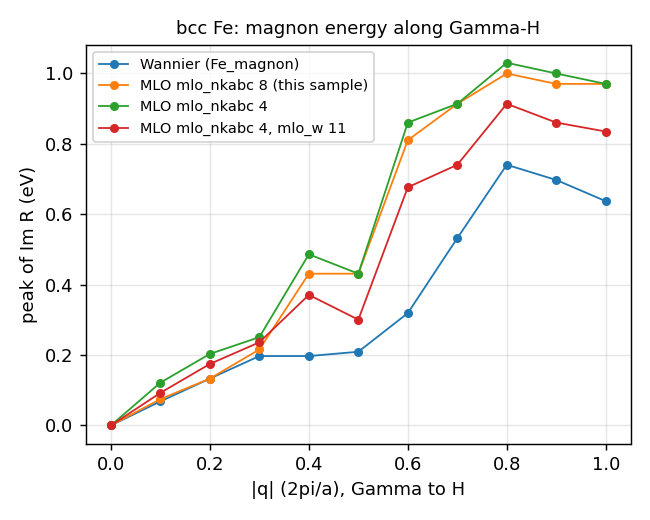

# Fe_mlo_magnon: bcc Fe のマグノン（MLO による模型。`job_mlo_magnon`）

`Fe_magnon`（Wannier 関数による模型、`job_magnon`。2026-10-02 に外した。git のタグ `last-wannier`）と同じ bcc Fe の入力で、模型の基底を MLO（muffin-tin localized orbital）に替えたもの。
横磁化率 $\chi^{+-}(\mathbf q,\omega)$ を、MLO の模型ハミルトニアン、MLO 基底での遮蔽相互作用 $W$、$\mathbf k$ と $\mathbf k+\mathbf q$ の MLO の重なりから作る。
Wannier 関数の窓や最大局在化の反復は要らず、`[mlo]` の設定だけで決まる。

## 入力の要点（`ctrlg.fe.toml`）

Wannier 版（`Fe_magnon`）の入力 `ctrlg.fe.toml` に `mlo_nkabc` を足したもの。

| キー | 値 | 意味 |
| --- | --- | --- |
| `[bz] nkabc` | 20×20×20 | SCF の k メッシュ |
| `[gw] n1n2n3` | 4×4×4 | $W$ と $\chi^{+-}$ の k メッシュ |
| `[mlo] mlo_nkabc` | 8×8×8 | MLO の模型ハミルトニアンを作る k メッシュ（必須）。4×4×4 では小さい q のマグノンのエネルギーが 1.5 倍になる（表 2） |
| `[mlo] mlo_lm` | Fe の s、p、d（9 軌道） | MLO にする軌道 |
| `[mlo] mlo_method`、`mlo_delta`、`mlo_w` | 既定 | MLO の重み（ecaljdoc [mlo](https://ecalj.github.io/ecaljdoc/manual/mlo)） |
| `[gw] magnon_*` | 既定 | `mlo_magnon` の均し幅など（`m_GWinput`） |

## 実行

```bash
lmfa fe > llmfa
mpirun -np 8 lmf fe > llmf
job_band fe -np 8 --NoGnuplot          # MLO の合わせに使うバンド（bnd001.spin1）
job_mlo_magnon fe -np 8                # 下の 4 段。8 コアで 1.5 分
python3 magnon_peaks.py "MLO=MagSuscep.syml001" "Wannier=wannier_TrRpm.syml001"   # 図 1 と表 2 の値
```

`job_mlo_magnon` の段:

1. MLO の模型ハミルトニアン（`lmf --writeham --mlo`、`mlo`。`job_mlo` と同じ）
2. MLO 基底の $W$（`lmf --jobgw=1 --mlo`、`hvccfp0`、`hwmatK_MPI --mlo`、`hx0fp0`。`job_mloW` と同じ）
3. $\mathbf k$ と $\mathbf k+\mathbf q$ の MLO の重なりと形状因子（`huumat_MPI --dwnb=mlo`、`hmlo_ovlppair`）
4. $\chi^{+-}$（`mlo_magnon`）

試験は `Samples/Magnon` で `testecalj Fe_mlo_magnon -np 8`（3 分）。

## 出力

**表 1**. `mlo_magnon` が書くファイル。`XXX` は `syml.fe` の線の番号、`NNN` はサイトの番号。列は q（3 列）、経路上の位置、$\omega$ (eV)、そのあとが値

| ファイル | 中身 |
| --- | --- |
| `MagSuscep.symlXXX` | $K(\mathbf q,\omega)$（実部、虚部）と $R(\mathbf q,\omega)$（実部、虚部）。`Fe_magnon` の `TrKpm`・`TrRpm` に当たる |
| `MagSpec.symlXXX` | スペクトル（$K$ と $R$ の虚部から） |
| `DynMagSuscep.symlXXX` | 動的磁化率 |
| `InvMagSuscep.symlXXX` | サイトごとの $R$ の逆行列の対角（LLG のパラメタ用） |
| `*SiteNNN.symlXXX` | 上の 3 つのサイトごとの値 |

マグノンのエネルギーは、各 q での $\mathrm{Im}\,R(\mathbf q,\omega)$ の極大の位置（`magnon_peaks.py`）。

## Wannier 版との比較

Wannier 版（`Fe_magnon`、`job_magnon`）の結果は `wannier_TrRpm.syml001`（2026-08-19、kt1 の参照）として添えてある。



**図 1**. Γ→H のマグノンのエネルギー（$\mathrm{Im}\,R$ の極大の位置）。Wannier 版（`Fe_magnon`）と、MLO 版の 3 つの設定。数値は `magnon_peaks.npz`

**表 2**. 図 1 の値（eV）。q は $2\pi/a$ 単位。gfortran、8 コア、2026-09-30。$\omega$ のメッシュは高い側で粗く（0.4 eV で 0.06 eV 刻み）、q ≥ 0.4 では山が広いので、極大の位置は目安

| q | Wannier（`Fe_magnon`） | MLO、`mlo_nkabc` 8（このサンプル） | MLO、`mlo_nkabc` 4 | MLO、`mlo_nkabc` 4、`mlo_w` 11 eV |
| --- | --- | --- | --- | --- |
| 0.1 | 0.068 | 0.075 | 0.122 | 0.093 |
| 0.2 | 0.133 | 0.133 | 0.203 | 0.175 |
| 0.3 | 0.197 | 0.216 | 0.251 | 0.236 |
| 0.4 | 0.197 | 0.431 | 0.486 | 0.371 |
| 0.5 | 0.209 | 0.431 | 0.431 | 0.300 |
| 0.6 | 0.319 | 0.810 | 0.860 | 0.676 |
| 0.7 | 0.532 | 0.913 | 0.913 | 0.740 |
| 0.8 | 0.740 | 0.999 | 1.029 | 0.913 |
| 1.0 | 0.637 | 0.969 | 0.969 | 0.834 |

- q ≤ 0.3 では、`mlo_nkabc` = 8×8×8 の MLO 版は Wannier 版と 20 meV 以内で一致する。4×4×4 では 1.5 倍になる
- q ≥ 0.4 では MLO 版のほうが 1.5 倍ほど高い。`mlo_w` を 11 eV（bcc Fe の MLO のバンドの合わせがよくなる値。`MLOsamples/Fe/test.py`）にすると下がる。
  二つの模型（Wannier 関数と MLO、それぞれの $W$）の違いによるもので、どちらが正しいかはここでは決めていない
- 符号の約束が違う: Wannier 版の $\mathrm{Im}\,\mathrm{Tr}\,R$ は負、MLO 版の $\mathrm{Im}\,R$ は正

## 試験の内容（`test.py`）

`MagSuscep.syml001` を参照と比べる: 値（許容 0.5、相対 10%。$\omega = 0$ の行は除く）と、各 q での $\mathrm{Im}\,R$ の極大の位置（5%）。
$R$ には鋭い極があり、極が $\omega$ の 1 刻みずれるだけで点ごとの比較は通らないので、位置で比べる（`comp.py` の `peak_check`）。

## 由来

`job_mlo_magnon`（2026-05）は MLO の流れの変更（2026-09）に追随しておらず、`mlo` の段で止まっていた。2026-09-30 に `job_mlo` の段を組み込み、このサンプルを作った。
