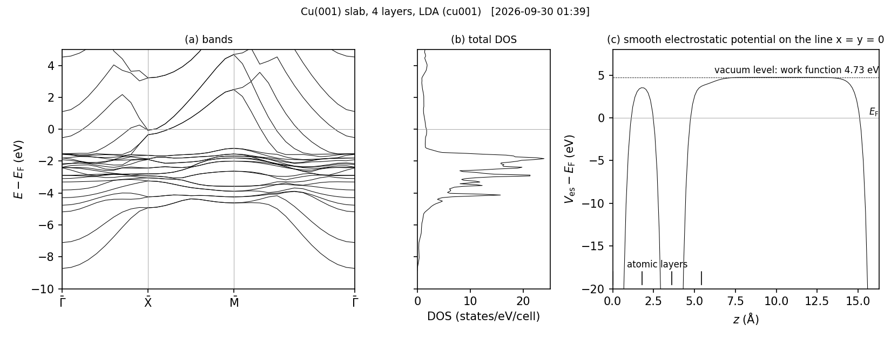

# Cu(001) の 4 層スラブ（LDA、バンド、状態密度、仕事関数）

真空をはさんだスラブの計算の例です。Cu(001) の 4 原子層（層の間隔 1.8075 Å）を、表面の (1×1) の単位胞
（一辺 $a/\sqrt2$ = 2.556 Å、各層に 1 原子、計 4 原子）で表し、表面に垂直な方向の周期を 16.2675 Å（真空 10.85 Å）にとります。
自己無撞着計算のあと、表面ブリルアンゾーンの $\bar\Gamma$–$\bar{\rm X}$–$\bar{\rm M}$–$\bar\Gamma$ に沿ったバンド、全状態密度、仕事関数を求めます（図 1）。

## 実行

```bash
lmfa cu001 > llmfa
mpirun -np 4 lmf cu001 > llmf
python3 workfunction.py cu001           # 真空準位と仕事関数 workfunction.cu001.txt
job_band cu001 -np 4 --NoGnuplot        # syml.cu001 に沿ったバンド bnd001.spin1 ...
job_tdos cu001 -np 4 --NoGnuplot        # 全状態密度 dos.tot.cu001
python3 plot_slab.py cu001              # 図 slab_cu001.png と数値 slab_cu001.npz
```

k メッシュは `[bz] nkabc = [6, 6, 1]` で、表面に垂直な方向は 1 点です。`syml.cu001` は手で書いたもので、
座標は $2\pi/$`alat` を単位とするデカルト成分です（`alat` は 1 Å なので、$\bar{\rm X}$ = (0.1383, 0.1383, 0)、$\bar{\rm M}$ = (0, 0.2766, 0)）。

## 仕事関数

`lmf` は、静電ポテンシャルのなめらかな部分を、第三の基本並進ベクトルに沿った線の上で `estaticpot.dat` に書きます（eV）。
原子球の外では静電ポテンシャルそのもので、エネルギーの原点は固有値や `efermi.lmf` のフェルミエネルギーと同じです。
真空の中央での値を真空準位 $V_{\rm vac}$ とすると、仕事関数は式 (1) です。交換相関ポテンシャルは真空の中央で 0 とみなします。

$$ \Phi = V_{\rm vac} - E_{\rm F} \tag{1}$$

## 見るところ

表 1: 得られた値（2026-09-30、gfortran、4 並列、k メッシュ 6×6×1、14 回の反復で収束）

| 量 | 値 |
| --- | --- |
| 全エネルギー（`save.cu001` の `c` 行、ehf） | −179861.098901 eV |
| $E_{\rm F}$（`efermi.lmf`） | −0.049791 Ry = −0.67744 eV |
| 真空準位 $V_{\rm vac}$（$z$ = 10.845 Å） | 4.04852 eV |
| 仕事関数 $\Phi$、式 (1) | 4.726 eV |
| 真空の中央のまわり（真空の幅の ±10%）でのポテンシャルの変化 | 0.001 eV |

表 2: k メッシュによる変化（同じ入力で `--ctrlg:bz.nkabc=[n,n,1]` を付けた自己無撞着計算）

| k メッシュ | 全エネルギー ehf (eV) | $\Phi$ (eV) |
| --- | --- | --- |
| 6×6×1 | −179861.098901 | 4.726 |
| 8×8×1 | −179861.141082 | 4.770 |
| 12×12×1 | −179861.169155 | 4.855 |

この例の 6×6×1 は短く終わらせるための粗いメッシュです。仕事関数を議論するには、表 2 のように k メッシュ（と層の数）についての収束を確かめます。



図 1: (a) バンド、(b) 全状態密度、(c) 原点を通る線（$x = y = 0$、1 層目と 3 層目の原子を通る）の上の静電ポテンシャルのなめらかな部分。
エネルギーは $E_{\rm F}$ から測る。(c) の破線が真空準位。描いた数値は `slab_cu001.npz`。

## 注意

- 表面に垂直な方向の k メッシュは 1 にします。真空が十分に厚ければ、その方向の分散はありません。
- 真空が足りているかどうかは、`workfunction.cu001.txt` の `flatness`（真空の中央のまわりでのポテンシャルの変化）で見ます。
- スラブの表と裏が同じでないとき（双極子を持つとき）は、周期境界条件のままでは真空のポテンシャルが平らになりません
  （スラブ用の `[esm]` 節が ecaljdoc の `manual/lmf.md` にあります。この例では使っていません）。

## 時間

`testecalj Cu001 -np 4` は 33〜39 秒（16 コアの計算機、4 並列。`lmf` 23 秒、`job_band` 7 秒、`job_tdos` 2 秒）。

## テスト

`testecalj Cu001 -np 4`（一つ上のディレクトリで）。`save.cu001` の全エネルギー、`workfunction.cu001.txt`（許容 2×10⁻³ eV）、
`bnd001.spin1`（$\bar\Gamma$–$\bar{\rm X}$ のバンド、許容 2×10⁻³ eV）、`dos.tot.cu001`（許容 2×10⁻²）を比べます。

もとは `Samples/Legacy/SLAB/cu1` です。もとの入力は同じスラブを $a \times a$ の単位胞（8 原子）で表していました。
