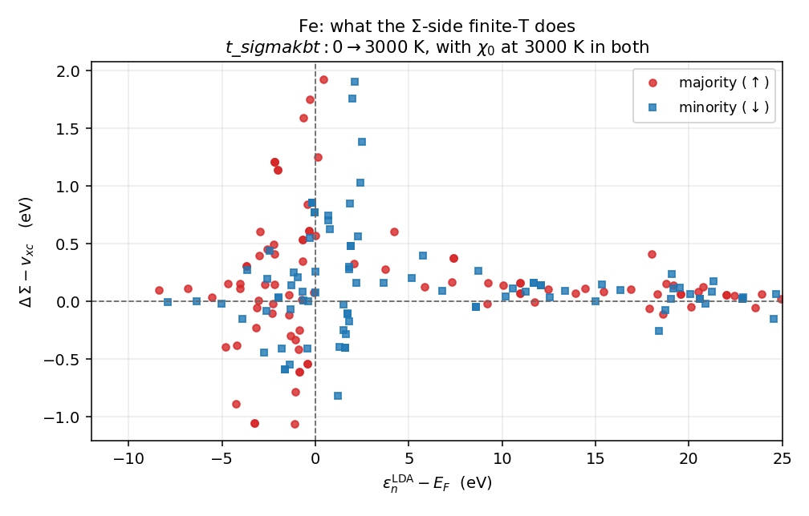

# Fe — `t_sigmakbt` だけを切り替えた対照実験

**Σ 側の有限温度が効くかどうかを、それ以外を完全に固定して測ったもの。**

2 つの run は `t_sigmakbt` の値以外**まったく同じ入力**である:

| | `t_sigmakbt0/` | `t_sigmakbt3000/` |
|---|---|---|
| `tetrakbt` | `true` | `true` |
| `t_tetrakbt` | 3000.0 K | 3000.0 K |
| **`t_sigmakbt`** | **0.0** | **3000.0** |

χ₀ (すなわち $W$) は**両方とも 3000 K で同一**なので、差は Σ 側だけから来る。
これは実用の設定ではない — 実用では `t_sigmakbt == t_tetrakbt` にすること。

その他: bcc Fe、`nspin = 2`、`so = 0`、lmf の k メッシュ $7^3$、GW の
`n1n2n3` = $5^3$、`esmr = 0.003`、QSGW 1 反復 (LDA からの one-shot)。
$k_BT$(3000 K) = 0.0190 Ry = 0.2585 eV。

---

## 結果

### 1. 変わってはいけないものは変わっていない

| 量 | 差 |
|---|---|
| `vxc` | **ビット単位で同一** |
| `SExcore` | **同一** |
| $Z$ | **同一** |
| LDA 固有値 | **同一** |

対照実験として成立している。

### 2. 変わるもの



縦軸は QSGW が使う $\Sigma-v_{xc}$ (`dSEnoZ`) の変化。

| | rms | 最大 |
|---|---|---|
| majority (↑) 全体 | 0.484 eV | 1.93 eV |
| minority (↓) 全体 | 0.403 eV | 1.90 eV |
| ↑ $\lvert\varepsilon-E_F\rvert<3$ eV | 0.722 eV | 1.93 eV |
| ↓ $\lvert\varepsilon-E_F\rvert<3$ eV | 0.586 eV | 1.90 eV |

$E_F$ からの距離で切ると:

| $\lvert\varepsilon-E_F\rvert$ | rms $\Delta$(Σ−v_xc) | rms $\Delta$SEx | rms $\Delta$SEc |
|---|---|---|---|
| 0–1 eV | 0.788 eV | 0.680 eV | 1.180 eV |
| 1–3 eV | 0.648 eV | 0.199 eV | 0.784 eV |
| 3–10 eV | 0.428 eV | 0.123 eV | 0.442 eV |
| 10 eV 以上 | 0.094 eV | 0.025 eV | 0.093 eV |

**$\Sigma$ 側の有限温度は小さな補正ではない。** $E_F$ 近傍で rms 0.7 eV、
最大 2 eV 動く。$\chi_0$ だけ温めて $\Sigma$ を $T=0$ のまま放置するのは、
つじつまが合っていないだけでなく数値的にも大きい。

$\Sigma_x$ と $\Sigma_c$ は別々にはもっと大きく動く (最大 2.40 eV と 3.66 eV) が、
符号が逆なので和は 1.93 eV に収まる。

### 3. スピンにはほとんど効かない

$\lvert\varepsilon-E_F\rvert<3$ eV での `dSEnoZ` の交換分裂は
**−0.213 eV → −0.212 eV** とほぼ不変。効果はほぼスピン共通のシフトであって、
磁性そのものを動かすものではない。

### 4. Fermi 準位は大きく動く

| | Ry |
|---|---|
| `EFERMI` ($T=0$) | 0.0149594 |
| `EFERMI_kbt` (3000 K) | 0.0337313 |

差 0.0188 Ry = **0.26 eV**。Fe は $E_F$ で状態密度が急峻なので、3000 K は
かなり強い摂動である。上の 2 eV はこの $E_F$ のずれと FD 核の両方から来る。

---

## ディレクトリ

```
input/  PB.fe.toml     product basis
        rst.fe.lda     LDA 収束済みの rst

t_sigmakbt0/     ctrlg.fe.toml   (t_sigmakbt = 0.0)
t_sigmakbt3000/  ctrlg.fe.toml   (t_sigmakbt = 3000.0)
   results/  QPU.1run, QPD.1run   QP エネルギー (up / down)
             EFERMI, EFERMI_kbt   T=0 と有限温度の Fermi 準位

plots/  fe_sigmakbt_shift.png
```

元は kt1 の `~/sigmakbt_test/fe_t0`, `fe_t3000` (2026-06-15 実行)。

## 自分で回すなら

```bash
mkdir work && cd work
cp ../input/PB.fe.toml .
cp ../t_sigmakbt3000/ctrlg.fe.toml .
cp ../input/rst.fe.lda rst.fe
lmfa fe
gwsc 1 -np <NP> fe        # 1 反復で足りる (one-shot)
```

`t_sigmakbt` を 0 と 3000 に変えて `QPU.1run` を比べれば上の表が再現する。
