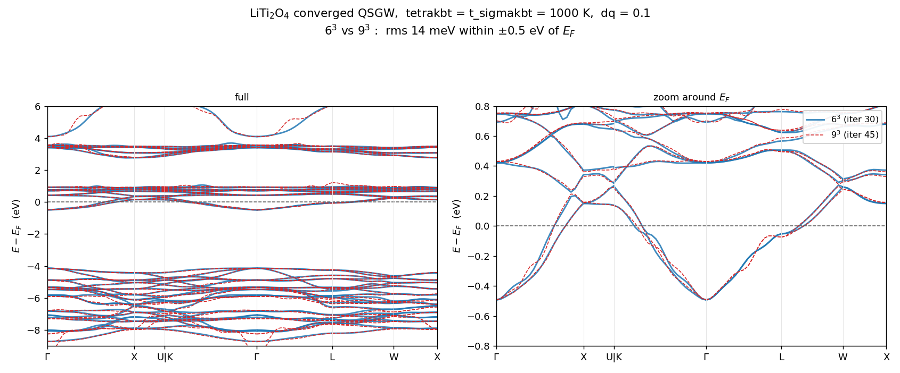
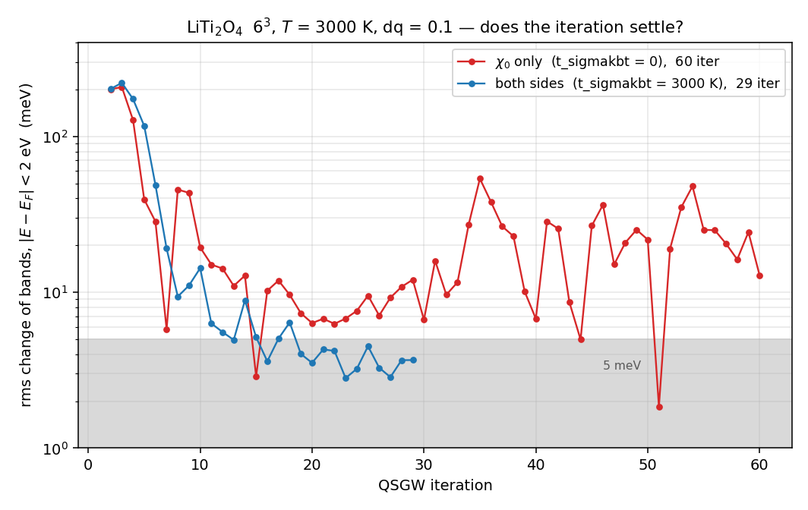
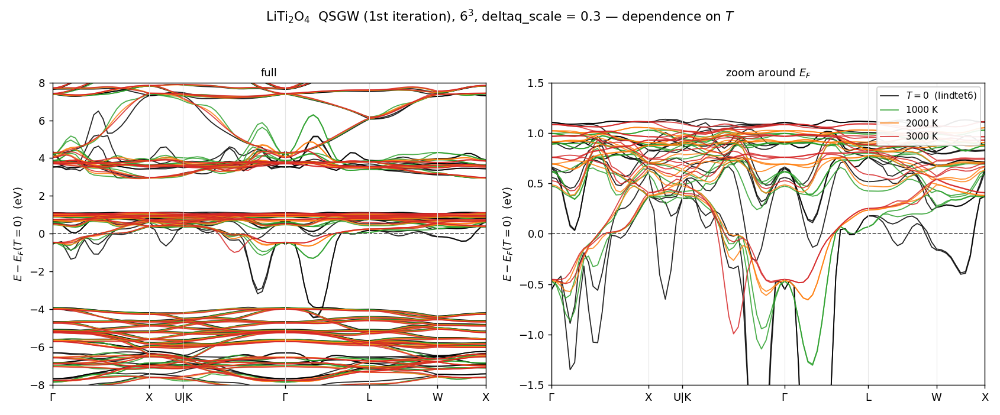

# LiTi₂O₄ — 有限温度 QSGW のメッシュ収束と反復収束

LiTi₂O₄ (金属スピネル) の QSGW を、**電子温度**を χ₀ 側と Σ 側の両方に入れて
回したもの。手法の説明は
[ecaljdoc: kBT — 有限温度の自己エネルギー計算](https://ecalj.github.io/manual/kBT)。

> **これは入力と結果を置いてあるだけのサンプルである。**
> GW を 11〜45 反復するので計算が重く、`testecalj` のターゲットにはしていない。
> 手法が何を変えるかを、収束した結果そのもので確認するためのもの。

ブランチ: `t_sigmakbt` (Σ 側の有限温度。χ₀ 側の `tetrakbt` は `main` にある)

---

## 1. 3 つの run

| ディレクトリ | k メッシュ | T | 反復 | t_sigmakbt | 何のため |
|---|---|---|---|---|---|
| `n666_T2000/` | 6×6×6 | 2000 K | 11 | 2000 K | 標準。反復が収束していく様子 |
| `n666_T1000/` | 6×6×6 | 1000 K | 30 | 1000 K | ↓ とペアでメッシュ依存を見る |
| `n999_T1000/` | 9×9×9 | 1000 K | 45 | 1000 K | ↑ とペア。**これが重い計算** |
| `n666_T3000/` | 6×6×6 | 3000 K | 29 | 3000 K | ↓ とペアで Σ 側の有無を見る |
| `n666_T3000_chi0only/` | 6×6×6 | 3000 K | 60 | **0** | ↑ とペア。**収束しない** |

いずれも `deltaq_scale = 0.1`、`t_tetrakbt` は表の T。最後の 1 つだけ
**Σ 側を T=0 に置き去りにしてある** (`t_sigmakbt` を書いていない)。

$k_BT$ は 1000 K で 0.00633 Ry = 0.0862 eV、2000 K で 0.01267 Ry = 0.1723 eV。

`ctrlg.liti2o4.toml` の該当部分 (`n666_T2000/` の場合):

```toml
[gw]
n1n2n3       = [6, 6, 6]
deltaq_scale = 0.1
tetrakbt     = true      # chi0 を有限温度テトラヘドロンで (method B')
t_tetrakbt   = 2000.0    # 2000 K
t_sigmakbt   = 2000.0    # Sigma 側の FD 有限温度 = t_tetrakbt
esmr         = 0.01      # 数値的な極の平滑化 (有限温度は t_sigmakbt が担う)
```

**`t_sigmakbt` は `tetrakbt = true` と必ず併用すること。**
Σ 側が読む `EFERMI_kbt` を書くのは `tetrakbt` を有効にした `heftet` なので、
単独では警告が出て有限温度が適用されない。

> **`esmr` は既定 (0.01 Ry) のままにすること。**
> `t_sigmakbt > 0` にしても Σ 側の**状態範囲**は依然 `esmr` で決まっている
> (窓 = ±10·esmr)。この設定では窓が ±7.9 kBT なので切り捨ては 3.7e-4 で無害だが、
> `esmr` を下げたり T を 3000 K より上げたりすると警告なしに占有数が切り捨てられる
> (5000 K で 4%、esmr=0.002 で 17%)。詳細は
> [ecaljdoc の kBT ページ §7](https://ecalj.github.io/manual/kBT)。

---

## 2. ディレクトリ

```
input/          3 つの run で共通の入力
   PB.liti2o4.toml    product basis
   syml.liti2o4       バンド線 (Γ-X-U|K-Γ-L-W-X)
   rst.liti2o4.lda    LDA 収束済みの rst (ここから gwsc を始めた)

n666_T2000/  n666_T1000/  n999_T1000/
   ctrlg.liti2o4.toml     この run の入力 ([gw] が run ごとに違う)
   results/
      EFERMI, EFERMI_kbt   T=0 と有限温度の Fermi 準位
      finiteT_evidence.txt 両側が効いていることを示すログ抜粋 (§4)
      QPU.<N>run           QP エネルギー
      band_iterations.png  反復を 1 枚に重ねた図

plots/          run をまたぐ比較図
   bands_iterations_T1000.pdf   45 ページのパラパラマンガ (§3.2)
   mesh_666_vs_999_T1000.png    6³ と 9³ の収束結果の重ね描き
   T_dependence.png             T = 0/1000/2000/3000 K の比較 (別 run 群、dq=0.3)
   deltaq_artifact_3000K.png    3000 K の異常が deltaq 由来である証拠
```

run ごとに追加で置いてあるもの:

| | |
|---|---|
| `n666_T2000/results/sigm.liti2o4` | 11 反復後の収束した自己エネルギー (13 MB) |
| `n666_T2000/results/QPU.1run` … `.11run` | 全反復の QP エネルギー |
| `n666_T2000/results/band_iter/` | 反復ごとのバンド図 |
| `n666_T2000/results/bnd_iterations.tar.gz` | 全反復のバンド生データ (展開 27 MB) |
| `n999_T1000/results/sigm.liti2o4` | **45 反復後の収束した自己エネルギー (30 MB)。** これが一番作り直しにくい |
| `n666_T1000`, `n999_T1000` の `bnd_final.tar.gz` | 最終反復のバンド生データ |

1000 K の 2 つは**全反復の生データは置いていない** (6³ で 17 MB、9³ で 26 MB
になるため)。反復ごとの中身は `plots/bands_iterations_T1000.pdf` で見られる。
元データは kt1 の `~/LiTi2O4/kbt/runs/n{666,999}_dq0.1_T1000K_sigmakbt1000/band/`。

---

## 3. 結果

### 3.1 QSGW 反復の収束 (2000 K, 6³)


紫 (反復 1) から黄 (反復 11) へ。反復 3–4 以降は $E_F$ 近傍でも線が重なり、
金属にもかかわらず QSGW が振動せずに収束している。これが `tetrakbt` +
`t_sigmakbt` を入れる目的である。反復ごとの個別の図は
`n666_T2000/results/band_iter/band_iter<N>.png`。描き直すなら:

```bash
cd n666_T2000/results && tar xzf bnd_iterations.tar.gz   # -> bnd/iter1 .. iter11/
```

### 3.2 パラパラマンガ — 1000 K の 6³ と 9³ が反復でどう近づくか

**[`plots/bands_iterations_T1000.pdf`](plots/bands_iterations_T1000.pdf)**
(45 ページ、4 MB)

1 ページ = 1 反復。青が 6³、赤破線が 9³。ページを送ると

- 反復 1 では 6³ と 9³ が**大きく食い違っている** (メッシュ依存が出ている)
- 反復が進むにつれて両者が近づき、重なっていく
- 6³ は反復 30 で止めたので、それ以降は収束値を薄い青で参照として残してある

PDF ビューアでページ送りすれば動画として見える。

### 3.3 メッシュ依存が消えていること (1000 K)



収束した 6³ (反復 30) と 9³ (反復 45) の重ね描き。差は

| 範囲 | rms | 最大 |
|---|---|---|
| $\|E-E_F\| < 0.5$ eV | 13.8 meV | 54 meV |
| $\|E-E_F\| < 2$ eV | 23.3 meV | 265 meV |
| $\|E-E_F\| < 10$ eV | 75.4 meV | 940 meV |

静電ゼロから測った Fermi 準位 ($E_F - V_\mathrm{esav}$) は
6³ が 6.76420 eV、9³ が 6.76424 eV で **0.05 meV しか違わない**。

反復ごとの残差 (6³ の 29→30 で $E_F$ 近傍 rms 1.4 meV、9³ の 44→45 で 0.70 meV)
より上の差のほうが大きいので、13.8 meV は反復ノイズではなく本当のメッシュ差である。
それでも d バンドの議論には十分小さい。

#### ただし「消えた」と言い切るには不満が残る

この対で言えているのは「**1000 K で 6³ と 9³ が $E_F$ 近傍 10 meV 台まで近づいた**」
であって、それ以上ではない。

- **0 ではない。** ±2 eV で 23 meV、±10 eV では rms 75 meV・最大 940 meV。
  深い O-2p 帯は数百 meV 違う。しかも反復残差の 10–20 倍あるので、
  **分解できてしまっている**差である。
- **メッシュが 2 つしかない。** 9³ 自身が収束しているのか、残り 13.8 meV が
  どちらの誤差なのかは分からない。12³ が無いので外挿もできない。
- **反復数が 30 と 45 で違い、収束判定ではなく手で止めている。** 6³ のほうが
  残差が大きい (1.4 対 0.70 meV) ので、13.8 meV のいくらかはそれ由来かもしれない。
- **$E_F$ の 0.05 meV 一致は見かけほど強くない。** 両 run とも lmf は
  `nkabc = [16,16,16]` で、band ステップの $E_F$ も 16³ で決めている
  (`efermi.lmf` の `Used k point to determine Ef: 16 16 16`)。GW メッシュが入るのは
  `sigm` 経由だけなので、これは BZ サンプリングの独立な検証にはなっていない。
- **温度は 1000 K の 1 点だけ。** 「T を上げるほどメッシュ依存が減る」という主張
  そのものは、この対では確かめていない (9³ の 3000 K が無い。
  [../README.md](../README.md) の 3 節)。
- **`deltaq_scale` は両方 0.1 固定。** offset-Gamma head は別系統の q 依存で、
  そこは振っていない。

### 3.4 Σ 側を切ると収束しない (3000 K)

`n666_T3000/` と `n666_T3000_chi0only/` は、**入力上は `t_sigmakbt` の行があるか
ないかだけが違う**。χ₀ はどちらも 3000 K なので、差は Σ 側だけから来る。



縦軸は 1 反復あたりのバンドの変化 (E_F の ±2 eV 以内の rms)。

- **両側 3000 K (青)**: 反復 15 あたりから 3–5 meV の帯に落ち着き、そのまま動かない
- **χ₀ だけ 3000 K (赤)**: 反復 20 で 6 meV まで下がったあと**また上がり**、
  残り 40 反復を 10–50 meV でさまよい続ける (最後の 10 反復で平均 22.8 meV、最大 47.8 meV)

さまよっているだけでなく、**行き着く先も違う**:

| 範囲 | 両側 (反復 29) と χ₀ のみ (反復 60) の差 |
|---|---|
| \|E−E_F\| < 0.5 eV | rms 198 meV |
| \|E−E_F\| < 2 eV | rms 552 meV, 最大 1.73 eV |

理由ははっきりしている。**χ₀ だけ温めると、Σ が χ₀ と違う Fermi 準位を見る。**

| | Σ が使う Fermi 準位 | χ₀ が使う Fermi 準位 |
|---|---|---|
| `n666_T3000_chi0only/` | `EFERMI` = 0.29428 Ry | `EFERMI_kbt` = 0.25672 Ry |
| `n666_T3000/` | `EFERMI_kbt` = 0.25315 Ry | 同じ |

3000 K では両者が **0.51 eV** も離れる。それで自己無撞着ループが閉じない。

パラパラマンガ: **[`plots/bands_iterations_T3000.pdf`](plots/bands_iterations_T3000.pdf)**
(60 ページ、5 MB)。青が両側、赤破線が χ₀ のみ。青は途中で止まり、赤は最後まで動き続ける。
青は反復 29 で止めたので、それ以降は収束値を薄く残してある。

> **注意。** この 2 つは実行日が 2 日離れている (2026-06-13 22:46 開始 と
> 06-15 23:48 開始)。どちらも 06-13 09:09 の 2 件の修正 (2 節) より後だが、
> 当時 `~/bin` にあったバイナリを今から特定はできない。入力側の差は
> `t_sigmakbt` の行だけで、mixing (`--ctrlg:iter.b=0.1`) と PB は同一である。

### 3.5 温度依存 — 何が直るか



T = 0 / 1000 / 2000 / 3000 K を重ねたもの (QSGW 第 1 反復、6³、`deltaq_scale = 0.3`。
共通の静電ゼロで揃え、T=0 の E_F を原点に取った)。これは上の 3 つの run とは
**別の run 群** (`deltaq_scale` が 0.3) からのもの。

T=0 (`tetrakbt` off = 従来の `lindtet6`) では Ti-3d t2g 帯が Γ–L 上で
**−3.9 eV まで落ち込む**。これは分散ではなく q→0 head の破綻で、温度を
上げると単調に消える:

| T | Γ–L 上 (x≈2.7) の t2g 帯の底 |
|---|---|
| 0 (`lindtet6`) | −3.91 eV |
| 1000 K | −1.31 eV |
| 2000 K | −0.66 eV |
| 3000 K | −0.50 eV |

これが有限温度を入れる理由である。なお method B′ が T→0 で `lindtet6` に
厳密に戻ること自体は変わらない (T=0 で壊れているのはテトラヘドロン法ではなく、
その上での金属の q→0 の扱いのほう)。

> 500 K の run もアーカイブにあるが、**そのバンドプロットは E_F を誤って拾っており
> (band ステップの `efermi.lmf` が 0.158 Ry、他の run は 0.27–0.28 Ry)、
> 分散自体も揃わない**ので上の図からは外してある。

### 3.6 3000 K の K–Γ 異常は `deltaq_scale` のアーティファクト


上の図の 3000 K は Γ–L では収まっているのに K–Γ の中央に別のスパイクが残る。
`deltaq_scale = 0.3` (赤) では **−1.24 eV のスパイク**が出るが、
`deltaq_scale = 0.1` (青) にすると**消える**。

これは `tetrakbt` / method B′ 本体の問題ではなく、**offset-Gamma の q→0
head が、高温 × 大きい `deltaq` で破綻する**もの。高温を使うときは
`deltaq_scale` を小さく取ること。3 つの run が `deltaq_scale = 0.1` なのはこのため。

---

## 4. 有効になっていることの確認

各 run の `results/finiteT_evidence.txt`。例 (`n999_T1000/`):

```
 tetrakbt_init: T[K], kbt[Ry], kbt[eV] 1000  0.63334E-02  0.86171E-01
 sigmakbt_setup: t_sigmakbt[K]= 1000.0 kbt[Ry]= 0.63334E-02 ef<-EFERMI_kbt= 0.282153

  0.282938093336064D+00 ... ! efermi           (T=0)
  0.282151393893410D+00 ... ! efermi_kbt       (有限温度)
```

2 行目の `ef<-EFERMI_kbt` が、Σ 側が **T=0 の `EFERMI` ではなく有限温度の
`EFERMI_kbt` を使っている**ことを示す。この 2 つが食い違ったままだと
χ₀ と Σ が別の Fermi 準位を見ることになる。

---

## 5. 自分で回すなら

```bash
mkdir work && cd work
cp ../input/PB.liti2o4.toml ../input/syml.liti2o4 .
cp ../n999_T1000/ctrlg.liti2o4.toml .          # 回したい run の ctrlg
cp ../input/rst.liti2o4.lda rst.liti2o4
lmfa liti2o4
gwsc 45 -np <NP> liti2o4      # 9^3 は非常に重い。kt1 で 60 プロセス
```

バンドだけ見たいなら GW をやり直さず、収束した自己エネルギーを使えばよい:

```bash
cp ../n999_T1000/results/sigm.liti2o4 sigm.liti2o4
job_band liti2o4 -np <NP> -vnspin=1
```

`input/rst.liti2o4.lda` は 3 つの run で共通のものを 1 つだけ置いている
(元は run ごとに別ファイルだが、同じ LDA 収束状態で、ビット単位で違うだけ)。
