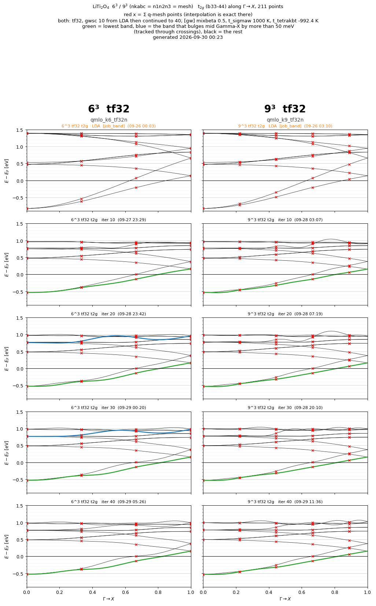
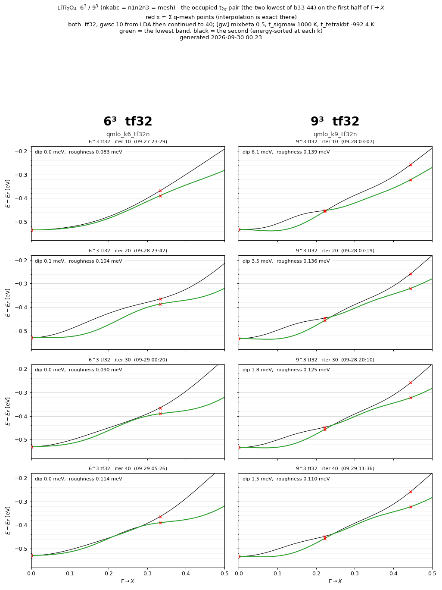

# LiTi₂O₄ の MLO-QSGW — まとめ（2026-09-30）

金属スピネル LiTi₂O₄（14 原子、Ti の t2g バンドが Fermi 準位を横切る）を、自己エネルギー Σ を MLO で内挿する QSGW
（`gwsc --mlo`、MLO-QSGW）で、LDA から 40 反復まで回した結果のまとめ。
方法の説明は ecaljdoc の [mlo_gwsc](https://ecalj.github.io/ecaljdoc/manual/mlo_gwsc)、温度のキーの式は
[kBT](https://ecalj.github.io/ecaljdoc/manual/kBT) §2・§3。ここには設定と結果だけを書く。

言葉:

- **メッシュ点**: Σ を計算した q 点。Γ–X を x = 0〜1 と書くと、6³ では x = 0, 1/3, 2/3, 1、9³ では x = 0, 2/9, 4/9, 6/9, 8/9。
  バンドはメッシュ点では内挿なしで決まり、その間は MLO の内挿で決まる
- **MLO バンド**: SCF が解いたハミルトニアン（LDA + Σ）の MLO 模型のバンド。図はすべてこれ
- **t2g**: バンド 33〜44（12 本）。下の 2 本が占有側。**tf32・fp32・fp64**: GPU の行列積の精度（`gwsc --prec=`）。
  tf32 は単精度のテンソルコア（TF32）、fp32 は単精度、fp64 は倍精度

## 1. 設定

入力は [`input/qmlo/ctrlg.liti2o4.toml`](input/qmlo/ctrlg.liti2o4.toml)（6³）。9³ は `nkabc`・`n1n2n3`・`mlo_nkabc` の 3 行を `[9, 9, 9]` にしたもの。

**表 1**. 温度のキー（`[gw]`、単位は K）

| キー | 値 | 意味 |
| --- | --- | --- |
| `t_sigmaw` | 1000 | Σ の中間準位の占有を均す Fermi-Dirac 核の温度（Σx の重み、Σc の実軸極項） |
| `t_tetrakbt` | −992.4 | 負の値: χ0 は T = 0 のテトラヘドロン法で作り、Im χ0 を Gaussian で均す。幅は温度 992.4 K の Fermi-Dirac と同じ（標準偏差 0.155 eV） |

`t_tetrakbt` は符号で χ0 の扱いを選ぶ: 0 は均さない、正は有限温度のテトラヘドロン法、負は上の Gaussian（kBT の表 1）。
2026-09-27 までの入力ではこの Gaussian を `SmearX0 = 0.0057`（Ha）と書いた。同じ幅で、いまは `SmearX0` があると止まる
（`ctrlg_update.py` が書き換える）。

**表 2**. そのほかの設定

| 所 | 設定 |
| --- | --- |
| `[ham]` | `pwmode = 11`、`xcfun = 103`（PBE）、`gmax = 12`、スピン分極なし |
| `[bz]` | `nkabc = [6, 6, 6]`（GW のメッシュと同じ）、`metal = 3` |
| `[gw]` | `n1n2n3 = [6, 6, 6]`、`mixbeta = 0.5`、`deltaq_scale = 0.1`、`niw = 10`、`emax_sigm = 3.0`、`wcsmear` は既定（true） |
| `[mlo]` | `mlo_method = 4`、`mlo_nkabc = [6, 6, 6]`、`mlo_delta = 2.0`、`mlo_w = 2.0`、軌道は 14 原子 × (s, p, d) = 126 |
| 混合 | MLO で持つ Σ も `sigm` と同じく `mixbeta` で混ぜる（2026-09-30 から既定。この計算のコードでは環境変数 `ECALJ_MLO_MIX=1` で指定した） |
| 実行 | `gwsc 10 -np 60 -np2 2 --gpu --prec=tf32 --ntqxx --mlo liti2o4`、続きは `gwsc 1` を 1 反復ずつ（§4） |

## 2. 結果

### 2.1 tf32・fp32・fp64 の差は数 meV 以下

**表 3**. 同じ入力で精度だけを変えたときの MLO バンドの差の最大（Γ–X の 211 点）

| 比べたもの | 反復 | t2g | 2.6〜8 eV |
| --- | --- | --- | --- |
| 6³ tf32 と fp32 | 10 | 0.8 meV | 1.4 meV |
| 9³ tf32 と fp32 | 10、11、12 | 1.2、1.0、0.7 meV | 3.6、5.1、6.4 meV |
| 6³ fp64 と fp32 | 1 | 1 meV | 2 meV |

メッシュ点での Σc の対角要素は、1 反復目で fp64 と fp32 の差が最大 0.001 eV。
精度による差は、下に書く反復やメッシュによる差（数十 meV）より 1 桁小さい。速い tf32 で回してよい。

**表 4**. 1 反復の時間（kt1、RTX 5090 × 2、CPU 60 本）

| | tf32 | fp32 | fp64 |
| --- | --- | --- | --- |
| 6³ | 3.7 分 | — | 17 分 |
| 9³ | 21 分 | 47 分 | — |

### 2.2 6³: 10 反復まではなめらか、40 反復ではわずかに波打つ

図 1 の左の列。反復 10 では一番下のバンド（緑）がなめらかに上がる。反復 20 から x = 0.35〜0.45 に肩ができ、40 でも残る。
t2g の中ほど（0.5〜1 eV）のバンドも反復 16 から膨らみ（図の青線）、22 で最大（131 meV）になったあと減り続けて、40 で 49 meV。
反復ごとの変化は 40 で t2g 3.3 meV、占有の 2 本 0.8 meV まで小さくなっている（表 5）が、膨らみはまだ 1 反復に 2〜3 meV ずつ減っていて、
止まってはいない。

### 2.3 9³: 波打ちはなかなか減らないが、40 反復でかなりなめらかになる

図 1 の右の列。反復 10 では一番下のバンドが Γ のすぐ外で Γ より 6 meV 下がり、x = 0.2 のあたりで 2 本が波打つ。
これは反復 12〜15 でいったん大きくなり（Γ からの沈み 10〜12 meV）、20 から減って、40 で 1.5 meV になる。
40 反復でも、メッシュ点（赤い ×）を結ぶ内挿の曲線は、なめらかな線のまわりでわずかに波打って見える（図 2 の右の列）。
占有の 2 本の反復ごとの変化は反復 21 から 1 meV 以下、40 で 0.2 meV。



**図 1**. t2g の MLO バンド（Γ–X）。左が 6³、右が 9³。上から LDA、反復 10、20、30、40。赤い × がメッシュ点。
緑は一番下のバンド、青は中ほどで 50 meV を超えて膨らむバンド。数値は `liti2o4_summary_t2g_data.npz`



**図 2**. 占有側の 2 本の拡大（Γ から x = 0.5）。上から反復 10、20、30、40。数値は `liti2o4_summary_occ_data.npz`

**表 5**. 前の反復からの MLO バンドの変化の最大（meV）と、一番下のバンドの波打ちの目安

| | 反復 | t2g の変化 | 占有の 2 本の変化 | 波打ち（最大） | Γ からの沈み |
| --- | --- | --- | --- | --- | --- |
| 6³ | 10 | — | — | 12.7 | 0.0 |
| 6³ | 15 | 23.4 | 11.5 | 26.1 | 2.3 |
| 6³ | 20 | 13.6 | 8.7 | 26.0 | 0.1 |
| 6³ | 30 | 4.5 | 2.6 | 26.4 | 0.0 |
| 6³ | 40 | 3.3 | 0.8 | 26.7 | 0.0 |
| 9³ | 10 | — | — | 17.2 | 6.1 |
| 9³ | 15 | 11.4 | 8.2 | 26.0 | 10.3 |
| 9³ | 20 | 9.6 | 2.1 | 14.4 | 3.5 |
| 9³ | 30 | 5.1 | 0.5 | 13.0 | 1.8 |
| 9³ | 40 | 5.1 | 0.2 | 12.9 | 1.5 |

- 「波打ち」は、一番下のバンドの LDA からの補正 D(x) = E_N(x) − E_LDA(x) を Σ_{n=0..3} c_n cos(nπx) で当てはめた残差の最大（`band_wiggle.py`）。
  当てはめの次数は選び方によるので、大きさそのものより、反復とメッシュによる違いを見るための目安
- 「Γ からの沈み」は E(Γ) − min_{x<0.3} E(x)。バンドの底は Γ にあるはずなので、0 が正しい
- 9³ の t2g の変化が 40 でも 5 meV あるのは一部の k だけで、rms は 0.7 meV

### 2.4 読み取れること

- 6³ と 9³ に共通のメッシュ点（x = 0 と 2/3）では、40 反復の一番下のバンドの差は 4 meV 以下（Γ で E_F − 0.529 と − 0.533 eV）。
  t2g の 12 本では最大 15〜20 meV（空の側のバンド）
- 違いが大きいのはメッシュ点の間で、40 反復の一番下のバンドの 6³ と 9³ の差は最大 37 meV、t2g の 12 本では最大 80 meV。
  内挿の曲線の波打ちは 9³ で 13 meV、6³ で 27 meV ほど（表 5 の目安）
- 反復を 10 回で止めると、6³ はなめらかに見えるが収束の途中である（そのあと肩ができる）。収束を見るには 30〜40 反復が要る

## 3. 回し方

入力の置き方、環境（`env.sh`）、かかる時間、反復ごとの確認は [`input/qmlo/README.md`](input/qmlo/README.md)。

```bash
PREC=tf32 GPUS=0,1 bash run_gwsc10.sh <tag> <入力のディレクトリ> <bindir>     # LDA から gwsc 10
PREC=tf32 GPUS=0,1 bash cont_gwsc.sh  <tag> 11 40 <bindir>                    # 続き（1 反復ずつ、反復ごとに MLO バンドを描く）
```

2026-09-29 までのコードで `gwsc --mlo` を手で回すときは `ECALJ_MLO_MIX=1` を付ける（付けないと MLO の Σ だけ混合なしになる。どちらのスクリプトも export している）。

## 4. 記録

| ファイル | 中身 |
| --- | --- |
| [`six_patterns.md`](six_patterns.md) | {6³, 9³} × {tf32, fp32, fp64} のすべての反復の図と表（図 1〜7、表 5・6） |
| [`ecaljdoc/MD/research_log.md`](../../../ecaljdoc/MD/research_log.md) | 研究ログ（日付と時刻の順、新しいものが上）。この計算は 2026-09-27〜29 |
| [`README_202606_finiteT.md`](README_202606_finiteT.md) | 2026-06 の有限温度 QSGW（`n666_T*`、`n999_T1000`）の記録。キーの名前は当時のもの |
| `liti2o4_*_data.npz` | 図に描いた数値（x、バンド、元のファイルの場所と日時） |
| `update_six_rows.sh`、`mlo_rows.py`、`band_wiggle.py` | 図と表を作り直すスクリプト |
