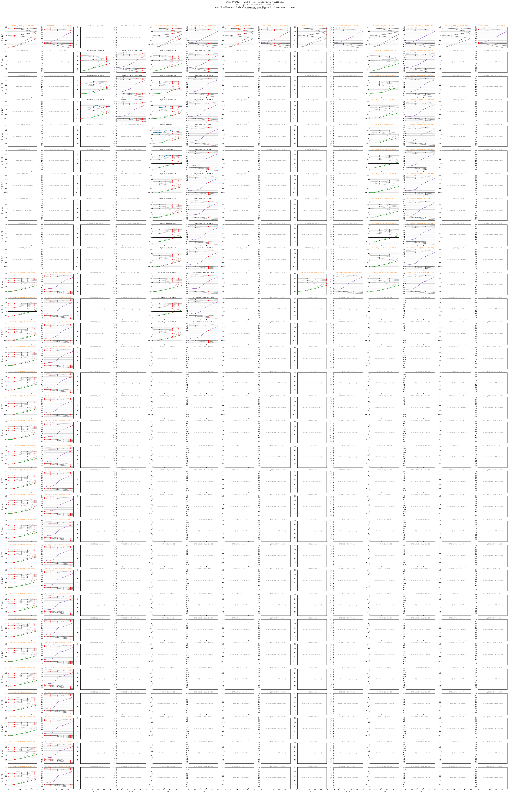
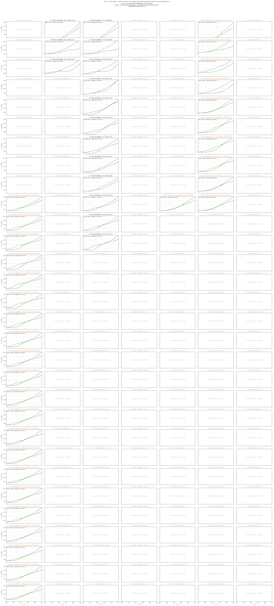
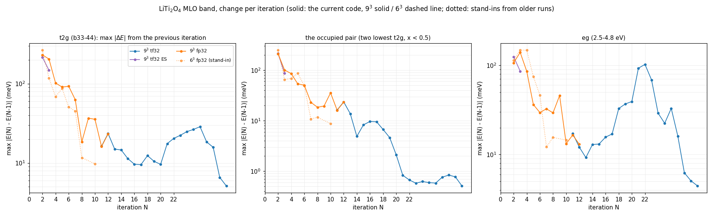

# LiTi₂O₄ MLO-QSGW: {9³, 6³} × {tf32, fp32, fp64} の MLO バンド（2026-09-28 から）

`update_six_rows.sh` が kt1 の run から MLO バンドを取ってきて、下の 4 枚と数値（npz）を作り直す（同じファイル名に上書き）。
経過と判断は `../kBT_research.md`（2026-09-28 の 14:38 から）。

- 枠の題の黒: その列の run（いまのコード）。橙: 代わりのもの（`[09-26 code]`・`[09-27 code]` は前のコードの仮、`[gwsc10 run]` はいまのコードの前の run）。
  括弧の日時はその反復が終わった時刻（`llmf.<N>run`）。灰色の「no band」はまだ無いところ
- 赤い × は Σ のメッシュ点（内挿がそこで正確）。9³ は x = 2/9, 4/9, 6/9, 8/9、6³ は 1/3, 2/3
- 数値: `liti2o4_six_rows12_data.npz`（12 列の図の各枠: x、描いたバンド、元のファイルの kt1 での場所、印、日時）、`liti2o4_six_rows_data.npz`（t2g）、
  `liti2o4_six_conv_data.npz`（反復ごとの動き）

## 図 1: 14 列（6 通りと空球入りの 9³ tf32、それぞれに t2g と 2.6〜8 eV）

右の枠: eg の 8 本（灰）、バンド 53（赤紫、4〜7 eV で分散、9³ のメッシュ点 4/9 で反復ごとに上がる）、54〜58（薄い灰）

## 図 2: 占有の t2g の 2 本（Γ から x = 0.5）

緑が一番下、濃い灰色が 2 本目。各枠に沈み込み（x < 0.3）とガタつき（x < 0.5 の 2 階差分の平均）

## 図 3: MLO バンドの反復ごとの動き

前の反復からの差の最大（meV、対数）。左から t2g、占有の 2 本、eg（2.5〜4.8 eV）。点線は前のコードの代わり

## 図 4: t2g だけの 7 列（空球入りの 9³ tf32 を 9³ tf32 の隣に）

