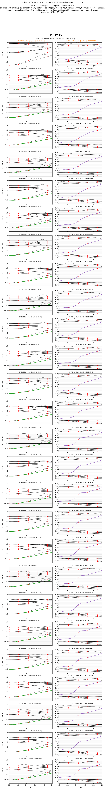
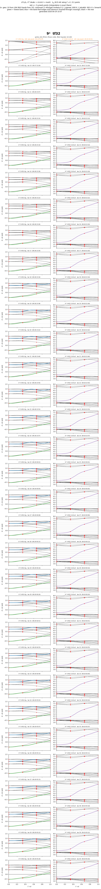

# LiTi₂O₄ MLO-QSGW: {9³, 6³} × {tf32, fp32, fp64} と空球入りの 9³ tf32 の MLO バンド（2026-09-28 から）

`update_six_rows.sh` が kt1 の run から MLO バンドを取ってきて、下の 4 枚と数値（npz）を作り直す（同じファイル名に上書き）。
経過と判断は `../kBT_research.md`（2026-09-28 の 14:38 から）。

- 枠の題の黒: その列の run（いまのコード）。橙: 代わりのもの（`[09-26 code]`・`[09-27 code]` は前のコードの仮、`[job_band]` は LDA のバンド）。
  括弧の日時はその反復が終わった時刻（`llmf.<N>run`）。灰色の「no band」はまだ無いところ
- 赤い × は Σ のメッシュ点（内挿がそこで正確）。9³ は x = 2/9, 4/9, 6/9, 8/9、6³ は 1/3, 2/3
- 数値: `liti2o4_six_rows12_data.npz`（12 列の図の各枠: x、描いたバンド、元のファイルの kt1 での場所、印、日時）、`liti2o4_six_rows_data.npz`（t2g）、
  `liti2o4_six_conv_data.npz`（反復ごとの動き）

## データの在りか（図を描き直すためのもの）

| 所 | 中身 |
| --- | --- |
| この directory（git） | 描いた数値の npz: `liti2o4_six_rows12_data.npz`（t2g と b45〜58）、`liti2o4_six_rows_data.npz`、`liti2o4_six_conv_data.npz`。各枠の x・バンド・元のファイル・日時 |
| 手元 `~/data/liti2o4_six/six_cache/<run>/` | kt1 から取ってきた MLO バンドのファイル（全バンド）と各 run の反復の終わりの時刻（`<run>.times`）。`update_six_rows.sh` の既定の置き場 |
| kt1 `/mnt/data1/LiTi2O4_kbt_runs/<run>/` | 元の MLO バンドのファイル `bnd_mlo_iter<N>.dat`（09-26 の鎖は `mloband/bnd_iter<N>.dat`）、描き直しに要る `QSGW.<N>run/`・`snap/iter<N>/` |
| kt1 `archive/mlo_bands_20260928.tar.gz` | 2026-09-28 21:44 時点のバンドのファイル 62 本の控え |

## 図 1: 14 列（6 通りと空球入りの 9³ tf32、それぞれに t2g と 2.6〜8 eV）

右の枠: eg の 8 本と 54〜58（黒の細線）、バンド 53（赤紫、4〜7 eV で分散）。計算ごとに 2 枚組で、黒い縦線が計算の境、1 つおきに背景を薄く塗った

## 図 2: 占有の t2g の 2 本（Γ から x = 0.5）

緑が一番下、黒が 2 本目。各枠に沈み込み（x < 0.3）とガタつき（x < 0.5 の 2 階差分の平均）

## 図 3: MLO バンドの反復ごとの動き

前の反復からの差の最大（meV、対数）。左から t2g、占有の 2 本、eg（2.5〜4.8 eV）。点線は前のコードの代わり

## 図 4: t2g だけの 7 列（空球入りの 9³ tf32 を 9³ tf32 の隣に）

## 図 5: 9³ tf32 の続き（反復 10〜40、`qmlo_k9_tf32n`、31 以後は 09-29 08:03 から chain48 で実行中）

`gwsc 10` を LDA から回し（MLO バンドは 10 から）、11〜30、31〜40 を続けたもの。左が t2g、右が 2.6〜8 eV（赤紫がバンド 53）。数値は `liti2o4_k9tf32_10_40_data.npz`

**表 5**. 前の反復からの MLO バンドの変化の最大と、メッシュ点 x = 4/9 でのバンド 53（2026-09-29 に描き直し）

| 反復 | t2g（meV） | 占有の 2 本、x < 0.5（meV） | b45〜52（meV） | バンド 53、x = 4/9（eV） |
| --- | --- | --- | --- | --- |
| 10 | — | — | — | 4.872 |
| 11 | 16.2 | 16.2 | 17.2 | 4.888 |
| 12 | 23.5 | 23.5 | 12.0 | 4.903 |
| 13 | 15.0 | 13.7 | 8.3 | 4.913 |
| 14 | 14.6 | 4.9 | 9.8 | 4.930 |
| 15 | 11.4 | 8.2 | 10.0 | 4.946 |
| 16 | 9.6 | 9.6 | 11.3 | 4.966 |
| 17 | 9.5 | 9.5 | 13.9 | 4.988 |
| 18 | 12.4 | 6.7 | 19.5 | 5.030 |
| 19 | 10.5 | 4.6 | 17.7 | 5.076 |
| 20 | 9.6 | 2.1 | 13.3 | 5.127 |
| 21 | 17.5 | 0.8 | 20.0 | 5.247 |
| 22 | 20.4 | 0.7 | 24.5 | 5.395 |
| 23 | 22.3 | 0.6 | 23.7 | 5.505 |
| 24 | 24.8 | 0.6 | 24.4 | 5.558 |
| 25 | 26.5 | 0.6 | 22.4 | 5.596 |
| 26 | 28.7 | 0.6 | 32.9 | 5.572 |
| 27 | 18.4 | 0.8 | 16.1 | 5.560 |
| 28 | 15.8 | 0.8 | 6.2 | 5.563 |
| 29 | 6.6 | 0.8 | 5.1 | 5.570 |
| 30 | 5.1 | 0.5 | 4.5 | 5.577 |
| 31 | 5.7 | 0.3 | 5.1 | 5.579 |
| 32 | 7.9 | 0.4 | 4.1 | 5.579 |
| 33 | 6.2 | 0.3 | 4.7 | 5.580 |
| 34 | 5.6 | 0.4 | 5.0 | 5.580 |
| 35 | 5.0 | 0.4 | 4.0 | 5.580 |

## 図 6: 6³ tf32 の続き（反復 10〜40、`qmlo_k6_tf32n`）

`gwsc 10` を LDA から回し（MLO バンドは 10 から）、11〜30（chain43）と 31〜40（chain44、user 09-29 04:5x）を続けたもの。数値は `liti2o4_k6tf32_10_40_data.npz`

**表 6**. 前の反復からの MLO バンドの変化の最大と、t2g の 9 本目（x = 0.53、反復 14〜18 に 1 反復 22〜26 meV ずつ上がっていた所）

| 反復 | t2g（meV） | 占有の 2 本、x < 0.5（meV） | b45〜52（meV） | t2g の 9 本目、x = 0.53（eV） |
| --- | --- | --- | --- | --- |
| 29 | 3.9 | 3.4 | 1.9 | 0.942 |
| 30 | 4.5 | 2.6 | 2.9 | 0.939 |
| 31 | 4.6 | 2.4 | 2.5 | 0.935 |
| 32 | 4.3 | 1.9 | 2.7 | 0.931 |
| 33 | 3.4 | 2.0 | 2.2 | 0.927 |
| 34 | 2.5 | 1.6 | 1.2 | 0.925 |
| 35 | 4.7 | 1.4 | 3.1 | 0.921 |
| 36 | 3.4 | 1.5 | 2.1 | 0.917 |
| 37 | 1.6 | 0.8 | 1.8 | 0.916 |
| 38 | 2.6 | 0.8 | 1.8 | 0.913 |
| 39 | 2.4 | 0.9 | 1.1 | 0.911 |
| 40 | 3.3 | 0.8 | 2.4 | 0.908 |
