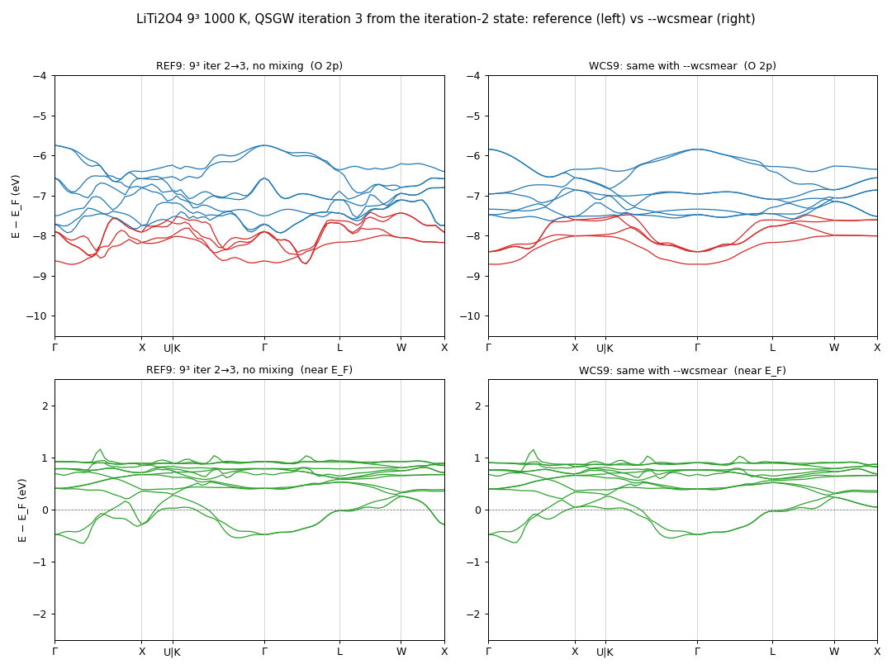
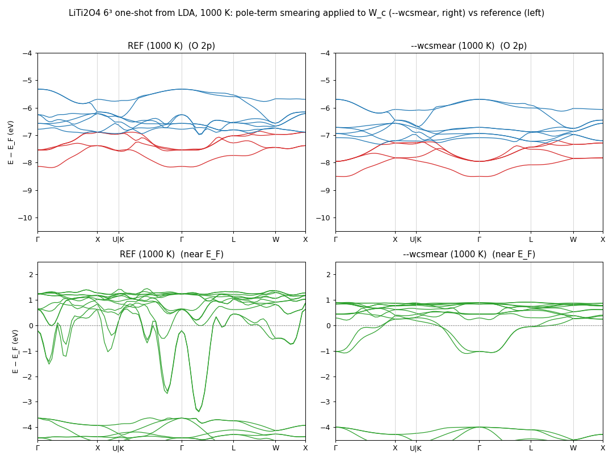
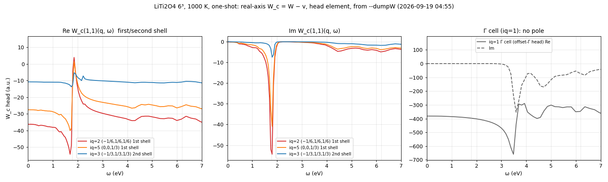
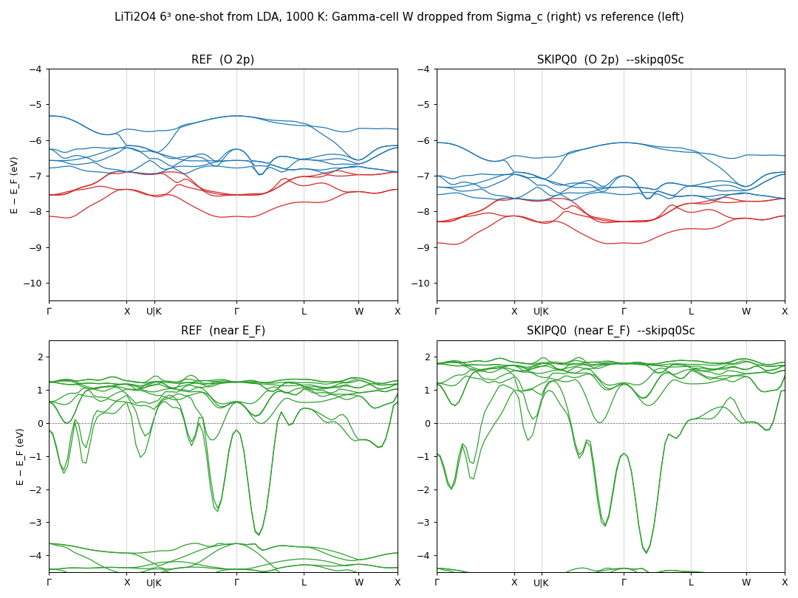
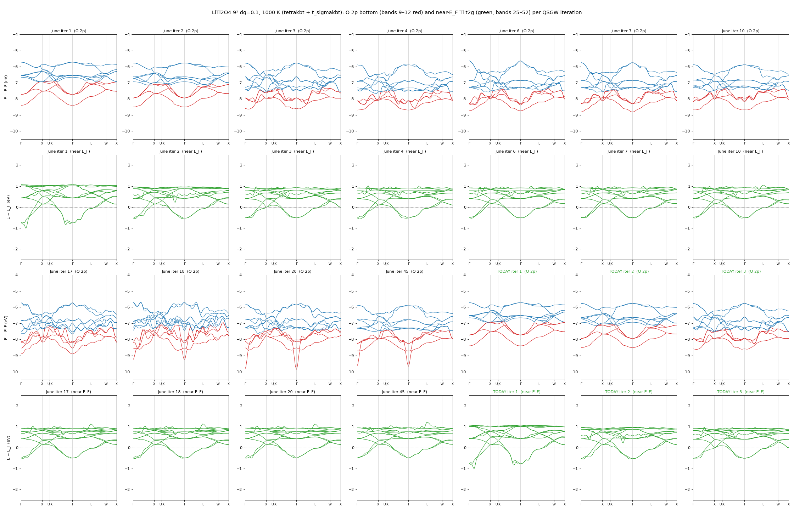
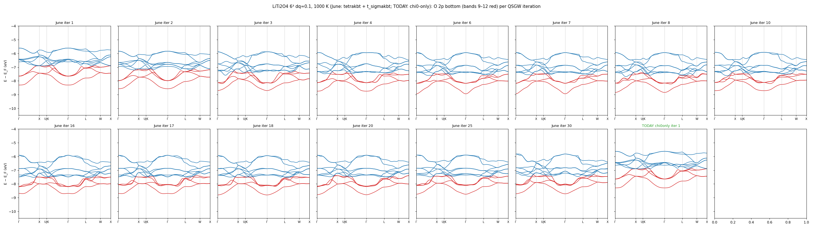
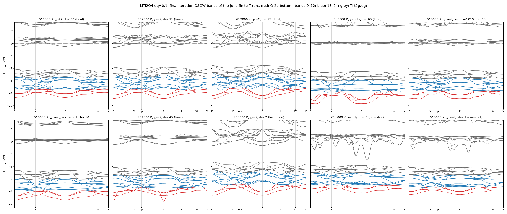

# kBT_research.md — 有限温度 QSGW の研究ログ

上から新しい順に書き足す。結論が固まったものは
[ecaljdoc manual/kBT](https://ecalj.github.io/ecaljdoc/manual/kBT) と各 README に移す。
一覧としての「残る課題」は kBT.md §9。

---

## 2026-09-18 〜 09-19 — 9³ 1000 K の O 2p の荒れの原因調査

書き方: **新しいものが上**、時刻は JST。

### 2026-09-19 15:20 WCS9（9³ iter 2→3、`--wcsmear`）: 荒れ 47.8 → 12.7 meV、シーソー停止

| | iter 2（出発） | REF9（iter 3, 混合なし） | **WCS9（iter 3, --wcsmear）** |
|---|---|---|---|
| O 2p 荒れ（平均 / 最大 meV） | 8.9 / 10.8 | 47.8 / 56.1 | **12.7 / 16.0** |
| 所要時間 | — | 7313 s | 9209 s（+26 %） |

（左 REF9、右 WCS9。上 O 2p、下 E_F 近傍。右は O 2p の波が消え、E_F 近傍の小さなこぶ
（X, L の +1 eV）も弱まる。）
→ 9³ でも 1 反復で荒れが iter 2 並みに戻る。残るのは (1) 多反復チェーンで事故反復が出ないこと、
(2) 実装の整理（パラメタを ctrlg [gw] へ、死んだキーの掃除、コスト削減、hgw の GPU 効率）。
9³ の +26 % は実軸極項の gemm 列数が核幅ぶん増えるため。裾の打ち切り（30 kBT → 15 kBT）で半減見込み。

### 2026-09-19 13:10 REF9（9³ iter 2→3、混合なし）: 荒れ 47.8 / 56.1 meV

`oneshot3_999_T1000_20260919/REF9`（7313 s）。チェーンの iter 3（25.4 meV）は mixbeta=0.5 で
半分に薄まっていただけで、生の Σ(3) は QPU が完全一致（差 0.000）。WCS9 は 12:38 開始。

### 2026-09-19 12:50 `--wcsmear` の数式

外部状態 $|\mathbf{q}n\rangle$（エネルギー $\varepsilon_{\mathbf{q}n}$）、中間状態
$|\mathbf{q}-\mathbf{k},n'\rangle$（$\varepsilon' \equiv \varepsilon_{\mathbf{q}-\mathbf{k},n'}$）、
$W_c = W - v$、$M_{n'n}(\mathbf{k}) = \langle \mathbf{q}-\mathbf{k}\,n'|\,M_\mu(\mathbf{k})\,|\mathbf{q}n\rangle$
（積基底 $\mu$ は以下で縮約）。contour 変形（PRB 76, 165106 Eq. 55）で

$$
\Sigma^c_{nn''}(\mathbf{q},\omega)=\Sigma^{\rm imag}_{nn''}(\mathbf{q},\omega)
+\Sigma^{\rm pole}_{nn''}(\mathbf{q},\omega),\qquad
\Sigma^{\rm pole}_{nn''}(\mathbf{q},\omega)=
\sum_{\mathbf{k}n'} s(\omega)\, M^{*}_{n'n}(\mathbf{k})\,
\bigl[\theta(\varepsilon'-E_F)\theta(\omega-\varepsilon')-\theta(E_F-\varepsilon')\theta(\varepsilon'-\omega)\bigr]\,
W_c(\mathbf{k},\,\omega-\varepsilon')\,M_{n'n''}(\mathbf{k}),
$$

すなわち $\varepsilon'$ が $E_F$ と $\omega$ の間にある中間状態だけが、極の位置
$\omega-\varepsilon'$ で $W_c$ を拾う（$s=\pm1$ は $\omega \gtrless E_F$ の符号、$\omega=\varepsilon_{\mathbf{q}n}$ で評価）。

**中間準位の smearing（従来）**: 核 $g(x)$ とその累積 $\Phi(x)=\int_{-\infty}^{x}g$ を

$$
g_{\rm Gauss}(x)=\frac{e^{-x^2/2\sigma^2}}{\sqrt{2\pi}\,\sigma}\ (\sigma=\texttt{esmr},\ T=0),\qquad
g_{\rm FD}(x)=-\frac{\partial f}{\partial x}=\frac{1}{k_BT}\,f(x)\,[1-f(x)]\ (\texttt{t\_sigmakbt})
$$

として、窓 $[e_l,e_h]=[\min(\omega,E_F),\max(\omega,E_F)]$ に対し重みと平均エネルギーを

$$
w_{n'}=\int_{e_l}^{e_h}\! de\; g(e-\varepsilon')=\Phi(e_h-\varepsilon')-\Phi(e_l-\varepsilon')\quad(\texttt{wfacx2}),\qquad
\bar\varepsilon'=\frac{1}{w_{n'}}\int_{e_l}^{e_h}\! de\; e\, g(e-\varepsilon')\quad(\texttt{weavx2})
$$

で作り、$W_c$ は 1 点で評価していた（Eq. 58）:

$$
\Sigma^{\rm pole,\,old}_{nn''}=\sum_{\mathbf{k}n'} s\,M^{*}_{n'n}\; w_{n'}\; W_c(\mathbf{k},\,\omega-\bar\varepsilon')\;M_{n'n''}.
$$

**`--wcsmear`**: 同じ核で $W_c$ 側を積分する。

$$
\Sigma^{\rm pole,\,new}_{nn''}=\sum_{\mathbf{k}n'} s\,M^{*}_{n'n}
\left[\int_{e_l}^{e_h}\! de\; g(e-\varepsilon')\,W_c(\mathbf{k},\,\omega-e)\right] M_{n'n''}.
$$

$W_c$ が核の幅の中で線形なら old と一致し（重み $\int g = w_{n'}$ は同じ）、幅 0.1 eV の
プラズモン極のように核より細い構造は核の幅（$\sigma$ または $\sim k_BT$）で均される。
実装（`wcsmear_weights`）は $W_c$ の実軸メッシュ点 $\omega_i$（セル $[\omega_i^-,\omega_i^+]$）ごとに
$e=\omega\mp2\omega_i$（Hartree 換算）で対応する $e$ 区間 $[a_i,b_i]$ を窓に切り詰め、

$$
w_{n'i}=\Phi(b_i-\varepsilon')-\Phi(a_i-\varepsilon'),\qquad \sum_i w_{n'i}=w_{n'}
$$

を `wgtiw` に配る（従来の 3 点 Lagrange 重みの代わり）。核の裾は $|e-\varepsilon'|\le 6\sigma$
または $30\,k_BT$ で打ち切り（`wcut`）。芯準位（esmr=0）は従来経路。

**k 積分としての意味**: 本来 $\sum_{\mathbf{k}}\to\int d^3k$ で、重み $\theta(\cdot)$ も極の位置
$\omega-\varepsilon'(\mathbf{k})$ も同じ $\varepsilon'(\mathbf{k})$ の関数。メッシュ化で $\varepsilon'$ を
分布 $g$ に置き換えるなら、重みと位置の両方に同じ $g$ を使うのが一貫した離散化（old は重みだけ）。

### 2026-09-19 12:20 反復のシーソー機構（user との合意事項）

1. 極項は各 (k, n′) の項で W_c(k, ε)、ε = ε_{qn} − ε_{q−k,n′} を 1 点評価。第一殻 k の W_c は
   ω_p ≈ 1.78 eV に幅 0.1 eV の極（Re が 0.05 eV で −54 → +4）。
2. 反復ごとに固有値が数十〜百 meV 動くので、ε が極の近くにある対は反復のたびに極の反対側へ
   渡り、寄与が ±50 a.u. で符号反転。窓が広い状態（O 2p、+3.7 eV の st 46〜51）の Σc が eV 単位で
   跳ぶ → 固有値が動く → 別の対が渡る、のシーソー。
3. 多くの対が同時に渡る反復が「壊れた反復」（SEc ±50 eV）、次で大半が戻る。9³ では mixsigma の
   履歴に半分残って荒れが居座った。一発目の針は同じ機構の非対角版。T ≥ 1500 K で極が減衰。
4. `--wcsmear` では各対の寄与が ε の滑らかな関数（幅 ≈ kBT で均した W_c）になり、シーソーが
   止まるはず → 9³ の iter 2→3（REF9 / WCS9）で確認中。

### 2026-09-19 12:00 `--wcsmear` の根拠の整理（議論）、コスト、四面体版の見積もり

- **根拠**: 極項は本来 k 積分 Σ_{n′}∫d³k f-window(ε_a(k)) ⟨…⟩ W_c(k, ε_{qn} − ε_a(k)) ⟨…⟩ で、
  重み f(ε_a(k)) と極の位置 ε_{qn} − ε_a(k) は同じ変数の関数。離散化で重みだけを核
  （esmr の Gaussian、有限温度なら FD）で均し、位置を点のままにするのは一貫しない。同じ核で
  両方を扱うのが k 積分の離散化として自然（user 合意）。「θ → f に変えるだけ」の有限温度化も
  同じ意味で不十分だった。
- **コスト**（6³, GPU 2 枚, rank 0）: 実軸極項 44 → 293 s（×6.7）、Σc 合計 358 → 616 s、
  gwsc 全体 1571 → 1674 s（**+7 %**）。核の裾（`wcut` = 30 kBT / 6 esmr）を絞れば半減可。許容範囲（user）。
- **正攻法（四面体版）**: 極項の重みを χ₀ と同じ `lindtet6`（ea = ε_{q−k,n′} の 4 隅、eb ≡ ε_{qn}、
  efermia = ε_{qn} と E_F の差）で作る。lindtet6 呼び出し ≈ 1e8/ip、全体 2e9（hx0fp0 の χ₀ 並み）、
  ip ごとに全 kr の重みを事前計算して ~1 GB/ip。実装 1〜2 週間。smearing 版で足りるなら将来課題。

### 2026-09-19 10:45 `--wcsmear` の対角への影響の内訳と、9³ 反復テスト投入

対角 SEc（REF vs `--wcsmear`、6³ 全 16 q）:

| 状態群 | n | 平均 \|ΔSEc\| | >0.2 eV | >0.5 eV | 最大 |
|---|---|---|---|---|---|
| O 2s / Ti 3p（st<9） | 128 | 0.003 eV | 0 | 0 | 0.01 |
| O 2p（9〜24） | 256 | 0.029 | 0 | 0 | 0.19 |
| t2g/eg（25〜52） | 448 | 0.063 | 35 | **15** | **2.64** |
| 上の非占有（53〜100） | 768 | 0.033 | 9 | 0 | 0.46 |

>0.5 eV の 15 件は全部 e0 ≈ +3.5〜3.8 eV（st 46〜51）= 極項の窓が t2g プラズモンを跨ぐ状態
そのもの。例 (−1/6,1/6,1/6) st48: −3.22 → −5.86（Γ の正常値 −6.0 に揃う）。変化は「病的な値が
周囲の正常値に戻る」方向で、占有帯・高い状態は 0.03 eV 以下。

10:34 9³ 反復テスト投入: kt1 `runs/oneshot3_999_T1000_20260919/{REF9,WCS9}`、`repro/band/iter2/` の
状態から mixbeta=1 で 1 反復（= iter 3）、なし → あり を逐次（各 ≈2 h）。指標は O 2p 荒れ
（チェーンの iter 3 は 25.4 meV、混合込み）。

### 2026-09-19 10:35 `--wcsmear` の結果: 針が消え、O 2p も REF より滑らか

6³ 1000 K 一発（`oneshot1_666_skipq0_20260918/WCSMEAR/`, 1674 s）:

| | REF | `--wcsmear` | 参考 2000 K |
|---|---|---|---|
| ⟨48\|Σc(ε₄₈)\|33⟩ | −13.19 | **−4.31** | −1.92 |
| エルミート化後 33–48 | 6.81 | **2.31** | 1.09 |
| Σc₄₈,₄₈ | −3.22 | **−5.86** | −6.21（正常値） |
| Γ–L の band 33 | −3.40 の針 | **滑らか**（−1.03 → −0.05 単調） | 滑らか |
| O 2p 荒れ（平均 / 最大 meV） | 12.2 / 13.6 | **7.2 / 10.5** | 11.3 / 14.0 |
| 対角 SEc の変化（state 9〜52） | — | 平均 0.05 eV、最大 2.6（病的だった state 48 系） | |

（左 REF、右 `--wcsmear`。下段: E_F 近傍の針（Γ–L, K–Γ, X, W）が全部消え、t2g が素直な分散に。
上段: O 2p も滑らか。）
→ 一発目については解決。残る確認: (1) 9³ の反復で荒れ（iter 3 で 25 meV、事故反復）が
消えるか（`band/iter2/` からの 1 反復、または LDA から 3〜4 反復のチェーン）、(2) T=0 の
通常の QSGW（Si, GaAs, Fe など TestInstall）で参照値がどれだけ動くか（Si は最大 77 meV、
高い状態のみ）、(3) 既定にするかどうか。

### 2026-09-19 09:55 解決策 (D) を `--wcsmear` として実装、6³ 一発を投入

`6d4cee007`: 極項で、中間状態の smearing（Gaussian esmr / FD kBT）を ω̄_ε 1 点の 3 点 Lagrange
ではなく **W_c(ω) のメッシュ点に核を積分した重み**として配る（`wcsmear_weights`、和は wfacx2 と
一致、極が無ければ実質不変）。新パラメタ無し。
- ローカル Si 一発 GW（極なし）: あり／なしで SEc 差 平均 14 meV、最大 77 meV（+10〜15 eV の
  高い状態、Si のプラズモン 17 eV 付近）。低い状態はそれ以下。
- kt1 `oneshot1_666_skipq0_20260918/WCSMEAR/`（6³, 1000 K）投入 09:55。針・非対角・荒れを REF と比較。
- 07:30 dq について: Γ セルの W には 1.8 eV の極が無く、外しても不変だったので、dq 依存
  （6 月の「3000 K で dq 0.3 → 0.1 でスパイク消失」）は本質ではなく極踏みの当たり外れ。既定
  `Q0Pchoice=1` → dq=0.1。

### 2026-09-19 07:10 補足: 「実軸積分が問題か」への答え

「実軸積分」ではなく **実軸の極項**。ecalj の Σc（PRB 76, 165106 Eq. 55–58）は

Σc(ε) = [虚軸積分: W_c(iω) を積分、滑らか] + [極項: E_F と ε の間の中間状態 ε′ ごとに
W_c(ω_ε = ε − ε′) を**実軸で拾う**]

で、壊れているのは後者だけ（`--skipRaxisSc` で −13 → −0.35 eV、虚軸積分は無傷）。問題は 2 段:

1. **数値ではなく入力の問題**: 極項は W_c(ω) をヒストグラムのビンから拾うが、そのビン値自体が
   第一殻 q で ω_p = 1.78 eV の鋭い RPA プラズモン極（幅 0.1 eV、Re が隣のビンで −54 → +4）を
   持つ。ビン幅 0.05 eV は極を解像しており、極項はそれを「正しく」拾っている（2 点線形でも
   不変）。ω_ε が極の ±0.1 eV に落ちる (it, itp) 対が ±50 a.u. を受け取り、どの対が落ちるかは
   固有値の微妙な位置次第 → T・dq・反復で符号まで変わる。
2. **物理側**: 減衰のない RPA プラズモン（1000 K 以下では Landau 減衰が足りない）と、それを
   ω = ε₄₈（E_F+3.7 eV、プラズモンより上のサテライト領域）で off-shell に評価して ½(Σ+Σ†) にする
   QSGW の静的近似の組合せ。O 2p では窓 8 eV が 6.2 eV の帯間プラズモンも跨ぐ。

→ 直すべきは積分アルゴリズムではなく、極項に食わせる W_c(ω) の極の扱い（寿命 η (A)、
極近傍の解析処理 (D)）か、QSGW の非対角の作り方 (B)。

### 2026-09-19 06:45 朝の要約 — 特定完了、解決策の案

**特定されたこと**（すべて 6³ LDA からの一発、χ₀+Σ 同温度、mixbeta=1、kt1 `runs/oneshot1_666_skipq0_20260918/`）:

| 温度 | ⟨48\|Σc(ε₄₈)\|33⟩ (eV) | エルミート化後 | Σc₄₈,₄₈ | Γ–L の針（band 33 の底） | O 2p 荒れ |
|---|---|---|---|---|---|
| 500 K | **−27.1** | 13.9 | +0.9 | −2.48（O 2p の底も −11.5 まで壊れる） | 119 / 197 |
| 1000 K | −13.2 | 6.8 | −3.2 | −3.40 | 12.2 / 13.6 |
| 1500 K | −3.2 | 1.8 | −6.0 | −0.96 | 10.2 / 12.7 |
| 2000 K | −1.9 | 1.1 | −6.2（正常） | −0.73（針なし） | 11.3 / 14.0 |

1. 犯人は **Σc の実軸極項**（切ると −13 → −0.35）。虚軸積分・混合・offset-Γ の頭・ω 内挿法は無関係。
2. 極項が拾うのは **第一殻 q の W_c(q, ω) にある t2g プラズモン極（ω_p ≈ 1.78 eV、幅 ≈ 0.1 eV、
   Re が 1 ビンで −54 → +4）**。単一 q ではなく全 q の (it, itp) 対に散って同符号で積み上がる。
3. T で単調に消える（1500 K で概ね、2000 K で完全）: 極が熱的（Landau）に減衰するため。
4. 一発目の針は、この極項を ω = ε₄₈（E_F + 3.7 eV、プラズモンより上）で評価した Σc の非対角
   ⟨48|Σc(ε₄₈)|33⟩ が ½(Σ+Σ†) で 33–48 に入り準位反発を起こしたもの。対角は正常。
5. 9³ の反復での荒れ・壊れた反復も同じ極項が O 2p（窓 8 eV）で極を踏む現象（6.2 eV の
   帯間プラズモンも含む）。反復で固有値が動くたびに踏み方が変わる。

**解決策の案**（実装コスト順）:

- (A) **実軸 W_c にプラズモン寿命を入れる**: 極項で使う W_c(ω) を幅 η（0.2〜0.3 eV）の Lorentzian
  で畳む（hx0fp0 の出力段か hsfp0 の読込段、隠しオプション `wc_eta`）。RPA が持たない
  電子相関によるプラズモン減衰の現象論。±50 の振れが数分の一になり、符号反転の刃先が消える。
  一発 6³ で針、9³ チェーンで荒れを確認。**最初に試す価値が高い。**
- (B) **QSGW のエルミート化に窓**: |ε_i − ε_j| > ω_p の非対角 Σ_ij を滑らかに減衰させる
  （hqpe_sc の `se` 構築で係数 f(|ε_i−ε_j|)）。針は消えるが O 2p の対角の荒れは残る。ad hoc。
- (C) **χ₀ 側の温度だけ上げる**（t_tetrakbt=2000, t_sigmakbt=1000）: 極の減衰を温度で買う。
  6 月の 6³ run の見出し「t_sigmakbt=2000」はこれを試した痕跡かもしれない。物理を変える。
- (D) 極項の積分を解析的に（極の近傍で W_c を Lorentzian で当てはめて積分）: 正攻法だが工数大。
- 併せて: hgw が 2 本同居で `__c_mcopy8` segfault する潜在バグ（4 本同居時 1/4、2 本で 1/2 発生）。

**kt1 の状態**: GPU 空き。`oneshot1_666_skipq0_20260918/DUMPW/__WVR.*` が 2.9 GB × 17 = 49 GB
（要らなくなれば削除）。`~/LiTi2O4/kbt/runs/{o2p_rough,sec_jump,read_se2}.py` は Samples/kBT/LiTi2O4 にコピー済み。

### 2026-09-19 06:40 T1500: 1500 K で概ね消える

⟨48|Σc(ε₄₈)|33⟩ = −3.24、エルミート化後 1.76、Σc₄₈,₄₈ −6.00、針 −0.96 eV、荒れ 10.2 / 12.7。
（夜間キュー完了 06:36。）

### 2026-09-19 06:10 WVR2PT: ω 内挿を 2 点線形にしても変わらない

`--WVR2ptRaxis`: ⟨48|Σc(ε₄₈)|33⟩ = **−14.03**（3 点 Lagrange −13.19）、針 −3.53 eV、荒れ 11.8 / 13.1。
→ 内挿法の問題ではない。極（幅 0.1 eV、ビン幅 0.05 eV）はビンで解像されており、極項は
それを「正しく」積分している。**離散化の事故ではなく、減衰の無い鋭い RPA プラズモン
（1000 K 以下）と、それを ω = ε₄₈ で off-shell に評価して ½(Σ+Σ†) にする QSGW の組合せ**が
本体。

### 2026-09-19 05:45 T0500: 500 K で倍に悪化、O 2p の底まで壊れる

⟨48|Σc(ε₄₈)|33⟩ = **−27.14**（500 K）/ −13.19（1000 K）/ −1.92（2000 K）— T で単調。
エルミート化後 13.9、Σc₄₈,₄₈ = +0.86（符号まで狂う）。O 2p 荒れ **118.9 / 197.4 meV**、band 9 の底
−11.5 eV（1000 K: 12 meV、−8.2 eV）。一発目から O 2p も壊れている = 6 月の 9³ 反復で見た
「壊れた反復」の状態が 500 K では最初から出る。

### 2026-09-19 05:25 T2000: 2000 K では針も非対角も消える

同じ一発（χ₀+Σ とも 2000 K）: ⟨48|Σc(ε₄₈)|33⟩ = **−1.92**（1000 K: −13.19、Γ 点並み）、
エルミート化後 1.09（6.81）、Σc₄₈,₄₈ −6.21（−3.22; Γ の −6.7 と同水準 = 正常）。
Γ–L の band 33: −0.73 → −0.14 と滑らか（1000 K は −3.40 の針）。O 2p 荒れ 11.3 / 14.0。
→ 1000 K → 2000 K でプラズモン極が熱的に減衰し、実軸極項が極を踏まなくなる。6 月の
「2000 K 以上の run に事故なし」と一致。T0500 で逆方向（悪化）を確認中。

### 2026-09-19 05:10 DUMPW: 正体はプラズモン極 — 第一殻 q の W_c(ω) に幅 0.1 eV の t2g プラズモン極（直接証拠）。offset-Γ ではない

`--dumpW` の `__WVR.<iq>`（direct access、record = nblochpmx² complex(4)）から頭 (1,1) 成分を抜いた
（`LiTi2O4/wc_head_iq{1,2,3,5}.dat`）:

| ω (eV) | iq=2 (−1/6,1/6,1/6) Re / Im | iq=5 (0,0,1/3) Re / Im | iq=3 第二殻 | iq=1 Γ セル |
|---|---|---|---|---|
| 1.69 | −54 / −27 | −40 / −17 | −13 / −2 | −395 / −0.3 |
| 1.75 | −49 / **−52** | −39 / −33 | −14 / −3 | −396 |
| 1.80 | **−5 / −54** | −10 / −41 | −13 / −7 | −397 |
| 1.85 | **+4 / −21** | +1 / −17 | −5 / −6 | −398 |
| 2.03 | −17 / −1 | −14 / −1 | −9 | −403 |

- 第一殻 q で **ω_p ≈ 1.78 eV、幅 ≈ 0.1 eV の鋭い極**: Re が 1 ビン（0.05 eV）で −54 → +4、
  Im のピーク −54。第二殻では −14 → −5 に弱まる。
- Γ セル（offset-Γ の頭）は巨大（−400）だが 1.8 eV に極が無く滑らか（3.5 eV に幅の広い山）
  → `--skipq0Sc` で変わらなかった理由。
- 実軸極項は W_c(we) を ω² の 3 点 Lagrange で拾うので、we = |ε₄₈ − ε_it| が極の ±0.1 eV に
  落ちる (it, itp) 対が ±50 a.u. を受け取る。どの対が当たるかは固有値の微妙な位置次第
  → T・dq・反復で符号まで変わる。skip 1 q で 0.2 eV しか動かないのは、当たる対が
  全 q（各 q の中間状態 it の ε が異なる）に散らばっているから。

### 2026-09-19 04:35 SKIPKX5: (0,0,1/3) を外しても変わらない → 全 q に分散

⟨48|Σc(ε₄₈)|33⟩: REF −13.19 / SKIPQ0 −13.16 / SKIPKX2 −12.98 / **SKIPKX5 −13.04**。針 −3.65 eV。
1 つの q を外して動くのは 0.03〜0.2 eV。→ 単一の q の鋭い極ではなく、**全 q の W_c(q, ω≈2〜3.7 eV)
（t2g プラズモン〜その上）が state 48 の実軸極項の窓に入り、t2g 帯内の大きな行列要素を通じて
同符号で積み上がる**。対角 Σc₄₈,₄₈ (−3.2) の 4 倍の非対角になるのは、中間状態 it が t2g で
⟨it|M|33⟩ ≫ ⟨it|M|48⟩ だから。
この見方だと「バグ」ではなく、**プラズモン (≈2 eV) より離れた 2 状態 (33: −0.6, 48: +3.7 eV) の間の
Σ_ij を ½[Σ(ε_i)+Σ(ε_j)] でエルミート化する QSGW の静的近似の限界**（Σ(ω) がプラズモン
サテライト領域で急変）の可能性が高い。T 依存は t2g プラズモンの熱的減衰で説明できる。
T2000/T0500 と DUMPW で確認。

### 2026-09-19 04:10 SKIPKX2: 第一殻 q=(−1/6,1/6,1/6) の W を外しても変わらない

`ECALJ_SKIPKXSC="2"`（kx=2 の W を Σc から外す）: ⟨48|Σc(ε₄₈)|33⟩ = −13.19 → **−12.98**、
エルミート化後 6.81 → 6.70、Γ–L の針 −3.40 → −3.82（対角の一様シフト分）。O 2p 荒れ 12.0 / 13.6。
（Σc₃₃ が −1.55 → −1.92 と動いているので skip 自体は効いている。skip のメッセージは ipr の
関係で stdout に出ない。）
→ Γ セルでも第一殻 1 つでもない。**多数の q に分散した寄与**が同じ符号で積み上がっている
（t2g プラズモン 1.8〜2.3 eV は帯内集団モードで q 分散が弱く、全 q の W_c(q, ω≈2 eV) が
state 48 の窓に入る、という絵と整合）。単一の鋭い極というより「ω ≈ 1.8〜3.7 eV の W_c を
実軸極項がどう拾うか」の問題。SKIPKX5（(0,0,1/3)）と T スキャンで裏取り。

### 2026-09-19 03:50 `--skipRaxisSc`: 異常な非対角は実軸極項が作っている（確定）

SKIPRAXIS（実軸極項を切り虚軸積分だけ）の SEC2U at (−1/6,1/6,1/6):

| | REF | --skipRaxisSc |
|---|---|---|
| ⟨48\|Σc(ε₄₈)\|33⟩ | −13.19 | **−0.35** |
| エルミート化後の最大非対角（row 33） | 6.81 (j=48) | 0.53 (j=28) |
| Σc₃₃,₃₃ / Σc₄₈,₄₈ | −1.55 / −3.22 | −5.58 / +2.36（虚軸だけなので非物理） |

→ 非対角の暴れは **Σc の実軸極項**（W_c(q, ω) を ω_ε で拾う項）だけから来る。虚軸積分は無関係。
注意: このケースは Σ が非物理なので lmf が収束せず（sev −380 → −920 eV）、gwsc の
b=0.1 → 0.05 再試行で 4 時間止まっていた（03:45 に kill、キューは SKIPKX2 へ）。band は無し。
→ 23:40 の統一像のうち「実軸極項」の部分は確定。残るは「どの q の W か」（SKIPKX2/5）と
「極の鋭さの T 依存」（T2000/T0500/T1500）。

### 23:40 夜間キュー投入（トレース無し）

TRACE ランは**壊れていた**: ループ内の `!$acc update host(zsecall(i:i,j:j,ip,isp))` が GPU 側の
Σc を壊し（REF と全 k で Σc が違う、ehf 8 eV ずれ）、値も全部 ≈0。トレース機構は削除
（`1bcbdcc07`）、q 分解は代わりに **kx を Σc から外す**環境変数 `ECALJ_SKIPKXSC="2"` で行う。
kt1 `runs/oneshot1_666_skipq0_20260918/` に逐次投入（各 25〜30 分、同居 segfault を避けて 1 本ずつ）:
SKIPRAXIS（`--skipRaxisSc`、`35a2ea4b9`: 実軸極項を切る）→ SKIPKX2（第一殻 (−1/6,1/6,1/6) の W を外す）
→ SKIPKX5（(0,0,1/3) を外す）→ DUMPW（`--dumpW`）→ T2000 → T0500 → WVR2PT（`--WVR2ptRaxis`）→ T1500。
判定は各ケースの ⟨48|Σc(ε₄₈)|33⟩、Γ–L の針、O 2p 荒れ。

### 23:10 q 分解トレースを投入（→ 23:40: 壊れていたので破棄）

`m_sxcf_sc` に環境変数 `ECALJ_TRACESC="ip i j"` で ⟨i|Σc|j⟩, ⟨j|Σc|i⟩ の途中値を
(kx, irot, icount) バッチごとに出す診断を追加（`2eeb2508a`）。6³ LDA からの一発、
ip=2 = (−1/6,1/6,1/6)、(i,j)=(48,33)。kt1 `runs/oneshot1_666_skipq0_20260918/TRACE/`。
目的: −13 eV がどの q（W の kx）から来るか。

### 23:05 `--skipq0Sc`: offset-Γ の頭は犯人ではない

（`6ad2d1240`; Γ セル kx=1 の W を Σc から外す診断。6³ LDA からの一発、χ₀+Σ 1000 K、
mixbeta=1、kt1 `runs/oneshot1_666_skipq0_20260918/{REF,SKIPQ0}`。REF 22:21 完了、
SKIPQ0 は 2 本同居時に hgw が W-build で segfault（`__c_mcopy8`、夕方の case B と同じ）→
単独で投げ直して 22:45 完了。）

| | REF | --skipq0Sc |
|---|---|---|
| ⟨48\|Σc(ε₄₈)\|33⟩ at (−1/6,1/6,1/6) | −13.19 eV | **−13.16 eV** |
| エルミート化後の 33–48 非対角 | 6.81 | 6.80 |
| Γ–L の針（state 33 の底） | −3.40 eV | −3.94 eV（全体シフト分） |
| Σc₄₈,₄₈ / Σc₃₃,₃₃ | −3.22 / −1.55 | −2.56 / −2.19 |
| O 2p 荒れ | 12.2 / 13.6 | 12.1 / 13.4 |

（左 REF、右 `--skipq0Sc`。上 O 2p、下 E_F 近傍。右でも Γ–L / K–Γ / X / W の針は全部残り、
Γ セルの W を外した効果は全帯の一様なシフトだけ。）

→ **offset-Γ の頭は犯人ではない**。異常な非対角は有限 q（メッシュ第一殻）の W から来る。
窓 [0, 3.7 eV] に入る極は 1.84 eV（t2g プラズモン）と 2.1〜2.3 eV。
なお今日の一発（χ₀+Σ 1000 K、mixbeta=1）は 6 月 `sigmakbt1000` の iter 1（針 −1.9 eV）より
針が深く多い（X, W にも）。6 月の run は途中で設定を触った形跡があるので、一発目の基準は
今日の REF とする。
副産物: hgw の W-build が 2 本同居時に segfault、単独では通る。潜在バグ、要追跡。

### 22:20 統一像: 小 q の W(ω) のプラズモン極を Σc の実軸極項が踏んでいる

小 q（offset-Γ）の ε(ω)（`runs/eps_r1015.dat`, 2000 K）の Re ε 零点: 1.84 eV（t2g プラズモン、
Im ε 1.4）、2.1, 2.34, 3.79, 4.8〜5.0 eV、**6.13〜6.22 eV（Im ε 0.66、−Im 1/ε = 1.47 の鋭い帯間プラズモン）**。

Σc の実軸極項は状態 ε に対し W(q, ω) を ω ∈ [0, |ε−E_F|] で使う（ヒストグラムビン + ω² の
3 点 Lagrange）。小 q の W の頭に鋭いプラズモン極が並ぶ金属では
- 窓が極を跨ぐ状態（state 48: 窓 3.7 eV、O 2p: 窓 8 eV）の Σc がビンの落ち方で ±数 eV〜数十 eV
  振れ、固有値のわずかな移動で符号が変わる → 9³ の反復ごとの波、極に乗った反復の SEc ±50 eV。
- 窓が短い E_F 近傍（t2g）は無傷。
- 温度は極を減衰させる（2000 K 以上で消える、T=0 で最悪）。dq は極の位置を動かす。
- 6 月の ω メッシュ試験（`mesh_conv_result.txt`）で最大変化が st48 の 0.5 eV だったのも同じ指紋。
- 一発目の針は、非対角経由で E_F 近傍に現れる同じ現象。反復で固有状態が組み替わると消える。
（23:05 の試験で「offset-Γ の頭」は外れ、「有限 q の W の極」に絞られた。）

### 22:10 一発目の針の正体 = 固有状態基底の Σc の非対角 ⟨48|Σc(ε₄₈)|33⟩

6 月 6³ 1 反復 run の SEBK/SEX2U・SEC2U を `LiTi2O4/read_se2.py` で読む。同じ k で
state 33（t2g, −0.6 eV）と非占有 state 48（+3.7 eV）の間:

| 条件（χ₀ 側のみ有限温度） | ⟨33\|Σc(ε₃₃)\|48⟩ | ⟨48\|Σc(ε₄₈)\|33⟩ | Σc₄₈,₄₈ |
|---|---|---|---|
| T=0, dq=0.3 | −0.23 | **+9.24** | −9.93 |
| 1000 K, dq=0.3 | −0.23 | **−5.45** | −5.50 |
| 1000 K, dq=0.1 | −0.23 | **−11.31** | −3.82 |
| Γ | −0.32 | −1.7〜−2.0 | −6.7 |

ε₃₃ で評価した側は正常、**ε₄₈ で評価した側が ±10 eV で符号反転**。QSGW のエルミート化
½(Σ+Σ†) がこれを 33–48 の非対角 4.6〜5.9 eV にし、準位反発で 33 を 2 eV 押し下げる。
他の大きい非対角（j=65, 71: 4.6, 5.5 eV）は三条件で不変 → Vxc と相殺される正常成分。

### 21:55 針はメッシュ点にある、対角 Σ は滑らか

針の底は Γ–L 線上の**メッシュ点 (−1/6,1/6,1/6) そのもの**。そこで band（lmf が Σ 行列を対角化）は
state 33 を −1.87 eV に置くが、QPU の対角 eQP は +0.62 eV（e0 −0.63 + dSE 1.25）で滑らか
（Γ–L 4 点: 0.50, 0.62, 0.86, 1.02）。iter 2 の e0 欄がこの −1.85 を示し、Σ₂ は dSE=+2.86 で戻す
（反復で「比較的安定していく」のはこの自己修復）。

### 21:35 iter 2→3 の一発比較: T=0 は 8 倍荒れる、Anderson 混合は犯人ではない

6³、6 月の `band/iter2/` から 1 反復、`mixbeta=1.0` で混合なし、GPU 2 枚、
kt1 `runs/oneshot3_666_T1000_20260918/`（20:25 投入、A′ 21:15・C 21:33 完了）:

| case | 条件 | 荒れ（band 9〜12、平均 / 最大 meV） |
|---|---|---|
| 6 月 iter 3（参考、Anderson 混合込み） | χ₀ 1000 K + Σ 1000 K | 10.7 / 15.3 |
| A′ | 同上、混合なし | **17.4 / 23.4** |
| C | 両側 T=0（tetrakbt=false, t_sigmakbt 無し） | **132 / 153** |
| B（Σ 側 T=0）, E（dq=0.3） | 途中で停止（B は 4 本同居中に hgw が segfault、投げ直し後に停止） | — |

- 計算された Σ(3) はそれ自体が荒く（A′）、6 月の mixsigma はむしろ薄めていた → Anderson 混合は犯人ではない。
- **T=0 にすると 8 倍荒れる**（C）。有限温度は荒れを抑える側。金属固有の問題。

### 21:30 band 履歴図に E_F 近傍を追加（9³・6³）

各反復で上段 O 2p（−10〜−4 eV、赤 = band 9〜12、青 = 13〜19）、下段 E_F±2.5 eV（緑 = t2g、
band 25〜52）。`plot_band_history.py` / `plot_band_history_666.py`。

- 9³: iter 1, 2 は滑らか、**iter 3 で全 k 路に細かい波が乗り**（Γ だけではない）、iter 17〜18 で
  band 9 の Γ に鋭い落ち込み（−8.4 → −9.8 eV の針）が出て iter 45 まで残る。
- 6³: 30 反復を通して O 2p は滑らかなまま（荒れ指標 7〜16 meV、iter 8 と 13〜15 に軽い山）。
  SEc が 40 eV 飛んだ iter 7 でも band に針は立たない。→ 事故（SEc の飛び）は 6³ でも起きるが、
  band を壊すほど残るのは 9³ だけ。(a) 9³ では飛びが広く乗る、(b) 6³ iter 7 は mixbeta=1.0 で
  次の反復が完全上書き、9³ は mixbeta=0.5 の Anderson 履歴に半分残った、のどちらか。
- E_F 近傍: iter 2 以降は概ね滑らか（X, L の +1 eV に小さなこぶが iter 16 以降固定的に居座る）。
  **iter 1（LDA からの一発）だけ t2g に深い針**（6³ −1.9 eV、9³ −0.8 eV）が出て iter 2 で消える。
  E_F 近傍は震源であって被害者ではない（合意）。

### 20:40 9³ 再現チェーン停止（user 判断、iter 4 の途中）

iter 1〜3 の状態（rst, sigm, QPU, EFERMI*, hgw の stdout）は kt1
`n999_dq0.1_T1000K_repro20260918/band/iter1〜3/` に保存。iter 3 の荒れは `band/iter2/` から
1 反復（2 h, GPU 2 枚）で再現できる。6 月 iter 6 型の SEc 数十 eV の事故は現行コードでは未再現
（そこまで回していない）— 必要なら `band/iter3/` から ITER0=4 で再開（`run_repro2.sh`）。

### 20:15 9³ iter 3 で荒れが再現

荒れ指標 25.4 / 32.4 meV（6 月 28.7 / 37.5）、band 10〜12 に 6 月と同じ細かい波。ここから
6 月とのずれが出始める（SEc 最大差 0.19 eV、ehf −109760.160 対 −109760.773 eV）が定性的には
同じ軌道。**iter 3 の荒れは SEc の飛びではない**（iter 2→3 の |ΔSEc| 最大 0.98 eV、>1.5 eV は
0 件）— 6 月の iter 6 型の事故（数十 eV）とは別の、もっと穏やかな機構。

### 19:00 6 月の run ごとの最終反復の band

`plot_band_final_june.py`、−10.5〜+3.5 eV、赤 = band 9〜12、青 = 13〜24、灰 = Ti t2g/eg:

- χ₀+Σ（t_sigmakbt あり）の 6³ 1000/2000/3000 K と 9³ 3000 K は O 2p も t2g も素直。
  9³ 1000 K iter 45 だけ Γ の針と細かい波。
- **χ₀ だけ**（t_sigmakbt 無し）の run は別物: 一発（iter 1）の時点で t2g に −1〜−3 eV の
  深い針が多数（6³ 1000 K, 9³ 3000 K）、収束後（6³ 3000 K iter 60, esmr=0.019, 5000 K）は
  t2g が E_F に張り付いた平坦帯に潰れ、O 2p の底も −9.5 eV へ沈む。χ₀ が EFERMI_kbt、
  Σ が EFERMI という E_F の二重管理（kBT.md §9）の帰結で、Σ 側も温めるのが必須という
  6 月の結論の根拠。16:40 に 6³ χ₀-only チェーンを止めたのは結果的に正しい。

### 18:00 9³ iter 2 完了、6 月と一致

8880 s（前半は 6³ と GPU 共有）。荒れ 8.9 / 10.8 meV（6 月 8.9 / 10.8）、SEc 最大差 9 meV・
平均 0.2 meV、ehf −109754.052 eV（6 月 −109754.052）。iter 1→2 の SEc ジャンプ無し（max 0.83 eV）。

### 16:40 6³ χ₀-only チェーン停止

`n666_dq0.1_T1000K_chi0only_20260918/`（χ₀ 側だけ 1000 K、`t_sigmakbt` を外す）。CPU 版は
1 反復 2〜3 h と遅すぎ、GPU 共有版に切り替えたが 9³ が 2 h → 3 h 超に伸びるので 2 反復で停止
（user 判断）。

### 15:15 9³ iter 1（一発 GW）完了、6 月と完全一致

荒れ指標 8.1 / 11.5 meV（band 9〜12 平均 / 最大）とも同値、QPU の SEc は state 9〜52 × 35 k で
最大差 8 meV・平均 0。→ 現行 main（f5c49f435）は 6 月のバイナリと同じ軌道を辿っている。

### 13:05 再現ラン投入（kt1, 現行 main f5c49f435, GPU 2 枚）

6 月のランは当時のバイナリ（`PB.liti2o4.toml` 時代）。現行コードで同じことが起きるかを、
同じ入力（dq=0.1、tetrakbt = t_sigmakbt = 1000 K、mixbeta=0.5、from LDA）で確かめる。
kt1 `~/LiTi2O4/kbt/runs/n999_dq0.1_T1000K_repro20260918/`（`run_repro2.sh`, `-np 60 -np2 2`、
1 反復 ≈ 2 h）。入力は 6 月のディレクトリから `ctrlg` + `PB` を取り `ctrlg_absorb.py` で一本化。
混合履歴（`__mixm`, `mixsigma`）は無し。反復ごとに `band/iterN/` に rst / sigm / QPU / EFERMI /
EFERMI_kbt / `stdout.0000.hgw.gz` を残し、`job_band` → `o2p_rough.py`（bnd 上の |2 階差分| の
平均、meV）を `rough.txt` に。

### 12:30 6 月の QPU を反復間で比較: 「壊れた反復」がある

荒れは滑らかな帰還ではなく、**特定の反復で SEc が数十 eV 飛ぶ「壊れた反復」**が原因。
`sec_jump.py`（反復 n と n−1 の SEc の差、valence 帯 state 9〜24、全 k）:

| run | 壊れた反復（|ΔSEc|>1.5 eV の (k,state) 数 / 全数、最大 |ΔSEc|） |
|---|---|
| 9³ 1000 K (tetrakbt + t_sigmakbt) | **iter 6**: 204/560, 50 eV → iter 7 で同じ量だけ戻る; **iter 17–19**: 182–261/560, 15 eV |
| 6³ 1000 K (同上; mixbeta は iter 11 まで 1.0) | **iter 7**: 121/256, 40 eV → iter 8 で戻る; **iter 17–18**: 95/256, 14 eV; iter 20–21: 30, 6 eV |
| 6³ 2000 K (11 反復), 3000 K (29〜60 反復), 5000 K (10 反復) | 無し |

- 壊れた反復では **全 k** で、O 2p 帯（state 9〜23, −8〜−5 eV）と +23〜26 eV の非占有帯の
  SEc が異常（例: 9³ iter 6 の q=(−7/9,7/9,1) state 12 で SEc 5.9 → 55 eV; 9³ iter 17 の Γ state 12 で
  SEc −8.4 eV）。SEx は正常。E_F 近傍の t2g/eg（state 24〜52）は無傷。→ 虚軸積分ではなく
  **実軸の極項**（|ε−E_F| が大きい状態ほど広い ω 窓の W(ω) を使う）。
- 壊れた Σ が `mixsigma`（mixbeta=0.5、Anderson nmix=3）で半分混ざり履歴に残るので、
  次の反復で戻っても帯の荒れ（30 meV 台）が居座る。9³ iter 17〜19 の後に O 2p の底が 1.4 eV
  沈んだのはこの二度目の事故の跡。
- 1000 K だけで起きる（2000 K 以上は無し; T=0 の多反復 run は無い）。

### 12:00 6 月のランを同じ指標（`o2p_rough.py`）で見直す

`band/iter*/`, band 9〜12 の平均 / 最大 meV:

| 反復 | 1 | 2 | 3 | 4〜16 | 17 | 18 | 19 | 20 | 21〜45 |
|---|---|---|---|---|---|---|---|---|---|
| 平均 | 8.1 | 8.9 | **28.7** | 20〜32 | 50.6 | **75.4** | 50.2 | 44.3 | 28〜35 |
| 最大 | 11.5 | 10.8 | 37.5 | 30〜46 | 75 | 104 | 58 | 51 | 36〜42 |
| band 9 の底 (eV) | −8.40 | −8.50 | −8.63 | −8.7〜−8.8 | −8.90 | −9.27 | −9.46 | −9.85 | −9.5〜−9.9 |

→ **荒れは反復 3 で既に出る**（8 → 29 meV）。17〜20 反復目で O 2p の底が 1.4 eV 沈む第二段が
あり、その後 30 meV 台に居座る。再現には 3 反復（≈6 h）で足りる。

### 午前 — 発端と当初の仮説（後に修正）

**発端**: `plots/mesh_666_vs_999_T1000.png` の −8 eV 付近で 9³（赤破線）が大きく振動している
（それまで E_F ±0.5 eV しか見ていなかった。そこは rms 14 meV で「収束」）。

**事実**（`LiTi2O4/n999_T1000`, `n666_T1000`、dq=0.1、tetrakbt = t_sigmakbt = 1000 K）

- バンド線上の 2 階差分 rms（meV）、O 2p の底 band 9〜12:

  | 反復 | band 9 | 10 | 11 | 12 |
  |---|---|---|---|---|
  | 9³: 1 | 9 | 14 | 15 | 18 |
  | 9³: 3 | 14 | 41 | 45 | 55 |
  | 9³: 10 | 20 | 35 | 52 | 55 |
  | 9³: 20 | 112 | 96 | 56 | 56 |
  | 9³: 45 | 82 | 78 | 42 | 57 |
  | 6³: 1〜30 | 7〜9 | 12〜19 | 16〜21 | 16〜29 |

  → 一発 GW は 9³ も滑らか。反復で育ち、20 反復で 100 meV 級、以後居座る。
  −7 eV より上（band 16〜）は 6³ と同程度。図: `LiTi2O4/plots/o2p_666_vs_999_T1000.png`。

- メッシュ点の Σ（QPU.45run vs QPU.30run、Γ 点）:

  | state | 6³ Σ−vxc / SEc / eQP | 9³ 同 |
  |---|---|---|
  | 9（O 2p 底） | +0.23 / 5.96 / −8.72 eV | **−1.39 / 4.50 / −9.65** |
  | 10 | +0.06 / 5.99 / −8.01 | +0.19 / 5.93 / −8.71 |
  | 11, 12 | ≈0 / 5.9 / −8.00, −8.00 | −0.10 / 5.8 / −8.26, −8.25 |
  | 7, 8（O 2s −21 eV） | −1.42 / 9.82 | −1.42 / 9.82（一致） |

  → 9³ は Γ で state 9 の SEc が 1.5 eV 小さく、6³ で三重縮退の 10–12 が 0.45 eV 割れる。

**当初の解釈**（その後の判定を括弧で）:
1. q→0（offset-Γ）の W の頭が有限温度の金属で不安定で、反復で帰還する（**23:05 に否定**:
   Γ セルの W を外しても変わらない。「帰還」でもなく散発的な事故 + 極跨ぎ）。
2. Σ の反復の減衰が弱い / Anderson 外挿（`mixsigma`, mixbeta=0.5, nmix=3）が増幅（**21:35 に否定**:
   混合なしの方が荒い。ただし壊れた反復の Σ を履歴に残す役はある）。
3. E_F の二重管理（χ₀ は `EFERMI_kbt`、Σ は `EFERMI`）— t_sigmakbt を入れれば同じ E_F（19:00 の
   χ₀-only の図がその帰結）。
4. GL20 の E_F 近傍の粗さ（kBT.md §7.2）— 未検証、主因ではない。

**次にやること**: (1) 23:10 のトレースで −13 eV の q 分解。(2) 実軸極項の極の扱い（ビン幅、
2 点線形 `--WVR2ptRaxis`、W_c の虚部で極を鈍らせる、頭の解析処理）の比較。(3) 1000 K の小 q
ε(ω) を出して極の鋭さを確認。(4) hgw 2 本同居での segfault の追跡。

---

## 2026-09-17 — 300 K でも Σ 側は金属で 0.1 eV 動く（TestInstall/fe_gwsc, 5³, 1 反復）

| | χ₀ のみ（tetrakbt 300 K） | χ₀ + Σ（t_sigmakbt = 300 も） |
|---|---|---|
| GaAs | max 1 meV | — |
| Fe up | max 1 meV | **max 0.12 eV、平均 0.04 eV** |
| Fe dn | max 1 meV | max 0.08 eV、平均 0.05 eV |

E_F ±kBT の少数の状態が分数占有になり、その状態自身の SEx / SEc が eV 級で動いて打ち消した
残り。粗いメッシュで「どの状態が E_F を跨ぐか」に敏感。→ gwinit のテンプレは有限温度キーを
見え消しに戻した（`6aaf2040b`）。メッシュ収束と `esmr` 窓（`ddw*esmr` が温度でスケール
しない、kBT.md §7.3）の整理が要る。比較は QPU の `dSEnoZ` 列で（`eQP(starting by lmf)` は
lmf の出発固有値）。

## 2026-09-17 — heftet が絶縁体で EFERMI_kbt を書かなかった

GetStarted/GaAs の一気通貫で発覚（当時のテンプレが tetrakbt=true 既定だった）。
金属/絶縁体の分岐の後で書くよう修正（`57edde869`）。ギャップ内で解が区間になれば中央。
GaAs 300 K: EFERMI_kbt = 0.15345 Ry（T=0 中央 0.15221、離散 k 和 0.15326）。

## 2026-09-16 — 実装レビュー（kBT.md §7 に反映済み）

- 恒等式 ∫dE(−f′)θθ = f_a − f_b は厳密。
- GL20 on [−6, 6] は内側の節点が |t|=0.459 → E_F ±0.9 kBT を刻まない。4 区間 × GL5 で
  誤差 1.7e-1 → 2.9e-2（未実装）。
- Σ 側の状態窓 `ddw*esmr`（ddw=10）が `sig_kbt` でスケールしない、`sxcf_scz_count` が
  `sigmakbt_setup` より先に走る。
- 落としている項: f₂(1−f₃) = (f₃−f₂) n_B の O((kBT)²)。定義の選択であって欠陥ではない。
- 潜在: `sxs_ekc(is1+nctot)`（m_sxcf_sc.f90:237）、`ixc==3` での `ef` 上書き。
