# kBT_research.md — 有限温度 QSGW の研究ログ

上から新しい順に書き足す。結論が固まったものは
[ecaljdoc manual/kBT](https://ecalj.github.io/ecaljdoc/manual/kBT) と各 README に移す。
一覧としての「残る課題」は kBT.md §9。

---

## 2026-09-21 — chi0_filterw の試験

## 2026-09-22

### 2026-09-22 10:35 offset-Γ の Im $W_c$ の ω → 0（user の問い）

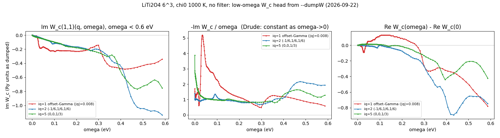

- offset-Γ（\|q\| = 0.008）: Im $W_c(1,1)$ は ω ≈ 0.03 eV までに −0.2 へ急峻に立ち上がりその後平ら。$-\mathrm{Im}W_c/\omega$ は 0.03 eV に
  鋭いピーク（5）で Drude 定数ではない = 微小 q の帯内連続体（$\omega\lesssim v_Fq\approx0.03$ eV、kBT で少し広がる）。bin 幅 1〜5 meV で解像はされている。
- 第一殻（\|q\| = 0.29）: $-\mathrm{Im}W_c/\omega\approx1$ で ω → 0 まで平ら（Drude 的）、$v_Fq\approx0.4$ eV で落ちる。
- Re $W_c(\omega)-W_c(0)$ は 0.3 eV 以下で ±0.1 以内（offset-Γ の $W_c(0)=-382$ に対して）: 静的な頭は良く定義されている。
offset-Γ の Drude 重みが 30 meV に押し込まれているのは、準位 smearing（kBT 86 meV）より鋭い構造。ただし虚軸側は $W_c(0)$ の解析項で
ν → 0 を扱うので（01:35 の単体試験）、これが段差にはならない。

### 2026-09-22 10:20 訂正: P 設定（χ₀ T=0）の 9³ では tetwt5 は 20 s/q で軽い。主コストは wcsmear の実軸極項

09:40 の内訳は 09-18 の run（χ₀ 1000 K = `lindtet6_kbt`、GL20 畳み込み）のもの。P（χ₀ T=0、`lindtet6`）の走行中 9³ の実測（rank 0）:
W-build **66 s/q**（tetwt5 job=1 20 s、dpsion 12 s、χ₀ zmel+GEMM ~30 s）、**Σc 258 s/q**。Σc の中（6 q、6144 icount）: 虚軸 GEMM 1074 s、
**実軸極項 922 s**（0.15 s/icount。wcsmear 前は 0.027 s → ×5.5、09-19 の ×6.7 と整合）、zmel 149 s。
1 反復 130 min ≈ Σc 虚軸 40 + **極項 35** + zmel 6 + W-build 20 + lmf 等 12。

- tetwt5 の OpenMP（`39fdcfc2d`、gfortran で 1 vs 8 スレッド差 1e-16）は χ₀ 有限温度のときの資産。P では 3 %。
  kt1 の別ビルド `build_omp_test` で 6³ T=0 の tetwt5 = 7.1 s/q（1 スレッド）を確認、30 スレッドの計測は不要と判断。
- **単純な高速化の本命 = wcsmear の極項**: 核の裾 ±15 kBT（±1.3 eV）に W 平面 ~100 本、plane ごとに小 GEMM。
  (1) 裾を 8 kBT に（重み 3e-4 を切る）→ plane 半分、極項 −45 %、1 反復 −15 min。`m_wfac::wcut` の 1 行。
  (2) plane をまとめて 1 GEMM（ngb² × nplane、9³ で 100 plane 1.7 GB）→ さらに −20 %。半日。
  走行中の 9³ には入れない（次のチェーンから）。

### 2026-09-22 09:40 高速化: 9³ 1 反復のコスト内訳と tetwt5 の OpenMP 作り直し

**内訳**（両 GPU、`-np 60 -np2 2`、09-18 の repro run と今朝の iter 1 から）: lmf 4〜6 min、jobgw 1 min、hvccfp0 ×2 1.3 min、
core 交換 1.5 min、**hgw 115 min（89 %）**、hqpe/lmf 6 min、計 ~130 min。hgw の中（rank 0、18 q）: W-build 217 s/q = 65 min
（うち **tetwt5 ~178 s/q、1 スレッド直列 = 全体の ~50 %**、χ₀ zmel+GEMM 24 s、dpsion 6 s）、Σc 178 s/q = 53 min
（icount 840: 虚軸 GEMM 0.15 s、極項 0.027 s、zmel 0.019 s）。CPU 60 コア中 58 コアが遊んでいる。

**対処**（`39fdcfc2d`）: tetwt5 の job=1 の重み積算を atomic からスレッド私有 `whw_t(:,ithr)` + ループ後の和に変更
（09-19 の atomic 版は競合で効かなかった）。メモリ nhwtot × nthr × 8 B（9³: 4.2 GB/rank、許容）。gfortran で Fe chipm /
GaAs eps は 1 vs 8 スレッドで差 1e-16（和の順序）。kt1 では走行中の 9³ に触らないよう別ビルド木 `build_omp_test`
（`~/bin_omp_test` に配送）で hx0fp0 だけ作り、6³ の 1 q で 1 vs 30 スレッドの tetwt5 wall を測る。
見込み: 178 s/q → ~6 s/q、9³ 1 反復 130 → ~80 min。9³ 本番への適用は今のチェーンが終わってから。

### 2026-09-22 09:20 9³ 投入（user「999 をやる」）— P と同設定、GPU 2 枚

`n999_P_smearx0_nofilter_mix05`（`~/trash/chain999.sh`、`-np 60 -np2 2`、12 反復、1 反復 ~2.5 h）: χ₀ T=0 + `SmearX0 0.0057` Ha +
`t_sigmaw 1000` + wcsmear、フィルタなし、mixbeta 0.5、LDA から。09:19 開始。
P2（2000 K 相当）は iter 1 途中で停止（結果なし、9³ の後に再開可）、R は iter 7（t2g 7.3 / 16.5、底 −9.65）で停止。
段階 2（フルスペクトル一発）は user 判断で見送り。

### 2026-09-22 08:40 **P（フィルタなし + SmearX0 1000 K 相当）は 8 反復で収束** — 6³ のスムーズ収束を達成

`n666_P_smearx0_nofilter_mix05`（01:12〜08:34、8 反復、1 反復 45〜80 分）。χ₀ T=0 + `SmearX0 = 0.0057` Ha + `t_sigmaw = 1000` + wcsmear、mixbeta 0.5、LDA から。
- iter 7 → 8: eQP（|E|<3 eV、2544 状態）の変化 **max 10 meV、平均 2 meV**。dSEnoZ 平均 11 meV。O 2p 底 −8.751 → −8.754。
- t2g 荒れ 3.0 / 5.1 meV（LDA 4.8 より滑らか）、O 2p 荒れ 7.1 / 11.0（6 月の 1000 K 収束値 13.8、9³ の 25〜100 と比べ良好）。
- SEc ジャンプ（>1 eV）は iter 8 で 2/832（st40、q=(−⅙,⅙,⅙)、2.08 eV）— 個別の状態にはまだ揺れがあるが固有値には 10 meV 以下。
R（フィルタ + Drude 残す）は 6 反復で t2g 7.3 / 16.4、底 −9.63 と沈み続け、P より悪い → 段階 2 路線は当面保留。
P2（2000 K 相当）は 08:34 に GPU 0 で自動開始（`SmearX0 = 0.0114`, `t_sigmaw = 2000` 確認）。R2 は R の後（~10:00）。

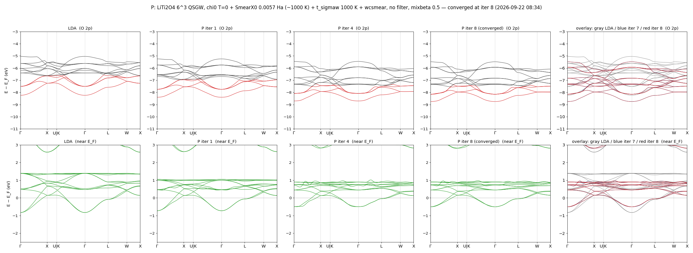

全反復（LDA + iter 1〜8）:

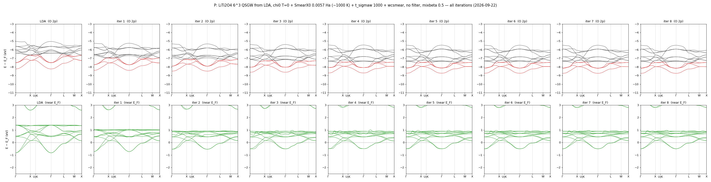

LDA → iter 1 → 4 → 8（右端は iter 7 と 8 の重ね描き: 青と赤が完全に重なる）。収束解: t2g 幅は LDA 2.2 eV（−0.85〜+1.35）→ 1.4 eV
（−0.5〜+0.9）と**狭まり**、O 2p は 0.5〜0.7 eV 下がる。E_F 直上 +0.8〜+1.0 eV に 30〜50 meV の小さな凸凹が残る（反復で不変）。

### 2026-09-22 05:45 作戦（user「作戦を考える」への提案、承認待ち）

1. **P（フィルタなし + SmearX0 1000 K 相当）を第一候補**として 8 反復。判定: O 2p / t2g 荒れ < 8 meV を維持し、O 2p 底・t2g 幅の
   反復間変化 < 30 meV で「6³ スムーズ収束」達成。R（フィルタ + Drude 残す）は対照。
2. **P2/R2（2000 K 相当）**で滑らかさとバンドの系統シフト（1000 K 相当との差）を測り、副作用を数値で押さえる。同等なら小さい方を標準に。
3. 標準が決まったら **9³**（GPU 2 枚、1 反復 ~2.5 h、10 反復 ~1 日）、6³ との一致で締める。
4. 整理: SmearX0 を「金属で W の極を鈍らせる標準手段」として ecaljdoc に位置づけ直す（温度は占有だけ、SmearX0 は χ₀ の全構造を均す）。
   `chi0_filterw` は段階 2 とセットの実験機能。`t_sigmaw` は 1000 K 固定でよい。
5. やらない: (a) 非対角 $\bar\omega$ 評価、niw 増、9³ の一発診断。
判断点: P が iter 5〜6 で荒れ出したら P2 に切替。P2 でも駄目なら静的 QSGW の限界として段階 2 路線（R）。

### 2026-09-22 03:40 T0 の $\Sigma_c(\omega)$（実系、27 meV 刻み）: 段差なし。E_F 直上の状態は $\omega=\varepsilon_{\rm occ}+\omega_p$ の共鳴の肩に座っている

`t0_secomg_filt3_drude/SEComg.UP`（hsfp0 --job=4、`ECALJ_DWPLOT=0.002 ECALJ_OMEGAMAX=0.3`、EMIN/EMAX −2/+2 → 12 状態、3 q、00:49〜03:29 CPU 30 rank）。
データ `LiTi2O4/secomg_20260922/SEComg.UP`。

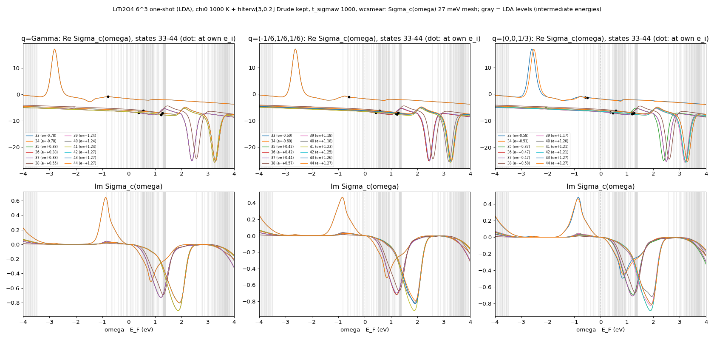

1. $\Sigma_c(\omega)$ は 27 meV 刻みで滑らか、LDA 準位（灰線）の位置に段差なし → **contour 実装は実系でも正しい**（01:35 の単体試験と整合）。
2. 自身のエネルギーでの傾き $\partial\mathrm{Re}\Sigma_c/\partial\omega = -1.2\sim-1.35$（$Z\approx0.43$）。2 点平均の非対称 0.24 eV / Δ 0.8 eV（01:48）はこの傾きの
   直接の帰結。E_F ± 1.5 eV での 2 階差分 max 0.2（33/34）、0.06（35–38）— 曲率もある。
3. 構造: 非占有 t2g（+0.4〜+1.3 eV）は ω ≈ 2.3〜3.3 eV で Re −15 eV 級の落ち込み（Im −0.9）、占有 t2g（−0.6）は ω ≈ −2.7 で +17 の山。
   位置は $\omega=\varepsilon'\pm\omega_p$（1.8 eV）= **Drude 由来のプラズモン極**（フィルタは帯間だけ抜くので残る、意図どおり）。
   占有 t2g の底 −0.6 eV + 1.8 = **+1.2 eV に非占有 t2g 自身が乗る**: E_F 直上 +1 eV 付近の状態は $\Sigma(\omega)$ の共鳴の肩で
   $\partial\Sigma/\partial\omega$ が大きく $k$ 依存 → **凸凹の出所**。
4. `t_sigmaw`（kBT 0.086 eV）や wcsmear（±1.3 eV の核平均）では幅 ~0.5 eV の共鳴の肩は消えない。効くのはプラズモン自体の幅を広げる
   温度（Landau 減衰）／SmearX0 → **2000 K 相当（P2/R2、キュー済み）が本命**。6 月に 2000 K 以上で滑らかだったことと整合。

P（フィルタなし、SmearX0 1000 K 相当）iter 1（01:12〜02:30）: O 2p 7.2 / 10.1、t2g 荒れ 4.9 / 6.9 meV（LDA 4.8 と同じ！）、底 −8.40。
一発では SmearX0 版が今までで最も滑らか。

| chain | iter | 開始→終了 | O 2p 荒れ | t2g 荒れ (33–40) | 底 E(b9) |
|---|---|---|---|---|---|
| P（フィルタなし） | 1 | 01:12→02:30 | 7.2 / 10.1 | 4.9 / 6.9 | −8.40 |
| P | 2 | 02:30→03:33 | 6.9 / 9.1 | 5.1 / 9.9 | −8.50 |
| P | 3 | 03:33→04:23 | 7.4 / 10.6 | 5.2 / 10.0 | −8.62 |
| P | 4 | 04:23→05:08 | 7.3 / 10.9 | **4.2 / 7.3** | −8.71 |
| P | 5 | 05:08→05:55 | 7.0 / 10.6 | **3.6 / 6.0** | −8.74 |
| P | 6 | 05:55→06:43 | 6.9 / 10.8 | **3.3 / 5.7** | −8.74 |
| P | 7 | 06:43→07:46 | 7.0 / 11.0 | 3.1 / 5.4 | −8.751 |
| P | 8 | 07:46→08:34 | 7.1 / 11.0 | **3.0 / 5.1** | −8.754 |
| R（filterw [3,0.2] Drude 残す） | 1 | 01:51→03:33 | 6.6 / 8.6 | 5.4 / 8.3 | −8.70 |
| R | 2 | 03:33→04:33 | 6.1 / 8.3 | 6.0 / 11.1 | −9.02 |
| R | 3 | 04:33→05:39 | 6.6 / 8.6 | 7.0 / 17.5 | −9.39 |
| R | 4 | 05:39→06:39 | 6.7 / 8.8 | 7.8 / 18.9 | −9.61 |
| R | 5 | 06:39→07:22 | 7.0 / 10.2 | 7.4 / 17.5 | −9.61 |
| R | 6 | 07:22→08:15 | 6.9 / 9.8 | 7.3 / 16.4 | −9.63 |

P は反復ごとに t2g が滑らかになり（4.9 → 3.3、LDA 4.8 を下回る）、O 2p 底は iter 5→6 で 0.006 eV と**収束**。

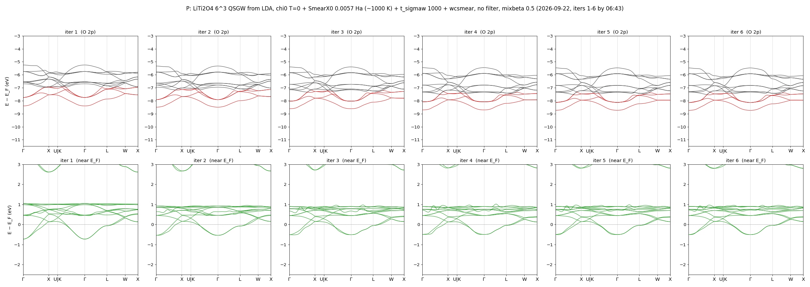

iter 4 以降、E_F 直上 +0.8〜+1.0 eV の非占有 t2g に小さな凸凹（0.05 eV 級、Γ–X 中程・W–X）はまだ見えるが反復で育たない。
R は t2g の max が 8 → 19 meV と育ち、底は 0.2〜0.4 eV/反復で沈み続ける（帯間遮蔽を抜いた分の HF 化が反復で強まる）。

（参考: これまでの iter 2 は MAIN 12.1 / t2g 7.8、Drude 残し T=0 チェーン 6.5 / —。）

### 2026-09-22 01:52 user: 「フィルタなし」と「プラズモンのみ抜き（Drude 残す）」が本命 → Q（Drude 抜き）を停止し R に差し替え

- P `n666_P_smearx0_nofilter_mix05`（GPU 0）: 継続（iter 1 の hgw 中）。
- Q `n666_Q_smearx0_filt3_nodrude_mix05`: 01:50 停止（iter 1 途中）。
- **R** `n666_R_smearx0_filt3_drude_mix05`（GPU 1、01:51〜）: χ₀ T=0 + SmearX0 0.0057 Ha + `chi0_filterw=[3,0.2]` **Drude 残す** + t_sigmaw 1000 + wcsmear、mixbeta 0.5、8 反復。
(a)（非対角を $\bar\omega$ で評価）は「$\Sigma_{ij}$ が線形なら mode A と同じ」なので保留（user 同意）。
user 01:55: 終わったら **2000 K 相当**も → P/R の `chain done` 後に同じ GPU で P2 `n666_P2_smearx0_nofilter_2000K_mix05`、
R2 `n666_R2_smearx0_filt3_drude_2000K_mix05`（`SmearX0 = 0.0114` Ha、`t_sigmaw = 2000`）を自動起動（`~/trash/queue_2000.sh`）。

### 2026-09-22 01:48 近接 t2g 対の $\Sigma^c_{ij}$ の 2 点評価の差は Δ に比例（傾き 0.25〜0.4）— 振動でなく傾き。`t_sigmaw` では平均化できず、(a) も線形なら無効

`se_pairs.py`（SEC2U の行 $i$ と行 $j$ の比較、フィルタあり一発）: X 点の (33,39)（0.14/0.95 eV、Δ 0.81）で
$\Sigma_{ij}(\varepsilon_i)=-0.52$、$\Sigma_{ji}(\varepsilon_j)^*=-0.76$、差 0.24（/Δ = 0.29）; (34,40) Δ 0.66 差 0.18 (0.28); (35,40) Δ 0.78 差 0.20 (0.26);
Δ 0.09 の対でも /Δ = 0.25〜0.39。→ $\partial\Sigma_{ij}/\partial\omega\approx-0.3$ の**滑らかな傾き**（Z 因子相当）で、kBT 以下の ω 構造ではない。
非対角の大きさ 0.4〜0.65 eV、Δ 0.8 eV の対の準位反発 ≈ 0.5 eV。
含意: (1) `t_sigmaw` は中間準位を均すだけで傾きは変えない → 効かない。(2) $\Sigma_{ij}$ が Δ の範囲で線形なら
$\tfrac12[\Sigma(\varepsilon_i)+\Sigma(\varepsilon_j)]=\Sigma(\bar\omega)$ なので (a) も mode A と同じ → 効かない。
決め手は T0 v5（対角 $\Sigma_c(\omega)$、27 meV 刻み、12 状態、走行中、〜04:30）の ω 依存の形。線形なら凸凹は静的化の欠陥でなく
「この W・6³ での収束解の性質」に傾く。(a) の実装はその後。02:15 の「固有ベクトル入れ替え」説明は不正確だった（$V$ は $k$ で連続、
問題はエネルギー依存）と訂正。

### 2026-09-22 01:40 Fermi 面ネスティングの検討（user）: $W_c(q,0)$ の頭は \|q\| に単調、兆候なし

user: 「この系はネスティング不安定を内在しているかも。プラズモンとは別」。フィルタなし dump（16 既約 q）で
$W_c(1,1)(q,\omega=0)$ と $-\mathrm{Im\,tr}W_c$（0.05 eV）を並べると、Γ セル −382、\|q\| = 0.29 / 0.33 / 0.47 / 0.58 / 0.67 で
−36 / −28 / −15 / −11 / −9、\|q\| ≥ 0.8 で −6.5〜−8.2 と**単調**（iq=9 (−⅔,⅔,1) は折り返すと (⅓,⅓,0)、\|q\|=0.47 で列に収まる）。
低 ω の重みも Drude 型で \|q\| に単調。特定 q の突出（$\chi_0(q,0)$ の発散的ピーク）は 6³ の q 解像度では見えない。
→ 反復の凸凹は「W の静的 q 構造」でも説明できず、Σ 側の非対角エルミート化が残る。

### 2026-09-22 01:40 今のコード（`3ec2a281f`）で 6³ チェーン 2 本を並走（user 指示）

共通: χ₀ T=0 + `SmearX0 = 0.0057` Ha（Gaussian、std = FD 1000 K の 0.156 eV）+ `t_sigmaw = 1000` + wcsmear、mixbeta 0.5、LDA から 8 反復、
`-np 30 -np2 1`、`~/trash/chain_v2.sh`、ログは反復ごとに開始/終了時刻・O 2p 荒れ・t2g 荒れ（bands 33–40）・O 2p 底。
- **P** `n666_P_smearx0_nofilter_mix05`（GPU 0）: フィルタなし（Drude・帯間とも χ₀ に入る）。
- **Q** `n666_Q_smearx0_filt3_nodrude_mix05`（GPU 1）: `chi0_filterw=[3,0.2]`、**Drude 抜き**。
01:12 開始、1 反復 ~70 分。T0 v5（$\Sigma_c(\omega)$、CPU）は並走中。

### 2026-09-22 01:35 単体試験 `Samples/kBT/contour_test/`: contour 分解 + FD smearing の実装は正しい（縮退跨ぎで連続、厳密求積と 0.35 % 以内）。01:00 の niw 仮説は撤回

user の指摘（「チェックが乱暴」「メッシュの問題でない」「簡単なテスト、行列要素は無視」）を受け、1 中間準位 × モデル
$W_c(z)=-v\omega_p^2/(\omega_p^2-z^2-i\gamma z)$（金属型: $W_c(i\omega')$ に $\omega'$ の 1 次項）で、実コードの経路
（`m_wfac::pole_weights` と m_sxcf_sc の虚軸重みをそのまま）による $\Sigma_c(\omega)=I+P$ を厳密求積と比較。
一瞬で終わる。表と手順は `contour_test/README.md`（コミット `6be55104e`）。

- **ω = ε′ の跨ぎ**: I と P が $\pm\tfrac12W_c(0)$ を kBT 幅で入れ替え、和は連続。コード − 厳密 ≤ 0.0035（$W_c(0)$ 単位）。
  ω = E_F の跨ぎも滑らか。300/1000/3000 K、γ 0.02/0.1/0.5 eV で同じ。**niw = 10 で十分**（01:00 の「虚軸の解像度不足」仮説は
  この試験で否定。niw=30 の一発は不要 → kt1 の `oneshot_niw30_filt3_drude` は中止）。
- **極を踏む場所**（ω − ε′ ≈ ω_p）: wcsmear なしはコードが厳密から最大 6.8（針の機構）、wcsmear ありで 0.05（γ 0.1）、
  γ 0.02 で 1.2、300 K で 0.5。残差は「極の幅 vs bin 幅・核幅」で決まる。
- 結論: 反復で残る E_F 直上の凸凹は 1 準位・1 行の contour 実装では説明できない。残る候補は**非対角のエルミート化**
  $\tfrac12[\Sigma(\varepsilon_i)+\Sigma(\varepsilon_j)]$（近接 t2g 対で $\Sigma_{ij}$ が ω のどちらで評価されるかで 0.2 eV 違う、23:45 の $A_{ij}$）と、
  多準位・$k$ 和での極踏みの残差（wcsmear 後も 0.05〜0.5 $W_c(0)$ が対ごとに残る）。

### 2026-09-22 01:00 仮説: 残る凸凹は虚軸積分の $\omega'\to0$ の解像度不足（金属の Drude 非解析性）— niw 試験へ

user: 「ua は固定か、残差が気になる」。`ua_` = `gauss_img` = 1 Ha⁻¹ 固定。引き算 $W_c(0)e^{-u_a^2\omega'^2}$ は解析的に戻すので
ua は近似でない。残差の出所は残りの数値積分: `niw = 10` の GL 節点（$\omega'=(1-x)/x$）の**最小 $\omega'$ ≈ 0.013 Ha = 0.35 eV**。
$|w_e|=|\omega-\varepsilon'|/2 \lesssim 0.35$ eV の対では Lorentz 核（幅 $|w_e|$）が解像されない。絶縁体は残り $\propto\omega'^2$ で無害だが、
金属は $W_c(i\omega')-W_c(0)\propto|\omega'|$（Drude）なので取りこぼし $\sim c\,w_e\ln(0.35/|w_e|)$、$w_e\sim k_BT$ で $c\times0.1$
（$c$ = $W_c$ が 0.35 eV で変わる量、数 eV）× $|M|^2$ → 近接対ごとに 0.1 eV 級 = 凸凹のスケール。contour の段差ではなく
「$\varepsilon'\approx\varepsilon_i$ の対の虚軸積分の精度」で、user の懸念と同じ場所。

試験: **`niw` 10 → 30 の一発**（6³、標準 W: χ₀ 1000 K + filterw [3,0.2] Drude 残す、t_sigmaw 1000、wcsmear、LDA から）。
t2g 荒れ（`t2g_rough.py`）と反エルミート部 $A_{ij}$（`se_asym.py`）が減れば確定。T0（Σ(ω)、走行中 00:49〜）の後に GPU 0 で。
（T0 の 2 回の失敗: (1) 旧 mode 4 の ω 範囲 ±7 Ry が W メッシュ外 → `ECALJ_OMEGAMAX`、(2) wcsmear の裾が W メッシュ外で rx →
`3ec2a281f` で clip、(3) 状態・q は QPNT でなく `[gw] QforGW` と `EMINforGW/EMAXforGW` で決まる → QforGW 3 q を追加。ntq=313 のまま。）

### 2026-09-22 00:10 user 方針: contour 連続性の実装を数値で決着させてから 6³ 収束へ

user: 「contour 連続性の実装がちゃんとできているか心配。ほぼ縮退した状態が多く、正のフィードバックがあれば振動は大きくなり得る。
数値的なトラブルではないか。」→ **順序**: (1) $\Sigma_c(\omega)$ の ω 依存で中間準位跨ぎの段差の有無を数値で確定（T0 + 細メッシュ）、
(2) それから 6³ 収束チェック: `t_sigmaw = 1000`、`SmearX0` ≈ 1000 K 相当（Gaussian で FD の std 0.156 eV → 0.0057 Ha）、
フィルタなし（できればフィルタ + Drude 残し版も）。

準備: `hsfp0 --job=4` の ω メッシュを環境変数で上書き（`ECALJ_DWPLOT`, `ECALJ_OMEGAMAX`、Ry、`3c8f4ab43`）。
T0 の粗いメッシュ（0.136 eV）で第一判定 → dwplot 0.002 Ry（27 meV、kBT の 1/3）で確定。段差の判定は
中間準位 $\varepsilon'(k-q)$ の集合（QPU から）を ω 軸に重ねて、その位置でのキンク／段差の有無。

### 2026-09-21 23:45 W_c の頭（フィルタなし、χ₀ 1000 K）をようやく取得 — 09-19 の極を再現。プラズモンピークは成分によらず同じ位置

`dumpw_nofilter_v3`（22:47〜23:35、GPU 0）。抽出 `LiTi2O4/wc_head.py`（record = nblochpmx² × complex(4)、**nblochpmx = 1053**、
`freq_r` の D 指数対応）。iq=2 の頭は 09-19 と一致: 1.69 eV Re −54.3 / Im −27、1.75 −49 / −52、1.80 −4.7 / −54、1.85 +3.9 / −21。

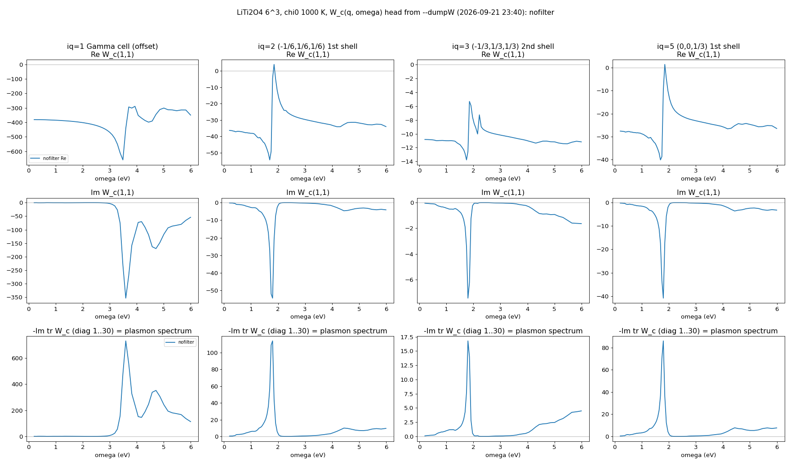

- 第一殻（iq=2, 5）: $\omega_p$ = 1.78 eV、幅 0.1 eV の鋭い極。第二殻（iq=3）は 1.8 と 2.2 eV に 2 本、Γ セル（iq=1）は 3.6 と 4.7 eV。
- $-\mathrm{Im\,tr}\,W_c$（対角 30 成分の和）のピークは (1,1) 成分と同じ ω → **プラズモンの位置は成分によらない**（user の予想どおり）。
- データ: `LiTi2O4/wc_nofilter_20260921/wc_head_iq{1,2,3,5}.dat`。フィルタあり（Drude 残す／落とす）の頭は T0 の後に dump。

同時に、既存の一発の SEBK から **反エルミート部** $A_{ij}=\tfrac12[\Sigma_{ij}(\varepsilon_i)-\Sigma_{ji}(\varepsilon_j)^*]$（t2g ブロック 25–52、`se_asym.py`）:
フィルタなし max 2.07 eV（(33,48) プラズモン跨ぎ）→ フィルタ Drude 残す **max 0.12 eV**、残るのは (33/34, 39/40) の対
（ε = 0.14 / 0.95 eV、$|\Sigma_{ij}(\varepsilon_i)|$ 0.52 vs $|\Sigma_{ji}(\varepsilon_j)|$ 0.76 eV）。E_F 直上の t2g 対で「どちらの ω で評価するか」が
0.2 eV 違う = 凸凹（0.1〜0.3 eV）のスケール。t2g 荒れ指標（bands 33–40 の 2 階差分、`t2g_rough.py`）: LDA 4.8、REF 84、
wcsmear 12.3、フィルタ Drude 残す 9.1、Drude 落とす 11.0、(F) 収束 9.9 meV。

**T0（走行中、GPU 1、23:36〜）**: user の問い「$\Sigma(\varepsilon_i)$ は中間状態 $\varepsilon'$ が $\varepsilon_i$ を跨ぐとき（$\varepsilon_i-\varepsilon'$ の符号）で
跳ばないか — contour 分割の問題」を直接見る。一発 GW（`gw_lmfh`、sxcf_fal2 経路、標準 W）の後 `hsfp0 --job=4` で
$\Sigma_c(\omega)$ を ω メッシュ（dwplot 0.01 Ry）で出力（SEComg.UP、states 33–40、q = Γ, (−⅙,⅙,⅙), (0,0,⅓)）。
ω が中間準位を跨ぐところに段差があれば contour の不整合。`t0_secomg_filt3_drude/`。

### 2026-09-21 22:48 夜間プラン（user 22:45）: W_c dump 1 本 → S（SmearX0）と M2（filterw Drude 残す）を並走、mixbeta 0.5、8 反復ずつ

22:38 に全停止（user）。22:31 の dump 再投入は `__WVR` が出る前に止めたので **W_c の dump は今日 0 本**（3 回とも私の抽出・運用ミス）。
夜間は 1 本のスクリプト `~/trash/night_20260921.sh` で順に（私の発火に依存しない）:
1. `dumpw_nofilter_v3`（GPU 0、フィルタなし、χ₀ 1000 K、t_sigmaw 1000、mixbeta 1）: dump は残す、抽出は nblochpmx=1053、
   `night_20260921.log` に 09-19 の極（1.69 eV Re −54 → 1.85 eV +4）との照合行を出す。〜23:40。
2. 並走 8 反復、mixbeta 0.5、LDA から:
   - **S** `n666_S_smearx0_mix05`（GPU 0）: χ₀ T=0 + `SmearX0 = 0.011` Ha（0.3 eV）+ `t_sigmaw = 1000` + wcsmear。
   - **M2** `n666_M2_filt3_drude_mix05`（GPU 1）: χ₀ 1000 K + `chi0_filterw=[3,0.2]` Drude 残す + `t_sigmaw = 1000` + wcsmear（= MAIN と同条件の再走）。
   1 反復 ~70 分（並走）→ 朝までに 5〜6 反復。ログ: `/mnt/data1/LiTi2O4_kbt_runs/night_20260921.log`（開始・終了時刻付き）。

監視ルール（user 22:55）: 反復ごとに watcher を掛け直し、(a) O 2p 荒れ > 25 meV、(b) E_F ± 2 eV に −1 eV 級の針、
(c) SEc ジャンプ > 3 eV が複数、(d) rc ≠ 0 のいずれかで「とんでもない」と判定 → そのチェーンを止めて設定変更で再投入。
差し替え候補の順: **2000 K**（χ₀・Σ とも、フィルタ無し。09-19 の一発で針も非対角も消えた実績）→ SmearX0 0.02 Ha → mixbeta 0.3。

### 2026-09-21 22:35 dumpW 3 本は完了していたが抽出が再び失敗（record 長の取り違え）→ 22:31 に 3 本目の投げ直し

17:36〜19:47 に 3 本とも完走（フィルタなし 7.2 / 10.9 meV、Drude 残す 6.0 / 7.7、Drude 落とす 7.0 / 9.0 — 10:57・11:25 の
再現）。しかし `wc_head.py` に渡した `nblochpmx = 582` が誤り: `__WVR.<iq>` は 2 891 773 872 B = **1053² × 8 B × 326 record**
（nblochpmx = nbloch 582 + ngcmx 471 = 1053、complex(4)、record 326 本）。iw=0 の頭（−36.24）だけ合って以降がゴミ。
スクリプトが dump を消す設計だったので再抽出できず。完了通知もまた届かず 22:30 まで気づかなかった（3 時間の損失）。
対処: record 長を 1053 に、**dump は消さない**（/mnt/data1 に 1.6 TB）。22:31 にフィルタなし（GPU 0）・Drude 残す（GPU 1）、
続けて Drude 落とす、を再投入。完了 ~23:20 / ~00:10。

### 2026-09-21 17:40 user: 「本当に W からプラズモンは抜けているのか」→ 両チェーンを止めて dumpW 一発 3 本

順序の確認: x0kf_v4h の `accumulate_chi0` で対ごとのテトラヘドロン重み（= Im χ₀ のヒストグラム）に $f_c(\omega)$ を掛けてから積み、
dpsion5 で Hilbert 変換 → Re χ₀(ω)、χ₀(iω)。3 eV 以下の Im χ₀ は無く Re も整合。ただし $W_c(\omega)$ の頭は直接見ていない
（抽出バグで取り損ね）。注意点: Drude を残す MAIN では Drude 重みからプラズモン極が再構成される（帯間遮蔽が無い分だけ高い ω、
幅は Landau 減衰分）ので「プラズモンなし」は帯間の話。(F)（Drude も落とす）は本当に 3 eV 以下が無い。

17:37 に MAIN（iter 4 途中、QPU.3run から再開可）と (F)（収束済み）を停止し、`--dumpW` 一発を投入
（`/mnt/data1/LiTi2O4_kbt_runs/`、各 GPU 1 枚、mixbeta 1、LDA から、χ₀ 1000 K、t_sigmaw 1000）:
`dumpw_nofilter`（GPU 0）、`dumpw_filt3_drude`（GPU 1）、続けて `dumpw_filt3_nodrude`。抽出は `wc_head.py`（修正版）で
$W_c(1,1)$ の Re/Im、対角 30 成分の Im（成分ごとのプラズモンスペクトル）、$-\mathrm{Im\,tr}\,W_c$ を iq=1,2,3,5 で。

### 2026-09-21 17:35 (F) は iter 3〜5 で収束（mixbeta 1）— 凸凹は振動ではなく収束解の性質

(F)（Drude 落とす、[3,0.2]、χ₀ 1000 K、mixbeta 1、GPU 1）iter 5（16:16〜17:12）: 7.7 / 9.8 meV、底 −10.647。
iter 3 → 4 → 5 で O 2p 荒れ 7.7 / 9.6 → 7.7 / 9.8 → 7.7 / 9.8、底 −10.59 → −10.64 → −10.65（反復間差 < 0.01 eV）。
**mixbeta 1 でも収束する**。E_F 直上 +1.3〜+1.8 eV の非占有 t2g の凸凹は iter 2 以降そのまま固定 → 反復の振動ではなく
この設定の**収束解が持つ構造**（Σ 由来）。ただし帯幅 3.5 eV・O 2p 底 −10.6 と、静的遮蔽を抜いた分だけ物理からは遠い。
MAIN（Drude 残す、mixbeta 0.5）は iter 4 待ち（〜18:10）。

### 2026-09-21 17:00 MAIN 3 反復・(F) 4 反復の途中経過: どちらも「プラズモンを抜いても E_F 直上の凸凹は残る」

**MAIN**（Drude 残す、[3,0.2]、χ₀ 1000 K、mixbeta 0.5、GPU 0）

| iter | 開始 | 終了 | O 2p 荒れ mean / max [meV] | 底 E(b9) | SEc ジャンプ >1.5 eV |
|---|---|---|---|---|---|
| 1 | 13:14 | 14:32 | 6.4 / 8.1 | −8.69 | — |
| 2 | 14:32 | 15:46 | 12.1 / 13.8 | −8.88 | 5（max 2.85 eV Γ st50） |
| 3 | 15:46 | 16:57 | 9.7 / 13.4 | −9.37 | 9（max 1.93 eV） |

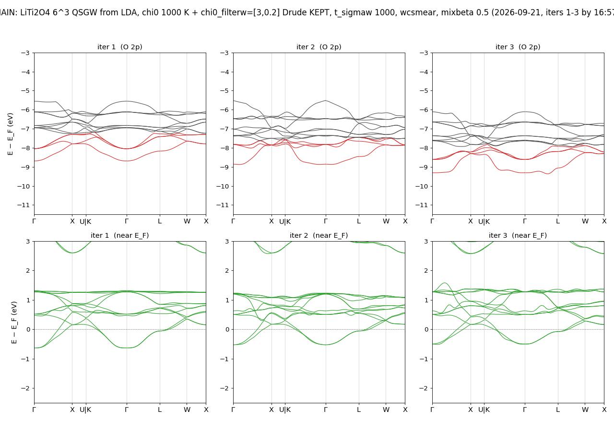

**(F)**（Drude 落とす、同条件、mixbeta 1、GPU 1）

| iter | 開始 | 終了 | O 2p 荒れ | 底 E(b9) |
|---|---|---|---|---|
| 1 | 12:35 | 13:02 | 7.0 / 9.0 | −9.86 |
| 2 | 13:14 | 14:20 | 8.7 / 9.9 | −10.52 |
| 3 | 14:20 | 15:20 | 7.7 / 9.6 | −10.59 |
| 4 | 15:20 | 16:16 | 7.7 / 9.8 | −10.64 |

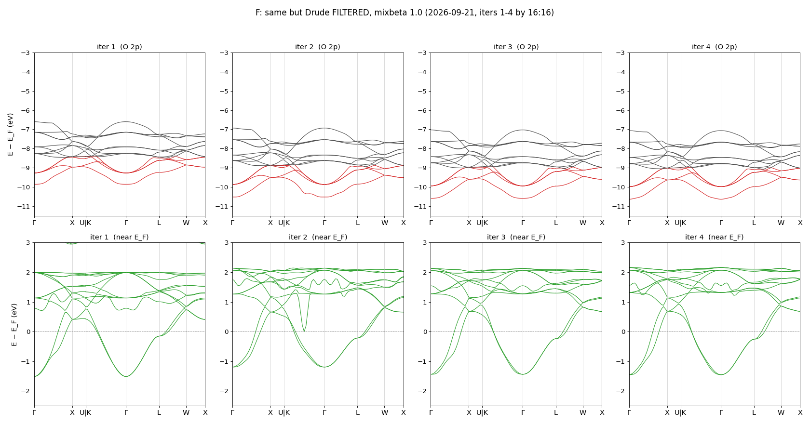

- MAIN: iter 2 から E_F 直上（+0.8〜+1.5 eV）の非占有 t2g に 0.1〜0.3 eV の凸凹（Γ–X 中程、Γ 近傍、W–X）。iter 3 では O 2p にも
  波打ち（底で 13 meV）。09:45 の Drude 残し・χ₀ T=0・wc=2 チェーンと同型で、χ₀ を 1000 K にしても wc を 3 eV にしても出る。
- (F): O 2p は 7〜9 meV で反復間安定（mixbeta 1 でも）。しかし E_F 直上 +1.3〜+1.8 eV の非占有 t2g に iter 2 から**同型の凸凹**
  （Γ 両側、X 近傍で −1 eV 級の針も iter 2 に一つ）。帯幅は 3.5 eV に広がったまま、O 2p 底は −10.6 で沈み続ける（静的遮蔽なし）。
- **結論（暫定）**: 反復で育つ E_F 直上の凸凹は W の低エネルギー極（Drude・帯間プラズモン）を抜いても残る。震源は非占有 t2g の
  非対角 Σ（反復ごとに固有ベクトルが入れ替わる交差点）か、Σ 側の何か。一発 3 枚（12:35）に既に同じ位置の小さな凸凹があるのと整合。
- 続行中: MAIN iter 4〜（〜18:10）、(F) iter 5〜6（〜18:10）。

### 2026-09-21 13:15 方針（user）: メイン = Drude あり・プラズモン（3 eV 以下の帯間）なし、mixbeta 0.5 で収束まで。GPU 2 枚で 2 本並走

- **MAIN** `n666_MAIN_drude_mix05`（GPU 0、`-np 30 -np2 1`）: χ₀ 1000 K、`chi0_filterw=[3,0.2]`、**Drude 残す**、`t_sigmaw=1000`、
  wcsmear、**mixbeta 0.5**、LDA から 15 反復。13:14 開始。
- **(F) 続行** `n666_filterw3_nodrude_mix1`（GPU 1）: Drude なし、mixbeta 1、iter 1 の状態から iter 2〜6。13:14 再開。
- 1 GPU あたり 1 反復は実測 66 分（(F) iter 2、2 本並走で CPU 30 ランクずつ）。/dev/shm は 2 本で 1.2 GB（問題なし）。`chain.log` は反復ごとに開始・終了時刻付き（`~/trash/chain2gpu.sh`）。
  hgw 2 本同居は /dev/shm（126 GB、6³ なら余裕）を最初の W-build 後に確認する。
- 予定: プラズモンスペクトル（`--dumpW`、$W_c(q,\omega)$ の対角成分と $-\mathrm{Im\,tr}\,W_c$、成分によらずピーク位置が同じか）は
  フィルタなし 1000 K の一発を別途 1 本（GPU が空いてから）。
- 監視: cron/ScheduleWakeup は不発なので、条件待ち ssh の完了通知で反復ごとに起きる。
  （15:05 追記: MAIN iter 1 の完了待ち（14:32 終了）の通知も届かなかった。完了通知も取りこぼすことがある。
  user が声をかけたときに必ず両 chain.log を読む、を基本にする。）

MAIN の進行（Drude 残す、mixbeta 0.5、GPU 0、hgw 出力 `drude kept = T`）:

| iter | 開始 | 終了 | O 2p 荒れ mean / max [meV] | 底 E(b9) |
|---|---|---|---|---|
| 1 | 13:14 | 14:32 | 6.4 / 8.1 | −8.69 |
| 2 | 14:32 | 15:46 | 12.1 / 13.8 | −8.88 |（SEc ジャンプ >1.5 eV: 5/832、max 2.85 eV Γ st50）

### 2026-09-21 12:35 一発図の再読（user）と次のチェーン (F): Drude 落とす、[3,0.2]、mixbeta 1

user の読み: (0) E_F 直上 +0.5〜+1.3 eV の非占有 t2g の凸凹（Γ–X 中程、K–Γ–L の Γ 両側）は LDA 以外の**一発 3 枚すべて**にあり、
Drude とプラズモンを 3 eV で抜いても残る → W の低エネルギー極とは別の原因（Σ 由来）。(1) Drude は帯幅を狭める。
(2) バンピーの主因はプラズモンで、帯幅を狭める効果も持つ。9³ での確認はしない（user）。

次: **(F)** `n666_filterw3_nodrude_mix1`（χ₀ 1000 K、`chi0_filterw=[3,0.2]`、**Drude 落とす**、`t_sigmaw=1000`、wcsmear、
**mixbeta 1.0**、LDA から 6 反復）。12:35 開始、pid 692716。(E) は iter 2 で停止。
続けて **(G)** `n666_filterw3_drude_mix1`（同条件で Drude 残す）6 反復を (F) の後に自動起動（13:00 キュー、pid 711990、user 不在 〜17:00）。

(F) の進行（`chi0_filterw_drude = false` = **Drude なし**、hgw 出力 `drude kept = F` で確認）:

| iter | 開始 | 終了 | O 2p 荒れ mean / max [meV] | 底 E(b9) |
|---|---|---|---|---|
| 1 | 12:35 | 13:02 | 7.0 / 9.0 | −9.86 |
| 2 | 13:14 | 14:20 | 8.7 / 9.9 | −10.52 |
| 3 | 14:20 | 15:20 | 7.7 / 9.6 | −10.59 |

### 2026-09-21 12:10 dumpW 一発 2 本（χ₀ 1000 K、wc=3/dw=0.2）: Drude 残す方が NEW に近い。W_c の頭は抽出スクリプトの D 指数バグで取れず → 再 dump をキュー

`/mnt/data1/LiTi2O4_kbt_runs/dumpw_T1000_filt3_{nodrude,drude}`（10:29〜11:25、各 28 分、`--dumpW`、mixbeta=1）。

| 6³ 一発 from LDA | NEW（1000 K, wcsmear, フィルタ無し） | **filt3 Drude 残す** | filt3 Drude 落とす |
|---|---|---|---|
| O 2p 荒れ mean / max [meV] | 7.2 / 10.9 | **6.0 / 7.7** | 7.0 / 9.0 |
| O 2p 底 E(b9) [eV] | −8.48 | −9.17 | −9.86 |
| ⟨48\|Σ\|33⟩ at q=(−⅙,⅙,⅙) | 2.18 | < 1.04（消失） | < 1.03（消失） |
| dSEnoZ shift vs NEW、t2g（\|ε_LDA\|<1.5） | — | 平均 **+0.76**（+0.43〜+1.10） | 平均 +1.40（−0.32〜+2.02） |
| 同 O 2p（ε_LDA ∈ [−9, −4.5]） | — | 平均 **−0.21**（−0.52〜+0.08） | 平均 −0.70（−0.87〜−0.45） |

- どちらも針の震源は消え、O 2p は wcsmear 単独より滑らか（6.0 meV は今までの最小）。
- Drude を残す方が NEW からのずれが半分（t2g +0.76 vs +1.40、O 2p −0.21 vs −0.70）。段階 2 で戻す量が小さい → 10:50 の判断どおり標準は Drude 残す。
- **W_c の頭は未取得**: `wc_head.py` が `freq_r` の Fortran `D+00` 指数を読めず落ち、スクリプトが dump を削除してしまった（修正済み）。
  チェーン (E) の後に Drude 残しで再 dump（`dumpw_T1000_filt3_drude_v2`、キュー済み）。
- チェーン (E)（標準案、6 反復）: 11:26 開始、iter 1 = 6.4 / 8.1 meV（11:53）。

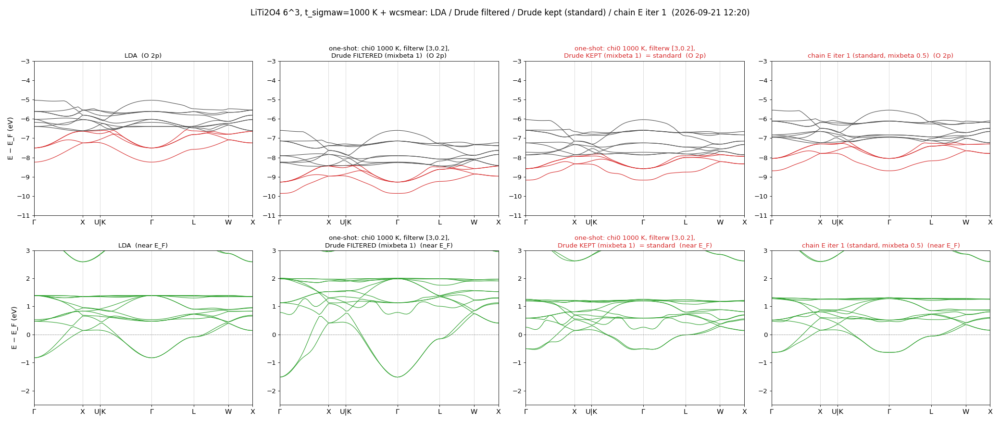

一発（LDA から、mixbeta 1）4 枚: Drude を落とすと t2g の帯幅が 3.5 eV（−1.5〜+2.0）まで広がり O 2p が −9.8 eV まで沈む。
Drude 残す（標準）は t2g −0.5〜+1.25、O 2p 底 −9.2。フィルタなし（NEW20260920、右端）は t2g −1.05〜+0.9、O 2p 底 −8.5 で、
フィルタで抜いた帯間遮蔽の分だけ標準は t2g が上（+0.5 eV 級）・O 2p が下（−0.7 eV）。どの一発も滑らか。
(E) は iter 2 まで（6.4 → 10.3 meV）で user 指示により 12:20 停止。次のチェーンは mixbeta 1.0（混合なし、user 指示）。

### 2026-09-21 10:50 user 判断: Drude（帯内）は W に残す。標準案 = Drude 残す + `chi0_filterw=[3,0.2]` + χ₀ 1000 K + `t_sigmaw=1000` + wcsmear

Drude を落とすと静的金属遮蔽が消えて t2g が +0.66 eV、O 2p が −0.45 eV 余計に動く（05:50 の NODRUDE）。段階 2 で戻すにしても
遠すぎる。以後の標準は **`chi0_filterw_drude = true`（既定）** で、カットは 3 eV（t2g–t2g 帯間を確実に外す）。
走行中の dumpW 2 本目 `dumpw_T1000_filt3_drude` がこの設定なので、その $W_c$ の頭と一発を見てから 6 反復チェーン（E）を投入。

### 2026-09-21 10:30 (D) 全部入りチェーンは iter 1 で一旦停止、W_c の頭を見る一発を投入

(D) `n666_filterw3_dw02_T1000_nodrude`（χ₀ 1000 K + `chi0_filterw=[3,0.2]` + Drude も落とす + `t_sigmaw=1000` + wcsmear）:
iter 1（10:00〜10:27、27 分）O 2p 荒れ 7.4 / 9.9 meV、底 −9.03 eV、針なし。**user 指示（10:10）でここで止め**、
同じ設定で `--dumpW` 付きの一発を `/mnt/data1/LiTi2O4_kbt_runs/dumpw_T1000_filt3_nodrude`（10:29〜）に投入、
続けて Drude 残し版 `dumpw_T1000_filt3_drude`。目的: **第一殻 q の $W_c(\omega)$ の頭からプラズモン極（09-19: 1.78 eV、幅 0.1 eV、
Re −54 → +4）が消えているかの直接確認**。dump（46 GB）は頭の抽出後に削除する（`~/trash/wc_head.py`、
`__WVR.<iq>` は direct access・record = nblochpmx² complex(4)、nblochpmx = 582）。

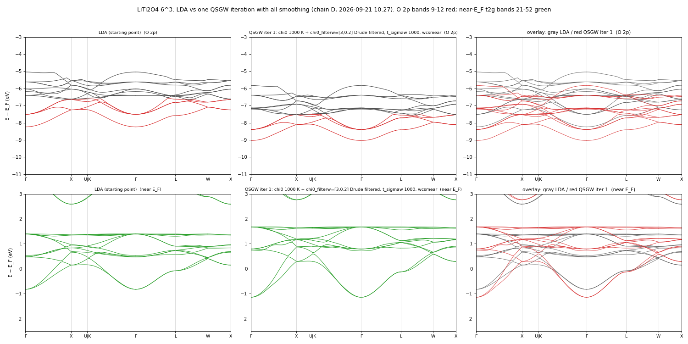

LDA（`rst.liti2o4.lda`、sigm 無しで job_band）と (D) の iter 1。全部入りの一発は滑らか。LDA に対して t2g 帯幅が
1.4 → 1.65 eV 上端、占有底 −0.85 → −1.15 eV と広がり（帯間遮蔽を抜いた分 Σx 的に広がる方向）、O 2p は 1 eV 下がる
（−7.5 → −8.4 底、−9.0 まで）。図: `LiTi2O4/plot_chainD_lda_vs_iter1.py`。

運用メモ: セッション内 cron（10 分）と ScheduleWakeup はこの環境では発火しなかった（05:50〜09:43 無音）ので削除。
以後の自律監視は「条件待ちの ssh をバックグラウンドに置き、完了通知で起きる」方式のみ。

### 2026-09-21 09:45 6³ QSGW 6 反復（chi0_filterw、Drude 残す）: 3 反復まで滑らか、4 反復目から E_F 近傍に凸凹（新型の荒れ）

kt1 `/mnt/data1/LiTi2O4_kbt_runs/n666_filterw2_drude_20260921`（06:02〜07:55、1 反復 18〜22 分）。LDA から、
`chi0_filterw=[2,0.1]`、`chi0_filterw_drude=true`、`t_tetrakbt=0`、`t_sigmaw=1000`、wcsmear 既定、mixbeta 既定（0.5）。
（cron は 05:50 以降発火せず、09:43 に手動で回収。）

| iter | O 2p 荒れ mean / max [meV] | O 2p 底 E(b9) [eV] | SEc ジャンプ > 1.5 eV（states 9–60, 832） | max \|dSEc\| |
|---|---|---|---|---|
| 1 | 6.9 / 8.6 | −8.73 | — | — |
| 2 | 6.5 / 8.6 | −9.00 | 2 | 2.77（Γ st50） |
| 3 | 6.5 / 7.4 | −9.35 | 0 | 1.17 |
| 4 | **17.9 / 20.4** | −9.94 | 3 | 2.18（Γ st10） |
| 5 | 14.6 / 17.4 | −9.64 | 8 | 2.48（Γ st11） |
| 6 | 12.9 / 17.1 | −9.51 | 0 | 1.17 |

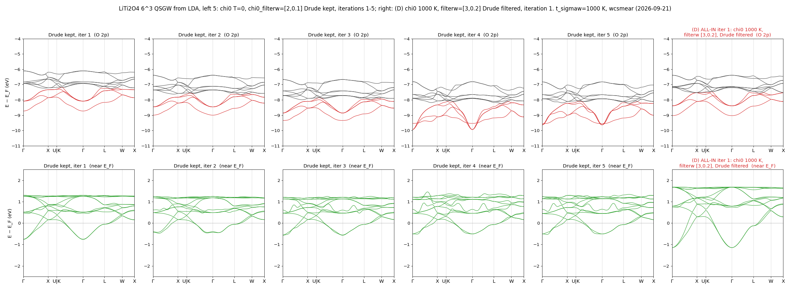

（左 5 枚: Drude 残しチェーン iter 1–5。右端: (D) 全部入り（χ₀ 1000 K、filterw [3,0.2]、Drude 落とす）の iter 1、10:40 差し替え。元の 6 枚版は `chain_666_filterw_iter1-6.png`。）

- 1〜3 反復は針も荒れも無く滑らか（wcsmear 単独の 7 meV 級）。O 2p の底は反復ごとに 0.3 eV ずつ下がり続ける（−8.7 → −9.9 → −9.5）。
- **4 反復目から E_F 直上（+0.5〜+1.3 eV）の t2g に小さな凸凹**（Γ 近傍、W–X）が現れ、O 2p の荒れも 18 meV に跳ねる。
  5〜6 で少し戻るが残る。プラズモン極の針（−3 eV）とは別物で、振幅 0.1〜0.2 eV、E_F の**上**の非占有 t2g。
- 解釈の候補: (a) 2 eV フィルタの縁。t2g の帯幅（占有底 −0.75 → 非占有上端 +1.3 eV、計 2 eV）が反復で広がり、
  t2g–t2g 帯間遷移が $w_c=2$ eV を跨ぎ始めると、その遷移が「入る／入らない」で W が反復ごとに変わる（フィルタの縁 0.1 eV は鋭い）。
  (b) Drude を残しているので $W_c$ にはプラズモンが（帯間遮蔽の無い分だけ高い ω に）残っており、それを踏む対がある。
  （6³ 固有の粗さは候補から外す — user 判断 09:50。1〜3 反復が滑らかなので説明にならない。）
- 対照 FILT2_NODRUDE（06:02 完了、一発）: 荒れ 7.0 / 9.1 meV、⟨48|Σ|33⟩ < 1.03、Drude を落とすと DRUDE 比で t2g +0.66、O 2p −0.45 eV
  さらに動く（静的金属遮蔽が消えた分）。

次（10:00〜、user 指示: 「いちばんスムーズになる可能性の高いもの」を先に）:
(D) `n666_filterw3_dw02_T1000_nodrude`: **χ₀ 1000 K（`t_tetrakbt=1000`）+ `chi0_filterw=[3,0.2]` + Drude も落とす +
`t_sigmaw=1000` + wcsmear**、6 反復、mixbeta 0.5。（A: wc=3/dw=0.3 Drude 残す、B: wc=2 NODRUDE、C: χ₀ 1000 K + wc=2 Drude 残す は
09:45〜09:59 に投入したが順序変更で中止・削除。）

### 2026-09-21 05:55 6³ 実験の状況（まとめ）

| run | 条件 | 状態 | 結果 |
|---|---|---|---|
| NEW20260920 | 1000 K（χ₀ も Σ も）+ wcsmear、今日の整合コード | 完了 22:48 | 昨日の wcsmear と一致（針なし、O 2p 7.2 meV） |
| FILT2_DRUDE | χ₀ T=0、`chi0_filterw=[2,0.1]`、Drude 残す、`t_sigmaw=1000`、wcsmear | 完了 23:57 | **針の震源消失**（⟨48\|Σ\|33⟩ < 1 eV）、O 2p 7.5 meV、t2g +0.7 / O 2p −0.25 eV の系統シフト |
| FILT2_NODRUDE | 同上、Drude も落とす | 05:39 再投入、走行中（~06:02） | 夜間の 1 回目は `--dumpW` の 46 GB で `/` 満杯 → hgw 落ち |

次の段: NODRUDE を見てから、6³ の QSGW を `chi0_filterw` 付きで数反復（`/mnt/data1/LiTi2O4_kbt_runs/`、dump 無し）→ 9³。

### 2026-09-21 05:50 FILT2_DRUDE（`chi0_filterw=[2,0.1]`、Drude 残す）: 針の震源が消え、O 2p は 0.76 eV 下がる

kt1 `oneshot1_666_skipq0_20260918/FILT2_DRUDE`（23:34〜23:57、21.9 分）。6³ 一発 LDA から、`t_tetrakbt = 0`（χ₀ は T=0）、
`t_sigmaw = 1000`、wcsmear 既定、`chi0_filterw = [2.0, 0.1]`、`chi0_filterw_drude = true`、`--gpu --mp --fp32`、mixbeta=1。
コード `cc9c914e2`。**事故**: `--dumpW` を付けたため `__WVR.*`（2.9 GB × 16 = 46 GB）で kt1 の `/` が 100 % になり
2 本目（FILT2_NODRUDE）が hgw で落ちた（00:05）。05:39 に dump を削除して `--dumpW` 無しで再投入。
教訓（メモにあったのに踏んだ）: kt1 の W dump は `/mnt/data1` に。ScheduleWakeup も夜間は発火しなかった。

| 6³ 一発 | REF（wcsmear なし） | NEW（1000 K + wcsmear） | **FILT2_DRUDE** |
|---|---|---|---|
| O 2p 荒れ mean / max [meV] | 12.2 / 13.6 | 7.2 / 10.9 | **7.5 / 8.9** |
| O 2p 底 E(b9) min [eV] | −8.18 | −8.48 | **−9.25** |
| ⟨48\|Σ\|33⟩ at q=(−⅙,⅙,⅙) [eV] | 6.69 | 2.18 | **< 1.05**（上位 5 に無い） |
| ⟨48\|Σ\|48⟩ [eV] | −19.41 | −22.09 | −22.77 |
| dSEnoZ の shift vs NEW: t2g（\|ε_LDA\|<1.5 eV, 192 状態） | | | 平均 **+0.70**（+0.31〜+1.03） |
| 同 O 2p（ε_LDA ∈ [−9, −4.5], 294 状態） | | | 平均 **−0.25**（−0.54〜+0.05） |
| 同 高い状態（ε_LDA > 3 eV, 1830） | | | 平均 +0.12（−0.68〜+1.18） |

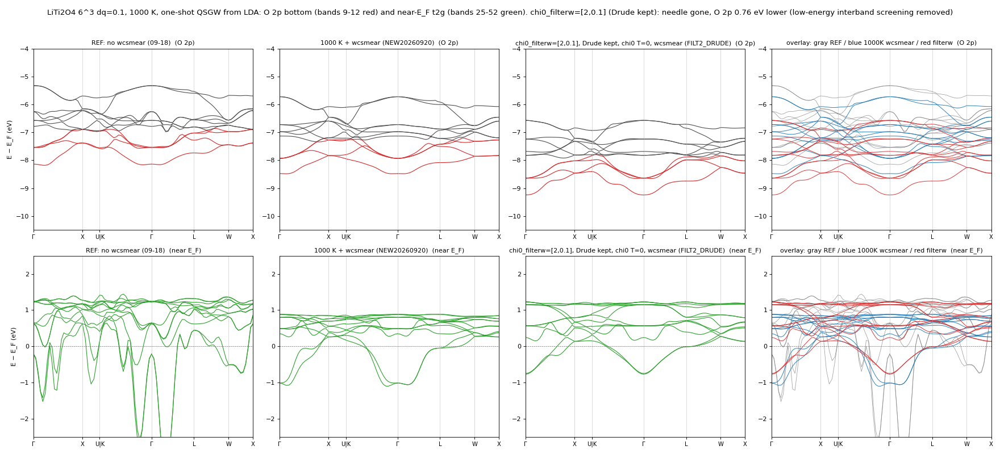

- **針の震源は消えた**: ⟨48|Σ|33⟩ が 6.69（REF）→ 2.18（wcsmear）→ 1 eV 未満。E_F 近傍のバンドは滑らか、O 2p の荒れは
  wcsmear と同程度（7.5 meV）。χ₀ は T=0 のままなので「温度で鈍らせる」必要が無くなった。
- **系統的なシフト**は予想どおり大きい: 2 eV 以下の帯間遮蔽が無い分、t2g は E_F に対して +0.7 eV（占有側の底が −1.05 → −0.75 eV、
  幅が縮む）、O 2p は −0.25〜−0.5 eV（底で −0.76 eV）。これが段階 2（フルスペクトル一発）で戻すべき量。
- Drude（帯内）を残しているので静的金属遮蔽はある。プラズモンは Drude 重みから残るはずだが、低エネルギー帯間が無い分だけ
  振動数が上がる／幅が変わる — W の頭は dump が消えたので未確認（次は `/mnt/data1` に dump）。

次: FILT2_NODRUDE（Drude も落とす）の対照（05:40〜）→ 6³ で QSGW 数反復（chi0_filterw 付き、mixbeta 既定）→ 収束傾向が良ければ 9³。

## 2026-09-20 — plan t_sigmaw の実装と chi0_filterw の準備

書き方: **新しいものが上**、時刻は JST。

### 2026-09-20 23:26 プラン chi0_filterw — 低エネルギー帯間遷移を抜いた W で QSGW、Drude（帯内）は残す、抜けた分はフルスペクトル一発で

（22:45 の「ω フィルタ＋静的置換」と 23:10 の「低エネルギー重み保存平滑化」は取り下げ。前者は
$W(\infty)\ne v$ で GW の高周波極限を壊す。後者は user 判断で不採用 — 誘電関数の計算と同様に
Drude（帯内）とそれ以外を**バンドで**分けるほうが明快。）

**キー**（隠し、実験用。2026-09-20 user 決定）

| キー | 既定 | 意味 |
|---|---|---|
| `chi0_filterw = [wc, dw]`（eV） | off | dpsion5 の Hilbert 変換の前に $\mathrm{Im}\chi_0(\omega)\to f_c(\omega)\,\mathrm{Im}\chi_0(\omega)$、$f_c=1/(1+e^{(w_c-|\omega|)/d_w})$。$w_c$ 以下の遷移を落とす。実軸の Re χ₀ と χ₀(iω) は同じ Im から作られるので W は整合したまま |
| `chi0_filterw_drude` | true | `chi0_filterw` の付属。true: 帯内（E_F を横切る同じバンドの占有部→非占有部）の遷移は**フィルタから外して残す**（Drude 重み・静的金属遮蔽を保持）。false: 帯内にもフィルタを掛ける（2 eV 以下は Drude ごと落ちる）。フィルタ無しでは無意味 |

帯内の判定は誘電関数の `--intrabandonly` / `--interbandonly` と同じ（tetwt5.f90: 四面体の 4 頂点で
$\varepsilon_{ib}=\varepsilon_{jb}$）。t2g 3 本が交差する四面体では帯内の一部が $ib\ne jb$ に漏れるが、それは
帯間としてフィルタに掛かる（小さい）。

**実装**（2 ヒストグラム）
1. tetwt5: 対ごとの帯内タグ `intra(ibib,k,jpm)` を m_tetwt から公開（判定式は既存の interbandonly と同一）。
2. x0kf_v4h: bin ごとの GEMM で、タグ付き対を第 2 ヒストグラム `rcxq_drude` に積む（メモリ ×2、GEMM 2 本。9³ でも +20 s 程度）。host / device（`x0kf_v4hz`）両経路。
3. dpsion5: `chi0_filterw` を `rcxq`（帯間）にだけ掛け、`rcxq_drude` を足し戻してから Hilbert 変換。`chi0_filterw_drude=false` なら足してから掛ける。host / device 両経路。
4. 検証: 既定で不変（Si 一発 PASSED）、`--intrabandonly` の χ₀ = `rcxq_drude`、6³ 一発。

**段階 1 の $W^{\rm hi}$ が持つもの**: Drude 重み（静的金属遮蔽、q→0 のプラズモン重みも）、2 eV 以上の帯間。
持たないもの: 2 eV 以下の t2g–t2g 帯間。プラズモンは Drude 重みから残るが、低エネルギー帯間が無い分だけ
振動数と幅が変わる — 針が消えるかはこれで決まる（消えなければ `chi0_filterw_drude=false` で Drude も落とし、
静的遮蔽は段階 2 に任せる）。

**2 段階の筋書き**
1. QSGW は $W^{\rm hi}$ で回す（Σ(ω) が準位間で滑らか → 静的化が安定）。
2. 収束した QSGW の固有系（rst + sigm）の上で、フィルタ無しの $W^{\rm full}$ で ω 依存の Σ を一発（`gw_lmfh`、Z 因子付き）。
   $E_{QP}=\varepsilon+Z[\Sigma^{\rm full}(\varepsilon)-V_{xc}^{\rm QSGW}]$ で、差が抜いた分の動的補正（サテライト・寿命込みで 1 次）。
   同じ E_F・同じ基底で。$w_c$ は「プラズモンより上・高い帯間より下」（LiTi₂O₄ は 2 eV、`--dumpW` で確認）。

**試験**（6³ 一発、LDA から、`t_tetrakbt = 0`、`t_sigmaw = 1000`、wcsmear 既定）: `chi0_filterw = [2, 0.1]`、
`chi0_filterw_drude` = true / false の 2 本。見るもの: 針（Γ–L band 33）、O 2p 荒れ、⟨48|Σc|33⟩、E_F 近傍対角のシフト、
`--dumpW` で第一殻 q の $W_c(\omega)$ の頭（極の位置・幅、$W_c(0)$）。対照: REF、NEW20260920（1000 K, wcsmear）。

**状態**: 23:26 実装開始。

### 2026-09-20 23:00 NEW20260920 — 今日の整合コードで昨日の 6³ 一発を再現（kt1、22:21〜22:48、26.7 分）

設定は昨日の OMP01/WCSMEAR と同じ（`t_tetrakbt = t_sigmaw = 1000`、wcsmear 既定 true、`--gpu --mp --fp32`、mixbeta=1、LDA から）。
`kt1 ~/LiTi2O4/kbt/runs/oneshot1_666_skipq0_20260918/NEW20260920`。

| 6³ 一発 from LDA, 1000 K | REF（wcsmear なし） | OMP01/WCSMEAR（昨日） | NEW（今日） |
|---|---|---|---|
| O 2p 荒れ mean / max [meV] | 12.2 / 13.6 | 7.2 / 10.5 | 7.2 / 10.9 |
| ⟨48\|Σ\|33⟩ at q=(−⅙,⅙,⅙) [eV] | 6.69 | 2.18 | 2.18 |
| ⟨48\|Σ\|48⟩ [eV] | −19.41 | −22.05 | −22.09 |
| eQP 差 vs OMP01（2544 状態） | | | max 0.113（Γ の低い状態）、平均 0.012 |
| eQP 差 vs OMP01（\|eQP\|<1 eV、112 状態） | | | max 0.086、平均 0.034 |
| eQP 差 vs REF | | | max 2.68（state 48）、平均 0.047 |

- SEx は完全一致。SEc の差（平均 12 meV、E_F 近傍 34 meV）が「虚軸側 Gaussian σ=0.01 Ry vs FD kBT=0.0063 Ry」の
  不整合の実測値。予想どおり $W_c(0)$ が乗る対角の近傍項にだけ現れ、非対角と針の消失は不変。
- 昨日の結論（第一殻 q のプラズモン極が震源、wcsmear で針が消え O 2p 荒れ 12 → 7 meV、残る限界は極を挟む対の非対角）は
  今日のコードでも成立。

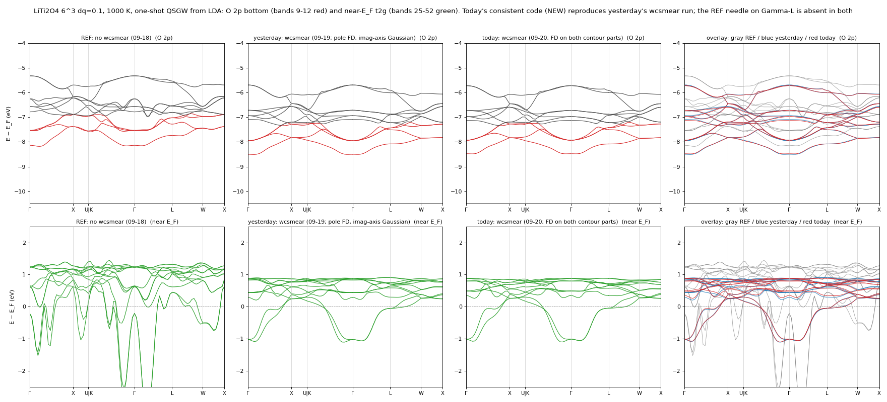

上段 O 2p の底（bands 9–12 赤）、下段 E_F 近傍 t2g（bands 25–52 緑）、右列は重ね描き（灰 REF、青 昨日、赤 今日）。
青と赤は線の太さの中で重なる。REF の Γ–L・Γ–X の針（−2 eV 超）は両方に無い。
図: `LiTi2O4/plot_oneshot_666_compare.py`（band ファイルは kt1 の各 run の `band/bnd0*.spin1`）。

### 2026-09-20 13:10 修正点の数式メモ — Σc の contour 分解と準位 smearing の整合

**鋭い準位の式**(PRB 76, 165106 Eq. 57–58 の骨格)。中間準位 $\varepsilon'$、$w_e \equiv (\omega-\varepsilon')/2$(Hartree)、
$W_c(i\omega')$ を虚軸上で持つとき、

$$
\Sigma_c^{(\varepsilon')}(\omega) = \underbrace{-\frac{1}{\pi}\int_0^\infty d\omega'\,
\frac{w_e\,W_c(i\omega')}{w_e^2+\omega'^2}}_{\text{虚軸積分 } I(w_e)}
\;+\;\underbrace{\theta\bigl[(\varepsilon'-\omega)(\varepsilon'-E_F)<0\bigr]\,s\,W_c(|w_e|)}_{\text{実軸極項 } P(w_e)}
$$

($s=\pm1$ は $\omega\gtrless E_F$、$W_c(\omega)$ は実軸)。$w_e\to0$ で $I \to -\tfrac12\,\mathrm{sign}(w_e)\,W_c(0)$ の**段差**があり、
極項の窓の縁($\varepsilon'=\omega$)の段差 $0\to W_c(0)$ と打ち消して和は連続。コードは $W_c(i\omega')\simeq W_c(0)e^{-(u_a\omega')^2}$
で分けて、この段差を解析的に $-\tfrac12\mathrm{sign}(w_e)\,e^{a^2}\mathrm{erfc}(a)$、$a=u_a|w_e|$ と書く(`wintz_npm`、m_sxcf_sc の core 分岐)。

**旧コード(esmr 時代)の価電子準位の式**は、この被積分関数から 2 次元 Gaussian の一片を落としたもの:

$$
\frac{w_e}{w_e^2+\omega'^2}\;\to\;\frac{w_e\,\bigl(1-e^{-(w_e^2+\omega'^2)/2\sigma^2}\bigr)}{w_e^2+\omega'^2},\qquad \sigma=\texttt{esmr}/2\ [\mathrm{Ha}]
$$

落とした分の解析積分が $+\tfrac12\mathrm{sign}(w_e)e^{a^2}\mathrm{erfc}\!\bigl(\sqrt{a^2+w_e^2/2\sigma^2}\bigr)$ で、
$u_a\to0$ なら $-\tfrac12\mathrm{sign}(w_e) + \tfrac12\mathrm{sign}(w_e)\mathrm{erfc}(|w_e|/\sqrt2\sigma) = -\tfrac12\,\mathrm{erf}(w_e/\sqrt2\sigma)$。
つまり**虚軸側の段差を Gaussian(std $\sigma$)で均した**ものになっている。極項側は重み
$\Phi_G(\varepsilon'-\omega)$(Gaussian の累積、同じ $\sigma$)で均していたから、両側が同じ核で整合し
「Gaussian で均した準位の $\Sigma_c$」を計算していた(§3 の Eq. (1))。**`sig` は数値正則化ではなく準位 smearing そのもの。**

**今回やったこと**(極項の核を FD にしたら虚軸側が Gaussian のまま → 段差の不一致 $[\Phi_{FD}-\Phi_G](\varepsilon'-\omega)\times|M|^2W_c(0)$)。
準位を FD 核 $g(x)=-\partial f/\partial x$(幅 $k_BT$ = `t_sigmaw`)で均した $\Sigma_c$ を、**両側とも**

$$
\bar\Sigma_c(\omega)=\int dx\,g(x)\,\Sigma_c^{(\varepsilon'+x)}(\omega)
= \int dx\,g(x)\,I\!\Bigl(\tfrac{\omega-\varepsilon'-x}{2}\Bigr) + \int dx\,g(x)\,P\!\Bigl(\tfrac{\omega-\varepsilon'-x}{2}\Bigr)
$$

と平均する。第 2 項が `wcsmear`(極項の窓重み $\Phi_{FD}$ と $W_c$ の核積分)。第 1 項は鋭い式 $I$ を使い、
不連続な $-\tfrac12\mathrm{sign}(w_e)$ だけ解析的に

$$
\int dx\,g(x)\,\Bigl[-\tfrac12\mathrm{sign}(\omega-\varepsilon'-x)\Bigr] = -\tfrac12\bigl[2\Phi_{FD}(\omega-\varepsilon')-1\bigr],
\qquad \Phi_{FD}(y)=\frac{1}{1+e^{-y/k_BT}}
$$

残り(連続: $-\tfrac12\mathrm{sign}(w_e)(e^{a^2}\mathrm{erfc}(a)-1)$ と数値部 $-\tfrac1\pi\sum_i \dots$)は
$x_j = k_BT\ln\frac{u_j}{1-u_j}$、$u_j=(j-\tfrac12)/40$ の中点則(FD 累積が測度)で平均。
$|\omega-\varepsilon'|>30\,k_BT$ の準位は被積分関数が滑らかなので鋭い式を 1 点で使う。
これで `sig` は消え、虚軸+極項 = 「FD で均した準位の $\Sigma_c$」。一発 GW の `wintzsg_npm` も同じ。

**検証** (NiO 2³、L 点 O 2s 対、SEc [eV]): 参照(Gaussian 0.003 Ry) 10.523/10.541 → FD 262 K, wcsmear=false で
10.523/10.541(3 桁一致、QSGW 固有値も一致)、wcsmear=true で 30/262/473 K が 10.495/10.503/10.510(幅にほぼ依らない)。
修正前は 9.909/10.992(262 K)、9.724/11.423(473 K)。

**注意点**: (1) 極項の $W_c$ を 1 点で拾う `wcsmear=false` では第 2 項の平均が「重みだけ平均、位置は平均エネルギー」に
なるので厳密な核平均ではない(差は $O(k_BT^2 W_c'')$)。(2) $W_c(i\omega')\simeq W_c(0)e^{-(u_a\omega')^2}$ の分離と
niw 点の Gauss–Legendre の精度は従来どおり。(3) コスト: 対あたり 40×niw の scalar 演算(CPU 側、GPU 転送前)。

### 2026-09-20 12:58 kBT/Fe サンプル再生成 — 旧 t_sigmakbt=3000 K の「2 eV」は不整合込みだった

`dd46030cb` (gfortran, 16 rank) で `Samples/kBT/Fe` の 2 run を回し直し `results/` を更新。
旧結果との dSEnoZ 差: 262 K 側 (旧 t_sigmakbt=0) max 0.22 / 平均 0.09 eV (E_F が EFERMI → EFERMI_kbt、wcsmear)、
3000 K 側 max 1.6 / 平均 0.25 eV。3000 K 側の大差は 12:17 の不整合 (極項 FD、虚軸 Gaussian esmr=0.003 Ry ≪ kBT=0.019 Ry)
そのもの。整合した現在のコードでは 262 K vs 3000 K が max 0.15 / 平均 0.06 eV で、Σ 側の温度の効果は
6 月の「2 eV」より一桁小さい。README に注記 (本文の数字は旧のまま、図も旧)。kBT.md §9 の 1 (300 K で
0.12 eV 動く) も同じ不整合を含んでいた可能性が高い → 要再評価。

### 2026-09-20 12:17 プラン t_sigmaw 実装中に見つかった不整合: Σc 虚軸積分の準位 smearing は Gaussian のままだった

**症状** (11:45〜12:10、gfortran、TestInstall nio_gwsc 2³): 極項の核を FD (`t_sigmaw = 262 K` = 旧 esmr 0.003 Ry
と同じ std) にしただけで、L 点の O 2s 対 (LDA で 70 meV 差) の SEc が 10.52/10.54 → 9.91/10.99 eV
(±0.6 eV、反相関)、QSGW 固有値で 0.47 eV。幅依存が強い: 30/100/150/262/473 K で state 1 の SEc =
10.54/10.48/10.31/9.91/9.72 eV。一方、核を Gaussian に戻した対照 run (σ = 0.003 Ry) は参照と 3 桁一致
→ 新コードの経路自体は正しく、核の**形**だけの問題。Si は 0.08 eV、Fe は 0.23 eV (max) の差。

**原因**: m_sxcf_sc の虚軸積分 (PRB 76, 165106 Eq. 57) の価電子準位の式は、鋭い準位の式から
2 次元 Gaussian の一片 `exp(-(ω'²+we²)/sig²)/(ω'²+we²)` を落としたもので (sig = esmr/2 [Ha])、その一片は
we = (ω−ε')/2 = 0 の半留数の段差 sign(we)/2 を Gaussian(σ = esmr) で均す = **esmr 時代の準位 smearing
そのもの**。極項の段差 (窓の重み 0 → 1) を Gaussian で均していたから両者が打ち消していた。
極項だけ FD にすると、ω の数 kBT 以内の準位 (O 2s の相方) で
(Φ_FD − Φ_Gauss)(ω−ε') × |M|² W_c(k, 0) が残り、|M|² W_c(0) は O 2s 同士で 10〜20 eV 級 (q→0 頭)。

**修正** (12:10、m_sxcf_sc CorrelationSelfEnergyImagAxis): 鋭い準位の式 (従来 core 準位用の分岐
`cons = 1/(we²x²+(1−x)²)`、解析部 −sign(we)/2·e^{aw²}erfc(aw)) を全準位に使い、ω の 30 kBT 以内の
価電子準位は FD 核で平均: e = ε' + kBT ln(u/(1−u))、u = (j−½)/40。不連続な sign(we)/2 は解析的に
−(2Φ_FD(ω−ε')−1)/2、滑らかな残り (−sign(we)/2·(e^{aw²}erfc(aw)−1) と数値部) は求積。
`sig` は消滅。これで 虚軸 + 極項 = 「FD で均した準位の Σc」(wcsmear の極項側と同じ核) になる。
中間案 (Gaussian 正則化のまま FD 平均) は FD⊛Gaussian の段差になり ±0.2 eV が残った。

| NiO 2³, L 点 O 2s state 1 / 2 の SEc [eV] | 参照 (Gaussian 0.003 Ry) | 修正前 FD 262 K | 修正後 262 K, wcsmear=false | 修正後 wcsmear=true 30 / 262 / 473 K |
|---|---|---|---|---|
| | 10.523 / 10.541 | 9.909 / 10.992 | **10.523 / 10.541** (固有値も一致) | 10.495 / 10.503 / 10.510 ; 10.524 / 10.528 / 10.533 |

wcsmear=true で Ni d (E_F 上) の QSGW 固有値が 0.15〜0.2 eV 動く (−0.2684 → −0.2572 Ry) のは
2³ の W_c が Landau 減衰の無い離散極の集まりで、1 点内挿と核平均が本質的に違うため (粗いメッシュの性質)。
コスト: 求積は (itp, it) 対あたり 40×niw の scalar 演算、CPU 側、9³ LiTi2O4 でも rank あたり数秒。
残: 一発 GW (sxcf_fal2 / hsfp0) の虚軸積分も同じ構造 → 同じ修正が要る (プラン step 3)。

### 2026-09-20 12:00 プラン t_sigmaw 完了後の `[gw]` の温度・smearing キー（オプション表）

| キー | 単位 | 既定 | 効く場所 | 意味 |
|---|---|---|---|---|
| `t_tetrakbt` | K | **0**（T=0、鋭い θ） | χ₀（hx0fp0 / hgw の W-build） | >0 で χ₀ の占有を Fermi–Dirac にし（`lindtet6_kbt`、GL20）、`heftet` が μ(T) を `EFERMI_kbt` に書く。**物理の温度**。金属で W の鋭い極を鈍らせたいときに使う。コスト: tetwt5 が数倍。 |
| `t_sigmaw` | K | **1000**（従来 esmr = 0.01 Ry ≈ 900 K 相当） | Σ（hsfp0_sc / hgw の Σc、hsfp0 の Σx、一発 GW） | 中間準位の占有核 Fermi–Dirac の幅（数値的な幅。フルの有限温度 Σ ではない）。E_F は `t_tetrakbt>0` なら `EFERMI_kbt`、0 なら `EFERMI`。 |
| `wcsmear` | 論理 | **true** | Σc の実軸極項 | 極の位置にも同じ核を使い W_c を積分（false: 従来の平均エネルギー 1 点 + 3 点内挿）。 |
| `SmearX0` | Ha | 0（off） | χ₀ の ω 方向 | Im χ₀ の Gaussian 平滑化。通常不要。 |
| `chi0_skip_window` | eV [emin, emax] | 未設定（off） | χ₀ | 両端が窓内の遷移を χ₀ から除く（cRPA 風）。実装済み・未コミット・未テスト。 |
| （廃止）`esmr` | Ry | — | — | Gaussian 幅。`t_sigmaw` に置換。残っていれば警告して無視。 |
| （廃止）`t_sigmakbt` | K | — | — | `t_sigmaw` に改名。残っていれば警告して写す。 |
| （廃止済）`tetrakbt`, `GaussSmear`, `delta`, `dw`, `omg_c`, `WgtQ0P`, `SmearX0q0` | | | | 2026-09-19 に削除。 |

追記（12:15、user）: `t_sigmaw` は物質で変える物理的なキー（金属は k メッシュと合わせて 300〜1000 K、
絶縁体は既定で可）。W 側の `t_tetrakbt > 0` と `SmearX0 > 0` は**排他**（同時指定はエラー）:
極を鈍らせるのは温度（物理）か ω 平滑化（現象論）のどちらか一つ。`chi0_skip_window` は「極の源を除く」
別軸なので当面は併用可。

χ₀ を有限温度既定にしない理由: Σ 側の「T=0」は元々 esmr の幅を持っていたので FD 核への置換は
幅の形の変更に過ぎないが、χ₀ 側の T=0 は本当に鋭い θ で、温度を入れると物理（帯内遷移の重み、
μ(T)、ギャップ端）が変わり、絶縁体の参照も動き、tetwt5 のコストも数倍になる。χ₀ の温度は
「その温度の物理」を計算する意図のパラメタで、数値安定化の道具とは性格が違う。

### 2026-09-20 11:45 プラン t_sigmaw: Σ 側の smearing を `t_sigmaw`（K）一本に、`wcsmear` を標準に、esmr 廃止（user 合意）

方針
- Σ 側の準位の幅は常に Fermi–Dirac 核。キーは **`t_sigmaw`**（K; 「フルの有限温度 Σ ではない」ので
  `t_sigmakbt` を改名）。既定 **1000 K**（従来 esmr = 0.01 Ry ≈ 900 K 相当）。`esmr` と Gaussian 経路
  （`wcdf` の erfc、`weavx2` の Gaussian 式、`sig_window` の 10 esmr、`wfacx` 系）は削除。
- Fermi 準位: `t_tetrakbt > 0`（χ₀ も有限温度）なら `EFERMI_kbt`（両側同じ μ(T)）、
  `t_tetrakbt = 0` なら `EFERMI`（T=0 の値）のまま核だけ FD。今の「EFERMI_kbt が無ければ警告して
  T=0 に落ちる」は廃止。
- 極の位置は `wcsmear = true` を既定（従来の 1 点内挿は `wcsmear = false` で残す）。
- 一発 GW 経路（hsfp0 / sxcf_fal2、`gw_lmfh`）も同じ核・同じ wcsmear に揃える。
- コスト: 実軸極項が増える（6³ +7 %、9³ +26 %; T=0 相当の 1000 K 核なら裾 15 kBT = 1.3 eV）。
  必要なら裾を 10 kBT に。

手順（コミット単位）
1. `t_sigmaw` キー（既定 1000）、`t_sigmakbt` は読めば警告して `t_sigmaw` に写す。E_F の分岐。
   `t_tetrakbt > 0` と `SmearX0 > 0` の同時指定は m_GWinput で rx（排他）。
   `esmr` 経路の削除（読めば「廃止」警告）。`wcsmear` 既定 true。gwinit テンプレ・toml_comments・
   gwinput2toml・Samples の ctrlg（esmr 行削除、t_sigmakbt → t_sigmaw）。
2. TestInstall 全 GW 系（si_gwsc, gas_gwsc, gas_gwsc666, fe_gwsc, nio_gwsc, nio_gwsc444, pdo_gwsc443,
   si_gw_lmfh, gas_pw_gw_lmfh, gas_epsPP_lmfh, gas_eps_lmfh, fe_epsPP_lmfh_chipm, cugase2, yh3fcc,
   srvo3_crpa, ni_crpa …）で旧参照との差を数値化 → 表にして参照更新（絶縁体はほぼ不変、金属は
   数十 meV の見込み）。kBT/Fe, kBT/LiTi2O4 の参照も。
3. 一発 GW 経路（sxcf_fal2）に FD 核 + wcsmear。si_gw_lmfh, gas_pw_gw_lmfh で確認。
4. 文書: ecaljdoc gwinput.md（esmr 削除、t_sigmaw, wcsmear）、kBT.md §0/§3/§3.5、lmf.md、
   Changes.txt、HIGHLIGHTS。
5. kt1 nvfortran で TestInstall --all（GPU）。

### 2026-09-20 11:20 メモ: 極項で $W_c$ を拾う位置 — 従来（1 点）と `wcsmear`（核で積分）

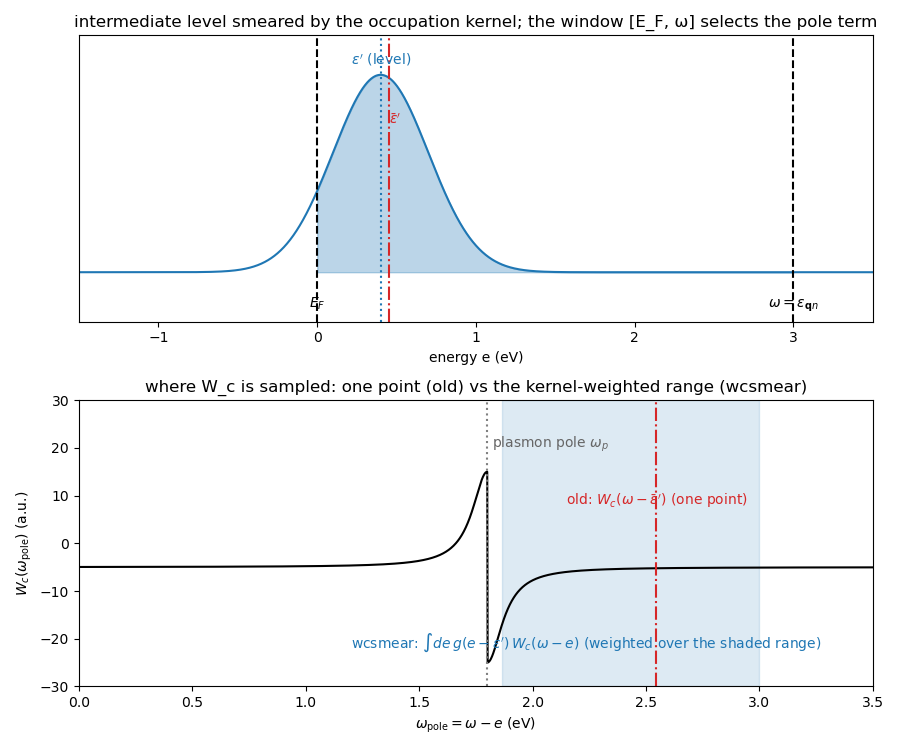

**記号の定義**

- 外部状態: $\Sigma_{nn''}(\mathbf q,\omega)$ の行列要素を作る 2 状態 $|\mathbf q n\rangle$, $|\mathbf q n''\rangle$。
  QSGW では行 $n$ を $\omega=\varepsilon_{\mathbf q n}$（その状態の固有値）で評価する（下の式の $\omega$）。
- 中間状態: 極項の和に入る $|\mathbf q-\mathbf k, n'\rangle$。その固有値を
  $\varepsilon' \equiv \varepsilon_{\mathbf q-\mathbf k,n'}$ と書く（コードの `sxs_ekc(it)`）。
- 占有核 $g(x)$: 中間準位を「鋭い 1 本」ではなく幅を持つ分布として扱うための規格化された釣鐘型関数
  （$\int g\,dx=1$）。コードの `wfacx2` / `wcdf` が使う核で、
  - T=0（`t_sigmakbt = 0`）: Gaussian $g(x)=\dfrac{e^{-x^2/2\sigma^2}}{\sqrt{2\pi}\,\sigma}$、$\sigma$ = `esmr`（0.01 Ry = 0.136 eV）。
  - `t_sigmakbt > 0`: Fermi–Dirac 分布 $f(x)=1/(e^{x/k_BT}+1)$ の微分 $g(x)=-\dfrac{\partial f}{\partial x}=\dfrac{f(1-f)}{k_BT}$、幅 ≈ $k_BT$。
  その累積 $\Phi(x)=\int_{-\infty}^{x}g$（Gaussian なら $\tfrac12\mathrm{erfc}(-x/\sqrt2\sigma)$、FD なら $1-f(x)$… 符号の向きはコードの `wcdf` に合わせる）。
- 準位の分布 $A(e)=g(e-\varepsilon')$: 中間準位 $\varepsilon'$ を中心に幅 $\sigma$ または $k_BT$ で広げたスペクトル関数。
- 窓: contour 変形で極項に入るのは、中間準位が $E_F$ と $\omega$ の**間**にあるときだけ。
  $e_l=\min(E_F,\omega)$, $e_h=\max(E_F,\omega)$ とし、窓 $[e_l,e_h]$ に入った $A$ の面積が
  $$w_{n'}=\int_{e_l}^{e_h}A(e)\,de=\Phi(e_h-\varepsilon')-\Phi(e_l-\varepsilon')\in[0,1]\quad(\texttt{wfacx2})$$
  で、これが「その中間準位が極項にどれだけ入るか」の重み（窓の内側深くなら 1、外なら 0、縁で分数）。
- 平均位置 $\bar\varepsilon'$: 窓に入った部分の重心
  $$\bar\varepsilon'=\frac{1}{w_{n'}}\int_{e_l}^{e_h}e\,A(e)\,de\quad(\texttt{weavx2})$$
  窓の内側深くなら $\bar\varepsilon'\simeq\varepsilon'$、縁に近いと窓の内側へ寄る。
- 極の位置 $\omega_{\rm pole}=\omega-e$: 中間準位が $e$ にあるとき極項が $W_c$ を拾う振動数
  （コードでは Ry → Hartree の換算で $\tfrac12|\omega-e|$）。

上図の網掛けは $A(e)$ のうち窓 $[E_F,\omega]$ に入った部分（面積 $w_{n'}$）、赤い一点鎖線が $\bar\varepsilon'$。

**従来（Eq. 58）**: 重み $w_{n'}$ と平均 $\bar\varepsilon'$ だけを使い、$W_c$ は
$\omega_{\rm pole}=\omega-\bar\varepsilon'$ の **1 点**で評価（下図の赤い一点鎖線）:
$$\Sigma^{\rm pole}_{nn''}\ni s\,M^*_{n'n}\; w\; W_c(\mathbf k,\ \omega-\bar\varepsilon')\; M_{n'n''}.$$

**`wcsmear`**: 同じ分布で $W_c$ 側を積分（下図の網掛け範囲を $g$ で重み付け）:
$$\Sigma^{\rm pole}_{nn''}\ni s\,M^*_{n'n}\left[\int_{E_F}^{\omega}de\; g(e-\varepsilon')\,W_c(\mathbf k,\ \omega-e)\right] M_{n'n''}.$$

$W_c$ が分布の幅で滑らかなら両者は一致。プラズモン極（下図 $\omega_p$、幅 0.1 eV）が
$\omega-\bar\varepsilon'$ の近くにあると、従来は極のどちら側に落ちるかで ±数十 a.u. 振れ、`wcsmear` は
極を幅 $\sigma$（≈0.14 eV）〜 kBT で均した値になる。ただし極が分布の**外**（窓の中だが $A$ が小さい
所）にあれば両者とも極を拾わず、極が 2 準位 $\varepsilon_i,\varepsilon_j$ の**間**にある非対角
$\tfrac12[\Sigma(\varepsilon_i)+\Sigma(\varepsilon_j)]_{ij}$ はどちらの方法でも救えない（10:30 の結論）。
実装は `pole_weights`（m_sxcf_sc）: 従来は 3 点内挿の重み、`wcsmear` は $W_c$ メッシュのセルごとに
$\Phi(b-\varepsilon')-\Phi(a-\varepsilon')$ を重みとして配る（`wgtiw`）。

### 2026-09-20 11:00 T=0 / 有限温度の整理表を kBT.md §0 に（ecaljdoc `35b04fe`）

χ₀ 側（占有 θ / FD-GL20、E_F、SmearX0、chi0_skip_window）と Σ 側（E_F、占有核 Gaussian esmr / FD kBT、
極の位置の評価 ω̄ / wcsmear、候補窓 10 esmr / 15 kBT、共通部）の表。要点: 温度は 2 キー独立で実用は
同じ T、esmr は T=0 専用（有限温度では読まれない）、wcsmear は温度スイッチではない。
`chi0_skip_window = [emin, emax]`（両端が窓内の対を χ₀ から除く、cRPA 風）は実装・ビルド済みだが
未コミット・未テスト（user の「まず整理」指示で保留）。

### 2026-09-20 10:30 結論（user と合意）: 残る針は静的 QSGW の適用限界

- `t_sigmakbt` の Σ 側有限温度は「Fermi 準位 μ(T)、占有核 FD（幅 kBT）、候補窓・ω 余裕」の 3 点だけが
  T=0 と違い、極の位置の評価法や W_c は同じ。
- 反復 2 で残った E_F 近傍の針は、E_F 直下の準位（33）と +3 eV の準位（45）の**間にプラズモン極が
  挟まる**対の非対角。QSGW は Σ_ij を ½[Σ(ε_i)+Σ(ε_j)] で作るので、Σ(ω) が急変する区間を
  跨ぐ対では Σ(ε_i) と Σ(ε_j) が別物になり、非対角が評価点の差の産物になる。wcsmear は極を
  「跨いで拾う」状態（O 2p）の荒れは均せるが、離れた 2 準位の間に極が挟まる非対角は消せない。
  RPA の W_c に減衰の無い鋭い極がある以上、**静的 QSGW の枠内では避けられない**。
- 選択肢は全部「近似の追加」: (B) 遠い対の非対角に減衰係数（hqpe_sc、ad hoc）、T を上げる
  （1500 K 以上で極が Landau 減衰）、W に寿命を入れる。`iSigMode` は現行では読まれるだけで
  mode B（平均エネルギー評価）は消えている。
- 整理: wcsmear は正当な改良として残す（O 2p、一発目の針）。1000 K 以下の LiTi2O4 は静的 QSGW の
  適用限界にあり、E_F 近傍の針は方法の限界として記録。対照ラン NOWCS_iter2 は user 指示で停止
  （10:05）。kt1 は空き。

### 2026-09-20 09:40 対照ランはディスク満杯で落ちた → 投げ直し; 大きな一時ファイルは /mnt/data1 へ

`NOWCS_iter2 --dumpW` が `__WVR.33` 書き込み中に "No space left"（kt1 の / は 94 %、6³ DUMPW の
49 GB + 9³ の 2.9 GB/q）。ダンプを削除して 60 GB 空け、`--dumpW` 無しで 09:21 に投げ直し（11:40 ごろ）。
以後、W のダンプ等の大物は **/mnt/data1（3.5 TB、1.6 TB 空き、user 許可）** の
`/mnt/data1/LiTi2O4_kbt_runs/` に置く。
band 図 `LiTi2O4/plots/wcsmear_iter2_999.png`: 従来 iter 2 / wcsmear iter 1 / wcsmear iter 2
（混合 0.5）/ 同 混合なし（WIN9）。wcsmear は iter 1 の針を消すが iter 2 で E_F 近傍に針を作り、
混合なしでは −2.6 eV まで育つ。O 2p は滑らかなまま。

### 2026-09-20 08:05 窓修正は Σ を変えず（9³ iter 2）; +7 eV は wcsmear 側で生じている → 対照ランを投入

- WIN9_iter2（窓修正版、wcs iter 1 の状態から mixbeta=1）: QPU の SEc は修正前チェーンの iter 2 と
  **全状態で 0.000 eV 差**（違うのは --ntqxx の詰め物だけ）。1000 K・9³ では E_F±0.14 eV と ±1.3 eV
  の間に落ちる中間状態の寄与が無視できる大きさだった（Fe 3000 K では効いた）。窓の不整合は
  直したが、**今回の針の原因ではない**。
- WIN9_iter2 の band は mixbeta=1 なので針が −0.90 → **−2.63 eV** と深まる（Σ₂ を混ぜずに全量当てる）。
  O 2p 荒れ 12.3 / 16.8。
- 同じ q=(−1/3,1/3,1) の ⟨45|Σc(ε₄₅)|33⟩: wcsmear 有りの Σ₂ = **+7.01**、wcsmear 無しの repro
  チェーン Σ₃（別状態だが近い）= **−0.28**。→ この要素は wcsmear の枝で生じている。
  row 45（ω = ε₄₅ = +3 eV）は中間状態 it = 33〜44（e′ = 0.1〜1.0 eV）で W_c(ω = 2〜2.9 eV) を拾い、
  反復後の W_c はそこに構造（一発の ε(ω) で 2.1〜2.3 eV に Re ε 零点）を持つ。wcsmear の核で
  均しても正の値が残るなら物理（RPA+QSGW の限界）、無しで −0.28 なら scheme の欠陥。
- 08:05 対照ラン `NOWCS_iter2`（同じ iter 1 状態、wcsmear=false、`--dumpW` で反復後の W_c も保存、
  2.3 h）。判定: (a) ⟨45|Σc|33⟩ が −0.3 級なら wcsmear の枝を疑う（実装再点検 or scheme 見直し）、
  (b) 同程度に大きければ W_c 自体の問題（W_c(q, 2〜3 eV) を dumpW で見る）。

### 2026-09-20 05:30 真犯人候補: Σ 側の状態窓が `10·esmr` のまま（FD の裾より狭い）→ 修正・投入

（user との議論）核の幅は問題ではない。`t_sigmakbt > 0` でも中間状態の候補窓 `sxs_nt0m..nt0p`
= E_F ± 10·esmr（0.14 eV）が esmr のままで、FD の裾（±15 kBT = 1.3 eV）にある部分占有状態が
候補から**丸ごと落ちる**（kBT.md §7.3 の既知の未修正項）。準位が 0.14 eV の境界をまたぐたびに
寄与が不連続に出入りする = wcsmear の有無によらないシーソー。同じ窓は `sxcf_scz_count` の
バッチ設計と `getwemax` の ω 範囲にも使われていた。
修正 `899ce008d`: `sig_window(esmr)` = 10 esmr（T=0）/ 15 kBT（FD）を 3 箇所で使う。
`sigmakbt_setup` を count と周波数メッシュより前に（hsfp0_sc, hgw, hx0fp0）。T=0 は不変
（si_gwsc, fe_gwsc, gas_epsPP PASSED）。kBT/Fe 3000 K は E_F+0.14 eV より上の部分占有状態が
交換項に入るようになり Σ−v_xc 最大 1.5 eV、SEc 最大 0.2 eV 変化 → 参照更新。
05:29 9³: wcsmear チェーンの iter 1 状態から窓修正版で 1 反復（`oneshot3_999_T1000_20260919/WIN9_iter2`、
mixbeta=1）。比較: 修正前の同じ 1 反復は band 33 が −0.90（針、荒れ 47 meV）。

### 2026-09-20 05:10 wcsmear チェーン iter 1・2: O 2p は良いが **E_F 近傍に針が戻った**（iter 2）

| | 従来 iter 1 / 2 / 3 | wcsmear iter 1 / 2 |
|---|---|---|
| O 2p 荒れ（平均 / 最大 meV） | 8.1/11.5, 8.9/10.8, 25.4/32.4 | 7.4/10.4, **8.8/12.4** |
| band 33 の荒れ（E_F 近傍） | 10.6（iter 2）, 7.9（iter 3） | **47.4**（iter 2） |
| band 33 の底 | −0.55 | **−0.90**（Γ–X, K–Γ, W 付近に針） |

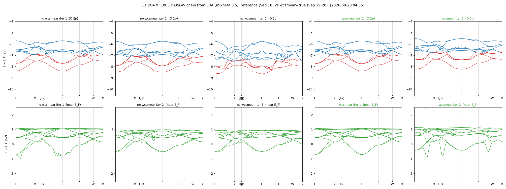

iter 2 の SEBK を見ると、band 33（E_F 直下の t2g）と **+3 eV の st 45/46** の非対角が
⟨45|Σc(ε₄₅)|33⟩ = +7.0 eV（逆向きは 0.03）など、6³ 一発で見た「33–48」型が別の状態対で再発。
（05:30 訂正、user 指摘）幅 0.3 eV の核で幅 0.1 eV の極を畳めば寄与は滑らかになり、数十 meV の
固有値移動でシーソーにはならないはず。だから iter 2 の +7 eV は「核が足りない」ではなく、
**反復後の W_c に一発目とは別の（もっと広いか、3〜4 eV 域の）構造**があって st 45/46 の窓
（3 eV）がそれを踏んでいる、と考えるべき（一発の ε(ω) では 2.1〜2.3 と 3.8 eV にも Re ε 零点）。
確認: iter 2 の状態から `--dumpW` 付きで 1 反復し、W_c(q, ω=2〜4 eV) を見る。
チェーンは 05:20 に停止（user 指示、iter 3 途中）。

## 2026-09-18 〜 09-19 — 9³ 1000 K の O 2p の荒れの原因調査

### 2026-09-19 23:15 高速化は一区切り（atomic 版は効かず）、9³ 1000 K wcsmear チェーン投入

6³ の壁時計（`e0f1b61c7` のタイマー、rank 0、q ごと）:

| | 1 スレッド | 30 スレッド |
|---|---|---|
| tetwt5 四面体ループ（job=1） | 38 s | 42〜57 s |
| 同（job=0） | 0.75 s | 3〜12 s |
| gwsc 全体 | 1588 s | 1838 s |

→ tetwt5 の時間はほぼ全部この四面体ループだが、`!$omp atomic` の競合（whw への要素加算が
q あたり数千万回、30 スレッドが同じキャッシュラインを取り合う）で**並列化しても速くならない**。
直すならスレッド私的な whw/iwgt/demin/demax に蓄積して最後に集約（6³ で 130 MB/スレッド、
9³ で 450 MB/スレッド → 8〜16 スレッドが上限）。効果は 9³ で反復 −30 分程度の見込み。
**user 判断で高速化はここで一区切り**（既定 `omp_tetwt=0` なら従来と同一）。他の候補は 21:30 の表。

23:15 **9³ 1000 K `wcsmear=true` チェーン投入**: kt1 `n999_dq0.1_T1000K_wcsmear_20260919/`
（LDA から 8 反復、mixbeta=0.5、dq=0.1、GPU 2 枚、2.6 h/反復 → 20 日夕方完了）。判定: 6 月の
iter 6 / 17 型の事故反復が出ず、O 2p の荒れが 10 meV 台に留まるか。その後 T=0 の比較を GPU で 1 本ずつ。

### 2026-09-19 21:15 高速化 step 1（tetwt5 の OpenMP）実装・検証、9³ で実測中

- `3a0a563d0`: tetwt5x_dtet4 の四面体ループを `!$omp parallel do`（loop 変数は private、共有への
  書き込み iwgt/demin/demax（job=0）と whw（job=1）は atomic）に。intttvc6 の暗黙 SAVE な
  `www(1:4)=.25d0` を明示初期化。フラグ無しなら従来と bitwise 同一（回帰 PASSED）。
- `5107c0f44`: CMake で tetwt5.f90 だけ OpenMP（-fopenmp / -qopenmp / -mp）、`[gw] omp_tetwt`
  （0 = OMP_NUM_THREADS のまま）を `num_threads` 節でこのループだけに適用。
  最初 `omp_set_num_threads` でプロセス全体に効かせたら MKL も 8 スレッドになり CPU hgw が
  32 → 43 s に遅くなったので節に変更（30.6 s、1 スレッドの 32.4 s と同等以上）。
- 数値: GaAs ε（1 vs 8 スレッド）差 1e-13、Fe 5³ SEc 差 0.00 eV。TestInstall gas_epsPP_lmfh,
  si_gwsc, fe_epsPP_lmfh_chipm, fe_gwsc PASSED。
- kt1 で 9³ iter 2→3（wcsmear、`omp_tetwt=30`、GPU 2 枚、GPU 稼働率 10 s ごと記録）を 21:13 投入
  （`oneshot3_999_T1000_20260919/WCS9_OMP30/`）。比較対象 WCS9（同条件、OpenMP 無し）: 9209 s。
  期待: tetwt5 128 → 5〜10 s/q で 1 反復 −25 %。

**T=0 チェーン（CPU）の状況**: T0_ref は 17:30 から iter 1 の hgw 中（30 CPU ランク、q 1/16 …
CPU hgw は 9³ GPU の 10 倍遅い）。**T0_wcs は 18:42 に hgw が SIGBUS（`__c_mcopy16_avx`）で落ちた**。
/dev/shm（126 GB）に CPU hgw 2 本 × 30 ランクの W 共有窓 + GPU 9³ の分が同居して枯渇したもの
（MPI_Win_allocate_shared は tmpfs 上、書き込み時に不足で SIGBUS）。昨夜の 2 本同居 segfault
（`__c_mcopy8`）も同じ原因の可能性が高い → **hgw は 1 ノード 1 本**（または shm 使用量の事前チェック）
が運用ルール。T0 の比較は GPU で 1 本ずつやり直す。

### 2026-09-19 18:30 WCS9_LDA（9³ LDA からの一発、`--wcsmear`、1000 K）

10831 s（CPU チェーン 2 本と同居のため遅い）。再現チェーンの iter 1（従来）との比較:

| | 従来 iter 1 | `--wcsmear` |
|---|---|---|
| O 2p 荒れ（平均 / 最大 meV） | 8.1 / 11.5 | **7.5 / 10.7** |
| Γ–L band 33 の底 | −0.75（K–Γ で −1.02） | −0.68 |
| E_F 近傍の最大差（band 30〜44） | — | 0.2〜0.4 eV（針の解消と、band 44 の 1.03 → 0.75 など） |

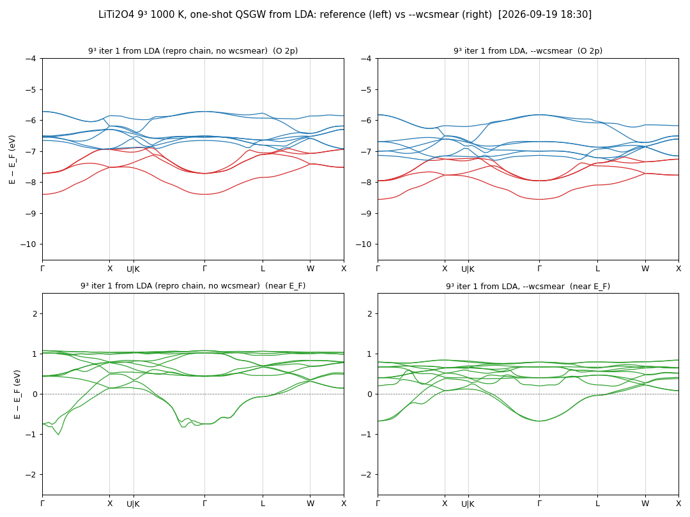

→ 9³ の一発では針は元々小さく（6³ の −1.9〜−3.4 eV に対し −1.0）、`wcsmear` で消える。
O 2p の 7.5〜8 meV は 9³ の地の粗さ（極とは無関係）。9³ の効果は一発より反復（48 → 13 meV）で大きい。

### 2026-09-19 17:20 hgw の並列効率の計測（9³ 1000 K, -np2 2, GPU 2 枚）

WCS9_LDA の rank 0 のログを q ごとに分解（壁時計、秒）:

| 段 | 何をしているか | 時間/q | どこで |
|---|---|---|---|
| **tetwt5**（四面体重み、有限温度 GL20 込み） | `tetwt5_dtet3` → `tetwt5x_dtet4` | **≈ 128 s** | **CPU 1 コア逐次** |
| χ₀（zmel + x0 gemm） | `x0kf_v4hz` | ≈ 21 s | GPU |
| dpsion → W → llw（matinv 10 s 込み） | | ≈ 18 s | GPU/CPU |
| Σc（`wcsmear=true`） | `sxcf_correlation_step_kx` | 75〜630 s（平均 ≈ 320） | GPU |

- W-build 167 s のうち **77 % が tetwt5**。18 q × 167 s ≈ 50 分/反復が W-build、そのうち 38 分が
  四面体の逐次計算。Σc は 18 q × 320 s ≈ 96 分。合計 ≈ 2.4 h/反復（GPU 2 枚交互のため実効は
  各 GPU 50 % 程度）。
- 2 ランクなので同時に走る tetwt5 は 2 本 = 64 コアのうち 2 コア。**tetwt5 を OpenMP 化して
  1 ランクあたり 30 コア使えば W-build は ≈ 45 s/q → 反復あたり 35 分短縮（−25 %）**。
  さらに W-build と Σc を別ランクで重ねれば GPU の稼働率も上がる。
- 6³ では tetwt5 は 216 四面体 × 6 なので 9³ の 1/3.4、Σc も軽く、同じ比率。
- 9³ チェーン（2）はこの改修（tetwt5 の OpenMP）を入れてから投げる（user 指示）。

### 2026-09-19 17:00 `wcsmear` の概念整理と注意点（user と合意）

概念: contour の縁（E_F と ω）は鋭いまま。esmr で均すのは G の極の位置で、準位を
スペクトル関数 $A(e)=g(e-\varepsilon')$ を持つものとして扱う。スペクトル関数を持つ G の極項は

$$\Sigma^{\rm pole}(\omega)=\sum_{n'}\int de\,A_{n'}(e)\,[\theta(e-E_F)\theta(\omega-e)-\theta(E_F-e)\theta(e-\omega)]\,W_c(\omega-e)$$

で、これが `wcsmear` の式そのもの（重み $w_{n'}=\int_{窓}A$ は自動的に出る）。従来は同じ A を
θ の重みには使いながら $W_c$ には $\delta(e-\bar\varepsilon')$ を当てていた = 1 つの G に 2 つの
スペクトル関数。$W_c$ が A の幅で線形なら一致、プラズモン極で破綻。

注意点:
1. **T=0**: 一貫している。ただし虚軸積分側は sharp な極のままで、A の適用は極項だけ（従来と同じ、
   被積分関数が e について滑らかなので実害は小）。
2. **有限温度**: 厳密な contour 変形は準位を鋭いまま θ → f にするだけで、極の位置は温度で広がらない。
   FD の −f′ を位置の分布に使うのは**発見的な正則化**（導出ではない）。厳密版が極踏みで壊れる
   以上、実用上はこれで良く、正しい幅は本来 k 積分（四面体版）から出る。文書にそう書く。
3. **実装範囲**: 直したのは QSGW 経路（hsfp0_sc / hgw、m_sxcf_sc）だけ。一発 GW の hsfp0
   （sxcf_fal2.f90、gw_lmfh の QPE）の極項は未修正 → 金属で gw_lmfh を使うなら同じ差し替えが要る（TODO）。

SmearX0 について: 6 月に 2000〜3000 K の K–Γ キンク安定化で系列を試した形跡はあるが結論は未記録
（`smear_conv_result.txt` は空）。Im χ₀ を均すので W_c の極を W 側から鈍らせる = `wcsmear` と同じ極を
別経路で扱う。要否は 6³ 1000 K 一発 (a) SmearX0=0.005 Ha のみ (b) + wcsmear で判定できる（CPU で可）。

### 2026-09-19 16:10 整理を実装・テスト・文書化（ecalj `db6845639`, ecaljdoc `3bd0c43`）

- `[gw] wcsmear = true/false`（既定 false）が `--wcsmear` を置換。核の裾は FD 15 kBT / Gaussian 5σ。
- `tetrakbt` 廃止 → `t_tetrakbt > 0`（既定 0）。`GaussSmear, delta, dw, omg_c, WgtQ0P, SmearX0q0`
  と `GaussianFilterX0` の abort を削除。`SmearX0` は明示キーとして残す。Samples の ctrlg 89 本を掃除。
- 診断 `--skipq0Sc / --skipRaxisSc / ECALJ_SKIPKXSC` は `!diag` で見え消し。
- 回帰（ローカル gfortran, wcsmear=false）: si_gwsc, gas_epsPP_lmfh, fe_gwsc, si_gw_lmfh, nio_gwsc, na
  全 PASSED。kBT/Fe 3000 K 一発は `t_tetrakbt` だけで参照 QPU と完全一致。
- ecaljdoc: kBT.md に §3.5（正体と wcsmear）、gwinput.md の SmearX0/esmr/wcsmear、lmf.md、samples.md。
- kt1 を同じ main に更新・nvfortran 再ビルド（16:04）。次: WCS9_LDA の結果 → 9³ 1000 K
  `wcsmear=true` チェーン。

### 2026-09-19 15:20 WCS9（9³ iter 2→3、`--wcsmear`）: 荒れ 47.8 → 12.7 meV、シーソー停止

| | iter 2（出発） | REF9（iter 3, 混合なし） | **WCS9（iter 3, --wcsmear）** |
|---|---|---|---|
| O 2p 荒れ（平均 / 最大 meV） | 8.9 / 10.8 | 47.8 / 56.1 | **12.7 / 16.0** |
| 所要時間 | — | 7313 s | 9209 s（+26 %） |

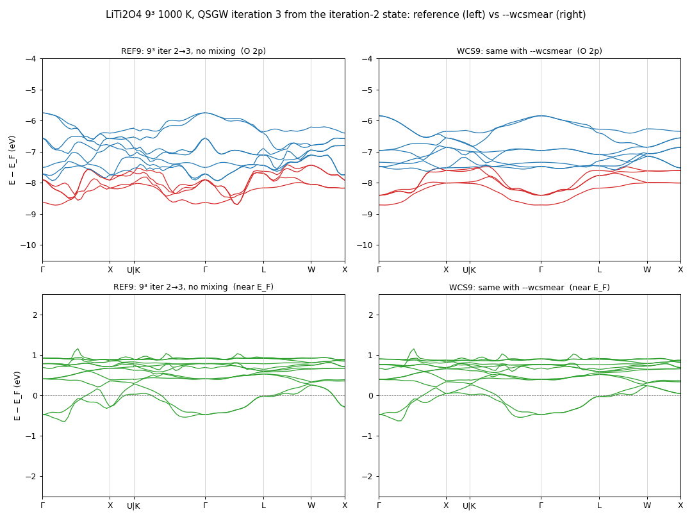

（左 REF9、右 WCS9。上 O 2p、下 E_F 近傍。右は O 2p の波が消え、E_F 近傍の小さなこぶ
（X, L の +1 eV）も弱まる。）
→ 9³ でも 1 反復で荒れが iter 2 並みに戻る。残るのは (1) 多反復チェーンで事故反復が出ないこと、
(2) 実装の整理（パラメタを ctrlg [gw] へ、死んだキーの掃除、コスト削減、hgw の GPU 効率）。
9³ の +26 % は実軸極項の gemm 列数が核幅ぶん増えるため。裾の打ち切り（30 kBT → 15 kBT）で半減見込み。

### 2026-09-19 13:10 REF9（9³ iter 2→3、混合なし）: 荒れ 47.8 / 56.1 meV

`oneshot3_999_T1000_20260919/REF9`（7313 s）。チェーンの iter 3（25.4 meV）は mixbeta=0.5 で
半分に薄まっていただけで、生の Σ(3) は QPU が完全一致（差 0.000）。WCS9 は 12:38 開始。

### 2026-09-19 12:50 `--wcsmear` の数式

外部状態 $|\mathbf{q}n\rangle$（エネルギー $\varepsilon_{\mathbf{q}n}$）、中間状態
$|\mathbf{q}-\mathbf{k},n'\rangle$（$\varepsilon' \equiv \varepsilon_{\mathbf{q}-\mathbf{k},n'}$）、
$W_c = W - v$、$M_{n'n}(\mathbf{k}) = \langle \mathbf{q}-\mathbf{k}\,n'|\,M_\mu(\mathbf{k})\,|\mathbf{q}n\rangle$
（積基底 $\mu$ は以下で縮約）。contour 変形（PRB 76, 165106 Eq. 55）で

$$
\Sigma^c_{nn''}(\mathbf{q},\omega)=\Sigma^{\rm imag}_{nn''}(\mathbf{q},\omega)
+\Sigma^{\rm pole}_{nn''}(\mathbf{q},\omega),\qquad
\Sigma^{\rm pole}_{nn''}(\mathbf{q},\omega)=
\sum_{\mathbf{k}n'} s(\omega)\, M^{*}_{n'n}(\mathbf{k})\,
\bigl[\theta(\varepsilon'-E_F)\theta(\omega-\varepsilon')-\theta(E_F-\varepsilon')\theta(\varepsilon'-\omega)\bigr]\,
W_c(\mathbf{k},\,\omega-\varepsilon')\,M_{n'n''}(\mathbf{k}),
$$

すなわち $\varepsilon'$ が $E_F$ と $\omega$ の間にある中間状態だけが、極の位置
$\omega-\varepsilon'$ で $W_c$ を拾う（$s=\pm1$ は $\omega \gtrless E_F$ の符号、$\omega=\varepsilon_{\mathbf{q}n}$ で評価）。

**中間準位の smearing（従来）**: 核 $g(x)$ とその累積 $\Phi(x)=\int_{-\infty}^{x}g$ を

$$
g_{\rm Gauss}(x)=\frac{e^{-x^2/2\sigma^2}}{\sqrt{2\pi}\,\sigma}\ (\sigma=\texttt{esmr},\ T=0),\qquad
g_{\rm FD}(x)=-\frac{\partial f}{\partial x}=\frac{1}{k_BT}\,f(x)\,[1-f(x)]\ (\texttt{t\_sigmakbt})
$$

として、窓 $[e_l,e_h]=[\min(\omega,E_F),\max(\omega,E_F)]$ に対し重みと平均エネルギーを

$$
w_{n'}=\int_{e_l}^{e_h}\! de\; g(e-\varepsilon')=\Phi(e_h-\varepsilon')-\Phi(e_l-\varepsilon')\quad(\texttt{wfacx2}),\qquad
\bar\varepsilon'=\frac{1}{w_{n'}}\int_{e_l}^{e_h}\! de\; e\, g(e-\varepsilon')\quad(\texttt{weavx2})
$$

で作り、$W_c$ は 1 点で評価していた（Eq. 58）:

$$
\Sigma^{\rm pole,\,old}_{nn''}=\sum_{\mathbf{k}n'} s\,M^{*}_{n'n}\; w_{n'}\; W_c(\mathbf{k},\,\omega-\bar\varepsilon')\;M_{n'n''}.
$$

**`--wcsmear`**: 同じ核で $W_c$ 側を積分する。

$$
\Sigma^{\rm pole,\,new}_{nn''}=\sum_{\mathbf{k}n'} s\,M^{*}_{n'n}
\left[\int_{e_l}^{e_h}\! de\; g(e-\varepsilon')\,W_c(\mathbf{k},\,\omega-e)\right] M_{n'n''}.
$$

$W_c$ が核の幅の中で線形なら old と一致し（重み $\int g = w_{n'}$ は同じ）、幅 0.1 eV の
プラズモン極のように核より細い構造は核の幅（$\sigma$ または $\sim k_BT$）で均される。
実装（`wcsmear_weights`）は $W_c$ の実軸メッシュ点 $\omega_i$（セル $[\omega_i^-,\omega_i^+]$）ごとに
$e=\omega\mp2\omega_i$（Hartree 換算）で対応する $e$ 区間 $[a_i,b_i]$ を窓に切り詰め、

$$
w_{n'i}=\Phi(b_i-\varepsilon')-\Phi(a_i-\varepsilon'),\qquad \sum_i w_{n'i}=w_{n'}
$$

を `wgtiw` に配る（従来の 3 点 Lagrange 重みの代わり）。核の裾は $|e-\varepsilon'|\le 6\sigma$
または $30\,k_BT$ で打ち切り（`wcut`）。芯準位（esmr=0）は従来経路。

**k 積分としての意味**: 本来 $\sum_{\mathbf{k}}\to\int d^3k$ で、重み $\theta(\cdot)$ も極の位置
$\omega-\varepsilon'(\mathbf{k})$ も同じ $\varepsilon'(\mathbf{k})$ の関数。メッシュ化で $\varepsilon'$ を
分布 $g$ に置き換えるなら、重みと位置の両方に同じ $g$ を使うのが一貫した離散化（old は重みだけ）。

### 2026-09-19 12:20 反復のシーソー機構（user との合意事項）

1. 極項は各 (k, n′) の項で W_c(k, ε)、ε = ε_{qn} − ε_{q−k,n′} を 1 点評価。第一殻 k の W_c は
   ω_p ≈ 1.78 eV に幅 0.1 eV の極（Re が 0.05 eV で −54 → +4）。
2. 反復ごとに固有値が数十〜百 meV 動くので、ε が極の近くにある対は反復のたびに極の反対側へ
   渡り、寄与が ±50 a.u. で符号反転。窓が広い状態（O 2p、+3.7 eV の st 46〜51）の Σc が eV 単位で
   跳ぶ → 固有値が動く → 別の対が渡る、のシーソー。
3. 多くの対が同時に渡る反復が「壊れた反復」（SEc ±50 eV）、次で大半が戻る。9³ では mixsigma の
   履歴に半分残って荒れが居座った。一発目の針は同じ機構の非対角版。T ≥ 1500 K で極が減衰。
4. `--wcsmear` では各対の寄与が ε の滑らかな関数（幅 ≈ kBT で均した W_c）になり、シーソーが
   止まるはず → 9³ の iter 2→3（REF9 / WCS9）で確認中。

### 2026-09-19 12:00 `--wcsmear` の根拠の整理（議論）、コスト、四面体版の見積もり

- **根拠**: 極項は本来 k 積分 Σ_{n′}∫d³k f-window(ε_a(k)) ⟨…⟩ W_c(k, ε_{qn} − ε_a(k)) ⟨…⟩ で、
  重み f(ε_a(k)) と極の位置 ε_{qn} − ε_a(k) は同じ変数の関数。離散化で重みだけを核
  （esmr の Gaussian、有限温度なら FD）で均し、位置を点のままにするのは一貫しない。同じ核で
  両方を扱うのが k 積分の離散化として自然（user 合意）。「θ → f に変えるだけ」の有限温度化も
  同じ意味で不十分だった。
- **コスト**（6³, GPU 2 枚, rank 0）: 実軸極項 44 → 293 s（×6.7）、Σc 合計 358 → 616 s、
  gwsc 全体 1571 → 1674 s（**+7 %**）。核の裾（`wcut` = 30 kBT / 6 esmr）を絞れば半減可。許容範囲（user）。
- **正攻法（四面体版）**: 極項の重みを χ₀ と同じ `lindtet6`（ea = ε_{q−k,n′} の 4 隅、eb ≡ ε_{qn}、
  efermia = ε_{qn} と E_F の差）で作る。lindtet6 呼び出し ≈ 1e8/ip、全体 2e9（hx0fp0 の χ₀ 並み）、
  ip ごとに全 kr の重みを事前計算して ~1 GB/ip。実装 1〜2 週間。smearing 版で足りるなら将来課題。

### 2026-09-19 10:45 `--wcsmear` の対角への影響の内訳と、9³ 反復テスト投入

対角 SEc（REF vs `--wcsmear`、6³ 全 16 q）:

| 状態群 | n | 平均 \|ΔSEc\| | >0.2 eV | >0.5 eV | 最大 |
|---|---|---|---|---|---|
| O 2s / Ti 3p（st<9） | 128 | 0.003 eV | 0 | 0 | 0.01 |
| O 2p（9〜24） | 256 | 0.029 | 0 | 0 | 0.19 |
| t2g/eg（25〜52） | 448 | 0.063 | 35 | **15** | **2.64** |
| 上の非占有（53〜100） | 768 | 0.033 | 9 | 0 | 0.46 |

>0.5 eV の 15 件は全部 e0 ≈ +3.5〜3.8 eV（st 46〜51）= 極項の窓が t2g プラズモンを跨ぐ状態
そのもの。例 (−1/6,1/6,1/6) st48: −3.22 → −5.86（Γ の正常値 −6.0 に揃う）。変化は「病的な値が
周囲の正常値に戻る」方向で、占有帯・高い状態は 0.03 eV 以下。

10:34 9³ 反復テスト投入: kt1 `runs/oneshot3_999_T1000_20260919/{REF9,WCS9}`、`repro/band/iter2/` の
状態から mixbeta=1 で 1 反復（= iter 3）、なし → あり を逐次（各 ≈2 h）。指標は O 2p 荒れ
（チェーンの iter 3 は 25.4 meV、混合込み）。

### 2026-09-19 10:35 `--wcsmear` の結果: 針が消え、O 2p も REF より滑らか

6³ 1000 K 一発（`oneshot1_666_skipq0_20260918/WCSMEAR/`, 1674 s）:

| | REF | `--wcsmear` | 参考 2000 K |
|---|---|---|---|
| ⟨48\|Σc(ε₄₈)\|33⟩ | −13.19 | **−4.31** | −1.92 |
| エルミート化後 33–48 | 6.81 | **2.31** | 1.09 |
| Σc₄₈,₄₈ | −3.22 | **−5.86** | −6.21（正常値） |
| Γ–L の band 33 | −3.40 の針 | **滑らか**（−1.03 → −0.05 単調） | 滑らか |
| O 2p 荒れ（平均 / 最大 meV） | 12.2 / 13.6 | **7.2 / 10.5** | 11.3 / 14.0 |
| 対角 SEc の変化（state 9〜52） | — | 平均 0.05 eV、最大 2.6（病的だった state 48 系） | |

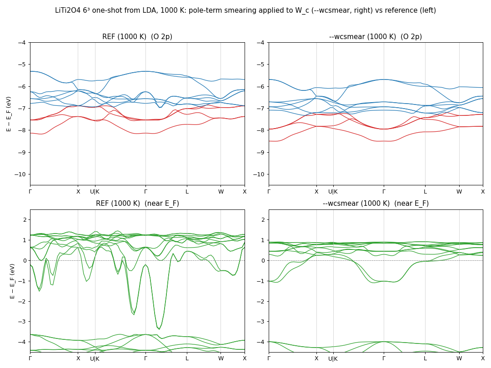

（左 REF、右 `--wcsmear`。下段: E_F 近傍の針（Γ–L, K–Γ, X, W）が全部消え、t2g が素直な分散に。
上段: O 2p も滑らか。）
→ 一発目については解決。残る確認: (1) 9³ の反復で荒れ（iter 3 で 25 meV、事故反復）が
消えるか（`band/iter2/` からの 1 反復、または LDA から 3〜4 反復のチェーン）、(2) T=0 の
通常の QSGW（Si, GaAs, Fe など TestInstall）で参照値がどれだけ動くか（Si は最大 77 meV、
高い状態のみ）、(3) 既定にするかどうか。

### 2026-09-19 09:55 解決策 (D) を `--wcsmear` として実装、6³ 一発を投入

`6d4cee007`: 極項で、中間状態の smearing（Gaussian esmr / FD kBT）を ω̄_ε 1 点の 3 点 Lagrange
ではなく **W_c(ω) のメッシュ点に核を積分した重み**として配る（`wcsmear_weights`、和は wfacx2 と
一致、極が無ければ実質不変）。新パラメタ無し。
- ローカル Si 一発 GW（極なし）: あり／なしで SEc 差 平均 14 meV、最大 77 meV（+10〜15 eV の
  高い状態、Si のプラズモン 17 eV 付近）。低い状態はそれ以下。
- kt1 `oneshot1_666_skipq0_20260918/WCSMEAR/`（6³, 1000 K）投入 09:55。針・非対角・荒れを REF と比較。
- 07:30 dq について: Γ セルの W には 1.8 eV の極が無く、外しても不変だったので、dq 依存
  （6 月の「3000 K で dq 0.3 → 0.1 でスパイク消失」）は本質ではなく極踏みの当たり外れ。既定
  `Q0Pchoice=1` → dq=0.1。

### 2026-09-19 07:10 補足: 「実軸積分が問題か」への答え

「実軸積分」ではなく **実軸の極項**。ecalj の Σc（PRB 76, 165106 Eq. 55–58）は

Σc(ε) = [虚軸積分: W_c(iω) を積分、滑らか] + [極項: E_F と ε の間の中間状態 ε′ ごとに
W_c(ω_ε = ε − ε′) を**実軸で拾う**]

で、壊れているのは後者だけ（`--skipRaxisSc` で −13 → −0.35 eV、虚軸積分は無傷）。問題は 2 段:

1. **数値ではなく入力の問題**: 極項は W_c(ω) をヒストグラムのビンから拾うが、そのビン値自体が
   第一殻 q で ω_p = 1.78 eV の鋭い RPA プラズモン極（幅 0.1 eV、Re が隣のビンで −54 → +4）を
   持つ。ビン幅 0.05 eV は極を解像しており、極項はそれを「正しく」拾っている（2 点線形でも
   不変）。ω_ε が極の ±0.1 eV に落ちる (it, itp) 対が ±50 a.u. を受け取り、どの対が落ちるかは
   固有値の微妙な位置次第 → T・dq・反復で符号まで変わる。
2. **物理側**: 減衰のない RPA プラズモン（1000 K 以下では Landau 減衰が足りない）と、それを
   ω = ε₄₈（E_F+3.7 eV、プラズモンより上のサテライト領域）で off-shell に評価して ½(Σ+Σ†) にする
   QSGW の静的近似の組合せ。O 2p では窓 8 eV が 6.2 eV の帯間プラズモンも跨ぐ。

→ 直すべきは積分アルゴリズムではなく、極項に食わせる W_c(ω) の極の扱い（寿命 η (A)、
極近傍の解析処理 (D)）か、QSGW の非対角の作り方 (B)。

### 2026-09-19 06:45 朝の要約 — 特定完了、解決策の案

**特定されたこと**（すべて 6³ LDA からの一発、χ₀+Σ 同温度、mixbeta=1、kt1 `runs/oneshot1_666_skipq0_20260918/`）:

| 温度 | ⟨48\|Σc(ε₄₈)\|33⟩ (eV) | エルミート化後 | Σc₄₈,₄₈ | Γ–L の針（band 33 の底） | O 2p 荒れ |
|---|---|---|---|---|---|
| 500 K | **−27.1** | 13.9 | +0.9 | −2.48（O 2p の底も −11.5 まで壊れる） | 119 / 197 |
| 1000 K | −13.2 | 6.8 | −3.2 | −3.40 | 12.2 / 13.6 |
| 1500 K | −3.2 | 1.8 | −6.0 | −0.96 | 10.2 / 12.7 |
| 2000 K | −1.9 | 1.1 | −6.2（正常） | −0.73（針なし） | 11.3 / 14.0 |

1. 犯人は **Σc の実軸極項**（切ると −13 → −0.35）。虚軸積分・混合・offset-Γ の頭・ω 内挿法は無関係。
2. 極項が拾うのは **第一殻 q の W_c(q, ω) にある t2g プラズモン極（ω_p ≈ 1.78 eV、幅 ≈ 0.1 eV、
   Re が 1 ビンで −54 → +4）**。単一 q ではなく全 q の (it, itp) 対に散って同符号で積み上がる。
3. T で単調に消える（1500 K で概ね、2000 K で完全）: 極が熱的（Landau）に減衰するため。
4. 一発目の針は、この極項を ω = ε₄₈（E_F + 3.7 eV、プラズモンより上）で評価した Σc の非対角
   ⟨48|Σc(ε₄₈)|33⟩ が ½(Σ+Σ†) で 33–48 に入り準位反発を起こしたもの。対角は正常。
5. 9³ の反復での荒れ・壊れた反復も同じ極項が O 2p（窓 8 eV）で極を踏む現象（6.2 eV の
   帯間プラズモンも含む）。反復で固有値が動くたびに踏み方が変わる。

**解決策の案**（実装コスト順）:

- (A) **実軸 W_c にプラズモン寿命を入れる**: 極項で使う W_c(ω) を幅 η（0.2〜0.3 eV）の Lorentzian
  で畳む（hx0fp0 の出力段か hsfp0 の読込段、隠しオプション `wc_eta`）。RPA が持たない
  電子相関によるプラズモン減衰の現象論。±50 の振れが数分の一になり、符号反転の刃先が消える。
  一発 6³ で針、9³ チェーンで荒れを確認。**最初に試す価値が高い。**
- (B) **QSGW のエルミート化に窓**: |ε_i − ε_j| > ω_p の非対角 Σ_ij を滑らかに減衰させる
  （hqpe_sc の `se` 構築で係数 f(|ε_i−ε_j|)）。針は消えるが O 2p の対角の荒れは残る。ad hoc。
- (C) **χ₀ 側の温度だけ上げる**（t_tetrakbt=2000, t_sigmakbt=1000）: 極の減衰を温度で買う。
  6 月の 6³ run の見出し「t_sigmakbt=2000」はこれを試した痕跡かもしれない。物理を変える。
- (D) 極項の積分を解析的に（極の近傍で W_c を Lorentzian で当てはめて積分）: 正攻法だが工数大。
- 併せて: hgw が 2 本同居で `__c_mcopy8` segfault する潜在バグ（4 本同居時 1/4、2 本で 1/2 発生）。

**kt1 の状態**: GPU 空き。`oneshot1_666_skipq0_20260918/DUMPW/__WVR.*` が 2.9 GB × 17 = 49 GB
（要らなくなれば削除）。`~/LiTi2O4/kbt/runs/{o2p_rough,sec_jump,read_se2}.py` は Samples/kBT/LiTi2O4 にコピー済み。

### 2026-09-19 06:40 T1500: 1500 K で概ね消える

⟨48|Σc(ε₄₈)|33⟩ = −3.24、エルミート化後 1.76、Σc₄₈,₄₈ −6.00、針 −0.96 eV、荒れ 10.2 / 12.7。
（夜間キュー完了 06:36。）

### 2026-09-19 06:10 WVR2PT: ω 内挿を 2 点線形にしても変わらない

`--WVR2ptRaxis`: ⟨48|Σc(ε₄₈)|33⟩ = **−14.03**（3 点 Lagrange −13.19）、針 −3.53 eV、荒れ 11.8 / 13.1。
→ 内挿法の問題ではない。極（幅 0.1 eV、ビン幅 0.05 eV）はビンで解像されており、極項は
それを「正しく」積分している。**離散化の事故ではなく、減衰の無い鋭い RPA プラズモン
（1000 K 以下）と、それを ω = ε₄₈ で off-shell に評価して ½(Σ+Σ†) にする QSGW の組合せ**が
本体。

### 2026-09-19 05:45 T0500: 500 K で倍に悪化、O 2p の底まで壊れる

⟨48|Σc(ε₄₈)|33⟩ = **−27.14**（500 K）/ −13.19（1000 K）/ −1.92（2000 K）— T で単調。
エルミート化後 13.9、Σc₄₈,₄₈ = +0.86（符号まで狂う）。O 2p 荒れ **118.9 / 197.4 meV**、band 9 の底
−11.5 eV（1000 K: 12 meV、−8.2 eV）。一発目から O 2p も壊れている = 6 月の 9³ 反復で見た
「壊れた反復」の状態が 500 K では最初から出る。

### 2026-09-19 05:25 T2000: 2000 K では針も非対角も消える

同じ一発（χ₀+Σ とも 2000 K）: ⟨48|Σc(ε₄₈)|33⟩ = **−1.92**（1000 K: −13.19、Γ 点並み）、
エルミート化後 1.09（6.81）、Σc₄₈,₄₈ −6.21（−3.22; Γ の −6.7 と同水準 = 正常）。
Γ–L の band 33: −0.73 → −0.14 と滑らか（1000 K は −3.40 の針）。O 2p 荒れ 11.3 / 14.0。
→ 1000 K → 2000 K でプラズモン極が熱的に減衰し、実軸極項が極を踏まなくなる。6 月の
「2000 K 以上の run に事故なし」と一致。T0500 で逆方向（悪化）を確認中。

### 2026-09-19 05:10 DUMPW: 正体はプラズモン極 — 第一殻 q の W_c(ω) に幅 0.1 eV の t2g プラズモン極（直接証拠）。offset-Γ ではない

`--dumpW` の `__WVR.<iq>`（direct access、record = nblochpmx² complex(4)）から頭 (1,1) 成分を抜いた
（`LiTi2O4/wc_head_iq{1,2,3,5}.dat`）:

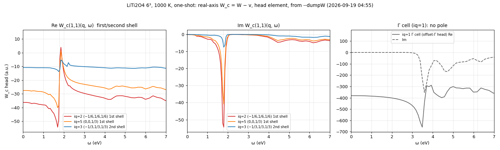

| ω (eV) | iq=2 (−1/6,1/6,1/6) Re / Im | iq=5 (0,0,1/3) Re / Im | iq=3 第二殻 | iq=1 Γ セル |
|---|---|---|---|---|
| 1.69 | −54 / −27 | −40 / −17 | −13 / −2 | −395 / −0.3 |
| 1.75 | −49 / **−52** | −39 / −33 | −14 / −3 | −396 |
| 1.80 | **−5 / −54** | −10 / −41 | −13 / −7 | −397 |
| 1.85 | **+4 / −21** | +1 / −17 | −5 / −6 | −398 |
| 2.03 | −17 / −1 | −14 / −1 | −9 | −403 |

- 第一殻 q で **ω_p ≈ 1.78 eV、幅 ≈ 0.1 eV の鋭い極**: Re が 1 ビン（0.05 eV）で −54 → +4、
  Im のピーク −54。第二殻では −14 → −5 に弱まる。
- Γ セル（offset-Γ の頭）は巨大（−400）だが 1.8 eV に極が無く滑らか（3.5 eV に幅の広い山）
  → `--skipq0Sc` で変わらなかった理由。
- 実軸極項は W_c(we) を ω² の 3 点 Lagrange で拾うので、we = |ε₄₈ − ε_it| が極の ±0.1 eV に
  落ちる (it, itp) 対が ±50 a.u. を受け取る。どの対が当たるかは固有値の微妙な位置次第
  → T・dq・反復で符号まで変わる。skip 1 q で 0.2 eV しか動かないのは、当たる対が
  全 q（各 q の中間状態 it の ε が異なる）に散らばっているから。

### 2026-09-19 04:35 SKIPKX5: (0,0,1/3) を外しても変わらない → 全 q に分散

⟨48|Σc(ε₄₈)|33⟩: REF −13.19 / SKIPQ0 −13.16 / SKIPKX2 −12.98 / **SKIPKX5 −13.04**。針 −3.65 eV。
1 つの q を外して動くのは 0.03〜0.2 eV。→ 単一の q の鋭い極ではなく、**全 q の W_c(q, ω≈2〜3.7 eV)
（t2g プラズモン〜その上）が state 48 の実軸極項の窓に入り、t2g 帯内の大きな行列要素を通じて
同符号で積み上がる**。対角 Σc₄₈,₄₈ (−3.2) の 4 倍の非対角になるのは、中間状態 it が t2g で
⟨it|M|33⟩ ≫ ⟨it|M|48⟩ だから。
この見方だと「バグ」ではなく、**プラズモン (≈2 eV) より離れた 2 状態 (33: −0.6, 48: +3.7 eV) の間の
Σ_ij を ½[Σ(ε_i)+Σ(ε_j)] でエルミート化する QSGW の静的近似の限界**（Σ(ω) がプラズモン
サテライト領域で急変）の可能性が高い。T 依存は t2g プラズモンの熱的減衰で説明できる。
T2000/T0500 と DUMPW で確認。

### 2026-09-19 04:10 SKIPKX2: 第一殻 q=(−1/6,1/6,1/6) の W を外しても変わらない

`ECALJ_SKIPKXSC="2"`（kx=2 の W を Σc から外す）: ⟨48|Σc(ε₄₈)|33⟩ = −13.19 → **−12.98**、
エルミート化後 6.81 → 6.70、Γ–L の針 −3.40 → −3.82（対角の一様シフト分）。O 2p 荒れ 12.0 / 13.6。
（Σc₃₃ が −1.55 → −1.92 と動いているので skip 自体は効いている。skip のメッセージは ipr の
関係で stdout に出ない。）
→ Γ セルでも第一殻 1 つでもない。**多数の q に分散した寄与**が同じ符号で積み上がっている
（t2g プラズモン 1.8〜2.3 eV は帯内集団モードで q 分散が弱く、全 q の W_c(q, ω≈2 eV) が
state 48 の窓に入る、という絵と整合）。単一の鋭い極というより「ω ≈ 1.8〜3.7 eV の W_c を
実軸極項がどう拾うか」の問題。SKIPKX5（(0,0,1/3)）と T スキャンで裏取り。

### 2026-09-19 03:50 `--skipRaxisSc`: 異常な非対角は実軸極項が作っている（確定）

SKIPRAXIS（実軸極項を切り虚軸積分だけ）の SEC2U at (−1/6,1/6,1/6):

| | REF | --skipRaxisSc |
|---|---|---|
| ⟨48\|Σc(ε₄₈)\|33⟩ | −13.19 | **−0.35** |
| エルミート化後の最大非対角（row 33） | 6.81 (j=48) | 0.53 (j=28) |
| Σc₃₃,₃₃ / Σc₄₈,₄₈ | −1.55 / −3.22 | −5.58 / +2.36（虚軸だけなので非物理） |

→ 非対角の暴れは **Σc の実軸極項**（W_c(q, ω) を ω_ε で拾う項）だけから来る。虚軸積分は無関係。
注意: このケースは Σ が非物理なので lmf が収束せず（sev −380 → −920 eV）、gwsc の
b=0.1 → 0.05 再試行で 4 時間止まっていた（03:45 に kill、キューは SKIPKX2 へ）。band は無し。
→ 23:40 の統一像のうち「実軸極項」の部分は確定。残るは「どの q の W か」（SKIPKX2/5）と
「極の鋭さの T 依存」（T2000/T0500/T1500）。

### 23:40 夜間キュー投入（トレース無し）

TRACE ランは**壊れていた**: ループ内の `!$acc update host(zsecall(i:i,j:j,ip,isp))` が GPU 側の
Σc を壊し（REF と全 k で Σc が違う、ehf 8 eV ずれ）、値も全部 ≈0。トレース機構は削除
（`1bcbdcc07`）、q 分解は代わりに **kx を Σc から外す**環境変数 `ECALJ_SKIPKXSC="2"` で行う。
kt1 `runs/oneshot1_666_skipq0_20260918/` に逐次投入（各 25〜30 分、同居 segfault を避けて 1 本ずつ）:
SKIPRAXIS（`--skipRaxisSc`、`35a2ea4b9`: 実軸極項を切る）→ SKIPKX2（第一殻 (−1/6,1/6,1/6) の W を外す）
→ SKIPKX5（(0,0,1/3) を外す）→ DUMPW（`--dumpW`）→ T2000 → T0500 → WVR2PT（`--WVR2ptRaxis`）→ T1500。
判定は各ケースの ⟨48|Σc(ε₄₈)|33⟩、Γ–L の針、O 2p 荒れ。

### 23:10 q 分解トレースを投入（→ 23:40: 壊れていたので破棄）

`m_sxcf_sc` に環境変数 `ECALJ_TRACESC="ip i j"` で ⟨i|Σc|j⟩, ⟨j|Σc|i⟩ の途中値を
(kx, irot, icount) バッチごとに出す診断を追加（`2eeb2508a`）。6³ LDA からの一発、
ip=2 = (−1/6,1/6,1/6)、(i,j)=(48,33)。kt1 `runs/oneshot1_666_skipq0_20260918/TRACE/`。
目的: −13 eV がどの q（W の kx）から来るか。

### 23:05 `--skipq0Sc`: offset-Γ の頭は犯人ではない

（`6ad2d1240`; Γ セル kx=1 の W を Σc から外す診断。6³ LDA からの一発、χ₀+Σ 1000 K、
mixbeta=1、kt1 `runs/oneshot1_666_skipq0_20260918/{REF,SKIPQ0}`。REF 22:21 完了、
SKIPQ0 は 2 本同居時に hgw が W-build で segfault（`__c_mcopy8`、夕方の case B と同じ）→
単独で投げ直して 22:45 完了。）

| | REF | --skipq0Sc |
|---|---|---|
| ⟨48\|Σc(ε₄₈)\|33⟩ at (−1/6,1/6,1/6) | −13.19 eV | **−13.16 eV** |
| エルミート化後の 33–48 非対角 | 6.81 | 6.80 |
| Γ–L の針（state 33 の底） | −3.40 eV | −3.94 eV（全体シフト分） |
| Σc₄₈,₄₈ / Σc₃₃,₃₃ | −3.22 / −1.55 | −2.56 / −2.19 |
| O 2p 荒れ | 12.2 / 13.6 | 12.1 / 13.4 |

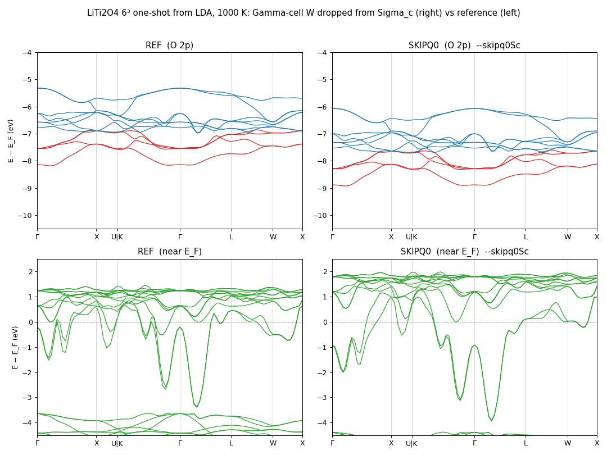

（左 REF、右 `--skipq0Sc`。上 O 2p、下 E_F 近傍。右でも Γ–L / K–Γ / X / W の針は全部残り、
Γ セルの W を外した効果は全帯の一様なシフトだけ。）

→ **offset-Γ の頭は犯人ではない**。異常な非対角は有限 q（メッシュ第一殻）の W から来る。
窓 [0, 3.7 eV] に入る極は 1.84 eV（t2g プラズモン）と 2.1〜2.3 eV。
なお今日の一発（χ₀+Σ 1000 K、mixbeta=1）は 6 月 `sigmakbt1000` の iter 1（針 −1.9 eV）より
針が深く多い（X, W にも）。6 月の run は途中で設定を触った形跡があるので、一発目の基準は
今日の REF とする。
副産物: hgw の W-build が 2 本同居時に segfault、単独では通る。潜在バグ、要追跡。

### 22:20 統一像: 小 q の W(ω) のプラズモン極を Σc の実軸極項が踏んでいる

小 q（offset-Γ）の ε(ω)（`runs/eps_r1015.dat`, 2000 K）の Re ε 零点: 1.84 eV（t2g プラズモン、
Im ε 1.4）、2.1, 2.34, 3.79, 4.8〜5.0 eV、**6.13〜6.22 eV（Im ε 0.66、−Im 1/ε = 1.47 の鋭い帯間プラズモン）**。

Σc の実軸極項は状態 ε に対し W(q, ω) を ω ∈ [0, |ε−E_F|] で使う（ヒストグラムビン + ω² の
3 点 Lagrange）。小 q の W の頭に鋭いプラズモン極が並ぶ金属では
- 窓が極を跨ぐ状態（state 48: 窓 3.7 eV、O 2p: 窓 8 eV）の Σc がビンの落ち方で ±数 eV〜数十 eV
  振れ、固有値のわずかな移動で符号が変わる → 9³ の反復ごとの波、極に乗った反復の SEc ±50 eV。
- 窓が短い E_F 近傍（t2g）は無傷。
- 温度は極を減衰させる（2000 K 以上で消える、T=0 で最悪）。dq は極の位置を動かす。
- 6 月の ω メッシュ試験（`mesh_conv_result.txt`）で最大変化が st48 の 0.5 eV だったのも同じ指紋。
- 一発目の針は、非対角経由で E_F 近傍に現れる同じ現象。反復で固有状態が組み替わると消える。
（23:05 の試験で「offset-Γ の頭」は外れ、「有限 q の W の極」に絞られた。）

### 22:10 一発目の針の正体 = 固有状態基底の Σc の非対角 ⟨48|Σc(ε₄₈)|33⟩

6 月 6³ 1 反復 run の SEBK/SEX2U・SEC2U を `LiTi2O4/read_se2.py` で読む。同じ k で
state 33（t2g, −0.6 eV）と非占有 state 48（+3.7 eV）の間:

| 条件（χ₀ 側のみ有限温度） | ⟨33\|Σc(ε₃₃)\|48⟩ | ⟨48\|Σc(ε₄₈)\|33⟩ | Σc₄₈,₄₈ |
|---|---|---|---|
| T=0, dq=0.3 | −0.23 | **+9.24** | −9.93 |
| 1000 K, dq=0.3 | −0.23 | **−5.45** | −5.50 |
| 1000 K, dq=0.1 | −0.23 | **−11.31** | −3.82 |
| Γ | −0.32 | −1.7〜−2.0 | −6.7 |

ε₃₃ で評価した側は正常、**ε₄₈ で評価した側が ±10 eV で符号反転**。QSGW のエルミート化
½(Σ+Σ†) がこれを 33–48 の非対角 4.6〜5.9 eV にし、準位反発で 33 を 2 eV 押し下げる。
他の大きい非対角（j=65, 71: 4.6, 5.5 eV）は三条件で不変 → Vxc と相殺される正常成分。

### 21:55 針はメッシュ点にある、対角 Σ は滑らか

針の底は Γ–L 線上の**メッシュ点 (−1/6,1/6,1/6) そのもの**。そこで band（lmf が Σ 行列を対角化）は
state 33 を −1.87 eV に置くが、QPU の対角 eQP は +0.62 eV（e0 −0.63 + dSE 1.25）で滑らか
（Γ–L 4 点: 0.50, 0.62, 0.86, 1.02）。iter 2 の e0 欄がこの −1.85 を示し、Σ₂ は dSE=+2.86 で戻す
（反復で「比較的安定していく」のはこの自己修復）。

### 21:35 iter 2→3 の一発比較: T=0 は 8 倍荒れる、Anderson 混合は犯人ではない

6³、6 月の `band/iter2/` から 1 反復、`mixbeta=1.0` で混合なし、GPU 2 枚、
kt1 `runs/oneshot3_666_T1000_20260918/`（20:25 投入、A′ 21:15・C 21:33 完了）:

| case | 条件 | 荒れ（band 9〜12、平均 / 最大 meV） |
|---|---|---|
| 6 月 iter 3（参考、Anderson 混合込み） | χ₀ 1000 K + Σ 1000 K | 10.7 / 15.3 |
| A′ | 同上、混合なし | **17.4 / 23.4** |
| C | 両側 T=0（tetrakbt=false, t_sigmakbt 無し） | **132 / 153** |
| B（Σ 側 T=0）, E（dq=0.3） | 途中で停止（B は 4 本同居中に hgw が segfault、投げ直し後に停止） | — |

- 計算された Σ(3) はそれ自体が荒く（A′）、6 月の mixsigma はむしろ薄めていた → Anderson 混合は犯人ではない。
- **T=0 にすると 8 倍荒れる**（C）。有限温度は荒れを抑える側。金属固有の問題。

### 21:30 band 履歴図に E_F 近傍を追加（9³・6³）

各反復で上段 O 2p（−10〜−4 eV、赤 = band 9〜12、青 = 13〜19）、下段 E_F±2.5 eV（緑 = t2g、
band 25〜52）。`plot_band_history.py` / `plot_band_history_666.py`。

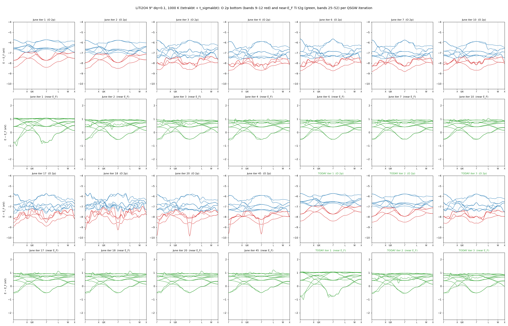

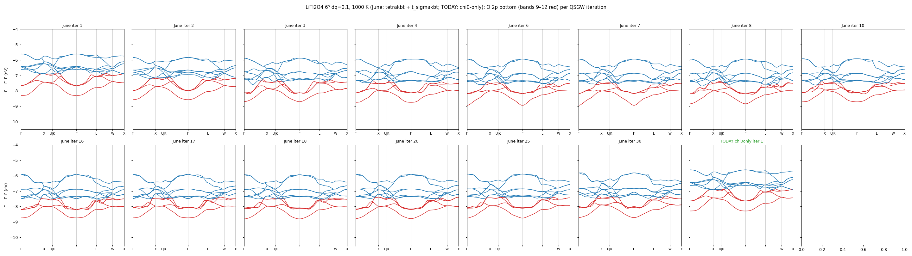

- 9³: iter 1, 2 は滑らか、**iter 3 で全 k 路に細かい波が乗り**（Γ だけではない）、iter 17〜18 で
  band 9 の Γ に鋭い落ち込み（−8.4 → −9.8 eV の針）が出て iter 45 まで残る。
- 6³: 30 反復を通して O 2p は滑らかなまま（荒れ指標 7〜16 meV、iter 8 と 13〜15 に軽い山）。
  SEc が 40 eV 飛んだ iter 7 でも band に針は立たない。→ 事故（SEc の飛び）は 6³ でも起きるが、
  band を壊すほど残るのは 9³ だけ。(a) 9³ では飛びが広く乗る、(b) 6³ iter 7 は mixbeta=1.0 で
  次の反復が完全上書き、9³ は mixbeta=0.5 の Anderson 履歴に半分残った、のどちらか。
- E_F 近傍: iter 2 以降は概ね滑らか（X, L の +1 eV に小さなこぶが iter 16 以降固定的に居座る）。
  **iter 1（LDA からの一発）だけ t2g に深い針**（6³ −1.9 eV、9³ −0.8 eV）が出て iter 2 で消える。
  E_F 近傍は震源であって被害者ではない（合意）。

### 20:40 9³ 再現チェーン停止（user 判断、iter 4 の途中）

iter 1〜3 の状態（rst, sigm, QPU, EFERMI*, hgw の stdout）は kt1
`n999_dq0.1_T1000K_repro20260918/band/iter1〜3/` に保存。iter 3 の荒れは `band/iter2/` から
1 反復（2 h, GPU 2 枚）で再現できる。6 月 iter 6 型の SEc 数十 eV の事故は現行コードでは未再現
（そこまで回していない）— 必要なら `band/iter3/` から ITER0=4 で再開（`run_repro2.sh`）。

### 20:15 9³ iter 3 で荒れが再現

荒れ指標 25.4 / 32.4 meV（6 月 28.7 / 37.5）、band 10〜12 に 6 月と同じ細かい波。ここから
6 月とのずれが出始める（SEc 最大差 0.19 eV、ehf −109760.160 対 −109760.773 eV）が定性的には
同じ軌道。**iter 3 の荒れは SEc の飛びではない**（iter 2→3 の |ΔSEc| 最大 0.98 eV、>1.5 eV は
0 件）— 6 月の iter 6 型の事故（数十 eV）とは別の、もっと穏やかな機構。

### 19:00 6 月の run ごとの最終反復の band

`plot_band_final_june.py`、−10.5〜+3.5 eV、赤 = band 9〜12、青 = 13〜24、灰 = Ti t2g/eg:

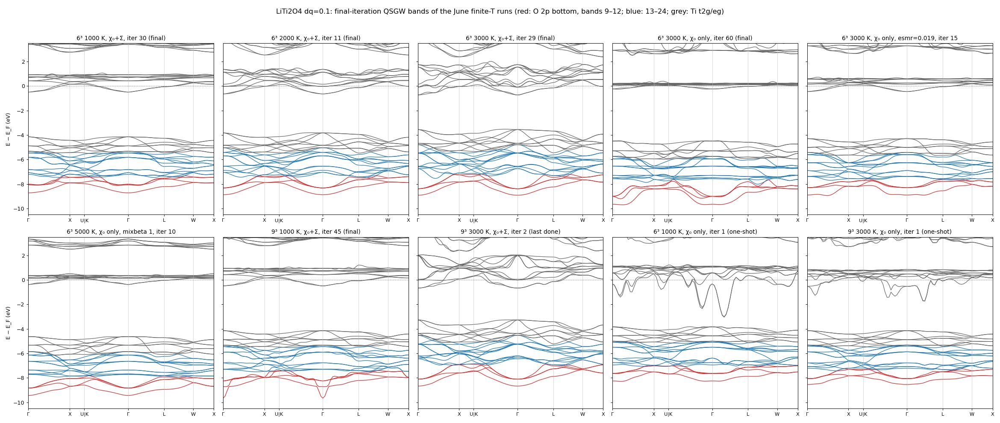

- χ₀+Σ（t_sigmakbt あり）の 6³ 1000/2000/3000 K と 9³ 3000 K は O 2p も t2g も素直。
  9³ 1000 K iter 45 だけ Γ の針と細かい波。
- **χ₀ だけ**（t_sigmakbt 無し）の run は別物: 一発（iter 1）の時点で t2g に −1〜−3 eV の
  深い針が多数（6³ 1000 K, 9³ 3000 K）、収束後（6³ 3000 K iter 60, esmr=0.019, 5000 K）は
  t2g が E_F に張り付いた平坦帯に潰れ、O 2p の底も −9.5 eV へ沈む。χ₀ が EFERMI_kbt、
  Σ が EFERMI という E_F の二重管理（kBT.md §9）の帰結で、Σ 側も温めるのが必須という
  6 月の結論の根拠。16:40 に 6³ χ₀-only チェーンを止めたのは結果的に正しい。

### 18:00 9³ iter 2 完了、6 月と一致

8880 s（前半は 6³ と GPU 共有）。荒れ 8.9 / 10.8 meV（6 月 8.9 / 10.8）、SEc 最大差 9 meV・
平均 0.2 meV、ehf −109754.052 eV（6 月 −109754.052）。iter 1→2 の SEc ジャンプ無し（max 0.83 eV）。

### 16:40 6³ χ₀-only チェーン停止

`n666_dq0.1_T1000K_chi0only_20260918/`（χ₀ 側だけ 1000 K、`t_sigmakbt` を外す）。CPU 版は
1 反復 2〜3 h と遅すぎ、GPU 共有版に切り替えたが 9³ が 2 h → 3 h 超に伸びるので 2 反復で停止
（user 判断）。

### 15:15 9³ iter 1（一発 GW）完了、6 月と完全一致

荒れ指標 8.1 / 11.5 meV（band 9〜12 平均 / 最大）とも同値、QPU の SEc は state 9〜52 × 35 k で
最大差 8 meV・平均 0。→ 現行 main（f5c49f435）は 6 月のバイナリと同じ軌道を辿っている。

### 13:05 再現ラン投入（kt1, 現行 main f5c49f435, GPU 2 枚）

6 月のランは当時のバイナリ（`PB.liti2o4.toml` 時代）。現行コードで同じことが起きるかを、
同じ入力（dq=0.1、tetrakbt = t_sigmakbt = 1000 K、mixbeta=0.5、from LDA）で確かめる。
kt1 `~/LiTi2O4/kbt/runs/n999_dq0.1_T1000K_repro20260918/`（`run_repro2.sh`, `-np 60 -np2 2`、
1 反復 ≈ 2 h）。入力は 6 月のディレクトリから `ctrlg` + `PB` を取り `ctrlg_absorb.py` で一本化。
混合履歴（`__mixm`, `mixsigma`）は無し。反復ごとに `band/iterN/` に rst / sigm / QPU / EFERMI /
EFERMI_kbt / `stdout.0000.hgw.gz` を残し、`job_band` → `o2p_rough.py`（bnd 上の |2 階差分| の
平均、meV）を `rough.txt` に。

### 12:30 6 月の QPU を反復間で比較: 「壊れた反復」がある

荒れは滑らかな帰還ではなく、**特定の反復で SEc が数十 eV 飛ぶ「壊れた反復」**が原因。
`sec_jump.py`（反復 n と n−1 の SEc の差、valence 帯 state 9〜24、全 k）:

| run | 壊れた反復（|ΔSEc|>1.5 eV の (k,state) 数 / 全数、最大 |ΔSEc|） |
|---|---|
| 9³ 1000 K (tetrakbt + t_sigmakbt) | **iter 6**: 204/560, 50 eV → iter 7 で同じ量だけ戻る; **iter 17–19**: 182–261/560, 15 eV |
| 6³ 1000 K (同上; mixbeta は iter 11 まで 1.0) | **iter 7**: 121/256, 40 eV → iter 8 で戻る; **iter 17–18**: 95/256, 14 eV; iter 20–21: 30, 6 eV |
| 6³ 2000 K (11 反復), 3000 K (29〜60 反復), 5000 K (10 反復) | 無し |

- 壊れた反復では **全 k** で、O 2p 帯（state 9〜23, −8〜−5 eV）と +23〜26 eV の非占有帯の
  SEc が異常（例: 9³ iter 6 の q=(−7/9,7/9,1) state 12 で SEc 5.9 → 55 eV; 9³ iter 17 の Γ state 12 で
  SEc −8.4 eV）。SEx は正常。E_F 近傍の t2g/eg（state 24〜52）は無傷。→ 虚軸積分ではなく
  **実軸の極項**（|ε−E_F| が大きい状態ほど広い ω 窓の W(ω) を使う）。
- 壊れた Σ が `mixsigma`（mixbeta=0.5、Anderson nmix=3）で半分混ざり履歴に残るので、
  次の反復で戻っても帯の荒れ（30 meV 台）が居座る。9³ iter 17〜19 の後に O 2p の底が 1.4 eV
  沈んだのはこの二度目の事故の跡。
- 1000 K だけで起きる（2000 K 以上は無し; T=0 の多反復 run は無い）。

### 12:00 6 月のランを同じ指標（`o2p_rough.py`）で見直す

`band/iter*/`, band 9〜12 の平均 / 最大 meV:

| 反復 | 1 | 2 | 3 | 4〜16 | 17 | 18 | 19 | 20 | 21〜45 |
|---|---|---|---|---|---|---|---|---|---|
| 平均 | 8.1 | 8.9 | **28.7** | 20〜32 | 50.6 | **75.4** | 50.2 | 44.3 | 28〜35 |
| 最大 | 11.5 | 10.8 | 37.5 | 30〜46 | 75 | 104 | 58 | 51 | 36〜42 |
| band 9 の底 (eV) | −8.40 | −8.50 | −8.63 | −8.7〜−8.8 | −8.90 | −9.27 | −9.46 | −9.85 | −9.5〜−9.9 |

→ **荒れは反復 3 で既に出る**（8 → 29 meV）。17〜20 反復目で O 2p の底が 1.4 eV 沈む第二段が
あり、その後 30 meV 台に居座る。再現には 3 反復（≈6 h）で足りる。

### 午前 — 発端と当初の仮説（後に修正）

**発端**: `plots/mesh_666_vs_999_T1000.png` の −8 eV 付近で 9³（赤破線）が大きく振動している
（それまで E_F ±0.5 eV しか見ていなかった。そこは rms 14 meV で「収束」）。

**事実**（`LiTi2O4/n999_T1000`, `n666_T1000`、dq=0.1、tetrakbt = t_sigmakbt = 1000 K）

- バンド線上の 2 階差分 rms（meV）、O 2p の底 band 9〜12:

  | 反復 | band 9 | 10 | 11 | 12 |
  |---|---|---|---|---|
  | 9³: 1 | 9 | 14 | 15 | 18 |
  | 9³: 3 | 14 | 41 | 45 | 55 |
  | 9³: 10 | 20 | 35 | 52 | 55 |
  | 9³: 20 | 112 | 96 | 56 | 56 |
  | 9³: 45 | 82 | 78 | 42 | 57 |
  | 6³: 1〜30 | 7〜9 | 12〜19 | 16〜21 | 16〜29 |

  → 一発 GW は 9³ も滑らか。反復で育ち、20 反復で 100 meV 級、以後居座る。
  −7 eV より上（band 16〜）は 6³ と同程度。図: `LiTi2O4/plots/o2p_666_vs_999_T1000.png`。

- メッシュ点の Σ（QPU.45run vs QPU.30run、Γ 点）:

  | state | 6³ Σ−vxc / SEc / eQP | 9³ 同 |
  |---|---|---|
  | 9（O 2p 底） | +0.23 / 5.96 / −8.72 eV | **−1.39 / 4.50 / −9.65** |
  | 10 | +0.06 / 5.99 / −8.01 | +0.19 / 5.93 / −8.71 |
  | 11, 12 | ≈0 / 5.9 / −8.00, −8.00 | −0.10 / 5.8 / −8.26, −8.25 |
  | 7, 8（O 2s −21 eV） | −1.42 / 9.82 | −1.42 / 9.82（一致） |

  → 9³ は Γ で state 9 の SEc が 1.5 eV 小さく、6³ で三重縮退の 10–12 が 0.45 eV 割れる。

**当初の解釈**（その後の判定を括弧で）:
1. q→0（offset-Γ）の W の頭が有限温度の金属で不安定で、反復で帰還する（**23:05 に否定**:
   Γ セルの W を外しても変わらない。「帰還」でもなく散発的な事故 + 極跨ぎ）。
2. Σ の反復の減衰が弱い / Anderson 外挿（`mixsigma`, mixbeta=0.5, nmix=3）が増幅（**21:35 に否定**:
   混合なしの方が荒い。ただし壊れた反復の Σ を履歴に残す役はある）。
3. E_F の二重管理（χ₀ は `EFERMI_kbt`、Σ は `EFERMI`）— t_sigmakbt を入れれば同じ E_F（19:00 の
   χ₀-only の図がその帰結）。
4. GL20 の E_F 近傍の粗さ（kBT.md §7.2）— 未検証、主因ではない。

**次にやること**: (1) 23:10 のトレースで −13 eV の q 分解。(2) 実軸極項の極の扱い（ビン幅、
2 点線形 `--WVR2ptRaxis`、W_c の虚部で極を鈍らせる、頭の解析処理）の比較。(3) 1000 K の小 q
ε(ω) を出して極の鋭さを確認。(4) hgw 2 本同居での segfault の追跡。

---

## 2026-09-17 — 300 K でも Σ 側は金属で 0.1 eV 動く（TestInstall/fe_gwsc, 5³, 1 反復）

| | χ₀ のみ（tetrakbt 300 K） | χ₀ + Σ（t_sigmakbt = 300 も） |
|---|---|---|
| GaAs | max 1 meV | — |
| Fe up | max 1 meV | **max 0.12 eV、平均 0.04 eV** |
| Fe dn | max 1 meV | max 0.08 eV、平均 0.05 eV |

E_F ±kBT の少数の状態が分数占有になり、その状態自身の SEx / SEc が eV 級で動いて打ち消した
残り。粗いメッシュで「どの状態が E_F を跨ぐか」に敏感。→ gwinit のテンプレは有限温度キーを
見え消しに戻した（`6aaf2040b`）。メッシュ収束と `esmr` 窓（`ddw*esmr` が温度でスケール
しない、kBT.md §7.3）の整理が要る。比較は QPU の `dSEnoZ` 列で（`eQP(starting by lmf)` は
lmf の出発固有値）。

## 2026-09-17 — heftet が絶縁体で EFERMI_kbt を書かなかった

GetStarted/GaAs の一気通貫で発覚（当時のテンプレが tetrakbt=true 既定だった）。
金属/絶縁体の分岐の後で書くよう修正（`57edde869`）。ギャップ内で解が区間になれば中央。
GaAs 300 K: EFERMI_kbt = 0.15345 Ry（T=0 中央 0.15221、離散 k 和 0.15326）。

## 2026-09-16 — 実装レビュー（kBT.md §7 に反映済み）

- 恒等式 ∫dE(−f′)θθ = f_a − f_b は厳密。
- GL20 on [−6, 6] は内側の節点が |t|=0.459 → E_F ±0.9 kBT を刻まない。4 区間 × GL5 で
  誤差 1.7e-1 → 2.9e-2（未実装）。
- Σ 側の状態窓 `ddw*esmr`（ddw=10）が `sig_kbt` でスケールしない、`sxcf_scz_count` が
  `sigmakbt_setup` より先に走る。
- 落としている項: f₂(1−f₃) = (f₃−f₂) n_B の O((kBT)²)。定義の選択であって欠陥ではない。
- 潜在: `sxs_ekc(is1+nctot)`（m_sxcf_sc.f90:237）、`ixc==3` での `ef` 上書き。
