# kBT_research.md — 有限温度 QSGW の研究ログ

上から新しい順に書き足す。

**図の貼り方**: `mlo_rows.png` / `mlo_conv.png` は反復が進むたび**上書き**される「生きている図」なので、
**冒頭の「最新の図」節にだけ**貼る。過去のエントリには、その時点の状態に作り直した**凍結版**
（`mlo_rows_<HHMM>.png` など）を貼る。上書きされる図を日付エントリに貼ると、本文の説明と中身が
食い違う（2026-09-25 に 15:06 と 22:27 のエントリで実際に起きた）。

結論が固まったものは
[ecaljdoc manual/kBT](https://ecalj.github.io/ecaljdoc/manual/kBT) と各 README に移す。
一覧としての「残る課題」は kBT.md §9。

---

## 最新の図（走行中のチェーンを映す。ここだけ上書きされる）

**最終更新 2026-09-26 18:30**（9³ 10 反復完了）／ 追っていたのは **`liti_mlo_k9`**（**9³**、nmlo 126、$\Sigma^{\rm MLO}$ を β=0.5 で混合、03:07 開始、**18:24 に 10 反復完了**）。最終図は 18:30 のエントリに凍結。
6³ の v9 は 10 反復で完了し、最終図は 03:15 のエントリに凍結した。

| 列 | 何を描いたか | 描き方 |
|---|---|---|
| 1 | **従来 QSGW**（MTO、6³、`n666_nk6_from_lda`、`pwmode=1`、β=0.5）| 従来 `sigm` の内挿。LDA 行だけ `pwmode=11`（02:45 のエントリ）|
| 2 | 6³ の `liti_mlo_v9`（MLO-QSGW、10 反復で完了）| 従来 `sigm` の内挿（`job_band`、`mloON=0`）|
| 3 | 6³ の `liti_mlo_v9` の **MLO バンド** | SCF が解いた $H$ の MLO 模型（`draw_mloband.sh`）|
| 4 | **9³ の `liti_mlo_k9`**（MLO-QSGW、走行中）| 従来 `sigm` の内挿。SCF が使った $\Sigma^{\rm MLO}$ ではない |
| 5 | **9³ の `liti_mlo_k9` の MLO バンド** | SCF が解いた $H$ の MLO 模型 |

9³ には反復を揃えて比べられる従来チェーンが無いので、従来列は 6³ だけ。
**赤い ×** は列ごとの Γ→X 上の Σ メッシュ点 $x = 2n/N$ での各バンドの値（6³: 0, 1/3, 2/3, 1、9³: 0, 2/9, 4/9, 6/9, 8/9。X 点は奇数メッシュに乗らない。9³ の点は 211 点の格子に乗らないので前後から内挿）。図の題に MLO 模型の内容（126 軌道 = 14 原子 × (s+p+d)）を書いてある。

*図 L-1* t2g（b33–44）、Γ→X 211 点

[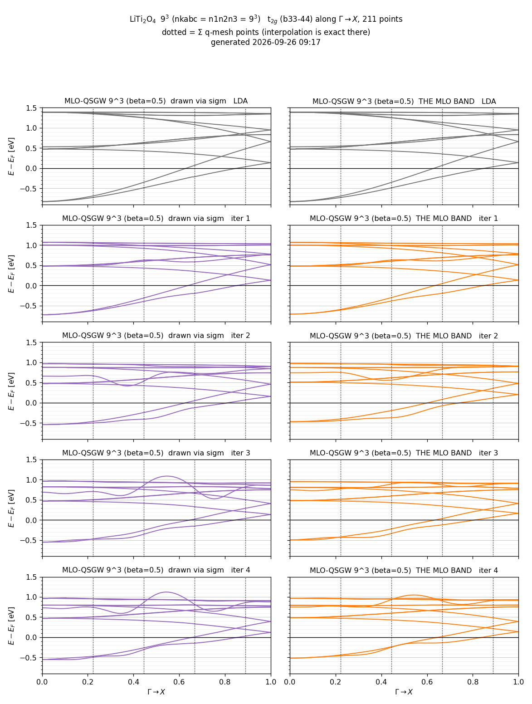](LiTi2O4/mlo_rows_k9.png)

`Samples/kBT/LiTi2O4/mlo_rows_k9.png`（生成: `MESH=6,9 MESHCOLS=6,6,6,9,9 mlo_rows.py <root> <out> v9,v9mlo,k9,k9mlo '…' '…'`、root の `ref/` が従来列）

*図 L-2* 反復ごとの変化（左 max、右 rms）。**9³ は実線、6³ は破線**

[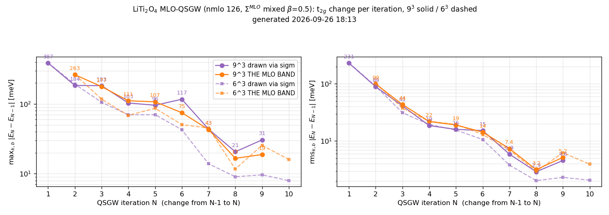](LiTi2O4/mlo_conv_k9.png)

`Samples/kBT/LiTi2O4/mlo_conv_k9.png`

*図 L-3* **従来 QSGW（6³）、6³ と 9³ の MLO-QSGW を並べたもの**。列は L-1 と同じ 5 列（従来 / 6³ `sigm` 描画 / 6³ MLO バンド / 9³ `sigm` 描画 / 9³ MLO バンド）。
**緑 = 一番下のバンド、青 = Γ→X の中央で膨れるバンド**（交差をまたいで追跡、膨らみが 50 meV 未満の段では青を付けない）、灰 = その他、**赤い × = メッシュ点**。（18:15 まで一番下は赤で描いていた。赤をメッシュ点の × に使うため緑に変えた）

[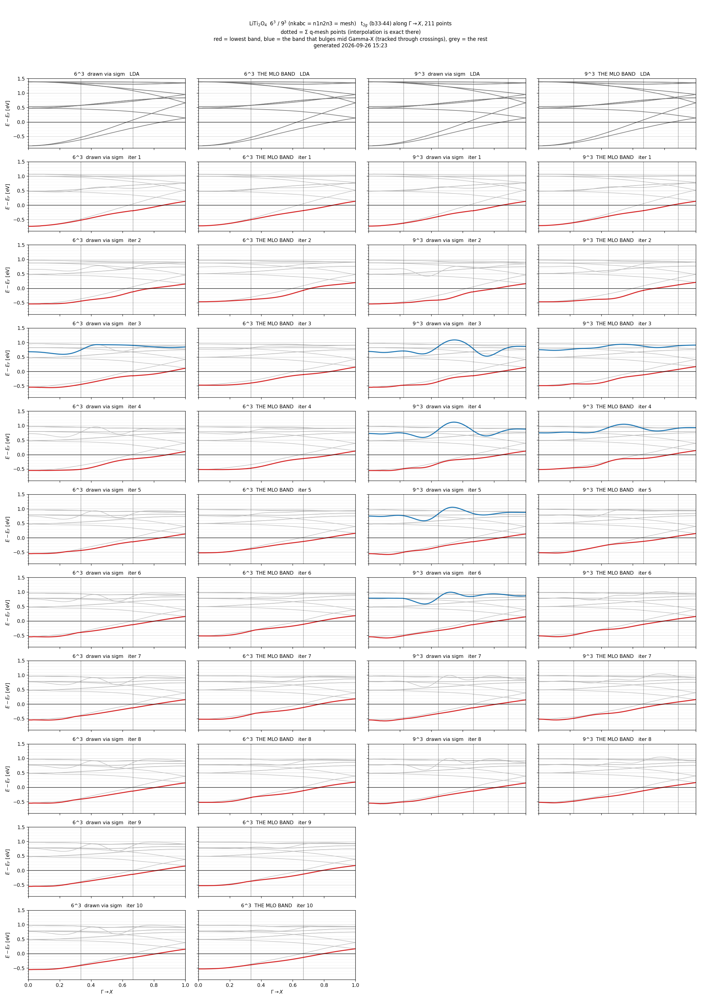](LiTi2O4/mlo_rows_6vs9_hilite.png)

`Samples/kBT/LiTi2O4/mlo_rows_6vs9_hilite.png`（生成: `HILITE=1 MESH=6,9 MESHCOLS=6,6,6,9,9 mlo_rows.py <root> <out> v9,v9mlo,k9,k9mlo '…' '…'`）。従来列では iteration 9–10 で青（中央の膨れ）が出るが、同じ 6³ の MLO-QSGW の 2 列には出ない。
9³ だけの色分け版は `mlo_rows_k9_hilite.png`

*表 L-1* 9³ の各反復

| $N$ | 時刻 | 秒 | SCF 回数 | `sigm` 描画 max / rms | MLO バンド max / rms | 備考 |
|---|---|---|---|---|---|---|
| 1 | 04:39 | 5314 | 19 | 387 / 231（LDA から）| — | 混合 543.85 → 271.92（半分）、MISS 0 |
| 2 | 06:10 | 5326 | 11 | 184 / 89 | 263 / 99 | $x_0$ を `.prev` から、MISS 0 |
| 3 | 07:41 | 5336 | 11 | 183 / 41 | 177 / 44 | 9³ 用期待値で ANOMALY 0 |
| 4 | 09:14 | 5427 | 10 | 103 / 19 | 111 / 22 | ANOMALY 0 |
| 5 | 10:47 | 5435 | 6 | 96 / 16 | 107 / 19 | ANOMALY 0 |
| 6 | 12:18 | 5307 | 4 | 117 / 15 | 75 / 14 | ANOMALY 0 |
| 7 | 13:49 | 5313 | 6 | 43 / 5.9 | 43 / 7.4 | ANOMALY 0 |
| 8 | 15:20 | 5310 | 4 | 21 / 2.9 | 17 / 3.2 | ANOMALY 0 |
| 9 | 16:51 | 5305 | 4 | 31 / 4.6 | 19 / 5.2 | ANOMALY 0 |
| 10 | 18:22 | 5313 | 4 | 23 / 3.8 | 21 / 3.2 | ANOMALY 0。**完了** |

**9³ での正常値**（6³ と違うので注意。`check_iter.sh` は `CHECK_MLOON=35 CHECK_GWDRV=50 CHECK_MAXSECS=12000` で使う）

どちらの印も `sigmlo_init` が**プロセスごとに最初の 1 回**出す行で、`getsenex` を呼ぶのは担当する k 点を持つプロセスだけ。
`lmf` は k 点を大きさ ⌈nk/np⌉ のかたまりで配るので、印の数 = ⌈nk / ⌈nk/np⌉⌉ になる。

| 印 | `lmf` の np | k 点数 6³ → 9³ | かたまり | 印の数 6³ → 9³ |
|---|---|---|---|---|
| `mloON`（SCF）| 60 | 既約 16 → 35（`BZMESH: ngrp nq 48 ...`）| 1 → 1 | **16 → 35** |
| `gwdrv`（GW ドライバ）| 60 | `QPLIST.jobgw1` 72 → 200（`ZmloSig` のレコード数と同じ）| 2 → 4 | **36 → 50** |
| MLO バンドの `writeham` | 8 | 16 → 35 | 2 → 5 | **8 → 7**（9³ は 5×7=35 で 8 番目が空）|

意味のある異常はこの数より**少ない**場合（一部のプロセスが MLO 経路に入らず従来の `sigm` に落ちた）。
ほか: 1 反復 ≈ 5300 秒（6³ は ≈ 950）、スナップショット 2.4 GB（6³ は 0.9）。

## 2026-09-26

（図表の番号は `図 HH:MM-n` / `表 HH:MM-n`。HH:MM はそのエントリの時刻、n はエントリ内の通し番号。エントリの時刻は変わらないので番号は安定する。）

### 2026-09-27 10:15 **9³ の tf32 は 2121 秒（35 分）。nsys で見た残りの無駄: readeigen の極小の倍精度 GEMM 115 万回をカーネル 1 つにして 6³ で 5〜7% 短縮。1 GPU 2 ランクは 38% 遅く、Σc ループの非同期化は NaN で取り消し**

- 9³ の `--prec=tf32`（`fc55b16da`、重みの補助あり）: **2121 秒**（fp32 3180、旧 5004〜5128）。fp32 との差は Re Σc 最大 0.85 meV、SEx は一致。
  rank 0 の Σc 虚軸 716 秒（fp32 1375）、実軸 565 秒（879）
- 1 GPU 2 ランク（6³、tf32、`-np2 4`）: 433 秒（`-np2 2` は 314 秒）。GPU の使用率は 75〜79% → 92〜96% に上がるが、2 プロセスの時分割とメモリ上限（31 GB）で遅い。
  計画どおり GPU 1 枚に 1 プロセス
- Σc の CPU の部分（タイマーを追加、`0ce23d7f1`）: 6³ tf32 の rank 0 で虚軸の重み 5.6 秒、実軸の極の重み 12.2 秒（Σc の 1 割強）
- nsys（6³、tf32、rank 0）: GPU のカーネル時間の合計 223 秒（wall の約 7 割）。上位は Σc 虚軸の TF32 積 79 秒、実軸の積 32 秒、
  **倍精度の極小の積（`readeigen` の MT 係数の回転、(2l+1)×nband×(2l+1)）17 秒・115 万回**。API は同期が 560 万回（OpenACC の kernels 1 つごと）
- → 回転を全軌道まとめて 1 つの OpenACC ループにした（`b8101dcb1`）: 6³ の hgw は tf32 313.6 → **292.5 秒**、fp32 441.5 → **423.5 秒**。
  Σ は表示の桁で前回と同じ、TestInstall の GW（GPU の fp64・tf32）は全部合格
- Σc の周波数ループの小さなカーネルを `async(1)` にし、`acc_set_cuda_stream(1, 0)` で既定ストリームに結んだ版（`70e7c0549`）は 6³ tf32 で 275 秒と速かったが、
  **Σc が NaN**。キュー 1 が cuBLAS のストリームに乗らず、次の周波数のカーネルが積の最中の wc / czwc_iw を書き換えた。取り消した（`2b2497c45`）。
  正しくやるには cuBLAS のハンドル（と GEMMul8 のハンドル、realsgemm の CUF カーネル）をキュー 1 のストリームに揃える必要がある。6% 程度の見込み、未着手
- 最終版（`2b2497c45`）で MLOQSGW と 9³ の tf32・fp32 を取り直し中（chain19）

### 2026-09-27 08:20 **9³ をさらに速く: TF32 は Σc の積だけなら E_F まわりで 1 meV 未満。Ozaki の分解数で精度は連続に選べるが、この GPU では同じ精度で TF32 か FP32 より速くならない。`--prec=tf32` を「Σc の積だけ TF32」にした**（user「999 の高速化を考えて。tf32 では精度でないか？ozaki で tf32 だと遅いか」「0.1 eV のギャップ差で EF まわりが良好なら用途により問題ない」「正定値行列の積算はエラーが乗りにくい」「Ozaki で精度制御して高速化する」）

*表 08:20-1* 6³ の `hgw`（重みはファイルから）。倍精度 E3 との差（meV）

| 構成 | 秒 | Re Σc（\|E−E_F\|<1 eV）最大 / rms | Re Σc（全体）最大 | SEx（\|E−E_F\|<1 eV）最大 |
| --- | --- | --- | --- | --- |
| fp32（自動の表） | 441.5 | 0.019 / 0.006 | 0.042 | 0.060 |
| Σc の積だけ TF32（`ECALJ_SIGMA_TF32=1` の試験） | 318.3 | 0.82 / 0.41 | 0.92 | 0.060 |
| 全部 TF32（従来の `--mp`） | 284.0 | 5.1 / 2.2 | 24.2 | 3.2 |

NiO（`Samples/MLOQSGW`、2×2×2、LDA から 2 反復）のギャップ: 参照 1.587 / 2.066 eV、fp32 1.587 / 2.069、Σc だけ TF32 1.585 / 2.089（+20 meV）、全部 TF32 1.494 / 2.035（−93 / −32 meV）。

- 大きいのは W の側の誤差: χ0 の足し合わせ自体は正定値の和で誤差が乗りにくい（user の指摘）が、そこでできた W の小さな誤差が (1−vχ0)^{-1} で拡大される。
  Σc の最後の積では誤差がそのまま入るだけ
- → **`gwsc --prec=tf32` を「Σc の積だけ TF32（表の tf32 の行）、ほかは FP32」にした**（`fc55b16da`、Fortran は `--sigma_tf32`）。従来の `--mp` だけの指定（全部 TF32）は残す

*表 08:20-2* Ozaki（GEMMul8、INT8、fast）の分解数と速さ・誤差（`ozscan`、1053 の寸法、行・列の値の幅 2 桁、誤差は倍精度との最大の相対差）

| 方法 | Σc 虚軸型 1053×8000×1053 | Σc 実軸型 1053×400×1053 | x0 型 1053×1053×4000 | 誤差 |
| --- | --- | --- | --- | --- |
| cuBLAS TF32 | 0.73 ms | 0.055 | 0.38 | 3e-4 |
| Ozaki 4 | 0.88 | 0.112 | 0.35 | 2e-3 |
| Ozaki 5 | 1.07 | 0.123 | 0.42 | 1e-4〜2e-4 |
| Ozaki 6 | 1.30 | 0.145 | 0.50 | 1e-5 |
| Ozaki 7 | 1.49 | 0.157 | 0.57 | 7e-7〜1e-6 |
| 実数 SGEMM FP32 | 1.51 | 0.162 | 0.86 | 3e-7〜1e-6 |
| cuBLAS FP32 | 2.20 | 0.114 | 1.15 | 3e-7〜9e-7 |

- 分解数 1 つで精度は約 1 桁動く（5 → 1e-4、6 → 1e-5、7 → 1e-6）。ただし同じ精度なら TF32（3e-4 で 0.73 ms）か FP32 の実数 SGEMM が同等以上に速く、
  Ozaki がはっきり勝つのは倍精度だけ（この GPU の INT8 でも分解数ぶんの積と変換の固定費が効く）
- 精度の口としては使える: Σc の積の行を `--linalg=tf32.cgemm.large=gemmul8:6` にすれば、Σc だけ 1e-5 の精度で FP32 より 14% 速い
- 検証（chain16）: 新しい tf32 で 6³・MLOQSGW・TestInstall GW・9³

### 2026-09-27 07:25 **9³ の hgw は 3180 秒（09-26 の本番は 5004〜5128 秒、1.6 倍）。残りの 81% は Σc**

`bench_hgw999`（`liti_mlo_k9` の 10 反復後の状態）、`~/bin_dev` = `b649a9ee7` の表、重みの書き出しを hgw と同時に開始（`-np 32`、GPU なし）。
06:26 開始、07:19 終了。rank 0 は 18 個の q すべてで重みをファイルから読んだ。

*表 07:25-1* rank 0 の内訳（秒）。旧 = `liti_mlo_k9/STDOUT/stdout.0000.hgw`（10 反復目、旧コード）

| | wall | Σc 虚軸 | Σc 実軸 | zmel（Σc 側） | tetwt5 | matinv | x0_gemm | zmel_gemm |
| --- | --- | --- | --- | --- | --- | --- | --- | --- |
| 旧 | 5004〜5128 | 2275 | 1130 | 251 | 386 | 187 | 182 | 129 |
| 新 | 3180 | 1375 | 879 | 267 | 0 | 26 | 161 | 153 |

- Σc 虚軸 1.65 倍、実軸 1.29 倍、tetwt5 と matinv はほぼ消えた。`build_zmel` の平面波の積（zmel・zmel_gemm）は組み替えで 6〜19% 遅いが、FP32 の誤差の主因を除いている
- 9³ の 1 反復（`gwsc 1`）は 88 分だったので、hgw の短縮（31 分）で 1 反復 約 57 分の見込み
- 9³ で次に効くのは Σc そのもの（虚軸 11 周波数 × KXloop の積、実軸の極項）。積の方法はもう RTX 5090 の単精度の上限（~50 TFLOPS）近く

### 2026-09-27 07:20 **TestInstall の GW テストは GPU（fp64・tf32）でも CPU でも全部合格。MLOQSGW の NiO は tf32 だけ不合格で、原因は昨夜 GPU に移した Hilbert 変換が TF32 で回っていたこと。fp32 では参照と 0.5 mRy**

- kt1（`~/bin_dev` = `b649a9ee7`、表を `~/bin_dev` に置き、重みの補助あり）: `testecalj -np 8 -np2 2 --gwall --gpu`（fp64）と `--gpu --mp`（tf32）とも **OK! ALL PASSED**。
  作業ディレクトリで、hgw が表を `~/bin_dev/ecalj_linalg_policy.toml` から読み（`linalg policy (tf32, from …)`）、重みを `__TETWT` から読み、
  終わった後にファイルが残っていないことを確認
- 手元（CPU、gfortran）: `testecalj -np 8 --gwall` も **OK! ALL PASSED**（x0kf の読み込み口と gwsc の変更で CPU の経路が壊れていない）
- `Samples/MLOQSGW` の `--gpu --mp`（tf32）: GaAs は合格、**NiO は `fp evl` が参照（CPU、FP64）から 0.039〜0.049 Ry ずれて不合格**（許容 0.02。09-26 は 0.0135）。
  切り分け（GPU 1、`-np2 1`）: 表なし・補助なし / 表だけ / 補助だけの 3 通りとも MaxDiff 0.0391 で同じ → **今日の表と補助は無関係**
- 同じ NiO を **fp32（`--mp --fp32`）で回すと参照との差は 0.0005 Ry**（GaAs 0.0001）。表（組み替え・GEMMul8 14・mixed1）と補助ありで、`--mp` でない厳しい許容 3e-3 にも入る
- 原因: 昨夜（`fde20bd6c`）MP 版の Hilbert 変換を GPU に移したとき `cmm_d` を使ったので、tf32 では TF32（仮数 10 bit）で回っていた（以前はホストの FP32）。
  ~300 ビンにわたる桁落ちのある和で、1 q あたり 0.7 秒しかかからない → どの精度でも FP32 で計算するようにした（`37e0a0f83`、`policy=BACKEND_BLAS_FP32`）。
  fp32・fp64 ではビット単位で変わらない。tf32 での NiO の確認は chain13（chain12 の後）

### 2026-09-27 06:20 **自動の表で 6³ の hgw は 438〜443 秒（基準 833 秒の 1.9 倍）、倍精度との差は Re Σc 4.2e-5 eV。重みの書き出しを並走させても時間は変わらない（段 3・5）**

`~/bin_dev` = `b649a9ee7`（GEMMul8 の下限、組み替えのキー無し閾値 n=16）。計測ツールは 3 回目も同じ表（05:45 の表 05:45-1）。

*表 06:20-1* 6³ の `hgw` 1 回。差は倍精度 E3 に対する最大（eV）

| 実行 | 重み | 秒 | Re Σc | Im Σc | SEx |
| --- | --- | --- | --- | --- | --- |
| s3b_auto | 先に書いた `__TETWT`（止めた chain9 の残り、判定を通って使われた） | 437.5 | 4.23e-5 | 9.7e-7 | 1.68e-4 |
| s5_file | 先に書いた `__TETWT`（CPU 32 ランクで 9.4 秒、17 ファイル 1.6 GB） | 441.7 | 同上（ビット一致） | | |
| s5_conc | 書き出しを hgw と同時に開始（`gwsc` と同じ） | 442.6 | 同上（ビット一致） | | |

- 3 本とも rank 0 は 8 個の q すべてをファイルから読み、tetwt5 は 0 回。並走でも書き出し（約 10 秒）が hgw の最初の q より先に終わる
- 時間の内訳（rank 0、s3b_auto）: W 構築 64.4 秒（S1d 141.7: tetwt5 が 0、matinv 33.5 → 11.2）、Σc 327.0 秒（虚軸 177.3、実軸 107.7）、zmel 33.3、zmel_gemm 18.9
- 重み無し（自前で計算）の時間と、ファイルあり・なしのビット一致は chain11 で測る。TestInstall（GW、`--gpu` と `--gpu --mp`、表と重みの補助あり）が走行中

### 2026-09-27 06:00 **表どおりでも hgw は 667 秒: 倍精度の積の行（GEMMul8 14）が readeigen の 7×7 の回転まで取っていた。GPU ロックの試験は合格（段 4）**

- 05:45 の表（手で選んだ最良と同じ）で hgw を回すと 667.5 秒（S1d は 532 秒）。内訳は zmel 94.3 秒（S1d 42.3）、zmel_gemm 79.9 秒（20.9）で、
  最初の表（S3、741 秒）と同じ形の遅れ。共通していたのは **zgemm/dgemm の行が GEMMul8 14** だったこと。MP 版でも `readeigen` は固有ベクトルの MT 係数を
  軌道ごとに (2l+1)×nband×(2l+1) の倍精度の積で回す（k 点ごとに数千回）。これに 14 分解の分割がかかって 110 秒。
  **S3 の遅れも GEMMul8 7 のせいではなかった**（ただし GEMMul8 7 の誤差の問題は残る）
- 段 1 で `--use_gemmul8` の大きさの下限（64×64×64 かつ m·n·k ≥ 1e8）を表の閾値に移したので、表から GEMMul8 を選ぶと下限が無くなっていた。
  → 下限は GEMMul8 自身の性質なので backend に戻した（`gemmul8_pays`、`b649a9ee7`）。表が何を言っても、それより小さい積は cuBLAS
- 精度も元に戻っていた（Re Σc 2.39e-4）: キー無しで n < 256 の積を cuBLAS に回す規則が、`build_zmel` の平面波の積（n ≈ 50〜300）を cgemm に戻していた。
  A'' の写しは連続なので n が数十でも元が取れる。閾値を n < 16 に下げた（同じコミット）
- **段 4（GPU ロック）の試験は合格**（05:52、`locktest_kt1.sh`、GaAs `gwsc 0 --gpu --mp -np2 1` を `CUDA_VISIBLE_DEVICES=0` で 2 本同時）:
  2 本とも rc=0 で QPU は一致。片方は「GPU lock: waiting for 1 free GPU(s) among [0]; in use: GPU 0: pid … runcmd:hvccfp0_mp_gpu in …/B」と出して待った。
  ロックを持ったままの別プロセスがあると、`ECALJ_GPU_WAIT=0` のジョブはその場で止まる（traceback だったので、`run_cmd` で 1 行のメッセージにした）
- 6³ の重みの書き出し（CPU 32 ランク）は 10.4 秒で 17 ファイル、1.6 GB

### 2026-09-27 05:45 **計測ツールが手で選んだ最良と同じ表を 2 回続けて出した（段 3）。決め手は「FP32 の精度」の約束を cuBLAS との比で課したこと**

計測ツールの直し（`107c748b9`、`78012e25e`、`ee3f2f97b`）:
寸法を 64 の倍数から外す（1037 など）、形ごとに hgw での時間の割合で重みを付ける（大きい区分: Σc 虚軸 0.8・x0 0.15・正方 0.05、
小さい区分: Σc 実軸 0.8・x0 0.15・zsec 0.05）、単精度の複素積の誤差の上限を「同じ形での cuBLAS の誤差の 4 倍」にする。
3 つ目が効いた: 寸法と重みを直しても GEMMul8 7 は大きい区分で速く見えた（1037×8191×1037 で 1.547 対 1.576 ms、1037×1037×4099 で 0.619 対 0.958 ms）が、
長い和（k=4099）での誤差が cuBLAS の 4.8 倍（行ごとに最大の要素に合わせて量子化するため）で、約束から外れる。hgw でも Im Σc を 1e-4 eV 動かしていた（表 05:40-1 の S3）。

*表 05:45-1* 選ばれた表（`policy3.toml`、`policy4.toml` も同じ）。small / large

| 精度 | 単精度の複素積 | 倍精度の複素積・実数積 | 逆行列 |
| --- | --- | --- | --- |
| tf32 | cublas / cublas | gemmul8:14 / gemmul8:14 | mixed1 / mixed1 |
| fp32 | **realsgemm / realsgemm** | gemmul8:14 / gemmul8:14 | **mixed1 / mixed1** |
| fp64 | （realsgemm / realsgemm、倍精度版では使わない） | **gemmul8:14 / gemmul8:14** | **mixed2 / mixed2** |

計測 1 回は約 30 秒。fp32 の単精度積（ms、誤差）: Σc 虚軸型 cuBLAS 2.232（5.8e-7）・組み替え 1.576（4.1e-7）、Σc 実軸型 0.111・0.096、x0 型 1.392・0.958、
倍精度の積は Σc 虚軸型で cuBLAS 33.9 ms・GEMMul8 14 3.16 ms（1.8e-14）、逆行列 n=1037 は lu64 31.8 ms・mixed1 4.24 ms（3.1e-13）・mixed2 5.35 ms（1.8e-14）。

### 2026-09-27 05:40 **hgw での比較（段 2）: 組み替えを全部 ＋ mixed1 で 532 秒。最初の計測表（GEMMul8 7）では 741 秒と遅く、Im Σc も 1e-4 ずれる。FP32 の誤差の主因は build_zmel の平面波の積で、実数 SGEMM にすると倍精度との差が 1/5 になる**

*表 05:40-1* 6³ の `hgw` 1 回（kt1、`~/bin_dev2` = `f721b79d8`）。差は倍精度 E3 に対する最大（eV）

| 実行 | 表の中身 | 秒 | Re Σc | Im Σc | SEx |
| --- | --- | --- | --- | --- | --- |
| E4（参考、`0e2ca543d`） | opA=C だけ組み替え | 570.0 | 2.39e-4 | 1.0e-6 | 5.69e-4 |
| S1c | 組み替えは大きい積だけ | 599.0 | 2.38e-4 | 8.3e-7 | 5.69e-4 |
| S1c2 | 組み替えを全部（opA=N も、転置で） | 581.4 | **4.23e-5** | 1.0e-6 | **1.68e-4** |
| S1d | S1c2 ＋ 逆行列 mixed1 | **532.1** | 4.23e-5 | 1.0e-6 | 1.68e-4 |
| S3 | 最初の計測表（大きい積 GEMMul8 7、小さい積 cuBLAS、zgemm GEMMul8 14、mixed1） | 740.8 | 2.33e-4 | **1.18e-4** | 5.82e-4 |

*表 05:40-2* 時間の内訳（rank 0、秒）

| 実行 | Σc 虚軸 | Σc 実軸 | zmel（Σc 側） | zmel_gemm（x0 側） | x0_gemm | matinv |
| --- | --- | --- | --- | --- | --- | --- |
| E4 | 178.7 | 110.5 | 31.7 | 17.0 | 25.7 | 83.2 |
| S1c | 175.6 | 136.5 | 32.5 | 17.1 | 27.5 | 83.2 |
| S1c2 | 173.1 | 107.1 | 41.8 | 20.7 | 22.6 | 83.2 |

- 小さい積（Σc 実軸の W(ω)、キー付き）も組み替えた方が速い: cuBLAS のままだと実軸が 26 秒遅い（S1c）
- S1c2 で zmel が 10 秒・zmel_gemm が 4 秒遅くなったのは、`build_zmel` の平面波の積（opA=N、キー無し）の A' を転置で作ったため（跳び跳びの読み）
- **その opA=N の積が FP32 の誤差の主因だった**: 組み替え（実数 SGEMM）で計算すると、倍精度との差が Re Σc で 2.4e-4 → 4.2e-5、SEx で 5.7e-4 → 1.7e-4。
  03:50 の「誤差は FP32 のデータで決まり積の方法に依らない」は、opA=C の積と大きい積だけを変えて比べた結論だった。
  cuBLAS の cgemm と実数 SGEMM では和の取り方が違い、ここでは後者が正確（桁落ちのある長い和）
- → opA=N も転置せずに組み替える形にした（`e30b241a8`: 列 2l−1 に A の列 l を実数として、列 2l に i 倍を置いた A''（2m×2k）で N-N の SGEMM。読み書きとも連続）
- mixed1 の逆行列は 49 秒短縮、Σc の差 8e-7 eV、FP64 LU への退避は 0 回
- 最初の計測表（S3）は、奇数の寸法の中くらいの積に GEMMul8 7 を使って遅く（741 秒）、どこかの積の誤差が Im Σc に 1e-4 で出た。
  計測の寸法と重みを直した（05:00、`107c748b9`、`78012e25e`）。直した計測ツールで作り直した表で chain9 が測っている

### 2026-09-27 05:00 **倍精度（段 6）: 表を通した GEMMul8 は E3 とビット一致、逆行列を mixed2 にすると 6.5% 速く差は 9e-14 eV。計測ツールは同じ選択を 2 回返したが、揃った寸法（1024）で測ると GEMMul8 に偏る**

*表 05:00-1* 6³ の `hgw_gpu`（倍精度）1 回、`zmel_batch_gb=1`（kt1、`~/bin_dev` = `5a87377e3`）

| 実行 | 秒 | E3 との差 |
| --- | --- | --- |
| E3（`--use_gemmul8`、表の前のコード） | 1196 | — |
| S1e（`--use_gemmul8`、表を通し A をキーで使い回し） | 1186.6 | **ビット一致** |
| S1f（S1e ＋ `--linalg=fp64.epsinv…=mixed2`） | 1109.8 | Re Σc 最大 9.2e-14 eV、SEx はビット一致 |

*表 05:00-2* 計測ツール `linalgtune_gpu` の 1 回目（`107c748b9` より前の寸法、1024 など、単位 ms、空いた GPU 0）。2 回目も同じ選択

| 形 $m\times n\times k$ | fp32 cuBLAS | fp32 realsgemm | fp32 GEMMul8 7 | tf32 cuBLAS | fp64 cuBLAS（zgemm3m） | fp64 GEMMul8 14（誤差） |
| --- | --- | --- | --- | --- | --- | --- |
| 1024×8192×1024（キー） | 1.961 | 1.368 | **1.221** | 0.698 | 32.72 | 2.455（1.8e-14） |
| 1024×1024×4096 | 1.157 | 0.690 | **0.468** | 0.386 | 18.64 | 0.919（3.7e-14） |
| 1024×1024×1024 | 0.269 | **0.174** | 0.205 | 0.101 | 4.650 | 0.416（1.8e-14） |
| 1024×256×1024（キー） | **0.064** | 0.084 | 0.109 | 0.033 | 1.337 | 0.177（1.8e-14） |
| 1024×1024×256 | 0.072 | **0.057** | 0.164 | 0.031 | 1.182 | 0.306（8.7e-15） |
| 128×128×65536 | **0.281** | 0.456 | 1.063 | 0.292 | 4.773 | 1.934（1.5e-13） |

逆行列（n=1024）: lu64 26.0 ms、mixed1 3.6 ms（誤差 3.7e-13）、mixed2 4.5 ms（1.7e-14）。Newton の積は GEMMul8 14。

- 選ばれた表: fp32 は小さい積 cuBLAS・大きい積 GEMMul8 7、tf32 は全部 cuBLAS、zgemm/dgemm は全部 GEMMul8 14、逆行列は全部 mixed1
- **問題 1**: 1024 の寸法では GEMMul8 7 が組み替えより速いが、LiTi2O4 の 1053 では逆（hgw で E4 571 秒 ＜ E2 629 秒、マイクロベンチで 53 対 43 TFLOPS）。
  揃った寸法は INT8 GEMM に有利に出る。→ 計測の寸法を 1037・8191・389・263・131 に変えた（`107c748b9`）
- **問題 2**: fp64 の逆行列の上限 1e-12 に mixed1（3.7e-13）が入ってしまった。fp64 は 1e-13 にした（mixed2 か lu64 になる）
- **問題 3**: キー無しの組み替えは積のたびに A' を作る。n が小さい（zsec 128×128×65536）と cuBLAS より 1.6 倍遅く、小さい積の区分全体の拒否につながった。
  キー無しで n < 256 の積は組み替えずに cuBLAS に回す（損益分岐は n ≈ 160）
- chain8（hgw で S1c・S1c2・S1d・自動選択）はこの修正の前の `~/bin_dev2` で走っている。修正版は `~/bin_dev`

### 2026-09-27 04:30 **段 1 は合格（既定の表で E1 と、`--use_gemmul8` で E2 とビット一致）。段 3〜5 の実装を入れた**（計画書 `gpu_fp32_plan.md` の段 1〜5）

*表 04:30-1* 段 1 の確認（kt1、6³ の `hgw` 1 回、`~/bin_dev` = `5a87377e3`）

| 実行 | 秒 | 比べる相手 | 結果 |
| --- | --- | --- | --- |
| S1a 既定の表（cuBLAS、lu64） | 722.4 | E1（721.8 秒） | SECU・SEXU・SEC2U・SEX2U・XCU とも**ビット一致** |
| S1b `--use_gemmul8`（表の上で GEMMul8、キーで A を使い回し） | 630.6 | E2（629.2 秒） | **ビット一致**（使い回しは同じ分解を再利用するだけなので値は変わらず、速さもほぼ同じ） |
| S1c・S1d（`--linalg=fp32.cgemm.large=…`） | — | — | 起動直後に停止。下の不具合 |

- **不具合**: `m_linalg_policy` の行の読み取りで `findloc(opname, trim(opn))` が nvfortran では長さの違う文字列を空白で埋めずに比べ、
  `cgemm`（5 文字）が表の `cgemm `（6 文字）と一致しなかった。`epsinv`（6 文字）だけ通っていた。ループの比較に直した（`f721b79d8`）。
  方針ファイルと計測ツールも同じ関数を通るので、段 3 の前に見つかった
- 段 3（`faea7c2fc`）: `linalgtune_gpu`（hgw と同じ `m_blas` の経路で各 backend を測り、`<bindir>/ecalj_linalg_policy.toml` を書く）、
  `gwsc --prec=tf32|fp32|fp64`、`InstallAll.py` が GPU が空いていれば最後に計測する（`--notune` で省く）。`cmm_d` の TF32/FP32 は
  表の level から取る（動きは今までと同じ）。混合精度の逆行列は $\lVert I-AX_0\rVert_F$ を見て、Newton 後の上限が 1e-6（1 回）/ 1e-13（2 回）を
  超える行列は FP64 の LU に回す
- 段 4（同じコミット）: `pylib/gpu_lock.py`。`run_cmd` が `*_gpu` の実行で GPU ごとのロック `/tmp/ecalj_res/gpu<N>.lock` を
  min(nprocs, GPU 数) 枚取る（全部取れるまで 1 枚も持たずに待つ）。手元で 4 プロセスを競わせて、待つ・諦める（`ECALJ_GPU_WAIT`）・解放後に取れる、を確認
- 段 5（`8c6daa7fb`）: `hgw --tetwt_write` が四面体の重みを `x0kf_zxq` が使う形（`x0kf_v4hz_init` の後の配列、全 k）で
  `__TETWT.<iq>.<isp>` に書く。`gwsc --gpu` は価電子の `hbasfp0` の直後にこれを `-np` の CPU コアで（同じ実行ファイル、GPU なし）並走させ、
  hgw は一致するファイルがあれば読む。判定: 大きさ、q、k と k+q のバンドエネルギーのチェックサム、frhis、E_F、t_tetrakbt、ebmx、nbmx、mtet、E_F のずらし。
  MPMD（`mpirun … : …`）にしなかったのは、`m_sharedmem` などが `MPI_COMM_WORLD` を直接使っていて、補助ランクを同じ WORLD に入れると集団通信を書き換える必要があるため。
  別の `mpirun` にすれば通信は無関係で、並走で重ねる効果は同じ
- 段 5 の確認（手元、CPU 版、TestInstall `fe_gwsc` の状態、nsp=2 の金属 Fe）: 4 ランクの書き出しは 0.95 秒で 22 ファイル。
  hgw の SEC/SEX/XC が、ファイルあり・なしで **-np 1、-np 2 ともビット一致**

### 2026-09-27 03:50 **段 0 の計測: FP32 の誤差は行列積の方法でなく FP32 のデータで決まる（どの方法も倍精度と 0.24 meV）。空いた GPU では組み替えが 1.5〜1.8 倍で最速**（user「計画書を確認の上、実装、ベンチマークをして報告書を書いて仕上げて」「999 を 10 回回すは取り下げる。ベンチマークには使えばよい」、計画書 `Samples/kBT/gpu_fp32_plan.md`）

*表 03:50-1* 6³ の `hgw` 1 回（kt1）。差は倍精度 ＋ GEMMul8 14 分解（E3）に対する最大

| 実行 | 秒 | Re Σc の差 | SEx の差 |
| --- | --- | --- | --- |
| 基準（cuBLAS FP32） | 833 | 2.39e-4 eV | 5.76e-4 eV |
| E1（Hilbert 変換を GPU へ） | 722 | 2.39e-4 | 5.76e-4 |
| E2（＋ GEMMul8 単精度 7） | 629 | 2.40e-4 | 5.76e-4 |
| E4（＋ 実数 SGEMM への組み替え、GEMMul8 なし） | 571 | 2.39e-4 | 5.69e-4 |
| E3（倍精度、`hgw_gpu` ＋ GEMMul8 14、`zmel_batch_gb=1`） | 1196 | 基準 | 基準 |

- FP32 の 4 通りは倍精度との差がそろって 0.24 meV（Σc）・0.58 meV（SEx）。**誤差を決めているのは FP32 で持つデータ（W、zmel）で、
  行列積の方法ではない**。fp32 モードでは FP32 と同等の方法の中で最速を選べばよい
- 倍精度の `hgw` は最良の FP32 の 2.1 倍

*表 03:50-2* 行列積 1 回、空いた GPU（`micro_idle.log`、`ozreuse`）。単位 TFLOPS（誤差は FP64 の積に対する）

| 形 $m\times n\times k$ | cuBLAS cgemm | 組み替え | Ozaki 7 | Ozaki 7（A を使い回し） | 使われる場所 |
| --- | --- | --- | --- | --- | --- |
| 1053×49928×1053 | 31.4 | **53.2** | 42.2 | 43.0 | Σc 虚軸、zmel の M2E |
| 1053×4000×1053 | 34.8 | **53.4** | | | |
| 1053×1000×1053 | 27.3 | **52.6** | 37.6 | 39.9 | Σc 実軸（大きい周波数） |
| 1053×400×1053 | 31.1 | **37.4**（A' を保持） | 22.6 | 24.5 | Σc 実軸 |
| 1053×1053×300 | 28.0 | **38.6** | | | x0 |
| 虚軸型: zmel 固定、11 個の W | 31.6 | **53.9** | 42.8 | 46.6（B を使い回し） | Σc 虚軸を組み替えた場合 |

- 先の 2.7 倍（00:55）は本番と GPU を分け合った状態の値で、空いた GPU では 1.5〜1.8 倍
- Ozaki の使い回しは効く（n=400 で 1.4 倍、B の使い回しで 8%）が、この GPU の fp32 では組み替えに届かない。
  使い回しは組み替えにも効く（n=400 で A' を作り直さないぶん速い）ので、キーの仕組みは両方の backend で使う
- 倍精度の積: Ozaki 14 は 21 TFLOPS（大きな積）〜 11 TFLOPS（n=400）、ネイティブ FP64 は 1.7。逆行列は FP32 の LU ＋ Newton 1 回で 7.0 ms（誤差 3e-12）、
  2 回で 14.7 ms（7e-15）、FP64 の LU 21.6 ms（表 01:20-1 と同じ）

### 2026-09-27 02:45 **6³ `gwsc 10` は正常。9 反復後の MLO バンドは旧 v9 と rms 8 meV**（user「現在、666 のテストは正常か。バンド見せて」）

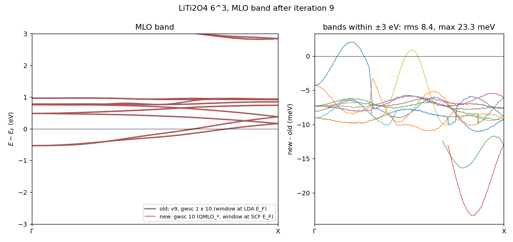

*図 02:45-1* 9 反復後の MLO バンド（Γ–X）。灰の太線 = 旧 v9（`gwsc 1` × 10、窓は LDA の $E_F$）、赤 = 新（`gwsc 10`、QMLO_*、窓は各反復の SCF の $E_F$）。
右は新 − 旧（$\vert E-E_F\vert<3$ eV のバンド）: **rms 8.4 meV、最大 23 meV**。ほぼ一様に 7〜10 meV 下がっているだけで、こぶ・振動は無い。
新の 9 反復目と旧の 10 反復目では rms 7.5 meV、最大 34 meV。

- 1〜9 反復とも、lmf の MLO Σ 内挿は 16/16 本で有効、χ̃ の MISS 0、エラー 0。ehf と ehk の差は 0.1 meV 以下
- ehf は −109751.00 → −109762.48 eV と滑らかに下がる（旧 v9 の 9 反復目 −109762.66）
- 描き方: 10 反復目の `hgw` の最中に 9 反復目の終わりの状態（rst、sigm、`QMLO_SigRs`、`QMLO_z`）を `snap/iter9` に写し、`draw_mloband.sh`
- 反復 3〜6 の QP シフトの差（最大 0.5 eV、表 01:57-1）は、$E_F$ ±3 eV のバンドにはほとんど出ていない

### 2026-09-27 01:57 **6³ の `gwsc 10`（新コード）は 1 反復目で旧 v9 と一致、2 反復目から分かれる。窓の基準が 0.55 eV 違うため**（user「LiTi2O4 の 666 と 999 を新しいコードで gwsc 10 でランして再現する」）

`qmlo_k6_gwsc10`（`run_gwsc10.sh`、`74e8f0925`、`--use_gemmul8`、00:37 開始、1 反復 14〜16 分）と `liti_mlo_v9`（`gwsc 1` × 10、旧コード）を
`cmp_gwsc10.py` で比べる。

*表 01:57-1* 反復ごとの差（新 − 旧）。固有値と QP シフトは `QPU.<N>run` の $\vert e-E_F\vert<3$ eV の状態の最大

| 反復 | ehf | 出発の固有値 | QP シフト（dSEnoZ） |
|---|---|---|---|
| 1 | −2.1 meV | ≤ 1 meV | ≤ 1 meV |
| 2 | −63.7 | ≤ 1 | 13 |
| 3 | +223 | 21 | 300 |
| 4 | +697 | 27 | 414 |
| 5 | +554 | 50 | 488 |
| 6 | +287 | 19 | 521 |

- 1 反復目は表示の分解能（1 meV）で一致: GEMMul8・Hilbert 変換の GPU 化・`gwsc 10` のどれも結果を動かしていない
- 2 反復目からの差は窓の基準: 段 a' の窓を旧 v9 は `HamRsMLO` の LDA の値（$E_F$ = 0.2497 Ry）に固定、新コードは各反復の SCF の値
  （7 反復目で 0.2903 Ry）。差 0.041 Ry = **0.55 eV**（窓の幅 $w=\Delta=2$ eV）。MLO の部分空間が変わるので軌道が分かれる。
  修正（21:42、23:22 段階 C）で意図した変更
- QP シフトの差が出発の固有値の差より 1 桁大きいのは、窓の縁（$E_F$＋2 eV 付近）の状態とみられる。$E_F$ 付近のバンドの一致は 10 反復後に見る

### 2026-09-27 01:20 **誘電行列の逆行列（matinv、1 q あたり 10 秒）: 単精度の LU ＋ Newton 1 回で 4 倍速く、誤差 3e-12**（未検証の選択肢として `458bd1868`）

W-build は q ごとに約 320 本の $\tilde\epsilon$（$n\approx1050$）を `zminv_d`（FP64 の LU、三角の逆 2 回、積、列の入れ替え）で逆にする。
RTX 5090 の FP64 は FP32 の 1/64 なので 1 本 31 ms。

*表 01:20-1* $n=1053$ の 1 本（`TOOLS/ozbench/matinvbench.cu`、GPU 0。条件数 1〜1e4 で同じ）

| 方式 | 時間 | 相対誤差 | $\max\vert I-AX\vert$ |
|---|---|---|---|
| 今の `zminv_d` | 約 31 ms | FP64 | |
| zgetrf ＋ zgetrs（FP64） | 21.6 ms | 基準 | 1e-14 |
| cgetrf ＋ cgetrs（FP32 のみ） | 3.1 ms | 1.8e-6 | 2e-6 |
| FP32 ＋ Newton 1 回（FP64 エミュレーションの積） | **7.0 ms** | **3.5e-12** | 4e-12 |
| FP32 ＋ Newton 2 回（同上） | 14.6 ms | 7e-15 | 8e-15 |

- Newton–Schulz $X\leftarrow X(2I-AX)$ は 1 回ごとに残差を 2 乗する。単精度の LU が効くのは条件数が 1e7 よりずっと小さいとき。
  $\tilde\epsilon = 1 - v^{1/2}\chi_0 v^{1/2}$ はこれに当たるが、MLO の重なり行列（条件数 7e4 の例あり）などは別なので、
  `zminv` の他の呼び出しは変えず、`m_llw` だけが `zminv_eps_d` を通す
- `ECALJ_MATINV_MIXED=1` のときだけ有効（混合精度の版は 1 回、倍精度の版は 2 回）。1 q あたり 10 → 約 2.3 秒の見込み。
  `hgw` での確認は GPU が空いてから（6³ なら `hgw` の約 1 割、9³ なら約 4%）

### 2026-09-27 00:55 **RTX 5090 の cuBLAS は複素 cgemm が遅い。$A^\dagger B$ を実数 SGEMM 1 回に組み替えると 2.7 倍**（精度は FP32 のまま）

Σc の積はどれも $C = A^\dagger B$（$A$ は小さな $W$、$B$ は大きな zmel）。$B$（$k\times n$ 複素）をそのまま実数 $2k\times n$、
$C$ を実数 $2m\times n$ とみなし、$A$ だけを実数 $A'$（$2k\times 2m$。列 $2j-1$ に $A$ の列の (Re, Im)、列 $2j$ に (−Im, Re)）に
写すと、$A'^{T}B$ が Re と Im の並んだ $C$ そのものになる。演算数は複素と同じ $8mnk$。

*表 00:55-1* 本番（6³）と GPU を分け合った状態での 1 回（`TOOLS/ozbench/realtrick.cu`、GPU 0）

| 形 $m\times n\times k$ | cuBLAS cgemm | 実数 SGEMM 1 回 | 比 | 差（相対） |
|---|---|---|---|---|
| 1053 × 49928 × 1053（Σc 虚軸） | 16.1 TFLOPS | 43.6 | 2.7 | 2.3e-6 |
| 1053 × 1000 × 1053 | 22.5 | 39.9 | 1.8 | 5.6e-7 |
| 1053 × 400 × 1053（実軸） | 27.3 | 28.5 | 1.0 | 1.1e-6 |

- 空いた GPU での cgemm は 31 TFLOPS（表 00:35-2）なので、SGEMM 側は 80 TFLOPS 前後が見込める。GEMMul8（42.6）より速く、精度も FP32 のまま
- `m_blas` の `cmm_d` に入れた（`0e2ca543d`）: opA=C・opB=N・alpha=1・実数 beta で $n\ge512$、$m,k\ge256$ のとき。`ECALJ_CGEMM_REAL=0` で切れる
- `hgw` での確認（E4）は 6³ の本番の後。E2（GEMMul8）より 1 割以上速く、Re Σc が E1 と 2e-5 eV 以内で合えば、
  9³ の本番をこの版で回す（`chain4.sh` が自動で判定）。合わなければ予定どおり `--use_gemmul8`

### 2026-09-27 00:35 **`hgw` の高速化: Hilbert 変換を GPU へ、Σc の大きな行列積を GEMMul8（Ozaki）へ。6³ の `hgw` は 833 → 629 秒（1.32 倍）、Σc の差は µeV**（user「hgw では q の切れ目ごとに GPU が約 35 秒止まり、の問題」「Ozaki での高速化高精度化（まずは高速化可能化検討）」「GPU と CPU を可能な限り効率よく使う方法の検討。RTX5090×2 と CPU 64 個ある」）

ベンチ: `liti_mlo_v9`（6³）の 10 反復後の状態をコピーし、`hgw` だけを同じ入力で回す（kt1、`-np2 2`、`--use_fp32`）。

*表 00:35-1* 6³ の `hgw` 1 回

| 実行 | 変更 | 秒 | W-build / q | Σc 虚軸 / KXloop | SECU（Re Σc）の基準との差 |
|---|---|---|---|---|---|
| 基準 | `c1b4b097a` | 833 | 36.1 | 0.168 | — |
| 1 枚に 4 ランク（`-np2 8`） | 設定のみ | GPU メモリ不足で停止 | | | |
| MKL 16 スレッド | 環境変数 | dpsion が 12 → 35 秒に悪化、打ち切り | | | |
| E1 | tetwt5 の修正 ＋ Hilbert 変換を GPU | 722 | 23.9 | 0.169 | 5.3e-6 eV |
| E2 | E1 ＋ `--use_gemmul8`（単精度複素 7 分解、fast） | **629** | 23.9 | **0.120** | 6.5e-6 eV |

（SEXU はどれも完全一致。E1 と E2 の差も 4.9e-6 eV。）

- **q の切れ目の停止**の中身（9³、1 q あたり約 35 秒）: Hilbert 変換 `dpsion` 12 秒（CPU 1 コアの MKL）＋四面体の重み `tetwt5` 21.6 秒（CPU 1 コア）。
  - `dpsion`: GPU の実行でランクが q グループに 1 つなら、$\chi_0$ は累積したまま GPU 上の `rcxq` に丸ごとある。
    そこで `dpsion_chiq_d` をかけてから SHM に写すようにした（`fde20bd6c`）。12 秒が **0.7 秒**
  - `tetwt5`: 組ごとに 326 ビン × 4 頂点を 0 にしていたのを、届くビンだけにした（和は同じ。GaAs・NiO でビット一致、`cfc7321fa`）。
    効果は 5.7 → 5.3 秒（6³）止まりで、主因は四面体 × バンド対の判定ループと `lindtet6` 本体。
    9³ では 1 q あたり約 20 秒の CPU 待ちが残る。k 点をスレッドに割り振る OpenMP なら whw のコピー無しで決定的に並列化できるが、
    OpenMP は 09-22 に意図して外したので、戻すかは user 判断
- **matinv**（1 q あたり 10 秒）は FP64 の LU（epstilde は MP 版でも complex(8)）。RTX 5090 の FP64 は FP32 の 1/64。
  cuSOLVER の数値モードは FP32 の BF16x9 だけで、FP64 のエミュレーションは無い。周波数ごとに CPU 64 コアで並列に解けば
  1〜2 秒の見込みだが、WVRllwR の組み替えが要るので未着手（9³ では `hgw` の約 4%）
- 1 枚の GPU に複数ランク: 各ランクが GPU を丸ごと使う前提でメモリを見積もる（AutoSetup）ので不足する。1 ランクで 29 GB を見た
- MKL のスレッド: nvfortran の OpenMP 実行時とかみ合わず、CPU 使用率 100% のまま遅くなった

*表 00:35-2* 行列積 1 回（RTX 5090、`TOOLS/ozbench`、`394a360a9`）。誤差は FP64 zgemm に対する最大相対誤差

| 方式 | Σc 虚軸（1053×49928×1053） | 実軸（1053×400×1053） | 最後の縮約（158×158×332748） | 誤差 |
|---|---|---|---|---|
| cuBLAS FP32 | 31.3 TFLOPS | 31.4 | 29.7 | 1.3e-6 |
| cuBLAS TF32 | 104.9 | 65.4 | 56.0 | 3e-4 |
| GEMMul8 単精度 7 分解 fast | **42.6** | 22.6 | 14.9 | 3.9e-7 |
| GEMMul8 単精度 8 分解 fast | 37.5 | 19.6 | 13.4 | 4e-8 |
| cuBLAS FP64 | 1.7 | 1.9 | 1.3 | — |
| cuBLAS 組み込みの FP64 エミュレーション | 10.8 | 5.7（eager）| 2.0（eager）| 4e-15 |
| GEMMul8 倍精度 14 分解 fast | **21.3** | 11.5 | 7.9 | 4e-15 |

- **Σc の主役（虚軸の行列積）は cuBLAS の FP32 で頭打ち**（31 TFLOPS、FP32 ピーク 105 の 3 割）。`hgw` 内でも実効 32〜37 TFLOPS で、行列積そのものが律速
- **Ozaki の結論**: 大きな積（3 辺とも 1000 以上）では単精度の模擬が cuBLAS FP32 より 1.36 倍速く、しかも 3 倍正確。
  小さな積は遅いので、`--use_gemmul8` は大きな積だけに効かせた。**倍精度の模擬は 21 TFLOPS（誤差 4e-15）で、FP32 の 0.7 倍の速さで倍精度**。
  ネイティブ FP64 の 12 倍、cuBLAS 組み込みのエミュレーションの 2 倍。倍精度では全部の形でネイティブより速いので閾値を下げた（`ef4056a35`）
- GEMMul8 は上流の構成が変わってビルドできていなかった（kt1 の `~/bin/libgemmul8.so` は自分を指すリンク）。ビルドと、
  毎回の cudaMalloc/cudaFree をやめる修正（`e75ee4c76`）
- 9³ の見込み: Σc が約 2 割、dpsion の分と合わせて `hgw` は 5000 → 約 4000 秒
- 本番の 666・999（`gwsc 10`）は E2 の構成（`--use_gemmul8`）で回す

### 2026-09-26 23:45 **`Samples/MLOQSGW`（GaAs、NiO）を追加。MLOsamples 25 件も新しいコードで全部合格。kt1 でも CPU・GPU で合格**（user「Samples/MLOQSGW/ も作っておいてください。まずは GaAs, NiO などでいいです」「終わったら連続して kt1 でもテストする」）

- `Samples/MLOQSGW/{GaAs,NiO}`: TestInstall の `gas_gwsc`・`nio_gwsc` の ctrlg に `[mlo]` を足したもの（2×2×2、`mlo_nkabc=[2,2,2]`、
  `mixbeta=0.5`）。`ECALJ_MLO_MIX=1 gwsc 2 --mlo` で LDA から 2 反復。`QPU`（NiO は `QPD` も）と `log` の `fp evl` を参照と比べる。
  参照は gfortran-14・`-np 4`。ギャップは GaAs 0.723 → 1.030 eV、NiO 1.587 → 2.066 eV（各反復の終わりの lmf）。`134003355`
- ローカル: `testecalj -np 4 GaAs NiO` 差 0.0。`Samples/MLOsamples` 25 件（通常の MLO、`--all` と同じ集合）も全部合格（12 分）
- kt1（nvfortran、`c1b4b097a` を再ビルド。InstallAll の `--all` も合格）: CPU・GPU（`-np2 2 --gpu`）とも合格（QPU の差 1e-3 eV）
- kt1 `--gpu --mp` は **NiO の `fp evl` が 0.0135 Ry ずれて不合格**（許容 0.005）。GaAs は合格。原因は精度の設定:
  testecalj の `--mp` は `--fp32` を付けないので、行列積は `CUBLAS_COMPUTE_32F_FAST_TF32`（仮数 10 bit）で回る
  （[m_blas.f90:345](../../SRC/subroutines/m_blas.f90#L345)）。1 反復目の `QPU` で既に SEx が最大 0.03 eV（相対 1e-3、TF32 の丸めの桁）ずれ、
  lmf のギャップは 0.09 eV 小さい。LiTi2O4 の本番は `--fp32` を付けているのでこの影響はない。TestInstall の `nio_gwsc` が
  `--mp` で許容を 5e-3 に緩めているのも同じ理由とみられる

### 2026-09-26 23:22 **MLO-QSGW のファイルを `QMLO_*`（残す）と `__QMLO_*`（作業）に改名。$z^{\rm MLO}$ は MPI-IO で 1 ファイル、`__SigmMLO.q.prev` は廃止**（user「QMLO を冒頭につける。テンポラリは __ から」「`ZmloSig.<rank>` は mpiio を使って一つのファイルにしてほしい」「じゃあ、最後までやって」「通常の mlo のサンプルも壊してはいけない」）

*表 23:22-1* 改名

| 旧 | 新 | 中身 |
|---|---|---|
| `SigRsMLO` | `QMLO_SigRs` | 実空間の $\Sigma^{\rm MLO}$。次の反復・再開はこれを読む |
| `ZmloSig.<rank>` | `QMLO_z` | $\Sigma^{\rm MLO}$ を書いたときの $z^{\rm MLO}$。全 k・スピンを 1 ファイル（MPI-IO、固定長レコード、先頭に索引） |
| `ZmloNew.<rank>` | `__QMLO_zNew` | この反復の lmf が作った $z^{\rm MLO}$。`m_HamPMT` が `QMLO_SigRs` を書くときに `QMLO_z` へ昇格 |
| `__SigmMLO.q` | `__QMLO_Sig` | `hqpe_sc` が書く k 点の $\Sigma^{\rm MLO}$ |
| `__SigmMLO.q.prev` | （廃止） | 混合の $x_0$ は `QMLO_SigRs` のブロッホ和で作る |
| `__mixsigMLO` | `__QMLO_mixsig` | $\Sigma^{\rm MLO}$ の Anderson 履歴（消すと線形混合から） |

- 段階 A（`02bdd9953`、改名＋MPI-IO）・B（`9b2a015e2`、$x_0$ を `QMLO_SigRs` から）は GaAs 2³ の 3 反復で改名前と一致
  （ギャップ 0.053118 / 0.081210 / 0.094643 Ry、ehf も一致、`-np 4` と `-np 1`）。B の往復 $\vert$ブロッホ和 − `__QMLO_Sig`$\vert$ ≤ 0.001 meV
- 段階 C（`589747bb2`）: **21:42 の窓の修正は 2 反復目以降効いていなかった**。`sigmlo_init` が `HamRsMLO` の LDA の値で
  窓の基準を上書きしていた。`efermi.lmf`（最後の SCF）を読むように直した。GaAs のギャップは 2・3 反復目で変わる（1.030 / 1.274 eV）
- `__` の作業ファイルを混合履歴以外すべて消して再開 → 一致。履歴も消す → 線形混合で走る（ギャップ 1.340 vs 1.320 eV）
- `gwsc`: 反復の頭で前の反復の作業ファイル（`__cmlo.*`、`__HamiltonianGW*`、`__QMLO_zNew`、`__QMLO_Sig`）を消す。
  `HamRsMLO` があって `__HamiltonianPMT` が無いときは `lmf --writeham` を回し直す。LiTi2O4 のチェーン用スクリプトも新しい名前に（`c1b4b097a`）
- 古い名前のファイルは読まない（互換は不要、user「５はいらない」）。旧コードのチェーンは新コードで継続できない

### 2026-09-26 22:27 **`job_band` などが `efermi.lmf` を書き換えないようにした**（user「job_band の efermi.lmf は efermi.lmf.job_band として扱った方がいい。efermi.lmf は更新せずに」「job_band, job_fermisurface, job_pdos は直した方がいい。job_mlo_soc は efermi_soc のみいじればいいのでは」「新形式に直して動くようにして」）

`efermi.lmf` は最後の SCF の値で、次の QSGW 反復の段 a'（MLO の窓）と `mlo` が読む。`lmf --quit=band` や `lmf --tdos` の
1 回だけのバンド計算（別のメッシュ・設定）がこれを上書きしていた。

- `lmf`/`mlo` に `--efermi=<file>`（`m_cmdopt_registry` の `efermi_file()`）。`m_bndfp` の書き込みとバンド描画モードの読み込み、
  `m_readqplist`（`readqplistsy`、`readbandedge`）がこの名前を使う
- `job_band` → `efermi.lmf.job_band`、`job_dos` → `efermi.lmf.job_tdos` / `.job_pdos`、`job_fermisurface` → `efermi.lmf.job_fermisurface`
- `job_mlo_soc`: 1 段目が SOC の $E_F$ を `efermi_soc` に直接書き、3 段目の `mlo` も `--efermi=efermi_soc` で読む（窓の基準は以前と同じ SOC の値）
- `job_fermisurface` は廃止形式の `-vnk1=`・`-pr45` を `lmf` に渡しており、今の `lmf` は引数検査で弾くので動いていなかった。
  `--ctrlg:bz.nkabc=[..]`・`--ctrlg:verbose=45` に直した

**確認**: Si で `job_band`・`job_tdos`・`job_pdos`・`job_fermisurface` を順に回し、毎回 `efermi.lmf` の md5 が不変、専用ファイルができ、
出力（バンド、DOS、PDOS、`fermiup.bxsf`）もそろう。バンドの図の $E_F$ は `efermi.lmf.job_band` の値（0.2336502 Ry、SCF は 0.2336276）。
`Samples/MLOsamples/GaAsSoc`（`job_mlo`・`job_mlo_soc`）は参照との差 0.0 で合格、作業ディレクトリの `efermi.lmf` は元と同一。
TestInstall の `co`（`job_pdos`）・`fe`（`job_tdos`）も合格。ecalj `12e9882a7`、ecaljdoc `1ac6097`（どちらも未 push）。

### 2026-09-26 22:04 **1 反復目の混合を Si で確認: β=0.5 ならちょうど半歩、既定の β=1.0 なら全量**（user「si_gwsc で通常の gwsc を 1 回回して確かめて。mix の値次第でバンドが違うはず」）

`Samples/TestInstall/si_gwsc` の入力を 2 組コピーし、`[gw] mixbeta` だけ変えて LDA から `gwsc 1 -np 8`（MLO なし）。各 26 秒。

*表 22:04-1* Si、1 反復目

| | `sigm` 混合前 → 後（`lqpe` の sum check） | ギャップ | LDA からの増え |
|---|---|---|---|
| LDA | — | 0.571 eV | — |
| β = 1.0（既定、`m_GWinput.f90:213`）| 6.0488 → 6.0488 | 1.293 eV | +0.721 eV |
| β = 0.5 | 6.0488 → 3.0244 | 0.934 eV | +0.362 eV（β=1 の 0.502 倍）|

- どちらも `... No mixing file __mixsig`、`AMIX: nmix=0`（履歴なしの線形混合）。`QPU` は 2 本で同一で、違うのは β だけ
- **既定は β = 1.0 なので、普通の QSGW は 1 反復目から全量が入る**。「1 反復目でほぼ最終結果」はこの場合。
  LiTi₂O₄ の連鎖は `mixbeta = 0.5` を明示していたので 1 反復目は半分（`sigm` 812.37 → 406.18、2026-09-25 23:58）

### 2026-09-26 21:46 **`gwsc N` でも $\Sigma^{\rm MLO}$ の混合が正しくなるように直した**（user「コードの方を直してくれ」）

`gwsc` は `__SigmMLO.q` → `__SigmMLO.q.prev`（混合の $x_0$）の改名を反復ループの前で 1 回しかしていなかったので、
`gwsc N`（N ≥ 2）の 2 反復目以降は 1 つ前の $\Sigma^{\rm MLO}$ を $x_0$ にしていた（`ECALJ_MLO_MIX=1` のときだけ効く）。
LiTi₂O₄ の 6³・9³ は `run_snap.sh` が `gwsc 1` を 10 回呼んだので影響なし。

修正: 後片付けを `mlo_iteration_start()` にまとめ、段 0c/0d の前（`mlo --mlo` に古い `__SigmMLO.q` を読ませない）と毎反復の頭で呼ぶ。
改名は `__SigmMLO.q` があるときだけなので、2 回続けて呼んでも何も変わらない。関数だけを取り出して一時ディレクトリで 3 反復を模擬し、
各反復の $x_0$ がその反復の $\Sigma^{\rm MLO}$ になること、`ZmloSig.*`・`SigRsMLO` に触らないことを確認した（実計算では未確認）。

### 2026-09-26 21:42 **窓の基準を各反復の SCF に直した**（user「一体どこから fermi energy を取ってきてるのか。lmf の収束計算から取ってきてたなら問題ないはず」「まずコードを直して」）

**何が起きていたか**: 段 a'（`sugw`）は式 (3) の窓の基準 `eferm`/`ecbot` を `HamRsMLO` の末尾から読んでいた。
これは連鎖の最初（段 0d `mlo --mlo`）に LDA の SCF が書いた `efermi.lmf` の値で、その後更新されない。
$\tilde\chi$ を連鎖を通じて凍結していた旧設計の名残（`m_HamPMT` の `FrozenModel`）。各反復の SCF は `efermi.lmf` を書き直し、
段 a' にも今の $E_F$ が渡っていたが、ログに並べて表示するだけだった。

*表 21:42-1* 段 a' のログ（`sugw a' window`）の $E_F$ [Ry]。`HamRsMLO` 側は 6³ で 0.249697、9³ で 0.249596 のまま

| iter | 1 | 2 | 3 | 5 | 7 | 10 |
|---|---|---|---|---|---|---|
| 6³ SCF | 0.249690 | 0.271957 | 0.281398 | 0.289638 | 0.291458 | 0.291168 |
| 9³ SCF | 0.249606 | 0.271955 | 0.281258 | 0.289834 | 0.291121 | 0.290915 |

iteration 10 で +0.0415 Ry（+0.56 eV）。LiTi₂O₄ は金属で `ecbot` ≈ $E_F$ なので、窓の床は意図した $E_F$+2.0 eV でなく約 $E_F$+1.5 eV にあった。

**修正**（`sugw.f90` の `PrepCmlo`）: `set_bandedge(eferm, eferm)` の後に `readbandedge()`。$E_F$ は呼び出し元（その反復の密度）、
`ecbot` は同じ SCF が書いた `efermi.lmf` の `ecbot − eferm` を足したもの。ログは `sugw a' window: SCF eferm ecbot= … | HamRsMLO(chain start) eferm ecbot= …`。
`getsenex`（`ZmloSig` を読むだけ）と④の `mlo --mlofreeze` の窓は $\Sigma$ の値に効かないので触っていない。
手元の `build_gfortran` でコンパイルのみ確認。**実行での確認と kt1 への反映はまだ**。§3 の LiTi₂O₄ の結果はすべて修正前。

### 2026-09-26 21:24 方式の名前は **MLO Sigma インターポレーション**（user「イテレーティブ Σ インターポレーションはやめる。MLO Sigma インターポレーションでいい」）

- ecaljdoc `mlo_gwsc.md` の §1.1・§1.4 を改名（`44c1c78`）。20:58 の「イテレーティブ Σ インターポレーション」、設計書の「2 スロット」と同じもの
- その前に `556b0c9` で、user の指摘（「式 6 の行列 S の定義がない」「行列はインターポレーションできる。そもそも k 空間でのインターポレーションと書く」「読む側は z を作れない、は蛇足」）を反映:
  $S^{\rm PMT}$ と係数行列 $\psi$ を定義して $c=\psi^\dagger S^{\rm PMT}z^{\rm MLO}$ を明記、式 (7) の射影子を $\hat P_{\rm MLO}$ に（式 (1) の $\hat P(k)$ と記号が重なっていた）、
  内挿はすべて「k 空間での内挿」、§1.4 の事実は「MLO 表現の行列は内挿できる／PMT の行を持つ $z^{\rm MLO}(k)$ はできない」の 2 つに
- VSCode のプレビューで ecaljdoc の図が出ない件: md の相対パスは 3 本とも解決し、同じ Markdown Preview Enhanced（MPE）で書き出した PDF には図が入っている。
  **原因は MPE 0.8.38 の `g1()`**: md の属するワークスペースを `fsPath.startsWith(folder)` の文字列前方一致で探すので、
  `/home/takao/ecaljdoc/...` を `/home/takao/ecalj` の中と誤認し、webview の `localResourceRoots` が ecalj だけになる。
  ecaljdoc の画像はパスが正しくても読み込みを拒否される。ecaljdoc を別ウィンドウで開くか、ワークスペースに追加すれば出る

### 2026-09-26 20:58 ecaljdoc `mlo_gwsc.md` を user の直しに合わせて整理（user「苦労話はいらない。必要な話はいる」「2 スロットは適切でない。イテレーティブ Sigma インターポレーションかな」「バンドのイテレーションの図は埋め込むべき」）

- 方式の名前を **イテレーティブ Σ インターポレーション**（iterative Σ interpolation）にした: MLO は反復ごとに作り直し、$\Sigma$ はその MLO で書いて同じ MLO で読み戻す。
  この研究ログと設計書の「2 スロット」は同じものを指す（置き場 `ZmloSig`/`ZmloNew` が 2 つあることに由来）
- 経緯の表（旧 §1.8）と失敗談の行（旧 §4 の凍結・400 倍・未修正バイナリ・`zMLO`）を削除。経緯はこのログにある
- 表示数式すべてに番号 (1)–(7)。user が足した別行の式も VitePress と同じ経路で数式として描画されることを確認
- バンドの図は全反復の版（`liti2o4_5col_all.png`）を本文に直接貼り、縮小版 `liti2o4_5col.png` は削除（20:06 の表の 1 行目はもう使っていない）
- ecaljdoc `04eca60`（未 push）

### 2026-09-26 20:06 **ecaljdoc の `manual/mlo_gwsc.md` を書き直した**（user「mlo-gwsc のノートを書いてくれる？ 理論、セッティング、実例という感じ。理論も右往左往したのでまとめて」）

旧版は `ZmloRef` の凍結方式と、撤回済みの LiTi₂O₄ の判定のままだった。構成は §1 理論（最終形、§1.8 に迷った経緯の表）、
§2 設定と実行、§3 LiTi₂O₄（6³・9³）、§4 落とし穴、§5 未解決。ecaljdoc `937efa2`（未 push）。
数値・キー名・ログの文言・環境変数の意味は、この研究ログ・設計書・ソースと突き合わせてから書いた。

*表 20:06-1* ecaljdoc `manual/mlo_gwsc/` の図の出どころ

| 図 | 元 |
|---|---|
| `liti2o4_5col.png`（本文に貼った縮小版）| 新規。`ROWS=0,1,3,5,10 HILITE=1 MESH=6,9 MESHCOLS=6,6,6,9,9 mlo_rows.py <root> <out> v9,v9mlo,k9,k9mlo '…' '…'`（`ROWS` はこのために足した）|
| `liti2o4_5col_all.png`（折りたたみ）| `LiTi2O4/mlo_rows_6vs9_hilite_final.png` と同一 |
| `liti2o4_conv.png` | `LiTi2O4/mlo_conv_k9final.png` と同一 |
| `liti2o4_fatband.png` | `LiTi2O4/fatchar_k9_iter4.png` と同一 |

**突き合わせで分かったこと・直したこと**

- 設計書 §10.5 の「`mlo_w`・`mlo_delta` は `ctrlg` の `[gw]` 節」は誤りで、実際は `[mlo]` 節（kt1 の `liti_src_full9_k9/ctrlg.liti2o4.toml` で確認）。設計書の状況欄と A5 も「9³ 走行中」から完了に更新
- ecaljdoc `cmdopts.md` の `--mlofreeze` が「凍結した $\tilde\chi$ と窓」のままだったので、「MLO 索引を使う、$\tilde\chi$ の係数は毎反復作り直す」に直した
- `run_snap.sh` のスナップショットに `__SigmMLO.q` は入っていないが、そこから再開しても混合の $x_0$ は正しい。
  `mixsigma` は `amix` の後の $x$（= 次の反復が使う混合結果）を `a(:,0,2)` として履歴に書き、`__SigmMLO.q.prev` が無いときはそれが $x_0$ になる。
  $x_0=0$（$\Sigma^{\rm MLO}$ が一度 β 倍）になるのは `.prev` も `__mixsigMLO` も無いときだけ
- 「MLO バンドはメッシュ点の間でも滑らか」は言い過ぎだった。こぶが消えるのは膨れるバンド（青）で、一番下のバンド（緑）の階段状の肩は
  序盤の反復では MLO バンドにも出る（11:10 のエントリ）。ノートにはそのとおり書いた
- 76 軌道と 126 軌道の優劣は、$\Sigma^{\rm MLO}$ を混合する前（どちらも iter 3 で行き過ぎ）までしか比べていない。ノートには未決着と書いた

### 2026-09-26 18:30 **9³ の MLO-QSGW が 10 反復で完了**。MLO バンドは 6³ と同じ床まで収束し、メッシュを変えたときの動きも `sigm` 描画の半分

`liti_mlo_k9`（nmlo 126、β=0.5、`nkabc = n1n2n3 = mlo_nkabc = 9³`）、03:07 投入 → 18:24 完了。**10 反復すべて健全性チェック合格**
（9³ の期待値 `mloON=35`、`gwdrv=50`）。1 反復 5305–5435 秒（約 89 分）。

*図 18:30-1〜3* 完了時点で凍結（左から 従来 6³ / 6³ `sigm` / 6³ MLO バンド / 9³ `sigm` / 9³ MLO バンド、赤い × はメッシュ点）

[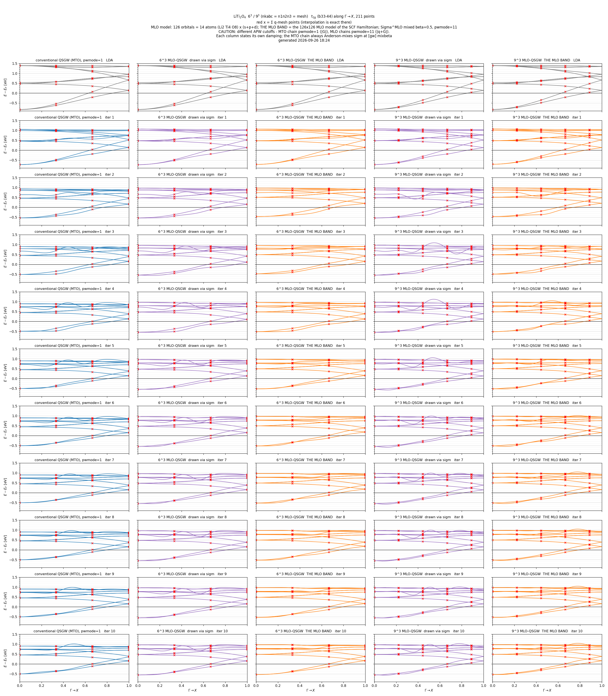](LiTi2O4/mlo_rows_k9final.png)

`Samples/kBT/LiTi2O4/mlo_rows_k9final.png`, `mlo_rows_6vs9_hilite_final.png`, `mlo_conv_k9final.png`

*表 18:30-1* 反復ごとの変化 rms [meV]（最後の 4 反復）

| $N$ | 7 | 8 | 9 | 10 |
|---|---|---|---|---|
| **9³ MLO バンド** | 7.4 | 3.2 | 5.2 | **3.2** |
| 6³ MLO バンド（v9）| 6.9 | 2.9 | 6.2 | 3.9 |
| 従来 6³（`pwmode=1`）| 6.7 | 6.6 | 4.7 | 6.5 |

9³ も 6³ と同じ床（rms 3–7 meV）に落ちた。

*表 18:30-2* iteration 10 のバンドの差 [meV]、バンド 33–44

| 比較 | max | rms | 平均 |
|---|---|---|---|
| **MLO バンド: 9³ − 6³** | 95 | **13.0** | +3.6 |
| `sigm` 描画: 9³ − 6³ | 168 | **27.4** | +3.3 |
| 9³ MLO バンド − 従来 6³ | 175 | 48.6 | +33.7 |

- **メッシュを 6³ → 9³ にしたときの動きは、MLO バンドが `sigm` 描画の半分**（rms 13 対 27 meV）。
  MLO 表現の内挿の方がメッシュに鈍い
- 従来 6³ との差（rms 49、平均 +34 meV）は 6³ の MLO バンドのとき（rms 46、+30）とほぼ同じで、9³ にしても縮まらない。
  `pwmode` の差か $\Sigma$ の表現の差かは、`pwmode=11` の従来チェーンが無いと分けられない（設計書 §13 C1）
- 色分けの図: 9³ の `sigm` 描画では中央で膨れるバンド（青）が iteration 3〜6 で大きく揺れ、7 以降は収まる。
  9³ の MLO バンドでは iteration 5 以降、青（膨らみ 50 meV 超）が出ない。従来 6³ の列では iteration 9〜10 に青が出る

### 2026-09-26 11:10 **振動が乗るのは 2 本のバンド。青は O $p$ を最も多く含む**（user「振動が乗るのは一番下のバンドと Γ→X の中央あたりで膨れるバンド」「これらのバンドのキャラクターはわかるか」）

**色分け**（図 L-3）: 各 k でエネルギー順に引いた線では、平らなバンドを突き抜けて膨らむ 1 本がいくつもの線に分かれるので、
交差をまたいで連続性で追跡した（前 2 点からの線形予測 ＋ ハンガリアン法、`mlo_rows.py` の `HILITE=1`）。

- 9³ の `sigm` 描画では青が iteration 3〜5 で 0.6 → 1.1 → 0.55 eV と大きく波打つ（周期はメッシュ間隔 2/9 の約 2 倍）。
  **9³ の MLO バンドでは振幅が大きく減り、iteration 5 では膨らみが 50 meV 未満**になった
- 6³ では青が出るのは `sigm` 描画の iteration 3 だけ。**9³ の方が振動が大きい**のは 9 月 23 日の従来チェーンの観察
  （メッシュを密にすると占有 t2g のさざ波が大きくなる）と同じ向き。MTO 表現の $\Sigma(R)$ が遠方で減衰しないので、
  周期セルが大きいほど減衰しない成分を多く拾って内挿する、と見ている
- 赤（一番下）は両方の描き方に階段状の肩が出る（段の間隔はメッシュ間隔に近い）

*図 11:10-1* 9³ iteration 4 の fat band（`job_band --fatband`、`sigm` 描画の PMT バンド）。上: t2g、中: 赤の軌道成分、下: 青の軌道成分。
1 との差は射影されない部分（MT 球の外）。青の x ≈ 0.43, 0.46 のとげは交差点で縮退した 2 本の重みが混ざったもの

[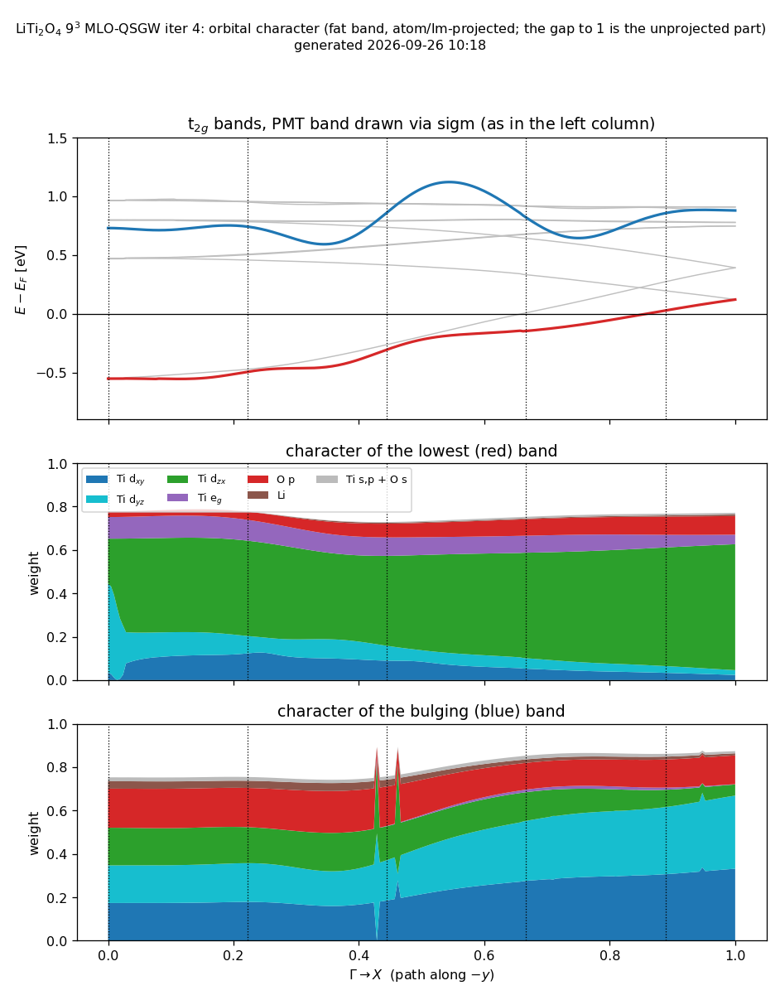](LiTi2O4/fatchar_k9_iter4.png)

`Samples/kBT/LiTi2O4/fatchar_k9_iter4.png`（生成: `LiTi2O4/fatchar.py`）

*表 11:10-1* 2 本の性格（経路は $(0,-x,0)$ で $y$ 方向）

| | Γ | 中央（x ≈ 0.55）| X |
|---|---|---|---|
| **赤** | Ti $d_{yz}$ 0.41 ＋ $d_{zx}$ 0.21（Γ の縮退）、O $p$ 0.03 | Ti $d_{zx}$ 0.46、O $p$ 0.07 | Ti $d_{zx}$ 0.58、O $p$ 0.09 |
| **青** | **Ti $d_{xy}$ = $d_{yz}$ = $d_{zx}$ = 0.17、O $p$ 0.18** | $d_{xy}$, $d_{yz}$ 0.24、$d_{zx}$ 0.14、O $p$ 0.15 | $d_{xy}$ 0.33、$d_{yz}$ 0.34、$d_{zx}$ 0.05、O $p$ 0.13 |

- 赤は $d_{zx}$（経路の $y$ を含まない軌道）が主で、性格は経路に沿って滑らかに変わるだけ。**肩の所で性格が変わらない**ので、
  別のバンドとの混成ではなく $\Sigma$ 側の揺れと見られる
- 青は Γ で 3 つの t2g が等量の対称な組み合わせ（三方歪みの $a_{1g}$ 型）で、**O $p$ が t2g の中で最も多い**（赤の約 6 倍）。
  従来の `sigm` は $\Sigma$ を MTO の部分空間に擬似逆で射影するので、O $p$ や MT 球の外に広がった成分の表し方が最も粗い。
  そこで内挿の振動が最大になる、という見方と整合する
- 射影されない部分（MT 球の外）は赤も青も Γ で 22–25% とほぼ同じ。青を特徴づけるのは隙間の重みではなく O $p$ の多さ

**user の見立て（記録）**: この振動が占有帯などに反映されると収束不安定を引き起こす。戻り道は (1) SCF のメッシュが GW と違うとき
（以前の 9³ 従来チェーンは `nkabc = 16³`）、(2) メッシュを揃えても GW ドライバのオフセット Γ 点では $\Sigma$ を内挿する、
(3) $E_F$ 近傍の占有数。空球（empty sphere）を入れると安定するか、は未検証（kt1 の `mlo_es_lda` は空球 6 個の LDA 段階の設定のみ）。

### 2026-09-26 07:50 **GPU 2 枚の使われ方（9³ の `hgw`）**: 分担は対称。損失は q の切れ目ごとの停止が最大（約 11%）（user「2 枚の GPU の使い方は効率がいいか」「そもそもシンメトリックでない使い方なのか」）

*表 07:50-1* 9³ iteration 2 の 1 反復（5326 秒）の内訳（`g2.log` のタイムスタンプ）

| 段 | 秒 | 割合 |
|---|---|---|
| **`hgw`（GPU 2 枚、W と Σc）** | **5004** | **94%** |
| `hsfp0_sc` + `hvccfp0` ×2（GPU）| 154 | 3% |
| `lmf` 類（CPU 60 プロセス）、`mlo`、`hqpe_sc` など | 約 170 | 3% |

**分担は対称**: GW の q は 36 個で 2 プロセス（= 2 枚）に 18 個ずつ。1 つの q の W 構築は約 63 秒で一定、
Σc は約 60 / 80 / 120 / 240 / 480 秒のとびとびの値（倍々なので q 点の星の大きさに比例しているとみられる）。
Σc の合計は GPU 0 が 3688 秒、GPU 1 が 3513 秒（差 5%）。480 秒級・240 秒級の q も同じ数ずつ持っている。

*表 07:50-2* iteration 3 の `hgw` 終盤 23 分を 2 秒ごとに測った稼働率

| | 平均 | アイドル（< 30%）| 内訳 |
|---|---|---|---|
| GPU 0 | 77% | 16% | q の切れ目の停止のみ |
| GPU 1 | 66% | 27% | q の切れ目 ＋ **最後に 178 秒待ち** |

- **q の切れ目**: 約 5 分ごとに「22–24 秒停止 → 40 秒後に 12 秒停止」を 2 枚とも繰り返す。
  q ごとに約 35 秒、GPU を止めて CPU 側で次の準備をしている。**`hgw` の約 11%**
- **最後の待ち**: GPU 1 が 178 秒先に終わって待つ。Σc 合計の差 175 秒と一致。`hgw` の約 3.5%
- 2 分だけ測ったとき GPU 1 のメモリが 29 → 3.9 GB と上下して非対称に見えたのは、たまたま切れ目に当たったため

**取り返しどころ**: 次の q の準備を前の q の GPU 計算と重ねる（先読み）と約 1 割。割り振りの詰めで約 3%。

**数値精度と速さの関連メモ**（RTX 5090、NVIDIA 白書 Appendix A Table 3）: FP32 104.8、**TF32 テンソル 104.8（密）**、
BF16/FP16（FP32 累積）209.5、INT8 838 TOPS、**FP64 は FP32 の 1/64**。混合精度 GPU 版の行列積は既定で
`CUBLAS_COMPUTE_32F_FAST_TF32`、`--use_fp32`（`gwsc --fp32` が渡す）で本当の FP32（[m_blas.f90:345](../../SRC/subroutines/m_blas.f90#L345)）。
GEMMul8（Ozaki）の差し込み口は `m_blas` にあり、分解数は単精度複素 7、倍精度 15。単精度では上限 1.1–1.5 倍どまり、
倍精度ならネイティブ FP64 の約 35 倍（＝いまの FP32 の 0.5–0.7 倍の速さで倍精度）。Σc では同じ `zmel` に周波数ごとの
$W(\omega)$ を掛けるので、`enable_skip_A/B` で分解を使い回せる（今は常に 0）。**試すのは後日**（user）。

### 2026-09-26 03:15 **v9（6³、MLO 126、β=0.5）10 反復完走 → 判定して 9³ を投入**（user「10 回回す。およその収束を確認。そのあと 9×9×9 で投入」）

*図 03:15-1, 03:15-2* v9 最終（凍結）。左 = 従来（`pwmode=1`）、中 = v9 を `sigm` で描画、右 = **v9 の MLO バンド**

[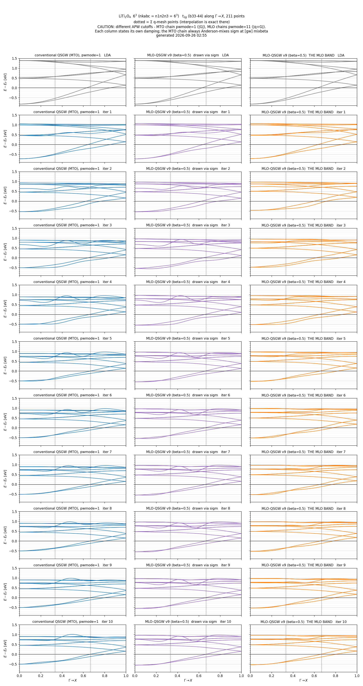](LiTi2O4/mlo_rows_v9final.png)

[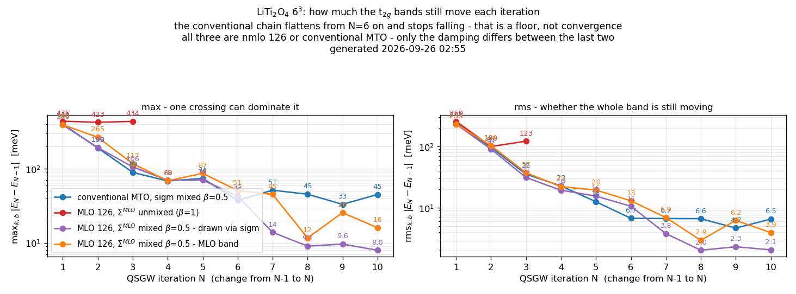](LiTi2O4/mlo_conv_v9final.png)

`Samples/kBT/LiTi2O4/mlo_rows_v9final.png`, `mlo_conv_v9final.png`

**1. 異常**: 10 反復すべてで `check_iter.sh` 合格（rc、時間 951–996 s、MLO の印、$x_0$ を `.prev` から、履歴 2 本、χ̃ 昇格、SCF 収束、MLO バンド描画の MISS 0）。

**2. 収束** — 反復ごとのバンド変化 rms / max [meV]

| $N$ | 7 | 8 | 9 | 10 |
|---|---|---|---|---|
| **MLO バンド** | 6.9 / 45 | 2.9 / 12 | 6.2 / 26 | **3.9 / 16** |
| 従来（`pwmode=1`、β=0.5）| 6.7 / 51 | 6.6 / 45 | 4.7 / 33 | 6.5 / 45 |

従来と同じか小さい床にいる。**およそ収束**と判定。

**3. 従来との一致**（iteration 10、バンド 33–44）

| | 全体 | メッシュ点 | メッシュ点の間 |
|---|---|---|---|
| MLO バンド − 従来 | rms 46 / max 111 / 平均 +30 | rms 43 / max 72 / 平均 +34 | rms 46 / max 111 |

- 一様なずれではない。占有 2 本は 7–13 meV **低く**、非占有 t2g は 22–61 meV **高い**。t2g 全体の幅は 1505 対 1516 meV でほぼ同じ
- **メッシュ点でも 43 meV** 違う → 内挿の差ではなく**状態の差**（$\Sigma$ の表現か `pwmode` 1 対 11）
- メッシュ点の間で max が 72 → 111 に増えるぶんは従来側のこぶ（リンギング）
- LDA での `pwmode` の差は rms 5.6 meV（02:45）。切り分けには `pwmode=11` の従来 10 反復が要る（未実施）

**判断**: 大筋一致（形と幅は同じ、差は数十 meV で状態の差）。異常なし、収束よし → **予定どおり 9³ へ**。

**9³ 投入前に直したもの**

- チェーン本体のバイナリにも `zMLO` 修正を入れた（02:56 再ビルド、4 系統とも `m_HamPMT` 再コンパイル）。
  9³ では q 点が増え、ランク数を超えると段 ④ ではみ出しが起こりうるため
- `run_snap.sh` のバンド段: `job_mlo --mlofreeze --mlo` を**やめて** `draw_mloband.sh` に。修正後は落ちずに
  基底が混ざった誤ったバンドを「MLO バンド」として保存してしまうため（`ec30b1d3a`）
- `check_iter.sh` の閾値を外から与える形に（`CHECK_MAXSECS` など）。6³ の 2000 秒のままだと 9³ の全反復を
  「ハング」と誤判定する

**9³ の設定**（`liti_mlo_k9`、`LITI_SRC=liti_src_full9_k9`）: v9 と同じ（nmlo 126、`ECALJ_MLO_MIX=1`、`pwmode=11`、`mixbeta=0.5`）で
**`nkabc = n1n2n3 = mlo_nkabc = [9,9,9]`** のみ変更。03:07 投入、LDA `ehf = −109750.181860 eV`、
`gwsc` の事前チェック `MLO k-mesh check OK`、LDA 後の混合ファイル 0。

### 2026-09-26 02:45 **比較の基準（左列）の素性**: iteration は `pwmode=1`、LDA 行だけ `pwmode=11` の混成だった／v9 は MLO バンドでも従来とほぼ同じ床

**v9 iter 9**（全チェック合格）: MLO バンドの rms 変化は 6.9 → 2.9 → **6.2** meV。iter 8 の 2.9 は一点の谷で、床を抜けたのではない。
従来チェーンも 6.7 → 6.6 → 4.7 で、**両者とも 3–7 meV の同じ帯**にいる。

**左列（従来）の出どころ**を洗い直した:

| 行 | ファイル | 出どころ | `pwmode` |
|---|---|---|---|
| iteration 1–10 | `refbands211/bnd_iterN.dat` | `n666_nk6_from_lda`（`refbands.sh` で 211 点に描き直し）| **1** |
| LDA | ローカル `ref/bnd_lda.dat` | **`liti_ref` / v9 の LDA と md5 一致**（`refbands211/bnd_lda.dat` は 22 点しかなく、差し替えられていた）| **11** |

したがって図の注意書き「従来は `pwmode=1`」は iteration については正しい。LDA 行だけ `pwmode=11`。
表 L-1 の「従来 N=1」（= iter 1 − LDA）の 1 点だけ `pwmode` をまたいでいる。N≥2 は両方 `pwmode=1` で正しい。
（`liti_ref` は `pwmode=11` の従来チェーンだが 1 反復しか回していない別物。）

*表 02:45-1* 「従来との一致」を読むための基準 [meV]、バンド 33–44

| 比較 | max | rms | 平均 |
|---|---|---|---|
| LDA: `pwmode=11` − `pwmode=1`（共通の 22 点）| 25 | **5.6** | −0.4 |
| iter 8: v9 MLO バンド − 従来 | 105 | 50 | **+40** |
| iter 9: v9 MLO バンド − 従来 | 111 | 47 | **+34** |
| iter 9: v9 `sigm` 描画 − 従来 | 125 | 39 | +19 |

MLO バンドは従来より**系統的に 35–40 meV 高く**、rms 50 meV 違う。LDA での `pwmode` の差（rms 5.6）より一桁大きいので
`pwmode` だけでは説明できないが、QSGW で `pwmode` の差が増幅された可能性は残る。**切り分けには `pwmode=11` の従来チェーンを 10 反復**回す必要がある（未実施）。

### 2026-09-26 01:15 **MLO バンドが描けた。メッシュ点間のこぶが消えている**（user「MLO のバンド書けないと行けないな」）

**1. クラッシュの原因**（commit `e9f633d79`）: `m_HamPMT.f90` の `iqiloop` で `zMLO` を**最初の q の `ndimPMT` で確保したまま**使い回していた。
`Hreduction` の仮引数は明示形状 `zMLO(ndimPMT,ndimMTO)` で丸ごと書き込むので、`pwmode=11` で `ndimPMT` が大きい q
（LiTi2O4 は Γ 319、次の点 313）に来ると**はみ出して書く** → `munmap_chunk(): invalid pointer`。
以前の仮説（`--noinv` で q 集合がずれる）は誤り — ずれていれば直後の `k-points mismatch` で綺麗に止まる。

**チェーンは無事**: 段 ④ の `mlo` は 60 ランクで q は 16 点、各ランクは高々 1 点しか扱わないので使い回しが起きない。
落ちていたのはバンド描画（`-np 8`、1 ランク 2 点）と、以前の `np=1` の再現。GaAs で通ったのは q が少なかったため。

**2. 既存の 2 経路はどちらも無効だった**

| 経路 | 何が起きるか | 結果 |
|---|---|---|
| `job_mlo --mlofreeze`（MLO 空間）| 凍結 `HamRsMLO`（**段 0d の LDA の $H$、段 0d の χ̃**）＋ `SigRsMLO`（**iteration N の χ̃**）| 基底が 2 つ混ざり 0.3–0.5 eV ずれる |
| `lmf --band --mlo`（PMT、Σ だけ MLO）| 経路の k `(0,-x,0)` は保存済みの既約代表点 `(0,0,x)` と対称等価でも**文字どおり一致しない** → χ̃ を **Σ 抜きの $H$** から作り直し | **Γ 以外は無効**（Γ では下の MLO 模型と 1 meV 以内で一致）|

**3. 正しい MLO バンド = SCF が解いた $H$ の MLO 模型**（`draw_mloband.sh`）。
保存済みの χ̃ で 16 点すべて（MISS 0）の $H$ を書き出し、`SigRsMLO` を退けて凍結なしで MLO 模型を作る。
修正版は v9 のバイナリを触らないよう **kt1 の別ツリー**（`src_mlofix/`）でビルドした。

*表 01:15-1* v9 iter 3、バンド 33–44、`sigm` 描画との差 [meV]

| | メッシュ点 | メッシュ点の間 |
|---|---|---|
| `sigm` 描画 vs **MLO バンド** | max 78 / rms 31 | max 165 / rms 35 |

メッシュ点でも 31 meV 違う — **いままでの図（`sigm` 描画）は MLO チェーンの状態そのものではなかった**。

**4. 「収束後ならあとから描いても z は一致する」（設計書 §11.2.2）について**（user「セルフコンシステントなら正しいのではないか」）:
**段 a' と同じ Σ 入りの $H$ から作り直すなら正しい**。ただし今の作り直し（`getsenex` の MISS 時）は **Σ 抜きの $H$** を使う
（`getsenex` → `hamm = hamm + senex` の順、[m_bandcal.f90:210-211](../../SRC/subroutines/m_bandcal.f90#L210-L211)）。
収束しても $\Sigma\neq0$ なので一致しない。収束後に限れば、k ごとに z → senex → Σ 入り $H$ → z と数回回せば揃うはず。
右列の MLO 模型は途中の k で z を作り直さないので、この問題の影響を受けない。

### 2026-09-26 01:05 「本当に MLO での計算か」— **SCF は MLO、図のバンドは従来 `sigm` の内挿**（user「それならそれでいい」）

- `getsenex` は MLO が ON なら $\Sigma^{\rm MLO}$ から `senex` を作って **return** し、従来の `bloch2` には到達しない（排他、[rdsigm2.f90:47-79](../../SRC/subroutines/rdsigm2.f90#L47-L79)）
- v9 iter 3: SCF の `lmf` に `MLO Sigma interpolation ON. ndimMTO nskip= 126 0 |Sigma(R)|= 67.69` × 16、GW ドライバに × 36（`loaded ZmloSig` × 36）
- 傍証: iter 1 は `sigm` が v7 と v9 で bit 一致なのに、$\Sigma^{\rm MLO}$（1 倍と 0.5 倍）の違いだけでバンドが rms 29 meV 違った。SCF が `sigm` を読んでいたら bit 一致になるはず
- 図のバンド（`llmf_band`）は `m_sigmlo` の行が 0 で `rdsigm2` 経由。MLO 空間で描く段は `mlo --mlofreeze --mlo` が `munmap_chunk(): invalid pointer` で落ちる（A2'）

したがって MLO 列が従来と似て見えるのは、半分は**描き方が同じ**だから。MLO の本来の狙い（内挿のリンギングを消す）は
この図ではまだ検証できていない。A2' が直れば描ける。

### 2026-09-26 00:57 **v9 iter 3: overshoot が消えた。混合を揃えると MLO は従来と同じ落ち方をする**

*表 00:57-1* 反復ごとのバンド変化 max / rms [meV]

| $N$ | 1 | 2 | 3 |
|---|---|---|---|
| 従来 MTO（β=0.5）| 398 / 241 | 190 / 97 | 89 / **35** |
| MLO 126 無混合（v7）| 436 / 260 | 423 / 100 | 434 / **123** |
| **MLO 126 β=0.5（v9）** | 389 / 233 | 192 / 91 | 106 / **31** |

v6/v7 が iter 3 で跳ね上がった（rms 154 / 123）のに対し、**v9 は 91 → 31 と素直に落ち、従来（97 → 35）とほぼ重なる**。
iter 3 の overshoot は、$\Sigma^{\rm MLO}$ だけ混合していなかったことが原因だったと見てよい。

健全性チェックは全項目合格（`rc=0`、971 s、`gwdrv=36`、$x_0$ は `.prev` から、履歴 2 本とも読込、昇格 1、SCF 11 回で `RMS DQ` 3.9e-6）。
iter 3 から Anderson の履歴が 2 本になり外挿が効き始める: `sigm` は入力 597.32 / 出力 806.11 → 714.03、
$\Sigma^{\rm MLO}$ は 180.26 / 239.65 → 210.63（線形なら 698 / 210。`sigm` 側で外挿が効いている）。

### 2026-09-26 00:22 **混合ファイル無しを検証してスクラッチから（v9）→ iteration 1 は v8 と bit 一致**（user「今のランは止めて mix* __mix* とかなしで、スクラッチから」）

`run_snap.sh` を強化: 開始時に `*mix*` / `*MIX*` が 1 つでもあれば中止、LDA 後に残る混合ファイルを記録して消す、
各反復の終わりに `No mixing file` の回数とその時点の混合ファイルを記録。

*表 00:22-1* v9 の記録

| 時点 | 混合ファイル |
|---|---|
| 開始時 | 0 |
| LDA の後 | **0**（`lmf` の密度混合の履歴はディレクトリに残らない）|
| iteration 1 の後 | `__mixm.liti2o4`（最後の `lmf` の密度混合）、`__mixsig`、`__mixsigMLO` |

*表 00:22-2* iteration 1 の比較

| | v8 | **v9（クリーン）** |
|---|---|---|
| `No mixing file` | 2 本とも | **2 本とも** |
| `sigm` 混合前 → 後 | 812.3689202231178 → 406.1844601115589 | **全桁同一** |
| $\Sigma^{\rm MLO}$ 前 → 後 | 246.856780 → 123.428390 | **同一** |
| `ehf` | −109750.997734 | **同一** |
| `bnd_lda.dat` / `bnd001.spin1`（iter 1）| | **v8 と bit 一致** |

**結論**: v8 に残りファイルの問題は無かった。iteration 1 が半分になるのは、`mixsigma` が
「ファイル無し」を認識したうえで $x_0=0$ と β を `amix` に渡す**コードの経路**による
（「無ければ混合しない」ブロックは 2009 年の最初の版 `15b6b028b` で既にコメントアウト、23:58 のエントリ参照）。

**user の見立て「β=1 でも 0.5 でもほぼ同じ答え（多分完全に同じバンド）」について**: 収束後の答えなら
固定点は β によらないので正しいはず。iteration 1 は β で変わる（β=1 なら `sigm` は 812.37 のまま）。
直接確かめるなら、同じ GW 出力で `hqpe_sc` だけを β=1 で走らせればよい（**未実施**）。

## 2026-09-25

（図表の番号は `図 HH:MM-n` / `表 HH:MM-n`。HH:MM はそのエントリの時刻、n はエントリ内の通し番号。エントリの時刻は変わらないので番号は安定する。）

### 2026-09-25 23:58 **iteration 1 も混合されている**（`sigm` も $\Sigma^{\rm MLO}$ も半分）— 混合ファイルの残りではない。このまま行く

user「LDA からだと mix ファイルが無いのを認識し mix しないはず」「mix ファイルが残ってたのか」。

**残っていない**: v6/v7/v8 とも開始時の検査は `stale: sigm=0 mix=0 mlo=0`。v8 の `__mixsig` / `__mixsigMLO` は
23:45:35/36 に iteration 1 の `hqpe_sc` が新規に作ったもの。

**コードは初回も混合する**。ファイルが無いことは認識しており（`... No mixing file __mixsig`、`nitr=0` で
履歴を使わない線形混合）、そのうえで $x_{\rm new}=x_0+\beta(f-x_0)$ を $x_0=0$（LDA では $\Sigma=0$）で
計算するので $\beta f$ になる。「混合しない」になるのは $x_0=f$ の場合だけ。

*表 23:58-1* v8 iteration 1 の `lqpe`

| | 混合前 | 混合後 | 比 |
|---|---|---|---|
| `sigm`（従来、`__mixsig`）| 812.3689202 | 406.1844601 | **0.5000000** |
| $\Sigma^{\rm MLO}$（`__mixsigMLO`）| 246.856780 | 123.428390 | **0.5000000** |

`sigm` 側の経路は従来チェーン `liti_ref` と同じなので、**従来も iteration 1 は半分**だったはず。
したがって v8 と `liti_ref` は減衰条件が揃っている。

*表 23:58-2* iteration 1 の LDA からのずれ [meV]（描画はすべて `sigm` 経由）

| | max | rms | iter 1 の SCF に効いた $\Sigma$ |
|---|---|---|---|
| 従来 `liti_ref` | 398 | 241 | $0.5\,\Sigma^{\rm out}$（`sigm`）|
| MLO 76 無混合（v6）| 430 | 258 | $\Sigma^{\rm MLO}$ そのもの |
| MLO 126 無混合（v7）| 436 | 260 | $\Sigma^{\rm MLO}$ そのもの |
| **MLO 126 β=0.5（v8）**| **389** | **233** | $0.5\,\Sigma^{\rm MLO}$ |

半分の $\Sigma$ で SCF した v8 は従来に近く、全量で SCF した v6/v7 は大きくずれる。整合している。

**判断（user）**: このまま行く。初回を混合しない設計にするなら `mixsigma` に初回スキップを入れることになり、
従来チェーンも取り直しになる。未決の論点として設計書 §13 に置く。

### 2026-09-25 23:50 v8 iter 1: **混合は厳密に効いている**。ただし図の MLO 列は $\Sigma^{\rm MLO}$ で描いたものではない

*表 23:50-1* iter 1 の検算（`lqpe` と `steps.log`）

| 項目 | 期待 | 実測 |
|---|---|---|
| `ECALJ_MLO_MIX` / 混合セクションの回数 | 1 / 1 | 1 / 1 |
| $x_0$ を `__SigmMLO.q.prev` から | F（初回は無い）| F |
| **$\vert\Sigma^{\rm MLO}_{\rm mixed}\vert / \vert\Sigma^{\rm MLO}_{\rm out}\vert$** | **0.5 ちょうど**（履歴なし → $x_0=0$）| 123.428390 / 246.856780 = **0.5000000** |
| nda（MLO）/ nda（`sigm`）| $126^2\times16$ / $230^2\times16$ | 254016 / 846400 |
| `gwdrv` | 0（iter 1 の GW ドライバにはまだ `SigRsMLO` が無い）| 0 |
| 時間 | 930–1030 s | 982 s |

**一見おかしい数字と、その解決**。$\Sigma^{\rm MLO}$ はちょうど半分なのに、LDA からのバンドのずれは
v7 の **0.897 倍**（rms 233 vs 260 meV）で、0.5 に近くない。

原因は描き方。バンドは `mloON=0`、すなわち**従来 `sigm`** で描いており、`sigm` は **v7 でも v8 でも
β=0.5 で混合される**（`[gw] mixbeta`、MLO の混合スイッチとは無関係）。iter 1 の GW は両者で同一なので、

- `snap/iter1/sigm` は v7 と v8 で **bit 一致**（`cmp` で確認。`--fp32` の GPU でも iter 1 は bit 再現する）
- バンドの差 v8 − v7 は max 47 / rms 29 meV で、これは **SCF の密度の差だけ**から来る
  （v8 の最後の `lmf` は $0.5\,\Sigma^{\rm MLO}$、v7 は $\Sigma^{\rm MLO}$ そのもので回った）

**図を読むときの注意（重要）**: MLO 列のバンドは「**MLO チェーンの密度** ＋ **従来 `sigm`（β=0.5 混合）**」で描いたもので、
**SCF を駆動した $\Sigma^{\rm MLO}$ のバンドではない**（`job_band --mlo` の MLO 段は A2' で落ちる）。
収束すれば `sigm` と $\Sigma^{\rm MLO}$ は同じ $\Sigma$ を表すので問題は消えるが、途中の反復では別物。
v6/v7 の「iter 3 の overshoot」も、無混合の $\Sigma^{\rm MLO}$ が動かした**密度**の応答として見えていたことになる。

### 2026-09-25 23:26 **v7（無混合）を iter 3 で停止 → β=0.5 で混合した v8 を iter 1 から**（user「iter 1 からスタートして mix 0.5 でやれるか」）

v7 は iter 3 まで。**混合ありの従来連鎖と減衰条件が違うまま**では、表現の差と減衰の差が混ざって
判定できない。`ECALJ_MLO_MIX=1`（21:35 で実装し既定 OFF にしたもの）を立てて、
**同じ nmlo 126 を β=0.5 の混合つきで iter 1 から**回し直す。

*表 23:26-1* v7 の到達点（無混合）

| $N$ | 1 | 2 | 3 |
|---|---|---|---|
| max | 436 | 423 | 434 |
| rms | 260 | 100 | 123 |

v6（nmlo 76）と同じく iter 3 で盛り上がる overshoot の形だが、v6 ほど鋭くない（v6 は rms 59→154、v7 は 100→123）。

*図 23:26-1, 23:26-2* この時点に凍結した図（左 = 従来、中 = MLO 76、右 = MLO 126 無混合）

[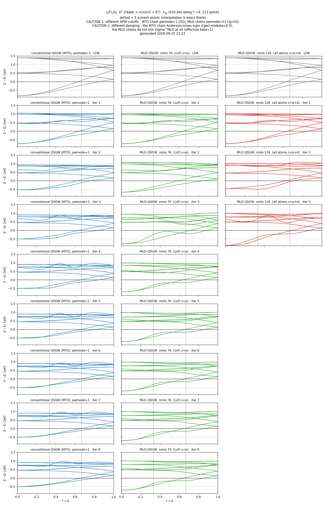](LiTi2O4/mlo_rows_2326.png)

[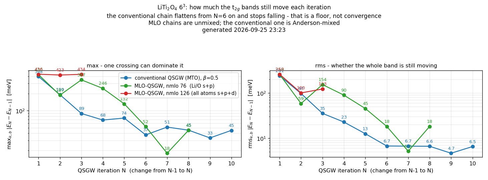](LiTi2O4/mlo_conv_2326.png)

`Samples/kBT/LiTi2O4/mlo_rows_2326.png`, `mlo_conv_2326.png`

**環境変数の伝播を先に確認した**。`run_cmd.py` は `env = os.environ.copy()` で `mpirun` に渡すが、
ランクまで届くかは MPI 実装次第なので、17 分待って空振りしないよう
`mpirun -np 2 printenv ECALJ_MLO_MIX` で先に確かめた（両ランクで `1`）。
`run_snap.sh` は `ECALJ_MLO_MIX` の値と、各反復の `Sigma^MLO mixing section` の出現回数を
`steps.log` に記録するようにした（`mlomix=`）。混合の有無が違うチェーンは比較できないため。

**user の懸念（記録）**: `mixbeta = 0.5` だと**別の解**に落ちるのではないか。
従来連鎖は 5 反復 rms が平坦（6.5 meV）で、単一の固定点に落ちている証拠が無い。
β を変えて別の点に落ち着くなら、まさにその兆候になる。
切り分けは**従来連鎖を β=1 で回し直して 10 反復目を比べる**こと。**未実施**。

### 2026-09-25 22:53 **図を 3 列に拡張（従来 / MLO 76 / MLO 126）。リンギングが $E_F$ の上から下へ移っている**（user「うねってるバンドがある」）

v7 の iter 1 が 22:48 に出た（`secs=1030`、`cmlo_init: nmlo nbandmx nband = 126 322 322` で **nmlo=126 を確認**）。
`mlo_rows.py` / `mlo_conv.py` を複数チェーン対応にし、1 列 1 チェーンで並べた。

図は**冒頭の「最新の図」節**（図 L-1, L-2）に一本化した。走行中のチェーンを映すので上書きされる。
下の形状の読みが指しているのは *図 22:27-2*（2 列 9 行、この時点に凍結したもの）である。

**比較の前提（図のキャプションにも入れた）**

| | 従来 MTO | MLO 76 / MLO 126 |
|---|---|---|
| APW 打ち切り | `pwmode=1`（$\vert G\vert$）| `pwmode=11`（$\vert q+G\vert$）|
| $\Sigma$ の減衰 | `sigm` を Anderson 混合（`[gw] mixbeta = 0.5`）| **$\Sigma^{\rm MLO}$ は無混合**（実効 $\beta=1$）|
| 描画 | 両方とも `mloON=0`、従来 `sigm` 内挿 | 同左 |

MLO 経路で `lmf` が読むのは `SigRsMLO` であって `sigm` ではないので、混合が効くのは従来列だけ。
これは §21:35 の判断（混合は入れない）による意図的な差で、**バグではない**。
ただし序盤の反復を比べるときは「減衰あり vs 減衰なし」を見ていることを忘れないこと。

**形状の読み — 荒れが $E_F$ をまたいで反対側へ移った**

| | 上側バンド（$E\simeq0.8$–1.0 eV）| 最下バンド（占有、$E\simeq-0.7\to0$）|
|---|---|---|
| 従来 MTO、iter 4–8 | $x\simeq0.45$ と $x\simeq0.8$ に**こぶ** | 滑らか |
| MLO 76、iter 3–8 | **平坦。こぶが消えている** | $x\simeq0.3$–0.5 に**肩／踊り場**（iter 6–8 で S 字）|

こぶの位置は点線（Σ メッシュ点 $0, 1/3, 2/3, 1$）の**ちょうど中間**で、内挿リンギングの位置そのもの。
MLO はそれを上側で消したが、占有側に別の構造を作っている。

**仮説**: 占有側は O 2p の混成が効くところで、v6 は **O を s+p に切っている**（`mlo_lm` で O は lm 1–4）。
v7 は O にも d を入れた（nmlo 126）ので、**iter 3 以降でこの肩が減るかどうか**が判定になる。
iter 2 は 23:05 頃。

### 2026-09-25 22:45 `temp.md` を解体 — 設計は設計書へ、ログはここへ（user「ごっちゃになってきた」）

`temp.md`（798 行）は**設計仕様**と**ログ・図・TODO**が混ざっていて、
[sigma_mlo_design.md](sigma_mlo_design.md) とも主題が重複していた。種類で分けて解消し、`temp.md` は削除した。

| `temp.md` の節 | 行き先 |
|---|---|
| §1–3 基底のセットアップと $\Sigma$ の保持形 | [設計書 §9](sigma_mlo_design.md) |
| §4 いつ MLO を作るのか（1 反復のタイムライン）| 設計書 §10 |
| §8 新方式 — 実装仕様 | 設計書 §11 |
| §9 Q&A | 設計書 §12 |
| §10 TODO | 設計書 §13 |
| §5 過去の失敗との違い、§6 残っている論点、§7.2–7.3 図 | **このエントリ（下記）** |
| §7.1 反復比較、§7.4 混合 | 既に 22:27 / 21:35 のエントリにある |

設計書の冒頭に「現行の方式は §9〜§13」と明記し、§9 の冒頭に **§3/§4 のどこが置き換わったかの対応表**を置いた。
§3「設計」と §4「実装手順」は 2026-09-24 版として残してある（節番号を動かすと相互参照が全部壊れるため）。

---

**$\tilde\chi$ の扱いは 4 段階あった**

| | 挙動 | 結果 |
|---|---|---|
| (a) 当初 | `getsenex` の**呼び出しごと**に作り直し。SCF ステップごとに基底が揺れる。読み書きの一致という概念すら無い | iter 2 で破綻 |
| (b) 凍結 `01b9ea4df` | 永久固定。しかも `getsenex` だけが追記するので iter 1（SCF メッシュ）と iter 2（GW の q）の**継ぎ接ぎ** | iter 1・2 は正常化、iter 3 で破綻 |
| (c) `5885ea2bb` | `lmf` 1 回の中で固定、次の `lmf` で作り直し。churn と継ぎ接ぎは消えた | **読み基底が 1 反復ずれたまま** |
| (d) **`b3dfecc89`（現行）** | 上記 2 スロット。$\tilde\chi$ は毎反復更新、$\Sigma$ は書かれた基底でのみ読む | **未検証** |

**残っている論点**

**MLO 索引の窓（`eferm`, `ecbot`, `nskip`）は 0d で固定されたまま**です。
$z$ を今の $H$ で作り直しても、窓が初回のバンド位置を指していれば部分空間は古いままです。
ただし `ix` と `ndimMTO` は `SigRsMLO` との整合のため**変えられません**。
窓だけ現在の計算に追随させるかどうかは未決です。

---

---

*図 22:45-1, 22:45-2* `temp.md` §7.2–7.3 から移した図

**$\tilde\chi$ 凍結の有無（iter 1）**

[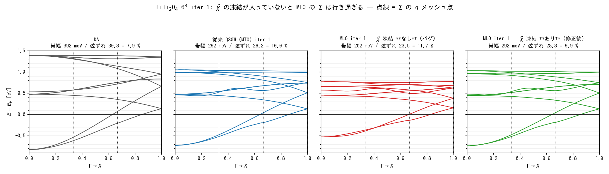](LiTi2O4/frozen_vs_not.png)

（$\tilde\chi$ 凍結の有無。凍結なしだと帯幅が 292 → 202 meV に潰れる）

**$\Sigma(R)$ の減衰（オンサイト規格化）**

[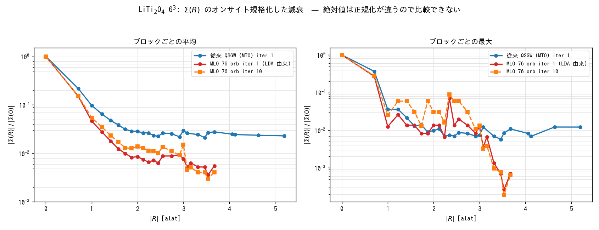](LiTi2O4/sigr_decay.png)

（絶対値は正規化が違うので比較不可。規格化すると**従来 $\Sigma^{\rm MTO}(R)$ の方が減衰しない**）

### 2026-09-25 22:35 **フル MLO（全原子 s+p+d、nmlo 126）で v7 を投入**（user「フルの MLO でやろう。原子あたり 9 MLO」）

v6 は Li と O が s+p だけだった。占有側のうねりがそこから来ている疑いがあるので、
**14 原子すべてを s+p+d** にして LDA から引き直す。基底側は 3 種とも第 1 envelope に
d を持っている（Li `rsmh=[1.04,1.04,1.04]`、O `[0.79,0.79,0.79]`、Ti は f まで）ので lm 1–9 は取れる。

*表 22:35-1* v6 と v7 の差（これ以外はすべて同一）

| | `liti_mlo_v6` | `liti_mlo_v7` |
|---|---|---|
| `mlo_lm` | Li 1–4 / Ti 1–9 / O 1–4 | **全 14 原子 1–9** |
| nmlo | 76 | **126** |
| 反復数 | 8 で停止 | 10 |

*表 22:35-2* 両チェーン共通の設定

| 項目 | 値 |
|---|---|
| `[mlo] mlo_method` / `mlo_delta` / `mlo_w` | 4 / 2.0 / 2.0 |
| `[mlo] mlo_nkabc` | `[6,6,6]`（`n1n2n3` と一致。ずれると `gwsc` が事前チェックで止める）|
| `[bz] nkabc` = `[gw] n1n2n3` | `[6,6,6]` |
| `[ham] pwmode` | 11（`\vert q+G\vert` 打ち切り）|
| `[gw] mixbeta` | 0.5 — **`sigm` のみ**。$\Sigma^{\rm MLO}$ は混合なし（`ECALJ_MLO_MIX` 未設定）|
| 実行 | `gwsc 1 -np 60 -np2 2 --gpu --mp --fp32 --ntqxx --mlo`、kt1、GPU 2 枚 |
| 1 反復 | 約 16 分（934–1006 s）+ バンド 1 分 |

投入 22:28、LDA 22:30（`ehf = -109750.177649 eV`、v6 と完全一致 — `mlo_lm` は LDA に効かない）。
`LITI_SRC` を `run_snap.sh` に足して、共有の `liti_src` を触らずに別 `ctrlg` から回せるようにした（commit `31b8756c7`）。
10 本で 01:40 頃の見込み。

### 2026-09-25 22:27 **収束判定は rms で。どちらのチェーンも収束していない**（user「収束していると見るか」）

`max` は rms の約 7 倍あり、$E_F$ 近傍の少数の k/バンドの交差に支配されるので指標にならない。
rms で見る。

*表 22:27-1* 反復ごとのバンド変化（t2g b33–44、Γ→X 211 点、[meV]）

| $N$ | 1 | 2 | 3 | 4 | 5 | 6 | 7 | 8 | 9 | 10 |
|---|---|---|---|---|---|---|---|---|---|---|
| 従来 MTO max | 398 | 190 | 89 | 68 | 74 | 37 | 51 | 45 | 33 | 45 |
| 従来 MTO **rms** | 241 | 97 | 35 | 23 | 13 | **6.7** | **6.7** | **6.6** | **4.7** | **6.5** |
| MLO 76 max | 430 | 187 | 347 | 246 | 132 | 52 | 18 | 45 | | |
| MLO 76 **rms** | 258 | 59 | 154 | 90 | 45 | 18 | 5.2 | 18 | | |

*図 22:27-1* 左 = max（一点の交差に支配される）、右 = rms（バンド全体が動いているか）

[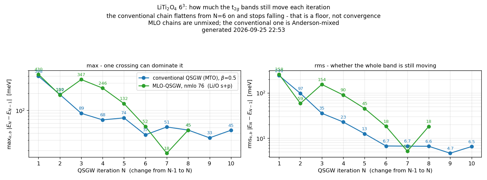](LiTi2O4/mlo_conv_2227.png)

`Samples/kBT/LiTi2O4/mlo_conv_2227.png`（このエントリ時点に凍結。生きている図は最新エントリ）

*図 22:27-2* 同じ描き方で LDA〜iter 8 を縦に並べたもの（2 列 9 行）

[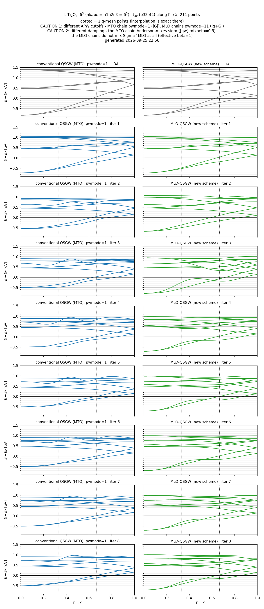](LiTi2O4/mlo_rows_2227.png)

`Samples/kBT/LiTi2O4/mlo_rows_2227.png`（このエントリ時点に凍結）

**読み**

1. 従来チェーンは $N=6$ 以降 **5 反復 rms が平坦**（6.7 / 6.7 / 6.6 / 4.7 / 6.5）。減っていないので
   収束ではなく**床**。さらに lag-2 の差（111, 73, 94, 70, 77 meV）が lag-1 より**大きい**ので、
   固定点まわりの 2 サイクルですらなく、ふらついている。
2. MLO は overshoot 後まだ 3 点（18 → 5.2 → 18）。rms では iter 8 が従来の iter 5 相当で、
   **まだ床に届いていない**。overshoot のぶん 3 反復ほど遅れている。
   iter 7 の 18 meV（max）は一点の谷で、床を突き抜けたのではない — 22:05 の見立ては撤回。
3. **床の正体の候補**: このチェーンは `--fp32` 付き。5 反復下がらない 6.5 meV rms は
   marginal QSGW モードというより**数値精度の床**に見える。`--fp32` なしで 1 反復回せば切り分く。**未実施**。

**重要な注意**: `job_band --mlo` は 2 段目の `mlo --mlofreeze --mlo` が LiTi2O4 で落ちるため、
`snap/iter<N>/llmf_band` を確認すると **8 本すべて `mloON=0`**、すなわち両列とも
**従来 `sigm` 内挿で描かれている**。この図が見せているのは内挿法の差ではなく**自己無撞着状態の差**。
（両列は `pwmode` も違う: 従来 1 = $\vert G\vert$、MLO 11 = $\vert q+G\vert$。）

user 判断でここで停止（22:27）。`snap/iter1`–`iter8` は保存済みで再開できる。

### 2026-09-25 21:35 **混合の非対称を見つけた。が、入れない**（user「mixing はなし（あるいは 1）でやろう。不要に見える」）

`main_hqpe.sc.f90` は非対称だった:

- `sigm`: `rwsigma('read')` → **`mixsigma`** → `rwsigma('write')`
- `sigmlo`: 計算 → そのまま `WriteSigmMLO`（**混合なし**）

MLO 経路で `lmf` が読むのは `SigRsMLO`（= `__SigmMLO.q` 由来）で `sigm` ではない。つまり
**MLO チェーンだけ実効 $\beta=1$ で回っていた**（`[gw] mixbeta = 0.5`）。
iter 5 までの比較は「減衰あり vs 減衰なし」を比べていたことになる。

**結論: 入れない。** 無混合でも 430 → 187 → **347** → 246 → 132 → **52** meV（max）と自力で落ち、
iter 6 で混合ありの従来チェーン（37）に並ぶ。収束に効くのは減衰ではなく反復数。
commit `d8034ad5b` で **既定 OFF**、`ECALJ_MLO_MIX=1` で ON。既定 OFF なので走行中のチェーンは
そのまま継続できる（v6 は iter 7 から継続した）。

実装は残してあり、ON にすればそのまま効く:

- `mixsigma` が履歴ファイル名を任意引数で受ける。`sigm` 側 `__mixsig` / MLO 側 `__mixsigMLO`。
  既定名を `'__mixsig'` のままにしたのは、`fff` が `character(8)` で `'__mixsigma'` をずっと
  切り詰めていたため。正しい綴りに直すと走行中のチェーンが履歴を失う。
- `gwsc` は `__SigmMLO.q` を**消さずに `__SigmMLO.q.prev` へ退避**し、`hqpe_sc` がそれを $x_0$ として読む。
  無いと、履歴ファイルが無い初回（新規・スナップショット再開・混合導入前の続き）で
  `amix` が $x_0=0$ を取り、$\Sigma$ 全体が一度 $\beta$ 倍される。
- `mixsigma` の作業配列は `source=0d0` で確保。`amix` は $d_0 = f - x_0$ を無条件に使う。
- `run_snap.sh` / `cont_snap.sh` はスナップショットに `__mixsig` と `__mixsigMLO` を入れる。

*付随* `InstallAll.py --gemmul8` は上流 GEMMul8 のレイアウト変更（内側の `GEMMul8/` が消えた）で
`FileNotFoundError` を投げ、**Fortran ビルド前にインストーラごと落ちる**。
`args.gemmul8` は `cmake_options` を変えないので、外しても `libecaljF*.so` は同一。
また `nvfortran` の ICE（`fort1 TERMINATED by signal 11`）は非決定的で、同じコマンドの再試行で通る。

### 2026-09-25 15:06 **修正版で LDA から 3 反復。破綻。user 判断で停止**

`liti_mlo_v5`（76 軌道、`pwmode=11`、2 スロット、段 a' は Σ 入り $H$）。
**temp.md (d) の全段が実際に発火したことをログで確認済み**:

| 段 | 確認 | 実測 |
|---|---|---|
| ① `getsenex` が $z_{n-1}$ で読む | `llmfgw01` の `loaded ZmloSig` | 36 |
| ① 段 a' が今の $H$ から $z_n$ | `sugw.f90` の `hamm_qsgw` | 5 箇所 |
| ⑤ 昇格 | `gwsc: promoted 36 ZmloNew.* -> ZmloSig.*` | g1, g2 とも 1 |
| ⑥ 最後の `lmf` | `llmf` の `loaded ZmloSig` | 16 |
| ⑦ バンドが `--mlo` | `llmf_band` の `loaded ZmloSig` | 8 |

*図 15:06-1* 従来 vs MLO、LDA〜iter 3（2 列 4 行）

[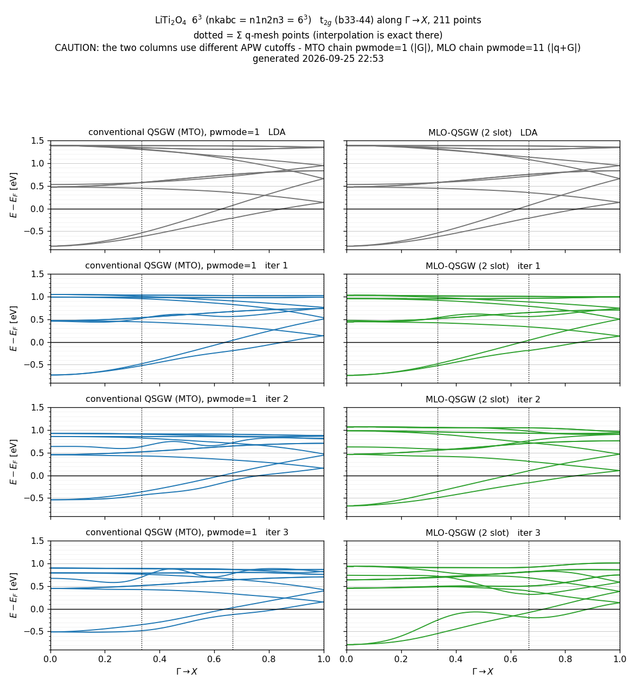](LiTi2O4/mlo_rows_1506.png)

`Samples/kBT/LiTi2O4/mlo_rows_1506.png`（生成: `LiTi2O4/mlo_rows.py frz mlo_rows_1506.png v6`。
このエントリ時点の状態に凍結したもの — `mlo_rows.png` は反復が進むたび上書きされるため）

*表 15:06-1* t2g b33–44、Γ→X 211 点

| | 帯幅/本 | 弦ずれ | 弦/帯幅 | 前段からの変化 |
|---|---|---|---|---|
| LDA | 391.6 meV | 30.8 | 7.9 % | — |
| 従来 MTO iter 1 | 290.7 | 28.7 | 9.9 % | 194.4 |
| 従来 MTO iter 2 | 223.0 | 25.4 | 11.4 % | 86.1 |
| 従来 MTO iter 3 | 221.3 | 27.4 | 12.4 % | **31.8** |
| MLO iter 1 | 234.7 | 43.3 | 18.4 % | 414.7 |
| MLO iter 2 | 370.8 | 86.9 | 23.4 % | 157.8 |
| MLO iter 3 | 356.0 | 100.4 | **28.2 %** | **192.5** |

$E_{\rm HF}$: LDA −109750.178 → MLO iter1 −109751.813 → iter2 −109760.542 → iter3 −109762.472。
従来は −109751.44 → −109754.29。

**従来は収束に向かう**（変化 194 → 86 → 32 meV と半減しつづけ、帯幅 223 → 221 で安定）。
**MLO は収束しない**（変化 415 → 158 → 193 meV で下げ止まり、荒れは 18 → 23 → 28 % と単調増加）。
図では iter 3 の最下バンドがメッシュ点の間で急峻に立ち上がり、LDA にも従来にも似ない形になる。

**user 判断で停止**（15:06）。kt1・kr5 とも計算なし。

#### 未実施のまま残した切り分け

弦/帯幅 には §4.2 ⑦ の**基底混在**（メッシュ点は `ZmloSig` の $z$、その間はその場の $H$ から作った $z$）
が混ざっており、**手法の限界と図の作り方が分離できていない**。
`LiTi2O4/band3.sh` が混在／全 k 作り直し（`ECALJ_MLO_NOSIG=1`）／GW ドライバ状態の 3 通りを
スナップショットから描く。CPU のみ、数分。再開するならここから。

#### 併せて未実施

- **窓の追随**（`eferm`/`ecbot`）。正しい形は判明している: `sugw` 側だけで
  `call set_bandedge(eferm, eferm + (ecbot_a - eferm_a))`。一度誤った実装で iter 1 を壊して revert 済み。
- **154 軌道**での再測定。76 軌道では $\Sigma$ の k 依存性が足りない疑いがあるが、
  `--mlo` 付きで測り直していない。kr5 に入力一式を用意済み（`-np 8` に修正済み）。

### 2026-09-25 14:45 kr5 を計算機として立ち上げた（一旦停止、再開できる状態）

user が kr5 で GPU を使っているので、そこでも回せるようにした。**2026-09-25 14:45 時点で停止**。

#### 導入したもの（すべて root 不要、`$HOME` 配下）

| | 場所 | 備考 |
|---|---|---|
| NVIDIA HPC SDK 26.1 (CUDA 13.1) | `~/opt/nvhpc` | 6.4 GB の tarball を `NVHPC_SILENT=true NVHPC_INSTALL_TYPE=single ./install` |
| cmake 3.31.6 | `~/opt/cmake-3.31.6-linux-x86_64` | 公式バイナリ（`python3-venv` が無く pip が使えない）|
| MKL 2025.3 | `~/opt/intel/oneapi/mkl/2025.3` | **kt1 から rsync**（2.8 GB）。`SRC/CMakeLists.txt` が `-lmkl_rt` 固定のため |
| libiomp5 | `~/opt/intel/lib` | kt1 の `compiler/2025.3/lib` から |
| 環境 | `~/nvenv.sh` | PATH / LD_LIBRARY_PATH / LIBRARY_PATH / MKLROOT |
| ecalj | `~/ecalj`（`SRC` と `InstallAll.py` のみ）| `sync_ecalj_src.sh` で配布。`.ecalj_rev` で刻印 |
| LiTi₂O₄ 入力 | `~/liti/src`（76 軌道）、`~/liti/src154`（全 EH lm）| kt1 の `liti_src` から |
| bin | `~/liti/bin` | 17 本すべて symlink |
| ランナー | `~/liti/run_kr5.sh` | `-np 14 -np2 1`、GPU 1 枚、`SRCDIR` で入力切替 |

素性: Ubuntu 24.04、16 コア / 30 GB、RTX 5090 32 GB、driver 595.84、`sudo` 不可。
ビルドは `source ~/nvenv.sh; cd ~/ecalj; python3 InstallAll.py --fc nvfortran --gpu --bindir ~/bin`。
最後に `Samples/TestInstall` が無くて `rc=1` になるが、**`.so` 4 本と実行ファイルは出来ている**
（`Samples` は同期対象外）。

#### 止まっている理由

LDA は通った（$E_{\rm HF} = -109750.177649$ で kt1 と完全一致）が、`gwsc` 内の最初の
`lmf`（`mpirun -np 14 ...`）が 1 秒で落ちた。**原因は `-np 14`**: kr5 は
**AMD Ryzen 7 9700X = 8 物理コア / 16 スレッド**で、`nproc` の 16 を鵜呑みにした私の設定ミス。
OpenMPI がスロット不足で即座に拒否していた（`-np 2` で直接叩くと正常収束したのが傍証）。
`run_kr5.sh` を **`-np 8`** に修正済み。再開時はこれで通るはず。

（`env.sh` が kt1 のパスを持っていて `mpirun` を見失う件は、kr5 用に書き換えて解決済み。）

### 2026-09-25 13:50 修正版で iter 1 を取り直し。窓の変更は私のバグ、そして**初めて MLO 内挿を通したバンド**

#### 窓の変更（`d6ceabead`）は撤回した

修正版の最初の iter 1 で帯幅が 292 → **134 meV**、従来から **532 meV**、$E_{\rm HF}$ が LDA より
**上がる**という壊れ方をした。iter 1 で発火する変更は窓だけ（2 スロットは `ZmloSig` が無いので、
Σ 入り $H$ は `sigmamode` が偽なので発火しない）。revert したら
$E_{\rm HF} = -109751.812526$ と**以前の凍結版 iter 1 とビット単位で一致**。窓が唯一の原因と確定。

**ゼロ点の仮説は外れだった。** 診断 print を入れて測った:

    sugw a' window: HamRsMLO eferm ecbot= 0.249697 0.252999 | SCF eferm= 0.249690 diff(Ry)= -0.000007

2 つの $E_F$ は **7 µRy** しか違わない。**真因は `m_sigmlo` 側**で、そこで `set_bandedge` を消して
`readbandedge()` だけにしたこと。SCF 経路では `Readqplistsy` が呼ばれず
`m_readqplist::eferm` が設定されないので、$E_F \approx 0$ のまま
`nocc = count(evl < eferm)` が評価され**占有状態がゼロ**になる。帯幅 134 meV の説明がつく。

正しい形は `sugw` 側だけで、オフセットは模型の性質として凍結したまま $E_F$ だけ追随させる:

    call set_bandedge(eferm, eferm + (ecbot_a - eferm_a))

（未実装。`Hreduction` が QSGW 固有値を LDA の $E_F$ と比べる問題自体は残っている。）

#### 初めて `--mlo` を通したバンド（`liti_mlo_v4` iter 1）

*表 13:50-1* t2g b33–44、Γ→X 211 点

| | 帯幅/本 | 弦ずれ | 弦/帯幅 |
|---|---|---|---|
| LDA（内挿なし＝下限）| 391.6 meV | 30.8 | 7.9 % |
| 従来 MTO iter 1 | 292.0 | 29.2 | 10.0 % |
| **MLO 修正版 `--mlo` iter 1** | **201.1** | 23.4 | **11.6 %** |

**同じ自己無撞着状態**を `--mlo` の有無で描いた差が **163.7 meV**（メッシュ点）。
これは内挿方式そのものの差である。

- MLO 内挿は t2g 帯幅を **292 → 201 meV と 31 % 削る**。
- メッシュ点間の荒れも **10.0 % → 11.6 %** と**従来より大きい**。

76 個の MLO では $\Sigma$ の k 依存性を表しきれていない、という読みになる。
以前 154 軌道が 233.6 meV だったのも同じ傾向（ただしあれは `--mlo` 無しの測定なので要再測）。

iter 2→3 を `cont_snap.sh` で継続中（13:52 投入）。

### 2026-09-25 12:35 **今日のバンド図は MLO 内挿を通っていなかった** — `job_band` に `--mlo` を渡していない

user「`job_band` による書き換えが心配。ディレクトリを掘ってその中で `job_band` したほうがいい」から判明。

`job_band` は `parse_known_args()` で残りの引数を `lmf` に渡す（`SRC/exec/job_band`:91,93）。
`--mlo` が無ければ `c0_mlo` は偽で、`sigmlo_init` は先頭の
`if(.not.c0_mlo) return` で即座に戻る。**MLO 経路は完全に無効**になり、
`getsenex` は従来の `sigm` を使う。

今日のラン（`clean_liti.sh`、`frozen_run.sh`、`continue_frozen.sh`、`v2run.sh`）はすべて

    job_band $T -np 8 NoGnuplot

と呼んでいた。`--mlo` が無い。**したがって今日のバンド図はすべて、
MLO 連鎖が作った密度と `sigm` を、従来経路で内挿して描いたもの**である。
`hqpe_sc` は `sigm`（MTO）と `__SigmMLO.q`（MLO）を並行して書くので `sigm` は常に存在し、
黙ってそちらが使われていた。

#### 何が保留になるか

- SCF 側（`gwsc` 内の `lmf`）は `--mlo` を受け取っており `mloON=16` も出ているので、
  **自己無撞着解そのものは MLO 経路で作られている**。密度・$\Sigma$ は MLO 版で正しい。
- しかし**バンド図に現れる内挿の滑らかさは MLO のものではない**。
  10:45 の「弦/帯幅が 7.9 % で LDA 並み」は、
  **MLO 連鎖の $\Sigma$ を従来内挿で描いた**ときの値であって、
  「MLO 内挿が滑らか」の証拠にはなっていない。表 10:45-1 の読みは取り下げる。
- 逆に、iter 1 で従来と 16.2 meV しか違わなかった（表 10:30-1）のは、
  両者とも従来内挿で描いたうえでの差なので、**連鎖の状態が近い**ことは言える。

#### 対処

`job_band` は**掘ったディレクトリの中で `--mlo` 付きで**走らせる。理由は 2 つ:

1. `--mlo` が無いと MLO 内挿を通らない（上記）。
2. `job_band` の第 1 段 `lmf --quit=band` は **`efermi.lmf` を書き換える**
   （`m_bndfp.f90`:274）。今日 `d6ceabead` で MLO の窓が `efermi.lmf` を読むように
   したので、連鎖ディレクトリでバンドを描くと窓の基準が動く。

`run_snap.sh` を、反復ごとに `snap/iter<N>/` を掘って状態一式を置き、
その中で `job_band ... --mlo` を走らせる形に改めた。スナップショットとバンドが同じ場所になる。

### 2026-09-25 11:10 $\tilde\chi$ 凍結の作りの確認（user 質問）と、iter 1 に残る非対称

**「MLO は更新されていくのか、最初に固定か」→ 最初に固定。ただし k 点ごとに初回使用時。**

`zmlo_frozen(q, isp, ndimh)`（`m_sigmlo.f90:90`）はキャッシュに一致があればそれを返し、
無ければ `ok=.false.` を返して呼び出し側がその時点の $H$ から `Hreduction` で作る。
作られたものは `cache_put` + `zmlo_ref_append`（`m_sigmlo.f90:270-271`）で `ZmloRef` に
追記され、**以後ずっと再利用される**。SCF の k メッシュと GW の q リストは毎反復同じなので、
iter 1 で埋まったあとは二度と変わらない。

`ZmloRef` が iter 1 後 6 189 004 B → iter 2 後 27 823 116 B と増えたのは、
バンドプロットの 211 点など**新しい k** が加わったため。既存レコードは書き換わらない。

#### 正確には何が固定されるのか（user 質問）: **変換行列 $z^{\rm MLO}(q)$**

`ZmloRef` の 1 レコードは キー (q, isp, ndimh) と `z0(ndimh, ndimMTO)` の複素行列。
これは式 (9) の $\tilde\chi_\alpha(q)=\sum_m \chi^{\rm PMT}_m(q) z^{\rm MLO}_{m\alpha}(q)$ の
$z^{\rm MLO}$、すなわち **PMT → MLO の展開係数行列**。`Hreduction` の戻り値 `zMLO` をそのまま保存。

| | |
|---|---|
| $z^{\rm MLO}(q)$ | **固定** |
| $\chi^{\rm PMT}_m$ 自体（MT 内の $\phi,\dot\phi$）| 密度とともに変わる |
| $S^{\rm PMT}(q)$ | 毎回その時点のもの（`amat = matmul(ovlm, zm)`）|
| $O^{\rm MLO}=z^\dagger S z$ | 毎回作り直し |
| $c^{\rm MLO}=\langle\psi\vert \tilde\chi\rangle$ | 毎回作り直し（意図どおり。χ̃ 固定、$\psi$ が動く）|

**したがって厳密には「係数が固定」であって「関数 $\tilde\chi$ が固定」ではない。**
基底関数 $\chi^{\rm PMT}$ が自己無撞着な密度に追随するぶん、$\tilde\chi$ は関数としてわずかに動く。
関数として完全に固定するには MT 内の $\phi,\dot\phi$ も凍結する必要があるが、そこまではしていない。
ただしこのドリフトは、バグ時（$H$ が変わるたびに $z$ を作り直す）とは桁が違う。

#### 残っている非対称（iter 1 限定）

追記しているのは **`getsenex` 側だけ**である。`sugw.f90:527` は `zmlo_frozen` を
**読むだけ**で、外れたときに作ったものをキャッシュに入れない。したがって iter 1 では

1. GW ドライバ（`sugw` a'）: キャッシュが空 → LDA の $H$ から χ̃ を作る（**保存しない**）→
   その χ̃ で $c^{\rm MLO}$、`hqpe_sc` が $\Sigma^{\rm MLO}$ を作る
2. iter 1 最後の `lmf`: `getsenex` が別に χ̃ を作り、**それ**を `ZmloRef` に入れる

となり、**$\Sigma^{\rm MLO}$ を書いた χ̃ と `ZmloRef` に入る χ̃ が iter 1 だけ一致しない**。
iter 2 以降は両者ともキャッシュを引くので一致する（`llmfgw01` に
`loaded ZmloRef ... records= 16` が 36 ランク分出ることで確認済み）。
**`sugw` 側でも `cache_put`/`zmlo_ref_append` を呼ぶべき**（未修正、要検討）。

#### pwmode の違い（図の但し書き）

長い従来連鎖 `n666_nk6_from_lda`（10 反復、`nkabc = n1n2n3 = 6³`）は **`pwmode = 1`（|G| カット）**、
今回の MLO 連鎖は **`pwmode = 11`（|q+G| カット）**。
QSGW には 11、バンドプロットには 1 が要るという既知の二律背反（`project_pwmode_qgcut`）のため
揃っていない。並べる図には注意書きを入れた。
`pwmode = 11` の従来版は `liti_ref`（iter 1）/`liti_ref2`（iter 2）にあり、そこまでは直接比較できる。

#### 進行

| 反復 | 時刻 | 秒 | $E_{\rm HF}$ (eV) |
|---|---|---|---|
| LDA | 10:10 | — | −109750.1776 |
| 1 | 10:27 | 1011 | −109751.8125 |
| 2 | 10:44 | 952 | −109760.8833 |
| 3 | 11:04 | 946 | −109762.6560 |

（参考: 従来 pwmode=11 は iter 1 −109751.4388、iter 2 −109754.2880）

### 2026-09-25 10:45 **iter 2 も通過。内挿由来の荒れが LDA 並み（7.9 %）まで落ちた — 設計の目的は達成されている**

`liti_mlo_frozen` iter 2 完了（10:44、952 秒）。`frozen=16`、`gwdrv=36`、
`llmfgw01` に `loaded ZmloRef (frozen chi~), records= 16` が 36 ランク全部で出ている。
**「1→2 で壊れる」原因だった箇所が設計どおり動いている。**

*図 10:45-1* 3 通り × iter 1/2

[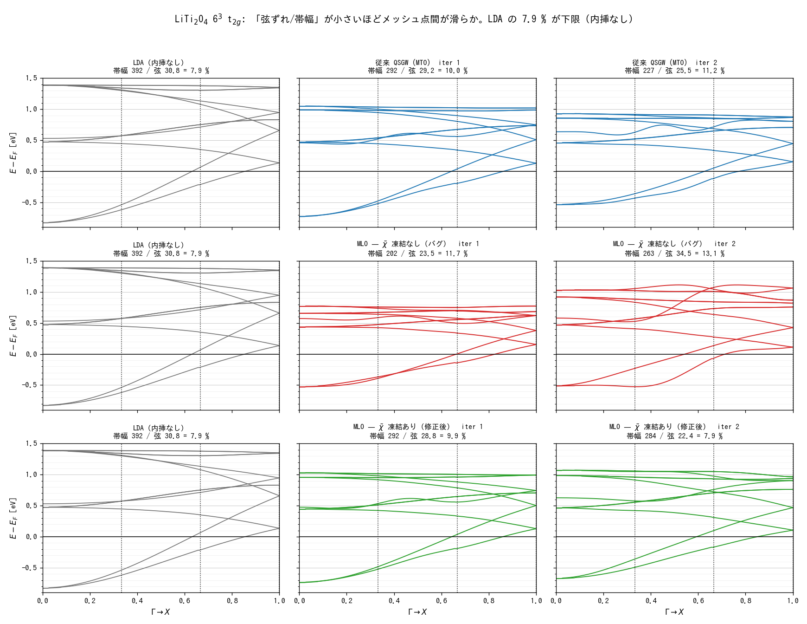](LiTi2O4/three_routes.png)

`Samples/kBT/LiTi2O4/three_routes.png`（生成: `LiTi2O4/three_routes.py`）

*表 10:45-1* t2g b33–44、Γ→X 211 点

| | 帯幅/本 | 弦ずれ | **弦/帯幅** | 前段からの変化（メッシュ/中点）|
|---|---|---|---|---|
| LDA（内挿なし＝下限）| 391.6 meV | 30.8 | **7.9 %** | — |
| 従来 MTO iter 1 | 292.0 | 29.2 | 10.0 % | 195.7 / 195.0 |
| 従来 MTO iter 2 | 227.4 | 25.5 | **11.2 %** | 85.3 / 81.8 |
| MLO 凍結なし iter 1 | 202.1 | 23.5 | 11.7 % | 366.8 / 363.4 |
| MLO 凍結なし iter 2 | 263.3 | 34.5 | 13.1 % | 163.4 / 164.0 |
| **MLO 凍結あり iter 1** | 291.5 | 28.8 | 9.9 % | 210.0 / 209.3 |
| **MLO 凍結あり iter 2** | 284.2 | **22.4** | **7.9 %** | **48.1 / 45.2** |

**弦/帯幅が 7.9 % で LDA と同値。** LDA は Σ の内挿を含まないので 7.9 % は純粋なバンド曲率＝
到達しうる下限であり、**内挿由来の荒れが実質ゼロになった**ということ。従来の 11.2 % に対して
明確な改善で、これが §1 の狙いそのものである。反復あたりの変化も 48 meV（従来 85 meV）と小さい。

#### ただし従来解から離れつつある

| | MLO 凍結あり − 従来 |
|---|---|
| iter 1 | メッシュ点 16.2 / 中点 15.7 meV |
| iter 2 | メッシュ点 **77.5** / 中点 75.4 meV |

帯幅も従来は 292 → 227 と狭まり続けるのに対し MLO は 291 → 284 とほぼ動かない。
$E_{\rm HF}$ は従来 −109754.288 対 MLO −109760.883。
どちらが正しいかは自明でない（従来はリンギング込み、MLO は滑らか）。
**反復を続けて落ち着くかを見る必要がある。**

#### まとめ（今日の結論の入れ替え）

| 朝の結論 | 今の結論 |
|---|---|
| $\Sigma^{\rm MLO}(R)$ が局在しない → 前提が崩れた | 正規化の違う量を比べていた。撤回（09:45）|
| iter 1 で Σ が従来の 1.9 倍強い | 基底不整合バグ。凍結すると 16 meV 差。撤回（10:30）|
| 反復で弦ずれが 146 meV まで育つ | 凍結なしバイナリの産物。凍結ありでは **LDA 並みに滑らか**（10:45）|

### 2026-09-25 10:30 **確認**: $\tilde\chi$ を凍結したら iter 1 が従来と一致した。「Σ が 1.9 倍強い」は基底不整合バグだった

kt1 を同期・再ビルド（`libecaljF.so` に `ZmloRef` 7 個、`libecaljF_mp_gpu.so` に 4 個）して
`liti_mlo_frozen` を LDA から回した。10:27 に iter 1 完了（1011 秒、2 GPU）。
**`ZmloRef` が 6 189 004 B 生成された**（従来のランでは 1 つも作られていなかった）。

*図 10:30-1* iter 1 の 4 本並べ

`Samples/kBT/LiTi2O4/frozen_vs_not.png`（生成: `LiTi2O4/frozen_vs_not.py`）

*表 10:30-1* iter 1（t2g b33–44、Γ→X 211 点）

| | 1本あたり帯幅 | 弦ずれ | 弦/帯幅 | LDA からのずれ（メッシュ点）|
|---|---|---|---|---|
| LDA | 391.6 meV | 30.8 | 7.9 % | — |
| 従来 QSGW (MTO) iter 1 | **292.0** | 29.2 | 10.0 % | 195.7 |
| MLO 凍結**なし** iter 1 | 202.1 | 23.5 | 11.7 % | 366.8 |
| **MLO 凍結あり iter 1** | **291.5** | 28.8 | **9.9 %** | 210.0 |

**MLO 凍結あり iter 1 と従来 iter 1 の差は、メッシュ点で 16.2 meV / 中点で 15.7 meV**
（凍結なしでは 175.5 / 171.6 だった）。**11 分の 1。**

- 帯幅 291.5 対 292.0 — ほぼ一致。凍結なしの 202.1 は行き過ぎだった。
- 弦/帯幅 9.9 % 対 10.0 % — 同等。
- $E_{\rm HF}$: LDA −109750.1776、従来 iter1 −109751.4388、
  **MLO 凍結あり −109751.8125**、MLO 凍結なし −109752.1227。
- LDA バンドは両ランで完全一致（再ビルドは LDA を変えていない）。

#### 撤回

**09:15 の「iter 1 の時点で MLO の Σ が従来の 1.9 倍強い」（表 09:15-2）は撤回する。**
あれは基底不整合バグそのものだった。残る 16 meV は MLO 部分空間の切り詰め
（230 → 76 チャネル）による本来の差で、妥当な大きさ。

05:05 / 08:50 / 09:05 / 09:45 の LiTi₂O₄ の数字も、すべて凍結なしで取ったものなので無効。

#### 次

iter 2 を待つ（10:45 頃）。**本題はここから**で、MLO の狙いは
「反復しても弦ずれが従来ほど増えない」ことだった。従来は 10.0 % → 11.2 %（iter 2）。
凍結ありの MLO がこれを下回れば、設計の目的が達成されていることになる。

### 2026-09-25 09:50 **原因判明（運用ミス）**: kt1 のバイナリに $\tilde\chi$ 凍結が入っていなかった。LiTi₂O₄ の MLO 結果は全部それ以前のもの

user「まずはイテレーションの不整合を疑ってる」「バンドを見る限り MLO バンドが変になるのは iter 1 から 2」。

#### 証拠

| | 時刻 |
|---|---|
| `01b9ea4df` $\tilde\chi$ 凍結（`ZmloRef`）| 09-25 **05:25** |
| `09ffdf09d` ndimh 完全一致（NaN 修正）| 09-25 **05:31** |
| kt1 の `lmf` バイナリ | 09-25 **05:13** |
| kt1 の `SRC/subroutines/m_sigmlo.f90` | 09-25 **05:13**、`ZmloRef` の出現数 **0** |

決定的なのは最後の行で、**kt1 のソースに凍結のコードが 1 行も入っていなかった**。
実際 `liti_mlo` にも `liti_mlo1` にも `ZmloRef` ファイルが存在しない。

したがって LiTi₂O₄ の MLO ランは全部、凍結なしで走っていた:

| run | 時刻 | 凍結 |
|---|---|---|
| `liti_mlo`（10 反復）| 01:20–04:10 | なし |
| `liti_mlo154`（1 反復）| 04:34–04:53 | なし |
| `liti_mlo1`（1 反復）| 09:02–09:36 | なし |

（NiO の 3 反復検証はローカルで凍結ありで通していた。kt1 だけが古かった。）

#### なぜ iter 1→2 で急に壊れるかの説明になる

凍結が無いと `getsenex` は**呼ばれるたびに現在の $H$ から $z^{\rm MLO}$ を作り直す**。
一方 $\Sigma^{\rm MLO}(R)$ は**前の反復の $\tilde\chi$** で書かれている。
式 (14) の $\mathrm{senex} = A\,(O^{\rm MLO})^{-1}\Sigma^{\rm MLO}(O^{\rm MLO})^{-1}A^\dagger$ で、
$A$ と $\Sigma^{\rm MLO}$ が別の基底のものになる。**書いた基底と読む基底が違う。**

- iter 1: $\Sigma^{\rm MLO}$ を作る時点では両方 LDA 由来なのでズレが小さい（SCF 内の再構築だけ）。
- iter 2: GW ドライバの $\psi$ が $H+\mathrm{senex}$ 由来になり、そこから作り直した $\tilde\chi$ で
  前反復の $\Sigma^{\rm MLO}(R)$ を読む。**初めての本格的な不整合。**

`steps.log` の `gwdrv` も一致する: iter 1 は `gwdrv=0`（ドライバに Σ 無し）、iter 2 以降 `gwdrv=36`。

#### 影響を受ける今日の記述

以下はすべて**凍結なしのバイナリで測った値**なので、再測定するまで保留:

- 05:05「MLO-QSGW は失敗」、弦ずれ 23.5 → 146.5 meV の増大（表 05:05-1）
- 08:50 / 09:05 の弦ずれ・帯幅の表
- 09:15 の「iter 1 で Σ が従来の 1.9 倍」（表 09:15-2）
- 09:45 の局在（iter 10 側。iter 1 側は不整合がまだ小さい段階なので相対的にまし）

#### 対応（09:48）

`m_sigmlo.f90` / `sugw.f90` / `rdsigm2.f90` を kt1 に同期（kt1 固有の変更が消えないことを
差分で確認済み。`ECALJ_SIG_DROPL` は local にもある）。`ref_iter2` の完了を待って
`lmf lmf_mp_gpu mlo hqpe_sc` を再ビルドし、**LDA から 2 反復**で `liti_mlo_frozen` を回す
（`rebuild_run.sh`）。user の判断どおり **iter 2 まで見れば確認できる**。

#### 教訓

kt1 と local はリポジトリが別で、kt1 には local に無いコミット（`b0a88ce7d`）もある。
**ソースを同期したつもりでも実際には入っていないことがある。**
今後 kt1 でランを投げる前に、狙った修正がバイナリに入っているかを
`strings <bin> | grep -c <新しい文字列>` で確認する。

### 2026-09-25 09:45 **撤回**: 「$\Sigma^{\rm MLO}(R)$ は $\Sigma^{\rm MTO}(R)$ より局在が悪い」は誤り。正規化の違う量を比べていた

user「LDA から作った場合の局在性は」。08:39 に測った $\Sigma^{\rm MLO}(R)$ は **iter 10** のもので、
しかも比較相手の MTO 側は 09-24 に Ti3d–Ti3d ブロックだけを見た値だった。両方やり直した。

#### 絶対値は比較できない

`sigm` が保持しているのは両側に $O^{-1}$ を畳み込んだ量（`hqpe_sc` の `evec_inv`、式 (6)(7)）で、
**オンサイトが 73.8 eV** ある。一方 $\Sigma^{\rm MLO}_{\alpha\beta} = c^\dagger \Sigma^\psi c$ は
$O^{-1}$ を `getsenex`（式 (14)）に回しているので **オンサイトは 187 meV**。
桁が 400 倍違う。**08:39 の「MLO 5–9 meV 対 MTO 0.3–0.6 meV」は意味のない比較だった。**

測定は `rdsigm2.f90` に足した `ECALJ_SIGMTO_RS=1`（`fftz3` 直後の `sfz` を殻ごとに書き出す）と、
`SigRsMLO` を読む `LiTi2O4/sigrs_decay.py`。

*図 09:45-1* オンサイトで規格化した減衰

`Samples/kBT/LiTi2O4/sigr_decay.png`（生成: `LiTi2O4/sigr_decay.py`）

*表 09:45-1* $|\Sigma(R)|/|\Sigma(0)|$（ブロックごとの平均）

| \|R\| (alat) | 従来 MTO iter 1 | **MLO 76 iter 1 (LDA 由来)** | MLO 76 iter 10 |
|---|---|---|---|
| 0.71 | 2.2×10⁻¹ | 1.5×10⁻¹ | 1.5×10⁻¹ |
| 1.00 | 9.7×10⁻² | **4.6×10⁻²** | 5.4×10⁻² |
| 1.41 | 4.8×10⁻² | **1.8×10⁻²** | 2.3×10⁻² |
| 1.87 | 2.9×10⁻² | **8.3×10⁻³** | 1.3×10⁻² |
| 2.45 | 2.3×10⁻² | **6.3×10⁻³** | 1.0×10⁻² |
| 2.74 | 2.5×10⁻² | **8.8×10⁻³** | 1.1×10⁻² |
| 3.53 | 2.7×10⁻² | **3.6×10⁻³** | 3.0×10⁻³ |
| 4.64 | 2.4×10⁻² | （対リスト外） | （対リスト外） |
| 5.20 | 2.3×10⁻² | （対リスト外） | （対リスト外） |

- **従来の $\Sigma^{\rm MTO}(R)$ こそ減衰しない。** $|R| = 1.4$ から BvK セル端の 5.2 alat まで
  オンサイトの 2.1〜3.0 % で**完全に平ら**。LiTi₂O₄ の内挿リンギングの出どころはこれで、
  本プロジェクトの当初の動機そのものである。
- **LDA から作った MLO はちゃんと落ちる。** 中距離で従来の 1/2〜1/3、3.5 alat では 1/7。
- 反復すると中距離の尾が約 1.5 倍に育つ（iter 1 → iter 10）。悪化はするが、
  それでも従来より良い。

**注意**: MLO の対リストは $|R| \lesssim 3.7$ alat で打ち切られており、遠方の殻は対の数が
少ない（3.67 alat で 288 対、中距離は数千）。頑健なのは **1.0〜2.7 alat** の比較で、
そこで MLO は従来の 2〜3 倍よく落ちている。

#### 何が変わるか

- **設計書 §5 の検証 1 を「不合格」としたのは誤り。** $\Sigma^{\rm MLO}(R)$ の局在は
  従来より**良い**。設計の前提は崩れていない。
- 08:39 の §6 リスク 3「$\Sigma^{\rm MLO}(R)$ が局在しない」も撤回。
- **残る本当の問題は 09:15 の方**: iter 1 の時点で MLO の Σ が従来の 1.9 倍強い
  （メッシュ点上で 175 meV のずれ、帯幅の圧縮が 1.9 倍、軌道を 154 に増やしても変わらない）。
  局在は良いのに結果が悪いのだから、内挿ではなく **Σ の大きさそのもの**を疑うべきである。

### 2026-09-25 09:15 user「1 から 2 で急におかしくなる」→ 反復間の変化は**内挿誤差ではない**。iter 1 の時点で MLO の Σ は従来の 1.9 倍

*図 09:15-1* 反復ごとの t2g バンド（LDA と iter 1〜10、76 軌道）

[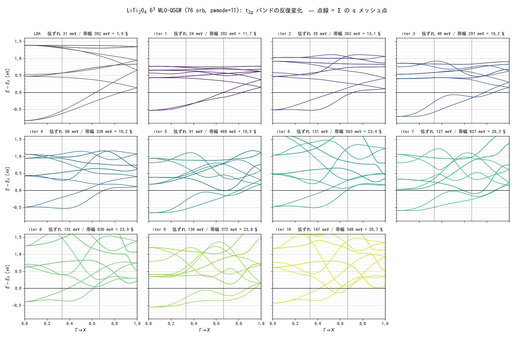](LiTi2O4/mlo_iter_grid.png)

`Samples/kBT/LiTi2O4/mlo_iter_grid.png`（生成: `LiTi2O4/mlo_iter_grid.py`）

*図 09:15-2* 反復間の差 $\Delta E(k)$ がどこに集中するか

[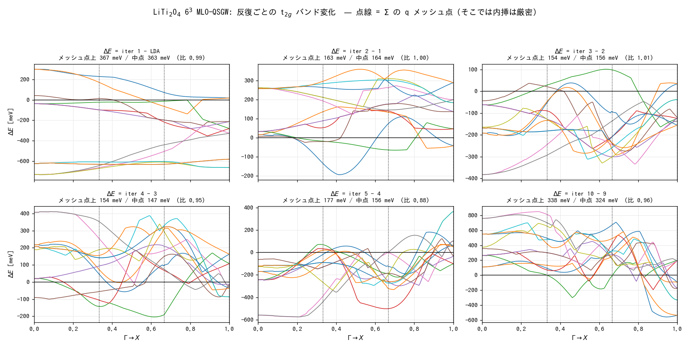](LiTi2O4/mlo_iter_diff.png)

`Samples/kBT/LiTi2O4/mlo_iter_diff.png`（生成: `LiTi2O4/mlo_iter_diff.py`）

*表 09:15-1* $\Delta E$ の大きさ（t2g b33–44、絶対値平均）

| 差 | メッシュ点上 | 中点 | 比 |
|---|---|---|---|
| iter 1 − LDA | 367 meV | 363 | 0.99 |
| **iter 2 − 1** | **163** | **164** | **1.00** |
| iter 3 − 2 | 154 | 156 | 1.01 |
| iter 4 − 3 | 154 | 147 | 0.95 |
| iter 5 − 4 | 177 | 156 | 0.88 |
| iter 10 − 9 | 338 | 324 | 0.96 |

メッシュ点では内挿は厳密（往復テストで 1.9〜4.5 meV）。にもかかわらず
**変化量はメッシュ点上でも中点でも同じ**（比 0.88〜1.01）。つまり反復ごとの変化は
内挿の荒れではなく、**Σ そのものがメッシュ点上で 150〜340 meV 動き続けている**。
iter 9→10 で 338 meV というのは、10 反復しても**収束していない**ということ。

#### 決定的: iter 1 のメッシュ点で、MLO と従来が 175 meV 違う

iter 1 は従来も MLO も**同じ LDA 波動関数から作った同じ $\Sigma^\psi_{ij}$** が出発点で、
メッシュ点では内挿は厳密。それでも:

*表 09:15-2* Γ→X の 4 メッシュ点上での比較（t2g b33–44）

| | LDA からのずれ | 1本あたり t2g 帯幅 |
|---|---|---|
| LDA | — | 391.6 meV |
| 従来 QSGW (MTO) iter 1 | **195.7 meV** | 292.0 |
| **MLO 76 orb iter 1** | **366.8** | **202.1** |
| MLO 154 orb iter 1 | (MTO との差 165.8) | 233.6 |
| MLO 76 orb iter 2 | (iter 1 との差 163.4) | 263.3 |

- **MLO の Σ はシフトが従来の 1.87 倍**（366.8 / 195.7）、
  **帯幅の圧縮が 1.9 倍**（LDA から −189.5 対 −99.6 meV）。
- MLO 76 と従来の差は**メッシュ点上で 175.5 meV**（中点 171.6、全点 172.6）。
  場所によらず一様なので、q 依存の内挿誤差ではなく**一様に強すぎる Σ**。
- **軌道を 76→154 に増やしても差は 175→166 meV とほとんど変わらない**。
  部分空間の不足なら MTO に近づくはずで、そうなっていない。

これは 05:05 以来の「内挿が荒れる」という見立てとは別の、より手前の問題である。
$\Sigma^{\rm MLO}(R)$ の局在（表 08:39-2）も、そもそも Σ が強すぎれば当然悪くなる。

#### 棄却した仮説: `hqpe_sc` の係数 2 の二重計上

`main_hqpe.sc.f90:288` の `sigmlo = 2d0*c^dag se c` の 2 は Hartree→Ry の変換で、
従来枝の `sigmv = 2d0*ev_se_ev`（:275）にも同じ 2 がある。**二重計上ではない。**

#### 交差テストを投入（09:17）

同じ出発点から 1 ステップだけ分岐させ、MLO が 1 反復で何を変えるかを単離する。

| | 出発点 | 2 反復目 | ディレクトリ |
|---|---|---|---|
| A | 従来 iter 1 | 従来 | `liti_ref2` |
| B | 従来 iter 1 | **MLO** | `liti_B_ref1_mlo2` |
| C | MLO iter 1 | MLO | `liti_mlo`（既存） |
| D | MLO iter 1 | **従来** | `liti_D_mlo1_ref2` |

B の $\tilde\chi$ は C と同一にするため `liti_mlo1` の `HamRsMLO`/`ZmloRef`（LDA 凍結）を持ち込む。
`liti_mlo1` は 76 軌道 1 反復を LDA から取り直すラン（09:02 開始、`SigRsMLO` の局在測定用）。

### 2026-09-25 09:05 訂正: 弦ずれは「荒れ」の指標になっていない（本物の曲率と帯幅が混ざる）

user「LDA から作ったものは正常か」。**LDA 側は正常**: `stale: sigm=0 mix=0 mlo=0` のクリーン開始、
SCF は `c` 収束（01:23、ehf = −109750.1776 eV）、バンドも滑らか（下表 折り返し点 1.42 本/バンド）。

問題は**指標のほう**。LDA には Σ の内挿が無いのに弦ずれが 30.8 meV ある。
これは内挿の荒れではなく **t2g バンドの本物の曲率**で、弦ずれの「床」が 30 meV もあるということ。
しかも QSGW は帯幅を潰すので、**平らになっただけで弦ずれは下がる**。
実際 MLO 76 iter 1 の 1 本あたり帯幅は LDA の半分（0.202 vs 0.392 eV）。

*表 09:05-1* 帯幅で規格化すると順序が変わる（t2g b33–44、Γ→X 211 点）

| | 弦ずれ mean [meV] | 1本あたり帯幅 [eV] | **弦ずれ/帯幅** | 折り返し点 /本 | 3次からの残差 [meV] |
|---|---|---|---|---|---|
| LDA（内挿なし＝床） | 30.8 | 0.392 | **7.9 %** | 1.42 | 32.1 |
| 従来 QSGW (MTO) iter 1 | 29.2 | 0.292 | **10.0 %** | 1.75 | 29.6 |
| MLO 76 orb iter 1 | 23.5 | 0.202 | **11.6 %** | 2.25 | 25.2 |
| MLO 154 orb iter 1 | 43.1 | 0.234 | **18.4 %** | 2.75 | 50.1 |
| MLO 76 orb iter 4 | 60.2 | 0.330 | **18.2 %** | 3.42 | 89.6 |
| MLO 76 orb iter 10 | 146.5 | 0.548 | **26.7 %** | 5.33 | 185.6 |

**訂正の中身**: 08:50 に「一発目は MLO のほうが滑らか（23.5 < 29.2）」と書いたのは誤り。
帯幅で割ると **MLO 76 iter 1 は既に従来 MTO より荒い**（11.6 % vs 10.0 %）。
折り返し点の数でも同じ（2.25 vs 1.75 本/バンド）。MLO が有利な区間は最初から無い。

**変わらない結論**: どの指標でも反復とともに単調に悪化し（7.9 → 26.7 %、折り返し 1.42 → 5.33 本）、
*表 08:39-2* の「$\Sigma^{\rm MLO}(R)$ がセル端まで 5–9 meV の台地を作る」と整合する。
測定スクリプトは `LiTi2O4/wiggle.py`。

### 2026-09-25 08:50 バンド 1 枚まとめ（従来 MTO / MLO 76 / MLO 154 と反復推移）

既存の *図 05:05-1*（MLO 10 反復の縦並び）に、**従来 QSGW (MTO, pwmode=11) の iter 1** と
**MLO 154 軌道の iter 1** を並べ、弦ずれの反復依存を 1 枚にした。

*図 08:50-1* 上段 = 一発目の比較、中段 = MLO 76 軌道の反復 2/4/7/10、下段 = 弦ずれ vs 反復。

[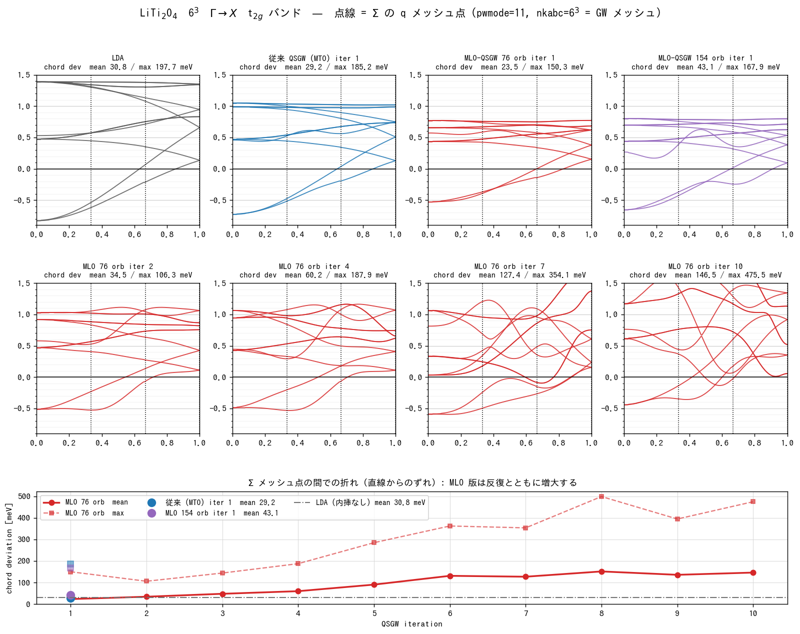](LiTi2O4/mlo_vs_mto_666.png)

`Samples/kBT/LiTi2O4/mlo_vs_mto_666.png`（生成: `LiTi2O4/mlo_vs_mto_grid.py`）

*表 08:50-1* 弦からのずれ（t2g b33–44、Γ→X 211 点、mean / max [meV]）

| | mean | max |
|---|---|---|
| LDA（Σ の内挿なし＝下限） | 30.8 | 197.7 |
| 従来 QSGW (MTO) iter 1 | 29.2 | 185.2 |
| **MLO 76 orb iter 1** | **23.5** | **150.3** |
| MLO 154 orb iter 1 | 43.1 | 167.9 |
| MLO 76 orb iter 2 | 34.5 | 106.3 |
| MLO 76 orb iter 4 | 60.2 | 187.9 |
| MLO 76 orb iter 7 | 127.4 | 354.1 |
| MLO 76 orb iter 10 | 146.5 | 475.5 |

**読み（08:50 版）**: 一発目（iter 1）だけ見れば MLO 76 は従来 MTO より弦ずれが小さい（23.5 vs 29.2）…
→ **09:05 に訂正。下記参照。**

### 2026-09-25 05:05 LiTi₂O₄ 6³ の MLO-QSGW は**失敗**。原因は「$\tilde\chi$ が動く物差しになっている」

`pwmode = 11`、`nkabc = n1n2n3 = mlo_nkabc = 6³`、`nit = 300`、LDA からクリーンに 10 反復。
**MLO 76 軌道**（`gwinit` の新既定: Li/O は s,p、Ti は s,p,d）。

*図 05:05-1* t2g バンド（b33–44）Γ–X 211 点。上から LDA / iter 1 / iter 4 / iter 7 / iter 10。
点線が 6³ の Σ メッシュ点。

[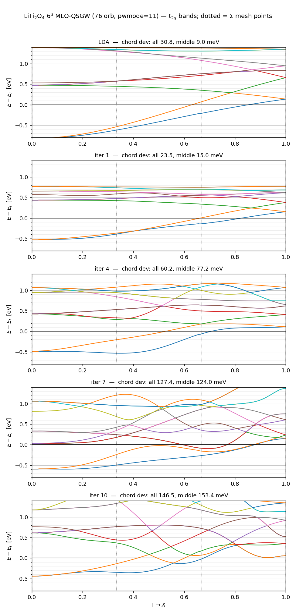](LiTi2O4/liti_mlo_chain.png)

`Samples/kBT/LiTi2O4/liti_mlo_chain.png`（生成: `LiTi2O4/mlo_chain_rows.py`）

*表 05:05-1* メッシュ点間の**弦からのずれ**（t2g b33–44、Γ–X 211 点）

| 行 | 全区間 | 中央区間 | 最悪 |
|---|---|---|---|
| LDA | 30.8 meV | 9.0 | 197.7 |
| iter 1 | **23.5** | 15.0 | 150.3 |
| iter 4 | 60.2 | 77.2 | 187.9 |
| iter 7 | 127.4 | 124.0 | 354.1 |
| **iter 10** | **146.5** | **153.4** | **475.5** |

**反復とともに悪化し続ける。** 従来法の過去値（全区間 28.4 meV）より大きい。
$E_{\rm HF}$ は iter 4 以降 −109762〜−109763 eV で落ち着いているので発散ではなく、
**リンギングを含んだまま自己無撞着になっている**。
図では iter 4 あたりからメッシュ点の中点に山が立ち、iter 7〜10 で多様体全体が波打つ。

#### 模型サイズではない

154 軌道（全 EH lm、以前 Γ–X の荒れ 9.8 → 6.3 meV を得た模型）でも iter 1 で
全区間 43.1 / 中央 43.8 meV と、**76 軌道（23.5 / 15.0）より悪い**。
$O^{\rm MLO}$ の条件数も健全（76 軌道で 36、154 軌道で 111。NiO で破綻したときは 7.4×10⁴）。

#### 実装の健全性は 3 点とも確認した

| 検証 | 方法 | 結果 |
|---|---|---|
| `sugw` の a' と `getsenex` の $z^{\rm MLO}$ が同一か | `ECALJ_ZMLO_DUMP=1` で両側を書き出して比較 | **32 q 点すべてビット単位で一致** |
| $\Sigma^{\rm MLO}(q)\to R\to q$ の往復 | `ECALJ_SIGMLO_RT=1` | メッシュ点で **1.9〜4.5 meV**（最大要素の 0.3 %） |
| q ごとの MLO/MTO の `senex` 差 | `ECALJ_SIGMLO_CHECK=1` | 全 q で一様に 13〜23 %。offset-Γ が最悪（23 %）だがそこだけ壊れてはいない |

#### 【訂正 08:39】$\tilde\chi$ は収束している。原因はそれではない

下の「$\tilde\chi$ が動く」という診断は**誤りだった**。LiTi₂O₄ の連鎖で反復ごとの $z^{\rm MLO}$ を
比べると、後半ではほとんど止まっている。

*表 08:39-1* LiTi₂O₄ 6³ の連鎖での $\tilde\chi$ の動き（72 q 点、`ECALJ_ZMLO_DUMP`）

| 反復の組 | $z^{\rm MLO}$ の相対変化 | 重なりの最小 |
|---|---|---|
| iter 1 → 5 | 6.8×10⁻³ | 0.999816 |
| iter 5 → 9 | 1.5×10⁻³ | **0.999992** |
| iter 9 → 10 | 5.4×10⁻³ | 0.999983 |

後半で 0.15〜0.5 %、重なり 0.99998 以上。**$\tilde\chi$ が止まっているのに荒れは増え続ける**ので、
基底の漂流は説明にならない。

（$\tilde\chi$ の凍結自体は設計 §4.1 どおりなので実装は残した。`ZmloRef` に永続化、
commit `01b9ea4df`。NiO で 3 反復通ることを確認済み。`ECALJ_MLO_NOCACHE=1` で従来動作。）

#### 真因: $\Sigma^{\rm MLO}(R)$ が減衰しない

*表 08:39-2* `SigRsMLO` から直接測った $\Sigma^{\rm MLO}(R)$ の距離依存（LiTi₂O₄ 6³、76 軌道）

| \|R\| (alat) | max \|Σ(R)\| [meV] | mean |
|---|---|---|
| 0（オンサイト） | 155.5 | 3.70 |
| 0.71（最近接） | 43.3 | 0.568 |
| 1.00 | 3.96 | 0.200 |
| 1.22 | **9.21** | 0.129 |
| 1.41 | **9.21** | 0.086 |
| 1.58 | 4.82 | 0.064 |
| 1.87 | **9.21** | 0.047 |
| 2.00 | 4.82 | 0.051 |
| 2.12 | 4.82 | 0.048 |

オンサイト 155 → 最近接 43 → 1.0 で 4.0 と落ちたあと、**1.2 以上で 5〜9 meV の台地に張り付き、
BvK セル端まで減らない**。

これは 09-24 に従来の $\Sigma^{\rm MTO}(R)$ で測った症状と**同じ**であり
（Ti3d–Ti3d がオンサイト 98.5 → 最近接 6.67 → 以後 0.3〜0.6 meV で減らない）、
しかも **MLO の方が台地が高い**（5〜9 meV 対 0.3〜0.6 meV）。

**つまり MLO 表現に移しても $\Sigma(R)$ の局在は改善せず、むしろ悪化している。**
フーリエ内挿の荒れは $\Sigma(R)$ がセル端で切れないことから来るので、これでは滑らかにならない。
設計書 §1 の前提（MLO なら自由度を減らせて内挿が滑らかになる）の、肝心の部分が成立していなかった。

#### 現状の結論

実装は健全である（診断 4 点とも合格、$\tilde\chi$ も収束）。しかし
**$\Sigma^{\rm MLO}(R)$ が局在しない**という一点で、この筋では目的を達しない。
検証 1（設計書 §5）が「$\Sigma^{\rm MLO}(R)$ は BvK セル端で頭打ちしないこと」を
合格条件にしていたが、**不合格**である。

#### 参考: 当初の（誤った）診断

#### 原因: $\tilde\chi$ が密度とともに動く

`getsenex` は $z^{\rm MLO}(k)$ を**その時点の $H^{\rm LDA}(k)$** から作り直す。$H^{\rm LDA}$ は密度とともに変わるので、
$\tilde\chi$ も変わる。ところが $\Sigma^{\rm MLO}_{\alpha\beta}(R)$ は**前の反復の基底で作られた行列**である。

*表 05:05-2* NiO で測った $\tilde\chi$ の動き（LDA 密度 → QSGW 1 反復後の密度）

| 量 | 値 |
|---|---|
| $z^{\rm MLO}$ の相対変化 | **1.4〜1.9 %** |
| 軌道ごとの重なり $\langle\tilde\chi^{\rm LDA}\mid\tilde\chi^{\rm QSGW}\rangle$ 最小 | **0.977〜0.992** |

つまり **$\Sigma$ が「動く物差し」で測り直され続けている**:

- 反復 $n$: $\Sigma^{\rm MLO}(R)$ を基底 $\tilde\chi^{(n)}$ で作って保存
- 反復 $n{+}1$: `getsenex` が $\tilde\chi^{(n+1)}$ を導き、**同じ数値をその基底の行列として解釈**
- さらに SCF の各ステップで密度が動くたびに $\tilde\chi$ が変わる

`--mlofreeze` は窓（`ix`, `nskip`, `eferm`, `ecbot`）しか凍結しておらず、これを防げていない。
設計書 §4.1 の「$\tilde\chi$ はチェーンを通じて同じ関数」という前提が**実装では守られていない**。
反復とともに荒れが育つこと、模型サイズを変えても直らないこと、の両方を説明する。

#### 直し方（未実装）

$\tilde\chi$ を本当に固定するには、`getsenex`（と a'）が $z^{\rm MLO}$ を
**チェーンの最初に決めた密度の $H^{\rm LDA}$** から作る必要がある。

1. 初回に `rst.<sname>` を `rst.<sname>.mlo0` として保存
2. `getsenex` はその密度から組んだ $H^{\rm LDA}(k)$ で `Hreduction` を呼ぶ

`getsenex` の中で別の密度のハミルトニアンを組むのは `lmf` の構造上それなりの改修になる。
代案として、$\tilde\chi$ の回転を毎回補正する（前の基底との重なり行列で $\Sigma^{\rm MLO}$ を回す）道もあるが、
$\tilde\chi$ は非直交なので素直ではない。**次の一手はここ。**

### 2026-09-25 00:06 NiO 2³/3³ を**収束させて**取り直し — ギャップ差 223 meV（3³）、k 点を増やすと改善

前夜の NiO の数値はすべて **SCF が収束していない**状態での比較だった。
サンプルの `nit = 5` で打ち切られ、lmf の最終行が `c` ではなく **`x`**（反復上限）で終わっていた。
`nit = 40` にして全段 `c` で終わらせ、従来版と MLO 版を**逐次・空ディレクトリ**で取り直した。

*図 00:06-1* NiO 2³、*図 00:06-2* NiO 3³。行＝LDA / QSGW iter 1 / iter 2、列＝全域 / $-4\sim+3$ eV ズーム。
青実線＝従来（$\Sigma^{\rm MTO}$ 内挿）、赤破線＝MLO 50 軌道。両者をその行の従来の $E_F$ で揃えてある。

[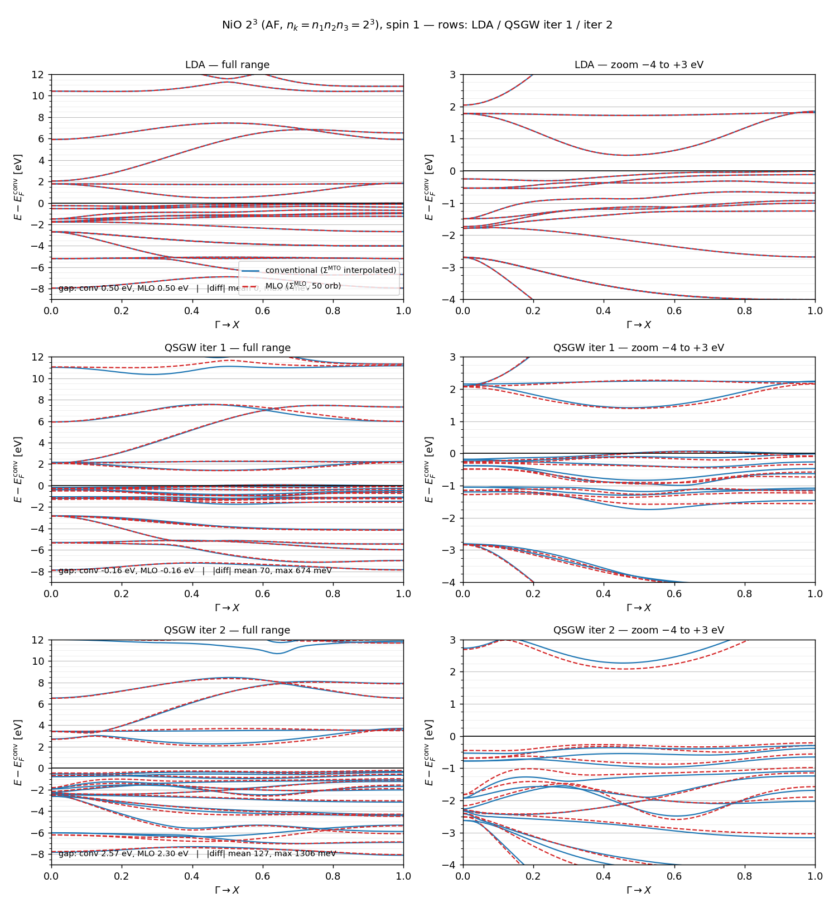](NiO/mloqsgw_nio222_rows.png)

[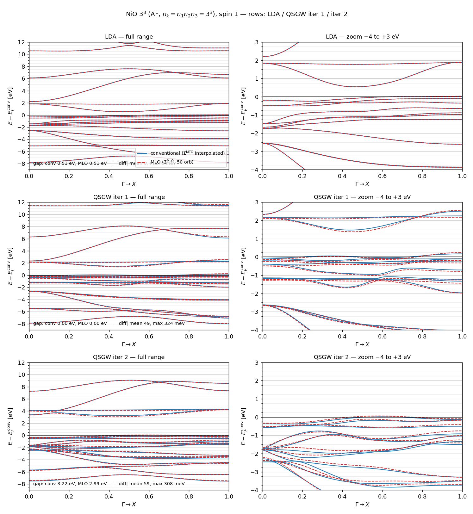](NiO/mloqsgw_nio333_rows.png)

`Samples/kBT/NiO/mloqsgw_nio222_rows.png`, `mloqsgw_nio333_rows.png`（生成: `NiO/mloqsgw_rows.py`）

*表 00:06-1* NiO、`nit = 40`（全段 `c` で収束）。バンド差は b1–b24、Γ–X 101 点、共通 $E_F$

| メッシュ | 行 | ギャップ 従来 | MLO | 差 | バンド差 平均 | 最大 |
|---|---|---|---|---|---|---|
| 2³ | LDA | 0.497 eV | 0.497 | 0 | 0.0 meV | 0.0 |
| | iter 1 | −0.165 | −0.164 | 0 | 70 | 674 |
| | iter 2 | 2.569 | 2.296 | **−273 meV** | 127 | 1306 |
| 3³ | LDA | 0.513 | 0.513 | 0 | 0.0 | 0.0 |
| | iter 1 | 0.002 | 0.004 | +2 | 49 | 324 |
| | **iter 2** | **3.217** | **2.994** | **−223 meV** | **59** | **308** |

**k 点を増やすと改善する** — バンド差は 2³ の 127 / 1306 meV から 3³ の 59 / 308 meV へ（平均で半分、最大で 1/4）。
図の 3³ iter 2 では左パネルで実線と破線がほぼ全域で重なり、ずれは右パネルの −1〜−3.5 eV
（Ni 3d / O 2p の占有多様体）に集中する。伝導帯（+4 eV 付近）は一致。
MLO 50 軌道（MTO 全体 `ldim` = 76 の部分空間）への**射影誤差**として、現状はこの水準。

#### 前夜の数値を撤回する

| 前夜の報告 | 実際 | 理由 |
|---|---|---|
| 3³ でギャップ差 45 meV、バンド差 25 meV | **223 meV / 59 meV** | `gwsc` のクリーンアップが `SigRsMLO` を毎回消しており、`lmf --jobgw=1` が従来 $\Sigma$ に落ちていた**混成**だった |
| 「2 本を同時実行したから汚染した」 | **同時実行は無関係** | `gwsc 2` 一発と同時実行版は小数点以下まで一致した |
| 「2³ で EH2 を足すと 135 → 284 meV に悪化」 | 悪化の事実は変わらないが数値は未収束 | $O^{\rm MLO}$ の条件数 $1.3\times10^2\to7.4\times10^4$ という機構の結論は有効 |

#### 直したこと

| # | 症状 | 原因 | 対処 |
|---|---|---|---|
| 1 | `gwsc 1` を繰り返す連鎖で GW 入力が従来 $\Sigma$ に戻る | 起動時クリーンアップが `SigRsMLO` まで消していた | 消すのは `__cmlo.*` / `__SigmMLO.q` / `__HamiltonianGW*` だけに限定（commit `c506d35f5`） |
| 2 | `__mloindex` という名前 | `__` 始まりは `cleargw` が消す対象。連鎖を通じて凍結すべきものに付けてはいけない | **`HamRsMLO` の末尾レコードに畳み込む**。既存の読み手は前方のレコードで止まるので後方互換（commit `71dd86a7d`） |
| 3 | `SigmMLO.q` という名前 | 反復内の一時受け渡し（`hqpe_sc`→`mlo`）なので `__` を付けるべき | **`__SigmMLO.q`** に改名（commit `334e4707e`） |
| 4 | 反復ごとに $\tilde\chi$ が作り直される | `mlo` が毎回 `HamRsMLO` を書き直していた | **`--mlofreeze`** を新設。`gwsc` が反復内の `mlo` に渡し、既存の `HamRsMLO` と凍結した窓を使う（commit `aaa5cb236`） |

#### 運用の教訓

- **SCF が `c` で終わっているか毎回確認する。** `x`（`nit` 打ち切り）だと、`gwsc` が呼び出しごとに入れる
  「初期バンド構造」の `lmf` が 1 回余分に入るだけで最終密度が変わり、比較にならない。
  収束させれば `gwsc 1`×2 と `gwsc 2` は $E_{\rm HF}$ で **0.1〜0.2 meV** まで一致する。
- `gwsc 1`×N と `gwsc N` は**厳密には等価でない**（前者は呼び出しごとに `llmf_start` が入る）。
  これは `gwsc` の正常動作。収束していれば実害は無い。
- **LDA 行が両者で完全一致すること**を健全性チェックに使う。

## 2026-09-24

### 2026-09-24 23:02 NiO で MLO-QSGW を検証（クリーン再実行） — 反復するほど一致し、ギャップ差 45 meV

LiTi₂O₄ は 1 反復 17 分で試行が重いので、**NiO 3³（AF、`nspin=2`）を軽い検証台**にした。
kt1 GPU で 1 反復 ≈ 25 秒、`nkabc = n1n2n3 = mlo_nkabc = [3,3,3]`、MLO は**全 EH lm の 50 軌道**
（Niup/Nidn 各 16 + O 各 9）、MTO 全体は `ldim` = 76。

**クリーン実行の手順**（`/mnt/data1/LiTi2O4_kbt_runs/clean_nio.sh`）。
従来版と MLO 版を**逐次**、それぞれ空ディレクトリから `lmfa` → LDA → `gwsc 1` ×2 で回し、
各段で残骸ゼロを確認し、**毎反復バンドを取る**。
（最初の測定では 2 本を**同時に**走らせて汚染し、平均 135 meV・ギャップ 0.87 eV 過小という
誤った値を得た。逐次・クリーンで消えたので、以下が正しい値である。）

*図 23:02-1* 行＝LDA / QSGW iter 1 / iter 2、列＝全域 / $-4\sim+3$ eV ズーム。
青実線＝従来（$\Sigma^{\rm MTO}$ 内挿）、赤破線＝MLO 50。両者を**その行の従来の $E_F$** で揃えてある。

[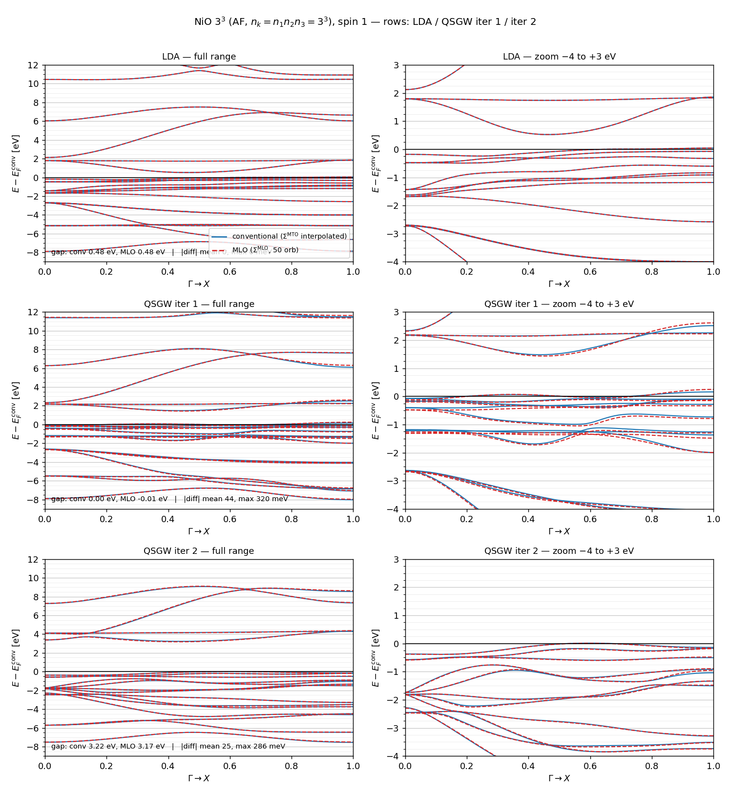](NiO/mloqsgw_nio_rows.png)

`Samples/kBT/NiO/mloqsgw_nio_rows.png`（生成: `NiO/mloqsgw_rows.py`）

*表 23:02-1* NiO 3³。バンド差は b1–b24、Γ–X 101 点、共通 $E_F$

| 行 | ギャップ 従来 | ギャップ MLO | 差 | バンド差 平均 | 最大 | $E_{\rm HF}$ 従来 / MLO [eV] |
|---|---|---|---|---|---|---|
| LDA | 0.481 eV | 0.481 | **0** | **0.0 meV** | 0.0 | −86704.3038 / 同一 |
| iter 1 | 0.002 | −0.010 | −12 meV | 44 | 320 | −86675.891 / −86677.001 |
| **iter 2** | **3.217** | **3.172** | **−45 meV** | **25** | 286 | −86698.142 / −86698.518 |

**反復が進むほど一致が良くなる**（44 → 25 meV）。Si 2³ の 33 meV と同程度で、
MLO 50 軌道（MTO 76 の部分空間）への**射影誤差**として妥当な水準。
iter 1 でまだギャップが開いていない（被占有 15 本）段階が一番ずれ、
iter 2 でギャップが 3.22 eV に開くと 25 meV まで縮む。

サイト磁気モーメント（iter 2）: 従来 ±1.4475、MLO ±1.4466。AF は両者で保たれている。

#### EH2 を MLO に足してはいけない — 理屈

2³ の段階で、Ni の d に EH2 を足した模型（`mlo_lm2`、50 → 60 軌道）も試した。**悪化する。**

*表 23:02-2* $O^{\rm MLO}=c^\dagger c$ の固有値（`__cmlo.data` から直接計算、NiO 2³）

| 模型 | 最小固有値 | 最大 | 条件数 | 小さい方から |
|---|---|---|---|---|
| MLO 50（EH のみ） | 5.1×10⁻³ | 0.66 | **1.3×10²** | 8e-3, 8e-3, 1.0e-2, 1.2e-2, … なだらか |
| MLO 60（+Ni d EH2） | **1.2×10⁻⁵** | 0.91 | **7.4×10⁴** | 1.4e-5 が 4 個、6.5e-5 が 3 個、… |

**理屈**: MLO は固定した MTO 種を**バンド多様体へ射影**したもの（式 (10)）。
窓の中に Ni 3d 的なバンドは **(サイト, lm) あたり本質的に 1 本**しかない。
EH の d と EH2 の d は MTO としては（球外の裾が違うので）独立だが、
**同じバンド多様体へ射影すると、その違いが落ちてほぼ同じ関数に潰れる**。

> **一般則**: (サイト, lm) ごとの MLO の本数は、**窓の中にあるその性格のバンドの本数を超えられない**。
> 超えた分は射影でほぼ零空間に落ち、$O^{\rm MLO}$ が特異に近づく。

式 (14) は $\left(O^{\rm MLO}\right)^{-1}$ を **2 回**挟むので、条件数の悪化は 2 乗で効く。

LiTi₂O₄ で全 230 チャネルの MLO が `Hreduction: normalization error` で破綻した件、
設計書 §7 の「生の MTO 表現では EH2 の自由度を触ると値が大きく動く／破綻する」も同じ機構。
**帰結: EH 1 枚／(サイト, lm) が正しい設計**（設計書 §6 リスク 5 の鉄則）。

#### 運用の教訓

**比較用の実行は必ず逐次・クリーンなディレクトリで。** 2 本を同時に走らせると汚染し、
平均 135 meV・ギャップ 0.87 eV 過小という**もっともらしいが誤った**結果が出た。
LDA 行が両者で完全一致することを毎回の健全性チェックに使う。

### 2026-09-24 20:43 段 4 実装 — **MLO-QSGW が自己無撞着に回るようになった**（Si で検証）

設計書 [sigma_mlo_design.md](sigma_mlo_design.md) の段 4（`getsenex` の差し替え）を実装し、
`gwsc` で MLO 内挿の QSGW が最後まで回ることを Si 2³ で確認した。

**実装**（commit `408436715`）

- **`m_sigmlo.f90`（新規）** — `SigRsMLO` と `__mloindex` を読み、任意 $k$ で
  (1) $\Sigma^{\rm MLO}(k)=\sum_R\Sigma^{\rm MLO}(R)e^{-ikR}$（式 (12)）、
  (2) $z^{\rm MLO}(k)$ を `Hreduction($H^{\rm LDA}(k),S^{\rm PMT}(k)$)` で**その場で作り直す**（内挿しない、式 (17)）、
  (3) $A=S^{\rm PMT}z^{\rm MLO}$、$O^{\rm MLO}=z^\dagger A$（式 (15)）、
  (4) `senex`$=A(O^{\rm MLO})^{-1}\Sigma^{\rm MLO}(k)(O^{\rm MLO})^{-1}A^\dagger$（式 (14)）。
- **`getsenex(qp,isp,ndimh,ovlm,hamm)`** — `hamm` を追加（呼び出し 4 箇所も更新）。
  `SigRsMLO` と `__mloindex` があれば MLO 経路、無ければ従来どおり。既定は変わらない。
- **`SigRsMLO` を自己完結化** — 対リスト（`plat`, `npair`, `nlat`, `nqwgt`, `ib_tableM`, `ix`）を同梱。
  `getsenex` は `m_HamPMT` の状態に依存しない。

*図 20:43-1* Si 2³、2 反復後の自己無撞着バンド。左＝両者の重ね書き、右＝差。点線が Σ メッシュ点（Γ, X）。

[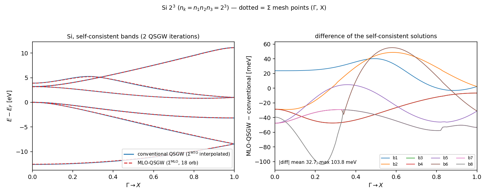](Si/mloqsgw_si.png)

`Samples/kBT/Si/mloqsgw_si.png`（生成: `Si/mloqsgw_si.py`）

*表 20:43-1* Si 2³、2 反復後

| | 従来 QSGW | **MLO-QSGW**（18 軌道） |
|---|---|---|
| $E_F$ | 3.288 eV | 3.259 |
| $E_{\rm HF}$ | −15729.0750 eV | −15729.1195 |
| バンド差（b1–8、Γ–X 101 点） | — | 平均 **32.7** meV、最大 **103.8** |

**読み**: 左図では両者はほぼ重なる。差は Σ メッシュ点（Γ, X）でも 0 にならない（b1 で +24 meV）が、
これは**別の自己無撞着解に収束した**ためで、内挿誤差ではない。
Si の MLO は 18 軌道（2 Si × spd）で MTO 50 チャネルの部分空間なので、
この差は MLO 部分空間への射影誤差と見るべき大きさである。

**`gwsc` の構成**（できるだけ反復の外へ出した）

| 反復の外（1 回） | 依存するもの |
|---|---|
| `lmf --jobgw=0` | 構造と基底のみ（`m_hamindex0_init()` → `HAMindex0`） |
| `qg4gw --job=1` | 同上（`QGpsi`/`QGcou`） |
| `lmf --writeham --mlo` | `HamiltonianPMTInfo` |
| `mlo --mlo` | `__mloindex`（凍結した `ix`, `mlomethod`, `nskip`, `eferm`, `ecbot`）＋ `HamRsMLO` |

| 反復ごと | |
|---|---|
| `lmf --jobgw=1` | a3 ＋ **a'**（`sugw` の中で `__cmlo.data`） |
| GW 本体 | $\Sigma^{\psi}$ |
| `hqpe_sc` | `sigm`（MTO）と **`SigmMLO.q`**（MLO）を**並列に**出す |
| `mlo --mlo` | `SigRsMLO` |
| `lmf` | SCF。`getsenex` が MLO 経路で `senex` を作る |

**投入**: LiTi₂O₄ 6³（全 EH lm 154 軌道）を LDA から 10 反復（`n666_mloqsgw`、20:40 開始、1 反復 ≈ 17 分）。
従来の `n666_nk6_from_lda` と荒れ・収束値を突き合わせる。

### 2026-09-24 20:10 MLO 内挿の実装（段 1'〜3 + a'）と LiTi₂O₄ 6³ での最初の比較

設計書 [sigma_mlo_design.md](sigma_mlo_design.md) の実装を進め、LiTi₂O₄ 6³ で従来法と比べた。
**出発点は `n666_nk6_from_lda` の iter 10（6³ 収束済み）**で、そこから `gwsc 1 --mlo` を 1 反復。

*図 20:10-1* t2g バンド（b33–44）Γ–X 211 点。左＝バンド、右＝差。点線が 6³ の Σ メッシュ点。

[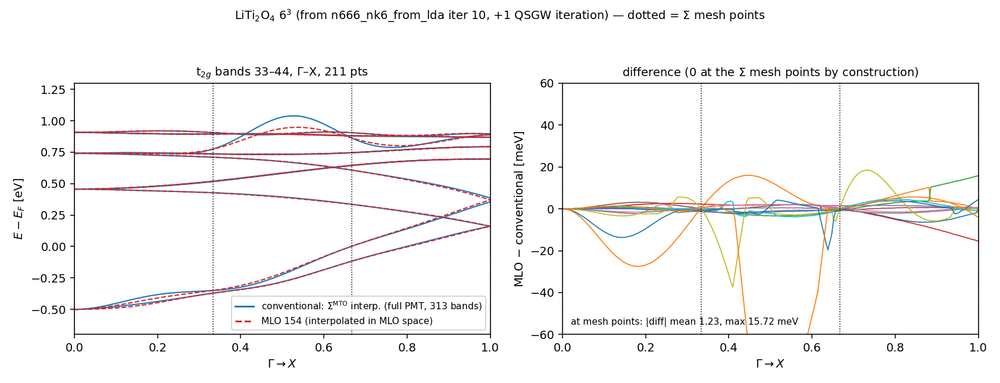](LiTi2O4/mlosig_666.png)

`Samples/kBT/LiTi2O4/mlosig_666.png`（生成: `LiTi2O4/mlosig_rows.py`）

*表 20:10-1* **メッシュ点間の弦からのずれ**（= 内挿のオーバーシュート）、t2g b33–44 [meV]

| 区間 | 従来（$\Sigma^{\rm MTO}$ 内挿、完全 PMT 313 バンド） | MLO 154 | |
|---|---|---|---|
| 中央（x = 1/3 〜 2/3） | 37.4 | **27.3** | **−27 %** |
| 全区間平均 | 28.4 | 24.8 | −13 % |
| **b44 の中央区間**（図の 1.03 eV の山） | **133.4** | **42.3** | **−68 %** |
| b41 の中央区間 | 95.9 | 88.3 | −8 % |

**一番派手に振動していた b44 が 3 分の 1 になった。** メッシュ点での一致は 1.23 meV 平均（max 15.7）。

**測り方の訂正**: 最初は局所 2 次フィットからの残差で測って「MLO の方が粗い」と判定しかけたが、
この量は**バンド交差で必ず尖る**ので t2g 多様体では交差だけを拾う。
正しくは上の「隣接メッシュ点を結ぶ弦からのずれ」（設計書 §8.3）。

**Si では判定できない**ことも確かめた（`si_gwsc` 2³）。従来法の粗さが既に 0.02〜0.11 meV しかなく、
取り除くべきリンギングが存在しない。Si の Σ は滑らかで、Ti 3d の EH2 のような準線形従属も無い。

**実装**（commit `a0c7a7300` 〜 `1d0094c4e`）。踏んだバグ 10 件は設計書 §8 に記録した。主なもの:
`sigmloi` の MPI 集約漏れ（一部の k で Σ が消える）、`hqpe_sc` からの `rotmatMTO` segfault、
そして**基底の不整合**（$\tilde\chi$ を LDA で作り $\Sigma^{\psi}$ を QSGW 基底のまま縮約 → メッシュ点で 44〜218 meV、
逆向きなら 312 meV）。最後のものは **a' を `sugw` に実装**して解決した（設計書 §4.2）:
`__VxcEvec` に書かれるのと同一の `evec` を使って $c' = (z^\psi)^\dagger S^{\rm PMT} z^{\rm MLO}_0$ を作るので、
基底の一致が構造的に保証される。

**手順の罠**: テストスクリプトが `sigm.<sname>` を消したまま復元せず、バンドが黙って LDA になっていた
（`bndfp (warning): no sigm file found ... LDA calculation only` は出るが計算は止まらない）。

**次**: a' 入りの `gwsc` で LiTi₂O₄ を回し直し（20:06 投入）、メッシュ点の厳密性が 300 meV → 数 meV になるか確認。
その後、段 4（`getsenex` 差し替え）で 6³ の反復を回す。

### 2026-09-24 17:40 設計書の実装（段 1'〜3）— Si 2³ でスモークテスト通過、メッシュ点で 1.4〜21.5 meV

[sigma_mlo_design.md](sigma_mlo_design.md) の段 1'〜3 を実装し、Si（`nkabc = n1n2n3 = mlo_nkabc = [2,2,2]`、`pwmode=11`、
MLO 18 軌道 = 2 Si × spd）で端から端まで通した。

**実装（commit `a0c7a7300`, `3bf449a11`, `409ccf9d6`, `7039157fa`）**

| 段 | 変更 |
|---|---|
| 1' | `__cmlo.data` の書き出しは**既にあった**（`m_HamPMT.f90` の `cmlo4GWinput`、`--mlo` で有効）。設計の要求に合わせ、`sugw.f90` が `--mlo` のとき `__HamiltonianGW` に **$\Sigma$ 込みでなく $H^{\rm LDA}$** を書くよう変更（`hamm_lda`）。MLO を LDA 由来にするため |
| 2 | `hqpe_sc`: 式 (11) の $\Sigma^{\rm MLO}(q)=c^\dagger(\Sigma^\psi-V_{xc})c$ を作り（`eseavrmean` の窓外外挿項も同じ形で足す）`SigmMLO.q` に書く。$\Sigma^\psi$ は既存の `se(1:nx,1:nx,ip)` そのもの。`m_HamPMT`: それを `hammr`/`ovlmr` と**同じ対称化→全 BZ 回転→FFT の経路**に相乗りさせ `SigRsMLO` を書く |
| 3 | `m_mlo_ham::calc_ham_eigen`: `SigRsMLO` があれば `hammr` と同じ位相で `hamm` に加算 |
| — | `gwsc`: `--mlo` のとき `lmf --jobgw=1` と `hqpe_sc` の**間**に `mlo --mlo` を挟む（この順序でないと `__cmlo.data` が 1 反復ずれる） |

**スモークテスト**: LDA → `gwsc 1 si --mlo`（12 秒）→ `SigmMLO.q`（nmlo=18, nqibz=3）→
`lmf --writeham --mlo`（**sigm を外して LDA**）→ `mlo --mlo` → `SigRsMLO` → バンド。
`HamRsMLO` は `getsenex` の後に書かれる `__HamiltonianPMT` 由来なので既に $\Sigma$ を含む。
**二重計上を避けるため、比較は「LDA の `HamRsMLO` + `SigRsMLO`」対「通常の QSGW バンド」で行う。**

*表 17:40-1* Γ 点（= Σ メッシュ点）での $\Sigma$ 補正 $E^{\rm QSGW}-E^{\rm LDA}$

| band | 従来（MTO 表現） | **MLO 表現** | 差 |
|---|---|---|---|
| 1（Si 3s） | 205.4 meV | 219.5 | 14.1 |
| 2–4（Γ25′ VBM） | 229.1 | 207.6 | 21.5 |
| 5–7（Γ15） | 967.7 | 969.1 | **1.4** |
| 8 | 834.1 | 821.4 | 12.7 |
| 9 以上（窓の外） | — | — | 1 eV 級（想定内） |

**判定**: 経路は通った。メッシュ点で窓内のバンドは 1.4〜21.5 meV で一致しており、
これは MLO 部分空間（18 軌道）への射影誤差と見てよい大きさ。

**未解決・注意**:
- 対称線上の平均/最大差（バンド 2 で 281 meV 等）は、61 バンドの PMT と 18 バンドの MLO 模型で
  **バンド番号の対応が崩れている**寄与が入っている。分離していない。
- このテストでは `qplist.dat` の $E_F$ が QSGW のもののまま LDA の $H$ で MLO を作っており、窓がわずかに不整合。
- `gwsc` の `mlo --mlo` 段は `HamiltonianPMTInfo` と `qplist.dat` が既にあることを前提にしている（要 `job_band` 先行）。

次は Si で検証 2（メッシュ点での厳密性、バンド対応を揃えて）と検証 3（補間の滑らかさ）。

### 2026-09-24 16:33 tiNoD2（Ti 3d の EH2 を基底から外す、MTO 230→210）10 反復完走 — **荒れは減らない。この筋は否定された**

`n666_tiNoD2` は 16:33 に iter 10 まで完走（1 反復 ≈ 15.5 分）。Eb9 は iter 6 以降 −8.87 で安定し、収束はしている。
同条件・同メッシュの 230 基底（`n666_nk6_from_lda`）と iter 10 で比較:

*表 16:33-1* **MTO 230 vs 210（Ti 3d の EH2 を落とす）、6³、iter 10**

| 量 [meV] | 230（EH2 あり） | **210（Ti 3d EH2 なし）** | 判定 |
|---|---|---|---|
| O 2p 荒れ mean / max | 7.4 / 11.4 | 7.0 / 11.0 | ほぼ同じ |
| t2g（非占有）mean / max | 3.1 / 5.9 | 3.3 / 7.1 | **悪化** |
| t2gocc (b33 / b34) | 2.92 / 7.65 | **5.99 / 8.44** | **悪化** |
| Eb9 [eV] | −8.762 | −8.866 | 基底が違うので差は当然 |

**結論**: 「Ti 3d に動径関数を 2 枚入れるのが入れ過ぎ」という仮説では説明できない。
基底から外しても内挿の荒れは減らず、占有 t2g のさざ波はむしろ増えた。
09-23〜24 の後処理（`ECALJ_SIG_1RAD` / `ECALJ_SIG_EHONLY` / `ECALJ_SIG_DROPL`）が全滅したのと同じ結論に、
**基底そのものを縮めた場合でも**到達した。

→ 原因は「特定の動径関数が余分」ではなく、**MTO 表現全体の自由度の持たせ方**である。
設計書 [sigma_mlo_design.md](sigma_mlo_design.md) の前提（§1 の表）を実験的に裏付ける結果。
以後は MLO 表現の実装（段 1' → 段 2 → 段 3）に進む。

### 2026-09-24 13:53 **Ti の d を EH2 から外して LDA から 6³ を回す**（user「ctrlg で 3d に 2 枚入れるのが入れ過ぎ」）

**進行中のチェーン（反復ごとに更新）**

*表 13:53-3*  QSGW 反復（`tinod2_rows.png` に行を足していく）

| iter | 開始→終了 | 秒 | o2p | t2g（非占有） | **t2gocc (b33/b34)** | 底 |
|---|---|---|---|---|---|---|

[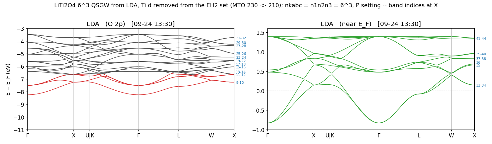](LiTi2O4/plots/tinod2_rows.png)
*図 13:53-3*  行 = LDA, iter 1, …（反復ごとに伸ばす）

**判定の見方**: (1) 補間の荒れが従来の 9.2 meV から落ちれば「near-null 方向のふらつきが原因」が確定、
(2) 収束解が従来と何 meV 違うか（LDA で 6 meV なので QSGW でも数十 meV 以内の見込み）、
(3) 占有 t2g のさざ波（`t2gocc`）。

---

user「たぶん線形独立性の低い自由度がふらついている」。今日の一連の試験はすべて **Σ を作ったあとで
3d EH2 を取り除く後処理**で、どれも失敗した（**表 13:53-1**）。Σ は既にその自由度を使って組み上がっているので
後から抜けない。**最初から張らない**のが筋、という判断。

*表 13:53-1*  Σ から Ti 3d EH2 を後処理で取り除く試み（すべて収束済み 6³ の同じ `sigm`、Γ–X）

| やり方 | 実装 | 電子数 / E_F | メッシュ点での値のずれ | 補間の荒れ（基準 9.2 meV） |
|---|---|---|---|---|
| オフサイトだけゼロ | `ECALJ_SIG_1RAD=2` | **638 / Inf** | — | — |
| Σ ブロックを丸ごとゼロ（不整合、$O^{-1}$ は 230 のまま） | `ECALJ_SIG_EHONLY=2` | 66 / 0.2385 | **平均 292、max 635 meV** | 5.24（改善するが値が壊れる） |
| 同上、EH2 全部 | `ECALJ_SIG_EHONLY=-1` | **638 / Inf** | — | — |
| **部分空間から除外**（整合、$\Sigma_{\rm sub}, O_{\rm sub}, \langle{\rm sub}\vert {\rm PMT}\rangle$ すべて 210） | `ECALJ_SIG_DROPL=2` | 66 / 0.2927 | 平均 113、max 211 meV | **9.48（改善せず）** |

[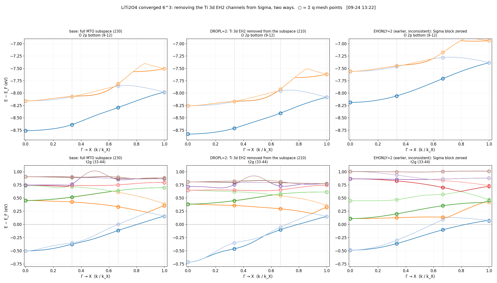](LiTi2O4/plots/sigma_dropl_test.png)
*図 13:53-1*  左 = 従来（230）/ 中 = `DROPL=2`（整合した部分空間縮小、210）/ 右 = `EHONLY=2`（不整合）

整合させても**荒れは減らず値だけ 100〜200 meV 動く** → **Ti 3d の EH2 は Σ が実際に使っている自由度**であり、
かつ**リンギングの原因でもない**（除いても残る）。

`getsenex` が既に
$\hat\Sigma = |{\rm PMT}\rangle\langle{\rm PMT}|{\rm MTO}\rangle O_{\rm MTO}^{-1}\Sigma^{\rm MTO}O_{\rm MTO}^{-1}\langle{\rm MTO}|{\rm PMT}\rangle\langle{\rm PMT}|$
の形（非直交の双対基底）で展開しており、APW ブロックも埋まっている（[rdsigm2.f90:18](../../SRC/subroutines/rdsigm2.f90)）。
**変えられるのは「どの部分空間で Σ を保持・内挿するか」だけ**である。

**基底そのものを縮める試験（09-24 13:30 LDA、13:53 QSGW 投入）**
`ctrlg` の Ti の `rsmh2`/`eh2` から d を外す（`[1.04,1.04,1.04]` → `[1.04,1.04]`）。
MTO は **230 → 210**（`ndimh = nmto+napw = 299 = 210+89`）。
run: `/mnt/data1/LiTi2O4_kbt_runs/n666_tiNoD2`、`nkabc = n1n2n3 = 6³`、P 設定、LDA から 10 反復。

[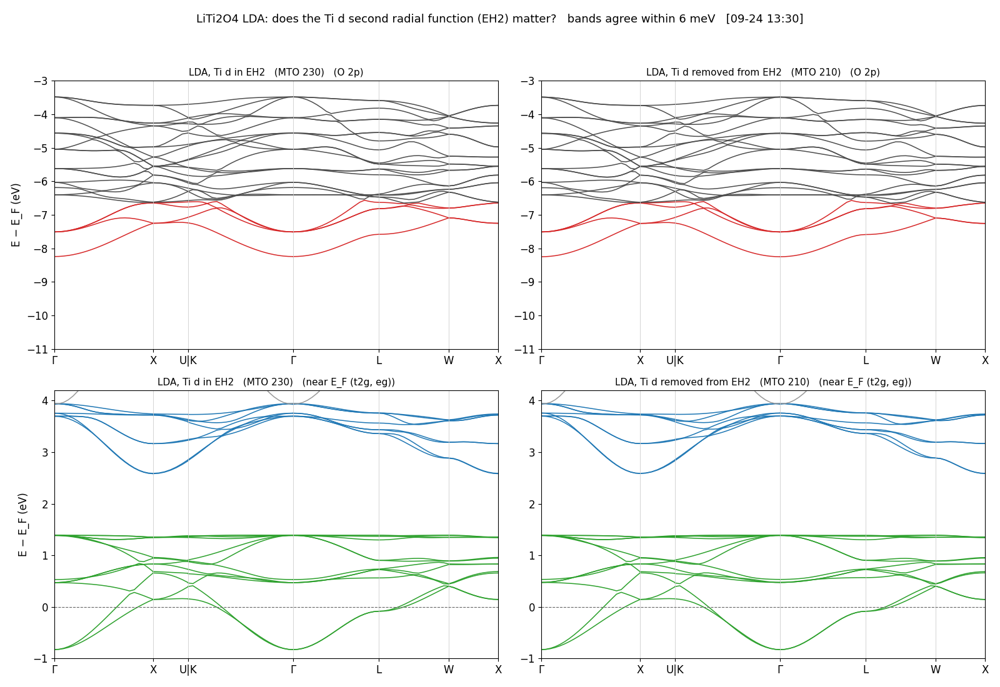](LiTi2O4/plots/tinod2_lda.png)
*図 13:53-2*  LDA。左 = Ti d を EH2 に入れた従来（230）/ 右 = 外した版（210）。上段 O 2p、下段 E_F 近傍（緑 t2g、青 eg）

*表 13:53-2*  LDA バンドの差（210 − 230）

| 帯 | 平均 | rms | max |
|---|---|---|---|
| O 2p 底 | −2.8 | 2.1 | 5.9 meV |
| O 2p 全体 | −2.8 | 1.2 | 6.1 |
| t2g | +0.5 | 2.0 | 5.9 |
| eg | +1.9 | 1.2 | 6.6 |
| 格子間 | +4.0 | 2.1 | 10.8 |

帯端は t2g −0.829〜1.390 eV（幅 2.219）で**完全一致**、eg も 2.582→2.585。
→ **LDA では Ti d の 2 枚目はほぼ不要**。user の見立てどおり。

### 2026-09-24 00:05 **全 MTO 自由度の MLO（154 軌道）で eg 問題が解決** — user の提案どおり
user「基本的には MTO の自由度全てでの MLO を考えてモデル化して、自己エネルギーインターポレーションするように
してもいいかもしれない」。`mlo_lm` を **全 14 原子 × lm 1–16** にして 9³ の QSGW（iter 15）から作った。
`ndimMTO = 154`（MTO ブロック全体は 230 なので完全ではない — `mlo_lm` は lm チャネルの選択で、
EH/EH2 の 2 組の動径関数をすべて拾えているわけではない）。run: `/mnt/data1/LiTi2O4_kbt_runs/mlo_fullMTO_nk9`、09-24 00:02。

[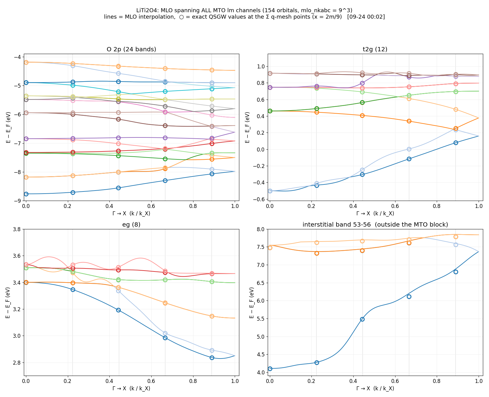](LiTi2O4/plots/mlo_fullMTO_nk9.png)
*図 00:05-1*  線 = 154 軌道 MLO の補間、○ = Σ メッシュ点上の厳密な QSGW 値。O 2p / t2g / eg / 格子間バンド

**全体像**（user 05:00「上のほうのバンドもあるんですね、全体像みたい」）:

[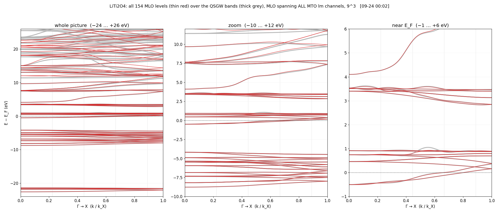](LiTi2O4/plots/mlo_fullMTO_wide.png)
*図 00:05-2*  154 準位すべて（細い赤）を QSGW バンド（太い灰）に重ねたもの。左 −24〜+26 eV / 中 −10〜+12 / 右 −1〜+6 eV

*表 00:05-3*  各 QSGW バンドに最も近い MLO 準位までの距離（211 k 平均）[meV]

| band | E 範囲 [eV] | 距離 |
|---|---|---|
| 1–8（O 2s） | −22.6 〜 −21.4 | **0.1–0.2** |
| 9–32（O 2p） | −8.8 〜 −4.2 | **1.2–2.4** |
| 33–44（t2g） | −0.50 〜 1.05 | **4.1–14.7** |
| 45–52（eg） | 2.83 〜 3.62 | **0.7–8.3** |
| 53–56（格子間） | 4.10 〜 7.81 | 33–46 |
| 58–70 | 7.6 〜 15.5 | 67–119 |
| 80–100 | 18.4 〜 24.3 | 258–306 |

**MLO は 154 準位を持つので +25 eV まで「線はある」が、合っているのは E_F + 4 eV まで。**
左パネルで、−22 eV の O 2s から +3.6 eV の eg までは赤が灰に完全に乗り、
**4 eV 以上では赤と灰が別々の線になる**（中パネルの 5〜12 eV でずれが目立つ）。
MTO ブロック（230 次元）のうち 154 しか取れていないことと、そもそも高エネルギー側は APW が担うことの両方による。
→ **Σ の補間を MLO 基底で行う分には問題ない**（`sigm` が効くのは `emax_sigm = 3 Ry` 以下、実質この窓の中）。

*表 00:05-1*  Σ メッシュ点で、各第一原理バンドに**最も近い MLO 準位までの距離** [meV]

| 帯 | mean | rms | max |
|---|---|---|---|
| O 2s (1–8) | **0.2** | 0.1 | 0.5 |
| O 2p (9–32) | **0.4** | 0.5 | 2.5 |
| t2g (33–44) | **0.5** | 0.5 | 2.5 |
| **eg (45–52)** | **0.3** | 0.5 | **2.6** |
| band 53–56（格子間） | 47.2 | 23.9 | 92.0 |

**eg が 16.3 meV → 0.3 meV になった。** 20 軌道（Ti d のみ）で eg が合わなかったのは、eg が
**同じ MTO ブロック内の他のチャネル**（Ti s, O p, O s など）と混成していたためで、
「格子間バンドとの混成」や「`mlo_delta` の床」ではなかった（後者 2 つは既に否定済み: **表 23:18-1**、`mlo_delta` 走査）。
一方、格子間バンド（53 以降）は MTO ブロックの外なので依然 47 meV — ここだけは空格子球が要る。

*表 00:05-2*  Γ–X の滑らかさ（残差 rms 平均）と MLO − QSGW

| | QSGW | MLO-full (154) |
|---|---|---|
| t2g の滑らかさ | 9.8 | **6.3** meV |
| eg の滑らかさ | 9.4 | **7.4** meV |
| MLO − QSGW（全 211 k）t2g | — | rms 11.6 / max 123.7 |
| 同 eg | — | rms 6.5 / max 30.3 |

**含意**: `sigm` は MTO 部分空間に射影された量（`ndimsig = ldim`）なので、**全 MTO を張る MLO への変換は
情報を失わない**。その基底で Σ(R) を持てば、メッシュ点の値を厳密に保ったまま補間だけを改善できる。
ただし滑らかさの改善は 9.8 → 6.3 meV と、t2g だけの 12 軌道 MLO（3.4 meV、**表 22:45-1**）ほどではない。
軌道数が増えるほど実空間の裾も伸びるため。**Σ 補間の実装に進むなら、どの部分空間を MLO 化するかが設計判断になる。**

### 2026-09-23 23:18 O 2p を加えた模型（Ti 3d + O 2p、44 軌道）→ **eg のずれは O 2p 混成のせいではなかった**
user「酸素 2p を加えたモデルにして」。`mlo_lm` の O 8 サイトに **2 3 4**（py, pz, px）を追加。`ndimMTO = 44`
（24 = O 2p + 12 = t2g + 8 = eg）、`mlo_nkabc = 9³`、`mlo_delta` は既定の 2.0 のまま。48 秒。
run: `/mnt/data1/LiTi2O4_kbt_runs/mlo_3d_Op_nk9`。

[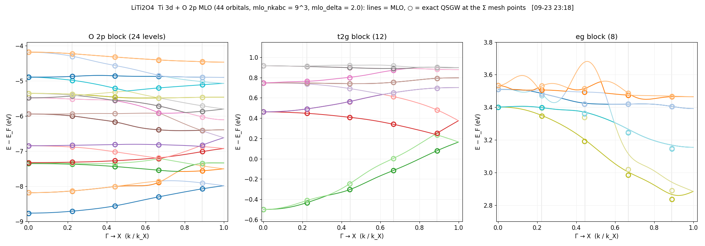](LiTi2O4/plots/mlo_3d_O2p_nk9.png)
*図 23:18-1*  線 = 44 軌道 MLO、○ = Σ メッシュ点上の厳密な QSGW 値。左から O 2p / t2g / eg ブロック

*表 23:18-1*  **メッシュ点での** MLO − exact [meV]（模型の誤差そのもの。MLO は射影なので Wannier 補間と違い
メッシュ点でも厳密値を通らない）

| 模型 | O 2p | t2g | eg | 全体 rms |
|---|---|---|---|---|
| t2g 12 軌道 | — | rms 10.6 / max 41.9 | — | 10.6 |
| 3d 20 軌道 | — | rms **1.0** / max 4.5 | rms 16.3 / max 72.8 | 11.1 |
| **3d + O 2p 44 軌道** | rms **1.5** / max 10.6 | rms **1.0** / max 4.5 | rms **31.9** / max 163.0 | 15.1 |

- **O 2p と t2g は 1–1.5 meV で厳密値に乗る**。44 軌道模型は O 2p 帯（24 本）まで含めて完璧。
- **eg はむしろ悪化**（16.3 → 31.9 meV）。→ **eg のずれは O 2p との混成が原因ではない**。
  44 次元の部分空間が O 2p 24 本にも重みを配るぶん、既に重みの落ちている eg がさらに割を食っている。
- 滑らかさ（Γ–X 残差 rms 平均）: t2g は QSGW 9.8 → MLO **3.3 meV** と改善。eg は QSGW 9.4 → MLO 14.2 と悪い。
- t2g だけを取る 12 軌道模型が t2g で 10.6 meV とかえって悪いのは、**t2g–eg 混成**（t2g 帯に eg 成分 1–10 %、
  **表 22:20-1**）を落としているため。**d 殻は全部入れるべき**。

→ 残る容疑は `mlo_delta = 2.0`（床 = E_F + 2.0 eV、eg は 2.83–3.67 eV でその上、`mlo_w = 2.0` で θ が落ちる）。
これは未検証（実行が 2 回とも見送られた）。

### 2026-09-23 22:50 3d フル（t2g + eg、20 軌道）の MLO、`mlo_nkabc = 9³`
`mlo_lm` の Ti を **5 6 7 8 9**（d 殻全部）にしただけ。`ndimMTO = 20`、実空間の原子対 1823（t2g 版と同じ）、31 秒。
run: `/mnt/data1/LiTi2O4_kbt_runs/mlo_3d_nk9`。

[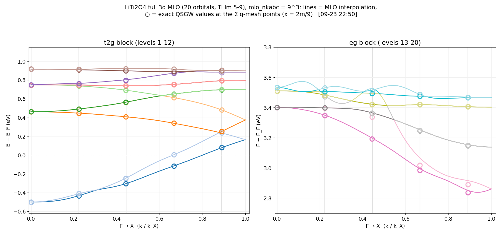](LiTi2O4/plots/mlo_3d_nk9.png)
*図 22:50-1*  線 = 3d MLO（20 軌道）の補間、○ = **Σ メッシュ点上の厳密な QSGW 値**（x = 2m/9）。左 = t2g ブロック、右 = eg ブロック

*表 22:50-1*  MLO − QSGW（Γ–X 211 点、準位をエネルギー順に対応づけ）

| | rms | max |
|---|---|---|
| 全 20 準位 | 19.3 | 148.8 meV |
| t2g ブロック（1–12） | 16.1 | 133.4 |
| eg ブロック（13–20） | 22.6 | 148.8 |

**滑らかさ**（Γ–X の残差 rms、20 準位平均）: QSGW 9.6 → **MLO 5.8 meV**。

- t2g ブロックは○をきれいに通り、**1 eV 付近のリンギングは消えている**（t2g 専用 MLO と同じ）。
- **eg ブロックには MLO 自身の波が残る**（3.4–3.55 eV でうねる）。eg は上端が他のバンドと 0.43 eV しか
  離れておらず（**表 22:20-1**）、20 軌道では eg の上側の混成を拾いきれていないため。
- t2g だけの 12 軌道（**表 22:45-1**、平均 3.5 meV）のほうが t2g 帯については滑らか。
  **Σ の補間を改善する目的なら t2g 12 軌道版で十分**、eg まで要るなら O 2p を含めた模型に広げる必要がある。

### 2026-09-23 22:45 **図 22:00-1 と同じ体裁で MLO 9³ を描いた — リンギングが消えている**
user「MLO 9³ のプロットだが、メッシュ点で図 22:00-1 と対応するものを作って」。
`mlo_t2g_nk9` の `syml` を Γ–X 211 点にして `job_band` → `job_mlo` を回し直した（09-23 22:42、約 40 秒）。

[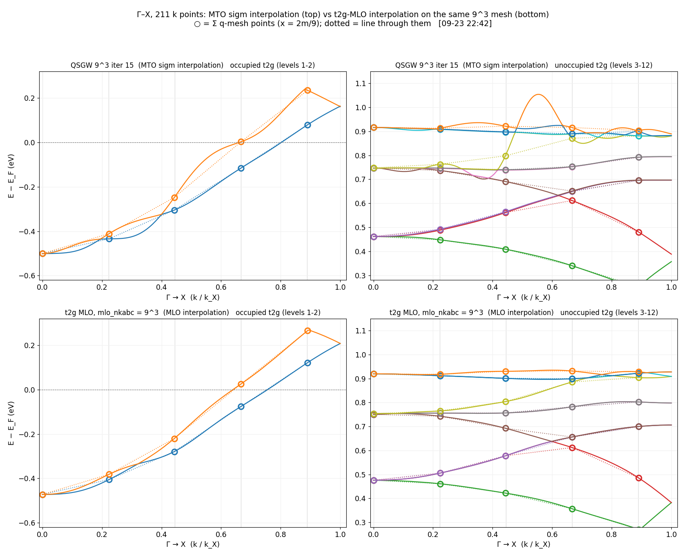](LiTi2O4/plots/mlo_vs_sigm_meshpoints.png)
*図 22:45-1*  上 = QSGW（MTO の `sigm` 補間、図 22:00-1 の 1 行目と同じ）、下 = **同じ 9³ メッシュから作った t2g MLO の補間**。
○ = Σ q メッシュ点（x = 2m/9）、点線 = ○ を結んだ線。

- **○ の位置は上下でほぼ一致**（MLO は 12 軌道の射影なので数 meV のずれは残る）。
- **○ と○の間の振る舞いが決定的に違う**: 上（MTO `sigm`）は x ≈ 0.55 で 1.05 eV まで跳ね、0.75 eV の平坦帯も波打つ。
  下（MLO）は**すべての枝が○を滑らかに結ぶだけ**で、山も谷も無い。

*表 22:45-1*  Γ–X の残差 rms（滑らかな 5 次フィットからのずれ、meV）

| 準位 | QSGW (MTO sigm) | **MLO 9³** |
|---|---|---|
| 1 | 7.4 | 6.1 |
| 2 | 22.7 | 9.6 |
| 7 | 6.6 | **1.2** |
| 9 | 24.6 | **3.2** |
| 11 | 7.0 | **1.4** |
| 12 | 28.9 | **2.6** |
| **12 準位の平均** | **9.8** | **3.5** |

同じ 9³ の Σ を入力にしているのに、**補間の作り方だけで平均 9.8 → 3.5 meV**。
E_F 上 1 eV の凸凹（準位 9, 12 = 旧 band 41, 44）は 25–29 meV → 3 meV 以下になり、**事実上消える**。

### 2026-09-23 22:35 **MLO のメッシュを上げた → `mlo_nkabc = 9³`（Σ メッシュと一致）で補間が 3 倍滑らかになる**
user「MLO のメッシュをもう少し大きくしてみるか」。`mlo_nkabc` を 6³ / 9³ / 12³ で作り直した
（09-23 22:26–22:28、各 15–60 秒。`mlo` の段には `qplist.dat` が要るので `job_band` 済みのディレクトリから
コピーすること。無いと "qplist.dat do not exist!" で落ちる）。

[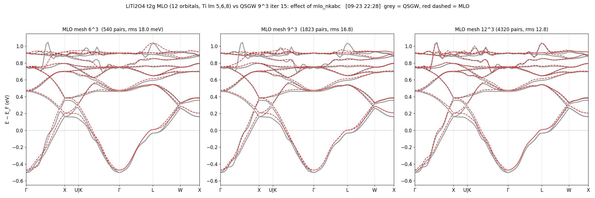](LiTi2O4/plots/mlo_t2g_meshdep.png)
*図 22:35-1*  灰 = QSGW（9³ iter 15）、赤破線 = t2g MLO 12 軌道。左から `mlo_nkabc` = 6³ / 9³ / 12³

*表 22:35-1*  MLO − QSGW（全 97 k 点、準位をエネルギー順に対応づけ）

| `mlo_nkabc` | 実空間の原子対 | rms | max |
|---|---|---|---|
| 6³ | 540 | 18.0 | 135.7 meV |
| 9³ | 1823 | 16.8 | 111.4 |
| 12³ | 4320 | **12.8** | **49.4** |

**ただしこの指標は誤解を招く。** メッシュを上げるほど MLO は QSGW の曲線を忠実になぞる＝
**QSGW 側のリンギングまで再現してしまう**（図の右パネルで赤破線が灰のスパイクに乗っているのが見える）。
12³ の k 点は 9³ の Σ メッシュ上に無いので、MLO の入力そのものが補間された Σ になるため。

*表 22:35-2*  **滑らかさ**の指標: Γ–X で滑らかな 5 次フィットを引いた残差 rms [meV]（小さいほど滑らか）

| band | QSGW | MLO 6³ | **MLO 9³** | MLO 12³ |
|---|---|---|---|---|
| 33 | 7.2 | 5.6 | 6.0 | 7.5 |
| 34 | 21.9 | 6.0 | 9.4 | 23.1 |
| 39 | 7.3 | 6.7 | **1.0** | 8.8 |
| 41 | 25.8 | 8.8 | **3.0** | 23.0 |
| 43 | 7.0 | 2.3 | **1.7** | 8.1 |
| 44 | 29.5 | 1.8 | **2.7** | 24.8 |
| **12 本の平均** | **9.8** | 3.9 | **3.4** | 9.8 |

**結論**: `mlo_nkabc = 9³`（= Σ の q メッシュと一致）で作った MLO は、**補間なしの Σ の値だけを入力**として
バンドを張り、その補間は MTO ベースの `sigm` 補間より **3 倍滑らか**（平均 9.8 → 3.4 meV）。
リンギングが最悪だった band 41（25.8 → 3.0）と band 44（29.5 → 2.7）で劇的。
一方 12³ は平均 9.8 meV と QSGW と同じ荒れ方に戻る（入力が補間された Σ だから）。

→ **user の見立て（MLO ベースで自己エネルギーを表現する）は、この系では実際に効く**。
Σ を MLO 基底で持ち、MLO の実空間表現で補間すれば、E_F 上 1 eV の凸凹はほぼ消える見込み。
ただし MLO を作る k メッシュは **必ず Σ の q メッシュに一致させる**こと（12³ の例が示すとおり、
細かくすれば良いというものではない）。

### 2026-09-23 22:20 t2g だけの MLO を作った（12 軌道、Ti lm 5,6,8）
user「フェルミ面近傍の 3d バンドの MLO を作ってみよう。3d バンドはどこからどこまで？」

*表 22:20-1*  9³ P iter 15 のバンド構成（全対称線）

| | バンド | E − E_F [eV] | 幅 | 上下のギャップ |
|---|---|---|---|---|
| O 2s | 1–8 | −22.605 〜 −21.415 | 1.19 | |
| O 2p | 9–32 | −8.764 〜 −4.183 | 4.58 | |
| **Ti t2g** | **33–44**（4 Ti × 3） | **−0.501 〜 +1.045** | **1.55** | 下 **3.68**、上 **1.79** |
| Ti eg | 45–52（4 × 2） | +2.831 〜 +3.665 | 0.83 | 上 0.43 |
| それ以上 | 53– | +4.099 〜 | | |

電子数 66 = O 2s(16) + O 2p(48) + **t2g に 2**（Ti 平均価数 3.5、t2g 12 本の 1/12 充填）。
PROCAR（Γ–X 平均）のキャラクター: t2g 帯は **Ti t2g 80–89 %**、O 2p 6–11 %、eg 1–10 %。eg 帯は Ti eg 71–76 %。
→ **t2g は上下 1.8 / 3.7 eV で完全に孤立**しており、MLO の窓として理想的。

**実行**（09-23 22:18–22:19、`/mnt/data1/LiTi2O4_kbt_runs/mlo_t2g_999iter15`、9³ iter 15 の `sigm` をそのまま使用）:
`ctrlg` に `[mlo]` を追加（`mlo_method=4`, `mlo_delta=mlo_w=2.0`, `mlo_nkabc=[6,6,6]`、
`mlo_lm` は Ti の 4 サイト（3–6）に **5 6 8**（dxy, dyz, dxz）、Li と O は空）→ `job_mlo liti2o4 -np 8`。
所要 15 秒（lmf --writeham --mlo 12 s + mlo 3 s）。`ndimMTO = 12`、実空間の原子対 540。

[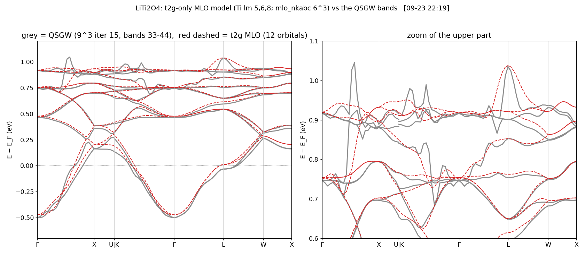](LiTi2O4/plots/mlo_t2g_vs_qsgw.png)
*図 22:20-1*  灰 = QSGW（9³ iter 15、バンド 33–44）、赤破線 = t2g MLO 12 軌道

*表 22:20-2*  MLO − QSGW（同じ 97 k 点、準位をエネルギー順に対応づけ）

| | rms | max |
|---|---|---|
| 多重項全体 | **18.0 meV** | 135.7 meV |
| 下 2 本（E_F を横切る） | 14–19 | 62–66 |
| 中間（3–8 本目） | 6–10 | 20–44 |
| 上 4 本 | 12–28 | 49–136 |

**初回としては良好**。下 2 本（E_F を横切る金属バンド）は Γ–X、Γ–L とも赤破線が灰にほぼ重なる。
ずれが大きいのは上端の 0.9 eV 付近で、**そこは QSGW 側が補間リンギングで暴れている場所**（**図 22:00-1**）。
つまり MLO のほうが滑らかで、QSGW の細かい山谷を追っていない — 目的（Σ の滑らかな表現）から見れば良い兆候。

次: (a) `mlo_nkabc` を 9³ に上げて MLO 自身のメッシュ依存を見る、(b) MLO 基底で Σ を表現して補間し直す、
(c) `mlo_delta` / `mlo_w` の感度（既定 2.0 eV）。

### 2026-09-23 22:00 メッシュ点だけを見ると滑らか（user「interpolation してない点がスムーズか見たい」）
**図 22:00-1**: 補間した曲線（実線、211 k 点）と **Σ の q メッシュ点**（○、x = 2m/N、点線はその間を結んだ線）を
4 ケース（9³ iter 15 / 6³ iter 8 × Γ–X / Γ–L）で重ねた。`Samples/kBT/LiTi2O4/mesh_smooth.py`。
Γ–X も Γ–L も、Γ→端点を q = t·(端点) と書くと 9³/6³ のメッシュ点は **t = 2m/N**（9³ は 0, 2/9, 4/9, 6/9, 8/9 で
X も L もメッシュ上に無い。6³ は 0, 1/3, 2/3, 1 で X・L はメッシュ上）。Γ–L 用の 211 点バンドは
`/mnt/data1/LiTi2O4_kbt_runs/gl_fine_{999,666}`（09-23 21:40 前後、`job_band -np 6`、lmf のみ）。

[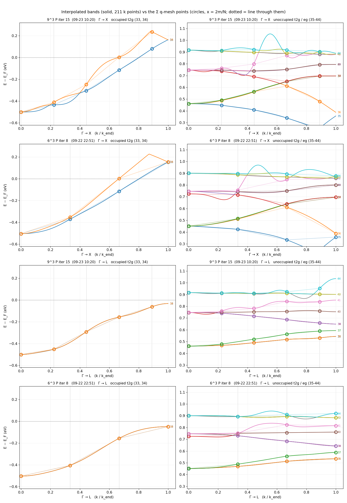](LiTi2O4/plots/mesh_points_vs_interpolation.png)
*図 22:00-1*

- **○ を結んだ点線はどのケースでも滑らか**。実線の山・谷はすべて○と○の間にある。
  典型は 9³ Γ–X の band 44（○: 0.916, 0.913, 0.921, 0.916, 0.903 = 18 meV 以内で平坦 → 曲線は 1.05 eV まで跳ねる）と
  band 41（○: 0.748 → 0.881 の単調増加 → 曲線は急上昇と振動）。
- Γ–L も同じ。9³ の band 44 は○では 0.92 付近で平坦だが、曲線は L 端で 1.03 まで上がる。

*表 22:00-1*  メッシュ点だけを 3 次で近似したときの残差 max と、曲線全体の残差 rms [meV]

| ケース | band | ○ の残差 max | 曲線の残差 rms |
|---|---|---|---|
| 9³ Γ–X | 44 | **2.7** | 28.9 |
| 9³ Γ–X | 41 | 10.3 | 24.6 |
| 9³ Γ–X | 34 | 10.2 | 22.7 |
| 9³ Γ–L | 44 | **1.2** | 7.9 |
| 9³ Γ–L | 41 | 10.5 | 7.9 |
| 6³ Γ–X | 44 | **1.8** | 17.4 |
| 6³ Γ–X | 41 | 24.2 | 21.1 |

（注意: 9³ の Γ–X 上のメッシュ点は 5 点しかなく、3 次近似では自由度が 1 しか残らない。6³ は 4 点で自由度 0 なので
「○ の残差」は意味を持たない（6³ Γ–X band 34 の 61 meV などは見かけ）。**判断は図の○の並びそのもの**で行うべき。）

**結論**: 補間していない点（Σ メッシュ点）では、占有 t2g も非占有多重項も**滑らか**。E_F 上 1 eV の凸凹も、
占有 t2g のさざ波も、すべてメッシュ点の**間**の補間に由来する。物理として議論できるのは○の値だけ。

### 2026-09-23 21:30 **原因は掃除漏れ（古い `sigm` の引き継ぎ）**。`nkabc` も wcut 15→8 kBT も無実。クリーン再投入
user「**図 20:49-1** の 6³ iter 1 は **図 11:15-1** の 6³ iter 1 とかなり違う。因子は？…方向性としてはイテレーションを
先取りしているようにも見える」→ **文字どおり 1 反復分の先取りだった。**

*表 22:43-1*  rms |E(nk6 iter N) − E(旧 nk16 iter M)|、バンド 9–52 [meV]

| | 旧 iter1 | 旧 iter2 | 旧 iter3 | 旧 iter4 | 旧 iter5 |
|---|---|---|---|---|---|
| nk6 iter 1 | 73.1 | **0.4** | 59.2 | 109.0 | 117.3 |
| nk6 iter 2 | 123.0 | 56.8 | **2.8** | 55.8 | 65.6 |
| nk6 iter 3 | 170.6 | 107.8 | 51.9 | **2.4** | 16.2 |

**nk6 の iter N は旧 6³ チェーンの iter N+1 と 0.4〜2.8 meV で一致**。

**原因**: 20:30 のクリーンアップで `sigm.liti2o4` を消したが、これは**シンボリックリンク**で、実体の `sigm` と
混合履歴 `__mixsig`（325 MB）が残っていた。gwsc が再びリンクを張り直して既存 Σ から始めた
（`gwsc_iter1.log` の "--> We use existing sigm file"）。私の掃除漏れ。

**副産物として重要な null 結果**: 1 反復ずらして比べると、
- `nkabc` 16³ → 6³（密度メッシュを GW に一致させる）
- バイナリ（tetwt5 MPI 化 + **wcsmear 極項の核範囲 15 → 8 kBT**）

この 2 つを同時に変えても軌跡は **0.4〜2.8 meV** しか変わらない。気にしていた wcut 15→8 kBT は無実。
16:50 の「nkabc を GW に合わせてもバンドは変わらない」とも整合する。

**クリーン再投入（09-23 21:28–21:30）**: チェーン停止 → ディレクトリごと削除して作り直し
（`ctrlg` / `syml` / `env.sh` だけコピーし `nkabc=[6,6,6]` に置換 → `lmfa` → `lmf` scf → `job_band`）。
`sigm` / `__mixsig` / `QPU*` / `SE*U` が 1 つも無いことを確認してから `run.sh 10` を投入。
不正な iter 1–3 のデータ（kt1 の run ディレクトリ、ローカルの band、**表 20:49-3** の行、**図 20:49-1** の行）は削除した。

### 2026-09-23 20:49 kt1 再ビルド + `-np2 2` で **1 反復 47 分 → 17 分（2.8 倍）**、nk6 チェーン投入
**再ビルド（09-23 20:18–20:25、`~/ecalj/SRC/build_nvfortran`、`FC=nvfortran make -j1`）**
kt1 の repo は `ac7dbecdb` 止まりで、**`hgw_mp_gpu` のバイナリは 09-20 23:34 のまま**だった
（= tetwt5 の MPI k 並列も wcut 8 kBT も未反映）。`093d5f08e` の差分（`wfacx.f90` のみ）をパッチで当てて
kt1 側に commit（`183ac817f`）してから再ビルド。

ビルド上の落とし穴 2 つ:
- `SRC/CMakeLists.txt` は**環境変数 `FC` の文字列**でコンパイラ flags を選ぶ。`FC` にフルパスの `mpifort` を渡すと
  nvfortran 判定に外れて Intel 用 `-init:snan -assume` が付き失敗する。**`FC=nvfortran` で渡すこと**（内部で mpifort を探す）。
  `FC` 未設定だと configure が FATAL_ERROR で止まる（既存の build ディレクトリでも `make` が configure を再実行するため）。
- `m_mlo_wfs.f90` が `-O2` で nvfortran ICE（`fort1 TERMINATED by signal 11`）。`ecaljF_mp` では再試行で通ったが
  `ecaljF_mp_gpu` では決定的に落ちる。そのオブジェクトだけ **`-O1` で手動コンパイル**して回避（MLO 用、GW に無関係）。

**高速化の実測**（6³、同じ系・同じ設定）

*表 20:49-1*
| | 旧: `-np 30 -np2 1`、09-20 バイナリ | 新: `-np 60 -np2 2`、09-23 20:25 バイナリ |
|---|---|---|
| hgw | 40:43 | **13:49** |
| 1 反復 | 47:42（iter 1 は 78:46） | **16:55** |

→ **2.8 倍**。内訳は GPU 2 枚化 + tetwt5 の MPI k 並列 + wcsmear 極項の 15→8 kBT。
従来の 6³ チェーンが `-np2 1`（GPU 1 枚）で回っていたのは単なる設定ミス。9³ は元から `-np2 2`。

**2 GPU は本当に使えているか（09-23 20:37–20:41、10 秒間隔 20 サンプル）**

*表 20:49-2*
| | GPU 0 | GPU 1 |
|---|---|---|
| 平均利用率 | 80 % | 72 % |
| ≥90 % のサンプル | 15/20 | 10/20 |
| 0 % のサンプル | 3/20 | 5/20 |
| メモリ | 22.0 GB | 24.0 GB |

→ 両方 22〜24 GB 確保して 90〜100 % で回っている。0 % は MPI 同期待ち／CPU 区間。**`-np2 2` は効いている**。

**nk6 チェーン投入**（`/mnt/data1/LiTi2O4_kbt_runs/n666_nk6_from_lda/run.sh 10`、09-23 20:32 開始）
- 20:27 の初回投入は**私のミスで 2 重起動**になり、同一ディレクトリで壊し合ったため 20:30 に両方停止。
  `QPU.*run` / `band/iter*` / `sigm` を消して LDA scf からやり直し（20:32、ehf = −109750.1701 eV）、1 本だけで再投入。
- chain.log には毎反復 `t2gocc`（Γ–X の band 33/34 の残差 rms、9³ で見つかった成長モードの監視用）も記録する。

*表 20:49-3*
（20:32〜21:22 の iter 1–3 は古い `sigm` を引き継いでいた不正データなので削除。以下は **21:32 のクリーン再投入**の結果。）

| iter | 開始→終了 | 秒 | o2p | t2g（非占有） | **t2gocc (b33/b34)** | 底 |
|---|---|---|---|---|---|---|
| 1 | 21:32→21:51 | 1154 | 7.2 / 10.1 | 4.9 / 6.9 | **4.96 / 9.07** | −8.400 |
| 2 | 21:51→22:09 | 1068 | 6.9 / 9.1 | 5.0 / 9.9 | **10.84 / 5.08** | −8.495 |
| 3 | 22:09→22:25 | 998 | 7.4 / 10.5 | 5.1 / 9.7 | **8.32 / 6.76** | −8.612 |
| 4 | 22:25→22:45 | 1195 | 7.3 / 11.0 | 4.2 / 7.5 | **12.43 / 9.15** | −8.706 |
| 5 | 22:45→23:02 | 991 | 7.0 / 10.5 | 3.6 / 5.9 | **3.57 / 12.24** | −8.736 |
| 6 | 23:02→23:19 | 1033 | 6.9 / 10.6 | 3.3 / 5.6 | **3.20 / 9.86** | −8.741 |
| 7 | 23:19→23:36 | 1017 | 7.0 / 10.9 | 3.2 / 5.4 | **2.56 / 7.02** | −8.751 |
| 8 | 23:36→23:58 | 1350 | 7.1 / 11.1 | 3.0 / 5.2 | **1.93 / 6.20** | −8.753 |
| 9 | 23:58→00:14 | 959 | 7.1 / 11.1 | 3.0 / 5.3 | **2.02 / 6.39** | −8.757 |
| 10 | 00:14→00:30 | 960 | 7.4 / 11.4 | 3.1 / 5.9 | **2.92 / 7.65** | −8.762 |

[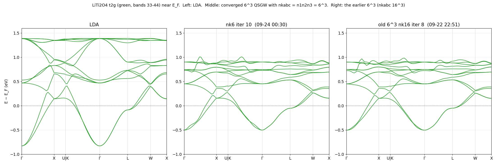](LiTi2O4/plots/t2g_final_nk6.png)
*図 20:49-2*  収束した t2g（バンド 33–44、緑）。左 LDA / 中 nk6 iter 10 / 右 旧 6³（nkabc 16³）iter 8

**同じ反復回数での比較**（user 04:20）:

[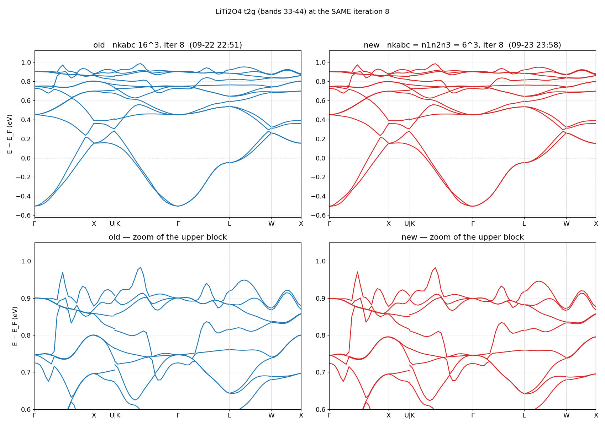](LiTi2O4/plots/t2g_same_iteration.png)
*図 20:49-3*  反復 8 どうしの t2g（バンド 33–44）。左 旧（nkabc 16³）/ 右 新（nkabc = 6³）、
上段 = 全体（−0.62〜1.12 eV）、下段 = **上部ブロックの拡大（0.60〜1.05 eV）**

*表 20:49-7*  t2g の荒れ（2 階差分 平均 / max、全対称線）

| | 占有 (33–34) | 上部 (35–44) | 全体 (33–44) |
|---|---|---|---|
| 旧 iter 8 | 4.25 / 56.6 | 3.61 / 87.1 | 3.72 / 87.1 meV |
| 新 iter 8 | 4.33 / 55.3 | 3.56 / 87.2 | 3.69 / 87.2 |

**区別がつかない。** 拡大図で見ると、Γ–X の 0.97 eV のスパイク、U|K の 0.98 eV、L–W の 0.94 eV など
**凸凹の位置も高さも新旧で同一**。

**ただし 1 か所だけ差がある**（user 04:45「new より old のほうが −0.5 あたりの縮退がよい」）:

[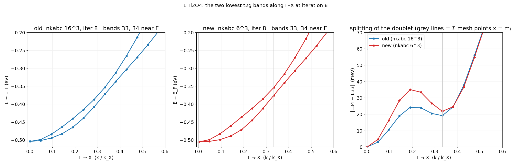](LiTi2O4/plots/t2g_doublet_splitting.png)
*図 20:49-5*  Γ–X の下 2 本（33, 34）を Γ 近傍で拡大。左 旧 / 中 新 / 右 分裂 |E34−E33|（灰線 = Σ メッシュ点 x = m/3）

*表 20:49-8*  t2g 下 2 本の分裂 |E34 − E33| [meV]

| x | 0 | 0.095 | 0.190 | 0.286 | **0.333（メッシュ点）** | 0.381 | 0.476 | 0.571 |
|---|---|---|---|---|---|---|---|---|
| 旧 | 0.013 | 10.5 | 24.1 | 20.5 | **19.2** | 24.5 | 56.0 | 91.7 |
| 新 | 0.019 | 16.2 | **35.0** | 26.7 | **21.6** | 24.5 | 54.8 | 91.8 |

- **Γ では両方とも 0.01–0.02 meV** で完全縮退。他の対称点（X, K, L, W）でも新旧の差は 0.2 meV 以内。
- 差が出るのは **x = 0.095–0.286、つまりメッシュ点 x = 0 と 1/3 の間だけ**（最大 11 meV、x = 0.19）。
  x ≥ 0.38 では 1 meV 以内で一致する。
- どちらも x = 0.286 で分裂が一度凹む（旧 24.1 → 20.5、新 35.0 → 26.7）**非単調な振る舞い＝補間のリンギング**。
  振幅が新のほうが大きいが、**メッシュ点上の値（0 と 1/3）は 2 meV 差**なので、これも物理ではなく補間の差。
- 6³ の Γ–X はメッシュ点が x = 0, 1/3, 2/3, 1 の 4 点しかないので、Γ–1/3 の区間は補間がいちばん苦しい場所。

user「old のほうがバンドの底でスムーズに見える」→ O 2p を並べて確認（04:30）:

[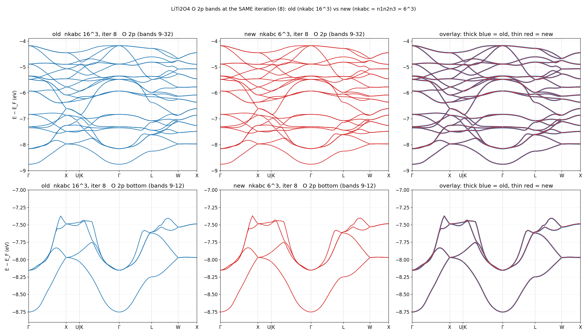](LiTi2O4/plots/o2p_same_iteration.png)
*図 20:49-4*  iter 8 どうしの O 2p（上段 = 帯全体、下段 = 底 b9–12）。左 旧 / 中 新 / 右 重ね描き

*表 20:49-6*  O 2p の荒れ（2 階差分 平均 / max、全対称線）

| | 底 (b9–12) | 全体 (b9–32) |
|---|---|---|
| 旧 iter 8 | 7.10 / 97.1 | 8.00 / 126.3 meV |
| 新 iter 8 | 7.11 / 102.2 | 7.99 / 125.1 |

**差は無い**（平均は小数第 2 位まで一致、max のみ 97 vs 102 meV）。重ね描きでも底の 4 本は完全に重なる。
「旧のほうが滑らか」に見えたのは、**図 20:49-2 が旧 iter 8 と新 iter 10 を並べていた**ため
（底が 2 反復ぶん −9 meV 深く、X–W の折れ方が少し違う）。同じ反復で見ると区別がつかない。

*表 20:49-5*  iter 8 どうしの差（新 − 旧、全対称線）

| 帯 | mean | rms | max |
|---|---|---|---|
| O 2p 底 | +1.26 | 1.32 | 4.54 meV |
| O 2p 全体 | +0.48 | 1.49 | 6.41 |
| 占有 t2g | −1.92 | 1.54 | 6.91 |
| 非占有 t2g | −1.27 | 0.86 | 7.02 |
| eg | −0.93 | 0.73 | 6.21 |

**全帯で rms 1.5 meV 以下、max 7 meV**。重ね描きではどこも線が分離しない。
→ `nkabc` を GW メッシュに合わせても、新バイナリ（tetwt5 MPI + wcut 15→8 kBT）に替えても、
**収束経路も収束解も変わらない**。1 反復ずつ対応もつく（nk6 iter N ≡ 旧 iter N、rms 1.5–3.2 meV）。
*表 20:49-4*  t2g の帯端と荒れ（全対称線、2 階差分 平均/max）

| | t2g 範囲 [eV] | 幅 | 荒れ [meV] |
|---|---|---|---|
| LDA | −0.829 〜 1.390 | 2.219 | 3.51 / 75.8 |
| **nk6 iter 10** | −0.503 〜 1.009 | **1.512** | **3.52 / 73.4** |
| 旧 6³ nk16 iter 8 | −0.505 〜 0.983 | 1.488 | 3.72 / 87.1 |

**10 反復完了（09-24 00:30）。** 非占有 t2g の荒れは 4.9 → **3.0–3.1** meV、底は −8.400 → **−8.762**（旧 nk16 の収束値 −8.80 に近い）。
**占有 t2g のさざ波は成長しない**: b33 は iter 4 の 12.4 → iter 8 の 1.9、b34 は 12.2 → 6.2 で、以降 iter 10 まで 2–3 / 6–8 に留まる。
9³（nkabc=16³）で見えた単調成長（b34 が iter 6 の 3.1 → iter 15 の 21.9、**表 17:10-1**）は起きていない。
ただし旧 6³（nkabc=16³）も iter 8 で 1.74 / 6.16 と同様に収束していたので、**これは 6³ か 9³ かの違いであって
`nkabc` の違いではない**。成長モードは 9³ 固有。

旧 6³ チェーン（nkabc=16³、09-22）の iter 1 は o2p 7.2/10.1、t2g 4.9/6.9、底 −8.40 で**完全に一致**。
掃除漏れが解消され、`nkabc` と wcut 15→8 kBT の無実（**表 22:43-1**）が改めて裏づけられた。

**バンドプロット（このシリーズ、反復ごとに下へ伸ばす）**: 行 = LDA, iter 1, …、列 = O 2p / E_F 近傍。
各パネルのタイトルに**バンドファイルの生成時刻**、右端（X 点）に**バンド番号**（X で縮退しているものは `33-34` のように
まとめ、重なる場合は縦にずらす）を入れてある。議論はこの番号で行う。
`Samples/kBT/LiTi2O4/plots/nk6_rows.png`（`nk6_rows.py`、引数 OUT TITLE DIR "0,1,2,…"、0 = LDA）。
9³ を後から加えるときは列を 2 ラン分（6³ | 9³）に拡張する。

[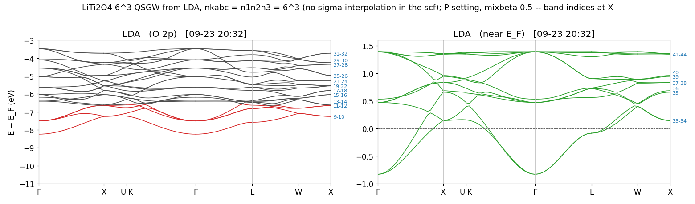](LiTi2O4/plots/nk6_rows.png)
*図 20:49-1*

### 2026-09-23 19:51 新シリーズ: 6³ を `nkabc = n1n2n3 = 6³` で LDA から（まず LDA のみ）
user「6³ でやってみろ。LDA からスタートする。新たにバンドプロットを開始する。まず LDA ができたらプロット」。
run: `/mnt/data1/LiTi2O4_kbt_runs/n666_nk6_from_lda`。設定は P のまま
（χ₀ T=0 + `SmearX0` 0.0057 Ha + `t_sigmaw` 1000 K + `wcsmear`、`mixbeta` 0.5）、変更点は **`nkabc` を 16³ → 6³**
（= `n1n2n3`）だけ。これで密度・E_F を作る k 点が全て Σ メッシュ上に載り、**自己無撞着ループから Σ の補間が消える**。

**09-23 19:49–19:51 に kt1 で実行**: `ctrlg_absorb.py`（何もせず）→ `mpirun -np 1 lmfa` → `mpirun -np 16 lmf`（LDA scf）
→ `job_band -np 8`。所要 2 分。ehf = −109750.1692 eV。
（注: `lmfa` は MPI バイナリなので `mpirun` 経由で起動する必要がある。素で叩くと MPI_Init で abort する。）

[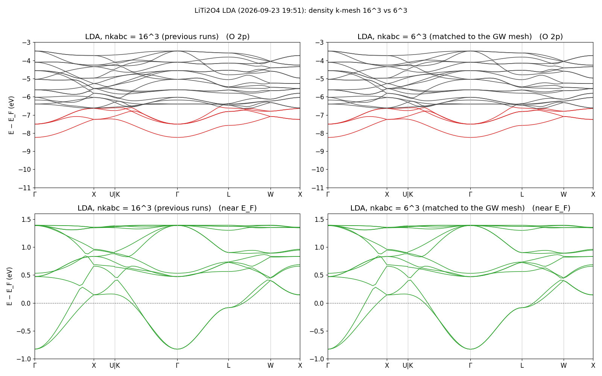](LiTi2O4/plots/nk6_lda_vs_nk16.png)
*図 19:51-1*

（このシリーズの行並びバンドプロットは最新エントリ 20:49 にまとめた。）

従来の `nkabc = 16³` の LDA（左）と一致:

*表 19:51-1*
| 帯 | 平均差 | rms | max |
|---|---|---|---|
| O 2p 底 (b9–12) | 1.6 | 0.0 | 1.6 meV |
| O 2p 全体 (b9–32) | 1.5 | 0.1 | 1.7 meV |
| 占有 t2g (b33–34) | 1.0 | 0.1 | 1.2 meV |
| 非占有 (b35–52) | 1.1 | 0.1 | 1.9 meV |

平均の ~1.5 meV は E_F の差そのもので、形は rms 0.1 meV で同一。**LDA の段階では 6³ の密度メッシュで十分**。
→ この後の QSGW 反復で出る差は、すべて Σ の補間が消えたことによるものと解釈できる。

### 2026-09-23 17:10 **警告: 9³ では占有 t2g のさざ波が反復とともに単調に増えている**（user「最新の計算で 9³ は振動が増えたのか」）
Γ–X の band 33/34 について、滑らかな 5 次フィットを引いた残差 rms [meV]:

計算日時つき（9³ は 09-22 09:19 開始、1 反復 98〜100 分、09-23 10:20 の iter 15 まで連続。
09-22 が iter 1–8、09-23 が iter 9–15。6³ は 09-22 に iter 1–8 で収束）:

*表 17:10-1*
| iter | 9³ の終了時刻 | 6³ b33 / b34 | 9³ b33 / b34 |
|---|---|---|---|
| 5 | 09-22 17:55 | 2.8 / 12.6 | 5.8 / 5.7 |
| 6 | 09-22 19:34 | 3.3 / 10.0 | 7.1 / **3.1** |
| 8 | 09-22 22:51 | 1.7 / 6.2 | 5.2 / 8.3 |
| 10 | 09-23 02:08 | — | 8.7 / 11.7 |
| 12 | 09-23 05:24 | — | 7.8 / 15.2 |
| 14 | 09-23 08:41 | — | 3.3 / 19.3 |
| 15 | 09-23 10:20 | — | 7.2 / **21.9** |

[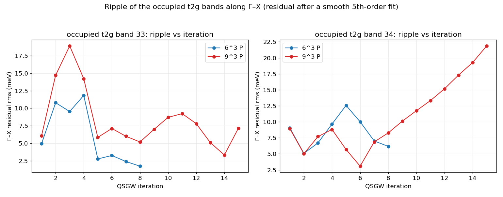](LiTi2O4/plots/ripple_vs_iteration.png)
*図 17:10-1*

**9³ の band 34 は iter 6 の 3.1 meV から iter 15 の 21.9 meV へ、ほぼ直線的に（~2 meV/反復）増え続けている。**
独立な指標（全対称線の |2 階差分| 平均）でも同じ傾向:

*表 17:10-2*
| | iter 6 → 15（9³） | iter 5 → 8（6³） |
|---|---|---|
| 占有 t2g b33–34 | 5.22 → **7.59** meV（増） | 5.04 → 4.25（減） |
| O 2p b9–32 | 8.18 → **8.47**、max 123 → 148（増） | 7.96 → 8.00（ほぼ一定） |
| 非占有 t2g b35–40 | 4.33 → 3.00（**減**） | 3.17 → 2.64（減） |

→ **9³ では非占有側は収束しているのに、占有 t2g と O 2p のさざ波だけがゆっくり成長している**。6³ には無い。
これまで「9³ も実質収束」と書いたのは `t2g_rough.py`（非占有 b33–40 の粗い指標）と O 2p 底しか見ていなかったため。
成長率が小さい（~2 meV/反復）ので 15 反復でようやく目に見えた。

**解釈**: 16:50 の「占有 t2g のリンギングはメッシュを密にすると増える（小 q の非解析性が疑わしい）」と合わせると、
9³ の Σ(q) の小 q 構造 → 補間 → 密度・E_F（16³ メッシュ上、Σ メッシュ点はほぼ皆無）→ 次の Σ、という経路で
**ゆっくり成長するモード**になっている可能性が高い。lmf 単独の試験（16:50）では nkabc を 9³ に合わせても
バンドは変わらなかったが、あれは 1 回だけの比較で、反復を通した増幅は別問題。

**次にやるべきこと**: (a) 9³ を nkabc=9³ で数反復回して成長が止まるか見る（13:43 に投げたが 13:44 で中断）、
(b) Σ(R) への窓掛けを実装して成長が消えるか見る、(c) offset-Γ の扱い（`alpha_OffG`）の感度を見る。

### 2026-09-23 16:50 占有 t2g の振動は「メッシュを密にすると大きくなる」（user 指摘）— 方向が br5 と逆
`nkabc` を GW と合わせる試験（lmf のみ、同じ iter 15 の sigm。**09-23 13:44〜13:47 に kt1 で実行**、
lmf scf 各 1 分弱、続いて `job_band` 通常 syml + Γ–X 211 点を 13:47〜13:55）: **バンドは全く変わらない**。
`lmfonly_nk16` vs `lmfonly_nk9` で全対称線・全バンドの差は平均 +1.6 meV（= E_F の差 0.284145→0.284266 Ry）、
平均を引けば rms 0.03 meV、荒れ（2 階差分）も O 2p 8.02/147.5、t2g 4.15/70.7 meV で**小数点以下まで同一**。
→ 密度側の k 点を Σ メッシュに載せても、バンドプロットの振動は減らない（プロットの k 点は常に補間）。
E_F が 1.6 meV しか動かないので、self-consistency への効きも小さい。

**補間は局所性を尊重している（コード確認）**: `m_shortn3.f90:gennlat` が原子対ごとに R+(τ₁−τ₂) を BvK 超格子の
最短等価ベクトルへ畳み込み（縮退像に 1/nout の重み）、`rdsigm2.f90:bloch2` がその位相を平均する。
= Wannier90 の minimal-distance (Wigner–Seitz) 補間。粗い補間が原因ではない。

**占有 t2g（band 33/34）の振動**: `Samples/kBT/LiTi2O4/plots/GX_t2g_occupied.png`（`t2g_occ.py`、09-23 16:45 作成）

[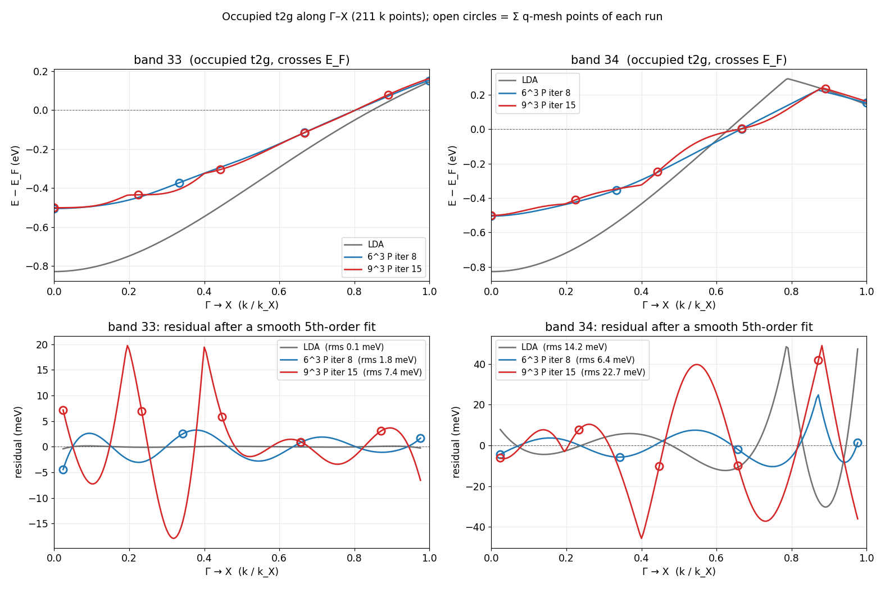](LiTi2O4/plots/GX_t2g_occupied.png)
*図 16:50-1*

滑らかな 5 次フィットを引いた残差:

*表 16:50-1*
| | band 33 rms | band 34 rms | 残差の主波長 | 2/N |
|---|---|---|---|---|
| LDA | **0.1 meV** | （フィット由来、振動なし） | — | — |
| 6³ iter 8 | 1.8 | 6.4 | 0.319 / 0.319 | 0.333 |
| 9³ iter 15 | **7.4** | **22.7** | 0.239 / 0.319 | 0.222 |

- 残差の**波長はメッシュ間隔 2/N と一致**（LDA には皆無）→ 補間リンギングであることは確か。
- ただし**振幅はメッシュを密にすると 4 倍近く増える**。br5（非占有側）では逆に補間誤差が 6³ 135 meV → 9³ 16 meV と
  減っていた（x=0.444 の厳密値 0.798 に対し 6³ 補間 0.956、厳密同士の差は 23–24 meV）ので、**占有 t2g は別要因**。
- 候補: 金属の遮蔽交換がもつ **q→0 の非解析性**（offset-Γ で扱う 1/q² 発散）。密にすると Γ に近い q を拾うので
  Σ(q) の小 q での急変が強く効き、リンギングが増える。E_F を横切る t2g が最も敏感で LDA に対応物が無いこととも合う。

**全対称線のバンド図**（LDA / 6³ iter 8 = 09-22 22:51 / 9³ iter 15 = 09-23 10:20）: `Samples/kBT/LiTi2O4/plots/bands_lda_666_999.png`（`full_bands.py`）

[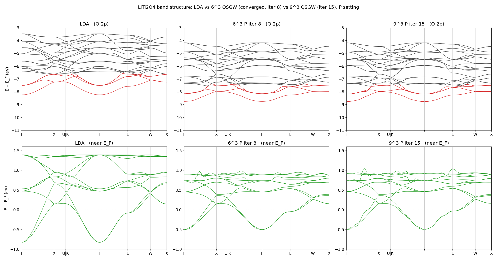](LiTi2O4/plots/bands_lda_666_999.png)
*図 16:50-2*

### 2026-09-23 14:00 br5 の大振動の起源が確定: **Σ の q メッシュ点の「間」だけで起きる補間のオーバーシュート**
user「Γ–X で br5 が急にブランチをスイッチしようとするように見える」→ 2 つの検証。

**(1) 枝は入れ替わっていない（PROCAR で確認）**
`job_band --fatband`（`--mkprocar`）で 211 点の PROCAR を取り、軌道キャラクター（14 原子 × 25 軌道の重みベクトル）の
重なりで枝を追跡した（エネルギー外挿ではなく**キャラクター**で対応付け）。結果は energy 追跡とほぼ同じで、
大振動枝の残差 rms は 61.5（energy 追跡）vs **60.9 meV**（character 追跡）。山の区間でも隣接 k のキャラクター重なりは
0.99 以上、Ti t2g 重みは 0.545 → 0.716 へ**滑らかに**増える。→ 入れ替わりではなく、その枝自身が上下している。
（LDA も両追跡が一致、残差 0.1–2.8 meV。）

**(2) Σ の q メッシュ点だけを拾うと br5 は完全に滑らか**
Qlat = (−1,1,1),(1,−1,1),(1,1,−1)（2π/a）なので、Γ→X = (0,−t,0) 上の n³ メッシュ点は **t = 2m/n**:
6³ は x = 0, 1/3, 2/3, 1、9³ は x = 0, 2/9, 4/9, 6/9, 8/9（**9³ では X 点自体がメッシュ上にない**）。

*表 14:00-1*
| | メッシュ点での br5 [eV] | 中点でのオーバーシュート |
|---|---|---|
| 6³ iter 8 | 0.725, 0.757, 0.847, 0.870（単調増加） | x=0.17 −43、**x=0.50 +155**、x=0.83 +74 meV |
| 9³ iter 15 | 0.748, 0.763, 0.798, 0.871, 0.900（単調増加） | x=0.11 −23、x=0.33 −64、**x=0.56 +220**、x=0.78 +6 meV |

[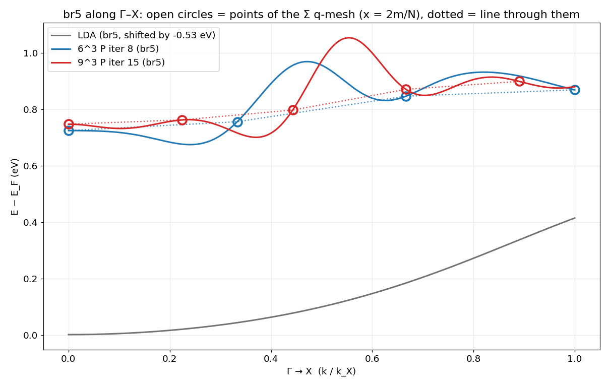](LiTi2O4/plots/GX_br5_meshpoints.png)
*図 14:00-1*

（○ = Σ メッシュ点、点線 = その間を直線で結んだもの、灰 = LDA の同じ枝を −0.53 eV ずらして重ねたもの。）

- **メッシュ点を通る線は LDA の br5（0.53 → 0.94 eV を滑らかに上がる枝）と同じ形**で、山も谷もない。
- 大振動は**必ず隣り合うメッシュ点の中点**に立つ（6³ は 1/3–2/3 の中点 0.50、9³ は 4/9–6/9 の中点 0.556）。
- → **Σ(k) の Fourier 補間（`m_gennlat_init_sig` の実空間格子での逆変換）のオーバーシュート**。物理ではない。
  13:20 に「波長が 1/N_q と対応しない」と書いたのは FFT を混合信号にかけたためで、**位置で見ればメッシュに固定**されている。
- br11/br9（2 本目、残差 6–9 meV）も同じ性格。平坦な doublet 群が滑らかなのは、そこでは Σ の k 依存が小さいから。

**含意（スムーズ化の方向）**: 「Σ を平均化して滑らかにできないか」という問いには **yes** で、正攻法は
実空間の Σ(R) に窓（Gaussian など）を掛けて高 |R| 成分を落とすこと。メッシュ点上の値は（窓の幅だけ）わずかに変わるが、
中点のリンギングは消える。ecalj では sigm の逆変換は `m_gennlat_sig` / `m_rdsigm2` にあるので、そこに窓を入れるのが
最小の改造。代案は (i) より密な q メッシュ（振幅は落ちないが波長が縮む）、(ii) 補間前に Σ を対称化・平滑化。

### 2026-09-23 13:45 user: 「ctrl と GW の k 点を合わせよう。self-consistency の問題とバンドプロットの問題の 2 点がある」
**確認**: この run は `[bz] nkabc = [16,16,16]`、`[gw] n1n2n3 = [9,9,9]`。どちらも Γ 中心なので、16³ の k 点のうち
Σ メッシュ上に載るのは **Γ だけ**（i·9 ≡ 0 mod 16 は i=0 のみ → 4096 点中 1 点、0.02 %。6³ の run でも 8 点、0.2 %）。
→ **密度・E_F・次反復の入力は、ほぼ全部が補間された（リンギング込みの）Σ から作られている**。
一発目（iter 1–2）に山が無く iter 4 で立ち上がって飽和したのは、この経路での self-consistent な増幅と整合する。

**対処 (1) self-consistency**: `nkabc = [9,9,9]`（GW メッシュと一致）にすれば密度側の k 点が全て Σ メッシュ上になり、
補間が自己無撞着ループから完全に消える。9³ iter 15 の sigm/rst から枝分かれして 4 反復:
`/mnt/data1/LiTi2O4_kbt_runs/n999_P_nk9_from_iter15`（13:43 開始、pid 3234858）。
代償は密度側の BZ 積分が 9³ と粗くなること（元は 16³）。18³ は 9³ の倍数だが一致するのは 12.5 % にすぎず不十分。

**対処 (2) バンドプロット**: プロットの k 点は任意なので、そこは常に補間が入る。信用できるのは Σ メッシュ上の点だけ
（14:00 の図）。根治は実空間 Σ(R) への窓掛け。

### 2026-09-23 13:20 枝を交差越しに追跡（user「0.8〜1 eV で振動するバンドが 2 本、index が移り変わっている」）
`trace_branches.py`: 211 点の細かい k 上で各枝を**線形外挿 + Hungarian で対応付け**て交差を越えて追跡（色 = 枝）。
`Samples/kBT/LiTi2O4/plots/GX_traced_lda_666_999.png`。

**枝の番号は「x = 0.10（Γ のすぐ外、Γ の多重縮退が解けた位置）でのエネルギー順」**に付けてあり、3 枚のパネルで
同じ番号が同じ枝を指す（9³ の大振動枝も 6³ と同じ **br5**）。レンジは LDA の多重項 1.0〜1.45 eV が入る 0.30〜1.55 eV。

[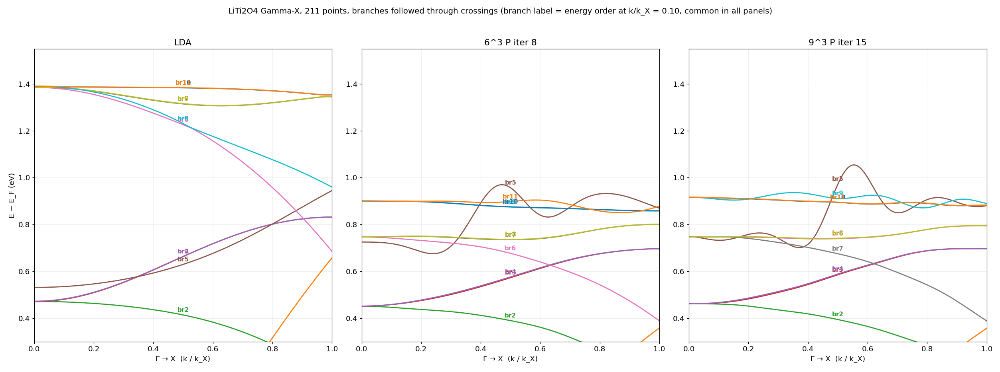](LiTi2O4/plots/GX_traced_lda_666_999.png)
*図 13:20-1*

LDA では Γ 0.53 → X 0.94 eV に上がる枝（br5）、1.39 → 0.96 に下がる枝、1.39 → 0.68 に急降下する枝がいずれも滑らか。
QSGW ではこの多重項全体が 0.7〜1.0 eV に圧縮され、そのうち **br5 の 1 本だけ**が Γ 0.72/0.75 eV から出て
0.97（6³）/ 1.05（9³）eV まで跳ね上がる大振動を示す。急降下枝は QSGW でも滑らかなまま。

追跡後に、滑らかな分散（4 次多項式）を引いた残差で測ると（番号は上の共通ラベル）:

*表 13:20-1*
| | 枝 | 平均 E | peak-to-peak | 残差 rms |
|---|---|---|---|---|
| 6³ iter 8 | **br5**（大振動） | 0.834 | **295 meV** | **46.7 meV** |
| | **br11**（2 本目） | 0.888 | 54 | **6.0** |
| | br6（急降下） | 0.645 | 328 | 1.2 |
| | br7/br8（平坦 doublet） | 0.755 | 64–65 | 1.9 |
| | br9/br10（平坦 doublet） | 0.878 | 42 | 0.85 |
| 9³ iter 15 | **br5**（大振動） | 0.840 | **353 meV** | **61.5 meV** |
| | **br9**（2 本目） | 0.910 | 65 | **8.8** |
| | br7（急降下） | 0.646 | 331 | 0.9 |
| | br6/br8（平坦 doublet） | 0.755 | 55 | 1.6 |
| | br10/br11（平坦 doublet） | 0.897 | 35–36 | 2.0 |
| LDA | br6 / br9（大きく分散する 2 本） | 1.169 / 1.221 | 649 / 408 | **2.3 / 2.8** |
| | その他すべて | — | — | 0.1–0.6 |

- **振動しているのはちょうど 2 本**（user の見立てどおり）。他の枝（平坦 doublet 群）は残差 2 meV 以下で滑らか。
- その 2 本は LDA では**大きく分散する singlet**（br6: 1.39 → 0.68 eV を下る枝、br9: 1.39 → 0.96）で、LDA では
  残差 2.3–2.8 meV と滑らか。QSGW でその分散が Σ に圧縮され、同時に 47–62 meV の振動が乗る。
- 急降下枝（6³ br6 / 9³ br7、pp 330 meV）は QSGW でも残差 1 meV 級で滑らか。**分散が大きいことが条件ではない**。
- **11:10 の「波長 = q メッシュ間隔」は撤回**。index 追跡のカーブは交差で汚れており、枝を正しく追って FFT すると
  主波長は 6³ 0.31、9³ 0.31–0.47 k_X で **1/N_q（0.167, 0.111）とは対応しない**。波長はメッシュを変えてもほぼ同じ。
- つまり Σ の k 依存が「メッシュ間隔の刻み」ではなく **0.3 k_X 程度のスケールで実際に構造を持ち**、それが
  分散の大きい 2 本にだけ乗っている。振幅は 6³ → 9³ で 47 → 62 meV と減らない。

### 2026-09-23 13:00 エネルギー範囲を下に広げた Γ–X（LDA も 211 点で追加）: 「37 と 38 が突然縮退」も index の付け替え
`gx_fine_lda`（LDA、211 点、**09-23 12:54 に kt1 で実行**）を追加し、−0.6〜1.15 eV で 3 枚並べた。**隣と 5 meV 以内の枝は太い灰色で重ね描き**して
2 重縮退枝を交差を越えて追えるようにした（`zoom_gx_fine2.py`）。

[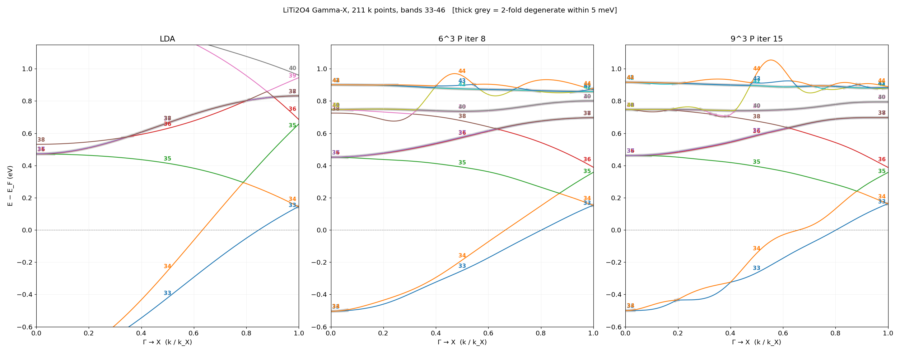](LiTi2O4/plots/GX_fine_wide_lda_666_999.png)
*図 13:00-1*

- 灰色の帯を追うと、Γ の 0.46 eV（3 重縮退の一部）から X の 0.70 eV まで **2 重縮退枝が Γ–X 全域で連続**している
  （LDA も同じ枝が 0.47 → 0.83 eV で連続）。分裂は 0〜4 meV で、対称性で守られた doublet。
- user の言う「37 と 38 が突然縮退する」は、この doublet を横切る **singlet 1 本（X で 0.39 eV に落ちる枝）**が
  x ≈ 0.62（LDA では 0.87）で下を通るため、doublet の番号が (36,37) → (37,38) に**付け替わる**だけだった。
  実測の gap: 36–37 が 0.0 → 3.9 → 2.4 meV（x = 0 → 0.3 → 0.62）で、x > 0.65 では 37–38 が 2.2 → 0.2 meV、
  代わりに 36–37 が 21 → 309 meV に開く。エネルギーは連続、縮退も連続。
- したがって「突然の縮退」は物理でもアーティファクトでもなく**表示の問題**。前項 11:10 の「跳び」と同じ罠。
  本物の異常は 11:10 で特定した **周期 = 1/N_q の振動**（b44 の山、b41 の急上昇）のみ。

### 2026-09-23 11:10 Γ–X を 10 倍密（211 点）で引き直し → **跳びは不連続ではなく、波長 = q メッシュ間隔の振動**
チェーンを 10:22 に停止（iter 15 まで完了）、GPU 解放。`band/iter15`（9³）と `band/iter8`（6³）の sigm をそのまま使い、
`syml` を Γ–X だけ **211 点**（通常 22 点の 10 倍）にして `job_band` を再実行（lmf のみ、各 1 分。
**09-23 11:00 に 9³、11:01 に 6³**）。PROCAR（`--fatband`）は **09-23 13:17/13:18**。
run: `/mnt/data1/LiTi2O4_kbt_runs/gx_fine_999_iter15`, `gx_fine_666_iter8`。
図: `Samples/kBT/LiTi2O4/plots/GX_fine_666_999.png`、スクリプト `zoom_gx_fine.py`。

[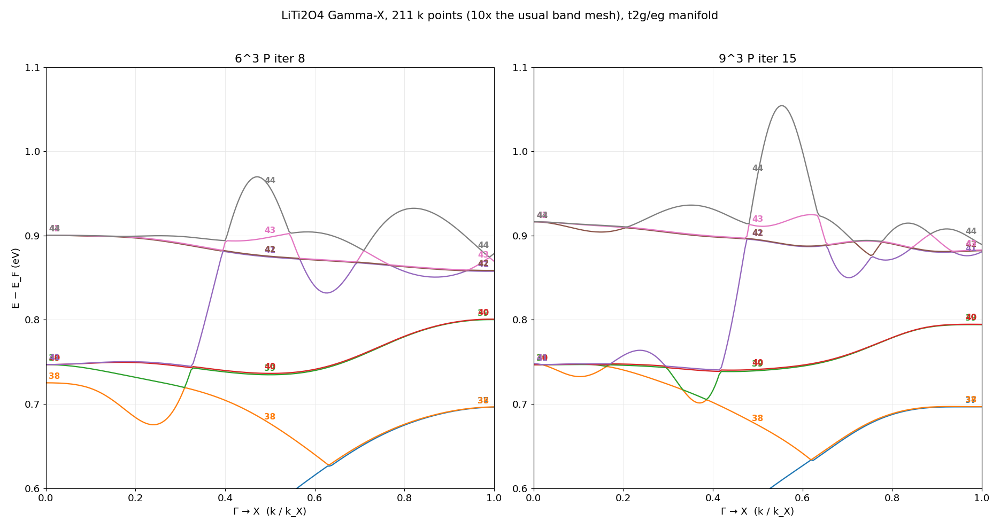](LiTi2O4/plots/GX_fine_666_999.png)
*図 11:10-1*

**分かったこと（22 点では見えなかった）**
1. b41 の「跳び」は**不連続ではなく、幅 0.06 k_X の非常に急な連続上昇**（6³: 107 meV、9³: 109 meV を 0.06 k_X で、
   最急勾配 2.1 / 3.2 eV per k_X）。22 点のバンドプロットでは 1 点で跳んだように見えていただけ。
2. 多重項全体が**短波長の振動**を乗せている。b44 の極値間隔（= 半周期）から周期を測ると

   | | 極値の平均間隔 | 周期 | 1/N_q |
   |---|---|---|---|
   | 6³ iter 8 (b44) | 0.093 | **0.185** | 1/6 = 0.167 |
   | 9³ iter 15 (b44) | 0.080 | **0.160** | 1/9 = 0.111 |
   | 9³ iter 15 (b41) | 0.058 | **0.116** | 1/9 = 0.111 |

   → ~~振動の波長が q メッシュ間隔とほぼ一致~~ **【13:20 撤回】** この周期評価は index 追跡のカーブ（交差で
   汚染されている）から取ったもので誤り。枝を交差越しに追跡して測り直すと主波長は 6³ / 9³ でほぼ同じ 0.3 k_X
   で、1/N_q には対応しない（13:20 の項）。
3. したがって振動の振幅（b44 で ±50〜110 meV、b41 で ±30 meV）は **q メッシュを細かくすると波長は縮むが
   振幅はすぐには落ちない**（6³ → 9³ で b44 の山は 70 → 110 meV とむしろ増えた）。準縮退した平坦束の中で
   枝が入れ替わるので、振幅は Σ の k 依存の大きさそのもので決まる。

**含意**: E_F 直上 1 eV の「気持ち悪い振動」の本体は Σ の**動的な事故ではなく静的 Σ の k 補間**。
対策の方向は (i) sigm の実空間表現の打ち切り半径 / 補間の見直し、(ii) より密な q メッシュ、
(iii) 準縮退束を作らない（＝ Σ による多重項圧縮そのものは物理なので難しい）。
09-22 03:40 の「非対角 2 点差 ∝ Δ」の話とは別の要因。

**b41 の跳びが一番派手（user 11:00）— 枝の本数で見ると「下の束から上の束へ 1 本が 1 k 点で移る」**

b37–b44 を 0.82 eV で二分して本数を数えると（9³ iter 15）:

*表 11:10-1*
| x | 下の束 | 上の束 | エネルギー（昇順） |
|---|---|---|---|
| 0.429 | 5 | 3 | 0.559 0.695 0.738 0.740 **0.763** \| 0.898 0.898 0.925 |
| 0.476 | 4 | 4 | 0.579 0.682 0.739 0.740 \| **0.896** 0.897 0.899 0.914 |

1 本が **0.763 → 0.896 = +133 meV を 1 k 点（Δx = 0.048）で**移動する。6³ iter 8 では同じ移動が x = 0.333 → 0.381
（0.757 → 0.853、+96 meV）で起き、やはりメッシュ依存の位置。

LDA では同じ役割の枝が **連続的に下りながら** 境界を横切る（1.141 → 1.098 → 1.052、1 点あたり最大 46 meV）。
QSGW は多重項を 2.6 倍に圧縮しているので、同じ枝なら 1 点あたり ~18 meV のはず → **実測の 133 meV は 7 倍**。
つまり b41 の跳びは分散ではなく、**その k 近傍で Σ が枝を 130 meV 持ち上げている**（上下の副多重項の間隔がちょうど
130 meV しかないので、1 本が丸ごと上の束へ移ってしまう）。E_F 近傍の「フラットな束」が Σ の圧縮で作られ、
その間隔が Σ の誤差と同じ大きさになっていることが、この現象の前提条件。

**訂正（10:45、user 指摘「バンドインデックスだけで見ると連続性が分からない」）**
上の表の「LDA では b44 が 1.377〜1.386 で平坦」は**インデックス基準の誤読**だった。LDA では Γ で b42/b43/b44 が
1.386 eV に 3 重縮退しており、その枝は X へ向かって平ら、**下りてくるのは b39〜b41**（1.386 → 0.90）で、
枝を目で追えば LDA の Γ–X は全枝が滑らか。QSGW の凸凹に対応する LDA 枝は「平らな b44」ではない。

**ズーム図（縦 −0.6〜1.65 eV、枝ごとに色とインデックス、点 = バンドプロットの k 点）**

[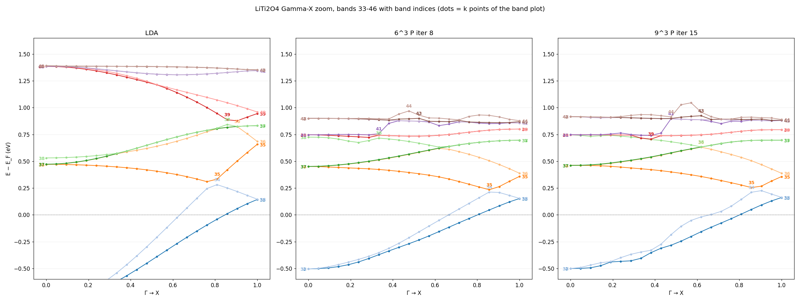](LiTi2O4/plots/GX_zoom_lda_666_999.png)
*図 11:10-2*

スクリプト: `Samples/kBT/LiTi2O4/zoom_gx.py`（引数 OUT TITLE DIR LABEL [DIR LABEL ...]）。

枝を追って読める事実:

*表 11:10-2*
| | Γ–X の t2g–eg 多重項 | 凸凹 |
|---|---|---|
| LDA | 0.46〜1.39 eV に広がり、全枝が滑らか。Γ で 3 重縮退 (1.386)、X へ向けて 2 本が下り 2 本が上る | なし |
| 6³ iter 8 | **0.65〜1.0 eV に圧縮**され、0.75 と 0.89 に長い準縮退の平坦部 | 上端の枝が x ≈ 0.43–0.52 で **+70 meV** の山 |
| 9³ iter 15 | 同じく圧縮、平坦部も同じ位置 | 上端の枝が x ≈ 0.48–0.62 で **+110 meV** の山 |

- Γ 点の 3 重縮退（QSGW で 0.915 eV）は 6³/9³ とも保たれており、対称性は壊れていない。
- 山の**幅**は x で 0.10〜0.12 = **その q メッシュ間隔（6³: 1/6 = 0.167、9³: 1/9 = 0.111）と同程度**、位置も
  6³ が x ≈ 0.5 = 3/6、9³ が x ≈ 0.55 = 5/9 とメッシュ点の上。→ 「1 個の q の Σ がずれ、その応答が補間で
  メッシュ間隔幅の山として現れる」という読みと整合する。
- Σ は多重項を 0.93 eV 幅 → 0.35 eV 幅へ**強く圧縮**しており（相関による narrowing）、その結果できた準縮退の
  密集帯の中で上端の枝だけが跳ねる。準縮退 → ⟨i|Σ(ε_i)|j⟩ のエルミート化という筋は変わらない。

反復依存は上の表（iter 1–2 で山なし → iter 4 で立ち上がり飽和）のまま。

次の検証（GPU は 10:22 に解放済み）: 山の k に最も近いメッシュ q（9³ なら (5/9,0,0)）で `hsfp0 --job=4` の `SEComg` を取り、
b41〜b44 の Σc(ω) がプラズモン共鳴の肩に乗っているかと、その q の ⟨i|Σ|j⟩ 非対角の大きさを見る。

### 2026-09-23 10:30 user 指摘「Γ–X の +1 eV に bumpy なバンド、それに対応して E_F 近傍でフラットになるバンド」→ 数値で同定
`bnd001.spin1`（第 1 区間 = Γ–X、22 点）の t2g/eg 枝を並べると:

**9³ iter 14（E − E_F, eV）**

*表 10:30-1*
| x | b38 | b39 | b40 | b41 | b42 | b43 | b44 |
|---|---|---|---|---|---|---|---|
| 0.33 | 0.705 | 0.717 | 0.742 | 0.744 | 0.901 | 0.902 | **0.931** |
| 0.43 | 0.695 | 0.739 | 0.741 | 0.758 | 0.897 | 0.897 | 0.923 |
| 0.48 | 0.682 | 0.739 | 0.741 | **0.894** | 0.895 | 0.901 | 0.915 |
| 0.52 | 0.669 | 0.740 | 0.742 | 0.890 | 0.891 | 0.914 | **1.024** |
| 0.57 | 0.653 | 0.743 | 0.744 | 0.886 | 0.887 | 0.920 | **1.030** |
| 0.62 | 0.634 | 0.746 | 0.747 | 0.885 | 0.885 | 0.924 | 0.942 |

- user の言う**フラットなバンド** = b39/b40 の 0.74 eV と b42/b43 の 0.89 eV（Γ–X 全域でほぼ平ら、分散 55 / 36 meV）。
- **bumpy なバンド** = b41（x = 0.43 → 0.48 で 0.758 → 0.894、**1 k 点で +136 meV**）と b44（x = 0.52–0.57 で
  +110 meV のスパイク）。どちらも近傍の枝が数 meV 内に密集している k で起きている。

### 2026-09-23 10:05 9³ iter 10〜14（`chain999.sh 12` → `chain999_cont.sh 40` に 05:25 で自動接続、無停止）
底 −8.766 が iter 9〜12 で 4 反復同値、13〜14 で −8.765。t2g 荒れは 4.3 → 4.0 meV と微減、max も 7.4〜8.4 で頭打ち。
O 2p 荒れ（平均）が 7.5 → 8.0 meV とごく僅かに増えているが max 12.5 meV で、6³ の収束値（7.2/10.5 相当）と同程度。
→ **9³ も実質収束**。以降は収束判定の安定性を見るための継続。

### 2026-09-23 00:35 9³ iter 9〜（当面継続、user 00:30）
iter 9: o2p 7.5 / 11.4、t2g **4.3 / 8.0**、底 −8.766（2 反復続けて同じ値 = 底は止まった）。
行並び図 `P_666_999_rows.png` はそのまま下に伸ばす（6³ の列は iter 8 で終わりなので 9 以降は空白、9³ だけが続く）。

## 2026-09-22

### 2026-09-22 23:00 9³ iter 8: t2g 4.2 / 8.9 meV、底が初めて戻る（−8.767 → −8.766）
6³ iter 8 と 9³ iter 8 の同一 k 経路での差（6³ − 9³、meV）:

*表 23:00-1*
| 窓 | iter 6 rms / max | iter 8 rms / max |
|---|---|---|
| E_F ±0.5 eV | 8.7 / 49 | 8.5 / 45 |
| E_F ±2 eV | 13.6 / 124 | 13.3 / 133 |
| E_F ±10 eV | 23.5 / 202 | 21.8 / 388 |
| O 2p 底 (b9–12) | 35 (mean +32) | 24 (mean +21) |
| t2g (b33–40) | 12 | 10 |

E_F 近傍と O 2p は改善。±10 eV の max 388 meV は **band 53、E−E_F = +5.2 eV、Γ–X の x=0.48**（高非占有帯）1 点だけで、
E_F ±2 eV の中ではなく、収束判定には無関係（次点は band 57 の +9.2 eV で 145 meV）。E_F ±2 eV の max 133 meV は
band 41（+0.88 eV）＝ t2g/eg の交差点で、これが user の言う「小さな振動」の本体。
9³ の底の刻みは −0.030 → −0.010 → −0.007 → **+0.001** と符号が反転し、実質収束（6³ は iter 8 で −8.80）。

### 2026-09-22 22:25 方針（user）: 9³ は収束判定性の確認も含めイテレーションを継続（上限なし）
現行 `chain999.sh 12`（pid 1750316）の後に `~/trash/chain999_cont.sh 40` を自動接続（pid 2458751 が待機、
kill -0 で現行の終了を検知してから exec）。継続スクリプトは **setup をやり直さない**（ctrlg の再生成・chain.log の
上書きをしない、`rst`/`sigm` を引き継いで gwsc を回すだけ）。反復番号は `QPU.*run` の数で連番。
→ 12 + 40 = 最大 52 反復（1 反復 ~100 min なので 6 月の 45 反復と同等以上まで見られる）。
毎反復ごとに band を取得して `P_666_999_rows.png` と 9³ の表を更新する（図の行は iter 8 までなので、
以降は別図 `P_999_rows_9on.png` に積む）。

### 2026-09-22 19:50 判断（user）: 9³ はまずまず安定、6³ との一致もまずまず良好（小さな振動は乗っている）
6³ iter 6 と 9³ iter 6 をバンドプロットの同じ k 経路で直接比較（6³ − 9³、meV）:

*表 19:50-1*
| 範囲 | mean | rms | max |
|---|---|---|---|
| E_F ±0.5 eV | | 8.7 | 49 |
| E_F ±2 eV | | 13.6 | 124 |
| E_F ±10 eV | | 23.5 | 202 |
| O 2p 底 (b9–12) | +32 | 35 | 87 |
| t2g (b33–40) | 0 | 12 | 124 |

6 月の収束後（±2 eV max 265、±10 eV max 940）に比べ max で 2〜4 倍縮小。O 2p 帯は 6³ が系統的に 30 meV 浅い（q メッシュの
収束差、荒れではない）。max 100 meV 級は t2g 交差点（縮退の割れ方の差）に限られる。予定どおり iter 8 まで回す。

### 2026-09-22 18:05 判断（user）: 9³ iter 5 は良好、この調子で QSGW 収束が得られるならまずまずの出発点
9³ P の t2g 荒れ 4.8 → 7.0 → 7.6 → 6.1 → **4.8** meV（iter 1 の水準に戻る）、O 2p 底 −8.40 → −8.75（刻みは縮小中、6³ は
iter 8 で −8.8 付近）。6³ iter 8 も 1 eV 付近の振動は減っていく傾向。予定どおり iter 8 まで回して安定性を見る（〜23:00）。

### 2026-09-22 15:40 過去計算の再掲（2026-06、1000 K、wcsmear なし）を今回と同じ行並びで

user: 「過去の 1000 K では 6³ と 9³ の振る舞いがかなり違っていたと記憶」→ 6 月の `n666_dq0.1_T1000K_sigmakbt1000`（30 反復）と
`n999_dq0.1_T1000K_sigmakbt1000`（45 反復、30 まで）を LDA + iter 1〜30 の行並びで。設定: χ₀ 1000 K（`t_tetrakbt`）+ `t_sigmakbt` 1000、
**wcsmear なし**、mixbeta 0.5（6³ は iter 11 まで 1.0）。

[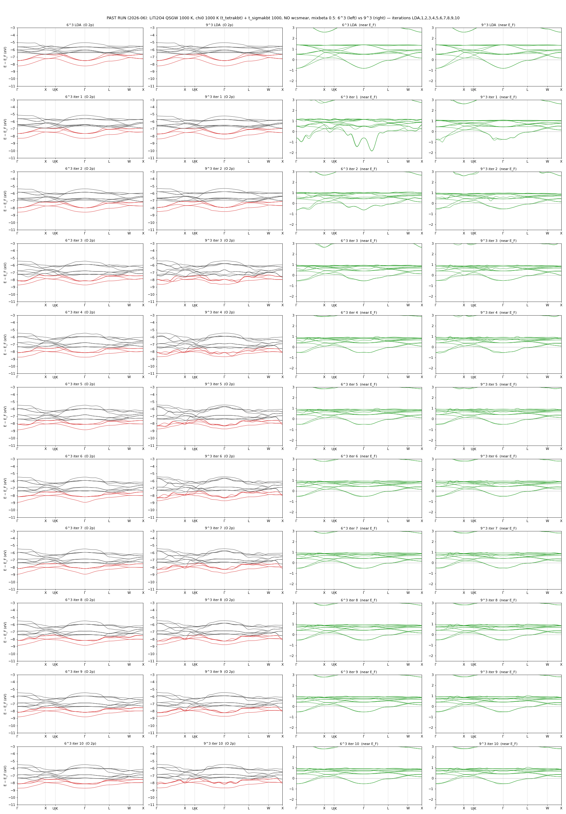](LiTi2O4/plots/June_666_999_rows_a.png)
*図 15:40-1*
[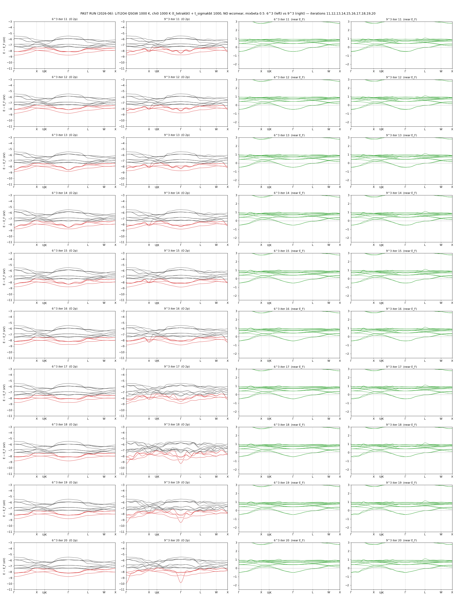](LiTi2O4/plots/June_666_999_rows_b.png)
*図 15:40-2*
[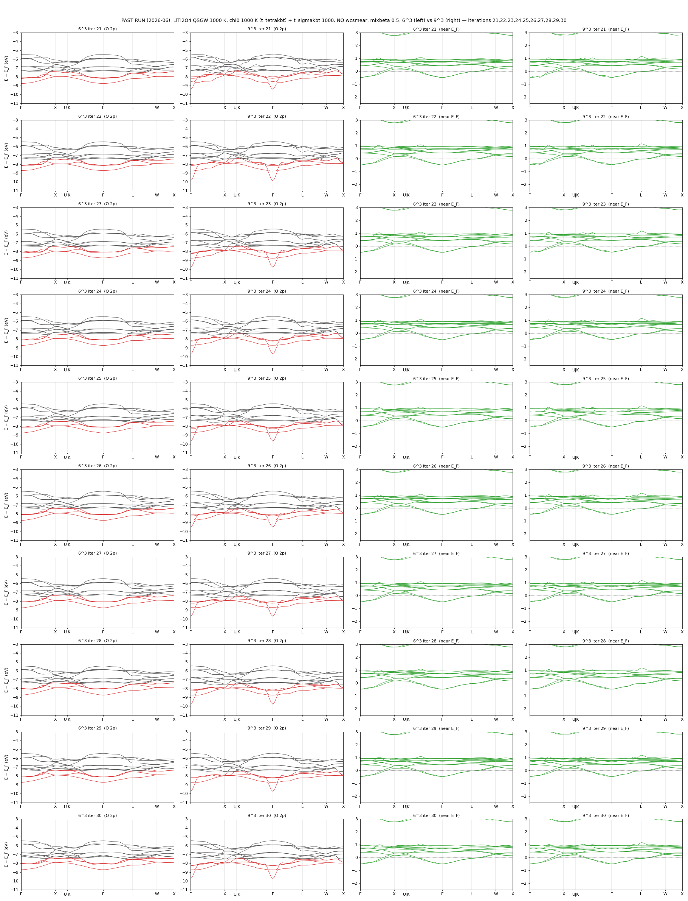](LiTi2O4/plots/June_666_999_rows_c.png)
*図 15:40-3*

- iter 1: 6³ は Γ–L の針（−2 eV）、9³ は Γ 近傍で −1 eV の針（別の場所）。**一発の時点で 6³ と 9³ が違う**（極踏みの事故がメッシュで別の対に出る）。
- iter 3〜10: O 2p の底（−8〜−9 eV）に 6³/9³ とも波打ち、9³ は Γ 付近で −1 eV 級の落ち込みが反復ごとに現れては消える。
- iter 11〜30: 6³ は徐々に滑らかになるが、9³ は O 2p に **Γ の下向きの針（−1 eV 級）が iter 17〜30 まで残り続ける**
  （09-18 に「壊れた反復」= SEc ±50 eV と同定したもの）。収束後の差が ±2 eV で max 265 meV、±10 eV で max 940 meV だった理由。
- 今回（P 設定、上の表）は iter 1 から 6³/9³ が同じ形で、O 2p 底の差 11 meV、針なし。

### 2026-09-22 13:45 高速化 (2): wcsmear の極項の核積分範囲を 15 → 8 kBT（`093d5f08e`）

`m_wfac::wcut` = 8 kBT（極項が $W_c$ を積分する範囲。`sig_window` = 15 kBT は候補窓・メッシュ余裕のまま）。範囲外の裾の重み
（≤ 2f(8) = 6.7e-4）は範囲内の cell に再配分して sum(wts) = wfac を厳密に保つ — 再配分なしだと Si/Fe/NiO で SEc が平均 4 meV
ずれた（裾の重み × $W_c(0)$ ≈ 10 eV）。再配分ありで参照と ≤ 1 meV、4 ターゲット PASSED。
見込み: 極項が触る W 平面が半減 → Σc 実軸部 35 → ~19 min/反復（9³）。実測は local では小さすぎて不可（NiO 2³ で 0.2 s）、
kt1 の 6³ 一発で 9³ チェーン後に。9³ 走行中は `~/bin` を触らない。
高速化の状態: (1) tetwt5 MPI k 並列 ✓、(2) 極項 wcut 8 kBT ✓、(3) 極項の W 平面バッチ GEMM（−20 %、半日）は未着手。

### 2026-09-22 13:05 tetwt5: OpenMP を撤去し MPI k 並列に（user 判断）

`2a5401798`: x0kf_v4h の既定経路で `gettetwt` / `x0kf_v4hz_init` を自ランクの k 範囲（`k_lo:k_hi`、comm_k）だけで呼ぶ。
tetwt5 は範囲外の四面体を先頭で skip するので、コストは (k_hi−k_lo+1)/nqbz。従来は全ランクが全 k を冗長に計算していた。
入力は固有値だけ（2 MB）、出力 whw は自分の k 分だけ → メモリも減る。GaAs eps 8 ランクで旧コードと bitwise 一致。
OpenMP（`omp_tetwt`、`whw_t`、CMake `OMP_FLAG`、`!$omp`）は全削除。ecaljdoc gwinput.md 更新（`a5b8…`）。
使い方: hgw を `-np2` で GPU 数より多く（`gpu_init(share_gpu=.true.)` で round-robin 共有）→ `MPI__AutoSetup` が
comm_k を広げ tetwt5 が分散。GPU メモリは rcxq/n_bpara + zmel の分だけ増える（AutoSetup が見る）。kt1 での計測は 9³ の後。

### 2026-09-22 12:40 tetwt5 の並列について（user との整理）

- `omp_tetwt` の既定を **1 スレッド**に変更（`75ad8be6e`）: 旧既定の「OMP_NUM_THREADS に従う」は、スレッド私有 `whw_t`（9³ で 140 MB/スレッド）を
  CPU 多ランク実行でコア数倍に膨らませる危険。gwinit テンプレに `# SmearX0 = 0.0057` / `# omp_tetwt = 30` の見え消し行と用途メモ（`b285d9e2a`）、
  ecaljdoc gwinput.md に `omp_tetwt` の項（`a2346a8`）。
- user: 「MPI で 60 コア取れるなら十分使えるのでは」→ そのとおり。CPU 版 hx0fp0 を `-np 60` で回せば q 並列（既約 35）で tetwt5 も分散し、
  有限温度 χ₀ の 150 s/q × 35 q ≈ 88 min が ~3 min。GPU 版 hgw は W-build と Σc を GPU 数（2）のランクで回すのが制約。
  本命案: **W-build を CPU 版 hx0fp0（-np 60）で先に回し、hgw は Σc だけ**（W は /dev/shm か /mnt/data1、9³ で 100 GB）。
  gwsc の段取り変更 + W 読みで実装 1 日。P 設定（T=0 χ₀）では tetwt5 が軽いので急がず、有限温度 χ₀ を本気で使うときに。

### 2026-09-22 12:20 方針（user）: 9³ を 1000 K 相当（P 設定）のまま収束まで回す

6³ P が 8 反復で収束し、6³/9³ の一発が 10 meV 級で一致したので、9³ `n999_P_smearx0_nofilter_mix05` をそのまま 12 反復（~20 h、明朝）。
2000 K 相当（P2/R2）は 9³ の後に必要なら 6³ で短く。極項の高速化（核の裾 15 → 8 kBT）も今のチェーンには入れない。

### 2026-09-22 11:45 user: 「6³ と 9³ の一発が従来より近すぎないか」→ 数字で確認

共通 q（632 状態、|E|<3 eV）の QPU.1run 比較（P 設定）: SEx max 33 / mean 3 meV、SEc max 32 / mean 8、dSEnoZ max 13 / mean 5 meV。
9³ の hgw は nqbz=729・nqibz=35 で回っている（確認）。「eQP 差 0」は iter 1 の eQP が LDA 固有値のままなので無意味（6 月も同じ）。
疑い: SmearX0（Im χ₀ の 0.156 eV Gaussian）が W の q 依存の細かい構造を先に均すので、メッシュ依存が小さく見えているのでは。
SmearX0 → 0 では差が開くはず。検証 = SmearX0 なし（χ₀ T=0、wcsmear のみ）の 6³/9³ 一発の比較（GPU が空いたら）。
計算自体の確認（11:50）: 9³ の lqg4gw「irreducible k = 35 from 729」、hgw の `nqbz=729 nqibz=35`、両 run の hx0fp0/hgw に
`SmearX0 (Ha) = 5.7E-03`、sigm のサイズ 13.5 MB（6³）vs 29.6 MB（9³）で q 数に比例。比較は共通の既約 q・同じバンド番号で行った。
→ 計算はきちんと 9³ で走っており、10 meV は本物の 6³ vs 9³ の Σ の差。

**以前との比較**（同じ方法、一発 iter 1、共通 q、|E|<3 eV の dSEnoZ; 旧 run は Γ 点のみ n=50）:

*表 11:45-1*
| 設定 | max | mean |
|---|---|---|
| 6 月型（χ₀ 1000 K + t_sigmakbt 1000、wcsmear なし） | **0.30 eV** | 12 meV |
| wcsmear（χ₀ 1000 K、09-19） | **0.19 eV** | 10 meV |
| **P（χ₀ T=0 + SmearX0 + wcsmear）** | **0.013 eV** | 5 meV |

平均は元々 10 meV 級。以前のずれの本体は**少数の外れ値**（プラズモン極を踏む対が 6³ と 9³ で別の場所に出る）。P でそれが消え、
本来のメッシュ依存（~10 meV）だけが見えている、という読み。「SmearX0 が均している」より「極踏みの事故が無くなった」が主因。

user: 「以前は目視で大きくずれていた所が多かった」→ q 点の Σ だけでなく**バンド（k パス上の補間）の差**を直接見る（12:05）:

[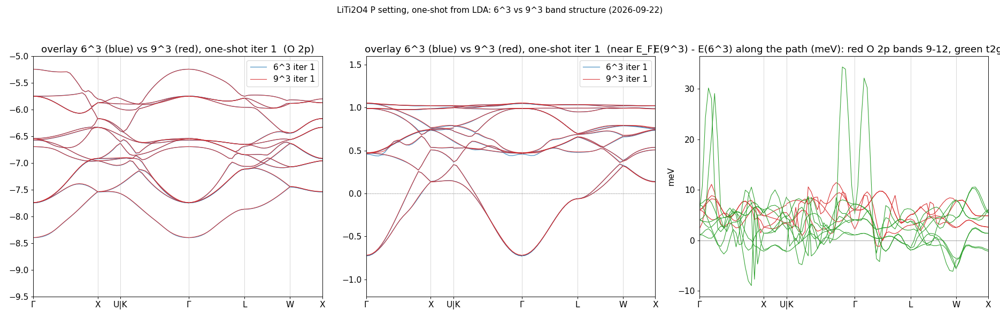](LiTi2O4/plots/P_666_vs_999_iter1.png)
*図 11:45-1*

$E(9^3)-E(6^3)$ をパス上で: O 2p（9–12）max 11 / rms 6 meV、t2g（33–40）max **34** / rms 6 meV。t2g の 30 meV 級の差は Γ 近傍と
Γ–X 中程の 2 か所（バンド交差点、E_F 直上 +0.5〜+1.0 eV — 収束解で凸凹が残る場所と同じ）。それ以外は 10 meV 以下で系統的に
9³ が 5 meV 高い（O 2p）。6 月の目視のずれ（O 2p の底で 0.3〜0.5 eV、E_F 近傍の針）とは別次元。反復後の比較は 9³ 収束後に。

### 2026-09-22 11:30 メモ: 単純な金属の χ₀・W_c・Σc の模型（LiTi₂O₄ の状況に合わせて）

LiTi₂O₄ の低エネルギーは「幅 ~2 eV の t2g 帯が 1/6 だけ占有された金属」。Lindhard（電子ガス）＋帯間の背景誘電率 $\varepsilon_\infty$ で特徴が出る。

**1. 帯内 χ₀（Lindhard、T=0、小 q）**

$$
\mathrm{Im}\,\chi_0(q,\omega) = -\frac{\pi N(0)}{2}\,\frac{\omega}{q v_F}\quad (0<\omega<qv_F),\qquad
\mathrm{Re}\,\chi_0(q,\omega\gg qv_F) \simeq \frac{N(0)}{2}\,\frac{q^2v_F^2/3}{\omega^2}
$$

Im χ₀ は ω に線形に立ち上がり $\omega = qv_F$ で切れる。今朝の dump: 第一殻（$|q|$=0.29）で $-\mathrm{Im}W_c/\omega \approx$ 一定、0.4 eV で落ちる = $qv_F \approx 0.4$ eV。
offset-Γ（$|q|$=0.008）では $qv_F \approx 0.03$ eV なので Drude 重みが 30 meV に押し込まれる（10:35 の図）。

**2. RPA の W とプラズモン**

$\varepsilon(q,\omega) = 1 - v(q)\,\chi_0(q,\omega)$、$\chi_0 = \chi_0^{\rm intra} + \chi_0^{\rm inter}$。帯間部分は低エネルギーでは実数の背景
$1 - v\,\mathrm{Re}\chi_0^{\rm inter}(0) \equiv \varepsilon_\infty \approx 5$〜7（O 2p → Ti、3 eV 以上に Im）。帯内は Lindhard で、実部・虚部を分けて書くと

$$
\mathrm{Re}\,\varepsilon(q,\omega) = \varepsilon_\infty - \frac{\omega_p^{2}}{\omega^2}\Bigl(1+\tfrac35\tfrac{q^2v_F^2}{\omega^2}\Bigr)\quad(\omega \gg qv_F),
\qquad
\mathrm{Im}\,\varepsilon(q,\omega) = -v(q)\,\mathrm{Im}\chi_0^{\rm intra}(q,\omega) = \frac{\pi}{2}\,v(q)N(0)\,\frac{\omega}{qv_F}\ \theta(qv_F-\omega)
$$

（$\omega_p^2 = v(q)\,N(0)\,q^2v_F^2/3$、3 次元では $v(q)=4\pi e^2/q^2$ で $\omega_p$ は $q$ に依らない）。T=0 の Lindhard では
$\mathrm{Im}\,\varepsilon$ は $\omega > qv_F$（正確には $\omega > qv_F + q^2/2m$）で**厳密にゼロ**。有限温度 / SmearX0 では裾が
$\Delta\omega \sim k_BT$ / Gaussian 幅だけ外に伸びる。

$$
W_c(q,\omega) = \frac{v(q)}{\varepsilon(q,\omega)} - v(q),\qquad
\mathrm{Im}\,W_c = -\,v(q)\,\frac{\mathrm{Im}\,\varepsilon}{(\mathrm{Re}\,\varepsilon)^2+(\mathrm{Im}\,\varepsilon)^2}
$$

プラズモン: $\mathrm{Re}\,\varepsilon(\omega_p^{\rm scr}) = 0$、$\omega_p^{\rm scr} = \omega_p/\sqrt{\varepsilon_\infty}\approx 1.8$ eV。そこで $\mathrm{Im}\,\varepsilon = 0$ なら
$\mathrm{Im}\,W_c$ はデルタ関数（**幅ゼロの真の極**）、重みは $\pi v(q)/|\partial\mathrm{Re}\varepsilon/\partial\omega| = \pi v(q)\,\omega_p^{\rm scr}/(2\varepsilon_\infty)$。
$\mathrm{Im}\,\varepsilon(\omega_p^{\rm scr}) \ne 0$ なら Lorentz 型で半値幅 $\gamma = \mathrm{Im}\,\varepsilon/|\partial\mathrm{Re}\varepsilon/\partial\omega|$。
幅が付く経路: (i) $qv_F$ が $\omega_p^{\rm scr}$ に近づく $q$（Landau 減衰、上の $\theta$ が 1 になる。第二殻で 1.8 と 2.2 eV に割れる）、
(ii) 帯間遷移の Im（3 eV 以上の裾が 1.8 eV に少し掛かる）、(iii) 温度／SmearX0 による $\mathrm{Im}\,\chi_0^{\rm intra}$ の裾。
第一殻（$qv_F \approx 0.4$ eV $\ll 1.8$）の幅 0.1 eV は (iii)（1000 K、kBT 0.086 eV）だけの寄与 — だから SmearX0 0.156 eV で目に見えて鈍る。

$\omega\to0$（user の確認）: 帯内の $\mathrm{Re}\,\chi_0 \to -N(0)$（静的 Lindhard）で
$\mathrm{Re}\,\varepsilon(q,0) = \varepsilon_\infty + k_{TF}^2/q^2$（$k_{TF}^2 = 4\pi e^2N(0)$）が有限かつ大きいので、

$$
\mathrm{Im}\,W_c(q,\omega\to0) \simeq -v(q)\,\frac{\tfrac{\pi}{2}v(q)N(0)\,\omega/(qv_F)}{(\varepsilon_\infty+k_{TF}^2/q^2)^2} \propto -\omega
$$

と線形にゼロへ、発散はない（第一殻の $-\mathrm{Im}W_c/\omega\approx$ 一定）。$\mathrm{Re}\,\chi_0\simeq N(0)q^2v_F^2/3\omega^2$ は $\omega\gg qv_F$ 側の展開。
offset-Γ は $k_{TF}^2/q^2$ が巨大で $W_c(0)\to -v(q)(1-1/\varepsilon(q,0))$ は有限（−382）、Im は $\omega<qv_F=0.03$ eV の中だけ。

**3. Σc のプラズモン極模型**（`contour_test` の $W_c$ と同じ）

$$
W_c(z) = -\frac{v\,\omega_p^2}{\omega_p^2 - z^2 - i\gamma z},\qquad
\Sigma_c(\omega) \simeq \sum_{k'}|M_{k'}|^2\left[\theta(\varepsilon'-E_F)\,\frac{-v\omega_p/2}{\omega-\varepsilon'-\omega_p+i\eta}
+ \theta(E_F-\varepsilon')\,\frac{-v\omega_p/2}{\omega-\varepsilon'+\omega_p-i\eta}\right]
$$

（$\gamma\to0$ のプラズモン極近似）。非占有状態 $\omega$ には**占有**中間状態 $\varepsilon'$ が $\omega-\varepsilon' = \omega_p$ を満たすところに共鳴。
$\varepsilon'$ = t2g 占有底 −0.6 eV なら $\omega = +1.2$ eV — 03:40 の $\Sigma_c(\omega)$ で非占有 t2g（+0.4〜+1.3）が座っている肩。
傾き $\partial\Sigma/\partial\omega \sim -|M|^2 v\omega_p/(2\Delta^2)$、$\Delta = \omega-\varepsilon'-\omega_p$。実測 −1.3。

**4. 各手段の模型上の意味**

*表 11:30-1*
| 手段 | 模型で何が変わるか | 観測 |
|---|---|---|
| 温度 / `SmearX0` | $\gamma$ を増やす → 共鳴の肩を幅 $\gamma$ で鈍らせる | P（1000 K 相当）で収束。2000 K 相当でさらに滑らかなはず |
| `chi0_filterw`（帯間を抜く） | $\varepsilon_\infty \to 1$ 側 → $\omega_p$ が上がり遮蔽が弱まる。肩は消えず位置が動く | R: バンドが HF 側に開き O 2p 底が沈み続ける |
| Drude 抜き | $\omega_p \to 0$、静的遮蔽も消える | 帯幅 3.5 eV、さらに HF 的 |
| `t_sigmaw` | $\varepsilon'$ を均すだけ。$\Sigma(\omega)$ の $\omega$ 依存は不変 | 効かない（01:48） |
| `wcsmear` | $W_c$ を $\varepsilon'$ の分布で平均 = 極を踏む事故を防ぐ。肩の傾きは変えない | 針は消えるが凸凹は残る |

この模型で `contour_test` を占有側の極も含む 2 極版にすれば、E_F 直上の凸凹の $\gamma$ 依存（1000 K vs 2000 K 相当）を計算前に見積もれる。

### 2026-09-22 11:15 9³ iter 1: O 2p 7.1 / 9.9、t2g 4.8 / 6.9 meV（6³ の iter 1 と同水準）、112 分

`n999_P_smearx0_nofilter_mix05` iter 1（09:19→11:11、6709 s）: O 2p 荒れ 7.1 / 9.9、t2g 4.8 / 6.9、底 −8.40。
6³ P iter 1（7.2 / 10.1、4.9 / 6.9、−8.40）とほぼ同じ → メッシュ依存の小ささを示唆（6 月の 9³ 1000 K は iter 1 で 8 / 11.5、針あり）。

*表 11:15-1*
| 9³ P | iter | 開始→終了 | O 2p | t2g | 底 |
|---|---|---|---|---|---|
| | 1 | 09:19→11:11 | 7.1 / 9.9 | 4.8 / 6.9 | −8.40 |
| | 2 | 11:11→12:51 | 7.3 / 9.3 | 7.0 / 15.1 | −8.50 |
| | 3 | 12:51→14:35 | 7.6 / 10.8 | 7.6 / 16.6 | −8.62 |
| | 4 | 14:35→16:16 | 7.3 / 10.2 | **6.1 / 10.6** | −8.72 |
| | 5 | 16:16→17:55 | 7.3 / 10.5 | **4.8 / 11.0** | −8.75 |
| | 6 | 17:55→19:34 | 7.2 / 10.7 | **4.6 / 11.1** | −8.76 |
| | 7 | 19:34→21:13 | 7.4 / 11.1 | **4.4 / 9.8** | −8.77 |
| | 8 | 21:13→22:51 | 7.5 / 11.3 | **4.2 / 8.9** | −8.766 |
| | 9 | 22:51→00:29 | 7.5 / 11.4 | **4.3 / 8.0** | −8.766 |
| | 10 | 00:29→02:08 | 7.5 / 11.6 | **4.3 / 7.4** | −8.766 |
| | 11 | 02:08→03:46 | 7.7 / 11.8 | **4.2 / 7.4** | −8.766 |
| | 12 | 03:46→05:24 | 7.9 / 12.2 | **4.1 / 7.5** | −8.766 |
| | 13 | 05:25→07:03 | 7.9 / 12.3 | **4.1 / 8.0** | −8.765 |
| | 14 | 07:03→08:41 | 8.0 / 12.5 | **4.0 / 8.4** | −8.765 |
| | 15 | 08:41→10:20 | 8.0 / 12.7 | **4.1 / 8.9** | −8.764 |（09-23 10:22 に user 指示で停止）

[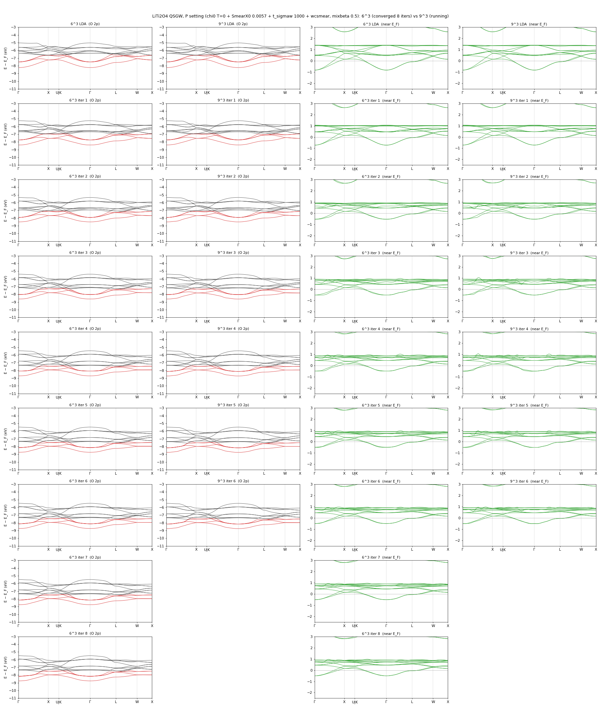](LiTi2O4/plots/P_666_999_rows.png)
*図 11:15-1*

（行 = LDA, iter 1, 2, …; 列 = 6³ O 2p | 9³ O 2p | 6³ E_F 近傍 | 9³ E_F 近傍。9³ の行は反復が出るごとに埋まる。
`LiTi2O4/plot_band_rows_666_999.py Pchain P999 NITER`。）
9³ iter 2 は 6³ iter 2 とほぼ同じ形。t2g の max 15 meV は Γ–X 中程 +0.5〜+0.7 eV の交差点（6³ でも同じ場所に小さな凸凹）。

[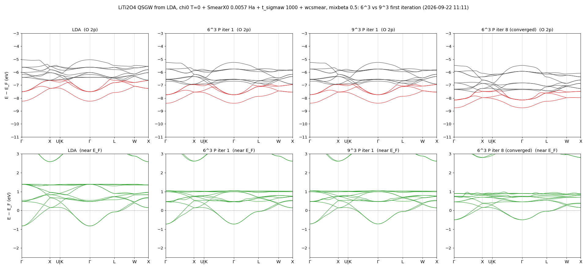](LiTi2O4/plots/P999_iter1.png)
*図 11:15-2*

6³ iter 1 と 9³ iter 1 は目で区別できない（一発ではメッシュ収束している）。

### 2026-09-22 10:35 offset-Γ の Im $W_c$ の ω → 0（user の問い）

*図 10:35-1*

- offset-Γ（\|q\| = 0.008）: Im $W_c(1,1)$ は ω ≈ 0.03 eV までに −0.2 へ急峻に立ち上がりその後平ら。$-\mathrm{Im}W_c/\omega$ は 0.03 eV に
  鋭いピーク（5）で Drude 定数ではない = 微小 q の帯内連続体（$\omega\lesssim v_Fq\approx0.03$ eV、kBT で少し広がる）。bin 幅 1〜5 meV で解像はされている。
- 第一殻（\|q\| = 0.29）: $-\mathrm{Im}W_c/\omega\approx1$ で ω → 0 まで平ら（Drude 的）、$v_Fq\approx0.4$ eV で落ちる。
- Re $W_c(\omega)-W_c(0)$ は 0.3 eV 以下で ±0.1 以内（offset-Γ の $W_c(0)=-382$ に対して）: 静的な頭は良く定義されている。
offset-Γ の Drude 重みが 30 meV に押し込まれているのは、準位 smearing（kBT 86 meV）より鋭い構造。ただし虚軸側は $W_c(0)$ の解析項で
ν → 0 を扱うので（01:35 の単体試験）、これが段差にはならない。

### 2026-09-22 10:20 訂正: P 設定（χ₀ T=0）の 9³ では tetwt5 は 20 s/q で軽い。主コストは wcsmear の実軸極項

09:40 の内訳は 09-18 の run（χ₀ 1000 K = `lindtet6_kbt`、GL20 畳み込み）のもの。P（χ₀ T=0、`lindtet6`）の走行中 9³ の実測（rank 0）:
W-build **66 s/q**（tetwt5 job=1 20 s、dpsion 12 s、χ₀ zmel+GEMM ~30 s）、**Σc 258 s/q**。Σc の中（6 q、6144 icount）: 虚軸 GEMM 1074 s、
**実軸極項 922 s**（0.15 s/icount。wcsmear 前は 0.027 s → ×5.5、09-19 の ×6.7 と整合）、zmel 149 s。
1 反復 130 min ≈ Σc 虚軸 40 + **極項 35** + zmel 6 + W-build 20 + lmf 等 12。

- tetwt5 の OpenMP（`39fdcfc2d`、gfortran で 1 vs 8 スレッド差 1e-16）は χ₀ 有限温度のときの資産。P では 3 %。
  kt1 の別ビルド `build_omp_test` で 6³ T=0 の tetwt5 = 7.1 s/q（1 スレッド）を確認、30 スレッドの計測は不要と判断。
- **単純な高速化の本命 = wcsmear の極項**: 核の裾 ±15 kBT（±1.3 eV）に W 平面 ~100 本、plane ごとに小 GEMM。
  (1) 裾を 8 kBT に（重み 3e-4 を切る）→ plane 半分、極項 −45 %、1 反復 −15 min。`m_wfac::wcut` の 1 行。
  (2) plane をまとめて 1 GEMM（ngb² × nplane、9³ で 100 plane 1.7 GB）→ さらに −20 %。半日。
  走行中の 9³ には入れない（次のチェーンから）。

### 2026-09-22 09:40 高速化: 9³ 1 反復のコスト内訳と tetwt5 の OpenMP 作り直し

**内訳**（両 GPU、`-np 60 -np2 2`、09-18 の repro run と今朝の iter 1 から）: lmf 4〜6 min、jobgw 1 min、hvccfp0 ×2 1.3 min、
core 交換 1.5 min、**hgw 115 min（89 %）**、hqpe/lmf 6 min、計 ~130 min。hgw の中（rank 0、18 q）: W-build 217 s/q = 65 min
（うち **tetwt5 ~178 s/q、1 スレッド直列 = 全体の ~50 %**、χ₀ zmel+GEMM 24 s、dpsion 6 s）、Σc 178 s/q = 53 min
（icount 840: 虚軸 GEMM 0.15 s、極項 0.027 s、zmel 0.019 s）。CPU 60 コア中 58 コアが遊んでいる。

**対処**（`39fdcfc2d`）: tetwt5 の job=1 の重み積算を atomic からスレッド私有 `whw_t(:,ithr)` + ループ後の和に変更
（09-19 の atomic 版は競合で効かなかった）。メモリ nhwtot × nthr × 8 B（9³: 4.2 GB/rank、許容）。gfortran で Fe chipm /
GaAs eps は 1 vs 8 スレッドで差 1e-16（和の順序）。kt1 では走行中の 9³ に触らないよう別ビルド木 `build_omp_test`
（`~/bin_omp_test` に配送）で hx0fp0 だけ作り、6³ の 1 q で 1 vs 30 スレッドの tetwt5 wall を測る。
見込み: 178 s/q → ~6 s/q、9³ 1 反復 130 → ~80 min。9³ 本番への適用は今のチェーンが終わってから。

### 2026-09-22 09:20 9³ 投入（user「999 をやる」）— P と同設定、GPU 2 枚

`n999_P_smearx0_nofilter_mix05`（`~/trash/chain999.sh`、`-np 60 -np2 2`、12 反復、1 反復 ~2.5 h）: χ₀ T=0 + `SmearX0 0.0057` Ha +
`t_sigmaw 1000` + wcsmear、フィルタなし、mixbeta 0.5、LDA から。09:19 開始。
P2（2000 K 相当）は iter 1 途中で停止（結果なし、9³ の後に再開可）、R は iter 7（t2g 7.3 / 16.5、底 −9.65）で停止。
段階 2（フルスペクトル一発）は user 判断で見送り。

### 2026-09-22 08:40 **P（フィルタなし + SmearX0 1000 K 相当）は 8 反復で収束** — 6³ のスムーズ収束を達成

`n666_P_smearx0_nofilter_mix05`（01:12〜08:34、8 反復、1 反復 45〜80 分）。χ₀ T=0 + `SmearX0 = 0.0057` Ha + `t_sigmaw = 1000` + wcsmear、mixbeta 0.5、LDA から。
- iter 7 → 8: eQP（|E|<3 eV、2544 状態）の変化 **max 10 meV、平均 2 meV**。dSEnoZ 平均 11 meV。O 2p 底 −8.751 → −8.754。
- t2g 荒れ 3.0 / 5.1 meV（LDA 4.8 より滑らか）、O 2p 荒れ 7.1 / 11.0（6 月の 1000 K 収束値 13.8、9³ の 25〜100 と比べ良好）。
- SEc ジャンプ（>1 eV）は iter 8 で 2/832（st40、q=(−⅙,⅙,⅙)、2.08 eV）— 個別の状態にはまだ揺れがあるが固有値には 10 meV 以下。
R（フィルタ + Drude 残す）は 6 反復で t2g 7.3 / 16.4、底 −9.63 と沈み続け、P より悪い → 段階 2 路線は当面保留。
P2（2000 K 相当）は 08:34 に GPU 0 で自動開始（`SmearX0 = 0.0114`, `t_sigmaw = 2000` 確認）。R2 は R の後（~10:00）。

*図 08:40-1*

全反復（LDA + iter 1〜8）:

*図 08:40-2*

LDA → iter 1 → 4 → 8（右端は iter 7 と 8 の重ね描き: 青と赤が完全に重なる）。収束解: t2g 幅は LDA 2.2 eV（−0.85〜+1.35）→ 1.4 eV
（−0.5〜+0.9）と**狭まり**、O 2p は 0.5〜0.7 eV 下がる。E_F 直上 +0.8〜+1.0 eV に 30〜50 meV の小さな凸凹が残る（反復で不変）。

### 2026-09-22 05:45 作戦（user「作戦を考える」への提案、承認待ち）

1. **P（フィルタなし + SmearX0 1000 K 相当）を第一候補**として 8 反復。判定: O 2p / t2g 荒れ < 8 meV を維持し、O 2p 底・t2g 幅の
   反復間変化 < 30 meV で「6³ スムーズ収束」達成。R（フィルタ + Drude 残す）は対照。
2. **P2/R2（2000 K 相当）**で滑らかさとバンドの系統シフト（1000 K 相当との差）を測り、副作用を数値で押さえる。同等なら小さい方を標準に。
3. 標準が決まったら **9³**（GPU 2 枚、1 反復 ~2.5 h、10 反復 ~1 日）、6³ との一致で締める。
4. 整理: SmearX0 を「金属で W の極を鈍らせる標準手段」として ecaljdoc に位置づけ直す（温度は占有だけ、SmearX0 は χ₀ の全構造を均す）。
   `chi0_filterw` は段階 2 とセットの実験機能。`t_sigmaw` は 1000 K 固定でよい。
5. やらない: (a) 非対角 $\bar\omega$ 評価、niw 増、9³ の一発診断。
判断点: P が iter 5〜6 で荒れ出したら P2 に切替。P2 でも駄目なら静的 QSGW の限界として段階 2 路線（R）。

### 2026-09-22 03:40 T0 の $\Sigma_c(\omega)$（実系、27 meV 刻み）: 段差なし。E_F 直上の状態は $\omega=\varepsilon_{\rm occ}+\omega_p$ の共鳴の肩に座っている

`t0_secomg_filt3_drude/SEComg.UP`（hsfp0 --job=4、`ECALJ_DWPLOT=0.002 ECALJ_OMEGAMAX=0.3`、EMIN/EMAX −2/+2 → 12 状態、3 q、00:49〜03:29 CPU 30 rank）。
データ `LiTi2O4/secomg_20260922/SEComg.UP`。

*図 03:40-1*

1. $\Sigma_c(\omega)$ は 27 meV 刻みで滑らか、LDA 準位（灰線）の位置に段差なし → **contour 実装は実系でも正しい**（01:35 の単体試験と整合）。
2. 自身のエネルギーでの傾き $\partial\mathrm{Re}\Sigma_c/\partial\omega = -1.2\sim-1.35$（$Z\approx0.43$）。2 点平均の非対称 0.24 eV / Δ 0.8 eV（01:48）はこの傾きの
   直接の帰結。E_F ± 1.5 eV での 2 階差分 max 0.2（33/34）、0.06（35–38）— 曲率もある。
3. 構造: 非占有 t2g（+0.4〜+1.3 eV）は ω ≈ 2.3〜3.3 eV で Re −15 eV 級の落ち込み（Im −0.9）、占有 t2g（−0.6）は ω ≈ −2.7 で +17 の山。
   位置は $\omega=\varepsilon'\pm\omega_p$（1.8 eV）= **Drude 由来のプラズモン極**（フィルタは帯間だけ抜くので残る、意図どおり）。
   占有 t2g の底 −0.6 eV + 1.8 = **+1.2 eV に非占有 t2g 自身が乗る**: E_F 直上 +1 eV 付近の状態は $\Sigma(\omega)$ の共鳴の肩で
   $\partial\Sigma/\partial\omega$ が大きく $k$ 依存 → **凸凹の出所**。
4. `t_sigmaw`（kBT 0.086 eV）や wcsmear（±1.3 eV の核平均）では幅 ~0.5 eV の共鳴の肩は消えない。効くのはプラズモン自体の幅を広げる
   温度（Landau 減衰）／SmearX0 → **2000 K 相当（P2/R2、キュー済み）が本命**。6 月に 2000 K 以上で滑らかだったことと整合。

P（フィルタなし、SmearX0 1000 K 相当）iter 1（01:12〜02:30）: O 2p 7.2 / 10.1、t2g 荒れ 4.9 / 6.9 meV（LDA 4.8 と同じ！）、底 −8.40。
一発では SmearX0 版が今までで最も滑らか。

*表 03:40-1*
| chain | iter | 開始→終了 | O 2p 荒れ | t2g 荒れ (33–40) | 底 E(b9) |
|---|---|---|---|---|---|
| P（フィルタなし） | 1 | 01:12→02:30 | 7.2 / 10.1 | 4.9 / 6.9 | −8.40 |
| P | 2 | 02:30→03:33 | 6.9 / 9.1 | 5.1 / 9.9 | −8.50 |
| P | 3 | 03:33→04:23 | 7.4 / 10.6 | 5.2 / 10.0 | −8.62 |
| P | 4 | 04:23→05:08 | 7.3 / 10.9 | **4.2 / 7.3** | −8.71 |
| P | 5 | 05:08→05:55 | 7.0 / 10.6 | **3.6 / 6.0** | −8.74 |
| P | 6 | 05:55→06:43 | 6.9 / 10.8 | **3.3 / 5.7** | −8.74 |
| P | 7 | 06:43→07:46 | 7.0 / 11.0 | 3.1 / 5.4 | −8.751 |
| P | 8 | 07:46→08:34 | 7.1 / 11.0 | **3.0 / 5.1** | −8.754 |
| R（filterw [3,0.2] Drude 残す） | 1 | 01:51→03:33 | 6.6 / 8.6 | 5.4 / 8.3 | −8.70 |
| R | 2 | 03:33→04:33 | 6.1 / 8.3 | 6.0 / 11.1 | −9.02 |
| R | 3 | 04:33→05:39 | 6.6 / 8.6 | 7.0 / 17.5 | −9.39 |
| R | 4 | 05:39→06:39 | 6.7 / 8.8 | 7.8 / 18.9 | −9.61 |
| R | 5 | 06:39→07:22 | 7.0 / 10.2 | 7.4 / 17.5 | −9.61 |
| R | 6 | 07:22→08:15 | 6.9 / 9.8 | 7.3 / 16.4 | −9.63 |

P は反復ごとに t2g が滑らかになり（4.9 → 3.3、LDA 4.8 を下回る）、O 2p 底は iter 5→6 で 0.006 eV と**収束**。

*図 03:40-2*

iter 4 以降、E_F 直上 +0.8〜+1.0 eV の非占有 t2g に小さな凸凹（0.05 eV 級、Γ–X 中程・W–X）はまだ見えるが反復で育たない。
R は t2g の max が 8 → 19 meV と育ち、底は 0.2〜0.4 eV/反復で沈み続ける（帯間遮蔽を抜いた分の HF 化が反復で強まる）。

（参考: これまでの iter 2 は MAIN 12.1 / t2g 7.8、Drude 残し T=0 チェーン 6.5 / —。）

### 2026-09-22 01:52 user: 「フィルタなし」と「プラズモンのみ抜き（Drude 残す）」が本命 → Q（Drude 抜き）を停止し R に差し替え

- P `n666_P_smearx0_nofilter_mix05`（GPU 0）: 継続（iter 1 の hgw 中）。
- Q `n666_Q_smearx0_filt3_nodrude_mix05`: 01:50 停止（iter 1 途中）。
- **R** `n666_R_smearx0_filt3_drude_mix05`（GPU 1、01:51〜）: χ₀ T=0 + SmearX0 0.0057 Ha + `chi0_filterw=[3,0.2]` **Drude 残す** + t_sigmaw 1000 + wcsmear、mixbeta 0.5、8 反復。
(a)（非対角を $\bar\omega$ で評価）は「$\Sigma_{ij}$ が線形なら mode A と同じ」なので保留（user 同意）。
user 01:55: 終わったら **2000 K 相当**も → P/R の `chain done` 後に同じ GPU で P2 `n666_P2_smearx0_nofilter_2000K_mix05`、
R2 `n666_R2_smearx0_filt3_drude_2000K_mix05`（`SmearX0 = 0.0114` Ha、`t_sigmaw = 2000`）を自動起動（`~/trash/queue_2000.sh`）。

### 2026-09-22 01:48 近接 t2g 対の $\Sigma^c_{ij}$ の 2 点評価の差は Δ に比例（傾き 0.25〜0.4）— 振動でなく傾き。`t_sigmaw` では平均化できず、(a) も線形なら無効

`se_pairs.py`（SEC2U の行 $i$ と行 $j$ の比較、フィルタあり一発）: X 点の (33,39)（0.14/0.95 eV、Δ 0.81）で
$\Sigma_{ij}(\varepsilon_i)=-0.52$、$\Sigma_{ji}(\varepsilon_j)^*=-0.76$、差 0.24（/Δ = 0.29）; (34,40) Δ 0.66 差 0.18 (0.28); (35,40) Δ 0.78 差 0.20 (0.26);
Δ 0.09 の対でも /Δ = 0.25〜0.39。→ $\partial\Sigma_{ij}/\partial\omega\approx-0.3$ の**滑らかな傾き**（Z 因子相当）で、kBT 以下の ω 構造ではない。
非対角の大きさ 0.4〜0.65 eV、Δ 0.8 eV の対の準位反発 ≈ 0.5 eV。
含意: (1) `t_sigmaw` は中間準位を均すだけで傾きは変えない → 効かない。(2) $\Sigma_{ij}$ が Δ の範囲で線形なら
$\tfrac12[\Sigma(\varepsilon_i)+\Sigma(\varepsilon_j)]=\Sigma(\bar\omega)$ なので (a) も mode A と同じ → 効かない。
決め手は T0 v5（対角 $\Sigma_c(\omega)$、27 meV 刻み、12 状態、走行中、〜04:30）の ω 依存の形。線形なら凸凹は静的化の欠陥でなく
「この W・6³ での収束解の性質」に傾く。(a) の実装はその後。02:15 の「固有ベクトル入れ替え」説明は不正確だった（$V$ は $k$ で連続、
問題はエネルギー依存）と訂正。

### 2026-09-22 01:40 Fermi 面ネスティングの検討（user）: $W_c(q,0)$ の頭は \|q\| に単調、兆候なし

user: 「この系はネスティング不安定を内在しているかも。プラズモンとは別」。フィルタなし dump（16 既約 q）で
$W_c(1,1)(q,\omega=0)$ と $-\mathrm{Im\,tr}W_c$（0.05 eV）を並べると、Γ セル −382、\|q\| = 0.29 / 0.33 / 0.47 / 0.58 / 0.67 で
−36 / −28 / −15 / −11 / −9、\|q\| ≥ 0.8 で −6.5〜−8.2 と**単調**（iq=9 (−⅔,⅔,1) は折り返すと (⅓,⅓,0)、\|q\|=0.47 で列に収まる）。
低 ω の重みも Drude 型で \|q\| に単調。特定 q の突出（$\chi_0(q,0)$ の発散的ピーク）は 6³ の q 解像度では見えない。
→ 反復の凸凹は「W の静的 q 構造」でも説明できず、Σ 側の非対角エルミート化が残る。

### 2026-09-22 01:40 今のコード（`3ec2a281f`）で 6³ チェーン 2 本を並走（user 指示）

共通: χ₀ T=0 + `SmearX0 = 0.0057` Ha（Gaussian、std = FD 1000 K の 0.156 eV）+ `t_sigmaw = 1000` + wcsmear、mixbeta 0.5、LDA から 8 反復、
`-np 30 -np2 1`、`~/trash/chain_v2.sh`、ログは反復ごとに開始/終了時刻・O 2p 荒れ・t2g 荒れ（bands 33–40）・O 2p 底。
- **P** `n666_P_smearx0_nofilter_mix05`（GPU 0）: フィルタなし（Drude・帯間とも χ₀ に入る）。
- **Q** `n666_Q_smearx0_filt3_nodrude_mix05`（GPU 1）: `chi0_filterw=[3,0.2]`、**Drude 抜き**。
01:12 開始、1 反復 ~70 分。T0 v5（$\Sigma_c(\omega)$、CPU）は並走中。

### 2026-09-22 01:35 単体試験 `Samples/kBT/contour_test/`: contour 分解 + FD smearing の実装は正しい（縮退跨ぎで連続、厳密求積と 0.35 % 以内）。01:00 の niw 仮説は撤回

user の指摘（「チェックが乱暴」「メッシュの問題でない」「簡単なテスト、行列要素は無視」）を受け、1 中間準位 × モデル
$W_c(z)=-v\omega_p^2/(\omega_p^2-z^2-i\gamma z)$（金属型: $W_c(i\omega')$ に $\omega'$ の 1 次項）で、実コードの経路
（`m_wfac::pole_weights` と m_sxcf_sc の虚軸重みをそのまま）による $\Sigma_c(\omega)=I+P$ を厳密求積と比較。
一瞬で終わる。表と手順は `contour_test/README.md`（コミット `6be55104e`）。

- **ω = ε′ の跨ぎ**: I と P が $\pm\tfrac12W_c(0)$ を kBT 幅で入れ替え、和は連続。コード − 厳密 ≤ 0.0035（$W_c(0)$ 単位）。
  ω = E_F の跨ぎも滑らか。300/1000/3000 K、γ 0.02/0.1/0.5 eV で同じ。**niw = 10 で十分**（01:00 の「虚軸の解像度不足」仮説は
  この試験で否定。niw=30 の一発は不要 → kt1 の `oneshot_niw30_filt3_drude` は中止）。
- **極を踏む場所**（ω − ε′ ≈ ω_p）: wcsmear なしはコードが厳密から最大 6.8（針の機構）、wcsmear ありで 0.05（γ 0.1）、
  γ 0.02 で 1.2、300 K で 0.5。残差は「極の幅 vs bin 幅・核幅」で決まる。
- 結論: 反復で残る E_F 直上の凸凹は 1 準位・1 行の contour 実装では説明できない。残る候補は**非対角のエルミート化**
  $\tfrac12[\Sigma(\varepsilon_i)+\Sigma(\varepsilon_j)]$（近接 t2g 対で $\Sigma_{ij}$ が ω のどちらで評価されるかで 0.2 eV 違う、23:45 の $A_{ij}$）と、
  多準位・$k$ 和での極踏みの残差（wcsmear 後も 0.05〜0.5 $W_c(0)$ が対ごとに残る）。

### 2026-09-22 01:00 仮説: 残る凸凹は虚軸積分の $\omega'\to0$ の解像度不足（金属の Drude 非解析性）— niw 試験へ

user: 「ua は固定か、残差が気になる」。`ua_` = `gauss_img` = 1 Ha⁻¹ 固定。引き算 $W_c(0)e^{-u_a^2\omega'^2}$ は解析的に戻すので
ua は近似でない。残差の出所は残りの数値積分: `niw = 10` の GL 節点（$\omega'=(1-x)/x$）の**最小 $\omega'$ ≈ 0.013 Ha = 0.35 eV**。
$|w_e|=|\omega-\varepsilon'|/2 \lesssim 0.35$ eV の対では Lorentz 核（幅 $|w_e|$）が解像されない。絶縁体は残り $\propto\omega'^2$ で無害だが、
金属は $W_c(i\omega')-W_c(0)\propto|\omega'|$（Drude）なので取りこぼし $\sim c\,w_e\ln(0.35/|w_e|)$、$w_e\sim k_BT$ で $c\times0.1$
（$c$ = $W_c$ が 0.35 eV で変わる量、数 eV）× $|M|^2$ → 近接対ごとに 0.1 eV 級 = 凸凹のスケール。contour の段差ではなく
「$\varepsilon'\approx\varepsilon_i$ の対の虚軸積分の精度」で、user の懸念と同じ場所。

試験: **`niw` 10 → 30 の一発**（6³、標準 W: χ₀ 1000 K + filterw [3,0.2] Drude 残す、t_sigmaw 1000、wcsmear、LDA から）。
t2g 荒れ（`t2g_rough.py`）と反エルミート部 $A_{ij}$（`se_asym.py`）が減れば確定。T0（Σ(ω)、走行中 00:49〜）の後に GPU 0 で。
（T0 の 2 回の失敗: (1) 旧 mode 4 の ω 範囲 ±7 Ry が W メッシュ外 → `ECALJ_OMEGAMAX`、(2) wcsmear の裾が W メッシュ外で rx →
`3ec2a281f` で clip、(3) 状態・q は QPNT でなく `[gw] QforGW` と `EMINforGW/EMAXforGW` で決まる → QforGW 3 q を追加。ntq=313 のまま。）

### 2026-09-22 00:10 user 方針: contour 連続性の実装を数値で決着させてから 6³ 収束へ

user: 「contour 連続性の実装がちゃんとできているか心配。ほぼ縮退した状態が多く、正のフィードバックがあれば振動は大きくなり得る。
数値的なトラブルではないか。」→ **順序**: (1) $\Sigma_c(\omega)$ の ω 依存で中間準位跨ぎの段差の有無を数値で確定（T0 + 細メッシュ）、
(2) それから 6³ 収束チェック: `t_sigmaw = 1000`、`SmearX0` ≈ 1000 K 相当（Gaussian で FD の std 0.156 eV → 0.0057 Ha）、
フィルタなし（できればフィルタ + Drude 残し版も）。

準備: `hsfp0 --job=4` の ω メッシュを環境変数で上書き（`ECALJ_DWPLOT`, `ECALJ_OMEGAMAX`、Ry、`3c8f4ab43`）。
T0 の粗いメッシュ（0.136 eV）で第一判定 → dwplot 0.002 Ry（27 meV、kBT の 1/3）で確定。段差の判定は
中間準位 $\varepsilon'(k-q)$ の集合（QPU から）を ω 軸に重ねて、その位置でのキンク／段差の有無。

## 2026-09-21 — chi0_filterw の試験

### 2026-09-21 23:45 W_c の頭（フィルタなし、χ₀ 1000 K）をようやく取得 — 09-19 の極を再現。プラズモンピークは成分によらず同じ位置

`dumpw_nofilter_v3`（22:47〜23:35、GPU 0）。抽出 `LiTi2O4/wc_head.py`（record = nblochpmx² × complex(4)、**nblochpmx = 1053**、
`freq_r` の D 指数対応）。iq=2 の頭は 09-19 と一致: 1.69 eV Re −54.3 / Im −27、1.75 −49 / −52、1.80 −4.7 / −54、1.85 +3.9 / −21。

*図 00:10-1*

- 第一殻（iq=2, 5）: $\omega_p$ = 1.78 eV、幅 0.1 eV の鋭い極。第二殻（iq=3）は 1.8 と 2.2 eV に 2 本、Γ セル（iq=1）は 3.6 と 4.7 eV。
- $-\mathrm{Im\,tr}\,W_c$（対角 30 成分の和）のピークは (1,1) 成分と同じ ω → **プラズモンの位置は成分によらない**（user の予想どおり）。
- データ: `LiTi2O4/wc_nofilter_20260921/wc_head_iq{1,2,3,5}.dat`。フィルタあり（Drude 残す／落とす）の頭は T0 の後に dump。

同時に、既存の一発の SEBK から **反エルミート部** $A_{ij}=\tfrac12[\Sigma_{ij}(\varepsilon_i)-\Sigma_{ji}(\varepsilon_j)^*]$（t2g ブロック 25–52、`se_asym.py`）:
フィルタなし max 2.07 eV（(33,48) プラズモン跨ぎ）→ フィルタ Drude 残す **max 0.12 eV**、残るのは (33/34, 39/40) の対
（ε = 0.14 / 0.95 eV、$|\Sigma_{ij}(\varepsilon_i)|$ 0.52 vs $|\Sigma_{ji}(\varepsilon_j)|$ 0.76 eV）。E_F 直上の t2g 対で「どちらの ω で評価するか」が
0.2 eV 違う = 凸凹（0.1〜0.3 eV）のスケール。t2g 荒れ指標（bands 33–40 の 2 階差分、`t2g_rough.py`）: LDA 4.8、REF 84、
wcsmear 12.3、フィルタ Drude 残す 9.1、Drude 落とす 11.0、(F) 収束 9.9 meV。

**T0（走行中、GPU 1、23:36〜）**: user の問い「$\Sigma(\varepsilon_i)$ は中間状態 $\varepsilon'$ が $\varepsilon_i$ を跨ぐとき（$\varepsilon_i-\varepsilon'$ の符号）で
跳ばないか — contour 分割の問題」を直接見る。一発 GW（`gw_lmfh`、sxcf_fal2 経路、標準 W）の後 `hsfp0 --job=4` で
$\Sigma_c(\omega)$ を ω メッシュ（dwplot 0.01 Ry）で出力（SEComg.UP、states 33–40、q = Γ, (−⅙,⅙,⅙), (0,0,⅓)）。
ω が中間準位を跨ぐところに段差があれば contour の不整合。`t0_secomg_filt3_drude/`。

### 2026-09-21 22:48 夜間プラン（user 22:45）: W_c dump 1 本 → S（SmearX0）と M2（filterw Drude 残す）を並走、mixbeta 0.5、8 反復ずつ

22:38 に全停止（user）。22:31 の dump 再投入は `__WVR` が出る前に止めたので **W_c の dump は今日 0 本**（3 回とも私の抽出・運用ミス）。
夜間は 1 本のスクリプト `~/trash/night_20260921.sh` で順に（私の発火に依存しない）:
1. `dumpw_nofilter_v3`（GPU 0、フィルタなし、χ₀ 1000 K、t_sigmaw 1000、mixbeta 1）: dump は残す、抽出は nblochpmx=1053、
   `night_20260921.log` に 09-19 の極（1.69 eV Re −54 → 1.85 eV +4）との照合行を出す。〜23:40。
2. 並走 8 反復、mixbeta 0.5、LDA から:
   - **S** `n666_S_smearx0_mix05`（GPU 0）: χ₀ T=0 + `SmearX0 = 0.011` Ha（0.3 eV）+ `t_sigmaw = 1000` + wcsmear。
   - **M2** `n666_M2_filt3_drude_mix05`（GPU 1）: χ₀ 1000 K + `chi0_filterw=[3,0.2]` Drude 残す + `t_sigmaw = 1000` + wcsmear（= MAIN と同条件の再走）。
   1 反復 ~70 分（並走）→ 朝までに 5〜6 反復。ログ: `/mnt/data1/LiTi2O4_kbt_runs/night_20260921.log`（開始・終了時刻付き）。

監視ルール（user 22:55）: 反復ごとに watcher を掛け直し、(a) O 2p 荒れ > 25 meV、(b) E_F ± 2 eV に −1 eV 級の針、
(c) SEc ジャンプ > 3 eV が複数、(d) rc ≠ 0 のいずれかで「とんでもない」と判定 → そのチェーンを止めて設定変更で再投入。
差し替え候補の順: **2000 K**（χ₀・Σ とも、フィルタ無し。09-19 の一発で針も非対角も消えた実績）→ SmearX0 0.02 Ha → mixbeta 0.3。

### 2026-09-21 22:35 dumpW 3 本は完了していたが抽出が再び失敗（record 長の取り違え）→ 22:31 に 3 本目の投げ直し

17:36〜19:47 に 3 本とも完走（フィルタなし 7.2 / 10.9 meV、Drude 残す 6.0 / 7.7、Drude 落とす 7.0 / 9.0 — 10:57・11:25 の
再現）。しかし `wc_head.py` に渡した `nblochpmx = 582` が誤り: `__WVR.<iq>` は 2 891 773 872 B = **1053² × 8 B × 326 record**
（nblochpmx = nbloch 582 + ngcmx 471 = 1053、complex(4)、record 326 本）。iw=0 の頭（−36.24）だけ合って以降がゴミ。
スクリプトが dump を消す設計だったので再抽出できず。完了通知もまた届かず 22:30 まで気づかなかった（3 時間の損失）。
対処: record 長を 1053 に、**dump は消さない**（/mnt/data1 に 1.6 TB）。22:31 にフィルタなし（GPU 0）・Drude 残す（GPU 1）、
続けて Drude 落とす、を再投入。完了 ~23:20 / ~00:10。

### 2026-09-21 17:40 user: 「本当に W からプラズモンは抜けているのか」→ 両チェーンを止めて dumpW 一発 3 本

順序の確認: x0kf_v4h の `accumulate_chi0` で対ごとのテトラヘドロン重み（= Im χ₀ のヒストグラム）に $f_c(\omega)$ を掛けてから積み、
dpsion5 で Hilbert 変換 → Re χ₀(ω)、χ₀(iω)。3 eV 以下の Im χ₀ は無く Re も整合。ただし $W_c(\omega)$ の頭は直接見ていない
（抽出バグで取り損ね）。注意点: Drude を残す MAIN では Drude 重みからプラズモン極が再構成される（帯間遮蔽が無い分だけ高い ω、
幅は Landau 減衰分）ので「プラズモンなし」は帯間の話。(F)（Drude も落とす）は本当に 3 eV 以下が無い。

17:37 に MAIN（iter 4 途中、QPU.3run から再開可）と (F)（収束済み）を停止し、`--dumpW` 一発を投入
（`/mnt/data1/LiTi2O4_kbt_runs/`、各 GPU 1 枚、mixbeta 1、LDA から、χ₀ 1000 K、t_sigmaw 1000）:
`dumpw_nofilter`（GPU 0）、`dumpw_filt3_drude`（GPU 1）、続けて `dumpw_filt3_nodrude`。抽出は `wc_head.py`（修正版）で
$W_c(1,1)$ の Re/Im、対角 30 成分の Im（成分ごとのプラズモンスペクトル）、$-\mathrm{Im\,tr}\,W_c$ を iq=1,2,3,5 で。

### 2026-09-21 17:35 (F) は iter 3〜5 で収束（mixbeta 1）— 凸凹は振動ではなく収束解の性質

(F)（Drude 落とす、[3,0.2]、χ₀ 1000 K、mixbeta 1、GPU 1）iter 5（16:16〜17:12）: 7.7 / 9.8 meV、底 −10.647。
iter 3 → 4 → 5 で O 2p 荒れ 7.7 / 9.6 → 7.7 / 9.8 → 7.7 / 9.8、底 −10.59 → −10.64 → −10.65（反復間差 < 0.01 eV）。
**mixbeta 1 でも収束する**。E_F 直上 +1.3〜+1.8 eV の非占有 t2g の凸凹は iter 2 以降そのまま固定 → 反復の振動ではなく
この設定の**収束解が持つ構造**（Σ 由来）。ただし帯幅 3.5 eV・O 2p 底 −10.6 と、静的遮蔽を抜いた分だけ物理からは遠い。
MAIN（Drude 残す、mixbeta 0.5）は iter 4 待ち（〜18:10）。

### 2026-09-21 17:00 MAIN 3 反復・(F) 4 反復の途中経過: どちらも「プラズモンを抜いても E_F 直上の凸凹は残る」

**MAIN**（Drude 残す、[3,0.2]、χ₀ 1000 K、mixbeta 0.5、GPU 0）

*表 00:10-1*
| iter | 開始 | 終了 | O 2p 荒れ mean / max [meV] | 底 E(b9) | SEc ジャンプ >1.5 eV |
|---|---|---|---|---|---|
| 1 | 13:14 | 14:32 | 6.4 / 8.1 | −8.69 | — |
| 2 | 14:32 | 15:46 | 12.1 / 13.8 | −8.88 | 5（max 2.85 eV Γ st50） |
| 3 | 15:46 | 16:57 | 9.7 / 13.4 | −9.37 | 9（max 1.93 eV） |

*図 00:10-2*

**(F)**（Drude 落とす、同条件、mixbeta 1、GPU 1）

*表 00:10-2*
| iter | 開始 | 終了 | O 2p 荒れ | 底 E(b9) |
|---|---|---|---|---|
| 1 | 12:35 | 13:02 | 7.0 / 9.0 | −9.86 |
| 2 | 13:14 | 14:20 | 8.7 / 9.9 | −10.52 |
| 3 | 14:20 | 15:20 | 7.7 / 9.6 | −10.59 |
| 4 | 15:20 | 16:16 | 7.7 / 9.8 | −10.64 |

*図 00:10-3*

- MAIN: iter 2 から E_F 直上（+0.8〜+1.5 eV）の非占有 t2g に 0.1〜0.3 eV の凸凹（Γ–X 中程、Γ 近傍、W–X）。iter 3 では O 2p にも
  波打ち（底で 13 meV）。09:45 の Drude 残し・χ₀ T=0・wc=2 チェーンと同型で、χ₀ を 1000 K にしても wc を 3 eV にしても出る。
- (F): O 2p は 7〜9 meV で反復間安定（mixbeta 1 でも）。しかし E_F 直上 +1.3〜+1.8 eV の非占有 t2g に iter 2 から**同型の凸凹**
  （Γ 両側、X 近傍で −1 eV 級の針も iter 2 に一つ）。帯幅は 3.5 eV に広がったまま、O 2p 底は −10.6 で沈み続ける（静的遮蔽なし）。
- **結論（暫定）**: 反復で育つ E_F 直上の凸凹は W の低エネルギー極（Drude・帯間プラズモン）を抜いても残る。震源は非占有 t2g の
  非対角 Σ（反復ごとに固有ベクトルが入れ替わる交差点）か、Σ 側の何か。一発 3 枚（12:35）に既に同じ位置の小さな凸凹があるのと整合。
- 続行中: MAIN iter 4〜（〜18:10）、(F) iter 5〜6（〜18:10）。

### 2026-09-21 13:15 方針（user）: メイン = Drude あり・プラズモン（3 eV 以下の帯間）なし、mixbeta 0.5 で収束まで。GPU 2 枚で 2 本並走

- **MAIN** `n666_MAIN_drude_mix05`（GPU 0、`-np 30 -np2 1`）: χ₀ 1000 K、`chi0_filterw=[3,0.2]`、**Drude 残す**、`t_sigmaw=1000`、
  wcsmear、**mixbeta 0.5**、LDA から 15 反復。13:14 開始。
- **(F) 続行** `n666_filterw3_nodrude_mix1`（GPU 1）: Drude なし、mixbeta 1、iter 1 の状態から iter 2〜6。13:14 再開。
- 1 GPU あたり 1 反復は実測 66 分（(F) iter 2、2 本並走で CPU 30 ランクずつ）。/dev/shm は 2 本で 1.2 GB（問題なし）。`chain.log` は反復ごとに開始・終了時刻付き（`~/trash/chain2gpu.sh`）。
  hgw 2 本同居は /dev/shm（126 GB、6³ なら余裕）を最初の W-build 後に確認する。
- 予定: プラズモンスペクトル（`--dumpW`、$W_c(q,\omega)$ の対角成分と $-\mathrm{Im\,tr}\,W_c$、成分によらずピーク位置が同じか）は
  フィルタなし 1000 K の一発を別途 1 本（GPU が空いてから）。
- 監視: cron/ScheduleWakeup は不発なので、条件待ち ssh の完了通知で反復ごとに起きる。
  （15:05 追記: MAIN iter 1 の完了待ち（14:32 終了）の通知も届かなかった。完了通知も取りこぼすことがある。
  user が声をかけたときに必ず両 chain.log を読む、を基本にする。）

MAIN の進行（Drude 残す、mixbeta 0.5、GPU 0、hgw 出力 `drude kept = T`）:

*表 00:10-3*
| iter | 開始 | 終了 | O 2p 荒れ mean / max [meV] | 底 E(b9) |
|---|---|---|---|---|
| 1 | 13:14 | 14:32 | 6.4 / 8.1 | −8.69 |
| 2 | 14:32 | 15:46 | 12.1 / 13.8 | −8.88 |（SEc ジャンプ >1.5 eV: 5/832、max 2.85 eV Γ st50）

### 2026-09-21 12:35 一発図の再読（user）と次のチェーン (F): Drude 落とす、[3,0.2]、mixbeta 1

user の読み: (0) E_F 直上 +0.5〜+1.3 eV の非占有 t2g の凸凹（Γ–X 中程、K–Γ–L の Γ 両側）は LDA 以外の**一発 3 枚すべて**にあり、
Drude とプラズモンを 3 eV で抜いても残る → W の低エネルギー極とは別の原因（Σ 由来）。(1) Drude は帯幅を狭める。
(2) バンピーの主因はプラズモンで、帯幅を狭める効果も持つ。9³ での確認はしない（user）。

次: **(F)** `n666_filterw3_nodrude_mix1`（χ₀ 1000 K、`chi0_filterw=[3,0.2]`、**Drude 落とす**、`t_sigmaw=1000`、wcsmear、
**mixbeta 1.0**、LDA から 6 反復）。12:35 開始、pid 692716。(E) は iter 2 で停止。
続けて **(G)** `n666_filterw3_drude_mix1`（同条件で Drude 残す）6 反復を (F) の後に自動起動（13:00 キュー、pid 711990、user 不在 〜17:00）。

(F) の進行（`chi0_filterw_drude = false` = **Drude なし**、hgw 出力 `drude kept = F` で確認）:

*表 00:10-4*
| iter | 開始 | 終了 | O 2p 荒れ mean / max [meV] | 底 E(b9) |
|---|---|---|---|---|
| 1 | 12:35 | 13:02 | 7.0 / 9.0 | −9.86 |
| 2 | 13:14 | 14:20 | 8.7 / 9.9 | −10.52 |
| 3 | 14:20 | 15:20 | 7.7 / 9.6 | −10.59 |

### 2026-09-21 12:10 dumpW 一発 2 本（χ₀ 1000 K、wc=3/dw=0.2）: Drude 残す方が NEW に近い。W_c の頭は抽出スクリプトの D 指数バグで取れず → 再 dump をキュー

`/mnt/data1/LiTi2O4_kbt_runs/dumpw_T1000_filt3_{nodrude,drude}`（10:29〜11:25、各 28 分、`--dumpW`、mixbeta=1）。

*表 00:10-5*
| 6³ 一発 from LDA | NEW（1000 K, wcsmear, フィルタ無し） | **filt3 Drude 残す** | filt3 Drude 落とす |
|---|---|---|---|
| O 2p 荒れ mean / max [meV] | 7.2 / 10.9 | **6.0 / 7.7** | 7.0 / 9.0 |
| O 2p 底 E(b9) [eV] | −8.48 | −9.17 | −9.86 |
| ⟨48\|Σ\|33⟩ at q=(−⅙,⅙,⅙) | 2.18 | < 1.04（消失） | < 1.03（消失） |
| dSEnoZ shift vs NEW、t2g（\|ε_LDA\|<1.5） | — | 平均 **+0.76**（+0.43〜+1.10） | 平均 +1.40（−0.32〜+2.02） |
| 同 O 2p（ε_LDA ∈ [−9, −4.5]） | — | 平均 **−0.21**（−0.52〜+0.08） | 平均 −0.70（−0.87〜−0.45） |

- どちらも針の震源は消え、O 2p は wcsmear 単独より滑らか（6.0 meV は今までの最小）。
- Drude を残す方が NEW からのずれが半分（t2g +0.76 vs +1.40、O 2p −0.21 vs −0.70）。段階 2 で戻す量が小さい → 10:50 の判断どおり標準は Drude 残す。
- **W_c の頭は未取得**: `wc_head.py` が `freq_r` の Fortran `D+00` 指数を読めず落ち、スクリプトが dump を削除してしまった（修正済み）。
  チェーン (E) の後に Drude 残しで再 dump（`dumpw_T1000_filt3_drude_v2`、キュー済み）。
- チェーン (E)（標準案、6 反復）: 11:26 開始、iter 1 = 6.4 / 8.1 meV（11:53）。

*図 00:10-4*

一発（LDA から、mixbeta 1）4 枚: Drude を落とすと t2g の帯幅が 3.5 eV（−1.5〜+2.0）まで広がり O 2p が −9.8 eV まで沈む。
Drude 残す（標準）は t2g −0.5〜+1.25、O 2p 底 −9.2。フィルタなし（NEW20260920、右端）は t2g −1.05〜+0.9、O 2p 底 −8.5 で、
フィルタで抜いた帯間遮蔽の分だけ標準は t2g が上（+0.5 eV 級）・O 2p が下（−0.7 eV）。どの一発も滑らか。
(E) は iter 2 まで（6.4 → 10.3 meV）で user 指示により 12:20 停止。次のチェーンは mixbeta 1.0（混合なし、user 指示）。

### 2026-09-21 10:50 user 判断: Drude（帯内）は W に残す。標準案 = Drude 残す + `chi0_filterw=[3,0.2]` + χ₀ 1000 K + `t_sigmaw=1000` + wcsmear

Drude を落とすと静的金属遮蔽が消えて t2g が +0.66 eV、O 2p が −0.45 eV 余計に動く（05:50 の NODRUDE）。段階 2 で戻すにしても
遠すぎる。以後の標準は **`chi0_filterw_drude = true`（既定）** で、カットは 3 eV（t2g–t2g 帯間を確実に外す）。
走行中の dumpW 2 本目 `dumpw_T1000_filt3_drude` がこの設定なので、その $W_c$ の頭と一発を見てから 6 反復チェーン（E）を投入。

### 2026-09-21 10:30 (D) 全部入りチェーンは iter 1 で一旦停止、W_c の頭を見る一発を投入

(D) `n666_filterw3_dw02_T1000_nodrude`（χ₀ 1000 K + `chi0_filterw=[3,0.2]` + Drude も落とす + `t_sigmaw=1000` + wcsmear）:
iter 1（10:00〜10:27、27 分）O 2p 荒れ 7.4 / 9.9 meV、底 −9.03 eV、針なし。**user 指示（10:10）でここで止め**、
同じ設定で `--dumpW` 付きの一発を `/mnt/data1/LiTi2O4_kbt_runs/dumpw_T1000_filt3_nodrude`（10:29〜）に投入、
続けて Drude 残し版 `dumpw_T1000_filt3_drude`。目的: **第一殻 q の $W_c(\omega)$ の頭からプラズモン極（09-19: 1.78 eV、幅 0.1 eV、
Re −54 → +4）が消えているかの直接確認**。dump（46 GB）は頭の抽出後に削除する（`~/trash/wc_head.py`、
`__WVR.<iq>` は direct access・record = nblochpmx² complex(4)、nblochpmx = 582）。

*図 00:10-5*

LDA（`rst.liti2o4.lda`、sigm 無しで job_band）と (D) の iter 1。全部入りの一発は滑らか。LDA に対して t2g 帯幅が
1.4 → 1.65 eV 上端、占有底 −0.85 → −1.15 eV と広がり（帯間遮蔽を抜いた分 Σx 的に広がる方向）、O 2p は 1 eV 下がる
（−7.5 → −8.4 底、−9.0 まで）。図: `LiTi2O4/plot_chainD_lda_vs_iter1.py`。

運用メモ: セッション内 cron（10 分）と ScheduleWakeup はこの環境では発火しなかった（05:50〜09:43 無音）ので削除。
以後の自律監視は「条件待ちの ssh をバックグラウンドに置き、完了通知で起きる」方式のみ。

### 2026-09-21 09:45 6³ QSGW 6 反復（chi0_filterw、Drude 残す）: 3 反復まで滑らか、4 反復目から E_F 近傍に凸凹（新型の荒れ）

kt1 `/mnt/data1/LiTi2O4_kbt_runs/n666_filterw2_drude_20260921`（06:02〜07:55、1 反復 18〜22 分）。LDA から、
`chi0_filterw=[2,0.1]`、`chi0_filterw_drude=true`、`t_tetrakbt=0`、`t_sigmaw=1000`、wcsmear 既定、mixbeta 既定（0.5）。
（cron は 05:50 以降発火せず、09:43 に手動で回収。）

*表 00:10-6*
| iter | O 2p 荒れ mean / max [meV] | O 2p 底 E(b9) [eV] | SEc ジャンプ > 1.5 eV（states 9–60, 832） | max \|dSEc\| |
|---|---|---|---|---|
| 1 | 6.9 / 8.6 | −8.73 | — | — |
| 2 | 6.5 / 8.6 | −9.00 | 2 | 2.77（Γ st50） |
| 3 | 6.5 / 7.4 | −9.35 | 0 | 1.17 |
| 4 | **17.9 / 20.4** | −9.94 | 3 | 2.18（Γ st10） |
| 5 | 14.6 / 17.4 | −9.64 | 8 | 2.48（Γ st11） |
| 6 | 12.9 / 17.1 | −9.51 | 0 | 1.17 |

*図 00:10-6*

（左 5 枚: Drude 残しチェーン iter 1–5。右端: (D) 全部入り（χ₀ 1000 K、filterw [3,0.2]、Drude 落とす）の iter 1、10:40 差し替え。元の 6 枚版は `chain_666_filterw_iter1-6.png`。）

- 1〜3 反復は針も荒れも無く滑らか（wcsmear 単独の 7 meV 級）。O 2p の底は反復ごとに 0.3 eV ずつ下がり続ける（−8.7 → −9.9 → −9.5）。
- **4 反復目から E_F 直上（+0.5〜+1.3 eV）の t2g に小さな凸凹**（Γ 近傍、W–X）が現れ、O 2p の荒れも 18 meV に跳ねる。
  5〜6 で少し戻るが残る。プラズモン極の針（−3 eV）とは別物で、振幅 0.1〜0.2 eV、E_F の**上**の非占有 t2g。
- 解釈の候補: (a) 2 eV フィルタの縁。t2g の帯幅（占有底 −0.75 → 非占有上端 +1.3 eV、計 2 eV）が反復で広がり、
  t2g–t2g 帯間遷移が $w_c=2$ eV を跨ぎ始めると、その遷移が「入る／入らない」で W が反復ごとに変わる（フィルタの縁 0.1 eV は鋭い）。
  (b) Drude を残しているので $W_c$ にはプラズモンが（帯間遮蔽の無い分だけ高い ω に）残っており、それを踏む対がある。
  （6³ 固有の粗さは候補から外す — user 判断 09:50。1〜3 反復が滑らかなので説明にならない。）
- 対照 FILT2_NODRUDE（06:02 完了、一発）: 荒れ 7.0 / 9.1 meV、⟨48|Σ|33⟩ < 1.03、Drude を落とすと DRUDE 比で t2g +0.66、O 2p −0.45 eV
  さらに動く（静的金属遮蔽が消えた分）。

次（10:00〜、user 指示: 「いちばんスムーズになる可能性の高いもの」を先に）:
(D) `n666_filterw3_dw02_T1000_nodrude`: **χ₀ 1000 K（`t_tetrakbt=1000`）+ `chi0_filterw=[3,0.2]` + Drude も落とす +
`t_sigmaw=1000` + wcsmear**、6 反復、mixbeta 0.5。（A: wc=3/dw=0.3 Drude 残す、B: wc=2 NODRUDE、C: χ₀ 1000 K + wc=2 Drude 残す は
09:45〜09:59 に投入したが順序変更で中止・削除。）

### 2026-09-21 05:55 6³ 実験の状況（まとめ）

*表 00:10-7*
| run | 条件 | 状態 | 結果 |
|---|---|---|---|
| NEW20260920 | 1000 K（χ₀ も Σ も）+ wcsmear、今日の整合コード | 完了 22:48 | 昨日の wcsmear と一致（針なし、O 2p 7.2 meV） |
| FILT2_DRUDE | χ₀ T=0、`chi0_filterw=[2,0.1]`、Drude 残す、`t_sigmaw=1000`、wcsmear | 完了 23:57 | **針の震源消失**（⟨48\|Σ\|33⟩ < 1 eV）、O 2p 7.5 meV、t2g +0.7 / O 2p −0.25 eV の系統シフト |
| FILT2_NODRUDE | 同上、Drude も落とす | 05:39 再投入、走行中（~06:02） | 夜間の 1 回目は `--dumpW` の 46 GB で `/` 満杯 → hgw 落ち |

次の段: NODRUDE を見てから、6³ の QSGW を `chi0_filterw` 付きで数反復（`/mnt/data1/LiTi2O4_kbt_runs/`、dump 無し）→ 9³。

### 2026-09-21 05:50 FILT2_DRUDE（`chi0_filterw=[2,0.1]`、Drude 残す）: 針の震源が消え、O 2p は 0.76 eV 下がる

kt1 `oneshot1_666_skipq0_20260918/FILT2_DRUDE`（23:34〜23:57、21.9 分）。6³ 一発 LDA から、`t_tetrakbt = 0`（χ₀ は T=0）、
`t_sigmaw = 1000`、wcsmear 既定、`chi0_filterw = [2.0, 0.1]`、`chi0_filterw_drude = true`、`--gpu --mp --fp32`、mixbeta=1。
コード `cc9c914e2`。**事故**: `--dumpW` を付けたため `__WVR.*`（2.9 GB × 16 = 46 GB）で kt1 の `/` が 100 % になり
2 本目（FILT2_NODRUDE）が hgw で落ちた（00:05）。05:39 に dump を削除して `--dumpW` 無しで再投入。
教訓（メモにあったのに踏んだ）: kt1 の W dump は `/mnt/data1` に。ScheduleWakeup も夜間は発火しなかった。

*表 00:10-8*
| 6³ 一発 | REF（wcsmear なし） | NEW（1000 K + wcsmear） | **FILT2_DRUDE** |
|---|---|---|---|
| O 2p 荒れ mean / max [meV] | 12.2 / 13.6 | 7.2 / 10.9 | **7.5 / 8.9** |
| O 2p 底 E(b9) min [eV] | −8.18 | −8.48 | **−9.25** |
| ⟨48\|Σ\|33⟩ at q=(−⅙,⅙,⅙) [eV] | 6.69 | 2.18 | **< 1.05**（上位 5 に無い） |
| ⟨48\|Σ\|48⟩ [eV] | −19.41 | −22.09 | −22.77 |
| dSEnoZ の shift vs NEW: t2g（\|ε_LDA\|<1.5 eV, 192 状態） | | | 平均 **+0.70**（+0.31〜+1.03） |
| 同 O 2p（ε_LDA ∈ [−9, −4.5], 294 状態） | | | 平均 **−0.25**（−0.54〜+0.05） |
| 同 高い状態（ε_LDA > 3 eV, 1830） | | | 平均 +0.12（−0.68〜+1.18） |

*図 00:10-7*

- **針の震源は消えた**: ⟨48|Σ|33⟩ が 6.69（REF）→ 2.18（wcsmear）→ 1 eV 未満。E_F 近傍のバンドは滑らか、O 2p の荒れは
  wcsmear と同程度（7.5 meV）。χ₀ は T=0 のままなので「温度で鈍らせる」必要が無くなった。
- **系統的なシフト**は予想どおり大きい: 2 eV 以下の帯間遮蔽が無い分、t2g は E_F に対して +0.7 eV（占有側の底が −1.05 → −0.75 eV、
  幅が縮む）、O 2p は −0.25〜−0.5 eV（底で −0.76 eV）。これが段階 2（フルスペクトル一発）で戻すべき量。
- Drude（帯内）を残しているので静的金属遮蔽はある。プラズモンは Drude 重みから残るはずだが、低エネルギー帯間が無い分だけ
  振動数が上がる／幅が変わる — W の頭は dump が消えたので未確認（次は `/mnt/data1` に dump）。

次: FILT2_NODRUDE（Drude も落とす）の対照（05:40〜）→ 6³ で QSGW 数反復（chi0_filterw 付き、mixbeta 既定）→ 収束傾向が良ければ 9³。

## 2026-09-20 — plan t_sigmaw の実装と chi0_filterw の準備

書き方: **新しいものが上**、時刻は JST。

### 2026-09-20 23:26 プラン chi0_filterw — 低エネルギー帯間遷移を抜いた W で QSGW、Drude（帯内）は残す、抜けた分はフルスペクトル一発で

（22:45 の「ω フィルタ＋静的置換」と 23:10 の「低エネルギー重み保存平滑化」は取り下げ。前者は
$W(\infty)\ne v$ で GW の高周波極限を壊す。後者は user 判断で不採用 — 誘電関数の計算と同様に
Drude（帯内）とそれ以外を**バンドで**分けるほうが明快。）

**キー**（隠し、実験用。2026-09-20 user 決定）

*表 00:10-9*
| キー | 既定 | 意味 |
|---|---|---|
| `chi0_filterw = [wc, dw]`（eV） | off | dpsion5 の Hilbert 変換の前に $\mathrm{Im}\chi_0(\omega)\to f_c(\omega)\,\mathrm{Im}\chi_0(\omega)$、$f_c=1/(1+e^{(w_c-\vert \omega\vert )/d_w})$。$w_c$ 以下の遷移を落とす。実軸の Re χ₀ と χ₀(iω) は同じ Im から作られるので W は整合したまま |
| `chi0_filterw_drude` | true | `chi0_filterw` の付属。true: 帯内（E_F を横切る同じバンドの占有部→非占有部）の遷移は**フィルタから外して残す**（Drude 重み・静的金属遮蔽を保持）。false: 帯内にもフィルタを掛ける（2 eV 以下は Drude ごと落ちる）。フィルタ無しでは無意味 |

帯内の判定は誘電関数の `--intrabandonly` / `--interbandonly` と同じ（tetwt5.f90: 四面体の 4 頂点で
$\varepsilon_{ib}=\varepsilon_{jb}$）。t2g 3 本が交差する四面体では帯内の一部が $ib\ne jb$ に漏れるが、それは
帯間としてフィルタに掛かる（小さい）。

**実装**（2 ヒストグラム）
1. tetwt5: 対ごとの帯内タグ `intra(ibib,k,jpm)` を m_tetwt から公開（判定式は既存の interbandonly と同一）。
2. x0kf_v4h: bin ごとの GEMM で、タグ付き対を第 2 ヒストグラム `rcxq_drude` に積む（メモリ ×2、GEMM 2 本。9³ でも +20 s 程度）。host / device（`x0kf_v4hz`）両経路。
3. dpsion5: `chi0_filterw` を `rcxq`（帯間）にだけ掛け、`rcxq_drude` を足し戻してから Hilbert 変換。`chi0_filterw_drude=false` なら足してから掛ける。host / device 両経路。
4. 検証: 既定で不変（Si 一発 PASSED）、`--intrabandonly` の χ₀ = `rcxq_drude`、6³ 一発。

**段階 1 の $W^{\rm hi}$ が持つもの**: Drude 重み（静的金属遮蔽、q→0 のプラズモン重みも）、2 eV 以上の帯間。
持たないもの: 2 eV 以下の t2g–t2g 帯間。プラズモンは Drude 重みから残るが、低エネルギー帯間が無い分だけ
振動数と幅が変わる — 針が消えるかはこれで決まる（消えなければ `chi0_filterw_drude=false` で Drude も落とし、
静的遮蔽は段階 2 に任せる）。

**2 段階の筋書き**
1. QSGW は $W^{\rm hi}$ で回す（Σ(ω) が準位間で滑らか → 静的化が安定）。
2. 収束した QSGW の固有系（rst + sigm）の上で、フィルタ無しの $W^{\rm full}$ で ω 依存の Σ を一発（`gw_lmfh`、Z 因子付き）。
   $E_{QP}=\varepsilon+Z[\Sigma^{\rm full}(\varepsilon)-V_{xc}^{\rm QSGW}]$ で、差が抜いた分の動的補正（サテライト・寿命込みで 1 次）。
   同じ E_F・同じ基底で。$w_c$ は「プラズモンより上・高い帯間より下」（LiTi₂O₄ は 2 eV、`--dumpW` で確認）。

**試験**（6³ 一発、LDA から、`t_tetrakbt = 0`、`t_sigmaw = 1000`、wcsmear 既定）: `chi0_filterw = [2, 0.1]`、
`chi0_filterw_drude` = true / false の 2 本。見るもの: 針（Γ–L band 33）、O 2p 荒れ、⟨48|Σc|33⟩、E_F 近傍対角のシフト、
`--dumpW` で第一殻 q の $W_c(\omega)$ の頭（極の位置・幅、$W_c(0)$）。対照: REF、NEW20260920（1000 K, wcsmear）。

**状態**: 23:26 実装開始。

### 2026-09-20 23:00 NEW20260920 — 今日の整合コードで昨日の 6³ 一発を再現（kt1、22:21〜22:48、26.7 分）

設定は昨日の OMP01/WCSMEAR と同じ（`t_tetrakbt = t_sigmaw = 1000`、wcsmear 既定 true、`--gpu --mp --fp32`、mixbeta=1、LDA から）。
`kt1 ~/LiTi2O4/kbt/runs/oneshot1_666_skipq0_20260918/NEW20260920`。

*表 00:10-10*
| 6³ 一発 from LDA, 1000 K | REF（wcsmear なし） | OMP01/WCSMEAR（昨日） | NEW（今日） |
|---|---|---|---|
| O 2p 荒れ mean / max [meV] | 12.2 / 13.6 | 7.2 / 10.5 | 7.2 / 10.9 |
| ⟨48\|Σ\|33⟩ at q=(−⅙,⅙,⅙) [eV] | 6.69 | 2.18 | 2.18 |
| ⟨48\|Σ\|48⟩ [eV] | −19.41 | −22.05 | −22.09 |
| eQP 差 vs OMP01（2544 状態） | | | max 0.113（Γ の低い状態）、平均 0.012 |
| eQP 差 vs OMP01（\|eQP\|<1 eV、112 状態） | | | max 0.086、平均 0.034 |
| eQP 差 vs REF | | | max 2.68（state 48）、平均 0.047 |

- SEx は完全一致。SEc の差（平均 12 meV、E_F 近傍 34 meV）が「虚軸側 Gaussian σ=0.01 Ry vs FD kBT=0.0063 Ry」の
  不整合の実測値。予想どおり $W_c(0)$ が乗る対角の近傍項にだけ現れ、非対角と針の消失は不変。
- 昨日の結論（第一殻 q のプラズモン極が震源、wcsmear で針が消え O 2p 荒れ 12 → 7 meV、残る限界は極を挟む対の非対角）は
  今日のコードでも成立。

*図 00:10-8*

上段 O 2p の底（bands 9–12 赤）、下段 E_F 近傍 t2g（bands 25–52 緑）、右列は重ね描き（灰 REF、青 昨日、赤 今日）。
青と赤は線の太さの中で重なる。REF の Γ–L・Γ–X の針（−2 eV 超）は両方に無い。
図: `LiTi2O4/plot_oneshot_666_compare.py`（band ファイルは kt1 の各 run の `band/bnd0*.spin1`）。

### 2026-09-20 13:10 修正点の数式メモ — Σc の contour 分解と準位 smearing の整合

**鋭い準位の式**(PRB 76, 165106 Eq. 57–58 の骨格)。中間準位 $\varepsilon'$、$w_e \equiv (\omega-\varepsilon')/2$(Hartree)、
$W_c(i\omega')$ を虚軸上で持つとき、

$$
\Sigma_c^{(\varepsilon')}(\omega) = \underbrace{-\frac{1}{\pi}\int_0^\infty d\omega'\,
\frac{w_e\,W_c(i\omega')}{w_e^2+\omega'^2}}_{\text{虚軸積分 } I(w_e)}
\;+\;\underbrace{\theta\bigl[(\varepsilon'-\omega)(\varepsilon'-E_F)<0\bigr]\,s\,W_c(|w_e|)}_{\text{実軸極項 } P(w_e)}
$$

($s=\pm1$ は $\omega\gtrless E_F$、$W_c(\omega)$ は実軸)。$w_e\to0$ で $I \to -\tfrac12\,\mathrm{sign}(w_e)\,W_c(0)$ の**段差**があり、
極項の窓の縁($\varepsilon'=\omega$)の段差 $0\to W_c(0)$ と打ち消して和は連続。コードは $W_c(i\omega')\simeq W_c(0)e^{-(u_a\omega')^2}$
で分けて、この段差を解析的に $-\tfrac12\mathrm{sign}(w_e)\,e^{a^2}\mathrm{erfc}(a)$、$a=u_a|w_e|$ と書く(`wintz_npm`、m_sxcf_sc の core 分岐)。

**旧コード(esmr 時代)の価電子準位の式**は、この被積分関数から 2 次元 Gaussian の一片を落としたもの:

$$
\frac{w_e}{w_e^2+\omega'^2}\;\to\;\frac{w_e\,\bigl(1-e^{-(w_e^2+\omega'^2)/2\sigma^2}\bigr)}{w_e^2+\omega'^2},\qquad \sigma=\texttt{esmr}/2\ [\mathrm{Ha}]
$$

落とした分の解析積分が $+\tfrac12\mathrm{sign}(w_e)e^{a^2}\mathrm{erfc}\!\bigl(\sqrt{a^2+w_e^2/2\sigma^2}\bigr)$ で、
$u_a\to0$ なら $-\tfrac12\mathrm{sign}(w_e) + \tfrac12\mathrm{sign}(w_e)\mathrm{erfc}(|w_e|/\sqrt2\sigma) = -\tfrac12\,\mathrm{erf}(w_e/\sqrt2\sigma)$。
つまり**虚軸側の段差を Gaussian(std $\sigma$)で均した**ものになっている。極項側は重み
$\Phi_G(\varepsilon'-\omega)$(Gaussian の累積、同じ $\sigma$)で均していたから、両側が同じ核で整合し
「Gaussian で均した準位の $\Sigma_c$」を計算していた(§3 の Eq. (1))。**`sig` は数値正則化ではなく準位 smearing そのもの。**

**今回やったこと**(極項の核を FD にしたら虚軸側が Gaussian のまま → 段差の不一致 $[\Phi_{FD}-\Phi_G](\varepsilon'-\omega)\times|M|^2W_c(0)$)。
準位を FD 核 $g(x)=-\partial f/\partial x$(幅 $k_BT$ = `t_sigmaw`)で均した $\Sigma_c$ を、**両側とも**

$$
\bar\Sigma_c(\omega)=\int dx\,g(x)\,\Sigma_c^{(\varepsilon'+x)}(\omega)
= \int dx\,g(x)\,I\!\Bigl(\tfrac{\omega-\varepsilon'-x}{2}\Bigr) + \int dx\,g(x)\,P\!\Bigl(\tfrac{\omega-\varepsilon'-x}{2}\Bigr)
$$

と平均する。第 2 項が `wcsmear`(極項の窓重み $\Phi_{FD}$ と $W_c$ の核積分)。第 1 項は鋭い式 $I$ を使い、
不連続な $-\tfrac12\mathrm{sign}(w_e)$ だけ解析的に

$$
\int dx\,g(x)\,\Bigl[-\tfrac12\mathrm{sign}(\omega-\varepsilon'-x)\Bigr] = -\tfrac12\bigl[2\Phi_{FD}(\omega-\varepsilon')-1\bigr],
\qquad \Phi_{FD}(y)=\frac{1}{1+e^{-y/k_BT}}
$$

残り(連続: $-\tfrac12\mathrm{sign}(w_e)(e^{a^2}\mathrm{erfc}(a)-1)$ と数値部 $-\tfrac1\pi\sum_i \dots$)は
$x_j = k_BT\ln\frac{u_j}{1-u_j}$、$u_j=(j-\tfrac12)/40$ の中点則(FD 累積が測度)で平均。
$|\omega-\varepsilon'|>30\,k_BT$ の準位は被積分関数が滑らかなので鋭い式を 1 点で使う。
これで `sig` は消え、虚軸+極項 = 「FD で均した準位の $\Sigma_c$」。一発 GW の `wintzsg_npm` も同じ。

**検証** (NiO 2³、L 点 O 2s 対、SEc [eV]): 参照(Gaussian 0.003 Ry) 10.523/10.541 → FD 262 K, wcsmear=false で
10.523/10.541(3 桁一致、QSGW 固有値も一致)、wcsmear=true で 30/262/473 K が 10.495/10.503/10.510(幅にほぼ依らない)。
修正前は 9.909/10.992(262 K)、9.724/11.423(473 K)。

**注意点**: (1) 極項の $W_c$ を 1 点で拾う `wcsmear=false` では第 2 項の平均が「重みだけ平均、位置は平均エネルギー」に
なるので厳密な核平均ではない(差は $O(k_BT^2 W_c'')$)。(2) $W_c(i\omega')\simeq W_c(0)e^{-(u_a\omega')^2}$ の分離と
niw 点の Gauss–Legendre の精度は従来どおり。(3) コスト: 対あたり 40×niw の scalar 演算(CPU 側、GPU 転送前)。

### 2026-09-20 12:58 kBT/Fe サンプル再生成 — 旧 t_sigmakbt=3000 K の「2 eV」は不整合込みだった

`dd46030cb` (gfortran, 16 rank) で `Samples/kBT/Fe` の 2 run を回し直し `results/` を更新。
旧結果との dSEnoZ 差: 262 K 側 (旧 t_sigmakbt=0) max 0.22 / 平均 0.09 eV (E_F が EFERMI → EFERMI_kbt、wcsmear)、
3000 K 側 max 1.6 / 平均 0.25 eV。3000 K 側の大差は 12:17 の不整合 (極項 FD、虚軸 Gaussian esmr=0.003 Ry ≪ kBT=0.019 Ry)
そのもの。整合した現在のコードでは 262 K vs 3000 K が max 0.15 / 平均 0.06 eV で、Σ 側の温度の効果は
6 月の「2 eV」より一桁小さい。README に注記 (本文の数字は旧のまま、図も旧)。kBT.md §9 の 1 (300 K で
0.12 eV 動く) も同じ不整合を含んでいた可能性が高い → 要再評価。

### 2026-09-20 12:17 プラン t_sigmaw 実装中に見つかった不整合: Σc 虚軸積分の準位 smearing は Gaussian のままだった

**症状** (11:45〜12:10、gfortran、TestInstall nio_gwsc 2³): 極項の核を FD (`t_sigmaw = 262 K` = 旧 esmr 0.003 Ry
と同じ std) にしただけで、L 点の O 2s 対 (LDA で 70 meV 差) の SEc が 10.52/10.54 → 9.91/10.99 eV
(±0.6 eV、反相関)、QSGW 固有値で 0.47 eV。幅依存が強い: 30/100/150/262/473 K で state 1 の SEc =
10.54/10.48/10.31/9.91/9.72 eV。一方、核を Gaussian に戻した対照 run (σ = 0.003 Ry) は参照と 3 桁一致
→ 新コードの経路自体は正しく、核の**形**だけの問題。Si は 0.08 eV、Fe は 0.23 eV (max) の差。

**原因**: m_sxcf_sc の虚軸積分 (PRB 76, 165106 Eq. 57) の価電子準位の式は、鋭い準位の式から
2 次元 Gaussian の一片 `exp(-(ω'²+we²)/sig²)/(ω'²+we²)` を落としたもので (sig = esmr/2 [Ha])、その一片は
we = (ω−ε')/2 = 0 の半留数の段差 sign(we)/2 を Gaussian(σ = esmr) で均す = **esmr 時代の準位 smearing
そのもの**。極項の段差 (窓の重み 0 → 1) を Gaussian で均していたから両者が打ち消していた。
極項だけ FD にすると、ω の数 kBT 以内の準位 (O 2s の相方) で
(Φ_FD − Φ_Gauss)(ω−ε') × |M|² W_c(k, 0) が残り、|M|² W_c(0) は O 2s 同士で 10〜20 eV 級 (q→0 頭)。

**修正** (12:10、m_sxcf_sc CorrelationSelfEnergyImagAxis): 鋭い準位の式 (従来 core 準位用の分岐
`cons = 1/(we²x²+(1−x)²)`、解析部 −sign(we)/2·e^{aw²}erfc(aw)) を全準位に使い、ω の 30 kBT 以内の
価電子準位は FD 核で平均: e = ε' + kBT ln(u/(1−u))、u = (j−½)/40。不連続な sign(we)/2 は解析的に
−(2Φ_FD(ω−ε')−1)/2、滑らかな残り (−sign(we)/2·(e^{aw²}erfc(aw)−1) と数値部) は求積。
`sig` は消滅。これで 虚軸 + 極項 = 「FD で均した準位の Σc」(wcsmear の極項側と同じ核) になる。
中間案 (Gaussian 正則化のまま FD 平均) は FD⊛Gaussian の段差になり ±0.2 eV が残った。

*表 00:10-11*
| NiO 2³, L 点 O 2s state 1 / 2 の SEc [eV] | 参照 (Gaussian 0.003 Ry) | 修正前 FD 262 K | 修正後 262 K, wcsmear=false | 修正後 wcsmear=true 30 / 262 / 473 K |
|---|---|---|---|---|
| | 10.523 / 10.541 | 9.909 / 10.992 | **10.523 / 10.541** (固有値も一致) | 10.495 / 10.503 / 10.510 ; 10.524 / 10.528 / 10.533 |

wcsmear=true で Ni d (E_F 上) の QSGW 固有値が 0.15〜0.2 eV 動く (−0.2684 → −0.2572 Ry) のは
2³ の W_c が Landau 減衰の無い離散極の集まりで、1 点内挿と核平均が本質的に違うため (粗いメッシュの性質)。
コスト: 求積は (itp, it) 対あたり 40×niw の scalar 演算、CPU 側、9³ LiTi2O4 でも rank あたり数秒。
残: 一発 GW (sxcf_fal2 / hsfp0) の虚軸積分も同じ構造 → 同じ修正が要る (プラン step 3)。

### 2026-09-20 12:00 プラン t_sigmaw 完了後の `[gw]` の温度・smearing キー（オプション表）

*表 00:10-12*
| キー | 単位 | 既定 | 効く場所 | 意味 |
|---|---|---|---|---|
| `t_tetrakbt` | K | **0**（T=0、鋭い θ） | χ₀（hx0fp0 / hgw の W-build） | >0 で χ₀ の占有を Fermi–Dirac にし（`lindtet6_kbt`、GL20）、`heftet` が μ(T) を `EFERMI_kbt` に書く。**物理の温度**。金属で W の鋭い極を鈍らせたいときに使う。コスト: tetwt5 が数倍。 |
| `t_sigmaw` | K | **1000**（従来 esmr = 0.01 Ry ≈ 900 K 相当） | Σ（hsfp0_sc / hgw の Σc、hsfp0 の Σx、一発 GW） | 中間準位の占有核 Fermi–Dirac の幅（数値的な幅。フルの有限温度 Σ ではない）。E_F は `t_tetrakbt>0` なら `EFERMI_kbt`、0 なら `EFERMI`。 |
| `wcsmear` | 論理 | **true** | Σc の実軸極項 | 極の位置にも同じ核を使い W_c を積分（false: 従来の平均エネルギー 1 点 + 3 点内挿）。 |
| `SmearX0` | Ha | 0（off） | χ₀ の ω 方向 | Im χ₀ の Gaussian 平滑化。通常不要。 |
| `chi0_skip_window` | eV [emin, emax] | 未設定（off） | χ₀ | 両端が窓内の遷移を χ₀ から除く（cRPA 風）。実装済み・未コミット・未テスト。 |
| （廃止）`esmr` | Ry | — | — | Gaussian 幅。`t_sigmaw` に置換。残っていれば警告して無視。 |
| （廃止）`t_sigmakbt` | K | — | — | `t_sigmaw` に改名。残っていれば警告して写す。 |
| （廃止済）`tetrakbt`, `GaussSmear`, `delta`, `dw`, `omg_c`, `WgtQ0P`, `SmearX0q0` | | | | 2026-09-19 に削除。 |

追記（12:15、user）: `t_sigmaw` は物質で変える物理的なキー（金属は k メッシュと合わせて 300〜1000 K、
絶縁体は既定で可）。W 側の `t_tetrakbt > 0` と `SmearX0 > 0` は**排他**（同時指定はエラー）:
極を鈍らせるのは温度（物理）か ω 平滑化（現象論）のどちらか一つ。`chi0_skip_window` は「極の源を除く」
別軸なので当面は併用可。

χ₀ を有限温度既定にしない理由: Σ 側の「T=0」は元々 esmr の幅を持っていたので FD 核への置換は
幅の形の変更に過ぎないが、χ₀ 側の T=0 は本当に鋭い θ で、温度を入れると物理（帯内遷移の重み、
μ(T)、ギャップ端）が変わり、絶縁体の参照も動き、tetwt5 のコストも数倍になる。χ₀ の温度は
「その温度の物理」を計算する意図のパラメタで、数値安定化の道具とは性格が違う。

### 2026-09-20 11:45 プラン t_sigmaw: Σ 側の smearing を `t_sigmaw`（K）一本に、`wcsmear` を標準に、esmr 廃止（user 合意）

方針
- Σ 側の準位の幅は常に Fermi–Dirac 核。キーは **`t_sigmaw`**（K; 「フルの有限温度 Σ ではない」ので
  `t_sigmakbt` を改名）。既定 **1000 K**（従来 esmr = 0.01 Ry ≈ 900 K 相当）。`esmr` と Gaussian 経路
  （`wcdf` の erfc、`weavx2` の Gaussian 式、`sig_window` の 10 esmr、`wfacx` 系）は削除。
- Fermi 準位: `t_tetrakbt > 0`（χ₀ も有限温度）なら `EFERMI_kbt`（両側同じ μ(T)）、
  `t_tetrakbt = 0` なら `EFERMI`（T=0 の値）のまま核だけ FD。今の「EFERMI_kbt が無ければ警告して
  T=0 に落ちる」は廃止。
- 極の位置は `wcsmear = true` を既定（従来の 1 点内挿は `wcsmear = false` で残す）。
- 一発 GW 経路（hsfp0 / sxcf_fal2、`gw_lmfh`）も同じ核・同じ wcsmear に揃える。
- コスト: 実軸極項が増える（6³ +7 %、9³ +26 %; T=0 相当の 1000 K 核なら裾 15 kBT = 1.3 eV）。
  必要なら裾を 10 kBT に。

手順（コミット単位）
1. `t_sigmaw` キー（既定 1000）、`t_sigmakbt` は読めば警告して `t_sigmaw` に写す。E_F の分岐。
   `t_tetrakbt > 0` と `SmearX0 > 0` の同時指定は m_GWinput で rx（排他）。
   `esmr` 経路の削除（読めば「廃止」警告）。`wcsmear` 既定 true。gwinit テンプレ・toml_comments・
   gwinput2toml・Samples の ctrlg（esmr 行削除、t_sigmakbt → t_sigmaw）。
2. TestInstall 全 GW 系（si_gwsc, gas_gwsc, gas_gwsc666, fe_gwsc, nio_gwsc, nio_gwsc444, pdo_gwsc443,
   si_gw_lmfh, gas_pw_gw_lmfh, gas_epsPP_lmfh, gas_eps_lmfh, fe_epsPP_lmfh_chipm, cugase2, yh3fcc,
   srvo3_crpa, ni_crpa …）で旧参照との差を数値化 → 表にして参照更新（絶縁体はほぼ不変、金属は
   数十 meV の見込み）。kBT/Fe, kBT/LiTi2O4 の参照も。
3. 一発 GW 経路（sxcf_fal2）に FD 核 + wcsmear。si_gw_lmfh, gas_pw_gw_lmfh で確認。
4. 文書: ecaljdoc gwinput.md（esmr 削除、t_sigmaw, wcsmear）、kBT.md §0/§3/§3.5、lmf.md、
   Changes.txt、HIGHLIGHTS。
5. kt1 nvfortran で TestInstall --all（GPU）。

### 2026-09-20 11:20 メモ: 極項で $W_c$ を拾う位置 — 従来（1 点）と `wcsmear`（核で積分）

*図 00:10-9*

**記号の定義**

- 外部状態: $\Sigma_{nn''}(\mathbf q,\omega)$ の行列要素を作る 2 状態 $|\mathbf q n\rangle$, $|\mathbf q n''\rangle$。
  QSGW では行 $n$ を $\omega=\varepsilon_{\mathbf q n}$（その状態の固有値）で評価する（下の式の $\omega$）。
- 中間状態: 極項の和に入る $|\mathbf q-\mathbf k, n'\rangle$。その固有値を
  $\varepsilon' \equiv \varepsilon_{\mathbf q-\mathbf k,n'}$ と書く（コードの `sxs_ekc(it)`）。
- 占有核 $g(x)$: 中間準位を「鋭い 1 本」ではなく幅を持つ分布として扱うための規格化された釣鐘型関数
  （$\int g\,dx=1$）。コードの `wfacx2` / `wcdf` が使う核で、
  - T=0（`t_sigmakbt = 0`）: Gaussian $g(x)=\dfrac{e^{-x^2/2\sigma^2}}{\sqrt{2\pi}\,\sigma}$、$\sigma$ = `esmr`（0.01 Ry = 0.136 eV）。
  - `t_sigmakbt > 0`: Fermi–Dirac 分布 $f(x)=1/(e^{x/k_BT}+1)$ の微分 $g(x)=-\dfrac{\partial f}{\partial x}=\dfrac{f(1-f)}{k_BT}$、幅 ≈ $k_BT$。
  その累積 $\Phi(x)=\int_{-\infty}^{x}g$（Gaussian なら $\tfrac12\mathrm{erfc}(-x/\sqrt2\sigma)$、FD なら $1-f(x)$… 符号の向きはコードの `wcdf` に合わせる）。
- 準位の分布 $A(e)=g(e-\varepsilon')$: 中間準位 $\varepsilon'$ を中心に幅 $\sigma$ または $k_BT$ で広げたスペクトル関数。
- 窓: contour 変形で極項に入るのは、中間準位が $E_F$ と $\omega$ の**間**にあるときだけ。
  $e_l=\min(E_F,\omega)$, $e_h=\max(E_F,\omega)$ とし、窓 $[e_l,e_h]$ に入った $A$ の面積が
  $$w_{n'}=\int_{e_l}^{e_h}A(e)\,de=\Phi(e_h-\varepsilon')-\Phi(e_l-\varepsilon')\in[0,1]\quad(\texttt{wfacx2})$$
  で、これが「その中間準位が極項にどれだけ入るか」の重み（窓の内側深くなら 1、外なら 0、縁で分数）。
- 平均位置 $\bar\varepsilon'$: 窓に入った部分の重心
  $$\bar\varepsilon'=\frac{1}{w_{n'}}\int_{e_l}^{e_h}e\,A(e)\,de\quad(\texttt{weavx2})$$
  窓の内側深くなら $\bar\varepsilon'\simeq\varepsilon'$、縁に近いと窓の内側へ寄る。
- 極の位置 $\omega_{\rm pole}=\omega-e$: 中間準位が $e$ にあるとき極項が $W_c$ を拾う振動数
  （コードでは Ry → Hartree の換算で $\tfrac12|\omega-e|$）。

上図の網掛けは $A(e)$ のうち窓 $[E_F,\omega]$ に入った部分（面積 $w_{n'}$）、赤い一点鎖線が $\bar\varepsilon'$。

**従来（Eq. 58）**: 重み $w_{n'}$ と平均 $\bar\varepsilon'$ だけを使い、$W_c$ は
$\omega_{\rm pole}=\omega-\bar\varepsilon'$ の **1 点**で評価（下図の赤い一点鎖線）:
$$\Sigma^{\rm pole}_{nn''}\ni s\,M^*_{n'n}\; w\; W_c(\mathbf k,\ \omega-\bar\varepsilon')\; M_{n'n''}.$$

**`wcsmear`**: 同じ分布で $W_c$ 側を積分（下図の網掛け範囲を $g$ で重み付け）:
$$\Sigma^{\rm pole}_{nn''}\ni s\,M^*_{n'n}\left[\int_{E_F}^{\omega}de\; g(e-\varepsilon')\,W_c(\mathbf k,\ \omega-e)\right] M_{n'n''}.$$

$W_c$ が分布の幅で滑らかなら両者は一致。プラズモン極（下図 $\omega_p$、幅 0.1 eV）が
$\omega-\bar\varepsilon'$ の近くにあると、従来は極のどちら側に落ちるかで ±数十 a.u. 振れ、`wcsmear` は
極を幅 $\sigma$（≈0.14 eV）〜 kBT で均した値になる。ただし極が分布の**外**（窓の中だが $A$ が小さい
所）にあれば両者とも極を拾わず、極が 2 準位 $\varepsilon_i,\varepsilon_j$ の**間**にある非対角
$\tfrac12[\Sigma(\varepsilon_i)+\Sigma(\varepsilon_j)]_{ij}$ はどちらの方法でも救えない（10:30 の結論）。
実装は `pole_weights`（m_sxcf_sc）: 従来は 3 点内挿の重み、`wcsmear` は $W_c$ メッシュのセルごとに
$\Phi(b-\varepsilon')-\Phi(a-\varepsilon')$ を重みとして配る（`wgtiw`）。

### 2026-09-20 11:00 T=0 / 有限温度の整理表を kBT.md §0 に（ecaljdoc `35b04fe`）

χ₀ 側（占有 θ / FD-GL20、E_F、SmearX0、chi0_skip_window）と Σ 側（E_F、占有核 Gaussian esmr / FD kBT、
極の位置の評価 ω̄ / wcsmear、候補窓 10 esmr / 15 kBT、共通部）の表。要点: 温度は 2 キー独立で実用は
同じ T、esmr は T=0 専用（有限温度では読まれない）、wcsmear は温度スイッチではない。
`chi0_skip_window = [emin, emax]`（両端が窓内の対を χ₀ から除く、cRPA 風）は実装・ビルド済みだが
未コミット・未テスト（user の「まず整理」指示で保留）。

### 2026-09-20 10:30 結論（user と合意）: 残る針は静的 QSGW の適用限界

- `t_sigmakbt` の Σ 側有限温度は「Fermi 準位 μ(T)、占有核 FD（幅 kBT）、候補窓・ω 余裕」の 3 点だけが
  T=0 と違い、極の位置の評価法や W_c は同じ。
- 反復 2 で残った E_F 近傍の針は、E_F 直下の準位（33）と +3 eV の準位（45）の**間にプラズモン極が
  挟まる**対の非対角。QSGW は Σ_ij を ½[Σ(ε_i)+Σ(ε_j)] で作るので、Σ(ω) が急変する区間を
  跨ぐ対では Σ(ε_i) と Σ(ε_j) が別物になり、非対角が評価点の差の産物になる。wcsmear は極を
  「跨いで拾う」状態（O 2p）の荒れは均せるが、離れた 2 準位の間に極が挟まる非対角は消せない。
  RPA の W_c に減衰の無い鋭い極がある以上、**静的 QSGW の枠内では避けられない**。
- 選択肢は全部「近似の追加」: (B) 遠い対の非対角に減衰係数（hqpe_sc、ad hoc）、T を上げる
  （1500 K 以上で極が Landau 減衰）、W に寿命を入れる。`iSigMode` は現行では読まれるだけで
  mode B（平均エネルギー評価）は消えている。
- 整理: wcsmear は正当な改良として残す（O 2p、一発目の針）。1000 K 以下の LiTi2O4 は静的 QSGW の
  適用限界にあり、E_F 近傍の針は方法の限界として記録。対照ラン NOWCS_iter2 は user 指示で停止
  （10:05）。kt1 は空き。

### 2026-09-20 09:40 対照ランはディスク満杯で落ちた → 投げ直し; 大きな一時ファイルは /mnt/data1 へ

`NOWCS_iter2 --dumpW` が `__WVR.33` 書き込み中に "No space left"（kt1 の / は 94 %、6³ DUMPW の
49 GB + 9³ の 2.9 GB/q）。ダンプを削除して 60 GB 空け、`--dumpW` 無しで 09:21 に投げ直し（11:40 ごろ）。
以後、W のダンプ等の大物は **/mnt/data1（3.5 TB、1.6 TB 空き、user 許可）** の
`/mnt/data1/LiTi2O4_kbt_runs/` に置く。
band 図 `LiTi2O4/plots/wcsmear_iter2_999.png`: 従来 iter 2 / wcsmear iter 1 / wcsmear iter 2
（混合 0.5）/ 同 混合なし（WIN9）。wcsmear は iter 1 の針を消すが iter 2 で E_F 近傍に針を作り、
混合なしでは −2.6 eV まで育つ。O 2p は滑らかなまま。

### 2026-09-20 08:05 窓修正は Σ を変えず（9³ iter 2）; +7 eV は wcsmear 側で生じている → 対照ランを投入

- WIN9_iter2（窓修正版、wcs iter 1 の状態から mixbeta=1）: QPU の SEc は修正前チェーンの iter 2 と
  **全状態で 0.000 eV 差**（違うのは --ntqxx の詰め物だけ）。1000 K・9³ では E_F±0.14 eV と ±1.3 eV
  の間に落ちる中間状態の寄与が無視できる大きさだった（Fe 3000 K では効いた）。窓の不整合は
  直したが、**今回の針の原因ではない**。
- WIN9_iter2 の band は mixbeta=1 なので針が −0.90 → **−2.63 eV** と深まる（Σ₂ を混ぜずに全量当てる）。
  O 2p 荒れ 12.3 / 16.8。
- 同じ q=(−1/3,1/3,1) の ⟨45|Σc(ε₄₅)|33⟩: wcsmear 有りの Σ₂ = **+7.01**、wcsmear 無しの repro
  チェーン Σ₃（別状態だが近い）= **−0.28**。→ この要素は wcsmear の枝で生じている。
  row 45（ω = ε₄₅ = +3 eV）は中間状態 it = 33〜44（e′ = 0.1〜1.0 eV）で W_c(ω = 2〜2.9 eV) を拾い、
  反復後の W_c はそこに構造（一発の ε(ω) で 2.1〜2.3 eV に Re ε 零点）を持つ。wcsmear の核で
  均しても正の値が残るなら物理（RPA+QSGW の限界）、無しで −0.28 なら scheme の欠陥。
- 08:05 対照ラン `NOWCS_iter2`（同じ iter 1 状態、wcsmear=false、`--dumpW` で反復後の W_c も保存、
  2.3 h）。判定: (a) ⟨45|Σc|33⟩ が −0.3 級なら wcsmear の枝を疑う（実装再点検 or scheme 見直し）、
  (b) 同程度に大きければ W_c 自体の問題（W_c(q, 2〜3 eV) を dumpW で見る）。

### 2026-09-20 05:30 真犯人候補: Σ 側の状態窓が `10·esmr` のまま（FD の裾より狭い）→ 修正・投入

（user との議論）核の幅は問題ではない。`t_sigmakbt > 0` でも中間状態の候補窓 `sxs_nt0m..nt0p`
= E_F ± 10·esmr（0.14 eV）が esmr のままで、FD の裾（±15 kBT = 1.3 eV）にある部分占有状態が
候補から**丸ごと落ちる**（kBT.md §7.3 の既知の未修正項）。準位が 0.14 eV の境界をまたぐたびに
寄与が不連続に出入りする = wcsmear の有無によらないシーソー。同じ窓は `sxcf_scz_count` の
バッチ設計と `getwemax` の ω 範囲にも使われていた。
修正 `899ce008d`: `sig_window(esmr)` = 10 esmr（T=0）/ 15 kBT（FD）を 3 箇所で使う。
`sigmakbt_setup` を count と周波数メッシュより前に（hsfp0_sc, hgw, hx0fp0）。T=0 は不変
（si_gwsc, fe_gwsc, gas_epsPP PASSED）。kBT/Fe 3000 K は E_F+0.14 eV より上の部分占有状態が
交換項に入るようになり Σ−v_xc 最大 1.5 eV、SEc 最大 0.2 eV 変化 → 参照更新。
05:29 9³: wcsmear チェーンの iter 1 状態から窓修正版で 1 反復（`oneshot3_999_T1000_20260919/WIN9_iter2`、
mixbeta=1）。比較: 修正前の同じ 1 反復は band 33 が −0.90（針、荒れ 47 meV）。

### 2026-09-20 05:10 wcsmear チェーン iter 1・2: O 2p は良いが **E_F 近傍に針が戻った**（iter 2）

*表 00:10-13*
| | 従来 iter 1 / 2 / 3 | wcsmear iter 1 / 2 |
|---|---|---|
| O 2p 荒れ（平均 / 最大 meV） | 8.1/11.5, 8.9/10.8, 25.4/32.4 | 7.4/10.4, **8.8/12.4** |
| band 33 の荒れ（E_F 近傍） | 10.6（iter 2）, 7.9（iter 3） | **47.4**（iter 2） |
| band 33 の底 | −0.55 | **−0.90**（Γ–X, K–Γ, W 付近に針） |

*図 00:10-10*

iter 2 の SEBK を見ると、band 33（E_F 直下の t2g）と **+3 eV の st 45/46** の非対角が
⟨45|Σc(ε₄₅)|33⟩ = +7.0 eV（逆向きは 0.03）など、6³ 一発で見た「33–48」型が別の状態対で再発。
（05:30 訂正、user 指摘）幅 0.3 eV の核で幅 0.1 eV の極を畳めば寄与は滑らかになり、数十 meV の
固有値移動でシーソーにはならないはず。だから iter 2 の +7 eV は「核が足りない」ではなく、
**反復後の W_c に一発目とは別の（もっと広いか、3〜4 eV 域の）構造**があって st 45/46 の窓
（3 eV）がそれを踏んでいる、と考えるべき（一発の ε(ω) では 2.1〜2.3 と 3.8 eV にも Re ε 零点）。
確認: iter 2 の状態から `--dumpW` 付きで 1 反復し、W_c(q, ω=2〜4 eV) を見る。
チェーンは 05:20 に停止（user 指示、iter 3 途中）。

## 2026-09-18 〜 09-19 — 9³ 1000 K の O 2p の荒れの原因調査

### 2026-09-19 23:15 高速化は一区切り（atomic 版は効かず）、9³ 1000 K wcsmear チェーン投入

6³ の壁時計（`e0f1b61c7` のタイマー、rank 0、q ごと）:

*表 00:10-14*
| | 1 スレッド | 30 スレッド |
|---|---|---|
| tetwt5 四面体ループ（job=1） | 38 s | 42〜57 s |
| 同（job=0） | 0.75 s | 3〜12 s |
| gwsc 全体 | 1588 s | 1838 s |

→ tetwt5 の時間はほぼ全部この四面体ループだが、`!$omp atomic` の競合（whw への要素加算が
q あたり数千万回、30 スレッドが同じキャッシュラインを取り合う）で**並列化しても速くならない**。
直すならスレッド私的な whw/iwgt/demin/demax に蓄積して最後に集約（6³ で 130 MB/スレッド、
9³ で 450 MB/スレッド → 8〜16 スレッドが上限）。効果は 9³ で反復 −30 分程度の見込み。
**user 判断で高速化はここで一区切り**（既定 `omp_tetwt=0` なら従来と同一）。他の候補は 21:30 の表。

23:15 **9³ 1000 K `wcsmear=true` チェーン投入**: kt1 `n999_dq0.1_T1000K_wcsmear_20260919/`
（LDA から 8 反復、mixbeta=0.5、dq=0.1、GPU 2 枚、2.6 h/反復 → 20 日夕方完了）。判定: 6 月の
iter 6 / 17 型の事故反復が出ず、O 2p の荒れが 10 meV 台に留まるか。その後 T=0 の比較を GPU で 1 本ずつ。

### 2026-09-19 21:15 高速化 step 1（tetwt5 の OpenMP）実装・検証、9³ で実測中

- `3a0a563d0`: tetwt5x_dtet4 の四面体ループを `!$omp parallel do`（loop 変数は private、共有への
  書き込み iwgt/demin/demax（job=0）と whw（job=1）は atomic）に。intttvc6 の暗黙 SAVE な
  `www(1:4)=.25d0` を明示初期化。フラグ無しなら従来と bitwise 同一（回帰 PASSED）。
- `5107c0f44`: CMake で tetwt5.f90 だけ OpenMP（-fopenmp / -qopenmp / -mp）、`[gw] omp_tetwt`
  （0 = OMP_NUM_THREADS のまま）を `num_threads` 節でこのループだけに適用。
  最初 `omp_set_num_threads` でプロセス全体に効かせたら MKL も 8 スレッドになり CPU hgw が
  32 → 43 s に遅くなったので節に変更（30.6 s、1 スレッドの 32.4 s と同等以上）。
- 数値: GaAs ε（1 vs 8 スレッド）差 1e-13、Fe 5³ SEc 差 0.00 eV。TestInstall gas_epsPP_lmfh,
  si_gwsc, fe_epsPP_lmfh_chipm, fe_gwsc PASSED。
- kt1 で 9³ iter 2→3（wcsmear、`omp_tetwt=30`、GPU 2 枚、GPU 稼働率 10 s ごと記録）を 21:13 投入
  （`oneshot3_999_T1000_20260919/WCS9_OMP30/`）。比較対象 WCS9（同条件、OpenMP 無し）: 9209 s。
  期待: tetwt5 128 → 5〜10 s/q で 1 反復 −25 %。

**T=0 チェーン（CPU）の状況**: T0_ref は 17:30 から iter 1 の hgw 中（30 CPU ランク、q 1/16 …
CPU hgw は 9³ GPU の 10 倍遅い）。**T0_wcs は 18:42 に hgw が SIGBUS（`__c_mcopy16_avx`）で落ちた**。
/dev/shm（126 GB）に CPU hgw 2 本 × 30 ランクの W 共有窓 + GPU 9³ の分が同居して枯渇したもの
（MPI_Win_allocate_shared は tmpfs 上、書き込み時に不足で SIGBUS）。昨夜の 2 本同居 segfault
（`__c_mcopy8`）も同じ原因の可能性が高い → **hgw は 1 ノード 1 本**（または shm 使用量の事前チェック）
が運用ルール。T0 の比較は GPU で 1 本ずつやり直す。

### 2026-09-19 18:30 WCS9_LDA（9³ LDA からの一発、`--wcsmear`、1000 K）

10831 s（CPU チェーン 2 本と同居のため遅い）。再現チェーンの iter 1（従来）との比較:

*表 00:10-15*
| | 従来 iter 1 | `--wcsmear` |
|---|---|---|
| O 2p 荒れ（平均 / 最大 meV） | 8.1 / 11.5 | **7.5 / 10.7** |
| Γ–L band 33 の底 | −0.75（K–Γ で −1.02） | −0.68 |
| E_F 近傍の最大差（band 30〜44） | — | 0.2〜0.4 eV（針の解消と、band 44 の 1.03 → 0.75 など） |

*図 00:10-11*

→ 9³ の一発では針は元々小さく（6³ の −1.9〜−3.4 eV に対し −1.0）、`wcsmear` で消える。
O 2p の 7.5〜8 meV は 9³ の地の粗さ（極とは無関係）。9³ の効果は一発より反復（48 → 13 meV）で大きい。

### 2026-09-19 17:20 hgw の並列効率の計測（9³ 1000 K, -np2 2, GPU 2 枚）

WCS9_LDA の rank 0 のログを q ごとに分解（壁時計、秒）:

*表 00:10-16*
| 段 | 何をしているか | 時間/q | どこで |
|---|---|---|---|
| **tetwt5**（四面体重み、有限温度 GL20 込み） | `tetwt5_dtet3` → `tetwt5x_dtet4` | **≈ 128 s** | **CPU 1 コア逐次** |
| χ₀（zmel + x0 gemm） | `x0kf_v4hz` | ≈ 21 s | GPU |
| dpsion → W → llw（matinv 10 s 込み） | | ≈ 18 s | GPU/CPU |
| Σc（`wcsmear=true`） | `sxcf_correlation_step_kx` | 75〜630 s（平均 ≈ 320） | GPU |

- W-build 167 s のうち **77 % が tetwt5**。18 q × 167 s ≈ 50 分/反復が W-build、そのうち 38 分が
  四面体の逐次計算。Σc は 18 q × 320 s ≈ 96 分。合計 ≈ 2.4 h/反復（GPU 2 枚交互のため実効は
  各 GPU 50 % 程度）。
- 2 ランクなので同時に走る tetwt5 は 2 本 = 64 コアのうち 2 コア。**tetwt5 を OpenMP 化して
  1 ランクあたり 30 コア使えば W-build は ≈ 45 s/q → 反復あたり 35 分短縮（−25 %）**。
  さらに W-build と Σc を別ランクで重ねれば GPU の稼働率も上がる。
- 6³ では tetwt5 は 216 四面体 × 6 なので 9³ の 1/3.4、Σc も軽く、同じ比率。
- 9³ チェーン（2）はこの改修（tetwt5 の OpenMP）を入れてから投げる（user 指示）。

### 2026-09-19 17:00 `wcsmear` の概念整理と注意点（user と合意）

概念: contour の縁（E_F と ω）は鋭いまま。esmr で均すのは G の極の位置で、準位を
スペクトル関数 $A(e)=g(e-\varepsilon')$ を持つものとして扱う。スペクトル関数を持つ G の極項は

$$\Sigma^{\rm pole}(\omega)=\sum_{n'}\int de\,A_{n'}(e)\,[\theta(e-E_F)\theta(\omega-e)-\theta(E_F-e)\theta(e-\omega)]\,W_c(\omega-e)$$

で、これが `wcsmear` の式そのもの（重み $w_{n'}=\int_{窓}A$ は自動的に出る）。従来は同じ A を
θ の重みには使いながら $W_c$ には $\delta(e-\bar\varepsilon')$ を当てていた = 1 つの G に 2 つの
スペクトル関数。$W_c$ が A の幅で線形なら一致、プラズモン極で破綻。

注意点:
1. **T=0**: 一貫している。ただし虚軸積分側は sharp な極のままで、A の適用は極項だけ（従来と同じ、
   被積分関数が e について滑らかなので実害は小）。
2. **有限温度**: 厳密な contour 変形は準位を鋭いまま θ → f にするだけで、極の位置は温度で広がらない。
   FD の −f′ を位置の分布に使うのは**発見的な正則化**（導出ではない）。厳密版が極踏みで壊れる
   以上、実用上はこれで良く、正しい幅は本来 k 積分（四面体版）から出る。文書にそう書く。
3. **実装範囲**: 直したのは QSGW 経路（hsfp0_sc / hgw、m_sxcf_sc）だけ。一発 GW の hsfp0
   （sxcf_fal2.f90、gw_lmfh の QPE）の極項は未修正 → 金属で gw_lmfh を使うなら同じ差し替えが要る（TODO）。

SmearX0 について: 6 月に 2000〜3000 K の K–Γ キンク安定化で系列を試した形跡はあるが結論は未記録
（`smear_conv_result.txt` は空）。Im χ₀ を均すので W_c の極を W 側から鈍らせる = `wcsmear` と同じ極を
別経路で扱う。要否は 6³ 1000 K 一発 (a) SmearX0=0.005 Ha のみ (b) + wcsmear で判定できる（CPU で可）。

### 2026-09-19 16:10 整理を実装・テスト・文書化（ecalj `db6845639`, ecaljdoc `3bd0c43`）

- `[gw] wcsmear = true/false`（既定 false）が `--wcsmear` を置換。核の裾は FD 15 kBT / Gaussian 5σ。
- `tetrakbt` 廃止 → `t_tetrakbt > 0`（既定 0）。`GaussSmear, delta, dw, omg_c, WgtQ0P, SmearX0q0`
  と `GaussianFilterX0` の abort を削除。`SmearX0` は明示キーとして残す。Samples の ctrlg 89 本を掃除。
- 診断 `--skipq0Sc / --skipRaxisSc / ECALJ_SKIPKXSC` は `!diag` で見え消し。
- 回帰（ローカル gfortran, wcsmear=false）: si_gwsc, gas_epsPP_lmfh, fe_gwsc, si_gw_lmfh, nio_gwsc, na
  全 PASSED。kBT/Fe 3000 K 一発は `t_tetrakbt` だけで参照 QPU と完全一致。
- ecaljdoc: kBT.md に §3.5（正体と wcsmear）、gwinput.md の SmearX0/esmr/wcsmear、lmf.md、samples.md。
- kt1 を同じ main に更新・nvfortran 再ビルド（16:04）。次: WCS9_LDA の結果 → 9³ 1000 K
  `wcsmear=true` チェーン。

### 2026-09-19 15:20 WCS9（9³ iter 2→3、`--wcsmear`）: 荒れ 47.8 → 12.7 meV、シーソー停止

*表 00:10-17*
| | iter 2（出発） | REF9（iter 3, 混合なし） | **WCS9（iter 3, --wcsmear）** |
|---|---|---|---|
| O 2p 荒れ（平均 / 最大 meV） | 8.9 / 10.8 | 47.8 / 56.1 | **12.7 / 16.0** |
| 所要時間 | — | 7313 s | 9209 s（+26 %） |

*図 00:10-12*

（左 REF9、右 WCS9。上 O 2p、下 E_F 近傍。右は O 2p の波が消え、E_F 近傍の小さなこぶ
（X, L の +1 eV）も弱まる。）
→ 9³ でも 1 反復で荒れが iter 2 並みに戻る。残るのは (1) 多反復チェーンで事故反復が出ないこと、
(2) 実装の整理（パラメタを ctrlg [gw] へ、死んだキーの掃除、コスト削減、hgw の GPU 効率）。
9³ の +26 % は実軸極項の gemm 列数が核幅ぶん増えるため。裾の打ち切り（30 kBT → 15 kBT）で半減見込み。

### 2026-09-19 13:10 REF9（9³ iter 2→3、混合なし）: 荒れ 47.8 / 56.1 meV

`oneshot3_999_T1000_20260919/REF9`（7313 s）。チェーンの iter 3（25.4 meV）は mixbeta=0.5 で
半分に薄まっていただけで、生の Σ(3) は QPU が完全一致（差 0.000）。WCS9 は 12:38 開始。

### 2026-09-19 12:50 `--wcsmear` の数式

外部状態 $|\mathbf{q}n\rangle$（エネルギー $\varepsilon_{\mathbf{q}n}$）、中間状態
$|\mathbf{q}-\mathbf{k},n'\rangle$（$\varepsilon' \equiv \varepsilon_{\mathbf{q}-\mathbf{k},n'}$）、
$W_c = W - v$、$M_{n'n}(\mathbf{k}) = \langle \mathbf{q}-\mathbf{k}\,n'|\,M_\mu(\mathbf{k})\,|\mathbf{q}n\rangle$
（積基底 $\mu$ は以下で縮約）。contour 変形（PRB 76, 165106 Eq. 55）で

$$
\Sigma^c_{nn''}(\mathbf{q},\omega)=\Sigma^{\rm imag}_{nn''}(\mathbf{q},\omega)
+\Sigma^{\rm pole}_{nn''}(\mathbf{q},\omega),\qquad
\Sigma^{\rm pole}_{nn''}(\mathbf{q},\omega)=
\sum_{\mathbf{k}n'} s(\omega)\, M^{*}_{n'n}(\mathbf{k})\,
\bigl[\theta(\varepsilon'-E_F)\theta(\omega-\varepsilon')-\theta(E_F-\varepsilon')\theta(\varepsilon'-\omega)\bigr]\,
W_c(\mathbf{k},\,\omega-\varepsilon')\,M_{n'n''}(\mathbf{k}),
$$

すなわち $\varepsilon'$ が $E_F$ と $\omega$ の間にある中間状態だけが、極の位置
$\omega-\varepsilon'$ で $W_c$ を拾う（$s=\pm1$ は $\omega \gtrless E_F$ の符号、$\omega=\varepsilon_{\mathbf{q}n}$ で評価）。

**中間準位の smearing（従来）**: 核 $g(x)$ とその累積 $\Phi(x)=\int_{-\infty}^{x}g$ を

$$
g_{\rm Gauss}(x)=\frac{e^{-x^2/2\sigma^2}}{\sqrt{2\pi}\,\sigma}\ (\sigma=\texttt{esmr},\ T=0),\qquad
g_{\rm FD}(x)=-\frac{\partial f}{\partial x}=\frac{1}{k_BT}\,f(x)\,[1-f(x)]\ (\texttt{t\_sigmakbt})
$$

として、窓 $[e_l,e_h]=[\min(\omega,E_F),\max(\omega,E_F)]$ に対し重みと平均エネルギーを

$$
w_{n'}=\int_{e_l}^{e_h}\! de\; g(e-\varepsilon')=\Phi(e_h-\varepsilon')-\Phi(e_l-\varepsilon')\quad(\texttt{wfacx2}),\qquad
\bar\varepsilon'=\frac{1}{w_{n'}}\int_{e_l}^{e_h}\! de\; e\, g(e-\varepsilon')\quad(\texttt{weavx2})
$$

で作り、$W_c$ は 1 点で評価していた（Eq. 58）:

$$
\Sigma^{\rm pole,\,old}_{nn''}=\sum_{\mathbf{k}n'} s\,M^{*}_{n'n}\; w_{n'}\; W_c(\mathbf{k},\,\omega-\bar\varepsilon')\;M_{n'n''}.
$$

**`--wcsmear`**: 同じ核で $W_c$ 側を積分する。

$$
\Sigma^{\rm pole,\,new}_{nn''}=\sum_{\mathbf{k}n'} s\,M^{*}_{n'n}
\left[\int_{e_l}^{e_h}\! de\; g(e-\varepsilon')\,W_c(\mathbf{k},\,\omega-e)\right] M_{n'n''}.
$$

$W_c$ が核の幅の中で線形なら old と一致し（重み $\int g = w_{n'}$ は同じ）、幅 0.1 eV の
プラズモン極のように核より細い構造は核の幅（$\sigma$ または $\sim k_BT$）で均される。
実装（`wcsmear_weights`）は $W_c$ の実軸メッシュ点 $\omega_i$（セル $[\omega_i^-,\omega_i^+]$）ごとに
$e=\omega\mp2\omega_i$（Hartree 換算）で対応する $e$ 区間 $[a_i,b_i]$ を窓に切り詰め、

$$
w_{n'i}=\Phi(b_i-\varepsilon')-\Phi(a_i-\varepsilon'),\qquad \sum_i w_{n'i}=w_{n'}
$$

を `wgtiw` に配る（従来の 3 点 Lagrange 重みの代わり）。核の裾は $|e-\varepsilon'|\le 6\sigma$
または $30\,k_BT$ で打ち切り（`wcut`）。芯準位（esmr=0）は従来経路。

**k 積分としての意味**: 本来 $\sum_{\mathbf{k}}\to\int d^3k$ で、重み $\theta(\cdot)$ も極の位置
$\omega-\varepsilon'(\mathbf{k})$ も同じ $\varepsilon'(\mathbf{k})$ の関数。メッシュ化で $\varepsilon'$ を
分布 $g$ に置き換えるなら、重みと位置の両方に同じ $g$ を使うのが一貫した離散化（old は重みだけ）。

### 2026-09-19 12:20 反復のシーソー機構（user との合意事項）

1. 極項は各 (k, n′) の項で W_c(k, ε)、ε = ε_{qn} − ε_{q−k,n′} を 1 点評価。第一殻 k の W_c は
   ω_p ≈ 1.78 eV に幅 0.1 eV の極（Re が 0.05 eV で −54 → +4）。
2. 反復ごとに固有値が数十〜百 meV 動くので、ε が極の近くにある対は反復のたびに極の反対側へ
   渡り、寄与が ±50 a.u. で符号反転。窓が広い状態（O 2p、+3.7 eV の st 46〜51）の Σc が eV 単位で
   跳ぶ → 固有値が動く → 別の対が渡る、のシーソー。
3. 多くの対が同時に渡る反復が「壊れた反復」（SEc ±50 eV）、次で大半が戻る。9³ では mixsigma の
   履歴に半分残って荒れが居座った。一発目の針は同じ機構の非対角版。T ≥ 1500 K で極が減衰。
4. `--wcsmear` では各対の寄与が ε の滑らかな関数（幅 ≈ kBT で均した W_c）になり、シーソーが
   止まるはず → 9³ の iter 2→3（REF9 / WCS9）で確認中。

### 2026-09-19 12:00 `--wcsmear` の根拠の整理（議論）、コスト、四面体版の見積もり

- **根拠**: 極項は本来 k 積分 Σ_{n′}∫d³k f-window(ε_a(k)) ⟨…⟩ W_c(k, ε_{qn} − ε_a(k)) ⟨…⟩ で、
  重み f(ε_a(k)) と極の位置 ε_{qn} − ε_a(k) は同じ変数の関数。離散化で重みだけを核
  （esmr の Gaussian、有限温度なら FD）で均し、位置を点のままにするのは一貫しない。同じ核で
  両方を扱うのが k 積分の離散化として自然（user 合意）。「θ → f に変えるだけ」の有限温度化も
  同じ意味で不十分だった。
- **コスト**（6³, GPU 2 枚, rank 0）: 実軸極項 44 → 293 s（×6.7）、Σc 合計 358 → 616 s、
  gwsc 全体 1571 → 1674 s（**+7 %**）。核の裾（`wcut` = 30 kBT / 6 esmr）を絞れば半減可。許容範囲（user）。
- **正攻法（四面体版）**: 極項の重みを χ₀ と同じ `lindtet6`（ea = ε_{q−k,n′} の 4 隅、eb ≡ ε_{qn}、
  efermia = ε_{qn} と E_F の差）で作る。lindtet6 呼び出し ≈ 1e8/ip、全体 2e9（hx0fp0 の χ₀ 並み）、
  ip ごとに全 kr の重みを事前計算して ~1 GB/ip。実装 1〜2 週間。smearing 版で足りるなら将来課題。

### 2026-09-19 10:45 `--wcsmear` の対角への影響の内訳と、9³ 反復テスト投入

対角 SEc（REF vs `--wcsmear`、6³ 全 16 q）:

*表 00:10-18*
| 状態群 | n | 平均 \|ΔSEc\| | >0.2 eV | >0.5 eV | 最大 |
|---|---|---|---|---|---|
| O 2s / Ti 3p（st<9） | 128 | 0.003 eV | 0 | 0 | 0.01 |
| O 2p（9〜24） | 256 | 0.029 | 0 | 0 | 0.19 |
| t2g/eg（25〜52） | 448 | 0.063 | 35 | **15** | **2.64** |
| 上の非占有（53〜100） | 768 | 0.033 | 9 | 0 | 0.46 |

>0.5 eV の 15 件は全部 e0 ≈ +3.5〜3.8 eV（st 46〜51）= 極項の窓が t2g プラズモンを跨ぐ状態
そのもの。例 (−1/6,1/6,1/6) st48: −3.22 → −5.86（Γ の正常値 −6.0 に揃う）。変化は「病的な値が
周囲の正常値に戻る」方向で、占有帯・高い状態は 0.03 eV 以下。

10:34 9³ 反復テスト投入: kt1 `runs/oneshot3_999_T1000_20260919/{REF9,WCS9}`、`repro/band/iter2/` の
状態から mixbeta=1 で 1 反復（= iter 3）、なし → あり を逐次（各 ≈2 h）。指標は O 2p 荒れ
（チェーンの iter 3 は 25.4 meV、混合込み）。

### 2026-09-19 10:35 `--wcsmear` の結果: 針が消え、O 2p も REF より滑らか

6³ 1000 K 一発（`oneshot1_666_skipq0_20260918/WCSMEAR/`, 1674 s）:

*表 00:10-19*
| | REF | `--wcsmear` | 参考 2000 K |
|---|---|---|---|
| ⟨48\|Σc(ε₄₈)\|33⟩ | −13.19 | **−4.31** | −1.92 |
| エルミート化後 33–48 | 6.81 | **2.31** | 1.09 |
| Σc₄₈,₄₈ | −3.22 | **−5.86** | −6.21（正常値） |
| Γ–L の band 33 | −3.40 の針 | **滑らか**（−1.03 → −0.05 単調） | 滑らか |
| O 2p 荒れ（平均 / 最大 meV） | 12.2 / 13.6 | **7.2 / 10.5** | 11.3 / 14.0 |
| 対角 SEc の変化（state 9〜52） | — | 平均 0.05 eV、最大 2.6（病的だった state 48 系） | |

*図 00:10-13*

（左 REF、右 `--wcsmear`。下段: E_F 近傍の針（Γ–L, K–Γ, X, W）が全部消え、t2g が素直な分散に。
上段: O 2p も滑らか。）
→ 一発目については解決。残る確認: (1) 9³ の反復で荒れ（iter 3 で 25 meV、事故反復）が
消えるか（`band/iter2/` からの 1 反復、または LDA から 3〜4 反復のチェーン）、(2) T=0 の
通常の QSGW（Si, GaAs, Fe など TestInstall）で参照値がどれだけ動くか（Si は最大 77 meV、
高い状態のみ）、(3) 既定にするかどうか。

### 2026-09-19 09:55 解決策 (D) を `--wcsmear` として実装、6³ 一発を投入

`6d4cee007`: 極項で、中間状態の smearing（Gaussian esmr / FD kBT）を ω̄_ε 1 点の 3 点 Lagrange
ではなく **W_c(ω) のメッシュ点に核を積分した重み**として配る（`wcsmear_weights`、和は wfacx2 と
一致、極が無ければ実質不変）。新パラメタ無し。
- ローカル Si 一発 GW（極なし）: あり／なしで SEc 差 平均 14 meV、最大 77 meV（+10〜15 eV の
  高い状態、Si のプラズモン 17 eV 付近）。低い状態はそれ以下。
- kt1 `oneshot1_666_skipq0_20260918/WCSMEAR/`（6³, 1000 K）投入 09:55。針・非対角・荒れを REF と比較。
- 07:30 dq について: Γ セルの W には 1.8 eV の極が無く、外しても不変だったので、dq 依存
  （6 月の「3000 K で dq 0.3 → 0.1 でスパイク消失」）は本質ではなく極踏みの当たり外れ。既定
  `Q0Pchoice=1` → dq=0.1。

### 2026-09-19 07:10 補足: 「実軸積分が問題か」への答え

「実軸積分」ではなく **実軸の極項**。ecalj の Σc（PRB 76, 165106 Eq. 55–58）は

Σc(ε) = [虚軸積分: W_c(iω) を積分、滑らか] + [極項: E_F と ε の間の中間状態 ε′ ごとに
W_c(ω_ε = ε − ε′) を**実軸で拾う**]

で、壊れているのは後者だけ（`--skipRaxisSc` で −13 → −0.35 eV、虚軸積分は無傷）。問題は 2 段:

1. **数値ではなく入力の問題**: 極項は W_c(ω) をヒストグラムのビンから拾うが、そのビン値自体が
   第一殻 q で ω_p = 1.78 eV の鋭い RPA プラズモン極（幅 0.1 eV、Re が隣のビンで −54 → +4）を
   持つ。ビン幅 0.05 eV は極を解像しており、極項はそれを「正しく」拾っている（2 点線形でも
   不変）。ω_ε が極の ±0.1 eV に落ちる (it, itp) 対が ±50 a.u. を受け取り、どの対が落ちるかは
   固有値の微妙な位置次第 → T・dq・反復で符号まで変わる。
2. **物理側**: 減衰のない RPA プラズモン（1000 K 以下では Landau 減衰が足りない）と、それを
   ω = ε₄₈（E_F+3.7 eV、プラズモンより上のサテライト領域）で off-shell に評価して ½(Σ+Σ†) にする
   QSGW の静的近似の組合せ。O 2p では窓 8 eV が 6.2 eV の帯間プラズモンも跨ぐ。

→ 直すべきは積分アルゴリズムではなく、極項に食わせる W_c(ω) の極の扱い（寿命 η (A)、
極近傍の解析処理 (D)）か、QSGW の非対角の作り方 (B)。

### 2026-09-19 06:45 朝の要約 — 特定完了、解決策の案

**特定されたこと**（すべて 6³ LDA からの一発、χ₀+Σ 同温度、mixbeta=1、kt1 `runs/oneshot1_666_skipq0_20260918/`）:

*表 00:10-20*
| 温度 | ⟨48\|Σc(ε₄₈)\|33⟩ (eV) | エルミート化後 | Σc₄₈,₄₈ | Γ–L の針（band 33 の底） | O 2p 荒れ |
|---|---|---|---|---|---|
| 500 K | **−27.1** | 13.9 | +0.9 | −2.48（O 2p の底も −11.5 まで壊れる） | 119 / 197 |
| 1000 K | −13.2 | 6.8 | −3.2 | −3.40 | 12.2 / 13.6 |
| 1500 K | −3.2 | 1.8 | −6.0 | −0.96 | 10.2 / 12.7 |
| 2000 K | −1.9 | 1.1 | −6.2（正常） | −0.73（針なし） | 11.3 / 14.0 |

1. 犯人は **Σc の実軸極項**（切ると −13 → −0.35）。虚軸積分・混合・offset-Γ の頭・ω 内挿法は無関係。
2. 極項が拾うのは **第一殻 q の W_c(q, ω) にある t2g プラズモン極（ω_p ≈ 1.78 eV、幅 ≈ 0.1 eV、
   Re が 1 ビンで −54 → +4）**。単一 q ではなく全 q の (it, itp) 対に散って同符号で積み上がる。
3. T で単調に消える（1500 K で概ね、2000 K で完全）: 極が熱的（Landau）に減衰するため。
4. 一発目の針は、この極項を ω = ε₄₈（E_F + 3.7 eV、プラズモンより上）で評価した Σc の非対角
   ⟨48|Σc(ε₄₈)|33⟩ が ½(Σ+Σ†) で 33–48 に入り準位反発を起こしたもの。対角は正常。
5. 9³ の反復での荒れ・壊れた反復も同じ極項が O 2p（窓 8 eV）で極を踏む現象（6.2 eV の
   帯間プラズモンも含む）。反復で固有値が動くたびに踏み方が変わる。

**解決策の案**（実装コスト順）:

- (A) **実軸 W_c にプラズモン寿命を入れる**: 極項で使う W_c(ω) を幅 η（0.2〜0.3 eV）の Lorentzian
  で畳む（hx0fp0 の出力段か hsfp0 の読込段、隠しオプション `wc_eta`）。RPA が持たない
  電子相関によるプラズモン減衰の現象論。±50 の振れが数分の一になり、符号反転の刃先が消える。
  一発 6³ で針、9³ チェーンで荒れを確認。**最初に試す価値が高い。**
- (B) **QSGW のエルミート化に窓**: |ε_i − ε_j| > ω_p の非対角 Σ_ij を滑らかに減衰させる
  （hqpe_sc の `se` 構築で係数 f(|ε_i−ε_j|)）。針は消えるが O 2p の対角の荒れは残る。ad hoc。
- (C) **χ₀ 側の温度だけ上げる**（t_tetrakbt=2000, t_sigmakbt=1000）: 極の減衰を温度で買う。
  6 月の 6³ run の見出し「t_sigmakbt=2000」はこれを試した痕跡かもしれない。物理を変える。
- (D) 極項の積分を解析的に（極の近傍で W_c を Lorentzian で当てはめて積分）: 正攻法だが工数大。
- 併せて: hgw が 2 本同居で `__c_mcopy8` segfault する潜在バグ（4 本同居時 1/4、2 本で 1/2 発生）。

**kt1 の状態**: GPU 空き。`oneshot1_666_skipq0_20260918/DUMPW/__WVR.*` が 2.9 GB × 17 = 49 GB
（要らなくなれば削除）。`~/LiTi2O4/kbt/runs/{o2p_rough,sec_jump,read_se2}.py` は Samples/kBT/LiTi2O4 にコピー済み。

### 2026-09-19 06:40 T1500: 1500 K で概ね消える

⟨48|Σc(ε₄₈)|33⟩ = −3.24、エルミート化後 1.76、Σc₄₈,₄₈ −6.00、針 −0.96 eV、荒れ 10.2 / 12.7。
（夜間キュー完了 06:36。）

### 2026-09-19 06:10 WVR2PT: ω 内挿を 2 点線形にしても変わらない

`--WVR2ptRaxis`: ⟨48|Σc(ε₄₈)|33⟩ = **−14.03**（3 点 Lagrange −13.19）、針 −3.53 eV、荒れ 11.8 / 13.1。
→ 内挿法の問題ではない。極（幅 0.1 eV、ビン幅 0.05 eV）はビンで解像されており、極項は
それを「正しく」積分している。**離散化の事故ではなく、減衰の無い鋭い RPA プラズモン
（1000 K 以下）と、それを ω = ε₄₈ で off-shell に評価して ½(Σ+Σ†) にする QSGW の組合せ**が
本体。

### 2026-09-19 05:45 T0500: 500 K で倍に悪化、O 2p の底まで壊れる

⟨48|Σc(ε₄₈)|33⟩ = **−27.14**（500 K）/ −13.19（1000 K）/ −1.92（2000 K）— T で単調。
エルミート化後 13.9、Σc₄₈,₄₈ = +0.86（符号まで狂う）。O 2p 荒れ **118.9 / 197.4 meV**、band 9 の底
−11.5 eV（1000 K: 12 meV、−8.2 eV）。一発目から O 2p も壊れている = 6 月の 9³ 反復で見た
「壊れた反復」の状態が 500 K では最初から出る。

### 2026-09-19 05:25 T2000: 2000 K では針も非対角も消える

同じ一発（χ₀+Σ とも 2000 K）: ⟨48|Σc(ε₄₈)|33⟩ = **−1.92**（1000 K: −13.19、Γ 点並み）、
エルミート化後 1.09（6.81）、Σc₄₈,₄₈ −6.21（−3.22; Γ の −6.7 と同水準 = 正常）。
Γ–L の band 33: −0.73 → −0.14 と滑らか（1000 K は −3.40 の針）。O 2p 荒れ 11.3 / 14.0。
→ 1000 K → 2000 K でプラズモン極が熱的に減衰し、実軸極項が極を踏まなくなる。6 月の
「2000 K 以上の run に事故なし」と一致。T0500 で逆方向（悪化）を確認中。

### 2026-09-19 05:10 DUMPW: 正体はプラズモン極 — 第一殻 q の W_c(ω) に幅 0.1 eV の t2g プラズモン極（直接証拠）。offset-Γ ではない

`--dumpW` の `__WVR.<iq>`（direct access、record = nblochpmx² complex(4)）から頭 (1,1) 成分を抜いた
（`LiTi2O4/wc_head_iq{1,2,3,5}.dat`）:

*図 00:10-14*

*表 00:10-21*
| ω (eV) | iq=2 (−1/6,1/6,1/6) Re / Im | iq=5 (0,0,1/3) Re / Im | iq=3 第二殻 | iq=1 Γ セル |
|---|---|---|---|---|
| 1.69 | −54 / −27 | −40 / −17 | −13 / −2 | −395 / −0.3 |
| 1.75 | −49 / **−52** | −39 / −33 | −14 / −3 | −396 |
| 1.80 | **−5 / −54** | −10 / −41 | −13 / −7 | −397 |
| 1.85 | **+4 / −21** | +1 / −17 | −5 / −6 | −398 |
| 2.03 | −17 / −1 | −14 / −1 | −9 | −403 |

- 第一殻 q で **ω_p ≈ 1.78 eV、幅 ≈ 0.1 eV の鋭い極**: Re が 1 ビン（0.05 eV）で −54 → +4、
  Im のピーク −54。第二殻では −14 → −5 に弱まる。
- Γ セル（offset-Γ の頭）は巨大（−400）だが 1.8 eV に極が無く滑らか（3.5 eV に幅の広い山）
  → `--skipq0Sc` で変わらなかった理由。
- 実軸極項は W_c(we) を ω² の 3 点 Lagrange で拾うので、we = |ε₄₈ − ε_it| が極の ±0.1 eV に
  落ちる (it, itp) 対が ±50 a.u. を受け取る。どの対が当たるかは固有値の微妙な位置次第
  → T・dq・反復で符号まで変わる。skip 1 q で 0.2 eV しか動かないのは、当たる対が
  全 q（各 q の中間状態 it の ε が異なる）に散らばっているから。

### 2026-09-19 04:35 SKIPKX5: (0,0,1/3) を外しても変わらない → 全 q に分散

⟨48|Σc(ε₄₈)|33⟩: REF −13.19 / SKIPQ0 −13.16 / SKIPKX2 −12.98 / **SKIPKX5 −13.04**。針 −3.65 eV。
1 つの q を外して動くのは 0.03〜0.2 eV。→ 単一の q の鋭い極ではなく、**全 q の W_c(q, ω≈2〜3.7 eV)
（t2g プラズモン〜その上）が state 48 の実軸極項の窓に入り、t2g 帯内の大きな行列要素を通じて
同符号で積み上がる**。対角 Σc₄₈,₄₈ (−3.2) の 4 倍の非対角になるのは、中間状態 it が t2g で
⟨it|M|33⟩ ≫ ⟨it|M|48⟩ だから。
この見方だと「バグ」ではなく、**プラズモン (≈2 eV) より離れた 2 状態 (33: −0.6, 48: +3.7 eV) の間の
Σ_ij を ½[Σ(ε_i)+Σ(ε_j)] でエルミート化する QSGW の静的近似の限界**（Σ(ω) がプラズモン
サテライト領域で急変）の可能性が高い。T 依存は t2g プラズモンの熱的減衰で説明できる。
T2000/T0500 と DUMPW で確認。

### 2026-09-19 04:10 SKIPKX2: 第一殻 q=(−1/6,1/6,1/6) の W を外しても変わらない

`ECALJ_SKIPKXSC="2"`（kx=2 の W を Σc から外す）: ⟨48|Σc(ε₄₈)|33⟩ = −13.19 → **−12.98**、
エルミート化後 6.81 → 6.70、Γ–L の針 −3.40 → −3.82（対角の一様シフト分）。O 2p 荒れ 12.0 / 13.6。
（Σc₃₃ が −1.55 → −1.92 と動いているので skip 自体は効いている。skip のメッセージは ipr の
関係で stdout に出ない。）
→ Γ セルでも第一殻 1 つでもない。**多数の q に分散した寄与**が同じ符号で積み上がっている
（t2g プラズモン 1.8〜2.3 eV は帯内集団モードで q 分散が弱く、全 q の W_c(q, ω≈2 eV) が
state 48 の窓に入る、という絵と整合）。単一の鋭い極というより「ω ≈ 1.8〜3.7 eV の W_c を
実軸極項がどう拾うか」の問題。SKIPKX5（(0,0,1/3)）と T スキャンで裏取り。

### 2026-09-19 03:50 `--skipRaxisSc`: 異常な非対角は実軸極項が作っている（確定）

SKIPRAXIS（実軸極項を切り虚軸積分だけ）の SEC2U at (−1/6,1/6,1/6):

*表 00:10-22*
| | REF | --skipRaxisSc |
|---|---|---|
| ⟨48\|Σc(ε₄₈)\|33⟩ | −13.19 | **−0.35** |
| エルミート化後の最大非対角（row 33） | 6.81 (j=48) | 0.53 (j=28) |
| Σc₃₃,₃₃ / Σc₄₈,₄₈ | −1.55 / −3.22 | −5.58 / +2.36（虚軸だけなので非物理） |

→ 非対角の暴れは **Σc の実軸極項**（W_c(q, ω) を ω_ε で拾う項）だけから来る。虚軸積分は無関係。
注意: このケースは Σ が非物理なので lmf が収束せず（sev −380 → −920 eV）、gwsc の
b=0.1 → 0.05 再試行で 4 時間止まっていた（03:45 に kill、キューは SKIPKX2 へ）。band は無し。
→ 23:40 の統一像のうち「実軸極項」の部分は確定。残るは「どの q の W か」（SKIPKX2/5）と
「極の鋭さの T 依存」（T2000/T0500/T1500）。

### 23:40 夜間キュー投入（トレース無し）

TRACE ランは**壊れていた**: ループ内の `!$acc update host(zsecall(i:i,j:j,ip,isp))` が GPU 側の
Σc を壊し（REF と全 k で Σc が違う、ehf 8 eV ずれ）、値も全部 ≈0。トレース機構は削除
（`1bcbdcc07`）、q 分解は代わりに **kx を Σc から外す**環境変数 `ECALJ_SKIPKXSC="2"` で行う。
kt1 `runs/oneshot1_666_skipq0_20260918/` に逐次投入（各 25〜30 分、同居 segfault を避けて 1 本ずつ）:
SKIPRAXIS（`--skipRaxisSc`、`35a2ea4b9`: 実軸極項を切る）→ SKIPKX2（第一殻 (−1/6,1/6,1/6) の W を外す）
→ SKIPKX5（(0,0,1/3) を外す）→ DUMPW（`--dumpW`）→ T2000 → T0500 → WVR2PT（`--WVR2ptRaxis`）→ T1500。
判定は各ケースの ⟨48|Σc(ε₄₈)|33⟩、Γ–L の針、O 2p 荒れ。

### 23:10 q 分解トレースを投入（→ 23:40: 壊れていたので破棄）

`m_sxcf_sc` に環境変数 `ECALJ_TRACESC="ip i j"` で ⟨i|Σc|j⟩, ⟨j|Σc|i⟩ の途中値を
(kx, irot, icount) バッチごとに出す診断を追加（`2eeb2508a`）。6³ LDA からの一発、
ip=2 = (−1/6,1/6,1/6)、(i,j)=(48,33)。kt1 `runs/oneshot1_666_skipq0_20260918/TRACE/`。
目的: −13 eV がどの q（W の kx）から来るか。

### 23:05 `--skipq0Sc`: offset-Γ の頭は犯人ではない

（`6ad2d1240`; Γ セル kx=1 の W を Σc から外す診断。6³ LDA からの一発、χ₀+Σ 1000 K、
mixbeta=1、kt1 `runs/oneshot1_666_skipq0_20260918/{REF,SKIPQ0}`。REF 22:21 完了、
SKIPQ0 は 2 本同居時に hgw が W-build で segfault（`__c_mcopy8`、夕方の case B と同じ）→
単独で投げ直して 22:45 完了。）

*表 00:10-23*
| | REF | --skipq0Sc |
|---|---|---|
| ⟨48\|Σc(ε₄₈)\|33⟩ at (−1/6,1/6,1/6) | −13.19 eV | **−13.16 eV** |
| エルミート化後の 33–48 非対角 | 6.81 | 6.80 |
| Γ–L の針（state 33 の底） | −3.40 eV | −3.94 eV（全体シフト分） |
| Σc₄₈,₄₈ / Σc₃₃,₃₃ | −3.22 / −1.55 | −2.56 / −2.19 |
| O 2p 荒れ | 12.2 / 13.6 | 12.1 / 13.4 |

*図 00:10-15*

（左 REF、右 `--skipq0Sc`。上 O 2p、下 E_F 近傍。右でも Γ–L / K–Γ / X / W の針は全部残り、
Γ セルの W を外した効果は全帯の一様なシフトだけ。）

→ **offset-Γ の頭は犯人ではない**。異常な非対角は有限 q（メッシュ第一殻）の W から来る。
窓 [0, 3.7 eV] に入る極は 1.84 eV（t2g プラズモン）と 2.1〜2.3 eV。
なお今日の一発（χ₀+Σ 1000 K、mixbeta=1）は 6 月 `sigmakbt1000` の iter 1（針 −1.9 eV）より
針が深く多い（X, W にも）。6 月の run は途中で設定を触った形跡があるので、一発目の基準は
今日の REF とする。
副産物: hgw の W-build が 2 本同居時に segfault、単独では通る。潜在バグ、要追跡。

### 22:20 統一像: 小 q の W(ω) のプラズモン極を Σc の実軸極項が踏んでいる

小 q（offset-Γ）の ε(ω)（`runs/eps_r1015.dat`, 2000 K）の Re ε 零点: 1.84 eV（t2g プラズモン、
Im ε 1.4）、2.1, 2.34, 3.79, 4.8〜5.0 eV、**6.13〜6.22 eV（Im ε 0.66、−Im 1/ε = 1.47 の鋭い帯間プラズモン）**。

Σc の実軸極項は状態 ε に対し W(q, ω) を ω ∈ [0, |ε−E_F|] で使う（ヒストグラムビン + ω² の
3 点 Lagrange）。小 q の W の頭に鋭いプラズモン極が並ぶ金属では
- 窓が極を跨ぐ状態（state 48: 窓 3.7 eV、O 2p: 窓 8 eV）の Σc がビンの落ち方で ±数 eV〜数十 eV
  振れ、固有値のわずかな移動で符号が変わる → 9³ の反復ごとの波、極に乗った反復の SEc ±50 eV。
- 窓が短い E_F 近傍（t2g）は無傷。
- 温度は極を減衰させる（2000 K 以上で消える、T=0 で最悪）。dq は極の位置を動かす。
- 6 月の ω メッシュ試験（`mesh_conv_result.txt`）で最大変化が st48 の 0.5 eV だったのも同じ指紋。
- 一発目の針は、非対角経由で E_F 近傍に現れる同じ現象。反復で固有状態が組み替わると消える。
（23:05 の試験で「offset-Γ の頭」は外れ、「有限 q の W の極」に絞られた。）

### 22:10 一発目の針の正体 = 固有状態基底の Σc の非対角 ⟨48|Σc(ε₄₈)|33⟩

6 月 6³ 1 反復 run の SEBK/SEX2U・SEC2U を `LiTi2O4/read_se2.py` で読む。同じ k で
state 33（t2g, −0.6 eV）と非占有 state 48（+3.7 eV）の間:

*表 00:10-24*
| 条件（χ₀ 側のみ有限温度） | ⟨33\|Σc(ε₃₃)\|48⟩ | ⟨48\|Σc(ε₄₈)\|33⟩ | Σc₄₈,₄₈ |
|---|---|---|---|
| T=0, dq=0.3 | −0.23 | **+9.24** | −9.93 |
| 1000 K, dq=0.3 | −0.23 | **−5.45** | −5.50 |
| 1000 K, dq=0.1 | −0.23 | **−11.31** | −3.82 |
| Γ | −0.32 | −1.7〜−2.0 | −6.7 |

ε₃₃ で評価した側は正常、**ε₄₈ で評価した側が ±10 eV で符号反転**。QSGW のエルミート化
½(Σ+Σ†) がこれを 33–48 の非対角 4.6〜5.9 eV にし、準位反発で 33 を 2 eV 押し下げる。
他の大きい非対角（j=65, 71: 4.6, 5.5 eV）は三条件で不変 → Vxc と相殺される正常成分。

### 21:55 針はメッシュ点にある、対角 Σ は滑らか

針の底は Γ–L 線上の**メッシュ点 (−1/6,1/6,1/6) そのもの**。そこで band（lmf が Σ 行列を対角化）は
state 33 を −1.87 eV に置くが、QPU の対角 eQP は +0.62 eV（e0 −0.63 + dSE 1.25）で滑らか
（Γ–L 4 点: 0.50, 0.62, 0.86, 1.02）。iter 2 の e0 欄がこの −1.85 を示し、Σ₂ は dSE=+2.86 で戻す
（反復で「比較的安定していく」のはこの自己修復）。

### 21:35 iter 2→3 の一発比較: T=0 は 8 倍荒れる、Anderson 混合は犯人ではない

6³、6 月の `band/iter2/` から 1 反復、`mixbeta=1.0` で混合なし、GPU 2 枚、
kt1 `runs/oneshot3_666_T1000_20260918/`（20:25 投入、A′ 21:15・C 21:33 完了）:

*表 00:10-25*
| case | 条件 | 荒れ（band 9〜12、平均 / 最大 meV） |
|---|---|---|
| 6 月 iter 3（参考、Anderson 混合込み） | χ₀ 1000 K + Σ 1000 K | 10.7 / 15.3 |
| A′ | 同上、混合なし | **17.4 / 23.4** |
| C | 両側 T=0（tetrakbt=false, t_sigmakbt 無し） | **132 / 153** |
| B（Σ 側 T=0）, E（dq=0.3） | 途中で停止（B は 4 本同居中に hgw が segfault、投げ直し後に停止） | — |

- 計算された Σ(3) はそれ自体が荒く（A′）、6 月の mixsigma はむしろ薄めていた → Anderson 混合は犯人ではない。
- **T=0 にすると 8 倍荒れる**（C）。有限温度は荒れを抑える側。金属固有の問題。

### 21:30 band 履歴図に E_F 近傍を追加（9³・6³）

各反復で上段 O 2p（−10〜−4 eV、赤 = band 9〜12、青 = 13〜19）、下段 E_F±2.5 eV（緑 = t2g、
band 25〜52）。`plot_band_history.py` / `plot_band_history_666.py`。

*図 00:10-16*

*図 00:10-17*

- 9³: iter 1, 2 は滑らか、**iter 3 で全 k 路に細かい波が乗り**（Γ だけではない）、iter 17〜18 で
  band 9 の Γ に鋭い落ち込み（−8.4 → −9.8 eV の針）が出て iter 45 まで残る。
- 6³: 30 反復を通して O 2p は滑らかなまま（荒れ指標 7〜16 meV、iter 8 と 13〜15 に軽い山）。
  SEc が 40 eV 飛んだ iter 7 でも band に針は立たない。→ 事故（SEc の飛び）は 6³ でも起きるが、
  band を壊すほど残るのは 9³ だけ。(a) 9³ では飛びが広く乗る、(b) 6³ iter 7 は mixbeta=1.0 で
  次の反復が完全上書き、9³ は mixbeta=0.5 の Anderson 履歴に半分残った、のどちらか。
- E_F 近傍: iter 2 以降は概ね滑らか（X, L の +1 eV に小さなこぶが iter 16 以降固定的に居座る）。
  **iter 1（LDA からの一発）だけ t2g に深い針**（6³ −1.9 eV、9³ −0.8 eV）が出て iter 2 で消える。
  E_F 近傍は震源であって被害者ではない（合意）。

### 20:40 9³ 再現チェーン停止（user 判断、iter 4 の途中）

iter 1〜3 の状態（rst, sigm, QPU, EFERMI*, hgw の stdout）は kt1
`n999_dq0.1_T1000K_repro20260918/band/iter1〜3/` に保存。iter 3 の荒れは `band/iter2/` から
1 反復（2 h, GPU 2 枚）で再現できる。6 月 iter 6 型の SEc 数十 eV の事故は現行コードでは未再現
（そこまで回していない）— 必要なら `band/iter3/` から ITER0=4 で再開（`run_repro2.sh`）。

### 20:15 9³ iter 3 で荒れが再現

荒れ指標 25.4 / 32.4 meV（6 月 28.7 / 37.5）、band 10〜12 に 6 月と同じ細かい波。ここから
6 月とのずれが出始める（SEc 最大差 0.19 eV、ehf −109760.160 対 −109760.773 eV）が定性的には
同じ軌道。**iter 3 の荒れは SEc の飛びではない**（iter 2→3 の |ΔSEc| 最大 0.98 eV、>1.5 eV は
0 件）— 6 月の iter 6 型の事故（数十 eV）とは別の、もっと穏やかな機構。

### 19:00 6 月の run ごとの最終反復の band

`plot_band_final_june.py`、−10.5〜+3.5 eV、赤 = band 9〜12、青 = 13〜24、灰 = Ti t2g/eg:

*図 00:10-18*

- χ₀+Σ（t_sigmakbt あり）の 6³ 1000/2000/3000 K と 9³ 3000 K は O 2p も t2g も素直。
  9³ 1000 K iter 45 だけ Γ の針と細かい波。
- **χ₀ だけ**（t_sigmakbt 無し）の run は別物: 一発（iter 1）の時点で t2g に −1〜−3 eV の
  深い針が多数（6³ 1000 K, 9³ 3000 K）、収束後（6³ 3000 K iter 60, esmr=0.019, 5000 K）は
  t2g が E_F に張り付いた平坦帯に潰れ、O 2p の底も −9.5 eV へ沈む。χ₀ が EFERMI_kbt、
  Σ が EFERMI という E_F の二重管理（kBT.md §9）の帰結で、Σ 側も温めるのが必須という
  6 月の結論の根拠。16:40 に 6³ χ₀-only チェーンを止めたのは結果的に正しい。

### 18:00 9³ iter 2 完了、6 月と一致

8880 s（前半は 6³ と GPU 共有）。荒れ 8.9 / 10.8 meV（6 月 8.9 / 10.8）、SEc 最大差 9 meV・
平均 0.2 meV、ehf −109754.052 eV（6 月 −109754.052）。iter 1→2 の SEc ジャンプ無し（max 0.83 eV）。

### 16:40 6³ χ₀-only チェーン停止

`n666_dq0.1_T1000K_chi0only_20260918/`（χ₀ 側だけ 1000 K、`t_sigmakbt` を外す）。CPU 版は
1 反復 2〜3 h と遅すぎ、GPU 共有版に切り替えたが 9³ が 2 h → 3 h 超に伸びるので 2 反復で停止
（user 判断）。

### 15:15 9³ iter 1（一発 GW）完了、6 月と完全一致

荒れ指標 8.1 / 11.5 meV（band 9〜12 平均 / 最大）とも同値、QPU の SEc は state 9〜52 × 35 k で
最大差 8 meV・平均 0。→ 現行 main（f5c49f435）は 6 月のバイナリと同じ軌道を辿っている。

### 13:05 再現ラン投入（kt1, 現行 main f5c49f435, GPU 2 枚）

6 月のランは当時のバイナリ（`PB.liti2o4.toml` 時代）。現行コードで同じことが起きるかを、
同じ入力（dq=0.1、tetrakbt = t_sigmakbt = 1000 K、mixbeta=0.5、from LDA）で確かめる。
kt1 `~/LiTi2O4/kbt/runs/n999_dq0.1_T1000K_repro20260918/`（`run_repro2.sh`, `-np 60 -np2 2`、
1 反復 ≈ 2 h）。入力は 6 月のディレクトリから `ctrlg` + `PB` を取り `ctrlg_absorb.py` で一本化。
混合履歴（`__mixm`, `mixsigma`）は無し。反復ごとに `band/iterN/` に rst / sigm / QPU / EFERMI /
EFERMI_kbt / `stdout.0000.hgw.gz` を残し、`job_band` → `o2p_rough.py`（bnd 上の |2 階差分| の
平均、meV）を `rough.txt` に。

### 12:30 6 月の QPU を反復間で比較: 「壊れた反復」がある

荒れは滑らかな帰還ではなく、**特定の反復で SEc が数十 eV 飛ぶ「壊れた反復」**が原因。
`sec_jump.py`（反復 n と n−1 の SEc の差、valence 帯 state 9〜24、全 k）:

*表 00:10-26*
| run | 壊れた反復（|ΔSEc|>1.5 eV の (k,state) 数 / 全数、最大 |ΔSEc|） |
|---|---|
| 9³ 1000 K (tetrakbt + t_sigmakbt) | **iter 6**: 204/560, 50 eV → iter 7 で同じ量だけ戻る; **iter 17–19**: 182–261/560, 15 eV |
| 6³ 1000 K (同上; mixbeta は iter 11 まで 1.0) | **iter 7**: 121/256, 40 eV → iter 8 で戻る; **iter 17–18**: 95/256, 14 eV; iter 20–21: 30, 6 eV |
| 6³ 2000 K (11 反復), 3000 K (29〜60 反復), 5000 K (10 反復) | 無し |

- 壊れた反復では **全 k** で、O 2p 帯（state 9〜23, −8〜−5 eV）と +23〜26 eV の非占有帯の
  SEc が異常（例: 9³ iter 6 の q=(−7/9,7/9,1) state 12 で SEc 5.9 → 55 eV; 9³ iter 17 の Γ state 12 で
  SEc −8.4 eV）。SEx は正常。E_F 近傍の t2g/eg（state 24〜52）は無傷。→ 虚軸積分ではなく
  **実軸の極項**（|ε−E_F| が大きい状態ほど広い ω 窓の W(ω) を使う）。
- 壊れた Σ が `mixsigma`（mixbeta=0.5、Anderson nmix=3）で半分混ざり履歴に残るので、
  次の反復で戻っても帯の荒れ（30 meV 台）が居座る。9³ iter 17〜19 の後に O 2p の底が 1.4 eV
  沈んだのはこの二度目の事故の跡。
- 1000 K だけで起きる（2000 K 以上は無し; T=0 の多反復 run は無い）。

### 12:00 6 月のランを同じ指標（`o2p_rough.py`）で見直す

`band/iter*/`, band 9〜12 の平均 / 最大 meV:

*表 00:10-27*
| 反復 | 1 | 2 | 3 | 4〜16 | 17 | 18 | 19 | 20 | 21〜45 |
|---|---|---|---|---|---|---|---|---|---|
| 平均 | 8.1 | 8.9 | **28.7** | 20〜32 | 50.6 | **75.4** | 50.2 | 44.3 | 28〜35 |
| 最大 | 11.5 | 10.8 | 37.5 | 30〜46 | 75 | 104 | 58 | 51 | 36〜42 |
| band 9 の底 (eV) | −8.40 | −8.50 | −8.63 | −8.7〜−8.8 | −8.90 | −9.27 | −9.46 | −9.85 | −9.5〜−9.9 |

→ **荒れは反復 3 で既に出る**（8 → 29 meV）。17〜20 反復目で O 2p の底が 1.4 eV 沈む第二段が
あり、その後 30 meV 台に居座る。再現には 3 反復（≈6 h）で足りる。

### 午前 — 発端と当初の仮説（後に修正）

**発端**: `plots/mesh_666_vs_999_T1000.png` の −8 eV 付近で 9³（赤破線）が大きく振動している
（それまで E_F ±0.5 eV しか見ていなかった。そこは rms 14 meV で「収束」）。

**事実**（`LiTi2O4/n999_T1000`, `n666_T1000`、dq=0.1、tetrakbt = t_sigmakbt = 1000 K）

- バンド線上の 2 階差分 rms（meV）、O 2p の底 band 9〜12:

  | 反復 | band 9 | 10 | 11 | 12 |
  |---|---|---|---|---|
  | 9³: 1 | 9 | 14 | 15 | 18 |
  | 9³: 3 | 14 | 41 | 45 | 55 |
  | 9³: 10 | 20 | 35 | 52 | 55 |
  | 9³: 20 | 112 | 96 | 56 | 56 |
  | 9³: 45 | 82 | 78 | 42 | 57 |
  | 6³: 1〜30 | 7〜9 | 12〜19 | 16〜21 | 16〜29 |

  → 一発 GW は 9³ も滑らか。反復で育ち、20 反復で 100 meV 級、以後居座る。
  −7 eV より上（band 16〜）は 6³ と同程度。図: `LiTi2O4/plots/o2p_666_vs_999_T1000.png`。

- メッシュ点の Σ（QPU.45run vs QPU.30run、Γ 点）:

  | state | 6³ Σ−vxc / SEc / eQP | 9³ 同 |
  |---|---|---|
  | 9（O 2p 底） | +0.23 / 5.96 / −8.72 eV | **−1.39 / 4.50 / −9.65** |
  | 10 | +0.06 / 5.99 / −8.01 | +0.19 / 5.93 / −8.71 |
  | 11, 12 | ≈0 / 5.9 / −8.00, −8.00 | −0.10 / 5.8 / −8.26, −8.25 |
  | 7, 8（O 2s −21 eV） | −1.42 / 9.82 | −1.42 / 9.82（一致） |

  → 9³ は Γ で state 9 の SEc が 1.5 eV 小さく、6³ で三重縮退の 10–12 が 0.45 eV 割れる。

**当初の解釈**（その後の判定を括弧で）:
1. q→0（offset-Γ）の W の頭が有限温度の金属で不安定で、反復で帰還する（**23:05 に否定**:
   Γ セルの W を外しても変わらない。「帰還」でもなく散発的な事故 + 極跨ぎ）。
2. Σ の反復の減衰が弱い / Anderson 外挿（`mixsigma`, mixbeta=0.5, nmix=3）が増幅（**21:35 に否定**:
   混合なしの方が荒い。ただし壊れた反復の Σ を履歴に残す役はある）。
3. E_F の二重管理（χ₀ は `EFERMI_kbt`、Σ は `EFERMI`）— t_sigmakbt を入れれば同じ E_F（19:00 の
   χ₀-only の図がその帰結）。
4. GL20 の E_F 近傍の粗さ（kBT.md §7.2）— 未検証、主因ではない。

**次にやること**: (1) 23:10 のトレースで −13 eV の q 分解。(2) 実軸極項の極の扱い（ビン幅、
2 点線形 `--WVR2ptRaxis`、W_c の虚部で極を鈍らせる、頭の解析処理）の比較。(3) 1000 K の小 q
ε(ω) を出して極の鋭さを確認。(4) hgw 2 本同居での segfault の追跡。

---

## 2026-09-17 — 300 K でも Σ 側は金属で 0.1 eV 動く（TestInstall/fe_gwsc, 5³, 1 反復）

*表 00:10-28*
| | χ₀ のみ（tetrakbt 300 K） | χ₀ + Σ（t_sigmakbt = 300 も） |
|---|---|---|
| GaAs | max 1 meV | — |
| Fe up | max 1 meV | **max 0.12 eV、平均 0.04 eV** |
| Fe dn | max 1 meV | max 0.08 eV、平均 0.05 eV |

E_F ±kBT の少数の状態が分数占有になり、その状態自身の SEx / SEc が eV 級で動いて打ち消した
残り。粗いメッシュで「どの状態が E_F を跨ぐか」に敏感。→ gwinit のテンプレは有限温度キーを
見え消しに戻した（`6aaf2040b`）。メッシュ収束と `esmr` 窓（`ddw*esmr` が温度でスケール
しない、kBT.md §7.3）の整理が要る。比較は QPU の `dSEnoZ` 列で（`eQP(starting by lmf)` は
lmf の出発固有値）。

## 2026-09-17 — heftet が絶縁体で EFERMI_kbt を書かなかった

GetStarted/GaAs の一気通貫で発覚（当時のテンプレが tetrakbt=true 既定だった）。
金属/絶縁体の分岐の後で書くよう修正（`57edde869`）。ギャップ内で解が区間になれば中央。
GaAs 300 K: EFERMI_kbt = 0.15345 Ry（T=0 中央 0.15221、離散 k 和 0.15326）。

## 2026-09-16 — 実装レビュー（kBT.md §7 に反映済み）

- 恒等式 ∫dE(−f′)θθ = f_a − f_b は厳密。
- GL20 on [−6, 6] は内側の節点が |t|=0.459 → E_F ±0.9 kBT を刻まない。4 区間 × GL5 で
  誤差 1.7e-1 → 2.9e-2（未実装）。
- Σ 側の状態窓 `ddw*esmr`（ddw=10）が `sig_kbt` でスケールしない、`sxcf_scz_count` が
  `sigmakbt_setup` より先に走る。
- 落としている項: f₂(1−f₃) = (f₃−f₂) n_B の O((kBT)²)。定義の選択であって欠陥ではない。
- 潜在: `sxs_ekc(is1+nctot)`（m_sxcf_sc.f90:237）、`ixc==3` での `ef` 上書き。
