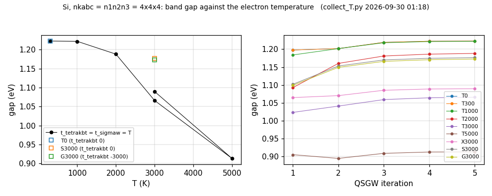
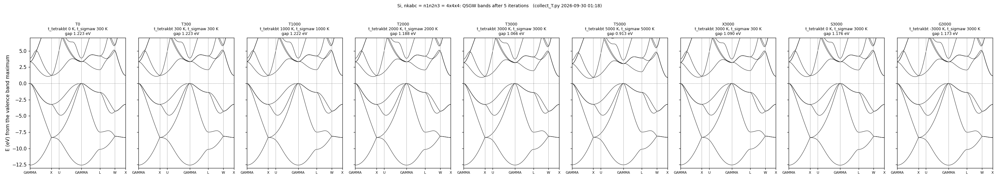
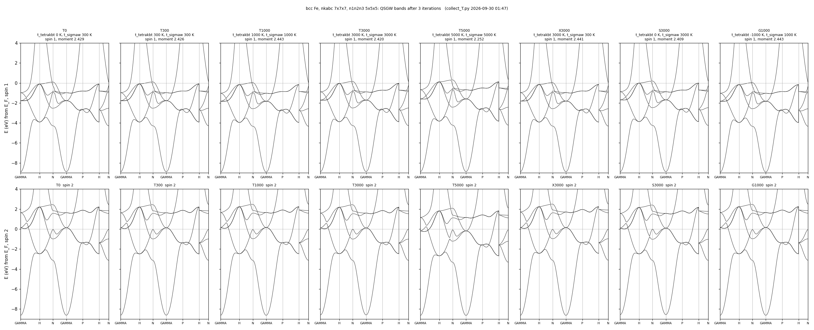

# 温度のスキャン — 同じ入力を電子温度だけ変えて QSGW で回す

`[gw]` の `t_tetrakbt`（χ0 側）と `t_sigmaw`（Σ 側）を変えると結果がどう変わるかを見るサンプル。
キーの意味は [`../README.md`](../README.md) の表 1、式は ecaljdoc の [kBT](https://ecalj.github.io/ecaljdoc/manual/kBT) §2・§3。

- 電子温度が入るのは χ0 と Σ だけ。`lmf` が作る密度は T = 0 の占有のままで、格子の温度（フォノン）も入らない
- k メッシュは粗く、反復も少ない（数分で回るサンプル）。数値は温度による変化を見るためのもので、収束した値ではない

## 回し方

```bash
# 設定は <ラベル>:<t_tetrakbt>:<t_sigmaw>。<作業場所>/<ラベル>/ で LDA から gwsc <反復> を回し、job_band でバンドを描く
bash scan_T.sh Si/ctrlg.si.toml <作業場所> 5 8 T0:0:300 T300:300:300 T1000:1000:1000 T3000:3000:3000
python3 collect_T.py <作業場所> si Si/si_T --title='Si 4x4x4'        # 表 (si_T_table.md)、数値 (si_T_data.npz)、図
```

- `scan_T.sh <入力> <作業場所> <反復の数> <CPU のランク数> <設定> ...`。GPU を使うときは `GWSC_OPT="--gpu --prec=fp32 -np2 1"`
- 入力には `t_tetrakbt` と `t_sigmaw` の行が両方要る（スクリプトがその 2 行を書き換える）
- 試験: `testecalj Si -np 8`（Si、3000 K、LDA から 1 反復。`QPU` と `log.si` を比べる。20 秒）

## 1. Si — ギャップは電子温度でどう変わるか

`Si/ctrlg.si.toml`（`nkabc` = `n1n2n3` = 4×4×4）、LDA から QSGW 5 反復。ギャップは SCF の k メッシュの上での最小のもの（`lmf` の出力）。

**表 1**. Si のギャップ（QSGW 5 反復後）。変化は 1 行目からの差。最後の列は 4 → 5 反復でのギャップの変化

| ラベル | `t_tetrakbt` (K) | `t_sigmaw` (K) | ギャップ (eV) | 変化 (meV) | 5 反復目の変化 (meV) |
| --- | --- | --- | --- | --- | --- |
| T0 | 0 | 300 | 1.223 | 0 | +0.4 |
| T300 | 300 | 300 | 1.223 | 0 | +0.4 |
| T1000 | 1000 | 1000 | 1.222 | −1 | +0.7 |
| T2000 | 2000 | 2000 | 1.188 | −35 | +2.0 |
| T3000 | 3000 | 3000 | 1.066 | −157 | +1.6 |
| T5000 | 5000 | 5000 | 0.913 | −310 | +0.3 |
| X3000（χ0 だけ 3000 K） | 3000 | 300 | 1.090 | −133 | +0.7 |
| S3000（Σ だけ 3000 K） | 0 | 3000 | 1.176 | −46 | +1.8 |
| G3000（χ0 は Gaussian） | −3000 | 3000 | 1.173 | −50 | +1.9 |



**図 1**. 左: Si のギャップと電子温度。右: 反復ごとのギャップ。数値は `Si/si_T_data.npz`



**図 2**. Si の QSGW バンド（5 反復後）。左から T0、T300、T1000、T2000、T3000、T5000。エネルギーの原点は価電子帯の頂上

- **300 K では T = 0 と変わらない**（ギャップの差は 0.001 meV 以下）。1000 K で −1 meV
- 2000 K から縮みが目立ち、3000 K で −0.16 eV、5000 K で −0.31 eV
- 価電子帯の形はほとんど変わらない（X の価電子帯の頂上は −3.218 → −3.230 eV）。伝導帯が価電子帯に対して全体に下がる
  （Γ の伝導帯の底は 3.339 → 3.186 eV。表 1 の全部の点は `Si/si_T_table.md`）
- **縮みの主な原因は χ0 側**: 3000 K の −157 meV のうち、χ0 だけを 3000 K にすると −133 meV、Σ だけだと −46 meV。
  ギャップを越えて熱励起されたキャリアが遮蔽に加わり、W が小さくなる
- χ0 を Gaussian で均す `t_tetrakbt = -3000` は、Σ だけの場合とほぼ同じ（−50 meV）。Gaussian は占有を変えないので、キャリアの遮蔽は入らない

## 2. bcc Fe — 金属のバンドと磁気モーメント

`Fe/ctrlg.fe.toml`（`nkabc` = 7×7×7、`n1n2n3` = 5×5×5、スピン分極）、LDA から QSGW 3 反復。

**表 2**. bcc Fe（QSGW 3 反復後）。バンドのエネルギーは E_F から（eV）。Γ の d は Γ のバンド 5・6（2 重縮退）

| ラベル | `t_tetrakbt` (K) | `t_sigmaw` (K) | 磁気モーメント (μ_B) | E_F(T) − E_F(0) (eV) | Γ の d、スピン 1 | Γ の d、スピン 2 | 交換分裂 (eV) |
| --- | --- | --- | --- | --- | --- | --- | --- |
| T0 | 0 | 300 | 2.429 | 0 | −0.978 | 1.641 | 2.619 |
| T300 | 300 | 300 | 2.426 | +0.006 | −0.973 | 1.631 | 2.604 |
| T1000 | 1000 | 1000 | 2.443 | +0.045 | −1.028 | 1.660 | 2.688 |
| T3000 | 3000 | 3000 | 2.420 | +0.272 | −0.890 | 1.602 | 2.492 |
| T5000 | 5000 | 5000 | 2.252 | +0.279 | −0.679 | 1.163 | 1.842 |
| X3000（χ0 だけ 3000 K） | 3000 | 300 | 2.441 | +0.258 | −0.967 | 1.709 | 2.676 |
| S3000（Σ だけ 3000 K） | 0 | 3000 | 2.409 | 0 | −0.879 | 1.571 | 2.450 |
| G1000（χ0 は Gaussian） | −1000 | 1000 | 2.443 | 0 | −1.031 | 1.654 | 2.685 |



**図 3**. bcc Fe の QSGW バンド（3 反復後）。上の段がスピン 1、下の段がスピン 2。左から表 2 の順。数値は `Fe/fe_T_data.npz`

- **300 K では T = 0 とほとんど変わらない**（バンドの差は 15 meV 以下、モーメントの差 0.003 μ_B）
- 1000 K までのバンドの動きは最大 63 meV で、温度について単調でない。5×5×5 のメッシュでは、E_F の近くのどの状態が分数占有になるかで
  この程度は動く（メッシュについての収束が要る。ecaljdoc kBT §9 の 1）
- 3000 K から交換分裂とモーメントが減る（5000 K で交換分裂 2.62 → 1.84 eV、モーメント 2.43 → 2.25 μ_B）
- **金属では Σ 側が効く**: 3000 K の交換分裂の変化 −0.13 eV は、Σ だけを 3000 K にした場合（−0.17 eV）に近く、χ0 だけでは +0.06 eV。
  Si（χ0 側が主）と逆である
- `t_tetrakbt = -1000`（Gaussian）と `t_tetrakbt = 1000`（有限温度）は、この温度ではほとんど同じ結果（対称点でのバンドの差は最大 7 meV）
- E_F(T) − E_F(0) は `EFERMI_kbt` と `EFERMI` の差（`heftet` の出力）

## ファイル

| ファイル | 中身 |
| --- | --- |
| `scan_T.sh`、`collect_T.py` | スキャンを回すスクリプトと、表・数値・図を作るスクリプト |
| `Si/ctrlg.si.toml`、`Fe/ctrlg.fe.toml` | 入力 |
| `Si/si_T_table.md`、`Fe/fe_T_table.md` | 集計の表（設定ごとのギャップやモーメント、対称点でのバンドのエネルギー） |
| `Si/si_T_data.npz`、`Fe/fe_T_data.npz` | 図に描いた数値（経路の座標、バンド、反復ごとのギャップ、Fermi 準位、計算したディレクトリ） |
| `Si/test.py`、`Si/QPU`、`Si/log.si` | `testecalj` の試験と参照 |

計算は 2026-09-30、gfortran、CPU 8 コア。1 つの設定が Si で 1.5〜3 分、Fe で 3〜7 分。
