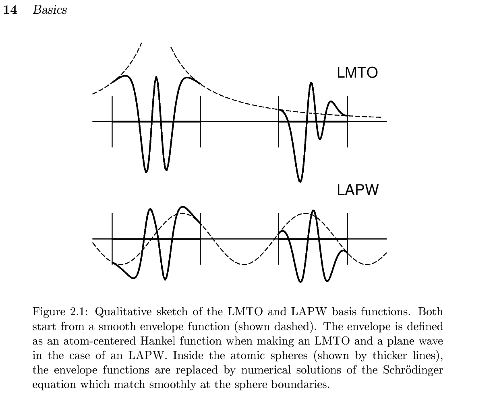
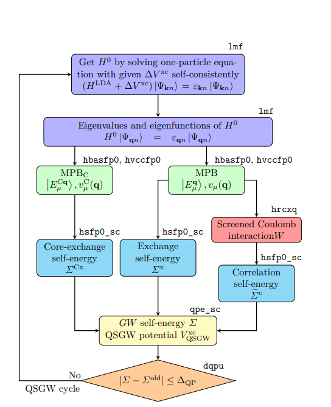
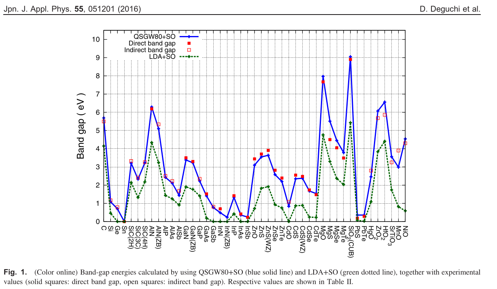
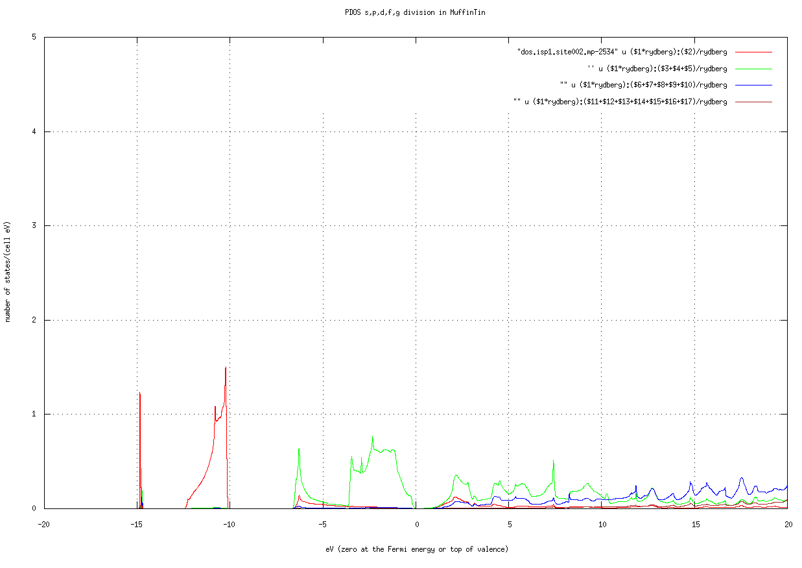
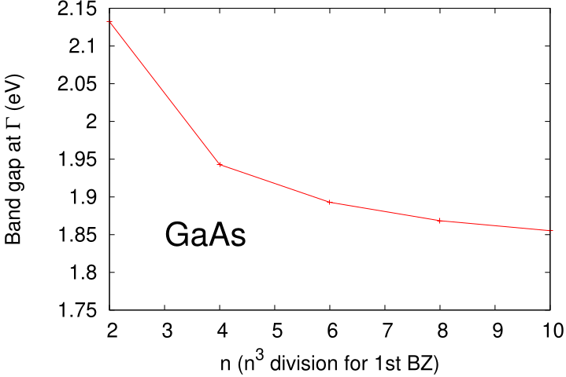

# ecalj MainDocument
**This is MainDocument of ecaljdoc. All files are linked from this file.**

> ⚠️ **TOML migration (2026-05)** — Fortran binaries now read `ctrlg.<sname>.toml` only. Examples below referring to `ctrl.<sname>` / `GWinput` are legacy; convert with `Legacy2toml.py <sname>` before running. See [TOML migration](./toml_migration) for the full guide, and migrated [Samples/](https://github.com/tkotani/ecalj/blob/main/Samples/README.md) (EPS, PROCAR, MLOsamples, TestInstall) as templates.

* Here we give [GetStarted](#getstarted), together with install and overview of QSGW.
* We have [UsageDetails](./UsageDetailed.md) in another file.
* [Qiita Japanese](https://qiita.com/takaokotani/items/9bdf5f1551000771dc48) may be a help, but most of all are shown here.
* When link did not work, go to https://github.com/tkotani/ecalj to download.

## Licence 
 [AGPLv3](https://www.gnu.org/licenses/agpl-3.0.html).  For publications, we hope to make a citation as;
    [1] ecalj package available from https://github.com/tkotani/ecalj/.

## AI agent

We use [Claude Code](https://claude.com/claude-code) to install
and use ecalj.  For cluster workflows (`qsub` / `sbatch` / `bash`
launchers), Claude Code handles job submission and monitors the
running jobs (tail logs, react to errors, restart on failure, etc.)
without you having to babysit the queue.

The TOML-aware doc and tooling — `ctrlgenToml.py`, `Legacy2toml.py`,
`testecalj`, the `ctrlg.<sname>.toml` schema annotations, much of
`ecalj_auto`'s slot scheduler — are co-developed with Claude Code in
the same way; many of the doc pages here also carry an explicit
"auto-edited by Claude" disclosure where appropriate.

## Install
To install ecalj, look into [install](../install/install.md), as well as [install for ISSP](../install/installISSP.md).

## Features of ecalj package

1. **All electron full-potential PMT method** 
   The PMT method means; a mixed basis method of two kinds of augmented waves, that is, APW+MTO.
   In other words, the PMT method= the linearized (APW+MTO) method, which is unique except the [Questaal](https://www.questaal.org/) having the same origin with ecalj. We found that MTOs and APWs are very comlementary, corresponding to the localized and the extented natures of eigenfunctions. That is, very localized MTOs (damping factor $\exp(-\kappa r)$ where $\kappa \sim 1 $ bohr$^{-1}$; this implies only reaching to nearest atoms) together with APWs (cutoff is $\approx 3$ Ry) works well to get reasonable convergences. We can perform atomic-position relaxation at GGA/LDA level. Because of including APWs, we can describe the scattering states very well. 
  (This fig is taken from [nfp-manual by M. Methfessel and M. van Schilfgaarde](../presentations/nfpmanual.pdf))
   Our current PMT formulation is given in

   [1][KotaniKinoAkai2015, PMT formalism](https://github.com/ecalj/ecaljdoc/blob/main/presentations/KotaniKinoAkai2015FormulationPMT.pdf)
   
   [2][KotaniKino2013, PMT applied to diatomic molecules](https://github.com/ecalj/ecaljdoc/blob/main/presentations/KotaniKino2013PMTMolecule.pdf).

   Since we have automatic settings for basis-set parameters, we don't need to be bothered with the parameter settings. Just crystal structures (POSCAR) are needed for calculations. 
   <!-- In principle, it is possible to perform reasonable calculations just from crystal structures and very minimum setting.  -->
    * Original PMT was started at https://journals.aps.org/prb/abstract/10.1103/PhysRevB.81.125117
    * PMT uses smooth Hankel functions described in [the smooth Hankel paper by E. Bott, M. Methfessel, W. Krabs, and P. C. Schmidt](https://github.com/ecalj/ecaljdoc/blob/main/presentations/Bott1988.pdf), which was used in [B][nfp paper by M. Methfessel and M. van Schilfgaarde, and R.A. Casali](https://github.com/ecalj/ecaljdoc/blob/main/presentations/nfp.pdf). Our PMT is on top them.
   *  In addition to PMT basis, we use local orbitals together.
   * The cutoff $\approx 3$ Ry may sound surprisingly small. However, note that high energy part of the plane wave methods are consumed only for the core like shape of eigenfunctions with negative curvatures of radial functions. Furthermore, the plane waves have difficulties not satisfying the periodic gauge https://arxiv.org/pdf/2010.03959. On the other hand, localized basis methods such as LMTO and Gaussians have difficulties to handle vacuum regions.

2. **PMT-QSGW method** 
   
   The PMT-QSGW means `the Quasiparticle self-consistent GW method (QSGW) based on the PMT method`. The development of [3] is the key to perform QSGW on the PMT. We can handle even magnetic metals. Since we have implemented ecalj on GPU, we can handle ~40 atoms with four GPUs.
   [3][Kotani2014, Formulation of PMT-QSGW method](https://github.com/ecalj/ecaljdoc/blob/main/presentations/Kotani2014QSGWinPMT.pdf)
   [4][D.Deguchi PMT-QSGW applied to a variety of insulators/semiconductors](https://github.com/ecalj/ecaljdoc/blob/main/presentations/deguchi2016.pdf)
   [5][M.Obata GPU implementation](https://arxiv.org/abs/2506.03477), where we treat Type II GaSb/InAs (40 atoms) with four GPUs.
   We can easily make band plots without the Wanneir kinds of interpolations. This is because an interpolation scheme of self-energy is internally built in.
   This is very essential to calculate physical quantities from eigenfunctions on top of the QSGW ground states.

   Since we treat all the electrons, we are not bothered with the ambiguities of the pseudopotentials.

3. **Dielectric functions and magnetic susceptibilities**
    We can calculate GW-related quantities such as dielectric functions, spectrum function of the Green's functions, Magnetic fluctuation, and so on. Since our QSGW can generate eigenfunctions and eigenvalues at any k points.

4. **The Model Hamiltonian with MLO** 
   We generate the effective model with MLO (muffin-tin based localized orbitals): the model Hamiltonian, and the effective
   interaction v, W and the cRPA W between MLOs (`job_mlo`, `job_mloW --crpa`; [MLO](./mlo)).
   * Until 2026-10-02 ecalj had maximally localized Wannier functions with cRPA (Juelich group's formulation), originally from
     codes by Dr. Miyake, Dr. Sakuma and Dr. Kino (a paper using it: https://journals.aps.org/prb/abstract/10.1103/PhysRevB.108.035141).
     MLO replaced them; they are at the git tag `last-wannier`. 

5. **Singleton pattern in fortran**
   The main part of our codes is in fortran. Our codes have the object-oriented structures respecting the singlton design pattern. We think this is a step to replace our fortran codes with those in modern languages such as JAX/PyTorch. Inevitably, we still have legacy codes but encapsulated as possible, and going to be replaced.

# Overview of QSGW 

* Band calculations (LDA level) are performed with the program `lmf`. The initial setting file is `ctrlg.<sname>.toml` (`<sname>` is the user-chosen material extension; legacy: `ctrl.<sname>`). Before running `lmf`, it is necessary to run `lmfa`, which is a spherically symmetric atom calculation to determine the initial conditions for the electron density (`lmfa` finishes instantaneously).
* A file `sigm.<sname>` is the key for QSGW calculations. The file `sigm.<sname>` contains the non-local potential $\Delta V_{\rm xc}=V_{\rm xc}^{\rm QSGW}-V_{\rm xc}^{\rm LDA}$. By adding this potential term to the usual LDA calculation performed by `lmf`, we can perform QSGW calculations. See figure below.
* Thus the problem is how to generate $V_{\rm xc}^{\rm QSGW}({\bf r},{\bf r}')$. This is calculated from the self-energy  $\Sigma({\bf r},{\bf r}',\omega)$, which is calculated in the GW approximation. Roughly speaking, we obtain $V_{\rm xc}^{\rm QSGW}({\bf r},{\bf r}')$ with removing the omega-dependence in $\Sigma({\bf r},{\bf r}',\omega)$.
* Therefore, the calculation of $V_{\rm xc}^{\rm QSGW}$ is the major part of the QSGW cycle, and is calculated in a double-structure loop. That is, there is an inner loop of `lmf`, and an outer loop to calculates $V_{\rm xc}^{\rm QSGW}$ using the eigenfunctions given by `lmf`. This outer loop can be executed with a python script called gwsc (which runs fortran programs). The computational time for QSGW is much longer than that of LDA calculation. 
As a rule of thumb, it takes about 10 hours for 20 atoms 
(depending on the number of electrons. For systems more than 10 atoms per cell or so, we recommend to use GPUs). 
* Here is the QSGW cycle shown in Figure 1 in https://arxiv.org/abs/2506.03477 . MPB meand the mixed product basis to expand products of eigenfunctions. 
 
* We have [GPU acceleration for QSGW](https://arxiv.org/abs/2506.03477), which also describe basics of QSGW.  QSGW algorism fits to GPU computations very well. With four GPUs, we can compute systems with 40 atoms per cell. (As for lmf part, GPUs are not efficiently used yet.). Our PMT allows us to handle large vaccum region for slab model.
* We can perform QSGW virtually without parameter settings by hands. Thus I think ecalj is one of the easiest to perform GW/QSGW. See band database in QSGW at https://github.com/tkotani/DOSnpSupplement/blob/main/bandpng.md (this is a supplement of https://arxiv.org/abs/2507.19189).  This is away from complete database, but showing the ability of ecalj.

 This is taken from  [4][D.Deguchi](https://github.com/ecalj/ecaljdoc/blob/main/presentations/deguchi2016.pdf)

In comparison with LDA, we see differences in QSGW;
* Band gap. QSGW tends to give slightly larger than experiments. It looks systematic as in the Figure above.
* Band width. Usually, sp bands are enlarged  (except very low density case such as Na).
    This is consistent with the case for homogeneous electron gas.
    Localized bands like 3d electrons get narrowed.
* Relative position of bands. e.g. O(2p) v.s. Ni(3d).
More localized bands tends to get more deeper.
Exchange splitting between up and down get larger (like LDA+U) .
In cases such as NiO, magnetic moment become larger; closer to experimental values.
* Hybridization of 3d bands with others. QSGW tends to make eigenfunctions localized.

However, reality is complexed, and not so simple in cases.

<!-- 
## 基礎知識check 
* LDA計算の流れ
* MT division of space
* 基底関数 MTOとAPW　（AugmentationとMT内の原子的な波動関数). 3つの成分をもつ。envelope + true - counter
* バンド計算法PMT=LMTO+LAPW法. ３つの成分で電荷も表現する。MTOの張る空間の不満足な部分を3Ry以下程度のAPWでサポートする。
* 独立粒子近似とは
* Hartree-Fock(HF)近似で水素Hがきちんと解ける。一様ガスではフェルミ面で状態密度がゼロになる。
* LDAでは一様ガスがきちんと解けるがHのバンドギャップはかなり小さい。
* LDAとHFは両極にある。HFではSiのバンドギャップは10eV以上（なぜか？）　ハイブリッド法HSE。自己相互作用。
* 交換項の重要性。H2のbonging-antibondingを区別するには、占有状態へのプロジェクタの役割をするFock項が重要
* GW近似. Fock項にくわえて相関項。分極媒質中を走る荷電粒子の感じる時間依存ポテンシャル。スクリーンHF+クーロンホール
　バンドギャップ、dバンドの位置、Uの効果
* QSGW法。GW近似における自己エネルギーからいくらか強引に時間依存性をとりのぞいて特殊な交換相関項をつくる。
* （できたら線形応答理論の基礎、ステップ関数のフーリエ変換、古典的な減衰振動系でのグリーン関数（線形応答関数）。）

## ecalj 何ができるか？

* LDA計算 
VWN,PBE-GGA,LDA+Uがえらべる。
構造緩和（格子変化は手動）、Colinear,  SOC(軸を選べる）, AFの対称性を入れることができる。
ESM法でのスラブ計算. 最適化しきれてないので現状では構造緩和などでは優位性がない。

* QSGW計算：
self-consistent GW法。特殊な交換相関項を作る計算であるといえる。
自己エネルギースペクトルプロット。
インパクトイオン化率（オージェによる寿命）。
GPU化、自動化セッテイング。
GW法でのバンドプロットが直接に可能。
QSGWでは現状全エネルギー計算ができない。バンド構造（固有値、波動関数）のみ。
* 線形応答などの計算。
RPAでの誘電率計算、スピンゆらぎ計算 （改良の余地。金属でもできる。ドルーデウエイト(q→0）
MLO による模型化（模型のハミルトニアン、v・W・cRPA。2026-10-02 に最局在 Wannier から置き換えた）。 自動化がすこしできてないところがある。
その他の物理量についても応用できるはず。
* かなりの部分で自動計算が可能。QSGW法ではMaterial Projectから1500個程度の構造ファイルを持ってきて自動化でQSGW計算しているが
ほぼ問題なく可能。個別にセッティングを手動でいじらなくても良い（4f,5fについては自動化がまだ設定できてないが基本的に可能）
バンドプロットも対称ラインも含め自動化してある。データはgnuplotなどでプロットするので読みやすい。結晶構造についてはPOSCARとの相互コンバータあり。
複数のPOSCARを一括計算するecalj_autoも梱包してある（整備中）。 -->


# GetStarted
Here we explain DFT/QSGW calculations with ecalj. Then we explain how to make band plots. For simplicity, we treat paramagetic cases (nsp=1), no 4f, no SOC.
We explain things step by step.

> **Worked example** — every step below uses **GaAs** as the running
> example. A minimal seed (`ctrls.gaas` + the generated
> `ctrlg.gaas.toml`) lives at
> [`Samples/GetStarted/GaAs/`](https://github.com/tkotani/ecalj/tree/main/Samples/GetStarted/GaAs).
> Copy that directory to a fresh work area and follow Steps 1-6
> below. See its
> [README](https://github.com/tkotani/ecalj/blob/main/Samples/GetStarted/GaAs/README.md)
> for the one-shot reproduction script.

Further details are explained at [UsageDetailed](./UsageDetailed.md)

## Step 0. Get POSCAR
We first need POSCAR (crystal structure in VASP format). 
You can find samples of POSCAR in ecalj/ecalj_auto/INPUT/testSGA/POSCARALL as
```bash
cd ecalj
mkdir TEST
cd TEST
mkdir test1
mkdir test2
cat ecalj_auto/INPUT/testSGA/joblist.bk
cp ../ecalj_auto/INPUT/testSGA/POSCARALL/POSCAR.mp-2534 test1
cp ../ecalj_auto/INPUT/testSGA/POSCARALL/POSCAR.mp-8062 test2
```

For example, POSCAR of mp-2534 GaAs is given as:
```
Ga1 As1
1.0
   3.5212530000000002    0.0000000000000000    2.0329969999999999
   1.1737510000000000    3.3198690000000002    2.0329969999999999
   0.0000000000000000    0.0000000000000000    4.0659929999999997
Ga As
1 1
direct
   0.0000000000000000    0.0000000000000000    0.0000000000000000 Ga
   0.2500000000000000    0.2500000000000000    0.2500000000000000 As

```

This is POSCAR for ba2pdo2cl2 (QSGW results are shown below):
```
POSCAR_ba2pdo2cl2
1.0
-2.06443 2.06443 8.40383 
2.06443 -2.06443 8.40383 
2.06443 2.06443 -8.40383 
Ba Pd O Cl 
2 1 2 2 
Cartesian
0.0 0.0 6.5153213224
0.0 0.0 10.2923386776
0.0 0.0 0.0
0.0 2.06443 0.0
2.06443 0.0 0.0
0.0 0.0 3.1625293056
0.0 0.0 13.6451306944
```

If you have cif and like to convert it to `POSCAR`, do
`cif2cell foobar.cif -p vasp --vasp-cartesian --vasp-format=5`.


## Step 1. convert POSCAR to ctrls
Then we convert POSCAR to ctrls by vasp2ctrl.
ctrls is the structure file used in ecalj.

```
vasp2ctrl POSCAR.mp-2534 
mv ctrls.POSCAR.mp-2534.vasp2ctrl ctrls.POSCAR.mp-2534
cat ctrls.mp-2534
```

ctrls.mp-2534 contains crystal structure equivalent to POSCAR:
```
STRUC
     ALAT=1.8897268777743552
     PLAT=       3.52125300000       0.00000000000       2.03299700000  
                 1.17375100000       3.31986900000       2.03299700000 
                 0.00000000000       0.00000000000       4.06599300000 
SITE
     ATOM=Ga POS=     0.00000000000       0.00000000000       0.00000000000 
     ATOM=As POS=     1.17375100000       0.82996725000       2.03299675000 
```
Indentation is needed to show blocks of categories, STRUC and SITE.
Another example of `ctrls.gaas` (the worked-example seed shipped at
[`Samples/GetStarted/GaAs/ctrls.gaas`](https://github.com/tkotani/ecalj/blob/main/Samples/GetStarted/GaAs/ctrls.gaas)):

```
%const bohr=0.529177 a=5.65325/bohr
STRUC
     ALAT={a}
     PLAT=0 0.5 0.5 0.5 0 0.5 0.5 0.5 0
SITE
    ATOM=Ga POS=0.0 0.0 0.0
    ATOM=As POS=0.25 0.25 0.25
```
ctrls.srtio3:
```
%const au=0.529177
%const a0=2*1.95/au v=a0^3 a1=v^(1/3)
STRUC ALAT={a1}
   PLAT=1 0 0 0 1 0 0 0 1
SITE
   ATOM=Sr POS=1/2 1/2 1/2
   ATOM=Ti POS= 0 0 0
   ATOM=O POS=1/2 0 0
   ATOM=O POS= 0 1/2 0
   ATOM=O POS= 0 0 1/2
```

`%const` lines define run-time variables expanded by `ctrlgenToml.py`
(and the legacy `ctrlgenM1.py`).  Multiple definitions on one line are
fine, math operators (`+ - * / ** ^`) and `sin / cos / log / sqrt / pi`
are evaluated, and earlier defines are visible to later ones (so
`a0=2*1.95/au` works because `au` was defined on the previous
`%const` line).  `1/3` is float division (Python 3), so
`v^(1/3) ≡ v**(1/3)` is the cube root.

> **Gotcha** — do **not** use empty-value placeholders like
> `%const x= y=...`.  An entry with no right-hand side merges with
> the next token and silently breaks the rest of the line (so `y`,
> `z`, ... never get defined).  Either drop the empty entry or assign
> a real value (`%const x=0 y=...`).

The default names of atomic species are shown by `ctrlgenToml.py --showatomlist`.
Instead of such default symbols, we can use your own symbol as
```
SITE
   ATOM=M1 POS=1/2 1/2 1/2
   ATOM=M2 POS= 0 0 0
   ATOM=O POS=1/2 0 0
   ATOM=O POS= 0 1/2 0
   ATOM=O POS= 0 0 1/2
SPEC
   ATOM=M1 Z=38
   ATOM=M2 Z=22
   ATOM=O Z=8
```
, where we need SPEC. Thus AF magnetic NiO is given as
```
%const bohr=0.529177 a=7.88
STRUC 
   ALAT={a} PLAT= 0.5 0.5 1.0 0.5 1.0 0.5 1.0 0.5 0.5
SITE 
   ATOM=Niup POS= .0 .0 .0
   ATOM=Nidn POS= 1.0 1.0 1.0
   ATOM=O POS= .5 .5 .5
   ATOM=O POS= 1.5 1.5 1.5
SPEC
   ATOM=Niup Z=28 MMOM=0 0 1.2 0
   ATOM=Nidn Z=28 MMOM=0 0 -1.2 0
   ATOM=O Z=8 MMOM=0 0 0 0
```
. If you like to use antiferro symmetry (only calculate up band only, and generate down band). 
See [AFsymmetry](./UsageDetailed.md#antiferro-symmetry-without-soc).  MMOM is the initial condition of magnetic moments at sites.
The numbers (here 1.2) can be not so accurate (just integers or so).
Samples are in [Samples/MATERIALS](#samples-materials-lda-and-mlo-samples-of-65-materials). Simple materials first. But it is not so difficult
to reproduce results by VASP or in MP from your POSCAR file.


- MEMO: 
    - ctrl2vasp ctrl.mp-2534 can convert back to VASP file. Check this by VESTA. We can use viewvesta (convert and invoke VESTA).
    - many unused files are generated (forget them).
    - you can use any name for sites such as [Niup or something](./UsageDetailed.md#antiferro-symmetry-without-soc), in such a case you have to set SPEC section in addition. [Non integer number of Z is allowed.](./UsageDetailed.md#background-charge-and-fractional-z). Learn afterward.
    - In old ctrls, you may see NL,NBAS,NSPEC, which are not necessary now.

## Step 2. Get `ctrlg.<sname>.toml` from ctrls

`ctrlg.<sname>.toml` is the one input file the Fortran
binaries (`lmf`, `lmfa`, `lmchk`, `gwsc`, ...) actually read since
2026-05. (Its last section `[product_basis]` ends with per-atom tables
used only by GW; the generator writes them and we do not edit them
usually.) Generate it straight from the lightweight `ctrls.<sname>`
(the structure-only seed produced by `vasp2ctrl` in Step 1) with
**`ctrlgenToml.py`**:

```bash
ctrlgenToml.py mp-2534
```

(Or, for the GaAs worked example shipped at
[`Samples/GetStarted/GaAs/`](https://github.com/tkotani/ecalj/tree/main/Samples/GetStarted/GaAs):
`ctrlgenToml.py gaas` — produces the
[`ctrlg.gaas.toml`](https://github.com/tkotani/ecalj/blob/main/Samples/GetStarted/GaAs/ctrlg.gaas.toml)
that ships in that directory.)

This single command:

1. fills top-level (`symgrp` / `verbose` / `time`) and `[struc] / [[site]] / [[spec]]` from the periodic-table
   defaults (the same `atomlist` table that `ctrlgenM1.py` uses);
2. internally runs `lmfa → lmf --jobgw=0 → gwinit` to populate
   `[gw] / [mlo] / [blocks] / [product_basis]` (the last one including the
   per-atom tables `nlx` / `valence` / `core`);
3. writes `ctrlg.<sname>.toml` and stops.

Successful end-of-run looks like:

```text
ctrlgenToml: wrote ctrlg.mp-2534.toml (2 spec, 2 sites)
ctrlgenToml: running lmfa -> lmf --jobgw=0 -> gwinit  to fill GW sections
ctrlgenToml: done. ctrlg.mp-2534.toml has top-level/[struc]/[[site]]/[[spec]]/...
             plus [gw]/[mlo]/[blocks]/[product_basis] (incl. nlx/valence/core).
```

**Recommended workflow**: run `ctrlgenToml.py <sname>` with **no other
flags** to get the defaults, then **edit `ctrlg.<sname>.toml`
afterwards** — the file is fully commented and TOML-typed, so
in-place edits in your editor are the natural path. **The CLI flags
listed by `ctrlgenToml.py --help` are bake-in equivalents of those
edits, not requirements.** They are useful when scripting / batch-
generating many materials, but for normal interactive use leave them
off and edit the generated `ctrlg.<sname>.toml` keys directly.

The `nlx` / `valence` / `core` tables at the end of `[product_basis]` are
consumed only on the GW path and **do not normally need hand editing**;
leave them as generated.

Pure DFT / no-GW directory? Add `--skipgw`:

```bash
ctrlgenToml.py <sname> --skipgw   # ctrlg.<sname>.toml without [gw]/[mlo]/[blocks]/[product_basis]
```

To add the GW sections later **without losing the ctrl-side edits
you have made in the meantime**, use `--addgw`:

```bash
ctrlgenToml.py <sname> --addgw    # appends [gw]/[mlo]/[blocks]/[product_basis] in place;
                                  # ctrl-side keys ([bz], [ham], [[spec]], ...)
                                  # are preserved verbatim.
```

`--addgw` refuses to run if `[gw]` is already present (to avoid
silent duplication). **Do not** plain re-run `ctrlgenToml.py <sname>`
for this purpose: the default flow overwrites the whole
`ctrlg.<sname>.toml` from `ctrls.<sname>` (the previous file is
moved to `ctrlg.<sname>.toml.bakup`, one-generation backup only —
your edits would be in there but you'd have to merge them back by
hand).

Common edits in `ctrlg.<sname>.toml`:

1. `[bz].nkabc` — k-mesh (LDA).
2. `[ham].nspin` — 2 for magnetic, 1 nonmagnetic.
3. `[ham].so` — 0 / 1 (full L·S) / 2 (Lz·Sz only); needs `nspin = 2`.
   `so=1` does not yet support QSGW; for QSGW + SOC, run with `so=0`
   or `so=2` to obtain `sigm.<sname>`, then set `so=1`.
4. `[ham].xcfun` — 1 = VWN, 2 = Barth-Hedin (default), 103 = PBE-GGA.
5. `[ham].scaledsigma` — QSGW mixing. `1.0` = full QSGW, `0.8` = QSGW80.
   `(scaledsigma) × (V_xc^QSGW − V_xc^LDA)` is added to the lmf
   Hamiltonian whenever a `sigm.<sname>` file is present.
6. `[gw].n1n2n3` — GW k-mesh; smaller than `[bz].nkabc` (1/2 or 2/3).
7. LDA+U: add `idu / uh / jh` arrays inside `[[spec]]`; see the
   [LDA+U section in `lmf.md`](./lmf).

A key is overridden for one run by `--ctrlg:<section.key>=<value>` on the command line, see [TOML migration](./toml_migration#run-time-ctrlg-overrides):

```bash
# OLD (legacy ctrl + %const; the programs stop)
lmf si -vnk=8 -vmetal=3 -vnspin=2

# NEW (TOML path; processed in-memory, no on-disk rewrite)
lmf si --ctrlg:bz.nkabc=[8,8,8] --ctrlg:bz.metal=3 --ctrlg:ham.nspin=2
```

> ⚠️ **CAUTION** — `-v` *used to* override a `%const NAME=...` symbol
> declared inside the legacy `ctrl.<sname>` (`{NAME}` then expanded
> wherever it was referenced). Under TOML, **the override points directly at
> a TOML path** (`--ctrlg:section.key=val`); there is no `%const`
> indirection. With `-vmetal=3` the programs stop with a message that
> names the new form — use `--ctrlg:bz.metal=3`. See the
> [CAUTION block on toml_migration](./toml_migration#run-time-ctrlg-overrides).

* `lmchk mp-2534 --ctrlg:verbose=60` allows you to check the recognized symmetries.
  (Legacy `lmchk --pr60 mp-2534` is retired — the `--pr=N` shortcut now aborts
  with a migration hint; use `--ctrlg:verbose=N` instead.)

At this point, you can visually check:

* `SiteInfo.lmchk` — MT radii, atomic positions
* `PlatQlat.chk` — primitive lattice vectors (plat) and reciprocal (qlat)

[Detailed reference for every key in `ctrlg.<sname>.toml`](./lmf).

> **`ctrlgenToml.py` ↔ `ctrlgenM1.py` (legacy)** — `ctrlgenToml.py`
> takes the periodic-table defaults from the file `ctrlgenM1.py` (atomlist
> extracted at runtime).  `ctrlgenM1.py` itself does not generate
> `ctrl.<sname>` any more: it prints a pointer to `ctrlgenToml.py` and
> exits.  Old directories that already have
> hand-edited `ctrl.<sname>` (or `ctrl.<sname>` + `GWinput`) decks are
> converted by `Legacy2toml.py <sname>`.  See
> Step 2-Migration below.

### Step 2-Migration. Existing `ctrl.<sname>` (and optional `GWinput`)

If you start from an old working directory that already has a
hand-edited `ctrl.<sname>` (and possibly `GWinput`), don't rebuild
from `ctrls`; convert in place:

```bash
Legacy2toml.py mp-2534
```

This walks `ctrl.<sname>` and (if present) `GWinput` and emits
`ctrlg.<sname>.toml`.  It is idempotent and prints
`[INFO] / [WARN] / [ERROR]` diagnostics for any `%const` / `-v`
overrides that won't survive as-is.  See
[TOML migration](./toml_migration) for the full key map.

### Install VESTA 
It is convenient to see crystal structures with VESTA.
(I installed VESTA-gtk3.tar.bz2 (ver. 3.5.8, built on Aug 11 2022, 23.8MB) on ubuntu 24)
At ecalj/StructureTool/, we have 'viewvesta' command.
Try
```
viewvesta ctrlg.si.toml      # canonical (post-2026-05)
viewvesta ctrls.si           # legacy structure-only seed file
```
to see the structure in VESTA. The converters `vasp2ctrl` / `ctrl2vasp` (also in `/StructureTool`) accept the same TOML / ctrls / ctrl input forms.
<small>(We have ~/ecalj/GetSyml/README.org. but Users do not need to read this.)</small>


## Step 3. LDA calculation
1. Run lmfa at first. It is for spherical atomic electron densities, contained in the crystals. lmfa ends instantaneously.
   ```bash
   lmfa mp-2534
   ```
   gives spherical atom calculation for initialization.  `lmfa` reads
   `ctrlg.mp-2534.toml` (auto-detected if omitted, when there is exactly
   one `ctrlg.*.toml` in the cwd) and generates the files required for
   `lmf` below.
   Check `conf ` section in the console output as
   ```bash
   lmfa mp-2534 |grep conf
   ```
   . This shows atomic configuration (there are no side effects even if you run `lmfa` repeatedly) as 
   ```
   conf:------------------------------------------------------
   conf:SPEC_ATOM= Ga : --- Table for atomic configuration --- (n and nz are Pr. Quantum numbers for valence) 
   conf:  isp  l    n nz    Qval     Qcore   CoreConf 
   conf:    1  0    4  0    2.000    6.000 => 1,2,3,
   conf:    1  1    4  0    1.000   12.000 => 2,3,
   conf:    1  2    4  3   10.000    0.000 => 
   conf:    1  3    4  0    0.000    0.000 => 
   conf:    1  4    5  0    0.000    0.000 => 
   conf: Species  Ga       Z=  31.00 Qc=  18.000 R=  2.230000 Q=  0.000000 nsp= 1 mom=  0.000000
   conf: rmt rmax a=  2.230000  49.011231  0.015000 nrmt nr= 661 867
   conf: Core rhoc(rmt)= 0.001940 spillout= 0.001839
   conf:------------------------------------------------------
   conf:SPEC_ATOM= As : --- Table for atomic configuration --- (n and nz are Pr. Quantum numbers for valence) 
   conf:  isp  l    n nz    Qval     Qcore   CoreConf 
   conf:    1  0    4  0    2.000    6.000 => 1,2,3,
   conf:    1  1    4  0    3.000   12.000 => 2,3,
   conf:    1  2    4  0    0.000   10.000 => 3,
   conf:    1  3    4  0    0.000    0.000 => 
   conf:    1  4    5  0    0.000    0.000 => 
   conf: Species  As       Z=  33.00 Qc=  28.000 R=  2.330000 Q=  0.000000 nsp= 1 mom=  0.000000
   conf: rmt rmax a=  2.330000  49.695135  0.015000 nrmt nr= 675 879
   conf: Core rhoc(rmt)= 0.011286 spillout= 0.017467
   ```
   With this table, you can see the number of valence electrons of initial condition for Ga are 2,1, and 10 for 4s,4p, 4d+3d(with local orbital). 
   Core configulation and charges are shown as well. Q=0 means satisfying charge neutrality. 
   * lmfa calculates spherical atoms (virtually $r \to \infty$), and calculate logarithmic derivatives at MT boundaries, stored into `atmpnu.*`. 
   * The initial electron density for lmf is given as the superposition of the spherically symmetric atomic densities given by lmfa. 
   * When [`[ham].readp = true`](./lmf.md#readp-option) (set by `ctrlgenToml.py` by default; legacy `READP=T` was the same), we keep the logarithmic derivative of the radial wave function at MT boundaries fixed.

2. After `lmfa`, we run LDA calculation as:

   ```bash
   mpirun -np 8 lmf mp-2534
   ```
   It will finish with several seconds. Then we see   
   ```bash
   it 10  of 80    ehf=   -8398.499465   ehk=   -8398.499466
   From last iter    ehf=   -8398.499464 ehk=   -8398.499465
   diffe(q)= -0.000001 (0.000004)    tol= 0.000010 (0.000010)   more=F
   c ehf(eV)=-114268.304015 ehk(eV)=-114268.304037 sev(eV)
   ```
   Here `c ` is the sign that `diffe(q)`,which shows the changes of energy and charge from the previous iteration, is less than the criterion, that is, converged. save.mp-2534 contains a line per iteration. We see it takes 10 times to have convergence. We show [two energies](./lmf.md/#q-should-the-harris-foulkes-and-hohenberg-kohn-sham-functionals-agree-at-self-consistency), which should be the same.
   * Note: mp-2534 (GaAs) gives 5.75 $\AA$ for GaAs, while the experimental value is 5.65$\AA$. I guess this is a PBEsol problem.
   * llmf contains information of iterations (since I use tee command above), check eigenvalue and fermi energies, band gap.
   * rst.mp-2534 is generated. Self-consistent charge included.
   * You can change lattice constant by editing `[struc].alat` in
     `ctrlg.mp-2534.toml`. Math operators in TOML scalars are not
     evaluated; precompute the value (e.g. `alat = 10.6818`) or use
     `--ctrlg:struc.alat=10.6818` at run-time. The legacy `ctrl.<sname>`
     `%const` math (`1.8897268777743552*5.65/5.75` etc.) was baked in
     at `Legacy2toml.py` time.
   * Note (historical): `ctrlp.<sname>` was an intermediate file
     generated by `ctrl2ctrlp.py` from the legacy `ctrl.<sname>`. As of
     2026-05 the Fortran reads `ctrlg.<sname>.toml` directly via
     `m_ctrl_toml_loader.f90`; no `ctrlp` step occurs.
   * check save.mp-2534. Show history of lmfa and lmf. one line per iteration. Show your console options. c,x,i,h
   LDA energy shown two values need to be the same (but slight difference).
   Repeat lmf stops with two iteration.
   * SiteInfo.lmchk : Site infor
   * PlatQlat.chk : Lattice info
   * efermi.lmf: the Fermi energy 
   * estaticpot.dat : electrostatic potential of smooth part.
   * __mixm* is the mixing file containing history of iteration.
   * If you restart lmf again, it automatically read rst file. Thus it should be already converged-- to make it sure, it stops after two iterations.  
Be careful about the definition of zero level of the one-body potential. We set the average of electrostatic potential at MT boundaries are zero. 
`__*` are temporary files, which can be deleted. 
As for the console out put, you see
```
...
 bndfp: kpt     1 of    29 k=  0.0000  0.0000  0.0000 ndimh = nmto+napw =    82   55   27
 bndfp: kpt     2 of    29 k=  0.0355 -0.0126  0.0000 ndimh = nmto+napw =    79   55   24
 bndfp: kpt     3 of    29 k=  0.0710 -0.0251  0.0000 ndimh = nmto+napw =    82   55   27
 bndfp: kpt     4 of    29 k=  0.1065 -0.0377  0.0000 ndimh = nmto+napw =    83   55   28
 bndfp: kpt     5 of    29 k=  0.1420 -0.0502  0.0000 ndimh = nmto+napw =    89   55   34
 bndfp: kpt     6 of    29 k=  0.0355  0.0251  0.0000 ndimh = nmto+napw =    78   55   23
 bndfp: kpt     7 of    29 k=  0.0710  0.0126  0.0000 ndimh = nmto+napw =    80   55   25
...
```
, where we see the Hamiltonian dimensions. When PWMODE=11, we have q-dependent energy cutoff of APWs by |q+G|^2< pwemax. (In our code, we use Rydberg $2m=\hbar=e^2/2=1$). 

* NOTE: In defaults given by ctrlgenToml.py, all the calculation are by  
   >No empty spheres. 
   >EH=-1,EH=-2, MT radius is -3% untouching.
   >RSMH=RSMH2=R/2

   We do not claim this setting is the best, however, non-linear optimization is very problematic. We do not like to do one by one optimizaiton.
   Changing this setting might require extensive systematic study.

### job_tdos, job_pdos
You can calculate total dos by
```
job_tdos mp-2534 -np 8
gnuplot -persist tdos.mp-2534.glt
```
and pdos by
```
job_pdos mp-2534 -np 8
```
`job_pdos` is a little expensive because symmetry is not used. After finished, `gnuplot -p pdos.site001.mp-2534.glt` shows the PDOS resolved into $lm$ channels
of real harmonics (shown at the end of `job_pdos`).
.This is PDOS at As site of mp-2534.
Be careful about the number of k points. You may need to enlarge the
mesh for accurate DOS / PDOS. Pass it on the command line with the
TOML-path syntax:
`job_tdos mp-2534 -np 8 --ctrlg:bz.nkabc=[10,10,10]`.
Check by `grep '^bz.nkabc\|^nkabc' llmf_tdos` and look at `save.mp-2534`.

## Step 4. Create k-path and Brillouin zone for band plot
After `lmf` converges, make a band plot with `job_band` explained later on. The normality of the calculation of bands can be confirmed by the band plot (for magnetic systems, check the total magnetic moment and the magnetic moment for each site).

Before `job_band`, run ```getsyml gaas```. Install any missing packages with pip. It is on spglib by Togo and seekpath. After finished, view BZ.html. It shows the k-path in the BZ. We show an example for ba2pdo2cl2 in the figure below. 
It is an interactive figure written with plotly, so you can read the coordinate values.

```
getsyml foobar
```
(`foobar` here matches the `<sname>` in `ctrlg.<sname>.toml`.)

* Samples of BZ.html by getsyml are seen at 
https://ecalj.sakura.ne.jp/BZgetsyml/


## Step 5. band plot
（this is a case for ba2pdo2cl2 ）
```
>job_band ba2pdo2cl2 -np 8
```

A gnuplot script can be created. Edit it if necessary. If you edit syml.ba2pdo2cl2 before `job_band`, you can adjust the symmetry line and mesh size.

* The following picture is the LDA bands for the default calculation of ba2pdo2cl2 (the names of the symmetric points can be confirmed with BZ.html. In addition, look into `syml.<sname>`). 0 eV is the Fermi energy. Since this is metallic, we see no band gap.
.


Here we are talking about band energies.

* In ecalj, the k mesh for `lmf` (`[bz].nkabc` in `ctrlg.<sname>.toml`) and the k mesh for GW (`[gw].n1n2n3`) can be different. The former affects LDA wall-time only weakly; the latter has a large effect (so we want to reduce `[gw].n1n2n3`).

* In ecalj's band plot mode, theoretically degenerated bands because of symmetry at the BZ edge are not degenerated. This is because there are limited numbers of APW basis functions, so run the band plot with pwemax=4, etc. (Temporary solution: We want to automate it).


### job_tdos, job_fermisurface, job_pdos
`job_pdos` calculates PDOS, `job_tdos` calculates total DOS, and `job_fermisurface` draws the Fermi surface with Xcrysden.
`job_fermisurface` can be used to draw the shape of the CBM bottom as ellipsoid of Si.
xxx 

<!-- ### job_pdos,job_tdos, job_fermisurface 
For band plot, we use job_band. Before this, we need to generate symmetry lines written in [`syml.<sname>`](./syml). This can be generated by `getsyml <sname>`.

This generates syml.mp-2534.
[BZ.html](https://ecalj.sakura.ne.jp/BZgetsyml/) contains BZ and symmetry lines.
For bandplot,
```
job_band mp-2534 -np 8 [options]
```
At the end of job_band, you can add TOML overrides for lmf as `--ctrlg:ham.so=1 --ctrlg:ham.nspin=2`.
(these are for SOC as perturbation)
We use gnuplot for band plot bandplot.isp1.glt.

In the similar manner, we can run job_pdos, job_tdos, job_fermisurface. -->


## Step 6. QSGW calculation

We now run QSGW calculations. QSGW is computationally very expensive,
so we recommend running smaller systems first.

> The GW driver inputs are **inside** the same
> `ctrlg.<sname>.toml`, in sections `[gw]`, `[mlo]`, `[blocks]` and
> `[product_basis]`; `ctrlgenToml.py` (Step 2) has written them. The legacy
> separate `GWinput` text file is not
> parsed by Fortran.  If you started from an old directory with
> `ctrl.<sname>` + `GWinput`, `Legacy2toml.py <sname>` (Step 2-Migration)
> already merged the GW content for you.  If `ctrlg.<sname>.toml` has no GW
> sections (made with `--skipgw`, or converted from a directory with only
> `ctrl.<sname>`) and you want a default GW set-up, run:
>
> ```bash
> ctrlgenToml.py mp-2534 --addgw     # appends [gw]/[mlo]/[blocks]/[product_basis] to ctrlg.mp-2534.toml
> ```

`[gw]` carries two temperatures in kelvin, `t_sigmaw` (Fermi-Dirac width
of the levels in the self-energy) and `t_tetrakbt` (how $\chi_0$ is
smeared; **required**, the programs stop without it). The generated file
has 300 for both. For semiconductors and insulators use `t_tetrakbt = 0`
(the tetrahedron method at T=0); for metals see [kBT](./kBT).

The key you most often tweak before launching QSGW is the GW
k-mesh, `[gw].n1n2n3`, kept smaller than `[bz].nkabc` (typically 1/2
or 2/3 of it) since it dominates wall-time:

```toml
[bz]
nkabc = [12, 12, 12]      # LDA k-mesh

[gw]
n1n2n3 = [6, 6, 6]        # GW k-mesh (smaller -> faster)
```

For Si, `n1n2n3 = [6, 6, 6]` is good; the rest of `[gw]` rarely needs
touching for non-magnetic semiconductors. The legacy GWinput key
mapping lives in [`lmf.md` § Legacy ctrl.&lt;sname&gt; ↔ TOML path map](./lmf#legacy-ctrl-lt-sname-gt-toml-path-map),
and the keys of `[gw]` are described in [`gwinput.md`](./gwinput).
Here is a convergence behavior of the band gap for GaAs  taken from Ref.[3],
 
From this picture, I may say 4 4 4 is not so bad if we assume ~0.1eV accuracy. 6 6 6 is good. More than 8 8 8 is for numerical check(not fruitful for practical applications).


### Flow of QSGW calculation with the script gwsc
We run the QSGW calculations with gwsc. For semiconductors, several QSGW iterations are fine, close enough to final results.
QSGW is to obtain band structures (or one-body Hamiltonian), the total energy is not yet.

`QPU` file contains diagonal components of GW calculations.
Note that our `Mixed Produce basis` is a key technology for the GW calculation.
```
gwsc -np NP [-np2 NP2] [--gpu] [--prec=tf32|fp32|fp64] nloop extension
```
(`--gpu` uses the GPU programs, and `--prec` chooses their precision; see [gwsc](./gwsc).
For magnetic materials wanting the same basis for up and down, set
`[ham] phispinsym = true` in `ctrlg.<sname>.toml`, or pass
`--ctrlg:ham.phispinsym=true` at run time.)


Then console outputs of `gwsc` is somthing like
```text
--- Start gwsc ---
option= []
gwsc: using ctrlg.si.toml (TOML mode)
### START gwsc: ITERADD= 1, MPI size=  2, 2 TARGET= si
===== Ititial band structure ====== 
--> No sigm. LDA caculation for eigenfunctions 
00:00:00.007   mpirun -np 1 /home/takao/bin/lmfa si stdout='llmfa'  Elap. 1.5s
00:00:01.481   mpirun -np 2 /home/takao/bin/lmf si --ctrlg:iter.b=0.5 stdout='llmf_lda'  Elap. 6.1s
lmf successful with b=0.5
Removing __mixm.si
00:00:07.563   mpirun -np 2 /home/takao/bin/lmf si --jobgw=0 stdout='llmfgw00'  Elap. 1.8s
00:00:09.335   mpirun -np 1 /home/takao/bin/qg4gw si --job=1 stdout='lqg4gw'  Elap. 1.0s
===== QSGW iteration start iter 1 === (GW precision fp64)
00:00:10.381   mpirun -np 2 /home/takao/bin/lmf si --jobgw=1 stdout='llmfgw01'  Elap. 3.7s
00:00:14.042   mpirun -np 1 /home/takao/bin/heftet si --job=1 stdout='leftet'  Elap. 1.1s
00:00:15.193   mpirun -np 1 /home/takao/bin/hbasfp0 si --job=3 stdout='lbasC'  Elap. 1.4s
00:00:16.570   mpirun -np 2 /home/takao/bin/hvccfp0 si --job=3 stdout='lvccC'  Elap. 1.4s
00:00:17.966   mpirun -np 2 /home/takao/bin/hsfp0_sc si --job=3 stdout='lsxC'  Elap. 1.9s
00:00:19.862   mpirun -np 1 /home/takao/bin/hbasfp0 si --job=0 stdout='lbas'  Elap. 2.1s
00:00:21.973   mpirun -np 2 /home/takao/bin/hvccfp0 si --job=0 stdout='lvcc'  Elap. 2.5s
00:00:24.472   mpirun -np 2 /home/takao/bin/hgw si --jobgw=1 stdout='lgw'  Elap. 4.8s
00:00:29.276   mpirun -np 1 /home/takao/bin/hqpe_sc si stdout='lqpe'  Elap. 1.5s
Using cached b-value 0.5 for /home/takao/bin/lmf
00:00:30.814   mpirun -np 2 /home/takao/bin/lmf si --ctrlg:iter.b=0.5 stdout='llmf'  Elap. 8.0s
lmf successful with b=0.5
===== QSGW iteration end   iter 1 ===
OK! ==== All calclation finished for  gwsc ====
```
... 

The console outputs are redirected to log files `l*`. `lsxC` is the exchange self-energy due to cores. `lgw` is for the program `hgw`, which calculates the exchange self-energy of the valence electrons, the screened Coulomb interaction $W$ and the correlation self-energy in one run ($W$ is kept in memory). `lvcc` is for Coulomb matrix。
In this calculation we run `gwsc -np 2 1 si`, where 1 is the number of QSGW iteration.
If you repeat gwsc, we have additional QSGW iterations on top the previous calculations.

#### a case of La2CuO4
For La2CuO4, I had (verbatim log from 2025-06; with the legacy `-vssig=0.8`
form recorded below the programs stop today — the same override is
`--ctrlg:ham.scaledsigma=0.8` — and the three steps `hsfp0_sc --job=1`, `hrcxq`,
`hsfp0_sc --job=2` are the one step `hgw --jobgw=1`):
```
2025-06-27 19:09:01.465241   mpirun -np 1 echo --- Start gwsc ---
--- Start gwsc ---
option=   -vssig=0.8 
### START gwsc: ITERADD= 5, MPI size=  32, 32 TARGET= lcuo
===== Ititial band structure ====== 
---> We use existing sigm file
0:00:00.041902   mpirun -np 32 /home/takao/bin/lmf lcuo   -vssig=0.8  >llmf_start
We found QPU.5 -->start to generate QPU.6...
===== QSGW iteration start iter 6 ===
0:00:18.111042   mpirun -np 1 /home/takao/bin/lmf lcuo   -vssig=0.8  --jobgw=0 >llmfgw00
0:00:18.233440   mpirun -np 1 /home/takao/bin/qg4gw   -vssig=0.8 --job=1 > lqg4gw
0:00:18.488197   mpirun -np 32 /home/takao/bin/lmf lcuo   -vssig=0.8  --jobgw=1 >llmfgw01
0:00:40.910973   mpirun -np 1 /home/takao/bin/heftet --job=1   -vssig=0.8 > leftet
0:00:41.052760   mpirun -np 1 /home/takao/bin/hbasfp0 --job=3   -vssig=0.8 >lbasC
0:00:43.290214   mpirun -np 32 /home/takao/bin/hvccfp0 --job=3   -vssig=0.8 > lvccC
0:01:00.327823   mpirun -np 32 /home/takao/bin/hsfp0_sc --job=3   -vssig=0.8 >lsxC
0:01:45.547149   mpirun -np 1 /home/takao/bin/hbasfp0 --job=0   -vssig=0.8 > lbas
0:01:46.806858   mpirun -np 32 /home/takao/bin/hvccfp0 --job=0   -vssig=0.8 > lvcc
0:01:59.034735   mpirun -np 32 /home/takao/bin/hsfp0_sc --job=1   -vssig=0.8 >lsx
0:02:45.526614   mpirun -np 32 /home/takao/bin/hrcxq  -vssig=0.8 > lrcxq
0:06:51.996781   mpirun -np 32 /home/takao/bin/hsfp0_sc --job=2   -vssig=0.8 > lsc
0:23:31.022636   mpirun -np 1 /home/takao/bin/hqpe_sc   -vssig=0.8 > lqpe
0:23:33.062303   mpirun -np 32 /home/takao/bin/lmf lcuo   -vssig=0.8  >llmf
===== QSGW iteration end   iter 6 ======== QSGW iteration start iter 7 ===
0:24:12.969096   mpirun -np 1 /home/takao/bin/lmf lcuo   -vssig=0.8  --jobgw=0 >llmfgw00
...
```
This is without GPU. We see one QSGW iteration requires 24 minutes (start timing is shown at the top of lines).
Since I had 5th-QSGW iteration finished (checked  by the existence of QPU.5run), it start from 6th iteration.


#### a case study of ba2pdo2cl2.

If you started from a pre-2026-05 directory with only `ctrl.<sname>`,
convert it and add the GW driver settings in two steps:

```bash
Legacy2toml.py ba2pdo2cl2            # ctrl.<sname> -> ctrlg.<sname>.toml (no GW sections without GWinput)
ctrlgenToml.py ba2pdo2cl2 --addgw    # appends [gw]/[mlo]/[blocks]/[product_basis]
```

After that, the keys you usually need to look at before
running QSGW are `t_tetrakbt` (above) and the GW k-mesh:

```toml
[gw]
n1n2n3 = [4, 4, 4]   # smaller than [bz].nkabc; 1/2 or 2/3 of it works
```

For non-magnetic semiconductors the rest of `[gw]` rarely needs
attention.

Then you can run QSGW calculation with 
```
gwsc -np 32 1 ba2pdo2cl2
```
. Here 1 means the number of QSGW iterations. QSGW iteration is quite time-consuming. `gwsc` gives minimum help (we need to explain options elsewhere).

The iteration is kept in `rst.<sname>`:electron density, `sigm.*`:vxcqsgw.
(Remove these files in addition to *run files/directories if you like to start from the beginning).

* It requires 53 minutes to run one iteration of QSGW.

* job_band ba2pdo2cl2 -np 32 gives the following picture. QSGW one-shot changes band structure around Ef from that in LDA.But still metallic, no band gaps.


* To continue QSGW iteration, run
```
gwsc -np 32 nx ba2pdo2cl2
```
Since you did 1 already. You will have the results of 1+nx QSGQ iteration. 

* when we run 8 iterations as for ba2pdo2cl2, we had band gap 2.1 eV. We saw band gap after 4th iteration.

* For comparison with experiments, we recommend to use ssig=0.8
(set in `ctrlg.<sname>.toml` as `[ham].scaledsigma = 0.8`), which is called as QSGW80.

* Spin-orbit coupling. After you obtain `sigm.<sname>`, you set SO=1 (LdotS scheme) and run lmf. Then you can include effect of SOC. Sinc SO=1
is not implemented in the whole gwsc cycle, we have to include SOC just at the end step (We include SOC after we fix VxcQSGW).

* If you run 
```
gwsc -np 32 5 ba2pdo2cl2 --ctrlg:ham.scaledsigma=0.8
```
, this overides `[ham] scaledsigma` of `ctrlg.ba2pdo2cl2.toml` in lmf calculations. (Check it in save.ba2pdo2cl2 and at the top of `llmf`)

#### a case of KTaO3
Example of QSGW for KTaO3 (perovskite,mp-3614）


## lmchk 
  ```
  lmchk mp-2534
  ```
  is to check the crystal symmetry. In addition determine MT radius. and Check the ovarlap of MTs. Defaults setting is with -3% overlap.(no overlap).

  - symmetry
  - MT overlap
If you have less symmetry rather than the symmetry of lattice for magnetic systems,
you have to set crystal symmetry by hand.

This can be done by writing space group symmetry generators to `symgrp` of `ctrlg.<sname>.toml` (instead of `find`).
We need to pay attention for this point in the case of SOC.

### how to write space-group operation 
For example r3x means 3-fold axis along x. How to express space-group operations in ecalj are explained at [SYMGRP section at lmf.md](lmf.md#symgrp).


## How to start over calcualtions
Remove rst* (the mixing file `__mixm.<sname>` of the previous run is discarded by `lmf` at start)
If MT radius are changed, start over from lmfa (remove atm* files)

- As long as converged, no problem. 
- If you have 3d spagetti-like entangled bands at Ef, need caution.


# Samples/MATERIALS: LDA and MLO samples of 65 materials
ecalj `Samples/MATERIALS/` holds one directory per material: 62 simple materials (Si, GaAs, ZnO, MgO, SrTiO3, NiO, EuO, Bi2Te3, ...)
and La2CuO4, the InAs/GaSb superlattice of 16 atoms and BaTiO3. Each has `ctrls.<sname>` and `ctrlg.<sname>.toml`.
They are samples of LDA calculations and of MLO models; the LDA bands and the MLO models of all 65 were computed and compared on
2026-10-01 (how to choose the MLO model and the results: [mlo](./mlo) §9; the list of materials: ecalj
[Samples/MATERIALS/README.md](https://github.com/tkotani/ecalj/blob/main/Samples/MATERIALS/README.md)). They are not tests.

Run Si for example (copy the directory first):
  ```
  cp -r ~/ecalj/Samples/MATERIALS/Si ~/work/ && cd ~/work/Si
  mpirun -np 1 lmfa si
  mpirun -np 8 lmf si
  ```
(Until 2026-10-01 these inputs were made on the fly by `jobmaterials.py` from `Materials.ctrls.database` in the top-level
`MATERIALS/`, which is gone; its contents are described in ecalj `MD/past_log.md` §9.)

* Key input files are
```ctrls.si,ctrlg.si.toml```
. See sections below. ```rst.si``` contains self-consistent electron density. Check iterations with the output file `save.si`. The console output of lmf is in llmf. Not need to know all the console outputs. 

* Before QSGW, it is better to confirm the LDA level calculations are fine. In order to do the confirmation, band plot is convenient.
For band plot we need the symmetry line as `syml.si` which can
be generated by
    ```
    getsyml si
    ```
  Then run 
  ```
  job_band si -np 8
  ```
  results band plots in the gnuplot.


-----

This is the end of GetStarted. Goto [UsageDetailed](./UsageDetailed.md)