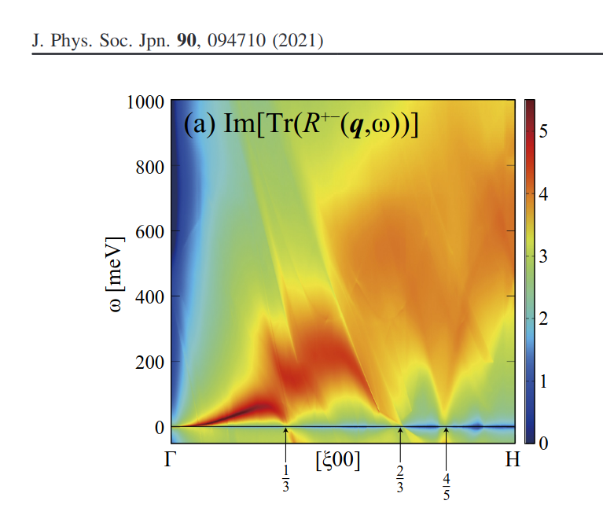

# UsageDetailed

> ⚠️ The input is `ctrlg.<sname>.toml`. Run `Legacy2toml.py <sname>` to convert legacy `ctrl.<sname>` / `GWinput`. Overrides on the command line are `--ctrlg:<path>=val`; with `-v<NAME>=<VAL>` the programs stop. See [TOML migration](./toml_migration). The samples named below that are being rebuilt from `Samples/Legacy` are listed in ecalj [`Samples/README.md`](https://github.com/tkotani/ecalj/blob/main/Samples/README.md).

## console output
Console output is now mainly for debug purpose. 
But we still need to read some of output data from the console output (we are trying to modify this).
From console output, we can check convergence behevior, band energies, Fermi energies, whether sigm, rst are correctly read in or not.

## `save.<sname>`
* `save.<sname>` records starting history invoking lmf,lmchk, and lmfa. In addition, it give  total energies, a line
per iteration of lmf. At each line,'i: intermediate, c: converged, x:iteration max without converged'.
* In addition, `--ctrlg:<dotted.path>=<value>` overrides (e.g. `--ctrlg:ham.scaledsigma=0.8`) are recorded. Older forms (`-vfoobar=val`, `-v[<path>]=val`, `--[<path>]=val`, `--toml.<path>=val`, `--pr=N`, `--time=N,M`, `--phispinsym`) all abort with a migration hint.

* Two total energies Kohn-Sham and Harris-Folker is given---[both should be virtually the same](lmf.md#q-should-the-harris-foulkes-and-hohenberg-kohn-sham-functionals-agree-at-self-consistency). 
But some differences for bigger systems. Take one of them.

* log file
`log.<sname>` generated by lmf,lmchk,lmfa are currently used for debuggging purpose.

## Spin polarized case without SOC
To treat magnetic systems, we have to set `mmom` (initial condition of spin
magnetic moments, per `[[spec]]`) in addition to `[ham].nspin = 2` in
`ctrlg.<sname>.toml`. The spin magnetic moments are specified as the
difference of number of electrons between spin channels, `isp=1` and `isp=2`.

For example, copy `ctrlg.nio.toml` of `ecalj/Samples/TestInstall/nio_gwsc/` to a new directory and run 
```
lmfa nio
mpirun -np 8 lmf nio
```
Try `cat save.nio`. It shows iteration history of lmf. Last line in save.nio
is like `c mmom= 0.0000 ehf(eV)=-86704.349038 ehk(eV)=-86704.348942 sev(eV)=-142.498970` (the energies depend on the settings). `c ` means converged.
ehf and ehk are [total energies by two formulas](./lmf.md#q-should-the-harris-foulkes-and-hohenberg-kohn-sham-functionals-agree-at-self-consistency).
Note that total energy is not meaningful in QSGW

Look into `ctrlg.nio.toml`. It contains 
```toml
[[site]]
atom = "Niup"                 # ← Niup site
pos  = [0.0, 0.0, 0.0]
[[site]]
atom = "Nidn"                 # ← Nidn site
pos  = [1.0, 1.0, 1.0]
[[site]]
atom = "O"
pos  = [0.5, 0.5, 0.5]
[[site]]
atom = "O"
pos  = [1.5, 1.5, 1.5]

[[spec]]
atom   = "Niup"
z      = 28
r      = 2.12
mmom   = [0.0, 0.0, 1.2, 0.0]      # ← initial spin
# rsmh, eh, rsmh2, eh2, lmx, lmxa, nmcore, kmxa follow
[[spec]]
atom   = "Nidn"
z      = 28
r      = 2.12
mmom   = [0.0, 0.0, -1.2, 0.0]     # ← initial spin
```
Here we have two sites named Niup and Nidn. `mmom = [0.0, 0.0, 1.2, 0.0]` means initial spin moment within MTs: that is `mmom = [s, p, d, f]`, where `s, p, d, f` are number of spin moments for each $l$ at atomic sites.
In addition, we set `nspin = 2` in `[ham]`.

Calculated spin moments within MT are at 'true mm' column in the console output, and shown in the `mmom.nio.chk` as
```
# Qtrue    MagMom(up-dn) Rmt   MT
1 8.527587  1.200085  2.120000 Niup    
2 8.527604 -1.200081  2.120000 Nidn    
3 5.380352 -0.000002  1.700000 O       
4 5.380352 -0.000002  1.700000 O    
```
Note it is overwritten at every iteration. These are shown in concole output as `true mm' as well.
Atomic site index are given in `SiteInfo.lmchk`.  Total Magnetic Moments are shown as
```
 Magnetic moment=     2.241805 !this is a case of bulk Fe
```

With the GW driver settings (the `[gw]` / `[mlo]` / `[blocks]` / `[product_basis]` sections of `ctrlg.<sname>.toml`), we can run gwsc as
```
gwsc -np 32 5 nio 
```
I needed 275 sec with 32 MPI per QSGW cycle. I used this qsub script.
```
!/bin/sh
#$ -N NioTest
#$ -pe smp 32
#$ -cwd
#$ -M takaokotani@gmail.com
#$ -m be
#$ -V
#$ -S /usr/bin/bash
export OMP_NUM_THREADS=1
EXEPATH=/home/takao/bin/
$EXEPATH/gwsc -np 32 5 nio >& lgwsc
```
After calculations, remove temporary files with `rm __*` or `cleargw .`, which were already in your bindir.
You can run `job_band` and so on in the same manner of DFT with nspin=1.

* cat save.nio shows total energies (but not meaningufl)
* We can effectively use [antiferro symmetry for calculation (only for so=0,2)](#antiferro-symmetry-without-soc) 

## orbital moments
When so=1, orbital moments within MTs are shown in at `orbitalmom.chk:` in the console output as
```
IORBTM:  orbital moments :
 ibas  Spec        spin   Moment decomposed by l ...
    1    Pr           1    0.000000   -0.011483   -0.010535   -4.881144    0.000234
    1    Pr           2    0.000000    0.012332    0.003604    0.000373   -0.000090
 total orbital moment   1:   -4.886708
    2    N            1    0.000000   -0.004174    0.001584    0.000291    0.000129
    2    N            2    0.000000    0.004622    0.000236    0.000045    0.000006
 total orbital moment   2:    0.002738
```

## Antiferro symmetry without SOC
We can perform LDA/QSGW calculation with the AF symmetry (not for SOC=1).
Only up spin are calculated. Then charge density and eigenvalues are
symmetrized for the antiferro symmetry.

See the samples of the antiferromagnetic symmetry (NiO and NiSe).
To set AF symmetry, We have to set a top-level key in `ctrlg.<sname>.toml` as
```toml
symgrpaf = "find"  # Antiferro symmetry: spglib finds the operations (2026-10-02)
```
With `symgrpaf = "find"` (and `symgrp = "find"`, the default), spglib finds the magnetic space group from the `af` labels below;
its operations with time reversal map the up site of a pair on the down site and switch the AF mode on.
A generator such as `symgrpaf = "i:( 1 1 1 )"` (for NiO: `g = i:(1,1,1) * $i \sigma_y$` generates the magnetic space group)
is needed only with the old search (`ECALJ_SYMFIND=ecalj`, or `symgrp` with generators); there `"find"` stops with a message. In any case 
```toml
[[site]]
atom = "Niup"
pos  = [0.0, 0.0, 0.0]
af   = 1                  # Antiferro pair
[[site]]
atom = "Nidn"
pos  = [1.0, 1.0, 1.0]
af   = -1
```
should contains the `af` to specify antiferro pairs.
Note that the space group operation `i:(1,1,1)` (this is inversion with translation) 
is explained at [SYMGRP](./lmf.md#symgrp).

In addition, we have an example for NiSe (`symgrpaf = "find"`; with the old search `"r2z:( 0 0 0.5 )"`) with `af = 1` and `af = -1`
for the two Ni sites at (0, 0, 0) and (0, 0, 0.5).

With `symgrpaf`, use `pwmode = 11` (the plane waves |q+G|): the spin-2 functions are made by rotating those of spin 1, which needs the
G set of each q. With `pwmode = 1` it stops with `rotwave: q+G rotation error` at some k meshes (NiO 4x4x4; 3x3x3 passes by chance).

### Holding the AF moment at a given value (`mmtarget.aftest`)
Opposite fields on the two sites of an AF pair, readjusted every iteration, hold the moment $(m_1-m_2)/2$ at a target value.
Useful for an AF metal whose moment is unstable in QSGW, or for the total energy as a function of the moment, $E(m)$.
Example: `Samples/AFfixMMOM` of ecalj (NiO, target 1.6 $\mu_B$, with and without `symgrpaf`; the two agree within $10^{-6}$ eV).

* Put a file `mmtarget.aftest` holding one number, the target moment ($\mu_B$), in the working directory. Its presence switches the mode on.
* The field goes into the LDA+U potential (`vorb`), so the two sites of the pair need LDA+U blocks. `idu = 1` with `uh = jh = 0` makes the
  blocks without changing the LDA result. With `sigm` (QSGW) the blocks stay, so it works there too.
* The pair is the sites 1 and 2 (LDA+U blocks 1 and 2); with six blocks (NiSe), the blocks 1-3 and 4-6.
* lmf writes `mmagfield.aftest` (the field `uhx` and the moments) and `mixmag.aftest` (the mixing history of the field). Remove both to start again.
  Every start of lmf (also in `job_band`) advances the field by one step and rewrites `mmagfield.aftest`.
* In the output, `mmaftest:` lines give the iteration, `uhx` (Ry), $m_1$, $m_2$, ...; `mmhist:` lines the history.
* `ehk` is the total energy under the constraint, with $dE/dm_d = 2\,u_{hx}$ ($m_d$: the d moment of `dmats`).
* Lowering the moment (NiO 1.28 to 1.0) converges slowly (about 70 iterations; the gain of the field update is fixed).
* With `symgrpaf`, use `pwmode = 11` (see above).


## Spin-orbit coupling
We have a switch `so` in `[ham]` of `ctrlg.<sname>.toml`

* For LDA/GGA, set nspin=2 and so=1. Then we can perform calculations including SOC. so=1 is for soc included (so=2 is for LzSz mode neglecting LxSz+LySy.
* In the case of semiconductors such as GaAs, we need to include so=1 to see the band structure at the top of valence.
* Currently, QSGW can not be performed with so=1. So we first have to run gwsc with
so=0 or 2. After we get sigm file, we run lmf with `--ctrlg:ham.so=1` (nit=1 can be fine) as a perturbation.

* We can treat only colinear spins. Spin axis is along (0,0,1) as default. We can choose other direction with `[ham] socaxis`. See the samples of SOC (magnetic anisotropy of FePt and MnGa). Not checked completely, but it seems work well.

### Band plot with spin orbit coupling.
* method 1: only apply SOC for band plot
  ```bash
  job_band mp-2534 -np 8 --ctrlg:ham.so=1 --ctrlg:ham.nspin=2
  ```
  Caution: when you set nspin=2, the size of rst is twiced. No way to move it back to rst for nspin=1. So you may need to keep rst.

* method 2. single iteration and SO=1
  ```bash
  mpirun -np 8 lmf mp-2534 --ctrlg:ham.so=1 --ctrlg:ham.nspin=2 --ctrlg:iter.nit=1
  ```
  Then we have revised `rst.<sname>`. Then run `job_band mp-2534 -np 8 --ctrlg:ham.so=1 --ctrlg:ham.nspin=2`.

* method 3. full iteration SO=1
  ```bash
  mpirun -np 8 lmf mp-2534 --ctrlg:ham.so=1 --ctrlg:ham.nspin=2
  ```
  Then run `job_band mp-2534 -np 8 --ctrlg:ham.so=1 --ctrlg:ham.nspin=2`

## Forces and Atomic position relaxiation  
See the sample of the relaxation (LaGaO3).
We have to set the `[dyn]` section of `ctrlg.<sname>.toml` (only relaxiation). 
We can set directions for relaxation with `relax = [0, 0, 1]` or so in `[[site]]`.
No cell optimizations.  

* CAUTION:
    For DYN mode, we treat the atomic position file `AtomPos.lagao3`. If it exists, we use atomic positions written in the file. 
    See `ecalj/SRC/subroutins/main_lmf.f90`. You find `call ReadAtomPos(irpos)` which override positions specified by `ctrlg.<sname>.toml`. 
    I have checked relaxation of the Perovskite LaGaO3 worked well. Since we do not use so much about the relaxation mode, be careful
    (I think some possible developments since atomic forces calculated well).

## Fermi surface 
See the sample of the Fermi surface (Cu).
Run `job_fermisurface cu -np 4 -vnk1=10 -vnk2=10 -vnk3=10` after `lmf cu` converged (`-vnk1` etc. are options of the script `job_fermisurface`). This write down all band energies (around
Ef) for 10x10x10 in BZ. Then we can view it with `xcrysden as xcrysden --bxsf fermiup.bxsf`
With `–allband` option to `job_fermisurface`, we have all the bands. Then we can see iso-energy surface at any energy.

## PROCAR mode 
See a sample at ecalj/Samples/PROCAR/MgO_PROCAR
We can generate PROCAR file containing the size of eigenfuncitons**2. 
The sample (`testecalj MgO_PROCAR`; the steps are in its `test.py`) generates a pdf file showing fat band of O2p components.
 PROCAR (vasp format) is generated by `lmf --mkprocar --band mgo` and analysed by a script BandWeight.py.

## Spectrum of the Green's function
(under construction ...)
[spectrum of G](./spectrum.md)


## LDA+U
We have samples of LDA+U (GdN and the rare-earth nitrides), and the test target `TestInstall/gdn`.

*  `idu`, `uh`, `jh` in `[[spec]]` specify parameters for LDA+U.  `idu = [#,#,#,#]` specifies which l-channels are to have U and the type of LDA+U implementation.
          0 in a particular l-channel means no U is to be applied, 1 or 2 are for particular forms of LDA+U.  For example,
             `idu = [0, 0, 0, 1]`, `uh = [0.0, 0.0, 0.0, -0.28]`, `jh = [0.0, 0.0, 0.0, 0.0]`. See [LDA+U in lmf.md](./lmf#lda-u-toml).


## BoltTrap 
--boltztrap option is to generate files required for boltztrap.
See the sample of BoltzTraP (Si).


## Dielectric function
`~/ecalj/Samples/EPS`
Dielectric functions for Cu and GaAs. For Cu, we have intraband and interband contributions separately.
See [dielectric fuctnion](optical.md).

## Impact ionization rate
`~/ecalj/Samples/IIR/C` (diamond, a coarse mesh; `gw_lmfh` writes the widths to `QPU_life`)

## Spin fluctuation
`~/ecalj/Samples/Magnon` (test target `Fe_mlo_magnon`; `README.md` there gives the steps of `job_mlo_magnon`).
The model is the [MLO](./mlo) model (no windows and no iteration). The sample compares it with the maximally localized
Wannier functions of the version before 2026-10-02 (git tag `last-wannier`). Here is a figure (this is on top of LDA) for the spin fluctuation of Fe in [Okumura2021](https://github.com/ecalj/ecaljdoc/blob/main/presentations/okumura2021.pdf).


## Effective Screening Medium (ESM)
For a slab with a vacuum layer, ESM replaces the periodic electrostatics with
the boundary condition you actually want (vacuum, or a metal electrode) on
each side. It also lets you apply an electric field to a slab. ESM combined
with QSGW is quite unique; used in
[PRB 101, 205120 (2020)](https://doi.org/10.1103/PhysRevB.101.205120).

**Turn it on for every slab with a vacuum layer.** Without it the whole
eigenvalue spectrum sits on a different zero — 4.4 eV on the Fe/MgO sample —
while the total energy and `Vesav` look perfectly normal.

Configured by the `[esm]` section of `ctrlg.<sname>.toml`. Full reference
(all keys, the `boundary` values, how to apply a field, and the conversion
of the retired `esm_input.dat` by `ctrlg_absorb.py`):
**[ESM in lmf.md](./lmf#esm-effective-screening-medium)**.
Sample: `Samples/MLOsamples/FeMgO`.

## lmf and ctrl
See [lmf and ctrl](lmf.md)

## gwsc and GWiput
See [gwsc](gwsc.md). 
For GPU, see [ecaljgpu](ecaljgpu.md) and [gwsc for GPU for ISSP](UsageISSP.md) together.
See [the keys of `[gw]`](gwinput.md), [kBT](kBT.md) for the temperature keys `t_tetrakbt` (required) and `t_sigmaw`, and [the mapping from the legacy `GWinput` in lmf.md](./lmf#legacy-ctrl-lt-sname-gt-toml-path-map).

## getsyml: automatic symmetry line and BZ for band plot
See [syml](syml.md)

The citations required for a publication (seekpath, spglib) are in [syml](syml.md), "Needed citations for getsyml".

### ecalj/Samples/
For the canonical layout and per-tree role table see the
[Samples overview page](./samples) (or the upstream
[Samples/README.md](https://github.com/tkotani/ecalj/blob/main/Samples/README.md)).
Highlights touched in this page:

* `MLOsamples/` — new MTO Localized Orbital basis (Wannier replacement),
  with on-site W via `job_mloW`. **The method itself is written up in
  [MLO](./mlo)** (what theta is, why `mlo_method = 4`, measured accuracy of the
  samples with band plots). See also the per-dir
  [README](https://github.com/tkotani/ecalj/blob/main/Samples/MLOsamples/README.md).
* the older Wannier90-style examples (CuMLWFs, La2CuO4, NiOMLWF, SrVO3MLWF; cRPA via the
  Juelich group's formulation) are not in the repository any more; `MLOsamples/` replaces them.
* effective mass calculation — `Samples/EffectiveMass/GaAs` (QSGW bands with SOC, the mass
  mode of `syml.<sname>`).

## ecalj_auto
This is a suit of python scripts to run thousands of gwsc calculations automatically.
`MD/auto.md`

## Background charge and fractional Z
[backcround charge](Memo_bgcharge.md)

### How to perform paper-quarilty QSGW calculations with minimum costs. 

The accuracy of band gaps can be  ~0.1eV or larger for larger band gap materials.. 
In cases, it is easy, but in cases not so easy. So, it is better to use your own "simple criterion".
"Not stick to convergence so much. Just stick to Reproducibility."

## 4f and 5f atoms
We need special care to treat atoms where 4f and 5f are fractionally filled.
The atomlist defaults for 4f atoms were updated 2025-08-21 (5f not yet);
the same defaults are picked up by `ctrlgenToml.py` (which extracts the
atomlist from `ctrlgenM1.py` at runtime). Only limited tests yet —
make sure by yourself.

Here is the setting for RareEarth rocksalt nitrides ReN such as ErN.
1. Set `[ham].nspin = 2`, `[ham].so = 2` (since QSGW cannot treat `so=1` now).
   If necessary, set `so=1` after `gwsc` finished.
You may use `ctrlgenToml.py gd2pdo4 --so=2 --nspin=2`, or simply edit
`ctrlg.<sname>.toml` after generation.
2. `symgrp = "r4z"`. This is needed since we have lower symmetry rather than the lattice. It fixes the direction of spins and orbital moments.
3. Our setting in `ctrlg.ern.toml` is
    ```toml
    [[spec]]
    atom   = "Er"
    z      = 68
    r      = 2.58
    pz     = [0.0, 5.0, 0.0, 5.0]
    idu    = [0, 0, 0, 12]
    uh     = [0.0, 0.0, 0.0, 0.773]
    jh     = [0.0, 0.0, 0.0, 0.0945]
    mmom   = [0.0, 0.0, 0.0, 3.0]
    rsmh   = [1.29, 1.29, 1.29, 1.29]
    eh     = [-1.0, -1.0, -1.0, -1.0]
    rsmh2  = [1.29, 1.29, 1.29, 1.29]
    eh2    = [-2.0, -2.0, -2.0, -2.0]
    lmx    = 3
    lmxa   = 6
    nmcore = 1
    kmxa   = 5
    # ([ham] pwemax = 2, [bz] nkabc = [8, 8, 8] was used)

    [gw]
    n1n2n3 = [6, 6, 6]

    [product_basis]
    pb_tolerance = [1e-2]
    pb_lcutmx    = [6, 2]
    ```
    Here `pz` is the principle quantum number of local orbitals. This sets 5p and 5f as local orbitals. Run `lmfa ern|grep conf` to check atomic configulation.
    * `idu`, `uh`, `jh` are the LDA+U parameters. When `idu` is 10+2, we skip U effect when sigm exists.
    * `mmom` is the initial magnetic moments.
    * `lmxa = 6` to expand augmented waves is needed.
    * Make sure `[ham] readp = true`.

```CAUTION LDA+U is used only for initial condition for QSGW when idu>10. Thus QSGW results is not dependent on jh and uh.```

With these settings, we can perform series of calculations finished for 4f ReN. 
Input files are available from [here](../data/RENctrlGWinput.tar.gz). Ask us when you like to use them.


## QPU and QPD files
This contains the contents of self-energy


## Papers
It is instractive to reproduce samples in [Deguchi paper](https://github.com/ecalj/ecaljdoc/blob/main/presentations/presentations/deguchi2016.pdf). 
We can set up templates for your calculations. Ask us.
We have a latest paper at https://arxiv.org/abs/2506.03477 for GPU version. 
It shows some details of computational steps in ecalj.
In Japanese, pages by Dr.Gomi at http://gomisai.blog75.fc2.com/blog-entry-675.html and https://qiita.com/takaokotani/items/9bdf5f1551000771dc48.


##  How to perform paper-quarilty QSGW calculations with minimum costs. 
We expect that the accuracy of band gaps can be  ~0.1eV (or larger for larger band gap materials). 
In cases, it is easy but in cases not so easy (magnetic metals requires many number of iterations). 
So, it is better to use your own "simple criterion".
"Not stick to convergence so much. Just stick to Reproducibility."
### LDA calculation
 We need to confirm LDA-level of calculations first.
 `ctrlg.<sname>.toml` is generated just from ctrls.* (crystal structure file)
 For calculation of QSGW, use large enough `[bz] nkabc`, so as to avoid
 convergence check on them. 
### QSGW: how to check convergence
QSGW iteration cycle by gwsc contains (1) and (2)
  (1) One-body self-consistent calculation 
      (where we add sigm = Sigma-Vxc^LDA to one-body potential).
      to determine one-body Hamiltonian $H_0$.
  (2) For given $H_0$, we calculate sigm file.

Big iteration cycle of QSGW is made from (1)+(2).
With (1), we have small iteration cycle of one-body calculaiton with keeping given sigm.

In `save.*`, we see total energy (but not the total energy in the QSGW
mode with sigm file), a line per each iteration of (1). A line "c ..." is the final
iteration cycle of (1)."x ..." is unconverged 
(but no problem as long as we finally see "c ...").

The command `"grep '[cx] ' save.*"` gives an indicator for 
going to be converged or not.
Or you can take "grep gap llmf.*run" (see it bottom.)

Another way:
`dqpu QPU.3run QPU.6run` 
is to compare two QPU files which contains QP energies.
(note: QP energies shown are calculated just at the begininig of iteration).

For insulators, (I think), comparing band gap for each iteration 
is good enough to check onvergence. But for metal, it is better to plot energy bands
for some of final iterations, and overlapped(`cd QSGW.*run` and run `job_band`).

Another way is `grep rms lqpe*`. This gives rmsdel. Diffence of self-energy
(at least we see it is getting smaller for initial first cycles). 


### How to make 80%QSGW +20% LDA, and SO setting
  Note that sigm file contains $V_{\rm xc}^{\rm QSGW}-V_{\rm xc}^{\rm LDA}$.
  If sigm exists, lmf read it, and run self-consistent calculations
  with adding sigm to the one-body potential.

  Justifications of QSGW80 are:
  * https://iopscience.iop.org/article/10.7567/JJAP.55.051201/pdf
  * https://journals.aps.org/prb/abstract/10.1103/PhysRevB.101.205120
  * https://journals.aps.org/prb/abstract/10.1103/PhysRevB.108.165104

#### 1. QSGW80(NoSC)
  For practical prediction of band structure, such as band gap and so
  on, it may be better to use 80% QSGW +20% LDA procedure when you
  make band plot.  After, you have rst and sigm files determined self-consistently
  Run 
  ```
  job_band gaas -np 4 --ctrlg:ham.scaledsigma=0.80
  ```
  This overrides `[ham] scaledsigma` in `ctrlg.gaas.toml` at run time, giving the QSGW80nosc result in Table II.

#### 2. QSGW80(Nosc)+SO 
   80%QSGW+20%LDA with SO=1 (L.S method).
   If you like to include L.S method 

```
mpirun lmf gaas -np 4 --ctrlg:ham.scaledsigma=0.80 --ctrlg:ham.so=1 --ctrlg:ham.nspin=2
```
This procedure makes self-consistency with keeping the sigm file. This may/(or may not) required. If you expect large obital moment this procedure may be needed.

```
job_band gaas -np 4 --ctrlg:ham.scaledsigma=0.80 --ctrlg:ham.so=1 --ctrlg:ham.nspin=2
```
NOTE: nspin=2 is required for so=1. rst and sigm are expanded for npsin=2 (you can not run with nspin=1, after rst and sigm are expanded).
  
#### 3. QSGW80
  With `[ham] scaledsigma = 0.80` (or `gwsc ... --ctrlg:ham.scaledsigma=0.80`), you can run QSGW calculaiton in gwsc.
  Then you have self-consistent results of QSGW80.
  You can simultaneously use the setting so=2 (Lz.Sz scheme).
  Be careful for z-direction and setting of `symgrp` (so as to keep the z-axis), for so=2.
  If you like to get results of QSGW80+SO, you need to set so=1 after self-consistent of sigm atteined.

#### 4. Example of GaAs   
  Good example to check band gap, and SO splitting at top of valence of Gamma point for ZB structure as GaAs.
  The keys are `scaledsigma`, `so` and `nspin` in `[ham]` of `ctrlg.gaas.toml`; look at them by
  ```   
  >grep -E "^(scaledsigma|so|nspin) " ctrlg.gaas.toml
  ```   
  They are overridden for a run by `--ctrlg:ham.scaledsigma=0.80`, `--ctrlg:ham.so=1`, `--ctrlg:ham.nspin=2` as in 1. and 2.
  (the keys need not be written in the file for this).


## How to do version up? git minimum

Be careful to do version up ecalj. It may cause another problem.
If you are not good at git, make another clone. 
Do not mix up with previous version (e.g. where you install)

>cd ecalj  
>git log  
   This shows what version you use now.

>git diff > gitdiff_backup
This is to save your changes added to the original (to a file git_diff_backup ) for safe.
I recommend you do take git diff >foobar as backup.
>git stash also move your changes to stash.

>git checkout -f
     CAUTION!!!: this delete your changes in ecalj/.
     This recover files controlled by git to the original which was just downloaded.

>git pull
    This takes all new changes. It is safer to use `git fetch` and `gitk --all` (`git checkout FETCH_HEAD -b youbranch`) to checkout your local branch.


I think it is recommended to use 
>gitk --all 

and read this document. Difference can be easily taken,
e.g. by 
>git diff d2281:README 81d27:README 
(here d2281 and 81d27 are several digits of the begining of its version id). 

>git show 81d27:README 

is also useful.  

# error messages and caution

## Bandplot for FSMOMMETHOD/=0
  Even when you use `[bz].fsmommethod` /= 0 in `ctrlg.<sname>.toml` for `gwsc`,
  you need to set `fsmommethod = 0` (or remove the key) when you run `job_band`.
  [If you run `job_band` with `fsmommethod` /= 0, it make a shift (adding bias magnetic field).]
  Anyway confusing. If necessary, I have to make it straight.

## For molecules, we may use --systype=molecule for ctrlgenToml.py.
  Then we have in `[bz]`
  >tetra = false
  >n = -1 #Negative is the Fermi distribution function. w gives temperature.
  >w = 0.001 #w=0.001 corresponds to T=157K as shown in console
  >In addiiton, `fsmom` (n_up-n_down) is needed (`fsmommethod = 1`) if we
  have magnetic moment.

## core>evalence message.
  Ecore is grater than Evalence.
  For safe, we do not allow this.
  Compare ECORE file and valence levels, shown in log file or console output.

## Back ground charge and fractional Z.
You can use fractional numbers for `z` of `[[spec]]`, and also can set valence charge by `[bz] zbak`.
You see console out put, e.g, 
>Charges: valence 19.80000 cores 8.00000 nucleii -28.00000
>hom background .20000 deviation from neutrality: 0.00000
This is a case with `zbak = 0.2`

NOTE: at the first iteration, Charges: shows such as
>Charges: valence 8.00000 cores 20.00000 nucleii -28.00000
>hom background 0.12300 deviation from neutrality: 0.12300

because of the initial condition by superposition of atoms. It shows
deviation seems nonzero. But charge should be conserved from the next iteration.

## convergence problem.
We need to use smaller `[iter] b`, such as 0.015, 0.01, 0.005. 

## Use PZ or not.
If spillout of core is not so small (more then 0.05 or something.),
it is better to use `pz` (lo). Treat the core as valecne. Bi4d is such a case. Maybe use `pz = [0.0, 0.0, 4.9]`

## We use only CORE1 treatment only (exchange only core)
See 10.1103/PhysRevB.76.165106 (Eq.35 and after).
Now I usually not use CORE2 (CORE1 only).

## a little unstable when metal GGA, especially when we have large empty regions. (still problematic?)
(negative density points appears: console output). I am not so sure about this is serious or not.

## total enegry is not meaningful in QSGW mode
Even gwsc, we see total energy in lmf cycle. But it might be taken just an indicator to the convergence.

## Do we use VWN or GGA for QSGW? ===
In principle, QSGW results should not depend on VWN or GGA.  But there is minor dependence, because
1. frozen core density.
2. core eigenfunctions.
3. radial basis functions
4. Slight numerical reason
(This is probably because Sigma-interpolation procedure But not exactly figured out yet →
affect about 0.02eV as for band gap for GaAs.). In anyway, use VWN (`[ham] xcfun = 1`)
as standard. And such technical things affects, 0.05 eV level of error for band gap.

## numerical accuaray of QSGW band energies
As for the band gaps 0.1 eV is a kind of limiting accuaray for usual semiconductors with 0~3 eV band gap materials.
For Si or something simple, you may be able to have better accuracy. However, QSGW is on the so many parameters.
So, just say ~0.1eV level of accuracy. Convergence check is expected for the technical developments in future.

## TOTE files
In gw_lmfh, `hqpe` gives TOTE.UP and QPU files (DN and QPD as well). They contains the same values.

## The Fermi energies in GW
We use two kinds of Fermi energy $E_{\rm FEERMI}^{\rm smear}$ and $E_{\rm FEERMI}^{\rm tetra}$.
This is because of numerical techniques.

One is $E_{\rm FEERMI}^{\rm tetra}$, contained in EFERMI, for the polarization function since we use tetrahedron method for it.

The other is $E_{\rm FEERMI}^{\rm smear}$ for $ G \times W$ since we use smeared pole technique for $G$
(the width of the smearing is `[gw] t_sigmaw`).
$E_{\rm FEERMI}^{\rm smear}$ is given at the beginning of $ G \times W$ calculations. 
See the line `ef     esmr   valn=` in `lgw` and `lsxC`.

With `[gw] t_tetrakbt` > 0 (the polarization function at finite temperature), both the polarization function and
$ G \times W$ (except the exchange of the cores) use the Fermi energy at that temperature, contained in EFERMI_kbt. See [kBT](./kBT).

## Anisotropic Q0P 
   In cases, we are worrying about the anisotropy. The offset Gamma method uses the 1/10 of gamma cell (`[gw] Q0Pchoice = 1`; see [gwinput](./gwinput)).
   It seems not so bad, however, we may need to examine the anisotropy problem again in future.  
   It is problematic to use unbalanced k points for anisotropic cell. See Copmuter Physics Comm. 176(2007)1-13.

## mixbeta and mixpriorit
If not stable convergence in gwsc, try setting
`[gw].mixbeta = 0.5`
in `ctrlg.<sname>.toml`.

What they do: at the end of every iteration `hqpe_sc` mixes the static self-energy `sigm`.
With $x_0$ the `sigm` the iteration ran with and $f$ the one GW has just made, the next `sigm` is

$$x_{\rm new} = x^* + \beta\,(f^* - x^*) \tag{1}$$

where $x^*$, $f^*$ are the Anderson combination of the current and up to `mixpriorit` previous
iterations (history in `__mixsig`). $\beta$ = `mixbeta` (default 1.0), `mixpriorit` default 3.
With no previous iteration, $x^*=x_0$ and $f^*=f$, i.e. plain linear mixing.

**The first iteration from LDA.** There is no previous `sigm` and no history, so $x_0=0$ (no self-energy,
i.e. LDA) and eq (1) gives $\beta f$: the first step takes only $\beta$ of the GW self-energy.
With the default $\beta=1$ it takes all of it; with $\beta=0.5$, half.
The second iteration is again linear mixing (one history entry); the Anderson extrapolation starts at the third.
The converged result does not depend on $\beta$; only the path does.
Example, `Samples/TestInstall/si_gwsc`, one `gwsc 1` from LDA (2026-09-26):

| | `sigm` before → after mixing | band gap |
|---|---|---|
| LDA | — | 0.571 eV |
| $\beta=1.0$ (default) | 6.0488 → 6.0488 | 1.293 eV |
| $\beta=0.5$ | 6.0488 → 3.0244 | 0.934 eV (half the shift) |

MLO-gwsc (`gwsc --mlo`) mixes $\Sigma^{\rm MLO}$ the same way with the same `mixbeta` by default (history in `__QMLO_mixsig`; the environment variable `ECALJ_MLO_MIX=0` turns it off). Its $x_0$ is the Bloch sum of `QMLO_SigRs`, the counterpart of `sigm` here, so the history may be deleted; see [MLO-gwsc](./mlo_gwsc).

## Check Used MTOs
 Near beginig of console output, what MTO you use is shown as: (GaAs case).
 ```
 sugcut:  make orbital-dependent reciprocal vector cutoffs for tol= 1.00E-06
 spec      l    rsm    eh     gmax    last term    cutoff
  Ga       0*   1.13  -1.00   6.579    1.19E-06    1459
  Ga       1*   1.13  -1.00   7.028    1.26E-06    1807
  Ga       2*   1.13  -1.00   7.475    1.09E-06    2109
  Ga       3    1.13  -1.00   7.920    1.06E-06    2637
  Ga       0*   1.13  -2.00   6.579    1.19E-06    1459
  Ga       1*   1.13  -2.00   7.028    1.26E-06    1807
  Ga       2    1.13  -2.00   7.475    1.09E-06    2109
  As       0*   1.18  -1.00   6.300    2.13E-06    1243
  As       1*   1.18  -1.00   6.720    1.26E-06    1471
  As       2*   1.18  -1.00   7.140    1.37E-06    1837
  As       3    1.18  -1.00   7.558    1.05E-06    2229
  As       0*   1.18  -2.00   6.300    2.13E-06    1243
  As       1*   1.18  -2.00   6.720    1.26E-06    1471
  As       2    1.18  -2.00   7.140    1.37E-06    1837
 ```

# one-show QSGW (not one-shot GW) 
  one-shot QSGW can be useful in cases.
  As it contains off-diagonal part, we can resolve band tanglement problem in Ge (no band gap).
  one-shot GW is also used to calculate impact ionization rate.

# Effective interaction in the model: W and cRPA with MLO

The effective interaction of a model Hamiltonian (Hubbard U, J) is computed on the MLO basis, the model of
[MLO](./mlo): `job_mloW <sname>` writes the bare v and the screened W − v, and `job_mloW <sname> --crpa` also the
constrained-RPA W, from which the screening inside the model subspace (`[mlo] mlo_lm`) is removed.

```bash
job_band <sname> -np 8 --NoGnuplot      # the DFT bands the MLO model is fitted to
job_mlo  <sname> -np 8                  # the MLO model (HamRsMLO)
job_mloW <sname> -np 8 --crpa           # Coulomb_v.UP, Screening_W-v.UP, Screening_W-v_crpa.UP (and .DN)
mlo_spread.py <sname> -np 8             # <r>, <r^2> and the spread of each MLO
```

The equations, the normalization of the MLOs, how to read the files, and the comparison with the maximally localized
Wannier functions are in [MLO](./mlo) section 6. The tests are `Samples/TestInstall/ni_crpa` (Ni d) and `srvo3_crpa`
(SrVO3 t2g).

The maximally localized Wannier functions (`genMLWFx`, `hmaxloc`, `hpsig_MPI`, `wanplot`, the Wannier magnons
`job_magnon`) were removed on 2026-10-02. They are at the git tag `last-wannier` of ecalj, where
`Samples/WannierVsMLO/run.sh` reproduces the comparison.
