# MLO — 最大局在化などに代わる自動モデル化法

ecalj branch `mlo3` / 2026-09-16 17:02 JST

**MLO (MTO-based Localized Orbitals) は、最大局在化 Wannier 関数
(MLWF) の代わりに使う局在基底である。**

MLWF は「広がりを最小にする」という条件でユニタリ変換を非線形最適化して求める。
強力だが、初期推定 (projection) を人が与える必要があり、収束が初期値に依存し、
エンタングルした帯では disentanglement の窓をさらに手で決めることになる。
**うまくいくかどうかが人の手加減に掛かっている**のが難点である。

MLO は最適化をしない。PMT 基底の恒等分解を出発点に、
**どの $lm$ チャネルで模型を作るか (`mlo_lm`) を与えれば、重み $\theta$ が
式一本で決まる**(§1)。反復も初期推定も無く、結果は一意で、物質ごとの調整
パラメータはゼロである。局在性は最適化の結果ではなく、MTO を種にしている
ことから自然に出る。

その `mlo_lm` も**原理的には自動化できる**。規則は「目的の窓にバンドを出して
いるチャネルだけ取る」の一つで、どの原子のどの $lm$ が窓に重みを持つかは
計算から出る量だからである(§1)。既定は `gwinit` が書き（§1、§9 の基準 1・2）、窓の重みで自動に選ぶ所はまだ無いが、
調整ではなく**読み取れば決まる**類のものである。

使い方は大きく 2 つに分かれ、**測り方も違う**:

1. **ミニマム模型** — $E_F$ を含む領域の第一原理バンドを**全部**再現する。
   半導体・金属・Al₂O₃:Cr(ギャップ中の Cr d + バンド端)はすべてこれ(§2)。
2. **部分バンドを取る模型** — d だけ、4f だけを取り出す。MLWF で言えば
   projection で狙い撃ちしていた使い方に当たる(§3)。

FeMgO は真空層を持つスラブで空格子球が要る。**§5 に独立の節**を立てた。

**§1〜§8 の数値は `Samples/MLOsamples/` の 18 サンプルの実測値**で（§9 は `Samples/MATERIALS` の 65 物質）、
全サンプルが `mlo_method = 4` の既定値に統一してある(2026-09-16)。§2・§3・§7 の数値と本数はそのときのもので、
2026-10-01 の半内殻の局所軌道の規則（表 M1）より前である（例えば GaAs は 18 本、今は Ga 3d が加わって 23 本。§4 の表 M2 は今の規則）。
図は `ecalj/Samples/MLOsamples/plots/` にあり、
`SRC/exec/mlo_bandplot.py <サンプルdir>` で再生成できる(本頁の図はその写し)。
損失の数値は `SRC/exec/mlo_losscheck.py <サンプルdir>`。

| | | |
|---|---|---|
| §1 | [**最終形**](#_1-最終形) | 式と既定値。読むならここだけでよい |
| §2 | [**ミニマム模型**](#_2-ミニマム模型-—-を含む領域を再現する) | 窓の中のバンドを全部取る。11 系の実測とバンドプロット |
| §3 | [**部分バンドを取る模型**](#_3-部分バンドを取る模型-—-d-だけ-4f-だけ) | d だけ / 4f だけ。窓型の損失は使えない |
| §4 | [**SOC**](#_4-スピン軌道相互作用-—-job-mlo-soc) | `job_mlo_soc`。あとから摂動として載せる |
| §5 | [**FeMgO**](#_5-femgo-—-真空スラブに空格子球を置く) | 真空スラブに空格子球を置く |
| §6 | [**有効相互作用 $W$**](#_6-有効相互作用-—-job-mlow) | `job_mloW`。模型の $U$ にあたる量 |
| §7 | [誤差の測り方](#_7-誤差の測り方-—-一方向では決まらない) | 一方向では決まらない |
| §8 | [残る問題](#_8-残る問題) | |
| §9 | [**模型の選び方**](#_9-模型の選び方-—-基準-1・2・3) | 基準 1・2・3 と現在のベストチョイス。`Samples/MATERIALS` の 65 物質 |
| `MD/mlo_backup.md` | 経緯と作業記録(backup) | |

---

## 1. 最終形

MLO は PMT 基底の恒等分解から、選んだ MTO 部分空間の固有状態
$\Psi^{\mathrm{MTO}}$ を介して作る:

$$
|F^{\mathrm{MLO}}_{\mathbf{k}n}\rangle
=\sum_{n'n''}|\Psi^{\mathrm{PMT}}_{\mathbf{k}n'}\rangle\;
A^{\mathbf{k}}_{n'n''}\;
\langle\Psi^{\mathrm{MTO}}_{\mathbf{k}n''}|F^{\mathrm{MTO}}_{\mathbf{k}n}\rangle
\tag{1}
$$

ここで $S$ を PMT 固有状態と MTO 固有状態の重なりとする:

$$
S^{\mathbf{k}}_{n'n''}=\langle\Psi^{\mathrm{PMT}}_{\mathbf{k}n'}|\Psi^{\mathrm{MTO}}_{\mathbf{k}n''}\rangle
\tag{2}
$$

$A=S$ とすると式 (1) の和は MTO 部分空間への射影演算子そのものになり、
$F^{\mathrm{MLO}}=F^{\mathrm{MTO}}$ に戻ってしまう。そこで重み $\theta$ を掛ける:

$$
A^{\mathbf{k}}_{n'n''}=S^{\mathbf{k}}_{n'n''}\,\theta^{\mathbf{k}}_{n'n''}
\tag{3}
$$

**この $\theta$ をどう決めるかが問題のすべてで**、課題 1 の答えは式 (4) である。

$$
\boxed{\;
\begin{aligned}
\theta^{\mathbf{k}}_{n'n''}&=\sigma\Bigl(\frac{\varepsilon_{n'}-e^{\mathrm{cut}}_{n''}}{w}\Bigr),
\qquad \sigma(x)=\frac{1}{1+e^{x}}\\[2pt]
e^{\mathrm{cut}}_{n''}&=\max\bigl(\varepsilon_{\mathrm{CBM}}+\Delta,\;\varepsilon^{\mathrm{MTO}}_{n''}\bigr)
\end{aligned}
\;}
\tag{4}
$$

$\varepsilon_{\mathrm{CBM}}$ は**大域の**伝導帯下端(金属では $E_F$)。
パラメータは $\Delta$ と $w$ の 2 つだけ(**単位はすべて eV**)で、物質ごとに変える調整は無い。

$$
\boxed{\;\Delta = 2.0\ {\rm eV},\qquad w = 2.0\ {\rm eV}\;}
\tag{5}
$$

役割がはっきり違う。**$\Delta$ は「どこまで合わせたいか」の宣言**であって
フィッティングパラメータではない。バンド端から上に $\Delta$ だけの範囲を要求する、
という意味なので、**評価する窓の上端と同じ値にする**(既定はどちらも 2 eV)。
**$w$ が唯一の調整ノブ**で、残差が大きいときに動かすのはこちらである(§7)。

**`mlo_method = 4` として実装済み。** 大域の伝導帯端は新しく計算する必要はなく、
lmf が SCF の BZ 積分で既に求めて `efermi.lmf` に書いている
(`evtop` = VBM、`ecbot` = CBM。金属では $E_F$ のすぐ上の準位になるので、
**一つの量で金属と絶縁体の両方を覆う**)。
`m_readqplist` がこれを読み、原点のずれに強いよう差分
$(\varepsilon_{\mathrm{ecbot}}-E_F)$ として `eferm` に足している
(`qplist.dat` は零点に `estaticav` を使うことがあるため)。
`efermi.lmf` が無ければ $E_F$ に落ちる。

物質ごとに書く**調整パラメータはゼロ**になった。`mlo_emax` を 0 / 5 / 7 / auto と
使い分ける必要が消えている。**`mlo_method = 4` は既定なので、書く必要すらない。**

### `mlo_lm` — 原理的には自動化できる

`mlo_lm`(`[mlo]` 内、どの lm チャネルで MTO 部分空間を作るか。2026-09-17 までは
`[blocks]` の `mlo_lm` という名前で、古い置き場・名前のままでも読める)は物質ごとに
書く。**調整ノブではなく模型の定義そのもの**であり、method に関係なく MLO には
常に必要なものである。

**`gwinit` が書き出す既定**(2026-09-25 から。それ以前は全行 `!` でコメントアウトされていた。f と `mlo_lm2` は 2026-10-01 から):

| 原子 | 既定の lm |
|---|---|
| Z ≤ 10 (H..Ne) | `1 2 3 4` (s, p) |
| Z ≥ 11 (Na 以降) | `1 2 3 4 5 6 7 8 9` (s, p, d) |
| 4f が価電子の原子（La〜Lu、Hf 以降で基底の f が 4f のもの） | `1 2 … 16` (s, p, d, f) |

HfO₂ は s,p,d だけだと VBM が 0.057 eV ずれ、f を足すと 0.000 eV になる（2026-10-01）。

`mlo_lm2`（EH2 のシード、§9 の基準 2）は、陽イオン（N・O・F・P・S・Cl・As・Se・Br・Sb・Te・I 以外）のうち遷移金属 Sc–Cu・Y–Ag・La–Au と
Ac 以降を除いた原子に、s,p の行を **`!` 付きで**書く（`! 1 Ga   1 2 3 4`）。`!` の行は読まれないので、**何もしなければ基準 1、`!` を外せば基準 2**。
Zn・Cd・Hg は行を書く（ZnTe 0.038 → 0.004 eV）。`!` を外したあとは `job_mlo` を回し直すだけでよい（EH2 はもともと基底にある）。

酸素の d は分極関数であって価電子軌道ではないので既定から外してある。
そこに MLO を立ててもほぼ零空間の方向が増えるだけである。

**この既定は「価電子を全部取る」模型**で、[MLO-gwsc](./mlo_gwsc)(自己エネルギーを MLO 表現で
内挿する QSGW) のように**部分空間の広さが精度に効く**用途に合わせてある。そのまま使える。

**最小模型を作りたいとき**(MLO 本来の用途、バンドを少数軌道で再現する)は、
これでは広すぎる。**目的の窓にバンドを出しているチャネルだけに絞る**こと。
実際のサンプルはこうなっている:

| 系 | `mlo_lm` |
|---|---|
| Si, GaAs | 全原子 1–9(sp³d⁵) |
| NiO | Ni は **5–9 (d のみ)**、O は **2–4 (p のみ)** |
| SrTiO₃ | **Sr は空**、Ti は 5–9、O は 2–4 |
| RuO₂ | Ru は 5–9、O は 2–4 |
| Al₂O₃:Cr | Al は 1–9、Cr は 5–9、O は 2–4 |

最小模型の規則は一つで、**目的の窓にバンドを出しているチャネルだけ取る**。酸化物なら
O 2p と遷移金属 3d がそれで、陽イオンの s,p や O の s,d は窓の外にあるから
取らない。SrTiO₃ の Sr が空なのはそのためである。sp 半導体では価電子帯も
伝導帯も sp³d⁵ が担うので全部取る。

番号は `job_band` が PROCAR に書く実調和関数の順で、殻ごとに連番になっている:

| $l$ | lm | 内訳 |
|---|---|---|
| s | 1 | s |
| p | 2, 3, 4 | py, pz, px |
| d | 5, 6, 7, 8, 9 | dxy, dyz, dz², dxz, dx²−y² |
| f | 10 – 16 | f−3 … f3 |

**殻の一部だけを取ることもできる。** たとえば Cu の t2g だけなら `5 6 8`
(dxy, dyz, dxz) で、実際に 3 軌道の模型になる。

::: danger (原子, lm) あたり MLO は原則 1 本まで（例外は §9 の基準 2: 陽イオンの s,p の EH2）
`mlo_lm2`(第 2 動径関数 EH2) を、`mlo_lm` に既に書いた lm へ足してはいけない。
MLO は固定した MTO 種を**バンド多様体へ射影**したものなので、窓の中にその性格の
バンドが 1 本しか無ければ、種を 2 本与えても**射影で同じ関数に潰れる**。
NiO で Ni の d に EH2 を足したところ、MLO の重なり行列 $O^{\rm MLO}$ の条件数が
$1.3\times10^2 \to 7.4\times10^4$ に悪化し、伝導帯が 1 eV 動いた
(2026-09-24、`MD/research_kotani_log.md`)。
本当に 2 本要るなら、窓を広げて第 2 のバンドを窓の中に入れるしかない。

例外は、窓の中に**同じ性格の第 2 のバンドが実際にある**とき。空隙の大きい構造（閃亜鉛鉱の MgS・MgSe・MgTe・CdTe・ZnTe、
wurtzite の AlN）では、伝導帯の底が隙間に広がった s,p 的な状態で、陽イオンの s,p に EH2 をシードとして足すと（`mlo_lm2`、§9 の基準 2）合う。
SiO₂ は EH2 では足りず、空格子球が要る（基準 3）。遷移金属・4f の原子に足すと壊れる: Cu・Ni は特定の k で崩れ、EuO は
`Hreduction: PMT completeness loss too large` で止まる（§9）。足した後は必ずバンドを比べる（`mlo_bandcheck.py`）。
:::

::: warning 2026-09-17 以前のバイナリでは部分殻が効かない
`m_HamPMT.f90` の選別ループに、殻の**先頭の lm(1 / 2 / 5 / 10)が書いてあれば
殻全体、無ければ殻全体なし**として、それ以外の番号を無視するバグがあった
(`lold` を更新しておらず、$m$ が常に $-l$ に張り付いていた)。
完全殻を先頭から並べる普通の書き方では影響しないが、部分殻は選べず、
先頭を欠いた並び(例: `11 12 13 14 15 16`)は**黙って殻ごと落ちていた**。
FeMgO の `mlo_lm` に長く残っていた Fe/Mg の f の指定がまさにそれで、
f は基底にあったのに模型には一度も入っていなかった。
:::

**この判断は原理的には自動化できる。** 「窓の中のバンドに、どの原子の
どの $lm$ チャネルが重みを持っているか」は計算から出る量で、`lmf --mkprocar`
が出す射影重み(fat band に使うもの)がまさにそれだからである。閾値を一つ
決めて拾えばよい。**ただし現状そこは実装されていない。** 既定は `gwinit` が原子番号から書く（上の表）。

手で書かざるを得ないのは、そこから更に**狙って絞るとき**である:

- d だけ、4f だけを取り出す(§3)。窓に他のバンドがあっても敢えて捨てる
- 真空層を持つスラブに空格子球を足す(§5)。原子の無い場所に基底を置くので
  構造からは出てこない

### 入力キー

`gwinit` が生成する `ctrlg.<sname>.toml` の **`[mlo]` セクション**に、既定値が
陽に書き出される(2026-09-17 までは `[gw]` の中にあった。古い置き場のままでも
読めるが、一行の案内が出る):

```toml
[mlo]
mlo_method = 4      # theta = sigma((eps - ecut_j)/mlo_w),
                    #   ecut_j = max(CBM + mlo_delta, eps^MTO_j)
mlo_delta  = 2.0    # (eV) how far above the band edge (EF in metals) the
                    #   model must be accurate. A statement of what you want,
                    #   not a fitting parameter: match it to your target window.
mlo_w      = 2.0    # (eV) width of the fall-off above that floor. THIS is the
                    #   knob to turn if the residual is too large. Measured
                    #   optima: semiconductors ~2, Fe/Cu-like metals ~11.
```

$\Delta$ が `mlo_delta`、$w$ が `mlo_w` で、**単位はすべて eV**
(`mlo_emax` が元から eV なので `mlo_*` が揃う)。模型のチャネルを決める `mlo_lm` も
同じ `[mlo]` にある（2026-10-02 までは Wannier 関数の `hmaxloc` もこれを読んだ）。

MLO を作る **k メッシュは `[mlo] mlo_nkabc` で必ず書く**(2026-09-17、既定なし):

```toml
mlo_nkabc = [10, 10, 10]   # k mesh the MLO Hamiltonian is built on; required
```

`lmf --writeham --mlo` がこのメッシュの全 BZ 点で PMT ハミルトニアンを書き、`mlo` が
そこから実空間表現を作る。無いと `lmf` はその場で止まる(SCF の `[bz] nkabc` を黙って
流用しない — 模型を何の上に作ったかは入力に書いてあるべきなので)。効くのは
`--writeham --mlo` のパスだけで、SCF・バンド図は `[bz] nkabc`、$W$ は `[gw] n1n2n3` のまま。
`gwinit` は `[bz] nkabc` と同じ値を書き出すので、通常はそのままでよい。

射影子から外す最下位の PMT 状態（深い半芯 LO（帯の上端が $E_F-17$ eV より下）、O 2s のような模型に乗らない低い帯）の数
`nskip` は自動で決まる: 各 k で「模型部分空間への重みが 1/2 未満の最下位状態の数」を
数え、その**全 k での最小値**を全 k に使う（2026-09-18）。k ごとに決めると、Cu の d 模型の
ように s 帯が最下位になる k とならない k で射影子が入れ替わり、バンドに折れが出る。
手動指定 `mlo_nskip` は廃止した。

`mlo_lm` で指定した (原子, l) に**半芯の局所軌道**（`pz`、例 Ga 3d の `pz = 3.9`）があるとき、それを模型のシードにするかも自動で決まる
（§9 の基準 1）。その LO の帯（**同じ種類の原子の** LO をまとめた部分空間への射影重みが 1/2 を超える占有状態）の最高エネルギー
$E^{\rm top}$ で決める:

| $E^{\rm top}-E_F$ | LO の扱い | 例 | `lmlo` の表示 |
|---|---|---|---|
| −8 eV より上（窓の中。LO が価電子の殻そのもの） | EH 関数と**入れ替える** | NiO の Ni 3d（+0.7 eV）、ZnO〜ZnTe の Zn 3d（−2.7〜−6.5 eV） | `IN THE WINDOW: LO replaces the EH function` |
| −17〜−8 eV（窓の下の半内殻） | EH 関数に**加える** | GaN の Ga 3d（−11.8）、GaAs の Ga 3d（−14.8）、EuO の Eu 5p（−13.5）、La₂CuO₄ の La 5p（−13.9） | `SHALLOW: LO added to the model` |
| −17 eV より下 | 外す（その状態は `nskip` で射影子から外す） | | `deep: LO skipped` |

−8 eV は評価の窓（§9 の式 (9)）の下端にそろえてある。窓の中の LO の帯に LO と EH の 2 本のシードを付けると、その帯だけを取る模型
（§3 の部分バンドの模型。`Samples/MLOsamples/NiO666lda` の Ni d ＋ O p）では、`nskip` の切れ目が O 2s の帯の中を通って壊れる。
窓の下の半内殻に EH だけを残すと（2026-10-01 以前）、O・N の 2p と混ざる半内殻が模型から抜けて 2p の帯が 0.05〜0.6 eV ずれる（§9）。
価電子殻より上の拡張 LO（`pz > pnu`）は対象外。規則によらずに LO を入れたいときは `mlo_lm3` にその lm を書く（`1 Ga   5 6 7 8 9` の形。
その原子は書いたとおりで、EH も `mlo_lm` のとおり残る）。

**表 M1**. 浅い局所軌道の扱いの変遷

| 期間 | 閾値 | 浅い LO の扱い | 帯の見方 |
|---|---|---|---|
| 2026-09-18 〜 2026-10-01 | $E_F-10$ eV | EH と入れ替える | 1 原子の LO の部分空間 |
| 2026-10-01 15:0x 〜 19:2x | $E_F-17$ eV | EH に加える | 同じ種類の原子の LO をまとめた部分空間 |
| 2026-10-01 19:2x 〜 | $E_F-17$ eV と $E_F-8$ eV | −8 eV より上は入れ替え、−17〜−8 eV は加える | 同じ種類の原子の LO をまとめた部分空間 |

**局所軌道は入力に書かない（自動）**。入れるかどうかの判定に要るのは SCF で計算したバンドの位置で、`gwinit`（SCF の前に回る）には
決められないからである。そのかわり、入力を見ても局所軌道が模型に入ったかは分からないので、`lmlo` の
`local orbital atom ...` の行（上の表の表示）で確かめる。`mlo_lm3` に書いた原子は自動の判定をせず、書いたとおりに LO をシードにする。
MLO-QSGW の連鎖（`HamRsMLO` で模型を凍結する）では、連鎖の最初の判定がそのまま続く。

模型のシードが何で決まるかのまとめ:

- `mlo_lm`: EH（第 1 の smooth Hankel 関数）。`gwinit` が書く（上の表）
- `mlo_lm2`: EH2（第 2 の smooth Hankel 関数）。`gwinit` が陽イオンの s,p の行を `!` 付きで書く。**何もしなければ基準 1、`!` を外せば基準 2**（§9）
- 半内殻の局所軌道（`[[spec]]` の `pz`）: 自動（上の規則）。上書きは `mlo_lm3`
- 空格子球: `[[site]]`・`[[spec]]` に置き、`mlo_lm` に行を書く（基準 3、§5・§9）。基底が変わるので `lmfa` から回し直す

Cu の d 模型で 10³ → 16³ にすると d 帯の rms は 98 → 90 meV
(`MD/mlo_notes/mlo_nskip_cu_problem.md`)。

**通常はこのまま使える。** `Samples/MLOsamples` の 18 サンプルは全部この既定値
($\Delta=w=2.0$ eV)で、物質ごとに変えていない(§2)。3 つとも既定値なので、
そもそも書かなくてよい。

ただし **$w$ には系による調整の余地がある。** 残差が大きいときに動かすのは
こちらで、実測した最適値は半導体で $\sim2$ eV、Fe・Cu のような単原子遷移金属で
$\sim11$ eV と 6 倍違う(§7)。Fe では $w$ を 11 eV にすると窓内誤差が
19.8 → 9.7 meV と半減する(§2)。**$\Delta$ は動かさない** — あれは
「バンド端から上にどこまで合わせたいか」の宣言であって、合わせ込む対象ではない。

---

## 2. ミニマム模型 — $E_F$ を含む領域を再現する

MLO の使い方は大きく 2 つに分かれ、**測り方も評価の仕方も違う**。

| | 何を取るか | 例 | 測り方 |
|---|---|---|---|
| **ミニマム模型**(本節) | 窓の中の第一原理バンドを**全部** | Si, GaAs, Fe, NiO, Al₂O₃:Cr, FeMgO … | 窓型の損失(§7) |
| **部分バンド模型**(§3) | 特定のチャネル**だけ** | Cu の d のみ、4f のみ | 準位の重なり |

本節は前者。窓の中に第一原理バンドが $N$ 本あれば模型も $N$ 本持ち、
両者がどれだけ重なるかを測る。**物質ごとの調整は無い** — `mlo_lm` は要るが、
これは調整ではなく模型の定義で、窓に重みを持つチャネルを取るだけである(§1)。

### 実測 — 既定値のまま

`mlo_method = 4` の既定値($\Delta=2.0$ eV、$w=2.0$ eV)での実測。
**MLOsamples の 18 サンプル全部がこの設定に統一してある**(2026-09-16)。
物質ごとの入力は `mlo_lm` だけで、`mlo_emax` はどのサンプルからも消えた。

表の見出しは次の 5 つ(定義は §7):

| 見出し | 量 | 単位 | 範囲 |
|---|---|---|---|
| 窓 | ΔE rms | **meV** | VBM−2 〜 CBM+2 eV(金属は E_F±2 eV) |
| 占有 | ΔE rms | **meV** | E_F−12 〜 E_F−2 eV |
| 分散 | 経路方向の勾配の相対誤差 | 無次元 | 窓と同じ |
| ギャップ | バンドギャップ誤差(符号付き) | **meV** | 絶縁体のみ |
| m\*比 | m\*(MLO) / m\*(DFT)。**1.00 が一致**(誤差ではなく比) | 無次元 | 絶縁体のみ |

#### 誤差の一覧

| 系 | 窓 (meV) | 占有 (meV) | 分散 | ギャップ (meV) | m\*比 |
|---|---:|---:|---:|---:|---:|
| FeMgO (76) | **2.5** | **0.5** | **0.006** | — | — |
| Al₂O₃:Cr (50) | 7.2 | 2.2 | 0.004 | +1 | 1.04 |
| FeCo (18) | 8.3 | 4.7 | 0.021 | — | — |
| GaAs (18) | 8.5 | 1.9 | 0.008 | +6 | 0.82 |
| SrTiO₃ (14) | 8.9 | 5.5 | 0.009 | +9 | 1.03 |
| RuO₂ (22) | 9.9 | 9.4 | 0.048 | — | — |
| NiO (16) | 15.4 | 18.5 | 0.071 | +8 | 1.10 |
| C (spd, 18) | 16.6 | 4.8 | 0.013 | −1 | 1.05 |
| Fe (spd, 9) | 19.8 | 12.9 | 0.057 | — | — |
| Si $6^3$ (18) | 20.0 | 9.7 | 0.019 | +38 | 1.41 |
| C.sp (sp のみ, 8) | 26.7 | 8.0 | 0.021 | −39 | 0.65 |
| **中央値** | **9.9** | **5.5** | **0.019** | | |

**最良は FeMgO の 2.5 meV** で、真空層に空格子球を入れた 76 軌道模型(§5)。
最悪は C.sp の 26.7 meV(sp だけ 8 軌道)と Si の $6^3$。
どちらも $w$ を動かせば下がる(§7)。

- **Si は $6^3$ と $8^3$ で別物**(窓 20.0 → 7.1 meV、ギャップ +38 → +3 meV、
  $m^*$ 1.41 → 1.03)。$6^3$ の値は補間の雑音を含む。サンプルは $6^3$ のまま。
- **NiO の占有側 18.5 meV** は窓内 15.4 meV より大きい。窓だけ見ていたら
  見落とす種類の誤差である。

### 代表図 — Si と Fe

灰線が第一原理 PMT バンド、赤 × が MLO 模型。どちらも $E_F$ 基準。
全 38 枚(18 系 × 窓/全域 + Fe の $w$ 比較 2 枚)は
`ecalj/Samples/MLOsamples/plots/` にあり、`SRC/exec/mlo_bandplot.py <サンプルdir>` で再生成できる。

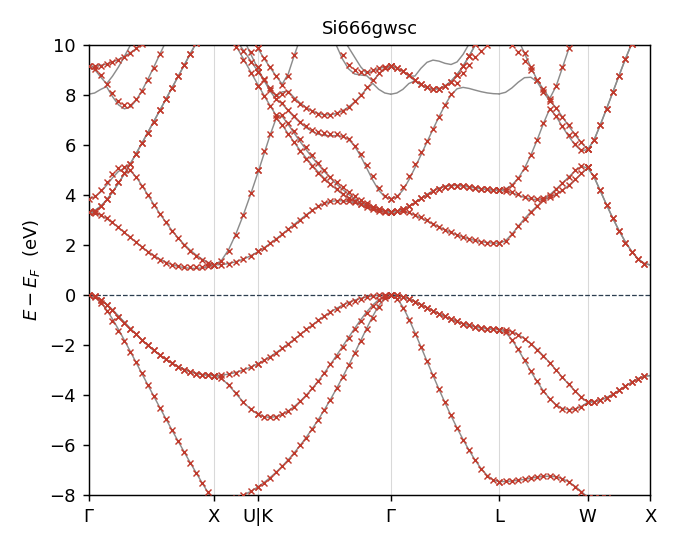

Si(**QSGW**、18 MTO = 2 原子 × sp³d⁵)。価電子帯から伝導帯 +5 eV まで
赤 × が灰線に完全に乗る。

---

図に「目的窓」の帯は描いていない。$\Delta$ が決めるのは
$e^{\rm cut}_{n''}=\max(\varepsilon_{\rm CBM}+\Delta,\ \varepsilon^{\rm MTO}_{n''})$ の
**上側の床だけ**で、下限は評価の都合にすぎない。しかも第 2 引数の
$\varepsilon^{\rm MTO}_{n''}$ が軌道ごとに違うので、**一本の水平線では描けない**。

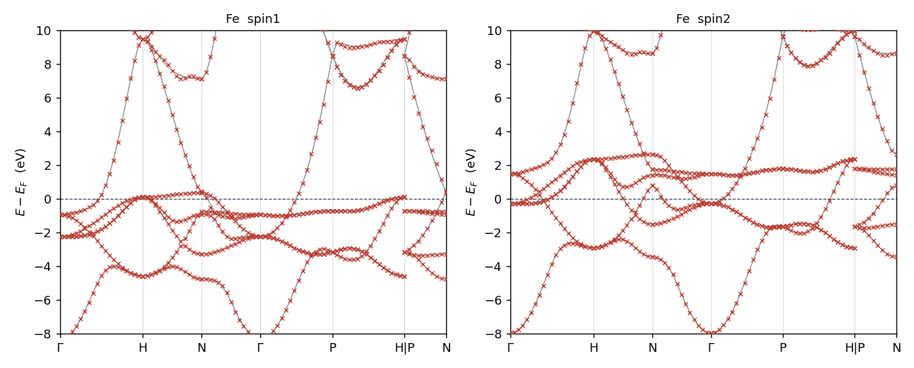

Fe(DFT、9 MTO = sp³d⁵)。majority と minority を並べた。**両スピンとも同等に乗る**。
FeCo も同様、NiO は両スピン同値で、**磁性系でスピンによる偏りは出ていない。**

---

### $w$ は効く — Fe の実例

Fe は既定の $w=2.0$ eV では合わせきれない。$w$ だけを 11 eV に上げると:

| Fe | 窓 (meV) | 占有 (meV) | 分散 |
|---|---:|---:|---:|
| $w=2.0$(既定) | 19.8 meV | 12.9 meV | 0.057 |
| **$w=11$** | **9.7 meV** | **9.0 meV** | **0.024** |

窓内の誤差が半分以下になる。ただし**バンド図を並べても違いは見えない** —
差は meV の桁で、図の縦軸では潰れてしまう。どこで効いているかは
準位ごとの誤差を第一原理側のエネルギーで分けて見る必要がある:

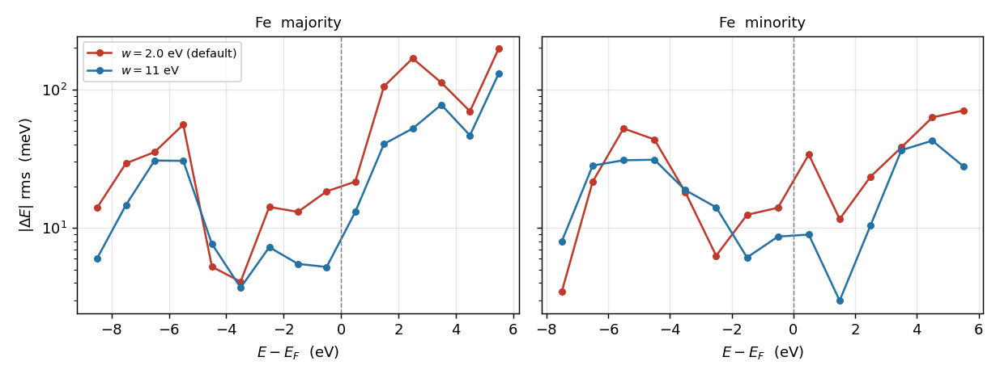

**効いているのは $E_F$ より上だけ**である。$0$〜$+5$ eV で 2〜3 倍改善する一方、
$E_F$ より下は勝ったり負けたりで、minority の $-7.5$ eV や $-2.5$ eV では
$w=2.0$ のほうが良い。これは床 $\varepsilon_{\rm CBM}+\Delta$ が $E_F$ の上にあり、
$w$ がその上での落ち方を決めているのだから当然である。
**「$w$ を上げれば良くなる」ではなく「$w$ は床より上の当たり方を決める」**
と読むべきで、$\delta E_{\rm occ}$ を別に立てているのもこのためである(§7)。

---

### 高エネルギー側 — トランケーションは滑らか

MLO 模型は MTO 部分空間の次元しかバンドを持たないので、どこかで第一原理バンドから離れる。
その離れ方がリンギングになっていないかを見るため、**MLO が伸びきるところまで**描いた
(`<系>_full.png`)。実測した上限:

| 系 (MTO 数) | MLO が伸びる上限 (eV) | 第一原理の上限 (eV) |
|---|---:|---:|
| NiO (16) | 1.6 eV | 141.8 eV |
| RuO₂ (22) | 5.5 eV | 146.9 eV |
| SrTiO₃ (14) | 8.4 eV | 153.6 eV |
| C.sp (sp のみ, 8) | 16.8 eV | 124.5 eV |
| FeMgO (76) | 29.7 eV | 152.0 eV |
| Si (18) | 28.8 eV | 108.3 eV |
| GaAs (18) | 31.6 eV | 116.5 eV |
| FeCo (18) | 31.8 eV | 142.6 eV |
| Al₂O₃:Cr (50) | 32.0 eV | 141.1 eV |
| Fe (spd, 9) | 32.8 eV | 124.6 eV |
| C (spd, 18) | 86.1 eV | 151.4 eV |

**軌道数と上限は比例しない。** NiO は 16 軌道で 1.6 eV までしか伸びず、
Fe は 9 軌道で 32.8 eV まで伸びる。どのチャネルを取るかで決まる
(NiO は Ni d と O p だけ、Fe は分散の大きい sp を含む)。
**目的の窓($E_F$ 近傍)に影響する話ではない。**

床の上でも MLO バンドは連続な曲線で、折れや振動は見えない。数値でも確かめた
— バンドに沿った $|d^2E/dx^2|$ の中央値(eV、括弧内は第一原理の同じ量):

| 系 / $E-E_F$ の範囲 (eV) | −10..0 | 0..3 | 3..8 | 8..15 | 15..25 | 25..40 |
|---|---|---|---|---|---|---|
| Si | 7.9 (8.1) | 12.5 (9.2) | 15.9 (14.2) | 24.2 (21.8) | 30.3 (45.1) | 20.4 (45.9) |
| Fe | 12.4 (10.2) | 45.8 (20.4) | 37.8 (24.5) | 41.3 (36.3) | 94.2 (54.8) | **216.3 (79.4)** |
| GaAs | 7.6 (6.5) | 15.7 (11.4) | 13.8 (13.4) | 24.4 (20.7) | 46.2 (37.4) | 36.4 (59.5) |
| Al₂O₃:Cr | 207.6 (138.2) | — | 62.8 (42.1) | 367.2 (216.7) | 307.7 (240.6) | 338.5 (586.1) |

Si・GaAs・Al₂O₃:Cr は**高エネルギー側で MLO の曲率が第一原理を下回る**
(Si は 20 対 46)。リンギングどころか元のバンドより滑らかである。
**Fe だけが 25 eV 超で 216 対 79 と 2.7 倍**になる。spd 9 軌道しかない模型が
33 eV まで引き伸ばされている領域で、模型の容量を超えている。

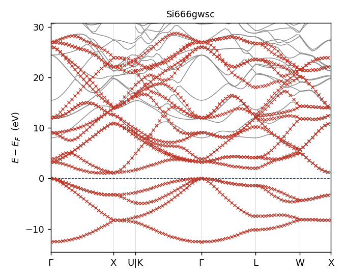

Si(QSGW)— 床(+3 eV)まで完全に一致し、その上は離れつつ 29 eV まで滑らかに伸びる。

---

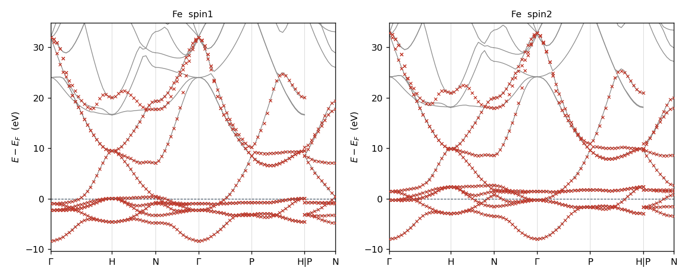

Fe — $E_F$ を横切る sp バンドをゾーン境界の 33 eV まで追えている。

---

### 参照バンドについて

比較相手はどの系も **PMT 基底で解いた第一原理バンド**で、実験値ではない。
そのうち **Si・Al₂O₃:Cr・RuO₂・GdION は QSGW**(`sigm.<sname>` を持つ)、
残りは DFT である。本書で「$\Delta E$」と書いているのは MLO 模型と
この第一原理バンドの差で、$m^*$比 の分母も同じ。

### 全サンプルのバンドプロット(灰線: 第一原理 PMT、赤 ×: MLO)

**課題 (1) — $E_F$ 近傍の模型**


Al₂O₃:Cr(50 軌道)— **この系が最終形の要点**。O 2p 価電子帯(−2〜−4 eV)、
ギャップ中の Cr d 準位($E_F$ 近傍)、CBM(+6.5 eV)、さらに上の帯まですべて乗る。
床を $E_F+\Delta$ に置くと CBM が拘束されずギャップが 128 meV 縮む。
手調整 `mlo_emax = 7 eV` を置いていたのはこの CBM を掴むためで、
method 4 の $\varepsilon_{\rm CBM}+\Delta$ はそれを自動で当てる。窓 7.2 meV。

---


FeMgO(76 軌道)— **本表の最良、窓 2.5 meV**。真空層 30.5 a.u. に空格子球 7 個を
入れた Fe/MgO スラブ。空格子球なしの 78 軌道模型は 126.9 meV だったので、
ほぼ同じ大きさで 51 分の 1 になる。詳細は §5。

---

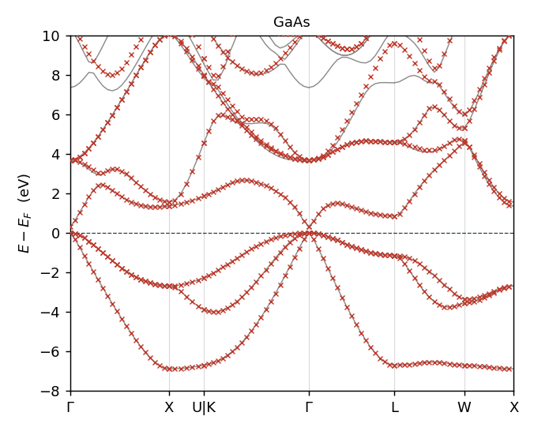

GaAs(18 軌道)— Γ 点の分散の大きい伝導帯を含めて一致。窓 8.5 meV、ギャップ +6 meV。

---

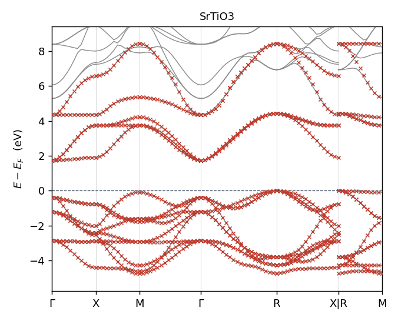


SrTiO₃(14 軌道、窓 8.9 meV)と RuO₂(22 軌道、窓 9.9 meV)。

---

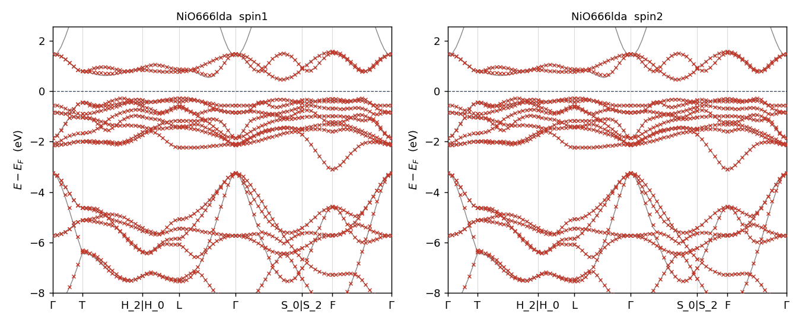

NiO(LDA、16 軌道)— sp と局在 d が共存する系。窓 15.4 meV に対し**占有側 18.5 meV** と
逆転しており、窓だけ見ていたら見落とす。

---

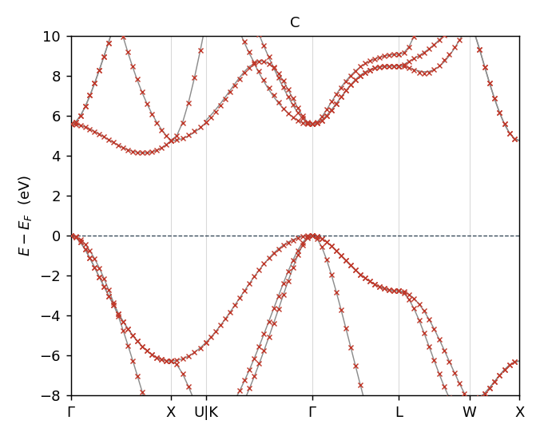


ダイヤモンド C — spd 18 軌道(窓 16.6 meV)と sp のみ 8 軌道(窓 26.7 meV)。
後者は伝導帯の一部が MTO 部分空間の外にあり、$m^*$比 0.65、ギャップ −39 meV。

---


FeCo(18 軌道、窓 8.3 meV)— 磁性金属で両スピンとも良く乗る。

---

---

### MLO フィッティング一覧 — 全サンプル

`Samples/MLOsamples` の 25 系すべて（灰: 第一原理 PMT バンド、赤 ×: MLO）。`testecalj` が
回すものと同じ入力・同じ参照。図は `SRC/exec/mlo_bandplot.py <sampledir>_work` で再生成。
表の後半 7 系は Materials Project の構造をそのまま `ctrlgenToml.py` に通し、
`mlo_lm` に全原子の s,p,d を入れて既定（$\Delta = w = 2$ eV）で回したもの
（2026-09-18、開発の記録 `MD/mlo_notes/mp_20260918/`）。

| 半導体・絶縁体 | | | |
|---|---|---|---|
| Si (QSGW) | GaAs (QSGW) | GaAs+SOC | C (diamond) |
|  |  |  |  |
| C.sp | SrTiO3 | Al2O3:Cr (QSGW80) | NiO (LDA, AFM) |
|  |  |  |  |

| 金属・磁性 | | | |
|---|---|---|---|
| Cu (d だけ) | Fe | Fe+SOC | FeCo |
| 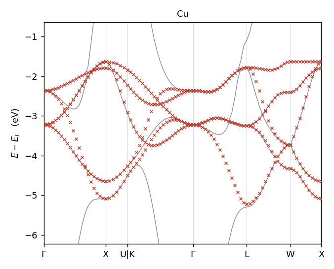 |  | 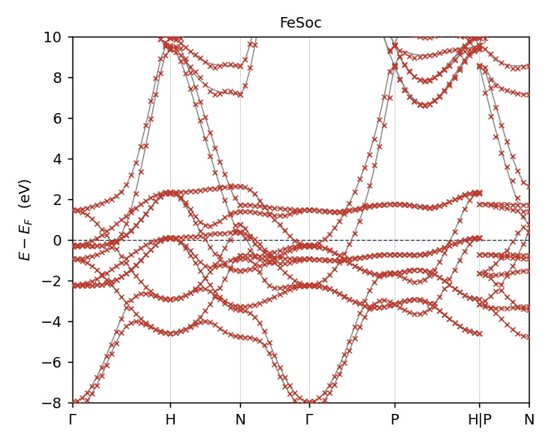 |  |
| RuO2 (QSGW) | GdCo5 (4f) | GdION (4f, QSGW) | SmP (4f, so=2) |
|  | 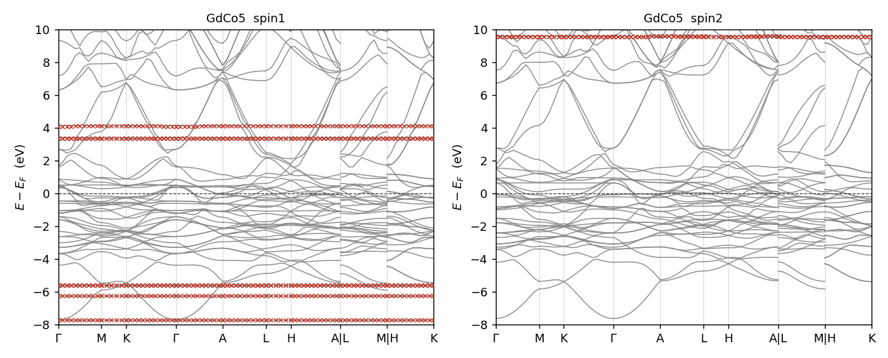 | 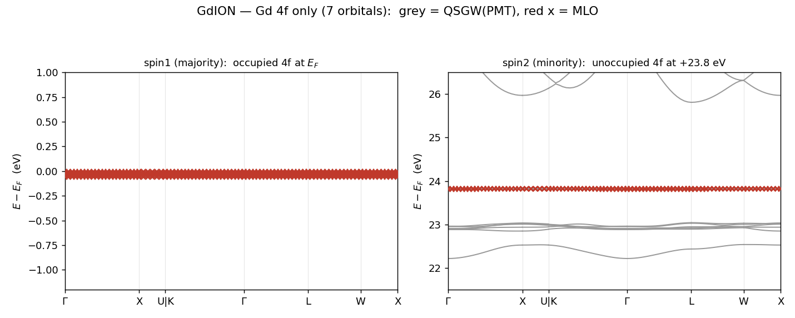 | 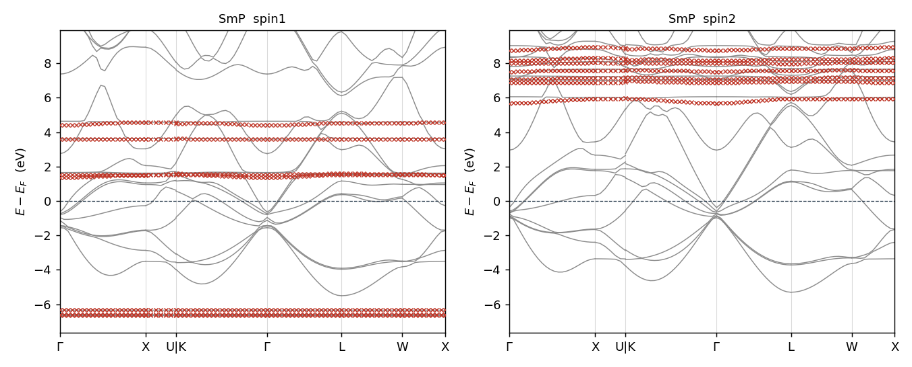 |

| スラブ | |
|---|---|
| FeMgO + 空格子球 (76 MLO) | FeMgO+SOC |
|  | 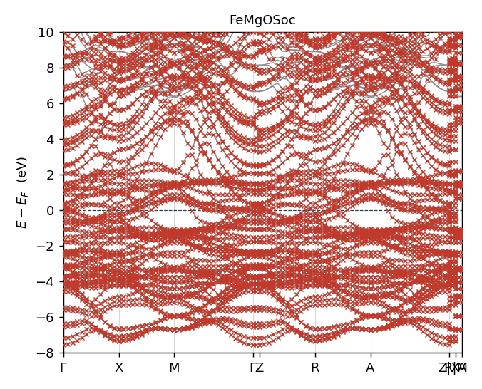 |

| Materials Project、既定のまま (DFT) | | | |
|---|---|---|---|
| Ag | Al | NaCl | SiC (3C) |
|  |  | 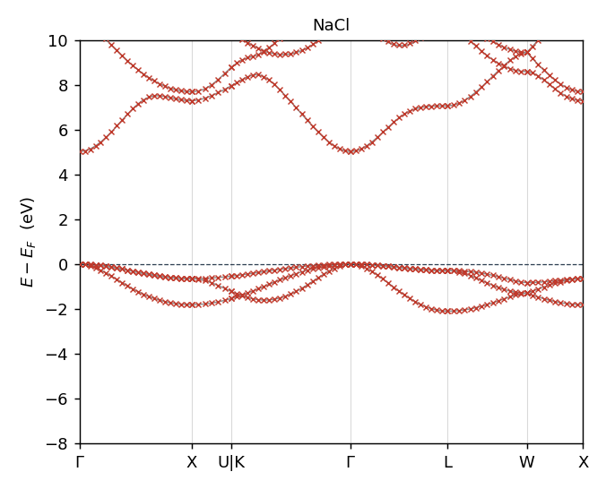 |  |
| CdTe | ZnO (Zn 3d は LO を模型に) | TiO2 (rutile) | |
| 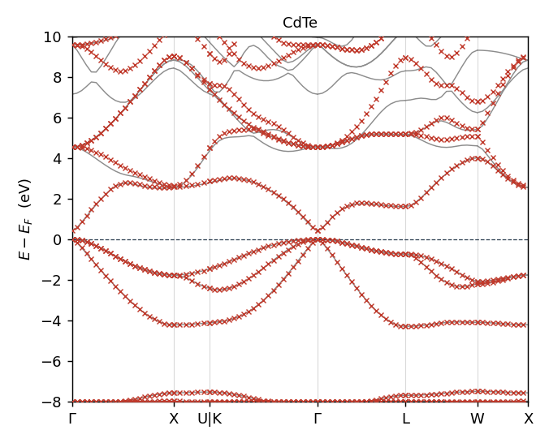 |  |  | |

MP 7 系の窓内 rms（2026-09-18 の評価。金属 [E_F−8, +2]、絶縁体 [E_F−8, CBM+3] eV で、今の `mlo_bandcheck.py` の窓（§9 の式 (9)）とは違う）: Ag 15, Al 74（自由電子帯は
窓外）, NaCl 2.9, SiC 3.3, CdTe 28, ZnO 0.8, TiO2 0.8 meV。

## 3. 部分バンドを取る模型 — d だけ / 4f だけ

こちらは**はじめから一部のバンドしか取らない**模型である。Cu の d 5 本、
4f 7 本といった具合で、窓の中の第一原理バンドの大半は模型に無い。
**§7 の窓型の損失はここには使えない** — 無いものを「再現できていない」と
数えてしまうからである。

| 系 | `mlo_lm` | 窓型損失 (meV) | これは失敗か |
|---|---|---:|---|
| Cu | Cu の lm 5–9(d のみ) | 147.8 meV | **否**。sp バンドを模型が持たないだけ |
| SmP | Sm の 10–16(4f のみ)、P は空 | 121.3 meV | **否**。価電子帯を持たない |
| GdION | Gd の 10–16(4f のみ) | 0.2 meV | 窓に 4f しか無く、逆に測れてしまう |
| GdCo5 | Gd の 10–16 のみ、Co 5 サイトは空 | (データ不足) | 同上 |

(2026-10-01 まで、ここには「`GaAsSoc` の窓 105.9 meV も同種の産物 — 比較対象が 2N スピノルで本数が合わない」と書いていた。
実際は SOC なしの DFT と比べていたため。§4 の warning と表 M2)

### 4f 模型 — 準位の重なりで測る

4f だけを取り出す模型は「模型の 7 本が第一原理の 4f 準位に乗っているか」で
測る。各 k 点で MLO の各準位から最も近い第一原理準位までの距離(meV):

| 系 | spin | method 0, 旧 (meV) | **method 4** (meV) |
|---|---|---|---|
| GdION | 1 | rms 0.19 / max 0.49 | **rms 0.19 / max 0.49** |
| | 2 | rms 1.76 / max 8.62 | **rms 1.85 / max 9.30** |
| GdCo5 | 1 | rms 10.99 / max 44.79 | **rms 12.46 / max 52.67** |
| | 2 | rms 13.78 / max 106.25 | **rms 14.43 / max 104.21** |
| SmP | 1 | rms 71.57 / max 265 | **rms 76.30 / max 278** |
| | 2 | rms 76.29 / max 273 | **rms 75.04 / max 275** |

**3 系とも method 4 は method 0 と同等**で、4f バンドは乗っている。

ただし **$\Delta$ はここでは効いていない。** 4f 準位 $\varepsilon^{\rm MTO}_{n''}$ は
床 $\varepsilon_{\rm CBM}+\Delta$ より遥かに下なので $e^{\rm cut}_{n''}$ は常に床側が選ばれ、
しかも GdION では床が $E_F+23.9$ eV(Gd イオンの巨大ギャップ)と全部より上に来るため
$\theta\approx1$、すなわち $A\approx S$(素の射影)に戻る。
**4f 模型にはバンド端の要求自体が無いので、$\Delta$ の「どこまで合わせたいか」
という意味が消える** — method 4 でも壊れないが、効いてもいない。

**SmP の rms 70–76 meV は元から。** 中央値は 6–13 meV なので大半の準位は合っており、
一部(max 275 meV)が外れる。Sm 4f は P 3p と混成するのに `mlo_lm` で P のチャネルを
一つも取っていないためと思われる。method の問題ではない。

**部分バンドだけを取る模型**(§3)


Cu — **d 5 軌道だけ**の模型。$E_F$ を貫く sp バンドを模型が持たないので、
窓型の損失は 147.8 meV になるが、**d バンド自身は乗っている**(図を見よ)。

**PMT バンドに対して有効なエネルギー下限を切っていないのもあって、いくらか
滑らかでない。** 式 (4) の $\theta$ は上側の床 $e^{\rm cut}_{n''}$ しか持たず、
下限が無いので、d の帯域より遥かに下の PMT 状態まで重み 1 で入ってくる。
$\Delta$ と $w$ を両方向に振っても散らばりは既定値より良くならず、最大誤差は
どの設定でも 1.0〜1.2 eV 残る。sp が d の帯域に入る $\mathbf{k}$ で第一原理側が
6 本あるのに模型は 5 本しか持てない、という模型空間の側の限界でもある。

---


GdION(Gd 単イオン、QSGW)— **占有と非占有の 4f を別々の窓で描いた**。
majority の 7 本は $E_F$ 直下($-0.06$ eV)、minority の 7 本は
**$+23.8$ eV** と $24$ eV 近く離れており、同じ縦軸には収まらない。
どちらも赤 × が灰線にそのまま乗る(rms 0.19 / 1.85 meV、上の表)。
minority の下に見える $+22.2$〜$+23.0$ eV の灰線は 4f ではない帯で、
模型が取っていないので赤 × が無い。

**この巨大なギャップが、4f 模型で $\Delta$ が効かない理由**でもある。
床 $\varepsilon_{\rm CBM}+\Delta$ は $E_F+23.9$ eV に置かれ、4f 準位の
ほとんど全部より上に来るので $\theta\approx1$、素の射影に戻る。

---


GdCo5 は Co 5 サイトを空にして Gd 4f だけ、SmP は P を空にして Sm 4f だけ。
準位の重なりで測った結果は上の表。

---

---

---

## 4. スピン軌道相互作用 — `job_mlo_soc`

SOC は MLO を**作り直さずに、あとから摂動として載せる**。スカラー相対論で
作った MLO 模型に $V_{\rm SO}$ を射影して足し、$2N\times2N$ のスピノルとして
解き直す形である。SOC 入りで自己無撞着を取り直す必要はない。

```bash
job_mlo_soc <sname> -np <N>
```

### 模型の作り方 — MLO は up と down で同一

SOC を入れる物質の MLO は、次の順に作る（`job_mlo_soc`、2026-10-01 にコードで確かめた）:

1. up と down を、**同じ PMT の基底**で計算する（全段で `nspin = 2`、`phispinsym = true`: 動径関数を up と down で平均して共通にする）。
   解くのはスカラー相対論の $H$（下の段 2、`so = 0`）
2. MLO は up と down で**同じシード・同じ本数**で作る（`m_HamPMT` の `Hreduction` をスピンごとに呼ぶ）。本数は §9 の式 (8) の
   $N_{\rm MLO}$ をそのまま数える（GaAs は 23、Bi₂Te₃ は 45。`lmlo` の `ndimMTO` もこの数）。非磁性の物質（GaAs・Bi₂Te₃）では
   up と down の $H$ が同じなので、**MLO そのものも同一**
3. その MLO の $H$ に $H_{\rm SO}$ を足して、up と down を合わせた $2N_{\rm MLO}$ 次元で対角化する（段 3、`m_mlo_ham` の `calc_ham_eigen`）:
   対角ブロック ↑↑・↓↓ はそれぞれのスピンの MLO の $H$ に $H_{\rm SO}$ の ↑↑・↓↓ 成分を足したもの、非対角ブロックは ↑↓ 成分。
   重なり行列は up と down のブロック対角で、一般化固有値問題として解く。出るバンドは $2N_{\rm MLO}$ 本で、`band_MLO_spin1.dat` に全部入る

つまり**模型の本数は非 SOC と同じ数え方**で、2 倍になるのはスピノルとして対角化する行列の次元だけである。

注意: $H_{\rm SO}$ を MLO に射影するときは、一つのスピン（down、最後のスピン）の MLO の係数（`zMLO`）を使う（`m_HamPMT`）。
up と down の MLO が同一であることを前提にした作りで、非磁性の物質では厳密、磁性体（FeSoc）では up のブロックについて近似になる。

### 3 段の手順

| 段 | コマンド | 何をするか |
|---|---|---|
| 1 | `lmf --quit=band --ctrlg:ham.so=1 --efermi=efermi_soc` | フル LS のスピノルを全 BZ メッシュで解き **SOC の $E_F$** を決め、`efermi_soc` に直接書く（`efermi.lmf` には触れない）|
| 1b | `lmf --band --ctrlg:ham.so=1 --efermi=efermi_soc` | 同じ条件で対称線の上の **DFT のバンド（スピン軌道あり）** を `bnd*.spin1` に書く。MLO と比べる相手（2026-10-01 から）。前の run の `bnd*`・`band_MLO_spin2.dat` は始めに消す（`mlo` は段 3 で空の spin2 をまた書く。描画と評価は飛ばす） |
| 2 | `lmf --writeham --socmatrix --ctrlg:ham.so=0` | スカラー相対論の $H$ を `__HamiltonianPMT` に、**SOC 行列を `__HamiltonianPMTsoc` に別ファイルで**書く |
| 3 | `mlo --socmatrix --efermi=efermi_soc` | PMT→MLO 縮約のあと SOC 行列を MLO に射影し、対称線上で $2N\times2N$ を対角化。窓の基準は `efermi_soc`（SOC の値）|

共通で `--ctrlg:ham.nspin=2 --ctrlg:ham.phispinsym=true` が付く。
`phispinsym`(スピン平均した動径関数)が要るのは、$\langle\uparrow|L_z|\downarrow\rangle$
の代わりに $\langle\uparrow|L_z|\uparrow\rangle$ を使うためである。

~~**1 段目が `efermi.lmf` を SOC の値で上書きする**点に注意。非 SOC の計算を
同じディレクトリで続けるなら、`efermi.lmf` を退避しておくこと
(サンプルは非 SOC 版を同梱してある)。~~
→ 2026-09-26 以降は `efermi.lmf` を書き換えない（1 段目が `efermi_soc` に直接書き、3 段目もそれを読む）。

::: warning SOC の MLO は、スピン軌道ありの DFT と比べる
`job_mlo_soc` の MLO バンドはスピン軌道入りなので、比べる DFT のバンドもスピン軌道入りでなければならない。スピン軌道なしの
`job_band`（ctrlg の `so = 0`）と比べると、価電子帯の頂上が $\Delta_{\rm SO}/3$ 上がるぶん食い違って見える（GaAs では CBM が 0.10 eV
低く見え、rms 0.12 eV）。このため 2026-10-01 から `job_mlo_soc` が段 1b で比べる相手を自分で描く。`mlo_bandcheck.py` は、スピン軌道ありの
MLO とスピン軌道なしの DFT（`llmf_band` の `HAM_SO`、無ければ ctrlg の `so`）を比べようとすると `WARNING` を出す。
MLO の窓の基準（$E_F$ と CBM）は `--efermi=` のファイル（SOC では `efermi_soc`、それ以外は `efermi.lmf`）から取る。2026-10-01 の夜までは
$E_F$ だけ `qplist.dat`（最後に回したバンドの計算が書く）の 1 行目から取っていて、SOC の MLO は前に回した非 SOC の `job_band` の $E_F$
（GaAsSoc では SOC の $E_F$ より 0.0082 Ry 低い）を使っていた。`qplist.dat` の値は今は図の 0 点（DFT の `bnd*` と同じ基準）にだけ使う。
:::

### 実装上の要点

- **対称化はスピノルとして行う。** SOC は $\mathbf{L}\cdot\mathbf{S}$ なので、
  little group の回転や $\mathbf{k}_{\rm IBZ}\to\mathbf{k}_{\rm BZ}$ の回転では
  軌道部分 $R$ とスピン部分 $D^{1/2}(R)$(SU(2))のテンソル積として
  $(R\otimes D)\,V_{\rm SO}\,(R\otimes D)^\dagger$ と作用させる
  (`so3_to_su2`, `spinor_rotate` in `m_HamPMT.f90`)
- **射影の基底を合わせる。** `cmlo` は PMT *固有状態* 基底、`hammhsop` は
  PMT *基底関数* 基底なので、$z_{\rm MLO}=z_{\rm PMT}\,c_{\rm MLO}$ で後者に
  揃えてから $H^{\rm MLO}_{\rm SO}=z_{\rm MLO}^\dagger\,H_{\rm SO}\,z_{\rm MLO}$
- `--skiphammsoc` は `lso=1` でも $H$ に SOC を足さないためのフラグ(摂動を
  後段で当てるため)

### 結果 — 非 SOC と同程度

**表 M2**. SOC の模型の誤差（eV）。`mlo_bandcheck.py`（§9 の式 (9)〜(11)、窓 [VBM − 8, CBM + 2]）で、DFT もスピン軌道あり（段 1b）

| 系（MLO の本数） | ギャップの誤差 | rms MLO → DFT / DFT → MLO | 同じ系の非 SOC（`job_mlo`） |
|---|---:|---:|---|
| GaAsSoc（23） | +0.010 | 0.010 / 0.010 | GaAs: +0.007、0.007 / 0.007 |
| FeSoc（9） | 金属 | 0.017 / 0.017 | Fe: 0.016 / 0.016 |
| FeMgOSoc（76） | 金属 | 0.003 / 0.003 | FeMgO: 0.001 / 0.001 |

非 SOC と同じ程度で、**SOC を入れても劣化しない**。空格子球を入れた模型（§5）でも 3 段は問題なく通る。
（2026-10-01 まで、ここには窓型の損失（`mlo_losscheck.py`）で FeMgOSoc 3.9、FeSoc 21.9 meV と書いていた。比べる相手の DFT が
スピン軌道なしだったので取り下げた。）


上から FeMgOSoc、FeSoc、GaAsSoc。灰の線がスピン軌道ありの DFT（段 1b）、赤の × が MLO。
GaAs の価電子帯の頂上の分裂 $\Delta_{\rm SO}$ は DFT 0.337 eV、MLO 0.335 eV。

---

> **注意**: SOC の MLO（$2N_{\rm MLO}$ 本）は、スピン軌道ありの DFT と比べる（上の warning）。試料の `bnd*` に残っている
> 非 SOC の DFT（`GaAsSoc` の Test 1 の比べ相手）と比べてはいけない。試験の参照は `band_MLO_spin1.soc.dat` の側。
> （2026-10-01 まで、ここには「`GaAsSoc` の窓型損失が 105.9 meV と出るのは本数が合っていないだけ」と書いていた。実際は非 SOC の DFT と比べていたため）

---

## 5. FeMgO — 真空スラブに空格子球を置く

長らく「$\theta$ をどう変えても合わない外れ値」だった系である。原因は
$\theta$ でも method でもなく、**模型が置かれていない領域があったこと**だった。
同じ落とし穴は真空層を持つスラブなら何にでもあるので、独立の節にする。

### 何が起きていたか

まず構造の理解が誤っていた。Fe/MgO の**界面**ではなく、**真空層 30.5 a.u. を持つ
スラブ**(Fe 3 層 + MgO 3 層、$c=47.8$ a.u.)である。$E_F+0.7$〜$1.0$ eV に集中して
いた残差は界面状態ではなく**表面/真空状態**で、真空領域に基底関数が一つも無いので
**サイト中心の MTO では原理的に表現できなかった**。$\theta$ をどう作っても
無いものは作れない。

### 空格子球の置き方

真空に空格子球($Z=0$)を 7 層置いた。**半径は自分で決める**:

- $R=1.9$ a.u. なら表面の O ($R=1.75$) と Fe ($R=2.28$) のどちらにも当たらず、
  `lmchk` の報告する重なりは 0%
- 層は表面からの逃げを確保して等間隔に並べる
- 面内は $(0,0)$ と $(\tfrac12,\tfrac12)$ を交互(スラブの積層を継続)

```toml
[[site]]
atom = "E"          # 空格子球
xpos = [0.0, 0.0, 0.3]
[[spec]]
atom = "E"
z    = 0
r    = 1.9          # 自分で決める。lmchk で重なりを確認すること
lmx  = 2            # DFT 側は s,p,d を持たせる (下記)
lmxa = 2
```

**`r = 0.0` は MT 球なしの浮遊軌道**を意味するので、球を置きたいなら明示すること。

### 効果 — 空格子球を足すと 1 桁

majority / minority の窓内誤差(meV):

| 模型 | MLO 本数 | 窓 (meV) |
|---|---:|---:|
| 空格子球なし | 78 | 126.9 / 73.5 |
| ES に s のみ | 85 | 2.2 / 1.1 |
| **ES に s,p + Mg,O の d 削除(採用)** | **76** | **2.5 / 1.3** |
| ES に s,p | 106 | 1.8 / 1.1 |
| ES に s,p,d | 141 | 1.6 / 0.9 |

**空格子球 1 個あたり s を 1 本、合計 7 本足すだけで 126.9 → 2.2 meV**(58 分の 1)。
MLO は 78 → 85 本で 9% しか増えない。ここが一番大きい効き目である。

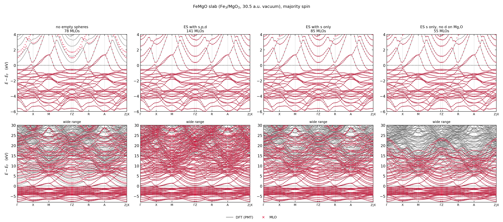

4 列が模型、上段が $E_F$ 近傍、下段が広域。**左上(空格子球なし)を見よ** —
$E_F$ の上 $+0.5$〜$4$ eV に**赤 × の乗っていない灰線**が残っている。これが
真空側にしみ出す表面状態である。価電子帯($-6$〜$0$ eV、Fe 3d と O 2p)は
空格子球が無くても合っており、**欠けていたのは真空側の状態だけ**だった。

右の 3 枚($141$ / $85$ / $55$ 本)は**上段ではほとんど区別がつかない**。
下段の広域では、一番小さい模型だけ $+20$ eV 以上が空く — 削った Mg,O の d と
空格子球の p,d がそこを担っていた。

---

### 空格子球には p まで入れる

上の表では s だけでほぼ足りているように見えるが、**$E_F$ の上を細かく見ると
p が要る**。窓型の損失(窓は $E_F\pm2$ eV)がそこを測っていないだけである。

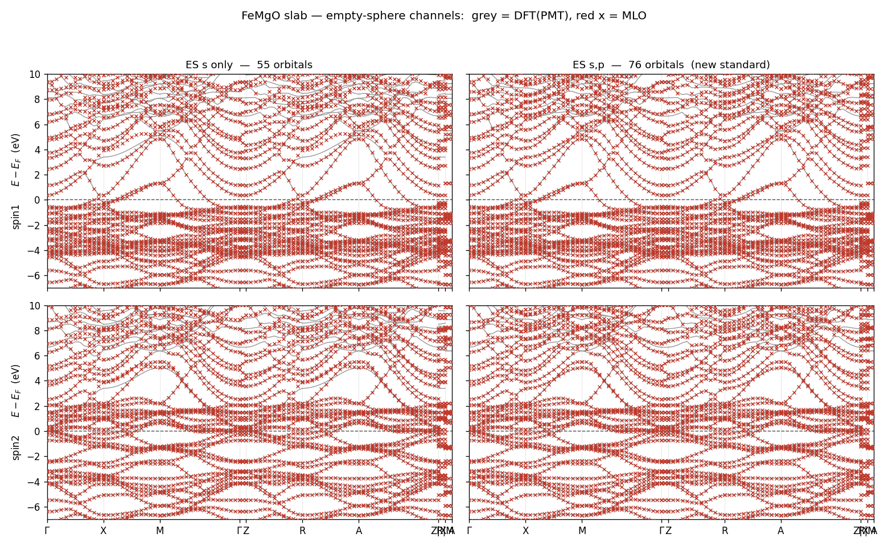

左が ES に s のみ(55 本)、右が s,p(76 本)。$-7$ 〜 $+10$ eV で描くと、
**左は $+5$〜$+10$ eV に赤 × の乗っていない灰線が残る**のに対し、右は埋まっている。

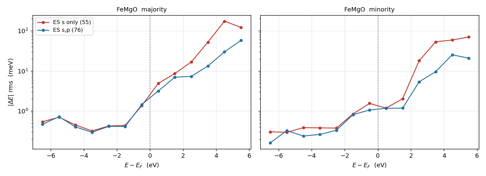

準位ごとの誤差を第一原理側のエネルギーで分けると、どこで効いているかが分かる:

| 領域 | ES s のみ (55) | ES s,p (76) |
|---|---|---|
| $-7$ 〜 $-1.5$ eV(価電子帯) | 0.3〜0.7 meV | **同じ** |
| $E_F$ 〜 $+2$ eV | やや悪い | 少し良い |
| **$+2$ 〜 $+6$ eV** | 20〜170 meV | **3〜5 倍良い** |

全体の数字でも:

| | 軌道数 | 窓 (meV) | 占有 (meV) | 分散 | 準位ごと平均 (meV) | 最大 (meV) |
|---|---:|---:|---:|---:|---:|---:|
| ES s のみ | 55 | 3.1 | 0.6 | 0.008 | 15.9 / 11.4 | 860 |
| **ES s,p(採用)** | **76** | **2.5** | **0.5** | **0.006** | **8.3 / 6.0** | **294** |

窓型の損失では 3.1 → 2.5 meV と控えめだが、**準位ごとに見ると平均が半分、
最大が 860 → 294 meV と 3 分の 1** になる。窓の外での改善なので、窓型の指標には
ほとんど出てこない。§7 で「一方向では決まらない」と書いているのはこういう事情である。

### 採用した模型 — 76 本

`Samples/MLOsamples/FeMgO` と `FeMgOSoc` はこの **76 軌道**の模型で、入力一式を
共有する(`mlo_lm` は Fe が s,p,d の 9 本、Mg が s,p の 4 本、O が p の 3 本、
空格子球が s,p の 4 本: 3×9 + 3×4 + 3×3 + 7×4 = 76)。Fe と Mg の基底には
f の MTO もあるが模型には入れていない。

元の空格子球なしの模型は 78 本だったので、**ほぼ同じ大きさで窓内誤差が
126.9 → 2.5 meV(51 分の 1)**になる。


用途は磁気ゆらぎの計算で、必要なのは $E_F$ 近傍である。そこだけなら 55 本でも
足りるが(上の表)、**+10 eV まで使うなら p を入れておくほうがよい**。
7 サイト × 3 = 21 本の増加で済む。

### 落とし穴 2 つ

**(a) `mlo_lm` だけを絞る。`[[spec]]` の `lmx` は 2 のままにする。**
DFT 計算側で $Z=0$ の球から $l$ チャネルを削ると動径方程式が発散し `lmf` が落ちる:

| `[[spec]]` の E | 結果 |
|---|---|
| `lmx=2, lmxa=2` | **収束** |
| `lmx=1, lmxa=1` | `lmf` rc=11。動径解が $-20$ Ry へ発散 |
| `lmx=1, lmxa=2` | 同上 |
| `lmx=1, lmxa=2` + `p` 明示 | 同上。$e=+20$ Ry で `q` が桁あふれ |

動作する場合の空格子球の pnu は 1.509 / 2.256 / 3.150 (s/p/d) で、これを `p` として
与えても直らない。既知の `yh3fcc_gwsc666` の暴走と同じ症状である。
**DFT には s,p,d を持たせ、MLO の選択は `mlo_lm` で行う**のが筋の通ったやり方。

**(b) 真空スラブには ESM が要る。`[esm]` を書き忘れないこと。**
真空層があると Coulomb の $G=0$ 成分の扱いでエネルギーのゼロ点が決まる。
`[esm]` が無いと `lmf` は通常の周期境界で解き、**警告一行を出すだけで止まらない**。
FeMgO では $E_F$ が **4.4155 eV** ずれた。全エネルギー・`Vesav`・磁気モーメントは
8〜13 桁一致するので、Fermi エネルギーを比べるまで何も異常に見えない。

```toml
[esm]
boundary  = "vac/slab/vac"   # 真空(-z)/スラブ/真空(+z)
origin    = -8.63717         # (a.u.)
shiftmode = 0
zb        = [23.907104, -23.907104]   # (a.u.)
potential = [0.0, 0.0]       # (Ry)
field     = [0.0, 0.0]       # (Ry/a.u.)
```

**`esm_input.dat` は廃止した(2026-09-16)。** 設定は `ctrlg.<sname>.toml` の
`[esm]` セクションに書く。Fortran は `ctrlg` 以外を読まないので(2026-09-17)、
`esm_input.dat` が残っていると `lmf` は**止まって** `ctrlg_absorb.py <sname>` を
案内する(黙って ESM 無しで走らないように、無視ではなく abort):

| 状況 | `ctrlg_absorb.py` がすること |
|---|---|
| `ctrlg` に `[esm]` が**ある** | そちらが使われる。`esm_input.dat` は **`esm_input.dat.bk`** へ退避され、`.bk` の冒頭に「この設定は使われなかった」と記録される |
| `ctrlg` に `[esm]` が**ない** | `esm_input.dat` を変換して `ctrlg` に `[esm]` を書き込み(GW セクションの前)、原本を **`esm_input.dat.bk`** へ退避(移送先を `.bk` 冒頭に明記) |

`Legacy2toml.py` も同じ規則で変換する。詳細は
[ESM](./lmf#esm-effective-screening-medium)。

> この件で長く回り道をした。同じ `rst` から別の機械で別の $E_F$ が出るのを見て
> コンパイラや MPI を疑い、rst のバイナリ互換性・`atmpnu`・負の電荷密度・非決定性を
> 順に潰したが、真相は新サンプルを組み立てたときに `esm_input.dat` を
> コピーし忘れていただけだった。`Vesav` が 13 桁一致していた時点で密度側は無実と
> 分かるので、**SCF のログを先に diff すべきだった。**

---

---

## 6. 有効相互作用 $W$ — `job_mloW`

MLO 模型でバンドが再現できたら、次に要るのは**その模型の中での電子間相互作用**
である。模型ハミルトニアンに載せる Hubbard $U$、磁気ゆらぎの計算で使う
相互作用がこれにあたる。cRPA で言う「模型空間に射影した遮蔽相互作用」で、
MLO 基底で評価するのが `job_mloW` である。

### 何を計算するか

MLO 軌道 $i,j,k,l$ と格子ベクトル $\mathbf{R}$、振動数 $\omega$ について

$$
V_{ijkl}(\mathbf{R})=\langle ij|v|kl\rangle,
\qquad
W_{ijkl}(\mathbf{R},\omega)=\langle ij|W(\omega)|kl\rangle
\tag{6}
$$

を計算し、**$V$ と $W-V$ を別々のファイルに書く**。オンサイト対角成分
$i=j=k=l$、$\mathbf{R}=0$、$\omega=0$ が、模型の $U$ に相当する量である。

```bash
job_mloW <sname> -np <N>
```

lmfa → lmf → `--jobgw=0/1` → `qg4gw` → `heftet` → `hbasfp0` → `mlo` →
`hvccfp0` → `hwmatK_MPI` → `hx0fp0` → `hwmatK_MPI` の順に回る。
**MLO のバンド計算 (`job_mlo`) より重い** — GW の部品を一通り通るためである。

### MLO の規格化 — 実空間で 2 乗積分が 1

MLO は各 $\mathbf{k}$ で PMT の固有状態の重み付きの和として作るので、そのままでは長さが 1 でない。
$U$ や $J$ を「長さ 1 の軌道の値」として読むには、**実空間の MLO** を規格化する。
$\mathbf{k}$ メッシュ（$N_k$ 点）の上の MLO の Bloch 関数 $F_i(\mathbf{k})$ から作る実空間の MLO
$F_{i\mathbf{0}}=N_k^{-1}\sum_{\mathbf{k}}F_i(\mathbf{k})$ の 2 乗積分は

$$
N_i=\int|F_{i\mathbf{0}}(\mathbf{r})|^2d\mathbf{r}
=\frac{1}{N_k}\sum_{\mathbf{k}}O_{ii}(\mathbf{k})=O_{ii}(\mathbf{R}=\mathbf{0})
\tag{7a}
$$

で、生の MLO の模型の重なり行列の $\mathbf{R}=0$ の対角成分である。模型を定義する `mlo`（`job_mlo`、`lmf --mlo`）は、まず
$F_i\to F_i/\sqrt{N_i}$ とし（**$\mathbf{k}$ によらない定数**）、続けて次の小節の式 (7f) で各 $\mathbf{k}$ で直交化する。Löwdin の直交化は入力の軌道の尺度で
結果が変わる（入力に最も近い正規直交系を選ぶので、先に各軌道の長さをそろえておく）。$N_i$ は `HamRsMLO` の末尾に書き、以後 MLO を作る所
（`job_mloW` の `__cmlo`、MLO-QSGW の sugw・`m_sigmlo`）はすべて同じ定数で割ってから同じ直交化をする（2026-10-02）。

- 生の MLO の $N_i$ は 1 よりずっと小さい: Ni の d で 0.38、SrVO₃ の t₂g で 0.18、bcc Fe の d で 0.21〜0.33、s・p で 0.01〜0.02
  （窓の上で重みが落ちるため）。規格化しないと $V$ の $U$ が Ni で 3.4 eV（規格化して 24 eV）のような値になる
- **$\mathbf{k}$ ごとに $1/\sqrt{O_{ii}(\mathbf{k})}$ で割ってはいけない**（旧 `--mlo_diagnorm`、廃止）。因子が $\mathbf{k}$ によるので実空間の軌道の形が変わり、
  メッシュから外れた $\mathbf{k}$ の MLO バンドが動く（C で 0.74 eV、Al で 0.10 eV）
- `hwmatK_MPI` は GW のメッシュで測った $N_i$ を確かめとして表示する（`lwmatK1` の `square integral of the real-space MLOs on the GW mesh`）。
  模型のメッシュ（`mlo_nkabc`）と GW のメッシュが違うので 1 から少しずれる。GW のメッシュが粗いと、その周期の箱の中で軌道が自分の像と重なってずれが大きい
  （SrVO₃、2³ で 1.06。Ni、4³ で 0.999）。そのずれは $U$ に 2 乗で効く

### MLO の標準: Löwdin で直交化した関数（射影 Wannier）

MLO は各 $\mathbf{k}$ で直交していない。各 $\mathbf{k}$ で

$$
|\tilde F(\mathbf{k})\rangle=|F(\mathbf{k})\rangle\,O(\mathbf{k})^{-1/2},\qquad O_{ij}(\mathbf{k})=\langle F_i(\mathbf{k})|F_j(\mathbf{k})\rangle
\tag{7f}
$$

とした関数は、MLO と同じ部分空間を張る正規直交な局在関数で、MLO の部分空間の射影 Wannier 関数である。実空間では、MLO から重なっている
隣の軌道を重なりの半分ずつ引いた形 $\tilde w_j=\varphi_j-\tfrac12\sum\Delta\,\varphi+\cdots$（$\Delta$ は実空間の重なりの非対角）。
$O(g\mathbf{k})=D(g)O(\mathbf{k})D(g)^\dagger$ なので、もとの MLO と同じ表現で回り、軌道の名前（t₂g、e_g など）と対称性を保つ。

**2026-10-02 から、ecalj の MLO はこの関数である。** 模型は $\tilde H(\mathbf{R})$ だけで持ち（$\tilde O(\mathbf{R})=\delta_{\mathbf{R}0}$）、
$\mathbf{k}$ メッシュの外のバンドは $\tilde H(\mathbf{R})$ のフーリエ和の対角化で得る。スピン軌道の行列、`__cmlo`（$V$、$W$、cRPA、マグノン）、
MLO-QSGW の $\Sigma$ もすべてこの基底である。メッシュ上のバンドは直交化の前と同じ。`job_mlo <sname> --mlo_raw`（lmf に渡る）で直交化しない以前の
模型（$H(\mathbf{R})$ と $O(\mathbf{R})$ の二本立て）を作れる。比較のためだけの選択で、以後のプログラムは `HamRsMLO` に書いた印で同じ基底を選ぶ。

直交化した関数は、直交のために隣の原子の上で振動するが、中心に寄る（広がり $\Omega$: bcc Fe の t₂g で 1.72 → 1.46 bohr²、Ni の d で 9.88 → 9.42）。
模型の行列要素も遠方で小さい（bcc Fe、$|\mathbf{R}|=5a$ で $\max|H|$ 2.9×10⁻³ Ry、$\max|O|$ 2.8×10⁻³ に対し $\max|\tilde H|$ 4.3×10⁻⁴ Ry）。
メッシュの外の内挿は表 M8 のとおりで、$E_F$ 近くでは直交化した方がよい。

*表 M8*. 生の MLO の模型 $(H,O)$ と直交化した模型 $\tilde H$ のメッシュの外のバンドの誤差（63 物質、§9 の検査と同じ DFT・同じ道筋、eV）。
$E_F$ 近くは $[{\rm VBM}-1,{\rm CBM}+1]$（金属は $E_F\pm1$）

| | 生 $(H,O)$ | 直交化 $\tilde H$ |
| --- | --- | --- |
| §9 の検査を通る物質 | 53 | 55 |
| 窓全体: rms の中央値 / 最大の中央値 | 0.0050 / 0.035 | 0.0040 / 0.030 |
| $E_F$ 近く: rms の中央値 / 最大の中央値 | 0.0048 / 0.019 | 0.0032 / 0.011 |

- $E_F$ 近くで大きく良くなるもの: Cu 0.107 → 0.008、Ni 0.054 → 0.010、C 0.078 → 0.031（ギャップの誤差 −0.038 → −0.013）。悪くなるもの: 2H-SiC 0.035 → 0.051、
  MnO 0.007 → 0.030。窓全体では bcc Fe の 4s 帯の底（$E_F-8$〜$-3$ eV）だけが 0.03 → 0.10
- 模型の重なりが 1 になるので、§9 の検査の重なりの最小固有値（2026-10-02 までの判定 3）は意味を失い、帯のとげ（式 (12)）に替えた。`mlo` の出力（`lwriteham`）の
  `Smallest eigenvalue of the normalized raw overlap` がメッシュ上の直交化の前の値（63 物質で 0.22〜0.31）

- 直交化で裾どうしの重なりの寄与が中心に集まり、オンサイトの $U$ が増える（bcc Fe の d、既定の窓、$\omega=0$: 1.564 → 1.704 eV）。
  最近接のサイト間の密度どうしの $W$ は $U$ の 2 % で、基底によらない
- マグノン（遮蔽をすべて含んだ $W$ を使う）は、窓（`mlo_delta`、`mlo_w`）にほとんどよらなくなる。生の MLO では窓で大きく動き、Goldstone の条件のための
  倍率 $\eta$ も窓で 0.78〜1.18 と動いた。Löwdin では Fe 1.23〜1.24、FeCo 1.26〜1.28、Ni 1.75〜1.77。Wannier 関数を使った以前の計算のマグノンと、
  FeCo・Ni で 0.01 eV 以内、Fe で q ≥ 0.5 がほぼ重なる（`Samples/Magnon/Fe_mlo_magnon` の README）
- 最大局在化（Marzari–Vanderbilt）をさらに重ねることもできるが、拘束をつけないと s・p・e_g が結合の方向にずれた混成軌道になり、軌道の名前を失う。
  点群の拘束（Sakuma, PRB 87, 235109）をつけると、Fe の t₂g の広がりは Löwdin からさらに 7 % 縮むだけ。既定にはしない（試作 ecalj の `TOOLS/gadget/mlo_maxloc.py --sym`）

### 出力の読み方

スピンごとに 2 ファイル。単位は **eV**。

| ファイル | 中身 |
|---|---|
| `Coulomb_v.UP` / `.DN` | $V_{ijkl}(\mathbf{R})$ |
| `Screening_W-v.UP` / `.DN` | $W_{ijkl}(\mathbf{R},\omega)-V_{ijkl}(\mathbf{R})$ |

列は `main_wannier_hwmatK.f90` の書式そのままで:

```
 Wannier  ir1 irws1  Rx Ry Rz  is i j k l  [omega omega2]  Re  Im
```

`Coulomb_v` には $\omega$ の 2 列が無く、`Screening_W-v` には有る。
**欲しいのは $\mathbf{R}=0$、$i=j=k=l$、$\omega=0$ の実部**で、
`Samples/MLOsamples/Fe/test.py` の `_parse_diag()` がその抜き出しの実例である。

$$
W_{\rm onsite} = V + (W-V)
\tag{7}
$$

として足し合わせる。

### $V$ と $W-V$ は巨大に打ち消す

Fe(bcc、sp³d⁵ 9 軌道)の d 軌道、majority スピン:

| d 軌道 (lm) | $V$ (eV) | $W-V$ (eV) | $W$ (eV) |
|---|---:|---:|---:|
| 5, 6, 8 ($xy$, $yz$, $xz$) | 22.91 | −21.40 | **1.510** |
| 7, 9 ($3z^2-1$, $x^2-y^2$) | 22.90 | −21.24 | **1.661** |

（2026-10-02、式 (7a) の規格化。`Samples/MLOsamples/Fe/test.py` の期待値）

**$V\approx23$ eV と $W-V\approx-22$ eV が打ち消して $W\approx1.6$ eV になる。**
$W$ は $V$ の 7% しかない。したがって:

- **$V$ や $W-V$ を単独で見て議論してはいけない。** 模型の作り方を少し変えると
  どちらも 1〜2 eV 動くが、その 90% は相殺する
- **$W$ の相対誤差は $V$ の相対誤差の 14 倍に増幅される。** $V$ が 1% ずれれば
  $W$ は 14% ずれる勘定になる

### 模型の作り方に $W$ はどれだけ依存するか

Fe の d 軌道、$W$ の平均(eV)。この表は 2026-09-16 の測定で、MLO を $\mathbf{k}$ ごとに規格化していた（旧 `--mlo_diagnorm`）。
式 (7a) の規格化では値が 1〜6 % 動く（上の表）が、模型の作り方による違いの大きさの議論はそのまま成り立つ:

| 模型 | $W_{\rm UP}$ (eV) | $W_{\rm DN}$ (eV) |
|---|---:|---:|
| method 0(旧サンプル) | 1.6684 | 1.5972 |
| method 4、$w=2.0$(既定) | 1.5815 | 1.4248 |
| method 4、$w=11$ | 1.6308 | 1.5546 |

$V$ の d 成分は method 0 → 4 で UP $-0.9$ eV、DN $-1.7$〜$-2.1$ eV 動くが、
上記の打ち消しで**残る $W$ の変化は UP $-5.2$%、DN $-10.8$%** である。
minority の d は $E_F$ の上にあって床 $\varepsilon_{\rm CBM}+\Delta$ に近いので、
majority の倍ほど動く。

$w$ を上げると $W$ は戻る($w=11$ で UP $+3.1$%、DN $+9.1$%)。
バンドの当たりも $w=11$ のほうが良い(§2)。

> **どの $W$ が正しいかは、ここでは決まっていない。**
> 確かめたのは「**$W$ は模型の作り方に 10% の桁で依存する**」ことだけである。
> $w=11$ のほうがバンドの当たりは良いが、それは床より上の領域での話で、
> $W$ を直接検証したわけではない。method 0 の値が $w=11$ に近いことも、
> method 0 を基準と見なす理由にはならない。
>
> したがって実用上は、**$W$ を使うなら $w$ 依存を自分の系で確かめること。**
> 既定値をそのまま使って 10% を気にしないで済むかどうかは用途次第である。
> サンプルは 18 系すべて既定値で統一してある。

### cRPA — `job_mloW --crpa`

模型の中の遮蔽を除いた $W$（constrained RPA）。各 $\mathbf{k}$ のバンド $n$ が MLO の部分空間にどれだけ入っているかを

$$
p_{\mathbf{k}n}=\big[C\,(C^\dagger C)^{-1}C^\dagger\big]_{nn},\qquad
|F_j(\mathbf{k})\rangle=\sum_n|\psi_{\mathbf{k}n}\rangle C_{nj}
\tag{7b}
$$

で測り（MLO の部分空間への射影の対角成分。$0\le p_{\mathbf{k}n}\le1$、$\sum_n p_{\mathbf{k}n}$ = MLO の本数）、$\chi_0$ の遷移
$\mathbf{k}n\to\mathbf{k}+\mathbf{q}\,n'$ に

$$
1-p_{\mathbf{k}n}\,p_{\mathbf{k}+\mathbf{q}\,n'}
\tag{7c}
$$

を掛ける（重みの方式、Şaşıoğlu–Friedrich–Blügel, PRB 83, 121101）。$p$ は射影なので MLO の規格化 (7a) によらない。
`job_mloW <sname> --crpa` が、v と $W-V$ の後に `hwmatK_MPI --mlo`（10011: `pkm4crpa` に式 (7b)）→ `hx0fp0`（10011）→
`hwmatK_MPI --mlo`（100）を回し、`Screening_W-v_crpa.UP/DN` を書く（形式は `Screening_W-v` と同じ）。模型の部分空間は `mlo_lm` そのもので、
d だけ（Ni）や t₂g だけ（SrVO₃、`mlo_lm` の lm = 5 6 8）の模型を作って使う。試験は `TestInstall/ni_crpa`・`srvo3_crpa`。

**表 M7**. MLO と Wannier 関数（2026-10-02 まで ecalj にあった最大局在化、`genMLWFx`）の比較。$\omega=0$ のオンサイトの平均（eV）、
$U=(ii|ii)$、$J=(ij|ji)$。$\Omega$ は式 (7e) の広がり（bohr²、括弧は Marzari–Vanderbilt の形）

| 系（GW の k メッシュ） | 方法 | $\Omega$ | $V$ の $U$ | RPA の $U$ | cRPA の $U$ | cRPA の $J$ |
|---|---|---:|---:|---:|---:|---:|
| SrVO₃ t₂g（4³） | MLO | 7.51 | 15.77 | 0.715 | 3.125 | 0.437 |
| SrVO₃ t₂g（4³） | Wannier | 6.37（6.13） | 15.99 | 0.730 | 3.149 | 0.444 |
| Ni d（4³） | MLO | t₂g 2.02、e_g 1.90 | 23.80 | 1.405 | 2.838 | 0.645 |
| Ni d（4³） | Wannier | t₂g 1.47、e_g 1.58（1.44、1.54） | 26.00 | 1.575 | 3.779 | 0.768 |

- t₂g が孤立した SrVO₃ では、cRPA の $U$ が 1 % 以内で一致する
- d が s と絡む Ni では、MLO の d のほうが広く（$\Omega$ で 2〜4 割）、cRPA で除く遮蔽が少ない（$(U_{\rm cRPA}-U_{\rm RPA})/V$ が 0.060 対 0.085）。
  Wannier 関数の d の部分空間は広い窓（$E_F\pm10$ eV）から作られて s・p 的なバンドにも乗り、式 (7c) で d ↔ s,p の遷移も一部除かれる。
  どちらが正しいということではなく、部分空間の取り方の違いである
- GW の k メッシュが粗いと、式 (7a) の規格化が GW のメッシュの上で 1 からずれ（SrVO₃、2³ で 1.06）、$U$ が 1 割ずれる。$U$ を使うなら 4³ 以上で
- 比較の数値と作業場所は研究ログ 2026-10-02 00:32。Wannier の経路は git のタグ `last-wannier` のコミットにある
- 表 M7 の MLO は生の MLO の値。Löwdin の基底（標準、2026-10-02 から）では、Ni の d（4³）の cRPA の $U$ は 2.90 eV（生 2.84、Wannier 3.78）で、
  RPA の $U$ は 1.434 eV。窓を広げると cRPA の $U$ は (4, 2) で 3.13、(6, 2) で 3.30 eV と動くが、RPA の $U$ は 1.43〜1.52 eV とあまり動かない。
  cRPA は「模型の部分空間の中の遮蔽」を除く量なので部分空間の取り方にそのまま依る（帯がもつれた系では、重みの方式か射影の方式か、Wannier の
  disentanglement の窓などの選び方にも依る）。遮蔽をすべて含んだ RPA の $W$ は軌道の形を通してしか依らない

### MLO の広がり — `mlo_spread.py`

```bash
mlo_spread.py <sname> -np <N>        # job_mloW の後（__cmlo、GW の固有関数、HamRsMLO、QBZ.chk を使う）
```

GW の k メッシュの隣り合う点を結ぶ $\mathbf{b}$（近い殻から足して $\sum_b w_b b_\alpha b_\beta=\delta_{\alpha\beta}$）について
$M_{ij}(\mathbf{k},\mathbf{b})=\langle u_{i\mathbf{k}}|u_{j\mathbf{k}+\mathbf{b}}\rangle$ を `huumat --dwnb=mlo --job=2` で作り、MLO ごとに

$$
\langle\mathbf{r}\rangle_i=-\frac{1}{N_k}\sum_{\mathbf{k},\mathbf{b}}w_b\,\mathbf{b}\,{\rm Im}\,M_{ii}(\mathbf{k},\mathbf{b})
\tag{7d}
$$

$$
\langle r^2\rangle_i=\frac{2}{N_k}\sum_{\mathbf{k},\mathbf{b}}w_b\big[O_{ii}(\mathbf{k})-{\rm Re}\,M_{ii}(\mathbf{k},\mathbf{b})\big],
\qquad \Omega_i=\langle r^2\rangle_i-|\langle\mathbf{r}\rangle_i|^2
\tag{7e}
$$

を bohr で出す。式 (7e) は $|u(\mathbf{k}+\mathbf{b})-u(\mathbf{k})|^2$ の和で、各 $\mathbf{k}$ で長さ 1 を仮定しない（式 (7a) の MLO は各 $\mathbf{k}$ では 1 でない）。
Marzari–Vanderbilt の $\ln M$ の形との差は $|\mathbf{b}|$ が小さいほど小さく、粗いメッシュ（2³〜4³）では 4〜10 % 大きく出る（表 M7 の括弧）。どちらもメッシュを細かくするほど実空間の 2 次のモーメントに近づく。

### 回帰試験

`Samples/MLOsamples/Fe` はこの $V$、$W-V$ のオンサイト対角 9 成分 × 2 スピンを
**参照ファイルではなく `test.py` に直書き**して照合する(許容 0.05 eV)。
模型の作り方を変えると値が動くので、変えたら期待値も更新すること。

---

## 7. 誤差の測り方 — 一方向では決まらない

### 定義 — 生の量をベクトルで持つ

用途によって重んじる方向が変わるので、**スカラーに潰さずベクトルで持つ**。
規格化も 2 乗もしない。どれくらいずれているかが直接読めるほうがよい。
実装は `SRC/exec/mlo_losscheck.py`。

| 量 | 意味 | 単位 |
|---|---|---|
| $\delta E_{\rm win}$ | 窓 $\mathrm{VBM}-2$ 〜 $\mathrm{CBM}+2$ eV(金属 $E_F\pm2$ eV)の $\Delta E$ rms | meV |
| $\delta E_{\rm occ}$ | 占有側 $E_F-12$ 〜 $E_F-2$ eV の $\Delta E$ rms | meV |
| $\delta v/v$ | 分散(経路方向の勾配)の相対誤差 | 無次元 |
| $\delta E_{\rm gap}$ | バンドギャップ誤差(符号付き、絶縁体のみ) | meV |
| $m^*$比 | $m^*_{\rm MLO}/m^*_{\rm DFT}$(絶縁体のみ) | 無次元 |

$m^*$比 は**比であって誤差ではない**。1.00 が一致、1.18 なら MLO の質量が 18% 重い。
$v=\partial\varepsilon/\partial x$ は対称線経路座標 $x$ についての勾配で、
$\delta v/v$ の分母は窓内の第一原理側の勾配の rms。
準位の対応づけは順序を保つ最適割当(動的計画法)で、縮退・交差・バンド数の差に耐える。

$\delta E_{\rm occ}$ を別に立てるのは、**窓だけ見ていると深い価電子帯の劣化を
見落とす**ためである(Si は $w$ を上げると窓内はほぼ不変なのに
$-12..-9$ eV が 2.5 → 10.7 meV と悪化する)。

### 既定値での各量

既定 $\Delta=w=2.0$ eV での実測は §2 の表のとおり。特徴的なのは
**Si の $6^3$ と $8^3$ の差**($\delta E_{\rm win}$ 20.0 → 7.1 meV、
$\delta E_{\rm gap}$ +38 → +3 meV、$m^*$比 1.41 → 1.03)で、
$6^3$ の値は補間の雑音を含む。**Si は $8^3$ を基準に取ること。**

### 方向ごとの最適 $w$

$\Delta$ 固定で $w$ を振り、**各量を最小にする $w$**(eV)。括弧内はそこでの値
(ΔE は meV、$\delta v/v$ と $m^*$比 は無次元):

| 系 | 窓 | 占有 | 分散 | ギャップ | m\*比 |
|---|---|---|---|---|---|
| Fe (9) 金属 | 10.9 (5.2) | 10.9 (4.5) | 10.9 (0.012) | — | — |
| Cu (9) 金属 | 10.9 (8.5) | 10.9 (2.7) | 10.9 (0.027) | — | — |
| RuO₂ (22) 金属 | 1.8 (8.1) | 2.7 (9.5) | 1.8 (0.030) | — | — |
| Si $8^3$ (18) 絶縁 | 1.8 (5.7) | 2.7 (2.8) | 2.0 (0.005) | 2.0 (+2) | 2.7 (1.00) |
| GaAs (18) 絶縁 | 1.8 (7.4) | 2.0 (1.5) | 2.0 (0.008) | 1.4 (+1) | 2.0 (1.02) |
| Al₂O₃:Cr (50) 絶縁 | 2.0 (6.7) | 2.0 (2.2) | 2.0 (0.003) | 1.8 (+1) | 1.8 (1.03) |
| C.sp (8) 絶縁 | 2.7 (14.9) | 3.4 (2.7) | 3.4 (0.005) | 3.4 (−4) | 4.1 (0.83) |

**系の中では各量がよく揃う**($\pm0.7$ eV 以内)。割れるのは**系をまたいだとき**で、
Fe・Cu の 10.9 eV と半導体の 1.8–2.7 eV は 6 倍違う。したがって系ごとの $w$ 最適化は
well-posed であり、固定値一つで全系を満たすことはできない。

### $w$ を大きくする極限は誤差自身が罰する

$\theta=\sigma((\varepsilon-e^{\rm cut})/w)$ は $w\to\infty$ で $\sigma\to1/2$、
すなわち $A\propto S$ となり $F^{\rm MLO}\to F^{\rm MTO}$、つまり
**MTO 部分空間だけで対角化した限界**に達する。その極限は実際に悪い:

| $w$ (eV) | 10.9 | 27 | 68 | 272 |
|---|---:|---:|---:|---:|
| Fe | **7.8** | 39.8 | 151 | 309 |
| Cu | **7.8** | 44.7 | 148 | 367 |
| Si $8^3$ | 546 | 1230 | 2704 | 2854 |

(広窓 $E_F-12$〜$+5$ eV の $\Delta E$ rms、meV)

**MTO だけの限界は Fe でも 309 meV ずれる。** よって「MTO に戻ってはいけない」という
制約を外から課す必要はなく、誤差が自分で上限を与える。Fe・Cu の最適 $w=10.9$ eV は
自明極限に近いからではなく、そこが有限の最適点だからである。

### $E_F$ 以下の振る舞いは系で逆を向く

第一原理バンドのエネルギーでビン分けした $\Delta E$ rms (meV):

| Fe / $E-E_F$ (eV) | $-9..-6$ | $-6..-4$ | $-4..-2$ | $-2..0$ | $0..+2$ |
|---|---:|---:|---:|---:|---:|
| $w=1.8$ eV | 37.2 | 20.2 | 14.6 | 21.2 | 53.2 |
| $w=10.9$ eV | **6.6** | **4.5** | **4.1** | **3.2** | **9.9** |

| Si $8^3$ / $E-E_F$ (eV) | $-12..-9$ | $-6..-4$ | $-4..-2$ | $-2..0$ | $0..+2$ |
|---|---:|---:|---:|---:|---:|
| $w=1.8$ eV | **2.5** | **3.6** | **4.4** | 5.2 | **4.2** |
| $w=4.1$ eV | 10.7 | 7.2 | 6.8 | **3.3** | 57.8 |

Fe は $w$ を上げると**全ビンが改善**するが、Si は逆で、$E_F$ 直下だけが少し良くなり
**深い価電子帯と伝導帯が悪化**する。$E_F$ 近傍だけを見ていると $w$ を上げたくなるが、
広く見ると損をする — $\delta E_{\rm occ}$ を別に立てているのはこのためである。

### メッシュ — $m^*$比 とギャップは粗いメッシュで決めてはいけない

$\Delta=2.45$ eV 固定、Si。各セルは $\delta E_{\rm win}$ (meV) / $\delta E_{\rm gap}$ (meV) / $m^*$比:

| $w$ (eV) | $6^3$ | $8^3$ | $10^3$ |
|---|---|---|---|
| 1.8 | 20.7 / +50 / 1.64 | **5.6 / +3 / 1.05** | **3.7 / −5 / 0.93** |
| 2.0 | 18.3 / +39 / 1.42 | 6.8 / +2 / 1.02 | 5.8 / −3 / 0.95 |
| 2.7 | 19.4 / +25 / 1.18 | 14.8 / +5 / 1.00 | 14.3 / +3 / 0.96 |
| 4.1 | 45.3 / +50 / 1.02 | 44.6 / +40 / 0.96 | 44.4 / +38 / 0.93 |

$6^3$ は $w=3.4$ eV を最良と言うが $8^3$/$10^3$ は $2.0$ eV と言う。
**$6^3$ は系統的に大きい $w$ を良く見せる。**
$8^3$ と $10^3$ でギャップ誤差の符号が逆($w=1.8$ eV で $+3$ / $-5$ meV)なのは
$H(\mathbf{R})$ 打ち切りの超格子依存性なので、**2 つのメッシュで一致する範囲**を採る。

### 使い方 — 単純規則

1. **$\Delta$ は宣言であって調整ノブではない。** 「バンド端から上に何 eV まで
   合わせたいか」を書く。評価する窓の上端と同じ値にする。既定 **2.0 eV**。
2. **既定 $w=2.0$ eV でまず計算する。**
3. **残差が大きければ $w$ だけを動かす。** 1 次元で足りる。実測の最適値は
   半導体 2.0 eV 前後、Fe・Cu のような単原子遷移金属 11 eV、RuO₂ 1.8 eV。
4. **半導体は $8^3$ 以上のメッシュで判断する。** $6^3$ は $m^*$比 とギャップに
   補間の雑音が乗り、系統的に大きい $w$ を良く見せる。Si の $8^3$ が基準になる。

> `mlo_w` の既定は **method 依存**にしてある。`mlo_method = 4` では 2.0 eV、
> 旧 method 0/1/2/3 では 2.72 eV(= 0.2 Ry の従来値)。旧 method を使う
> 既存サンプルの結果とその参照ファイルを変えないためで、`mlo_w` を明示すれば
> どの method でもその値が使われる。

$\Delta$ の効きは $w$ よりはるかに弱い。$\Delta$ を 1→4 eV と振っても誤差の変化は
数割だが、$w$ は Si $8^3$ で 1.8 eV → 4.1 eV とするだけで窓の誤差が
5.6 → 44.6 meV と 8 倍になる。**動かすのは $w$ でよい。**

既定を $\Delta=2.45$ / $w=2.72$ eV から $2.0$ / $2.0$ eV に変えた根拠
(全 12 系の平均、生の誤差):

| 既定 | $\delta E_{\rm win}$ | $\delta E_{\rm occ}$ | \|$\delta E_{\rm gap}$\| |
|---|---:|---:|---:|
| 旧 $\Delta=2.45$, $w=2.72$ eV | 16.9 meV | 11.6 meV | 16 meV |
| **新 $\Delta=w=2.0$ eV** | **15.0 meV** | **7.4 meV** | **13 meV** |

効いたのは SrTiO₃ の占有側 52.9 → 5.5 meV と Al₂O₃:Cr の窓 17.5 → 7.2 meV。
悪化したのは C.sp(14.9 → 26.7 meV)で、これは $w$ を上げたい側の系である(§4)。

---

## 8. 残る問題

以下はすべて `mlo_method = 4`(§1 の最終形)で測り直したもの。

### 解決済み

- **Al₂O₃:Cr のギャップ** — 付録 D (c) の実装で **−128 → +7 meV**($m^*$ 比 0.58 → 1.08)。- ~~**FeMgO をサンプルに入れるのは保留** — 機械依存が残っているため。~~
  **解決した(2026-09-15)。機械依存ではなく、私が `esm_input.dat` を
  新サンプル `FeMgO_ES` にコピーし忘れていただけだった。**

  FeMgO は真空層 30.5 a.u. を持つスラブなので、既存の `Samples/MLOsamples/FeMgO/` には
  2 月から **`esm_input.dat`**(ESM = Effective Screening Medium)が入っている。
  そこから `FeMgO_ES` を組み立てたときにこれを落とした。
  ファイルが無いと `lmf` は静電ポテンシャルを通常の周期境界で解き、
  ログに一行出すだけで**停止しない**:

  ```
  ローカル: esmsmves: ESM is not turned on, you need esm_input.dat for ESM mode
  kt1     : effective screening medium method jesm=  1
            system : vaccum(-z)/slab/vaccum(+z)
  ```

  真空を含むスラブでは Coulomb の $G=0$ 成分の扱いがエネルギーのゼロ点を決めるので、
  ESM の有無で固有値が丸ごとずれる。実測:

  | 量 | ローカル(ESM なし) | ローカル(ESM あり) | kt1 |
  |---|---|---|---|
  | $E_F$ (Ry) | $-0.05833040$ | $-0.3828614963792108$ | $-0.3828614963782127$ |
  | mmom | 8.419083 | 8.4130803741493 | 8.4130803741352 |
  | sev (eV) | $-1241.428$ | $-1544.360816089$ | $-1544.360816089$ |
  | `val*vef` (Ry) | $-253.66$ | $-257.64$ | $-257.64$ |

  `esm_input.dat` を置くだけで **$E_F$ は 12 桁一致**する。
  バンドそのものも kt1 と一致する(`bnd001`、4563 点):

  | | 最大差 | rms |
  |---|---|---|
  | spin1 | $4.8\times10^{-8}$ eV | $2.5\times10^{-9}$ eV |
  | spin2 | $5.1\times10^{-8}$ eV | $2.6\times10^{-9}$ eV |

  `testecalj` の許容値 0.001 eV に対して 5 桁の余裕がある。**機械依存は無い。**
  失敗の仕方が悪い: ecalj の `SRC/subroutines/esmsmves.f90`（[GitHub](https://github.com/tkotani/ecalj/blob/main/SRC/subroutines/esmsmves.f90)）の
  `open(...,status='old',err=201)` はファイルが無いと `jesm=0` のまま一行書いて `return` し、
  **異常終了しない**。真空スラブの計算が黙って別物になる。

  ずれ幅は $0.3245311$ Ry $=4.4155$ eV で、これは以前
  「$H$ が $c\,O$ に比例して $c=0.342$ Ry ずれる」と測っていた量そのものである。

  **その後の措置(2026-09-16)**

  1. `esm_input.dat` を廃止し、`ctrlg.<sname>.toml` の **`[esm]` セクション**へ移した。
     当初は Fortran がその場で移行していたが、翌 09-17 に「Fortran は ctrlg 以外を
     読まない」に統一: ファイルが残っていれば abort して `ctrlg_absorb.py` を案内する。
     変換は `ctrlg_absorb.py` / `Legacy2toml.py` が行い、`[esm]` が既に有ればそちらを
     残し、無ければ変換して ctrlg に説明付きで書く。原本はどちらの場合も
     `esm_input.dat.bk` へ移し、冒頭に移送先(または「TOML 側が使われた」)を書く。
     $c/a>3$ なのに `[esm]` が無ければ警告も出す。
  2. **`FeMgOSoc` も同じ病気だった。** `FeMgO` と `ctrlg` も `rst.femgo` も
     バイト一致の同じスラブなのに `esm_input.dat` が置かれておらず、
     $E_F$ が $+0.07203343$ Ry(ESM 無し)対 $-0.25231238$ Ry(ESM 有り)、
     差 $4.4129$ eV。ESM で収束させた `rst` を ESM 無しで展開した参照になっていた。
  3. **サンプルを空格子球ありの 55 軌道模型に一本化した。**
     空格子球なしの旧 78 軌道模型(`mlo_method=0`, `mlo_emax=5`)は削除し、
     `FeMgO` も `FeMgOSoc` も入力一式を共有する形にした。ローカルで実測:

     | | 軌道数 | dE_win | dE_occ | dv/v |
     |---|---|---|---|---|
     | 旧(空格子球なし) | 78 | 113.3 meV | 7.7 meV | 0.270 |
     | **新(空格子球あり)** | **55** | **3.1 meV** | **0.6 meV** | **0.008** |

     旧模型は全サンプル中で最悪だった。テストが通っていたのは自分の参照を
     再現していただけで、模型の精度とは別である。
     空格子球ありでも `job_mlo_soc` の 3 段は問題なく通り、
     SOC の $E_F$ は $-0.3826348900$ Ry(非 SOC から 3.1 meV シフト)。
  4. その過程で **`readbandedge` の黙ったフォールバック**が見つかった。
     `efermi.lmf` が無いと `ecbot` が $E_F$ に落ちるので、method 4 の床が
     $\varepsilon_\mathrm{CBM}+\Delta$ ではなく $E_F+\Delta$ になる。
     FeMgO では $\varepsilon_\mathrm{CBM}-E_F=0.0148$ eV の差が θ を通って
     MLO バンドを $2.2$ meV 動かし、許容値 $7.4\times10^{-5}$ Ry を超えた。
     警告を出すようにし、サンプルに `efermi.lmf` を同梱した。
     絶縁体ならギャップ幅ぶん丸ごと外すので、これは実害のある穴だった。

  > **切り分けに時間をかけすぎた。** rst のバイナリ互換性、`atmpnu`/`__atm`、
  > 負の密度の警告、非決定性 — どれも潰したが、どれも無実だった。
  > `Vesav` が 13 桁一致していた時点で密度側は無実と分かるので、
  > **`llmf_ef`(SCF/band 1 段目の出力)を先に diff すべきだった。**
  > 一行で `ESM is not turned on` と書いてある。
  > 「空格子球が引き金」という見立ても誤りで、引き金は `esm_input.dat` の有無だけ。

- **Cu (spd) の残差** — 実体は無く、**評価側の産物が 2 つ重なっていた**。
  1. $E_F\pm1.5$ eV の窓に入るのは 92 k 点中 **21 点だけ**。Cu の d バンドは全て
     $-1.5$ eV より下にあり、窓に居るのは急峻な sp バンドだけである。
     誤差は局所傾き 10–14 eV/x の点に集中し、**傾き $<5$ eV/x に限ると
     rms は 0.051 → 0.017 eV** と他系並みになる。傾き 13 eV/x のバンドでの
     0.05 eV は経路座標で 0.004 のずれにすぎない。
  2. 「ギャップ誤差 $-76$ meV」は、第一原理側の最大占有 $-0.077$ eV と最小非占有 $+0.122$ eV の
     差 0.1995 eV が判定閾値 0.15 eV を超え、**Cu を絶縁体と誤判定**したもの。Cu は金属。
     判定を「占有本数が $\mathbf{k}$ によらず一定か」に変えて修正済み
     (Cu 5/6、Fe 5–9、RuO₂ 18–21 に対し Si/GaAs/Al₂O₃/NiO は一定)。

### 生きている

- **固定 $w$ では半導体と金属を同時に満たせない。** §3 のとおり最適 $w$ は
  半導体 0.13–0.20、Fe・Cu 0.80 と 6 倍違い、どちらも有限の最適点である。
  系ごとの最適化は well-posed だが、**固定値一つで全系は満たせない**。
  既定を $0.20$ から半導体寄りの $0.15$ に下げる余地はある(未変更。
  変更すると testecalj の MLO 参照ファイルの再生成が要る)。

- **Si の $6^3$ の $m^*$ は信用できない。** $6^3$ でギャップ +25 meV・$m^*$ 1.18、
  $8^3$ で +5 meV・1.00(§2)。振れは補間の雑音であり模型の欠陥ではない。
  **パラメータ調整を $6^3$ の $m^*$ で行ってはいけない**(§3 のメッシュの項)。

### 使ってはいけない指標(記録)

検討の途中で $E_F\pm1.5$ eV の rms を使っていたが、**ワイドギャップ系では無効**だった。
バンドファイルの零点が VBM に取られるため $E_F$ が価電子帯上端付近に来て、
価電子側しか見ない。C.sp で $w$ を 0.20 → 0.80 と広げると
$E_F\pm1.5$ は 0.0064 → 0.0170 と鈍い一方、ギャップ誤差は $-18$ → $+822$ meV と暴走する。
現在の測り方(§3)はこの指標を使っていない。

---

---

## 9. 模型の選び方 — 基準 1・2・3

ecalj の `Samples/MATERIALS` は **LDA の計算と MLO の計算のサンプル**で、62 物質（構造のデータベースを展開したもの）と
La₂CuO₄・InAs/GaSb 超格子（16 原子）・BaTiO₃ の入力がある。その 65 物質で、LDA（Eu の化合物は LDA+U）の自己無撞着計算のあと
MLO の模型を作り、対称線の上で DFT のバンドと比べた（2026-10-01）。スピン軌道を入れる GaAs_so・Bi₂Te₃ は `job_mlo_soc`（§4）。

### 3 つの基準

**表 M3**. MLO の模型の 3 つの基準

| 基準 | MLO のシード | 書く所 |
|---|---|---|
| 基準 1 | `mlo_lm` の EH（H〜Ne は s,p、Na 以降は s,p,d、4f が価電子の原子は f も）と、局所軌道（帯の上端が $E_F-8$ eV より上なら EH と入れ替え、$E_F-17$〜$-8$ eV なら EH に加える） | 局所軌道は自動（`m_HamPMT`、§1。`lmlo` に判定が出る） |
| 基準 2 | 基準 1 ＋ 陽イオンの s,p に EH2（第 2 の smooth Hankel 関数）のシード。陽イオンから遷移金属と 4f・5f の原子を除く | `mlo_lm2` |
| 基準 3 | 基準 1 ＋ 空隙に置いた空格子球（$z=0$）の s,p のシード | `[[site]]`・`[[spec]]`・`mlo_lm`。基底が変わるので `lmfa` から回し直す（置き方は §5） |

基準 1 の半内殻の帯は、**同じ種類の原子の局所軌道をまとめた部分空間**への重みが 1/2 を超える占有状態で見る
（La₂CuO₄ の La 5p は 2 つの La に半分ずつ広がり、1 原子ずつ見ると見つからない）。Ga 3d・In 4d・Eu 5p・La 5p・Sr 4p のように
O・N の 2p と混ざる半内殻が模型に入り、その 2p の帯が合う。

基準 2 の EH2 は、空隙の大きい構造（閃亜鉛鉱の MgX・CdTe・ZnTe、wurtzite の AlN）で、隙間に広がった伝導帯の底を表す。
§1 の「(原子, lm) あたり MLO は 1 本まで」の例外にあたる（窓の中に同じ性格の第 2 のバンドがある）。

**MLO の本数**はシードの本数で、原子 $a$（空格子球も 1 つの原子と数える）ごとの和になる:

$$
N_{\rm MLO}=\sum_{a}\Big(N^{\rm EH}_a+N^{\rm EH2}_a+N^{\rm LO}_a\Big),\qquad
N^{\rm EH}_a=\sum_{l\in L_a}(2l+1),\quad
N^{\rm LO}_a=\sum_{l\in L^{\rm LO}_a}(2l+1)
\tag{8}
$$

$L_a$ は `mlo_lm` の原子 $a$ の行にある $l$（s,p で 4、s,p,d で 9、s,p,d,f で 16。部分殻なら書いた lm の数）、$N^{\rm EH2}_a$ は `mlo_lm2` の行の lm の数
（s,p で 4、`!` の行は 0）、$L^{\rm LO}_a$ は EH に**加えた**局所軌道の $l$（`lmlo` の `SHALLOW: LO added` の行。`mlo_lm3` に書いた原子はその lm の数）。
局所軌道が EH と入れ替わる $l$（`IN THE WINDOW`）は $L_a$ の側で数える（本数は変わらない）。
スピン分極した系は各スピンに $N_{\rm MLO}$ 本。スピン軌道を入れる物質も数え方は同じ（MLO は up と down で同一。そこに $H_{\rm SO}$ を足して
$2N_{\rm MLO}$ 次元で対角化する手順は §4）。`lmlo` の
`Dim of |MLO1>based Hamiltonian HamRsMTO=` が式 (8) の $N_{\rm MLO}$。例:

- GaAs: 基準 1 は Ga 9 ＋ As 9 ＋ Ga 3d の LO 5 ＝ 23、基準 2 は Ga の EH2 4 を足して 27
- MgTe: 基準 1 は Mg 9 ＋ Te 9 ＝ 18（半内殻の LO は深い）、基準 2 は 22
- ZnTe: 基準 1 は Zn 9 ＋ Te 9 ＝ 18（Zn 3d の LO は −6.5 eV で EH と入れ替え）、基準 2 は 22
- NiO（反強磁性、Ni 2・O 2）: 9×2 ＋ 4×2 ＝ 26（各スピン）
- La₂CuO₄（La 2・Cu 1・O 4）: 16×2 ＋ 9 ＋ 4×4 ＋ La 5p の LO 3×2 ＝ 63
- SiO₂（β クリストバライト、Si 2・O 4）: 9×2 ＋ 4×4 ＝ 34、基準 3 は空格子球 2 つの s,p を足して 42
- Bi₂Te₃（Bi 2・Te 3、SOC）: 9×5 ＝ 45（up と down で同一の MLO。§4）

### 現在のベストチョイス

- まず基準 1 で作る。**基準 1 で不満足なら基準 2 を試す**。基準 2 で EH2 を入れる陽イオンからは、遷移金属と 4f・5f の原子を除く
  （入れると壊れる: 表 M5 の Cu・Ni・EuO）。
- **基準 1 で不満足で、幾何学的に空隙がある場合**（層状物質、SiO₂ など）**は、空格子球を入れる（基準 3）のを試す**。
  基準 2 と基準 3 を一緒に使うこともありうる。空隙があるかは構造からおおよそ予測がつくので、自動判定ができるはず（まだ無い）。
- あえて言えば `mlo_delta` と `mlo_w`（§1）を動かすこともありうる。ただし細かく調整しても仕方がない。

### 誤差の測り方 — 窓の中での固有値のずれ

道具は `SRC/exec/mlo_bandcheck.py <dir> ...`。`job_band` の DFT のバンド（`bnd*`。SOC の物質は `job_mlo_soc` の段 1b が描くスピン軌道ありのもの、§4）と
MLO のバンド（`band_MLO_spin*.dat`）を、
対称線の上の同じ $\mathbf{k}$ で比べる（BZ 全体ではない）。窓は

$$
W=[\,E_{\rm VBM}-8\ {\rm eV},\ E_{\rm CBM}+\Delta\,]
\tag{9}
$$

で、$\Delta$ は `mlo_delta`（既定 2 eV）。$\Delta$ は模型を合わせる範囲の上端なので、評価も同じ範囲でする。金属は
$E_{\rm VBM}=E_{\rm CBM}=E_F$。窓の中の固有値のずれを 2 つの向きで測る:

$$
\delta_{\rm M\to D}=\Big[\frac{1}{N_{\rm M}}\sum_{(\mathbf{k}n):\ \varepsilon^{\rm M}_{\mathbf{k}n}\in W}
\min_{m}\big|\varepsilon^{\rm M}_{\mathbf{k}n}-\varepsilon^{\rm D}_{\mathbf{k}m}\big|^2\Big]^{1/2}
\tag{10}
$$

$N_{\rm M}$ は窓の中の MLO の点の数。$\delta_{\rm D\to M}$ は式 (10) の M と D を入れ替えたもの。$\delta_{\rm M\to D}$ は DFT に無い帯（余計な帯）を、
$\delta_{\rm D\to M}$ は模型から抜けた帯を拾う。物質ごとの誤差（誤差の最大値）は

$$
\delta=\max\big(\delta_{\rm M\to D},\ \delta_{\rm D\to M},\ |E_g^{\rm M}-E_g^{\rm D}|\big)
\tag{11}
$$

で、$\delta\le0.02$ を good、$\le0.05$ を fair、$\le0.1$ を marginal、それより上を poor と呼ぶ（eV）。$E_g$ は対称線の上のギャップ。
絶縁体として扱うのは、SCF の k メッシュ（`efermi.lmf`）で $E_F$ が価電子帯の頂上にありギャップが 0.05 eV より大きく、
対称線の上でもギャップが 0.05 eV より大きいときだけ。

注意: 帯の対応は「同じ $\mathbf{k}$ で最も近い帯」なので、帯の密な所では別の帯と組になって誤差を小さく見積もりうる。
1 点ごとの最大のずれは $\delta$ に入れていない（rms の 10 倍ほどになる。下の検査で見る）。§7 の量（`mlo_losscheck.py`、`Samples/MLOsamples`）とは別の道具である。

### 模型が壊れていないかの検査

rms は、模型が数点の $\mathbf{k}$ だけで壊れる場合（基準 2 の Cu・Ni、表 M5）を薄めてしまう。そこで `mlo_bandcheck.py` は次のどれかで
**FAIL** を出す（`job_mlo`・`job_mlo_soc` は最後にこれを自動で回し、`CHECK PASS / FAIL` を表示する。DFT のバンドが無ければ飛ばす）:

1. **最大のずれ**: 窓 (9) の中の 1 点ごとのずれ（式 (10) の 2 つの向き）の最大が 0.1 eV を超える（`--fail-max`）
2. **線に沿った跳び**: DFT の帯（`bnd*` の帯の番号）ごとのずれが、対称線の隣り合う $\mathbf{k}$ の間で 0.1 eV を超えて変わる（`--fail-jump`）
3. **帯のとげ**（線形独立性の崩れ）: 模型のバンドの各帯 $n$ の、対称線の上で隣り合う 3 点 $\mathbf{k}_-,\mathbf{k},\mathbf{k}_+$ での 2 階差分

$$
\Delta_n(\mathbf{k})=\Big|\,\varepsilon_n(\mathbf{k})-\tfrac12\big[\varepsilon_n(\mathbf{k}_-)+\varepsilon_n(\mathbf{k}_+)\big]\Big|
\tag{12}
$$

   が、窓 $[{\rm VBM}-3,\ {\rm CBM}+2]$ eV の中で 2 eV を超える（`--fail-spike`。帯は各 $\mathbf{k}$ で並べ替える）。MLO が一次従属に近づくと、帯がその
   $\mathbf{k}$ だけで跳ぶ（2026-10-02 から）。DFT のバンドが無くても模型だけで判定できる

式 (12) の値の目安（2026-10-02）: 健全な模型は基準 1 の 63 物質で最大 0.56 eV（2H-SiC）、中央値 0.1 eV 程度（帯の交差の角）。
壊れた模型（生の MLO の模型に基準 2 の EH2 を Cu・Ni に足したもの）は 24 eV と 926 eV。

**2026-10-02 までの判定 3**は、MLO の重なり行列の最小固有値 $\min\,\mathrm{eig}\,O^{\rm MLO}(\mathbf{k})$ が対称線の上で 0 以下、または中央値の 1/100 未満、だった
（`mlo` が書く `MLO_ovlpmin.dat`）。模型が直交化した MLO（§6 の式 (7f)）になって $O^{\rm MLO}=1$ なので使わない。そのときの値: 基準 1 の 63 物質で
最小 0.20〜0.42（実空間で規格化した後）、基準 2 は EH と EH2 の重なりで下がり（Cu で中央値 $3\times10^{-4}$）、壊れた Cu・Ni で負（実空間で打ち切った重なりの
フーリエ和が正定値でなくなる）。いまは直交化の前のメッシュ上の値を `mlo` の出力（`Smallest eigenvalue of the normalized raw overlap`）で見られる（基準 1 の 63 物質で 0.22〜0.31）。

**検査の結果**（直交化した MLO の模型、2026-10-02。§6 の表 M8 と同じ DFT）: 基準 1 の 63 物質で PASS 55。FAIL の 8 物質（AlN・AlSb・InSb・MgS・MgSe・MgTe・Sn・SiO₂）は
生の模型でも同じ値で FAIL で、基準 2（陽イオンに EH2）にすると AlN・AlSb・InSb・MgS・MgSe・MgTe・Sn は PASS（最大のずれ 0.007〜0.049 eV）、SiO₂ は基準 3（空格子球）で 0.005 eV。
生の模型で壊れた Cu・Ni の基準 2 は、直交化した模型では PASS（0.045、0.055 eV）。重なりを内挿しないので、上の崩れ方が起きない。EuO の基準 2 は模型を作る所で止まる
（`Hreduction` の規格化の確かめ、前と同じ）。2026-10-01 の生の模型での集計（65 物質: 基準 1 は 55 PASS、基準 2 は 59 PASS）は研究ログ 2026-10-01。

### 結果

**表 M4**. 式 (11) の判定の数（65 物質）

| 模型 | 物質 | good | fair | marginal | poor |
|---|---:|---:|---:|---:|---:|
| 旧既定（2026-10-01 まで。浅い局所軌道は $E_F-10$ eV より上だけ、EH と入れ替え） | 65 | 44 | 7 | 5 | 9 |
| 基準 1 | 65 | 53 | 7 | 1 | 4 |
| 基準 2（このときは遷移金属・4f の原子にも入れた） | 64 | 59 | 2 | 0 | 3 |
| 基準 3 | 1（SiO₂） | 1 | 0 | 0 | 0 |
| 物質ごとに一番良いもの | 65 | 63 | 2 | 0 | 0 |

**表 M5**. 基準 1 が good でない物質と、基準を変えると問題が出た物質（eV）。ギャップは DFT の（k メッシュと対称線の上の小さい方）、
$\Delta E_g=E_g^{\rm M}-E_g^{\rm D}$、$\delta$ は式 (11)

| 物質 | ギャップ | 基準 1: $\Delta E_g$ | 基準 1: $\delta$ | 基準 2: $\Delta E_g$ | 基準 2: $\delta$ | 基準 3: $\delta$ | $N_{\rm MLO}$（基準 1 / 2 / 3） |
|---|---:|---:|---:|---:|---:|---:|---:|
| MgS | 3.327 | +0.115 | 0.115 | −0.000 | 0.003 | | 18 / 22 |
| MgSe | 2.498 | +0.152 | 0.152 | +0.000 | 0.005 | | 18 / 22 |
| MgTe | 2.304 | +0.287 | 0.287 | +0.002 | 0.006 | | 18 / 22 |
| ZnTe | 1.033 | +0.038 | 0.038 | +0.001 | 0.004 | | 18 / 22 |
| CdTe | 0.516 | +0.037 | 0.037 | +0.000 | 0.003 | | 18 / 22 |
| AlN（wz） | 4.335 | +0.011 | 0.052 | +0.000 | 0.008 | | 26 / 34 |
| 2H-SiC | 2.154 | +0.021 | 0.021 | +0.000 | 0.010 | | 26 / 42 |
| AlSb | 1.148 | +0.009 | 0.020 | +0.002 | 0.008 | | 18 / 22 |
| Sn（LDA で金属） | 金属 | | 0.024 | | 0.006 | | 18 / 26 |
| C | 4.156 | −0.038 | 0.038 | −0.008 | 0.024 | | 8 / 16 |
| Bi₂Te₃（SOC） | 金属 | | 0.026 | | 0.021 | | 45 / 53 |
| SiO₂（β クリストバライト） | 5.437 | +4.055 | 4.055 | +0.729 | 0.729 | 0.001 | 34 / 42 / 42 |
| Cu | 金属 | | 0.010 | | **0.794** | | 9 / 13 |
| Ni | 金属 | | 0.008 | | **0.315** | | 9 / 13 |
| EuO | 1.232 | −0.000 | 0.002 | 止まった | | | 23 / — |

- **基準 2 で良くなる**のは空隙の大きい s,p の化合物（MgX・ZnTe・CdTe・AlN・2H-SiC・AlSb・Sn）。C は 0.038 → 0.024 で good に届かない。
  Bi₂Te₃ は基準 1 も 2 も fair だが、抜けた帯・余計な帯は無く、ずれが帯全体に小さく広がるだけで問題ではない。
- **SiO₂ は基準 3 が要る**（図 M1）。β クリストバライトの Si は隙間の多いダイヤモンド網で、伝導帯の底は網の空隙に広がった状態にある。
  原子の上の関数（基準 1 の EH、基準 2 の EH2）では表しきれず、伝導帯の底が模型から抜ける（基準 2 では MLO の伝導帯が約 0.7 eV 上に浮く）。
  空隙 2 か所（立方体の単位で ½(111) と ¾(111)、空隙の半径 4.3 a.u.）に $r=2.6$ a.u. の空格子球を置き、その s,p をシードに加えると 0.001 eV になる。
- **基準を変えると問題が出たケース**（Cu・Ni・EuO）。基準 2 で遷移金属・4f の原子にも EH2 を入れたもの:
  Cu・Ni は Γ–X の 2〜3 点の $\mathbf{k}$ だけで MLO の帯が $E_F+0.3$ eV に集まり、その $\mathbf{k}$ の DFT の帯が模型から抜ける（図 M3）。
  EuO は `job_mlo` の `Hreduction` が `PMT completeness loss too large` で止まる。同じ原子の EH と EH2 をどちらもシードにすると、
  PMT の固有ベクトルが一次従属に近い向きを落とす（`zhev_tk4` の oveps）ので、シードのノルムが減る。減りが 1 % を超えると止める
  （`m_hreduction` の NormalizationCheck、1 % 未満なら規格化し直して進む）。どれも、**基底の MLO シードから作られるバンドの
  線形独立性が壊れることが原因だと思われる**（EuO は止まった判定がそれを示す。Cu・Ni は未確認）。基準 2 で遷移金属・4f・5f の原子を除くのはこのため。

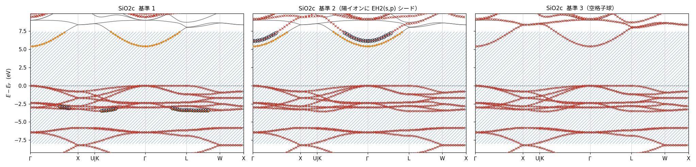

**図 M1**. SiO₂（β クリストバライト）。左から基準 1・基準 2・基準 3。灰の線が DFT、赤の × が MLO、斜線が式 (9) の窓。
橙の点は 0.1 eV 以内に MLO の帯が無い DFT の点（模型から抜けた帯）、黒丸は 0.1 eV 以内に DFT の帯が無い MLO の点（余計な帯）。図 M1〜M3 に描いた数値は同じ名前の `.npz`（`mlo/MATERIALS_*.npz`、ecalj の `Samples/MATERIALS/mlocheck/gallery.py` が書いたもの）。

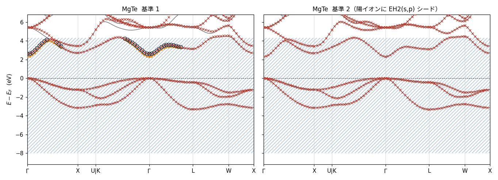

**図 M2**. MgTe（閃亜鉛鉱）。左が基準 1、右が基準 2。基準 1 では伝導帯の底が浮き（黒丸）、DFT の帯が抜ける（橙）。記号は図 M1 と同じ。

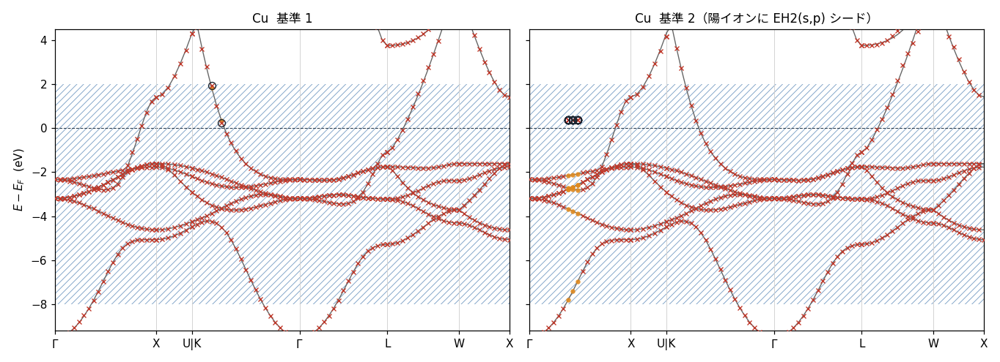

**図 M3**. Cu。左が基準 1、右が基準 2（Cu に EH2 を入れたもの）。Γ–X の途中の 2〜3 点の $\mathbf{k}$ だけが崩れる。記号は図 M1 と同じ。

### 記録 — 旧既定と手で足した模型

**表 M6**（記録）. 旧既定（表 M1 の 2026-10-01 までの扱い）の模型と、手で動径関数を足した模型（2026-10-01、LDA、`Samples/MATERIALS`）。`mlo_lm3` の行は今の基準 1 で自動になった。ギャップの差は MLO − DFT（eV）、
rms は MLO → DFT / DFT → MLO（eV）。窓は MLO → DFT が [VBM − 8, CBM + 3]、DFT → MLO が [VBM − 8, CBM + 1] eV（2026-10-01 17:54 までの評価。今の `mlo_bandcheck.py` は両方とも [VBM − 8, CBM + mlo_delta]）。全物質の表は ecalj の `Samples/MATERIALS/MLOcheck_20261001*.tsv`

| 物質 | 既定: ギャップの差 | 既定: rms | 足したもの | 足した後: ギャップの差 | 足した後: rms |
|---|---|---|---|---|---|
| GaN（wz） | +0.334 | 0.164 / 0.175 | `mlo_lm3` Ga 3d | +0.000 | 0.008 / 0.002 |
| InN（wz、LDA で金属） | — | 0.234 / 0.255 | `mlo_lm3` In 4d | — | 0.003 / 0.002 |
| EuO | +0.020 | 0.049 / 0.055 | `mlo_lm3` Eu 5p | −0.000 | 0.004 / 0.001 |
| LaGaO₃ | +0.079 | 0.073 / 0.101 | `mlo_lm3` Ga 3d、La 5p | −0.005 | 0.003 / 0.003 |
| SrVO₃（金属） | — | 0.060 / 0.074 | `mlo_lm3` Sr 4s・4p、V 3p | — | 0.003 / 0.001 |
| MgTe | +0.287 | 0.091 / 0.069 | `mlo_lm2` 全原子の s,p | +0.000 | 0.004 / 0.001 |
| AlN（wz） | +0.011 | 0.061 / 0.038 | `mlo_lm2` 全原子の s,p | −0.000 | 0.011 / 0.008 |
| SiO₂（β クリストバライト） | +4.055 | 0.028 / 0.695 | `mlo_lm2` 全原子の s,p | +0.045 | 0.047 / 0.015 |

### 再現のしかた

- 入力: ecalj の `Samples/MATERIALS/<物質>/ctrlg.<sname>.toml`（[README](https://github.com/tkotani/ecalj/tree/main/Samples/MATERIALS) の表 1）
- 回し方: `Samples/MATERIALS/mlocheck/`。`prep.py` が `[mlo]` を書き、`run_one.sh` が `lmfa` → `lmf` → `job_band` → `job_mlo`（SOC は `run_soc.sh`）を回す
- 評価: `mlo_bandcheck.py <dir> ... --json out.json`（式 (9)〜(11)）
- 一覧のページ（表 M4・M5 と全物質のバンドの図）: `Samples/MATERIALS/mlocheck/gallery.py <出力先>`。図に描いた数値は `page_data/*.npz` に書く

### GW1500 の標準処方 — QSGW80 の模型

GW1500 のデータベース（QSGW80 のバンド）の各物質に、同じ処方で MLO の模型を作る。物質ごとの調整はしない（基準 1 だけ）。

1. QSGW80 を回す: [`ecalj_auto/gw1500_rerun.sh`](https://github.com/tkotani/ecalj/tree/main/ecalj_auto/gw1500_rerun.sh)
   （POSCAR → `ctrlgenToml.py --ssig=0.8` → `gwscconv` → `job_band`）。既定（`MLO=1`）で続けて 2 を回す
2. 模型を作る: [`ecalj_auto/gw1500_mlo.sh`](https://github.com/tkotani/ecalj/tree/main/ecalj_auto/gw1500_mlo.sh) `<dir> [np]`。
   `<dir>` は 1 の `PlotBand/`（ctrlg、rst、sigm、atmpnu、syml、QSGW80 のバンド）に QSGW の最後の `efermi.lmf` を足したもの。
   - `[mlo]` を今の `gwinit` の規則で書き直す（`gw1500_mlo_regen.py`。前の規則で書いた ctrlg のため。元は `.orig` に残る）
   - `job_mlo`: `mlo_method = 4`、`mlo_delta = mlo_w = 2` eV、Löwdin で直交化した MLO（§6）。ctrlg の `[ham] ssig = 0.8` により QSGW80 のハミルトニアンの模型になる
   - `mlo_bandcheck.py` で QSGW80 のバンドと比べる（式 (9)〜(11)、判定は「模型が壊れていないかの検査」）。結果は `bandcheck.json`
   - 使った ecalj の版を `mlo_version.txt` に書く
3. 模型の行列（`HamRsMLO`、`__HamiltonianPMT`）は大きい（1 物質で数百 MB）ので、データベースには入れない。要るときは 2 を回し直せば同じものができる

---

## 経緯(記録)

この方法に至るまでの経緯 — 5 つの `mlo_method` が実は同じ一本の式だったこと、
原本サンプルが何をしていたか、床を $E_F+\Delta$ に置いた中間段階、
最終形に至る 3 つの設計判断の実測根拠、および途中で見つかった評価器と
`m_hreduction.f90` のバグ — は別頁にまとめてある:

**`MD/mlo_backup.md`**

本文の結論を読むだけなら不要だが、なぜこの式なのかを疑うときはそちらを見よ。

