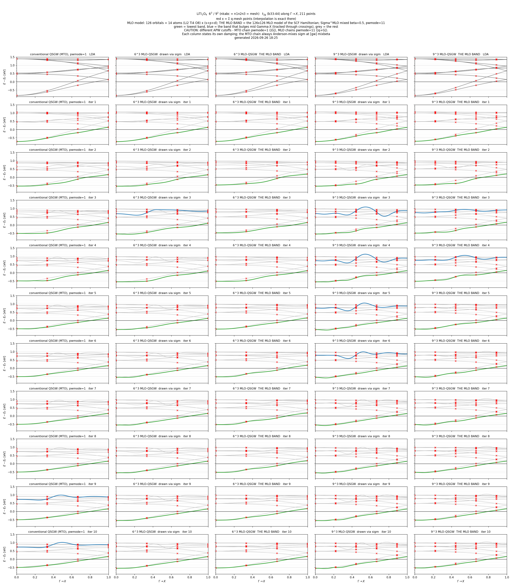
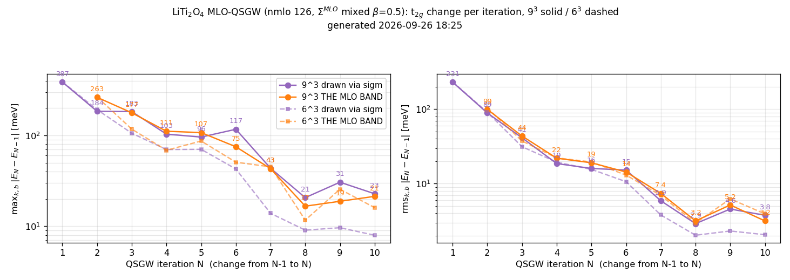

# MLO-gwsc — 自己エネルギーを MLO 表現で内挿する QSGW（開発中）

> **状況（2026-09-30）**: LiTi₂O₄ の 6³ と 9³ を LDA から 40 反復まで回した（§3.5）。GPU の行列積の精度（tf32・fp32・fp64）による MLO バンドの差は
> 数 meV 以下で、速い tf32 で回してよい。10 反復ではまだ収束の途中で、6³ は 20 反復から占有側のバンドに肩ができ、9³ は 40 反復でかなりなめらかになる。
> MLO 表現で描いたバンドでは、`sigm` の内挿で出ていたメッシュ点の間のこぶ（内挿のリンギング）が大きく減る（§3.2）。

> 既定では何も変わらない（`gwsc --mlo` を付けたときだけ有効）。反強磁性の対称性（`symgrpaf`）との併用は確かめていない（§5）。
> 経過の記録は ecalj の `MD/research_kotani_log.md`（2026-09-24〜29）、設計の詳細は `MD/kBT/sigma_mlo_design.md` §9–13。

このページは **§1 理論**、**§2 設定と実行**、**§3 実例: LiTi₂O₄** の 3 部です。

---

## 1. 理論

### 1.1 何を解決するのか

QSGW の静的自己エネルギー $\Sigma$ は GW の $q$ メッシュ上で計算し、任意の $k$ ではメッシュ点の値から **k 空間で内挿**して使います（実空間に落として戻すフーリエ内挿）。
従来はこれを **MTO 基底**の行列（`sigm`）として実空間に落とし、Bloch 和で戻しています。
MTO 基底は非直交で、EH と EH2 がほぼ線形従属、裾も長いため、$\Sigma^{\rm MTO}(R)$ は遠方で減衰しなかったりします
（LiTi₂O₄ では Ti 3d のブロックが BvK セルの端まで 0.3–0.6 meV で頭打ち）。k空間で言うとフラットでないということ。すなわち、
**メッシュ点の「間」にだけ**、数十 meV、大きいときは数百 meV のこぶがバンドに乗ります。
メッシュを細かくしてもこぶは小さくならず、LiTi₂O₄ ではかえって大きくなりました（§3.2）。

MLO-gwsc は同じ $\Sigma$ を **MLO（MTO をもとにした局在軌道）** の小さな部分空間 $\{\tilde\chi_\alpha\}$ で表した行列にして、k 空間で内挿します。
MLO は反復ごとに作り直し、$\Sigma$ はその MLO で書いて、同じ MLO で読み戻します（MLO Sigma インターポレーション、§1.4）。

### 1.2 MLO $\tilde\chi$ の作り方

各 $k$ で、PMT ハミルトニアンの固有状態 $\Psi^{\rm PMT}_i(k)$（固有値 $\varepsilon^{\rm PMT}_i$）と、MTO ブロックだけを対角化した固有状態 $\Psi^{\rm MTO}_j(k)$（固有値 $\varepsilon^{\rm MTO}_j$）から射影

$$\hat P(k)=\sum_{ij}|\Psi^{\rm PMT}_i\rangle\,\bar\theta_{ij}\,\langle\Psi^{\rm PMT}_i|\Psi^{\rm MTO}_j\rangle\langle\Psi^{\rm MTO}_j| \tag{1}$$

を作り、`mlo_lm` で選んだ MTO のシード $\chi^{\rm MTO}_\alpha$ に当てます: 
$$|\tilde\chi_\alpha(k)\rangle=\hat P(k)|\chi^{\rm MTO}_\alpha(k)\rangle \tag{2}$$
（`m_hreduction.f90` の `Hreduction`）。
窓関数 $\bar\theta_{ij}$ は [MLO](./mlo) の `mlo_method = 4` で、
$$\bar\theta_{ij} =f\big((\varepsilon^{\rm PMT}_i-\varepsilon^{\rm cut}_j)/w\big),\qquad
\varepsilon^{\rm cut}_j=\max(\varepsilon_{\rm CBM}+\Delta,\ \varepsilon^{\rm MTO}_j) \tag{3}$$
です（$\varepsilon_{\rm CBM}$ は各反復の SCF の伝導帯の底で、金属ではほぼ $E_F$）。$\Delta$ = `mlo_delta`、$w$ = `mlo_w`でデフォルトはともに2eV、$f$はフェルミ関数。新たなMLOモデルのサンプルは全部この形。
エネルギー関数$\bar\theta_{ij}$を含むだけだし、系の特徴量として必要なのは$\varepsilon_{\rm CBM}$なので、たとえばFeとSiの２つのスラブを含むような系でもおよそ対応できるだろう。
$\Psi$ は $|\Psi\rangle\langle\Psi|$ の形でしか入らないので、ゲージ（位相）の任意性はない。

$\tilde\chi$ の PMT 基底での係数を $z^{\rm MLO}(k)$ と書きます: 
$$|\tilde\chi_\alpha(k)\rangle=\sum_m|\chi^{\rm PMT}_m(k)\rangle z_{m\alpha}(k) \tag{4}$$

$\tilde\chi$ は保存された表ではなく、**その時点のハミルトニアンに処方を当てたもの**で、$H$ が変われば変わります。
反復 2 以降は $\Sigma$ 入りの $H$ から作ります。標準の MLO 法も `__HamiltonianPMT`（senex を足した後の $H$）から作るので、それと同じです。
とにかくMLOはハミルトニアン（基底関数も含め）が正規メッシュ点の上にあれば作れる。

* 結局のところ、MLO 法は「すごく簡単なやり方」に着地した。要するに式 (1) の完全系展開に、低エネルギー部分をしっかり取り出すための $\bar\theta_{ij}$ が入り込んだだけ。
  すなわち「（MTO のような）良い局在基底を選んでおけば、低エネルギー側をレスペクトする射影で十分にきれいにモデル化できる」ということ。
  対称性について悩む必要も、収束について悩む必要もない。スラブなどでは空球（empty sphere）に対応する MLO を持ち込む必要もあるが、これは他の方法でも同様である。
* 式 (3) の $\varepsilon^{\rm cut}_j$ を $\varepsilon^{\rm MTO}_j$ より下にしない理由: APW 基底を入れずに MTO 基底だけでバンドを描くと、基底が足りない分だけ
  エネルギーが高めに出てしまう。MTO の状態 $j$ に当たる PMT の固有状態は $\varepsilon^{\rm MTO}_j$ より下にあるので、
  PMT の固有状態のエネルギーが $\varepsilon^{\rm MTO}_j$ 以下ならば取り込む、とする。

### 1.3 $\Sigma$ を MLO で持ち、PMT に戻す

GW が出すのはバンド添字の $\Sigma^\psi_{ij}(q)=\langle\psi_i|\hat\Sigma|\psi_j\rangle$ です。これを MLO に移します:

$$\Sigma^{\rm MLO}=c^\dagger\,\Sigma^\psi\,c,\qquad c=\langle\psi|\tilde\chi\rangle \tag{5}$$

これは文字どおり $\langle\tilde\chi_\alpha|\hat\Sigma|\tilde\chi_\beta\rangle$ です（窓 $\bar\theta$ の外の状態は落ちるので、厳密なのは窓の中だけ）。
PMT 基底は非直交で、その重なり行列を $S^{\rm PMT}_{mn}(k)=\langle\chi^{\rm PMT}_m(k)|\chi^{\rm PMT}_n(k)\rangle$ と書きます。
固有状態を $|\psi_i\rangle=\sum_m|\chi^{\rm PMT}_m\rangle\psi_{mi}$ と展開すると（$\psi$ は係数の行列）、式 (4) から $c=\psi^\dagger S^{\rm PMT}z^{\rm MLO}$ です。
$\Sigma^{\rm MLO}(q)$ を実空間の $\Sigma^{\rm MLO}(R)$（`QMLO_SigRs`）に落として k 空間で内挿し、任意の $k$ で PMT 基底へ戻して $H$ に足します（`getsenex`）。
一般の（非直交の）MLO では、両側に重なりの逆が要ります（2026-10-02 から MLO は Löwdin で直交化した関数なので $O=1$、式 (7) は $A\,\Sigma^{\rm MLO}A^\dagger$。[mlo](mlo) §6）:

$$A=S^{\rm PMT}z^{\rm MLO}=\langle\chi^{\rm PMT}|\tilde\chi\rangle,\qquad O=z^{{\rm MLO}\dagger}A=\langle\tilde\chi|\tilde\chi\rangle \tag{6}$$

$$\mathrm{senex}=A\,O^{-1}\,\Sigma^{\rm MLO}\,O^{-1}A^\dagger=\langle\chi^{\rm PMT}|\hat P_{\rm MLO}\hat\Sigma\hat P_{\rm MLO}|\chi^{\rm PMT}\rangle \tag{7}$$

$\hat P_{\rm MLO}=|\tilde\chi\rangle O^{-1}\langle\tilde\chi|$ は MLO 部分空間への射影子です（式 (1) の $\hat P(k)$ とは別物）。**k 空間で内挿するのは $\Sigma^{\rm MLO}$ だけ**です。

> **注意**: 従来の `sigm` は MTO ブロックに擬似逆で射影した量で、両側に $O^{-1}$ を畳み込んだ形です。
> $\Sigma(R)$ の大きさを $\Sigma^{\rm MLO}(R)$ と直接比べることはできません。

### 1.4 MLO Sigma インターポレーション — $\Sigma$ は、それを書いた $\tilde\chi$ で読む

反復ごとに MLO を作り直し、その反復の $\Sigma$ を MLO 表現の行列 $\Sigma^{\rm MLO}(k)$ にして **k 空間で内挿**し
（メッシュ点の値から任意の $k$ の値を作る）、PMT 基底に戻すときも同じ MLO を使います。
これを**MLO Sigma インターポレーション**（MLO Sigma interpolation）と呼びます。この形は次の 2 つの事実から決まります。

1. **k 空間で内挿できるのは MLO 表現の行列で、$z^{\rm MLO}(k)$ は内挿できない。** $\Sigma^{\rm MLO}_{\alpha\beta}(k)$ は行も列も MLO の添字で、
   どの $k$ でも同じチャネルを指すので、k 空間で内挿できます。一方 $z^{\rm MLO}(k)$ は PMT 基底の行を持ちます。
   `pwmode = 11`（$|q+G|$ 打ち切り）では APW の集合そのものが $k$ で変わるので、同じ行番号が $k$ ごとに別の関数を指し、
   k 空間で内挿できません（式 (6) の $A$ も同じ）。同じ理由で $H^{\rm PMT}(k)$ も内挿できません。
2. **$\Sigma^{\rm MLO}$ の数値は、それを書いた $\tilde\chi$ の刻印を持つ。** イテレーション $n-1$ で
   $z_{n-1}\to c_{n-1}=\psi^\dagger S^{\rm PMT} z_{n-1}\to\Sigma_{n-1}=c_{n-1}^\dagger\Sigma^\psi c_{n-1}$ と一本の鎖で作られるので、
   式 (7) で戻すときは**必ず同じ $z_{n-1}$** を使わなければなりません。別の $z$ で読むと、同じ数値を別の関数の間の行列要素として
   読み替えることになり、作用素そのものが変わります。

したがって、**書く側で作った $z$ を、あとで読む全ての $k$ で保存しておきます**（$\tilde\chi$ は $H$ が変われば変わるので、読む側で作り直すと別物になる）。
1 反復の中では「読む用 $z_{n-1}$」と「書く用 $z_n$」が同時に要るので、置き場が 2 つあります。

| ファイル | 中身 |
|---|---|
| `QMLO_z` | 現行の `QMLO_SigRs` が書かれた $\tilde\chi$（読む用）|
| `__QMLO_zNew` | この反復の $H$ から作った $\tilde\chi$（書く用）|

どちらも 1 本のファイルで、GW の $(q,$ スピン$)$ ごとに固定長のレコード（$q$、スピン、`ndimh` と $z$）を持ちます。
段 a' は各プロセスが自分の $q$ のレコードを MPI-IO で書き、`getsenex` は最初に索引だけ読んで、要る $k$ のレコードだけを読みます。
`mlo` が `QMLO_SigRs` を書いた**直後**に `__QMLO_zNew` → `QMLO_z` と改名（昇格）するので、$\Sigma$ と $\tilde\chi$ は常に組になっています。
「あとで読む全ての $k$」を保存済みの点に収めるため、**`nkabc` = `n1n2n3` = `mlo_nkabc`**（SCF の $k$ ⊂ GW の $q$）を要求します。
`gwsc` が計算の前に確かめ、違えば止まります。
保存済みに無い $k$ で読もうとした場合も、既定では止まります（$\Sigma$ を別の基底で読むことになるため）。

### 1.5 1 反復の流れ（`gwsc 1 --mlo`）

連鎖の最初に一度だけ、`lmf --writeham --mlo` と `mlo --mlo` で **MLO の索引**を `HamRsMLO` に作ります。
索引とは、どの MTO チャネルを種にするか（`ndimMTO` 本）です。$\Sigma^{\rm MLO}$ はそのチャネル上の行列なので、索引は連鎖を通じて固定です（`--mlofreeze`）。
窓の基準（$E_F$ と伝導端）は索引に含めず、段 a' が毎反復その反復の SCF の `efermi.lmf` から読みます（2026-09-26 から。§2.4）。
一方、係数 $z$ は毎反復①で作り直し、ハミルトニアンに追随します。

| # | 実行 | $\tilde\chi$ について |
|---|---|---|
| ① | `lmf --jobgw=1` | `getsenex` が `QMLO_SigRs`（$\Sigma_{n-1}$）を `QMLO_z` の $z_{n-1}$ で読む → 対角化 → $\psi$（GW に渡る）。続く段 a' で、$\Sigma$ 入りの $H$ から $z_n$ を作って `__QMLO_zNew` へ、$c_n=\psi^\dagger S^{\rm PMT} z_n$ を `__cmlo.data` へ |
| ② | `heftet`, `hbasfp0`, `hvccfp0`, `hsfp0_sc`, `hgw` | $\Sigma^\psi_{ij}(q)$。MLO とは無関係 |
| ③ | `hqpe_sc` | 式 (5) で $\Sigma^{\rm MLO}_n$ → 混合（§1.6）→ `__QMLO_Sig`。従来の `sigm` も並べて書く |
| ④ | `mlo --mlofreeze --mlo` | 対称化 → 全 BZ → FFT → `QMLO_SigRs`（Σ だけ。MLO の添字は `HamRsMLO` から）|
| ⑤ | 昇格（④の `mlo` の中）| `__QMLO_zNew` → `QMLO_z`。ここで「現行の $\tilde\chi$」が $z_n$ に切り替わる |
| ⑥ | `lmf`（SCF）| `getsenex` が $\Sigma_n$ を $z_n$ で読む |

### 1.6 混合

MLO 経路で SCF が読むのは `QMLO_SigRs`（`__QMLO_Sig` から作る）で、`sigm` ではありません。
`sigm` は `hqpe_sc` で Anderson 混合されますが、$\Sigma^{\rm MLO}$ も混合しないと **MLO 連鎖だけ実効 β=1 で回る**ことになり、
LiTi₂O₄ では 3 反復目に大きく行き過ぎました（§3.3）。
$\Sigma^{\rm MLO}$ には `sigm` と同じ Anderson 混合（β = `[gw] mixbeta`）がかかります（2026-09-30 から既定。`ECALJ_MLO_MIX=0` で切る。
それより前のコードでは `ECALJ_MLO_MIX=1` を付けたときだけ混合した）。

- 履歴は `__QMLO_mixsig`（`sigm` 側は `__mixsig`）。混合の入力 $x_0$（その反復が実際に使った $\Sigma^{\rm MLO}$）は、
  `QMLO_SigRs` を既約 $q$ で Bloch 和したもの（`getsenex` が $H$ に入れたのと同じ行列）。`sigm` の混合での `sigm` と同じ役なので、履歴は捨ててもよい
- **初回（LDA から）は $\beta$ 倍から始まる**: 前の $\Sigma$ が無いので $x_0=0$（$\Sigma=0$）から混合し、iteration 1 は $\beta\Sigma^{\rm out}$。
  `sigm` も $\Sigma^{\rm MLO}$ も $\beta$ 倍で、既定の $\beta=1$ なら全量が入る（LiTi₂O₄ は $\beta=0.5$。[mixbeta](./UsageDetailed#mixbeta-and-mixpriorit)）

### 1.7 MLO バンドの描き方

途中の反復の状態を $\Sigma^{\rm MLO}$ のまま任意の $k$ で見るには、**SCF が解いたハミルトニアンの MLO 模型**を作って解きます
（ecalj の `Samples/kBT/LiTi2O4/draw_mloband.sh`）。

1. スナップショットで `lmf --writeham --mkprocar --noinv --mlo` を走らせ、保存済みの `QMLO_z` で、SCF と同じ
   $H=H^{\rm LDA}[\rho_n]+\mathrm{senex}(\Sigma^{\rm MLO}_n)$ をメッシュ点で書き出す（$\tilde\chi$ が 1 点でも見つからなければ止まる）
2. `QMLO_SigRs` を退けてから（$\Sigma$ は 1 の $H$ に入っているので二重に足さない）、凍結なしの `mlo --mlo` で MLO 模型を作り、経路上で解く

メッシュ点では SCF の $H$ そのもので、その間は標準の MLO のフーリエ内挿です。**メッシュ点の間で $\tilde\chi$ を作り直しません。**
次の 3 通りでは MLO バンドになりません。

| 経路 | 何が起きるか |
|---|---|
| `job_band`（`--mlo` 無し）| 従来 `sigm` の内挿で描かれる。MLO 連鎖の密度に従来の $\Sigma$ を合わせたもので、SCF を動かした $\Sigma^{\rm MLO}$ ではない（比較用には使える）|
| `job_band --mlo` | $\tilde\chi$ の探索が $k$ を文字どおり比べるので、経路の $k$ が保存済みの既約点と対称等価でも見つからない。$\Sigma$ 抜きの $H$ から作り直すので、Γ 以外は無効 |
| `job_mlo --mlofreeze --mlo` | 凍結 `HamRsMLO`（連鎖の最初の LDA の $H$ と $\tilde\chi$）に今の `QMLO_SigRs`（今の $\tilde\chi$）を足すので、2 つの基底が混ざり 0.3–0.5 eV ずれる |

`job_band` は描画用の $E_F$ を `efermi.lmf.job_band` に書き、段 a' が窓の基準を読む `efermi.lmf` には触れません（`job_dos`・`job_fermisurface` も同じ。
`--efermi=` で与えることもできる）。連鎖のディレクトリの中で描いても窓は動きません。

---

## 2. 設定と実行

### 2.1 `ctrlg.<sname>.toml`

LiTi₂O₄ の 6³ で使った設定（9³ はメッシュの 3 か所を `[9, 9, 9]` にしただけ）:

```toml
[bz]
nkabc  = [6, 6, 6]          # [gw] n1n2n3 と同じにする（必須）
[ham]
pwmode = 11                 # |q+G| 打ち切り（既定）
[gw]
n1n2n3  = [6, 6, 6]
mixbeta = 0.5               # sigm と Sigma^MLO の混合
t_sigmaw   = 1000.0         # (K) Sigma の中間準位の Fermi-Dirac の幅（既定）
t_tetrakbt = -992.4         # (K) 負: chi0 は T=0 のまま Im chi0 を FD およそ 1000 K と同じ幅の Gaussian で均す（以前の SmearX0 = 0.0057 Ha）。金属の W の極を均す（[kBT](./kBT) の「実用の設定」）
[mlo]
mlo_method = 4              # 既定
mlo_delta  = 2.0            # (eV) 既定
mlo_w      = 2.0            # (eV) 既定
mlo_nkabc  = [6, 6, 6]      # n1n2n3 と同じにする（必須）
mlo_lm = """
1 Li   1 2 3 4 5 6 7 8 9
2 Li   1 2 3 4 5 6 7 8 9
3 Ti   1 2 3 4 5 6 7 8 9
...
14 O   1 2 3 4 5 6 7 8 9
"""
```

- `mlo_lm` の `gwinit` 既定は、Z ≤ 10 が s,p（lm 1–4）、Na 以降が s,p,d（1–9）、4f が価電子の原子は f（10–16）も（2026-10-01 から。[MLO](./mlo) §1）。
  半内殻の局所軌道は帯の位置で自動に入る（MLO §1 の表）。
  LiTi₂O₄ では全原子を s+p+d（126 本）にした。既定のままなら 76 本（Li と O が s,p）。76 本との優劣は決着していない（§5）
- **(サイト, lm) あたり MLO は原則 1 本まで。** `mlo_lm2`（EH2）を同じ lm に足すと、射影で同じ関数に潰れて $O$ がほぼ特異になる
  （例外は空隙に広がった伝導帯の底がある陽イオンの s,p: [MLO](./mlo) §9 の基準 2。MLO-QSGW では試していない）。
  式 (7) は $O^{-1}$ を 2 回挟むので効き方は 2 乗（NiO の Ni d で条件数 $1.3\times10^2\to7.4\times10^4$）

### 2.2 実行

```bash
gwsc 10 -np 60 -np2 2 --gpu --prec=fp32 --ntqxx --mlo liti2o4                     # 10 反復
gwsc 10 -np 60 -np2 2 --gpu --prec=tf32 --prec-final=fp32:2 --ntqxx --mlo liti2o4 # 途中は tf32、最後の 2 反復は fp32
```

`gwsc N --mlo` はそのまま N 反復まとめて回してよい（`gwsc 1` を N 回回すのとは厳密には同じでないが、収束させれば ehf で 0.1〜0.2 meV の差、研究ログ 2026-09-25 00:06）。
GPU の精度 `--prec=tf32|fp32|fp64` と、行列積の方法の自動選択は [ecaljgpu](./ecaljgpu) と [gwsc](./gwsc) を参照（`--prec=fp32` は旧来の `--mp --fp32` と同じ）。
LiTi₂O₄ の `hgw` 1 回は、6³ で fp32 367 秒・tf32 173 秒（kt1、RTX 5090 × 2、2026-09-27 夜）、9³ で fp32 2990 秒・tf32 1975 秒（同日午前の版）。
tf32 は Σc の最後の行列積だけを 10 ビットの仮数の入力（RTX 5090 では FP16）にしたもので、$E_F$ ±1 eV の Re Σc は倍精度と 1.3 meV 以内（`MD/ForDevelopers.md` §11.2）。

- ecalj の `Samples/kBT/LiTi2O4/run_gwsc10.sh <tag> <入力> <bindir>` は `gwsc 10` を回し、最後の状態で `sigm` 描画と MLO バンドを描く。
  `run_snap.sh <tag> <niter> --mlo` は `gwsc 1` を繰り返しながら毎反復のスナップショット（再開に要るもの一式）と 2 つのバンドを残す
  （LDA の後に混合ファイルが 1 つでも残っていれば止まる）。`run_gwsc10.sh` は `RUNS_DIR`（作業場所）と `GPUS`（既定は GPU 0 の 1 枚）で指定でき、
  入力は `Samples/kBT/LiTi2O4/input/qmlo`。`run_snap.sh` には kt1 のパスが書き込んであるので、使うときは書き換える

### 2.3 各反復の確認

見るもの（`run_snap.sh` の鎖では `Samples/kBT/LiTi2O4/check_iter.sh` が、`watch_iter.sh` が反復の終わりに退避したログで調べる）。
`gwsc N` でまとめて回したときは、`gwsc` が各反復の終わりに `QSGW.<N>run/` へ `lgw`・`lqpe`・`llmfgw01`・`lmlo_sigr`・`llmf`（`llmf.<N>run`）を写すので
（2026-09-28 から）、後からそこを下の表のとおりに grep する（`check_iter.sh` は run_snap の `steps.log` の形を前提にしている）:

| 項目 | どこを見るか | 正常 |
|---|---|---|
| SCF が MLO 経路に入ったか | `llmf` の `MLO Sigma interpolation ON` の行数 | $k$ 点を持つプロセスの数 $\lceil n_k/\lceil n_k/n_p\rceil\rceil$ |
| GW ドライバが MLO 経路に入ったか | `llmfgw01` の同じ行 | GW の $q$ 点（`QPLIST.jobgw1`）を持つプロセスの数。**iteration 1 は 0**（まだ `QMLO_SigRs` が無い）|
| 昇格 | `lmlo_sigr` の `m_HamPMT: promoted __QMLO_zNew -> QMLO_z` | 毎反復 1 回 |
| 混合 | `lqpe` の `x_0 from QMLO_SigRs =` と `SigmMLO_out`、`SigmMLO_mixed` | iteration 1 は `... No mixing file` が 2 行、x_0 = F、mixed/out = β。2 以降は x_0 = T |
| $\tilde\chi$ の取りこぼし | `m_sigmlo: WARNING chi~ MISS` | 出ない（出れば既定で止まる）|
| SCF | `llmf` の反復回数 | `nit` の上限に達していない |

行数は**メッシュと並列数で決まる**ので、別のメッシュの値を当てはめてはいけません。
`-np 60` で、6³ は既約 16 点なので 16、GW の 72 点で 36。9³ は 35 点で 35、200 点で 50。
これより**少なければ**、一部のプロセスが MLO 経路に入らず従来の `sigm` に落ちています。

### 2.4 使うファイルと、残すもの

印: **●** MLO-QSGW 特有（`gwsc --mlo` でだけ出てくる）、**○** MLO 法一般（`job_mlo` でも出てくる）、無印は通常の QSGW と共通。
保存: **結果** = 計算結果として残す、**再開** = 連鎖を続けるのに要る、**—** = 反復の中だけで使う作業ファイル。
①〜⑥ は §1.5 の段。

| ファイル | 印 | 保存 | 中身 |
|---|---|---|---|
| `ctrlg.<sname>.toml` | | 結果・再開 | 設定 |
| `rst.<sname>` | | 結果・再開 | 密度（各 SCF の `lmf` が書く）|
| `efermi.lmf` | | 結果・再開 | 最後の SCF の $E_F$ と伝導帯の下端。段 a' が窓の基準として毎反復読む |
| `sigm`, `QPU`, `QPD` | | 結果（`sigm` は再開にも）| 従来表現の $\Sigma$（比較用の描画、`sigm` の混合の $x_0$）、QP エネルギー表 |
| `__mixsig` | | 再開 | `sigm` の混合の履歴 |
| `QMLO_SigRs` | ● | 結果・再開 | $\Sigma^{\rm MLO}(R)$。MLO-QSGW の $\Sigma$ そのもの（④が書く）。混合の $x_0$ もここから作る |
| `QMLO_z` | ● | 結果・再開 | `QMLO_SigRs` が書かれた $\tilde\chi$（1 本のファイル）。**必ず `QMLO_SigRs` と組で** |
| `HamRsMLO` | ○ | 結果・再開 | MLO の索引（連鎖の最初に作り、以後固定）。途中で消すと作り直されて `QMLO_SigRs` と合わなくなる |
| `band_MLO_spin1.dat` | ○ | 結果 | MLO バンド（§1.7）|
| `llmf`, `llmfgw01`, `lqpe`, `lmlo_sigr` | | 結果 | ログ（§2.3 の確認に使う）|
| `__QMLO_mixsig` | ● | — | $\Sigma^{\rm MLO}$ の混合の履歴。消すと Anderson の外挿が 1 回切れるだけ（$x_0$ は `QMLO_SigRs` から作る）|
| `__QMLO_Sig` | ● | — | ③が書き④が読む $\Sigma^{\rm MLO}(q)$ |
| `__QMLO_zNew` | ● | — | ①の段 a' が書く今回の $\tilde\chi$（1 本のファイル、MPI-IO）|
| `__QMLO_zdump_*` | ● | — | 診断用（`ECALJ_ZMLO_DUMP=1`）|
| `__cmlo.*`, `__HamiltonianGW(.info)` | ○ | — | ①が書く $c_n$ と PMT の $H$。連鎖の中で `__cmlo` を書くのは①だけ（`job_mloW`・`job_mlo_magnon` では `mlo --mlo` が `__HamiltonianGW` から書く）|
| `HamiltonianPMTInfo` | ○ | — | ④の `mlo` が毎反復読む（格子、k メッシュ、対の表）。無ければ `gwsc` が起動時に `lmf --writeham` で作り直す |
| `__HamiltonianPMT(.info)` | ○ | — | 索引を作る `mlo --mlo`（連鎖の最初）だけが読む。④は読まない（2026-09-27）|
| `__amlo.*` | ○ | — | 索引を作る `mlo --mlo` が書くが、読むものはない（④は書かない）|

`__` の付くファイルは、`gwsc` の呼び出しの間ならすべて消してかまいません（`__mixsig` と `__QMLO_mixsig` を消すと、Anderson の外挿が 1 回切れるだけです）。
`sigm` は値としては SCF に使いませんが、無いと `gwsc` も `lmf` も LDA からやり直すので、再開には必須です。
`run_snap.sh` のスナップショットは、「結果」の多くに `sigm.<sname>`、`__atm.<sname>`、`syml.<sname>` などを加えたものです。

### 2.5 オプションと環境変数

| | 効果 |
|---|---|
| `--mlo` | MLO 経路全体のスイッチ。無ければ MLO 関係は何も動かない |
| `--mlofreeze` | 既存の `HamRsMLO` の索引を使い、`QMLO_SigRs` だけ書き直す（`gwsc` が反復内の `mlo` に渡す）|
| `ECALJ_MLO_MIX=0` | $\Sigma^{\rm MLO}$ の Anderson 混合を切る（§1.6。既定は混合する）|
| `ECALJ_MLO_ALLOW_REBUILD=1` | `QMLO_z` に無い $k$ で、その場の $H$ から作り直すのを許す（既定は止まる）。基底が混ざるので診断用 |
| `ECALJ_MLO_NOSIG=1` | `QMLO_z` を無視して、全 $k$ でその場の $H$ から作り直す。診断用 |
| `ECALJ_MLO_NOCACHE=1` | `QMLO_z` も使い回しも止め、呼ばれるたびに作り直す（旧動作）。診断用 |
| `ECALJ_ZMLO_DUMP=1` | 段 a' の $z$ を `__QMLO_zdump_sugw` に、`getsenex` の $z$ を `__QMLO_zdump_getsenex` に書く。同じ反復の a' と⑥の SCF では一致すべき |
| `ECALJ_SIGMLO_RT=1` | メッシュ点で、$\Sigma^{\rm MLO}(R)$ の Bloch 和が `__QMLO_Sig` を再現するか |
| `ECALJ_SIGMLO_CHECK=1` | 各 $k$ で、MLO 経路の senex と従来 `sigm` 経路の senex の差の最大値を出す |

---

## 3. 実例: LiTi₂O₄

### 3.1 設定

| 項目 | 値 |
|---|---|
| MLO | **126 軌道 = 14 原子（Li₂Ti₄O₈）× (s+p+d)** |
| メッシュ | `nkabc` = `n1n2n3` = `mlo_nkabc` = 6³ と 9³ |
| 混合 | `[gw] mixbeta = 0.5`（`sigm` と $\Sigma^{\rm MLO}$ の両方）|
| 基底 | `pwmode = 11` |
| 窓 | `mlo_method = 4`、$\Delta = w = 2.0$ eV（既定）|
| 計算機 | kt1（RTX 5090 × 2）、`gwsc 1 --mp --fp32` を 10 回（2026-09-26 のコード）|
| 窓の基準 | 連鎖の最初（LDA）の $E_F$ に固定（いまのコードは各反復の SCF の値、§1.2）|
| 1 反復 | 6³: 950–1000 秒、9³: 約 5300 秒（89 分）。`hgw` が 86 %（6³）、94 %（9³）で、MLO のための処理は 1 % 程度。2026-09-27 の高速化の後は 6³ の fp32 で 555 秒 |
| 比較の基準 | 従来 QSGW（MTO）6³、`pwmode = 1`、β = 0.5、10 反復（LDA の行だけ `pwmode = 11`）|

### 3.2 バンド



t2g（バンド 33–44）、Γ→X 211 点。列は左から **従来 QSGW 6³** / **6³ MLO-QSGW を `sigm` で描いたもの** / **6³ の MLO バンド** /
**9³ MLO-QSGW を `sigm` で描いたもの** / **9³ の MLO バンド**、行は上から LDA、iteration 1–10。
赤い × は $\Sigma$ のメッシュ点（内挿が厳密な点）。緑は一番下のバンド、青は Γ→X の中ほどで膨れるバンドで、
交差をまたいで追跡し、膨らみが 50 meV 以上の反復だけ色を付けています。

- **膨れるバンド（青）のこぶは MLO バンドでは出ない。** 同じ状態を `sigm` の内挿で描くと（2・4 列目）、メッシュ点の間にこぶができる。
  6³ では iteration 3、9³ では iteration 3〜6 で大きく揺れ、7 以降は収まる。
  6³ の MLO バンドには一度も出ず、9³ の MLO バンドでも iteration 5 以降は出ない
- **9³ の方がこぶが大きい**（`sigm` 描画）。従来 QSGW でも、メッシュを密にすると占有 t2g のさざ波が大きくなった。
  $\Sigma^{\rm MTO}(R)$ が遠方で減衰しないので、周期セルが大きいほどその成分を多く拾って内挿する、と見ています
- 一番下のバンド（緑）には、序盤の反復で階段状の肩が出る（段の間隔はメッシュ間隔に近い）。
  こちらは `sigm` 描画にも MLO バンドにも出る
- 従来 QSGW の列には iteration 9〜10 でも青が出る。同じ 6³ の MLO-QSGW の 2 列には出ない

### 3.3 収束



反復ごとの t2g の変化（左 max、右 rms）。9³ は実線、6³ は破線。

| rms [meV] | 7 | 8 | 9 | 10 |
|---|---|---|---|---|
| **9³ MLO バンド** | 7.4 | 3.2 | 5.2 | **3.2** |
| **6³ MLO バンド** | 6.9 | 2.9 | 6.2 | **3.9** |
| 従来 6³ | 6.7 | 6.6 | 4.7 | 6.5 |

- どちらのメッシュも、従来と同じ水準（rms 3–7 meV）まで下がる。全 10 反復で §2.3 の確認はすべて合格
- $\Sigma^{\rm MLO}$ を混合しないと（β=1 相当）、3 反復目に rms 120–150 meV 跳ね上がる（従来は 35 meV）。
  混合すれば従来と同じ落ち方になる（3 反復目は 31 meV）
- **メッシュを 6³ → 9³ にしたときのバンドの動き**（iteration 10）は、MLO バンドで rms 13 meV、`sigm` 描画で 27 meV。
  **MLO 表現の内挿の方がメッシュに鈍い**

### 3.4 従来との差

iteration 10 の MLO バンドと従来 6³ の差は、6³ で rms 46 meV（平均 +30）、9³ で rms 49 meV（平均 +34）です。
6³ で見ると一様なずれではなく、占有の 2 本が 7–13 meV 低く、非占有の t2g が 22–61 meV 高い。t2g 全体の幅は 1505 対 1516 meV でほぼ同じです。
**メッシュ点の上でも 43 meV 違う**ので、内挿の差ではなく状態の差です。
ただし比較の基準は `pwmode = 1`、MLO 側は `pwmode = 11` です。LDA での `pwmode` の差（rms 5.6 meV）だけでは説明できませんが、
QSGW で増幅された可能性は残ります。**$\Sigma$ の表現の差か `pwmode` の差かは、`pwmode = 11` の従来連鎖を回さないと分けられません**（未実施）。

### 3.5 40 反復まで（2026-09-29）

§3.1 の設定（ただし 2026-09-27 以後のコード: 窓の基準は各反復の SCF の値、$\chi_0$ は `t_tetrakbt = -992.4`、`t_sigmaw = 1000`）で、
LDA から `gwsc 10 --prec=tf32`、続けて 1 反復ずつ 40 反復まで回した。設定の表、図と数値の全部は ecalj の `Samples/kBT/LiTi2O4/README.md`。


**図 3.5-1**. t2g の MLO バンド（Γ→X）。左が 6³、右が 9³。上から LDA、反復 10、20、30、40

**表 3.5-1**. 前の反復からの MLO バンドの変化の最大（meV）と、一番下のバンドの波打ちの目安（LDA からの補正を cos の 3 次までで当てはめた残差の最大）

| | 反復 | t2g の変化 | 占有の 2 本の変化 | 波打ち |
|---|---|---|---|---|
| 6³ | 10 | — | — | 12.7 |
| 6³ | 20 | 13.6 | 8.7 | 26.0 |
| 6³ | 40 | 3.3 | 0.8 | 26.7 |
| 9³ | 10 | — | — | 17.2 |
| 9³ | 20 | 9.6 | 2.1 | 14.4 |
| 9³ | 40 | 5.1 | 0.2 | 12.9 |

- **精度**: 同じ入力の tf32 と fp32 の MLO バンドの差は、6³ の反復 10 で最大 0.8 meV、9³ の反復 10〜12 で最大 1.2 meV（t2g）。
  fp64 と fp32 は 6³ の 1 反復目で最大 1 meV。1 反復の時間は 9³ で tf32 21 分、fp32 47 分
- **6³**: 反復 10 ではなめらかだが、20 から一番下のバンドの $x$ = 0.35〜0.45 に肩ができ、40 でも残る。t2g の中ほどのバンドの膨らみは
  反復 22 の 131 meV が最大で、40 で 49 meV まで減る（まだ 1 反復に 2〜3 meV ずつ減っている）
- **9³**: 反復 10〜15 では一番下のバンドが Γ のすぐ外で Γ より 6〜12 meV 下がるが、40 で 1.5 meV になる。
  メッシュ点を結ぶ内挿の曲線は、40 反復でもわずかに波打って見える
- 6³ と 9³ に共通のメッシュ点（Γ と $x$ = 2/3）では、40 反復の一番下のバンドの差は 4 meV 以下。メッシュ点の間では最大 37 meV

---

## 4. 落とし穴

| 誤り | なぜだめか / 正しくは |
|---|---|
| $\Sigma^{\rm MLO}$ を混合しない（`ECALJ_MLO_MIX=0`、2026-09-29 までのコードでは `ECALJ_MLO_MIX=1` の付け忘れ） | 序盤に行き過ぎる（§3.3） |
| `job_band` の図を MLO の結果と思う | 従来 `sigm` の内挿。MLO バンドは §1.7 の方法で描く |
| `job_band --mlo` や `job_mlo --mlofreeze` で MLO バンドを描く | §1.7 の表のとおり無効 |
| 別のメッシュの確認値（印の行数、所要時間）を当てはめる | 正常を異常と判定してしまう。値はメッシュと並列数で決まる（§2.3）|

## 5. 未解決・今後

- **`pwmode = 11` の従来連鎖**を 10 反復回し、§3.4 の差を表現の差と `pwmode` の差に分ける
- **反強磁性の対称性（`symgrpaf`）**: QSGW は 2026-09-30 から、GW のプログラムが両方のスピンを計算する形で動く（ecalj `Samples/AFsymmetry`）。
  `--mlo` との併用は確かめていない
- §3.2〜§3.4 の図と数値は 2026-09-26 のコード（窓の基準が連鎖の最初の $E_F$）のもの。いまのコードの 9 反復後の MLO バンドはそれと
  rms 8 meV（最大 23 meV）、ほぼ一様な 7〜10 meV の下がり（窓の基準が 0.55 eV 動いたため、2 反復目から分かれる）。§3.5 はいまのコード
- `--prec-final=fp32:N`（最後だけ fp32）は、まだ走らせて確かめていない（tf32 と fp32 の差は §3.5 のとおり 1 meV ほど）
- 6³ の肩（§3.5）が収束した解の性質なのか、さらに反復すると消えるのかは分かっていない
- MLO の本数の影響: 76 本（`gwinit` 既定）、126 本、全 MTO（154 本）を、$\Sigma^{\rm MLO}$ の混合ありで比べていない
- 空球（empty sphere）を入れると振動が減り安定するか（未検証）
- $\tilde\chi$ の探索を対称等価な $k$ まで広げる（`job_band --mlo` がメッシュ点で使えるようになる）。
  収束後に PMT バンドを MLO 経由で描くには、$k$ ごとに $\Sigma$ 入りの $H$ で $z$ を作り直して自己無撞着にする
- 速さ: 9³ の `hgw` の残りの 8 割は Σc の行列積で、すでにこの GPU の単精度の実力近くで回っている（[ecaljgpu](./ecaljgpu)）。
  $\Sigma^{\rm MLO}$ を頂点 $\langle\tilde\chi_n|\psi_{i'}M_I\rangle$ から直接作れば行列積の片側が $n_{\rm MLO}$ になるが、
  LiTi₂O₄（$n_{\rm MLO}$ = 126、`ntq` = 159）では 1 割程度しか減らない
