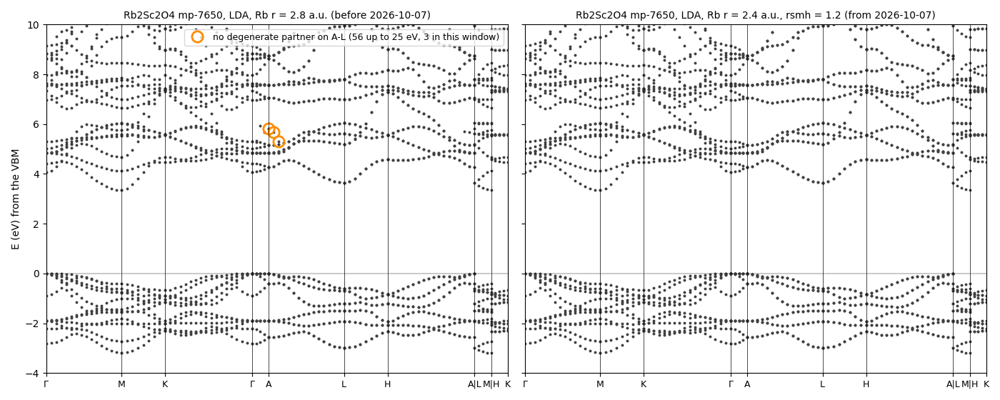
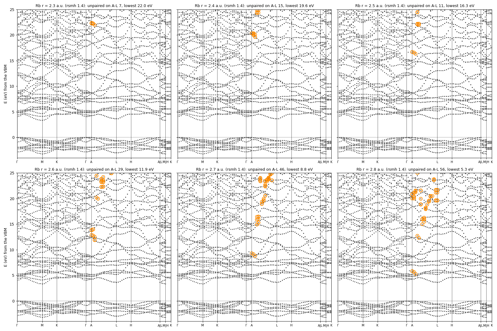

# MT 半径の上限と、偽の準位（縮退の相手のいないバンド）

MT 球を大きく取りすぎると、バンドに偽の準位が出ることがある。アルカリ・アルカリ土類と H の球の上限は、これを避けるように決めてある
（`ctrlgenToml.py` の `r_upper_limit`、2026-10-07）。この頁は、その例と、上限の決め方をまとめる。上限の表そのものは [lmf.md](./lmf.md) の
MT 半径の節にもある。

## 1. 例: Rb₂Sc₂O₄（mp-7650、P6₃/mmc）

Rb₂Sc₂O₄ は層状の構造で、面内の格子が 3.26 Å、c が 12.8 Å。空間群 P6₃/mmc は非共型（らせん軸と映進面を持つ）なので、BZ の上面
（A–L–H、k_z = π/c）では、スピン軌道相互作用が無ければ、すべての準位が 2 重に縮退する。

図 1 の左は、Rb の MT 半径 2.8 a.u.（2026-10-07 より前の上限）の LDA のバンドである。A の近くの A–L の上に、**縮退の相手のいない準位**
（オレンジの丸）がある。この準位はまわりの帯につながらず、対称性からはありえない。半径を 2.4 a.u. にすると（図 1 の右、今の規則）、消える。
価電子帯、伝導帯の下端、ギャップ（3.348 → 3.350 eV）は変わらない。

*図 1*. Rb₂Sc₂O₄ の LDA のバンド。左: Rb の MT 半径 2.8 a.u.、rsmh 1.4。右: 2.4 a.u.、rsmh 1.2（rsmh = r/2、今の `ctrlgenToml.py` の入力）。
オレンジの丸は、A–L の上で 0.02 eV 以内に縮退の相手のいない準位。道筋は `getsyml`（区間ごとに最低 5 点）。左は ecalj b81da2342（kt1）、
右は 2026-10-07 の ecalj（t14）。描いた数値は [`mtradius/bands.npz`](mtradius/bands.npz)、図を作るスクリプトは [`mtradius/make_figs.py`](mtradius/make_figs.py)。

この偽の準位は QSGW80 にもそのまま現れ、データベースの MLO の判定（模型と QSGW80 のバンドの比較）で、最大のずれ 0.86 eV の FAIL の原因になっていた。
模型の側には偽の準位が無いので、比べる相手のほうが壊れていた。Rb 2.5 a.u. で回し直すと、QSGW80 のギャップは 6.056 → 6.058 eV で、MLO は PASS（0.040 eV）になった。

## 2. 何が起きているか

PMT 法では、球の中では包絡関数（MTO と APW）を、その原子の動径関数 φ・φ̇（l ≤ lmxa）の組で置き換える（augmentation）。包絡関数のうち、
球の中で φ・φ̇ で表しきれない部分（高い l の成分、動径の形）は捨てる。球が大きいと、捨てる部分が大きくなり、「球の外ではほとんど 0 で、
球の中でだけ違う」包絡関数の組み合わせが、augmentation の後は何にも決められない、不定の方向として残る。これが偽の準位や、基底の一次従属になる。

表 1 のとおり、偽の準位は球を小さくすると消えるのではなく、上（高いエネルギー）へ逃げていく。一方、本物の帯は半径でほとんど動かない（図 2）。
球の中の展開を細かくしても（Rb の kmxa 5 → 7）消えなかった。APW を切ると（pwmode 0）消えた。

*表 1*. Rb₂Sc₂O₄ の LDA の、A–L の上で縮退の相手のいない準位のうち一番低いもの（価電子帯の上端から、25 eV まで数えた。rsmh 1.4）

| Rb の半径（a.u.） | 2.3 | 2.4 | 2.5 | 2.6 | 2.7 | 2.8 |
| --- | --- | --- | --- | --- | --- | --- |
| 一番低い偽の準位（eV） | 22.0 | 19.6 | 16.3 | 11.9 | 8.8 | 5.3 |
| その数（25 eV まで） | 7 | 15 | 11 | 29 | 46 | 56 |

2.6 a.u. 以下で、偽の準位は 12 eV より上に出る。今の規則（2.4 a.u.、rsmh = r/2 = 1.2）では、25 eV までに 1 本も無い（図 1 の右）。
20 eV より上は帯が混み合うので、この数え方（0.02 eV 以内の対）は余計なものも拾う。数の目安として読む。

*図 2*. Rb₂Sc₂O₄ の LDA のバンド（-4〜25 eV）、Rb の半径 2.3〜2.8 a.u.（rsmh 1.4 のまま、ecalj b81da2342、kt1）。オレンジの丸は図 1 と同じ。

## 3. 上限の決め方

球の中に入れておくべきなのは、半内殻の p と、束縛された d である。アルカリの s（とアルカリ土類の s）や H の 1s のように広がった状態は、
球の外の包絡関数で表せるので、大きい球は要らない。自由原子の軌道（`lmfa` の valence の表、動径関数が最大になる半径）を表 2 に示す。

*表 2*. 自由原子の価電子の軌道（lmfa）。「山」は r·φ が最大になる半径（a.u.）、「外」は MT 球（その計算の半径）の外にある割合

| 元素 | 半内殻 | 価電子 s | d（束縛） |
| --- | --- | --- | --- |
| H | — | 1s 山 1.06（外 45 %、球 1.60） | — |
| Na | 2p 山 0.54 | 3s 山 3.24（外 85 %） | — |
| K | 3p 山 1.15 | 4s 山 4.03（外 93 %） | 3d は束縛されない |
| Ca | 3p 山 1.05 | 4s 山 3.33（外 84 %） | 3d 山 1.28 |
| Rb | 4p 山 1.42 | 5s 山 4.24（外 92 %） | 4d は束縛されない |
| Sr | 4p 山 1.32 | 5s 山 3.62（外 85 %） | 4d 山 2.15 |
| Cs | 5p 山 1.77 | 6s 山 4.65（外 95 %） | 5d 山 3.46（ほぼ非束縛） |
| Ba | 5p 山 1.67 | 6s 山 4.06（外 91 %） | 5d 山 2.51（2.8 の球の外 61 %） |

LDA で半径を変えて調べた（各 2〜3 物質、2.0〜2.8 a.u.）:

- Rb、Cs（RbBr、RbI、CsCl、CsF、Rb₂Sc₂O₄）: ギャップの変化は 0.014 eV 以下、Γ の伝導帯は 0.01 eV 以下。球を小さくしても失うものが無い
- H（NaH、LiH、1.0〜1.8 a.u.）: 偽の準位なし、ギャップの変化 0.006 eV 以下
- Ba（BaO、BaSe）: Γ の伝導帯（Ba 5d・6s）が 2.0 → 2.8 a.u. で 1.90 → 3.30 eV と動き、2.7〜2.8 で落ち着く（2.4 と 2.8 の差は APW を 7 Ry に
  上げても残る）。束縛された 5d の山（2.51 a.u.）が球の中に入っている必要がある
- Na、Mg、K、Ca、Sr: 偽の準位なし。変化は小さい（K は 2.2 → 2.6 でギャップ +0.03 eV、大きいほうで落ち着く）

*表 3*. MT 半径の上限（a.u.、`r_upper_limit`）。2026-10-07 に H・Rb・Cs を変えた。「未来案」は、小さい球にそろえる場合の案（分子性の結晶では
結合が短く、球は小さくせざるをえない。そのときは APW と電子密度の展開のメッシュを上げる必要がある）

| 元素 | 2026-10-07 まで | 今 | 未来案 |
| --- | --- | --- | --- |
| H | 3.0（全体の上限だけ） | **1.4** | 1.4 |
| Li、Be | 2.7 | 2.7 | 2.0（未検証） |
| Na | 2.4 | 2.4 | 2.2 |
| Mg | 2.4 | 2.4 | 2.4 |
| K、Ca | 2.6 | 2.6 | 2.4 |
| Rb | 2.8 | **2.4** | 2.4 |
| Sr | 2.8 | 2.8 | 2.6 |
| Cs | 2.8 | **2.4** | 2.4 |
| Ba | 2.8 | 2.8 | 2.8 |
| ほか | 3.0 | 3.0 | |

rsmh（smooth Hankel の平滑化半径）は r/2 で、半径とともに変わる。今の規則の入力（Rb・Cs は r 2.4・rsmh 1.2、H は r 1.4・rsmh 0.7）で、
Rb₂Sc₂O₄、CsCl、RbBr、NaH のギャップは前の入力と 0.006 eV 以内で一致し、偽の準位は出なかった。

## 4. 見分け方

- 対称性で縮退するはずの所（非共型の空間群の BZ の面、高対称点）で相手のいない準位があれば、偽の準位を疑う
- 半径を少し変えて LDA のバンドを描き、大きく動く準位があれば偽の準位、動かなければ本物
- まず大きい球（アルカリ・アルカリ土類、大きい空格子球）を疑う。lmxa・kmxa を上げても直らない。空格子球（ES）でも、大きい ES（3.5 a.u. を超えるもの）や、
  大きい球の原子の隣の ES で LDA が壊れた例がある（GW1500 の処方では ES の半径を 3.5 a.u. 以下にしている、[mlo.md](./mlo.md) の表 M7）

GW1500 のデータベースの値は、2026-10-07 より前の上限で計算した（[mlo.md](./mlo.md) の「GW1500 の標準処方」）。
