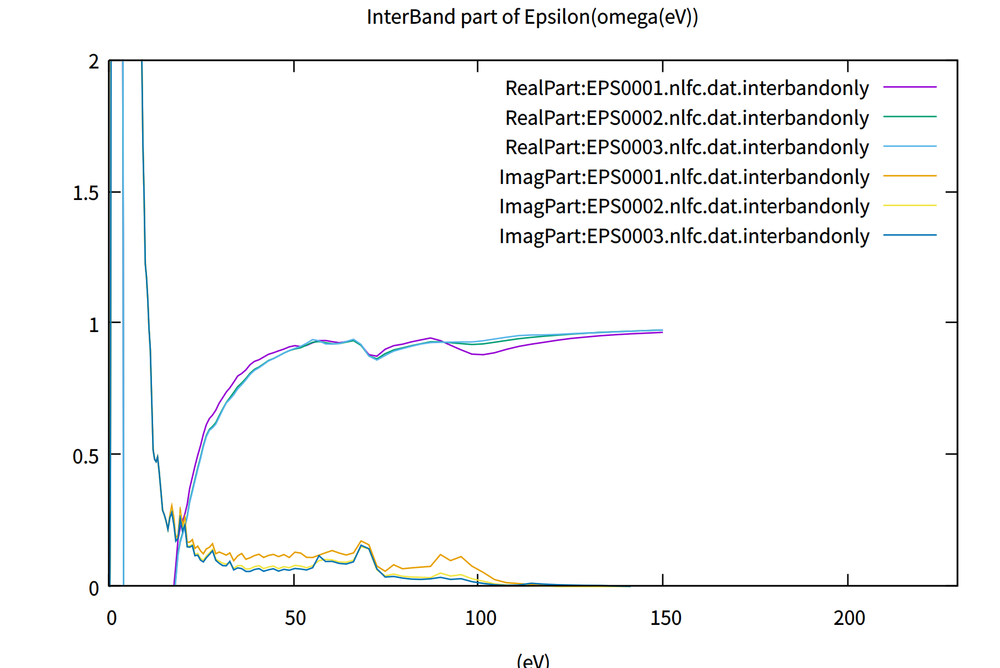
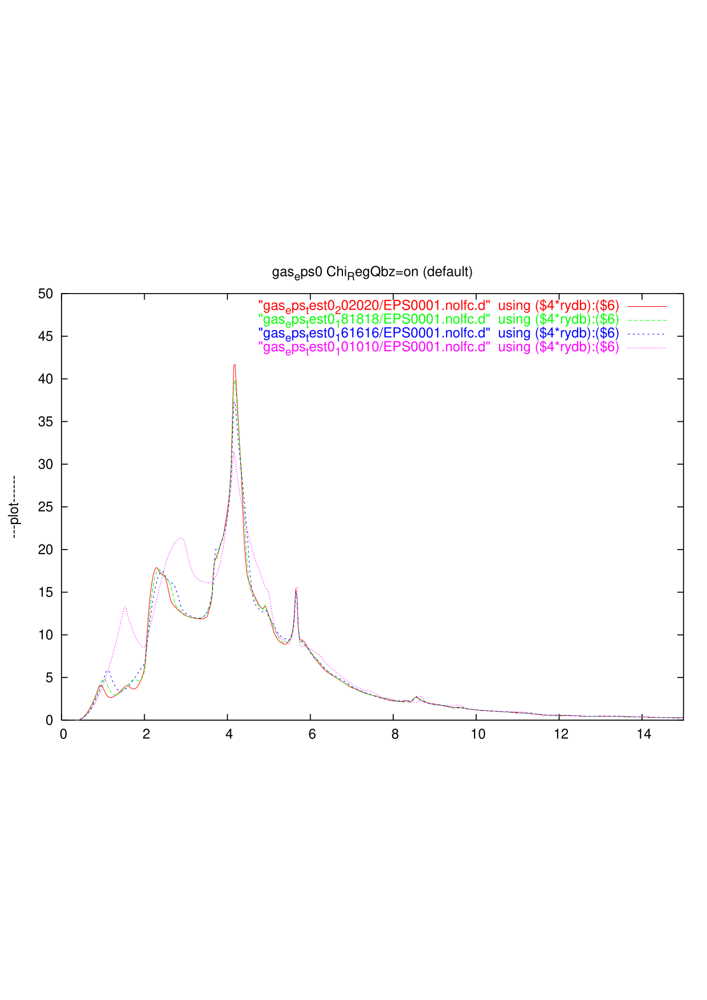
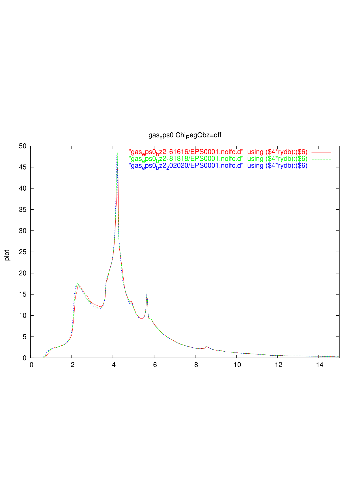
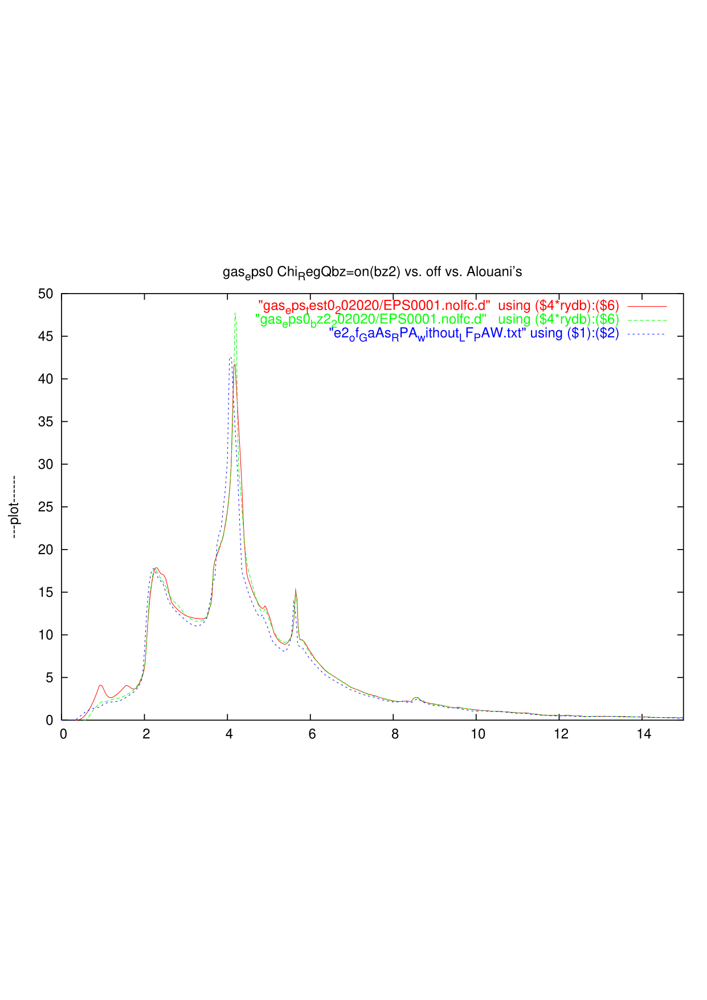
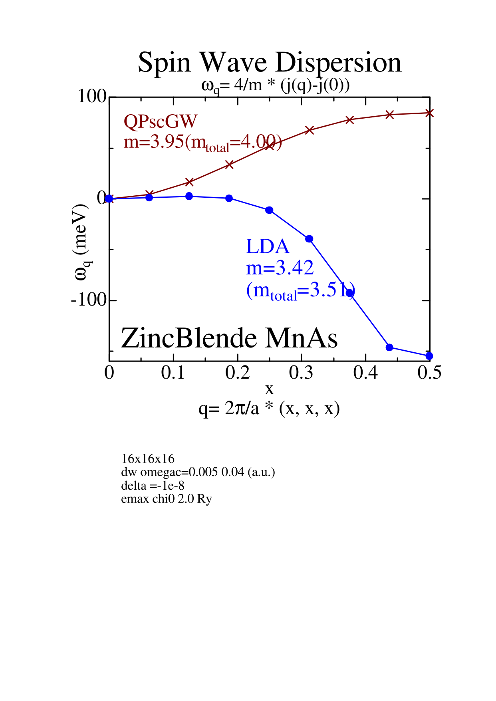

# Dielectric function: job_eps

> ⚠️ **Tool consolidation (2026-06)** — The dielectric-function driver is now **`job_eps`** (with `--lcf` for local-field correction, `--decompose` for interband / intraband split). The legacy `epsPP0` / `eps_lmfh` / `epsPP_lmfh` / `epsPP_lmfh_intra` wrappers have moved to `SRC/exec_legacy/` and are no longer installed to `~/bin`.
>
> **TOML migration (2026-05)** — `job_eps` reads `ctrlg.<sname>.toml`. Convert legacy `ctrl.<sname>` / `GWinput` directories with `Legacy2toml.py <sname>`. See [TOML migration](./toml_migration) and worked examples in [Samples/EPS/](https://github.com/tkotani/ecalj/blob/main/Samples/EPS) — `EPS_Cu`, `EPS_GaAs`, `EPS_Ag`.

job_eps (canonical post-2026-06; replaces the 2025-5-8 `epsPP0` script).

During QSGW, we calculate $\epsilon_{IJ}(q, \omega)$ for $W$ in the GW calculation.

However, we need to calculate $\epsilon(q, \omega)$ with larger number of k points
to compare experiments.
<!-- ecaljでは乱雑位相差近似にもとづいて誘電関数を計算し、光学特性を調べることができます。
ここでは、具体的な計算の流れを説明します。 -->

Based on the no local-field correction equation $\epsilon({\bf q},\omega)=1-v({\bf q}) \chi_0({{\bf q},\omega})$, we can calculate interband and intraband contributions separately.
The intraband contribution is the Drude weight at the limit ${\bf q} \to 0$.
We use the command `job_eps` now (legacy name: `epsPP0`). `job_eps --decompose` writes the interband / intraband split.
We include spherical Bessel functions in the MPB to expand $\exp(i {\bf q r})$.

Local-field corrections are enabled with `job_eps --lcf` (legacy name: `eps_lmfh`); the LFC path is computationally heavier but otherwise drives the same machinery. The LFC contribution is always included in the QSGW iteration itself; `--lcf` here only controls the post-SC dielectric output.


## Computational steps

### Examples of `job_eps`
It is instructive to learn things from samples as 
* ecalj/Samples/EPS/EPS_GaAs
* ecalj/Samples/EPS/EPS_Cu
* ecalj/Samples/EPS/EPS_Ag

Follow `test.py` in these directories (`testecalj EPS_Cu -np 4` in `ecalj/Samples/EPS` runs it in `EPS_Cu_work/`). 
We explain the steps in `test.py` in the following steps.

You can start from `ctrlg.<sname>.toml` (or, for legacy directories, `ctrl.<sname>` + `GWinput` after running `Legacy2toml.py <sname>`). After `job_eps cu -np 4 --decompose`,
```
gnuplot -p epsinter.glt 
gnuplot -p epsintra.glt 
gnuplot -p epsall.glt 
```
Note that we usually need many k points if you like to have 0.1 level of error for 
dielectric constants (at the limit of ${\bf q}=\omega =0$)
(e.g, reasonable results for GaAs may require `[gw].n1n2n3 = [20, 20, 20]` in `ctrlg.<sname>.toml`.)

* NOTE: to calculate $\epsilon({\bf q},\omega)$ without LFC accurately,
the best basis set for the expansion of the Coulomb matrix within MT
is apparently not the product basis, but the Bessel functions
corresponding to the plane waves $\exp(i{\bf q r})$. We include such a basis in this mode. 
(However, our experience shows that the changes are little even with the usual product basis).

### step1: `lmf`収束計算行う。
`sigm`ファイルがある場合は, QSGW計算による固有値固有関数からの誘電関数を計算することができる。


### step2: GW driver パラメータを設定

設定は `ctrlg.<sname>.toml` の `[gw]` セクションに書きます。

- `ctrlg.<sname>.toml` の `[gw]` の `QforEPS` を編集してください
  (`[blocks]` に書いた `QforEPS` は、`[gw]` に `QforEPS` が無いときだけ読まれます)。
    // defaultではこのように書かれている
    ```toml
    [gw]
    QforEPSau = true

    QforEPS = """
    0 0 0.00050
    0 0 0.00100
    0 0 0.00200
    """
    ```
    * この部分は誘電関数を計算するときの**q**ベクトルを設定しています。
    この値を変えることで誘電関数の**q**方向の依存性を調べることができます。

    * `QforEPSau = true` があるので、単位はa.u.になっています。すなわち、0 0 0.001であれば
    ${\bf q}$ = (0,0,0.001) bohr^{-1}です

    * もし `QforEPSau = true` がない場合、**q**の単位は $\frac{2 \pi }{a}$ です。$a$は `[struc] alat` で定義したものです。


    光学応答の場合は**q**=**0**としたいですが、そうすると今のコードでは数値的に不安定です。
    なので適宜小さくとってください。この不安定性は以下の図、ecalj/Samples/EPS/EPS_GaAsでgnuplot -p epsinter.gltで100eVs弱のところに現れています。なのでたとえばEPS_GaAsだと0,0,0.00050(EPS0001に対応）だとすこしにおおきくなっておりよろしくない、ということになります。gnuplotファイルepsinter.gltを見てください。
<!--  -->
<!-- また後述のバンド内・間遷移を分けて計算を行う場合は、2つ以上の座標を書く必要があります。 -->


- エネルギーメッシュの取り方
誘電関数を計算する際のメッシュは対数メッシュでとられており、`ctrlg.<sname>.toml` の `[gw]` セクション内で
```toml
    HistBin_dw = 2e-3
    HistBin_ratio = 1.08
```
の値を変えることで、誘電関数のエネルギーメッシュを増やす(減らす)ことができます。メッシュを細かくとれば、誘電関数の構造がより現れるようになります。ただし、細かすぎると計算コストがすこし増えます。計算法はまずは虚部のウエイトをヒストグラム的に蓄積したあと、実部はヒルベルト変換の方法で求めています。なので数値的にはまあまあ安定です。


* 計算メモリ量をへらしたい場合は `ctrlg.<sname>.toml` の `[gw]` セクションに
```toml
[gw]
KeepEigen = false
KeepPpb = false      # (default)
```
等を適宜書き込んで下さい ([gwinput](./gwinput))。


* `QforEPSau = true`
これは `QforEPS` のqをa.u.ではかるという意味になります。
たとえば `QforEPS` に `0 0 0.00005` とあれば、これは
q=(0 0 0.00005)/bohrと読んでください。
確認するには,2pi/alatをEPSファイル最初の3つの数字に乗じて
`QforEPS` にかかれているqになるのをみます。

* 以前の--zmel0のオプションは2025-5-8で廃止しました。
これはGramSchmidt2をsugw.f90に挿入して
すこし正確な直行化が可能になったためです。

* `job_eps` は最後に gnuplot のスクリプト（`--decompose` のとき `eps_interbandonly_<sname>.glt`、`eps_intrabandonly_<sname>.glt`、`eps_total_<sname>.glt`）と図（pdf）を書きます。`--nognuplot` で図を省きます。


* Cuの場合だと、qがあまりにゼロに近いと計算が不安定です。たとえば
```toml
[gw]
QforEPSau = true
QforEPS = """
 0 0 0.00005
 0 0 0.0001
 0 0 0.0002
 0 0 0.0004
 0 0 0.0008
 0 0 0.0016
 0 0 0.0032
"""
```
などとすると、 0 0 0.00005のグラフがおかしいです。
それ以外のグラフはほぼ重なります。だた、0.0032ぐらいになるとomega=0での実部がいくらかずれてきます。

* Cu (Samples/EPS/EPS_Cu) ではフェルミ面の寄与もあり、
```
gnuplot -p epsintra.glt
```
を実行してフェルミ面の寄与が見れます。This is Drude weight、q分解でみれています。
omega=0近傍でのふるまいはFetter-Waleckaにあるようにふるまっています。
```
gnuplot -p epsintra.glt
gnuplot -p epsall.glt
```


* `job_eps` (legacy `epsPP0`) の計算が終わると `EPS000*.nlfc.dat` というファイルが `[gw]` の `QforEPS` で設定したq点の数分作られます。この中は

```
    // example EPS0001.nlfc.dat
    q(1:3)   w(Ry)   eps    epsi  --- NO LFC
  0.01000000  0.00000000  0.00000000    0.0000E+00  0.276888086703565E+02  0.211273167660642E-17    0.361156744555281E-01 -0.275572453667495E-20
  0.01000000  0.00000000  0.00000000    0.1015E-04  0.276873286605807E+02  0.424191214559347E-01    0.361175202203266E-01 -0.553348246663633E-04
  0.01000000  0.00000000  0.00000000    0.3076E-04  0.276716446748960E+02  0.128515093142673E+00    0.361372966009293E-01 -0.167832020581202E-03
  0.01000000  0.00000000  0.00000000    0.5200E-04  0.276450859807482E+02  0.197440420455938E+00    0.361709489903162E-01 -0.258331892398948E-03
  0.01000000  0.00000000  0.00000000    0.7389E-04  0.276274571460234E+02  0.249411594405801E+00    0.361929258459201E-01 -0.326737828014011E-03
```
1~3行目にq点座標、4行目にエネルギー(Ry単位)、5・6行目が誘電関数の実部・虚部、7・8行目が誘電関数の逆数の実部・虚部
が書かれています。


---

** （改良計画）誘電関数計算にはバンド吸収端で(E-E0)**.5でキレイに立ち上がらない(GaAsなどの場合）、という数値計算上の問題があります。メッシュを細かく取るときれいにできることは示したことがあります。変な内挿法よりも必要なことだけ細かく取るという技法が有効だと思います。汎用化しないといけないです。
Test at 2016: we need to have correct edge $\propto \sqrt{\omega-E_0}$. To do so, we need to move to new method as documented in the slide deck:
[abosorb_preport_tkotani2016Jul5.pdf](../data/abosorb_preport_tkotani2016Jul5.pptx.pdf).

**（改良計画）q=0でのinterbandの寄与は<u|u>行列を使えば先に1/q^2の割り算ができるのでもっと直接的にできるはずです。

** （修正するべき）局所場補正
Local-field correction with `job_eps --lcf` (legacy name: `eps_lmfh`).
To include eps with LFC, do `job_eps --lcf <sname>`. Expensive.
lcutmx=2 seems to be good enough to get 0.5 percent error (maybe better than this).
Further we can use smaller QpGcut_cou like 2.2 or so, with rather smaller product basis (up to p timed d, not including f).
But we need checks and may be modification of `job_eps --lcf`.

** スピンゆらぎを計算するにはモデルを経由するべき
  
## old convergence test (2010)
* Convergence test for number of k point(specified by n1n2n3) test at 2010. 
   Roughly speaking, 20x20x20 is required for not-so-bad results for Fe and Ni.
   It is better to do 30x30x30 to see convergence check.
   However, in the case of ZB-MnAs (maybe because of simple structure around Ef), it requires less q points.

   Old figuresof epsilon for GaAs (2010).
   fig001: n1n2n3 convergence for Chi_RegQbz = on  case. (mesh including Gamma)
   
   fig002: n1n2n3 convergence for Chi_RegQbz = off case. (mesh not including Gamma)
   
   fig003: Alouanis'(from Arnaud)  vs. ``Chi_RegQbz = on'' vs. ``Chi_RegQbz = off''
   As you see, the threshold of the Red line (20x20x20 Chi_RegQbz=on) and Alouani's 
   are almost the same, but the red line is too oscilating at the low energy part.
   On the other hand, ``Chi_RegQbz = off'' in Green broken line is not so satisfactory
   at the low energy part. 
   

* Old unpublished result for spin wave of ZB MnAs in QSGW as


   <!-- As you see, k points convergence looks a little better in Chi_RegQbz=off
   (mesh not including gamma). However a little ploblem is that its thereshold around 
   0.5eV is too high and slowly changing. -->


   <!-- [fig.gas_eps_kconf.pdf] shows the convergence behevior of epsilon for  -->


<!-- ### step:3 epsPP_lmfh , eps_lmfh

eps計算を行うときは、epsPP_lmfh(局所場補正なし)とeps_lmfh(局所場補正あり)のどちらかを使います。

使い方は

```   
 // example 
 mpirun epsPP_lmfh -np 4 si
```


---

## バンド内・間寄与の誘電関数

通常の誘電関数計算のほかに、バンド内遷移の寄与とバンド間遷移の寄与とを分けて誘電関数を計算することも可能です。
この計算は、金属系などで誘電関数の構造や複合プラズモンを解析するときに有用です。

具体的な方法は、まず `ctrlg.<sname>.toml` の `[blocks].QforEPS` (legacy: `<QforEPS>...</QforEPS>` in `GWinput`) に小さなq座標とそこから少しだけずれたq座標を書いてください。
 ```toml
    [blocks]
    QforEPS = """
     0 0 0.0001
     0 0 0.001
     0 0 0.01
      ・・・
    """
  ```
  他は通常計算と同じように計算したい方向のq座標を入れてください。  
  あとは、epsPP_lmfhの代わりにepsPP_lmfh_intraを用いると計算されます。
```   
 // example 
 mpirun epsPP_lmfh_intra -np 4 si
```
計算が終わると`EPS000*.nlfc.dat.intrabandonly`、`EPS000*.nlfc.dat.interbandonly`
というファイルが作られます。中身のデータは通常計算のときと同じです。
 -->


<!-- 
=======================================================
* OLD document before 2025-5-7

誘電関数ｑ＝０を計算するには、最近のバージョンの（２０２３−１０−２３以後）の
収束したところからスクリプトepsPP0を使ってください。
ecalj/MATERIALS/Cueps
にサンプルがあるので、Cuを収束させた後、
epsPP0 cu -np 4
などとすると、epsinter.glt, epsintra.glt, epsall.glt
ができます。epsintraはフェルミ面の寄与になります。


いくつかのｑ点で計算してｑ＝＞０を取るのです。そのためにctrlには
ーーーーーーーーーーーーーーーーーー
QforEPSunita on
<QforEPS>
 0d0 0d0 0.00001
 0d0 0d0 0.001
 0d0 0d0 0.0014142
 0d0 0d0 0.002
 0d0 0d0 0.0028284
 0d0 0d0 0.004
</QforEPS>
ーーーーーーーーーーーーーーーーーー
などと書いておく必要があります。


最低でも、2行入ります。
QforEPSunita on
<QforEPS>
 0d0 0d0 0.00001
 0d0 0d0 0.001
</QforEPS>
ーーーーーーーーーーーーーーーーーー
が、いります.できれば後何行かあったほうがいいです。

QforEPSunita onは単位を2pi/alat　とする指定です。
最初の行の0d0 0d0 0.00001　は数値誤差を計算するためにいるんです。

 0d0 0d0 0.001での誘電関数計算にも 0d0 0d0 0.00001で計算した行列要素（誤差の大きさを計算）を使うんです。なので、EPS0002以後が意味のある答えになります。
epsinter.gltなどではqを複数計算して重ねてみています。
Cuだとキレイにかさなっているのが見て取れます。

epsPP0では最後にreadeps.pyを読んでて答えをまとめ上げてます。
（readeps.py汚いです。試行錯誤の結果が残っていて関数fd0はいまは使っていません）。
いぜんよりはだいぶとキレイに求まると思います。

Ag、結果がこれでも変なら教えてください。

================================================================================
 -->
