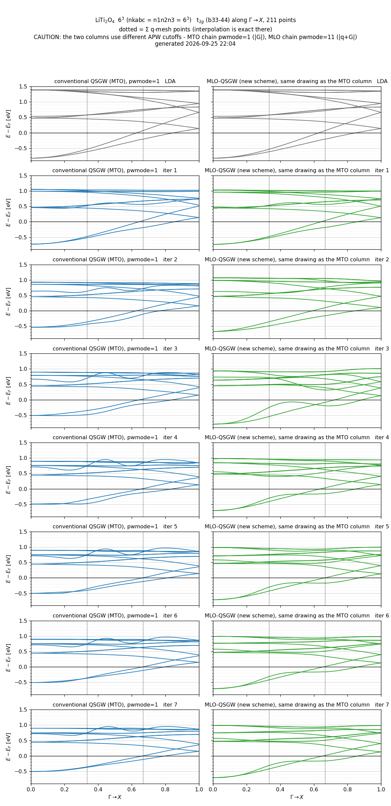
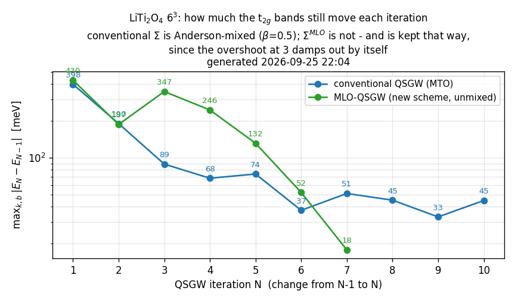

# MLO-QSGW の理論確認（2026-09-25）

**図**（クリックで VSCode が開きます）:
[mlo_rows.png](Samples/kBT/LiTi2O4/mlo_rows.png) 従来 vs MLO の縦比較 ・
[frozen_vs_not.png](Samples/kBT/LiTi2O4/frozen_vs_not.png) χ̃ 凍結の有無 ・
[sigr_decay.png](Samples/kBT/LiTi2O4/sigr_decay.png) Σ(R) の減衰 ・
[three_routes.png](Samples/kBT/LiTi2O4/three_routes.png) 3 経路 × iter1/2 ・
[mlo_iter_grid.png](Samples/kBT/LiTi2O4/mlo_iter_grid.png) 旧版の 10 反復
（詳細は [§7 図](#7-図)）

## 1. PMT 基底のセットアップ

そのとおりです。MT 内の**球対称**ポテンシャルから $\phi_l(r,E_\nu)$, $\dot\phi_l$ を作り、
それで smooth Hankel 包絡（MTO）を augment し、APW を足す。
基底は球対称 DFT ポテンシャルだけで決まります。

ただし 2 点:

- **密度が変われば基底も変わる**（弱いが変わる）。
- `pwmode = 11` では APW の集合が $q$ に依存する（$|q+G|$ カット）。

## 2. Σ 行列の保持形 — MLO と従来で形が違う

### MLO 経路

$$\Sigma^{\rm MLO}_{\alpha\beta} = c^\dagger \Sigma^\psi c,
\qquad c = \langle\psi|\tilde\chi\rangle$$

なので、**文字どおり $\langle\tilde\chi_\alpha|\hat\Sigma|\tilde\chi_\beta\rangle$**（行列要素）です。
戻すときは $A = S^{\rm PMT} z^{\rm MLO} = \langle\chi|\tilde\chi\rangle$ を使って

$$\mathrm{senex} = A\,O^{-1}\,\Sigma^{\rm MLO}\,O^{-1}A^\dagger
= \langle\chi|\hat P\hat\Sigma\hat P|\chi\rangle$$

（設計書 式 (8)(14)）。整合しています。

### 従来 `sigm`

MTO ブロックのみ（`ndimsig = nlmto`、APW は入らない）で、しかも**両側に $O^{-1}$ を畳み込んだ形**。
だから今朝オンサイトが 73.8 eV もありました（MLO 側は 187 meV）。
**同じ「⟨基底|Σ|基底⟩」ではありません。**

## 3. ⟨ψ|Σ|ψ⟩ から基底表現へ

そのとおりです。ただし窓 $\bar\theta$ の外の状態は落とされ、残りは `eseavrmean` の定数で埋めるので、
**変換が厳密なのは窓の中だけ**です。

---

# 4. いつ MLO を作るのか — 1 反復のタイムライン

## 4.0 用語

| | 中身 | 決まる時期 |
|---|---|---|
| **MLO 索引** | `ix`（どの MTO チャネルを種にするか）、`ndimMTO`、窓のパラメータ `eferm`/`ecbot`/`nskip` | **連鎖の最初に 1 度だけ**（`HamRsMLO`）。$\Sigma^{\rm MLO}$ はこのチャネル上の行列なので、`ndimMTO` を途中で変えられない |
| **MLO 係数** $z^{\rm MLO}(q)$ | $\tilde\chi_\alpha(q)=\sum_m\chi^{\rm PMT}_m(q)z_{m\alpha}$ の展開係数 | **毎反復作り直す**（下記 ①） |

以降 $z_n$ = 反復 $n$ で作った係数、$\Sigma_n$ = 反復 $n$ で作った $\Sigma^{\rm MLO}$。

## 4.1 連鎖の最初に 1 度だけ

| 段 | 実行 | 出力 |
|---|---|---|
| 0a | `lmf --jobgw=0` | `HAMindex0`（構造のみ） |
| 0b | `qg4gw --job=1` | `QGpsi`（offset-Γ 込みの q リスト） |
| 0c | `lmf --writeham --mlo` | `HamiltonianPMTInfo` |
| 0d | `mlo --mlo` | **`HamRsMLO`** — 末尾レコードに MLO 索引（`ix`, `ndimMTO`, `mlomethod`, `nskip`, `eferm`, `ecbot`） |

**ここで決まるのは索引だけ**で、$z^{\rm MLO}$ は作りません。

## 4.2 反復 $n$ の中の順序 ← ここが肝心

`gwsc 1` の 1 回がこの順に走ります。

| # | 実行 | $\tilde\chi$ に関して何が起きるか |
|---|---|---|
| ① | **`lmf --jobgw=1`**（[sugw.f90](SRC/subroutines/sugw.f90)） | |
| | ├ 各 $q$ で $H^{\rm LDA}(q)$, $S(q)$ を作る | |
| | ├ **`getsenex`**: `SigRsMLO`（$=\Sigma_{n-1}$）を読む | **`ZmloSig` の $z_{n-1}$ を使う**。$\Sigma_{n-1}$ はこの基底で書かれたので、これでしか正しく戻せない |
| | ├ 対角化 → $\psi$（GW に渡る波動関数） | |
| | └ **段 a'** | **ここで $z_n$ を作る。** その反復の $H(q)$ から `Hreduction` で構成し、`ZmloNew.<rank>` に書き出す。$c^{\rm MLO}=\psi^\dagger S z_n$ を `__cmlo.data` へ。**$H$ は $\Sigma$ 入り**（下記）|
| ②a | `heftet --job=1` | $E_F$（四面体法）。MLO には無関係 |
| ②b | `hbasfp0 --job=3` → `hvccfp0 --job=3` → `hsfp0_sc --job=3` | コアの交換項 $\Sigma_x^{\rm core}$。**①の $\psi$ を使う**。MLO には無関係 |
| ②c | `hbasfp0 --job=0` → `hvccfp0 --job=0` | 価電子の積基底と Coulomb 行列 $v$ |
| ②d | **`hgw --jobgw=1`** | ①の $\psi$ から $\chi_0 \to W \to \Sigma_x, \Sigma_c$。出力は**バンド添字の $\Sigma^\psi_{ij}(q)$**（`SEXU`, `SEXcoreU`, `SEC*`）。**まだ MLO は関係しない** |
| ③ | **`hqpe_sc`** | ここで初めて MLO に落ちる。`__cmlo.data` の $c_n$ を読み、$\Sigma^{\rm MLO}_n = c_n^\dagger\Sigma^\psi c_n$ → `__SigmMLO.q`。**$z_n$ の基底**。同時に従来の `sigm`（MTO）も並行して書く |
| ④ | **`mlo --mlofreeze --mlo`** | FFT して `SigRsMLO` を書く。**$z_n$ の基底** |
| ⑤ | **昇格**（`gwsc` が rename） | `ZmloNew.*` → `ZmloSig.*`。**この瞬間に「現行の $\tilde\chi$」が $z_{n-1}$ から $z_n$ に切り替わる** |
| ⑥ | **`lmf`**（Σ 入り SCF） | `getsenex` が `SigRsMLO`（$=\Sigma_n$）を **$z_n$** で読む |
| ⑦ | **`job_band ... --mlo`**（掘ったディレクトリの中で） | 同じく $z_n$。ただし Σ メッシュ外の $k$ は `ZmloSig` に無いので、その場の $H$ から作る（読み戻す相手が無いため） |

### ⑦の注意 — 2 つとも今日ハマった

**(1) `--mlo` を必ず渡す。** `job_band` は `parse_known_args()` で残りの引数をそのまま `lmf` に
渡します（[job_band:91,93](SRC/exec/job_band#L91-L93)）。`--mlo` が無いと `c0_mlo` が偽になり、`sigmlo_init` は
冒頭の `if(.not.c0_mlo) return` で即座に戻ります。**MLO 経路は完全に無効**になり、`getsenex` は
従来の `sigm` を使う。`hqpe_sc` は `sigm` と `__SigmMLO.q` を並行して書くので `sigm` は常に
存在し、**黙って従来内挿のバンドが描かれます**。今日の図はすべてこれでした。

**(2) 連鎖ディレクトリの中で走らせない。** `job_band` の第 1 段は `lmf --quit=band` で、
これは **`efermi.lmf` を書き換えます**（[m_bndfp.f90:274](SRC/subroutines/m_bndfp.f90#L274)）。MLO の窓は `efermi.lmf` から
`ecbot` オフセットを読むので、連鎖ディレクトリで描くと窓の基準が動きます。
`snap/iter<N>/` を掘って状態一式を置き、その中で走らせる。**そのままスナップショットになります。**

**答え**: MLO（係数 $z$）は **反復ごとに 1 回、①の段 a' で、その反復のハミルトニアンから**作られます。
そして**⑤で初めて「現行」になります**。

### どの $H$ から作るか — $H^{\rm LDA}$ は初段だけ

$\tilde\chi$ は、これから $\Sigma$ を表現する相手のハミルトニアンの多様体を張っていなければ意味が
ありません。反復 2 以降の $H$ は既に $\Sigma$ を含んでいるので、**$z_n$ も $\Sigma$ 入りの $H$ から作ります**。

| 反復 | a' が使う $H$ |
|---|---|
| 1 | $H^{\rm LDA}$ — まだ $\Sigma$ が無いので（`sigmamode` が偽） |
| 2 以降 | $H = H^{\rm LDA} + \mathrm{senex}(\Sigma_{n-1})$ |

コード上は `zhev_tk4` が `hamm` を破壊するため、senex を足した直後の $H$ を `hamm_qsgw` に
退避して a' で使います（[sugw.f90](SRC/subroutines/sugw.f90)）。2 スロット化しているので、`getsenex` 側は `ZmloSig` を
読むだけであり、a' がどの $H$ を使っても読み戻しは壊れません。

**これは標準の MLO 手法と同じです。** [m_bandcal.f90](SRC/subroutines/m_bandcal.f90) では

| 行 | 処理 |
|---|---|
| [207](SRC/subroutines/m_bandcal.f90#L207) | `hambl` → $H^{\rm LDA}$ |
| [210–211](SRC/subroutines/m_bandcal.f90#L210-L211) | `sigmamode` なら `getsenex` → **`hamm = hamm + senex`** |
| [221〜](SRC/subroutines/m_bandcal.f90#L221) | `if(writeham)` → **`__HamiltonianPMT` に書く** |

の順で、**`__HamiltonianPMT` には senex を足した後の QSGW ハミルトニアンが入ります**。
`mlo` はこれを読んで `HamRsMLO` を作るので、Si の QSGW バンドなどで使っている標準の MLO は
**元から QSGW の $H$ で作られています**。段 a' が `hamm_lda` を使っていたのが標準から外れていた
方であり、今回の変更はそこを揃えたことになります。

### なぜ①の `getsenex` が前反復の $z_{n-1}$ を使うのか

**前反復で作った MLO から、$c$ も $\Sigma$ も導かれているから**です。反復 $n-1$ の中で:

$$z_{n-1}\ \xrightarrow{\ \text{段 a'}\ }\ c_{n-1}=\psi^\dagger S\,z_{n-1}\ \xrightarrow{\ \texttt{hqpe\_sc}\ }\ \Sigma_{n-1}=c_{n-1}^\dagger\,\Sigma^\psi\,c_{n-1}$$

と一本の鎖になっています。$c_{n-1}$ は $z_{n-1}$ から作られ、$\Sigma_{n-1}$ はその $c_{n-1}$ から作られる。
つまり **`SigRsMLO` の数値は $z_{n-1}$ の刻印を持っています** — 中身は
$\langle\tilde\chi^{(n-1)}_\alpha|\hat\Sigma|\tilde\chi^{(n-1)}_\beta\rangle$ であって、
$\tilde\chi^{(n-1)}$ が何者かを知らなければ意味を持ちません。

だから反復 $n$ の①でこれを PMT 基底へ戻すときは、**必ず同じ $z_{n-1}$** で

$$\mathrm{senex}=A_{n-1}\,O_{n-1}^{-1}\,\Sigma_{n-1}\,O_{n-1}^{-1}A_{n-1}^\dagger,
\qquad A_{n-1}=S\,z_{n-1}$$

としなければなりません。ここに $z_n$ を使うと、$\Sigma_{n-1}$ の数値を**別の関数の間の行列要素**として
読み替えることになり、演算子そのものが変わってしまいます。**これが今日の破綻の正体でした。**

一方、段 a' がこの同じ①の中で $z_n$ を作るのは、**次の** $\Sigma_n$ をその基底で書くためです。
だから①の時点で $z_{n-1}$（読む用）と $z_n$（書く用）が同時に要る。

```
    反復 n-1                    反復 n                      反復 n+1
       |                           |                            |
   Σ_{n-1} を z_{n-1} で書く  →  ① getsenex: z_{n-1} で読む      |
                                 ① a'      : z_n を作る          |
                                 ③④      : Σ_n を z_n で書く    |
                                 ⑤ 昇格   : 現行 = z_n          |
                                 ⑥ lmf    : z_n で読む      →  ① getsenex: z_n で読む
                                                                ① a' : z_{n+1} を作る
```

$\tilde\chi$ は**ハミルトニアンに追随して毎反復更新される**が、
$\Sigma$ は**書かれた基底以外で読み戻されることが無い**。両立しています。

## 4.3 なぜ 2 スロット要るのか

①の中で $z_{n-1}$（読む用）と $z_n$（書く用）が**同時に生きている**必要があるからです。
1 つしか持てないと、どちらかが必ず食い違います。

| ファイル | 中身 |
|---|---|
| `ZmloSig.<procid>` | 現行 `SigRsMLO` が書かれた $\tilde\chi$。[m_sigmlo.f90 `zmlo_sig_load`](SRC/subroutines/m_sigmlo.f90) が読む。追記しない |
| `ZmloNew.<procid>` | 段 a' がこの反復の $H$ から作った $\tilde\chi$（[m_sigmlo.f90 `zmlo_new_append`](SRC/subroutines/m_sigmlo.f90)）。⑤で [gwsc](SRC/exec/gwsc) が rename |

ランクごとのファイルなのは、段 a' が MPI で $q$ を分担するのと、
`pwmode=11` で `ndimh` が $q$ ごとに変わり固定レコード長が使えないためです。

## 4.4 コード上どこで MLO を作るか

**作る実体は 1 箇所**、[`Hreduction`](SRC/subroutines/m_hreduction.f90#L45)（`m_hreduction.f90`）です。
`zMLO` を返します。これを 3 種類の場所から呼んでいます。

| 呼ぶ場所 | いつ | 何を決めるか |
|---|---|---|
| [m_HamPMT.f90](SRC/subroutines/m_HamPMT.f90) | 段 0d（`mlo --mlo`）、および MLO バンド | **索引**: `ix`（どの MTO チャネルを種にするか）、`ndimMTO`、窓 `nskip`/`eferm`/`ecbot`。`HamRsMLO` の末尾レコードに保存 |
| [sugw.f90](SRC/subroutines/sugw.f90) 段 a'（`NewChiForThisIteration`）| 反復ごと、`lmf --jobgw=1` の中、各 $q$ で | **書く側の $z_n(q)$**。反復 2 以降は `hamm_qsgw`（Σ 入り $H$）、初段は `hamm_lda` から。`ZmloNew.<procid>` へ |
| [m_sigmlo.f90](SRC/subroutines/m_sigmlo.f90) `getsenex`（`ChiTildeCache`）| `ZmloSig` に無い $k$ のとき | **読む側の $z(k)$**。その場の $H$ から作り、その `lmf` 実行中だけメモリに保持 |

つまり:

- **索引（どのチャネルか・窓）は連鎖の最初に 1 回**だけ決まり、以後凍結（`--mlofreeze`）。
  $\Sigma^{\rm MLO}$ はそのチャネル上の行列なので `ndimMTO` を途中で変えられない。
- **係数 $z^{\rm MLO}(k)$ は各 $k$ で毎回作る**。$\tilde\chi$ は「保存された表」ではなく
  **$H(k)$ に処方を当てる関数**である。だから任意の $k$（バンドプロット）でも作れる。
- `ZmloSig`/`ZmloNew` は「その処方を**いつの $H$** で当てたか」を固定するための置き場であって、
  $\tilde\chi$ そのものの定義ではない。

**$\tilde\chi$ を規定する材料**（`Hreduction` の入力）は

1. $H(k)$, $S^{\rm PMT}(k)$ — その時点のハミルトニアンと重なり
2. `ix` — 種にする MTO チャネル（凍結）
3. 窓 $\bar\theta$ のパラメータ `eferm`, `ecbot`, `nskip`, `mlo_w`, `mlo_delta`, `mlo_wfrz`（凍結）

の 3 つだけです。1 が反復ごとに動き、2・3 は固定、という構図。

## 4.5 MLO 法の要点 — 入力・作り方・内挿の成立条件

### user のまとめ（そのとおり）

1. 入力として**メッシュ k 点での $H^{\rm PMT}(k)$**（と $S^{\rm PMT}(k)$）が要る。
2. それがあれば $H^{\rm MTO}(k)$ は部分ブロックとして取り出せる。いま考えている MTO チャネル
   （索引 `ix`）だけを使って、メッシュ k 点で $|{\rm MLO}\rangle$ を $|{\rm PMT}\rangle$ から作る行列
   $z^{\rm MLO}(k)$ が得られる。
3. $\langle {\rm PMT}|X|{\rm PMT}\rangle$ があれば $\langle {\rm MLO}|X|{\rm MLO}\rangle$ に展開でき
   （部分空間にはなる）、これなら FFT で任意の $k$ に内挿できる。$H$ も $S$ も $\Sigma$ も。

コードと突き合わせると 1・2 は完全に一致する。3 も原理としては正しいが、**成立条件が一つある**。

### 位相（ゲージ）の心配は不要

[m_hreduction.f90:322](SRC/subroutines/m_hreduction.f90#L322):

```fortran
cmlo_loc = matmul(Amat, matmul(evecmto^dagger, ovlmx(ix,ix)))
```

コメントどおり $|F^{\rm MLO}_k\rangle = \hat P\,|F^{\rm MTO}_k\rangle$ であり、
$\Psi^{\rm MTO}_j$ も $\Psi^{\rm PMT}_i$ も **$|\Psi\rangle\langle\Psi|$ の形でしか現れない**ので、
対角化の任意位相は相殺する。種は**裸の MTO 基底関数** $\chi^{\rm MTO}_k$（k 非依存の実空間関数の
ブロッホ和）。したがって $\tilde\chi$ にゲージ依存性は無い。

### 成立条件: $\hat P(k)$ の k についての滑らかさ

$$\hat P(k)=\sum_{ij}|\Psi^{\rm PMT}_i(k)\rangle\,\bar\theta_{ij}(k)\,
\langle\Psi^{\rm PMT}_i(k)|\Psi^{\rm MTO}_j(k)\rangle\langle\Psi^{\rm MTO}_j(k)|$$

$\tilde\chi(k)=\hat P(k)\,\chi^{\rm MTO}(k)$ は、「k 非依存の関数のブロッホ和」を
**k ごとに違う射影で修正したもの**である。q 周期性は保たれるので FFT 自体は正当だが、

> **実空間で短距離になるかどうかは、$\hat P(k)$ が k についてどれだけ滑らかかで決まる。**

では $\hat P$ の k 依存性はどこから来るか。[m_hreduction.f90:308](SRC/subroutines/m_hreduction.f90#L308):

```fortran
Amat(i,j) = fac(i,j) * max( fermidist((evl(i)-efrz)/ewfrz), fermidist((evl(i)-ecut)/ewuse) )
```

**窓ではない。** 数字で確認した（user 指摘）:

- **第 1 項は恒等的に 0**。`mlomethod=4` では [`efrz = -1d99`](SRC/subroutines/m_hreduction.f90#L246)
  （コメント「hard-freeze edge; active only for mlomethod=3」）。効くのは**第 2 項だけ**。
- 第 2 項の位置は $\varepsilon^{\rm cut}_j=\max(\varepsilon_{\rm cbot}+\Delta,\ \varepsilon^{\rm MTO}_j)$。
  **MTO のみの固有値は PMT のそれよりそれなりに上にある**ので、通常は $\varepsilon^{\rm MTO}_j$ が選ばれる。
  するとシグモイドの引数は $(\varepsilon^{\rm PMT}_i-\varepsilon^{\rm MTO}_j)/w$ という**バンド差**になり、
  両者が一緒に分散するぶん k について滑らかになる。
- 幅も狭くない。LiTi₂O₄ の設定は **`mlo_w = 2.0` eV、`mlo_delta = 2.0` eV**（`ctrlg` の
  `[gw]` 節）で、t2g の帯幅 0.4 eV の **5 倍**。

**したがって $\hat P(k)$ の k 依存性は窓由来ではなく、
固有ベクトル $|\Psi^{\rm PMT}_i(k)\rangle\langle\Psi^{\rm PMT}_i(k)|$ 自体が k で回ることから来る。**
これは band 多様体の性質であって、窓のパラメータで緩和できるものではない。

（2026-09-25 の初稿では「窓が狭いのではないか、広げてみては」と書いたが、
`mlo_w = 2.0` eV を確認して撤回した。）

## 4.6 自己無撞着にどう持っていくか — 採る方式

### 出発点: $\langle\chi^{\rm PMT}|\tilde\chi\rangle$ は内挿できない

$z^{\rm MLO}$ の入った行列は **PMT 基底の行**を持つ。設計書 §3.4 のとおり、PMT のうち
q 周期的なのは **MTO 部分だけ**で、**APW 部分は q 周期的でない**
（`pwmode=11` は $|q+G|$ カットなので G の集合自体が q で変わる）。
行が k ごとに別の関数を指すので、**この行列は実空間に落とせず、内挿できない**。

同じ理由で $H^{\rm PMT}(R)$ を保存して任意の $k$ で $H^{\rm PMT}(k)$ を再構成する道も無い。
**$H^{\rm PMT}(k)$ は、その密度で実際にハミルトニアンを組む以外に入手できない。**

→ したがって **$\tilde\chi$ は毎回作るしかない。そして作るにはハミルトニアンが要る。**

### 採る方式

> **反復 $n$ で $\Sigma_n$ を作るとき、その場の $H$（＝反復 $n$ 開始時点のハミルトニアン）から
> $z^{\rm MLO}(k)$ を「後で読むことになる全ての $k$」で作り、保存する。
> 以後 $\Sigma_n$ を読むときは必ずその $z$ を使う。**

$\Sigma^{\rm MLO}(R)$ 自体は MLO 基底上の行列なので実空間に落とせ、任意の $k$ に内挿できる。
戻すための $A(k)=S^{\rm PMT}(k)\,z^{\rm MLO}(k)$ は**保存済みのもの**を使う。
これで**内挿できないものを内挿しない**という条件を満たす。

### 必要な k の網羅 — ここが現状との差

$z$ を作る場所は現在 `sugw` 段 a' のみで、**GW の q リスト**（既約 BZ ＋ offset-Γ）しか回らない。
読む側は 3 種類ある:

| 読む場面 | 必要な $k$ | 現状 |
|---|---|---|
| 次反復の GW ドライバ | GW の q リスト | **覆えている** |
| 同反復の最後の `lmf`（SCF）| SCF の k メッシュ | `nkabc = n1n2n3` なら一致。**一般には一致しない** |
| バンドプロット | 経路上の任意の k | **覆えていない** → その場で作り直し ＝ 基底混在 |

**必要な変更は、$z$ を作る k を a' の q リストから「後で読む全ての k」へ広げること。**
$\Sigma_n$ を作るのと同じ `lmf --jobgw=1` の中で

1. GW の q リスト（既存）
2. SCF の k メッシュ
3. **バンド経路の k**（`syml` を先に決めておけば列挙できる）

の 3 つすべてで $z$ を計算し、`ZmloSig` に入れてしまう。
バンド経路を事前に固定する必要はあるが、診断用の経路なら問題にならない。

### これで何が保証されるか

- $\Sigma_n$ は**常に、それを作った $H$ の $\tilde\chi$** で読み戻される（任意の $k$ で）。
- $\tilde\chi$ は**反復ごとに更新される**（窓が古いバンド位置に張り付かない）。
- 内挿するのは $\Sigma^{\rm MLO}(R)$ だけ。$\langle\chi^{\rm PMT}|\tilde\chi\rangle$ は内挿しない。

### 残る近似

反復 $n$ の最後の `lmf` は SCF で密度を動かすので、その中で $H$ は変わる。
$z$ は反復開始時の $H$ のものを使い続けるため、SCF ループ内では厳密には整合しない。
ただし
- 同じ $z$ を使い続けるので **$\Sigma$ の読み方は一貫している**（揺れない）
- 自己無撞着に達すれば密度が止まるので、この近似は消える

つまり **途中の反復でのみ残る近似**であり、収束を妨げる種類のものではない、というのが見立て。

### 実装量

- `sugw` 段 a' を「q リスト」から「必要な k 集合」へ拡張（k の列挙と、そこでの `Hreduction` 呼び出し）
- SCF の k メッシュとバンド経路を `lmf --jobgw=1` の時点で知る必要がある
  （前者は `nkabc` から、後者は `syml.<sname>` から）
- 少し面倒だが、機構自体（`ZmloSig`/`ZmloNew` と昇格）は既にある

---

# 5. 過去の失敗との違い — 4 段階ある

| | 挙動 | 結果 |
|---|---|---|
| (a) 当初 | `getsenex` の**呼び出しごと**に作り直し。SCF ステップごとに基底が揺れる。読み書きの一致という概念すら無い | iter 2 で破綻 |
| (b) 凍結 `01b9ea4df` | 永久固定。しかも `getsenex` だけが追記するので iter 1（SCF メッシュ）と iter 2（GW の q）の**継ぎ接ぎ** | iter 1・2 は正常化、iter 3 で破綻 |
| (c) `5885ea2bb` | `lmf` 1 回の中で固定、次の `lmf` で作り直し。churn と継ぎ接ぎは消えた | **読み基底が 1 反復ずれたまま** |
| (d) **`b3dfecc89`（現行）** | 上記 2 スロット。$\tilde\chi$ は毎反復更新、$\Sigma$ は書かれた基底でのみ読む | **未検証** |

# 6. 残っている論点

**MLO 索引の窓（`eferm`, `ecbot`, `nskip`）は 0d で固定されたまま**です。
$z$ を今の $H$ で作り直しても、窓が初回のバンド位置を指していれば部分空間は古いままです。
ただし `ix` と `ndimMTO` は `SigRsMLO` との整合のため**変えられません**。
窓だけ現在の計算に追随させるかどうかは未決です。

---

# 7. 図

## 7.1 いまの比較（従来 MTO 連鎖 vs MLO 連鎖）

[](Samples/kBT/LiTi2O4/mlo_rows.png)

（生成: [mlo_rows.py](Samples/kBT/LiTi2O4/mlo_rows.py)。左＝従来 pwmode=1、右＝MLO pwmode=11、
行は MLO 連鎖の反復数で下に伸びる）

**描画法は両列とも同じ**。`snap/iter<N>/llmf_band` を確認したところ 6 本すべて `mloON=0`、
すなわち `job_band` は両列とも**従来 `sigm` 内挿**でバンドを描いている
（`job_band --mlo` の 2 段目 `mlo --mlofreeze --mlo` が LiTi2O4 で落ちるため、§10 A2'）。
したがってこの図が見せているのは**内挿法の差ではなく、自己無撞着状態そのものの差**である。

*表 7.1* 反復ごとのバンド変化 $\max_{k,b}\vert E_N-E_{N-1}\vert$ [meV]（t2g b33–44、Γ→X 211 点）

| 反復 $N$ | 1 | 2 | 3 | 4 | 5 | 6 | 7 | 8 | 9 | 10 |
|---|---|---|---|---|---|---|---|---|---|---|
| 従来 MTO（`sigm` は Anderson 混合 $\beta=0.5$）| 398 | 190 | 89 | 68 | 74 | 37 | 51 | 45 | 33 | 45 |
| MLO 新方式（$\Sigma^{\rm MLO}$ **混合なし**）| 430 | 187 | **347** | 246 | 132 | 52 | **18** | | | |

[](Samples/kBT/LiTi2O4/mlo_conv.png)

### 読み取り

1. **iter 3 の跳ね上がりは発散ではなく overshoot**。347 → 246 → 132 → 52 → 18 と減衰比
   0.71, 0.54, 0.40, 0.34 で落ちる。iter 6 で従来連鎖（37）に並び、**iter 7 で下回った**。
   従来連鎖は iter 6 以降 33–51 meV で頭打ち（`mixbeta` を 1.0→0.5 にした marginal QSGW モード）だが、
   MLO 連鎖はそこを突き抜けている。**iter 8–10 で確かめる**（22:55 頃）。
2. **両列は減衰条件が違う**（§7.4）。従来 `sigm` は `mixsigma` で Anderson 混合（$\beta=0.5$）されるが、
   $\Sigma^{\rm MLO}$ は生のまま書かれる。MLO 経路で `lmf` が読むのは `SigRsMLO`（= `__SigmMLO.q` 由来）で
   `sigm` ではないから、**MLO 連鎖だけ実効 $\beta=1$ で回っている**。
   序盤の跳ねはこれで説明がつく。ただし iter 6 で並ぶ以上、**揃えにいく必要はない**と判断して
   混合は入れないことにした（§7.4）。
3. **iter 6 のバンド形状**: 従来側は $x\simeq0.4$–$0.8$ の上側バンドにうねりが残るが、MLO 側では消えている。
   これが元の動機（リンギング）に対応する差で、**描画法が同一なので内挿の差ではなく状態の差**である。
   ただし両列は `pwmode` が違う（1 vs 11）ので、この一点だけで結論はできない。

## 7.2 バグの効果を分離した図（iter 1）

[](Samples/kBT/LiTi2O4/frozen_vs_not.png)

（$\tilde\chi$ 凍結の有無。凍結なしだと帯幅が 292 → 202 meV に潰れる）

## 7.3 $\Sigma(R)$ の減衰（オンサイト規格化）

[](Samples/kBT/LiTi2O4/sigr_decay.png)

（絶対値は正規化が違うので比較不可。規格化すると**従来 $\Sigma^{\rm MTO}(R)$ の方が減衰しない**）

## 7.4 混合の非対称 — 見つけたが、入れない（2026-09-25）

`main_hqpe.sc.f90` の構造は非対称だった:

- `sigm`: `rwsigma('read')` → **`mixsigma`** → `rwsigma('write')`
- `sigmlo`: 計算 → そのまま `WriteSigmMLO`（**混合なし**）

MLO 経路で `lmf` が読むのは `SigRsMLO`（= `__SigmMLO.q` 由来）で `sigm` ではない。
つまり **MLO 連鎖だけ実効 $\beta=1$ で回っていた**（LiTi2O4 の `ctrlg` は `mixbeta = 0.5`）。
iter 5 までの比較は「減衰あり vs 減衰なし」を比べていたことになる。

**結論: 混合は入れない。** iter 6 まで回すと 430 → 187 → **347** → 246 → 132 → **52** meV と
自力で落ち、混合ありの従来連鎖（…→ 37）と同じ水準に並ぶ。収束に必要なのは減衰ではなく反復数で、
減衰は序盤の見た目を整えるだけ。commit `d8034ad5b` で **既定 OFF**、`ECALJ_MLO_MIX=1` で ON。
既定 OFF なので、この commit 以前に始めた連鎖はそのまま継続できる（v6 は iter 7 から継続中）。

実装は残してあり、ON にすればそのまま正しく効く:

- `mixsigma` は履歴ファイル名を任意引数で受ける。`sigm` 側 `__mixsig` / MLO 側 `__mixsigMLO`。
  既定名を `'__mixsig'` のままにしたのは、`fff` が `character(8)` で `'__mixsigma'` をずっと
  切り詰めていたため。ここで正しい綴りに直すと走行中の連鎖が履歴を失う。
- `gwsc` は `__SigmMLO.q` を**消さずに `__SigmMLO.q.prev` へ退避**し、`hqpe_sc` がそれを $x_0$ として読む。
  この退避ファイルはその反復が実際に使った $\Sigma^{\rm MLO}$ で、従来ループにおける `sigm` と同じ役。
  これが無いと、履歴ファイルが無い初回（新規連鎖・スナップショットからの再開・混合導入前の連鎖の続き）で
  `amix` が $x_0=0$ を取り、$\Sigma$ 全体が一度 $\beta$ 倍される。
- `mixsigma` の作業配列は `source=0d0` で確保する。`amix` は `d_0 = f - x_0` を無条件に使うので、
  履歴が無いとき未初期化だと初回が壊れる（$x_0=0$、すなわち $\Sigma=0$ が正しい出発点）。
- `run_snap.sh` / `cont_snap.sh` はスナップショットに `__mixsig` と `__mixsigMLO` を入れる。

### 付随して分かったこと

`InstallAll.py --gemmul8` は `SRC/build_nvfortran/GEMMul8/GEMMul8` を期待するが、
上流 GEMMul8 のレイアウトが変わって内側の `GEMMul8/` が無く、`FileNotFoundError` で
インストーラごと落ちる。`--gemmul8` は `cmake_options` を変えないので
`libecaljF*.so` の中身には影響しない。外してビルドすればよい（§10 D）。

---

# 8. 新方式 — 実装仕様

§4.6 の結論を実装できる形にしたもの。**これを実装する。**

## 8.1 不変条件

| | 内容 |
|---|---|
| **I1** | $\Sigma^{\rm MLO}_n$ は**必ず $z_n$ で読み戻す**。読む $k$ が何であっても例外を作らない |
| **I2** | $z_n$ は**$\Sigma_n$ を作ったハミルトニアン**から作る（反復 $n$ 開始時点の $H$）|
| **I3** | **内挿するのは $\Sigma^{\rm MLO}(R)$ だけ**。$\langle\chi^{\rm PMT}\vert \tilde\chi\rangle$ は内挿しない（APW 行が q 周期的でないため不可能）|
| **I4** | MLO **索引**（`ix`, `ndimMTO`）は連鎖を通じて固定。$\Sigma^{\rm MLO}$ がそのチャネル上の行列だから |

I1 と I2 を両立させるために、$z$ を**後で読む全ての $k$** で先に作っておく。これが新方式の核心。

## 8.2 k 集合 $K$

$$K = K_{\rm GW}\ \cup\ K_{\rm SCF}\ \cup\ K_{\rm band}$$

| | 中身 | 出どころ |
|---|---|---|
| $K_{\rm GW}$ | GW が要求する q（既約 BZ ＋ offset-Γ）| `QGpsi` / `m_qplist` |
| $K_{\rm SCF}$ | SCF の k メッシュ | `nkabc`（`n1n2n3` と一致するとは限らない）|
| $K_{\rm band}$ | バンド経路上の k | `syml.<sname>` から生成 |

**$K$ は `lmf --jobgw=1` の中で列挙できなければならない。**
$K_{\rm band}$ のためにバンド経路を事前に固定する必要があるが、診断用の固定経路なので問題ない。
`syml` が無ければ $K_{\rm band}=\emptyset$ とし、バンドは描かない（描くなら `syml` を置く）。

### 8.2.1 【後回し】MLO 空間で描けば $K_{\rm band}$ は不要になる

バンドを **PMT 空間**で描く限り、経路上の各 $k$ で $A(k)=S^{\rm PMT}(k)z^{\rm MLO}(k)$ が要るので
$K_{\rm band}$ を先に回しておく必要がある。

しかし **MLO 空間で描けばその必要が無い**。$H^{\rm MLO}(R)$ も $\Sigma^{\rm MLO}(R)$ も
**どちらも MLO 基底上の行列で q 周期的**なので、両方を任意の $k$ にフーリエ内挿して

$$\bigl[H^{\rm MLO}(k)+\Sigma^{\rm MLO}(k)\bigr]\,c = \varepsilon\,O^{\rm MLO}(k)\,c$$

を $n_{\rm MLO}\times n_{\rm MLO}$ で解けばよい。**PMT への引き上げが一切要らない。**

- $K = K_{\rm GW}\cup K_{\rm SCF}$ だけになる（$K_{\rm band}$ 不要）
- §8.5 の 3 点目（`syml` を `--jobgw=1` の前に用意）も不要になる
- 機構は既にある（`job_mlo`、`HamRsMLO` の `hammr`/`ovlmr`）

描かれるのは「縮約模型のバンド」であって PMT ハミルトニアンのバンドそのものではないが、
**MLO 模型が $\Sigma$ を再現できているかを見るのが目的**なので、診断としてはむしろ素直。

**2026-09-25 時点では後回し**（user 判断）。まず $K=K_{\rm GW}\cup K_{\rm SCF}$ で実装し、
バンドは従来どおり PMT 空間で描く（そのぶん経路上は作り直しになる）。

### 8.2.2 PMT 空間のバンドはどうするか — 3 段階

「フルの PMT でバンドを描くのを諦めるのか」への答えは、段階によって違う。

| | 状況 | 基底の整合 | 方針 |
|---|---|---|---|
| **収束後** | 密度が止まっている | あとから描いても $z$ は $z_n$ と一致する | **問題なし。発表用のバンドは損なわれない** |
| **反復の途中** | 密度が $\Sigma$ を作った時点から動いている | メッシュ点は `ZmloSig`、その間は作り直し ＝ **混在** | **診断には使わない**。代わりに MLO 空間で描く（§8.2.1）|
| **途中でも PMT が欲しいとき** | 同上 | — | **可能**。下記 |

**3 段目は実装できる。** `sugw` は各 q で自分で `hambl` を呼んでいる
（[sugw.f90:492-508](SRC/subroutines/sugw.f90#L492-L508)）。つまり GW ドライバの中で
バンド経路の $k$ についても `hambl` → `getsenex` → `Hreduction` → `zmlo_new_append` を
回せば、**$\Sigma$ を作ったのと同じ $H$ で**経路上の $z$ が得られる。
機構は同じ subroutine 内に揃っているので「a' の第二ループを足す」程度の作業
（k リストの MPI 配布と `ndimh` の可変性には注意）。

**当面の方針**: 2 段目を採る（MLO 空間で描く）。必要になれば 3 段目を足す。

## 8.3 ファイル

| ファイル | 中身 | 寿命 |
|---|---|---|
| `SigRsMLO` | $\Sigma^{\rm MLO}(R)$ ＋ 対リスト ＋ `ix`, `ib_tableM` | 反復をまたぐ |
| `ZmloSig.<procid>` | **$k\in K$ 全部**での $z_n(k)$。現行 `SigRsMLO` と対 | 反復をまたぐ |
| `ZmloNew.<procid>` | 作成中の $z_{n+1}(k)$ | 反復内 |
| `HamRsMLO` 末尾 | `ix`, `ndimMTO`, `mlomethod`, `nskip`, `eferm`, `ecbot` | 連鎖を通じて固定 |

`ZmloSig` の被覆が $K_{\rm GW}$ だけから $K$ 全体に広がるのが、現行との唯一の構造差。

## 8.4 1 反復の手順

| # | 実行 | $\tilde\chi$ について |
|---|---|---|
| ① | `lmf --jobgw=1` | |
| | ├ `getsenex` | `ZmloSig` の **$z_{n-1}(k)$** で $\Sigma_{n-1}$ を読む。$k\in K$ なので**必ず見つかる** |
| | └ 段 a' | **$K$ の全ての $k$** でその場の $H$ から $z_n(k)$ を作り `ZmloNew` へ。$c^{\rm MLO}$ は $K_{\rm GW}$ でのみ計算して `__cmlo.data` へ |
| ② | GW 諸段 | $\Sigma^\psi$（MLO と無関係）|
| ③ | `hqpe_sc` | $\Sigma^{\rm MLO}_n=c_n^\dagger\Sigma^\psi c_n$ → `__SigmMLO.q`。**$z_n$ の基底** |
| ④ | `mlo --mlofreeze --mlo` | 対称化 → 全 BZ → FFT → `SigRsMLO`。**$z_n$ の基底** |
| ⑤ | **昇格** | `ZmloNew.*` → `ZmloSig.*` |
| ⑥ | `lmf`（Σ 入り SCF）| `ZmloSig` の $z_n$ で読む。$K_{\rm SCF}\subset K$ なので作り直し無し |
| ⑦ | `job_band ... --mlo` | 同じく $z_n$。$K_{\rm band}\subset K$ なので**作り直し無し**（基底混在が消える）|

### 8.4.1 ①の `getsenex` の式

既知なのは **MLO で挟んだ $\Sigma$**、すなわち
$\Sigma^{\rm MLO}_{\alpha\beta}=\langle\tilde\chi_\alpha|\hat\Sigma|\tilde\chi_\beta\rangle$ を実空間にしたもの。
これを PMT 基底の行列に戻す。**MLO は非直交なので $O^{-1}$ が両側に要る。**

**1. ブロッホ和**（唯一の内挿。$\Sigma^{\rm MLO}$ は MLO 基底上の行列なので実空間に落とせる）

$$\Sigma^{\rm MLO}_{\alpha\beta}(k)=\sum_{R}\Sigma^{\rm MLO}_{\alpha\beta}(R)\,e^{ikR}$$

**2. 引き上げ行列と重なり**（保存済みの $z^{\rm MLO}(k)$ ＋ その場の $S^{\rm PMT}(k)$）

$$A_{m\alpha}(k)=\langle\chi^{\rm PMT}_m|\tilde\chi_\alpha\rangle=\bigl[S^{\rm PMT}(k)\,z^{\rm MLO}(k)\bigr]_{m\alpha},
\qquad
O^{\rm MLO}_{\alpha\beta}(k)=\langle\tilde\chi_\alpha|\tilde\chi_\beta\rangle=\bigl[z^\dagger A\bigr]_{\alpha\beta}$$

**3. 非直交基底での射影演算子**

$$\hat P=\sum_{\alpha\beta}|\tilde\chi_\alpha\rangle\,(O^{-1})_{\alpha\beta}\,\langle\tilde\chi_\beta|
\ \Longrightarrow\
\hat P\hat\Sigma\hat P=\sum_{\alpha\beta\gamma\delta}|\tilde\chi_\alpha\rangle (O^{-1})_{\alpha\gamma}\,
\Sigma^{\rm MLO}_{\gamma\delta}\,(O^{-1})_{\delta\beta}\langle\tilde\chi_\beta|$$

**4. PMT 基底で挟む**

$$\mathrm{senex}_{mn}(k)=\langle\chi^{\rm PMT}_m|\hat P\hat\Sigma\hat P|\chi^{\rm PMT}_n\rangle
=\Bigl[A\,(O^{\rm MLO})^{-1}\,\Sigma^{\rm MLO}\,(O^{\rm MLO})^{-1}A^\dagger\Bigr]_{mn}$$

これが $H(k)$ に足される。設計書の式 (12)(14)(15) に対応。

### なぜ読む側は $z$ を作れないのか（整合以前の問題）

`getsenex(qp, isp, ndimh, ovlm, hamm)` に渡る `hamm` は **senex を足す前の $H$**（$\Sigma$ 抜き）である。
`getsenex` はまさにその senex を**これから計算する**ために呼ばれているので、
**$\Sigma$ 入りの $H$ はその時点で存在しない**。循環している。

対して `sugw` の段 a' は**対角化の後**に走るので `hamm_qsgw`（$=H+\mathrm{senex}$）が既にある。

| | $\Sigma$ 入りの $H$ | $z$ をどうするか |
|---|---|---|
| **書く側**（段 a'）| **ある**（senex 加算後）| その場で作れる |
| **読む側**（`getsenex`）| **無い**（これから作る）| **作れない → 保存したものを読むしかない** |

したがって 2 スロットは「整合を保つための工夫」ではなく、**読む側に選択肢が無いことの帰結**である。
旧実装が `getsenex` で $z$ を作り直していたのは $\Sigma$ 抜きの $H$ で代用していたということで、
**定義からして別の $\tilde\chi$** を作っていたことになる。

**新方式で変わるのはここではない。** 式は同じで、**$z^{\rm MLO}(k)$ をどこから持ってくるか**だけが変わる
（その場で作り直す → $\Sigma$ を作った $H$ で作って保存したものを引く）。

## 8.5 現行コードとの差分と実装状況（2026-09-25 時点）

| | 内容 | 状態 |
|---|---|---|
| 1 | **`m_sigmlo`** — $k$ が `ZmloSig` に無かったら**黙って作り直さず停止**（`ECALJ_MLO_ALLOW_REBUILD=1` で従来動作）| **実装済み** `fb9662fa0` |
| 2 | **`gwsc`** — `nkabc == n1n2n3 == mlo_nkabc` を**計算前に**確認し、違えば直し方つきで停止 | **実装済み** `fb9662fa0` |
| 3 | $K_{\rm band}$ の被覆 | **未実装**。バンドは依然 PMT 空間で作り直し。§8.2.1（MLO 空間で描く）で解消する方針 |
| 4 | 昇格を `gwsc` から `mlo` 側へ移す | **未実装**。`SigRsMLO` 書き出しと不可分にすると取りこぼしが構造的に消える |

**$K_{\rm SCF}$ の拡張は不要だった。** 当初は a' のループを $K$ 全体へ広げるつもりだったが、
任意の $k$ で $z$ を作るにはその $k$ で $H(k)$ を組む必要があり（`hambl` の複製）侵襲的。
代わりに **`nkabc == n1n2n3` を要求**すれば $K_{\rm SCF}\subset K_{\rm GW}$ が成り立つ。
QSGW では密度に $\Sigma$ の内挿を入れないため元々メッシュを揃えて使うので、実害のない制約。

なお Fortran 側では $K_{\rm SCF}$ を確認できない（GW ドライバでは `bz_nkp = 0`、
SCF の k リストが構築されていない）。そのため `gwsc` で `ctrlg` を読んで確認している。

### GaAs での実測（`Samples/GetStarted/GaAs`、2 原子、`pwmode=11`）

| 設定 | 結果 |
|---|---|
| `nkabc`=4³, `n1n2n3`=2³（不一致）| SCF が $q=(0,0,0.5)$ で外れる。`ZmloSig` の 7 点に無い。**停止する** |
| `nkabc`=`n1n2n3`=2³（一致）| **2 反復完走**。GW ドライバ `loaded=7 / MISS=0`、最後の `lmf` `loaded=3 / MISS=0`、昇格 2 回 |

`ZmloSig` の中身は 2³ の既約 BZ（Γ, L, X）＋ offset-Γ 4 点 = 7 レコード。
外れた $q=(0,0,0.5)$ は 4³ 固有の点で、`ndimh` の不一致ではなく**本当に q が無い**ケースだった。

**テストに使えなかった系**: NiO は AF（`AF=1/-1`）で SCF が重く、さらに `hqpe_sc` の
`if(laf) exit` でスピン 2 の $\Sigma^{\rm MLO}$ が 0 になる懸念がある（**未確認の問題**）。
`Samples/MLOsamples/C` は MLO 専用サンプルで `[product_basis]` が GW 用に整っておらず
`hbasfp0 --job=3` が segfault する。

## 8.6 検証（これが揃って初めて「新方式で測った」と言える）

| 見るもの | 期待 |
|---|---|
| `llmfgw01` / `llmf` / `llmf_band` の「作り直し」回数 | **0**（1 回でも出たら $K$ の列挙漏れ）|
| `gwsc: promoted N ZmloNew.* -> ZmloSig.*` | 毎反復 |
| `loaded ZmloSig ... records=` | 各実行で $\vert K\vert $ 相当 |
| `ECALJ_ZMLO_DUMP` | a' と `getsenex` の $z$ が一致 |
| `ECALJ_SIGMLO_RT` | $\Sigma^{\rm MLO}(q)\to R\to q$ の往復誤差 |

## 8.7 残る近似

反復 $n$ の最後の `lmf` は SCF で密度を動かすが、$z$ は反復開始時のものを使い続ける。
したがって SCF ループ内では $z$ と $H$ が厳密には対応しない。ただし

- 同じ $z$ を使い続けるので **$\Sigma$ の読み方は一貫している**（k でも SCF ステップでも揺れない）
- 自己無撞着に達すれば密度が止まるので、この近似は消える

**途中の反復にのみ残る近似**であり、収束を妨げる種類のものではない、というのが見立て。

## 8.8 コスト

$K_{\rm band}$ ぶんの `Hreduction` が増える。1 k あたり PMT の対角化 1 回（$O(n_{\rm dimh}^3)$）。
211 点の経路なら GW ドライバの実行時間に数分乗る程度で、GW 諸段に比べれば小さい。

---

# 9. Q&A

## Q1. §8.4.1 の $O^{-1}$ は「部分空間の逆」か「PMT 空間の逆」か。どちらがよいか

**候補は 2 つ。**

| | 形 | 次元 |
|---|---|---|
| **(a) 部分空間の逆**（現実装）| $O^{\rm MLO}=\langle\tilde\chi\vert \tilde\chi\rangle=z^\dagger S z$、$\hat P=\vert \tilde\chi\rangle (O^{\rm MLO})^{-1}\langle\tilde\chi\vert $ | $n_{\rm MLO}\times n_{\rm MLO}$ |
| **(b) PMT 空間の逆** | $S^{-1}$ を使う形 | $n_{\rm dimh}\times n_{\rm dimh}$ |

**MLO については (a) しかない。** 理由は 2 つ。

1. $\tilde\chi_\alpha$ は **PMT 基底関数そのものではなく線型結合**である。
   従来の MTO 経路では部分空間が PMT の**部分ブロック**なので「$S$ の小行列を逆にする」ことに
   意味があり、実際 [getsenex](SRC/subroutines/rdsigm2.f90#L67) は `ovlm(1:ndimsig,1:ndimsig)` を
   逆にしている。**MLO には逆にすべき小行列が存在しない。**
2. $S$ を計量とする非直交基底で $\hat P^2=\hat P$ を満たす射影子は
   $|\tilde\chi\rangle O^{-1}\langle\tilde\chi|$ に**一意に決まる**。
   $S^{-1}$ を使う形は、$\Sigma^{\rm MLO}$（$n_{\rm MLO}^2$ 個の拘束）から
   PMT 係数 $\sigma$（$n_{\rm dimh}^2$ 個）を決めることになり**劣決定**で、
   最小性条件を課すと結局 (a) に戻る。

**未確認の点（正直に）**: 従来経路で `hqpe_sc` が書く `sene` の規約。
[main_hqpe.sc.f90](SRC/subroutines/main_hqpe.sc.f90) は**擬似逆**
$\psi^+=(\psi^\dagger\psi)^{-1}\psi^\dagger$ で挟み、`getsenex` 側は **$S_{\rm sub}^{-1}$** で挟み返す。
この 2 つが整合して $\langle\chi|\hat\Sigma|\chi\rangle$ を再現するのか、代数的に追い切れていない
（オンサイトが 73.8 eV という大きさは、行列要素そのものではなく双対側の量であることを示唆する）。

**数値で決着できる**: `ECALJ_SIGMLO_CHECK=1` は各 q で MLO 版と MTO 版の `senex` を直接比較する。
規約が食い違っていれば**系統的な因子**として現れる。
2026-09-25 に走らせたときは「全 q で一様に 13〜23 %」だったが、
あれは基底不整合のあるバイナリでの測定なので、**新方式で測り直す**（§8.6 の検証項目に追加）。

## Q2. なぜ従来法にはこの面倒が無いのか

引き上げ行列 $A$ が**その場の重なり行列の切り出し**だから。
従来の部分空間は PMT 基底の部分ブロックそのものなので $A=S^{\rm (full,sub)}$ であり、
保存すべきものが何も無い。MLO は $A=S^{\rm PMT}(k)\,z^{\rm MLO}(k)$ で、
$z$ が **$k$ 依存かつ $H$ 依存**である。ここが構造的な非対称。

## Q3. $z^{\rm MLO}$ を実空間に落として内挿すればよいのでは

**できない。** $z^{\rm MLO}$ の入った行列は **PMT 基底の行**を持ち、
PMT のうち q 周期的なのは MTO 部分だけで **APW 部分は q 周期的でない**
（`pwmode=11` は $|q+G|$ カットなので G の集合自体が q で変わる）。
行が $k$ ごとに別の関数を指すので実空間に落とせない。
同じ理由で $H^{\rm PMT}(R)$ を保存して $H^{\rm PMT}(k)$ を再構成する道も無く、
**$H^{\rm PMT}(k)$ はその密度で実際にハミルトニアンを組む以外に入手できない**。
→ だから §8 の方式（読む $k$ を全部先に回しておく）になる。

## Q4. 1 反復で MLO を何回作っているのか

**3 箇所**（2026-09-25 現在）。

| 場所 | メッシュ上の $q$ | メッシュ外の $k$ |
|---|---|---|
| `getsenex`（読む側）| `ZmloSig` から再利用 | **その場の $H(k)$ から作り直し** ← 新方式で禁止する |
| `sugw` 段 a'（書く側）| 毎回作り直し（意図的）| — |
| `mlo --mlofreeze --mlo` | 毎回作り直し。しかも **`__HamiltonianPMT` = 段 0c の LDA の $H$** から | — |

3 番目は `--mlofreeze` で `HamRsMLO` を書き直さないため、
**連鎖の最初の LDA ハミルトニアン**から毎回作り直している。
$\Sigma$ の対称化・回転・FFT は索引レベルの操作なので $\Sigma$ 自体は汚していないと思われるが、
**未確認**。新方式では確認する。

## Q5. 窓 $\bar\theta$ を広げれば $\Sigma(R)$ は短距離になるか

**ならない。** 2026-09-25 に「窓が狭いのでは」と書いたが撤回した。

- `mlomethod=4` では第 1 項が恒等的に 0（[`efrz = -1d99`](SRC/subroutines/m_hreduction.f90#L246)、
  「active only for mlomethod=3」）。効くのは第 2 項だけ。
- 第 2 項の位置は $\varepsilon^{\rm cut}_j=\max(\varepsilon_{\rm cbot}+\Delta,\ \varepsilon^{\rm MTO}_j)$。
  MTO のみの固有値は PMT のそれより上にあるので通常は $\varepsilon^{\rm MTO}_j$ が選ばれ、
  引数は $(\varepsilon^{\rm PMT}_i-\varepsilon^{\rm MTO}_j)/w$ という**バンド差**になって $k$ について滑らか。
- 幅も狭くない。LiTi₂O₄ は `mlo_w = 2.0` eV、`mlo_delta = 2.0` eV。

$\hat P(k)$ の $k$ 依存性は窓ではなく、
**固有ベクトル $|\Psi^{\rm PMT}_i(k)\rangle\langle\Psi^{\rm PMT}_i(k)|$ 自体が $k$ で回ること**から来る。

## Q6. $\tilde\chi$ にゲージ（位相）の任意性は入らないか

**入らない。** [m_hreduction.f90:322](SRC/subroutines/m_hreduction.f90#L322) で
$|F^{\rm MLO}_k\rangle=\hat P\,|F^{\rm MTO}_k\rangle$ の形になっており、
$\Psi^{\rm MTO}_j$ も $\Psi^{\rm PMT}_i$ も $|\Psi\rangle\langle\Psi|$ の形でしか現れないので
対角化の任意位相は相殺する。種は**裸の MTO 基底関数** $\chi^{\rm MTO}_k$（$k$ 非依存の実空間関数の
ブロッホ和）。

---

# 10. TODO

優先順に。番号は依存関係ではなく、いまの見立ての順序。

## A. すぐやるもの

| | 内容 | なぜ | 状態 |
|---|---|---|---|
| **A1** | **kt1 を同期・再ビルド**して LiTi₂O₄ 6³ を新方式で 3 反復 | `nkabc = n1n2n3 = mlo_nkabc = 6³` なので新チェックは通る。今日の比較対象（従来 194→86→32 meV、旧 MLO 415→158→193 meV）と同じ長さで並べられる | kt1 は `d0ca0aba8`（保護なし）。同期 1 分＋ビルド 6 分＋LDA 3 分＋16 分×3 |
| **A2** | **バンドを MLO 空間で描く**（§8.2.1）| $H^{\rm MLO}(R)$ も $\Sigma^{\rm MLO}(R)$ も q 周期的なので任意の $k$ で厳密。今日ずっと判定を濁らせた**基底混在が構造的に消える** | **GaAs では動作、LiTi₂O₄ で異常終了**（下記 A2'）|
| **A2'** | 上の異常終了を直す | `job_mlo` の第 1 段は `lmf --writeham --mkprocar --noinv --mlo` で、**`--noinv`** のため q 集合が段 0c のものと違う。`--mlofreeze` で保持している `HamRsMLO` の対リスト（`npair`/`nlat`、段 0c の q 集合で作成）と食い違い、`HamPMTtoHamRsMLO` の `iqiloop 3/16` で `double free or corruption (out)`。np=1 でも同じなので MPI ではない。GaAs（q が少ない）では通った | **未着手** |
| **A3** | **昇格を `gwsc` から `mlo` 側へ移す** | `SigRsMLO` の書き出しと不可分になり、今日の「`tbin_frozen/gwsc` が古くて一度も走らなかった」型の取りこぼしが構造的に消える | 数十行 |

**A1 の判定基準**: $E_{\rm HF}$ と反復間の変化で見る。バンドの荒れは A2 が入るまで参考扱い。

## B. 未確認・要検証

| | 内容 | なぜ気になるか |
|---|---|---|
| **B1** | **AF（`laf`）で $\Sigma^{\rm MLO}$ のスピン 2 が 0 になっていないか** | `main_hqpe.sc.f90` の `if(laf) exit` でスピンループを抜ける。MLO 分岐に AF の扱いが見当たらない。NiO 系が全滅する可能性 |
| **B2** | **`mlo --mlofreeze --mlo` が LDA の $H$ から MLO を作り直している件**（§9 Q4）| `__HamiltonianPMT` は段 0c の LDA のまま。$\Sigma$ の対称化・回転は索引レベルなので汚していないはずだが**未確認** |
| **B3** | **従来経路の $\Sigma$ の規約整合**（§9 Q1）| `hqpe_sc` は擬似逆、`getsenex` は $S_{\rm sub}^{-1}$。`ECALJ_SIGMLO_CHECK=1` で MLO 版と MTO 版の `senex` を比べれば系統因子として出るはず |
| **B4** | **窓（`eferm`/`ecbot`）が LDA 固定のまま** | `Hreduction` は QSGW 固有値を LDA の $E_F$ と比べている。正しい直し方は判明済み: `sugw` 側だけで `call set_bandedge(eferm, eferm + (ecbot_a - eferm_a))`。一度誤実装で iter 1 を壊して revert 済み |

## C. あとで

| | 内容 |
|---|---|
| **C1** | 途中反復でも PMT バンドが欲しくなったら、a' に第二ループを足す（§8.2.2 の 3 段目）|
| **C2** | 154 軌道での再測定（`--mlo` 付き）。部分空間の広さの効果。kr5 に入力一式を用意済み（`-np 8` に修正済み）|
| **C3** | kr5 の `gwsc` を通しで動かす（`-np 8` で再開できるはず。LDA は kt1 と完全一致を確認済み）|
| **C4** | 収束後に PMT バンドを描いて従来法と比較（収束後なら基底は整合する）|

## D. 運用（今日の教訓）

| | 内容 |
|---|---|
| **D1** | ラン投入前に **`sync_ecalj_src.sh --check-all`**（ソース刻印）|
| **D2** | ビルド後に **`strings <lib> \| grep -c <新機能の文字列>`**（実体は `.so` 側。実行ファイルは thin wrapper）|
| **D3** | **`ls -la <tbin>/gwsc`** が symlink か実体コピーか |
| **D4** | ラン開始直後にログの印（`promoted`, `loaded ZmloSig`, `MISS`, `mloON`）|

今日はこの 4 点を怠って 3 回無駄にした（ソース未同期 / `FC` 取り違えでビルド失敗して古い `.so` が残留 / `tbin` が前日の実体コピー）。**3 回とも見た目は正常**だった。
